# Web Mechanics, Architecture & Network Fundamentals  
## Updated Part 0 — Introduction to the Series

### Demystifying the “Black Box” Behind Modern Web Applications

When you open a website, tap a button, submit a form, or watch a video, the experience may feel like one unified program.

In reality, a modern web application is usually a coordinated system made of many parts:

- Code running in the browser
- Backend application servers
- Databases
- File and object storage
- Authentication systems
- Payment providers
- Email and messaging services
- DNS infrastructure
- Routers and Internet service providers
- CDNs and edge networks
- Caches
- Reverse proxies
- Load balancers
- Background workers
- Monitoring and logging systems
- Deployment pipelines

The user sees one interface, but many systems may participate in producing that experience.

A simplified picture looks like this:

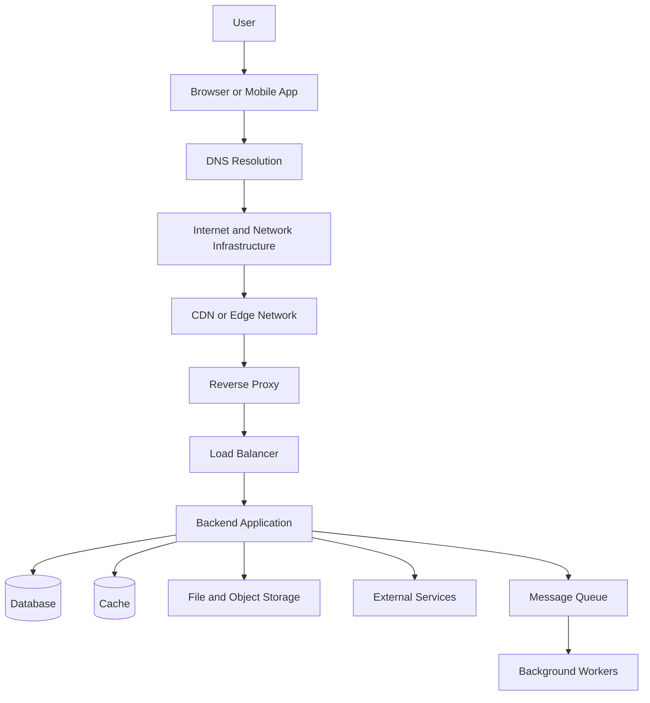

This series builds a mental model of how those pieces work together.

The goal is not simply to memorize definitions. The goal is to understand:

- Where code executes
- Which system owns which responsibility
- How machines find one another
- How data travels
- How browsers and servers communicate
- How APIs define boundaries
- How security is enforced
- How failures are diagnosed
- How applications become fast, reliable, and production-ready

---

# 1. The Series Goal

The goal of this series is to demystify the systems behind modern web applications before focusing heavily on frameworks or application code.

By the end, you should be able to trace an interaction such as:

```text
User clicks a button
  ↓
Browser runs frontend code
  ↓
Frontend creates an HTTP request
  ↓
DNS helps locate the destination
  ↓
Network infrastructure carries the request
  ↓
TLS protects the connection
  ↓
Backend validates and processes the request
  ↓
Backend reads or writes data
  ↓
External services may participate
  ↓
Server returns an HTTP response
  ↓
Browser interprets the response
  ↓
Frontend updates the interface
  ↓
Logs and metrics record what happened
```

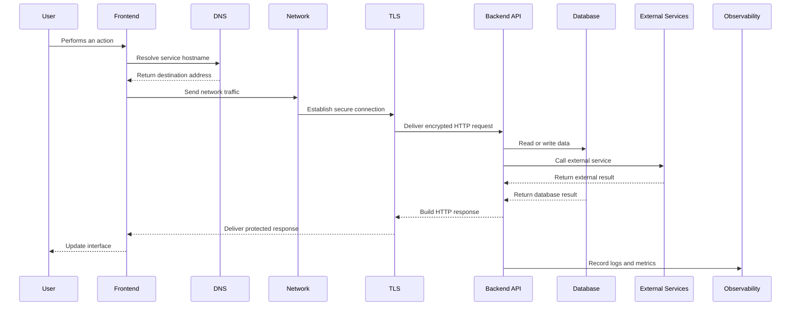

---

# 2. Why These Fundamentals Matter

Modern development often begins with tools and frameworks.

You may encounter:

- React
- Vue
- Angular
- Svelte
- Next.js
- Nuxt
- Node.js
- Django
- Laravel
- Rails
- Spring
- ASP.NET
- Express
- GraphQL
- REST clients
- Docker
- Kubernetes
- Cloud platforms
- Serverless functions
- Managed databases

These tools are useful, but they can hide the underlying mechanics.

For example, a framework may make it easy to write:

```javascript
fetch("/api/products");
```

But this simple line raises important questions:

- What is `/api/products`?
- Which server receives the request?
- What HTTP method is used?
- What headers are sent?
- Is authentication included?
- What does the server return?
- Where does the data come from?
- What happens when the request fails?
- How can the request be inspected?
- Is the response cached?
- Does the browser permit the request?
- Is the server in development, staging, or production?

Frameworks become easier to understand when you know what they are abstracting.

Without these fundamentals, developers may:

- Change frontend code when the backend is failing
- Debug the database when DNS is broken
- Treat every failure as a JavaScript problem
- Expose secrets in client-side code
- Trust client-side validation as a security boundary
- Misinterpret HTTP status codes
- Build inefficient APIs
- Ignore caching and network latency
- Deploy applications without monitoring or recovery plans

This series replaces guesswork with a layered mental model.

---

# 3. The Central Mental Model

A web application can be understood as a collection of layers.

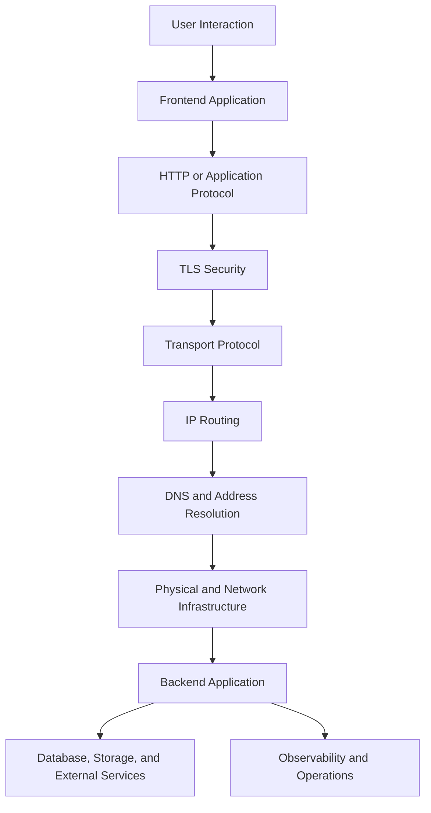

A simplified request path is:

```text
User
  ↓
Browser
  ↓
Frontend code
  ↓
DNS
  ↓
Network
  ↓
TLS
  ↓
HTTP
  ↓
Backend
  ↓
Database and services
```

A production response path may then include:

```text
Backend
  ↓
Validation
  ↓
Authentication
  ↓
Authorization
  ↓
Business logic
  ↓
Cache or database
  ↓
External providers
  ↓
Response
  ↓
Frontend state update
  ↓
User interface
```

The series introduces each layer gradually.

---

# 4. What You Will Learn

By the end of the complete series, you should understand the following areas.

## 4.1 Software architecture

You will learn:

- What frontend code does
- What backend code does
- Where databases fit
- Why browsers are untrusted clients
- How applications divide responsibilities
- How static sites, SPAs, SSR, and hybrid systems differ
- How modern full-stack frameworks combine runtimes
- How monoliths, microservices, serverless systems, and edge runtimes differ

## 4.2 Internet and networking

You will learn:

- The difference between the Internet and the Web
- How packets move through networks
- What IP addresses represent
- The difference between IPv4 and IPv6
- How private and public networks work
- What routers, switches, and ISPs do
- How data centers connect to the Internet
- Why latency and bandwidth are different
- How CDNs bring content closer to users

## 4.3 DNS and addressing

You will learn:

- What domain names are
- How domain names are structured
- How DNS resolution works
- The roles of recursive resolvers
- Root, TLD, and authoritative name servers
- DNS records such as `A`, `AAAA`, `CNAME`, `MX`, `TXT`, and `NS`
- DNS caching and TTL
- Forward and reverse DNS

## 4.4 HTTP and HTTPS

You will learn:

- How URLs are structured
- How HTTP requests are formed
- What methods such as `GET`, `POST`, `PUT`, `PATCH`, and `DELETE` mean
- How headers and bodies work
- How query and path parameters differ
- How status codes communicate results
- How cookies and tokens support sessions
- How HTTPS and TLS protect communication
- How certificates and certificate authorities work

## 4.5 APIs

You will learn:

- What APIs are
- What REST means
- How resources and representations work
- How CRUD maps to HTTP methods
- How to design endpoint paths
- How pagination, filtering, sorting, and searching work
- How GraphQL differs from REST
- How RPC and gRPC differ from resource-oriented APIs
- How JSON, XML, form data, and binary formats work
- How API contracts and versioning protect compatibility

## 4.6 Diagnostics

You will learn:

- How to use the browser Network panel
- How to inspect requests and responses
- How to interpret timing breakdowns
- How to recognize frontend, network, backend, and database failures
- How to use cURL
- How to use Postman or Bruno
- How to reproduce browser requests independently
- How to diagnose CORS, authentication, redirects, caching, and environment problems

## 4.7 Production engineering

The expanded series also covers:

- Web performance
- Browser rendering performance
- Image and JavaScript optimization
- Caching
- Database performance
- Timeouts and retries
- Circuit breakers
- Reliability and availability
- Backups and recovery
- Security fundamentals
- Secrets management
- Observability
- Logs, metrics, and traces
- CI/CD
- Containers
- Reverse proxies
- Load balancers
- Deployment strategies
- Incident response

---

# 5. The Updated Series Structure

The complete updated series is organized as follows.

---

# Part 0 — Introduction to the Series

## Purpose

Part 0 establishes the learning framework and explains why web fundamentals matter.

It introduces:

- The “black box” problem
- The layered model of web applications
- The client-server boundary
- The role of networks and protocols
- The importance of security and trust
- How the parts of the series fit together

Central model:

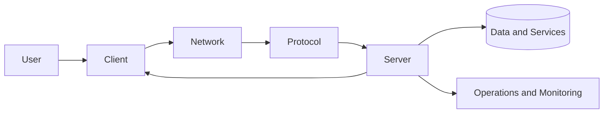

---

# Part 1 — Deconstructing Software Architecture

## Frontend, Backend, and the Evolution of the Stack

Part 1 examines where software runs and how responsibilities are divided.

It covers:

- Frontend code
- HTML, CSS, and JavaScript
- The browser as an execution environment
- Client-side state
- Backend responsibilities
- Authentication and authorization
- Business logic
- Database access
- File storage
- External services
- Frontend-backend contracts
- Static sites
- Server-rendered applications
- Single-page applications
- Static generation
- Hybrid rendering
- Full-stack frameworks
- Monoliths
- Microservices
- Serverless functions
- Edge computing
- Background jobs

The central question is:

> Which work belongs in the browser, and which work belongs on the server?

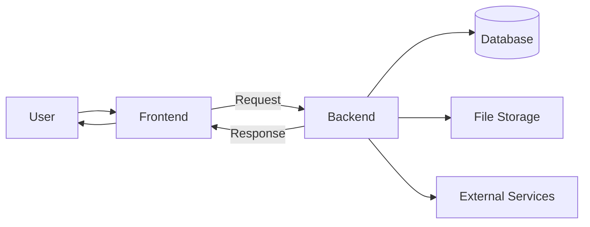

---

# Part 2 — How the Internet and the Web Work

## Data Highways, DNS Resolution, Addressing, and Client-Server Topology

Part 2 explains the infrastructure that connects clients and servers.

It covers:

- Internet vs. Web
- Packets
- Packet switching
- Network layers
- IPv4
- IPv6
- Public and private addresses
- NAT
- Ports
- Routers
- Switches
- ISPs
- Autonomous systems
- Routing
- Latency
- Bandwidth
- Jitter
- Packet loss
- Data centers
- Origin servers
- CDNs
- Load balancers
- Firewalls
- Private cloud networks
- DNS hierarchy
- Recursive resolvers
- Root servers
- TLD servers
- Authoritative name servers
- DNS records
- DNS caching and TTL

The central journey is:

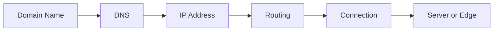

---

# Part 3 — HTTP, HTTPS, and the Request-Response Cycle

## The Language of the Web and Secure Transport

Part 3 explains how clients and servers communicate once a destination has been found.

It covers:

- Protocols
- HTTP versions
- HTTPS
- URLs
- Schemes
- Hosts
- Ports
- Paths
- Query strings
- Fragments
- URL encoding
- HTTP methods
- Request lines
- Request headers
- Request bodies
- Response status codes
- Response headers
- Response bodies
- Cookies
- Sessions
- Tokens
- Redirects
- Caching
- Compression
- Content negotiation
- TLS
- Symmetric encryption
- Asymmetric encryption
- Certificates
- Certificate authorities
- TLS handshakes
- CORS
- Mixed content
- HSTS

The request-response model is:

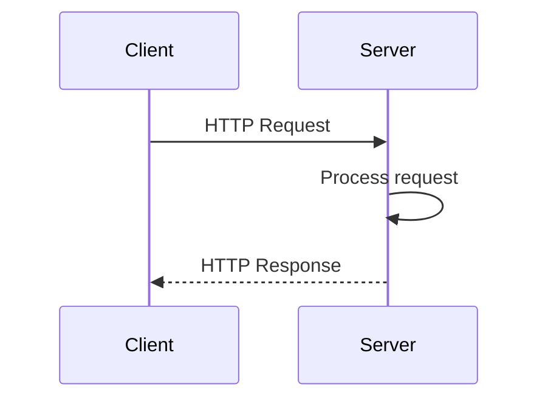

The secure version is:

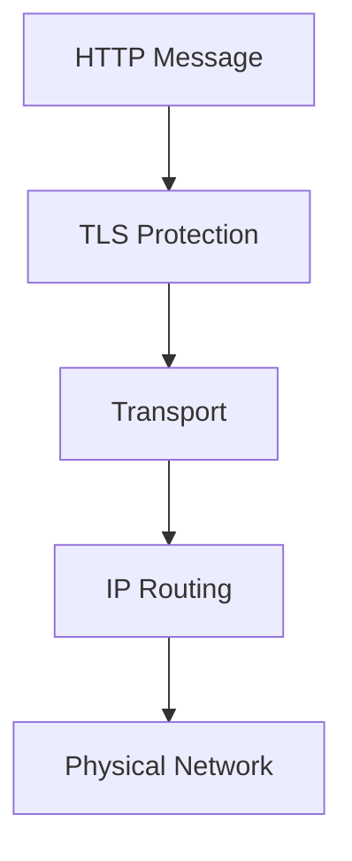

---

# Part 4 — RESTful Services and API Paradigms

## Resource Design, HTTP Semantics, Data Formats, and Service Contracts

Part 4 explains how application interfaces are designed.

It covers:

- What APIs are
- API consumers and providers
- REST
- Resources
- Representations
- Collections
- CRUD
- Resource-oriented URLs
- Path parameters
- Query parameters
- Nested resources
- Relationships
- Statelessness
- Idempotency
- Pagination
- Filtering
- Sorting
- Searching
- Field selection
- API errors
- Authentication
- Authorization
- Rate limiting
- API keys
- Versioning
- Backward compatibility
- GraphQL
- GraphQL schemas
- Queries
- Mutations
- RPC
- JSON-RPC
- gRPC
- JSON
- XML
- Form encoding
- Multipart form data
- Binary formats
- Schemas and contracts

The central API boundary is:

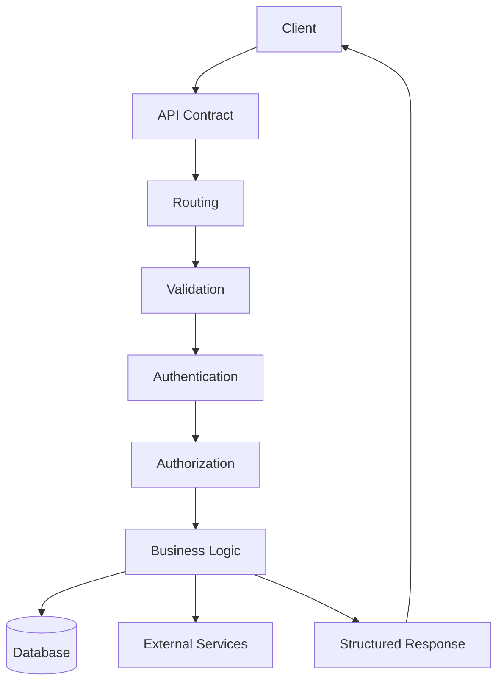

---

# Part 5 — Network Inspection and Diagnostic Workflows

## DevTools, API Clients, cURL, and Seeing Traffic in Real Time

Part 5 turns theory into practice.

It covers:

- Browser Developer Tools
- Console and Network panels
- Preserving logs
- Disabling cache
- Filtering requests
- Inspecting URLs
- Inspecting methods
- Inspecting headers
- Inspecting cookies
- Inspecting query parameters
- Inspecting request payloads
- Inspecting response bodies
- Inspecting status codes
- Inspecting timing information
- DNS timing
- TLS timing
- TTFB
- Waterfall charts
- Initiators
- cURL
- Postman
- Bruno
- Environments
- API collections
- API tests
- CORS diagnostics
- Redirect diagnostics
- Authentication debugging
- Environment mismatch debugging
- Service worker and cache problems
- Network throttling
- Offline testing

The main workflow is:

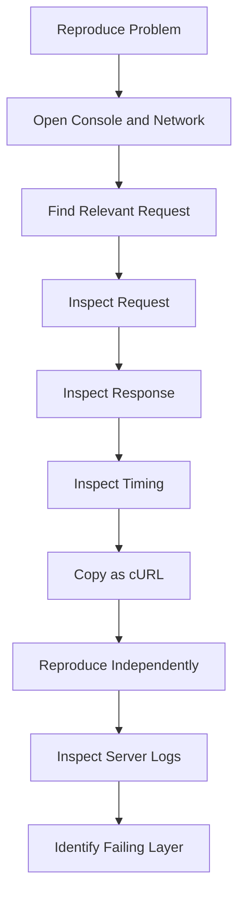

---

# Part 6 — Web Performance, Reliability, Security, and Production Delivery

## From “It Works” to “It Works Quickly, Safely, and Reliably”

Part 6 expands the series beyond local development and basic debugging.

It covers:

## Performance

- Perceived performance
- Critical rendering path
- HTML, CSS, and JavaScript costs
- Bundle optimization
- Code splitting
- Lazy loading
- Image optimization
- Compression
- Browser caching
- CDN caching
- Application caching
- Cache invalidation
- Database indexing
- N+1 queries
- Connection pooling
- Payload size
- API latency
- TTFB
- Performance budgets

## Reliability

- Availability
- Redundancy
- Failover
- Health checks
- Readiness checks
- Timeouts
- Retries
- Exponential backoff
- Circuit breakers
- Graceful degradation
- Queues
- Background workers
- Backups
- Restore testing
- RPO
- RTO
- Disaster recovery

## Security

- HTTPS
- Authentication
- Authorization
- Password security
- Secrets management
- Input validation
- SQL injection
- Cross-site scripting
- CSRF
- Access-control bugs
- Dependency security
- Secure cookies
- Least privilege
- Security logging

## Production delivery

- Development, testing, staging, and production
- CI/CD
- Build artifacts
- Containers
- Reverse proxies
- Load balancers
- Blue-green deployments
- Rolling deployments
- Database migrations
- Feature flags
- Rollbacks
- Incident response
- Error budgets

## Observability

- Structured logs
- Metrics
- Traces
- Request IDs
- Dashboards
- Alerts
- Performance monitoring
- Error monitoring

The production mental model is:

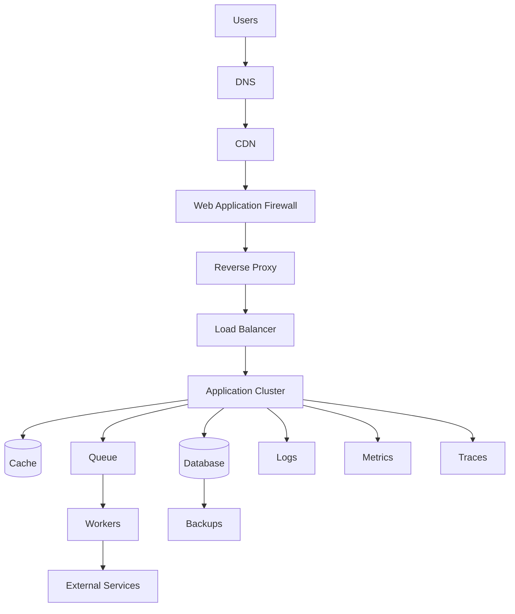

---

# 6. The Complete Web Application Lifecycle

The series now follows a web application across its complete lifecycle.

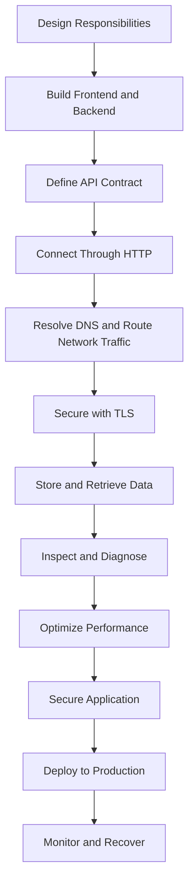

This is the larger picture:

```text
Architecture
  ↓
Implementation
  ↓
Communication
  ↓
Networking
  ↓
Security
  ↓
Diagnostics
  ↓
Performance
  ↓
Reliability
  ↓
Production operations
```

---

# 7. The Core Vocabulary

The following terms appear repeatedly throughout the series.

## Client

A program that initiates communication.

Examples:

- Browser
- Mobile app
- Desktop application
- Command-line client
- Another server

## Server

A program or computer that receives requests and provides services.

## Frontend

Software that runs close to the user and manages interface behavior.

## Backend

Software that runs in a controlled environment and manages protected application operations.

## Database

A system for storing and retrieving data.

## API

A defined interface through which software systems communicate.

## Protocol

Rules that define how systems communicate.

## HTTP

The primary application protocol used by the Web.

## HTTPS

HTTP protected by TLS.

## DNS

A distributed naming system that helps map domain names to network destinations.

## IP address

A numerical network address.

## Port

A number identifying a service on a networked system.

## URL

A structured address identifying a resource or service.

## Request

A message sent by a client.

## Response

A message sent by a server.

## Header

Metadata attached to a request or response.

## Body

The main data contained in a request or response.

## Resource

A thing represented or managed by an API.

## Endpoint

A network-accessible location that accepts requests.

## Cache

Stored data retained for faster reuse.

## Authentication

Verifying identity.

## Authorization

Determining permissions.

## Serialization

Converting in-memory data into transferable text or bytes.

## Latency

The delay involved in communication.

## Bandwidth

The amount of data that can be transferred over time.

## CDN

A distributed network that delivers content closer to users.

## Load balancer

A system that distributes traffic among multiple servers.

## Observability

The ability to understand system behavior through logs, metrics, and traces.

## Deployment

The process of making software available in an environment.

---

# 8. The Most Important Architectural Boundaries

Throughout the series, pay attention to boundaries.

## Browser and server boundary

```text
Browser code is observable and modifiable.
Server code is controlled by the application owner.
```

## HTTP boundary

```text
Requests and responses form an explicit communication contract.
```

## Network boundary

```text
Data may cross many networks and systems before reaching its destination.
```

## Security boundary

```text
Authentication and authorization must be enforced by trusted systems.
```

## Data boundary

```text
The database is not the same as the public API.
```

## Deployment boundary

```text
Development, staging, and production are different environments.
```

## Reliability boundary

```text
A dependency may fail independently of the main application.
```

These boundaries help answer:

- Who is responsible?
- What can be trusted?
- What can fail?
- What should be exposed?
- Where should validation happen?
- Which system is authoritative?

---

# 9. A Reliable Debugging Mental Model

When something fails, trace the request through layers.

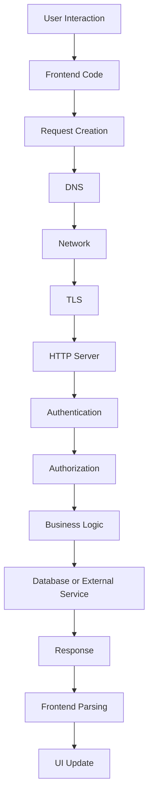

At each stage, ask:

```text
Did this stage happen?
What evidence confirms it?
What data entered the stage?
What result came out?
What could fail here?
```

This prevents random debugging.

---

# 10. Recommended Learning Approach

For each topic:

## First: Understand the purpose

Ask:

> What problem does this technology solve?

Examples:

- DNS solves name-to-destination lookup.
- HTTP structures client-server messages.
- TLS protects communication.
- APIs define software boundaries.
- CDNs reduce delivery distance.
- Caches reduce repeated work.
- Queues separate immediate requests from background processing.
- Observability reveals system behavior.

## Second: Learn the vocabulary

Understand the terms before memorizing detailed implementation.

## Third: Trace a complete example

Follow a request from user action to server response.

## Fourth: Inspect real behavior

Use:

- Browser Network panel
- cURL
- Postman
- Bruno
- Server logs

## Fifth: Explain it in your own words

If you can explain where a request went, what it contained, and why it succeeded or failed, you understand the concept.

---

# 11. The Running Example

Throughout the series, imagine an online store.

The user can:

- Browse products
- Search and filter
- Open product details
- Add items to a cart
- Log in
- Submit orders
- Pay
- Track delivery
- Receive notifications

A single checkout operation may involve:

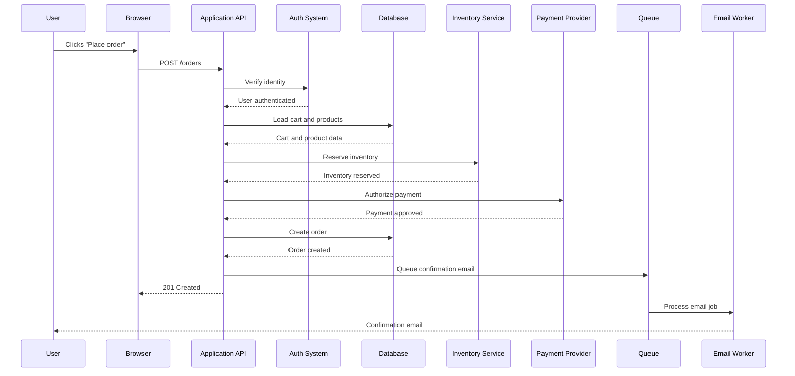

This one interaction demonstrates:

- Frontend behavior
- HTTP
- Authentication
- Authorization
- Database access
- External APIs
- Inventory consistency
- Payment processing
- Background jobs
- Reliability concerns
- Observability needs

---

# 12. Important Beginner Principles

## Principle 1: The browser is not trusted

Users can inspect and modify client-side code and requests.

## Principle 2: The server must enforce security

Frontend restrictions improve usability but do not provide authorization.

## Principle 3: A database is not an API

The backend should control access to important data and business logic.

## Principle 4: DNS is not the Web

DNS helps locate services; it does not deliver application content.

## Principle 5: HTTPS is not complete application security

HTTPS protects transport, not business logic or permissions.

## Principle 6: A successful HTTP response is not always business success

A `200` response may still contain an application-level failure.

## Principle 7: Network problems and application problems differ

A timeout is not the same as a `404`, and a `500` is not the same as a DNS failure.

## Principle 8: Caching improves speed but can create stale-data and privacy problems

Cache rules must be deliberate.

## Principle 9: Retries can duplicate operations

Use idempotency protections for payments, orders, and other important actions.

## Principle 10: Production systems need observability

If you cannot see what happened, diagnosing failures becomes guesswork.

---

# 13. What This Series Is Not

This series is not tied to one programming language or framework.

It does not assume that one technology is always best.

You may later implement these ideas using:

- JavaScript
- TypeScript
- Python
- Java
- Go
- C#
- PHP
- Ruby
- Rust
- Kotlin
- Swift

The underlying concepts remain relevant.

This series also does not attempt to replace specialized study in:

- Advanced networking
- Cryptography
- Database administration
- Operating systems
- Cloud architecture
- Security engineering
- Site reliability engineering
- Distributed systems theory

Instead, it provides a foundational map that makes those subjects easier to approach.

---

# 14. Updated Final Mental Model

A modern web application can be viewed as this chain:

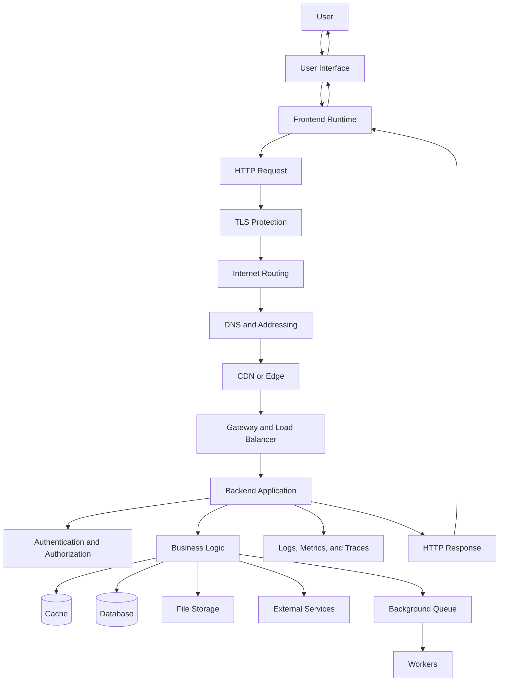

The full cycle is:

```text
The user initiates an action.
The frontend represents the action.
HTTP describes the request.
TLS protects it.
DNS and networks deliver it.
The backend authenticates and validates it.
Business logic determines what should happen.
Databases and services provide necessary data.
The backend returns a structured response.
The frontend interprets the result.
Observability records the operation.
Production systems optimize, protect, and recover the experience.
```

---

# Updated Part 0 Summary

This series explains how modern web applications work across their complete lifecycle:

```text
Architecture
→ Networking
→ HTTP
→ APIs
→ Diagnostics
→ Performance
→ Security
→ Reliability
→ Production delivery
```

The key idea is:

> The web is not magic. It is a collection of systems communicating through explicit protocols, boundaries, data formats, and operational processes.

You now have the roadmap for understanding:

- What runs in the browser
- What runs on servers
- How devices locate each other
- How requests travel
- How HTTP structures messages
- How APIs expose capabilities
- How authentication and authorization work
- How failures are diagnosed
- How applications become performant
- How production systems remain secure and reliable

The ultimate goal is not to memorize every technology.

It is to develop a dependable mental model that remains useful across languages, frameworks, hosting providers, databases, and architectures.
