# Web Mechanics, Architecture & Network Fundamentals

# Part 1 — Deconstructing Software Architecture  
## Frontend, Backend, and the Evolution of the Stack

---

## Part 1 Overview

Before learning how to build web applications, it is important to understand **where different parts of an application run**, **what responsibilities they have**, and **how they communicate**.

When you visit a modern website, you may see a single polished interface. It might feel like one unified program. Internally, however, it is usually a collection of different systems:

- Code running inside your browser
- Servers running in a data center or cloud environment
- Databases storing information
- File storage systems holding images and documents
- Authentication services managing identity
- Payment providers processing transactions
- APIs connecting different components
- Caches and CDNs distributing content
- Monitoring systems detecting failures

A useful high-level picture is:

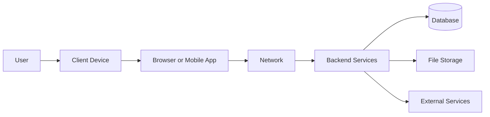

This part focuses on the most important architectural boundary:

```text
Frontend / Client Side  ↔  Backend / Server Side
```

You will learn:

- What frontend code is
- What backend code is
- How a browser executes client-side software
- Why frontend code is untrusted
- What servers are responsible for
- How databases and external services fit into the picture
- How frontend and backend systems communicate
- What an API contract is
- How application state is divided
- How static sites, server-rendered applications, SPAs, and hybrid applications differ
- How modern full-stack frameworks blur traditional boundaries
- How to reason about architecture without becoming dependent on one framework

---

# 1. What Does “Architecture” Mean?

The word **architecture** can sound intimidating, but the basic idea is simple.

Software architecture is the arrangement of:

- Components
- Responsibilities
- Communication paths
- Data storage
- Security boundaries
- Deployment environments
- Operational processes

In other words, architecture describes:

> Which parts exist, what each part does, where each part runs, and how the parts interact.

For example, imagine an online bookstore.

It might contain:

```text
User interface
Product catalog
Shopping cart
User accounts
Order processing
Payment processing
Inventory management
Email notifications
Database
Image storage
Search system
```

These responsibilities could be implemented as:

- One application
- Two applications
- Several services
- Dozens of specialized services

Architecture is the set of decisions that determines how those responsibilities are organized.

---

# 2. A Web Application Is a Distributed System

A **distributed system** is a system whose work is performed by multiple computers or processes that communicate over a network.

Most modern web applications are distributed systems.

Even a small website might involve:

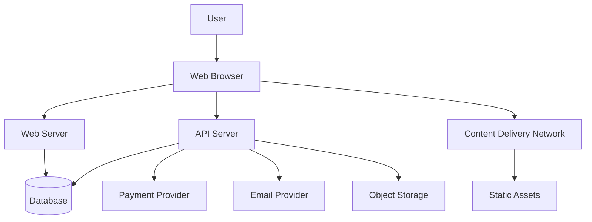

The browser, web server, API server, database, payment provider, email service, storage system, and CDN may all be separate processes or systems.

The user may see one page, but many components may participate in producing it.

This is why a web application can fail in many different ways:

- The browser may contain a JavaScript error.
- The API may be unavailable.
- The database may be slow.
- The payment provider may reject a request.
- The CDN may fail to deliver an image.
- Authentication may expire.
- A server may return malformed data.
- A deployment may contain incompatible frontend and backend versions.

Understanding architecture helps you identify which component is responsible for each operation.

---

# 3. The Simplified Frontend-Backend Model

The most common introductory model is:

```text
Frontend = What the user interacts with
Backend = What supports the application behind the scenes
```

This is useful, but incomplete.

A more precise model is:

## Frontend

The frontend is software that runs close to the user, often in:

- A web browser
- A mobile application
- A desktop application
- A smart device

The frontend commonly handles:

- User interface rendering
- User input
- Navigation
- Client-side state
- Temporary interaction logic
- Requests to backend services
- Displaying server responses

## Backend

The backend is software that runs in a controlled server environment.

The backend commonly handles:

- Business rules
- Authentication
- Authorization
- Database access
- Sensitive operations
- Data validation
- File processing
- Communication with third-party services
- Background jobs
- Logging and monitoring

A basic interaction looks like this:

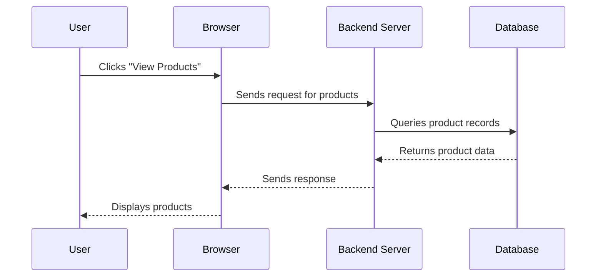

This diagram shows an important concept:

> The frontend usually does not directly access the backend’s database.

Instead:

```text
Frontend → Backend → Database
```

The backend acts as a controlled intermediary.

---

# 4. The Frontend: Code Running Near the User

The frontend is the part of an application that runs in the client environment.

For web applications, that client environment is usually the browser.

A browser can:

- Download files
- Interpret HTML
- Apply CSS
- Execute JavaScript
- Send network requests
- Store certain data locally
- Display media
- Respond to user events

The frontend is therefore not just “the design.”

It includes the software responsible for making the interface function.

---

## 4.1 The Main Frontend Technologies

Traditional frontend development relies on three core technologies.

### HTML

HTML describes the structure and meaning of the page.

Example:

```html
<h1>Product Catalog</h1>

<button>Add to cart</button>

<ul>
  <li>Keyboard</li>
  <li>Mouse</li>
</ul>
```

HTML answers:

> What elements exist?

Examples include:

- Headings
- Paragraphs
- Links
- Forms
- Buttons
- Tables
- Images
- Lists

---

### CSS

CSS controls presentation and layout.

Example:

```css
button {
  background-color: blue;
  color: white;
  padding: 0.75rem 1rem;
  border-radius: 0.5rem;
}
```

CSS answers:

> How should the elements look and be positioned?

CSS controls:

- Colors
- Fonts
- Spacing
- Sizing
- Alignment
- Responsive layouts
- Animations
- Visibility
- Grid and flexbox behavior

---

### JavaScript

JavaScript adds behavior and logic.

Example:

```javascript
const button = document.querySelector("button");

button.addEventListener("click", () => {
  console.log("The button was clicked");
});
```

JavaScript answers:

> What should happen when the user interacts with the page?

It can:

- Respond to clicks
- Validate form inputs
- Change page content
- Open dialogs
- Send API requests
- Update application state
- Display loading indicators
- Handle errors
- Control animations

---

## 4.2 The Browser as an Execution Environment

A browser is not merely a document viewer.

It is a runtime environment capable of executing software.

A simplified browser workflow is:

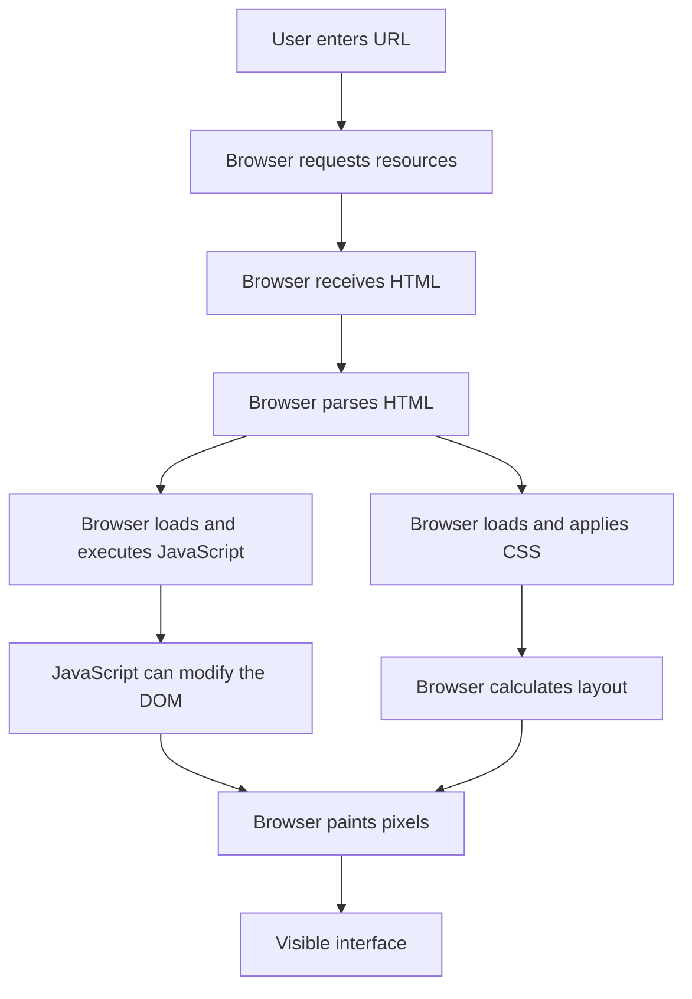

The browser typically performs several major tasks:

1. Fetches resources
2. Parses HTML
3. Builds a document structure
4. Loads stylesheets
5. Calculates layout
6. Executes JavaScript
7. Responds to events
8. Paints visual output
9. Updates the display when state changes

---

## 4.3 The DOM

The browser converts HTML into an in-memory structure called the **DOM**, or Document Object Model.

Given this HTML:

```html
<h1>Welcome</h1>
<p>This is a page.</p>
```

The browser builds a tree-like representation:

```text
Document
├── h1
│   └── "Welcome"
└── p
    └── "This is a page."
```

JavaScript can inspect and modify this structure.

```javascript
const heading = document.querySelector("h1");
heading.textContent = "Hello, visitor!";
```

The browser then updates the visible page.

Modern frontend frameworks often manage this process for developers, but the underlying browser model still exists.

---

# 5. Responsibilities of the Frontend

The frontend can be responsible for many things.

## 5.1 Rendering the user interface

Rendering means turning application data into visible output.

For example:

```text
Product data:
{
  name: "Mechanical Keyboard",
  price: 79.99
}
```

May become:

```text
Mechanical Keyboard
$79.99
[Add to cart]
```

The frontend decides how that information is visually presented.

---

## 5.2 Handling user interaction

The frontend listens for events such as:

- Clicks
- Taps
- Keyboard input
- Form submissions
- Mouse movement
- Dragging
- Scrolling
- Window resizing
- File selection

Example:

```javascript
form.addEventListener("submit", (event) => {
  event.preventDefault();
  // Process the form
});
```

The frontend can immediately respond to the user without waiting for a server.

For example:

- Open a dropdown
- Highlight a selected item
- Display a character count
- Show a modal dialog
- Toggle dark mode
- Preview an image

---

## 5.3 Managing interface state

Frontend state is information needed to display the current interface.

Examples:

```text
isMenuOpen = true
selectedTab = "reviews"
isLoading = false
searchText = "keyboard"
currentPage = 2
```

This state may exist only temporarily in the browser.

For example, when a user opens a menu, the browser may store:

```javascript
const state = {
  menuOpen: true
};
```

That state does not necessarily need to be sent to the server.

---

## 5.4 Performing immediate validation

The frontend can validate input before sending it.

Example:

```javascript
if (password.length < 8) {
  showError("Password must be at least 8 characters.");
}
```

This is helpful because it:

- Gives the user fast feedback
- Reduces unnecessary requests
- Improves usability
- Makes forms easier to complete

However, frontend validation is not a security boundary.

A user can bypass it by:

- Disabling JavaScript
- Modifying the page
- Sending a custom request
- Using cURL
- Using a different application
- Editing browser state

Therefore, the backend must validate the same information independently.

---

## 5.5 Requesting data from backend systems

The frontend often communicates with the backend using HTTP requests.

Example:

```javascript
fetch("/api/products")
  .then((response) => response.json())
  .then((products) => {
    console.log(products);
  });
```

The frontend may request:

- User profile data
- Product lists
- Search results
- Notifications
- Messages
- Orders
- Recommendations
- Reports

---

## 5.6 Displaying loading and error states

Network requests are not instantaneous.

A good frontend represents different states clearly:

```text
Idle
Loading
Success
Empty
Error
```

For example:

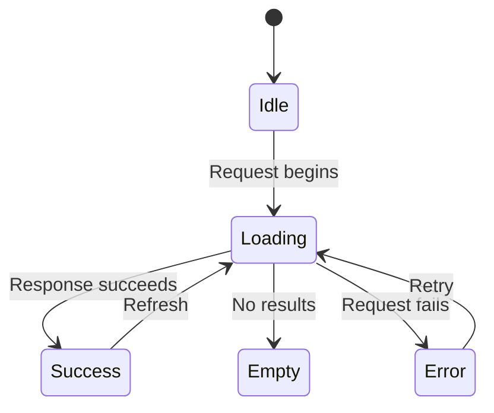

A page should not simply appear frozen while waiting for a response.

It may show:

```text
Loading products...
```

If the request fails:

```text
Unable to load products.
[Try again]
```

This is frontend responsibility, even though the cause of the error may be backend or network-related.

---

# 6. What the Frontend Should Not Be Trusted to Enforce

The frontend is controlled by the user’s device.

Even if a normal user only sees a polished interface, technically capable users can inspect and manipulate it.

They may:

- Read downloaded JavaScript
- Change values in forms
- Modify browser storage
- Alter API requests
- Replay requests
- Send requests without the interface
- Change hidden fields
- Remove disabled attributes
- Call backend endpoints directly

Therefore, the following must not rely only on frontend restrictions:

- Permission checks
- Price calculations
- Role enforcement
- Ownership verification
- Access to private records
- Inventory validation
- Payment confirmation
- Account deletion authorization

For example, hiding an administrative button is not enough:

```javascript
if (user.role === "admin") {
  showDeleteButton();
}
```

The server must still verify the role:

```text
Request: DELETE /api/users/123
User role: regular_user
Result: 403 Forbidden
```

The correct security model is:

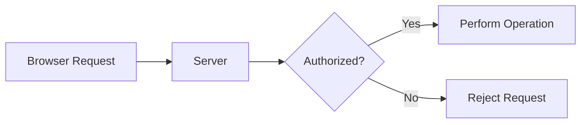

The browser can improve the user experience, but the server must enforce the rules.

---

# 7. The Backend: The Controlled Execution Environment

The backend is the server-side portion of an application.

It runs in an environment controlled by the application owner or hosting provider.

Backend software may run on:

- Physical servers
- Virtual machines
- Containers
- Serverless functions
- Managed application platforms
- Private data centers
- Cloud infrastructure

The backend receives requests and performs operations that should not be entrusted to the client.

A basic backend flow looks like this:

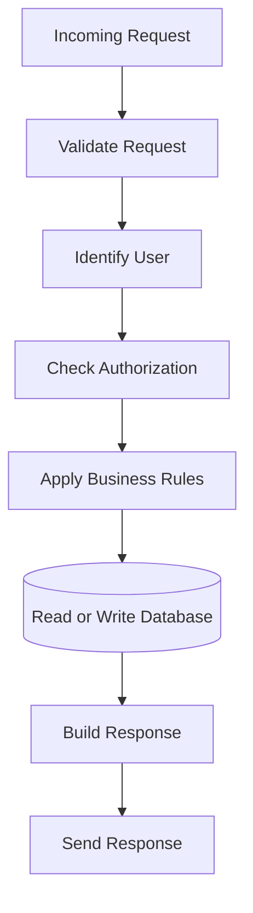

Depending on the application, the backend may also communicate with:

- Payment providers
- Email systems
- File storage
- Search engines
- Analytics systems
- Message queues
- Other internal services

---

# 8. Responsibilities of the Backend

## 8.1 Routing requests

The backend needs to determine what code should handle a request.

For example:

```text
GET /products
GET /products/123
POST /orders
DELETE /users/123
```

These paths are mapped to different operations.

A routing table might conceptually look like this:

| Method | Path | Responsibility |
|---|---|---|
| `GET` | `/products` | List products |
| `GET` | `/products/:id` | Retrieve one product |
| `POST` | `/orders` | Create an order |
| `GET` | `/orders/:id` | Retrieve an order |
| `DELETE` | `/orders/:id` | Cancel an order |

Routing answers:

> Which backend operation should run for this request?

---

## 8.2 Validating input

The backend must never assume that input is valid merely because it came from a frontend.

Suppose the frontend sends:

```json
{
  "quantity": 2
}
```

The backend should verify:

- Is `quantity` present?
- Is it a number?
- Is it an integer?
- Is it greater than zero?
- Is it within an allowed limit?
- Is the product available?
- Is the user allowed to modify the cart?

Validation protects:

- Data quality
- Application correctness
- Security
- Database integrity
- Business rules

---

## 8.3 Applying business logic

Business logic describes what the application is supposed to do.

Examples:

- A discount applies only to certain products.
- A user can cancel an order only before shipment.
- A subscription can be upgraded but not downgraded during a billing period.
- A customer cannot buy more items than are in stock.
- An employee can access only records belonging to their department.
- A payment must be confirmed before an order becomes paid.

Business logic should generally be enforced on the backend because the backend is the authoritative environment.

---

## 8.4 Authentication

Authentication determines who a user is.

A backend may authenticate users using:

- Passwords
- Sessions
- Cookies
- Access tokens
- Passkeys
- OAuth providers
- One-time codes
- Hardware security keys

A simplified login process:

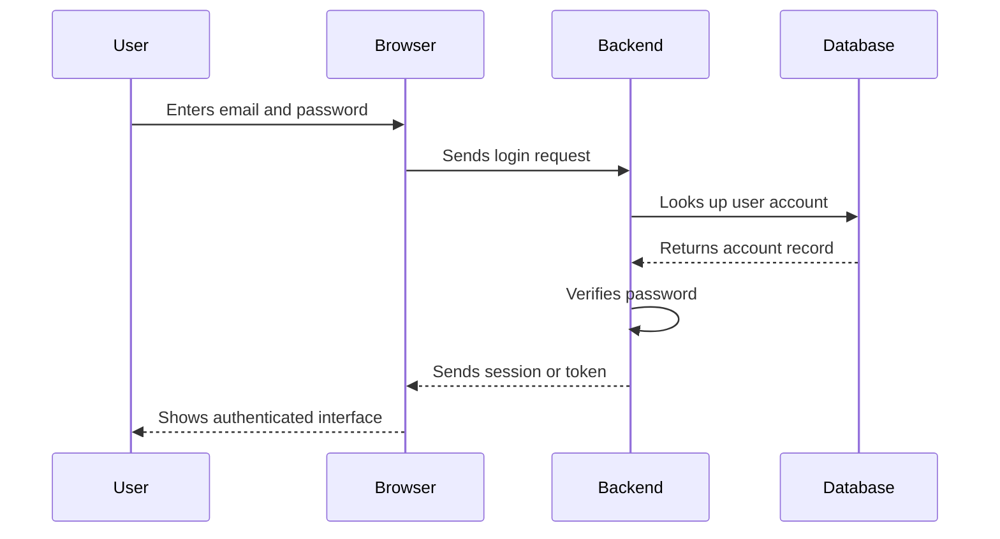

The backend should not store ordinary passwords in plain text.

Instead, passwords should be securely hashed using an appropriate password-hashing algorithm.

The browser should also not be trusted to declare:

```json
{
  "userId": 123,
  "role": "admin"
}
```

The server must determine identity and permissions using trusted mechanisms.

---

## 8.5 Authorization

Authorization determines what an authenticated user may do.

Example:

```text
User A owns order 1001.
User B requests order 1001.
Server rejects User B.
```

A common authorization check is:

```text
Is this user allowed to access this specific resource?
```

Authorization may depend on:

- User identity
- User role
- Organization membership
- Resource ownership
- Subscription level
- Geographic restrictions
- Account status
- Request context

Authentication and authorization are related but different.

```text
Authentication: Who are you?
Authorization: What are you allowed to do?
```

---

## 8.6 Reading and writing databases

The backend often acts as the only layer allowed to communicate directly with a private database.

For example:

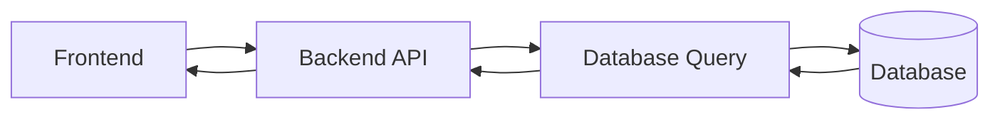

The backend may:

- Query users
- Retrieve products
- Create orders
- Update inventory
- Store messages
- Delete records
- Search documents
- Aggregate reports

The database should not usually be exposed directly to arbitrary browser clients because that could allow users to:

- Read private data
- Modify records
- Delete tables
- Bypass business rules
- Discover sensitive schema details

The backend creates a controlled interface around the database.

---

## 8.7 Managing files

Applications often need to handle:

- Profile images
- Product photos
- Videos
- Documents
- Audio files
- Generated reports
- Backups

The backend may coordinate file uploads and downloads.

A typical upload flow:

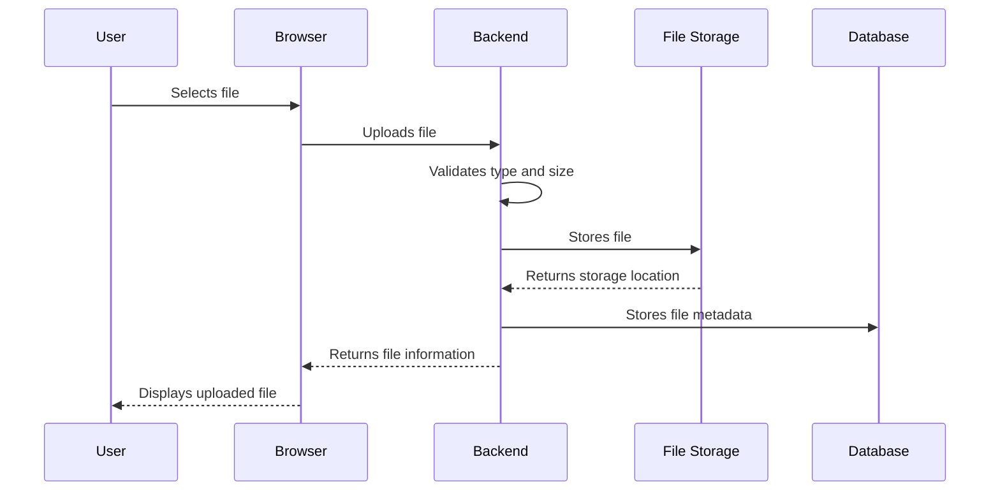

The backend may verify:

- File type
- File size
- File name
- File contents
- User permissions
- Storage limits
- Malware risks
- Image dimensions

---

## 8.8 Communicating with third-party services

Many applications depend on outside systems.

Examples include:

- Payment providers
- Maps
- Translation APIs
- Email services
- SMS providers
- Shipping systems
- Social login providers
- Search services
- Analytics platforms

A backend is usually the appropriate place to communicate with these services because it can protect credentials.

Example:

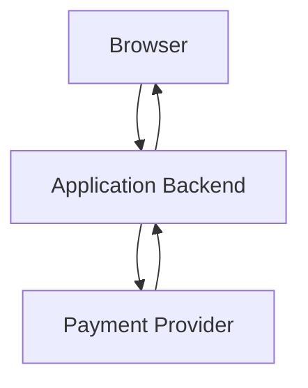

The browser may initiate the payment process, but sensitive provider credentials should not be embedded in frontend code.

---

# 9. The Database Is Not the Backend

Beginners sometimes treat the words “backend” and “database” as interchangeable.

They are not the same.

## Database

A database primarily stores and retrieves data.

Examples:

- PostgreSQL
- MySQL
- MariaDB
- SQLite
- MongoDB
- Redis
- DynamoDB

## Backend

The backend executes application logic and coordinates operations.

It may:

- Validate requests
- Check authentication
- Apply business rules
- Query databases
- Call external APIs
- Format responses
- Schedule background work

A simplified architecture is:

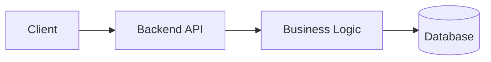

The database answers questions such as:

```text
Which products exist?
Which user owns this order?
What is the current inventory count?
```

The backend answers questions such as:

```text
Is this user allowed to view the order?
Should this discount apply?
Is this operation valid?
What response should be returned?
```

---

# 10. The Database Should Not Be Exposed Directly

A direct browser-to-database connection is usually dangerous.

Consider this structure:

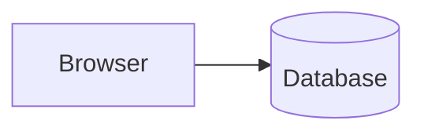

It raises serious problems:

- How are credentials protected?
- How are permissions enforced?
- How are queries validated?
- How are users prevented from reading other users’ data?
- How are business rules applied?
- How are database errors hidden?
- How are dangerous operations blocked?

A safer traditional pattern is:

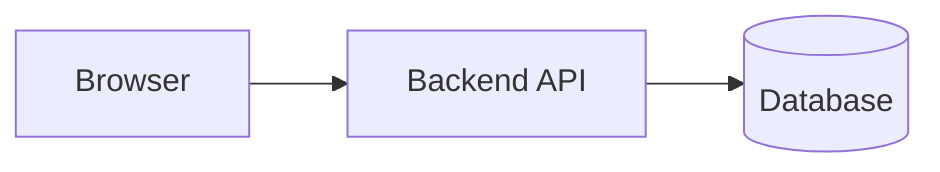

The backend acts as a security and business-logic boundary.

Some modern platforms provide controlled browser access to backend-managed services, but even then, access policies and server-side rules remain essential.

---

# 11. The Frontend-Backend Contract

The frontend and backend need an agreement describing how they communicate.

This agreement is often called an:

- API contract
- Interface contract
- Service contract
- Protocol contract

An API contract may specify:

- Endpoint paths
- HTTP methods
- Required parameters
- Request body format
- Authentication requirements
- Response format
- Error format
- Status codes
- Pagination behavior
- Rate limits
- Versioning rules

For example:

```text
Endpoint: GET /api/products
Authentication: Not required
Query parameters:
  category: optional string
  page: optional integer
  limit: optional integer
```

Successful response:

```json
{
  "items": [
    {
      "id": 101,
      "name": "Keyboard",
      "price": 79.99
    }
  ],
  "page": 1,
  "limit": 20,
  "total": 1
}
```

Possible error:

```json
{
  "error": {
    "code": "INVALID_PAGE",
    "message": "Page must be a positive integer."
  }
}
```

The frontend uses the contract to know what to send and how to interpret the response.

The backend uses the contract to expose predictable behavior.

---

# 12. A Complete Request Example

Imagine a user clicks:

```text
Add to cart
```

A full interaction might look like this:

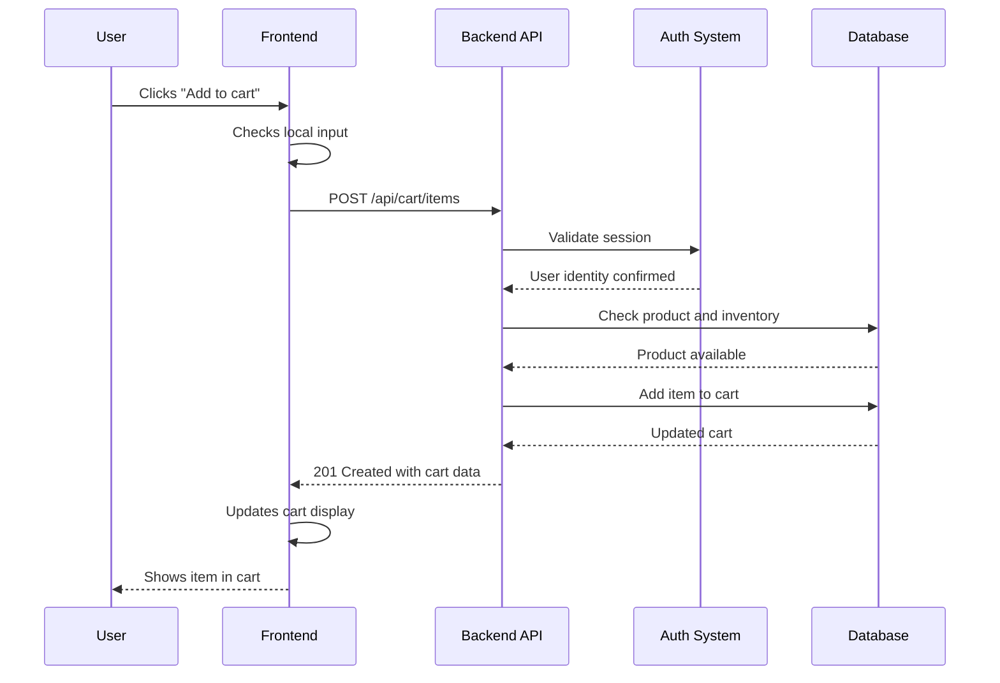

The visible action is simple, but several responsibilities are involved:

### Frontend

- Detect the click
- Identify the selected product
- Send the request
- Show loading state
- Display success or error

### Backend

- Authenticate the user
- Validate the product ID
- Check inventory
- Apply cart rules
- Store the cart item
- Return a response

### Database

- Store cart information
- Store product data
- Store inventory information

This separation is the foundation of most web applications.

---

# 13. Client-Side State vs Server-Side State

State is one of the most important architectural concepts.

## 13.1 Client-side state

Client-side state exists in the browser or client application.

Examples:

- Current input value
- Open menu
- Selected tab
- Current scroll position
- Temporary form data
- Whether a notification is visible
- Current loading status

Example:

```javascript
const uiState = {
  selectedTab: "reviews",
  menuOpen: false,
  isLoading: false
};
```

This state is often temporary.

If the browser tab is closed, it may disappear.

---

## 13.2 Server-side state

Server-side state exists in systems controlled by the application.

Examples:

- User account
- Order status
- Product price
- Inventory count
- Subscription plan
- Payment status
- Organization membership
- Stored messages

The server should be authoritative for important data.

For example:

```text
The browser may display:
  Product price: $79.99

The server must determine:
  Is the current price really $79.99?
```

A malicious user could modify the browser display. The server must calculate or verify the final price.

---

## 13.3 Shared state

Some information is represented on both sides.

For example, a shopping cart may exist:

- In frontend memory for immediate display
- In server storage for persistence
- In a database for long-term storage

This creates synchronization questions:

- Which version is correct?
- What happens if two tabs modify the cart?
- What happens if the request fails?
- What happens if the user loses connectivity?
- When should the browser refresh the data?

A reliable application defines which system is authoritative.

---

# 14. Source of Truth

A **source of truth** is the system whose value should be considered authoritative.

For an online store:

| Information | Likely source of truth |
|---|---|
| Current product price | Backend/database |
| Whether user is authorized | Backend/auth system |
| Current open menu | Browser |
| Current typing in a form | Browser |
| Inventory count | Backend/database |
| Payment completion | Payment provider/backend |
| Whether a modal is visible | Browser |
| Order status | Backend/database |

The browser may temporarily display a value, but display does not automatically make that value authoritative.

A useful principle is:

> The system closest to the data’s authority should make the final decision.

---

# 15. The Request-Response Boundary

The boundary between frontend and backend is often called a **trust boundary** or **application boundary**.

When the frontend sends a request, the backend should assume:

- The request may be malformed
- The request may be manually created
- The request may be replayed
- The request may contain unauthorized values
- The user may be attempting to bypass the interface

A backend should not think:

> The browser would never send that.

It should think:

> Any client may send anything. What should this server accept?

This leads to defensive backend design:

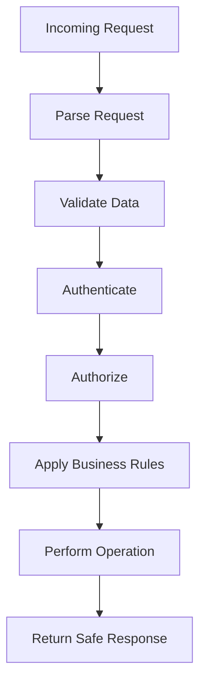

---

# 16. Static Websites

A static website is built from files that can be served directly.

Typical files include:

```text
index.html
about.html
styles.css
script.js
logo.png
```

The server may simply return these files when requested.

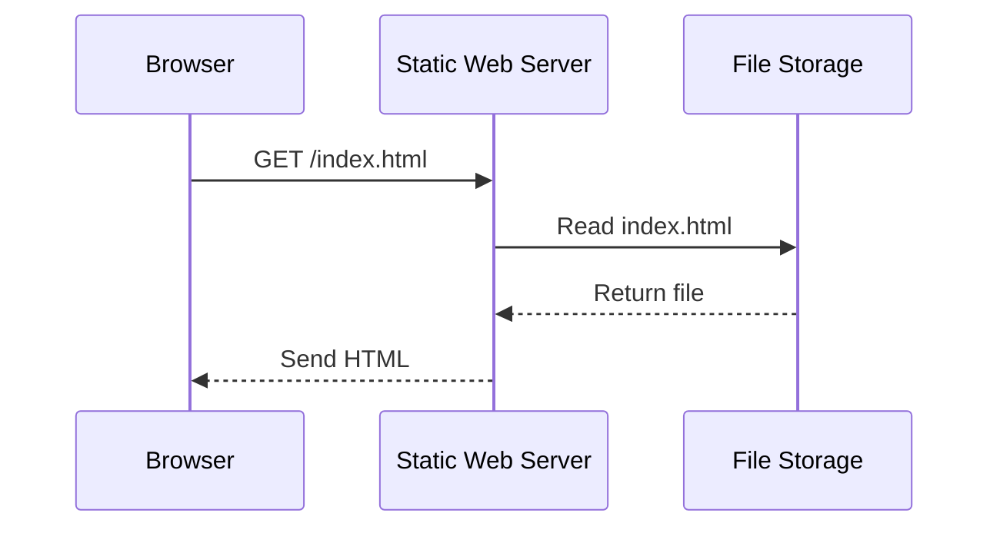

---

## 16.1 Advantages of static sites

Static sites are often:

- Simple
- Fast
- Easy to cache
- Cheap to host
- Highly reliable
- Easy to distribute through CDNs
- Less exposed to server-side vulnerabilities

They are useful for:

- Documentation
- Personal portfolios
- Marketing pages
- Landing pages
- Blogs
- Product brochures
- Informational websites

---

## 16.2 Limitations of static sites

A purely static site does not naturally perform dynamic operations such as:

- User-specific dashboards
- Private data retrieval
- Real-time messaging
- Order creation
- Personalized recommendations
- Server-side permissions

These features can still be added using external APIs or serverless functions, but the architecture becomes more dynamic.

---

## 16.3 Static does not mean non-interactive

A static website can still contain JavaScript.

For example:

- A calculator
- A slideshow
- A search filter
- A theme switcher
- A form that calls an API

The word “static” generally describes how the main content is delivered, not whether the page can respond to interaction.

---

# 17. Traditional Server-Rendered Applications

In a server-rendered application, the server generates HTML for a request.

Suppose the browser requests:

```text
GET /products
```

The server may:

1. Receive the request
2. Query the database
3. Load product records
4. Insert those records into an HTML template
5. Send the generated HTML to the browser

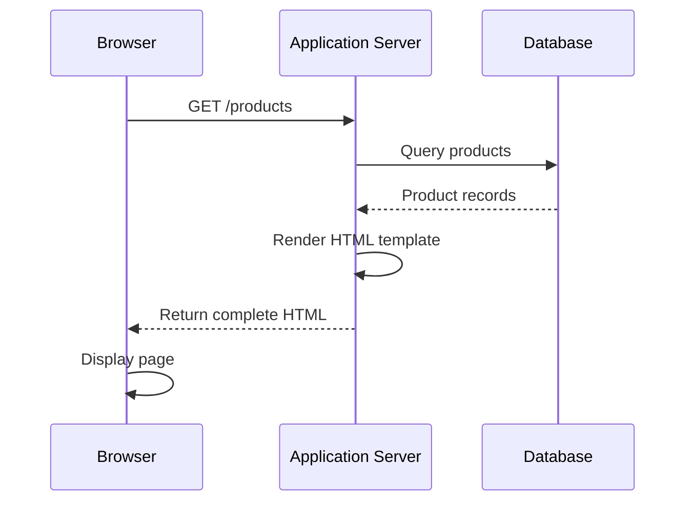

---

## 17.1 Example server-rendered output

The server may generate:

```html
<h1>Products</h1>

<ul>
  <li>Keyboard - $79.99</li>
  <li>Mouse - $29.99</li>
</ul>
```

The browser receives the final HTML.

---

## 17.2 Advantages of server rendering

Server rendering can provide:

- Useful content immediately
- Good initial loading performance
- Strong search engine visibility
- Less client-side JavaScript
- Centralized access to backend data
- Straightforward page-based navigation

---

## 17.3 Limitations of server rendering

Traditional server-rendered applications may:

- Reload the whole page during navigation
- Require more server work per request
- Feel less interactive without additional JavaScript
- Need careful handling of form submissions
- Have more coupling between templates and backend code

These tradeoffs depend on the application and implementation.

---

# 18. Single-Page Applications

A **Single-Page Application**, or SPA, usually loads one main application shell and then uses JavaScript to update the interface dynamically.

A typical SPA sequence:

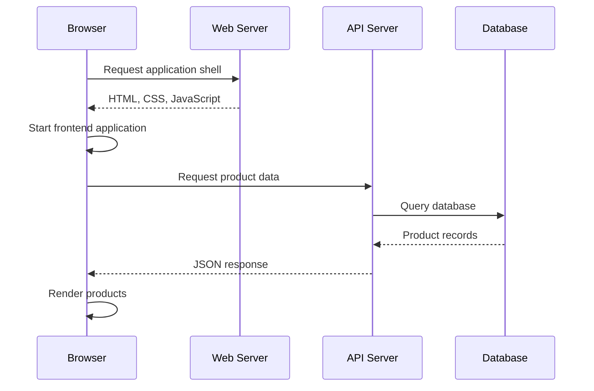

The browser may remain on the same document while JavaScript changes:

- The displayed route
- The visible components
- The data
- The forms
- The navigation state

---

## 18.1 Why SPAs became popular

SPAs can provide:

- Smooth navigation
- Rich interactions
- Fewer full-page reloads
- App-like experiences
- Reusable UI components
- Client-side routing
- Dynamic data updates

They are common for:

- Dashboards
- Email applications
- Project management tools
- Social platforms
- Online editors
- Administrative systems

---

## 18.2 SPA tradeoffs

SPAs also introduce complexity:

- More JavaScript
- More client-side state
- Longer initial execution
- More complicated routing
- More network request coordination
- Potentially weaker initial content rendering
- Greater exposure to frontend bugs
- Need for careful API design

A SPA does not eliminate the backend. It usually increases the importance of a well-designed API.

---

# 19. Client-Side Rendering

Client-side rendering, or CSR, means that much of the interface is generated in the browser using JavaScript.

A simplified flow:

```text
1. Browser downloads an application shell.
2. JavaScript starts.
3. JavaScript requests data.
4. JavaScript creates interface elements.
5. Browser displays the result.
```

Example:

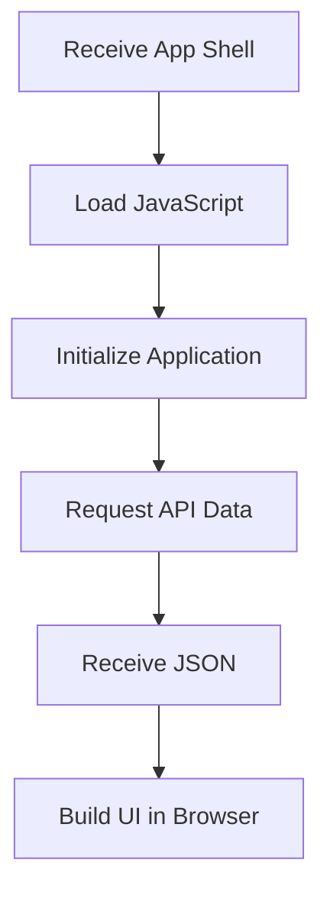

CSR is not necessarily better or worse than server rendering.

It is a tradeoff.

---

# 20. Server-Side Rendering

**Server-side rendering**, or **SSR**, means that the server generates HTML before sending it to the browser.

A simplified SSR flow looks like this:

```mermaid
sequenceDiagram
    participant U as User
    participant B as Browser
    participant S as Application Server
    participant D as Database

    U->>B: Requests a page
    B->>S: GET /products
    S->>D: Retrieves product data
    D-->>S: Returns product records
    S->>S: Generates HTML
    S-->>B: Sends completed HTML
    B->>B: Displays page
```

The browser receives HTML that already contains the initial page content.

For example, instead of receiving an empty container:

```html
<div id="app"></div>
```

the browser may receive:

```html
<div id="app">
  <h1>Products</h1>

  <article>
    <h2>Mechanical Keyboard</h2>
    <p>$79.99</p>
  </article>
</div>
```

The server has already inserted the product data into the HTML.

---

## 20.1 SSR and JavaScript Interactivity

Server-side rendering does not mean that JavaScript is completely absent.

A page may be:

1. Rendered initially on the server
2. Sent to the browser as HTML
3. Enhanced with JavaScript afterward

For example:

```text
Server:
  Generates product page HTML

Browser:
  Displays product page quickly

JavaScript:
  Activates filters, buttons, carts, and interactive controls
```

The process of attaching client-side behavior to server-generated HTML is often called **hydration**.

---

## 20.2 What Is Hydration?

Hydration is the process in which client-side JavaScript connects behavior to HTML that already exists.

Imagine the server sends:

```html
<button>Buy now</button>
```

The user can see the button immediately, but the button may not yet have client-side behavior attached.

After JavaScript loads, the application may attach an event handler:

```javascript
button.addEventListener("click", addProductToCart);
```

The page has now become interactive.

A simplified hydration flow:

```mermaid
flowchart TD
    A[Server generates HTML] --> B[Browser displays HTML]
    B --> C[Browser downloads JavaScript]
    C --> D[JavaScript initializes]
    D --> E[Event handlers attach]
    E --> F[Page becomes interactive]
```

---

## 20.3 SSR Advantages

SSR can provide:

- Faster display of meaningful content
- Better search engine discoverability
- Better support for users with limited JavaScript
- Useful HTML before client code finishes loading
- Centralized data fetching for the initial page
- Improved social media previews in many cases

SSR is particularly useful for:

- News websites
- Documentation
- Blogs
- Product pages
- Public marketing pages
- Search-oriented content
- Content-heavy applications

---

## 20.4 SSR Tradeoffs

SSR also has costs:

- The server must generate HTML for requests
- Database queries may happen during page generation
- Server response time affects the initial page
- Caching becomes important
- Hydration can still require substantial JavaScript
- Server and client rendering must remain consistent
- Debugging can involve both environments

A server-rendered page is not automatically faster in every situation.

Performance depends on:

- Server location
- Database speed
- Caching
- HTML size
- JavaScript size
- Network conditions
- Rendering complexity
- Third-party resources

---

# 21. Static Generation

Another approach is **static generation**.

With static generation, pages are generated before users request them.

For example:

```mermaid
flowchart TD
    A[Build Process] --> B[Read Content or Data]
    B --> C[Generate HTML Files]
    C --> D[Deploy Files to CDN]
    D --> E[User Requests Page]
    E --> F[CDN Returns Existing HTML]
```

Instead of generating a page during each request, the application generates it during a build process.

---

## 21.1 Example

Suppose a blog has 500 articles.

During deployment:

```text
Build process:
  1. Read article data
  2. Generate 500 HTML pages
  3. Upload pages to hosting
```

When a visitor requests an article:

```text
Visitor:
  GET /articles/web-fundamentals

CDN:
  Returns prebuilt HTML
```

No database query may be required for the individual request.

---

## 21.2 Advantages of Static Generation

Static generation can provide:

- Very fast delivery
- Excellent caching
- Low server workload
- High reliability
- Easy CDN distribution
- Reduced runtime complexity

It works well for:

- Documentation
- Blogs
- Marketing pages
- Tutorials
- Product catalogs that do not change frequently
- Public reference material

---

## 21.3 Limitations of Static Generation

Static generation is less convenient when data changes constantly.

Examples:

- Live account balances
- Real-time inventory
- Private dashboards
- Personalized recommendations
- Current delivery tracking
- Chat messages

These features generally require runtime requests to a backend.

---

# 22. Incremental and Hybrid Rendering

Modern systems often combine multiple rendering strategies.

One application may use:

| Page or feature | Rendering strategy |
|---|---|
| Marketing homepage | Static generation |
| Product page | Static or server-rendered |
| Search results | Server-rendered or client-rendered |
| User dashboard | Client-rendered |
| Checkout | Hybrid |
| Real-time chat | Client-rendered with live connection |
| Documentation | Static generation |

This is called a **hybrid architecture**.

```mermaid
flowchart TD
    A[Modern Web Application] --> B[Static Pages]
    A --> C[Server-Rendered Pages]
    A --> D[Client-Rendered Features]
    A --> E[API Routes]
    A --> F[Background Jobs]
    A --> G[Real-Time Connections]
```

The correct question is not:

> Is this application frontend or backend?

A better question is:

> Which parts should run in which environment, and why?

---

# 23. Modern Full-Stack Frameworks

Modern full-stack frameworks combine frontend and backend capabilities into one development environment.

Examples of full-stack frameworks include systems that provide:

- File-based routing
- Server-rendered pages
- Client-side components
- API endpoints
- Server-side functions
- Data loading
- Form handling
- Build tooling
- Asset optimization
- Deployment integration

The exact features differ between frameworks, but the general idea is similar:

```text
One project can contain both client-side and server-side code.
```

A simplified full-stack project might look like:

```text
application/
├── app/
│   ├── page
│   ├── routes
│   ├── components
│   └── layouts
├── server/
│   ├── authentication
│   ├── database
│   └── services
├── public/
│   ├── images
│   └── fonts
├── shared/
│   ├── types
│   └── validation
└── configuration/
```

The source code may be in one repository, but that does not mean everything runs in the same environment.

---

## 23.1 One Codebase, Multiple Runtimes

A full-stack framework may contain code that runs in:

- The browser
- A server process
- An edge runtime
- A build environment
- A background worker

For example:

```mermaid
flowchart LR
    Repo[One Project Repository] --> Build[Build System]

    Build --> Browser[Browser Bundle]
    Build --> Server[Server Bundle]
    Build --> Edge[Edge Functions]
    Build --> Worker[Background Worker]
```

The code may look unified to the developer, but deployment still separates execution environments.

---

## 23.2 Why Execution Location Matters

The location where code runs determines what it can access.

### Browser code may access:

- The DOM
- Browser storage
- User events
- Camera and microphone APIs
- Public environment variables
- Network requests

### Server code may access:

- Private environment variables
- Databases
- Filesystem resources
- Internal networks
- Service credentials
- Administrative APIs

### Browser code should not receive:

- Database passwords
- Private API keys
- Service account credentials
- Encryption secrets
- Internal infrastructure credentials

A common beginner mistake is assuming that a file is private merely because it exists in a project directory.

What matters is whether the code is included in the browser bundle or executed only on the server.

---

# 24. Public and Private Environment Variables

Applications commonly use environment variables for configuration.

Example:

```text
DATABASE_URL=...
PAYMENT_PROVIDER_SECRET=...
PUBLIC_API_BASE_URL=...
```

Some values are safe to expose to the browser.

Examples:

```text
PUBLIC_SITE_NAME
PUBLIC_ANALYTICS_ID
PUBLIC_API_BASE_URL
```

Other values must remain private:

```text
DATABASE_PASSWORD
PAYMENT_PROVIDER_SECRET
PRIVATE_SIGNING_KEY
INTERNAL_SERVICE_TOKEN
```

A useful rule is:

> If a value grants authority, assume it must remain on the server.

Public configuration may identify a service.

Private configuration may authorize access to a service.

These are not the same.

---

# 25. Components and Reusable Interface Pieces

Modern frontend systems commonly organize interfaces into reusable components.

A component is a relatively self-contained piece of interface and behavior.

Examples:

- Button
- Search box
- Product card
- Navigation bar
- Modal dialog
- Shopping cart
- User profile
- Data table

Conceptually:

```mermaid
flowchart TD
    P[Product Page] --> H[Header]
    P --> B[Breadcrumbs]
    P --> I[Product Information]
    P --> G[Image Gallery]
    P --> A[Add to Cart Control]
    P --> R[Reviews]
    P --> F[Footer]
```

Components can receive data and produce output.

For example:

```text
ProductCard(product)
```

might display:

```text
Product name
Product image
Price
Availability
Add-to-cart button
```

Component-based architecture encourages:

- Reuse
- Separation of concerns
- Smaller units of logic
- Easier testing
- Consistent design

However, components are primarily a frontend organization technique. They do not eliminate the need for backend architecture.

---

# 26. Separation of Concerns

**Separation of concerns** means keeping different responsibilities distinct.

For example:

```text
Interface rendering
User interaction
Data fetching
Authentication
Business rules
Database access
Email delivery
```

should not all be tangled together in one large function.

A conceptual separation might look like:

```mermaid
flowchart TD
    UI[User Interface] --> FE[Frontend Logic]
    FE --> API[API Client]
    API --> ROUTE[Backend Route]
    ROUTE --> SERVICE[Business Service]
    SERVICE --> REPO[Data Access Layer]
    REPO --> DB[(Database)]
```

Each layer has a different primary responsibility.

---

## 26.1 Why Separation Helps

Separation makes it easier to:

- Change one part without rewriting everything
- Test individual responsibilities
- Find bugs
- Replace technologies
- Reuse business logic
- Apply security rules consistently
- Support multiple clients

For example, if business rules are embedded entirely inside a page component, it becomes difficult to reuse those rules for:

- A mobile application
- An administrative dashboard
- A command-line client
- A background job
- An integration API

---

# 27. Common Backend Layers

Backend systems are often organized into layers.

The names vary, but a common arrangement is:

```mermaid
flowchart TD
    R[Route or Controller Layer]
    S[Service or Business Logic Layer]
    D[Data Access Layer]
    DB[(Database)]

    R --> S
    S --> D
    D --> DB
```

## Route or controller layer

Responsible for:

- Receiving the request
- Reading path parameters
- Reading query parameters
- Reading request bodies
- Returning responses
- Translating protocol details

## Service layer

Responsible for:

- Business rules
- Workflows
- Calculations
- Coordination between systems
- Authorization decisions

## Data access layer

Responsible for:

- Database queries
- Data mapping
- Persistence operations
- Storage-specific details

This separation is not mandatory for every small application, but it is a useful mental model.

---

# 28. A Backend Example: Creating an Order

Suppose a client sends:

```http
POST /api/orders
Content-Type: application/json
```

with:

```json
{
  "items": [
    {
      "productId": 123,
      "quantity": 2
    }
  ]
}
```

The backend may process it like this:

```mermaid
flowchart TD
    A[Receive Request] --> B[Parse JSON]
    B --> C[Validate Schema]
    C --> D[Authenticate User]
    D --> E[Load Product Data]
    E --> F[Check Inventory]
    F --> G[Calculate Prices]
    G --> H[Create Order Record]
    H --> I[Reserve Inventory]
    I --> J[Start Payment Process]
    J --> K[Return Response]
```

Notice that the backend cannot safely trust the client-provided price.

The client should generally send:

```json
{
  "productId": 123,
  "quantity": 2
}
```

The server should look up the current price itself.

Why?

Because the client could send:

```json
{
  "productId": 123,
  "quantity": 2,
  "price": 0.01
}
```

The backend must use authoritative product data.

---

# 29. Frontend Validation vs Backend Validation

Suppose a signup form requires an email address.

The frontend may perform this check:

```javascript
if (!email.includes("@")) {
  showError("Please enter a valid email address.");
}
```

This is useful for user experience.

The backend must still check:

- Is the field present?
- Is the format acceptable?
- Is the email already registered?
- Is the request rate-limited?
- Is the account creation allowed?
- Does the verification process need to begin?

The two validation layers serve different goals.

| Validation location | Primary purpose |
|---|---|
| Frontend | Fast feedback and usability |
| Backend | Security, correctness, and enforcement |
| Database | Data integrity and constraints |

A robust system often uses all three.

---

# 30. API Clients and Multiple Frontends

A backend API may serve more than one client.

For example:

```mermaid
flowchart TD
    API[Backend API] --> WEB[Web Frontend]
    API --> MOBILE[Mobile Application]
    API --> DESKTOP[Desktop Application]
    API --> CLI[Command-Line Client]
    API --> PARTNER[Partner Integration]
```

This is one reason backend contracts matter.

The backend should not assume that every request comes from one specific browser interface.

It may receive requests from:

- A web application
- An iOS app
- An Android app
- An internal tool
- A third-party integration
- An automated job

This reinforces the principle:

> The backend must enforce rules independently of any one frontend.

---

# 31. Monoliths

A **monolith** is an application where many backend responsibilities are deployed as one main unit.

A monolithic application might include:

```mermaid
flowchart TD
    C[Clients] --> M[Monolithic Application]
    M --> AUTH[Authentication]
    M --> ORD[Orders]
    M --> CAT[Catalog]
    M --> PAY[Payments]
    M --> DB[(Database)]
```

The application can still have internal modules and clean boundaries.

“Monolith” does not automatically mean “badly designed.”

---

## 31.1 Advantages of a Monolith

A monolith can be:

- Easier to develop initially
- Easier to deploy
- Easier to debug locally
- Simpler to monitor
- Easier to test end-to-end
- Less dependent on network communication between internal components

For a small or medium-sized application, a monolith may be an excellent choice.

---

## 31.2 Monolith Tradeoffs

As the application grows, a monolith may become:

- Large and difficult to navigate
- Slower to deploy
- Harder to scale selectively
- More tightly coupled
- More difficult for many teams to modify independently

These problems depend on how the monolith is organized.

A well-structured modular monolith can remain effective for a long time.

---

# 32. Microservices

A **microservice architecture** splits an application into multiple independently deployable services.

For example:

```mermaid
flowchart TD
    G[API Gateway] --> U[User Service]
    G --> C[Catalog Service]
    G --> O[Order Service]
    G --> P[Payment Service]
    G --> N[Notification Service]

    U --> UDB[(User Database)]
    C --> CDB[(Catalog Database)]
    O --> ODB[(Order Database)]
    P --> PDB[(Payment Records)]
```

Each service may own:

- Its own code
- Its own deployment
- Its own data
- Its own scaling requirements
- Its own team or ownership boundary

---

## 32.1 Possible Advantages

Microservices may provide:

- Independent scaling
- Independent deployment
- Team autonomy
- Technology flexibility
- Isolation of certain failures
- Clear ownership of domains

---

## 32.2 Possible Costs

Microservices introduce significant complexity:

- More deployments
- More network calls
- Distributed failures
- More monitoring requirements
- Data consistency challenges
- More complicated local development
- Service discovery
- Version compatibility
- Distributed tracing
- Operational overhead

Microservices are not simply “better architecture.”

They solve some organizational and scaling problems while creating others.

---

# 33. Monolith vs Microservices

A simplified comparison:

| Concern | Monolith | Microservices |
|---|---|---|
| Deployment | One primary deployment | Many deployments |
| Communication | Often in-process | Network-based |
| Local development | Usually simpler | Often more complex |
| Scaling | Scale whole application | Scale individual services |
| Data | Often shared database | Often separate ownership |
| Debugging | More centralized | More distributed |
| Operational cost | Usually lower initially | Usually higher |
| Team autonomy | More coordination required | More independent ownership |

For beginners, the important lesson is:

> Architecture should serve the application’s needs. Complexity is not a sign of maturity by itself.

---

# 34. Serverless Functions

A serverless function is a backend function executed by a hosting provider in response to an event or request.

Example:

```mermaid
sequenceDiagram
    participant B as Browser
    participant P as Platform
    participant F as Function
    participant D as Database

    B->>P: POST /api/contact
    P->>F: Starts or invokes function
    F->>D: Stores contact message
    D-->>F: Confirms storage
    F-->>P: Returns response
    P-->>B: Sends response
```

The developer typically does not manage the underlying server directly.

“Serverless” does not mean that no servers exist.

It means the developer is abstracted away from much of the server management.

---

## 34.1 Advantages of Serverless Functions

They can provide:

- Simple deployment
- Automatic scaling
- Pay-per-use pricing
- Convenient integration with hosting platforms
- Good fit for small isolated operations

They are commonly used for:

- Form handlers
- Webhooks
- Lightweight APIs
- Scheduled tasks
- Authentication callbacks
- Image processing
- Small backend operations

---

## 34.2 Serverless Tradeoffs

Potential challenges include:

- Startup delays
- Execution time limits
- Platform-specific behavior
- Difficult local emulation
- Complicated long-running tasks
- Vendor lock-in
- Connection management issues
- Less control over the runtime environment

---

# 35. Edge Computing

In a traditional architecture, application code may run in a small number of centralized regions.

In edge computing, some code runs closer to users at geographically distributed locations.

```mermaid
flowchart TD
    U1[User in North America] --> E1[Nearby Edge Location]
    U2[User in Europe] --> E2[Nearby Edge Location]
    U3[User in Asia] --> E3[Nearby Edge Location]

    E1 --> O[Origin Application]
    E2 --> O
    E3 --> O
```

Edge execution can reduce latency for certain operations.

It is often used for:

- Request routing
- Personalization
- Authentication checks
- Lightweight transformations
- Caching
- Redirects
- Geolocation-based behavior

However, edge environments may have limitations compared with full server environments.

---

# 36. Background Jobs and Asynchronous Work

Not every operation should happen while the user waits for an HTTP response.

Suppose a user uploads a video.

The application may need to:

- Store the original file
- Convert multiple resolutions
- Extract thumbnails
- Scan for malware
- Update search indexes
- Send a notification

Doing everything during one request may be slow.

Instead, the backend can place work into a queue:

```mermaid
flowchart LR
    B[Browser] --> API[Backend API]
    API --> Q[Job Queue]
    API --> B
    Q --> W[Background Worker]
    W --> S[Storage]
    W --> N[Notification Service]
```

The browser may receive:

```json
{
  "jobId": "job_123",
  "status": "processing"
}
```

Later, the frontend can:

- Poll for status
- Receive a webhook
- Use a real-time connection
- Refresh the resource

This introduces an important architectural distinction:

```text
Immediate request-response work
versus
Asynchronous background work
```

---

# 37. Frontend and Backend Communication Styles

Frontend and backend systems may communicate in different ways.

## Request-response communication

The client sends a request and waits for a response.

```text
Client → Request → Server
Client ← Response ← Server
```

This is the most common web communication pattern.

## Polling

The client repeatedly asks whether something has changed.

```text
Client → Has it changed?
Server → No

Client → Has it changed?
Server → Yes
```

## Server-sent events

The server maintains a connection and sends updates to the client.

## WebSockets

Both client and server can send messages over a long-lived connection.

```mermaid
sequenceDiagram
    participant B as Browser
    participant S as Server

    B->>S: Establish connection
    S-->>B: Connection accepted
    S-->>B: New message
    B->>S: User response
    S-->>B: Updated status
```

These communication methods will be explored more deeply in later parts.

---

# 38. The Importance of Contracts and Compatibility

Suppose the backend changes a response from:

```json
{
  "name": "Keyboard"
}
```

to:

```json
{
  "productName": "Keyboard"
}
```

If the frontend still expects `name`, the interface may break.

This is a compatibility problem.

Frontend and backend teams need to coordinate changes through:

- API documentation
- Versioning
- Schema validation
- Automated tests
- Backward-compatible changes
- Clear deprecation policies

A contract is valuable because it makes assumptions explicit.

---

# 39. Synchronous vs Asynchronous Execution

These terms are frequently used in web development.

## Synchronous

Work happens in sequence, and the current operation waits for the previous operation.

```text
Start operation
  ↓
Wait for result
  ↓
Continue
```

## Asynchronous

Work begins, but the system can continue handling other work while waiting.

```text
Start operation
  ↓
Continue other work
  ↓
Receive result later
```

For example, a browser can start downloading data while still responding to some interface interactions.

Backend systems use asynchronous work for:

- File processing
- Emails
- Notifications
- Reports
- Queues
- Long-running jobs

Asynchronous does not necessarily mean instantaneous. It means the caller does not need to block until completion.

---

# 40. Error Handling Across Boundaries

Errors can occur in every layer.

```mermaid
flowchart TD
    A[User Action] --> B[Frontend Error]
    A --> C[Network Error]
    A --> D[Backend Error]
    A --> E[Database Error]
    A --> F[External Service Error]
```

## Frontend error

Examples:

- JavaScript exception
- Invalid component state
- Rendering failure
- Incorrect response parsing

## Network error

Examples:

- Offline device
- DNS failure
- Timeout
- Connection reset
- TLS failure

## Backend error

Examples:

- Unhandled exception
- Invalid route
- Authentication failure
- Business rule violation

## Database error

Examples:

- Connection failure
- Query timeout
- Constraint violation
- Deadlock
- Unavailable database

## External service error

Examples:

- Payment provider unavailable
- Email rejected
- Third-party rate limit
- Invalid external credentials

A well-designed application translates internal failures into safe, understandable responses.

It should not expose sensitive internals such as:

```text
Database connection failed at internal host 10.0.4.17
```

to ordinary users.

---

# 41. Observability

When applications become more complex, developers need ways to understand what is happening.

Observability commonly includes:

- Logs
- Metrics
- Traces
- Error reports
- Health checks
- Alerts

A request might receive a unique identifier:

```text
Request ID: req_abc123
```

That identifier can be included in:

- Frontend error reports
- Backend logs
- Database logs
- External service records

Then developers can trace one user operation across multiple systems.

```mermaid
flowchart LR
    B[Browser Log] --> ID[Request ID]
    ID --> API[API Log]
    ID --> DB[Database Log]
    ID --> EXT[External Service Log]
```

This becomes particularly important in distributed systems.

---

# 42. A Complete Architecture Example

Consider a modern online learning platform.

```mermaid
flowchart TD
    U[Student] --> B[Browser]

    B --> CDN[CDN]
    B --> WEB[Web Application]
    B --> API[API Layer]

    WEB --> AUTH[Authentication Service]
    API --> AUTH

    API --> COURSE[Course Service]
    API --> PROGRESS[Progress Service]
    API --> PAYMENT[Payment Service]

    COURSE --> CDB[(Course Database)]
    PROGRESS --> PDB[(Progress Database)]
    PAYMENT --> PAY[Payment Provider]

    COURSE --> FILES[Video and File Storage]
    FILES --> CDN

    PROGRESS --> Q[Background Job Queue]
    Q --> EMAIL[Email Service]
```

A student viewing a lesson may trigger:

1. Browser requests page shell.
2. CDN delivers static assets.
3. Web application renders initial content.
4. API returns course information.
5. Authentication identifies the student.
6. File storage delivers video.
7. Progress service records playback position.
8. Background workers send completion emails.
9. Payment service verifies subscription access.

The application appears to the student as one platform, but it consists of multiple cooperating systems.

---

# 43. How to Choose Where Code Should Run

When deciding whether code belongs in the frontend or backend, ask these questions.

## Question 1: Does it require secret information?

If yes, it belongs on the backend.

Examples:

- Database credentials
- Payment provider secrets
- Private signing keys
- Internal service tokens

## Question 2: Does it enforce a security rule?

If yes, the backend must perform the final check.

The frontend may also provide early feedback, but it cannot be the only enforcement layer.

## Question 3: Does it need direct access to user interaction?

If yes, it probably belongs in the frontend.

Examples:

- Opening a menu
- Responding to a click
- Showing a tooltip
- Tracking temporary input

## Question 4: Does it need authoritative data?

If yes, the backend or database should usually control the result.

Examples:

- Current price
- Account balance
- Permission
- Inventory
- Order status

## Question 5: Does it require a large amount of data?

The answer depends on performance and security, but data may need to be filtered or paginated by the backend before reaching the client.

---

# 44. A Practical Classification Table

| Responsibility | Frontend | Backend |
|---|---:|---:|
| Display a button | Yes | No |
| Handle a click | Yes | No |
| Show loading indicator | Yes | No |
| Validate obvious form mistakes | Yes | Also |
| Enforce permissions | No | Yes |
| Store private data | No | Yes |
| Query database | Usually no | Yes |
| Calculate final price | Display only | Yes |
| Process payment credentials | Carefully limited | Yes |
| Render initial HTML | Sometimes | Sometimes |
| Manage browser state | Yes | No |
| Store authoritative order status | No | Yes |
| Call private third-party APIs | No | Yes |
| Handle public interaction | Yes | No |
| Send email | No | Yes |
| Process background jobs | No | Yes |

The boundary is not always absolute, but this table is a useful starting point.

---

# 45. Architecture Is About Tradeoffs

There is no single architecture that is best for every application.

Every design involves tradeoffs involving:

- Performance
- Security
- Cost
- Simplicity
- Scalability
- Reliability
- Developer productivity
- User experience
- Operational complexity
- Team organization

For example:

## More client-side rendering

May improve:

- Rich interaction
- App-like navigation
- Client responsiveness after loading

But may increase:

- JavaScript size
- Initial loading complexity
- State-management complexity

## More server-side rendering

May improve:

- Initial content delivery
- Search visibility
- Centralized data access

But may increase:

- Server work
- Rendering complexity
- Caching requirements

## More services

May improve:

- Independent scaling
- Team ownership
- Deployment flexibility

But may increase:

- Network failures
- Monitoring needs
- Operational complexity

Good architecture is not about maximizing technology.

It is about matching the design to the actual problem.

---

# 46. A Beginner’s Decision Framework

When evaluating an architecture, ask:

1. What does the user need?
2. What data is public?
3. What data is private?
4. Which rules must be enforced?
5. Which operations require a database?
6. Which parts need immediate interaction?
7. Which pages need search visibility?
8. Which work can be performed ahead of time?
9. Which work must happen at request time?
10. What happens if a dependency fails?
11. How will the application be monitored?
12. How difficult will it be to deploy and maintain?

These questions are more important than choosing a fashionable framework.

---

# 47. Part 1 Practical Exercise

Choose an application such as:

- An online store
- A social network
- A video platform
- A banking dashboard
- A task manager
- A learning platform

Create a table like this:

| Feature | Frontend responsibility | Backend responsibility | Stored data |
|---|---|---|---|
| Login form | Collect credentials, show errors | Verify identity, create session | User account |
| Product search | Display search box, show results | Search catalog | Products |
| Add to cart | Update interface, send request | Validate item and store cart | Cart records |
| Checkout | Display order summary | Calculate total, process payment | Order/payment records |
| Profile editor | Display form | Validate and save changes | User profile |

Then draw a request flow:

```mermaid
sequenceDiagram
    participant U as User
    participant F as Frontend
    participant B as Backend
    participant D as Database

    U->>F: Performs action
    F->>B: Sends request
    B->>B: Authenticates and validates
    B->>D: Reads or writes data
    D-->>B: Returns result
    B-->>F: Sends response
    F-->>U: Updates interface
```

This exercise helps you separate:

- What the user sees
- What the browser does
- What the server decides
- What the database stores

---

# 48. Part 1 Summary

In this part, we explored the structure of web application architecture.

The most important ideas are:

- A web application is usually a distributed system.
- The frontend runs near the user, often in a browser.
- The backend runs in a controlled server environment.
- HTML describes structure.
- CSS describes presentation.
- JavaScript provides behavior and interaction.
- The browser is an execution environment, not an authority.
- Client-side validation improves usability but cannot enforce security.
- The backend validates requests and enforces business rules.
- Authentication identifies users.
- Authorization determines permissions.
- Databases store data but are not the same as backend applications.
- The backend commonly acts as a controlled gateway to databases and external services.
- Frontend and backend systems communicate through contracts.
- Client-side state and server-side state have different responsibilities.
- Static sites deliver preexisting files.
- Server-rendered applications generate HTML on demand.
- Single-page applications render much of the interface in the browser.
- Static generation creates pages ahead of time.
- Modern frameworks combine multiple rendering strategies.
- One codebase can contain code for multiple runtimes.
- Secret values must remain server-side.
- Monoliths and microservices represent different deployment arrangements.
- Serverless functions and edge runtimes provide alternative execution models.
- Background jobs handle work that should not block user requests.
- Architecture is a collection of tradeoffs, not a contest to use the most technology.

The central mental model is:

```mermaid
flowchart LR
    U[User] --> F[Frontend]
    F -->|Requests| B[Backend]
    B -->|Queries and updates| D[(Database)]
    B --> X[External Services]
    B -->|Responses| F
    F --> U
```

The frontend creates the user experience.

The backend protects and coordinates the application.

The database stores important information.

The network connects the components.

In **Part 2**, we will focus on that network: the difference between the Internet and the Web, how devices find one another, how DNS works, and how requests travel through routers, data centers, CDNs, and physical infrastructure.


