# Web Mechanics, Architecture & Network Fundamentals

# Part 2 — How the Internet and the Web Work  
## Data Highways, DNS Resolution, Addressing, and Client-Server Topology

---

# Part 2 Overview

In Part 1, we examined how web applications divide responsibilities between the frontend and backend.

We saw that a typical interaction looks like this:

```text
User
  ↓
Frontend
  ↓
Backend
  ↓
Database and external services
```

However, this raises an important question:

> How does the frontend find and communicate with the backend in the first place?

When you type:

```text
https://example.com
```

into a browser, many systems become involved before the page appears.

The browser must:

1. Interpret the URL.
2. Determine the destination’s network address.
3. Locate that destination through the network.
4. Establish communication with the remote system.
5. Exchange data using application protocols.
6. Receive resources such as HTML, CSS, JavaScript, images, and fonts.
7. Render the result for the user.

A simplified overview looks like this:

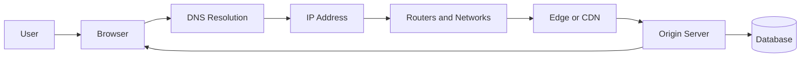

This part focuses on the infrastructure that allows systems to communicate globally.

You will learn:

- What the Internet is
- What the Web is
- How the Internet and Web differ
- What packets are
- How IP addresses identify network destinations
- The difference between IPv4 and IPv6
- What domains and hostnames are
- How DNS resolution works
- What recursive resolvers and authoritative name servers do
- What routers and ISPs do
- How ports identify services
- What client-server topology means
- What data centers and origin servers are
- What CDNs and edge networks do
- Why latency exists
- Why physical distance matters
- How network failures differ from application failures

---

# 1. The Internet Is Not One Giant Computer

A beginner may imagine the Internet as one enormous system somewhere “in the cloud.”

That is not what the Internet is.

The Internet is a global collection of:

- Independent networks
- Routers
- Servers
- Data centers
- User devices
- Internet service providers
- Fiber-optic cables
- Wireless links
- Satellites
- Undersea cables
- Routing systems
- Communication protocols

These networks cooperate to move data between devices.

A simplified view:


No single organization owns the entire Internet.

Different organizations own and operate different pieces:

- A home network may be managed by a consumer ISP.
- A mobile network may be managed by a telecommunications company.
- A data center may be managed by a cloud provider.
- An undersea cable may be owned by a consortium.
- A content delivery network may operate servers in many countries.
- An enterprise may operate a private network connected to the public Internet.

The Internet works because these independent networks use common protocols and agree to exchange traffic.

---

# 2. The Internet and the Web Are Different

The terms **Internet** and **Web** are often used interchangeably, but they refer to different things.

## The Internet

The Internet is the global networking infrastructure.

It provides the ability for devices and networks to communicate.

It includes:

- Cables
- Routers
- Wireless connections
- IP addresses
- Routing protocols
- Network providers
- Data centers
- Transport protocols

## The Web

The Web, or World Wide Web, is an application system that uses the Internet.

It includes:

- Websites
- Web browsers
- URLs
- HTTP
- HTTPS
- HTML
- CSS
- JavaScript
- Hyperlinks
- Web APIs

A useful analogy:

```text
Internet = Roads, highways, bridges, and traffic systems
Web      = One category of service using those roads
```

The Internet can carry many types of traffic:

- Web pages
- Email
- Video calls
- Online games
- File transfers
- Voice calls
- Remote shell sessions
- Database connections
- Streaming media

The Web is therefore one application layer built on top of the Internet.

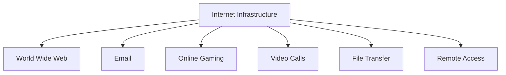

---

# 3. A Layered View of Network Communication

Networking is easier to understand when separated into layers.

Different models use slightly different names, but a practical web-oriented model looks like this:

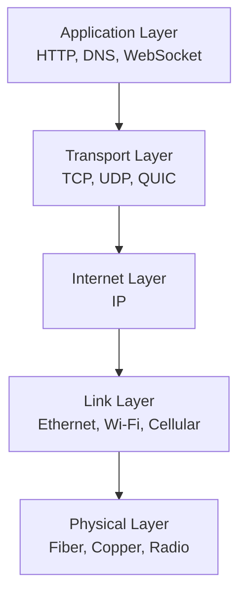

Each layer solves a different problem.

## Application layer

Defines what the software is trying to communicate.

Examples:

- HTTP
- DNS
- SMTP
- WebSocket
- SSH

## Transport layer

Controls communication between applications.

Examples:

- TCP
- UDP
- QUIC

It may provide:

- Reliability
- Ordering
- Flow control
- Connection management
- Multiplexing

## Internet layer

Handles addressing and routing between networks.

The main protocol here is:

- IP, including IPv4 and IPv6

## Link layer

Handles communication across a local network.

Examples:

- Ethernet
- Wi-Fi
- Cellular networking

## Physical layer

Carries electrical, optical, or radio signals.

Examples:

- Fiber-optic cable
- Copper cable
- Radio waves
- Undersea cable
- Satellite link

The layers cooperate.

For a web request:

```text
HTTP message
  ↓
Transport segment or packet
  ↓
IP packet
  ↓
Ethernet, Wi-Fi, or cellular frame
  ↓
Physical signals
```

---

# 4. What Is Data on a Network?

Computers do not send a website as one giant indivisible object.

They send data in smaller units.

These units are commonly called **packets**.

A packet is a structured piece of data that can contain:

- A source address
- A destination address
- Protocol information
- Sequence information
- Payload data
- Error-checking information

A simplified packet structure:

```text
+-----------------------+
| Source information    |
+-----------------------+
| Destination           |
+-----------------------+
| Protocol metadata     |
+-----------------------+
| Payload               |
+-----------------------+
```

A large response may be divided into many packets:

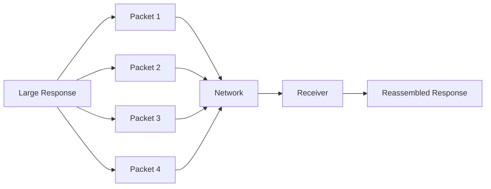

The receiving system reconstructs the original data.

---

# 5. Why Packet Switching Is Used

The Internet primarily uses a model called **packet switching**.

Instead of reserving one permanent physical path for an entire conversation, data is divided into packets that can travel through shared networks.

Imagine sending a large book.

A circuit-based approach might reserve one dedicated route for the entire book.

A packet-based approach divides the book into smaller numbered packages:

```text
Package 1
Package 2
Package 3
...
Package 100
```

The packages may travel through shared infrastructure and be reassembled at the destination.

Benefits include:

- Efficient use of shared links
- Multiple users sharing the same infrastructure
- Ability to route around failures
- Flexible network utilization
- Support for many simultaneous connections

A simplified packet route:

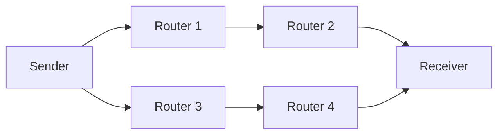

Different packets may sometimes take different paths.

The transport protocol helps deal with:

- Missing packets
- Duplicated packets
- Delayed packets
- Out-of-order packets

---

# 6. What Is an IP Address?

An IP address identifies a destination on an IP network.

The abbreviation IP means **Internet Protocol**.

An IP address allows networked systems to identify where data should be delivered.

There are two major versions:

- IPv4
- IPv6

---

# 7. IPv4 Addresses

An IPv4 address contains 32 bits.

It is usually written as four decimal numbers separated by periods.

Example:

```text
192.0.2.25
```

Each number ranges from `0` through `255`.

Another example:

```text
203.0.113.42
```

An IPv4 address can be thought of as:

```text
203 . 0 . 113 . 42
```

Each section represents 8 bits.

Together:

```text
8 + 8 + 8 + 8 = 32 bits
```

IPv4 provides approximately 4.3 billion possible addresses.

That sounded like a large number when the system was designed, but the modern Internet has many more devices and services than originally expected.

---

# 8. IPv6 Addresses

IPv6 was designed to provide a much larger address space.

An IPv6 address contains 128 bits.

It is written using hexadecimal groups separated by colons.

Example:

```text
2001:db8:1234:0000:0000:0000:0000:0042
```

IPv6 addresses can be shortened.

The previous address may become:

```text
2001:db8:1234::42
```

The `::` represents one or more consecutive groups of zeros.

Another example:

```text
2001:db8::1
```

IPv6 provides an extremely large number of possible addresses.

This allows more devices to receive globally unique addresses and reduces the pressure caused by IPv4 exhaustion.

---

# 9. Public and Private IP Addresses

Not every IP address is globally reachable.

## Public IP address

A public IP address is addressable across the public Internet.

A website’s server may have one or more public IP addresses.

Example:

```text
198.51.100.20
```

## Private IP address

A private IP address is used inside a local network.

Common private IPv4 ranges include:

```text
10.0.0.0/8
172.16.0.0/12
192.168.0.0/16
```

A home network might contain:

```text
192.168.1.10
192.168.1.20
192.168.1.30
```

These addresses are not normally routed directly across the public Internet.

A typical home network looks like this:

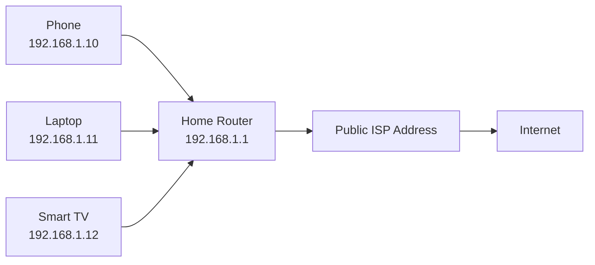

The home router usually performs **Network Address Translation**, or NAT.

---

# 10. Network Address Translation

NAT allows multiple private devices to share one public IPv4 address.

Suppose three devices have private addresses:

```text
Laptop:   192.168.1.10
Phone:    192.168.1.11
Tablet:   192.168.1.12
```

The router may present one public address to the Internet:

```text
Public address: 198.51.100.25
```

The router tracks which internal device initiated which connection.

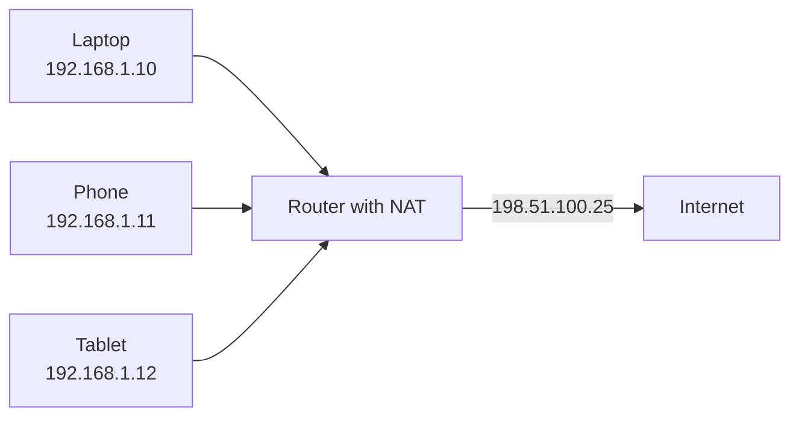

NAT helped extend the useful life of IPv4 by allowing many devices to share public addresses.

However, NAT also adds complexity:

- Incoming connections may be difficult
- Port forwarding may be required
- Some applications need special traversal techniques
- End-to-end connectivity is less direct

IPv6 was designed to reduce the need for this kind of address sharing, although real-world IPv6 deployments still use various network controls.

---

# 11. IP Addresses Are Not the Same as Domain Names

An IP address is useful to machines, but difficult for humans to remember.

It is easier to remember:

```text
example.com
```

than:

```text
203.0.113.42
```

A **domain name** is a human-readable label that can be associated with one or more IP addresses.

The system that performs this translation is DNS.

```text
example.com → 203.0.113.42
```

DNS does not permanently guarantee that one domain always maps to one IP address.

A domain may map to:

- One IP address
- Several IP addresses
- Different addresses in different regions
- A CDN
- A load balancer
- A temporary service
- Another domain name

---

# 12. What Is DNS?

DNS stands for **Domain Name System**.

DNS is a distributed naming system used to find information associated with domain names.

The most common use is finding IP addresses.

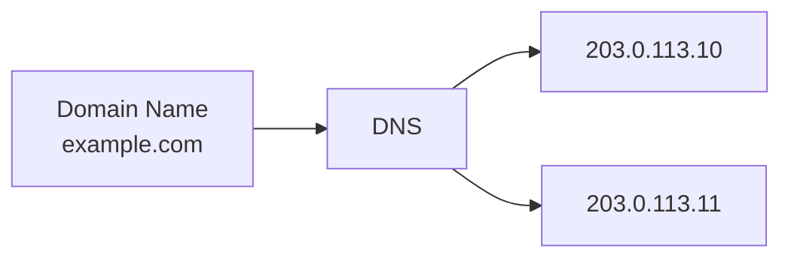

DNS can also provide other information, such as:

- Mail server locations
- Domain aliases
- Domain ownership verification
- Service discovery
- Security policies
- Certificate-related records

DNS is often described as the Internet’s directory system.

That analogy is useful, but DNS is more than a simple phone book.

It is:

- Hierarchical
- Distributed
- Cached
- Delegated
- Configurable
- Globally replicated through many servers

---

# 13. Domain Name Structure

Consider this hostname:

```text
www.example.com
```

It contains several labels:

```text
www . example . com
```

From right to left:

```text
com      = Top-level domain
example  = Registered domain
www      = Subdomain or host label
```

Another example:

```text
api.shop.example.com
```

Possible interpretation:

```text
com        = Top-level domain
example    = Registered domain
shop       = Subdomain
api        = Host or service label
```

The full domain name is technically read from right to left through a hierarchy.

At the very top is the root.

```text
.
```

The complete technical form could be represented as:

```text
www.example.com.
```

The final dot is usually omitted in normal writing.

---

# 14. The DNS Hierarchy

DNS is organized like a tree.

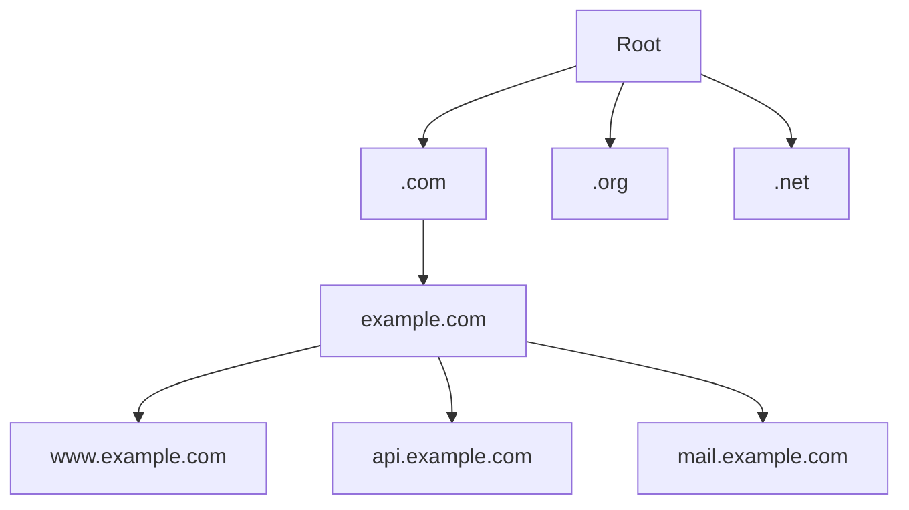

The main hierarchy includes:

## Root DNS servers

The root system knows where to find servers responsible for top-level domains.

## Top-level domain servers

Examples include:

```text
.com
.org
.net
.uk
.de
.jp
```

A top-level domain server knows which authoritative servers manage particular domains within that top-level domain.

## Authoritative name servers

These hold the actual DNS records for a domain.

For example, an authoritative server for `example.com` may know:

```text
www.example.com → 203.0.113.10
api.example.com → 203.0.113.11
```

---

# 15. The Main DNS Participants

Several different systems may participate in DNS resolution.

## Browser DNS cache

A browser may temporarily remember previous results.

## Operating system DNS cache

The operating system may also cache DNS responses.

## Local router or network cache

A home router or enterprise network may cache results.

## Recursive resolver

A recursive resolver performs DNS lookups on behalf of clients.

It may be operated by:

- An Internet service provider
- A company
- A public DNS provider
- A cloud platform
- An organization’s internal network

## Root name servers

They direct queries toward the correct top-level domain servers.

## TLD name servers

They direct queries toward authoritative servers for specific domains.

## Authoritative name servers

They provide the official records for a domain.

A simplified relationship:

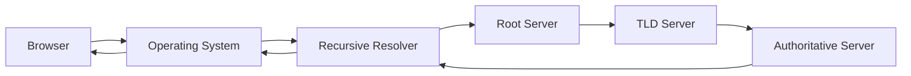

---

# 16. DNS Resolution: A Detailed Walkthrough

Suppose you enter:

```text
https://www.example.com
```

into a browser.

The browser must determine the IP address for:

```text
www.example.com
```

A simplified lookup sequence is:

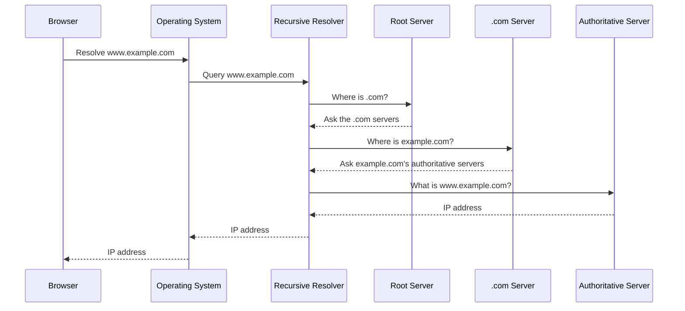

The browser can then connect to the destination.

---

# 17. DNS Caching

DNS lookups do not usually begin from the root every time.

Results are cached.

A typical process:

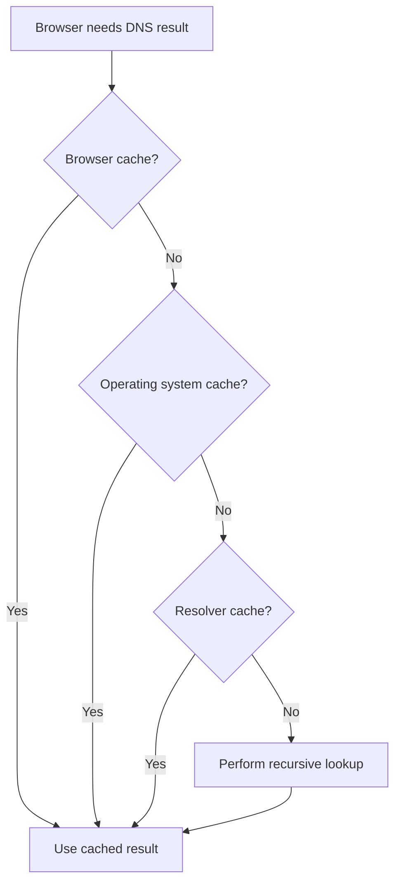

Caching improves:

- Speed
- Efficiency
- Resilience
- Reduction of repeated DNS traffic

Without caching, popular domains would generate enormous amounts of repeated lookup traffic.

---

# 18. DNS TTL

DNS records commonly include a **TTL**, or time to live.

TTL specifies how long a result may be cached.

For example:

```text
www.example.com → 203.0.113.10
TTL: 300 seconds
```

This means a resolver may cache the result for approximately five minutes.

If the domain owner changes the IP address, cached users may continue receiving the old value until the TTL expires.

This explains why DNS changes may not appear immediately everywhere.

Important point:

> Changing a DNS record does not instantly erase every cached copy across the Internet.

---

# 19. Common DNS Record Types

DNS stores different types of records.

## A record

Maps a name to an IPv4 address.

```text
example.com.  A  203.0.113.10
```

## AAAA record

Maps a name to an IPv6 address.

```text
example.com.  AAAA  2001:db8::10
```

The name “AAAA” reflects the larger IPv6 address size.

## CNAME record

Creates an alias from one name to another.

```text
www.example.com.  CNAME  example.com.
```

A CNAME says:

> Look up this other hostname.

## MX record

Identifies mail servers for a domain.

```text
example.com.  MX  mail.example.com.
```

## TXT record

Stores text information.

Used for:

- Domain verification
- Email security policies
- Service configuration
- Ownership checks

## NS record

Identifies authoritative name servers for a domain.

## PTR record

Used for reverse DNS lookups.

It maps an IP address back to a hostname.

---

# 20. Forward and Reverse DNS

## Forward DNS

Hostname to IP address:

```text
example.com → 203.0.113.10
```

This is what browsers commonly need.

## Reverse DNS

IP address to hostname:

```text
203.0.113.10 → server.example.com
```

Reverse DNS is often used for:

- Troubleshooting
- Logging
- Email server reputation
- Network administration
- Security analysis

Forward and reverse mappings are managed through different DNS record types.

---

# 21. What Happens After DNS?

DNS only tells the client where the destination may be located.

It does not:

- Render the page
- Authenticate the user
- Transfer HTML
- Execute JavaScript
- Query the database
- Guarantee that the server is healthy

After DNS resolution, the browser must establish network communication.

A simplified sequence:

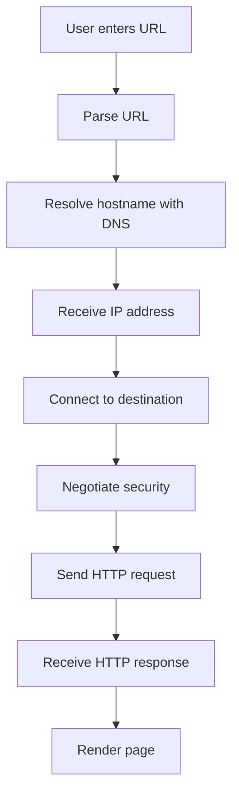

DNS is one early step in a longer process.

---

# 22. IP Routing

Once a client knows the destination IP address, network infrastructure must determine how to move packets toward it.

This process is called **routing**.

Routers inspect packet information and decide which next connection should receive the packet.

A simplified route:


Each router usually does not need to know the entire end-to-end application conversation.

It makes forwarding decisions based on routing information.

---

# 23. Routers and Switches

Routers and switches perform different roles.

## Switch

A switch usually connects devices within the same local network.

Example:

```text
Laptop
Phone
Printer
Server
```

A switch forwards local network traffic between connected devices.

## Router

A router connects different networks.

Examples:

- Home network to ISP network
- ISP network to another ISP
- Public Internet to data center network
- Office network to cloud network

A simple comparison:

```text
Switch = Connects devices within a network
Router = Connects different networks
```

Real network equipment may combine multiple functions, but the conceptual distinction is useful.

---

# 24. Internet Service Providers

An Internet Service Provider, or ISP, provides connectivity between a customer’s network and larger networks.

Examples of access methods include:

- Fiber
- Cable
- DSL
- Mobile networks
- Fixed wireless
- Satellite
- Enterprise connections

A simplified home connection:

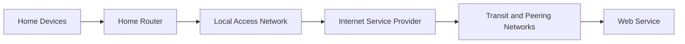

Your ISP may also provide:

- DNS resolvers
- Public IP addresses
- Network security features
- Email services
- Content filtering
- Traffic management
- IPv6 connectivity

---

# 25. Autonomous Systems

Large networks on the Internet are often organized as **Autonomous Systems**, or ASes.

An autonomous system is a network or group of networks operated under a common routing policy.

Examples may include:

- Large ISPs
- Cloud providers
- Universities
- Content delivery networks
- Telecommunications companies
- Major enterprises

Autonomous systems exchange routing information using protocols such as BGP, the Border Gateway Protocol.

You do not need to understand BGP in detail to use the web, but the general idea is important:

> Independent networks announce which IP ranges they can reach.

A simplified view:

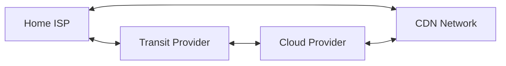

This allows traffic to move between independently operated networks.

---

# 26. Why Internet Routes Change

The path between a client and server is not necessarily permanent.

Routes may change because of:

- Link failures
- Congestion
- Maintenance
- Routing policy
- Cost decisions
- Capacity changes
- Security events
- Geographic optimization

A packet traveling from one country to another may take different paths at different times.

This is one reason that network performance can change without the application code changing.

---

# 27. Latency

**Latency** is the time required for data to travel between two points.

If a request takes 80 milliseconds to reach a server and the response takes 80 milliseconds to return, the network round trip is approximately 160 milliseconds, ignoring processing time.

Latency can come from:

- Physical distance
- Routing decisions
- Queueing
- Network congestion
- TLS negotiation
- Server processing
- Database queries
- Browser scheduling

A useful breakdown:

```text
Total user-perceived delay
=
DNS time
+ connection time
+ TLS time
+ request travel time
+ server processing time
+ response travel time
+ browser processing time
```

---

# 28. Physical Distance and Speed of Light

Network communication cannot be instantaneous.

Signals travel through physical media at a finite speed.

Fiber-optic signals travel slower than light in a vacuum.

This creates unavoidable delay.

A user in Australia communicating with a server in Europe may experience higher network latency than a user located near that server.

This is true even if:

- Both users have fast connections
- The application code is identical
- The server is powerful
- The bandwidth is high

Distance matters.

---

# 29. Bandwidth vs Latency

These terms are related but different.

## Bandwidth

Bandwidth is the amount of data that can be transferred over a period of time.

Examples:

```text
100 Mbps
1 Gbps
10 Gbps
```

Higher bandwidth is useful for transferring large files or streaming high-resolution media.

## Latency

Latency is the delay before data begins arriving or before a response returns.

A network may have:

- High bandwidth
- High latency

For example, a satellite connection may transfer substantial data but have significant round-trip delay.

A network may also have:

- Low latency
- Limited bandwidth

For example, a nearby local connection may respond quickly but be unable to transfer large files quickly.

A simple analogy:

```text
Bandwidth = Width of the highway
Latency = Travel time to the destination
```

---

# 30. Jitter and Packet Loss

## Jitter

Jitter is variation in packet arrival times.

For example:

```text
Packet 1 arrives after 20 ms
Packet 2 arrives after 25 ms
Packet 3 arrives after 80 ms
Packet 4 arrives after 22 ms
```

This variation can affect:

- Voice calls
- Video calls
- Online games
- Real-time collaboration

## Packet loss

Packet loss occurs when packets fail to reach their destination.

Possible causes include:

- Congestion
- Damaged links
- Wireless interference
- Faulty hardware
- Routing problems
- Buffer overflow

Protocols may recover by retransmitting missing data, but recovery can increase delay.

---

# 31. Ports

An IP address identifies a network destination, but a computer may run many services simultaneously.

For example, one server may host:

- A web server
- An email service
- An SSH service
- A database
- A monitoring service

A **port** identifies the application or service receiving traffic.

A network destination can be thought of as:

```text
IP address + port
```

Example:

```text
203.0.113.10:443
```

This means:

```text
IP address: 203.0.113.10
Port:       443
```

Common ports include:

| Port | Common use |
|---:|---|
| 80 | HTTP |
| 443 | HTTPS |
| 22 | SSH |
| 25 | SMTP |
| 53 | DNS |
| 5432 | PostgreSQL |
| 3306 | MySQL |

Port numbers alone do not guarantee what service is running there, but these are common conventions.

---

# 32. Sockets

A network connection is often represented conceptually as a socket.

A socket combines:

```text
Protocol
Source IP
Source port
Destination IP
Destination port
```

For example:

```text
TCP
Client:      192.168.1.10:53000
Destination: 203.0.113.10:443
```

The client may use a temporary source port such as `53000`, while the server listens on a well-known destination port such as `443`.

This allows many simultaneous connections.

---

# 33. Client-Server Topology

The client-server model describes a relationship:

```text
Client requests
Server responds
```

A simple topology:

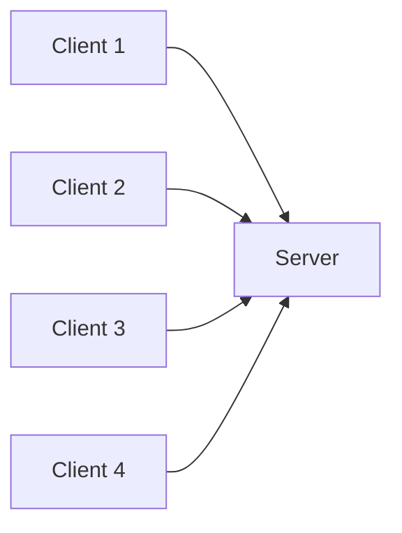

The server may serve many clients simultaneously.

However, modern applications often place additional layers between clients and servers.

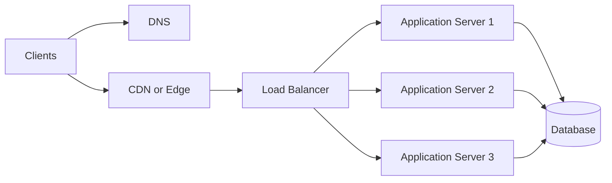

This architecture improves:

- Availability
- Scalability
- Geographic performance
- Failure handling
- Traffic distribution

---

# 34. Data Centers

A data center is a facility containing computing and networking equipment.

It may contain:

- Servers
- Storage systems
- Routers
- Switches
- Power systems
- Cooling systems
- Fire suppression
- Physical security
- Backup systems
- Network connections

A simplified data center:

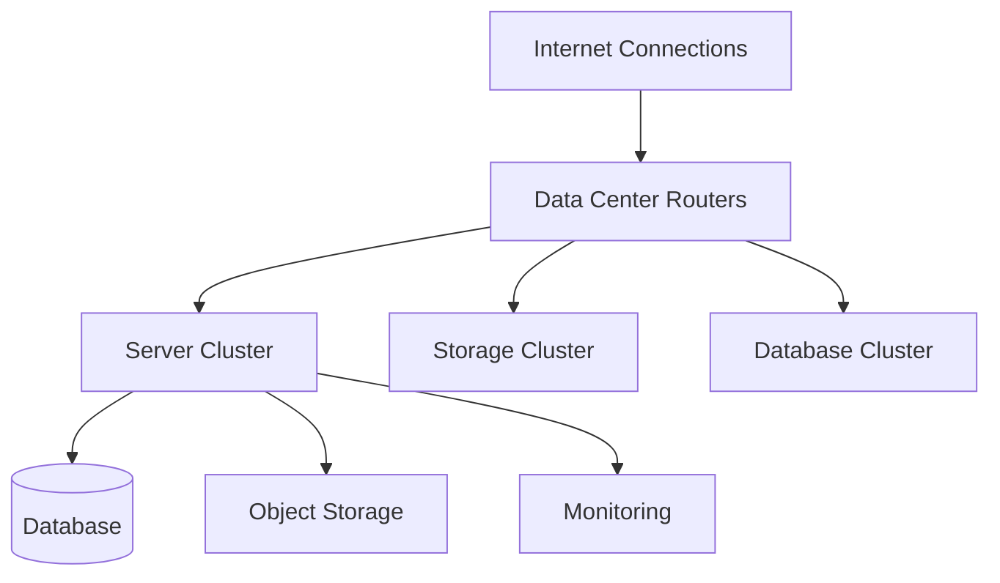

Applications may run in:

- One data center
- Several data centers
- Multiple geographic regions
- Public cloud infrastructure
- Private infrastructure
- Hybrid environments

---

# 35. Origin Servers

The **origin server** is the primary source of application content.

Suppose a CDN delivers a cached image, but does not have the image yet.

The CDN may request it from the origin server:

```mermaid
sequenceDiagram
    participant B as Browser
    participant C as CDN Edge
    participant O as Origin Server
    participant S as Storage

    B->>C: Request image
    C->>O: Image not cached; request from origin
    O->>S: Retrieve image
    S-->>O: Return image
    O-->>C: Return image
    C-->>B: Send image
    C->>C: Cache image
```

The origin may contain:

- Application code
- Databases
- Private files
- Dynamic page generation
- Internal services

The origin is often protected from direct public traffic by edge services, load balancers, or firewalls.

---

# 36. Content Delivery Networks

A **Content Delivery Network**, or CDN, is a distributed network of servers designed to deliver content closer to users.

Instead of every user contacting one distant origin server, requests may be handled by nearby edge locations.

```mermaid
flowchart TD
    O[Origin Server] --> E1[Edge Location: North America]
    O --> E2[Edge Location: Europe]
    O --> E3[Edge Location: Asia]
    O --> E4[Edge Location: Australia]

    U1[User: North America] --> E1
    U2[User: Europe] --> E2
    U3[User: Asia] --> E3
    U4[User: Australia] --> E4
```

CDNs commonly cache:

- Images
- CSS
- JavaScript
- Fonts
- Videos
- Downloads
- Static HTML
- Sometimes API responses

---

# 37. CDN Cache Hits and Misses

When a user requests a resource, the edge location checks whether it has a cached copy.

## Cache hit

```mermaid
sequenceDiagram
    participant B as Browser
    participant E as CDN Edge

    B->>E: Request image
    E->>E: Image exists in cache
    E-->>B: Return cached image
```

## Cache miss

```mermaid
sequenceDiagram
    participant B as Browser
    participant E as CDN Edge
    participant O as Origin Server

    B->>E: Request image
    E->>E: Image not in cache
    E->>O: Request image
    O-->>E: Return image
    E->>E: Store response in cache
    E-->>B: Return image
```

CDNs can reduce:

- Latency
- Origin server workload
- Bandwidth costs
- Geographic bottlenecks

---

# 38. What CDNs Do Not Automatically Solve

A CDN is not a complete application architecture.

It does not automatically solve:

- Authentication bugs
- Authorization failures
- Database problems
- Incorrect business logic
- Poor API design
- Exposed secrets
- Application crashes
- Bad cache rules
- Stale private data

Caching private or personalized content incorrectly can create serious security problems.

For example, a response containing a user’s private account information should not accidentally be served to another user from a shared cache.

Cache behavior must be designed deliberately.

---

# 39. Anycast and Choosing a Nearby Edge

Many distributed network services use techniques that help direct users toward a nearby or appropriate location.

One such technique is **anycast**.

In a simplified model, multiple servers advertise the same IP address from different locations.

Network routing directs the user toward one of those locations.

```mermaid
flowchart TD
    U1[User in America] --> A[Shared Service Address]
    U2[User in Europe] --> A
    U3[User in Asia] --> A

    A --> E1[American Edge]
    A --> E2[European Edge]
    A --> E3[Asian Edge]
```

The actual selection is based on routing and network policy. It is not always the physically closest server, but it often improves geographic performance and resilience.

---

# 40. Load Balancers

A load balancer distributes incoming requests across multiple application servers.

```mermaid
flowchart LR
    C1[Client] --> LB[Load Balancer]
    C2[Client] --> LB
    C3[Client] --> LB

    LB --> S1[Application Server 1]
    LB --> S2[Application Server 2]
    LB --> S3[Application Server 3]
```

A load balancer may consider:

- Server health
- Current workload
- Geographic location
- Session requirements
- Routing rules
- Request type

If one server fails, the load balancer may stop sending it new traffic.

---

# 41. Health Checks

Infrastructure systems often perform health checks.

A health check may request:

```text
GET /health
```

The server may respond:

```json
{
  "status": "healthy"
}
```

A load balancer may use this response to decide whether the server should receive traffic.

Health checks should usually be lightweight.

They may verify:

- The application process is running
- Required dependencies are available
- The server can respond
- Critical services are functioning

A basic health check is not always enough to guarantee that the entire application is healthy.

---

# 42. High Availability

High availability means designing a system to continue operating despite certain failures.

Techniques include:

- Multiple application servers
- Redundant network links
- Replicated databases
- Multiple data centers
- Backup systems
- Failover routing
- Health checks
- Load balancing
- Disaster recovery plans

A highly available architecture may look like this:

```mermaid
flowchart TD
    U[Users] --> DNS[Global Routing]
    DNS --> R1[Region 1]
    DNS --> R2[Region 2]

    R1 --> A1[Application Cluster]
    R1 --> D1[(Database Replica)]

    R2 --> A2[Application Cluster]
    R2 --> D2[(Database Replica)]

    D1 <--> D2
```

High availability usually increases:

- Cost
- Operational complexity
- Testing requirements
- Data consistency challenges

It is an engineering tradeoff.

---

# 43. The Journey of a Web Request

Let us combine the concepts.

Suppose a user enters:

```text
https://shop.example/products
```

A simplified journey is:

```mermaid
sequenceDiagram
    participant U as User
    participant B as Browser
    participant DNS as DNS Resolver
    participant ISP as ISP and Internet
    participant CDN as CDN or Edge
    participant LB as Load Balancer
    participant APP as Application Server
    participant DB as Database

    U->>B: Enters URL
    B->>DNS: Resolve shop.example
    DNS-->>B: Returns IP address
    B->>ISP: Sends network traffic
    ISP->>CDN: Routes request
    CDN->>LB: Forwards dynamic request
    LB->>APP: Selects healthy server
    APP->>DB: Retrieves products
    DB-->>APP: Returns product data
    APP-->>LB: Builds HTTP response
    LB-->>CDN: Returns response
    CDN-->>B: Sends response
    B-->>U: Displays product page
```

The actual system may include:

- A TLS handshake
- Multiple DNS caches
- Several routers
- A reverse proxy
- Authentication middleware
- A cache
- Multiple database queries
- External service calls

But this overview captures the basic structure.

---

# 44. DNS Failure vs Network Failure vs Server Failure

Different failures happen at different stages.

## DNS failure

The hostname cannot be resolved.

Possible symptoms:

- Browser says the site cannot be reached
- DNS lookup errors
- No IP address is returned
- Other websites work normally

## Network failure

The destination address is known, but traffic cannot reach it.

Possible causes:

- Routing problem
- Firewall
- ISP outage
- Broken connection
- Packet loss
- Port blocked

## TLS failure

The network destination responds, but secure connection negotiation fails.

Possible causes:

- Invalid certificate
- Expired certificate
- Hostname mismatch
- Unsupported protocol
- Client clock problem

## Server failure

The request reaches the server, but the application fails.

Possible responses:

```text
500 Internal Server Error
502 Bad Gateway
503 Service Unavailable
```

## Application-level failure

The server responds normally, but the requested operation fails.

Examples:

```text
401 Unauthorized
403 Forbidden
404 Not Found
422 Unprocessable Content
```

Learning to distinguish these stages is essential for debugging.

---

# 45. A Diagnostic Flowchart

```mermaid
flowchart TD
    A[User cannot load website] --> B{Does hostname resolve?}
    B -->|No| C[Investigate DNS]
    B -->|Yes| D{Can client connect?}
    D -->|No| E[Investigate routing, firewall, or network]
    D -->|Yes| F{Does TLS succeed?}
    F -->|No| G[Investigate certificate or TLS configuration]
    F -->|Yes| H{Does server return response?}
    H -->|No| I[Investigate server availability]
    H -->|Yes| J{What status code?}
    J -->|4xx| K[Investigate client request or permissions]
    J -->|5xx| L[Investigate backend or infrastructure]
    J -->|2xx| M[Inspect browser rendering and application behavior]
```

This sequence prevents you from immediately changing frontend code when the real problem is DNS or infrastructure.

---

# 46. Localhost and Development Networks

During development, you may see addresses such as:

```text
localhost
127.0.0.1
```

These usually refer to the current computer.

For example:

```text
http://localhost:3000
```

means:

```text
Protocol: HTTP
Host: localhost
Port: 3000
```

A development server may be running on your own computer.

```mermaid
flowchart LR
    B[Browser] --> L[localhost:3000]
    L --> D[Development Server]
```

The request may not leave your machine at all.

Other special addresses include:

```text
127.0.0.1
```

IPv4 loopback address.

```text
::1
```

IPv6 loopback address.

These are useful for local development and testing.

---

# 47. Local Network Names and Private Services

In an organization, services may use private names such as:

```text
database.internal
api.corp.example
printer.office
```

These names may resolve only inside a private network.

A public browser outside the organization may not be able to resolve or reach them.

This is common in:

- Corporate networks
- Cloud private networks
- Kubernetes clusters
- Service meshes
- Internal development environments

The same DNS concept applies, but the information is restricted to authorized networks.

---

# 48. The Role of Firewalls

A firewall controls which network traffic is allowed or blocked.

Rules may consider:

- Source address
- Destination address
- Port
- Protocol
- Network zone
- Application identity
- Direction of traffic

A simplified firewall:

```mermaid
flowchart LR
    I[Incoming Traffic] --> F{Firewall Rules}
    F -->|Allowed| S[Server]
    F -->|Blocked| X[Rejected]
```

For a web server, common rules may allow:

```text
TCP port 80
TCP port 443
```

while blocking direct public access to:

```text
Database ports
Administrative ports
Internal service ports
```

Firewalls are one layer of protection. They do not replace application authentication and authorization.

---

# 49. Private Networks in Cloud Environments

Cloud applications often separate public and private components.

```mermaid
flowchart TD
    I[Public Internet] --> LB[Public Load Balancer]
    LB --> APP[Private Application Servers]
    APP --> DB[(Private Database)]
    APP --> Q[Private Queue]
    APP --> S[Private Internal Services]
```

The application servers may be reachable only through the load balancer.

The database may be reachable only by the application servers.

This reduces exposure and creates controlled network boundaries.

---

# 50. Why Architecture Is Usually Layered

A layered network architecture helps each component focus on one responsibility.

For example:

```text
DNS:
  Find a destination address

IP:
  Move packets between networks

TCP or QUIC:
  Manage transport behavior

TLS:
  Protect communication

HTTP:
  Describe web requests and responses

Application:
  Apply business logic

Database:
  Store and retrieve data
```

A problem in one layer does not necessarily mean every layer is broken.

This is why a website may have:

- Successful DNS
- Successful TCP connection
- Successful TLS handshake
- Successful HTTP response
- But a failed database query

Each stage can succeed or fail independently.

---

# 51. Common Beginner Misconceptions

## Misconception 1: DNS stores websites

DNS generally stores records about names and destinations.

It does not store the full website content.

```text
DNS → Where is the service?
Server/CDN → Here is the content.
```

## Misconception 2: An IP address identifies a specific physical computer forever

An IP address may be:

- Reassigned
- Shared
- Associated with a load balancer
- Used by a CDN
- Served by multiple machines
- Changed during deployment

An IP address identifies a network destination, not necessarily one permanent physical computer.

## Misconception 3: The Internet is wireless

Some connections are wireless, but much of the Internet’s long-distance infrastructure relies on physical cables, especially fiber-optic and undersea cables.

## Misconception 4: More bandwidth always means less latency

Bandwidth and latency are different properties.

A faster connection may transfer large files quickly but still have noticeable response delay if the destination is far away.

## Misconception 5: A CDN replaces the backend

A CDN can cache and distribute content, but dynamic operations may still require origin servers and backend systems.

## Misconception 6: The closest server is always used

Routing decisions depend on network topology, policies, availability, and service configuration. Physical distance is important but not the only factor.

## Misconception 7: If DNS works, the website must work

DNS only provides a destination. The destination may be down, misconfigured, blocked, or returning application errors.

---

# 52. Practical Exercise: Trace a Domain Conceptually

Choose a website and answer:

1. What is its domain name?
2. What top-level domain does it use?
3. Does it likely use subdomains?
4. What might `www` represent?
5. What might `api` represent?
6. Could the domain have multiple IP addresses?
7. Might it use a CDN?
8. Where might its origin servers be located?
9. What happens if its DNS records are wrong?
10. What happens if DNS works but port `443` is unavailable?

You can use command-line tools to inspect DNS.

For example:

```bash
nslookup example.com
```

Or:

```bash
dig example.com
```

A simpler command on many systems is:

```bash
ping example.com
```

However, `ping` is not a reliable way to determine whether a website works. Some systems block ICMP traffic while still serving HTTP successfully.

---

# 53. Practical Exercise: Inspect Your Local Network

You can inspect your computer’s network configuration.

On many systems:

```bash
ip addr
```

or:

```bash
ifconfig
```

To inspect the route table:

```bash
ip route
```

To test DNS resolution:

```bash
nslookup example.com
```

To inspect the path toward a destination:

```bash
traceroute example.com
```

On some systems, use:

```bash
tracert example.com
```

These commands can help reveal:

- Local IP addresses
- Network interfaces
- Default gateways
- DNS resolvers
- Intermediate routing hops

The exact output differs by operating system and network.

---

# 54. A More Complete Request Timeline

A browser request may involve the following steps:

```mermaid
flowchart TD
    A[User enters URL] --> B[Browser parses URL]
    B --> C[Check browser cache]
    C --> D[Resolve hostname]
    D --> E[Select IP address]
    E --> F[Open transport connection]
    F --> G[Perform TLS handshake]
    G --> H[Send HTTP request]
    H --> I[Server processes request]
    I --> J[Receive HTTP response]
    J --> K[Download additional resources]
    K --> L[Render page]
```

Each additional resource may produce more requests:

- CSS
- JavaScript
- Images
- Fonts
- Videos
- API data
- Analytics
- Advertising
- Embedded content

One page load may therefore involve dozens or hundreds of network requests.

---

# 55. Multiple Domains on One Page

A page may load resources from multiple domains:

```text
app.example.com
api.example.com
cdn.example.net
images.example.net
fonts.example.org
analytics.example.com
```

Each domain may require:

- DNS lookup
- Connection setup
- TLS negotiation
- HTTP request
- Response processing

Browsers optimize this process through:

- Connection reuse
- DNS caching
- HTTP/2 multiplexing
- HTTP/3 and QUIC
- Preconnect
- Preload hints
- Resource prioritization

These topics will connect to HTTP and performance in later parts.

---

# 56. The Core Mental Model for Part 2

When a browser accesses a web application, remember this sequence:

```text
Name
  ↓
DNS resolves the name
  ↓
Address
  ↓
Routing finds a path
  ↓
Connection
  ↓
TLS protects the connection
  ↓
Protocol
  ↓
HTTP carries the web request
  ↓
Application
  ↓
Backend processes the request
```

A compact diagram:

```mermaid
flowchart LR
    N[Domain Name] --> D[DNS]
    D --> IP[IP Address]
    IP --> R[Routing]
    R --> C[Connection]
    C --> T[TLS]
    T --> H[HTTP]
    H --> A[Application]
```

This sequence is one of the most important foundations in web development.

---

# Part 2 Summary

In this part, we explored how the Internet provides the infrastructure that allows web applications to communicate.

The most important ideas are:

- The Internet is a global collection of interconnected networks.
- The Web is an application system built on top of the Internet.
- The Internet carries many kinds of traffic, not only websites.
- Network communication is organized into layers.
- Data is divided into packets.
- IPv4 and IPv6 provide network addressing.
- Public IP addresses are reachable across the public Internet.
- Private IP addresses are used inside local networks.
- NAT allows many private devices to share public IPv4 addresses.
- Domain names are human-readable labels.
- DNS translates domain names into information such as IP addresses.
- DNS is hierarchical, distributed, cached, and delegated.
- Recursive resolvers perform lookups for clients.
- Root, TLD, and authoritative servers participate in DNS resolution.
- DNS records have different types, including `A`, `AAAA`, `CNAME`, `MX`, `TXT`, and `NS`.
- DNS caching means changes may take time to appear everywhere.
- Routers forward packets between networks.
- Switches connect devices within local networks.
- ISPs connect customers to larger networks.
- Routing paths may change over time.
- Latency is affected by distance, routing, congestion, and processing.
- Bandwidth and latency describe different network properties.
- Ports identify services running on networked systems.
- Data centers host servers, databases, storage, and networking equipment.
- CDNs bring cacheable content closer to users.
- Load balancers distribute requests across multiple servers.
- Firewalls control permitted network traffic.
- Public and private network boundaries help protect infrastructure.
- DNS success does not guarantee that an application is healthy.
- Troubleshooting should identify whether a failure is related to DNS, networking, TLS, the server, or the application.

The overall request journey is:

```mermaid
flowchart LR
    U[User] --> B[Browser]
    B --> DNS[DNS Resolution]
    DNS --> IP[IP Address]
    IP --> NET[Routers and Networks]
    NET --> EDGE[CDN or Edge]
    EDGE --> LB[Load Balancer]
    LB --> APP[Backend Application]
    APP --> DB[(Database)]
    APP --> B
```

In **Part 3**, we will examine the language used by web applications after the network destination has been found: HTTP and HTTPS. We will break down requests, responses, methods, headers, URLs, payloads, status codes, TLS, and the complete request-response cycle.
