# Web Mechanics, Architecture & Network Fundamentals

# Part 3 — HTTP, HTTPS, and the Request-Response Cycle  
## The Language of the Web and Secure Transport

---

# Part 3 Overview

In Part 2, we followed a request through the Internet.

We saw that a browser must:

1. Parse a URL.
2. Resolve a domain name through DNS.
3. Obtain an IP address.
4. Send packets through networks and routers.
5. Reach a server, CDN, or edge location.

But locating a server is only part of the process.

The browser and server still need to communicate using a shared language.

That language is usually **HTTP**.

```text
HTTP = Hypertext Transfer Protocol
```

HTTP defines how web clients and servers exchange messages.

It describes:

- How a request begins
- Which resource is being requested
- What operation is intended
- What metadata accompanies the request
- Whether the request has a body
- How the server reports the result
- What data format is returned
- Whether the result can be cached
- Whether the client should redirect or retry

A simplified interaction looks like this:

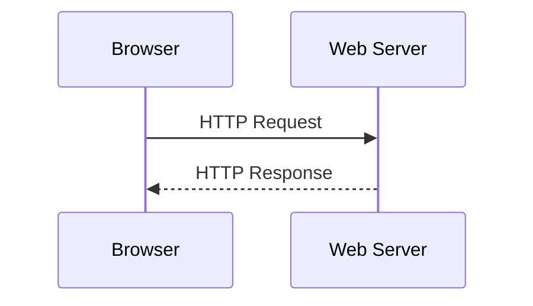

For example:

```http
GET /products HTTP/1.1
Host: example.com
Accept: text/html
```

The server may respond:

```http
HTTP/1.1 200 OK
Content-Type: text/html

<h1>Products</h1>
```

HTTP is designed to be general enough to carry:

- HTML
- CSS
- JavaScript
- JSON
- Images
- Videos
- Audio
- Documents
- Form submissions
- API requests
- File uploads

This part explains HTTP and HTTPS in detail.

You will learn:

- What HTTP is
- How HTTP versions evolved
- The difference between a URL, URI, host, path, and endpoint
- The anatomy of an HTTP request
- HTTP methods such as `GET`, `POST`, `PUT`, `PATCH`, and `DELETE`
- Headers and their purposes
- Path parameters and query parameters
- Request bodies and payload formats
- The anatomy of an HTTP response
- Status-code categories
- Common status codes
- JSON, HTML, text, and binary responses
- Cookies and sessions
- Redirects
- Idempotency and safety
- HTTPS
- TLS
- Symmetric and asymmetric encryption
- Certificates
- The TLS handshake
- What HTTPS protects and what it does not protect
- How to think about the complete request-response cycle

---

# 1. What Is a Protocol?

A protocol is a set of communication rules.

Humans can communicate because they share conventions:

```text
One person speaks.
The other listens.
The message has meaning.
The listener responds.
```

Computers need more precise rules.

A protocol may define:

- How messages are formatted
- How messages are sent
- How recipients are identified
- How errors are reported
- How communication ends
- How data is encoded
- How security is negotiated

HTTP is an application-layer protocol.

It sits above lower-level networking protocols.

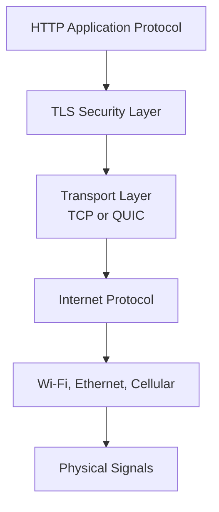

A browser may use:

```text
HTTP
  ↓
TLS
  ↓
TCP or QUIC
  ↓
IP
  ↓
Wi-Fi, Ethernet, or cellular
```

HTTP determines what the application is saying.

The lower layers determine how the message travels.

---

# 2. What Does HTTP Stand For?

HTTP stands for:

```text
Hypertext Transfer Protocol
```

The name comes from the Web’s original purpose: transferring hypertext documents containing links to other documents.

Today, HTTP is used for much more than hypertext.

It carries:

- HTML pages
- API requests
- JSON data
- Images
- Fonts
- Files
- Streaming data
- Web application commands

The general pattern is:

```text
Client sends an HTTP request.
Server sends an HTTP response.
```

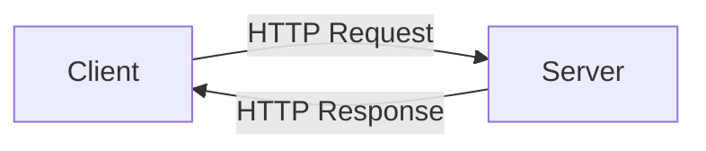

The client is often a browser, but it could also be:

- A mobile application
- A desktop application
- A command-line tool
- Another server
- An automated test
- A monitoring service
- A smart device

---

# 3. HTTP Is a Request-Response Protocol

HTTP commonly follows a request-response pattern.

The client initiates communication by sending a request.

The server processes the request and returns a response.

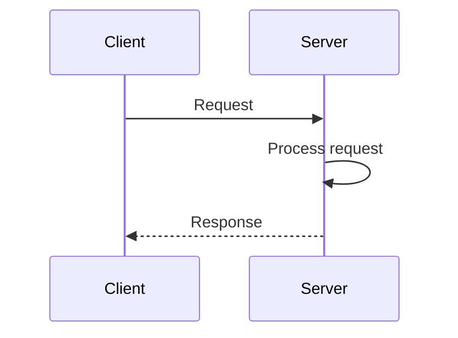

Example:

```text
Client:
  I want the homepage.

Server:
  Here is the homepage.

Client:
  I want the product list.

Server:
  Here is the product list.

Client:
  Create an order.

Server:
  The order was created.
```

HTTP does not dictate exactly how the server implements the operation.

The server may:

- Read a file
- Query a database
- Call another API
- Execute business logic
- Generate HTML
- Return cached content
- Start a background job

The client generally sees only the request and response.

---

# 4. HTTP Versions

HTTP has evolved over time.

The major versions you may encounter are:

- HTTP/0.9
- HTTP/1.0
- HTTP/1.1
- HTTP/2
- HTTP/3

The purpose of these versions is generally the same: move HTTP messages between clients and servers.

The differences mostly involve:

- Connection management
- Efficiency
- Message framing
- Multiplexing
- Compression
- Transport protocols

---

## 4.1 HTTP/1.1

HTTP/1.1 became extremely common and is still widely supported.

A request might look like:

```http
GET /products HTTP/1.1
Host: example.com
Accept: text/html
```

HTTP/1.1 uses a readable text-based message format.

It supports:

- Persistent connections
- Host headers
- Chunked transfer
- Caching controls
- Many standard headers
- Several HTTP methods

One limitation is that requests and responses may experience **head-of-line blocking** when multiple resources share a connection.

---

## 4.2 HTTP/2

HTTP/2 preserves the general HTTP model but changes how messages are transmitted.

It supports:

- Multiplexing multiple streams over one connection
- Binary framing
- Header compression
- More efficient resource delivery
- Stream prioritization

From the developer’s perspective, an HTTP/2 request still conceptually has:

```text
Method
Path
Headers
Body
```

The wire representation is more efficient, but the application model remains familiar.

---

## 4.3 HTTP/3

HTTP/3 uses QUIC instead of TCP.

QUIC runs over UDP but provides modern transport features such as:

- Reliable delivery
- Encryption integration
- Stream multiplexing
- Faster connection establishment
- Better behavior when networks change

For example, switching from Wi-Fi to mobile data can be handled more smoothly in some circumstances.

HTTP/3 does not change the basic idea of requests and responses.

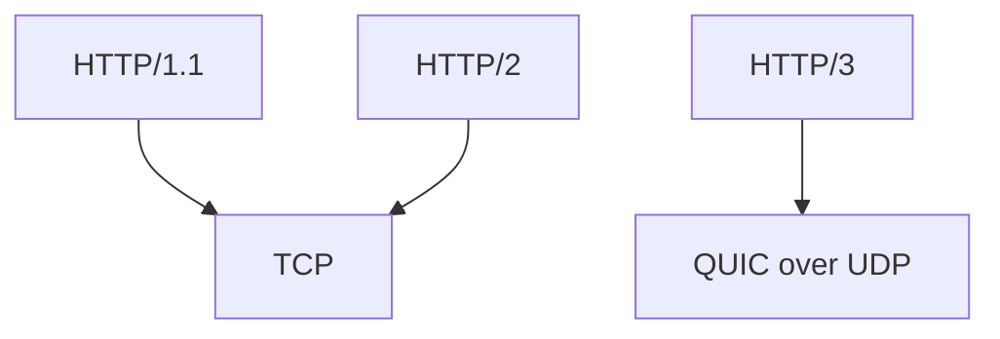

For beginners, the important point is:

> HTTP versions improve how messages travel, but the fundamental request-response concepts remain similar.

---

# 5. HTTP and HTTPS

## HTTP

HTTP sends application messages without built-in encryption.

A request may be readable by parties able to observe the traffic.

```text
http://example.com
```

## HTTPS

HTTPS means HTTP is transmitted through a secure TLS connection.

```text
https://example.com
```

HTTPS provides:

- Confidentiality
- Integrity
- Server authentication

A simplified HTTPS stack:

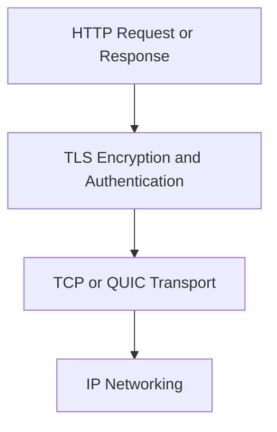

HTTPS does not create a different kind of HTTP message.

The request still contains:

- Method
- URL path
- Headers
- Body

The difference is that TLS protects the communication while it travels.

---

# 6. Anatomy of a URL

Before understanding requests, we need to understand URLs.

Consider:

```text
https://www.example.com:443/products/123?color=blue&sort=price#reviews
```

A URL can contain several parts.

```mermaid
flowchart LR
    S[https://] --> P[Scheme]
    H[www.example.com] --> HOST[Host]
    PORT[:443] --> PO[Port]
    PA[/products/123] --> PATH[Path]
    Q[?color=blue&sort=price] --> QUERY[Query String]
    F[#reviews] --> FRAGMENT[Fragment]
```

The components are:

```text
Scheme:    https
Host:      www.example.com
Port:      443
Path:      /products/123
Query:     color=blue&sort=price
Fragment:  reviews
```

The full URL is:

```text
https://www.example.com:443/products/123?color=blue&sort=price#reviews
```

---

## 6.1 Scheme

The scheme tells the client which protocol or access method to use.

Common schemes include:

```text
http
https
ftp
mailto
file
```

For web applications, the most important are:

```text
http://
https://
```

---

## 6.2 Host

The host identifies the destination.

It may be:

- A domain name
- A subdomain
- An IP address
- `localhost`

Examples:

```text
example.com
api.example.com
localhost
127.0.0.1
```

---

## 6.3 Port

The port identifies the service on the host.

Examples:

```text
https://example.com:443
http://localhost:3000
```

If the standard port is being used, it is often omitted.

```text
https://example.com
```

usually means:

```text
https://example.com:443
```

And:

```text
http://example.com
```

usually means:

```text
http://example.com:80
```

---

## 6.4 Path

The path identifies a resource or route.

Examples:

```text
/
 /products
 /products/123
 /users/42/orders
```

The path is interpreted by the server or application.

A path does not necessarily refer to a physical file.

For example:

```text
/products/123
```

might cause the backend to:

1. Extract the product ID `123`
2. Query a database
3. Generate a response

---

## 6.5 Query String

The query string contains additional parameters.

Example:

```text
/products?category=keyboards&page=2
```

The query parameters are:

```text
category = keyboards
page     = 2
```

Query strings are commonly used for:

- Filtering
- Searching
- Sorting
- Pagination
- Optional configuration
- Tracking information

---

## 6.6 Fragment

The fragment begins with `#`.

Example:

```text
/docs/http#headers
```

The fragment identifies a location within a resource or an application state.

Importantly, the fragment is normally handled by the browser and is not sent to the server in the HTTP request.

For example:

```text
https://example.com/page#section-2
```

The server generally receives:

```text
GET /page
```

The browser uses:

```text
#section-2
```

to navigate within the returned page or application.

---

# 7. URL Encoding

URLs have rules about which characters can appear directly.

Characters such as spaces and certain symbols must be encoded.

A space may become:

```text
%20
```

For example:

```text
/search?q=web%20fundamentals
```

This represents:

```text
q = "web fundamentals"
```

Other examples:

```text
?email=user%40example.com
```

represents:

```text
email = "user@example.com"
```

URL encoding ensures that special characters do not accidentally change the meaning of the URL.

---

# 8. What Is an Endpoint?

An **endpoint** is a network-accessible location where a service accepts requests.

Examples:

```text
GET /api/products
GET /api/products/123
POST /api/orders
```

People often refer to the combination of method and path as an endpoint.

For example:

```text
GET https://api.example.com/products
```

is different from:

```text
POST https://api.example.com/products
```

even though the host and path are the same.

The method contributes to the meaning.

---

# 9. Anatomy of an HTTP Request

A traditional HTTP request contains:

1. Request line
2. Headers
3. Blank line
4. Optional body

Example:

```http
POST /api/orders?preview=false HTTP/1.1
Host: shop.example.com
Accept: application/json
Content-Type: application/json
Authorization: Bearer example-token
User-Agent: ExampleBrowser/1.0
Content-Length: 58

{
  "productId": 123,
  "quantity": 2
}
```

Let us examine this structure.

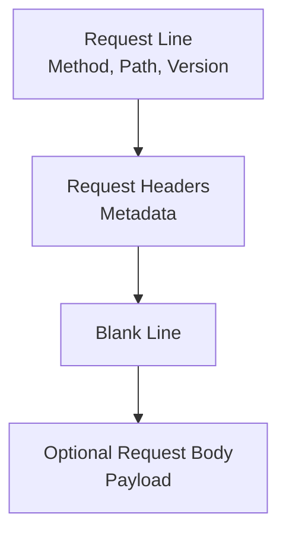

---

# 10. The Request Line

The request line usually contains:

```text
METHOD PATH HTTP-VERSION
```

Example:

```http
GET /products HTTP/1.1
```

This means:

```text
Method:  GET
Path:    /products
Version: HTTP/1.1
```

Another example:

```http
POST /api/orders HTTP/1.1
```

This means:

```text
Method:  POST
Path:    /api/orders
Version: HTTP/1.1
```

Modern HTTP/2 and HTTP/3 do not necessarily transmit this exact text line internally, but the conceptual fields still exist.

---

# 11. HTTP Methods

An HTTP method communicates the intended operation.

The common methods are:

- `GET`
- `POST`
- `PUT`
- `PATCH`
- `DELETE`
- `HEAD`
- `OPTIONS`
- `TRACE`
- `CONNECT`

The most important for application development are usually:

```text
GET
POST
PUT
PATCH
DELETE
```

---

# 12. GET

`GET` requests a representation of a resource.

Examples:

```http
GET /products
GET /products/123
GET /users/42/orders
```

A `GET` request commonly means:

> Retrieve information.

Example:

```bash
curl https://api.example.com/products
```

A successful response might be:

```json
[
  {
    "id": 123,
    "name": "Keyboard",
    "price": 79.99
  }
]
```

---

## 12.1 GET Should Not Normally Change Data

A `GET` request should generally be safe and read-only.

Bad design:

```http
GET /delete-account
```

A link, browser prefetch, crawler, or monitoring system could accidentally trigger deletion.

Better:

```http
DELETE /account
```

The method communicates that a state-changing operation is occurring.

---

## 12.2 GET Parameters

GET requests commonly use:

- Path parameters
- Query parameters

Example:

```http
GET /products/123
```

The product ID is part of the path.

Example:

```http
GET /products?category=keyboard&page=2
```

The category and page are query parameters.

---

# 13. POST

`POST` submits data for processing.

It is often used to:

- Create a resource
- Submit a form
- Trigger an operation
- Start a workflow
- Upload data
- Send a message

Example:

```http
POST /api/orders
```

Request body:

```json
{
  "productId": 123,
  "quantity": 2
}
```

A server may respond:

```http
HTTP/1.1 201 Created
```

with:

```json
{
  "orderId": "ord_456",
  "status": "pending"
}
```

`POST` is not limited to creating database records. It can represent any operation where the client submits data for server-side processing.

---

# 14. PUT

`PUT` commonly means replacing a resource with a complete representation.

Example:

```http
PUT /api/users/42
```

Request body:

```json
{
  "name": "Alex",
  "email": "alex@example.com",
  "timezone": "UTC"
}
```

The server may interpret this as:

> Replace the representation of user 42 with this complete version.

If a field is omitted, some APIs may treat it as removed or reset.

The exact behavior depends on the API contract.

---

# 15. PATCH

`PATCH` commonly means partially updating a resource.

Example:

```http
PATCH /api/users/42
```

Request body:

```json
{
  "timezone": "America/New_York"
}
```

This means:

> Change the timezone, leaving other fields unchanged.

A common distinction:

```text
PUT   = Full replacement
PATCH = Partial modification
```

Not every API uses these methods perfectly, but this is the standard conceptual difference.

---

# 16. DELETE

`DELETE` requests removal of a resource.

Example:

```http
DELETE /api/orders/456
```

Possible results:

```http
204 No Content
```

or:

```http
200 OK
```

with a response body explaining what happened.

Deletion may be:

- Permanent
- Soft deletion
- Scheduled for deletion
- Restricted by business rules
- Reversible

The HTTP method communicates intent, but the application defines the exact business behavior.

---

# 17. HEAD

`HEAD` is similar to `GET`, but asks for headers without the response body.

Example:

```http
HEAD /large-file.zip
```

It may be used to check:

- Whether a resource exists
- Its size
- Its modification date
- Its content type
- Cache metadata

A server may respond:

```http
HTTP/1.1 200 OK
Content-Type: application/zip
Content-Length: 104857600
```

without sending the file contents.

---

# 18. OPTIONS

`OPTIONS` asks what communication options are supported.

It may be used by browsers for CORS preflight requests.

Example:

```http
OPTIONS /api/orders HTTP/1.1
Origin: https://app.example.com
Access-Control-Request-Method: POST
```

The server may respond with allowed methods and origins.

```http
Allow: GET, POST, OPTIONS
Access-Control-Allow-Origin: https://app.example.com
Access-Control-Allow-Methods: GET, POST
```

CORS will be discussed later, but this method is important to recognize in browser network tools.

---

# 19. Safe and Idempotent Methods

HTTP has formal concepts called **safe** and **idempotent**.

## Safe method

A safe method is intended to retrieve information without changing server state.

`GET` and `HEAD` are normally safe.

## Idempotent method

An idempotent operation produces the same intended result when repeated.

Examples:

```http
PUT /users/42
```

Sending the same complete replacement multiple times should result in the same final representation.

```http
DELETE /users/42
```

Deleting the same resource repeatedly should leave it deleted, even if later requests return a different status.

`POST` is generally not idempotent.

Sending the same order-creation request twice may create two orders.

```text
POST + retry without protection
→ possible duplicate operation
```

This distinction becomes important when networks fail and clients retry requests.

---

# 20. Method Summary

| Method | Typical meaning | Usually has a body? | Usually changes state? |
|---|---|---:|---:|
| `GET` | Retrieve data | No | No |
| `HEAD` | Retrieve headers | No | No |
| `POST` | Submit or create | Yes | Often |
| `PUT` | Replace resource | Yes | Yes |
| `PATCH` | Partially update | Yes | Yes |
| `DELETE` | Remove resource | Sometimes | Yes |
| `OPTIONS` | Ask supported options | Usually no | No |

These are conventions and protocol semantics. An API can misuse methods, but doing so makes the system less predictable.

---

# 21. Path Parameters

Path parameters identify a specific resource within the URL path.

Example:

```text
/products/123
```

Here:

```text
123 = product identifier
```

Another example:

```text
/users/42/orders/9001
```

Possible interpretation:

```text
User ID: 42
Order ID: 9001
```

Path parameters are commonly used when the resource identity is central to the request.

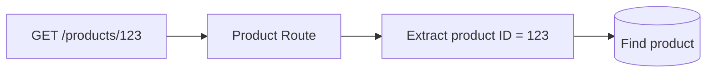

---

# 22. Query Parameters

Query parameters provide additional options or filters.

Example:

```text
/products?category=keyboards&sort=price&page=2
```

Parameters:

```text
category = keyboards
sort     = price
page     = 2
```

They are commonly used for:

- Search
- Filtering
- Sorting
- Pagination
- Feature flags
- Optional display behavior

Another example:

```text
/search?q=networking&limit=20
```

The server may interpret:

```text
q     = networking
limit = 20
```

---

# 23. Path Parameters vs Query Parameters

Compare:

```text
GET /products/123
```

and:

```text
GET /products?id=123
```

Both may identify product `123`, but they communicate different design intentions.

A common convention is:

```text
Path parameter = Which resource?
Query parameter = Which variation or filter?
```

Examples:

```text
/products/123
```

means:

> The product whose ID is 123.

```text
/products?category=keyboard
```

means:

> Products filtered by category.

```text
/products?page=2&sort=price
```

means:

> Products displayed with pagination and sorting options.

---

# 24. Request Headers

Headers provide metadata about a request.

They tell the server information such as:

- What content formats the client accepts
- What content the request contains
- What browser or client is making the request
- Which language is preferred
- Whether authentication credentials are present
- Whether a cached version can be used
- Which origin initiated the request

Example:

```http
Accept: application/json
Content-Type: application/json
Authorization: Bearer token
User-Agent: ExampleBrowser/1.0
Accept-Language: en-US
```

Headers are written as:

```text
Name: Value
```

---

# 25. Common Request Headers

## Host

Identifies the requested host.

```http
Host: example.com
```

This is especially important when one server handles many domain names.

---

## Accept

Tells the server which response formats the client can process.

```http
Accept: application/json
```

or:

```http
Accept: text/html, application/xhtml+xml
```

A client might say:

```http
Accept: application/json, text/plain, */*
```

This means it prefers JSON or plain text but can accept other formats.

---

## Content-Type

Describes the format of the request body.

```http
Content-Type: application/json
```

Other examples:

```http
Content-Type: application/x-www-form-urlencoded
Content-Type: multipart/form-data; boundary=...
Content-Type: text/plain
```

`Content-Type` answers:

> How should the server interpret the bytes in the body?

---

## Content-Length

Indicates the size of the request body in bytes.

```http
Content-Length: 58
```

Some modern transport mechanisms may represent message sizes differently, but the conceptual purpose remains identifying body length.

---

## Authorization

Carries authentication credentials or tokens.

Example:

```http
Authorization: Bearer eyJhbGciOi...
```

Another scheme is Basic authentication:

```http
Authorization: Basic base64-value
```

Authentication details must be handled carefully, especially when logging requests.

---

## User-Agent

Identifies the client software.

```http
User-Agent: Mozilla/5.0 ...
```

Servers may use this for:

- Diagnostics
- Compatibility handling
- Analytics
- Bot detection
- Device adaptation

It should not be treated as a trustworthy identity claim.

---

## Referer

May indicate the page from which a request originated.

```http
Referer: https://example.com/products
```

The spelling `Referer` is historically standardized, even though many people would expect “Referrer.”

---

## Origin

Identifies the origin that initiated a browser request.

```http
Origin: https://app.example.com
```

This is important for CORS decisions.

---

## Cookie

Sends cookies previously stored by the browser.

```http
Cookie: session_id=abc123; theme=dark
```

Cookies are often used for:

- Sessions
- Preferences
- Tracking
- Authentication state

---

## Cache-Control

Controls caching behavior.

Example:

```http
Cache-Control: no-cache
```

or:

```http
Cache-Control: max-age=3600
```

---

# 26. Request Body

A request body contains data submitted to the server.

It is commonly used with:

- `POST`
- `PUT`
- `PATCH`
- Some `DELETE` requests

Example JSON body:

```json
{
  "name": "Alex",
  "email": "alex@example.com"
}
```

The body is separate from the headers.

```http
POST /api/users HTTP/1.1
Content-Type: application/json

{
  "name": "Alex",
  "email": "alex@example.com"
}
```

The `Content-Type` header tells the server how to interpret the body.

---

# 27. JSON Request Bodies

JSON is common for web APIs.

Example:

```http
POST /api/products HTTP/1.1
Content-Type: application/json

{
  "name": "Keyboard",
  "price": 79.99,
  "available": true
}
```

The server parses the JSON into an internal data structure.

Conceptually:

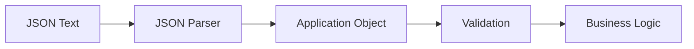

JSON is popular because it is:

- Human-readable
- Supported by many languages
- Compact enough for many APIs
- Easy to inspect in developer tools
- Convenient for structured data

---

# 28. Form-Encoded Data

HTML forms may submit data using:

```text
application/x-www-form-urlencoded
```

Example:

```text
username=alex&password=example
```

The corresponding request:

```http
POST /login HTTP/1.1
Content-Type: application/x-www-form-urlencoded

username=alex&password=example
```

Special characters are URL-encoded.

This format is simple and common for traditional form submissions.

---

# 29. Multipart Form Data

`multipart/form-data` is commonly used when a request includes files.

Example:

```http
Content-Type: multipart/form-data; boundary=----ExampleBoundary
```

The body contains multiple sections separated by a boundary.

Conceptually:

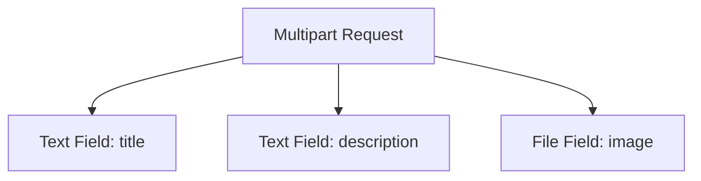

A form might submit:

```text
title = Profile photo
description = New profile image
file = profile.jpg
```

Multipart data is useful because one request can contain:

- Text fields
- JSON fragments
- Binary files
- Metadata

---

# 30. Plain Text and Binary Bodies

A request body can also be:

```http
Content-Type: text/plain
```

with:

```text
Hello from the client
```

Or binary:

```http
Content-Type: image/png
```

with raw image bytes.

HTTP transports bytes.

The `Content-Type` helps the receiver interpret those bytes.

---

# 31. The Complete HTTP Request Example

```http
POST /api/orders?notify=true HTTP/1.1
Host: shop.example.com
Accept: application/json
Content-Type: application/json
Authorization: Bearer example-token
User-Agent: ExampleBrowser/1.0
Content-Length: 62

{
  "items": [
    {
      "productId": 123,
      "quantity": 2
    }
  ]
}
```

Breakdown:

```text
Method:
  POST

Path:
  /api/orders

Query parameter:
  notify=true

Host:
  shop.example.com

Expected response:
  application/json

Request body format:
  application/json

Authentication:
  Bearer token

Body:
  Order item information
```

---

# 32. Anatomy of an HTTP Response

An HTTP response commonly contains:

1. Status line
2. Response headers
3. Blank line
4. Optional response body

Example:

```http
HTTP/1.1 201 Created
Content-Type: application/json
Location: /api/orders/456
Cache-Control: no-store
Content-Length: 54

{
  "id": 456,
  "status": "pending"
}
```

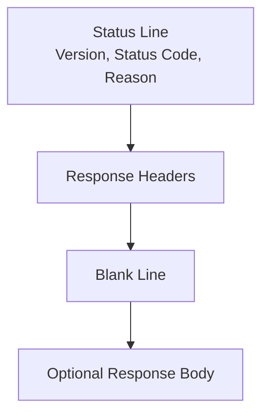

---

# 33. The Status Line

The status line traditionally contains:

```text
HTTP-VERSION STATUS-CODE REASON-PHRASE
```

Example:

```http
HTTP/1.1 200 OK
```

This means:

```text
Version: HTTP/1.1
Code:    200
Meaning: Request succeeded
```

Modern applications primarily depend on the numeric status code.

The reason phrase is descriptive and should not usually be treated as the main source of logic.

---

# 34. HTTP Status-Code Categories

HTTP status codes have three digits.

The first digit indicates the broad category.

| Range | Category |
|---|---|
| `1xx` | Informational |
| `2xx` | Success |
| `3xx` | Redirection |
| `4xx` | Client-side request problem |
| `5xx` | Server-side failure |

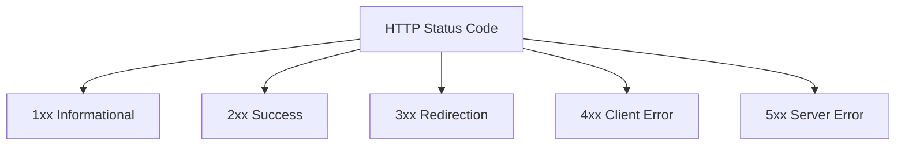

The categories are useful, but the exact code provides more information.

---

# 35. `1xx` Informational Responses

These responses provide interim information.

Examples include:

```text
100 Continue
101 Switching Protocols
103 Early Hints
```

Most application developers do not handle these directly every day.

They can be used for:

- Informing the client that the request may continue
- Switching protocols
- Providing hints about resources before the final response

---

# 36. `2xx` Success Responses

## `200 OK`

The request succeeded.

Common for:

- Successful `GET`
- Successful `PATCH`
- General successful operations

Example:

```http
HTTP/1.1 200 OK
```

---

## `201 Created`

A new resource was created.

Common for:

```http
POST /api/orders
```

Example:

```http
HTTP/1.1 201 Created
Location: /api/orders/456
```

---

## `202 Accepted`

The request was accepted for processing, but the work is not complete.

Useful for background jobs:

```http
HTTP/1.1 202 Accepted
```

Response:

```json
{
  "jobId": "job_123",
  "status": "processing"
}
```

---

## `204 No Content`

The request succeeded, but there is no response body.

Common after deletion:

```http
DELETE /api/orders/456
```

Response:

```http
HTTP/1.1 204 No Content
```

---

# 37. `3xx` Redirection Responses

Redirections tell the client to use another URL or retrieve a different version.

## `301 Moved Permanently`

The resource has permanently moved.

## `302 Found`

Historically used for temporary redirects, although behavior has varied in older clients.

## `303 See Other`

Often used to direct the client to retrieve another resource using `GET`.

## `304 Not Modified`

The cached version may still be used.

## `307 Temporary Redirect`

Preserves the original method during redirection.

## `308 Permanent Redirect`

A permanent redirect that also preserves the original method.

---

## 37.1 Redirect Example

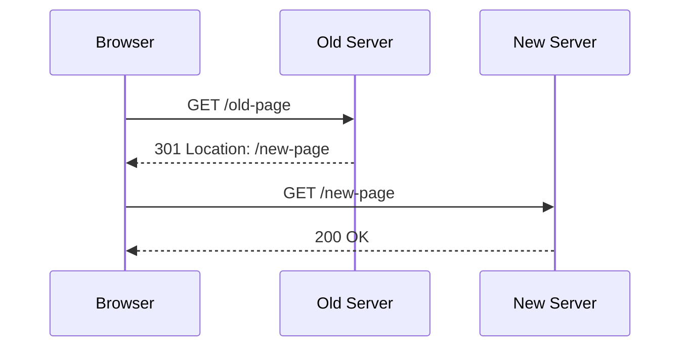

The `Location` header tells the client where to go.

```http
Location: https://example.com/new-page
```

---

# 38. `304 Not Modified`

Caching often involves conditional requests.

The browser may have previously received a resource with a modification identifier.

It can ask:

```http
GET /styles.css
If-None-Match: "abc123"
```

The server may respond:

```http
HTTP/1.1 304 Not Modified
```

This tells the browser:

> Your cached copy is still valid. Use it.

No full response body is needed.

This saves bandwidth and time.

---

# 39. `4xx` Client Error Responses

A `4xx` response usually means the request cannot be fulfilled because of something about the request, identity, permissions, or requested resource.

It does not always mean the human user made a mistake.

The problem may be:

- Incorrect frontend code
- Malformed input
- Missing authentication
- Insufficient permissions
- A nonexistent resource
- An unsupported method

---

## `400 Bad Request`

The server cannot understand or process the request because it is malformed.

Possible causes:

- Invalid JSON
- Missing required fields
- Invalid query syntax
- Malformed headers
- Invalid parameter format

Example:

```json
{
  "error": "Request body must be valid JSON."
}
```

---

## `401 Unauthorized`

Despite its wording, this generally means:

> Authentication is required or invalid.

Possible causes:

- Missing token
- Expired session
- Invalid credentials
- Invalid authentication scheme

Example:

```http
HTTP/1.1 401 Unauthorized
WWW-Authenticate: Bearer
```

---

## `403 Forbidden`

The server understood the request but refuses to authorize it.

The user may be authenticated but lack permission.

Example:

```text
User is logged in but cannot access an administrator resource.
```

A useful distinction:

```text
401 = Who are you?
403 = We know who you are, but you may not do that.
```

---

## `404 Not Found`

The requested resource could not be found.

Possible causes:

- Incorrect URL
- Resource does not exist
- Resource was deleted
- Server intentionally hides its existence
- Route is not defined

A `404` generally means the server was reached successfully.

---

## `405 Method Not Allowed`

The path exists, but the HTTP method is not supported.

Example:

```http
DELETE /products
```

when the endpoint supports only:

```text
GET
POST
```

The response may include:

```http
Allow: GET, POST
```

---

## `408 Request Timeout`

The server timed out while waiting for the request.

---

## `409 Conflict`

The request conflicts with the current state of the resource.

Examples:

- Duplicate username
- Version conflict
- Attempt to reserve already-reserved inventory
- Conflicting update

---

## `413 Content Too Large`

The request body is too large.

This may happen during file uploads.

---

## `415 Unsupported Media Type`

The server does not support the request body format.

Example:

```http
Content-Type: application/xml
```

when the endpoint expects:

```http
Content-Type: application/json
```

---

## `422 Unprocessable Content`

The request format is understood, but the values fail validation or business rules.

Example:

```json
{
  "quantity": -1
}
```

The JSON is valid, but the quantity is not acceptable.

---

## `429 Too Many Requests`

The client has sent too many requests within a period.

This is often used for rate limiting.

The response may include:

```http
Retry-After: 60
```

---

# 40. `5xx` Server Error Responses

A `5xx` response usually indicates a problem while the server was trying to fulfill a valid or potentially valid request.

## `500 Internal Server Error`

A general server-side failure.

Possible causes:

- Unhandled exception
- Programming error
- Unexpected database result
- Misconfigured dependency
- Invalid server state

The server should usually log the detailed error internally while returning a safe message to the client.

---

## `501 Not Implemented`

The server does not support the requested functionality.

---

## `502 Bad Gateway`

A gateway or proxy received an invalid response from an upstream server.

Example:

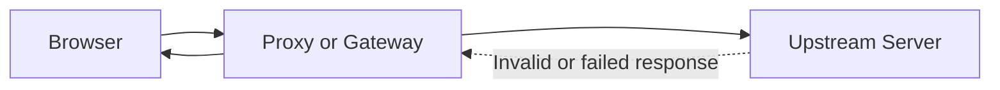

---

## `503 Service Unavailable`

The service is temporarily unable to handle the request.

Possible causes:

- Overload
- Maintenance
- Dependency outage
- Health check failure
- Capacity shortage

---

## `504 Gateway Timeout`

A gateway or proxy waited too long for an upstream server.

---

# 41. Status Codes Are Not the Whole Story

A status code provides an important high-level result, but it does not explain everything.

Consider:

```http
HTTP/1.1 200 OK
Content-Type: application/json

{
  "success": false,
  "message": "Payment declined"
}
```

The HTTP request succeeded at the transport and server-response level, but the business operation failed.

Conversely:

```http
HTTP/1.1 400 Bad Request
```

might be a normal response caused by invalid user input rather than a server malfunction.

Always inspect:

- Status code
- Response headers
- Response body
- Request details
- Server logs when available

---

# 42. Response Headers

Response headers provide metadata about the result.

Common response headers include:

- `Content-Type`
- `Content-Length`
- `Location`
- `Cache-Control`
- `ETag`
- `Last-Modified`
- `Set-Cookie`
- `Allow`
- `Retry-After`
- `Access-Control-Allow-Origin`
- `Content-Encoding`
- `Strict-Transport-Security`

---

## 42.1 Content-Type

Describes the response body format.

Examples:

```http
Content-Type: text/html
Content-Type: application/json
Content-Type: image/png
Content-Type: text/css
Content-Type: application/javascript
```

The browser uses this information to determine how to interpret the response.

---

## 42.2 Location

Used with redirects and newly created resources.

Example:

```http
Location: /api/orders/456
```

---

## 42.3 Set-Cookie

Tells the browser to store a cookie.

Example:

```http
Set-Cookie: session_id=abc123; Secure; HttpOnly; SameSite=Lax
```

Cookie security attributes matter greatly.

---

## 42.4 ETag

Identifies a particular version of a resource.

Example:

```http
ETag: "resource-version-123"
```

The browser can later use:

```http
If-None-Match: "resource-version-123"
```

to ask whether the resource changed.

---

## 42.5 Last-Modified

Indicates when the resource was last changed.

```http
Last-Modified: Wed, 10 Jul 2026 12:00:00 GMT
```

---

# 43. Response Bodies

A response body contains the returned data.

It may be:

- HTML
- JSON
- Plain text
- XML
- Image data
- Audio
- Video
- PDF
- Compressed data
- An empty body

---

## 43.1 HTML Response

```http
Content-Type: text/html
```

Body:

```html
<!doctype html>
<html>
  <body>
    <h1>Welcome</h1>
  </body>
</html>
```

The browser renders the HTML.

---

## 43.2 JSON Response

```http
Content-Type: application/json
```

Body:

```json
{
  "id": 123,
  "name": "Keyboard",
  "price": 79.99
}
```

JavaScript or another client parses the JSON.

---

## 43.3 Binary Response

```http
Content-Type: image/png
```

The body contains binary image bytes.

The browser decodes and displays the image.

---

# 44. HTTP Cookies

Cookies are small pieces of data stored by a client, usually a browser.

A server sets a cookie using:

```http
Set-Cookie: session_id=abc123
```

The browser later sends it back:

```http
Cookie: session_id=abc123
```

A simplified session flow:

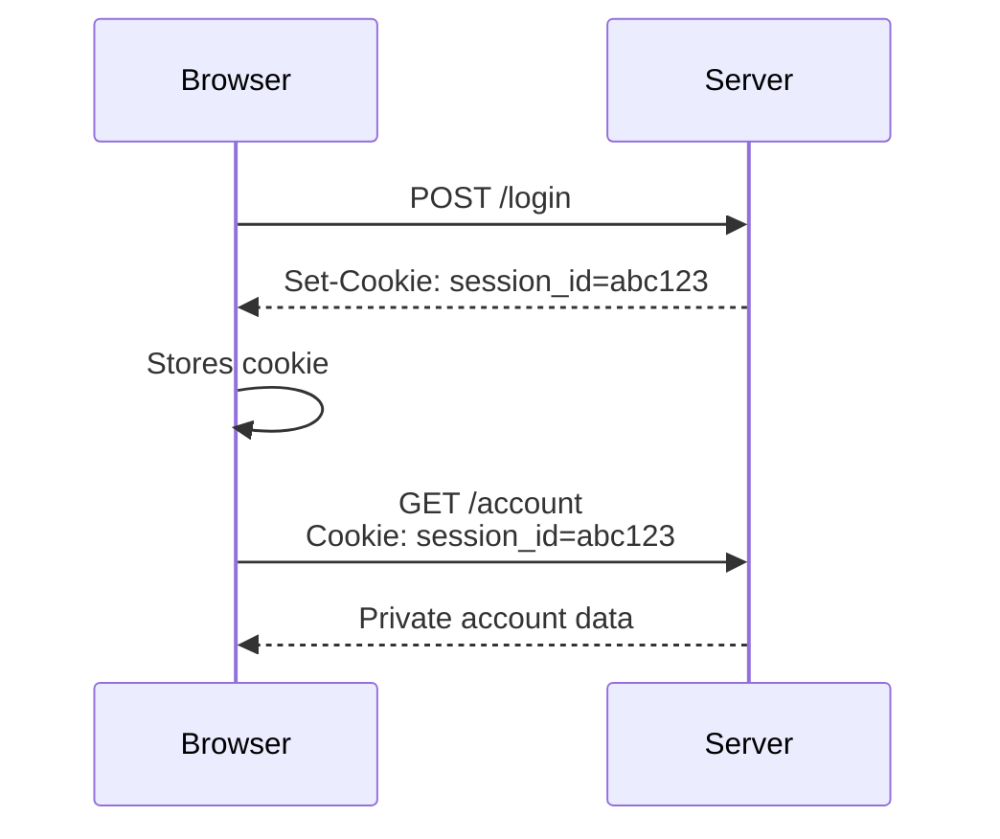

Cookies can store:

- Session identifiers
- Preferences
- Shopping cart identifiers
- Security tokens
- Analytics identifiers

---

# 45. Cookie Security Attributes

## `Secure`

The cookie should be sent only over HTTPS.

```http
Set-Cookie: session_id=abc123; Secure
```

## `HttpOnly`

The cookie cannot normally be read by JavaScript.

```http
Set-Cookie: session_id=abc123; HttpOnly
```

This helps reduce some risks from client-side script access.

## `SameSite`

Controls how the cookie behaves across site boundaries.

Common values include:

```text
Strict
Lax
None
```

Example:

```http
Set-Cookie: session_id=abc123; Secure; HttpOnly; SameSite=Lax
```

Cookie configuration is an important part of authentication security.

---

# 46. Stateless HTTP and Stateful Applications

HTTP is often described as stateless.

This means each request should be understandable without requiring the server to remember the entire previous conversation at the protocol level.

However, applications create continuity through:

- Cookies
- Sessions
- Tokens
- Databases
- Client-side state

Example:

```text
Request 1:
  POST /login

Response:
  Set-Cookie: session_id=abc123

Request 2:
  GET /account
  Cookie: session_id=abc123
```

The protocol requests are separate, but the application connects them through the session identifier.

---

# 47. HTTP Authentication Headers

Some APIs use an authorization header instead of cookies.

Example:

```http
Authorization: Bearer access-token-value
```

The server uses the token to identify the caller.

A typical flow:

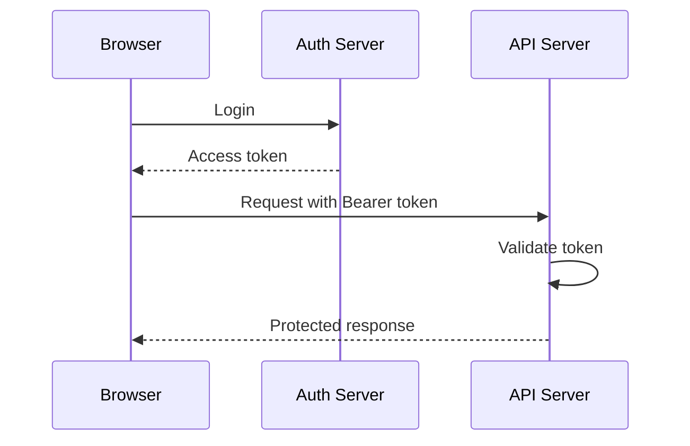

Tokens must be protected because anyone who obtains a valid token may be able to act as the associated user until the token expires or is revoked.

---

# 48. HTTP Redirects and Navigation

When a browser visits a URL, the server may redirect it.

Example:

```http
HTTP/1.1 301 Moved Permanently
Location: https://www.example.com/
```

The browser then requests the new location.

Redirects are used for:

- HTTP-to-HTTPS upgrades
- Domain changes
- URL restructuring
- Login flows
- Language selection
- Temporary maintenance pages
- Canonical URLs

A redirect means:

> The server is not returning the final resource yet. Use another location or follow another step.

---

# 49. HTTP Compression

Responses can be compressed to reduce transfer size.

The client may send:

```http
Accept-Encoding: gzip, br
```

The server may respond:

```http
Content-Encoding: br
```

The response body is compressed, and the browser decompresses it.

Compression can improve performance for:

- HTML
- CSS
- JavaScript
- JSON
- Plain text

Already-compressed formats such as JPEG and many video formats may receive little benefit.

---

# 50. Content Negotiation

The client and server may negotiate formats.

The client can send:

```http
Accept: application/json
```

The server may choose JSON.

Or:

```http
Accept: text/html
```

The server may return HTML.

Other negotiation headers include:

```http
Accept-Language: en-US
Accept-Encoding: gzip, br
```

The server may respond with:

```http
Content-Type: application/json
Content-Language: en-US
Content-Encoding: br
```

---

# 51. Caching

Caching stores a response so it can be reused.

Caching can occur in:

- Browser
- Operating system
- Proxy
- CDN
- Application server
- Database layer

A basic cache interaction:

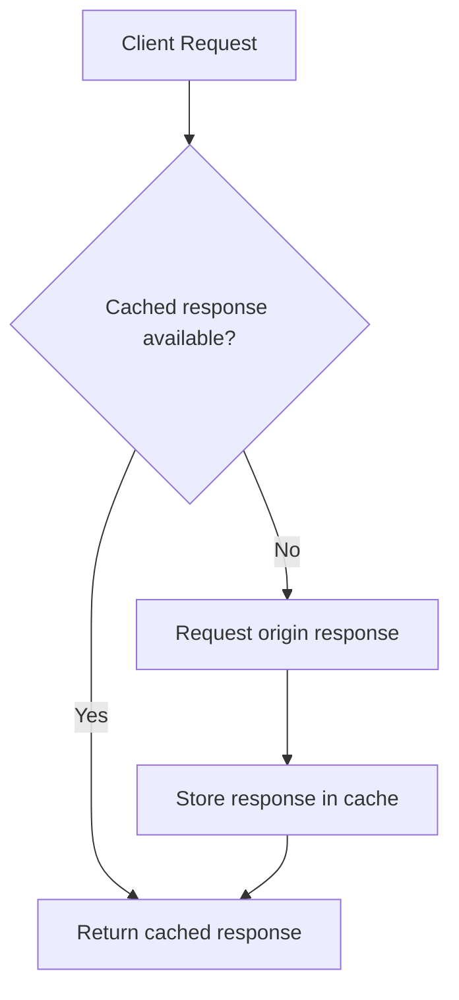

Important cache headers include:

```http
Cache-Control: max-age=3600
ETag: "version-123"
Last-Modified: ...
```

Caching can greatly improve performance, but incorrect caching can return stale or private data.

---

# 52. HTTPS in More Detail

HTTPS is HTTP protected by TLS.

TLS stands for:

```text
Transport Layer Security
```

You may also hear people say “SSL,” or Secure Sockets Layer.

SSL is the older predecessor of TLS. Modern systems should use TLS, although “SSL certificate” remains common informal terminology.

HTTPS provides three main protections.

---

## 52.1 Confidentiality

Confidentiality means unauthorized observers should not be able to read the message contents.

Without encryption, someone monitoring a network might read:

```text
username=alex&password=secret
```

With HTTPS, the transmitted bytes appear scrambled to observers who do not possess the required keys.

---

## 52.2 Integrity

Integrity means the message should not be changed without detection.

An attacker should not be able to silently modify:

```text
amount=10
```

into:

```text
amount=1000
```

without the receiver detecting a problem.

---

## 52.3 Authentication

Authentication allows the browser to verify that it is communicating with the intended domain, assuming the certificate chain and trust system are valid.

For example, a browser should be able to distinguish:

```text
https://example.com
```

from an attacker’s unrelated server pretending to be `example.com`.

---

# 53. Symmetric Encryption

Symmetric encryption uses the same secret key to encrypt and decrypt data.

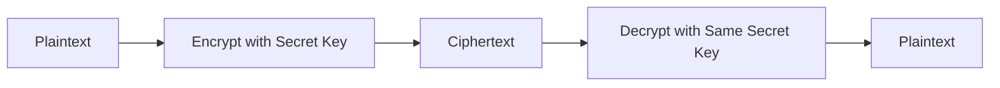

Conceptually:

```text
Plaintext + Key → Ciphertext
Ciphertext + Same Key → Plaintext
```

Symmetric encryption is efficient and suitable for protecting large amounts of data.

The challenge is:

> How do both parties securely obtain the same secret key?

That is where asymmetric cryptography helps.

---

# 54. Asymmetric Encryption

Asymmetric cryptography uses a key pair:

- Public key
- Private key

The public key can be shared.

The private key must remain secret.

A simplified concept:

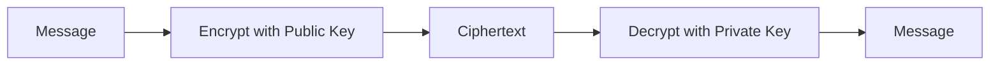

Another use involves digital signatures:

```mermaid
flowchart LR
    D[Data] --> S[Sign with Private Key]
    S --> SG[Signature]
    SG --> V[Verify with Public Key]
    D --> V
```

Asymmetric cryptography is computationally more expensive than symmetric encryption.

It is often used to:

- Authenticate a server
- Establish trust
- Exchange or derive session secrets
- Create digital signatures

Symmetric encryption is then used for efficient ongoing communication.

---

# 55. Why TLS Uses Both

TLS commonly uses asymmetric techniques during connection setup and symmetric encryption for the actual data exchange.

A simplified model:

```mermaid
flowchart TD
    A[Client and Server Begin Handshake]
    A --> B[Server Proves Identity]
    B --> C[Client and Server Establish Shared Secret]
    C --> D[HTTP Data Encrypted Symmetrically]
```

The pattern is:

```text
Asymmetric cryptography:
  Establish trust and negotiate secrets

Symmetric cryptography:
  Efficiently encrypt the session data
```

This combines the strengths of both approaches.

---

# 56. Certificates

A TLS certificate associates a public key with a domain or set of domains.

A simplified certificate contains information such as:

```text
Domain: example.com
Public key: ...
Issuer: trusted certificate authority
Validity period: ...
Digital signature: ...
```

The browser checks whether:

- The certificate is valid for the requested hostname
- The certificate has expired
- The certificate is signed by a trusted authority
- The certificate chain is valid
- The connection is being intercepted or misconfigured

A simplified trust chain:

```mermaid
flowchart TD
    R[Browser Trust Store] --> CA[Trusted Certificate Authority]
    CA --> IC[Intermediate Certificate]
    IC --> SC[Server Certificate]
    SC --> D[example.com]
```

---

# 57. Certificate Authorities

A **Certificate Authority**, or CA, is an organization trusted to issue certificates.

The browser or operating system contains a trust store listing certificate authorities it accepts.

The CA verifies control over a domain according to the certificate-issuance process and signs the certificate.

The browser does not blindly trust every certificate presented by every server.

It checks whether the certificate connects back to a trusted authority.

---

# 58. The TLS Handshake

The exact TLS handshake depends on the TLS version and configuration, but the high-level purpose is consistent.

The client and server need to:

1. Agree on supported versions and algorithms.
2. Establish cryptographic parameters.
3. Authenticate the server.
4. Derive shared session keys.
5. Begin encrypted application communication.

A simplified handshake:

```mermaid
sequenceDiagram
    participant C as Client
    participant S as Server

    C->>S: ClientHello: supported TLS versions and options
    S-->>C: ServerHello: selected options
    S-->>C: Certificate with public key
    S-->>C: Key exchange information
    C->>C: Validate certificate
    C->>S: Key exchange information
    C->>S: Finished message
    S-->>C: Finished message
    C->>S: Encrypted HTTP request
    S-->>C: Encrypted HTTP response
```

This is simplified, but it captures the main idea.

---

# 59. TLS Handshake Steps in Plain Language

## Step 1: Client says hello

The client sends information such as:

- Supported TLS versions
- Supported cryptographic algorithms
- Random values
- Other capabilities

## Step 2: Server responds

The server selects compatible options and sends:

- Selected TLS version
- Selected cipher suite
- Server random value
- Certificate
- Key exchange information

## Step 3: Client validates the certificate

The browser checks:

- Domain name
- Expiration date
- Trusted issuer
- Certificate chain
- Signature validity

If the checks fail, the browser may display a warning.

## Step 4: Key agreement occurs

The client and server perform a key-exchange process.

They derive shared secrets without simply sending the final symmetric key in plain text.

## Step 5: Encrypted communication begins

Both sides now have the information required to encrypt and authenticate application data.

HTTP messages can travel through the protected connection.

---

# 60. What a Network Observer Can See with HTTPS

HTTPS hides the content of HTTP messages from ordinary network observers.

However, some information may still be visible or inferable, depending on the protocol and network conditions:

- That a connection exists
- The destination IP address
- Timing
- Approximate amount of traffic
- Some connection metadata
- Potentially the domain through certain metadata channels

HTTPS does not make the client invisible.

It primarily protects the contents and integrity of the communication.

---

# 61. What HTTPS Does Not Protect

HTTPS does not automatically protect against:

- A malicious browser extension
- Malware on the device
- A compromised server
- Weak passwords
- Broken authorization
- Insecure application logic
- SQL injection
- Cross-site scripting
- Exposed data after decryption
- A user sending malicious requests
- A compromised third-party service

HTTPS protects data in transit between the client and server.

It does not guarantee that the application itself is well-designed.

```text
HTTPS protects the communication channel.
It does not guarantee application security.
```

---

# 62. HTTP vs HTTPS Example

Without HTTPS:

```text
Browser → readable HTTP request → network → server
```

With HTTPS:

```text
Browser → encrypted TLS record → network → server
```

At the server:

```text
Encrypted data → TLS decryption → HTTP request → application
```

At the browser:

```text
HTTP response → TLS encryption → network → browser → decryption → rendering
```

```mermaid
sequenceDiagram
    participant B as Browser
    participant T as TLS Layer
    participant N as Network
    participant S as Server TLS
    participant A as Application

    B->>T: HTTP request
    T->>N: Encrypted TLS data
    N->>S: Encrypted TLS data
    S->>S: Decrypt and verify
    S->>A: HTTP request
    A-->>S: HTTP response
    S->>N: Encrypted TLS data
    N->>T: Encrypted TLS data
    T-->>B: HTTP response
```

---

# 63. CORS and Origins

Browsers enforce rules about requests between different origins.

An origin is commonly defined by:

```text
Scheme + Host + Port
```

For example:

```text
https://app.example.com
```

and:

```text
https://api.example.com
```

have different hosts and therefore different origins.

A frontend at one origin may try to call an API at another origin.

The server may need to explicitly allow that browser request using CORS headers.

Example:

```http
Access-Control-Allow-Origin: https://app.example.com
```

A browser may block access to the response if the server has not authorized the origin.

Important distinction:

> CORS is primarily a browser-enforced access-control mechanism. It does not prevent non-browser clients from sending requests.

CORS will be explored more deeply in API and diagnostic sections.

---

# 64. A Complete HTTPS Request Journey

Let us combine the previous parts.

Suppose a user visits:

```text
https://shop.example/products?category=keyboards
```

A detailed high-level sequence is:

```mermaid
sequenceDiagram
    participant U as User
    participant B as Browser
    participant DNS as DNS Resolver
    participant N as Network
    participant S as Server

    U->>B: Enters HTTPS URL
    B->>B: Parses scheme, host, path, query
    B->>DNS: Resolve shop.example
    DNS-->>B: Returns IP address
    B->>N: Establish transport connection
    N->>S: Connection reaches server
    B->>S: TLS handshake
    S-->>B: Certificate and key-exchange information
    B->>B: Validates certificate
    B->>S: Encrypted HTTP request
    S->>S: Decrypts and processes request
    S-->>B: Encrypted HTTP response
    B->>B: Decrypts response
    B->>B: Parses and renders content
    B-->>U: Displays product page
```

The actual request might conceptually be:

```http
GET /products?category=keyboards HTTP/1.1
Host: shop.example
Accept: text/html
Accept-Language: en-US
Accept-Encoding: gzip, br
```

The server might return:

```http
HTTP/1.1 200 OK
Content-Type: text/html
Content-Encoding: br
Cache-Control: max-age=300

<!doctype html>
<html>
  <body>
    <h1>Keyboards</h1>
  </body>
</html>
```

The browser then discovers additional resources:

```html
<link rel="stylesheet" href="/styles.css">
<script src="/app.js"></script>

```

It sends more requests:

```mermaid
flowchart TD
    A[Initial HTML Response] --> B[Discover CSS]
    A --> C[Discover JavaScript]
    A --> D[Discover Images]
    B --> E[Request styles.css]
    C --> F[Request app.js]
    D --> G[Request keyboard.png]
    E --> H[Render Styled Page]
    F --> H
    G --> H
```

One page visit may therefore produce many HTTP requests.

---

# 65. One Page Load Can Involve Many Requests

A webpage is rarely just one request.

The browser may request:

- The HTML document
- CSS files
- JavaScript files
- Images
- Fonts
- Video files
- API data
- Analytics resources
- Advertisement resources
- Embedded content
- Source maps
- Favicon files

A simplified request list:

```text
GET /products
GET /styles.css
GET /app.js
GET /fonts/inter.woff2
GET /images/keyboard.png
GET /api/products?category=keyboards
GET /api/user/session
GET /favicon.ico
```

The browser may perform many of these concurrently.

```mermaid
flowchart TD
    HTML[GET /products] --> CSS[GET /styles.css]
    HTML --> JS[GET /app.js]
    HTML --> IMG[GET /images/keyboard.png]
    JS --> API1[GET /api/products]
    JS --> API2[GET /api/user/session]
    HTML --> FONT[GET /fonts/inter.woff2]
```

This is why the browser Network panel is so useful: it shows the individual requests that make up a page experience.

---

# 66. HTTP Request Lifecycle Inside a Backend

Once a request reaches a backend, the server commonly processes it through several stages.

```mermaid
flowchart TD
    A[Receive HTTP Request] --> B[Parse Request]
    B --> C[Match Route]
    C --> D[Run Middleware]
    D --> E[Authenticate]
    E --> F[Authorize]
    F --> G[Validate Input]
    G --> H[Apply Business Logic]
    H --> I[Read or Write Data]
    I --> J[Build Response]
    J --> K[Send HTTP Response]
```

Let us examine these stages.

## Parse request

The server reads:

- Method
- Path
- Query parameters
- Headers
- Cookies
- Body

## Match route

The server determines which handler should process the request.

```text
GET /api/products
```

may be routed to a product-listing handler.

## Run middleware

Middleware can perform shared operations such as:

- Logging
- CORS processing
- Authentication
- Rate limiting
- Request parsing
- Compression
- Error handling

## Authenticate

The server determines whether the request identifies a user or service.

## Authorize

The server determines whether that identity may perform the requested operation.

## Validate input

The server checks whether the data is structurally and semantically valid.

## Apply business logic

The server performs the operation according to application rules.

## Read or write data

The server may access:

- Database
- Cache
- File storage
- Message queue
- External API

## Build response

The server chooses:

- Status code
- Headers
- Response body
- Content type

---

# 67. Example: Reading a Product

Suppose the browser sends:

```http
GET /api/products/123 HTTP/1.1
Host: shop.example
Accept: application/json
```

The backend may process it like this:

```mermaid
sequenceDiagram
    participant B as Browser
    participant R as Router
    participant S as Product Service
    participant D as Database

    B->>R: GET /api/products/123
    R->>R: Match product route
    R->>S: Pass product ID 123
    S->>D: Query product 123
    D-->>S: Return product record
    S->>S: Apply visibility rules
    S-->>R: Product response
    R-->>B: 200 JSON response
```

Response:

```http
HTTP/1.1 200 OK
Content-Type: application/json

{
  "id": 123,
  "name": "Mechanical Keyboard",
  "price": 79.99,
  "available": true
}
```

If the product does not exist:

```http
HTTP/1.1 404 Not Found
Content-Type: application/json

{
  "error": {
    "code": "PRODUCT_NOT_FOUND",
    "message": "The requested product could not be found."
  }
}
```

---

# 68. Example: Creating an Order

The browser may send:

```http
POST /api/orders HTTP/1.1
Host: shop.example
Content-Type: application/json
Authorization: Bearer example-token

{
  "items": [
    {
      "productId": 123,
      "quantity": 2
    }
  ]
}
```

The backend should not trust a price supplied by the browser.

Instead, it should:

1. Authenticate the user.
2. Validate the request structure.
3. Look up product `123`.
4. Read the current server-side price.
5. Check inventory.
6. Calculate totals.
7. Create the order.
8. Reserve or reduce inventory.
9. Begin payment processing.
10. Return the result.

```mermaid
flowchart TD
    A[POST /api/orders] --> B[Validate JSON]
    B --> C[Authenticate User]
    C --> D[Load Product 123]
    D --> E[Read Current Price]
    E --> F[Check Inventory]
    F --> G[Calculate Total]
    G --> H[Create Order]
    H --> I[Reserve Inventory]
    I --> J[Return Order Response]
```

Possible response:

```http
HTTP/1.1 201 Created
Content-Type: application/json
Location: /api/orders/456

{
  "id": 456,
  "status": "pending",
  "total": 159.98
}
```

The browser may display:

```text
Order created.
Order number: 456
```

---

# 69. Request Body Validation

Suppose the expected request is:

```json
{
  "email": "alex@example.com",
  "quantity": 2
}
```

The server should validate more than JSON syntax.

It may check:

```text
email exists
email is a string
email has an acceptable format
quantity exists
quantity is an integer
quantity is greater than zero
quantity does not exceed the allowed limit
```

Possible validation response:

```http
HTTP/1.1 422 Unprocessable Content
Content-Type: application/json

{
  "error": {
    "code": "VALIDATION_FAILED",
    "fields": {
      "quantity": "Quantity must be a positive integer."
    }
  }
}
```

A structured error format makes it easier for the frontend to display useful feedback.

---

# 70. Network Errors vs HTTP Errors

This distinction is extremely important.

## Network error

A network error means the client may not have received a valid HTTP response at all.

Examples:

- DNS failure
- Connection timeout
- Connection refused
- TLS failure
- Network disconnected
- Request blocked by browser policy

In JavaScript, a request may reject:

```javascript
try {
  const response = await fetch("/api/products");
} catch (error) {
  console.error("Network-level failure");
}
```

## HTTP error

An HTTP error means the server did return a valid HTTP response, but the status indicates a problem.

Examples:

```text
400 Bad Request
401 Unauthorized
403 Forbidden
404 Not Found
500 Internal Server Error
```

With `fetch`, an HTTP `404` does not necessarily cause the promise to reject automatically.

You must inspect the status:

```javascript
const response = await fetch("/api/products/999");

if (!response.ok) {
  console.error("HTTP error:", response.status);
}
```

A useful model:

```mermaid
flowchart TD
    A[Send Request] --> B{Received HTTP response?}
    B -->|No| C[Network-level error]
    B -->|Yes| D{What status code?}
    D -->|2xx| E[Successful HTTP response]
    D -->|3xx| F[Redirect]
    D -->|4xx| G[Client/request problem]
    D -->|5xx| H[Server problem]
```

---

# 71. Response Parsing

The client must interpret the response body according to its content type.

For JSON:

```javascript
const response = await fetch("/api/products");
const products = await response.json();
```

For plain text:

```javascript
const text = await response.text();
```

For a binary file:

```javascript
const blob = await response.blob();
```

For an image or other resource, the browser may process it automatically based on the content type.

A common error is parsing a non-JSON response as JSON.

For example, the server returns an HTML error page:

```html
<h1>Internal Server Error</h1>
```

but the client assumes JSON:

```javascript
const data = await response.json();
```

This can produce a parsing error.

A safer approach is to inspect the content type or design consistent API error responses.

---

# 72. Content Negotiation Example

A client may request JSON:

```http
GET /api/products HTTP/1.1
Accept: application/json
```

The server responds:

```http
HTTP/1.1 200 OK
Content-Type: application/json
```

For a browser page, the client may request HTML:

```http
GET /products HTTP/1.1
Accept: text/html
```

The server responds:

```http
HTTP/1.1 200 OK
Content-Type: text/html
```

The same backend may expose different representations of related information.

---

# 73. HTTP Caching in More Detail

Suppose the browser requests a CSS file:

```http
GET /styles.css
```

The server responds:

```http
HTTP/1.1 200 OK
Cache-Control: max-age=3600
ETag: "styles-v5"
Content-Type: text/css
```

The browser stores the response.

For the next hour, it may reuse the cached file without contacting the server.

After the cache becomes stale, the browser may send:

```http
GET /styles.css
If-None-Match: "styles-v5"
```

If the file has not changed:

```http
HTTP/1.1 304 Not Modified
```

If it has changed:

```http
HTTP/1.1 200 OK
ETag: "styles-v6"
```

with the new body.

```mermaid
sequenceDiagram
    participant B as Browser
    participant S as Server

    B->>S: GET /styles.css
    S-->>B: 200 + CSS + ETag styles-v5
    B->>B: Cache CSS
    Note over B: Later, cached copy becomes stale
    B->>S: GET /styles.css + If-None-Match styles-v5
    S-->>B: 304 Not Modified
    B->>B: Reuse cached CSS
```

---

# 74. Private Data and Cache-Control

Private or personalized responses require careful cache instructions.

Example:

```http
Cache-Control: private, no-store
```

This may be appropriate for:

- Account pages
- Payment information
- Private messages
- Authentication responses
- Sensitive reports

A careless shared cache could accidentally serve one user’s response to another user.

Caching is therefore both a performance concern and a security concern.

---

# 75. Conditional Requests

Conditional requests allow a client to ask whether a resource has changed.

Common validators include:

- `ETag`
- `Last-Modified`

Example using modification time:

```http
If-Modified-Since: Wed, 10 Jul 2026 12:00:00 GMT
```

Example using an entity tag:

```http
If-None-Match: "abc123"
```

The server can respond:

```text
304 Not Modified
```

instead of retransmitting the full content.

---

# 76. Cookies and Authentication Example

A session-based login may work like this:

```mermaid
sequenceDiagram
    participant U as User
    participant B as Browser
    participant S as Server
    participant D as Database

    U->>B: Submits login form
    B->>S: POST /login
    S->>D: Find account
    D-->>S: Return account record
    S->>S: Verify password
    S-->>B: 302 Redirect + Set-Cookie
    B->>B: Stores session cookie
    B->>S: GET /account + Cookie
    S->>S: Resolve session
    S-->>B: 200 Account page
```

The cookie may contain only an opaque identifier:

```text
session_id=abc123
```

The server uses that identifier to find session information.

The cookie should not necessarily contain all private account data.

---

# 77. Token-Based Authentication Example

Another architecture uses access tokens.

```http
GET /api/account HTTP/1.1
Authorization: Bearer access-token-value
Accept: application/json
```

The backend may:

1. Extract the token.
2. Verify its signature or consult an authorization system.
3. Identify the user.
4. Check permissions.
5. Return data.

```mermaid
flowchart TD
    A[Request with Bearer Token] --> B[Extract Token]
    B --> C{Token Valid?}
    C -->|No| D[401 Unauthorized]
    C -->|Yes| E[Identify User]
    E --> F{Authorized?}
    F -->|No| G[403 Forbidden]
    F -->|Yes| H[Return Protected Data]
```

Tokens and cookies are both tools. The security depends on how they are issued, stored, validated, expired, and revoked.

---

# 78. Request Retries and Duplicate Operations

Networks can fail after the server performs an operation but before the client receives the response.

Example:

```mermaid
sequenceDiagram
    participant C as Client
    participant S as Server

    C->>S: POST /orders
    S->>S: Creates order
    S--xC: Response lost
    C->>S: Retries POST /orders
    S->>S: May create duplicate order
```

The client might think:

```text
The first request failed.
```

But the server may have completed it.

This is a major reason idempotency matters.

For payment or order creation, APIs may support an idempotency key:

```http
Idempotency-Key: unique-request-123
```

The server remembers that key.

If the client retries the same request with the same key, the server can return the original result rather than performing the operation again.

```mermaid
flowchart TD
    A[Request with Idempotency Key] --> B{Key seen before?}
    B -->|No| C[Perform operation and store result]
    B -->|Yes| D[Return stored result]
```

---

# 79. Request Ordering and Concurrency

Multiple requests may be sent at nearly the same time.

For example:

```text
Request A: Update profile name
Request B: Update profile timezone
```

If the server processes them in an unexpected order, the final state may depend on timing.

Applications may need:

- Version numbers
- Timestamps
- Transactions
- Locks
- Conflict detection
- Optimistic concurrency control

A conflict response might be:

```http
409 Conflict
```

with:

```json
{
  "error": "The resource was modified by another request."
}
```

HTTP provides the message transport, but the application must define how concurrent changes are handled.

---

# 80. HTTP and File Uploads

A file upload may use multipart form data:

```http
POST /api/profile/photo HTTP/1.1
Content-Type: multipart/form-data; boundary=----Boundary

------Boundary
Content-Disposition: form-data; name="description"

Profile picture
------Boundary
Content-Disposition: form-data; name="file"; filename="photo.jpg"
Content-Type: image/jpeg

...binary image data...
------Boundary--
```

The backend may then:

- Validate file size
- Check declared and actual file type
- Rename the file
- Scan for malware
- Store it
- Save metadata
- Return a URL or identifier

Response:

```json
{
  "id": "file_123",
  "status": "uploaded"
}
```

---

# 81. Streaming Responses

Some responses are too large or too long-lived to send as one completed body.

Examples:

- Large downloads
- Video streams
- Server-sent events
- Long-running reports
- Live logs

A server may send data incrementally.

```mermaid
sequenceDiagram
    participant C as Client
    participant S as Server

    C->>S: Request stream
    S-->>C: Chunk 1
    S-->>C: Chunk 2
    S-->>C: Chunk 3
    S-->>C: Stream complete
```

Streaming can reduce waiting time before the first data arrives, but it adds complexity around:

- Connection lifetime
- Errors during transmission
- Reconnection
- Buffering
- Backpressure

---

# 82. Long Polling, Server-Sent Events, and WebSockets

HTTP request-response is not the only communication style.

## Long polling

The client sends a request, and the server keeps it open until new data is available.

## Server-sent events

The server sends a stream of events to the browser over a long-lived HTTP connection.

## WebSockets

The client and server establish a persistent, bidirectional connection.

```mermaid
flowchart LR
    R[Traditional Request-Response] --> A[Client asks, server answers]
    LP[Long Polling] --> B[Server delays response]
    SSE[Server-Sent Events] --> C[Server streams updates]
    WS[WebSocket] --> D[Both sides send messages]
```

These technologies are useful for:

- Chat
- Notifications
- Live dashboards
- Multiplayer interactions
- Collaborative editing
- Real-time monitoring

---

# 83. HTTP Error Handling in a Frontend

A frontend should represent different outcomes clearly.

```javascript
async function loadProducts() {
  setState({ status: "loading" });

  try {
    const response = await fetch("/api/products");

    if (response.status === 401) {
      setState({
        status: "error",
        message: "Please sign in."
      });
      return;
    }

    if (response.status === 404) {
      setState({
        status: "empty",
        message: "No products were found."
      });
      return;
    }

    if (!response.ok) {
      setState({
        status: "error",
        message: "The server could not load products."
      });
      return;
    }

    const data = await response.json();

    setState({
      status: "success",
      products: data
    });
  } catch (error) {
    setState({
      status: "error",
      message: "Network connection failed."
    });
  }
}
```

This distinguishes:

- Loading
- Authentication failure
- Not found
- Server error
- Network failure
- Success

---

# 84. HTTP Error Handling in a Backend

A backend should return appropriate status codes.

Poor design:

```http
HTTP/1.1 200 OK

{
  "error": "User is not authorized"
}
```

This makes it harder for clients, monitoring systems, and caches to understand the result.

A clearer response is:

```http
HTTP/1.1 403 Forbidden
Content-Type: application/json

{
  "error": {
    "code": "INSUFFICIENT_PERMISSION",
    "message": "You cannot perform this operation."
  }
}
```

Consistent status codes and error formats improve:

- Frontend behavior
- Debugging
- Monitoring
- Documentation
- API client development

---

# 85. Headers Can Carry Sensitive Information

Headers may contain:

- Cookies
- Authorization tokens
- Personal information
- Internal identifiers
- Referrer data
- Device details

Avoid logging sensitive headers carelessly.

For example, this should not appear in ordinary logs:

```http
Authorization: Bearer secret-token
Cookie: session_id=private-value
```

Production logging systems should redact or mask secrets.

---

# 86. HTTPS and Mixed Content

A secure HTTPS page should not normally load insecure HTTP resources.

For example:

```text
https://example.com
```

loading:

```text
http://example.com/script.js
```

creates a mixed-content problem.

The browser may block the resource because an attacker could modify the insecure script.

Mixed content can affect:

- JavaScript
- Images
- Stylesheets
- Fonts
- API requests
- Frames

The general rule is:

> Once a page is delivered securely, its important resources should also be delivered securely.

---

# 87. HSTS

HTTP Strict Transport Security, or HSTS, allows a server to tell browsers:

> Always use HTTPS for this domain for a specified period.

Example:

```http
Strict-Transport-Security: max-age=31536000; includeSubDomains
```

This helps prevent downgrade attempts where an attacker tries to force a user back to plain HTTP.

HSTS should be configured carefully, especially when including subdomains.

---

# 88. Certificate Errors

A browser may show a certificate warning if:

- The certificate is expired
- The hostname does not match
- The certificate is self-signed
- The certificate chain is invalid
- The system clock is incorrect
- The certificate was revoked or rejected
- The connection is being intercepted

A certificate warning should not be ignored casually, especially on login or payment pages.

---

# 89. HTTP Debugging Questions

When debugging a request, ask:

1. What URL was requested?
2. What HTTP method was used?
3. What query parameters were present?
4. What request headers were sent?
5. Was authentication included?
6. What was the request body?
7. Did the request reach the server?
8. What status code came back?
9. What response headers were returned?
10. What was the response body?
11. Was the response JSON, HTML, or another format?
12. Was there a redirect?
13. Was the response served from cache?
14. How long did DNS, connection, TLS, and server processing take?
15. Did the browser block the response because of CORS or mixed content?

These questions transform a vague complaint such as:

```text
The button does not work.
```

into a structured investigation.

---

# 90. A Complete Diagnostic Example

Suppose a user clicks “Load orders,” but nothing appears.

## Step 1: Check whether a request was sent

If no request appears:

```text
Likely frontend event or JavaScript problem.
```

## Step 2: Inspect the request URL

Maybe the frontend requested:

```text
/api/order
```

but the backend route is:

```text
/api/orders
```

This may produce:

```text
404 Not Found
```

## Step 3: Inspect the status code

If the response is:

```text
401 Unauthorized
```

the user may need to sign in.

If:

```text
403 Forbidden
```

the user may not have permission.

If:

```text
500 Internal Server Error
```

the backend may have failed.

## Step 4: Inspect the response body

The response may explain:

```json
{
  "error": "Session expired"
}
```

## Step 5: Inspect timing

If the request takes a long time before returning:

- DNS may be slow
- Connection may be delayed
- Server processing may be slow
- Database query may be slow
- Upstream service may be timing out

---

# 91. Part 3 Practical Exercise: Read a Raw Request

Study this request:

```http
POST /api/messages?draft=false HTTP/1.1
Host: chat.example.com
Accept: application/json
Content-Type: application/json
Authorization: Bearer example-token
User-Agent: ExampleBrowser/1.0

{
  "recipientId": 42,
  "text": "Hello"
}
```

Identify:

```text
Method:
Path:
Query parameter:
Host:
Expected response type:
Request body type:
Authentication mechanism:
Body fields:
```

Expected answers:

```text
Method:
  POST

Path:
  /api/messages

Query parameter:
  draft=false

Host:
  chat.example.com

Expected response type:
  application/json

Request body type:
  application/json

Authentication:
  Bearer token

Body fields:
  recipientId
  text
```

---

# 92. Part 3 Practical Exercise: Read a Raw Response

Study this response:

```http
HTTP/1.1 201 Created
Content-Type: application/json
Location: /api/messages/900
Cache-Control: no-store

{
  "id": 900,
  "status": "sent"
}
```

Identify:

```text
Status code:
Meaning:
Response type:
Created resource:
Caching behavior:
Body fields:
```

Expected answers:

```text
Status code:
  201

Meaning:
  A resource was created

Response type:
  JSON

Created resource:
  /api/messages/900

Caching behavior:
  Do not store the response

Body fields:
  id
  status
```

---

# 93. Part 3 Practical Exercise: Use cURL

Retrieve a page:

```bash
curl https://example.com
```

Display response headers:

```bash
curl -I https://example.com
```

Show detailed connection information:

```bash
curl -v https://example.com
```

Send a JSON request:

```bash
curl -X POST https://api.example.com/orders \
  -H "Content-Type: application/json" \
  -d '{"productId":123,"quantity":2}'
```

Send an authorization header:

```bash
curl https://api.example.com/account \
  -H "Authorization: Bearer example-token"
```

Follow redirects:

```bash
curl -L http://example.com
```

The exact endpoint and authentication requirements depend on the API.

---

# 94. Common Beginner Mistakes

## Mistake 1: Confusing URL path and query string

```text
/products/123
```

is not the same as:

```text
/products?id=123
```

The backend may treat them as different routes.

## Mistake 2: Sending JSON without the correct content type

If you send JSON but omit:

```http
Content-Type: application/json
```

the server may not parse it correctly.

## Mistake 3: Treating every non-`200` response as the same

A `201`, `204`, `301`, `401`, `403`, `404`, and `500` all communicate different outcomes.

## Mistake 4: Assuming `fetch` rejects on every HTTP error

Network failures and HTTP error responses must be handled differently.

## Mistake 5: Placing secrets in frontend code

Anything delivered to the browser may be inspected.

## Mistake 6: Trusting client-provided prices or permissions

The backend must calculate and verify authoritative values.

## Mistake 7: Ignoring response content types

Do not parse HTML as JSON or binary data as plain text without understanding the format.

## Mistake 8: Assuming HTTPS means the application is secure

HTTPS protects transport, not application logic.

---

# 95. Part 3 Core Mental Model

A web request can be understood as:

```text
Client intent
  ↓
HTTP method
  ↓
URL path and parameters
  ↓
Headers
  ↓
Optional body
  ↓
Server processing
  ↓
Status code
  ↓
Response headers
  ↓
Response body
```

A compact diagram:

```mermaid
flowchart LR
    I[Client Intent] --> M[HTTP Method]
    M --> U[URL Path and Query]
    U --> H[Headers]
    H --> B[Optional Body]
    B --> S[Server Processing]
    S --> C[Status Code]
    C --> RH[Response Headers]
    RH --> RB[Response Body]
```

For HTTPS:

```text
HTTP message
  ↓
TLS protection
  ↓
Transport connection
  ↓
IP routing
  ↓
Network infrastructure
```

---

# Part 3 Summary

In this part, we examined HTTP, HTTPS, and the request-response cycle.

The most important ideas are:

- HTTP is the primary application protocol of the Web.
- HTTP uses a client-request and server-response model.
- URLs identify destinations and resources.
- A URL may contain a scheme, host, port, path, query string, and fragment.
- The fragment is usually handled by the browser and is not sent to the server.
- HTTP requests contain a method, target, headers, and optional body.
- HTTP responses contain a status code, headers, and optional body.
- `GET` retrieves data.
- `POST` submits data or creates resources.
- `PUT` commonly replaces a resource.
- `PATCH` commonly partially updates a resource.
- `DELETE` requests removal.
- `HEAD` retrieves headers without the body.
- `OPTIONS` communicates supported methods and browser permission behavior.
- Path parameters commonly identify resources.
- Query parameters commonly filter, search, sort, or paginate.
- Headers carry metadata.
- `Content-Type` describes the body format.
- `Accept` describes preferred response formats.
- Request bodies may contain JSON, form data, multipart data, text, or binary content.
- `2xx` status codes indicate success.
- `3xx` status codes indicate redirection or caching behavior.
- `4xx` status codes indicate request, authentication, permission, or resource problems.
- `5xx` status codes indicate server or upstream failures.
- Cookies can maintain sessions and preferences.
- Bearer tokens can authenticate API requests.
- HTTP caching improves performance but must be designed carefully.
- HTTPS protects confidentiality, integrity, and server authentication.
- TLS commonly uses asymmetric cryptography for setup and symmetric cryptography for efficient session encryption.
- Certificates connect domain names with public keys through trusted certificate authorities.
- A network failure is different from an HTTP error.
- A successful HTTP response does not always mean the business operation succeeded.
- Retries can duplicate non-idempotent operations unless the application uses protections such as idempotency keys.
- HTTP is the communication language; application logic determines what the messages mean.

The complete high-level model is:

```mermaid
flowchart TD
    U[User] --> B[Browser]
    B --> DNS[DNS Resolution]
    DNS --> NET[Network Routing]
    NET --> TLS[TLS Handshake]
    TLS --> REQ[Encrypted HTTP Request]
    REQ --> APP[Backend Application]
    APP --> DATA[(Database and Services)]
    DATA --> APP
    APP --> RESP[HTTP Response]
    RESP --> TLS2[TLS Encryption]
    TLS2 --> B
    B --> UI[Rendered Interface]
    UI --> U
```

In **Part 4**, we will examine APIs and service design in detail, including REST, resource-oriented URLs, CRUD operations, GraphQL, RPC, JSON, XML, multipart form data, API contracts, versioning, pagination, and error design.


