# Web Mechanics, Architecture & Network Fundamentals

# Part 4 — RESTful Services and API Paradigms  
## Resource Design, HTTP Semantics, Data Formats, and Service Contracts

---

# Part 4 Overview

In Part 3, we examined HTTP and HTTPS.

We learned that web clients and servers communicate through:

- URLs
- HTTP methods
- Headers
- Request bodies
- Status codes
- Response bodies
- Cookies
- Tokens
- Secure TLS connections

Now we can examine a more specific question:

> How should an application organize the HTTP endpoints through which clients communicate?

This is where **APIs** and **API design** become important.

An API is not merely a URL.

An API is a defined interface that allows one software system to communicate with another.

For a web API, the interface may define:

- Which URLs exist
- Which HTTP methods are supported
- What data clients may send
- What data the server returns
- Which headers are required
- How authentication works
- What errors look like
- How pagination works
- How results are filtered
- How changes are versioned
- What behavior clients can rely on

A simple API interaction looks like this:

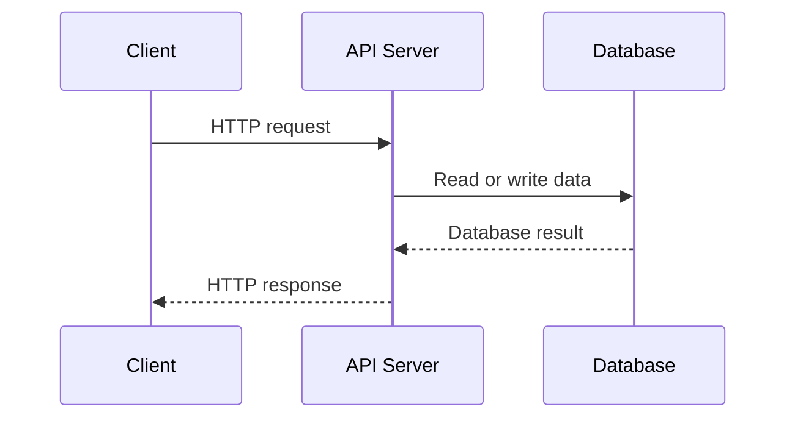

The API creates a boundary between the client and the internal implementation.

The client does not need to know:

- Which database is used
- How tables are organized
- Which programming language runs the server
- Whether the server calls another service
- Whether the response came from a cache
- How the business logic is implemented internally

The client needs to understand the API contract.

This part explores:

- What APIs are
- What REST means
- REST constraints
- Resources and representations
- URI and endpoint design
- CRUD operations
- HTTP methods and resource operations
- Statelessness
- Idempotency
- REST response design
- Pagination, filtering, sorting, and searching
- Relationships between resources
- Nested routes
- API error formats
- API versioning
- Authentication and authorization boundaries
- GraphQL
- RPC
- gRPC
- JSON-RPC
- REST, GraphQL, and RPC tradeoffs
- Serialization
- JSON
- XML
- Form encoding
- Multipart form data
- Binary formats
- Schema and contract design

---

# 1. What Is an API?

API stands for:

```text
Application Programming Interface
```

An API is an interface through which one program can use the capabilities or data of another program.

The concept is broader than web development.

Examples of APIs include:

- Operating system APIs
- Database APIs
- Library APIs
- Hardware APIs
- Browser APIs
- Web APIs
- Payment APIs
- Cloud provider APIs

A web API is an API accessible through network communication, often HTTP.

---

## 1.1 An Everyday Analogy

Imagine a restaurant.

```text
Customer → Menu → Waiter → Kitchen
```

The customer does not enter the kitchen and directly manipulate ingredients.

Instead:

1. The menu describes available options.
2. The customer places an order.
3. The waiter communicates the order.
4. The kitchen processes it.
5. The waiter returns the result.

A web API is similar:

```text
Client → API contract → Backend → Database or services
```

The API is like the menu and ordering process.

It defines:

- What can be requested
- How requests should be written
- What responses mean
- What errors may occur

---

## 1.2 The API Boundary

An API creates a boundary between systems.

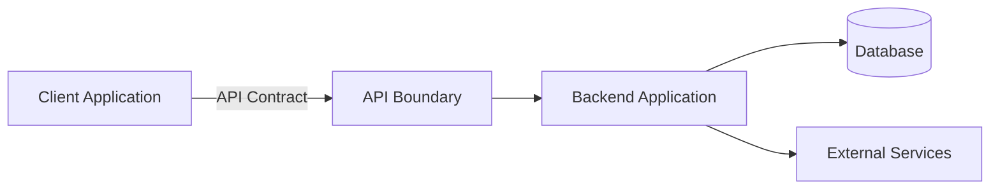

The client should not need direct access to:

- Private database credentials
- Internal database tables
- Secret service keys
- Internal network addresses
- Backend implementation details

The API exposes selected operations in a controlled way.

---

# 2. API Consumer and API Provider

An API involves at least two sides.

## API provider

The system that exposes the API.

Examples:

- An online store backend
- A payment company
- A weather service
- A social platform
- A cloud provider

## API consumer

The system that calls the API.

Examples:

- A browser frontend
- A mobile application
- Another backend
- A command-line program
- An integration partner
- An automated script

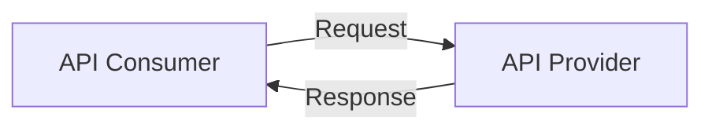

The consumer and provider may be built by the same organization or by entirely different organizations.

---

# 3. What Is REST?

REST stands for:

```text
Representational State Transfer
```

REST is an architectural style for designing distributed systems.

It is not a programming language.

It is not a specific framework.

It is not exactly the same thing as HTTP.

However, HTTP provides many features that make REST-style APIs practical.

REST encourages systems to:

- Represent things as resources
- Give resources identifiable URLs
- Use standard HTTP methods
- Transfer representations of resources
- Remain stateless between requests
- Use standard HTTP semantics
- Separate client and server responsibilities
- Support cacheable responses when appropriate

A REST API commonly looks like:

```text
GET    /products
GET    /products/123
POST   /products
PATCH  /products/123
DELETE /products/123
```

The resource in this example is:

```text
Product
```

The API uses HTTP methods to describe actions on that resource.

---

# 4. What Is a Resource?

A **resource** is something that the API represents or manages.

Examples include:

- User
- Product
- Order
- Article
- Comment
- Message
- Invoice
- Payment
- Image
- Video
- Organization
- Subscription

A resource does not have to be a physical object.

It can represent:

- A database record
- A concept
- A relationship
- A generated report
- A calculation
- A stateful process
- A collection of related items

For example:

```text
/users/42
/products/123
/orders/9001
/reports/monthly-sales
```

Each URL identifies a resource or resource collection.

---

# 5. Resources and Representations

A resource itself is an abstract concept.

A **representation** is a particular format used to transfer information about that resource.

For example, the resource may be:

```text
Product 123
```

Its JSON representation may be:

```json
{
  "id": 123,
  "name": "Mechanical Keyboard",
  "price": 79.99
}
```

Its HTML representation may be:

```html
<article>
  <h1>Mechanical Keyboard</h1>
  <p>$79.99</p>
</article>
```

Its XML representation may be:

```xml
<product>
  <id>123</id>
  <name>Mechanical Keyboard</name>
  <price>79.99</price>
</product>
```

The resource is conceptually the same, but the representation differs.

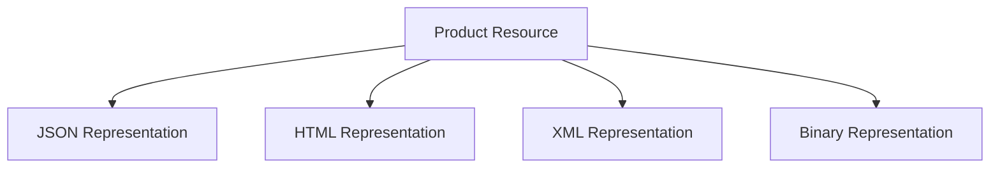

The `Content-Type` response header identifies the representation format.

---

# 6. Collections and Individual Resources

REST APIs commonly distinguish between a collection and an individual resource.

## Collection

```text
/products
```

This represents a collection of products.

## Individual resource

```text
/products/123
```

This represents one product.

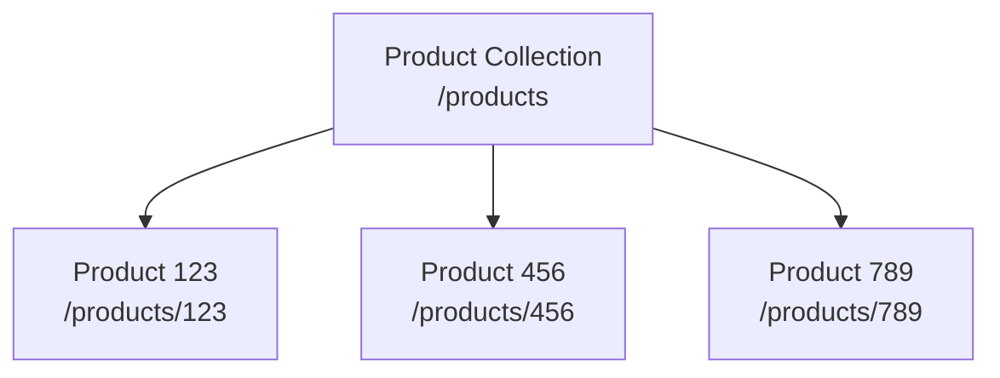

Typical operations:

```http
GET /products
```

Retrieve a collection.

```http
GET /products/123
```

Retrieve one resource.

```http
POST /products
```

Create a new product in the collection.

```http
PATCH /products/123
```

Modify product `123`.

```http
DELETE /products/123
```

Remove product `123`.

---

# 7. CRUD Operations

CRUD is a common acronym for four basic data operations:

```text
Create
Read
Update
Delete
```

A typical REST mapping is:

| CRUD operation | HTTP method | Example |
|---|---|---|
| Create | `POST` | `POST /products` |
| Read collection | `GET` | `GET /products` |
| Read one | `GET` | `GET /products/123` |
| Replace | `PUT` | `PUT /products/123` |
| Partially update | `PATCH` | `PATCH /products/123` |
| Delete | `DELETE` | `DELETE /products/123` |

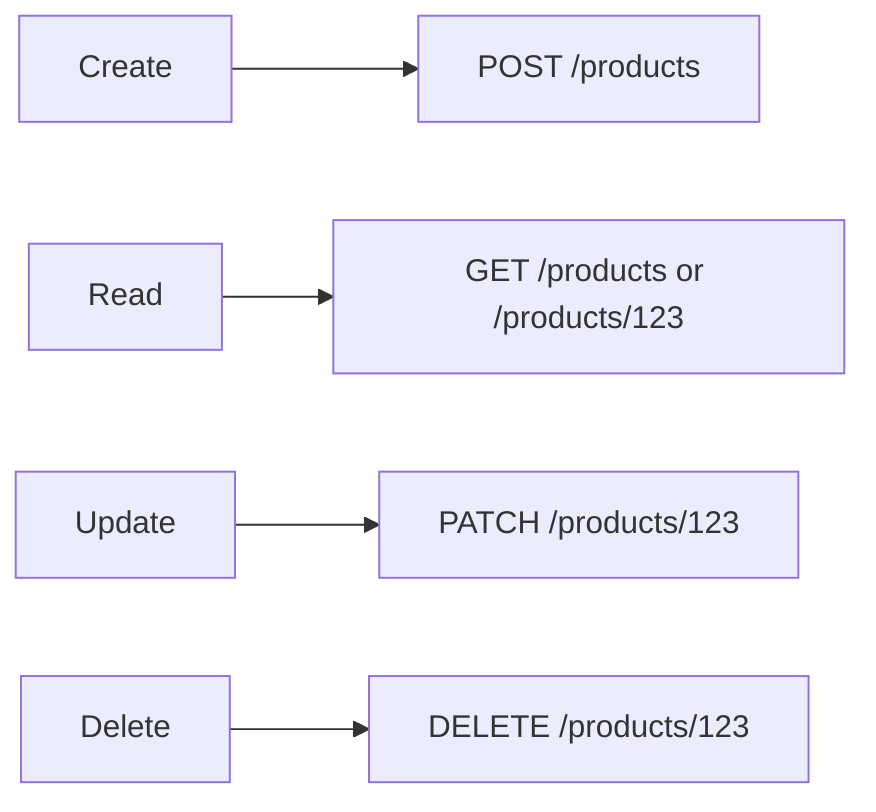

CRUD is useful, but not every business operation fits neatly into CRUD.

For example:

- Submit payment
- Approve invoice
- Send invitation
- Cancel subscription
- Publish article
- Generate report

These may require action-oriented endpoints or domain-specific resource modeling.

---

# 8. Resource-Oriented URL Design

A REST-style URL usually identifies a resource rather than describing a user-interface action.

Prefer:

```text
POST /orders
```

over:

```text
POST /create-order
```

Prefer:

```text
DELETE /users/42
```

over:

```text
POST /delete-user?id=42
```

The HTTP method already communicates the intended operation.

A resource-oriented design separates:

```text
What resource?
```

from:

```text
What operation?
```

For example:

```text
PATCH /products/123
```

means:

```text
Resource: product 123
Operation: partial update
```

---

# 9. Nouns and Verbs in API URLs

A common convention is:

```text
URLs use nouns.
HTTP methods express verbs.
```

Examples:

```http
GET    /articles
POST   /articles
GET    /articles/10
PATCH  /articles/10
DELETE /articles/10
```

The noun is:

```text
articles
```

The method expresses:

```text
retrieve
create
modify
delete
```

Less REST-like:

```text
GET /get-articles
POST /create-article
POST /update-article
POST /delete-article
```

These endpoints may work, but they duplicate information that HTTP already provides.

---

# 10. Singular and Plural Resource Names

Most APIs use plural nouns for collections:

```text
/users
/products
/orders
/comments
```

Individual resources use an identifier:

```text
/users/42
/products/123
/orders/9001
```

This creates a consistent pattern.

Some APIs use singular names in certain cases:

```text
/profile
/account
/settings
```

This can make sense for singleton resources, where each user has one profile or one account.

The important goal is consistency.

---

# 11. Resource Identifiers

A resource identifier can be:

- Integer
- UUID
- String
- Slug
- Composite identifier
- Opaque public identifier

Examples:

```text
/products/123
/users/550e8400-e29b-41d4-a716-446655440000
/articles/web-networking-basics
```

## Sequential numeric identifiers

```text
/products/123
```

Advantages:

- Simple
- Compact
- Easy to use internally

Potential concerns:

- Can reveal record counts
- May make enumeration easier
- May expose internal database structure

## UUIDs

```text
/products/550e8400-e29b-41d4-a716-446655440000
```

Advantages:

- Difficult to guess
- Useful across distributed systems
- Does not reveal simple sequence position

UUIDs are not a substitute for authorization. A user must still be denied access to resources they do not own.

---

# 12. Nested Resources

Some resources are naturally related.

For example:

```text
/users/42/orders
```

may represent orders belonging to user `42`.

```text
/orders/9001/items
```

may represent items within order `9001`.

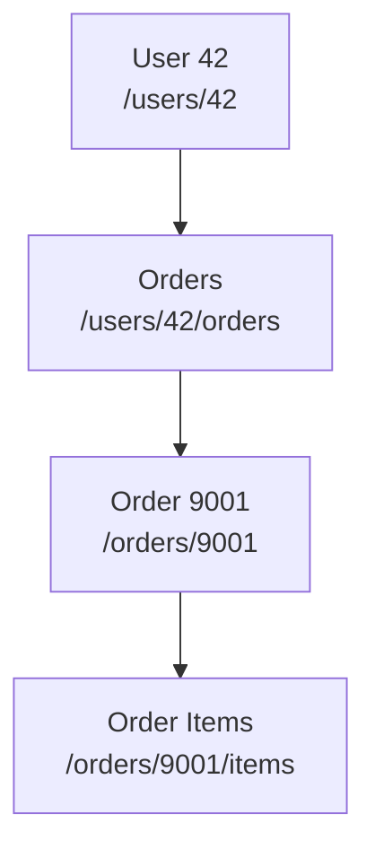

Nested routes can make relationships clear.

However, excessive nesting can make URLs difficult to use.

Too deeply nested:

```text
/organizations/1/projects/2/tasks/3/comments/4/reactions
```

Sometimes a simpler top-level route is better:

```text
/comments/4
```

The API can still include relationship information in the response.

---

# 13. Relationships in API Responses

A product may belong to a category.

An order may belong to a user.

A comment may belong to an article.

An API can represent relationships in several ways.

## Embedded relationship

```json
{
  "id": 9001,
  "status": "pending",
  "user": {
    "id": 42,
    "name": "Alex"
  }
}
```

## Linked relationship

```json
{
  "id": 9001,
  "status": "pending",
  "userId": 42,
  "links": {
    "user": "/users/42"
  }
}
```

## Separate requests

```text
GET /orders/9001
GET /users/42
```

Each approach has tradeoffs involving:

- Response size
- Number of requests
- Coupling
- Caching
- Client complexity
- Data freshness

---

# 14. HTTP Methods and REST Semantics

REST-style APIs should use HTTP methods consistently.

## Retrieving products

```http
GET /products
```

## Creating a product

```http
POST /products
```

## Replacing a product

```http
PUT /products/123
```

## Partially updating a product

```http
PATCH /products/123
```

## Deleting a product

```http
DELETE /products/123
```

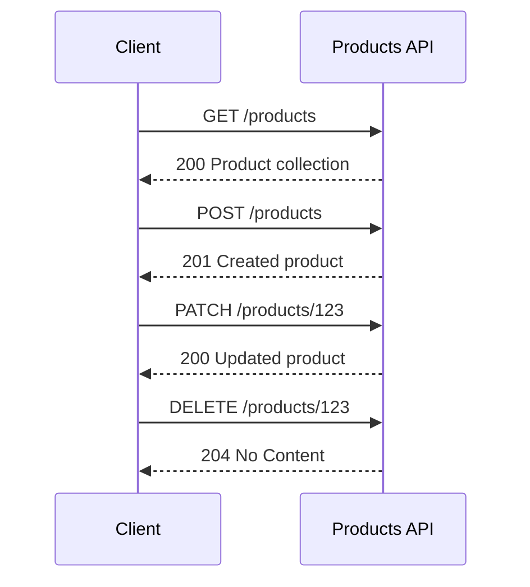

---

# 15. POST vs PUT for Creation

Some APIs create resources using `POST`:

```http
POST /orders
```

The server chooses the new identifier.

```http
HTTP/1.1 201 Created
Location: /orders/9001
```

Other APIs use `PUT` when the client chooses the identifier:

```http
PUT /users/42
```

This can mean:

> Create or replace user 42 with this representation.

The distinction is related to idempotency.

Repeated `POST` requests may create multiple resources.

Repeated identical `PUT` requests should result in the same final state.

---

# 16. Idempotency in API Design

An operation is idempotent when repeating it produces the same intended final state.

## Example: PUT

```http
PUT /profiles/42
```

Body:

```json
{
  "displayName": "Alex"
}
```

Sending the same request multiple times should leave the profile with the same display name.

## Example: DELETE

```http
DELETE /profiles/42
```

After the first successful deletion, repeating the request should not recreate or alter the resource.

## Example: POST

```http
POST /payments
```

Repeating the request may create multiple payments.

For sensitive operations, APIs may support an idempotency key:

```http
Idempotency-Key: payment-attempt-abc123
```

The server stores the result associated with the key.

---

# 17. Statelessness

One of REST’s major constraints is statelessness.

Statelessness means:

> Each request should contain the information necessary for the server to process it.

The server should not rely on an invisible conversational state stored only in memory from a previous request.

Example:

```http
GET /orders/9001
Authorization: Bearer token
```

The request includes authentication information needed to identify the caller.

Statelessness does not mean the application cannot store data.

The server may still store:

- Users
- Orders
- Sessions
- Products
- Preferences
- Files
- Job status

It means the meaning of the current request should not depend on an undocumented temporary conversation inside one particular server process.

---

# 18. Why Stateless APIs Help Scaling

Suppose an API runs on three servers:

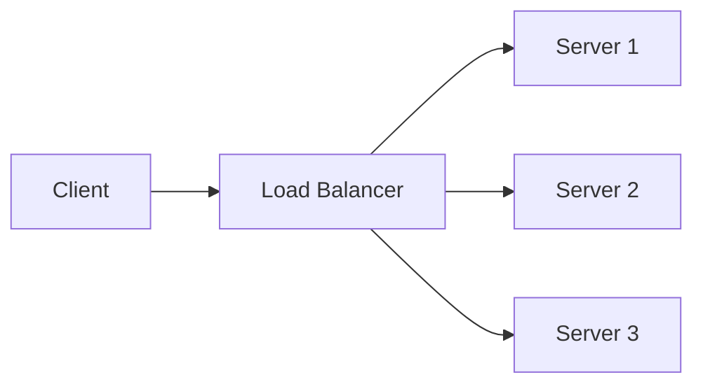

If each request contains the required identity and context, any healthy server can process it.

```text
Request 1 → Server 1
Request 2 → Server 3
Request 3 → Server 2
```

This makes load balancing easier.

A stateful design might require every request from a user to return to the same server, or require shared session storage.

That can still work, but it adds complexity.

---

# 19. Statelessness Does Not Mean “No Sessions”

A session-based application can still be designed in a way that supports scalable architecture.

For example:

```text
Browser sends session cookie
  ↓
Any server receives request
  ↓
Server looks up session in shared session storage
```

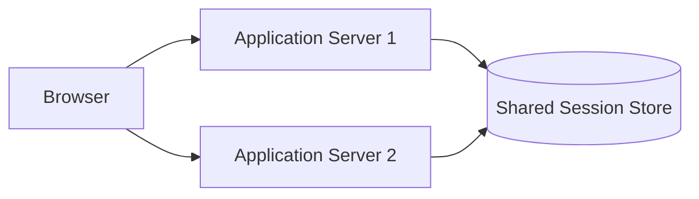

The server does not need to remember the session only in its local memory.

The broader lesson:

> Statelessness concerns how requests are processed, not whether the application stores information anywhere.

---

# 20. REST and Cacheability

REST encourages responses to indicate whether they can be cached.

For example:

```http
GET /products
Cache-Control: max-age=300
```

A cache may reuse the response for five minutes.

Cacheability works especially well for:

- Public product catalogs
- Documentation
- Images
- CSS
- JavaScript
- Public articles

It requires more caution for:

- Private account data
- Payment information
- Personalized results
- User-specific dashboards

The server should communicate caching instructions through headers.

---

# 21. API Collections and Pagination

Returning every resource in a collection can become inefficient.

Bad for a large collection:

```http
GET /products
```

Response:

```json
{
  "items": [
    "... millions of products ..."
  ]
}
```

Instead, the API may paginate results.

```http
GET /products?page=2&limit=20
```

Possible response:

```json
{
  "items": [
    {
      "id": 21,
      "name": "Keyboard"
    }
  ],
  "page": 2,
  "limit": 20,
  "total": 438
}
```

---

## 21.1 Page-Based Pagination

Example:

```text
/products?page=1&limit=20
/products?page=2&limit=20
/products?page=3&limit=20
```

Advantages:

- Easy to understand
- Easy to implement
- Convenient for page-number interfaces

Potential problem:

If records are inserted or deleted while navigating, later pages may shift.

---

## 21.2 Offset Pagination

Example:

```text
/products?offset=40&limit=20
```

This means:

```text
Skip 40 records and return 20.
```

It is simple but can become inefficient for large offsets.

---

## 21.3 Cursor Pagination

Cursor pagination uses a marker representing a position.

```http
GET /products?limit=20&after=cursor_abc
```

Response:

```json
{
  "items": [
    {
      "id": 21,
      "name": "Keyboard"
    }
  ],
  "nextCursor": "cursor_def"
}
```

The client requests the next page using the returned cursor.

Advantages:

- Better for large datasets
- More stable when records change
- Useful for feeds and timelines

Tradeoff:

- More complex for clients and servers
- Less convenient for jumping directly to page 100

---

# 22. Filtering

Filtering lets clients request a subset of a collection.

Examples:

```http
GET /products?category=keyboards
GET /orders?status=pending
GET /users?country=Canada
```

A server may support multiple filters:

```http
GET /products?category=keyboards&available=true
```

The API should document:

- Supported filter names
- Accepted values
- Whether filters are case-sensitive
- How multiple filters combine
- What happens with unknown filters

---

# 23. Sorting

Sorting determines result order.

Examples:

```http
GET /products?sort=price
GET /products?sort=-price
GET /articles?sort=publishedAt
```

A common convention is:

```text
sort=price       ascending
sort=-price      descending
```

Another is:

```text
sortBy=price&order=desc
```

APIs should avoid allowing arbitrary database expressions through query parameters.

The server should whitelist supported sorting fields.

---

# 24. Searching

Search is often represented with a query parameter:

```http
GET /products?q=mechanical+keyboard
```

For more complex searches:

```http
GET /articles?query=networking&language=en&limit=20
```

Search may involve:

- Database indexes
- Full-text search systems
- Search engines
- Ranking algorithms
- Typo tolerance
- Filters
- Facets

The API interface may remain simple even when the backend implementation is complex.

---

# 25. Field Selection

Sometimes clients need only certain fields.

Example:

```http
GET /users/42?fields=id,name
```

Response:

```json
{
  "id": 42,
  "name": "Alex"
}
```

Field selection can reduce payload size, but it introduces more API complexity.

It must be designed carefully so clients cannot request:

- Private fields
- Internal database values
- Security-sensitive information
- Fields they are not authorized to view

---

# 26. Expanding Related Resources

An API may let clients request related information in one response.

Example:

```http
GET /orders/9001?include=items,payment
```

Response:

```json
{
  "id": 9001,
  "status": "paid",
  "items": [
    {
      "productId": 123,
      "quantity": 2
    }
  ],
  "payment": {
    "status": "confirmed"
  }
}
```

This can reduce the number of requests, but may make responses:

- Larger
- Slower to generate
- More difficult to cache
- More complicated to authorize

---

# 27. API Error Design

A useful API should return errors in a predictable format.

A simple error:

```json
{
  "error": "Product not found"
}
```

A more structured error:

```json
{
  "error": {
    "code": "PRODUCT_NOT_FOUND",
    "message": "The requested product could not be found.",
    "requestId": "req_abc123"
  }
}
```

For validation errors:

```json
{
  "error": {
    "code": "VALIDATION_FAILED",
    "message": "One or more fields are invalid.",
    "fields": {
      "email": "Enter a valid email address.",
      "quantity": "Quantity must be at least 1."
    }
  }
}
```

A consistent structure makes frontend handling easier.

---

# 28. Do Not Expose Internal Errors

A backend may encounter an error such as:

```text
Database connection timeout at internal host db-prod-3
```

That detail may be useful in server logs but should not normally be sent to the client.

Safer response:

```json
{
  "error": {
    "code": "INTERNAL_ERROR",
    "message": "The request could not be completed.",
    "requestId": "req_abc123"
  }
}
```

The request ID allows support and engineering teams to locate the detailed internal logs.

---

# 29. API Authentication and Authorization

An API may require authentication.

Common approaches include:

- Session cookies
- Bearer tokens
- API keys
- OAuth access tokens
- Mutual TLS
- Signed requests

Authentication answers:

```text
Who is making the request?
```

Authorization answers:

```text
What may that caller do?
```

For example:

```http
GET /users/42/orders
Authorization: Bearer token
```

The server must verify:

1. The token is valid.
2. The token identifies a user.
3. The user is allowed to view orders.
4. The requested data belongs to that user or is otherwise accessible.

An identifier in a URL is not proof of permission.

```text
/users/42/orders
```

does not mean every authenticated user may see user `42`’s orders.

---

# 30. API Keys

An API key is a credential identifying an application or integration.

Example:

```http
X-API-Key: example-key
```

API keys may be used for:

- Public developer APIs
- Service-to-service calls
- Usage tracking
- Rate limiting
- Integration identification

An API key should not necessarily be treated as a full user identity.

If a secret API key is embedded in frontend JavaScript, users can inspect and copy it.

Private API keys should remain on controlled servers.

---

# 31. Rate Limiting

APIs may limit how many requests a client can make.

Reasons include:

- Preventing abuse
- Protecting infrastructure
- Controlling costs
- Ensuring fair use
- Reducing accidental overload
- Defending against brute-force attempts

A server may respond:

```http
HTTP/1.1 429 Too Many Requests
Retry-After: 60
```

A response might contain:

```json
{
  "error": {
    "code": "RATE_LIMITED",
    "message": "Too many requests. Try again later."
  }
}
```

APIs may also provide headers such as:

```http
X-RateLimit-Limit: 1000
X-RateLimit-Remaining: 42
X-RateLimit-Reset: 1780000000
```

---

# 32. API Versioning

APIs evolve.

A response or endpoint that worked six months ago may need to change.

Versioning helps manage compatibility.

Common strategies include:

## URL versioning

```text
/api/v1/products
/api/v2/products
```

## Header versioning

```http
Accept: application/vnd.example.v2+json
```

## Query parameter versioning

```text
/api/products?version=2
```

URL versioning is easy to discover and commonly used.

Header versioning can keep URLs cleaner but is less obvious when testing manually.

---

# 33. Backward Compatibility

An API change is backward-compatible when existing clients continue to work.

Usually safer changes include:

- Adding a new optional response field
- Adding a new endpoint
- Adding a new optional query parameter
- Supporting an additional request format

Potentially breaking changes include:

- Removing a field
- Renaming a field
- Changing a field’s type
- Changing the meaning of a status code
- Making an optional field required
- Changing pagination behavior
- Removing an endpoint

Example of a risky change:

Original:

```json
{
  "price": 79.99
}
```

New:

```json
{
  "price": {
    "amount": 79.99,
    "currency": "USD"
  }
}
```

The new response may be better designed, but existing clients expecting a number may break.

---

# 34. API Documentation

Good API documentation explains:

- Endpoint URL
- HTTP method
- Authentication
- Required headers
- Query parameters
- Path parameters
- Request body
- Success responses
- Error responses
- Examples
- Rate limits
- Pagination
- Versioning
- Deprecation rules

Example documentation:

```text
POST /api/orders

Authentication:
  Bearer token required

Request body:
{
  "items": [
    {
      "productId": number,
      "quantity": number
    }
  ]
}

Success:
  201 Created

Errors:
  400 Invalid request
  401 Authentication required
  409 Inventory conflict
  422 Validation failed
```

OpenAPI is a widely used format for describing HTTP APIs in a machine-readable way.

---

# 35. What Is GraphQL?

GraphQL is an API query language and runtime.

Unlike a traditional REST API, GraphQL commonly exposes one main endpoint:

```text
POST /graphql
```

The client sends a query describing the data it wants.

Example:

```graphql
query {
  product(id: 123) {
    id
    name
    price
  }
}
```

The server returns:

```json
{
  "data": {
    "product": {
      "id": 123,
      "name": "Mechanical Keyboard",
      "price": 79.99
    }
  }
}
```

The client chooses which fields to receive.

---

# 36. GraphQL Schema

GraphQL APIs are defined by a schema.

Example:

```graphql
type Product {
  id: ID!
  name: String!
  price: Float!
  available: Boolean!
}

type Query {
  product(id: ID!): Product
  products: [Product!]!
}
```

The schema describes:

- Types
- Fields
- Arguments
- Relationships
- Mutations
- Subscriptions

The server validates client queries against the schema.

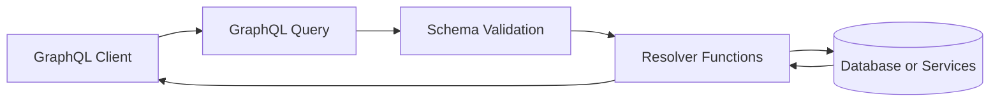

---

# 37. GraphQL Queries

A query can request nested data.

```graphql
query {
  user(id: 42) {
    id
    name
    orders {
      id
      status
      items {
        product {
          name
        }
        quantity
      }
    }
  }
}
```

The response follows the requested shape:

```json
{
  "data": {
    "user": {
      "id": "42",
      "name": "Alex",
      "orders": [
        {
          "id": "9001",
          "status": "paid",
          "items": [
            {
              "product": {
                "name": "Mechanical Keyboard"
              },
              "quantity": 2
            }
          ]
        }
      ]
    }
  }
}
```

This can reduce the need for multiple REST requests.

---

# 38. GraphQL Mutations

GraphQL uses mutations for operations that change data.

Example:

```graphql
mutation {
  createOrder(
    productId: "123"
    quantity: 2
  ) {
    order {
      id
      status
    }
  }
}
```

A mutation response:

```json
{
  "data": {
    "createOrder": {
      "order": {
        "id": "9001",
        "status": "pending"
      }
    }
  }
}
```

Queries retrieve data.

Mutations change data.

Subscriptions are commonly used for real-time updates.

---

# 39. GraphQL Errors

GraphQL may return an HTTP success status while including errors in the response body.

Example:

```json
{
  "data": {
    "product": null
  },
  "errors": [
    {
      "message": "Product not found",
      "path": ["product"]
    }
  ]
}
```

This differs from many REST APIs, where a missing individual resource might produce:

```http
404 Not Found
```

GraphQL clients must inspect both:

```text
data
errors
```

---

# 40. GraphQL Advantages

GraphQL can provide:

- Client-selected fields
- Strongly typed schemas
- Nested data in one request
- Reduced over-fetching
- Reduced under-fetching
- Introspection and tooling
- Centralized query structure

## Over-fetching

The server returns more data than the client needs.

REST response:

```json
{
  "id": 123,
  "name": "Keyboard",
  "price": 79.99,
  "description": "...",
  "manufacturer": "...",
  "inventoryHistory": "...",
  "internalNotes": "..."
}
```

The client needs only:

```text
id
name
price
```

## Under-fetching

The client needs multiple requests to assemble a screen.

```text
GET /users/42
GET /users/42/orders
GET /orders/9001/items
GET /products/123
```

GraphQL can sometimes combine these needs into one query.

---

# 41. GraphQL Tradeoffs

GraphQL can introduce:

- More complex server implementation
- Resolver performance problems
- Difficult caching at the HTTP level
- Query complexity attacks
- Need for depth and cost limits
- More complicated authorization
- Schema evolution responsibilities
- Potentially expensive nested queries

A query that looks small may cause significant backend work:

```graphql
query {
  users {
    orders {
      items {
        product {
          reviews {
            author {
              orders {
                items {
                  product {
                    name
                  }
                }
              }
            }
          }
        }
      }
    }
  }
}
```

GraphQL servers generally need controls such as:

- Query depth limits
- Complexity limits
- Pagination requirements
- Timeouts
- Authorization checks
- Resolver batching

---

# 42. What Is RPC?

RPC stands for:

```text
Remote Procedure Call
```

RPC makes a remote operation look conceptually like calling a local function.

Instead of thinking primarily in terms of resources, the client thinks in terms of actions.

Examples:

```text
createOrder()
getUser()
sendMessage()
calculateShipping()
approveInvoice()
```

A conceptual RPC call:

```text
Client calls:
  createOrder(items)

Network sends:
  Request to remote service

Server executes:
  createOrder(items)

Response returns:
  Created order
```

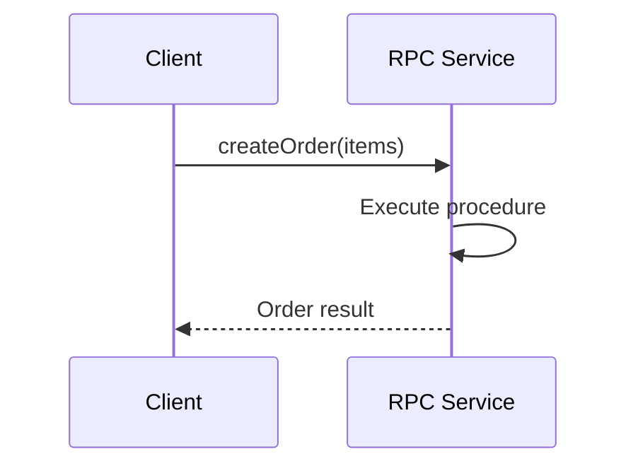

---

# 43. RPC Endpoint Examples

An RPC-style HTTP API may use:

```text
POST /createOrder
POST /sendMessage
POST /calculateShipping
POST /approveInvoice
```

Or use a single RPC endpoint with a method name:

```text
POST /rpc
```

Request:

```json
{
  "method": "createOrder",
  "params": {
    "items": [
      {
        "productId": 123,
        "quantity": 2
      }
    ]
  }
}
```

This is action-oriented rather than resource-oriented.

---

# 44. JSON-RPC

JSON-RPC is a protocol for making remote procedure calls using JSON.

Example request:

```json
{
  "jsonrpc": "2.0",
  "method": "subtract",
  "params": {
    "minuend": 42,
    "subtrahend": 23
  },
  "id": 1
}
```

Response:

```json
{
  "jsonrpc": "2.0",
  "result": 19,
  "id": 1
}
```

Error response:

```json
{
  "jsonrpc": "2.0",
  "error": {
    "code": -32601,
    "message": "Method not found"
  },
  "id": 1
}
```

JSON-RPC is useful when the interaction is naturally expressed as calling named procedures.

---

# 45. gRPC

gRPC is a high-performance RPC framework originally developed by Google.

It commonly uses:

- HTTP/2
- Protocol Buffers
- Strongly typed service definitions
- Generated client and server code
- Streaming support

A service definition may look conceptually like:

```protobuf
service ProductService {
  rpc GetProduct(GetProductRequest)
      returns (Product);
}

message GetProductRequest {
  string id = 1;
}

message Product {
  string id = 1;
  string name = 2;
  double price = 3;
}
```

The protocol definition can generate code for multiple programming languages.

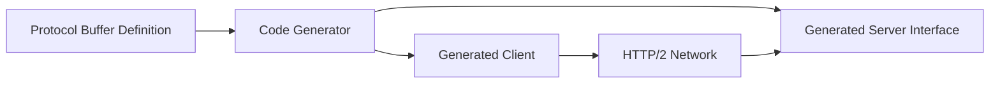

---

# 46. gRPC Advantages

gRPC may provide:

- Strong typing
- Efficient binary serialization
- Generated client libraries
- Streaming
- Clear service definitions
- High performance
- Good service-to-service communication

It is especially common for:

- Internal microservices
- High-throughput systems
- Polyglot backend environments
- Real-time or streaming services

---

# 47. gRPC Tradeoffs

gRPC may be less convenient for:

- Direct browser use
- Manual inspection
- Simple public APIs
- Human-readable debugging
- Environments that expect ordinary JSON and HTTP

Browsers usually need special support such as gRPC-Web to communicate with gRPC services.

For public APIs, REST or GraphQL may be easier for developers to consume.

---

# 48. REST vs GraphQL vs RPC

A broad comparison:

| Feature | REST | GraphQL | RPC |
|---|---|---|---|
| Main abstraction | Resources | Schema and graph | Procedures or methods |
| Typical endpoint style | Many resource URLs | Often one endpoint | Method-oriented endpoints |
| Data selection | Server-defined representation | Client selects fields | Procedure-defined |
| HTTP semantics | Central | Often less central to data semantics | May be used mainly as transport |
| Caching | Often straightforward | More complex | Depends on implementation |
| Typing | Documentation or schemas | Strong schema | Usually strong schema |
| Browser friendliness | High | High with client tools | Varies |
| Best fit | Public resource APIs | Flexible data graphs | Internal actions and services |

None is universally superior.

---

# 49. Choosing REST

REST may be a good choice when:

- Resources are central to the domain
- HTTP caching is useful
- You need a public developer-friendly API
- Standard tools should work easily
- Requests and responses map naturally to resources
- You want straightforward browser and cURL testing

Example domains:

- Product catalog
- Blog content
- User profiles
- Orders
- Documents
- Public files

---

# 50. Choosing GraphQL

GraphQL may be a good choice when:

- Clients need different data shapes
- Many client types consume the same backend
- Screens require related nested data
- Over-fetching is a major problem
- A strong schema and query system are valuable
- The organization can manage query complexity

Example domains:

- Complex dashboards
- Mobile and web clients with different needs
- Content platforms
- Social graphs
- Data aggregation interfaces

---

# 51. Choosing RPC

RPC may be a good choice when:

- Operations are naturally action-oriented
- Internal services communicate frequently
- Strong type generation is valuable
- Performance is important
- Streaming is required
- The API is not primarily a public browser-facing interface

Example operations:

- Process payment
- Calculate risk
- Generate recommendation
- Reserve inventory
- Transcode video
- Approve transaction

---

# 52. Serialization

Serialization is the process of converting an in-memory data structure into a transferable format.

Deserialization is the reverse.

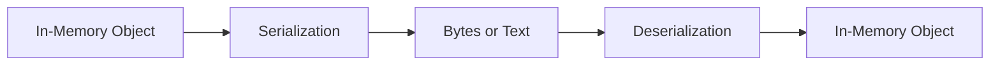

For example, an application object:

```text
Product {
  id: 123
  name: "Keyboard"
  price: 79.99
}
```

may be serialized as JSON:

```json
{
  "id": 123,
  "name": "Keyboard",
  "price": 79.99
}
```

The data then travels over the network as bytes.

---

# 53. JSON

JSON stands for:

```text
JavaScript Object Notation
```

Despite its name, JSON is language-independent.

Supported JSON values include:

- Objects
- Arrays
- Strings
- Numbers
- Booleans
- `null`

Example:

```json
{
  "id": 123,
  "name": "Keyboard",
  "price": 79.99,
  "available": true,
  "tags": ["office", "mechanical"],
  "manufacturer": null
}
```

---

## 53.1 JSON Objects

```json
{
  "name": "Alex",
  "age": 30
}
```

An object contains key-value pairs.

## 53.2 JSON Arrays

```json
[
  "red",
  "green",
  "blue"
]
```

An array contains an ordered list.

## 53.3 Nested JSON

```json
{
  "orderId": 9001,
  "customer": {
    "id": 42,
    "name": "Alex"
  },
  "items": [
    {
      "productId": 123,
      "quantity": 2
    }
  ]
}
```

---

# 54. JSON Limitations

JSON is convenient, but it has limitations.

It does not natively represent:

- Dates as a dedicated type
- Binary data efficiently
- Decimal values with exact financial semantics
- Undefined values
- Comments
- Object references
- Custom classes

Dates are often sent as strings:

```json
{
  "createdAt": "2026-07-22T12:00:00Z"
}
```

Clients must agree on the format.

Money should be handled carefully.

Instead of:

```json
{
  "price": 79.99
}
```

some systems use integer minor units:

```json
{
  "amount": 7999,
  "currency": "USD"
}
```

This can avoid floating-point rounding problems.

---

# 55. XML

XML stands for:

```text
Extensible Markup Language
```

Example:

```xml
<product>
  <id>123</id>
  <name>Keyboard</name>
  <price currency="USD">79.99</price>
</product>
```

XML supports:

- Nested elements
- Attributes
- Namespaces
- Schemas
- Mixed content
- Comments
- Document-oriented data

XML was heavily used in older web services and remains important in:

- Enterprise systems
- SOAP services
- Document formats
- Configuration
- Banking and government integrations

---

# 56. JSON vs XML

| Feature | JSON | XML |
|---|---|---|
| Readability | Compact and simple | More verbose |
| Common web API use | Very common | Less common for new APIs |
| Attributes | No dedicated syntax | Supported |
| Schema systems | JSON Schema and others | XSD and others |
| Comments | Not standard | Supported in documents |
| Namespace support | Limited | Strong |
| Browser JavaScript use | Very convenient | Requires parsing |
| Document modeling | Less natural | Strong |

The correct format depends on the requirements and existing ecosystem.

---

# 57. Form-Encoded Data

Traditional HTML forms often use:

```text
application/x-www-form-urlencoded
```

Example:

```text
name=Alex&email=alex%40example.com
```

Request:

```http
POST /signup HTTP/1.1
Content-Type: application/x-www-form-urlencoded

name=Alex&email=alex%40example.com
```

This format is simple and works well for ordinary text fields.

---

# 58. Multipart Form Data

Multipart form data is useful when sending files and text together.

```http
Content-Type: multipart/form-data; boundary=----Example
```

Conceptually:

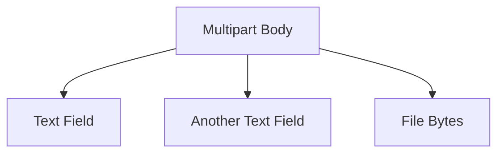

Example use cases:

- Profile image upload
- Document submission
- Product image upload
- Attachments
- Forms containing both metadata and files

---

# 59. Binary Serialization

Some systems use binary formats instead of text formats.

Examples include:

- Protocol Buffers
- MessagePack
- CBOR
- Avro
- Thrift
- FlatBuffers

Binary formats may provide:

- Smaller payloads
- Faster parsing
- Strong schemas
- Efficient type representation

Tradeoffs include:

- Less human readability
- More tooling requirements
- More difficult manual debugging
- Need for compatible serializers and deserializers

A binary API can still use HTTP as its transport.

```text
HTTP request
  ↓
Binary body
  ↓
Content-Type identifies format
```

---

# 60. Data Types and Schema Design

An API should define how values are represented.

For example:

```json
{
  "id": "123",
  "price": {
    "amount": 7999,
    "currency": "USD"
  },
  "createdAt": "2026-07-22T12:00:00Z",
  "active": true
}
```

The contract should answer:

- Is `id` a number or string?
- Is price represented as a decimal or integer minor units?
- Is a missing field different from `null`?
- Are dates UTC?
- Is an empty array different from an omitted array?
- Are enum values case-sensitive?
- Are unknown fields allowed?

Ambiguity creates integration bugs.

---

# 61. Null, Missing, and Empty Values

These values may mean different things:

```json
{}
```

```json
{
  "description": null
}
```

```json
{
  "description": ""
}
```

```json
{
  "tags": []
}
```

Possible interpretations:

```text
Missing:
  The field was not provided.

null:
  The field is intentionally empty or unknown.

Empty string:
  A string exists but contains no characters.

Empty array:
  The collection exists but has no items.
```

The API contract should define these differences.

---

# 62. Boolean and Enum Design

Boolean fields should have clear meanings.

Example:

```json
{
  "active": true
}
```

Does `active: false` mean:

- Disabled?
- Deleted?
- Unverified?
- Temporarily paused?

Sometimes an enum is more precise:

```json
{
  "status": "pending"
}
```

Possible values:

```text
pending
active
suspended
cancelled
completed
```

Enums should be documented and evolved carefully.

Removing or renaming an enum value can break clients.

---

# 63. Dates and Times

APIs should use consistent date and time formats.

A common format is ISO 8601:

```text
2026-07-22T12:30:00Z
```

The `Z` indicates UTC.

Another value may include an offset:

```text
2026-07-22T08:30:00-04:00
```

APIs should specify:

- Whether values are UTC
- Whether timezone offsets are accepted
- Whether seconds and milliseconds are included
- How date-only values differ from timestamps

Date and time ambiguity can cause serious bugs.

---

# 64. Money and Decimal Values

Floating-point numbers may not represent decimal values exactly.

For financial data, consider:

```json
{
  "amount": 7999,
  "currency": "USD"
}
```

This means:

```text
7999 cents = $79.99 USD
```

Alternatively:

```json
{
  "amount": "79.99",
  "currency": "USD"
}
```

The important point is consistency and exactness.

The API should not leave clients guessing whether:

```text
79.99
```

means:

- Dollars
- Cents
- A floating-point approximation
- A localized display value

---

# 65. Versioning Data Formats

A service may support different representations:

```http
Accept: application/vnd.example.product-v2+json
```

Or:

```text
Content-Type: application/vnd.example.product-v2+json
```

This is useful for systems with complex compatibility requirements.

However, many APIs prefer simpler URL or schema versioning.

The best approach depends on:

- Number of clients
- Release process
- Compatibility requirements
- Public vs private API
- Organization size
- Deployment control

---

# 66. REST Hypermedia

A more complete interpretation of REST includes hypermedia.

The server can provide links that tell the client what actions or related resources are available.

Example:

```json
{
  "id": 9001,
  "status": "pending",
  "_links": {
    "self": {
      "href": "/orders/9001"
    },
    "cancel": {
      "href": "/orders/9001/cancellation",
      "method": "POST"
    },
    "payment": {
      "href": "/orders/9001/payment"
    }
  }
}
```

This approach can make APIs more discoverable.

Many APIs use REST-inspired designs without fully implementing hypermedia.

---

# 67. Action Endpoints and Domain Operations

Not every operation is naturally represented as simple CRUD.

Examples:

```text
POST /orders/9001/cancel
POST /invoices/42/approve
POST /messages/100/send
POST /reports/monthly/generate
```

These are action-oriented endpoints.

Some designers prefer modeling the action as a resource:

```text
POST /orders/9001/cancellations
POST /invoices/42/approvals
POST /messages/100/deliveries
```

The best choice depends on the domain and the clarity of the contract.

The goal is to represent business behavior predictably, not to force every operation into an artificial pattern.

---

# 68. API Design Example: Online Store

A possible REST API:

```text
GET    /products
GET    /products/123
POST   /products
PATCH  /products/123
DELETE /products/123

GET    /categories
GET    /categories/5/products

GET    /cart
POST   /cart/items
PATCH  /cart/items/123
DELETE /cart/items/123

GET    /orders
GET    /orders/9001
POST   /orders

POST   /orders/9001/cancellation
```

```mermaid
flowchart TD
    P[Products] --> P1[/products]
    P --> P2[/products/:id]

    C[Cart] --> C1[/cart]
    C --> C2[/cart/items]

    O[Orders] --> O1[/orders]
    O --> O2[/orders/:id]
    O --> O3[/orders/:id/cancellation]
```

The API contract should define authentication, permissions, request bodies, response shapes, and error behavior for each endpoint.

---

# 69. API Design Example: Social Platform

Possible resources:

```text
/users
/posts
/comments
/followers
/notifications
/messages
```

Possible endpoints:

```text
GET    /posts
POST   /posts
GET    /posts/123
PATCH  /posts/123
DELETE /posts/123

GET    /posts/123/comments
POST   /posts/123/comments

POST   /users/42/follow
DELETE /users/42/follow

GET    /notifications
PATCH  /notifications/123
```

Some actions may be modeled as relationships:

```text
POST /users/42/followers
DELETE /users/42/followers/me
```

There are multiple reasonable designs. Consistency and clarity matter more than one universal URL pattern.

---

# 70. API Design Example: Banking System

Banking APIs require additional care around:

- Authentication
- Authorization
- Auditing
- Idempotency
- Transaction integrity
- Fraud detection
- Rate limits
- Sensitive data
- Compliance

Possible resources:

```text
/accounts
/transactions
/payments
/beneficiaries
```

A payment request may require:

```http
POST /payments
Idempotency-Key: payment-abc123
```

Response:

```json
{
  "id": "pay_789",
  "status": "processing",
  "amount": 5000,
  "currency": "USD"
}
```

The API should not assume that a request completing means the external financial operation has already settled.

Status values may include:

```text
pending
processing
completed
failed
reversed
```

---

# 71. API Contracts and Frontend Development

The frontend depends on stable API expectations.

Suppose the frontend expects:

```json
{
  "items": [],
  "total": 100
}
```

If the backend suddenly returns:

```json
{
  "results": [],
  "count": 100
}
```

the frontend may fail.

A contract helps teams coordinate.

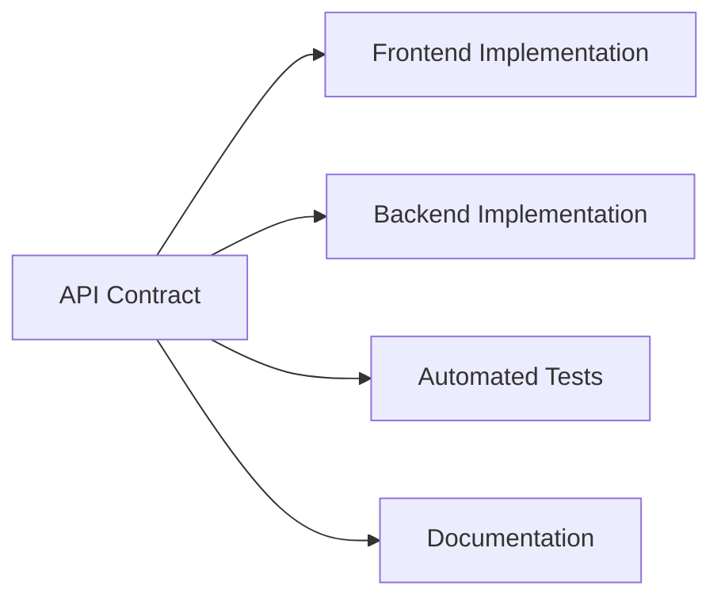

Contracts can be represented through:

- Written documentation
- OpenAPI
- GraphQL schema
- Protocol Buffers
- JSON Schema
- Generated client libraries
- Contract tests

---

# 72. Contract Testing

Contract testing checks whether the client and provider agree.

A contract may say:

```text
GET /products returns:
  status 200
  Content-Type application/json
  items array
  each item has id, name, price
```

Automated tests can verify that the backend continues to satisfy those expectations.

This helps catch:

- Removed fields
- Incorrect data types
- Unexpected status codes
- Invalid error formats
- Broken authentication behavior

---

# 73. REST API Design Checklist

When designing an endpoint, ask:

1. What resource does this represent?
2. Is the URL naming a noun or an action?
3. Which HTTP method matches the operation?
4. Does the method have safe or idempotent semantics?
5. What parameters belong in the path?
6. What parameters belong in the query string?
7. What should the request body contain?
8. What authentication is required?
9. What authorization rules apply?
10. What status code represents success?
11. What errors can occur?
12. What is the response schema?
13. Is the response cacheable?
14. Does the endpoint need pagination?
15. How will it evolve?

---

# 74. Common API Design Mistakes

## Mistake 1: Treating URLs as arbitrary action names

```text
POST /doThing
POST /performAction
POST /processData
```

These may be unavoidable for some domains, but resource-oriented naming is often clearer.

## Mistake 2: Returning `200 OK` for every outcome

Different outcomes deserve meaningful status codes.

## Mistake 3: Inconsistent response formats

One endpoint returns:

```json
{
  "error": "message"
}
```

while another returns:

```json
{
  "message": "error",
  "success": false
}
```

Consistency makes clients simpler.

## Mistake 4: Trusting client-provided calculated values

The server should calculate prices, permissions, and important totals independently.

## Mistake 5: Returning unlimited collections

Large responses hurt performance and reliability.

## Mistake 6: Exposing internal database structure

API design should represent domain concepts rather than blindly copying database tables.

## Mistake 7: Ignoring idempotency

Retries can duplicate payments, orders, messages, or other actions.

## Mistake 8: Making undocumented changes

Clients depend on behavior even when the behavior was not formally documented.

---

# 75. Database Tables Are Not Automatically API Resources

Suppose a database contains:

```text
users
user_roles
user_sessions
internal_audit_events
```

It does not follow that the API should expose:

```text
/users
/user_roles
/user_sessions
/internal_audit_events
```

The API should represent what clients need and what the domain permits.

Internal database tables may contain:

- Implementation details
- Sensitive information
- Join records
- Temporary values
- Audit information
- Security data

An API is an application boundary, not a direct database mirror.

---

# 76. API Gateway

Larger systems may place an API gateway in front of services.

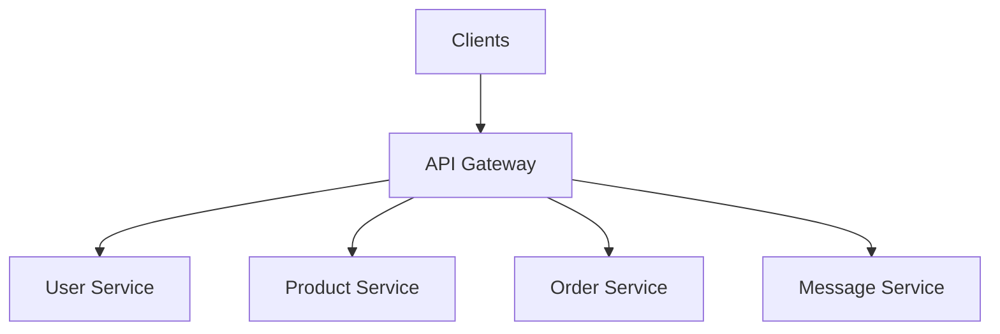

An API gateway may handle:

- Authentication
- TLS termination
- Routing
- Rate limiting
- Logging
- Request transformation
- API versioning
- Response aggregation
- Access control

The gateway can provide one public entry point while internal services remain separate.

---

# 77. REST Behind an API Gateway

A public endpoint may look like:

```text
GET /api/orders/9001
```

The gateway may route it internally to:

```text
Order service
User service
Payment service
```

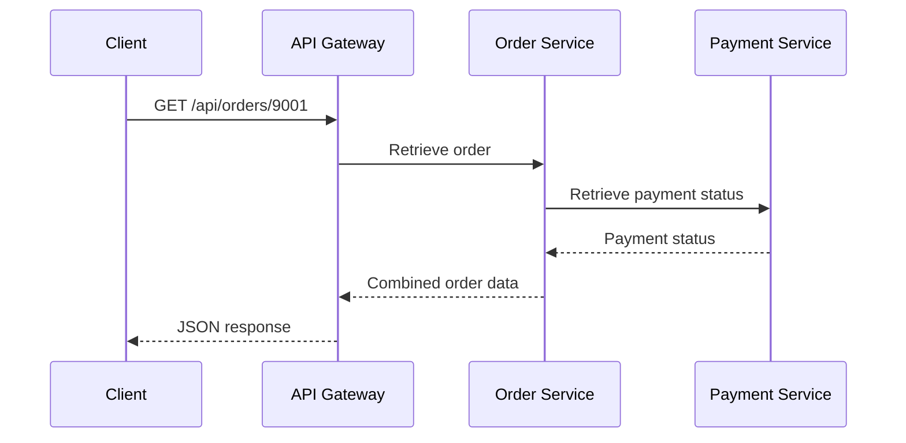

The client does not need to know about every internal service.

---

# 78. Service-to-Service APIs

Not all APIs serve browsers.

Backend services may communicate with one another:

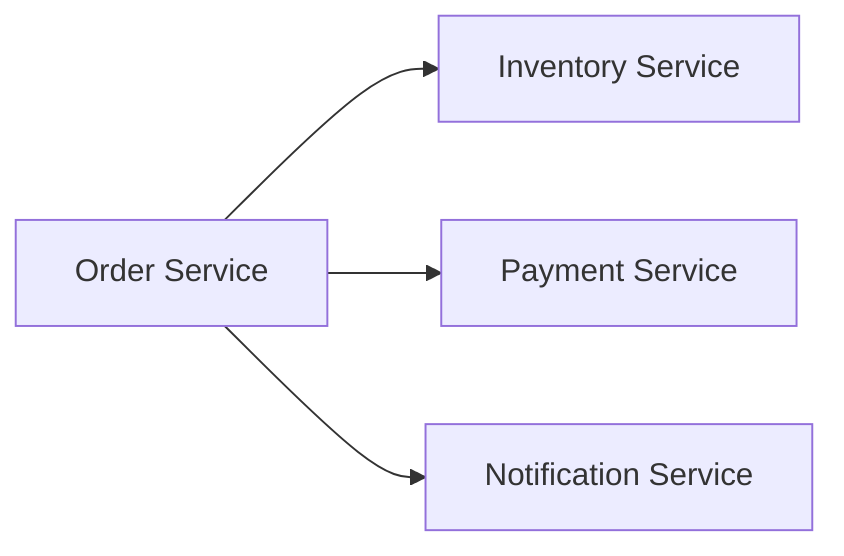

These internal APIs may use:

- REST
- gRPC
- Message queues
- Event streams
- GraphQL
- Custom protocols

Internal APIs may prioritize:

- Performance
- Strong typing
- Reliability
- Operational control
- Service ownership

Public APIs may prioritize:

- Documentation
- Stability
- Simplicity
- Broad compatibility
- Human-readable formats

---

# 79. Synchronous and Asynchronous APIs

A synchronous API waits for the operation to complete before responding.

```text
Client → Request
Server → Performs operation
Server → Response
```

An asynchronous API accepts work and responds before the work is complete.

```text
Client → Request
Server → Accepted
Server → Processes later
Client → Checks status
```

Example:

```http
POST /reports
```

Response:

```http
202 Accepted
```

```json
{
  "jobId": "job_123",
  "status": "queued"
}
```

The client may later request:

```http
GET /reports/jobs/job_123
```

Response:

```json
{
  "jobId": "job_123",
  "status": "completed",
  "downloadUrl": "/reports/files/report-123.pdf"
}
```

---

# 80. Events and Message-Based APIs

Some systems communicate by publishing events instead of directly requesting results.

Example:

```text
OrderCreated
PaymentCompleted
InventoryReserved
UserRegistered
```

```mermaid
flowchart LR
    O[Order Service] --> E[Event Bus]
    E --> I[Inventory Service]
    E --> N[Notification Service]
    E --> A[Analytics Service]
```

An event says:

> Something happened.

A command says:

> Please perform this operation.

This differs from ordinary request-response communication.

Events are useful for:

- Loose coupling
- Background processing
- Notifications
- Audit trails
- Integration between services
- Event-driven architectures

---

# 81. API Paradigm Comparison Through One Example

Suppose the client needs:

```text
A user
Their latest orders
The products in those orders
The current shipment status
```

## REST approach

Potentially:

```text
GET /users/42
GET /users/42/orders?limit=5
GET /orders/9001/items
GET /shipments/777
```

The frontend coordinates multiple requests.

## GraphQL approach

```graphql
query {
  user(id: "42") {
    name
    orders(limit: 5) {
      id
      items {
        product {
          name
        }
      }
      shipment {
        status
      }
    }
  }
}
```

The client requests a nested shape.

## RPC approach

```json
{
  "method": "getUserOrderDashboard",
  "params": {
    "userId": "42",
    "orderLimit": 5
  }
}
```

The server exposes a purpose-specific operation.

Each approach can work. The best choice depends on the domain and clients.

---

# 82. Part 4 Summary

In this part, we explored APIs and API architecture.

The most important ideas are:

- An API is an interface through which software systems communicate.
- A web API commonly uses HTTP.
- An API provider exposes capabilities or data.
- An API consumer uses those capabilities or data.
- REST is an architectural style for resource-oriented distributed systems.
- REST commonly uses URLs to identify resources.
- HTTP methods communicate intended operations.
- Resources and representations are different concepts.
- Collections represent groups of resources.
- Individual URLs represent specific resources.
- CRUD means Create, Read, Update, and Delete.
- `GET`, `POST`, `PUT`, `PATCH`, and `DELETE` have different semantics.
- Path parameters commonly identify resources.
- Query parameters commonly filter, sort, search, or paginate.
- REST APIs should be as stateless as practical.
- Statelessness helps load balancing and horizontal scaling.
- Statelessness does not mean the system cannot store sessions or application data.
- Idempotency matters when clients retry requests.
- Pagination prevents large collections from becoming inefficient.
- Filtering, sorting, searching, field selection, and expansion shape API responses.
- Consistent status codes and error formats simplify client development.
- Authentication identifies callers.
- Authorization determines permissions.
- API keys, sessions, and bearer tokens are different credential mechanisms.
- Rate limiting helps protect APIs.
- Versioning helps manage API evolution.
- Backward-compatible changes reduce client breakage.
- GraphQL lets clients request a specific data shape through a schema.
- GraphQL can reduce over-fetching and under-fetching but introduces query complexity.
- RPC models communication as calling remote procedures.
- JSON-RPC provides a JSON-based procedure-call format.
- gRPC uses strongly typed definitions and efficient binary serialization.
- Serialization converts in-memory structures into transferable text or bytes.
- JSON is common, readable, and convenient but has type limitations.
- XML remains important in many enterprise and document-oriented systems.
- Multipart form data is useful for files and fields together.
- Binary formats can improve performance but reduce human readability.
- A good API contract defines methods, parameters, schemas, errors, authentication, and compatibility behavior.
- An API should not simply expose database tables without considering domain, security, and usability.

The central model is:

```mermaid
flowchart TD
    C[Client] -->|Request using API Contract| A[API Boundary]
    A --> R[Routing]
    R --> V[Validation]
    V --> AU[Authentication]
    AU --> AZ[Authorization]
    AZ --> BL[Business Logic]
    BL --> D[(Database)]
    BL --> X[External Services]
    D --> BL
    X --> BL
    BL --> RESP[Structured Response]
    RESP --> C
```

The broad API paradigm comparison is:

```mermaid
flowchart LR
    R[REST<br/>Resources and HTTP Methods]
    G[GraphQL<br/>Client-Selected Data Graph]
    P[RPC<br/>Remote Procedures]
```

In **Part 5**, we will move from theory to practice. We will inspect live traffic using browser Developer Tools, analyze requests and responses, understand timing data, diagnose failures, and test APIs independently with cURL, Postman, and Bruno.
