# Web Mechanics, Architecture & Network Fundamentals

# Part 6 — Web Performance, Reliability, Security, and Production Delivery  
## From “It Works” to “It Works Quickly, Safely, and Reliably”

---

# Part 6 Overview

The original five-part series established the foundations:

- **Part 1:** Frontend, backend, databases, and application architecture
- **Part 2:** The Internet, DNS, IP addresses, routers, CDNs, and data centers
- **Part 3:** HTTP, HTTPS, requests, responses, TLS, headers, and status codes
- **Part 4:** APIs, REST, GraphQL, RPC, serialization, and service contracts
- **Part 5:** Browser DevTools, cURL, API clients, and diagnostic workflows

This bonus continuation focuses on what happens when an application leaves the developer’s machine and begins serving real users.

A local application may work perfectly while still having serious problems in production:

- It may load slowly for users far away from the server.
- It may expose credentials in browser code.
- It may fail when traffic increases.
- It may lose data when a server crashes.
- It may become unavailable when a third-party service is down.
- It may have no useful logs when something breaks.
- It may deploy successfully but serve an incompatible frontend and backend.
- It may work for one user but fail under concurrent activity.
- It may be technically functional but frustrating to use.

Production-quality software must be more than functional.

It should be:

```text
Fast
Secure
Reliable
Observable
Scalable
Recoverable
Maintainable
```

A useful production architecture looks like this:

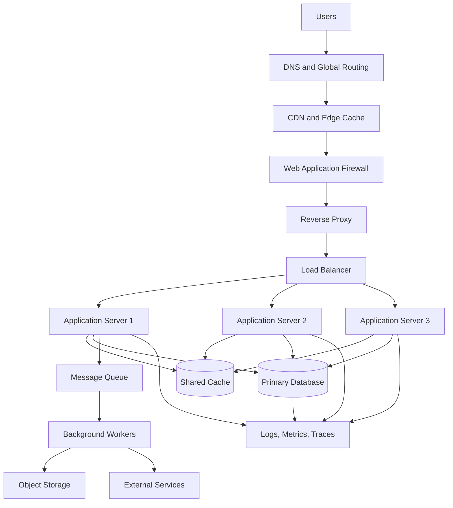

This part explains the major ideas behind such systems.

---

# 1. The Three Production Questions

When evaluating a web application, ask three broad questions.

## 1.1 Is it fast enough?

Performance concerns how quickly and smoothly the application responds.

Examples:

- How long until the first content appears?
- How long until the page becomes interactive?
- How long does an API request take?
- How quickly do images load?
- How fast does search respond?
- Does the interface remain responsive on a mobile device?

## 1.2 Is it secure enough?

Security concerns whether the system protects:

- User accounts
- Personal data
- Payment information
- Application secrets
- Internal services
- Business operations
- Infrastructure

## 1.3 Is it reliable enough?

Reliability concerns whether the system:

- Continues working during failures
- Recovers from problems
- Avoids losing data
- Handles traffic spikes
- Provides useful error messages
- Can be monitored and repaired

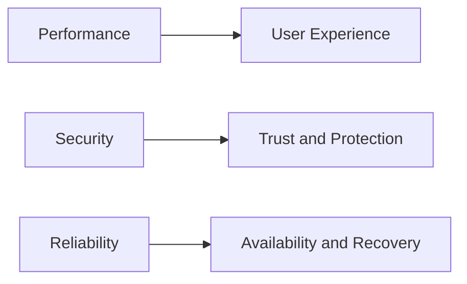

These concerns overlap.

For example:

- Excessive logging may affect performance.
- Security checks may add processing work.
- Replication may improve reliability but increase cost.
- Aggressive caching may improve speed but risk stale or private data.

Production engineering is therefore a process of managing tradeoffs.

---

# 2. Performance: What Does “Fast” Mean?

Performance is not one number.

A website can be fast in one way and slow in another.

Consider these different measurements:

```text
DNS lookup time
Connection time
TLS negotiation time
Time to first byte
Time to first content
Time to interactive
Largest visible element
API response time
Database query time
Total page load time
```

A useful request model is:

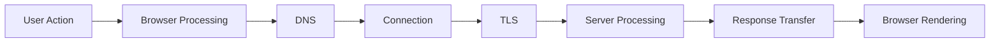

Each stage can contribute to perceived delay.

---

# 3. Perceived Performance vs Actual Performance

Users do not experience your application as a collection of technical metrics.

They experience:

- Whether something appears to happen after clicking
- Whether the page looks usable quickly
- Whether the interface freezes
- Whether buttons respond
- Whether content shifts unexpectedly
- Whether errors are explained
- Whether loading states are clear

An application may have a technically fast API but still feel slow if:

- The frontend waits too long before showing anything.
- A large JavaScript bundle blocks rendering.
- The interface has no loading indicator.
- A button provides no feedback.
- A page displays a blank screen while data loads.

A useful principle is:

> Performance is both a measurement problem and a communication problem.

---

# 4. The Critical Rendering Path

The **critical rendering path** is the sequence of work a browser performs before displaying useful content.

A simplified flow:

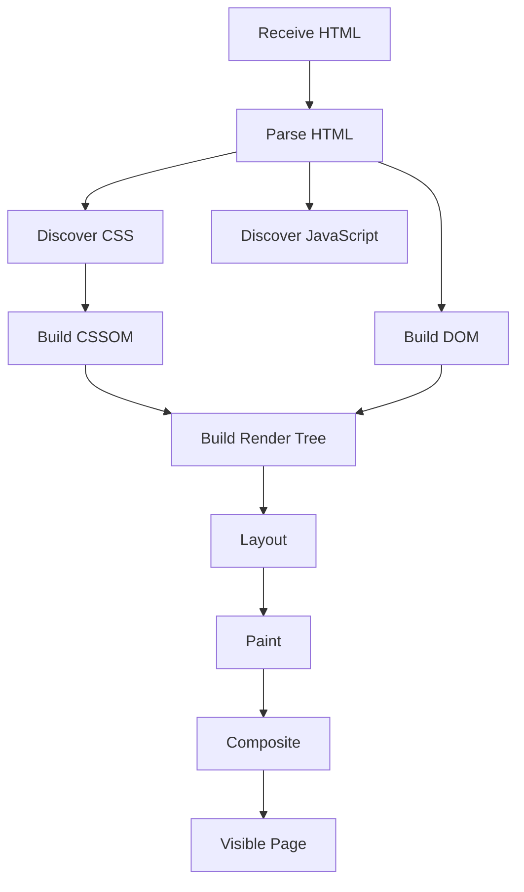

The browser must often:

1. Download HTML.
2. Parse the document.
3. Download stylesheets.
4. Calculate styles.
5. Calculate element positions.
6. Paint pixels.
7. Execute scripts.
8. Update the page as additional resources arrive.

Large files and blocking scripts can delay this process.

---

# 5. HTML, CSS, and JavaScript Performance

## HTML

Large HTML documents increase:

- Transfer time
- Parsing time
- Memory usage

## CSS

CSS can delay rendering because the browser needs style information to calculate appearance.

Problems may include:

- Very large stylesheets
- Unused styles
- Blocking external stylesheets
- Complex selectors
- Excessive layout calculations

## JavaScript

Large JavaScript bundles can affect:

- Download time
- Parsing time
- Compilation time
- Execution time
- Memory usage
- Mobile battery consumption

A page may download quickly but still feel slow because the browser spends too long executing JavaScript.

---

# 6. JavaScript Bundle Optimization

A frontend bundle may contain code for many routes and features.

If the entire application is downloaded at once, the initial page may load more slowly than necessary.

Common techniques include:

- Code splitting
- Lazy loading
- Route-based chunking
- Tree shaking
- Removing unused dependencies
- Compressing assets
- Deferring noncritical scripts

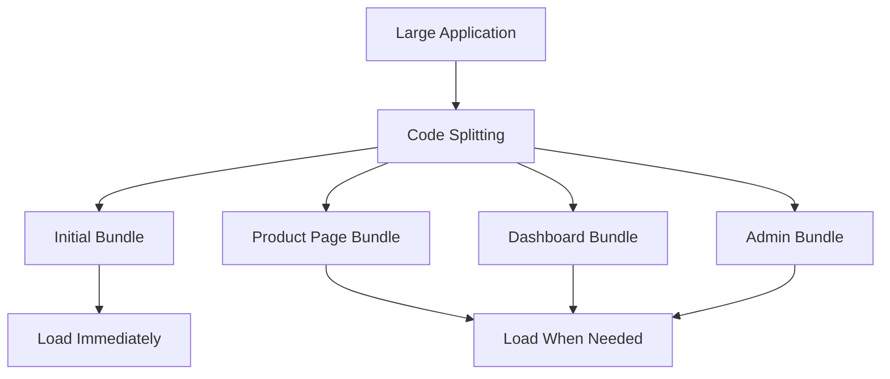

Instead of loading administrative tools for every visitor, the application can load them only when an administrator opens that area.

---

# 7. Image Performance

Images are often among the largest assets on a page.

Performance improvements include:

- Correct dimensions
- Responsive images
- Compression
- Modern image formats
- Lazy loading
- Thumbnails
- Content-aware cropping
- CDN transformation
- Avoiding unnecessarily high resolution

A user viewing a small card does not need a 12-megapixel original image.

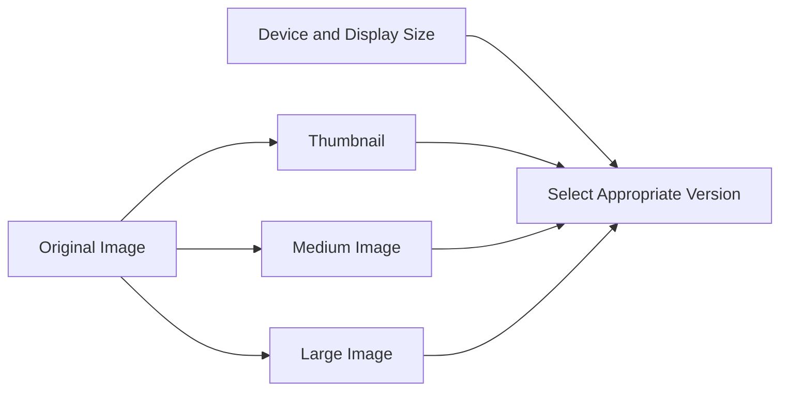

The browser can select a suitable size based on screen width and pixel density.

---

# 8. Lazy Loading

Lazy loading delays nonessential work until it is needed.

Examples:

- Images below the fold
- Video thumbnails
- Reports
- Map widgets
- Comments
- Large components
- Analytics integrations

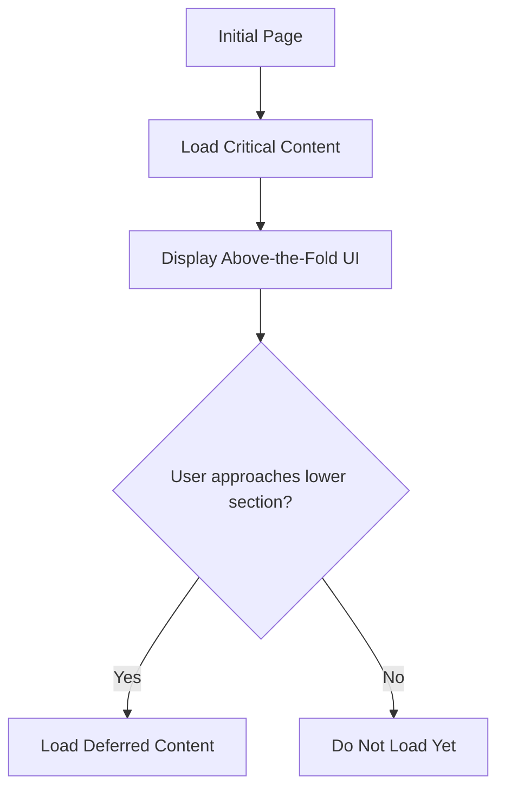

Lazy loading improves initial performance, but it must be implemented carefully.

If content appears too late, users may see blank areas or loading interruptions.

---

# 9. Caching

Caching stores reusable data closer to where it is needed.

Caching can occur at many layers:

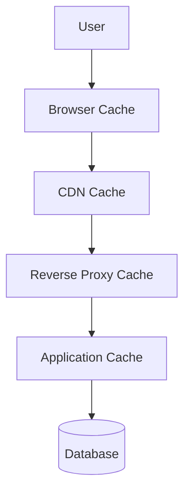

Each layer has different responsibilities.

## Browser cache

Stores resources on the user’s device.

Examples:

- CSS
- JavaScript
- Images
- Fonts

## CDN cache

Stores content at geographically distributed edge locations.

## Reverse proxy cache

Stores responses close to the application servers.

## Application cache

Stores frequently accessed results in memory or a shared cache system.

## Database cache

Databases often cache query pages and indexes internally.

---

# 10. Cache Hits and Cache Misses

A **cache hit** occurs when the requested data is already available in the cache.

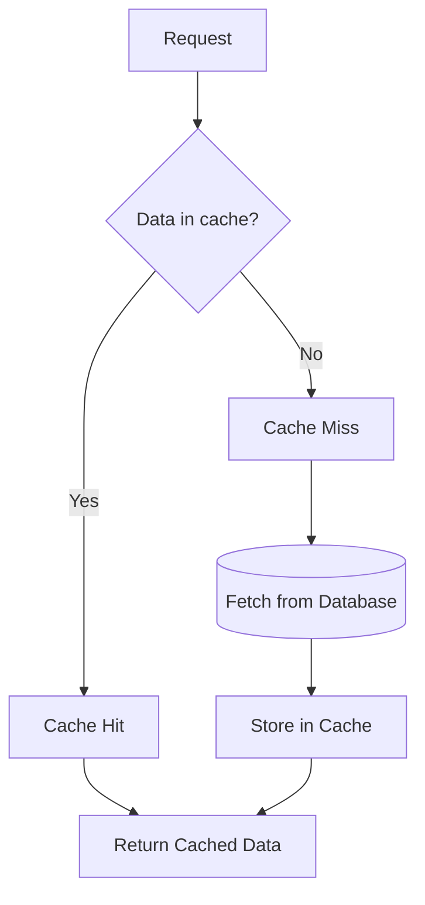

Cache hits are usually faster because they avoid expensive work.

Cache misses may require:

- Database queries
- External service calls
- Page rendering
- File retrieval
- Computation

---

# 11. Cache Invalidation

Cache invalidation means deciding when cached data is no longer valid.

This is difficult because cached data may become stale.

Suppose a product price is cached:

```text
Cache:
  Product 123 = $79.99
```

The database changes the price:

```text
Database:
  Product 123 = $69.99
```

If the cache is not updated or cleared, users may receive the old price.

Common strategies include:

- Time-based expiration
- Explicit invalidation
- Versioned URLs
- Cache tags
- Write-through caching
- Read-through caching
- Stale-while-revalidate

The classic difficulty is:

> How do you make cached data fast while keeping it correct?

---

# 12. Cache-Control Examples

Public static asset:

```http
Cache-Control: public, max-age=31536000, immutable
```

Private user data:

```http
Cache-Control: private, no-store
```

Short-lived API response:

```http
Cache-Control: public, max-age=60
```

Revalidation-based response:

```http
Cache-Control: no-cache
ETag: "version-123"
```

The exact policy depends on:

- Whether the data is public
- Whether it changes frequently
- Whether it contains personal information
- Whether stale data is acceptable
- Whether the URL changes when content changes

---

# 13. Database Performance

A fast frontend cannot compensate for a slow database.

A request may take a long time because the backend is waiting for:

- A full table scan
- An inefficient join
- A missing index
- A lock
- A connection from the database pool
- A remote database region
- A large result set
- A slow transaction

A simplified backend timing model:

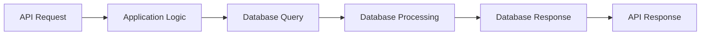

---

# 14. Database Indexes

An index helps a database find records more efficiently.

Suppose a table contains millions of users and the application frequently searches by email.

Without an index:

```text
Scan every user record.
```

With an index:

```text
Use an organized lookup structure.
```

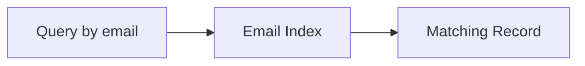

Indexes can improve reads but have costs:

- Additional storage
- Slower writes
- Maintenance overhead
- Poor performance if chosen badly

Indexes should be based on actual query patterns.

---

# 15. N+1 Query Problems

An N+1 problem occurs when an application performs:

```text
1 query to retrieve N records
+ 1 query for each record
```

Example:

```text
Query all orders
Query products for order 1
Query products for order 2
Query products for order 3
...
```

If there are 100 orders, this may produce 101 queries.

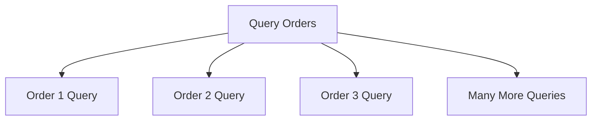

Possible solutions include:

- Joins
- Batch queries
- Eager loading
- Data loaders
- Query optimization
- Caching

N+1 problems often appear in REST aggregation and GraphQL resolvers.

---

# 16. Connection Pooling

Opening a database connection may be expensive.

A connection pool maintains reusable connections:

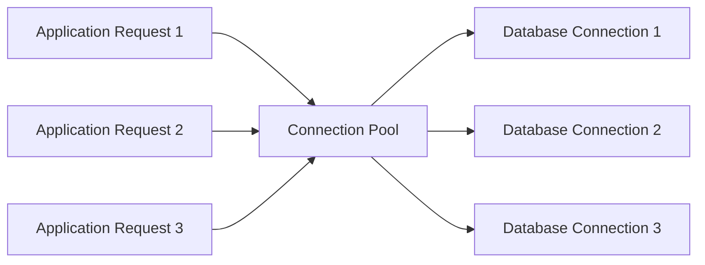

Without pooling, every request might create and close its own connection.

A pool must be sized carefully.

Too few connections:

```text
Requests wait.
```

Too many connections:

```text
Database becomes overloaded.
```

---

# 17. Timeouts

Every network dependency should have sensible timeouts.

Without timeouts, a request may wait indefinitely for:

- Database
- Payment provider
- Email service
- Internal API
- File storage
- DNS
- Network connection

A timeout allows the system to stop waiting and handle failure.

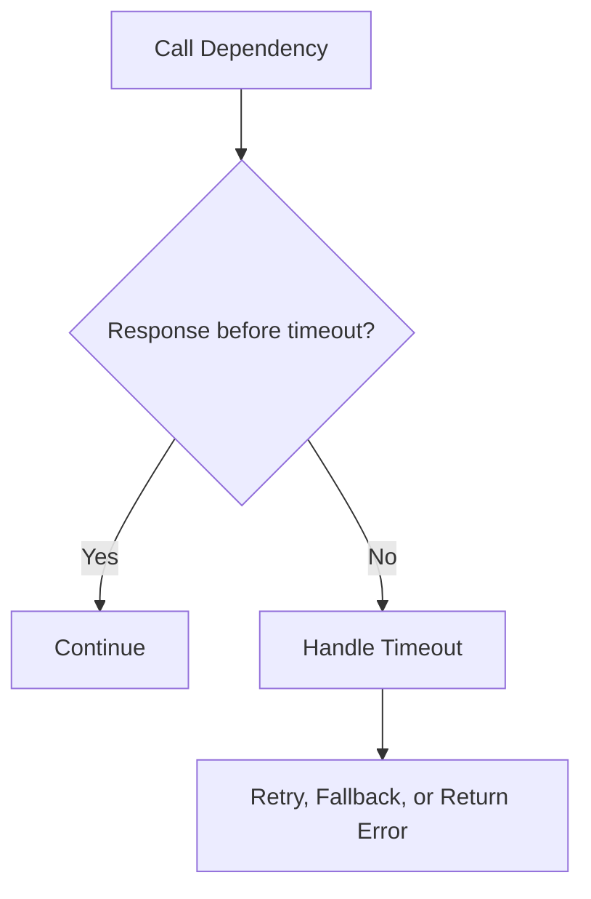

A timeout is not a solution by itself. The application must decide what to do afterward.

---

# 18. Retries

Retries can help with temporary failures.

Examples:

- Brief network interruption
- Temporary upstream overload
- Connection reset
- Transient service unavailability

But retries can also make a problem worse.

If 1,000 requests fail and every request retries three times, the dependency may receive 3,000 additional requests.

This is called a retry storm.

Use:

- Limited retry counts
- Exponential backoff
- Random jitter
- Idempotency keys
- Retry only appropriate errors

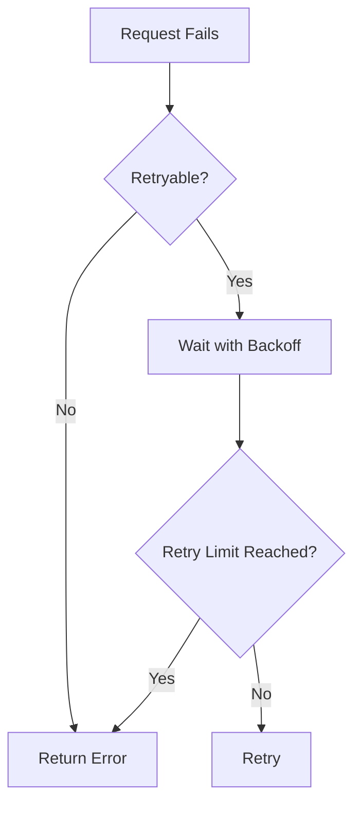

---

# 19. Circuit Breakers

A circuit breaker stops repeatedly calling a failing dependency.

States commonly include:

```text
Closed
Open
Half-open
```

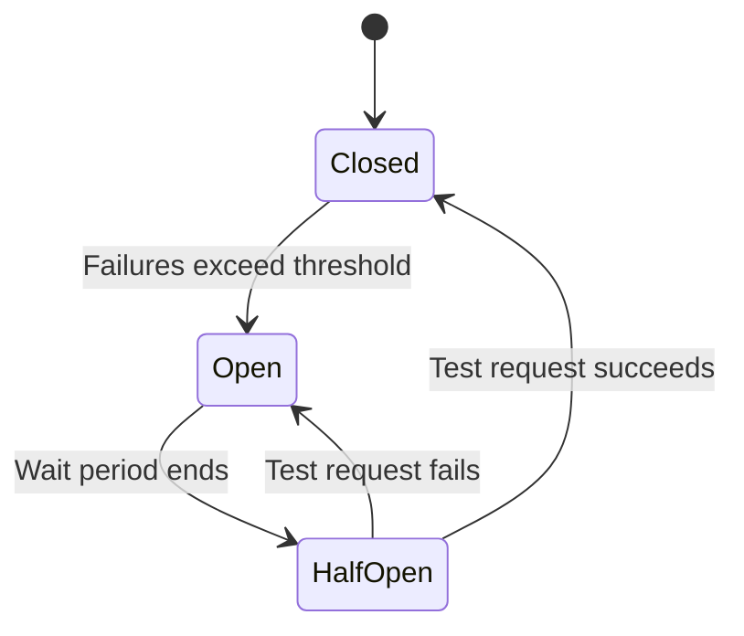

## Closed

Requests flow normally.

## Open

Requests are rejected or redirected quickly without calling the failing service.

## Half-open

The system tests whether the dependency has recovered.

Circuit breakers protect the main application from cascading failure.

---

# 20. Graceful Degradation

A reliable application does not always need every feature to work perfectly.

If a recommendation service fails, the product page may still work without recommendations.

If an avatar service fails, the profile may show a default image.

If analytics fails, users should still be able to complete checkout.

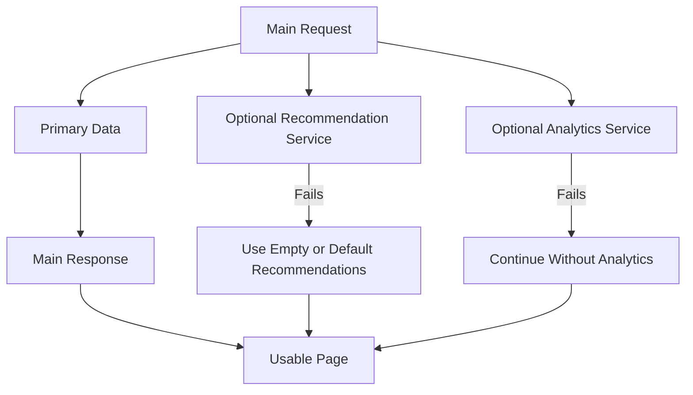

A key design principle is:

> Optional dependencies should not unnecessarily disable essential features.

---

# 21. Reliability and Availability

## Availability

Availability describes whether the system is usable when users need it.

A service available:

```text
99%
```

of the time has more downtime than one available:

```text
99.99%
```

Availability targets are often described as “nines.”

| Availability | Approximate annual downtime |
|---:|---:|
| 99% | 3.65 days |
| 99.9% | 8.76 hours |
| 99.99% | 52.6 minutes |
| 99.999% | 5.26 minutes |

Higher availability usually requires more:

- Redundancy
- Monitoring
- Automation
- Testing
- Operational discipline
- Infrastructure cost

---

# 22. Redundancy

Redundancy means having additional components available if one fails.

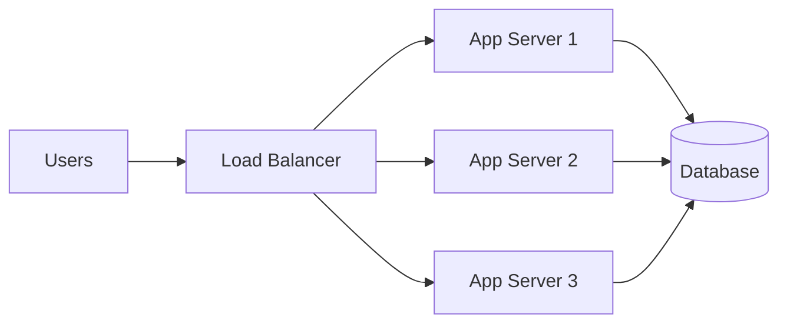

If one application server fails, the others can continue serving requests.

Redundancy can also exist for:

- Databases
- Network links
- Storage
- Data centers
- DNS providers
- Power systems
- Queue workers

Redundancy is useful only if failover is tested.

---

# 23. Database Backups and Recovery

A database backup is a copy of data that can be used to recover from loss or corruption.

Backups protect against:

- Hardware failure
- Software bugs
- Accidental deletion
- Ransomware
- Operator mistakes
- Data corruption
- Failed migrations

A serious backup strategy includes:

- Automated backups
- Multiple backup copies
- Separate storage location
- Encryption
- Retention policies
- Restore testing

A backup that has never been restored should not be assumed to work.

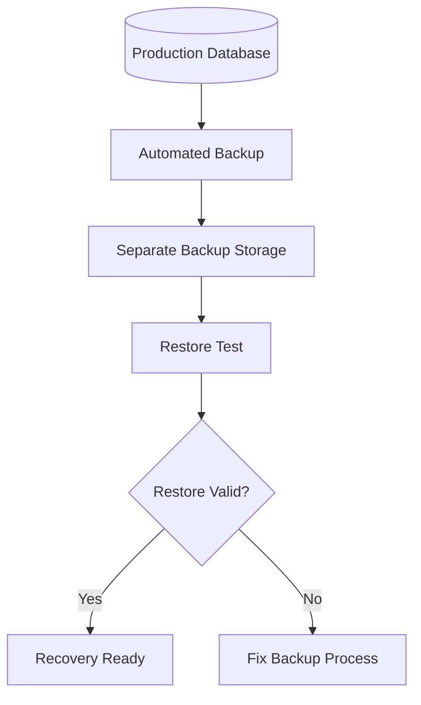

---

# 24. RPO and RTO

Two important recovery concepts are:

## Recovery Point Objective

RPO asks:

> How much recent data can we afford to lose?

For example:

```text
RPO = 15 minutes
```

means the organization may accept losing up to 15 minutes of recent changes.

## Recovery Time Objective

RTO asks:

> How long can the system be unavailable before recovery?

For example:

```text
RTO = 1 hour
```

means the system should be restored within one hour.

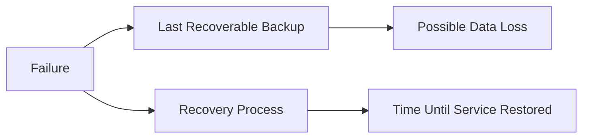

These requirements influence architecture and cost.

---

# 25. Security as a System of Layers

Security is not one feature.

It is a collection of protections:

```mermaid
flowchart TD
    A[Secure Application] --> B[Secure Transport]
    A --> C[Secure Authentication]
    A --> D[Correct Authorization]
    A --> E[Input Validation]
    A --> F[Safe Data Storage]
    A --> G[Secure Dependencies]
    A --> H[Monitoring and Response]
    A --> I[Safe Infrastructure]
```

A system can use HTTPS correctly and still have broken authorization.

It can use strong passwords and still expose database credentials.

It can validate forms and still be vulnerable to logic errors.

Security requires defense in depth.

---

# 26. Authentication and Authorization

Authentication asks:

```text
Who is this user?
```

Authorization asks:

```text
What is this user allowed to do?
```

```mermaid
flowchart TD
    R[Incoming Request] --> A[Authenticate]
    A --> B{Identity Valid?}
    B -->|No| C[401 Unauthorized]
    B -->|Yes| D[Authorize]
    D --> E{Permission Granted?}
    E -->|No| F[403 Forbidden]
    E -->|Yes| G[Perform Operation]
```

A common security failure is checking that a user is logged in but failing to check whether they own the requested resource.

Example:

```text
GET /orders/9001
```

The server must verify:

```text
Does this authenticated user have permission to view order 9001?
```

---

# 27. Password Security

Applications should not store plaintext passwords.

Instead, they should use a password-hashing algorithm designed for password storage.

Important properties include:

- Salted hashes
- Deliberate computational cost
- Resistance to brute-force attacks
- Secure password reset processes
- Rate limits
- Multi-factor authentication support

A password database should not look like:

```text
alex@example.com | password123
```

It should contain a one-way password hash.

Even then, password systems need protection against:

- Credential stuffing
- Brute force
- Phishing
- Account recovery abuse
- Leaked reset tokens
- Weak password policies

---

# 28. Secrets Management

Secrets include:

- Database passwords
- API keys
- Token-signing keys
- Encryption keys
- Cloud credentials
- Payment provider secrets

Bad practice:

```javascript
const paymentSecret = "real-secret-value";
```

If this code reaches the browser, the secret is exposed.

Better practice:

```mermaid
flowchart TD
    S[Secret Store] --> APP[Server Application]
    APP --> P[Private Provider API]
    B[Browser] --> APP
```

Secrets should be:

- Stored outside source code
- Injected through secure configuration
- Rotated periodically
- Restricted by least privilege
- Excluded from logs
- Removed if exposed

---

# 29. Input Validation

Every external input should be treated as untrusted.

Inputs include:

- Query parameters
- Path parameters
- Request bodies
- Headers
- Cookies
- Uploaded files
- Webhook payloads
- Third-party API responses

Validation should check:

- Type
- Required fields
- Length
- Range
- Format
- Allowed values
- Relationship between fields
- User permissions

```mermaid
flowchart TD
    I[External Input] --> P[Parse]
    P --> S[Schema Validation]
    S --> B[Business Rule Validation]
    B --> A[Authorization Check]
    A --> O[Use Input Safely]
```

Validation improves both security and data quality.

---

# 30. SQL Injection

SQL injection occurs when untrusted input changes the meaning of a database query.

Dangerous conceptual pattern:

```text
"SELECT * FROM users WHERE email = '" + userInput + "'"
```

Safer pattern:

```text
Parameterized query:
SELECT * FROM users WHERE email = ?
```

with the value supplied separately.

The general rule is:

> Use parameterized queries or trusted database abstractions. Do not construct database commands by concatenating raw user input.

---

# 31. Cross-Site Scripting

Cross-site scripting, or XSS, occurs when untrusted content is executed as browser code.

Dangerous example:

```html
<div>
  <script>maliciousCode()</script>
</div>
```

Applications reduce XSS risks through:

- Output escaping
- Safe templating
- Content Security Policy
- Avoiding unsafe HTML insertion
- Sanitizing allowed HTML
- Secure cookie settings
- Dependency updates

The frontend and backend may both contribute to preventing XSS.

---

# 32. Cross-Site Request Forgery

Cross-site request forgery, or CSRF, occurs when a user’s browser is tricked into sending an unwanted authenticated request.

Protection may involve:

- SameSite cookies
- CSRF tokens
- Origin checking
- Referer checking
- Requiring non-simple requests
- Avoiding state changes through `GET`

A dangerous design is:

```http
GET /delete-account
```

A safer design uses an intentional state-changing method and appropriate protections:

```http
POST /account/deletion-request
```

---

# 33. Access Control Bugs

A serious class of vulnerability occurs when users can access resources by changing identifiers.

Example:

```text
User A requests:
GET /api/invoices/100

User A changes the URL:
GET /api/invoices/101
```

If invoice `101` belongs to another user and the server returns it, the application has an authorization flaw.

The server must verify ownership or permission for every protected resource.

```mermaid
flowchart TD
    R[Request Resource 101] --> I[Identify User]
    I --> L[Load Resource]
    L --> O{Does User Own or Have Access?}
    O -->|Yes| S[Send Resource]
    O -->|No| D[403 or Safe 404]
```

---

# 34. Dependency Security

Applications depend on:

- Frameworks
- Libraries
- Plugins
- Operating systems
- Container images
- Build tools
- Cloud services

Dependencies can contain vulnerabilities.

Good practices include:

- Keep dependencies updated
- Monitor security advisories
- Remove unused packages
- Lock versions where appropriate
- Scan dependencies
- Review transitive dependencies
- Rebuild outdated container images

Updating dependencies should still be tested because security updates can introduce behavior changes.

---

# 35. Observability

Observability helps you understand what a running system is doing.

The three commonly discussed pillars are:

```text
Logs
Metrics
Traces
```

```mermaid
flowchart TD
    S[Running System] --> L[Logs]
    S --> M[Metrics]
    S --> T[Traces]
    L --> O[Observability Platform]
    M --> O
    T --> O
```

## Logs

Detailed event records.

Example:

```text
2026-07-22T12:00:01Z order.created order_id=9001 user_id=42
```

## Metrics

Numerical measurements over time.

Examples:

- Request count
- Error rate
- CPU usage
- Memory usage
- Response latency
- Queue depth
- Database connections

## Traces

A trace follows one request across multiple services.

```mermaid
flowchart LR
    T[Trace ID] --> API[API Span]
    API --> DB[Database Span]
    API --> PAY[Payment Span]
    API --> EMAIL[Email Span]
```

---

# 36. Structured Logging

Structured logs use consistent fields rather than only free-form text.

Example:

```json
{
  "timestamp": "2026-07-22T12:00:01Z",
  "level": "error",
  "event": "payment_failed",
  "requestId": "req_abc123",
  "userId": "42",
  "orderId": "9001",
  "provider": "payment-service"
}
```

Structured logs are easier to:

- Search
- Filter
- Aggregate
- Alert on
- Correlate with traces

Do not log sensitive information such as:

- Passwords
- Access tokens
- Full payment card numbers
- Private encryption keys
- Unnecessary personal data

---

# 37. Metrics and Alerting

Useful metrics include:

```text
Request rate
Error rate
P50 latency
P95 latency
P99 latency
Database query latency
Queue depth
Cache hit rate
CPU utilization
Memory usage
Disk usage
```

Percentile latency is useful because averages can hide slow users.

For example:

```text
Average response time: 100 ms
P99 response time: 4,000 ms
```

Most users may be fast while a small but important group experiences severe delays.

Alerts should focus on actionable conditions:

- Error rate exceeds threshold
- Database unavailable
- Disk nearly full
- Queue growing continuously
- Certificate nearing expiration
- No healthy application servers
- Latency significantly elevated

---

# 38. Health Checks and Readiness

A service may expose health endpoints such as:

```text
GET /health
GET /ready
```

These can have different meanings.

## Liveness

Is the process running?

## Readiness

Is the process ready to receive traffic?

A server may be alive but not ready because:

- Database connection is unavailable
- Configuration is incomplete
- Startup migration is running
- Required dependency is unavailable

```mermaid
flowchart TD
    P[Application Process] --> L[Liveness Check]
    P --> R[Readiness Check]
    L --> A{Alive?}
    R --> B{Ready for Traffic?}
    A -->|No| X[Restart or Remove]
    B -->|No| Y[Do Not Route Traffic]
    B -->|Yes| Z[Serve Requests]
```

---

# 39. Deployment Environments

Applications commonly have multiple environments.

```text
Development
Testing
Staging
Production
```

```mermaid
flowchart LR
    DEV[Development] --> TEST[Testing]
    TEST --> STAGE[Staging]
    STAGE --> PROD[Production]
```

## Development

Used for active coding.

May contain:

- Local database
- Debug logging
- Fake services
- Hot reload
- Test accounts

## Testing

Used for automated tests and validation.

## Staging

A production-like environment for final verification.

## Production

The real environment used by customers.

Each environment may differ in:

- Configuration
- Data
- Credentials
- External services
- Scale
- Logging
- Security policies

---

# 40. CI/CD

CI/CD commonly refers to:

```text
Continuous Integration
Continuous Delivery or Deployment
```

A pipeline may perform:

```mermaid
flowchart TD
    A[Developer Pushes Code] --> B[Build]
    B --> C[Lint]
    C --> D[Unit Tests]
    D --> E[Integration Tests]
    E --> F[Security Scans]
    F --> G[Build Artifact]
    G --> H[Deploy to Staging]
    H --> I[Smoke Tests]
    I --> J[Deploy to Production]
    J --> K[Monitor]
```

## Continuous integration

Code changes are regularly merged and automatically tested.

## Continuous delivery

Code is kept ready to deploy.

## Continuous deployment

Approved changes are automatically deployed to production.

---

# 41. Build Artifacts

A build artifact is the output produced by a build process.

Examples:

- JavaScript bundles
- Container images
- Compiled binaries
- Static HTML
- Deployment packages
- Database migration files

A production deployment should use a known artifact rather than rebuilding unpredictably on the server.

```mermaid
flowchart LR
    SRC[Source Code] --> BUILD[Build Pipeline]
    BUILD --> ART[Versioned Artifact]
    ART --> STAGE[Staging]
    ART --> PROD[Production]
```

This makes deployments more repeatable.

---

# 42. Containers

A container packages an application and its runtime requirements.

A container image may include:

- Application code
- Runtime
- Dependencies
- Configuration defaults
- Startup command

```mermaid
flowchart TD
    A[Application Code] --> I[Container Image]
    R[Runtime] --> I
    D[Dependencies] --> I
    I --> C1[Container Instance 1]
    I --> C2[Container Instance 2]
```

Containers help reduce “works on my machine” differences, but they do not eliminate all environment problems.

They still require:

- Secure images
- Configuration management
- Resource limits
- Networking
- Logging
- Updates
- Orchestration

---

# 43. Reverse Proxies

A reverse proxy sits between clients and application servers.

It may provide:

- TLS termination
- Static file delivery
- Compression
- Routing
- Rate limiting
- Request buffering
- Load balancing
- Security filtering

```mermaid
flowchart LR
    C[Client] --> RP[Reverse Proxy]
    RP --> A1[Application Server 1]
    RP --> A2[Application Server 2]
```

The client may see one public host while the proxy routes requests internally.

---

# 44. Blue-Green and Rolling Deployments

## Blue-green deployment

Two production environments exist:

```text
Blue = current version
Green = new version
```

Traffic is switched after the new version is validated.

```mermaid
flowchart TD
    U[Users] --> R{Traffic Switch}
    R --> BLUE[Blue: Current Version]
    R --> GREEN[Green: New Version]
```

Advantages:

- Fast rollback
- Clear separation
- Easy testing before switching

Tradeoff:

- Requires capacity for two environments

## Rolling deployment

Servers are updated gradually.

```mermaid
flowchart LR
    A[Version 1] --> B[Update Server 1]
    B --> C[Update Server 2]
    C --> D[Update Server 3]
    D --> E[All Servers Version 2]
```

This reduces the need to replace everything at once but requires compatibility between versions during the transition.

---

# 45. Database Migrations

Changing application code often requires changing the database schema.

A migration may:

- Add a column
- Create an index
- Create a table
- Rename a field
- Backfill data
- Remove obsolete data

A risky migration:

```text
Rename a required column immediately.
```

Old application servers may still expect the old column while new servers expect the new one.

A safer multi-step approach:

```mermaid
flowchart TD
    A[Add New Column] --> B[Deploy Code Writing Both]
    B --> C[Backfill Existing Data]
    C --> D[Deploy Code Reading New Column]
    D --> E[Remove Old Column Later]
```

Database changes should be designed for compatibility during deployment transitions.

---

# 46. Feature Flags

Feature flags allow code to be deployed without immediately enabling a feature for everyone.

```mermaid
flowchart TD
    A[Deployed Code] --> B{Feature Flag Enabled?}
    B -->|Yes| C[New Feature]
    B -->|No| D[Existing Behavior]
```

Feature flags can support:

- Gradual rollout
- Internal testing
- A/B experiments
- Emergency disabling
- Customer-specific release
- Safer deployments

Flags also create maintenance complexity if they are never removed.

---

# 47. Incident Response

When production fails, the goal is not immediately to find someone to blame.

The goal is to:

1. Protect users.
2. Restore service.
3. Reduce impact.
4. Preserve evidence.
5. Find the cause.
6. Prevent recurrence.

A basic incident flow:

```mermaid
flowchart TD
    A[Alert or Report] --> B[Confirm Incident]
    B --> C[Assess Impact]
    C --> D[Mitigate]
    D --> E[Restore Service]
    E --> F[Investigate Root Cause]
    F --> G[Implement Corrective Actions]
    G --> H[Review and Document]
```

Possible mitigations include:

- Roll back deployment
- Disable feature flag
- Increase capacity
- Fail over to another region
- Disable a failing integration
- Serve cached content
- Rate-limit abusive traffic

---

# 48. Error Budgets

An error budget represents how much unreliability is acceptable relative to an availability target.

If the target is:

```text
99.9% availability
```

the allowed downtime is roughly:

```text
8.76 hours per year
```

The error budget helps balance:

```text
New feature development
versus
Reliability work
```

If the system is consuming its error budget too quickly, teams may prioritize stability over new features.

---

# 49. Production Readiness Checklist

Before launching an application, ask:

## Performance

- Are assets compressed?
- Are images optimized?
- Is caching configured?
- Are APIs paginated?
- Are database queries indexed?
- Are slow endpoints measured?
- Are loading states present?

## Security

- Are secrets outside source code?
- Is HTTPS enabled?
- Are permissions enforced server-side?
- Are inputs validated?
- Are dependencies scanned?
- Are cookies configured securely?
- Are logs free of secrets?

## Reliability

- Are backups automated?
- Have restores been tested?
- Are timeouts configured?
- Are retries bounded?
- Are health checks present?
- Are critical dependencies understood?
- Is there a rollback plan?

## Operations

- Are logs structured?
- Are metrics collected?
- Are alerts configured?
- Are request IDs available?
- Are deployments reproducible?
- Are environment variables documented?
- Is someone responsible for responding to incidents?

---

# 50. A Complete Production Request

Let us trace a request through a production system.

```mermaid
sequenceDiagram
    participant U as User
    participant B as Browser
    participant DNS as DNS
    participant CDN as CDN
    participant WAF as WAF
    participant RP as Reverse Proxy
    participant LB as Load Balancer
    participant APP as Application
    participant CACHE as Cache
    participant DB as Database
    participant OBS as Observability

    U->>B: Opens page
    B->>DNS: Resolve domain
    DNS-->>B: Return edge address
    B->>CDN: HTTPS request
    CDN->>WAF: Inspect request
    WAF->>RP: Forward allowed request
    RP->>LB: Route request
    LB->>APP: Select healthy server
    APP->>CACHE: Check cached data
    CACHE-->>APP: Cache miss
    APP->>DB: Query data
    DB-->>APP: Return data
    APP->>CACHE: Store result
    APP-->>LB: Build response
    LB-->>RP: Return response
    RP-->>WAF: Return response
    WAF-->>CDN: Return response
    CDN-->>B: Send response
    B-->>U: Render page

    APP->>OBS: Logs and metrics
    DB->>OBS: Database metrics
    CDN->>OBS: Delivery metrics
```

The user sees a page.

The infrastructure sees a sequence of decisions, checks, caches, queries, and measurements.

---

# 51. The Production Mental Model

A mature web application can be understood as several cooperating planes.

## Request plane

Handles user traffic.

```text
Browser → CDN → Proxy → Application → Database
```

## Data plane

Stores and moves application data.

```text
Database
Object storage
Cache
Queues
Replicas
```

## Control plane

Manages deployment and infrastructure.

```text
Builds
Deployments
Configuration
Scaling
Health checks
```

## Observability plane

Measures what is happening.

```text
Logs
Metrics
Traces
Alerts
Dashboards
```

```mermaid
flowchart TD
    R[Request Plane] --> D[Data Plane]
    C[Control Plane] --> R
    C --> D
    R --> O[Observability Plane]
    D --> O
    O --> C
```

---

# 52. Final Practical Exercise

Choose a small application such as:

```text
A task manager
```

Design a production architecture.

Requirements:

- Users can sign up and log in.
- Users can create tasks.
- Users can upload attachments.
- Users can receive email notifications.
- Tasks can be searched and filtered.
- The application should continue working if email is temporarily unavailable.

A possible design:

```mermaid
flowchart TD
    U[User] --> B[Browser]
    B --> CDN[CDN]
    B --> API[API Gateway]

    API --> AUTH[Authentication]
    API --> APP[Task Application]
    APP --> DB[(Task Database)]
    APP --> CACHE[(Cache)]
    APP --> STORAGE[Object Storage]
    APP --> Q[Notification Queue]

    Q --> W[Email Worker]
    W --> EMAIL[Email Provider]

    APP --> OBS[Logs and Metrics]
    W --> OBS
    DB --> OBS
```

Now answer:

1. Which data belongs in the database?
2. Which files belong in object storage?
3. Which operations should be asynchronous?
4. What happens if the email provider fails?
5. Which responses can be cached?
6. Which responses must be private?
7. What permissions must be checked?
8. What happens if a user uploads a huge file?
9. How will you back up the database?
10. How will you detect a rising error rate?
11. How will you deploy a new version?
12. How will you roll back?
13. What will users see during a slow request?
14. What happens if one application server crashes?

These questions are the beginning of production architecture thinking.

---

# Part 6 Summary

In this bonus continuation, we explored how to move from an application that merely works to one that works well in production.

The most important ideas are:

- Performance includes network, server, database, browser, and user-perceived behavior.
- The critical rendering path determines how quickly useful content appears.
- JavaScript, CSS, images, and fonts all affect loading performance.
- Code splitting and lazy loading reduce unnecessary initial work.
- Caching improves performance but creates freshness and privacy challenges.
- Database indexes and query design strongly affect API performance.
- N+1 queries can create severe inefficiency.
- Connection pooling avoids repeated expensive database connections.
- Timeouts prevent indefinite waiting.
- Retries should be limited and use backoff.
- Circuit breakers prevent repeated calls to failing dependencies.
- Graceful degradation allows essential features to work when optional services fail.
- Redundancy improves availability.
- Backups are useful only if restoration has been tested.
- RPO measures acceptable data loss.
- RTO measures acceptable recovery time.
- Security requires layers: transport, authentication, authorization, validation, storage, infrastructure, and monitoring.
- Secrets should remain outside frontend code and source control.
- Passwords should never be stored in plaintext.
- Authorization must be checked for every protected resource.
- SQL injection, XSS, CSRF, and access-control bugs are application-level security concerns.
- Logs, metrics, and traces provide operational visibility.
- Health checks distinguish running services from ready services.
- CI/CD automates building, testing, scanning, and deploying.
- Containers package applications but do not remove operational responsibilities.
- Reverse proxies and load balancers distribute and protect traffic.
- Blue-green and rolling deployments reduce release risk.
- Database migrations must support compatibility during transitions.
- Feature flags support gradual rollout and emergency disabling.
- Incident response focuses first on mitigation and restoration.
- A production architecture is a collection of interacting systems, not a single server.

The central production model is:

```mermaid
flowchart TD
    U[Users] --> PERF[Fast Delivery]
    U --> SEC[Secure Communication]
    U --> REL[Reliable Application]

    PERF --> CDN[CDN, Caching, Optimized Assets]
    PERF --> DB1[Efficient APIs and Databases]

    SEC --> TLS[HTTPS and TLS]
    SEC --> AUTH[Authentication and Authorization]
    SEC --> VALID[Validation and Safe Storage]

    REL --> RED[Redundancy]
    REL --> BACK[Backups and Recovery]
    REL --> OBS[Monitoring and Incident Response]
```

A useful final principle is:

> A web application is not finished when it works on one computer. It is ready when it can serve real users safely, efficiently, observably, and recoverably.
