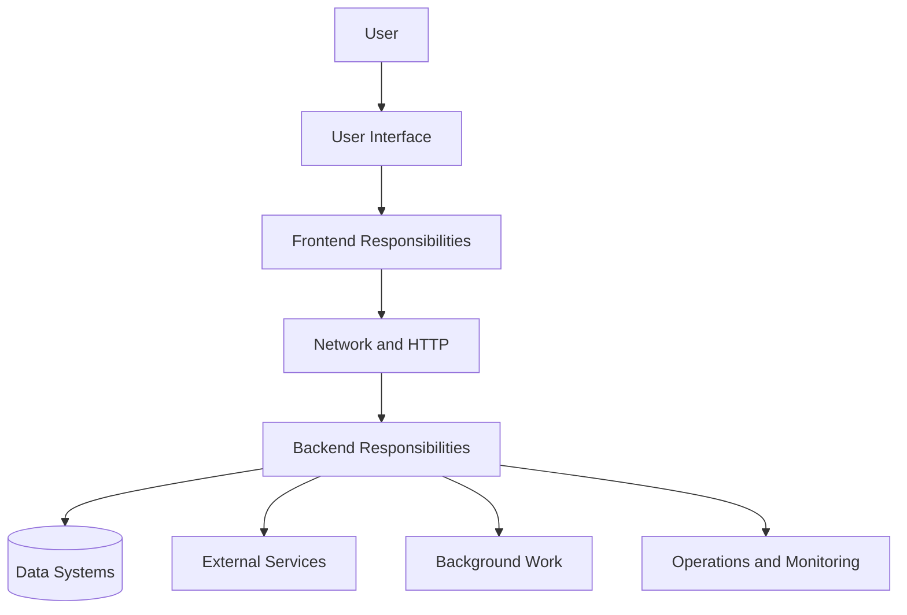
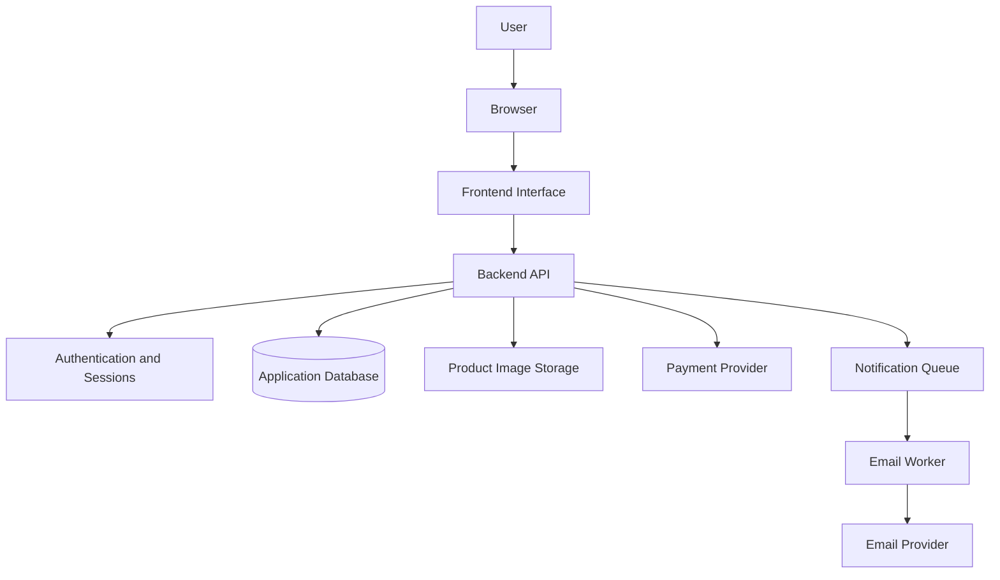
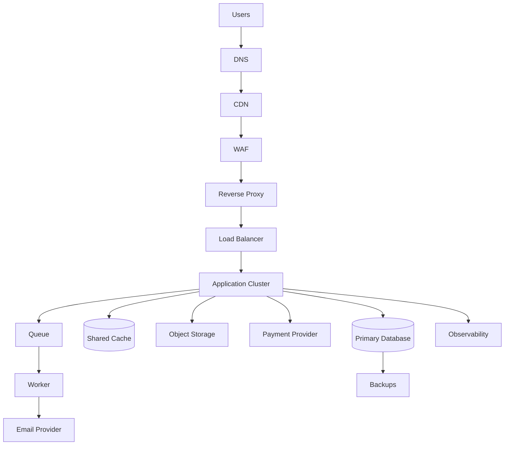
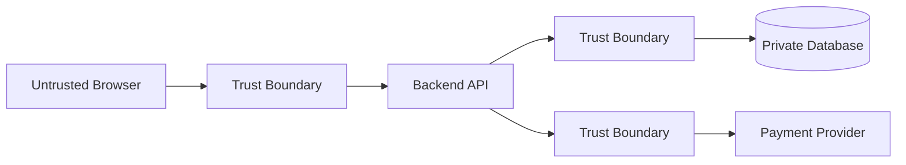
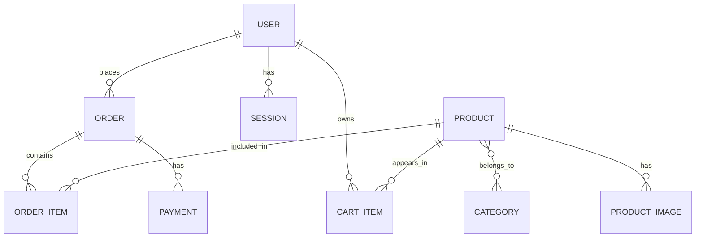
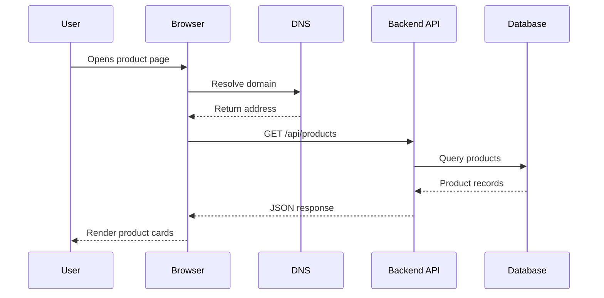
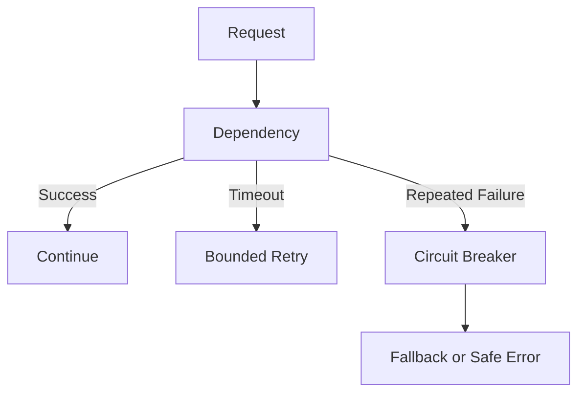
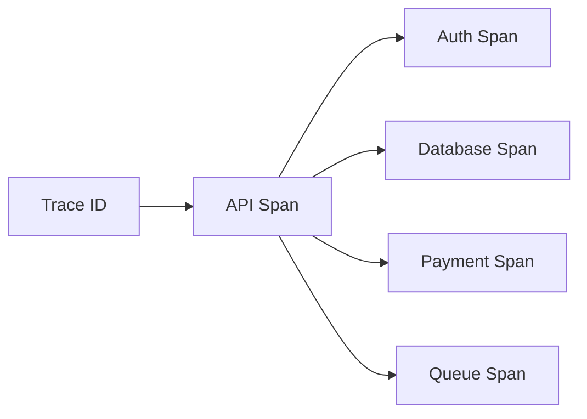
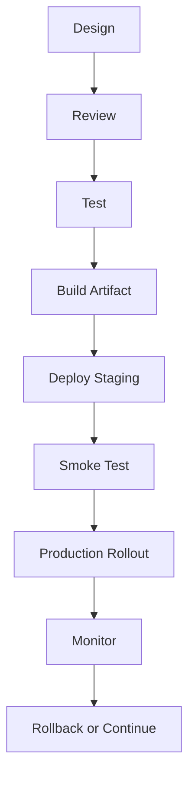
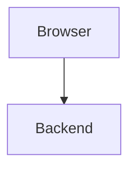

# Part 7 — Planning, Designing, and Narrating a Web Application  
## A No-Code Capstone for Web Mechanics, Architecture, and Network Fundamentals

---

# Part 7 Overview

The previous parts established the mechanics behind modern web applications:

```text
Part 0:
  Introduction and mental models

Part 1:
  Frontend, backend, and full-stack architecture

Part 2:
  Internet, DNS, IP addressing, routing, CDNs, and data centers

Part 3:
  HTTP, HTTPS, URLs, requests, responses, cookies, and TLS

Part 4:
  APIs, REST, GraphQL, RPC, serialization, and contracts

Part 5:
  Browser DevTools, cURL, API clients, and diagnostics

Part 6:
  Performance, reliability, security, and production delivery
```

This capstone does **not** ask you to build a working application.

At this stage, you have not yet been taught a programming language, frontend framework, backend framework, or database implementation technology. Therefore, the capstone is intentionally centered on:

- Planning
- Analysis
- Architecture
- System design
- Data modeling
- API design
- Network reasoning
- Security reasoning
- Failure analysis
- Performance planning
- Deployment planning
- Technical narration

The goal is to demonstrate that you can explain how a web application would work before writing its implementation.

> You are designing and narrating the system, not coding it.

---

# 1. Capstone Project

## Project: Online Store Platform

Design an online store that allows users to:

- Browse products
- Search and filter the product catalog
- View product details
- Create an account
- Log in and log out
- Add products to a cart
- Submit an order
- View order history
- Upload product images as an administrator
- Receive order-confirmation notifications

You will produce a complete system plan explaining:

```text
Who uses the system
What the system does
Which components exist
Where each component runs
How those components communicate
Which data is authoritative
How users authenticate
How permissions are enforced
What happens when systems fail
How the system is monitored
How it could be deployed
```

---

# 2. What This Capstone Is and Is Not

## This capstone is

```text
A planning exercise
An architecture exercise
An API-design exercise
A network-tracing exercise
A security-design exercise
A performance-design exercise
A reliability-design exercise
A technical communication exercise
```

## This capstone is not

```text
A programming assignment
A framework tutorial
A database implementation exercise
A deployment exercise
A coding challenge
A request to build a complete product
```

You may use diagrams, tables, sample HTTP messages, JSON examples, and pseudocode-like descriptions.

You do not need to provide:

```text
JavaScript
Python
Java
React
Node.js
SQL implementation
Dockerfiles
Cloud commands
```

You may mention technologies as examples, but your design must remain understandable without depending on a specific language or framework.

---

# 3. Capstone Goal

The goal is to answer this question:

> Can you plan and clearly explain a web application from the user’s first interaction through the network, frontend, backend, data systems, external services, security boundaries, failures, and operational processes?

A strong capstone should demonstrate systems thinking.



---

# 4. Capstone Deliverables

Your submission should include the following documents or sections.

```text
1. Project overview
2. Goals and scope
3. User roles
4. User journeys
5. Requirements
6. Assumptions and open questions
7. System architecture diagram
8. Component responsibility table
9. Trust-boundary explanation
10. Data ownership plan
11. Conceptual data model
12. API contract
13. Authentication and authorization plan
14. Request-tracing narratives
15. Failure scenarios
16. Performance plan
17. Reliability plan
18. Security plan
19. Observability plan
20. Deployment concept
21. Backup and recovery concept
22. Final architecture narration
```

The deliverable can be written in Markdown.

---

# 5. Recommended Submission Structure

```text
capstone/
├── README.md
├── 01-project-overview.md
├── 02-requirements-and-scope.md
├── 03-user-journeys.md
├── 04-system-architecture.md
├── 05-component-responsibilities.md
├── 06-data-ownership.md
├── 07-conceptual-data-model.md
├── 08-api-contract.md
├── 09-authentication-and-authorization.md
├── 10-request-tracing.md
├── 11-failure-scenarios.md
├── 12-performance-plan.md
├── 13-reliability-plan.md
├── 14-security-plan.md
├── 15-observability-plan.md
├── 16-deployment-and-recovery.md
└── 17-final-narration.md
```

You may combine these into one document, but separate sections make the reasoning easier to review.

---

# 6. Part 1 — Project Overview

Begin with a short explanation of the system.

Example:

> This project describes an online store that allows customers to browse products, search the catalog, manage a cart, place orders, and view order history. Administrators can manage products, inventory, images, and order status. The design separates browser responsibilities from server responsibilities and protects private data through authenticated backend APIs.

Include:

```text
Project name
One-paragraph summary
Primary users
Main capabilities
What is intentionally out of scope
```

---

# 7. Part 2 — Goals and Scope

## In scope

```text
Product browsing
Product search
Product filtering
Product details
Customer accounts
Authentication
Shopping cart
Order creation
Order history
Administrator product management
Product image uploads
Email notifications
```

## Out of scope

You may explicitly exclude:

```text
Real payment settlement
International tax compliance
Advanced recommendation algorithms
Warehouse automation
Mobile applications
Multi-region deployment
Real-time chat
Fraud detection
```

Excluding features is useful because it keeps the design manageable.

A good architecture plan states what it does not attempt to solve.

---

# 8. Part 3 — User Roles

Define the people or systems that interact with the application.

## Customer

Can:

```text
Browse public products
Search products
Manage a personal cart
Place orders
View personal orders
Update personal profile
```

## Administrator

Can:

```text
Create products
Update products
Change inventory
Upload product images
View orders
Update order status
```

## Unauthenticated visitor

Can:

```text
View public products
Search public products
View public product details
```

## External systems

May include:

```text
Payment provider
Email provider
Object storage
Authentication provider
```

Create a permissions table:

| Capability | Visitor | Customer | Administrator |
|---|---:|---:|---:|
| View products | Yes | Yes | Yes |
| Search products | Yes | Yes | Yes |
| Manage personal cart | No | Yes | Yes |
| Place order | No | Yes | Yes |
| View own orders | No | Yes | Yes |
| View all orders | No | No | Yes |
| Create products | No | No | Yes |
| Upload product images | No | No | Yes |

---

# 9. Part 4 — User Journeys

A user journey describes what a person does and what the system does in response.

## Journey A — Browse products

```text
1. Visitor opens the store.
2. Browser requests the store page.
3. DNS resolves the store domain.
4. HTTPS connection is established.
5. Server or CDN returns the page.
6. Browser requests product data or receives it in the page.
7. Browser displays product cards.
```

## Journey B — Log in

```text
1. Customer opens the login form.
2. Customer enters credentials.
3. Browser sends an HTTPS request.
4. Backend validates credentials.
5. Backend creates a session.
6. Browser stores the session cookie or token.
7. Browser requests the customer profile.
8. Backend returns authenticated user data.
```

## Journey C — Place an order

```text
1. Customer opens the cart.
2. Browser requests the current cart.
3. Backend retrieves authoritative product prices.
4. Customer submits the order.
5. Backend validates the request.
6. Backend checks inventory.
7. Backend calculates the total.
8. Payment process begins.
9. Backend creates the order.
10. Confirmation work is queued.
11. Browser receives the order result.
12. Worker sends the confirmation message.
```

User journeys are the foundation for later architecture and sequence diagrams.

---

# 10. Part 5 — Requirements

Separate functional and nonfunctional requirements.

## Functional requirements

Describe what the system does.

```text
The system shall allow visitors to browse public products.
The system shall allow customers to create accounts.
The system shall allow customers to place orders.
The system shall allow administrators to manage products.
The system shall send order-confirmation notifications.
```

## Nonfunctional requirements

Describe qualities or constraints.

```text
The system shall protect private customer data.
The system shall validate requests on the backend.
The system shall paginate large product collections.
The system shall provide useful error responses.
The system shall support backup and recovery.
The system shall record important operational events.
```

---

# 11. Part 6 — Assumptions and Open Questions

A good system design makes assumptions visible.

## Example assumptions

```text
Product browsing is public.
Checkout requires authentication.
Email delivery is asynchronous.
Inventory must be checked on the server.
Product images are stored separately from structured product data.
The first release serves one geographic region.
```

## Example open questions

```text
Must inventory be perfectly real-time?
Can customers place orders as guests?
Are refunds supported?
How long should order data be retained?
Is real payment processing included?
What is the target traffic volume?
What availability level is required?
```

Use a table:

| Question | Current assumption | Impact |
|---|---|---|
| Guest checkout? | No | Checkout requires authentication |
| Multiple regions? | No initially | Simpler data consistency |
| Email required for order success? | No | Email can be asynchronous |
| Inventory consistency? | Strong during checkout | Backend verifies before order creation |

---

# 12. Part 7 — System Architecture Diagram

Create at least one high-level architecture diagram.

A beginner-friendly design:



A production evolution may include:



Do not add components merely to make the diagram look advanced.

---

# 13. Part 8 — Component Responsibility Table

Create a table like this:

| Component | Responsibility | Trust level | Stores data? |
|---|---|---|---|
| Browser | Render UI and collect user input | Untrusted | Temporary state |
| Frontend | Handle interaction and display responses | Untrusted | Client state |
| Backend API | Validate, authorize, and apply business rules | Trusted application boundary | No or limited |
| Database | Store authoritative structured data | Private | Yes |
| Object storage | Store images and large files | Controlled storage | Yes |
| Payment provider | Process or authorize payments | External trusted dependency | Provider-owned |
| Queue | Hold asynchronous work | Internal infrastructure | Temporary jobs |
| Worker | Process background jobs | Controlled server process | Job state |
| CDN | Deliver cacheable resources | Edge infrastructure | Cached data |

This table demonstrates that you understand responsibilities rather than only names.

---

# 14. Part 9 — Trust Boundaries

Document where trust changes.

Important boundaries:

```text
User → Browser
Browser → Backend
Backend → Database
Backend → Payment provider
Backend → Object storage
External provider → Webhook endpoint
Developer environment → Production
```

Example:



For each boundary, describe:

```text
Authentication
Validation
Authorization
Encryption
Logging
Rate limiting
Failure behavior
```

---

# 15. Part 10 — Data Ownership

Create a source-of-truth table.

| Data | Authoritative system | Why |
|---|---|---|
| Product name | Application database | Structured product record |
| Product price | Application database | Used for checkout calculation |
| Inventory | Database or inventory service | Must reflect available stock |
| Cart display | Browser projection | Temporary interface representation |
| Order status | Application database | Application workflow state |
| Payment status | Payment provider plus internal payment record | External settlement authority |
| Product image bytes | Object storage | Suitable for large files |
| Session validity | Session store | Authentication state |
| Recommendations | Recommendation service | Optional external result |

Explain what happens when values disagree.

Example:

```text
If the browser displays $79.99 but the database says $69.99, the backend uses $69.99 during checkout and returns the authoritative value.
```

---

# 16. Part 11 — Conceptual Data Model

You do not need to implement the database.

Describe the data conceptually.



Describe entities:

## User

```text
ID
Email
Name
Role
Account status
Creation date
```

## Product

```text
ID
Name
Description
Price
Currency
Availability
Inventory
```

## Order

```text
ID
Customer
Status
Total
Currency
Creation date
```

## Order item

```text
Product
Quantity
Price at time of purchase
```

The learner should explain why historical order prices should be preserved.

---

# 17. Part 12 — API Contract

Design a small API contract.

## Product listing

```http
GET /api/products?q=keyboard&category=office&page=1&limit=20
```

Response:

```json
{
  "items": [
    {
      "id": "123",
      "name": "Mechanical Keyboard",
      "price": {
        "amount": 7999,
        "currency": "USD"
      },
      "available": true
    }
  ],
  "page": 1,
  "limit": 20,
  "total": 1
}
```

## Product details

```http
GET /api/products/123
```

## Create order

```http
POST /api/orders
Authorization: Bearer REDACTED
Idempotency-Key: order-attempt-123
Content-Type: application/json
```

```json
{
  "items": [
    {
      "productId": "123",
      "quantity": 2
    }
  ]
}
```

Possible responses:

```text
201 Created
401 Unauthorized
403 Forbidden
409 Conflict
422 Unprocessable Content
503 Service Unavailable
```

The capstone should explain what each response means.

---

# 18. Part 13 — Authentication and Authorization Plan

Describe the selected authentication model conceptually.

## Session-cookie option

```text
1. User submits credentials.
2. Backend verifies them.
3. Backend creates a session.
4. Backend returns a secure cookie.
5. Browser sends the cookie on protected requests.
6. Backend resolves the session.
```

## Token option

```text
1. User authenticates.
2. Authentication system issues an access token.
3. Client sends the token in Authorization.
4. Backend validates the token.
5. Backend checks permissions.
```

The capstone must also describe:

```text
Session or token expiration
Logout
Password reset
Role checks
Resource ownership
401 behavior
403 behavior
```

---

# 19. Part 14 — Request-Tracing Narratives

Write at least three end-to-end narratives.

Recommended narratives:

```text
1. Browse products
2. Log in
3. Place an order
```

## Example: Browse products



For each narrative, explain:

```text
What the user does
What the browser sends
What the backend validates
What data is read or written
What response returns
What the user sees
```

---

# 20. Part 15 — Failure Scenarios

Describe what happens when components fail.

## Database unavailable

```text
Backend cannot retrieve products.
API returns a safe temporary error.
Monitoring alerts operators.
Frontend shows an error state and retry option.
```

## Payment provider timeout

```text
Payment is not marked completed.
Order may enter pending state.
The request uses an idempotency key.
A reconciliation process checks final status.
```

## Email provider unavailable

```text
Order remains valid.
Email job remains queued or retries.
User sees the order confirmation in the application.
```

## Cache unavailable

```text
Backend falls back to the database if capacity permits.
Latency may increase.
Cache health is monitored.
```

## Search service unavailable

```text
The application may use a simpler database search or show a temporary search error.
```

---

# 21. Part 16 — Performance Plan

Explain how the system will remain responsive.

## Browser

```text
Optimize images.
Use responsive image sizes.
Split frontend code.
Lazy-load noncritical features.
Show loading states.
```

## Network

```text
Use HTTPS.
Compress text responses.
Use a CDN for public assets.
Avoid unnecessary third-party resources.
```

## API

```text
Paginate results.
Limit response fields.
Cache safe public results.
Use asynchronous processing for long work.
```

## Database

```text
Index search fields.
Use query plans.
Avoid N+1 queries.
Limit result sets.
```

Example performance budget:

```text
Product API P95:
  Less than 500 ms under expected load

Initial frontend bundle:
  Less than 500 KB compressed

Product list:
  Maximum 50 items per request

Large images:
  Responsive variants required
```

These are planning targets, not universal rules.

---

# 22. Part 17 — Reliability Plan

Explain:

```text
How the application handles dependency failures
How traffic is distributed
How unhealthy servers are removed
How retries work
How queues behave
How duplicates are prevented
How data is backed up
How service is restored
```

Include:

```text
Timeouts
Bounded retries
Backoff
Circuit breakers
Idempotency
Health checks
Readiness checks
Graceful degradation
Dead-letter handling
```

A reliability diagram:



---

# 23. Part 18 — Security Plan

Document:

```text
HTTPS
Password security
Session or token protection
Server-side authorization
Ownership checks
Input validation
Parameterized queries
Safe output handling
File upload validation
Rate limiting
Secret storage
Logging redaction
Database isolation
```

For each control, explain:

```text
What it protects
Where it is enforced
What happens when it fails
```

Example:

```text
Authorization:
  Protects private resources.
  Enforced by the backend on every request.
  Returns 403 or a safe 404 when access is denied.
```

---

# 24. Part 19 — Observability Plan

Describe the evidence available when something fails.

## Logs

```text
Request ID
Trace ID
Endpoint
Method
Status
Duration
Error code
Safe user or resource identifier
```

## Metrics

```text
Request rate
Error rate
P95 latency
Database query latency
Cache hit rate
Queue depth
Worker failures
Payment failures
Login failures
```

## Traces

```text
API request
Authentication
Database
Payment
Queue
Worker
Email provider
```

Example:



---

# 25. Part 20 — Deployment and Recovery Concept

Without writing deployment code, describe the process.



Describe:

```text
Development environment
Testing environment
Staging environment
Production environment
Configuration
Secrets
Database migrations
Health checks
Smoke tests
Rollback
```

---

# 26. Part 21 — Backup and Recovery Concept

Define:

```text
What is backed up?
How often?
Where are backups stored?
Who can access them?
How long are they retained?
How is restoration tested?
```

Example:

```text
Database:
  Backed up every 15 minutes.

Object storage:
  Versioning enabled.

RPO:
  Maximum acceptable data loss: 15 minutes.

RTO:
  Target restoration time: 1 hour.
```

Explain that a backup is not proven until restoration has been tested.

---

# 27. Part 22 — Final Narration

The final capstone requirement is a written or recorded narration.

The narration should walk through:

```text
Who uses the system
What happens when a visitor opens the store
What happens when a customer logs in
What happens when a customer places an order
What happens when payment is delayed
What happens when email fails
What happens when the database is unavailable
How the application is secured
How the application is monitored
How it is deployed
How it is recovered
```

Suggested opening:

> A user begins at the browser, which serves as the untrusted client. The browser resolves the store domain through DNS, establishes an HTTPS connection, and requests the frontend or product data. The backend validates the request, enforces authentication and authorization where required, retrieves authoritative data from the database, and returns a structured response. Optional work, such as email delivery, is placed on a queue so it does not unnecessarily delay the order response.

The learner should narrate the system in terms of:

```text
Responsibilities
Boundaries
Data
Protocols
Trust
Failures
Tradeoffs
```

---

# 28. Capstone Review Questions

Before submitting, answer:

```text
What problem does the system solve?
Who are the users?
What data is public?
What data is private?
Where does frontend code run?
Where does backend code run?
Which system is authoritative for prices?
Which system is authoritative for payments?
How does authentication work?
How is authorization enforced?
How are duplicate orders prevented?
What happens if payment fails?
What happens if email fails?
What happens if the database fails?
What is cached?
What is never cached?
How are large collections paginated?
How are images stored?
How is the system monitored?
How is it deployed?
How is it rolled back?
How are backups restored?
What assumptions remain unresolved?
```

---

# 29. What You Should Not Include

Because this is a planning and narration capstone, do not include unnecessary implementation details such as:

```text
Framework-specific boilerplate
Complete source code
Full database migrations
Production cloud commands
Container configuration
Language-specific package files
```

You may include conceptual examples:

```http
GET /api/products
```

```json
{
  "items": []
}
```



The assessment is about reasoning, not syntax.

---

# 30. Final Capstone Standard

The capstone is successful when another person can read or hear your explanation and understand:

```text
What the system does
How the system is organized
Where each responsibility lives
How data moves
How requests are authenticated
How permissions are enforced
How failures are handled
How performance is protected
How the system is monitored
How the system is deployed
How the system is recovered
Why the architecture is appropriate
```

The central question is:

> Can you explain a web application clearly enough that a future implementation team could use your design as a blueprint?
