# Appendix A — Web Vocabulary and Glossary  
## A Beginner-Friendly Reference to Web Mechanics, Architecture, Networking, HTTP, APIs, Security, and Production Systems

This appendix is a reference guide for the terminology used throughout the series.

The goal is not to provide dictionary-style definitions alone. Each term includes:

- A plain-language explanation
- A technical explanation where useful
- A simple example
- Related concepts
- Common beginner misunderstandings

You do not need to memorize this entire appendix at once. Use it as a lookup guide while studying the main parts.

---

# 1. The Big Picture

A modern web application usually involves several layers:

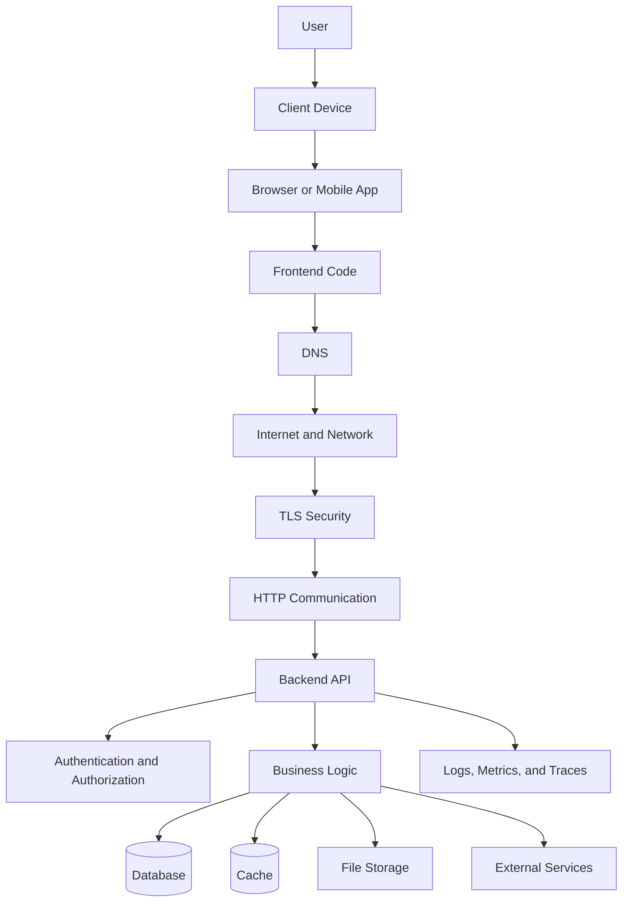

Each term in this appendix fits somewhere in this larger system.

---

# 2. A — Application and Architecture Terms

## API

### Meaning

API stands for **Application Programming Interface**.

An API is a defined way for one software system to communicate with another.

### Simple explanation

An API is a set of rules describing:

- What can be requested
- How requests should be formatted
- What responses look like
- What errors mean
- What permissions are required

### Example

```http
GET /api/products/123
```

Possible response:

```json
{
  "id": 123,
  "name": "Mechanical Keyboard",
  "price": 79.99
}
```

### Related terms

- Endpoint
- Request
- Response
- API contract
- REST
- GraphQL
- RPC

### Common misunderstanding

An API is not the same thing as a database.

The API may use a database, but it can also:

- Apply business rules
- Call external services
- Send emails
- Process files
- Start background work

---

## API Contract

### Meaning

An API contract defines the expected behavior between an API provider and its consumers.

It may describe:

- URLs
- Methods
- Headers
- Authentication
- Request bodies
- Response bodies
- Status codes
- Error formats
- Pagination
- Versioning

### Example

```text
Endpoint:
  POST /api/orders

Request:
  {
    "productId": 123,
    "quantity": 2
  }

Success:
  201 Created

Error:
  422 Unprocessable Content
```

### Why it matters

The frontend and backend can be developed separately when they agree on a contract.

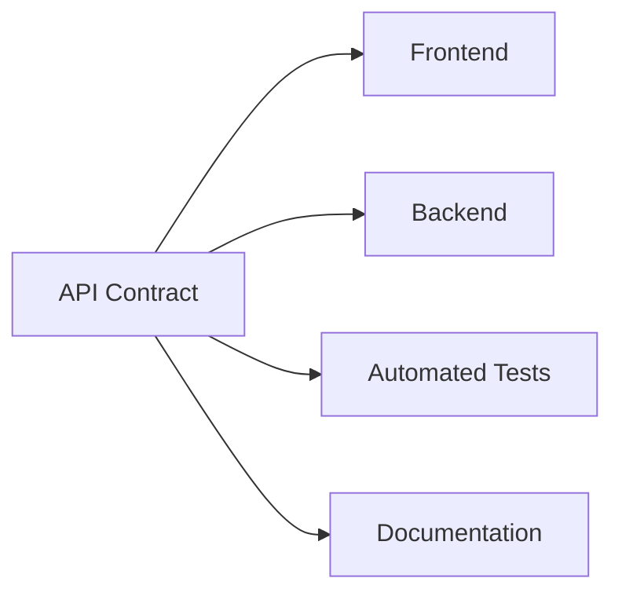

---

## Application

### Meaning

An application is software created to perform a particular purpose.

Examples:

- Online store
- Email client
- Banking dashboard
- Task manager
- Video platform
- Social network

A web application typically includes:

- Frontend code
- Backend code
- Data storage
- Network communication
- Authentication
- Operational systems

---

## Architecture

### Meaning

Software architecture is the arrangement of a system’s components, responsibilities, communication paths, and deployment environments.

### Architecture asks:

- What components exist?
- Where does each component run?
- What does each component do?
- How do components communicate?
- Which system owns the data?
- Which components are trusted?
- How does the system handle failure?

### Example

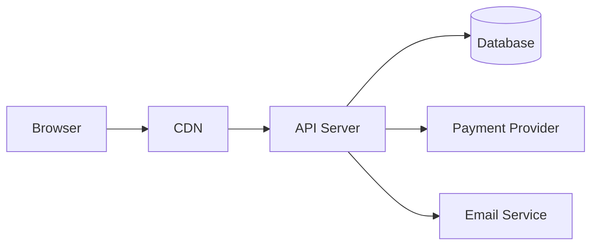

---

## Backend

### Meaning

The backend is the server-side portion of an application.

It commonly handles:

- Business logic
- Authentication
- Authorization
- Database access
- File processing
- External integrations
- Background jobs
- API responses

### Example

When a user places an order, the backend may:

1. Verify the user’s identity.
2. Check product availability.
3. Calculate the price.
4. Process payment.
5. Create an order record.
6. Send a confirmation message.

---

## Business Logic

### Meaning

Business logic is the set of rules that define how an application is supposed to behave.

### Examples

- A user cannot purchase more items than are in stock.
- A discount applies only to eligible products.
- An order cannot be cancelled after shipment.
- Only organization administrators can delete an account.
- A payment must be approved before an order becomes paid.

### Important principle

Business logic should not depend solely on frontend behavior.

The backend should enforce important rules.

---

## Client

### Meaning

A client is a program or device that initiates communication with a server.

Examples:

- Web browser
- Mobile application
- Desktop application
- Command-line tool
- Another backend service
- Automated script

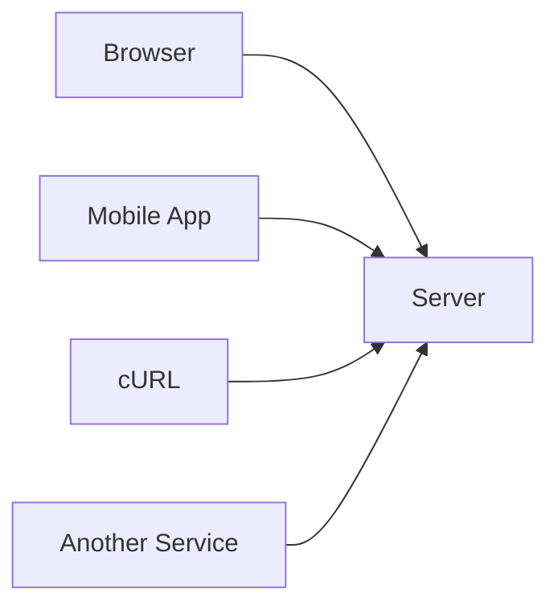

---

## Client-Server Model

### Meaning

The client-server model divides responsibilities between clients and servers.

```text
Client:
  Requests data or operations

Server:
  Processes requests and returns results
```

### Example

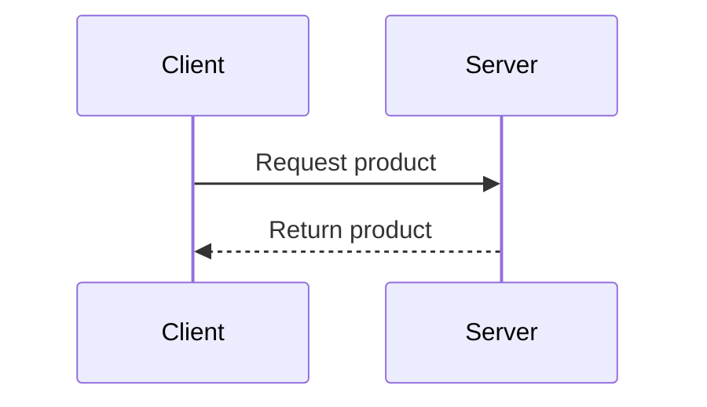

### Important clarification

A client is not necessarily a browser, and a server is not necessarily one physical computer.

---

## Component

### Meaning

A component is a relatively self-contained part of a software system.

Frontend components may include:

- Button
- Search box
- Navigation bar
- Product card
- Modal dialog

Backend components may include:

- Authentication service
- Product service
- Payment module
- Notification worker

---

## Database

### Meaning

A database is a system for storing, organizing, and retrieving data.

Examples:

- PostgreSQL
- MySQL
- SQLite
- MongoDB
- Redis
- DynamoDB

### Example data

```text
Users
Products
Orders
Messages
Inventory
Payments
```

### Important distinction

A database stores information. It usually does not independently enforce all application rules.

The backend commonly acts as the controlled layer between clients and databases.

---

## Deployment

### Meaning

Deployment is the process of making software available in an environment where it can run.

Examples:

- Deploying a website to a hosting provider
- Deploying an API to a cloud server
- Publishing a mobile application
- Releasing a container image

### Common environments

```text
Development
Testing
Staging
Production
```

---

## Distributed System

### Meaning

A distributed system is made of multiple computers or processes that communicate over a network.

Most modern web applications are distributed systems.

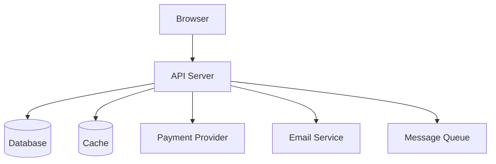

### Why this matters

Distributed systems can fail in many independent ways:

- Network failure
- Database failure
- External API failure
- Authentication failure
- Queue delay
- Server overload

---

## Environment

### Meaning

An environment is a particular configuration in which software runs.

Examples:

```text
Development:
  Local computer

Staging:
  Production-like testing system

Production:
  Real user-facing system
```

Environments may differ in:

- Database
- Credentials
- API URLs
- Logging
- Scale
- Security rules
- External services

---

## Frontend

### Meaning

The frontend is software that runs close to the user, commonly in a browser.

It handles:

- User interface
- User interaction
- Client-side state
- Rendering
- Form behavior
- Requests to APIs
- Displaying responses

### Common technologies

- HTML
- CSS
- JavaScript
- TypeScript
- Frontend frameworks

---

## Full Stack

### Meaning

“Full stack” generally refers to both frontend and backend development.

A full-stack developer may work with:

- Browser code
- APIs
- Databases
- Authentication
- Deployment
- Monitoring

The phrase does not mean one specific technology.

---

## Middleware

### Meaning

Middleware is software that runs between an incoming request and the final request handler.

Middleware may perform:

- Logging
- Authentication
- CORS handling
- Rate limiting
- Request parsing
- Compression
- Error handling

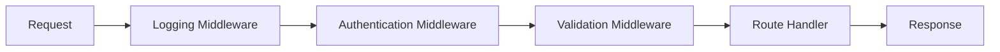

---

## Monolith

### Meaning

A monolith is an application where many responsibilities are deployed as one main unit.

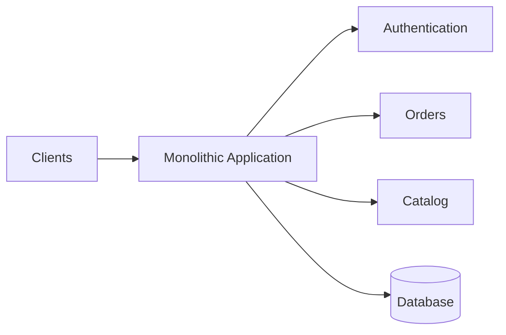

A monolith is not automatically poorly designed.

A well-structured monolith can be:

- Simple to deploy
- Easy to test
- Easy to run locally
- Appropriate for many applications

---

## Microservices

### Meaning

Microservices divide an application into multiple independently deployable services.

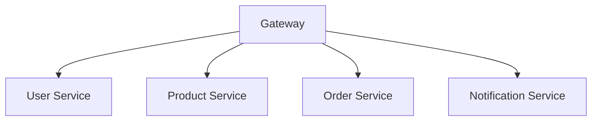

Advantages may include:

- Independent scaling
- Independent deployment
- Clear ownership

Costs may include:

- More network communication
- More deployment complexity
- Distributed failures
- More monitoring requirements

---

## Serverless

### Meaning

Serverless is an execution model where the hosting provider manages much of the underlying server infrastructure.

The servers still exist. The developer simply manages less of them directly.

Common uses:

- API functions
- Webhooks
- Scheduled tasks
- Form processing
- Image transformation

---

## Service

### Meaning

A service is a software component that provides a specific capability.

Examples:

- Authentication service
- Payment service
- Search service
- Email service
- Inventory service

A service may be part of one application or independently deployed.

---

# 3. B — Browser and Frontend Terms

## Browser

### Meaning

A browser is software that retrieves, interprets, executes, and displays web content.

Examples:

- Chrome
- Firefox
- Safari
- Edge

A browser can:

- Request resources
- Parse HTML
- Apply CSS
- Execute JavaScript
- Store cookies
- Send API requests
- Render images and video
- Enforce browser security policies

---

## Browser Cache

### Meaning

A browser cache stores previously downloaded resources for reuse.

Common cached resources:

- CSS
- JavaScript
- Images
- Fonts
- HTML
- API responses

Caching can improve speed but may cause stale content during development.

---

## CSS

### Meaning

CSS stands for **Cascading Style Sheets**.

CSS controls presentation and layout.

It manages:

- Colors
- Fonts
- Spacing
- Sizing
- Alignment
- Responsive design
- Animations
- Visibility

Example:

```css
button {
  background: blue;
  color: white;
}
```

---

## DOM

### Meaning

DOM stands for **Document Object Model**.

The browser converts HTML into an in-memory tree structure.

HTML:

```html
<h1>Welcome</h1>
```

Conceptual DOM:

```text
Document
└── h1
    └── "Welcome"
```

JavaScript can read and change the DOM.

---

## Frontend State

### Meaning

Frontend state is information used to control the current interface.

Examples:

```text
menuOpen = true
isLoading = false
selectedTab = "reviews"
searchText = "keyboard"
```

Frontend state is often temporary and may disappear when the page is closed.

---

## HTML

### Meaning

HTML stands for **HyperText Markup Language**.

HTML describes the structure and meaning of a webpage.

Example:

```html
<h1>Product Catalog</h1>
<p>Browse available products.</p>
<button>Buy now</button>
```

HTML describes:

- Headings
- Paragraphs
- Links
- Images
- Forms
- Buttons
- Lists
- Tables

---

## JavaScript

### Meaning

JavaScript is a programming language commonly used to add behavior to webpages.

It can:

- Respond to clicks
- Validate forms
- Update the DOM
- Send HTTP requests
- Manage frontend state
- Display errors
- Control animations

---

## Hydration

### Meaning

Hydration is the process of attaching client-side JavaScript behavior to HTML that was already rendered by the server.

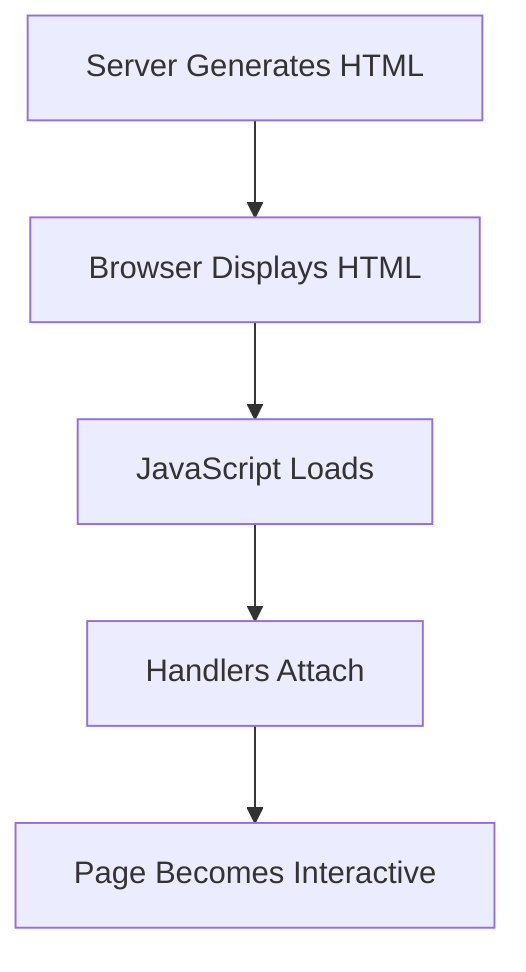

Hydration is common in server-rendered applications.

---

## Rendering

### Meaning

Rendering is the process of turning data and code into visible interface output.

Rendering can happen:

- In the browser
- On the server
- During a build
- At an edge location

---

## Single-Page Application

### Meaning

A Single-Page Application, or SPA, usually loads one main application shell and updates the interface dynamically using JavaScript.

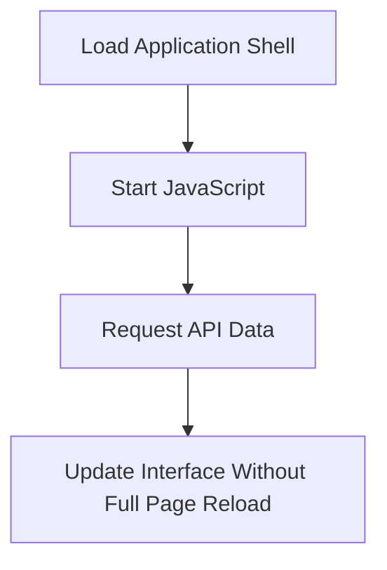

---

## Server-Side Rendering

### Meaning

Server-side rendering, or SSR, means the server generates HTML for a request before sending it to the browser.

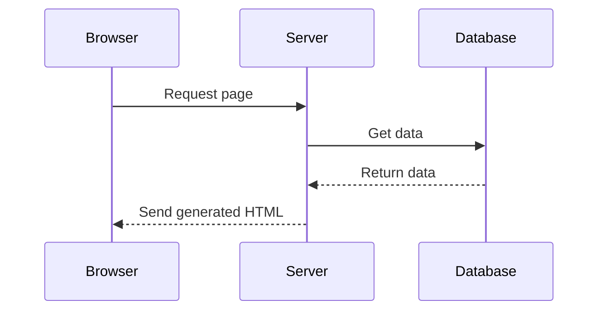

---

## Static Site

### Meaning

A static site serves prebuilt files such as:

```text
index.html
styles.css
script.js
image.png
```

Static sites can still be interactive if JavaScript communicates with APIs.

---

# 4. C — Caching, Content, and Communication Terms

## Cache

### Meaning

A cache stores a copy of data so it can be reused more quickly.

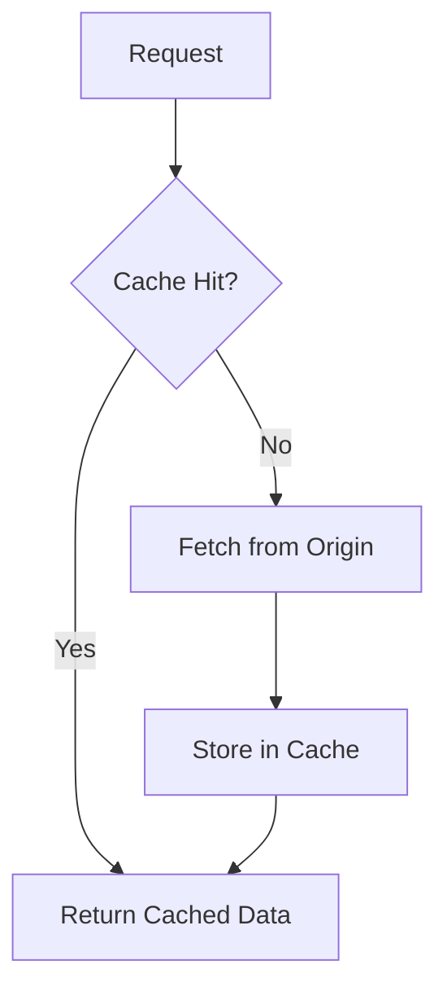

Caches may exist in:

- Browser
- CDN
- Reverse proxy
- Application
- Database
- Operating system

---

## Cache Hit

### Meaning

A cache hit occurs when requested data is already available in the cache.

Result:

```text
Fast response
Less origin work
Less network traffic
```

---

## Cache Miss

### Meaning

A cache miss occurs when the requested data is not available in the cache.

The system must retrieve or calculate it from another source.

---

## Cache Invalidation

### Meaning

Cache invalidation means removing or updating cached data when it is no longer correct.

This is difficult because a cached value may outlive the data it represents.

---

## CDN

### Meaning

CDN stands for **Content Delivery Network**.

A CDN is a geographically distributed collection of servers that delivers content closer to users.

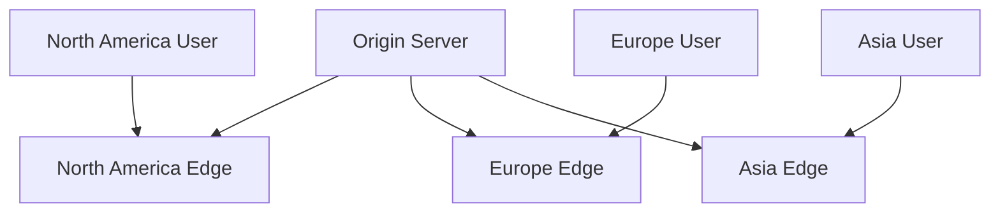

CDNs commonly deliver:

- Images
- CSS
- JavaScript
- Fonts
- Videos
- Downloads
- Static HTML

---

## Content-Type

### Meaning

`Content-Type` is an HTTP header identifying the format of a request or response body.

Examples:

```http
Content-Type: application/json
Content-Type: text/html
Content-Type: image/png
Content-Type: multipart/form-data
```

---

## Content-Encoding

### Meaning

`Content-Encoding` identifies compression applied to a response body.

Examples:

```http
Content-Encoding: gzip
Content-Encoding: br
```

The browser decompresses the body before using it.

---

## Content Negotiation

### Meaning

Content negotiation allows a client and server to agree on a suitable representation format.

Client:

```http
Accept: application/json
```

Server:

```http
Content-Type: application/json
```

---

## Cookie

### Meaning

A cookie is a small piece of data stored by the browser and often sent automatically with future requests.

Cookies may store:

- Session identifiers
- Preferences
- Tracking identifiers
- Authentication state

Example:

```http
Set-Cookie: session_id=abc123; Secure; HttpOnly; SameSite=Lax
```

---

## Compression

### Meaning

Compression reduces the number of bytes needed to transfer data.

Common compression algorithms include:

- gzip
- Brotli
- zstd in some systems

Compression is especially useful for:

- HTML
- CSS
- JavaScript
- JSON
- Plain text

---

# 5. D — Data, Databases, and Deployment Terms

## Data Center

### Meaning

A data center is a facility containing computing, storage, power, cooling, and networking infrastructure.

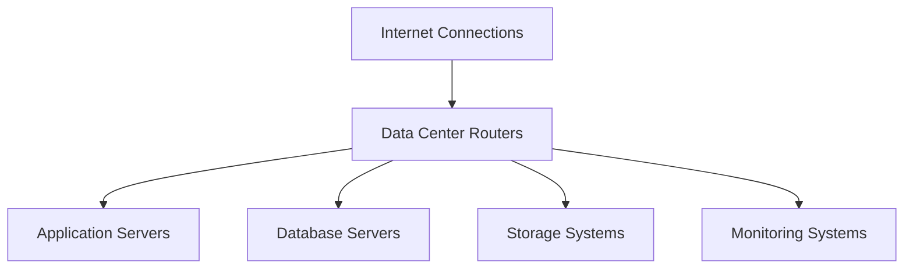

---

## Data Serialization

### Meaning

Serialization converts an in-memory data structure into a transferable representation.

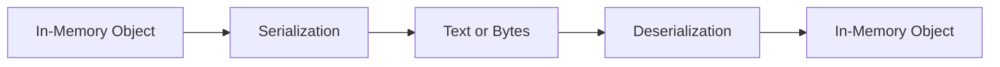

Common serialization formats:

- JSON
- XML
- Protocol Buffers
- MessagePack
- Form encoding
- Multipart form data

---

## Database Index

### Meaning

A database index helps the database locate records more efficiently.

An index can improve reads but may increase:

- Storage use
- Write cost
- Maintenance work

Indexes should match real query patterns.

---

## Database Migration

### Meaning

A database migration is a controlled change to a database schema or data.

Examples:

- Add a column
- Create a table
- Add an index
- Rename a field
- Backfill data
- Remove obsolete fields

---

## Database Transaction

### Meaning

A transaction is a group of database operations treated as one logical unit.

A transaction often aims to provide:

- Atomicity
- Consistency
- Isolation
- Durability

For example, transferring money may require:

```text
Subtract from account A
Add to account B
```

Both operations should succeed together or fail together.

---

## Deadlock

### Meaning

A deadlock occurs when operations wait on one another indefinitely.

Example:

```text
Transaction A locks row 1 and waits for row 2.
Transaction B locks row 2 and waits for row 1.
```

Databases may detect and abort one transaction.

---

## Deployment Pipeline

### Meaning

A deployment pipeline automates the process of testing, packaging, and releasing software.

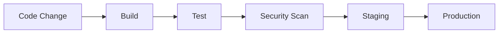

---

# 6. E — Encryption and Error Terms

## Encryption

### Meaning

Encryption transforms readable data into protected data using a key.

```text
Plaintext + Key → Ciphertext
```

Encryption helps provide confidentiality.

---

## Asymmetric Encryption

### Meaning

Asymmetric cryptography uses a public key and a private key.

The public key can be shared. The private key must remain secret.

Uses include:

- Server authentication
- Digital signatures
- Key exchange

---

## Symmetric Encryption

### Meaning

Symmetric encryption uses the same secret key to encrypt and decrypt data.

It is efficient and commonly used to protect the main body of a secure session.

---

## TLS

### Meaning

TLS stands for **Transport Layer Security**.

TLS protects network communication by providing:

- Confidentiality
- Integrity
- Authentication

HTTPS uses HTTP over TLS.

---

## Error Budget

### Meaning

An error budget represents the amount of unreliability allowed under a service target.

If a service promises `99.9%` availability, the allowed downtime is approximately 8.76 hours per year.

---

## Error Handling

### Meaning

Error handling is the process of detecting, representing, logging, and recovering from failures.

Errors may occur in:

- Frontend
- Network
- TLS
- Backend
- Database
- External services
- Background jobs

---

# 7. F — Files, Formats, and Frontend Data

## File Storage

### Meaning

File storage stores large or binary objects such as:

- Images
- Videos
- PDFs
- Audio
- Backups
- Generated reports

It is often separate from the main database.

---

## Form Data

### Meaning

Form data is data submitted from an HTML form.

Common encodings:

```text
application/x-www-form-urlencoded
multipart/form-data
```

---

## Fragment

### Meaning

A URL fragment begins with `#`.

Example:

```text
https://example.com/docs#headers
```

The fragment is normally handled by the browser and is not sent to the server in the HTTP request.

---

# 8. G — Gateway and Graph Terms

## Gateway

### Meaning

A gateway is a system that acts as an entry point between networks or services.

An API gateway may provide:

- Routing
- Authentication
- Rate limiting
- TLS termination
- Request transformation
- Logging

---

## GraphQL

### Meaning

GraphQL is a query language and runtime for APIs.

Clients request the fields they need through a schema.

Example:

```graphql
query {
  product(id: 123) {
    name
    price
  }
}
```

GraphQL often uses one endpoint:

```text
POST /graphql
```

---

## GraphQL Schema

### Meaning

A GraphQL schema defines the available types, fields, arguments, queries, mutations, and subscriptions.

---

# 9. H — HTTP and Hosting Terms

## HTTP

### Meaning

HTTP stands for **HyperText Transfer Protocol**.

It defines how clients and servers exchange web messages.

A request commonly contains:

- Method
- Path
- Headers
- Optional body

A response commonly contains:

- Status code
- Headers
- Optional body

---

## HTTP Method

### Meaning

An HTTP method communicates the intended operation.

Common methods:

```text
GET
POST
PUT
PATCH
DELETE
HEAD
OPTIONS
```

---

## HTTP Status Code

### Meaning

An HTTP status code describes the result of a request.

Categories:

| Range | Meaning |
|---|---|
| `1xx` | Informational |
| `2xx` | Success |
| `3xx` | Redirection |
| `4xx` | Client or request problem |
| `5xx` | Server problem |

---

## HTTPS

### Meaning

HTTPS is HTTP protected by TLS.

It provides:

- Confidentiality
- Integrity
- Server authentication

It does not automatically guarantee secure business logic or correct authorization.

---

## Host

### Meaning

A host identifies a network destination in a URL.

Examples:

```text
example.com
api.example.com
localhost
127.0.0.1
```

---

## Host Header

### Meaning

The `Host` request header identifies the requested hostname.

```http
Host: example.com
```

One server may host many domain names, so this header helps it choose the correct application or configuration.

---

# 10. I — Identity and Infrastructure Terms

## Identity

### Meaning

Identity is the information used to represent a user, service, device, or organization.

Authentication verifies identity.

Authorization uses identity to make permission decisions.

---

## Infrastructure

### Meaning

Infrastructure is the computing, networking, storage, and operational environment that supports applications.

It includes:

- Servers
- Networks
- Databases
- Storage
- DNS
- Proxies
- Load balancers
- Monitoring
- Deployment systems

---

## Idempotency

### Meaning

An operation is idempotent when repeating it produces the same intended final state.

`PUT` and `DELETE` are generally intended to be idempotent.

`POST` is generally not automatically idempotent.

Idempotency keys can protect operations such as:

- Payments
- Order creation
- Reservation
- Message sending

---

## IP Address

### Meaning

An IP address identifies a destination on an IP network.

Examples:

```text
IPv4: 203.0.113.10
IPv6: 2001:db8::10
```

An IP address may represent:

- A server
- A load balancer
- A CDN edge
- A router
- A shared service
- A temporary destination

---

## IPv4

### Meaning

IPv4 uses 32-bit addresses written as four decimal numbers.

Example:

```text
192.0.2.25
```

---

## IPv6

### Meaning

IPv6 uses 128-bit addresses written in hexadecimal groups.

Example:

```text
2001:db8::1
```

IPv6 provides a much larger address space than IPv4.

---

# 11. J — JavaScript and Job Terms

## JavaScript

See the frontend glossary section.

## Job Queue

### Meaning

A job queue stores tasks that should be processed asynchronously.

Examples:

- Send an email
- Generate a report
- Resize an image
- Process a video
- Rebuild a search index

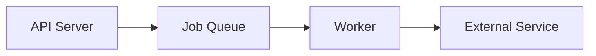

---

## Job Worker

### Meaning

A worker is a process that consumes jobs from a queue and performs background work.

Workers help prevent long-running operations from blocking normal HTTP requests.

---

# 12. L — Latency, Load, and Logging Terms

## Latency

### Meaning

Latency is the delay involved in communication or processing.

It may come from:

- DNS
- Network distance
- TLS
- Server processing
- Database queries
- External APIs
- Browser rendering

---

## Load Balancer

### Meaning

A load balancer distributes requests among multiple servers.

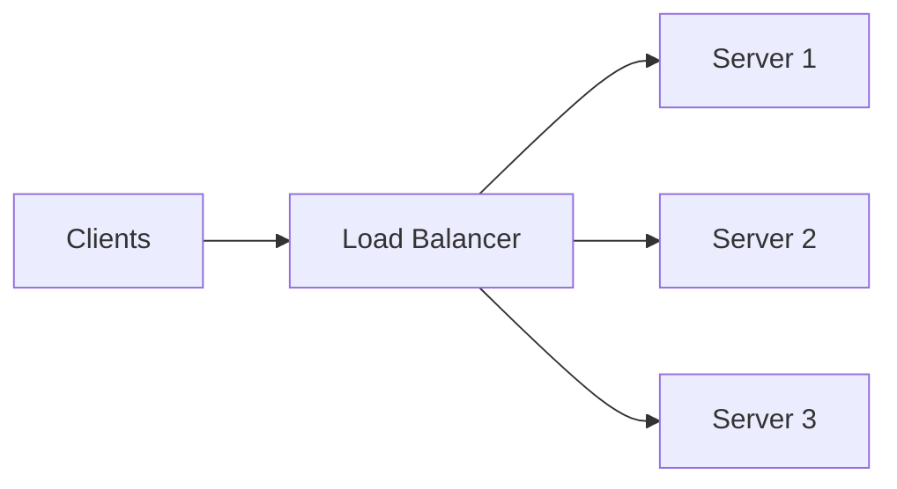

It may also:

- Check server health
- Remove failed servers
- Terminate TLS
- Route by hostname or path
- Distribute traffic geographically

---

## Load Testing

### Meaning

Load testing evaluates how a system behaves under expected traffic.

It may measure:

- Throughput
- Response latency
- Error rate
- CPU usage
- Database performance
- Queue growth

---

## Logging

### Meaning

Logging records events that occur in a system.

Example:

```json
{
  "level": "info",
  "event": "order_created",
  "orderId": "9001",
  "requestId": "req_abc123"
}
```

Logs are useful for debugging and operations.

---

# 13. M — Middleware, Metrics, and Microservices

## Metrics

### Meaning

Metrics are numerical measurements collected over time.

Examples:

- Request count
- Error rate
- CPU usage
- Memory usage
- Cache hit rate
- Queue depth
- Request latency

---

## Microservice

See the architecture glossary section.

---

## Multipart Form Data

### Meaning

`multipart/form-data` is a request format commonly used for forms containing files.

It can include:

- Text fields
- Files
- Metadata
- Multiple values

---

# 14. N — Network Terms

## NAT

### Meaning

NAT stands for **Network Address Translation**.

NAT allows multiple private devices to share a public IPv4 address.

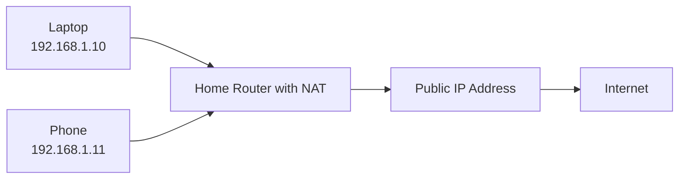

---

## Network

### Meaning

A network is a system that allows devices to communicate.

Networks may be:

- Local
- Private
- Public
- Wireless
- Cellular
- Enterprise
- Cloud-based

---

## Network Address

See IP address.

---

## Network Interface

### Meaning

A network interface is a connection through which a device communicates.

Examples:

- Wi-Fi adapter
- Ethernet port
- Cellular modem
- Virtual network interface

---

## Network Latency

See latency.

---

## Network Packet

### Meaning

A packet is a unit of data transmitted across an IP network.

It commonly contains:

- Source information
- Destination information
- Protocol metadata
- Payload

Large responses are divided into packets and reassembled by the receiving system.

---

## Network Topology

### Meaning

Network topology describes how devices and networks connect.

Example:

```mermaid
flowchart LR
    U[User Device] --> H[Home Router]
    H --> ISP[ISP]
    ISP --> T[Transit Network]
    T --> DC[Data Center]
    DC --> S[Server]
```

---

# 15. O — Observability and Origin Terms

## Observability

### Meaning

Observability is the ability to understand what is happening inside a running system by examining its external outputs.

The common pillars are:

```text
Logs
Metrics
Traces
```

---

## Origin Server

### Meaning

The origin server is the primary source of application content or data.

A CDN may retrieve a resource from the origin when it does not have a cached copy.

---

## Origin

### Meaning

In browser security, an origin is commonly defined as:

```text
Scheme + Host + Port
```

Examples:

```text
https://example.com
https://api.example.com
```

These are different origins because their hosts differ.

---

# 16. P — Packet, Payload, Port, and Proxy Terms

## Packet

See network packet.

---

## Payload

### Meaning

A payload is the main data carried by a message.

In an HTTP request, the payload is often the request body.

Example:

```json
{
  "name": "Alex"
}
```

---

## Port

### Meaning

A port identifies a service on a networked system.

Common conventions:

| Port | Typical use |
|---:|---|
| `80` | HTTP |
| `443` | HTTPS |
| `22` | SSH |
| `53` | DNS |
| `5432` | PostgreSQL |
| `3306` | MySQL |

A complete network destination may be represented as:

```text
203.0.113.10:443
```

---

## Private IP Address

### Meaning

A private IP address is used inside a local or private network.

Common IPv4 ranges include:

```text
10.0.0.0/8
172.16.0.0/12
192.168.0.0/16
```

Private addresses are not normally routed directly across the public Internet.

---

## Public IP Address

### Meaning

A public IP address is reachable through public Internet routing, subject to firewalls and other controls.

---

## Proxy

### Meaning

A proxy is an intermediary that receives requests and forwards them.

A forward proxy acts on behalf of clients.

A reverse proxy acts on behalf of servers.

```mermaid
flowchart LR
    C[Client] --> P[Reverse Proxy]
    P --> S[Backend Server]
```

---

## Reverse Proxy

### Meaning

A reverse proxy sits in front of backend servers.

It may provide:

- TLS termination
- Routing
- Compression
- Caching
- Load balancing
- Rate limiting
- Security filtering

---

# 17. Q — Query and Queue Terms

## Query Parameter

### Meaning

A query parameter is a key-value pair in the URL after `?`.

Example:

```text
/products?category=keyboards&page=2
```

Parameters:

```text
category = keyboards
page = 2
```

Query parameters are commonly used for:

- Filtering
- Sorting
- Searching
- Pagination
- Optional behavior

---

## Query String

### Meaning

The query string is the portion of a URL containing query parameters.

Example:

```text
?category=keyboards&page=2
```

---

## Queue

### Meaning

A queue stores work or messages until they can be processed.

Queues are useful for:

- Background jobs
- Notifications
- Event processing
- Traffic smoothing
- Service decoupling

---

# 18. R — Reliability, REST, Routing, and Runtime Terms

## Rate Limiting

### Meaning

Rate limiting restricts how many requests a client may make within a period.

It protects against:

- Abuse
- Accidental overload
- Brute-force attacks
- Excessive resource usage

A rate-limited response:

```http
HTTP/1.1 429 Too Many Requests
Retry-After: 60
```

---

## Readiness Check

### Meaning

A readiness check determines whether a service is ready to receive traffic.

A process may be running but not ready because a database connection has not been established.

---

## Recovery Point Objective

### Meaning

RPO describes how much recent data an organization can afford to lose after a failure.

```text
RPO = 15 minutes
```

means the organization may accept losing up to 15 minutes of recent data.

---

## Recovery Time Objective

### Meaning

RTO describes how quickly a system should be restored after failure.

```text
RTO = 1 hour
```

means the system should be restored within one hour.

---

## Redirect

### Meaning

A redirect tells a client to use another URL.

Example:

```http
HTTP/1.1 301 Moved Permanently
Location: https://example.com/new-page
```

---

## Representation

### Meaning

A representation is a format used to transfer information about a resource.

A product may be represented as:

- JSON
- HTML
- XML
- Binary data

---

## Resource

### Meaning

A resource is something represented or managed by an API.

Examples:

```text
/users/42
/products/123
/orders/9001
```

---

## REST

### Meaning

REST stands for **Representational State Transfer**.

It is an architectural style that commonly uses:

- Resource-oriented URLs
- Standard HTTP methods
- Stateless requests
- Cacheable responses
- Client-server separation

---

## Retry

### Meaning

A retry repeats an operation after a failure.

Retries should be:

- Limited
- Delayed
- Used only for appropriate failures
- Safe for the operation being retried

---

## Router

### Meaning

A router connects networks and forwards packets toward destinations.

A home router may connect:

```text
Home devices → ISP network
```

Internet routers connect larger networks.

---

## Runtime

### Meaning

A runtime is the environment in which code executes.

Examples:

- Browser runtime
- Node.js runtime
- Python runtime
- Java Virtual Machine
- Edge runtime
- Serverless runtime

Different runtimes provide different capabilities.

---

# 19. S — Server, Session, Security, and Serialization Terms

## Server

### Meaning

A server is software or hardware that receives requests and provides services.

A server may:

- Return files
- Process API requests
- Query databases
- Authenticate users
- Run background work

---

## Server-Side State

### Meaning

Server-side state is information stored or managed by backend systems.

Examples:

- User accounts
- Orders
- Inventory
- Sessions
- Payment status
- Subscriptions

---

## Session

### Meaning

A session represents a period of interaction between a client and an application.

A session may be identified by a cookie:

```text
session_id=abc123
```

The server uses the identifier to retrieve session information.

---

## Session Cookie

### Meaning

A session cookie stores an identifier that helps the server recognize a client across multiple requests.

---

## Serialization

See the data glossary section.

---

## Stateless

### Meaning

A stateless interaction contains the information needed to process each request without depending on hidden temporary conversation state.

Statelessness does not mean that the application cannot store data.

---

## Status Code

See HTTP status code.

---

## Symmetric Encryption

See encryption terms.

---

# 20. T — TCP, TLS, Tokens, and Traces

## TCP

### Meaning

TCP stands for **Transmission Control Protocol**.

TCP provides transport features such as:

- Reliable delivery
- Ordering
- Retransmission
- Connection management
- Flow control

HTTP/1.1 and HTTP/2 commonly use TCP.

---

## TLD

### Meaning

TLD stands for **Top-Level Domain**.

Examples:

```text
.com
.org
.net
.uk
.de
.jp
```

In:

```text
example.com
```

`.com` is the TLD.

---

## Token

### Meaning

A token is a value used to represent authorization, identity, or another security context.

Example:

```http
Authorization: Bearer access-token
```

Tokens must be protected because possession may grant access.

---

## Trace

### Meaning

A trace follows one request across multiple components.

```mermaid
flowchart LR
    T[Trace ID] --> API[API Span]
    API --> DB[Database Span]
    API --> PAY[Payment Span]
    API --> EMAIL[Email Span]
```

Traces are especially useful in distributed systems.

---

## TTFB

### Meaning

TTFB stands for **Time to First Byte**.

It measures approximately how long it takes before the first response byte reaches the client.

TTFB may include:

- Network travel
- Server queueing
- Backend processing
- Database queries
- External service calls

---

# 21. U — URI, URL, and User-Agent Terms

## URI

### Meaning

URI stands for **Uniform Resource Identifier**.

It identifies a resource.

A URL is a type of URI that also provides a way to locate or access the resource.

In everyday web development, people often use “URL” for web addresses.

---

## URL

### Meaning

URL stands for **Uniform Resource Locator**.

Example:

```text
https://www.example.com:443/products/123?color=blue#reviews
```

Components:

```text
Scheme:   https
Host:     www.example.com
Port:     443
Path:     /products/123
Query:    color=blue
Fragment: reviews
```

---

## User-Agent

### Meaning

The `User-Agent` request header identifies the client software.

Example:

```http
User-Agent: Mozilla/5.0 ...
```

It may describe:

- Browser
- Operating system
- Device
- Rendering engine

It should not be treated as a trustworthy identity claim.

---

# 22. V — Validation and Version Terms

## Validation

### Meaning

Validation checks whether input is acceptable.

Validation may check:

- Type
- Format
- Length
- Range
- Required fields
- Allowed values
- Relationships
- Permissions

```mermaid
flowchart LR
    I[Input] --> P[Parse]
    P --> S[Schema Validation]
    S --> B[Business Validation]
    B --> U[Use Safely]
```

---

## Versioning

### Meaning

Versioning allows APIs, applications, or data formats to evolve while managing compatibility.

Examples:

```text
/api/v1/products
/api/v2/products
```

Versioning may also use:

- Headers
- Query parameters
- Schema versions
- Content types

---

# 23. W — Web and WebSocket Terms

## Web

### Meaning

The Web is a system of websites, web applications, URLs, browsers, servers, and HTTP-based communication built on top of the Internet.

The Web is not the same as the entire Internet.

---

## WebSocket

### Meaning

WebSocket is a protocol for persistent, bidirectional communication between a client and server.

```mermaid
sequenceDiagram
    participant C as Client
    participant S as Server

    C->>S: Establish connection
    S-->>C: Connection accepted
    S-->>C: Send update
    C->>S: Send message
    S-->>C: Send response
```

Common uses:

- Chat
- Live notifications
- Multiplayer applications
- Real-time dashboards
- Collaborative editing

---

## Webhook

### Meaning

A webhook is an HTTP callback sent by one service to another when an event occurs.

Example:

```text
Payment provider → Your backend
```

The payment provider may send:

```http
POST /webhooks/payment
```

with payment status data.

The receiving system must verify that the webhook is authentic.

---

## Web Server

### Meaning

A web server is software that accepts web requests and returns resources or responses.

It may serve:

- HTML
- CSS
- JavaScript
- Images
- API responses
- Files

A web server may be:

- A static file server
- A reverse proxy
- An application server
- A combination of these

---

# 24. X — XML, XSS, and Related Terms

## XML

### Meaning

XML stands for **Extensible Markup Language**.

Example:

```xml
<product>
  <id>123</id>
  <name>Keyboard</name>
</product>
```

XML supports nested structures, attributes, namespaces, and schemas.

---

## XSS

### Meaning

XSS stands for **Cross-Site Scripting**.

It occurs when untrusted content is interpreted as executable browser code.

Protection includes:

- Escaping output
- Safe templating
- Sanitizing allowed HTML
- Content Security Policy
- Avoiding unsafe DOM operations

---

# 25. Common HTTP Status Codes Quick Reference

| Code | Name | Meaning |
|---:|---|---|
| `200` | OK | Request succeeded |
| `201` | Created | Resource was created |
| `202` | Accepted | Work accepted for later processing |
| `204` | No Content | Success with no response body |
| `301` | Moved Permanently | Permanent redirect |
| `302` | Found | Temporary redirect |
| `304` | Not Modified | Use cached copy |
| `400` | Bad Request | Request is malformed or invalid |
| `401` | Unauthorized | Authentication required or invalid |
| `403` | Forbidden | Authentication may exist, but permission is denied |
| `404` | Not Found | Resource or route not found |
| `405` | Method Not Allowed | Method is unsupported for the route |
| `409` | Conflict | Request conflicts with current state |
| `413` | Content Too Large | Request body is too large |
| `415` | Unsupported Media Type | Body format is unsupported |
| `422` | Unprocessable Content | Data fails validation |
| `429` | Too Many Requests | Rate limit exceeded |
| `500` | Internal Server Error | General backend failure |
| `502` | Bad Gateway | Invalid upstream response |
| `503` | Service Unavailable | Service temporarily unavailable |
| `504` | Gateway Timeout | Upstream response took too long |

---

# 26. Common HTTP Methods Quick Reference

| Method | Typical purpose | Safe? | Idempotent? |
|---|---|---:|---:|
| `GET` | Retrieve data | Yes | Yes |
| `HEAD` | Retrieve headers | Yes | Yes |
| `POST` | Submit or create | No | Usually no |
| `PUT` | Replace resource | No | Yes |
| `PATCH` | Partially update | No | Depends on design |
| `DELETE` | Remove resource | No | Yes |
| `OPTIONS` | Discover supported communication options | Yes | Yes |

“Safe” and “idempotent” describe intended semantics. A poorly designed API can violate those expectations.

---

# 27. Common Content Types Quick Reference

| Content type | Typical use |
|---|---|
| `application/json` | JSON API data |
| `text/html` | HTML documents |
| `text/plain` | Plain text |
| `text/css` | CSS stylesheets |
| `application/javascript` | JavaScript |
| `application/xml` | XML data |
| `application/x-www-form-urlencoded` | Traditional form fields |
| `multipart/form-data` | Forms containing files |
| `image/png` | PNG image |
| `image/jpeg` | JPEG image |
| `application/pdf` | PDF document |
| `application/octet-stream` | Generic binary data |

---

# 28. Common Acronyms

```text
API    Application Programming Interface
CDN    Content Delivery Network
CI/CD  Continuous Integration / Continuous Delivery or Deployment
CORS   Cross-Origin Resource Sharing
CRUD   Create, Read, Update, Delete
CSRF   Cross-Site Request Forgery
CSS    Cascading Style Sheets
DNS    Domain Name System
DOM    Document Object Model
HTML   HyperText Markup Language
HTTP   HyperText Transfer Protocol
HTTPS  HTTP Secure
IP     Internet Protocol
ISP    Internet Service Provider
JSON   JavaScript Object Notation
JWT    JSON Web Token
LAN    Local Area Network
NAT    Network Address Translation
RPC    Remote Procedure Call
RPO    Recovery Point Objective
RTO    Recovery Time Objective
SPA    Single-Page Application
SQL    Structured Query Language
SSR    Server-Side Rendering
TCP    Transmission Control Protocol
TLS    Transport Layer Security
TTFB   Time to First Byte
UDP    User Datagram Protocol
URI    Uniform Resource Identifier
URL    Uniform Resource Locator
WAF    Web Application Firewall
XHR    XMLHttpRequest
XML    Extensible Markup Language
XSS    Cross-Site Scripting
```

---

# 29. Frequently Confused Terms

## Internet vs Web

```text
Internet = Global network infrastructure
Web      = Websites and HTTP-based applications using that infrastructure
```

## Authentication vs Authorization

```text
Authentication = Who are you?
Authorization  = What are you allowed to do?
```

## Frontend vs Backend

```text
Frontend = Code running close to the user
Backend  = Code running in a controlled server environment
```

## Database vs API

```text
Database = Stores and retrieves data
API      = Provides a controlled software interface
```

## Domain vs IP address

```text
Domain name = Human-readable identifier
IP address  = Network destination address
```

## Bandwidth vs Latency

```text
Bandwidth = Amount of data transferred over time
Latency   = Delay before data arrives or response returns
```

## Proxy vs Reverse Proxy

```text
Forward proxy = Acts on behalf of clients
Reverse proxy = Acts on behalf of servers
```

## HTTP error vs Network error

```text
HTTP error   = Server returned a status such as 404 or 500
Network error = No usable HTTP response was received
```

## Cache vs Database

```text
Cache    = Fast, reusable copy of data
Database = Primary or authoritative data store
```

## JSON vs JavaScript object

```text
JSON            = Text serialization format
JavaScript obj. = In-memory language value
```

They are related but not identical.

---

# 30. Final Vocabulary Map

The terms in this appendix can be grouped into a complete request lifecycle:

```mermaid
flowchart TD
    U[User] --> B[Browser]
    B --> URL[URL]
    URL --> DNS[DNS]
    DNS --> IP[IP Address]
    IP --> R[Router]
    R --> TLS[TLS]
    TLS --> HTTP[HTTP Request]
    HTTP --> API[API Endpoint]
    API --> AUTH[Authentication]
    AUTH --> AUTHZ[Authorization]
    AUTHZ --> V[Validation]
    V --> BL[Business Logic]
    BL --> CACHE[Cache]
    BL --> DB[(Database)]
    BL --> EXT[External Service]
    BL --> RESP[HTTP Response]
    RESP --> JSON[JSON or Other Representation]
    JSON --> UI[Updated User Interface]
```

The operational lifecycle then continues:

```mermaid
flowchart LR
    APP[Running Application] --> LOG[Logs]
    APP --> MET[Metrics]
    APP --> TRACE[Traces]
    APP --> ALERT[Alerts]
    APP --> RECOVER[Recovery and Deployment]
```

The most important lesson is that these terms are not isolated.

They describe connected parts of one system:

```text
The browser uses a URL.
DNS finds an IP address.
Routers carry packets.
TLS protects the connection.
HTTP structures the request.
The API defines the operation.
Authentication identifies the caller.
Authorization checks permission.
Business logic determines behavior.
The database stores information.
Caches improve speed.
The response returns a representation.
The browser renders the result.
Logs, metrics, and traces explain what happened.
```

That is the vocabulary of the modern Web.
