# Appendix B — HTTP Status Code Reference  
## Understanding Success, Redirection, Client Errors, and Server Errors

HTTP status codes are three-digit numbers returned by a server to describe the result of a request.

Example:

```http
HTTP/1.1 200 OK
```

The status code gives the client a high-level answer:

```text
Did the request succeed?
Should the client redirect?
Was the request invalid?
Was authentication required?
Did the server fail?
```

A status code is only one part of an HTTP response. A complete response may also contain:

- Response headers
- A response body
- Cookies
- Cache instructions
- Redirect locations
- Error details
- Request identifiers

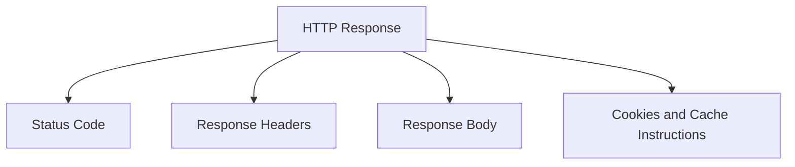

---

# 1. Status-Code Categories

The first digit identifies the general category.

| Range | Category | General meaning |
|---|---|---|
| `1xx` | Informational | The request is still being processed or additional information is provided |
| `2xx` | Success | The request was successfully received, understood, and processed |
| `3xx` | Redirection | The client should use another location or cached representation |
| `4xx` | Client/request problem | The request cannot be fulfilled as submitted |
| `5xx` | Server problem | The server or an upstream service failed while processing the request |

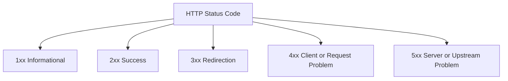

The category gives context, but the specific code is more useful.

For example:

```text
401 ≠ 403
404 ≠ 500
502 ≠ 503
```

---

# 2. How Clients Use Status Codes

Different clients may react differently to status codes.

## Browsers

Browsers may:

- Follow redirects
- Display error pages
- Use cached content after `304`
- Show certificate or security warnings
- Block responses because of browser policies

## Frontend JavaScript

Frontend code may:

- Show a login screen for `401`
- Display a permission error for `403`
- Show an empty state for `404`
- Retry a `503`
- Display validation messages for `422`

## API clients

Tools such as cURL, Postman, Bruno, and mobile applications may:

- Log the status
- Parse the body
- Retry certain failures
- Trigger different workflows

A well-designed API uses status codes consistently so clients can make predictable decisions.

---

# 3. The `1xx` Informational Category

`1xx` responses are interim responses.

They usually do not represent the final result of the request.

Common examples:

```text
100 Continue
101 Switching Protocols
102 Processing
103 Early Hints
```

Most application developers do not directly handle these every day, but they are useful to recognize in network traces.

---

# 4. `100 Continue`

## Meaning

`100 Continue` tells the client that it may continue sending the request body.

This can be useful when the request body is large.

A client may first send headers such as:

```http
POST /upload HTTP/1.1
Expect: 100-continue
Content-Length: 104857600
```

The server may respond:

```http
HTTP/1.1 100 Continue
```

The client then sends the large body.

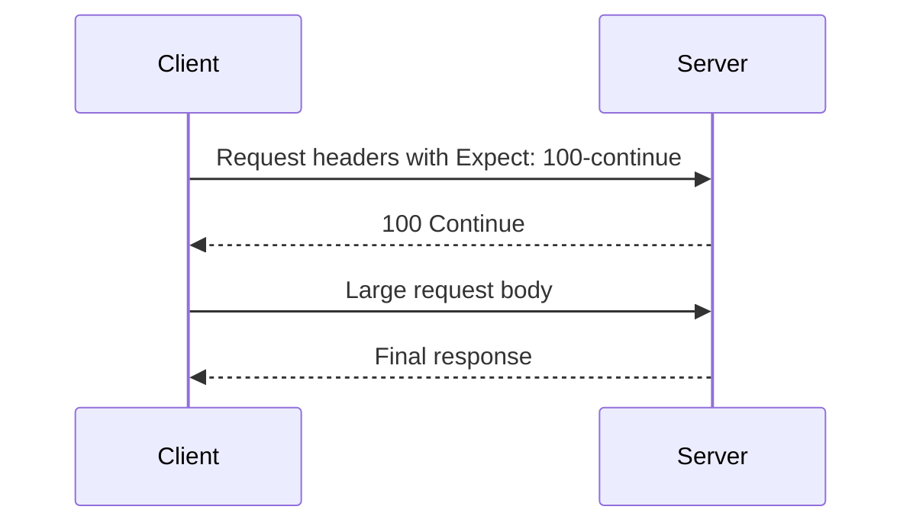

## Why it is useful

The client can avoid sending a very large body if the server already knows it will reject the request.

For example, the server may reject the request because:

- Authentication is missing
- The method is not allowed
- The file is too large
- The content type is unsupported

---

# 5. `101 Switching Protocols`

## Meaning

`101 Switching Protocols` indicates that the server agrees to switch protocols.

A common historical example is upgrading an HTTP connection to WebSocket.

```http
HTTP/1.1 101 Switching Protocols
Upgrade: websocket
Connection: Upgrade
```

After the upgrade, communication follows the new protocol.

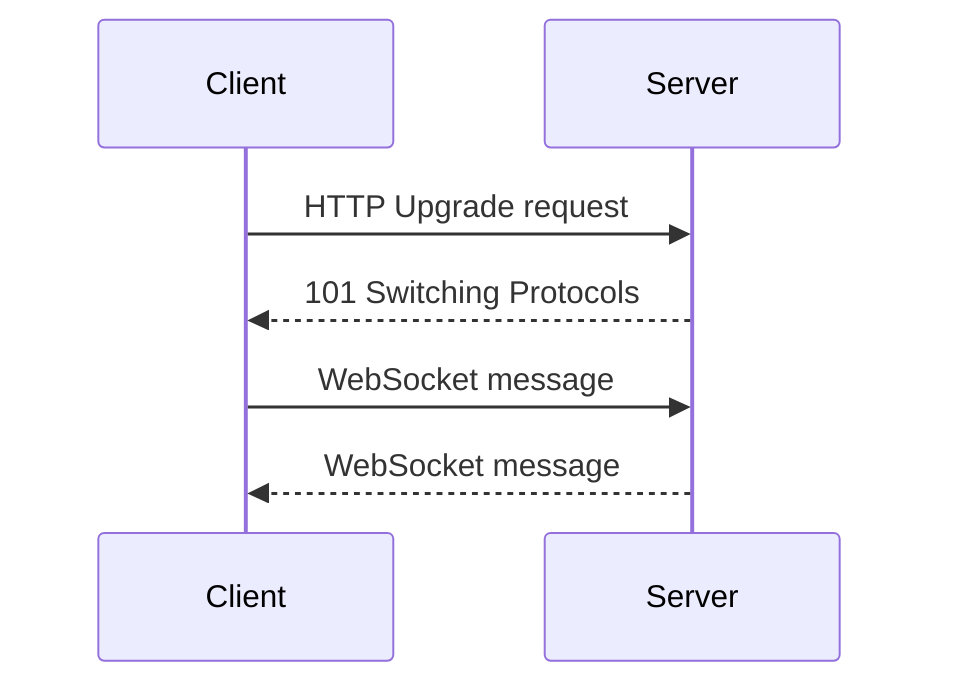

---

# 6. `102 Processing`

## Meaning

`102 Processing` indicates that the server has received the request but has not completed processing it.

It can be useful for operations that take a long time.

Most everyday web applications will not need to handle this directly.

---

# 7. `103 Early Hints`

## Meaning

`103 Early Hints` allows a server to send preliminary headers before the final response.

The server may tell the browser to begin loading important resources:

```http
HTTP/1.1 103 Early Hints
Link: </styles.css>; rel=preload; as=style
```

The server later sends the final response:

```http
HTTP/1.1 200 OK
Content-Type: text/html
```

This can help the browser begin downloading critical assets earlier.

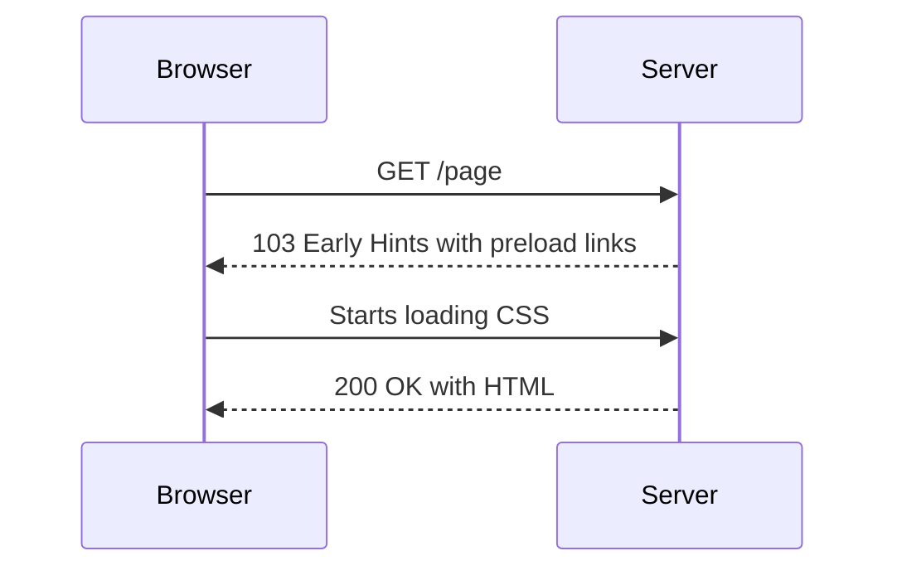

---

# 8. The `2xx` Success Category

A `2xx` response indicates that the server successfully received and processed the request.

Common success codes:

```text
200 OK
201 Created
202 Accepted
203 Non-Authoritative Information
204 No Content
205 Reset Content
206 Partial Content
```

The correct success code depends on what happened.

---

# 9. `200 OK`

## Meaning

The request succeeded.

`200` is the most commonly seen success status.

Examples:

```http
GET /products
GET /products/123
PATCH /users/42
POST /search
```

Possible response:

```http
HTTP/1.1 200 OK
Content-Type: application/json

{
  "id": 123,
  "name": "Keyboard"
}
```

## Common uses

- Returning an HTML page
- Returning JSON data
- Returning a successful update result
- Returning search results
- Returning a successful calculation

## Important caution

`200 OK` does not necessarily mean the business operation succeeded.

This response is technically successful:

```http
HTTP/1.1 200 OK
Content-Type: application/json

{
  "success": false,
  "message": "Payment declined"
}
```

The HTTP exchange succeeded, but the business operation did not.

---

# 10. `201 Created`

## Meaning

The request succeeded and created a new resource.

It is commonly used after:

```http
POST /products
POST /orders
POST /users
POST /comments
```

Example:

```http
POST /api/orders HTTP/1.1
Content-Type: application/json

{
  "productId": 123,
  "quantity": 2
}
```

Response:

```http
HTTP/1.1 201 Created
Location: /api/orders/9001
Content-Type: application/json

{
  "id": 9001,
  "status": "pending"
}
```

## The `Location` header

The `Location` header identifies the newly created resource:

```http
Location: /api/orders/9001
```

This is useful because the client does not need to guess the new URL.

---

# 11. `202 Accepted`

## Meaning

The server accepted the request for processing, but the operation has not completed yet.

This is useful for asynchronous work.

Example:

```http
POST /api/reports
```

Response:

```http
HTTP/1.1 202 Accepted
Content-Type: application/json

{
  "jobId": "job_123",
  "status": "queued"
}
```

The client may later check:

```http
GET /api/jobs/job_123
```

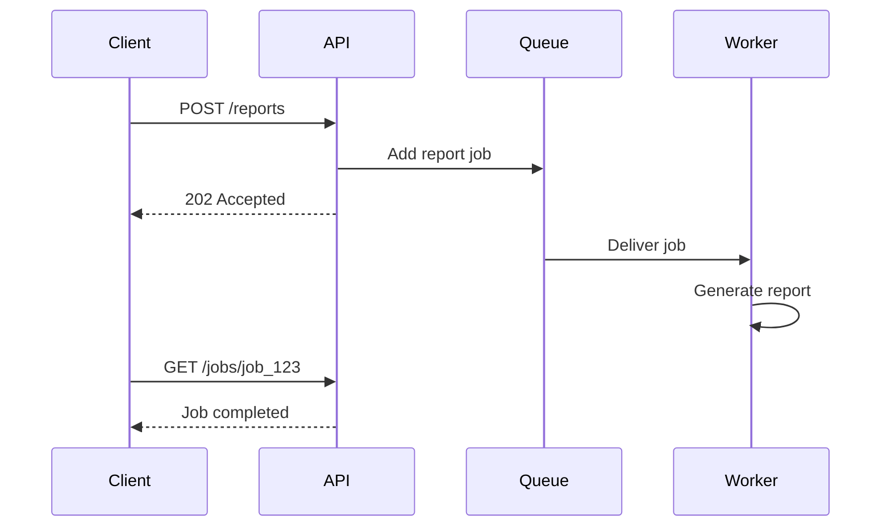

## Common uses

- Report generation
- Video processing
- Large file conversion
- Email campaigns
- Data imports
- Long-running external operations

---

# 12. `203 Non-Authoritative Information`

## Meaning

The request succeeded, but the returned metadata or representation may have been modified by an intermediary.

This status code is relatively uncommon in everyday application development.

---

# 13. `204 No Content`

## Meaning

The request succeeded, but there is no response body.

Common uses:

```http
DELETE /api/orders/9001
PATCH /api/preferences
PUT /api/settings
```

Example:

```http
HTTP/1.1 204 No Content
```

A `204` response should not contain a normal response body.

## Frontend consideration

Do not try to parse a `204` response as JSON:

```javascript
const data = await response.json();
```

This may fail because there is no body.

Instead:

```javascript
if (response.status !== 204) {
  const data = await response.json();
}
```

---

# 14. `205 Reset Content`

## Meaning

The server successfully processed the request and asks the client to reset the current view or input.

This may be appropriate after a form submission when the form should be cleared.

It is less commonly used than `200` or `204`.

---

# 15. `206 Partial Content`

## Meaning

The server is returning only part of a resource.

This is commonly used for:

- Resuming downloads
- Video streaming
- Audio streaming
- Large file transfers

The client may send:

```http
Range: bytes=0-999
```

The server responds:

```http
HTTP/1.1 206 Partial Content
Content-Range: bytes 0-999/10000
```

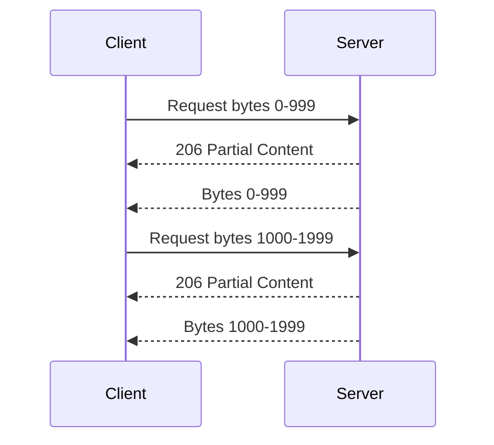

This allows interrupted downloads to resume rather than restarting from the beginning.

---

# 16. The `3xx` Redirection Category

`3xx` responses tell the client that:

- The requested resource is elsewhere
- A different request should be made
- A cached representation may still be valid
- Additional action is required

Common codes:

```text
301 Moved Permanently
302 Found
303 See Other
304 Not Modified
307 Temporary Redirect
308 Permanent Redirect
```

---

# 17. `301 Moved Permanently`

## Meaning

The resource has permanently moved to another URL.

Example:

```http
HTTP/1.1 301 Moved Permanently
Location: https://www.example.com/new-page
```

The browser may update bookmarks or search-engine records over time.

## Common uses

- Moving from an old URL to a new URL
- Redirecting one domain to another
- Canonicalizing URLs
- Redirecting HTTP to HTTPS

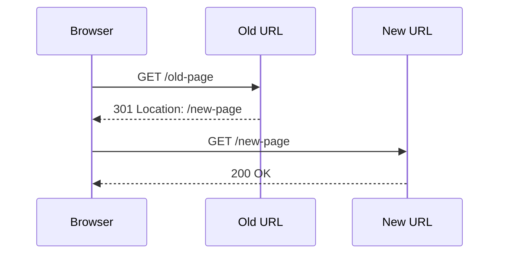

## Caution

Do not use permanent redirects casually.

Browsers and intermediaries may cache them, making later changes difficult to test.

---

# 18. `302 Found`

## Meaning

`302 Found` commonly indicates a temporary redirect.

Example:

```http
HTTP/1.1 302 Found
Location: /login
```

The browser follows the new location.

Historically, clients differed in how they preserved the original method when following a `302`. For clearer method-preserving behavior, `307` and `308` are preferred in appropriate situations.

---

# 19. `303 See Other`

## Meaning

`303 See Other` tells the client to retrieve another URL, generally using `GET`.

A common pattern is:

```http
POST /form
```

Response:

```http
HTTP/1.1 303 See Other
Location: /success
```

The browser then requests:

```http
GET /success
```

This is useful after form submissions because it prevents refreshing the page from resubmitting the original `POST`.

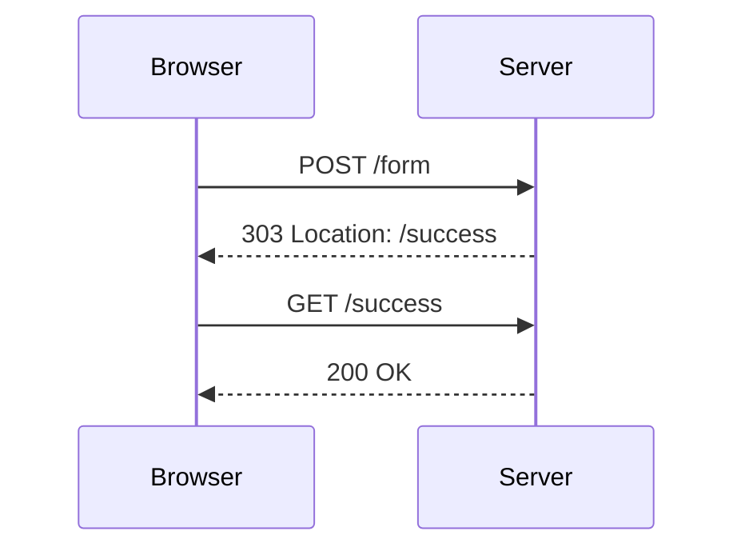

This pattern is often called **Post/Redirect/Get**.

---

# 20. Post/Redirect/Get

The Post/Redirect/Get pattern works as follows:

```text
1. Browser submits a POST.
2. Server processes the submission.
3. Server returns 303.
4. Browser performs a GET.
5. Browser displays the result page.
```

Benefits:

- Refreshing the result page does not repeat the POST.
- Users can bookmark the final GET URL.
- Browser history is cleaner.
- Duplicate form submissions are reduced.

---

# 21. `304 Not Modified`

## Meaning

The client may use its cached representation because the resource has not changed.

The client may send:

```http
GET /styles.css
If-None-Match: "styles-v5"
```

The server responds:

```http
HTTP/1.1 304 Not Modified
```

The server does not need to resend the full file.

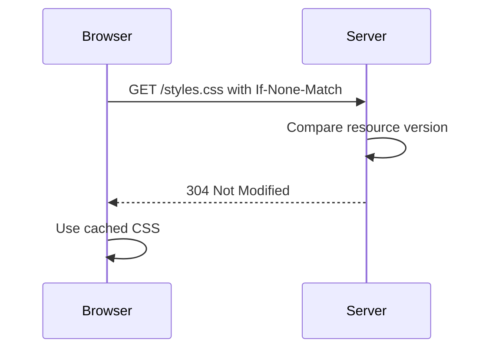

## Important distinction

`304` is not an application failure.

It is a normal caching response.

---

# 22. `307 Temporary Redirect`

## Meaning

`307` indicates a temporary redirect while preserving the original HTTP method.

Suppose the client sends:

```http
POST /submit
```

The server returns:

```http
HTTP/1.1 307 Temporary Redirect
Location: /temporary-submit
```

The client should repeat:

```http
POST /temporary-submit
```

This differs from older redirect behavior where some clients might turn the request into a `GET`.

---

# 23. `308 Permanent Redirect`

## Meaning

`308` is a permanent redirect that preserves the original HTTP method.

Example:

```http
POST /old-endpoint
```

Response:

```http
HTTP/1.1 308 Permanent Redirect
Location: /new-endpoint
```

The client should continue using:

```http
POST /new-endpoint
```

---

# 24. Redirect Chains

A request may pass through several redirects:

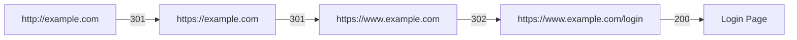

Redirect chains can slow down page loads.

They may also indicate configuration problems:

- HTTP-to-HTTPS loop
- `www` and non-`www` conflict
- Login redirect loop
- Incorrect reverse proxy settings
- Missing trailing slash logic
- Misconfigured authentication

---

# 25. The `4xx` Client and Request-Problem Category

A `4xx` response generally means the server cannot fulfill the request as submitted.

Possible reasons include:

- Malformed request
- Missing authentication
- Insufficient permission
- Invalid input
- Missing resource
- Unsupported method
- Request too large
- Rate limit exceeded

A `4xx` response does not necessarily mean the human user is at fault.

The problem may be:

- A frontend bug
- A stale client
- A malformed integration
- A wrong URL
- An expired session
- A permission mismatch

---

# 26. `400 Bad Request`

## Meaning

The server cannot process the request because it is malformed or invalid at a general request level.

Examples:

- Invalid JSON syntax
- Missing required protocol information
- Malformed query string
- Invalid request structure
- Invalid parameter format

Example:

```http
HTTP/1.1 400 Bad Request
Content-Type: application/json

{
  "error": {
    "code": "MALFORMED_REQUEST",
    "message": "The request body is not valid JSON."
  }
}
```

## Debugging questions

- Is the URL correct?
- Is the JSON valid?
- Is `Content-Type` correct?
- Are required fields present?
- Are query parameters correctly encoded?

---

# 27. `401 Unauthorized`

## Meaning

`401` usually means authentication is missing, invalid, or expired.

Despite the name, it generally means:

```text
The server cannot establish a valid identity for this request.
```

Examples:

- No session cookie
- Expired access token
- Invalid bearer token
- Missing API key
- Incorrect authentication scheme

Example:

```http
HTTP/1.1 401 Unauthorized
WWW-Authenticate: Bearer
Content-Type: application/json

{
  "error": {
    "code": "AUTHENTICATION_REQUIRED",
    "message": "Please sign in."
  }
}
```

## Typical frontend behavior

```text
401
  ↓
Refresh session or redirect to login
```

## Common mistake

Do not use `401` merely because the user lacks a permission. Use `403` when the server knows who the user is but refuses the operation.

---

# 28. `403 Forbidden`

## Meaning

The server understood the request and the caller may be authenticated, but access is not permitted.

Examples:

- Regular user attempts an admin operation
- User requests another user’s private data
- Organization membership is insufficient
- Subscription level does not allow access
- Account is suspended

Example:

```http
HTTP/1.1 403 Forbidden
Content-Type: application/json

{
  "error": {
    "code": "INSUFFICIENT_PERMISSION",
    "message": "You are not allowed to perform this operation."
  }
}
```

## Important distinction

```text
401 = Authentication problem
403 = Authorization problem
```

---

# 29. `404 Not Found`

## Meaning

The requested resource or route could not be found.

Examples:

- Typo in the URL
- Route does not exist
- Resource was deleted
- Incorrect environment
- Resource identifier is wrong
- Backend intentionally hides resource existence

Example:

```http
HTTP/1.1 404 Not Found
Content-Type: application/json

{
  "error": {
    "code": "PRODUCT_NOT_FOUND",
    "message": "The requested product could not be found."
  }
}
```

## Important distinction

A `404` generally means the server was reached successfully.

It is different from:

- DNS failure
- Connection timeout
- TLS failure
- Server not responding

---

# 30. `405 Method Not Allowed`

## Meaning

The route exists, but the requested HTTP method is not supported.

Example:

```http
DELETE /products
```

when the server supports only:

```text
GET /products
POST /products
```

Response:

```http
HTTP/1.1 405 Method Not Allowed
Allow: GET, POST, OPTIONS
```

The `Allow` header tells the client which methods are supported.

---

# 31. `406 Not Acceptable`

## Meaning

The server cannot provide a response in a format acceptable to the client.

The client may send:

```http
Accept: application/xml
```

while the server supports only:

```text
application/json
```

The server may return:

```http
HTTP/1.1 406 Not Acceptable
```

This status is less common in simple APIs.

---

# 32. `407 Proxy Authentication Required`

## Meaning

The client must authenticate with a proxy before the proxy will forward the request.

This is mostly relevant in networks that use authenticated forward proxies.

It is different from `401`, which concerns the target server.

---

# 33. `408 Request Timeout`

## Meaning

The server timed out while waiting for the request.

Possible causes:

- Client uploaded data too slowly
- Network connection stalled
- Server timeout configuration
- Proxy timeout
- Large request body

---

# 34. `409 Conflict`

## Meaning

The request conflicts with the current state of the resource.

Examples:

- Duplicate username
- Attempt to create a resource that already exists
- Inventory changed during checkout
- Concurrent update conflict
- Attempt to modify a locked resource

Example:

```http
HTTP/1.1 409 Conflict
Content-Type: application/json

{
  "error": {
    "code": "INVENTORY_CONFLICT",
    "message": "The requested quantity is no longer available."
  }
}
```

---

# 35. `410 Gone`

## Meaning

The resource previously existed but has been permanently removed.

Difference:

```text
404 = Not found or unknown
410 = Known to be permanently gone
```

Many applications use `404` for both situations, but `410` can communicate permanent removal more precisely.

---

# 36. `411 Length Required`

## Meaning

The server requires a `Content-Length` header for the request.

This is uncommon in typical browser interactions.

---

# 37. `412 Precondition Failed`

## Meaning

A condition supplied by the client was not satisfied.

Example:

```http
If-Match: "version-5"
```

The client is saying:

> Perform this update only if the resource is still version 5.

If the resource is now version 6, the server may return:

```http
HTTP/1.1 412 Precondition Failed
```

This helps prevent overwriting changes made by another client.

---

# 38. `413 Content Too Large`

## Meaning

The request body is larger than the server is willing to accept.

Common causes:

- File upload too large
- Request JSON too large
- Proxy size limit
- Server configuration limit

Example:

```http
HTTP/1.1 413 Content Too Large
```

Frontend behavior may include:

```text
The selected file exceeds the 10 MB limit.
```

---

# 39. `414 URI Too Long`

## Meaning

The URL is too long for the server or intermediary to process.

Possible causes:

- Excessive query parameters
- Very large encoded search strings
- Improperly placing a large payload in the URL
- Repeatedly appended parameters

Use a request body for larger data instead of creating enormous URLs.

---

# 40. `415 Unsupported Media Type`

## Meaning

The server does not support the format of the request body.

Example:

```http
POST /api/products
Content-Type: application/xml
```

when the endpoint accepts only:

```http
application/json
```

Response:

```http
HTTP/1.1 415 Unsupported Media Type
```

Debugging questions:

- Is `Content-Type` correct?
- Is the body actually in that format?
- Does the endpoint support file uploads?
- Is the server expecting form data instead of JSON?

---

# 41. `416 Range Not Satisfiable`

## Meaning

The requested byte range cannot be served.

Example:

```http
Range: bytes=999999-1000000
```

when the file is only 100 bytes long.

This is mainly relevant to partial downloads and streaming.

---

# 42. `417 Expectation Failed`

## Meaning

The server cannot satisfy an expectation included in the request.

This is uncommon in ordinary browser application development.

---

# 43. `418 I'm a Teapot`

## Meaning

`418` originated as an April Fools’ joke in a specification about a teapot refusing to brew coffee.

Some applications use it playfully, but it should not normally replace a meaningful application status code.

---

# 44. `421 Misdirected Request`

## Meaning

The request was sent to a server that cannot produce a response for the requested destination.

This can occur with:

- Incorrect TLS routing
- Connection reuse across hostnames
- Misconfigured HTTP/2 infrastructure
- Reverse proxy problems

---

# 45. `422 Unprocessable Content`

## Meaning

The server understands the request format, but the supplied values fail validation or business rules.

Example:

```http
POST /api/users
Content-Type: application/json

{
  "email": "not-an-email",
  "age": -4
}
```

Response:

```http
HTTP/1.1 422 Unprocessable Content
Content-Type: application/json

{
  "error": {
    "code": "VALIDATION_FAILED",
    "fields": {
      "email": "Enter a valid email address.",
      "age": "Age cannot be negative."
    }
  }
}
```

## Difference from `400`

A useful rule:

```text
400 = Request is malformed or cannot be understood
422 = Request is understood, but values are unacceptable
```

---

# 46. `423 Locked`

## Meaning

The resource is locked and cannot be modified.

This may be relevant to:

- Document editing
- File locking
- Workflow systems
- Resource reservations

---

# 47. `424 Failed Dependency`

## Meaning

The request failed because another dependent operation failed.

This may appear in complex workflows or WebDAV-style systems.

---

# 48. `425 Too Early`

## Meaning

The server is unwilling to process the request because it may be replayed.

This is related to early data and replay risk in some TLS scenarios.

It is uncommon in ordinary application development.

---

# 49. `426 Upgrade Required`

## Meaning

The server requires the client to use a different protocol.

Example:

```http
HTTP/1.1 426 Upgrade Required
Upgrade: TLS/1.3
```

---

# 50. `428 Precondition Required`

## Meaning

The server requires the request to include a condition before processing it.

This can help prevent lost updates.

For example, the server may require:

```http
If-Match: "version-7"
```

before accepting an update.

---

# 51. `429 Too Many Requests`

## Meaning

The client has exceeded a rate limit.

Example:

```http
HTTP/1.1 429 Too Many Requests
Retry-After: 60
```

Response body:

```json
{
  "error": {
    "code": "RATE_LIMITED",
    "message": "Too many requests. Try again in 60 seconds."
  }
}
```

## Common causes

- Too many API calls
- Brute-force login attempts
- Scraping
- Accidental frontend loops
- Excessive polling
- Shared IP address limits

## Client behavior

A client should generally:

- Respect `Retry-After`
- Use backoff
- Avoid immediate repeated retries
- Reduce request frequency
- Avoid creating duplicate work

---

# 52. `431 Request Header Fields Too Large`

## Meaning

The request headers are too large.

Possible causes:

- Extremely large cookies
- Too many cookies
- Large authorization data
- Proxy limitations
- Repeatedly accumulated headers

---

# 53. `451 Unavailable For Legal Reasons`

## Meaning

The resource is unavailable because of legal restrictions.

This status may be used for:

- Court orders
- Geographic restrictions
- Copyright enforcement
- Regulatory requirements

---

# 54. The `5xx` Server-Problem Category

A `5xx` response indicates that the server or an upstream dependency failed while attempting to process the request.

Common codes:

```text
500 Internal Server Error
501 Not Implemented
502 Bad Gateway
503 Service Unavailable
504 Gateway Timeout
505 HTTP Version Not Supported
507 Insufficient Storage
508 Loop Detected
```

A `5xx` response usually indicates that the client may retry later, but not always.

The correct retry behavior depends on:

- The specific status
- The HTTP method
- Idempotency
- The cause of failure
- Server guidance

---

# 55. `500 Internal Server Error`

## Meaning

The server encountered an unexpected condition that prevented it from completing the request.

Possible causes:

- Unhandled exception
- Programming error
- Database failure
- Invalid configuration
- Unexpected data
- External service failure
- Resource exhaustion

Example:

```http
HTTP/1.1 500 Internal Server Error
Content-Type: application/json

{
  "error": {
    "code": "INTERNAL_ERROR",
    "message": "The request could not be completed.",
    "requestId": "req_abc123"
  }
}
```

## What not to expose

Do not return internal details such as:

```text
SQL connection failed at db-prod-04.internal
```

Use server logs for detailed diagnostics and return a safe message to the client.

---

# 56. `501 Not Implemented`

## Meaning

The server does not support the requested functionality.

It may indicate:

- An unsupported method
- An unimplemented feature
- A server that does not recognize the requested capability

Do not confuse it with `405`.

```text
405 = This route exists, but not with that method.
501 = The server does not support the requested functionality.
```

---

# 57. `502 Bad Gateway`

## Meaning

A gateway or proxy received an invalid response from an upstream server.

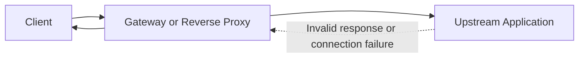

Possible causes:

- Application server crashed
- Upstream connection refused
- Invalid upstream headers
- Protocol mismatch
- Proxy configuration error
- Service deployment problem

Example:

```http
HTTP/1.1 502 Bad Gateway
```

A `502` often means the visible server is functioning enough to respond, but another server behind it failed.

---

# 58. `503 Service Unavailable`

## Meaning

The service is temporarily unable to handle the request.

Possible causes:

- Maintenance
- Overload
- No healthy application servers
- Dependency outage
- Deployment transition
- Circuit breaker open
- Capacity shortage

Example:

```http
HTTP/1.1 503 Service Unavailable
Retry-After: 120
```

## Typical client behavior

A client may retry after waiting, especially for safe or idempotent requests.

A `POST` should not be retried blindly unless duplicate execution is safe or an idempotency key is used.

---

# 59. `504 Gateway Timeout`

## Meaning

A gateway or proxy did not receive a timely response from an upstream server.

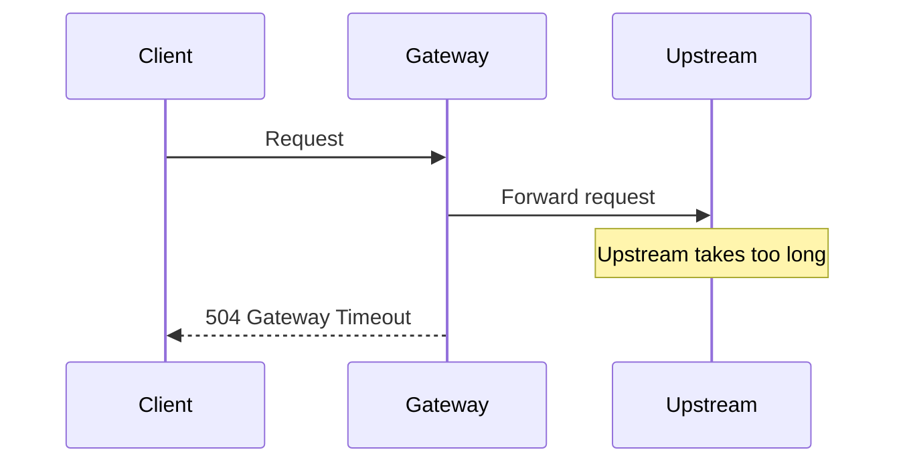

Possible causes:

- Slow database query
- External API timeout
- Application deadlock
- Network issue
- Overloaded upstream server
- Incorrect timeout settings

---

# 60. `505 HTTP Version Not Supported`

## Meaning

The server does not support the HTTP version used by the client.

This is uncommon for ordinary browser traffic because clients and servers usually negotiate compatible versions.

---

# 61. `506 Variant Also Negotiates`

## Meaning

The server configuration contains an internal negotiation problem.

This is uncommon in typical APIs.

---

# 62. `507 Insufficient Storage`

## Meaning

The server cannot complete the request because it lacks enough storage.

Possible causes:

- Disk full
- Storage quota exceeded
- Object storage limit
- Database storage exhaustion

---

# 63. `508 Loop Detected`

## Meaning

The server detected an infinite loop while processing the request.

This may occur in systems involving:

- Recursive resource relationships
- WebDAV
- Internal routing loops
- Graph-like dependency traversal

---

# 64. `510 Not Extended`

## Meaning

The request requires extensions that the server does not support.

This is uncommon in ordinary web APIs.

---

# 65. `511 Network Authentication Required`

## Meaning

The client must authenticate with the network before accessing the destination.

This may occur with:

- Captive portals
- Public Wi-Fi
- Enterprise network gateways
- Managed access networks

For example, a user connects to airport Wi-Fi and must accept terms before the Internet becomes available.

---

# 66. Choosing Between Common Error Codes

Use this simplified decision guide:

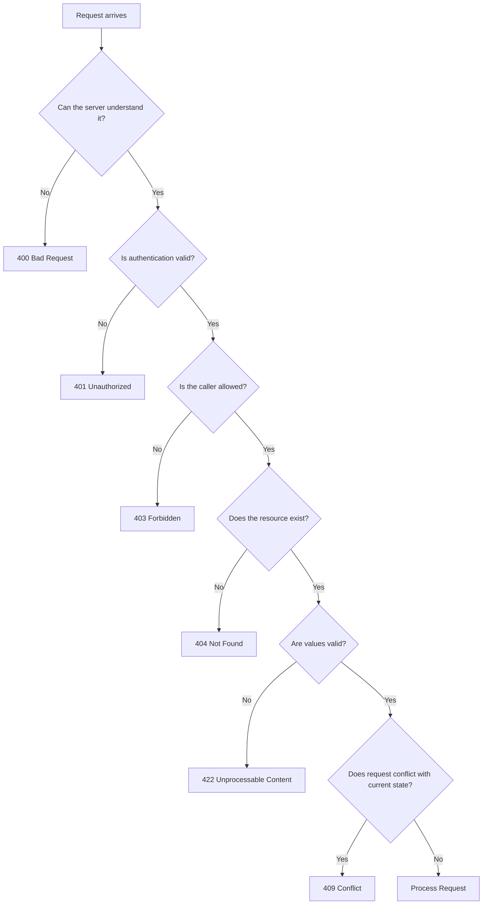

This is a guideline, not an absolute law. API contracts should define behavior consistently.

---

# 67. Status Codes and Request Methods

The same status code can appear for different methods.

Examples:

```http
GET /products
→ 200 OK
```

```http
POST /products
→ 201 Created
```

```http
PATCH /products/123
→ 200 OK or 204 No Content
```

```http
DELETE /products/123
→ 204 No Content
```

A method and status code must be interpreted together.

---

# 68. Status Codes and Retries

A client should not automatically retry every failure.

## Often reasonable to retry

- `408`
- `429`, after waiting
- `502`
- `503`
- `504`

But only if:

- The operation is safe or idempotent
- The server did not already complete the operation
- Retry limits are enforced
- Backoff is used

## Dangerous to retry blindly

```http
POST /payments
POST /orders
POST /messages
```

The first request may have succeeded even if the response was lost.

Use an idempotency key where appropriate:

```http
Idempotency-Key: order-attempt-123
```

---

# 69. Status Codes and Error Bodies

A status code should be paired with a useful but safe response body.

Poor error:

```json
{
  "error": "Something went wrong"
}
```

Better error:

```json
{
  "error": {
    "code": "VALIDATION_FAILED",
    "message": "One or more fields are invalid.",
    "fields": {
      "email": "Enter a valid email address."
    },
    "requestId": "req_abc123"
  }
}
```

For security, do not expose:

- Stack traces
- Database passwords
- Internal hostnames
- SQL statements
- Private tokens
- File system paths
- Sensitive user records

---

# 70. Status Codes and Frontend State

A frontend can map statuses to user-facing states.

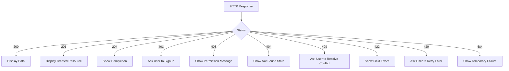

This produces better user experiences than showing the same generic message for every failure.

---

# 71. Status Codes and Monitoring

Monitoring systems use status codes to detect problems.

Useful metrics include:

```text
Total requests
2xx rate
4xx rate
5xx rate
Latency by endpoint
429 rate
503 rate
```

A rise in `404` responses may indicate:

- Broken frontend links
- Incorrect deployment
- Missing assets
- API version mismatch

A rise in `401` responses may indicate:

- Authentication outage
- Expired tokens
- Cookie configuration problem
- Identity-provider failure

A rise in `500` responses may indicate:

- Bad deployment
- Database issue
- Application bug
- Dependency failure

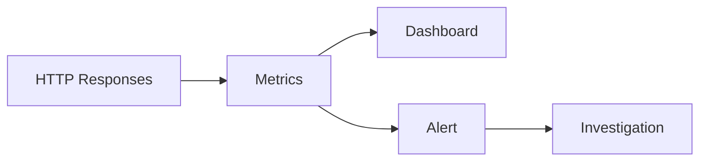

---

# 72. Common Status-Code Mistakes

## Mistake 1: Returning `200` for errors

This makes clients and monitoring systems believe the request succeeded.

## Mistake 2: Using `401` for every access problem

Use `403` when identity is known but permission is denied.

## Mistake 3: Using `404` for server crashes

A backend failure should generally be represented by a `5xx` response, not `404`.

## Mistake 4: Returning `204` with a body

A `204` response should not contain a normal response body.

## Mistake 5: Retrying every `5xx`

Retries can worsen outages and duplicate operations.

## Mistake 6: Returning raw internal errors

Detailed internal error information belongs in protected logs.

## Mistake 7: Ignoring `Retry-After`

Clients should respect server instructions when rate-limited or temporarily unavailable.

---

# 73. Quick Diagnostic Table

| Observation | Likely interpretation |
|---|---|
| No response at all | DNS, network, TLS, timeout, or browser policy problem |
| `200` with unexpected HTML | Wrong route, redirect, proxy fallback, or server error page |
| `201` | Resource created |
| `204` | Success with no body |
| `301` or `308` | Permanent redirect |
| `302` or `307` | Temporary redirect |
| `304` | Cached copy remains valid |
| `400` | Malformed request |
| `401` | Authentication missing or invalid |
| `403` | Permission denied |
| `404` | Route or resource not found |
| `405` | Method unsupported |
| `409` | Current-state conflict |
| `413` | Request too large |
| `415` | Wrong body format |
| `422` | Validation failure |
| `429` | Rate limit exceeded |
| `500` | Application/server failure |
| `502` | Gateway received bad upstream response |
| `503` | Service temporarily unavailable |
| `504` | Upstream timed out |

---

# 74. Practical cURL Examples

## Inspect headers

```bash
curl -I https://example.com
```

## Follow redirects

```bash
curl -L http://example.com
```

## Show verbose connection information

```bash
curl -v https://example.com
```

## Send JSON

```bash
curl \
  -X POST \
  -H "Content-Type: application/json" \
  -d '{"name":"Alex"}' \
  https://api.example.com/users
```

## Send a bearer token

```bash
curl \
  -H "Authorization: Bearer REDACTED" \
  https://api.example.com/account
```

## Display only the status code

```bash
curl -s -o /dev/null -w "%{http_code}\n" \
  https://example.com
```

## Show headers and body

```bash
curl -i https://example.com
```

---

# 75. Practical Browser DevTools Workflow

When an API request fails:

```text
1. Open Developer Tools.
2. Select Network.
3. Enable Preserve log if navigation is involved.
4. Filter to Fetch/XHR.
5. Reproduce the action once.
6. Select the relevant request.
7. Inspect Request URL.
8. Inspect Request Method.
9. Inspect Query String Parameters.
10. Inspect Request Headers.
11. Inspect Request Payload.
12. Inspect Status Code.
13. Inspect Response Headers.
14. Inspect Response Body.
15. Inspect Timing.
16. Check the Console for related errors.
```

---

# 76. Final Status-Code Mental Model

An HTTP status code answers:

```text
What happened to the request?
```

It does not necessarily answer:

```text
Why did it happen?
```

For that, inspect:

- Request details
- Response body
- Headers
- Server logs
- Database logs
- External service logs
- Timing data
- Trace identifiers

The complete diagnostic model is:

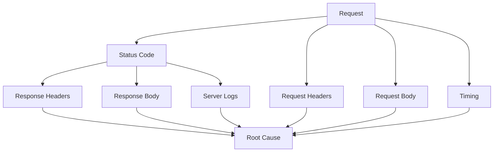

The most important practical rule is:

> Treat a status code as a starting point for investigation, not as the complete explanation.
