# Appendix C — HTTP Headers Reference  
## Request Metadata, Response Metadata, Caching, Authentication, Security, and Content Negotiation

HTTP headers are metadata attached to requests and responses.

They provide information about:

- What the client wants
- What the client is sending
- How the server should interpret the request
- What the server returned
- Whether authentication is present
- How a response should be cached
- Whether a browser may access a cross-origin response
- How content is compressed
- How cookies should behave
- Which security policies apply

A basic request may look like this:

```http
GET /api/products HTTP/1.1
Host: api.example.com
Accept: application/json
Authorization: Bearer REDACTED
User-Agent: ExampleBrowser/1.0
```

A response may look like this:

```http
HTTP/1.1 200 OK
Content-Type: application/json
Cache-Control: max-age=60
ETag: "products-v5"
Strict-Transport-Security: max-age=31536000

{
  "items": []
}
```

The request and response both contain headers, but their purposes are different.

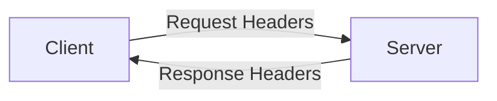

---

# 1. Header Structure

A header generally has this form:

```text
Header-Name: Header-Value
```

Example:

```http
Content-Type: application/json
```

The name identifies the metadata field:

```text
Content-Type
```

The value provides the information:

```text
application/json
```

A message contains:

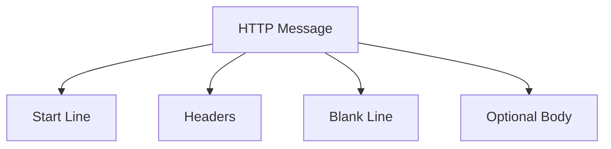

Example request:

```http
POST /api/users HTTP/1.1
Host: api.example.com
Content-Type: application/json
Accept: application/json

{
  "name": "Alex"
}
```

---

# 2. Request Headers vs Response Headers

## Request headers

Request headers describe the client’s request.

They may communicate:

- Desired response formats
- Authentication
- Request body format
- Browser origin
- Cookies
- Language preference
- Cache conditions

## Response headers

Response headers describe the server’s response.

They may communicate:

- Response body format
- Caching instructions
- Cookies to store
- Redirect locations
- Security policies
- Compression
- CORS permissions

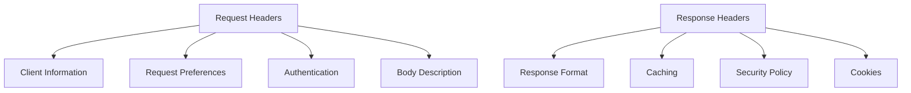

---

# 3. Header Categories

Headers can be grouped by purpose.

| Category | Examples |
|---|---|
| Request targeting | `Host` |
| Content description | `Content-Type`, `Content-Length` |
| Content preferences | `Accept`, `Accept-Language` |
| Authentication | `Authorization`, `Cookie` |
| Caching | `Cache-Control`, `ETag`, `If-None-Match` |
| Redirects | `Location` |
| Browser security | `Origin`, `Referer` |
| CORS | `Access-Control-Allow-Origin` |
| Compression | `Accept-Encoding`, `Content-Encoding` |
| Cookies | `Set-Cookie`, `Cookie` |
| Security policies | `Strict-Transport-Security`, `Content-Security-Policy` |
| Diagnostics | `Traceparent`, request IDs |
| Rate limiting | `Retry-After`, rate-limit headers |

---

# 4. `Host`

## Purpose

`Host` identifies the hostname requested by the client.

```http
Host: example.com
```

A single server or IP address may serve many domains.

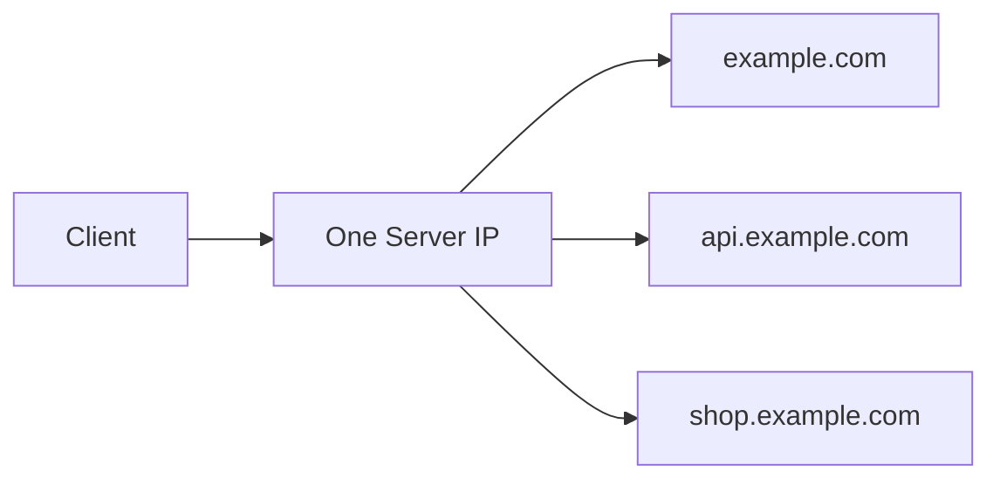

The `Host` header helps the server determine which site or application should handle the request.

## Example

```http
GET /products HTTP/1.1
Host: shop.example.com
```

The same server could also receive:

```http
GET /users HTTP/1.1
Host: api.example.com
```

and route it to a different application.

---

# 5. `Accept`

## Purpose

`Accept` tells the server which response formats the client can process.

```http
Accept: application/json
```

A browser page request might use:

```http
Accept: text/html,application/xhtml+xml
```

An API client might use:

```http
Accept: application/json
```

The server describes the chosen format using:

```http
Content-Type: application/json
```

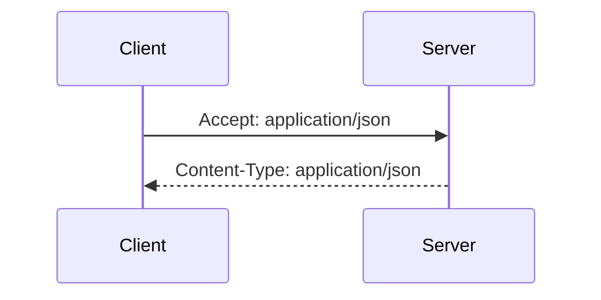

## Multiple formats

```http
Accept: application/json, text/plain, */*
```

This means the client prefers JSON or plain text but may accept other formats.

## Quality values

Clients may indicate preferences:

```http
Accept: text/html, application/json;q=0.8, */*;q=0.5
```

The higher the quality value, the stronger the preference.

---

# 6. `Accept-Language`

## Purpose

`Accept-Language` communicates preferred human languages.

```http
Accept-Language: en-US,en;q=0.9
```

This means:

```text
Prefer US English.
English generally is also acceptable.
```

A server may respond with:

```http
Content-Language: en-US
```

Language selection may affect:

- Text
- Date formatting
- Currency formatting
- Sorting
- Content availability

Do not assume this header alone proves the user’s actual location or identity.

---

# 7. `Accept-Encoding`

## Purpose

`Accept-Encoding` tells the server which compression formats the client supports.

```http
Accept-Encoding: gzip, deflate, br
```

The server may respond:

```http
Content-Encoding: br
```

This means the body is compressed using Brotli.

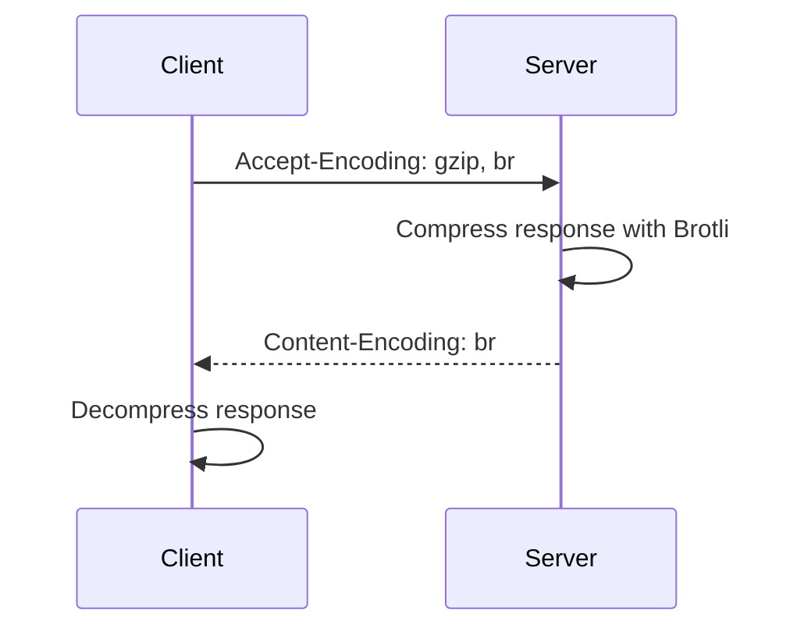

Compression is useful for:

- HTML
- CSS
- JavaScript
- JSON
- XML
- Plain text

---

# 8. `Authorization`

## Purpose

`Authorization` carries credentials or an access token.

Common form:

```http
Authorization: Bearer access-token-value
```

A server may use the token to:

1. Validate the credential.
2. Identify the caller.
3. Check expiration.
4. Check scopes or roles.
5. Authorize the requested operation.

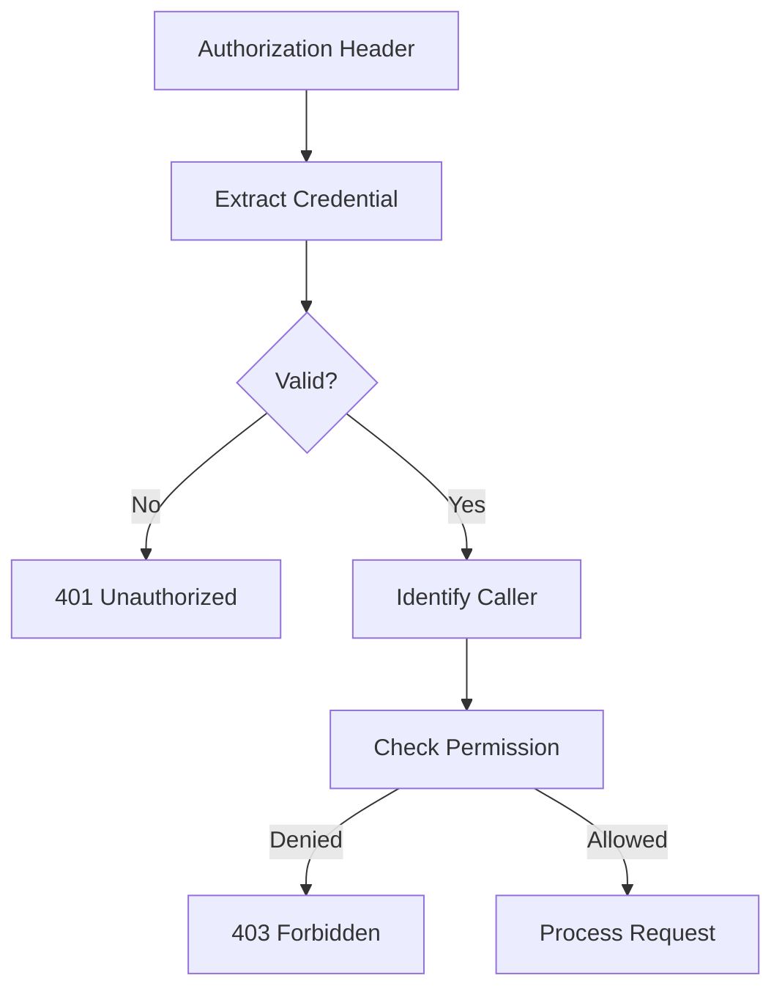

## Security warning

Never expose real authorization tokens in:

- Screenshots
- Public bug reports
- Source control
- Shared logs
- Chat messages
- Screen recordings

---

# 9. `Basic` Authentication

Basic authentication commonly appears as:

```http
Authorization: Basic base64-value
```

The encoded value usually represents:

```text
username:password
```

Base64 is encoding, not encryption.

Therefore Basic authentication should be used only over HTTPS.

```text
Base64 ≠ Encryption
```

---

# 10. `Bearer` Authentication

Bearer authentication means:

> Whoever possesses this token may be treated as the authorized caller.

Example:

```http
Authorization: Bearer eyJhbGciOi...
```

Bearer tokens must be protected because possession may grant access.

Possible protections include:

- HTTPS
- Short expiration times
- Secure storage
- Token rotation
- Scope restrictions
- Revocation mechanisms
- Avoiding token logging

---

# 11. `Content-Type`

## Purpose

`Content-Type` tells the receiver how to interpret the message body.

Request example:

```http
Content-Type: application/json
```

Body:

```json
{
  "name": "Alex"
}
```

The server should parse the body as JSON.

Common values:

```text
application/json
text/html
text/plain
application/xml
application/x-www-form-urlencoded
multipart/form-data
image/png
application/pdf
application/octet-stream
```

---

# 12. `Content-Type` on Requests

A request body without the correct content type may be misinterpreted.

Example:

```http
POST /api/users HTTP/1.1
Content-Type: application/json

{
  "name": "Alex"
}
```

If the header is missing, the server may treat the body as:

- Plain text
- Form data
- Unknown binary data
- Invalid input

A common debugging issue:

```text
Frontend sends JSON.
Backend expects JSON.
Content-Type is missing.
Backend reports an empty or malformed body.
```

---

# 13. `Content-Type` on Responses

The server uses `Content-Type` to describe its response.

JSON:

```http
Content-Type: application/json
```

HTML:

```http
Content-Type: text/html
```

CSS:

```http
Content-Type: text/css
```

PNG image:

```http
Content-Type: image/png
```

The browser uses this information to determine how to interpret the response.

---

# 14. `Content-Length`

## Purpose

`Content-Length` indicates the size of the message body in bytes.

```http
Content-Length: 128
```

For a request:

```http
POST /upload HTTP/1.1
Content-Length: 2048
```

For a response:

```http
HTTP/1.1 200 OK
Content-Length: 4096
```

The exact wire-level behavior varies by HTTP version and transfer method, but the basic purpose is to communicate body size.

---

# 15. `Transfer-Encoding`

`Transfer-Encoding` describes how a message body is transferred.

A common HTTP/1.1 value is:

```http
Transfer-Encoding: chunked
```

Chunked transfer allows the server to send the response in pieces without knowing the final size ahead of time.

This can be useful for:

- Streaming
- Dynamic content
- Large generated responses

Modern HTTP/2 and HTTP/3 use different framing mechanisms, so `Transfer-Encoding: chunked` is mainly associated with HTTP/1.1.

---

# 16. `Content-Encoding`

## Purpose

`Content-Encoding` identifies compression or another transformation applied to the body.

```http
Content-Encoding: gzip
```

The body is compressed, and the client decompresses it.

Do not confuse:

```text
Content-Encoding = compression applied to the body
Content-Type     = format of the underlying content
```

Example:

```http
Content-Type: application/json
Content-Encoding: br
```

This means:

```text
The underlying content is JSON.
The transmitted body is Brotli-compressed.
```

---

# 17. `Content-Disposition`

## Purpose

`Content-Disposition` tells the browser how to handle returned content.

Example for download:

```http
Content-Disposition: attachment; filename="report.pdf"
```

The browser may download the file instead of displaying it inline.

Example for inline display:

```http
Content-Disposition: inline
```

This header is also important in multipart file uploads:

```http
Content-Disposition: form-data; name="file"; filename="photo.jpg"
```

---

# 18. `Content-Range`

## Purpose

`Content-Range` describes which portion of a resource is being returned.

Example:

```http
Content-Range: bytes 0-999/10000
```

This means:

```text
Returned bytes: 0 through 999
Total size: 10,000 bytes
```

It is commonly used with:

```http
206 Partial Content
```

---

# 19. `Range`

## Purpose

`Range` lets a client request only part of a resource.

```http
Range: bytes=1000-1999
```

The server may respond:

```http
HTTP/1.1 206 Partial Content
Content-Range: bytes 1000-1999/10000
```

Uses include:

- Resuming downloads
- Video streaming
- Audio streaming
- Large file retrieval

---

# 20. `Cookie`

## Purpose

The `Cookie` request header sends cookies previously stored by the browser.

```http
Cookie: session_id=abc123; theme=dark
```

Cookies may contain:

- Session identifiers
- Preferences
- Shopping cart identifiers
- Analytics identifiers
- Security values

The browser usually sends cookies automatically when domain, path, security, and SameSite rules permit.

---

# 21. `Set-Cookie`

## Purpose

`Set-Cookie` instructs the browser to store or update a cookie.

```http
Set-Cookie: session_id=abc123
```

A more secure example:

```http
Set-Cookie: session_id=abc123; Secure; HttpOnly; SameSite=Lax; Path=/
```

Important attributes include:

```text
Secure
HttpOnly
SameSite
Path
Domain
Max-Age
Expires
```

---

# 22. `Secure` Cookie Attribute

```http
Set-Cookie: session_id=abc123; Secure
```

The browser should send the cookie only over HTTPS.

This helps prevent accidental transmission over unencrypted HTTP.

---

# 23. `HttpOnly` Cookie Attribute

```http
Set-Cookie: session_id=abc123; HttpOnly
```

JavaScript cannot normally read an `HttpOnly` cookie through `document.cookie`.

This helps reduce some risks if malicious script executes in the page.

Important:

```text
HttpOnly does not make a cookie universally safe.
```

The browser can still send it automatically to matching requests.

---

# 24. `SameSite` Cookie Attribute

`SameSite` controls how cookies behave across site boundaries.

Common values:

```text
Strict
Lax
None
```

Example:

```http
Set-Cookie: session_id=abc123; SameSite=Lax
```

## `Strict`

More restrictive cross-site behavior.

## `Lax`

Allows some cross-site navigation while limiting other uses.

## `None`

Allows cross-site use, but generally requires:

```text
Secure
```

Cookie behavior is important for:

- Authentication
- Embedded applications
- Payment flows
- Cross-origin frontend and backend systems
- CSRF protection

---

# 25. `Path` and `Domain` Cookie Attributes

Example:

```http
Set-Cookie: theme=dark; Path=/settings
```

The browser sends the cookie primarily for matching paths.

Example:

```http
Set-Cookie: session_id=abc123; Domain=example.com
```

This may make the cookie available to matching subdomains, depending on browser rules.

Cookie domain configuration should be kept as narrow as practical.

---

# 26. `Max-Age` and `Expires`

A cookie can be temporary or persistent.

```http
Set-Cookie: session_id=abc123; Max-Age=3600
```

This cookie lasts approximately 3,600 seconds.

Alternatively:

```http
Set-Cookie: session_id=abc123; Expires=Wed, 22 Jul 2026 13:00:00 GMT
```

A cookie without a persistent expiration may be treated as a session cookie.

---

# 27. `Cache-Control`

## Purpose

`Cache-Control` defines caching behavior.

Examples:

```http
Cache-Control: no-store
Cache-Control: no-cache
Cache-Control: private
Cache-Control: public, max-age=3600
Cache-Control: max-age=31536000, immutable
```

These directives do not all mean the same thing.

---

# 28. `no-store`

```http
Cache-Control: no-store
```

This tells caches not to store the response.

Useful for:

- Payment responses
- Sensitive account information
- Authentication responses
- Private reports
- Highly confidential data

---

# 29. `no-cache`

```http
Cache-Control: no-cache
```

This does not necessarily mean “do not store.”

It generally means:

> The cache must revalidate the response before reusing it.

The client may store the response but should check whether it is still valid.

---

# 30. `private`

```http
Cache-Control: private
```

This indicates that the response is intended for a single user and should not be stored in a shared cache.

Useful for:

- Personalized dashboards
- Account details
- User-specific recommendations
- Private messages

---

# 31. `public`

```http
Cache-Control: public
```

This indicates that the response may be stored by shared caches, assuming other rules permit it.

Use carefully. A response containing private user data should not be marked public.

---

# 32. `max-age`

```http
Cache-Control: max-age=3600
```

This tells a cache that the response may be considered fresh for 3,600 seconds.

A static asset might use:

```http
Cache-Control: public, max-age=31536000, immutable
```

if its URL changes whenever its contents change.

---

# 33. `immutable`

```http
Cache-Control: immutable
```

This tells clients that a cached response should not be revalidated during its freshness period.

This works best for versioned assets:

```text
/app.abc123.js
/styles.def456.css
```

If the content changes, the filename changes too.

---

# 34. `ETag`

## Purpose

`ETag` identifies a particular version of a response.

```http
ETag: "products-v5"
```

The client may later send:

```http
If-None-Match: "products-v5"
```

If the resource has not changed, the server responds:

```http
304 Not Modified
```

If it has changed, the server returns the new body and a new ETag.

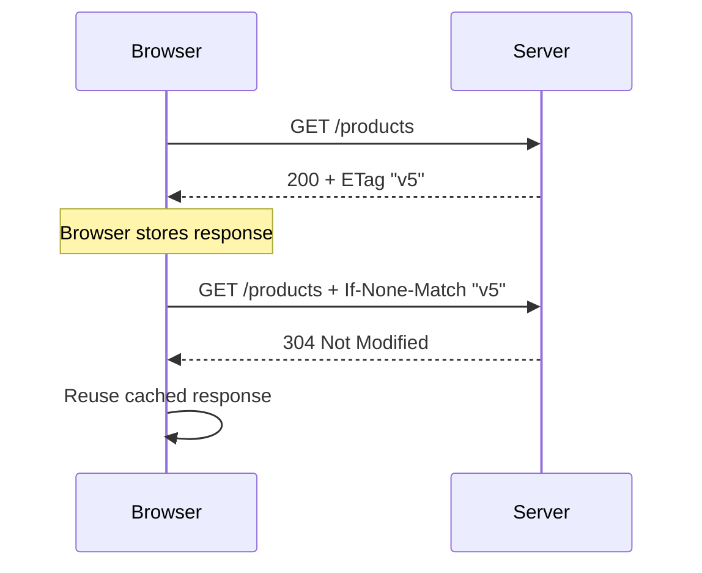

---

# 35. `If-None-Match`

## Purpose

`If-None-Match` asks the server whether a cached representation is still current.

```http
If-None-Match: "products-v5"
```

Typical results:

```text
304 Not Modified
```

or:

```text
200 OK with new representation
```

---

# 36. `Last-Modified`

## Purpose

`Last-Modified` tells the client when a resource was last changed.

```http
Last-Modified: Wed, 22 Jul 2026 12:00:00 GMT
```

The client may later send:

```http
If-Modified-Since: Wed, 22 Jul 2026 12:00:00 GMT
```

---

# 37. `If-Modified-Since`

This header asks the server:

> Has the resource changed since this time?

```http
If-Modified-Since: Wed, 22 Jul 2026 12:00:00 GMT
```

If not, the server may return:

```http
304 Not Modified
```

---

# 38. `If-Match`

## Purpose

`If-Match` performs an update only if the resource matches a known version.

```http
If-Match: "profile-v7"
```

This supports optimistic concurrency.

If another client changed the resource first, the server may return:

```http
412 Precondition Failed
```

This prevents silently overwriting someone else’s update.

---

# 39. `If-Unmodified-Since`

This header tells the server to perform an operation only if a resource has not changed since a specified time.

```http
If-Unmodified-Since: Wed, 22 Jul 2026 12:00:00 GMT
```

It is another form of conditional update control.

---

# 40. `Location`

## Purpose

`Location` identifies another URL.

It is commonly used with:

- Redirects
- Newly created resources
- Asynchronous jobs

Redirect example:

```http
HTTP/1.1 302 Found
Location: /login
```

Creation example:

```http
HTTP/1.1 201 Created
Location: /api/orders/9001
```

---

# 41. `Retry-After`

## Purpose

`Retry-After` tells the client when it may try again.

It may contain seconds:

```http
Retry-After: 60
```

or a date:

```http
Retry-After: Wed, 22 Jul 2026 13:00:00 GMT
```

Common with:

```text
429 Too Many Requests
503 Service Unavailable
```

Clients should avoid retrying immediately when this header is present.

---

# 42. `Allow`

## Purpose

`Allow` lists methods supported by a resource.

```http
Allow: GET, POST, OPTIONS
```

This is commonly returned with:

```http
405 Method Not Allowed
```

---

# 43. `Origin`

## Purpose

`Origin` identifies the origin that initiated a browser request.

```http
Origin: https://app.example.com
```

An origin includes:

```text
Scheme + Host + Port
```

This header is important for CORS.

---

# 44. `Referer`

## Purpose

`Referer` may identify the page from which a request originated.

```http
Referer: https://example.com/products
```

The spelling is historically standardized as `Referer`.

Referrer information may be reduced or omitted according to browser policy.

It can contain sensitive information if URLs include private query parameters, so applications should avoid placing secrets in URLs.

---

# 45. `Referrer-Policy`

## Purpose

`Referrer-Policy` controls how much referrer information the browser sends.

Example:

```http
Referrer-Policy: strict-origin-when-cross-origin
```

Possible policies include:

```text
no-referrer
origin
same-origin
strict-origin
strict-origin-when-cross-origin
no-referrer-when-downgrade
```

A safer policy can reduce accidental leakage of full URLs.

---

# 46. `Access-Control-Allow-Origin`

## Purpose

This response header tells the browser which origin may access the response from frontend JavaScript.

Example:

```http
Access-Control-Allow-Origin: https://app.example.com
```

The browser compares this value with the request’s:

```http
Origin: https://app.example.com
```

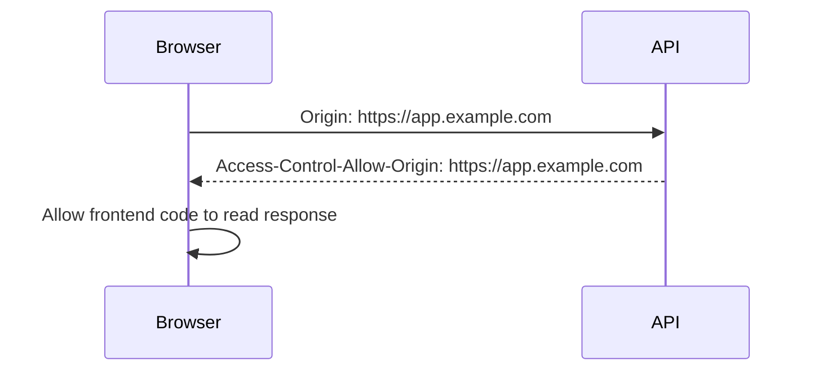

CORS headers do not replace authentication or authorization.

---

# 47. `Access-Control-Allow-Methods`

## Purpose

Lists HTTP methods permitted for cross-origin requests.

```http
Access-Control-Allow-Methods: GET, POST, PATCH, DELETE
```

---

# 48. `Access-Control-Allow-Headers`

## Purpose

Lists request headers the browser may send in a cross-origin request.

```http
Access-Control-Allow-Headers: Content-Type, Authorization
```

If frontend JavaScript sends:

```http
Authorization: Bearer token
```

the server may need to permit that header.

---

# 49. `Access-Control-Allow-Credentials`

## Purpose

Indicates whether the browser may include credentials such as cookies in cross-origin requests.

```http
Access-Control-Allow-Credentials: true
```

Credentialed CORS requires careful configuration.

A wildcard origin is generally not suitable for credentialed requests:

```http
Access-Control-Allow-Origin: *
```

---

# 50. `Access-Control-Expose-Headers`

## Purpose

Controls which response headers browser JavaScript is allowed to read.

```http
Access-Control-Expose-Headers: X-Request-ID, ETag
```

Without this, some headers may exist in the network response but remain unavailable to frontend JavaScript.

---

# 51. `Access-Control-Max-Age`

## Purpose

Specifies how long a browser may cache the result of a CORS preflight request.

```http
Access-Control-Max-Age: 600
```

This can reduce repeated `OPTIONS` requests.

---

# 52. `User-Agent`

## Purpose

Identifies the client software.

Example:

```http
User-Agent: Mozilla/5.0 ...
```

A server may use this for:

- Diagnostics
- Compatibility
- Analytics
- Device adaptation
- Bot detection

The value can be modified, so it should not be treated as a secure identity claim.

---

# 53. `X-Requested-With`

Historically, some JavaScript libraries sent:

```http
X-Requested-With: XMLHttpRequest
```

Servers sometimes use it to distinguish AJAX-style requests.

It is not a reliable security mechanism because clients can forge it.

---

# 54. `X-Forwarded-For`

## Purpose

Proxies may use `X-Forwarded-For` to communicate the original client IP address.

```http
X-Forwarded-For: 203.0.113.50
```

A chain may look like:

```http
X-Forwarded-For: 203.0.113.50, 198.51.100.10
```

## Security warning

This header should be trusted only when inserted and managed by trusted infrastructure.

A direct client can usually send a fake header unless the network architecture prevents it.

---

# 55. `X-Forwarded-Proto`

## Purpose

Proxies may use this header to communicate the original protocol:

```http
X-Forwarded-Proto: https
```

This helps backend applications know whether the original client connection was secure when TLS was terminated at a reverse proxy.

Incorrect configuration can cause:

- HTTPS redirect loops
- Incorrect secure-cookie behavior
- Wrong generated URLs
- Mixed-content problems

---

# 56. `Forwarded`

`Forwarded` is a standardized alternative to some `X-Forwarded-*` headers.

Example:

```http
Forwarded: for=203.0.113.50;proto=https;host=example.com
```

Infrastructure should configure trusted proxy handling carefully.

---

# 57. `Via`

`Via` can identify intermediaries that handled a request or response.

It may appear when traffic passes through:

- Proxies
- Gateways
- Caches
- HTTP intermediaries

---

# 58. `Server`

## Purpose

`Server` may identify server software.

Example:

```http
Server: nginx
```

or:

```http
Server: Apache
```

Many applications minimize or remove detailed server version information to reduce information exposure.

Do not rely on this header as a definitive security or identity signal.

---

# 59. `Date`

## Purpose

`Date` indicates when the response was generated.

```http
Date: Wed, 22 Jul 2026 12:00:00 GMT
```

It can be useful for:

- Debugging clock differences
- Cache analysis
- Response age calculations
- Comparing distributed systems

---

# 60. `Age`

## Purpose

`Age` indicates how long a response has been in a shared cache.

```http
Age: 120
```

This means the cached response is approximately 120 seconds old.

It is useful when debugging CDN and proxy caching.

---

# 61. `Vary`

## Purpose

`Vary` tells caches that the response changes based on specific request headers.

Example:

```http
Vary: Accept-Encoding
```

This means a cache should distinguish between:

```text
Compressed response
Uncompressed response
```

Another example:

```http
Vary: Accept-Language
```

means the response may differ by language preference.

Incorrect `Vary` configuration can lead to:

- Wrong language being served
- Compressed data sent to incompatible clients
- One user’s response being served to another
- Excessive cache fragmentation

---

# 62. `Pragma`

`Pragma` is an older header historically used for cache control.

Example:

```http
Pragma: no-cache
```

Modern applications should generally use `Cache-Control`, but `Pragma` may still appear for compatibility.

---

# 63. `Expires`

## Purpose

`Expires` gives an expiration date for a response.

```http
Expires: Wed, 22 Jul 2026 13:00:00 GMT
```

Modern applications generally prefer `Cache-Control: max-age=...`.

Clock differences can make date-based expiration less reliable than relative durations.

---

# 64. `Strict-Transport-Security`

## Purpose

`Strict-Transport-Security`, or HSTS, tells browsers to use HTTPS for a domain.

Example:

```http
Strict-Transport-Security: max-age=31536000; includeSubDomains
```

Meaning:

```text
Remember for one year.
Use HTTPS for subdomains too.
```

HSTS helps prevent downgrade attempts from HTTPS to HTTP.

Use `includeSubDomains` only when all relevant subdomains support HTTPS correctly.

---

# 65. `Content-Security-Policy`

## Purpose

Content Security Policy, or CSP, controls which sources of content a browser may load or execute.

Example:

```http
Content-Security-Policy: default-src 'self'; script-src 'self'
```

This may restrict scripts to the application’s own origin.

CSP can help reduce risks from:

- Cross-site scripting
- Unexpected third-party scripts
- Unsafe content loading
- Data injection

CSP policies must be designed carefully because an overly strict policy may break legitimate application behavior.

---

# 66. `X-Content-Type-Options`

Example:

```http
X-Content-Type-Options: nosniff
```

This tells browsers not to guess a different content type from the one declared by the server.

This helps prevent content-type confusion.

---

# 67. `X-Frame-Options`

Example:

```http
X-Frame-Options: DENY
```

This can prevent a page from being embedded in a frame.

Common values:

```text
DENY
SAMEORIGIN
```

It helps reduce certain clickjacking risks.

Modern applications may also use CSP:

```http
Content-Security-Policy: frame-ancestors 'none'
```

---

# 68. `Permissions-Policy`

`Permissions-Policy` controls access to selected browser capabilities.

Examples include:

- Camera
- Microphone
- Geolocation
- Fullscreen
- USB
- Payment APIs

Example:

```http
Permissions-Policy: camera=(), microphone=()
```

This tells the browser that the page should not use those capabilities.

---

# 69. `Cross-Origin-Opener-Policy`

Example:

```http
Cross-Origin-Opener-Policy: same-origin
```

This helps isolate browsing contexts across origins.

It can be relevant to:

- Cross-origin isolation
- Window relationships
- Security boundaries
- High-resolution browser features

---

# 70. `Cross-Origin-Resource-Policy`

Example:

```http
Cross-Origin-Resource-Policy: same-origin
```

This controls which other origins may load a resource.

---

# 71. `Cross-Origin-Embedder-Policy`

Example:

```http
Cross-Origin-Embedder-Policy: require-corp
```

This can help establish cross-origin isolation when combined with related security headers.

These cross-origin isolation headers are more advanced, but they are useful to recognize when inspecting modern applications.

---

# 72. `Alt-Svc`

`Alt-Svc` informs a client that the resource may be available through an alternative service or protocol.

Example:

```http
Alt-Svc: h3=":443"; ma=86400
```

This may advertise HTTP/3 availability.

---

# 73. `Upgrade-Insecure-Requests`

A browser may send:

```http
Upgrade-Insecure-Requests: 1
```

This indicates that the client prefers secure resources.

A server may use this information when redirecting or generating content.

---

# 74. `Upgrade`

`Upgrade` is used when negotiating a protocol change.

Example:

```http
Upgrade: websocket
Connection: Upgrade
```

It is associated with protocol switching.

---

# 75. `Connection`

In HTTP/1.1, `Connection` can communicate connection-specific behavior.

Examples:

```http
Connection: keep-alive
Connection: close
Connection: Upgrade
```

Connection management differs across HTTP versions, especially HTTP/2 and HTTP/3.

---

# 76. Request IDs and Trace Headers

Applications often assign a request identifier:

```http
X-Request-ID: req_abc123
```

or:

```http
Traceparent: 00-4bf92f3577b34da6a3ce929d0e0e4736-00f067aa0ba902b7-01
```

The identifier can connect:

- Browser logs
- API logs
- Database logs
- Queue logs
- External service calls
- Error reports

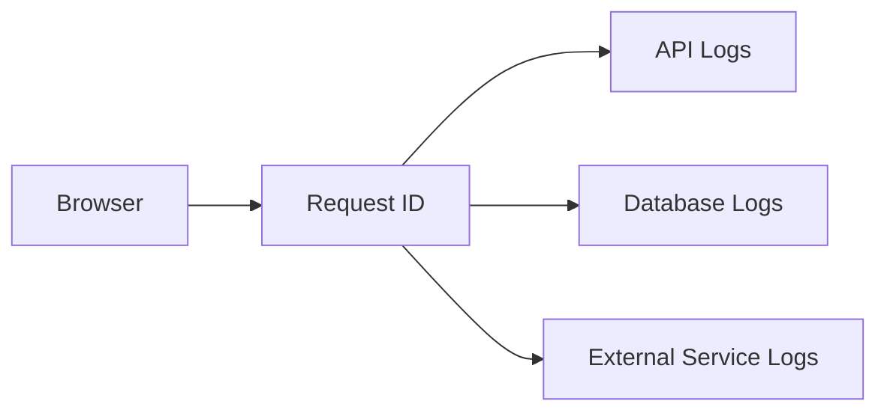

Do not place sensitive information directly inside request IDs.

---

# 77. Rate-Limit Headers

Some APIs expose rate-limit information:

```http
X-RateLimit-Limit: 1000
X-RateLimit-Remaining: 42
X-RateLimit-Reset: 1780000000
```

These may communicate:

```text
Maximum allowed requests
Remaining requests
Time when the limit resets
```

Header names vary between API providers.

The standardized `Retry-After` header is often more portable.

---

# 78. Deprecation and Sunset Headers

An API may communicate that an endpoint is being retired.

Example:

```http
Deprecation: true
Sunset: Wed, 22 Jul 2027 00:00:00 GMT
```

This gives consumers time to migrate.

Deprecation should also be documented clearly outside the headers.

---

# 79. Header Security Mistakes

Common problems include:

## Logging authorization headers

```http
Authorization: Bearer real-secret
```

Never log credentials without redaction.

## Sending private responses as public

```http
Cache-Control: public
```

This can expose user-specific content through shared caches.

## Using wildcard CORS with credentials

```http
Access-Control-Allow-Origin: *
Access-Control-Allow-Credentials: true
```

This combination is generally invalid or unsafe for credentialed browser access.

## Trusting forwarded headers from arbitrary clients

Headers such as:

```http
X-Forwarded-For
X-Forwarded-Proto
```

should be trusted only from known proxies.

## Incorrect content types

A body labeled JSON but containing invalid JSON creates parsing failures.

---

# 80. Header Inspection Workflow

When debugging a request, inspect request headers in this order:

```text
1. Host
2. Request URL
3. Method
4. Origin
5. Authorization or Cookie
6. Content-Type
7. Accept
8. Content-Length
9. Query parameters
10. Request body
```

Then inspect response headers:

```text
1. Status code
2. Content-Type
3. Location
4. Set-Cookie
5. Cache-Control
6. ETag
7. CORS headers
8. Content-Encoding
9. Security headers
10. Request or trace ID
```

---

# 81. Complete Request Example

```http
POST /api/orders?notify=true HTTP/1.1
Host: shop.example.com
Accept: application/json
Accept-Language: en-US
Accept-Encoding: gzip, br
Content-Type: application/json
Authorization: Bearer REDACTED
Cookie: session_id=REDACTED
Origin: https://app.example.com
Referer: https://app.example.com/cart
User-Agent: ExampleBrowser/1.0
Content-Length: 58

{
  "productId": 123,
  "quantity": 2
}
```

Interpretation:

```text
Method:
  POST

Path:
  /api/orders

Query:
  notify=true

Expected response:
  application/json

Request body:
  JSON

Authentication:
  Bearer token and possibly session cookie

Origin:
  https://app.example.com

Referrer:
  https://app.example.com/cart
```

---

# 82. Complete Response Example

```http
HTTP/1.1 201 Created
Date: Wed, 22 Jul 2026 12:00:00 GMT
Content-Type: application/json
Content-Encoding: br
Cache-Control: no-store
Location: /api/orders/9001
Set-Cookie: order_notice=created; Secure; HttpOnly; SameSite=Lax
X-Request-ID: req_abc123
Strict-Transport-Security: max-age=31536000

{
  "id": 9001,
  "status": "pending",
  "total": 159.98
}
```

Interpretation:

```text
Status:
  Resource was created

Content type:
  JSON

Compression:
  Brotli

Caching:
  Do not store

New resource:
  /api/orders/9001

Cookie:
  Browser should store order_notice

Diagnostics:
  Request ID is req_abc123

Security:
  HSTS is enabled
```

---

# 83. Practical cURL Header Commands

Show response headers:

```bash
curl -I https://example.com
```

Show request and response headers:

```bash
curl -i https://example.com
```

Show detailed headers and connection information:

```bash
curl -v https://example.com
```

Send custom headers:

```bash
curl \
  -H "Accept: application/json" \
  -H "Authorization: Bearer REDACTED" \
  https://api.example.com/products
```

Send JSON with headers:

```bash
curl \
  -X POST \
  -H "Content-Type: application/json" \
  -H "Accept: application/json" \
  -d '{"name":"Keyboard"}' \
  https://api.example.com/products
```

---

# 84. Final Header Mental Model

Headers do not usually contain the main application data.

Instead, they describe how the main data should be:

```text
Sent
Interpreted
Authenticated
Cached
Compressed
Protected
Displayed
Debugged
```

A useful model is:

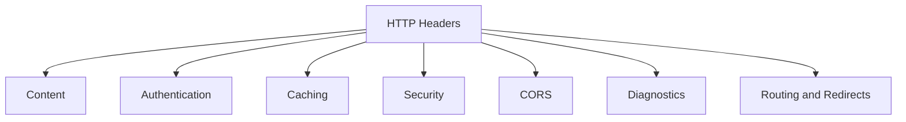

The most important headers to recognize first are:

```text
Host
Accept
Content-Type
Content-Length
Authorization
Cookie
Set-Cookie
Cache-Control
ETag
Location
Origin
Referer
Access-Control-Allow-Origin
Retry-After
Strict-Transport-Security
Content-Security-Policy
```

When debugging a web request, do not inspect only the status code.

Inspect:

```text
URL
Method
Request headers
Request body
Response status
Response headers
Response body
Timing
```

