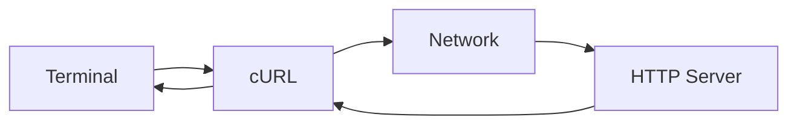
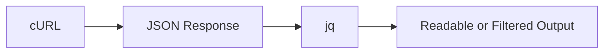
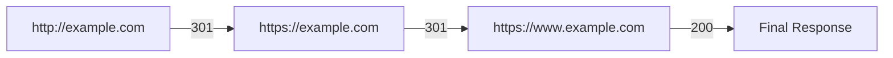
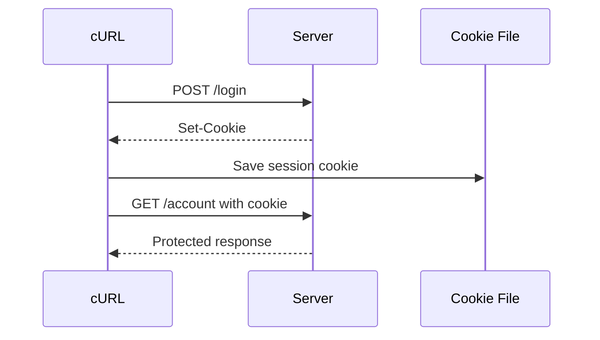
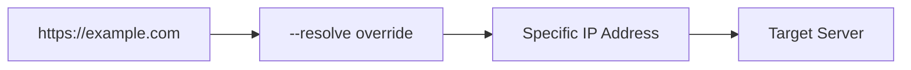
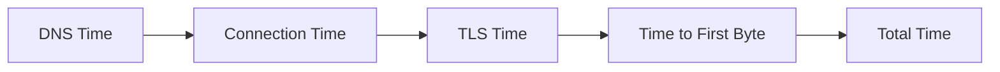
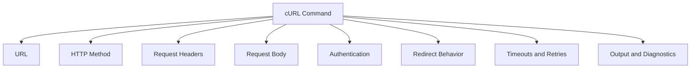

# Appendix E — cURL Command Cookbook  
## Making, Inspecting, Debugging, and Reproducing HTTP Requests from the Terminal

cURL is one of the most useful tools for understanding web communication.

It allows you to send HTTP requests without using:

- A browser interface
- A frontend application
- Postman
- Bruno
- A mobile app
- A custom API client

This makes cURL valuable for:

- Testing APIs
- Debugging backend behavior
- Reproducing browser requests
- Inspecting headers
- Following redirects
- Testing authentication
- Uploading files
- Measuring timing
- Checking TLS
- Automating health checks
- Writing shell scripts
- Comparing environments

A simple request looks like this:

```bash
curl https://example.com
```

Conceptually:



---

# 1. What Is cURL?

cURL is a command-line tool for transferring data using URLs.

The name is commonly understood as:

```text
Client URL
```

cURL supports many protocols, including:

- HTTP
- HTTPS
- FTP
- SFTP
- SMTP
- IMAP
- LDAP
- WebSocket-related workflows in supported versions

For this series, we will focus mainly on:

```text
HTTP
HTTPS
```

---

# 2. Basic cURL Syntax

The basic structure is:

```bash
curl [options] URL
```

Example:

```bash
curl https://example.com
```

Options modify the request.

```bash
curl -I https://example.com
```

Here:

```text
curl = command
-I    = request headers only
URL   = destination
```

Long-form options are often easier to read:

```bash
curl --head https://example.com
```

Short and long options often mean the same thing:

```bash
-I
--head
```

---

# 3. Check Whether cURL Is Installed

Run:

```bash
curl --version
```

Example output may include:

```text
curl 8.x.x
Release-Date: ...
Protocols: dict file ftp ftps http https ...
Features: IPv6 SSL HTTP2 ...
```

This tells you:

- cURL version
- Supported protocols
- TLS support
- HTTP/2 support
- IPv6 support
- Compression support

A missing feature may affect which commands work.

---

# 4. Basic GET Requests

The most basic HTTP operation is a `GET`.

```bash
curl https://example.com
```

This sends a request conceptually similar to:

```http
GET / HTTP/1.1
Host: example.com
User-Agent: curl/...
Accept: */*
```

The response body is printed to the terminal.

For an API:

```bash
curl https://api.example.com/products
```

If the response is JSON, it may appear as one long line.

---

# 5. Pretty-Print JSON

If `jq` is installed:

```bash
curl https://api.example.com/products | jq
```

Select a field:

```bash
curl https://api.example.com/products | jq '.items'
```

Select the first item:

```bash
curl https://api.example.com/products | jq '.items[0]'
```

Select product names:

```bash
curl https://api.example.com/products | jq '.items[].name'
```



Without `jq`, you can still save the response:

```bash
curl https://api.example.com/products -o products.json
```

---

# 6. Save a Response to a File

Use `-o` or `--output`:

```bash
curl https://example.com -o page.html
```

This saves the response body as:

```text
page.html
```

For an image:

```bash
curl https://example.com/logo.png -o logo.png
```

For a JSON response:

```bash
curl https://api.example.com/products -o products.json
```

The terminal may display progress information for larger downloads.

---

# 7. Preserve the Remote Filename

Use `-O` or `--remote-name`:

```bash
curl -O https://example.com/files/report.pdf
```

cURL saves the file using the filename from the URL:

```text
report.pdf
```

Be careful when using remote names from untrusted URLs. Confirm where the file will be saved.

---

# 8. Display Response Headers with `-i`

Use:

```bash
curl -i https://example.com
```

This displays response headers followed by the response body.

Example:

```http
HTTP/2 200
content-type: text/html
cache-control: max-age=300

<!doctype html>
<html>
...
```

This is useful when inspecting:

- Status code
- Content type
- Cache behavior
- Cookies
- Redirect locations
- Security headers

---

# 9. Display Only Response Headers with `-I`

Use:

```bash
curl -I https://example.com
```

This sends a `HEAD` request when supported.

Example output:

```http
HTTP/2 200
content-type: text/html
content-length: 1250
cache-control: max-age=300
```

This is useful for checking metadata without downloading the full response body.

Some servers do not implement `HEAD` correctly. In that case, a normal request with headers may provide more reliable information:

```bash
curl -i https://example.com
```

---

# 10. Verbose Mode with `-v`

Use:

```bash
curl -v https://example.com
```

Verbose mode can show:

- DNS resolution
- IP address
- Connection establishment
- TLS negotiation
- Request headers
- Response headers
- Connection reuse
- Redirect information

Output often includes lines such as:

```text
* Connected to example.com
> GET / HTTP/2
> Host: example.com
> User-Agent: curl/...
> Accept: */*
< HTTP/2 200
< content-type: text/html
```

The symbols commonly mean:

```text
> = Data sent by cURL
< = Data received from the server
* = Diagnostic information
```

---

# 11. Avoid Accidentally Exposing Secrets in Verbose Output

Verbose mode may display:

- Authorization headers
- Cookies
- API keys
- Query parameters
- Personal data

Do not paste raw verbose output into public spaces.

Redact values first:

```text
Authorization: Bearer REDACTED
Cookie: session_id=REDACTED
```

---

# 12. Trace Output

For deeper diagnostics:

```bash
curl --trace-ascii trace.txt https://example.com
```

This writes an ASCII trace to:

```text
trace.txt
```

A binary-safe trace can be written with:

```bash
curl --trace trace.bin https://example.com
```

These traces may include sensitive data.

Use them carefully.

---

# 13. Follow Redirects with `-L`

By default, cURL may show the redirect response without following it.

Use:

```bash
curl -L http://example.com
```

This tells cURL to follow `Location` headers.

Example redirect chain:



To inspect the entire chain:

```bash
curl -i -L http://example.com
```

---

# 14. Show Redirect Locations Without Following

Use:

```bash
curl -I http://example.com
```

Look for:

```http
HTTP/1.1 301
Location: https://example.com/
```

This is useful when diagnosing:

- HTTP-to-HTTPS redirects
- `www` redirects
- Login redirects
- URL migrations
- Redirect loops

---

# 15. Limit Redirects

Use:

```bash
curl -L --max-redirs 5 https://example.com
```

This prevents cURL from following an unlimited number of redirects.

An excessive number of redirects may indicate a configuration loop.

---

# 16. Request a Specific HTTP Method

Use `-X` or `--request`:

```bash
curl -X GET https://api.example.com/products
```

For most common methods, cURL automatically chooses the method based on other options.

Explicit method examples:

```bash
curl -X POST https://api.example.com/orders
curl -X PUT https://api.example.com/products/123
curl -X PATCH https://api.example.com/products/123
curl -X DELETE https://api.example.com/products/123
curl -X OPTIONS https://api.example.com/products
```

Use method names deliberately. The method should match the API contract.

---

# 17. GET Query Parameters

You can write a query string directly:

```bash
curl "https://api.example.com/products?category=keyboards&page=2"
```

Quote the URL so the shell does not interpret special characters.

This is especially important for:

```text
&
?
*
$
```

Without quotes, the shell may interpret `&` as a background command operator.

---

# 18. Use `-G` for Query Parameters

The `-G` or `--get` option tells cURL to append `--data` values to the URL as query parameters.

```bash
curl -G https://api.example.com/products \
  --data-urlencode "category=mechanical keyboards" \
  --data-urlencode "page=2"
```

This produces a URL similar to:

```text
https://api.example.com/products?category=mechanical+keyboards&page=2
```

This is safer than manually encoding spaces and special characters.

---

# 19. `--data-urlencode`

Use:

```bash
curl -G https://api.example.com/search \
  --data-urlencode "q=red & blue"
```

The value is encoded correctly.

Without encoding, the `&` could be interpreted as a separator between query parameters.

---

# 20. Multiple Query Parameters

```bash
curl -G https://api.example.com/products \
  --data-urlencode "category=keyboards" \
  --data-urlencode "available=true" \
  --data-urlencode "sort=-price" \
  --data-urlencode "limit=20"
```

This is equivalent conceptually to:

```text
/products?category=keyboards&available=true&sort=-price&limit=20
```

---

# 21. Send Request Headers with `-H`

Use `-H` or `--header`:

```bash
curl \
  -H "Accept: application/json" \
  https://api.example.com/products
```

Multiple headers:

```bash
curl \
  -H "Accept: application/json" \
  -H "X-Client-Version: 1.2.0" \
  https://api.example.com/products
```

Header names are generally not case-sensitive, but consistent capitalization improves readability.

---

# 22. Set the `Accept` Header

```bash
curl \
  -H "Accept: application/json" \
  https://api.example.com/products
```

This tells the server:

```text
The client prefers JSON.
```

For HTML:

```bash
curl \
  -H "Accept: text/html" \
  https://example.com
```

---

# 23. Set the `Content-Type` Header

When sending JSON:

```bash
curl \
  -H "Content-Type: application/json" \
  -d '{"name":"Alex"}' \
  https://api.example.com/users
```

The `Content-Type` header tells the server how to parse the body.

If omitted, cURL’s `-d` option commonly sends form-style data:

```text
application/x-www-form-urlencoded
```

That may not match the API’s expectations.

---

# 24. Send JSON with `-d`

Basic JSON request:

```bash
curl \
  -X POST \
  -H "Content-Type: application/json" \
  -d '{"name":"Alex","email":"alex@example.com"}' \
  https://api.example.com/users
```

Pretty multi-line JSON:

```bash
curl \
  -X POST \
  -H "Content-Type: application/json" \
  -d '{
    "name": "Alex",
    "email": "alex@example.com"
  }' \
  https://api.example.com/users
```

Use single quotes around the JSON in Unix-like shells so double quotes inside the JSON remain intact.

---

# 25. Read JSON from a File

Create `request.json`:

```json
{
  "name": "Alex",
  "email": "alex@example.com"
}
```

Send it:

```bash
curl \
  -X POST \
  -H "Content-Type: application/json" \
  --data @request.json \
  https://api.example.com/users
```

This is useful for:

- Large bodies
- Repeatable tests
- Complex nested data
- Avoiding shell quoting problems

---

# 26. Use `--json`

Recent cURL versions support:

```bash
curl \
  --json '{"name":"Alex"}' \
  https://api.example.com/users
```

This generally:

- Sets `Content-Type: application/json`
- Sets `Accept: application/json`
- Sends the provided JSON body

You can also read from a file:

```bash
curl \
  --json @request.json \
  https://api.example.com/users
```

Check your cURL version if this option is unavailable.

---

# 27. POST Form Data

Use `-d` without a JSON content type:

```bash
curl \
  -X POST \
  -d "name=Alex&email=alex@example.com" \
  https://api.example.com/users
```

This typically sends:

```http
Content-Type: application/x-www-form-urlencoded
```

Use this when the endpoint expects traditional form encoding.

---

# 28. Individual Form Fields with `-d`

You can provide fields separately:

```bash
curl \
  -X POST \
  -d "name=Alex" \
  -d "email=alex@example.com" \
  https://api.example.com/users
```

cURL combines the fields into a form-style body.

---

# 29. URL-Encode Form Fields

Use `--data-urlencode`:

```bash
curl \
  -X POST \
  --data-urlencode "name=Alex Smith" \
  --data-urlencode "message=red & blue" \
  https://api.example.com/contact
```

This protects spaces and special characters.

---

# 30. Multipart Form Data with `-F`

Use `-F` or `--form` for multipart form data.

```bash
curl \
  -X POST \
  -F "name=Alex" \
  -F "email=alex@example.com" \
  https://api.example.com/users
```

The request uses a content type similar to:

```http
Content-Type: multipart/form-data; boundary=...
```

---

# 31. Upload a File

```bash
curl \
  -X POST \
  -F "file=@profile.jpg" \
  https://api.example.com/uploads
```

The `@` means:

```text
Read the contents from this local file.
```

Add a text field:

```bash
curl \
  -X POST \
  -F "description=Profile photo" \
  -F "file=@profile.jpg" \
  https://api.example.com/uploads
```

---

# 32. Set an Uploaded File’s Content Type

```bash
curl \
  -F "file=@photo.jpg;type=image/jpeg" \
  https://api.example.com/uploads
```

This tells the server the declared content type of the uploaded part.

The server should still inspect and validate the actual file contents.

---

# 33. HTTP Basic Authentication

Use:

```bash
curl \
  -u username:password \
  https://api.example.com/private
```

This sends an authorization header similar to:

```http
Authorization: Basic base64(username:password)
```

Use Basic authentication only over HTTPS.

Avoid putting passwords directly into shell history.

A safer pattern is to let cURL prompt:

```bash
curl -u username https://api.example.com/private
```

---

# 34. Bearer Token Authentication

```bash
curl \
  -H "Authorization: Bearer REDACTED" \
  https://api.example.com/account
```

A shell variable can reduce accidental repetition:

```bash
TOKEN="REDACTED"

curl \
  -H "Authorization: Bearer $TOKEN" \
  https://api.example.com/account
```

Be careful with:

- Shell history
- Shared terminals
- Process listings
- CI logs
- Debug output

---

# 35. API Key Authentication

Header-based API key:

```bash
curl \
  -H "X-API-Key: REDACTED" \
  https://api.example.com/data
```

Alternative header:

```bash
curl \
  -H "Api-Key: REDACTED" \
  https://api.example.com/data
```

Some APIs use query parameters:

```bash
curl \
  "https://api.example.com/data?api_key=REDACTED"
```

Query-based keys are less desirable because URLs are widely logged.

---

# 36. Cookies with `-b`

Send a cookie manually:

```bash
curl \
  -b "session_id=abc123" \
  https://api.example.com/account
```

Equivalent header:

```bash
curl \
  -H "Cookie: session_id=abc123" \
  https://api.example.com/account
```

Do not use real production session values in shared commands.

---

# 37. Save Cookies with `-c`

Save cookies received from a response:

```bash
curl \
  -c cookies.txt \
  -X POST \
  -d "email=alex@example.com&password=REDACTED" \
  https://api.example.com/login
```

The cookie jar is written to:

```text
cookies.txt
```

Protect this file because it may contain session credentials.

---

# 38. Reuse Cookies with `-b`

Use the saved cookie jar:

```bash
curl \
  -b cookies.txt \
  https://api.example.com/account
```

A login workflow:



---

# 39. Combine Cookie Options

You can save and reuse cookies in one command:

```bash
curl \
  -c cookies.txt \
  -b cookies.txt \
  https://api.example.com/account
```

This is useful for multi-step workflows.

---

# 40. Send an Origin Header

For testing server behavior:

```bash
curl \
  -H "Origin: https://app.example.com" \
  https://api.example.com/products
```

This does not make cURL enforce browser CORS rules.

It only sends the header.

Important distinction:

```text
Browser:
  Sends request and may block JavaScript from reading response.

cURL:
  Sends request and displays response without browser CORS enforcement.
```

This makes cURL useful for separating server behavior from browser policy.

---

# 41. Test a CORS Preflight

A simplified preflight request:

```bash
curl \
  -i \
  -X OPTIONS \
  -H "Origin: https://app.example.com" \
  -H "Access-Control-Request-Method: POST" \
  -H "Access-Control-Request-Headers: Content-Type, Authorization" \
  https://api.example.com/orders
```

Inspect response headers such as:

```http
Access-Control-Allow-Origin
Access-Control-Allow-Methods
Access-Control-Allow-Headers
Access-Control-Allow-Credentials
```

---

# 42. Test Redirects

Inspect one redirect:

```bash
curl -I http://example.com
```

Follow redirects:

```bash
curl -L http://example.com
```

Show every response in a redirect chain:

```bash
curl -i -L http://example.com
```

Limit redirects:

```bash
curl -L --max-redirs 5 http://example.com
```

---

# 43. Test HTTPS Certificates

Verbose mode:

```bash
curl -v https://example.com
```

This may display:

- Certificate subject
- Certificate issuer
- Validity dates
- TLS protocol
- Negotiated cipher
- Hostname verification

Use `--cacert` when testing a custom CA certificate:

```bash
curl \
  --cacert internal-ca.pem \
  https://internal.example.com
```

---

# 44. Do Not Disable Certificate Verification Casually

The `-k` or `--insecure` option disables certificate verification:

```bash
curl -k https://example.com
```

This may be useful for controlled local testing with a self-signed certificate, but it removes an important security check.

Do not use it as a permanent production solution.

If you use it to debug, explicitly understand what verification is being bypassed.

---

# 45. Specify a Client Certificate

Some services require mutual TLS.

```bash
curl \
  --cert client.crt \
  --key client.key \
  https://secure.example.com
```

If the client certificate and key are combined:

```bash
curl \
  --cert client.pem \
  https://secure.example.com
```

Protect private keys carefully.

---

# 46. Specify TLS Versions

For testing compatibility:

```bash
curl --tlsv1.2 https://example.com
```

Depending on cURL version and options, you may also control maximum TLS version.

Do not force old insecure protocols in production.

---

# 47. Force IPv4 or IPv6

Use IPv4:

```bash
curl -4 https://example.com
```

Use IPv6:

```bash
curl -6 https://example.com
```

This helps diagnose:

- Broken IPv6 routing
- DNS `A` vs `AAAA` issues
- Different network paths
- Provider configuration problems

---

# 48. Resolve a Hostname to a Specific Address

Use `--resolve`:

```bash
curl \
  --resolve example.com:443:203.0.113.10 \
  https://example.com/
```

This tells cURL:

```text
For example.com on port 443, use this IP address.
```

The hostname remains:

```text
example.com
```

This is useful for testing:

- A new server before DNS changes
- A specific load balancer
- A staging IP
- Certificate and virtual-host behavior



---

# 49. Connect to a Host Without Changing the URL

Use `--connect-to` for more advanced routing tests:

```bash
curl \
  --connect-to example.com:443:test.internal:8443 \
  https://example.com/
```

The URL and hostname behavior can remain different from the network connection destination.

This is useful for testing reverse proxies and service routing.

---

# 50. Specify a Local Interface

Use:

```bash
curl \
  --interface eth0 \
  https://example.com
```

Or a local IP:

```bash
curl \
  --interface 192.168.1.10 \
  https://example.com
```

This can help diagnose multi-interface systems.

---

# 51. Set a Timeout

Connection timeout:

```bash
curl \
  --connect-timeout 5 \
  https://example.com
```

Maximum total time:

```bash
curl \
  --max-time 15 \
  https://example.com
```

Both:

```bash
curl \
  --connect-timeout 5 \
  --max-time 15 \
  https://example.com
```

Timeouts prevent scripts from waiting forever.

---

# 52. Retry Temporary Failures

Use:

```bash
curl \
  --retry 3 \
  https://example.com
```

Retry with a delay:

```bash
curl \
  --retry 3 \
  --retry-delay 2 \
  https://example.com
```

Retry server errors:

```bash
curl \
  --retry 3 \
  --retry-all-errors \
  https://example.com
```

Be cautious with `POST`.

A retry may duplicate a state-changing operation.

Use idempotency keys for operations where supported.

---

# 53. Retry with Exponential Backoff

Some cURL versions support retry delay strategies such as:

```bash
curl \
  --retry 5 \
  --retry-delay 2 \
  --retry-max-time 30 \
  https://example.com
```

A real application should consider:

- Whether the method is safe
- Whether the server already processed the request
- Whether `Retry-After` was returned
- Whether the operation has an idempotency key

---

# 54. Measure Request Timing

Use `-w` or `--write-out`:

```bash
curl \
  -o /dev/null \
  -s \
  -w "status=%{http_code} time=%{time_total}s\n" \
  https://example.com
```

Useful variables include:

```text
%{http_code}
%{time_namelookup}
%{time_connect}
%{time_appconnect}
%{time_starttransfer}
%{time_total}
%{size_download}
%{speed_download}
```

---

# 55. Detailed Timing Command

```bash
curl \
  -o /dev/null \
  -s \
  -w "\
dns=%{time_namelookup}s\n\
connect=%{time_connect}s\n\
tls=%{time_appconnect}s\n\
ttfb=%{time_starttransfer}s\n\
total=%{time_total}s\n\
status=%{http_code}\n\
download=%{size_download} bytes\n" \
  https://example.com
```

Conceptual interpretation:



---

# 56. Measure Response Size and Speed

```bash
curl \
  -o /dev/null \
  -s \
  -w "status=%{http_code}\nsize=%{size_download} bytes\nspeed=%{speed_download} bytes/s\n" \
  https://example.com
```

This helps distinguish:

```text
Slow server response
```

from:

```text
Large response download
```

---

# 57. Test Only the HTTP Status

Useful for health checks:

```bash
curl \
  -s \
  -o /dev/null \
  -w "%{http_code}\n" \
  https://example.com/health
```

Shell example:

```bash
STATUS=$(curl -s -o /dev/null -w "%{http_code}" https://example.com/health)

if [ "$STATUS" = "200" ]; then
  echo "Healthy"
else
  echo "Unhealthy: $STATUS"
fi
```

---

# 58. Test a Health Endpoint

```bash
curl -f https://api.example.com/health
```

The `-f` or `--fail` option causes cURL to return a failure status for HTTP error responses.

This is useful in scripts.

Combine with silent mode:

```bash
curl -fsS https://api.example.com/health
```

Common flags:

```text
-f = fail on HTTP errors
-s = silent
-S = show errors even in silent mode
```

---

# 59. Download with Progress

Normal cURL downloads may show a progress meter.

To show a progress bar:

```bash
curl -# -O https://example.com/large-file.zip
```

To suppress progress:

```bash
curl -s -O https://example.com/large-file.zip
```

---

# 60. Resume a Download

Use `-C -`:

```bash
curl -C - -O https://example.com/large-file.zip
```

This asks cURL to resume from the current local file size.

The server must support range requests.

---

# 61. Limit Download Speed

Use:

```bash
curl --limit-rate 500K -O https://example.com/file.zip
```

This can help simulate slower conditions or avoid consuming all available bandwidth.

---

# 62. Follow Authentication Redirects Carefully

Some redirects may move between domains.

Use:

```bash
curl -L https://example.com/login
```

Be careful with credentials.

cURL has options controlling whether sensitive headers are passed to redirected hosts. Do not assume an authorization header should be forwarded across domains.

Always inspect redirect chains when authentication is involved.

---

# 63. Copy a Browser Request as cURL

In browser DevTools:

1. Open Network.
2. Select a request.
3. Right-click the request.
4. Choose **Copy**.
5. Choose **Copy as cURL**.
6. Paste into a terminal.
7. Redact secrets.
8. Run and compare results.


This is one of the fastest ways to reproduce a real frontend request.

---

# 64. Browser Request vs cURL Differences

A browser request may contain:

- Cookies
- `Origin`
- `Referer`
- Browser-specific headers
- CSRF tokens
- Authorization
- Automatic redirects
- Service worker behavior

A cURL request may omit these.

If browser and cURL results differ, compare:

```text
URL
Method
Headers
Cookies
Authorization
Body
Redirect behavior
Environment
```

---

# 65. Use a cURL Configuration File

Instead of writing a long command repeatedly, use a config file.

Example `curl.conf`:

```text
header = "Accept: application/json"
header = "Authorization: Bearer REDACTED"
connect-timeout = 5
max-time = 15
```

Run:

```bash
curl --config curl.conf https://api.example.com/products
```

This can improve repeatability, but protect files containing secrets.

---

# 66. Use Shell Variables

```bash
BASE_URL="https://api.example.com"
TOKEN="REDACTED"

curl \
  -H "Authorization: Bearer $TOKEN" \
  "$BASE_URL/products"
```

This helps switch environments:

```bash
BASE_URL="http://localhost:3000"
```

or:

```bash
BASE_URL="https://staging-api.example.com"
```

Be careful that the correct environment is selected before destructive requests.

---

# 67. Use Environment Files Carefully

A shell script might read:

```bash
source .env.local
```

Then:

```bash
curl \
  -H "Authorization: Bearer $API_TOKEN" \
  "$API_BASE_URL/products"
```

Do not commit secret environment files to source control.

Add sensitive files to:

```text
.gitignore
```

---

# 68. API Workflow Script

Example:

```bash
#!/usr/bin/env bash

set -euo pipefail

BASE_URL="https://api.example.com"
TOKEN="${API_TOKEN:?API_TOKEN must be set}"

PRODUCTS=$(curl -fsS \
  -H "Accept: application/json" \
  -H "Authorization: Bearer $TOKEN" \
  "$BASE_URL/products")

echo "$PRODUCTS"
```

Explanation:

```text
set -e = stop after a failed command
set -u = fail on unset variables
set -o pipefail = fail when a pipeline component fails
```

---

# 69. Create an Order with an Idempotency Key

```bash
curl \
  -X POST \
  -H "Accept: application/json" \
  -H "Content-Type: application/json" \
  -H "Authorization: Bearer REDACTED" \
  -H "Idempotency-Key: order-attempt-123" \
  --data '{
    "items": [
      {
        "productId": 123,
        "quantity": 2
      }
    ]
  }' \
  https://api.example.com/orders
```

If the request must be retried, reuse the same idempotency key rather than generating a new one for each retry.

---

# 70. Test Conditional Requests

First, inspect the ETag:

```bash
curl -i https://api.example.com/products/123
```

Suppose the response contains:

```http
ETag: "product-v5"
```

Send a conditional request:

```bash
curl \
  -i \
  -H 'If-None-Match: "product-v5"' \
  https://api.example.com/products/123
```

Possible result:

```http
HTTP/1.1 304 Not Modified
```

---

# 71. Test Range Requests

```bash
curl \
  -i \
  -H "Range: bytes=0-999" \
  https://example.com/large-file.zip
```

Look for:

```http
HTTP/1.1 206 Partial Content
Content-Range: bytes 0-999/...
```

---

# 72. Send Custom User-Agent

```bash
curl \
  -A "MyDiagnosticClient/1.0" \
  https://example.com
```

Equivalent header:

```bash
curl \
  -H "User-Agent: MyDiagnosticClient/1.0" \
  https://example.com
```

This can help test user-agent-specific behavior.

Do not pretend to be another client for unauthorized access.

---

# 73. Send a Referer

```bash
curl \
  -H "Referer: https://example.com/products" \
  https://api.example.com/data
```

This is useful for controlled testing, but the server should not treat `Referer` as a trusted authentication mechanism.

---

# 74. Send Custom Request IDs

```bash
curl \
  -H "X-Request-ID: diagnostic-123" \
  https://api.example.com/products
```

If the backend preserves request IDs in logs or responses, this can help correlate a manual request with server behavior.

---

# 75. Inspect Response Headers with `-D`

Use `-D` or `--dump-header`:

```bash
curl \
  -D response-headers.txt \
  -o response-body.txt \
  https://example.com
```

This separates:

```text
response-headers.txt
response-body.txt
```

Useful for scripts that need to inspect headers independently.

---

# 76. Discard the Response Body

```bash
curl \
  -o /dev/null \
  https://example.com
```

Combine with status output:

```bash
curl \
  -o /dev/null \
  -s \
  -w "%{http_code}\n" \
  https://example.com
```

On Windows, the discard target may differ depending on the shell.

---

# 77. Compare Two Environments

Test development:

```bash
curl -sS -o dev.json \
  http://localhost:3000/api/products
```

Test staging:

```bash
curl -sS -o staging.json \
  https://staging.example.com/api/products
```

Compare:

```bash
diff dev.json staging.json
```

Also compare headers:

```bash
curl -sS -D dev.headers -o dev.body \
  http://localhost:3000/api/products

curl -sS -D staging.headers -o staging.body \
  https://staging.example.com/api/products
```

Possible differences:

- Status codes
- CORS headers
- Cache policies
- API versions
- Authentication
- Response schemas
- Compression
- Redirects

---

# 78. Common cURL Exit Codes

cURL returns exit codes that scripts can inspect.

Examples include:

| Code | General meaning |
|---:|---|
| `0` | Success |
| `3` | Malformed URL |
| `6` | Could not resolve host |
| `7` | Failed to connect |
| `22` | HTTP error with `--fail` |
| `28` | Operation timed out |
| `35` | TLS/SSL connection problem |
| `47` | Too many redirects |
| `52` | Empty server response |
| `56` | Network receive failure |
| `60` | Certificate verification problem |

Check the exit status:

```bash
curl -fsS https://example.com
echo $?
```

In scripts:

```bash
if curl -fsS https://example.com/health > /dev/null; then
  echo "Healthy"
else
  echo "Request failed"
fi
```

---

# 79. cURL and DNS Diagnostics

Resolve a hostname normally:

```bash
curl -v https://example.com
```

Force IPv4:

```bash
curl -4 -v https://example.com
```

Force IPv6:

```bash
curl -6 -v https://example.com
```

Use a specific IP while preserving the hostname:

```bash
curl \
  --resolve example.com:443:203.0.113.10 \
  -v \
  https://example.com
```

This helps distinguish:

```text
DNS problem
```

from:

```text
Server or routing problem
```

---

# 80. cURL and TLS Diagnostics

Verbose HTTPS request:

```bash
curl -v https://example.com
```

Look for:

```text
SSL connection using TLSv1.3
server certificate verification OK
subject: ...
issuer: ...
```

Test a certificate problem carefully:

```bash
curl --cacert custom-ca.pem https://internal.example.com
```

Avoid using:

```bash
curl -k
```

unless you understand that certificate verification is being disabled.

---

# 81. cURL and HTTP/2

Request HTTP/2 if supported:

```bash
curl --http2 -v https://example.com
```

You may see:

```text
using HTTP/2
```

Force HTTP/1.1:

```bash
curl --http1.1 -v https://example.com
```

This is useful for comparing protocol behavior.

---

# 82. cURL and HTTP/3

Support depends on how cURL was built.

If available:

```bash
curl --http3 -v https://example.com
```

Do not assume every installed cURL supports HTTP/3.

Check:

```bash
curl --version
```

---

# 83. Test an API Error Deliberately

Testing errors is useful.

Invalid JSON:

```bash
curl \
  -i \
  -X POST \
  -H "Content-Type: application/json" \
  -d '{"name":' \
  https://api.example.com/users
```

Missing authentication:

```bash
curl \
  -i \
  https://api.example.com/account
```

Invalid route:

```bash
curl \
  -i \
  https://api.example.com/does-not-exist
```

Invalid method:

```bash
curl \
  -i \
  -X DELETE \
  https://api.example.com/products
```

These tests help verify that the API returns meaningful status codes and error bodies.

---

# 84. cURL Safety Checklist

Before running a command, check:

```text
[ ] Is the URL the correct environment?
[ ] Is this operation destructive?
[ ] Does it contain real credentials?
[ ] Could it create duplicate data?
[ ] Is the request method correct?
[ ] Is the request body correct?
[ ] Should an idempotency key be included?
[ ] Are redirects safe to follow?
[ ] Could the command expose secrets in terminal history?
[ ] Could the response contain private data?
```

Especially review commands involving:

```http
POST
PUT
PATCH
DELETE
```

---

# 85. Common cURL Mistakes

## Mistake 1: Forgetting to quote URLs

Bad:

```bash
curl https://example.com/search?q=red&blue
```

The shell may interpret `&`.

Better:

```bash
curl "https://example.com/search?q=red&blue"
```

Or use:

```bash
curl -G https://example.com/search \
  --data-urlencode "q=red&blue"
```

## Mistake 2: Sending JSON without `Content-Type`

Bad:

```bash
curl -d '{"name":"Alex"}' https://api.example.com/users
```

Better:

```bash
curl \
  -H "Content-Type: application/json" \
  -d '{"name":"Alex"}' \
  https://api.example.com/users
```

## Mistake 3: Assuming HTTP errors fail the shell command

By default, cURL may return exit code zero even when the server returns `404` or `500`.

Use:

```bash
curl --fail
```

or:

```bash
curl -f
```

## Mistake 4: Following redirects blindly

Redirects may move to another host or change request behavior.

Inspect them first when debugging authentication.

## Mistake 5: Using `-k` as a permanent fix

Disabling certificate validation hides TLS configuration problems.

## Mistake 6: Reusing a `POST` without understanding duplication risk

Use idempotency keys where appropriate.

## Mistake 7: Sharing raw commands with secrets

Redact tokens, cookies, passwords, and API keys.

---

# 86. A Complete cURL Request Example

```bash
curl \
  --request POST \
  --url "https://api.shop.example.com/v1/orders?notify=true" \
  --header "Accept: application/json" \
  --header "Content-Type: application/json" \
  --header "Authorization: Bearer REDACTED" \
  --header "Idempotency-Key: order-attempt-123" \
  --data '{
    "items": [
      {
        "productId": 123,
        "quantity": 2
      }
    ]
  }' \
  --include \
  --fail-with-body
```

What it does:

```text
--request POST
  Uses POST.

--url
  Specifies the URL.

--header
  Adds request metadata.

--data
  Sends a JSON request body.

--include
  Includes response headers.

--fail-with-body
  Reports HTTP errors while preserving the response body.
```

---

# 87. A Complete Diagnostic Command

```bash
curl \
  --verbose \
  --location \
  --connect-timeout 5 \
  --max-time 20 \
  --request GET \
  --header "Accept: application/json" \
  --output response.json \
  --write-out "\nstatus=%{http_code}\ndns=%{time_namelookup}s\nconnect=%{time_connect}s\ntls=%{time_appconnect}s\nttfb=%{time_starttransfer}s\ntotal=%{time_total}s\n" \
  "https://api.example.com/products"
```

This:

- Shows connection diagnostics
- Follows redirects
- Limits connection and total time
- Requests JSON
- Saves the body
- Prints timing and status information

---

# 88. Final cURL Mental Model

cURL allows you to control the main parts of an HTTP exchange:



A practical progression is:

```text
Start with a simple GET.
  ↓
Inspect headers.
  ↓
Add query parameters.
  ↓
Send a request body.
  ↓
Add authentication.
  ↓
Manage cookies.
  ↓
Follow or inspect redirects.
  ↓
Measure timing.
  ↓
Reproduce browser requests.
  ↓
Automate health checks and tests.
```

The most important commands to remember are:

```bash
curl https://example.com
curl -i https://example.com
curl -I https://example.com
curl -v https://example.com
curl -L https://example.com
curl -G URL --data-urlencode "key=value"
curl -X POST -H "Content-Type: application/json" -d '{}' URL
curl -H "Authorization: Bearer TOKEN" URL
curl -F "file=@filename" URL
curl -o output.file URL
curl -w "%{http_code}\n" URL
```

Use cURL as both:

```text
A request-making tool
```

and:

```text
A way to observe the mechanics of HTTP
```

