# Appendix F — Browser DevTools Field Guide  
## Inspecting HTML, JavaScript, Network Traffic, Storage, Security, and Performance

Browser Developer Tools are a collection of tools built into modern browsers for inspecting and debugging web applications.

They allow you to observe what the browser is:

- Rendering
- Executing
- Downloading
- Storing
- Blocking
- Sending
- Receiving
- Caching
- Measuring

For web development, Developer Tools are not optional luxuries. They are one of the primary ways to understand what a web application is actually doing.

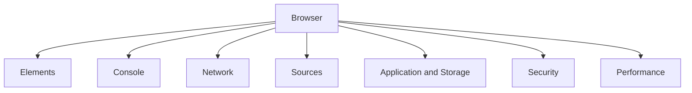

This appendix focuses on the most useful panels and workflows.

---

# 1. Opening Developer Tools

Common methods include:

- Right-click the page and select **Inspect**
- Press `F12`
- Press `Ctrl + Shift + I` on Windows/Linux
- Press `Cmd + Option + I` on macOS

The exact shortcuts may vary by browser and operating system.

Common Developer Tools panels include:

```text
Elements
Console
Sources
Network
Application
Security
Performance
Memory
Lighthouse
```

Not every browser displays the same panels or uses the same names.

---

# 2. The Main Panels

## Elements

Inspect and modify the current HTML and CSS.

Useful for:

- Layout debugging
- Styles
- Dimensions
- DOM structure
- Responsive design
- Accessibility inspection

## Console

Inspect JavaScript messages and errors.

Useful for:

- Exceptions
- Warnings
- Logs
- Testing JavaScript
- Inspecting variables
- Evaluating expressions

## Sources

Inspect loaded JavaScript, CSS, and other source files.

Useful for:

- Breakpoints
- Stepping through code
- Call stacks
- Source maps
- Debugging event handlers

## Network

Inspect requests and responses.

Useful for:

- HTTP methods
- URLs
- Headers
- Payloads
- Status codes
- Timing
- Caching
- CORS
- Redirects

## Application or Storage

Inspect browser-managed data.

Useful for:

- Cookies
- Local storage
- Session storage
- IndexedDB
- Cache storage
- Service workers

## Security

Inspect HTTPS and certificate information.

Useful for:

- Certificate validity
- TLS details
- Mixed content
- Security origins

## Performance

Record browser activity over time.

Useful for:

- Long tasks
- Layout work
- Painting
- JavaScript execution
- Rendering bottlenecks

---

# 3. A General DevTools Debugging Workflow

When a web feature fails, use a controlled process.

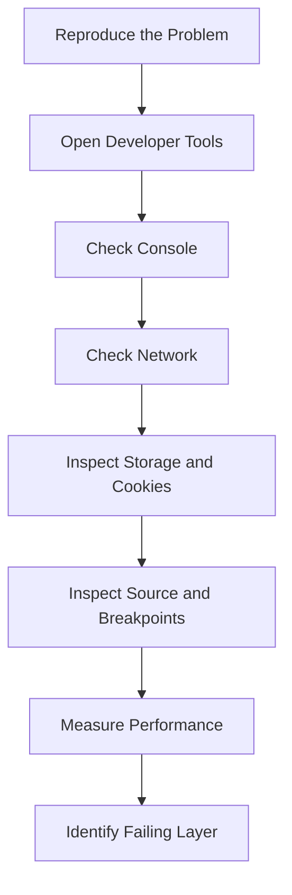

A practical workflow:

```text
1. Open Developer Tools.
2. Clear old Console messages.
3. Open the Network panel.
4. Enable Preserve log if navigation is involved.
5. Perform one controlled action.
6. Find the relevant request.
7. Inspect the request and response.
8. Check the Console for related errors.
9. Inspect cookies and storage if authentication is involved.
10. Use Sources if the request was never created.
11. Measure timing if the request is slow.
```

---

# 4. Docking and Layout

Developer Tools can often be docked:

- Bottom of the browser
- Right side
- Left side
- Separate window

A separate window may provide more space for:

- Network tables
- Large response bodies
- Source code
- Performance recordings

Use the layout that makes the current task easiest.

---

# 5. Device Toolbar and Responsive Testing

Developer Tools commonly provide a device toolbar.

It can simulate:

- Mobile widths
- Tablet widths
- Desktop widths
- Device pixel ratios
- Touch input
- Orientation changes
- Mobile network conditions

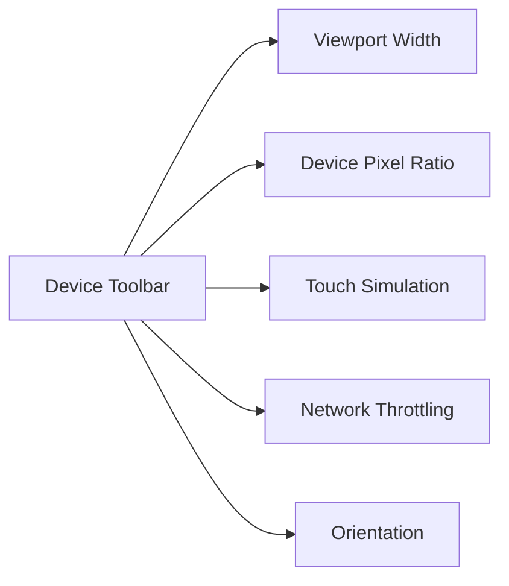

This is useful for testing:

- Responsive layouts
- Mobile navigation
- Touch controls
- Image sizing
- Overflow problems
- Media queries
- Slow connections

Device emulation is useful, but it does not perfectly reproduce every real device characteristic.

---

# 6. Elements Panel

The Elements panel shows the current DOM structure.

Example:

```html
<button class="buy-button">
  Add to cart
</button>
```

The browser may display this as:

```text
button.buy-button
└── "Add to cart"
```

You can inspect:

- Parent and child elements
- Classes
- IDs
- Attributes
- Text content
- Event-related structure
- Accessibility information

---

# 7. Inspecting an Element

To inspect a visible element:

1. Open the Elements panel.
2. Select the element picker icon.
3. Move over an element.
4. Click the element.

The browser highlights the corresponding DOM node.

This helps answer:

- Which element is actually visible?
- Is the click target covered by another element?
- Is the element disabled?
- Which classes are applied?
- Is the content present but hidden?
- Is the layout causing overflow?

---

# 8. Editing HTML Temporarily

You can often edit an element’s HTML directly.

For example:

```html
<button disabled>Add to cart</button>
```

You may remove:

```html
disabled
```

and observe what changes.

This is useful for understanding behavior, but it is not a security bypass in a properly designed application.

A user can modify the browser, so the backend must still enforce permissions.

Temporary DOM edits disappear when the page reloads.

---

# 9. Inspecting Styles

The Styles panel shows which CSS rules apply to an element.

Example:

```css
.button {
  display: flex;
  color: white;
  background: blue;
}
```

You can inspect:

- Matching selectors
- Overridden rules
- Inherited properties
- User-agent styles
- Media query rules
- CSS variables
- Computed values

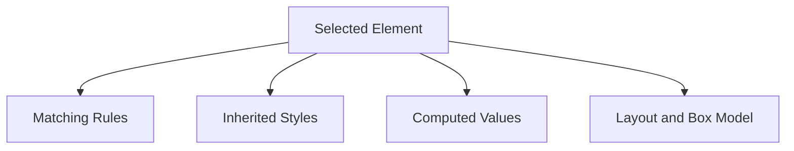

---

# 10. Overridden CSS Rules

If a style is crossed out, another rule is taking precedence.

Example:

```css
color: red; /* crossed out */
color: blue;
```

Possible reasons:

- More specific selector
- Later rule
- Inline style
- `!important`
- Different media query
- Browser style

This helps diagnose:

```text
Why is my CSS rule not working?
```

---

# 11. Computed Styles

Computed styles show the final values the browser uses.

For example:

```text
display: flex
width: 320px
margin-top: 16px
color: rgb(0, 0, 0)
```

This is useful when multiple CSS rules combine through:

- Inheritance
- Cascading
- Variables
- Relative units
- Media queries
- Browser defaults

---

# 12. Box Model Inspection

The box model shows:

```text
Content
Padding
Border
Margin
```

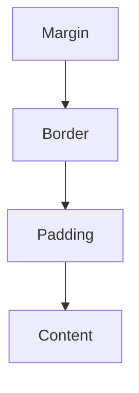

When an element has an unexpected size, inspect:

- Width
- Height
- Padding
- Border
- Margin
- `box-sizing`
- Overflow
- Flex or grid constraints

A common issue is forgetting that padding and borders may affect total size depending on `box-sizing`.

---

# 13. Layout Inspection

Developer Tools may visualize:

- Flexbox containers
- Grid tracks
- Alignment
- Gaps
- Item sizes
- Overflow
- Positioning

This helps debug:

- Misaligned controls
- Unexpected gaps
- Items extending outside containers
- Responsive layout failures
- Grid columns
- Flex shrinking and growing

---

# 14. Element States

You can often force states such as:

```text
:hover
:active
:focus
:visited
```

This is useful for inspecting styles that are difficult to trigger manually.

For example, force:

```text
:hover
```

to inspect a dropdown or tooltip style.

---

# 15. Accessibility Inspection

Developer Tools may display accessibility information such as:

- Accessible name
- Role
- State
- Keyboard focusability
- ARIA attributes
- Contrast information
- Heading structure

A visible button may have no accessible name if it contains only an unlabeled icon.

Example:

```html
<button>
  <svg>...</svg>
</button>
```

A better version might include:

```html
<button aria-label="Close dialog">
  <svg>...</svg>
</button>
```

Accessibility inspection helps connect visual design with how assistive technologies interpret the page.

---

# 16. Console Panel

The Console displays messages generated by:

- The browser
- JavaScript
- Network failures
- Security policies
- CORS restrictions
- Frameworks
- Extensions

Typical messages include:

```text
log
info
warning
error
debug
```

Example:

```javascript
console.log("Loading products");
console.error("Failed to load products");
```

---

# 17. Console Levels

Use filters to focus on:

- Errors
- Warnings
- Info
- Debug
- Verbose

When a feature fails, begin with errors, then inspect warnings.

A warning may not directly break the application, but it may indicate:

- Deprecated behavior
- Missing source maps
- Security problems
- Performance issues
- Invalid HTML
- CORS configuration problems

---

# 18. Common Console Errors

## JavaScript exception

```text
Uncaught TypeError: Cannot read properties of undefined
```

Likely causes:

- Unexpected response shape
- Missing object property
- Incorrect initialization
- Race condition
- Failed API data handling

## Network error

```text
Failed to fetch
```

Possible causes:

- DNS failure
- CORS
- TLS
- Offline device
- Blocked request
- Connection failure

## CORS error

```text
Access to fetch at ... has been blocked by CORS policy
```

Possible causes:

- Missing allowed origin
- Failed preflight
- Missing allowed headers
- Credential configuration mismatch

## Mixed-content error

```text
Mixed Content: The page was loaded over HTTPS...
```

Possible cause:

- HTTPS page requesting an HTTP resource

---

# 19. Executing JavaScript in the Console

You can evaluate JavaScript:

```javascript
document.title
```

Inspect the current URL:

```javascript
location.href
```

Find an element:

```javascript
document.querySelector("button")
```

Count elements:

```javascript
document.querySelectorAll("button").length
```

Inspect local storage:

```javascript
localStorage
```

Inspect cookies:

```javascript
document.cookie
```

Remember that `HttpOnly` cookies do not appear through `document.cookie`.

---

# 20. Console Safety

Do not paste unknown code into the Console.

Malicious instructions may ask you to paste code that:

- Steals session information
- Changes account details
- Performs unauthorized actions
- Sends private data to an attacker
- Installs harmful scripts

Developer Tools execute code with access to the current page context.

Treat the Console like a powerful terminal.

---

# 21. Network Panel Overview

The Network panel records requests made by the browser.

It can show:

- Documents
- Scripts
- Stylesheets
- Images
- Fonts
- Fetch requests
- XHR requests
- WebSockets
- Media
- Manifest files
- Other resources

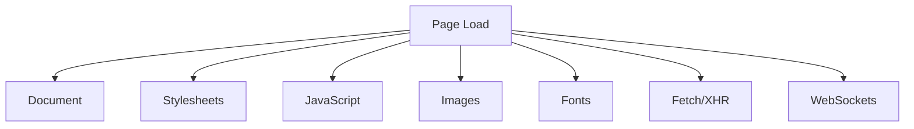

---

# 22. Preserve Log

Enable **Preserve log** when requests may disappear during navigation.

Useful for:

- Login redirects
- Logout flows
- Form submissions
- Page navigation
- Redirect loops
- Requests made before a page unloads

Without this option, navigating away may clear the most important evidence.

---

# 23. Disable Cache

Enable **Disable cache** when testing:

- Fresh page loads
- Asset changes
- Cache-control behavior
- Deployment updates
- Whether a request is truly reaching the server

This option usually applies while Developer Tools are open.

Remember:

```text
Developer Tools cache settings can change observed behavior.
```

Also test under normal caching conditions.

---

# 24. Clear Network Requests

Use the clear button before reproducing a specific issue.

A clean request list makes it easier to identify:

- The request caused by one click
- Redirects
- Repeated requests
- Unexpected background traffic
- Failed resources

A reliable workflow is:

```text
Clear
Perform one action
Inspect new requests
```

---

# 25. Network Request Filters

Filter by type:

```text
Fetch/XHR
Doc
JS
CSS
Img
Font
Media
WS
```

Filter by text:

```text
api
orders
products
graphql
```

Filter by status:

```text
404
500
```

Filter by domain:

```text
api.example.com
```

The exact filter syntax varies by browser.

---

# 26. Network Request Columns

Common columns include:

| Column | Meaning |
|---|---|
| Name | Resource name or path |
| Status | HTTP status code |
| Method | `GET`, `POST`, etc. |
| Domain | Host receiving the request |
| Type | Fetch, XHR, script, image, and so on |
| Initiator | What caused the request |
| Size | Transferred or decoded size |
| Time | Total request time |
| Waterfall | Timeline visualization |

Start by checking:

```text
Name
Status
Method
Type
Time
```

---

# 27. Request URL Inspection

Open a request and inspect:

```text
Request URL
Request Method
Status Code
Remote Address
Referrer Policy
```

Verify:

- Correct scheme
- Correct host
- Correct port
- Correct path
- Correct query string
- Correct environment

A common issue is:

```text
Frontend is running locally.
Request accidentally points to production.
```

Or:

```text
Frontend expects /api/orders.
Request uses /api/order.
```

---

# 28. Request Method Inspection

Check whether the method matches the intended operation.

Examples:

```text
GET    /products
POST   /orders
PATCH  /users/42
DELETE /cart/items/123
```

A wrong method may produce:

```text
405 Method Not Allowed
```

or may trigger unintended behavior if the server supports multiple interpretations.

---

# 29. Query Parameter Inspection

Inspect the query section separately.

Example:

```text
/products?category=keyboards&page=2
```

Verify:

```text
category = keyboards
page = 2
```

Look for:

- Missing parameters
- Incorrect parameter names
- Incorrect values
- Empty parameters
- Incorrect encoding
- Repeated parameters
- Unexpected tracking parameters

---

# 30. Request Headers Inspection

Important request headers include:

```http
Accept
Authorization
Content-Type
Cookie
Origin
Referer
User-Agent
Accept-Encoding
Cache-Control
```

Questions to ask:

```text
Is authentication present?
Is the body format declared correctly?
Is the request coming from the expected origin?
Are cookies included?
Is the client requesting JSON or HTML?
```

---

# 31. Request Payload Inspection

For a state-changing request, inspect:

```json
{
  "productId": 123,
  "quantity": 2
}
```

Check:

- Field names
- Types
- Missing values
- Unexpected nulls
- Incorrect nesting
- Client-calculated values
- Large payload size

Example problem:

```json
{
  "quantity": "2"
}
```

when the API expects:

```json
{
  "quantity": 2
}
```

---

# 32. Response Headers Inspection

Important response headers include:

```http
Content-Type
Cache-Control
Set-Cookie
Location
ETag
Access-Control-Allow-Origin
Content-Encoding
Strict-Transport-Security
Content-Security-Policy
```

Questions to ask:

```text
Is the response really JSON?
Was the response cached?
Did the server set a session cookie?
Was the request redirected?
Did the server permit the origin?
Was the response compressed?
```

---

# 33. Response Body Inspection

Inspect the body using:

- Preview
- Response
- Raw view

Check whether:

- The expected fields exist
- The response is empty
- The response is HTML instead of JSON
- An error object is present
- The response contains stale data
- The body is too large
- The format is valid

A `200` response with the wrong body can still break the frontend.

---

# 34. The “HTML Instead of JSON” Problem

Frontend code:

```javascript
const response = await fetch("/api/products");
const data = await response.json();
```

Actual response:

```html
<!doctype html>
<html>
  <body>
    <h1>Not Found</h1>
  </body>
</html>
```

Possible causes:

- Wrong API route
- Web server fallback
- Authentication redirect
- Reverse proxy misconfiguration
- Incorrect base URL
- Development server serving the application shell

The Network panel reveals the actual response.

---

# 35. Status Filtering

Filter requests by status to find failures:

```text
404
401
403
422
429
500
502
503
504
```

You can often identify a broken page quickly by scanning for red or failed rows.

Do not ignore successful-looking requests with incorrect response bodies.

---

# 36. Timing Details

Timing panels commonly display:

```text
Queueing
Stalled
DNS Lookup
Initial Connection
SSL
Request Sent
Waiting for Server Response
Content Download
```

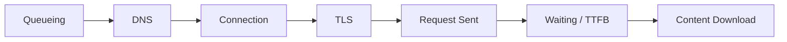

---

# 37. High DNS Time

Possible causes:

- Empty DNS cache
- Slow resolver
- Network problems
- Third-party domain lookup
- DNS provider issue

If the delay appears only on the first request to a domain, caching may explain the difference.

---

# 38. High Connection Time

Possible causes:

- Geographic distance
- Network congestion
- Server overload
- Firewall behavior
- Routing issues
- Cold connection
- Connection setup overhead

Compare:

```text
First request
Later request using connection reuse
```

---

# 39. High TLS Time

Possible causes:

- New HTTPS connection
- Long network distance
- Certificate chain processing
- Protocol negotiation
- Lack of connection reuse
- TLS configuration problems

A TLS failure may prevent any HTTP request from being sent.

---

# 40. High TTFB

High Time to First Byte often indicates delay before the server begins responding.

Possible causes:

- Slow backend logic
- Slow database query
- Cache miss
- External API call
- Server queueing
- Cold start
- Application overload

A useful sequence:

```text
Request arrives
  ↓
Server waits
  ↓
Database or dependency runs
  ↓
First response byte arrives
```

---

# 41. Long Content Download

A request may have a fast TTFB but a long download period.

Possible causes:

- Large response
- Large image
- Slow connection
- Missing compression
- Streaming response
- Large JavaScript bundle

Inspect:

```text
Transferred size
Decoded size
Content-Encoding
Download speed
```

---

# 42. Waterfall Analysis

The waterfall shows when requests start and finish.

Look for:

- Long blank periods
- Serial requests
- Repeated requests
- Large blocking files
- Slow third-party domains
- API calls that begin too late
- Resources waiting on one another

```text
HTML       |████████
CSS          |███
JavaScript  |████████
API                |██████████
Image                 |████
```

A page can be slow because too many requests are serialized.

---

# 43. Initiator Inspection

The initiator explains what caused the request.

Possible initiators:

- HTML
- CSS
- JavaScript
- User action
- Another request
- Framework component
- Service worker

If requests repeat unexpectedly, the initiator may reveal:

- A render loop
- A polling loop
- A repeated effect
- A third-party script
- A service worker
- A redirect

---

# 44. Copy as cURL

Most browsers allow:

```text
Right-click request
→ Copy
→ Copy as cURL
```

Then:

1. Paste into a terminal.
2. Remove unnecessary headers.
3. Redact secrets.
4. Run the request.
5. Compare the result with the browser.

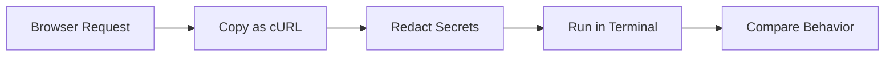

This separates browser behavior from backend behavior.

---

# 45. Replay Request

Some browsers allow you to replay a request.

This can help determine whether:

- The failure is repeatable
- The server response changes
- The operation is idempotent
- The issue depends on timing
- A request body is malformed

Be careful replaying state-changing requests such as:

```http
POST /orders
POST /payments
DELETE /users/42
```

Replay may create duplicate or destructive operations.

---

# 46. Cookies and Storage Panel

The Application or Storage panel commonly exposes:

```text
Cookies
Local Storage
Session Storage
IndexedDB
Cache Storage
Service Workers
```

These are useful for diagnosing:

- Authentication
- Preferences
- Stale data
- Offline behavior
- Service worker interception
- Client-side application state

---

# 47. Inspecting Cookies

Inspect:

- Name
- Value
- Domain
- Path
- Expiration
- `Secure`
- `HttpOnly`
- `SameSite`

Questions:

```text
Was the session cookie created?
Is it for the correct domain?
Is the path correct?
Is it expired?
Is Secure preventing HTTP transmission?
Is SameSite affecting cross-site requests?
```

---

# 48. Local Storage

Local storage can contain:

- Theme preference
- Feature flags
- Cached application state
- Draft form data
- Non-sensitive identifiers

Example:

```javascript
localStorage.setItem("theme", "dark");
```

Inspect it through:

```text
Application → Local Storage
```

Do not assume local storage is private. JavaScript can usually read it, and malicious script running in the origin may also access it.

---

# 49. Session Storage

Session storage is similar to local storage but generally scoped to a browser tab or session.

Possible uses:

- Temporary form state
- Current workflow data
- Tab-specific selections
- Short-lived UI state

It should not be treated as a secure secret store.

---

# 50. IndexedDB

IndexedDB is a browser database for larger structured client-side data.

It may store:

- Offline records
- Drafts
- Cached application data
- Large structured objects
- Queued offline operations

Inspecting IndexedDB can help determine whether stale or unexpected client data is affecting the interface.

---

# 51. Service Workers

A service worker can intercept network requests.

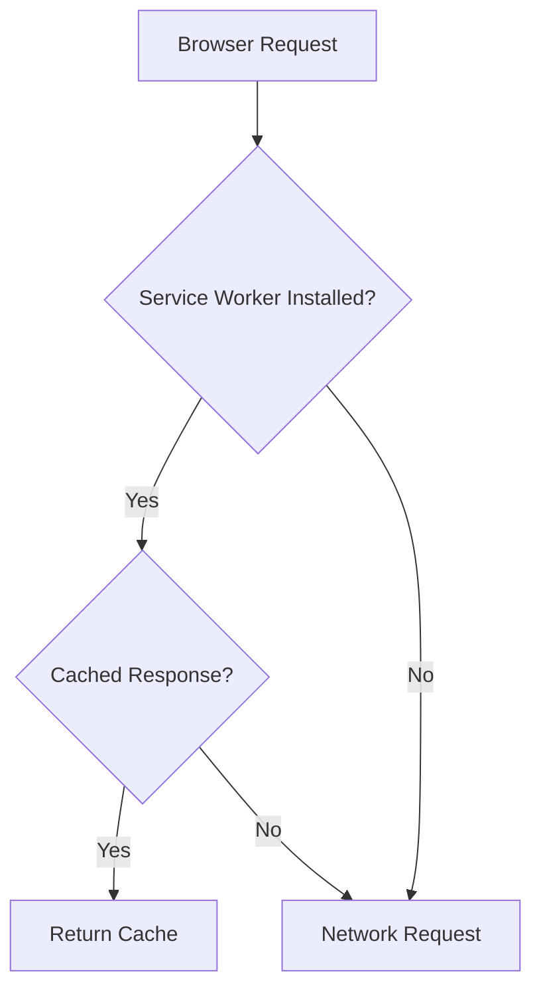

Service workers can support:

- Offline applications
- Background synchronization
- Push notifications
- Caching strategies
- Resource interception

They can also confuse debugging because a response may come from cache rather than the network.

---

# 52. Clearing Service Worker State

When an application appears stuck on old content, inspect:

- Service worker registration
- Cache storage
- Active worker
- Scope
- Update status

Possible debugging actions include:

- Unregister service worker
- Clear cache storage
- Reload
- Disable cache
- Test in a private window

Be careful when clearing storage because it may log you out or remove local drafts.

---

# 53. Security Panel

The Security panel can help inspect:

- HTTPS status
- Certificate validity
- TLS protocol
- Certificate issuer
- Mixed content
- Secure origin status

A secure page should generally show:

```text
HTTPS
Valid certificate
No blocked insecure content
Expected hostname
```

---

# 54. Mixed Content

Mixed content occurs when an HTTPS page requests an HTTP resource.

Example:

```text
Page:
https://example.com

Script:
http://example.com/app.js
```

The browser may block the insecure resource.

Mixed content can affect:

- Scripts
- Stylesheets
- Images
- Fonts
- API requests
- Frames

Scripts and other active content are especially dangerous because an attacker could modify them.

---

# 55. Certificate Inspection

Inspect:

- Subject
- Issuer
- Expiration
- Hostname coverage
- Certificate chain
- TLS version
- Cipher information

Certificate problems may result from:

- Expiration
- Hostname mismatch
- Untrusted issuer
- Missing intermediate certificate
- Incorrect system clock
- Intercepting proxy
- Self-signed certificate

---

# 56. Sources Panel

The Sources panel lets you inspect loaded source files.

Common uses:

- Set breakpoints
- Pause JavaScript
- Step through execution
- Inspect variables
- View call stacks
- Set conditional breakpoints
- Add watch expressions

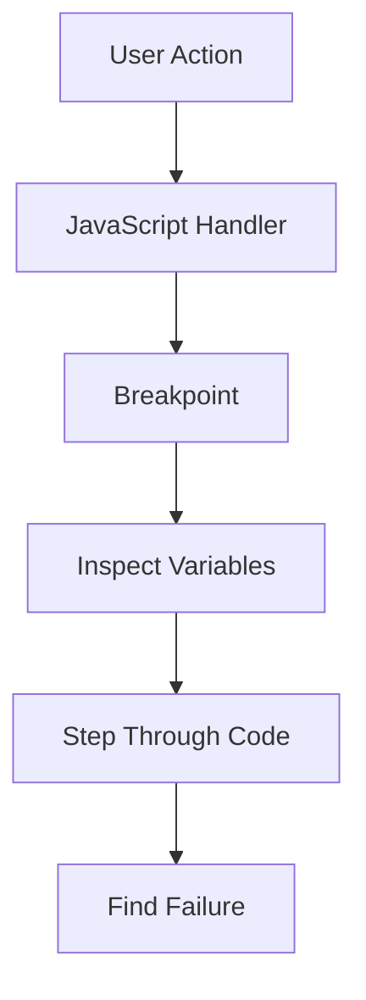

---

# 57. Breakpoints

A breakpoint pauses execution at a specific line.

When paused, inspect:

- Local variables
- Function arguments
- Call stack
- Scope
- Current line
- Network-related values

Breakpoints are useful when:

- A request is not created
- A response is parsed incorrectly
- State changes unexpectedly
- A click handler behaves incorrectly
- A condition happens only sometimes

---

# 58. Conditional Breakpoints

A conditional breakpoint pauses only when an expression is true.

Example condition:

```javascript
productId === 123
```

This is useful inside loops or frequently executed functions.

It avoids stopping on every execution.

---

# 59. Event Listener Breakpoints

Developer Tools may allow pausing when events occur:

- Click
- Submit
- Keyboard input
- Mouse movement
- Timer
- Fetch
- XHR
- Animation
- Clipboard action

This helps identify which code responds to an interaction.

---

# 60. Network Breakpoints

Some browsers allow pausing when a request URL matches a pattern.

For example:

```text
/api/orders
```

This can help inspect the exact code that creates the request.

---

# 61. Source Maps

Production JavaScript may be bundled and minified:

```text
app.abc123.min.js
```

Source maps allow Developer Tools to display original source files.

Without source maps, debugging may be harder because:

- Variable names are shortened
- Files are combined
- Formatting is compressed
- Source structure is obscured

Source maps can expose original source code, so production applications should consider whether they should be publicly available.

---

# 62. Performance Panel

The Performance panel records activity over time.

It can show:

- JavaScript execution
- Style recalculation
- Layout
- Paint
- Compositing
- Network activity
- Long tasks
- Frame rate
- Main-thread blocking

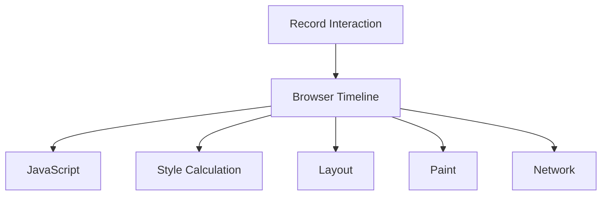

---

# 63. Long Tasks

A long task is a period where the browser’s main thread is busy for too long.

This can make the interface feel frozen.

Possible causes:

- Large JavaScript computation
- Expensive rendering
- Huge JSON parsing
- Complex layout
- Too many DOM operations
- Inefficient loops

Users may experience:

```text
Button clicks delayed
Scrolling stutters
Typing lags
Animations freeze
```

---

# 64. Layout Thrashing

Layout thrashing occurs when JavaScript repeatedly forces the browser to calculate layout while also changing styles.

A problematic pattern conceptually looks like:

```javascript
element.style.width = "100px";
console.log(element.offsetWidth);

element.style.width = "200px";
console.log(element.offsetWidth);
```

Repeated reads and writes can trigger unnecessary layout work.

Group DOM reads and writes where practical.

---

# 65. Performance Metrics

Developer Tools may display metrics related to:

- First Paint
- First Contentful Paint
- Largest Contentful Paint
- Cumulative Layout Shift
- Total Blocking Time
- Interaction to Next Paint

These metrics reflect different aspects of user experience.

---

# 66. First Contentful Paint

First Contentful Paint, or FCP, measures when the browser first displays meaningful content.

Examples:

- Text
- Image
- Canvas
- Non-white visual content

A blank page followed by a late display usually indicates poor initial rendering performance.

---

# 67. Largest Contentful Paint

Largest Contentful Paint, or LCP, measures when the main visible content has loaded.

The largest element may be:

- Hero image
- Main heading
- Product image
- Article content block

LCP can be affected by:

- Slow server response
- Large images
- Render-blocking CSS
- JavaScript delays
- Font loading

---

# 68. Cumulative Layout Shift

Cumulative Layout Shift, or CLS, measures unexpected movement of page content.

Example:

```text
User tries to click a button.
An image loads above it.
The button moves.
The user clicks something else.
```

Common causes:

- Images without dimensions
- Ads inserted without reserved space
- Late-loading fonts
- Dynamic content
- Client-side rendering changes

Reserve space for content that will load later.

---

# 69. Network Throttling

Use network throttling to simulate:

- Slow 3G
- Fast 3G
- Offline mode
- Custom latency
- Limited bandwidth

Test whether the application:

- Shows loading indicators
- Handles timeouts
- Preserves input
- Displays errors clearly
- Retries appropriately
- Avoids blank screens

---

# 70. CPU Throttling

CPU throttling simulates slower devices.

This is important because a powerful development machine may hide expensive JavaScript.

Test:

- Startup time
- Input responsiveness
- Rendering
- Search filtering
- Large list rendering
- Animations
- Data parsing

---

# 71. Performance and Network Together

A slow user experience may be caused by:

```text
Slow network
Slow server
Large payload
Slow JavaScript
Expensive rendering
```

Use Network and Performance panels together.

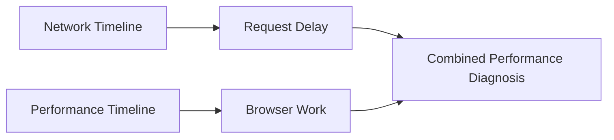

---

# 72. Browser Cache vs CDN Cache vs Service Worker Cache

When content seems stale, identify which layer served it.

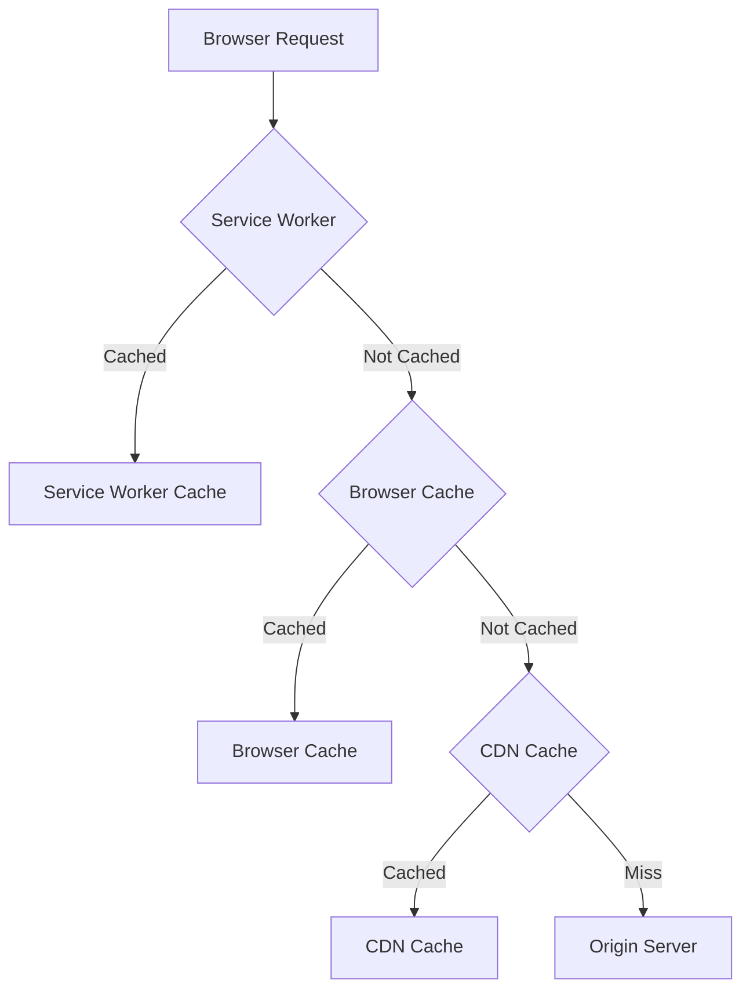

Possible debugging actions:

- Disable browser cache
- Clear site data
- Unregister service worker
- Inspect response headers
- Check CDN cache status
- Add a temporary cache-busting query only for testing

---

# 73. Application State Debugging

When the network response is correct but the interface is wrong, inspect:

- Frontend state
- Component props
- DOM state
- Loading flags
- Error state
- Cached client data
- Race conditions
- Response parsing

A useful sequence:

```text
Request succeeds
  ↓
Response body is correct
  ↓
Frontend parses response
  ↓
State updates
  ↓
Component renders
  ↓
User sees result
```

If the final UI is incorrect, locate which transition failed.

---

# 74. Race Conditions

A race condition can occur when multiple requests finish in an unexpected order.

Example:

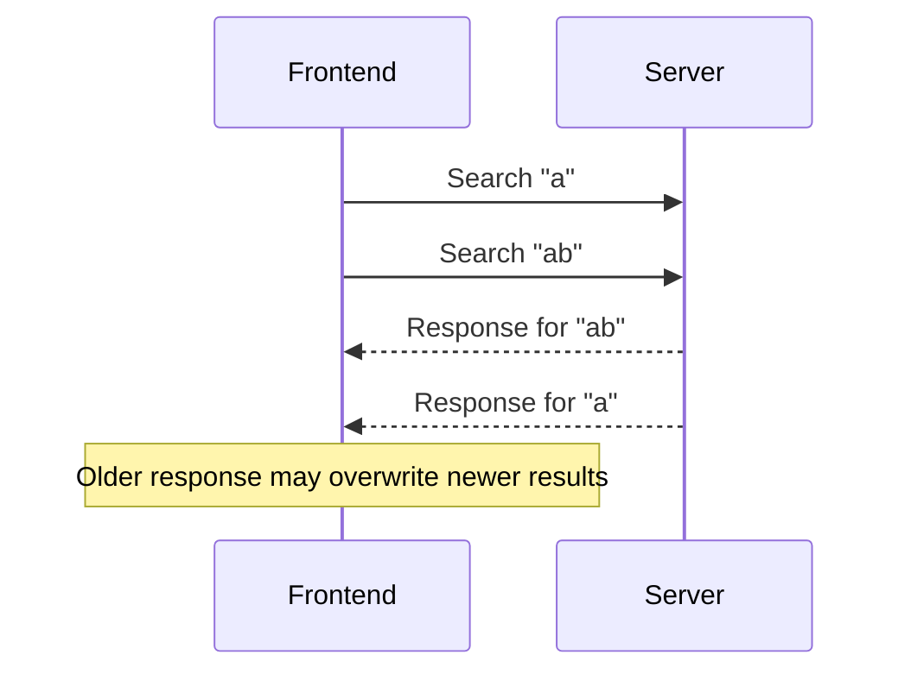

Possible solutions:

- Cancel previous requests
- Track request identifiers
- Ignore stale responses
- Debounce input
- Use sequence numbers

---

# 75. CORS Debugging in DevTools

When a browser blocks a cross-origin request:

1. Inspect the Console error.
2. Inspect the Network panel.
3. Look for an `OPTIONS` request.
4. Check the response status.
5. Inspect CORS response headers.
6. Confirm the origin.
7. Confirm allowed methods.
8. Confirm allowed headers.
9. Check credential configuration.

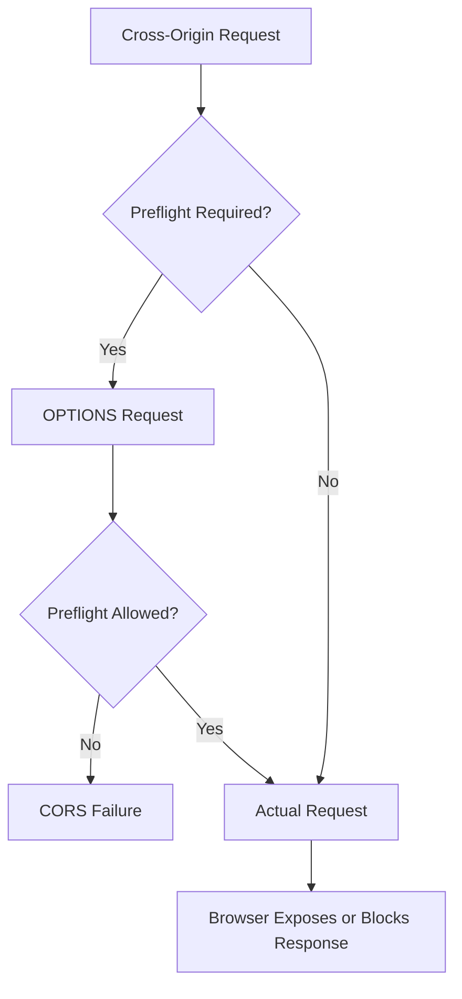

---

# 76. Authentication Debugging in DevTools

Check:

```text
Was the login request successful?
Did the response set a cookie?
Is the cookie stored?
Is the cookie sent later?
Is the Authorization header present?
Is the token expired?
Is the request going to the correct domain?
```

A common sequence:

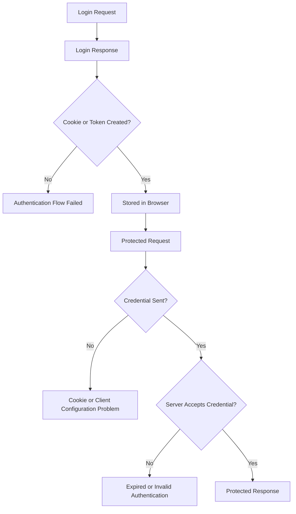

---

# 77. Redirect Debugging

Inspect:

- Status code
- `Location` header
- Redirect count
- Cookies across redirects
- Host changes
- HTTP-to-HTTPS transitions

A login loop may look like:

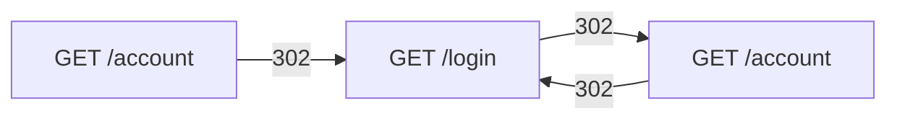

Possible causes:

- Session cookie not stored
- Cookie domain mismatch
- Cookie blocked by SameSite
- Reverse proxy not recognizing HTTPS
- Authentication callback misconfigured

---

# 78. Environment Debugging

Inspect the full request URL.

Look for:

```text
localhost
127.0.0.1
staging
test
production
```

A frontend may accidentally call the wrong environment.

Other differences include:

- API base URL
- Cookie domain
- CORS allowed origins
- Authentication provider
- Database contents
- Feature flags
- TLS certificates
- Backend version

---

# 79. Exporting a HAR File

A HAR file is an HTTP Archive containing recorded network activity.

It may include:

- URLs
- Methods
- Headers
- Timing
- Request bodies
- Response bodies
- Cookies

HAR files can contain sensitive information.

Before sharing one:

```text
Redact cookies
Redact authorization headers
Redact personal data
Redact tokens
Review request and response bodies
```

HAR files are useful for:

- Support tickets
- Reproducing performance issues
- Investigating redirect chains
- Sharing browser traffic evidence

---

# 80. A Complete DevTools Investigation

Suppose clicking “Place order” appears to do nothing.

## Step 1: Console

Check for JavaScript exceptions.

## Step 2: Network

Filter:

```text
Fetch/XHR
```

## Step 3: Perform one click

Find the request:

```http
POST /api/orders
```

## Step 4: Inspect request

Check:

```text
URL
Method
Headers
Cookie or Authorization
Payload
```

## Step 5: Inspect response

Check:

```text
Status
Content-Type
Body
```

## Step 6: Interpret result

```text
No request:
  Frontend event or JavaScript problem.

401:
  Authentication problem.

403:
  Authorization problem.

422:
  Validation problem.

409:
  Inventory or state conflict.

500:
  Backend problem.

201:
  Inspect frontend response handling if UI did not update.
```

## Step 7: Copy as cURL

Reproduce the request manually.

## Step 8: Check server logs

Use request ID if available.

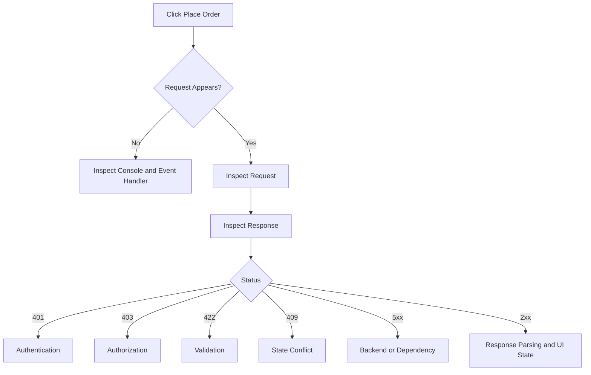

---

# 81. DevTools Best Practices

```text
[ ] Clear old messages before reproducing.
[ ] Preserve logs for navigation flows.
[ ] Use one controlled action.
[ ] Filter to the relevant request type.
[ ] Inspect both request and response.
[ ] Check timing when performance is involved.
[ ] Inspect cookies for authentication problems.
[ ] Reproduce with cURL when possible.
[ ] Redact sensitive data before sharing.
[ ] Test under slow network conditions.
[ ] Check service workers and caches when content is stale.
```

---

# 82. Final DevTools Mental Model

Developer Tools let you inspect the browser at several levels:

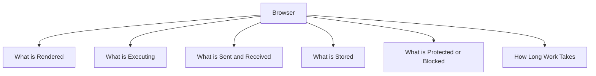

Use the panels according to the question:

```text
The element looks wrong:
  Elements

The button causes an exception:
  Console and Sources

The API call fails:
  Network

The user appears logged out:
  Application and Network

The page is slow:
  Network and Performance

HTTPS or CORS is failing:
  Security, Console, and Network

Old content is appearing:
  Network, Application, Cache Storage, Service Workers
```

The most valuable habit is:

> Observe what the browser actually did before deciding what the code should have done.
