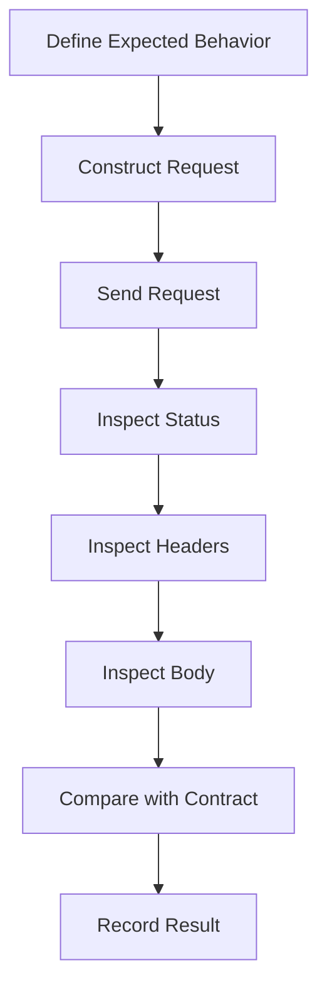
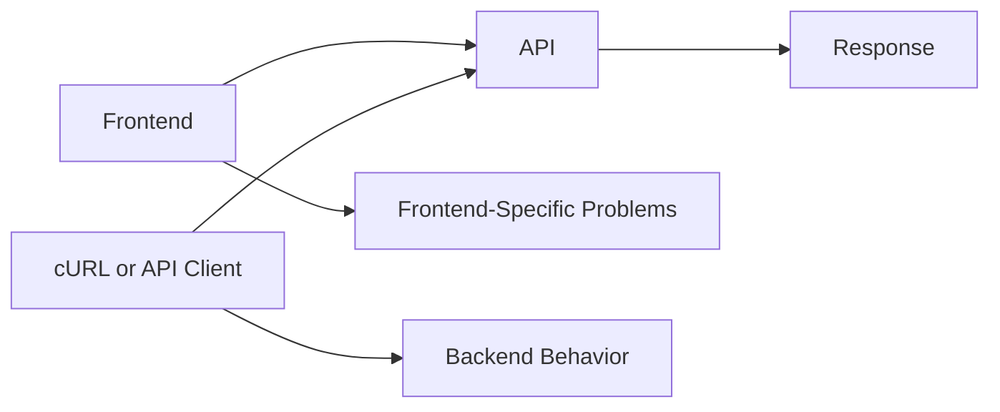
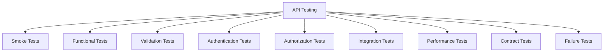
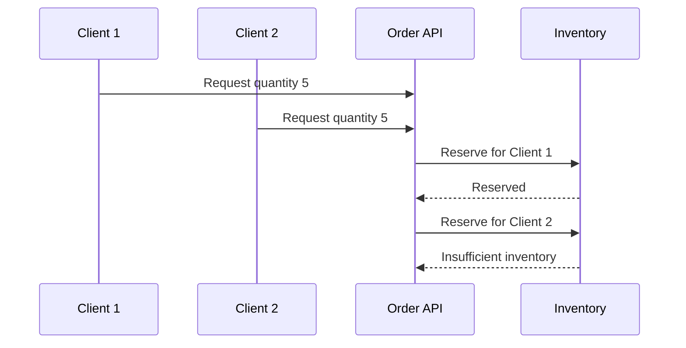
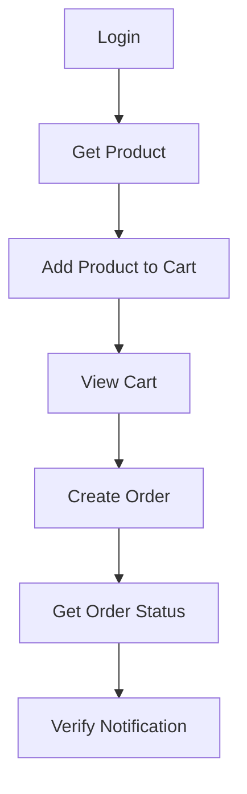
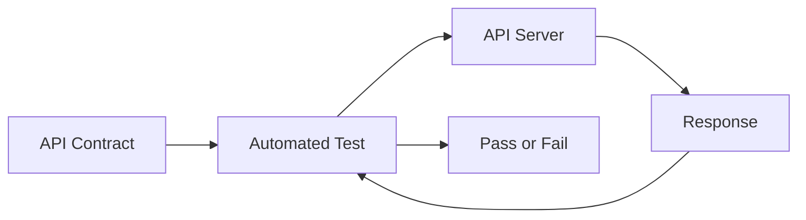
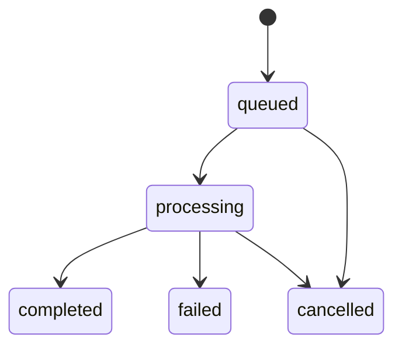
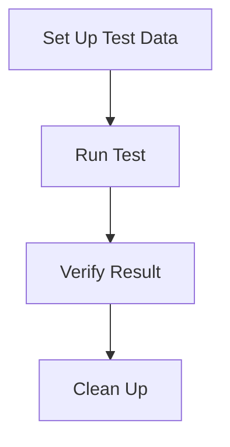
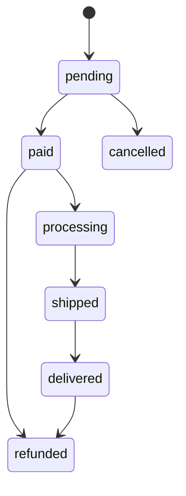
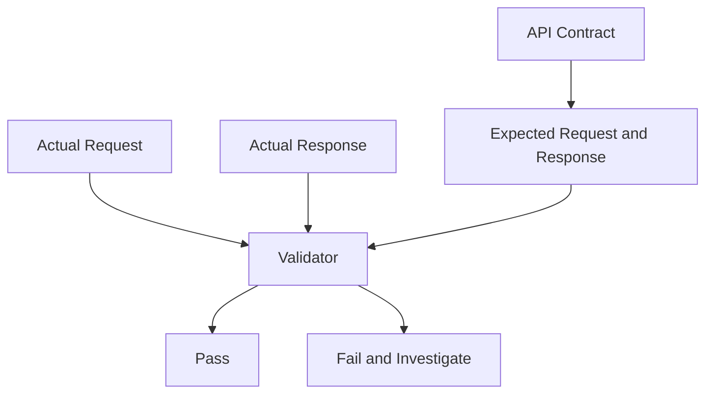

# Appendix G — API Testing Examples  
## Testing REST, GraphQL, Authentication, Errors, Workflows, and Contracts Without Building a UI

API testing means sending requests directly to an API and inspecting the results.

Instead of clicking buttons in a browser, you can test the backend independently using:

- cURL
- Postman
- Bruno
- Browser `fetch`
- Python
- Automated test frameworks
- CI/CD pipelines

This is useful because it separates several concerns:

```text
Frontend behavior
from
API behavior
from
Database behavior
from
External service behavior
```

A basic API testing workflow looks like this:



---

# 1. Why Test an API Independently?

Suppose a “Load Products” button fails.

If you test only through the browser, the failure could come from:

- A broken click handler
- Incorrect frontend URL
- Missing authentication
- CORS
- API routing
- Backend validation
- Database failure
- Incorrect response parsing
- UI state management

By testing the API directly, you can isolate the backend.



If cURL and Postman both fail, the issue is probably not the UI.

If cURL succeeds but the browser fails, investigate:

- Frontend request construction
- Cookies
- CORS
- Browser security policies
- Response parsing
- Environment configuration

---

# 2. The Example API

Throughout this appendix, we will use an imaginary online-store API:

```text
Base URL:
https://api.shop.example.com
```

Resources:

```text
Products
Categories
Users
Cart
Orders
```

Example endpoints:

```text
GET    /api/products
GET    /api/products/123
POST   /api/products
PATCH  /api/products/123
DELETE /api/products/123

GET    /api/cart
POST   /api/cart/items
PATCH  /api/cart/items/123
DELETE /api/cart/items/123

GET    /api/orders
GET    /api/orders/9001
POST   /api/orders
```

The exact host is illustrative. The commands will not work unless an equivalent API exists.

---

# 3. API Testing Layers

API testing can happen at several levels.



## Smoke testing

Checks whether the API is reachable and basically functioning.

## Functional testing

Checks whether an operation produces the expected result.

## Validation testing

Checks how the API handles invalid input.

## Authentication testing

Checks missing, invalid, expired, and valid credentials.

## Authorization testing

Checks whether users can access only permitted resources.

## Integration testing

Checks communication with databases and external services.

## Performance testing

Checks behavior under latency, volume, and concurrency.

## Contract testing

Checks that the API matches its documented schema and behavior.

## Failure testing

Checks how the API responds when dependencies fail.

---

# 4. Request Anatomy for API Testing

Every test should explicitly define:

```text
Method
URL
Path parameters
Query parameters
Headers
Authentication
Request body
Expected status
Expected response
```

Example:

```text
Method:
  POST

URL:
  https://api.shop.example.com/api/orders

Headers:
  Accept: application/json
  Content-Type: application/json
  Authorization: Bearer token

Body:
  {
    "items": [
      {
        "productId": 123,
        "quantity": 2
      }
    ]
  }

Expected status:
  201 Created
```

---

# 5. Testing a Basic GET Request

## cURL

```bash
curl \
  -i \
  -H "Accept: application/json" \
  https://api.shop.example.com/api/products
```

Expected response:

```http
HTTP/1.1 200 OK
Content-Type: application/json
```

```json
{
  "items": [
    {
      "id": 123,
      "name": "Mechanical Keyboard",
      "price": 79.99
    }
  ]
}
```

## What to inspect

```text
Status code:
  Is it 200?

Content-Type:
  Is it application/json?

Body:
  Is items an array?

Data:
  Do product fields exist?

Timing:
  Is the response acceptably fast?
```

---

# 6. Testing an Individual Resource

```bash
curl \
  -i \
  -H "Accept: application/json" \
  https://api.shop.example.com/api/products/123
```

Expected success:

```http
HTTP/1.1 200 OK
Content-Type: application/json
```

```json
{
  "id": 123,
  "name": "Mechanical Keyboard",
  "price": 79.99,
  "available": true
}
```

---

# 7. Testing a Missing Resource

```bash
curl \
  -i \
  https://api.shop.example.com/api/products/999999
```

Expected result:

```http
HTTP/1.1 404 Not Found
Content-Type: application/json
```

```json
{
  "error": {
    "code": "PRODUCT_NOT_FOUND",
    "message": "The requested product could not be found."
  }
}
```

This test verifies that the API handles missing resources intentionally rather than crashing.

---

# 8. Testing Query Parameters

```bash
curl -G \
  -i \
  https://api.shop.example.com/api/products \
  --data-urlencode "category=keyboards" \
  --data-urlencode "available=true" \
  --data-urlencode "page=1" \
  --data-urlencode "limit=20"
```

The final URL is conceptually:

```text
/api/products?category=keyboards&available=true&page=1&limit=20
```

Inspect whether:

- The server applies the filters
- Pagination metadata is returned
- Invalid values are rejected
- Unknown parameters are ignored or rejected according to the contract

---

# 9. Testing Pagination

## Page-based pagination

```bash
curl -G \
  https://api.shop.example.com/api/products \
  --data-urlencode "page=2" \
  --data-urlencode "limit=20"
```

Possible response:

```json
{
  "items": [],
  "page": 2,
  "limit": 20,
  "total": 87,
  "totalPages": 5
}
```

## Cursor-based pagination

```bash
curl -G \
  https://api.shop.example.com/api/products \
  --data-urlencode "limit=20" \
  --data-urlencode "after=cursor_abc123"
```

Possible response:

```json
{
  "items": [],
  "nextCursor": "cursor_def456"
}
```

Test:

- First page
- Empty page
- Last page
- Invalid page number
- Excessive limit
- Invalid cursor
- Repeated cursor
- Sorting combined with pagination

---

# 10. Testing Sorting

```bash
curl -G \
  https://api.shop.example.com/api/products \
  --data-urlencode "sort=price" \
  --data-urlencode "order=asc"
```

Test both directions:

```bash
curl -G \
  https://api.shop.example.com/api/products \
  --data-urlencode "sort=price" \
  --data-urlencode "order=desc"
```

Test unsupported fields:

```bash
curl -G \
  -i \
  https://api.shop.example.com/api/products \
  --data-urlencode "sort=internalDatabasePassword"
```

A secure API should not blindly pass arbitrary sort values into database queries.

---

# 11. Testing Search

```bash
curl -G \
  -i \
  https://api.shop.example.com/api/products/search \
  --data-urlencode "q=mechanical keyboard" \
  --data-urlencode "limit=20"
```

Test:

```text
Normal query
Empty query
Very long query
Special characters
Unicode
No results
Many results
Case differences
```

Possible empty result:

```http
HTTP/1.1 200 OK
Content-Type: application/json
```

```json
{
  "items": [],
  "total": 0
}
```

An empty result is often a successful search, not a `404`.

---

# 12. Testing POST Requests

A `POST` request commonly submits data or creates a resource.

```bash
curl \
  -i \
  -X POST \
  -H "Accept: application/json" \
  -H "Content-Type: application/json" \
  -d '{
    "name": "Wireless Mouse",
    "price": 29.99,
    "available": true
  }' \
  https://api.shop.example.com/api/products
```

Expected result:

```http
HTTP/1.1 201 Created
Location: /api/products/456
Content-Type: application/json
```

```json
{
  "id": 456,
  "name": "Wireless Mouse",
  "price": 29.99,
  "available": true
}
```

---

# 13. Testing PUT Requests

A `PUT` request commonly replaces a resource.

```bash
curl \
  -i \
  -X PUT \
  -H "Content-Type: application/json" \
  -d '{
    "name": "Wireless Mouse",
    "price": 27.99,
    "available": true
  }' \
  https://api.shop.example.com/api/products/456
```

Test whether:

- All required fields are required
- Missing fields are cleared or rejected
- Repeating the request produces the same final state
- The resource is created if it does not exist, if supported

---

# 14. Testing PATCH Requests

A `PATCH` request commonly changes only selected fields.

```bash
curl \
  -i \
  -X PATCH \
  -H "Content-Type: application/json" \
  -d '{
    "price": 24.99
  }' \
  https://api.shop.example.com/api/products/456
```

Verify that:

```text
Price changes.
Name remains unchanged.
Availability remains unchanged.
```

Test:

- Empty patch body
- Unknown fields
- Read-only fields
- Invalid types
- Null values
- Unauthorized field changes

---

# 15. Testing DELETE Requests

```bash
curl \
  -i \
  -X DELETE \
  https://api.shop.example.com/api/products/456
```

Possible success:

```http
HTTP/1.1 204 No Content
```

Or:

```http
HTTP/1.1 200 OK
Content-Type: application/json

{
  "deleted": true,
  "id": 456
}
```

Test repeating the deletion.

Possible interpretations:

```text
First request:
  204 No Content

Second request:
  404 Not Found
```

or:

```text
Both requests:
  204 No Content
```

The API contract should define the expected behavior.

---

# 16. Testing JSON Validation

Send invalid JSON:

```bash
curl \
  -i \
  -X POST \
  -H "Content-Type: application/json" \
  -d '{"name":' \
  https://api.shop.example.com/api/products
```

Expected result:

```http
HTTP/1.1 400 Bad Request
```

Send valid JSON with invalid values:

```bash
curl \
  -i \
  -X POST \
  -H "Content-Type: application/json" \
  -d '{
    "name": "",
    "price": -10
  }' \
  https://api.shop.example.com/api/products
```

Expected result:

```http
HTTP/1.1 422 Unprocessable Content
```

Possible response:

```json
{
  "error": {
    "code": "VALIDATION_FAILED",
    "fields": {
      "name": "Name is required.",
      "price": "Price must be greater than zero."
    }
  }
}
```

---

# 17. Validation Test Matrix

Create a test matrix:

| Field | Missing | Wrong type | Empty | Invalid range | Valid |
|---|---:|---:|---:|---:|---:|
| `name` | Test | Test | Test | N/A | Test |
| `price` | Test | Test | Test | Test | Test |
| `quantity` | Test | Test | Test | Test | Test |
| `email` | Test | Test | Test | N/A | Test |

This prevents testing only the happy path.

---

# 18. Testing Authentication

## Request without credentials

```bash
curl \
  -i \
  https://api.shop.example.com/api/account
```

Expected:

```http
HTTP/1.1 401 Unauthorized
```

## Request with invalid token

```bash
curl \
  -i \
  -H "Authorization: Bearer invalid-token" \
  https://api.shop.example.com/api/account
```

Expected:

```http
HTTP/1.1 401 Unauthorized
```

## Request with valid token

```bash
curl \
  -i \
  -H "Authorization: Bearer REDACTED" \
  https://api.shop.example.com/api/account
```

Expected:

```http
HTTP/1.1 200 OK
```

---

# 19. Testing Authorization

Authentication alone is not enough.

Suppose user `42` owns order `9001`.

Request:

```bash
curl \
  -i \
  -H "Authorization: Bearer USER_42_TOKEN" \
  https://api.shop.example.com/api/orders/9001
```

Expected:

```http
HTTP/1.1 200 OK
```

Now attempt to access another user’s order:

```bash
curl \
  -i \
  -H "Authorization: Bearer USER_42_TOKEN" \
  https://api.shop.example.com/api/orders/9999
```

Expected:

```text
403 Forbidden
```

or, in some security designs:

```text
404 Not Found
```

The key requirement is:

```text
The user must not receive another user’s private data.
```

---

# 20. Authorization Test Matrix

| Caller | Resource owner | Expected |
|---|---|---|
| User A | User A | Allowed |
| User A | User B | Denied |
| Administrator | User A | Depends on policy |
| Unauthenticated | Any private resource | Denied |
| Suspended user | Owned resource | Depends on policy |
| Service account | Internal resource | Depends on scope |

Authorization tests should cover:

- Read
- Create
- Update
- Delete
- Administrative actions
- Organization boundaries
- Resource ownership
- Role changes
- Suspended accounts

---

# 21. Testing Cookies and Sessions

## Login and save cookies

```bash
curl \
  -i \
  -c cookies.txt \
  -X POST \
  -H "Content-Type: application/json" \
  -d '{
    "email": "alex@example.com",
    "password": "REDACTED"
  }' \
  https://api.shop.example.com/api/login
```

## Use stored cookies

```bash
curl \
  -i \
  -b cookies.txt \
  https://api.shop.example.com/api/account
```

Test:

```text
Login succeeds
Cookie is set
Cookie is sent
Protected request succeeds
Logout clears or invalidates session
Expired session returns 401
```

---

# 22. Testing Logout

```bash
curl \
  -i \
  -b cookies.txt \
  -X POST \
  https://api.shop.example.com/api/logout
```

Then test the protected endpoint again:

```bash
curl \
  -i \
  -b cookies.txt \
  https://api.shop.example.com/api/account
```

Expected:

```http
HTTP/1.1 401 Unauthorized
```

A client-side logout that only deletes local state is not necessarily a complete server-side logout.

---

# 23. Testing Order Creation

```bash
curl \
  -i \
  -X POST \
  -H "Accept: application/json" \
  -H "Content-Type: application/json" \
  -H "Authorization: Bearer REDACTED" \
  -H "Idempotency-Key: order-test-001" \
  -d '{
    "items": [
      {
        "productId": 123,
        "quantity": 2
      }
    ]
  }' \
  https://api.shop.example.com/api/orders
```

Expected:

```http
HTTP/1.1 201 Created
```

Possible response:

```json
{
  "id": 9001,
  "status": "pending",
  "total": 159.98
}
```

---

# 24. Testing Idempotency

Send the same request twice with the same key:

```bash
curl \
  -i \
  -X POST \
  -H "Content-Type: application/json" \
  -H "Authorization: Bearer REDACTED" \
  -H "Idempotency-Key: order-test-001" \
  -d '{
    "items": [
      {
        "productId": 123,
        "quantity": 2
      }
    ]
  }' \
  https://api.shop.example.com/api/orders
```

Expected behavior:

```text
First request:
  Creates order 9001

Second request:
  Returns the result for order 9001
  Does not create order 9002
```

This protects against lost responses and safe retries.

---

# 25. Testing Inventory Conflicts

Possible flow:



Expected second response:

```http
HTTP/1.1 409 Conflict
```

This verifies that the backend handles concurrent state changes correctly.

---

# 26. Testing File Uploads

```bash
curl \
  -i \
  -X POST \
  -H "Authorization: Bearer REDACTED" \
  -F "description=Product image" \
  -F "file=@keyboard.jpg" \
  https://api.shop.example.com/api/uploads
```

Test:

```text
Valid image
Unsupported file type
File too large
Empty file
Corrupted file
Unexpected file extension
Malicious file contents
Missing authorization
```

The backend must not trust only the filename or declared content type.

---

# 27. Testing Webhooks

A webhook endpoint may receive:

```http
POST /api/webhooks/payment
```

Example:

```bash
curl \
  -i \
  -X POST \
  -H "Content-Type: application/json" \
  -H "X-Signature: REDACTED" \
  -d '{
    "event": "payment.completed",
    "paymentId": "pay_123",
    "orderId": "9001"
  }' \
  https://api.shop.example.com/api/webhooks/payment
```

Test:

- Valid signature
- Invalid signature
- Missing signature
- Duplicate event
- Unknown event type
- Malformed payload
- Out-of-order event
- Replay of an old event

Webhook handlers should be idempotent because providers may deliver the same event more than once.

---

# 28. Testing GraphQL

GraphQL commonly uses:

```text
POST /graphql
```

Request:

```bash
curl \
  -i \
  -X POST \
  -H "Content-Type: application/json" \
  -H "Accept: application/json" \
  -d '{
    "query": "query { product(id: \"123\") { id name price } }"
  }' \
  https://api.shop.example.com/graphql
```

Response:

```json
{
  "data": {
    "product": {
      "id": "123",
      "name": "Mechanical Keyboard",
      "price": 79.99
    }
  }
}
```

---

# 29. GraphQL Variables

Instead of embedding values directly in the query:

```graphql
query {
  product(id: "123") {
    id
    name
  }
}
```

Use variables:

```graphql
query Product($id: ID!) {
  product(id: $id) {
    id
    name
    price
  }
}
```

cURL body:

```bash
curl \
  -X POST \
  -H "Content-Type: application/json" \
  -d '{
    "query": "query Product($id: ID!) { product(id: $id) { id name price } }",
    "variables": {
      "id": "123"
    }
  }' \
  https://api.shop.example.com/graphql
```

Variables improve:

- Reuse
- Safety
- Readability
- Query caching
- Separation of query structure and values

---

# 30. GraphQL Mutations

```bash
curl \
  -X POST \
  -H "Content-Type: application/json" \
  -H "Authorization: Bearer REDACTED" \
  -d '{
    "query": "mutation CreateOrder($productId: ID!, $quantity: Int!) { createOrder(productId: $productId, quantity: $quantity) { order { id status } } }",
    "variables": {
      "productId": "123",
      "quantity": 2
    }
  }' \
  https://api.shop.example.com/graphql
```

Inspect both:

```json
{
  "data": {},
  "errors": []
}
```

GraphQL may return HTTP `200` while including an `errors` array.

---

# 31. GraphQL Error Testing

Example response:

```json
{
  "data": {
    "product": null
  },
  "errors": [
    {
      "message": "Product not found",
      "path": ["product"]
    }
  ]
}
```

A GraphQL test must inspect:

```text
HTTP status
data
errors
```

Do not assume:

```text
HTTP 200 = Entire operation succeeded
```

---

# 32. Testing JSON-RPC

Example request:

```bash
curl \
  -X POST \
  -H "Content-Type: application/json" \
  -d '{
    "jsonrpc": "2.0",
    "method": "getProduct",
    "params": {
      "id": "123"
    },
    "id": 1
  }' \
  https://api.shop.example.com/rpc
```

Success:

```json
{
  "jsonrpc": "2.0",
  "result": {
    "id": "123",
    "name": "Keyboard"
  },
  "id": 1
}
```

Error:

```json
{
  "jsonrpc": "2.0",
  "error": {
    "code": -32601,
    "message": "Method not found"
  },
  "id": 1
}
```

---

# 33. Testing API Error Behavior

A good API should have deliberate responses for invalid requests.

Test cases:

```text
Missing required field
Wrong data type
Empty string
Negative number
Unknown field
Unknown resource
Missing authentication
Invalid authentication
Insufficient permission
Duplicate resource
Conflict
Rate limit
Large body
Unsupported content type
```

Create an error matrix:

| Scenario | Expected status | Expected error code |
|---|---:|---|
| Invalid JSON | `400` | `MALFORMED_REQUEST` |
| Missing token | `401` | `AUTHENTICATION_REQUIRED` |
| Insufficient permission | `403` | `FORBIDDEN` |
| Missing resource | `404` | `NOT_FOUND` |
| Duplicate value | `409` | `ALREADY_EXISTS` |
| Invalid field | `422` | `VALIDATION_FAILED` |
| Too many requests | `429` | `RATE_LIMITED` |
| Unexpected server failure | `500` | `INTERNAL_ERROR` |

---

# 34. Testing Headers

Use cURL:

```bash
curl \
  -i \
  -H "Accept: application/json" \
  -H "X-Request-ID: test-123" \
  https://api.shop.example.com/api/products
```

Verify:

```text
Content-Type
Cache-Control
ETag
X-Request-ID
Security headers
CORS headers
```

Test incorrect content type:

```bash
curl \
  -i \
  -X POST \
  -H "Content-Type: text/plain" \
  -d '{"name":"Keyboard"}' \
  https://api.shop.example.com/api/products
```

Expected:

```http
415 Unsupported Media Type
```

---

# 35. Testing CORS

A browser may send a preflight request.

Test it manually:

```bash
curl \
  -i \
  -X OPTIONS \
  -H "Origin: https://app.shop.example.com" \
  -H "Access-Control-Request-Method: POST" \
  -H "Access-Control-Request-Headers: Content-Type, Authorization" \
  https://api.shop.example.com/api/orders
```

Inspect:

```http
Access-Control-Allow-Origin
Access-Control-Allow-Methods
Access-Control-Allow-Headers
Access-Control-Allow-Credentials
```

Remember:

```text
cURL does not enforce browser CORS rules.
```

It can reveal how the server responds, but only a browser demonstrates whether frontend JavaScript can read the response.

---

# 36. Testing Rate Limits

A responsible rate-limit test should use a controlled environment.

Example conceptual script:

```bash
for i in $(seq 1 20); do
  curl -s -o /dev/null -w "%{http_code}\n" \
    https://api.shop.example.com/api/products
  sleep 0.2
done
```

Observe:

```text
200
200
200
429
429
```

Check whether the API returns:

```http
Retry-After
```

Do not load-test production without permission.

---

# 37. Testing Timeouts

Use cURL time limits:

```bash
curl \
  --connect-timeout 2 \
  --max-time 5 \
  -i \
  https://api.shop.example.com/api/slow-operation
```

Test whether the client receives a useful error when the server is too slow.

The server should also have timeouts when calling dependencies.

---

# 38. Testing Retries

Do not test retries by blindly repeating destructive requests.

For safe requests:

```bash
curl \
  --retry 3 \
  --retry-delay 2 \
  https://api.shop.example.com/api/products
```

For state-changing requests, use:

```text
Idempotency-Key
```

and verify that repeated requests do not duplicate the operation.

---

# 39. Testing Caching

First request:

```bash
curl \
  -i \
  https://api.shop.example.com/api/products
```

Inspect:

```http
Cache-Control
ETag
Last-Modified
Age
```

Repeat using ETag:

```bash
curl \
  -i \
  -H 'If-None-Match: "products-v5"' \
  https://api.shop.example.com/api/products
```

Expected:

```http
304 Not Modified
```

Test whether private responses are incorrectly cacheable.

---

# 40. Testing Compression

Tell the server that compression is accepted:

```bash
curl \
  -i \
  -H "Accept-Encoding: gzip, br" \
  https://api.shop.example.com/api/products
```

Inspect:

```http
Content-Encoding: br
```

Use cURL’s decompression option where supported:

```bash
curl --compressed https://api.shop.example.com/api/products
```

Compare:

```text
Compressed transfer size
Decoded response size
Response time
```

---

# 41. Testing Health Endpoints

```bash
curl \
  -i \
  https://api.shop.example.com/health
```

Possible response:

```http
HTTP/1.1 200 OK
Content-Type: application/json

{
  "status": "healthy"
}
```

A readiness endpoint may be:

```bash
curl \
  -i \
  https://api.shop.example.com/ready
```

A service can be alive but not ready if:

- Database is unavailable
- Required configuration is missing
- Startup has not completed
- Critical dependency is unavailable

---

# 42. Testing Environments

Create variables:

```bash
DEV_URL="http://localhost:3000"
STAGING_URL="https://staging-api.example.com"
PROD_URL="https://api.example.com"
```

Test the same endpoint:

```bash
curl -i "$DEV_URL/api/products"
curl -i "$STAGING_URL/api/products"
curl -i "$PROD_URL/api/products"
```

Compare:

- Status
- Headers
- Schema
- Data
- Authentication
- CORS
- Timing
- Cache behavior

---

# 43. Postman Request Structure

A Postman request usually contains:

```text
Method
URL
Params
Authorization
Headers
Body
Scripts
Tests
```

Example:

```text
Method:
  POST

URL:
  {{baseUrl}}/api/orders

Headers:
  Accept: application/json
  Content-Type: application/json

Authorization:
  Bearer {{accessToken}}

Body:
  Raw JSON
```

---

# 44. Postman Environments

Create variables such as:

```text
baseUrl
accessToken
userId
productId
orderId
```

Use them:

```text
{{baseUrl}}/api/products/{{productId}}
```

```http
Authorization: Bearer {{accessToken}}
```

Environment variables allow the same collection to work against:

```text
Development
Staging
Production
```

Keep secret values out of shared exports.

---

# 45. Bruno Collections

Bruno uses file-based collections and can be useful when you want API requests stored alongside source code.

A collection may contain:

```text
auth/
  login.bru
products/
  list.bru
  get.bru
orders/
  create.bru
  get.bru
```

Advantages may include:

- Version control
- Local files
- Reviewable request definitions
- Environment support
- Less dependence on a hosted workspace

Never commit real production secrets.

---

# 46. API Workflow Testing

A realistic workflow may be:



Test each step:

```text
Login returns token or cookie.
Product exists.
Cart accepts item.
Cart total is correct.
Order is created once.
Order status is correct.
Notification is queued.
```

A workflow test checks system behavior across multiple endpoints.

---

# 47. API Contract Tests

A contract test verifies that an API matches its agreed interface.

Example expectations:

```text
GET /api/products
  Status: 200
  Content-Type: application/json
  items: array
  Each item contains:
    id
    name
    price
```



Contract tests can detect:

- Removed fields
- Changed types
- Missing headers
- Incorrect status codes
- Broken error formats
- Incompatible pagination

---

# 48. JSON Schema Testing

A JSON schema can describe expected data.

Conceptual schema:

```json
{
  "type": "object",
  "required": ["id", "name", "price"],
  "properties": {
    "id": {
      "type": "integer"
    },
    "name": {
      "type": "string"
    },
    "price": {
      "type": "number"
    }
  }
}
```

A response validator can check whether the API returns the expected structure.

This helps catch integration errors before frontend users encounter them.

---

# 49. Testing Response Types

Check that the server’s response matches the declared type.

Expected:

```http
Content-Type: application/json
```

Actual body:

```html
<h1>Unexpected HTML</h1>
```

This is a contract violation even if the status is `200`.

Test:

```text
Status
Content-Type
Required fields
Field types
Null behavior
Error shape
```

---

# 50. Testing API Version Compatibility

If an API supports:

```text
/api/v1/products
/api/v2/products
```

test both versions:

```bash
curl -i https://api.example.com/api/v1/products
curl -i https://api.example.com/api/v2/products
```

Compare:

- Field names
- Types
- Status codes
- Pagination
- Error behavior
- Authentication
- Deprecation headers

A version should remain stable according to its support policy.

---

# 51. Testing WebSocket APIs

WebSocket testing depends on the client tool.

A conceptual workflow:

```text
1. Connect to WebSocket URL.
2. Authenticate if required.
3. Send a message.
4. Observe server response.
5. Test disconnect.
6. Test reconnect.
7. Test malformed messages.
```

Example WebSocket URL:

```text
wss://api.example.com/realtime
```

Test:

```json
{
  "type": "subscribe",
  "channel": "orders"
}
```

Then observe:

```json
{
  "type": "order.updated",
  "orderId": "9001",
  "status": "shipped"
}
```

---

# 52. Testing Asynchronous APIs

For an asynchronous report:

```http
POST /reports
```

Response:

```http
202 Accepted
```

```json
{
  "jobId": "job_123",
  "status": "queued"
}
```

Then:

```http
GET /jobs/job_123
```

Possible states:

```text
queued
processing
completed
failed
cancelled
```



Test every state and transition.

---

# 53. Testing External Service Failures

If the API depends on a payment provider, test:

```text
Payment approved
Payment declined
Provider timeout
Provider unavailable
Invalid provider response
Duplicate webhook
Delayed webhook
```

The main API should return a meaningful result without exposing internal details.

For example:

```http
HTTP/1.1 503 Service Unavailable
```

or:

```http
HTTP/1.1 202 Accepted
```

depending on whether the operation is retryable or asynchronous.

---

# 54. Testing Database Failure Behavior

In a controlled test environment, simulate:

- Database unavailable
- Query timeout
- Connection pool exhausted
- Constraint violation
- Deadlock
- Read replica lag
- Migration in progress

Verify that the API:

- Returns a safe error
- Logs the detailed cause
- Does not expose credentials
- Does not leave partial state
- Can recover
- Does not retry uncontrollably

---

# 55. Testing Performance

Performance testing should be authorized and controlled.

Measure:

```text
Requests per second
Latency
Error rate
P50
P95
P99
CPU
Memory
Database load
Cache hit rate
Queue depth
```

A simple single-request timing check:

```bash
curl \
  -s \
  -o /dev/null \
  -w "status=%{http_code} total=%{time_total}s\n" \
  https://api.example.com/products
```

This is not a load test. It measures one request.

---

# 56. Load Testing Warning

Do not send large volumes of traffic to an API without permission.

Load testing can:

- Degrade service
- Trigger rate limits
- Create costs
- Affect real users
- Fill databases
- Send real emails
- Create real orders
- Trigger payment operations

Use:

- Local environments
- Dedicated test environments
- Synthetic data
- Mocked integrations
- Approved test windows
- Clearly defined traffic limits

---

# 57. Test Data Management

Good API testing requires controlled test data.

Use:

- Dedicated test accounts
- Predictable product records
- Non-production payment methods
- Synthetic personal data
- Isolated databases
- Repeatable setup scripts
- Cleanup procedures

Avoid using real customer records in development or testing.

---

# 58. Test Isolation

Tests should avoid depending on unpredictable shared state.

Problematic:

```text
Test expects product 123 to exist.
Another test deletes product 123.
```

Better:

```text
Test creates its own product.
Test performs operation.
Test deletes or resets its data.
```



---

# 59. Testing State Transitions

Many APIs manage resources with states.

Example order states:

```text
pending
paid
processing
shipped
delivered
cancelled
refunded
```

Test allowed and forbidden transitions:



Examples:

```text
Can pending become shipped directly?
Can delivered become pending?
Can cancelled be paid?
Can a shipped order be cancelled?
```

The API should enforce valid transitions.

---

# 60. Final API Testing Checklist

```text
[ ] Test successful GET requests.
[ ] Test individual resources.
[ ] Test missing resources.
[ ] Test query parameters.
[ ] Test pagination.
[ ] Test sorting and filtering.
[ ] Test POST creation.
[ ] Test PUT replacement.
[ ] Test PATCH updates.
[ ] Test DELETE behavior.
[ ] Test malformed JSON.
[ ] Test missing fields.
[ ] Test invalid types.
[ ] Test invalid ranges.
[ ] Test unauthenticated requests.
[ ] Test invalid credentials.
[ ] Test unauthorized resource access.
[ ] Test rate limiting.
[ ] Test duplicate requests.
[ ] Test idempotency.
[ ] Test file uploads.
[ ] Test webhooks.
[ ] Test GraphQL queries and errors.
[ ] Test asynchronous jobs.
[ ] Test dependency failures.
[ ] Test response headers.
[ ] Test caching.
[ ] Test environment differences.
[ ] Test API contracts.
[ ] Redact secrets.
```

---

# 61. Final API Testing Mental Model

API testing is the process of comparing:

```text
Actual request
against
Expected contract
```

and:

```text
Actual response
against
Expected behavior
```



The most important questions are:

```text
Did I send the right request?
Did the server understand it?
Was authentication present?
Was the caller authorized?
Was the input valid?
Did the business operation succeed?
Did the response match the contract?
Can the operation be safely retried?
What happens when dependencies fail?
```

API testing gives you a way to answer these questions without relying on the frontend.

That makes it one of the most valuable skills in web development.
