# Appendix H — REST, GraphQL, and RPC Comparison  
## Choosing an API Paradigm and Understanding the Tradeoffs

Modern software systems can expose APIs in several architectural styles.

The three most commonly discussed approaches are:

```text
REST
GraphQL
RPC
```

They can all support similar application capabilities, such as:

- Retrieving users
- Listing products
- Creating orders
- Updating profiles
- Processing payments
- Sending messages
- Generating reports

The difference is how they model communication.

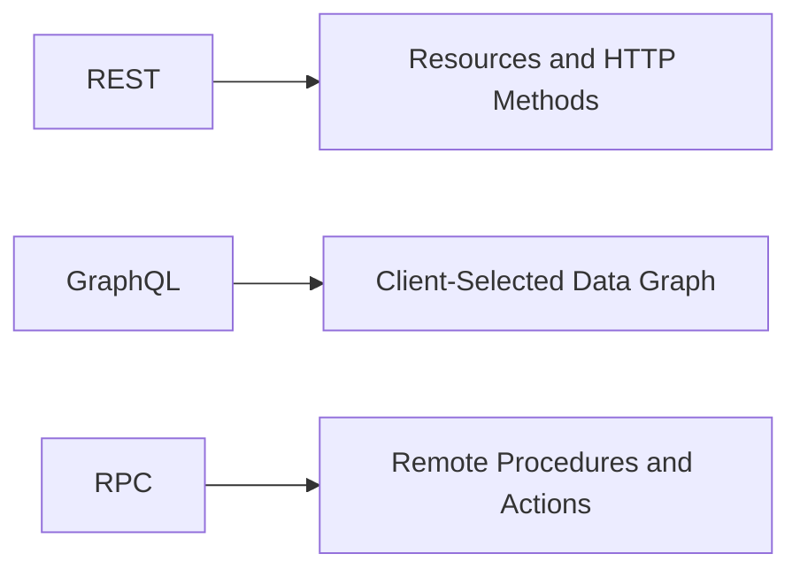

A simplified comparison:

| Paradigm | Main abstraction |
|---|---|
| REST | Resources |
| GraphQL | Typed data graph |
| RPC | Remote procedures or functions |

No paradigm is universally best.

The right choice depends on:

- Client requirements
- Data relationships
- Public or internal use
- Caching needs
- Performance requirements
- Team experience
- Tooling
- Operational complexity
- Versioning strategy
- Browser compatibility

---

# 1. What Problem Do APIs Solve?

A client and server usually run in different environments.

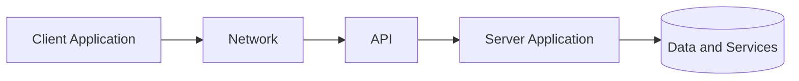

The client should not need to know:

- Which database is used
- How tables are structured
- How business rules are implemented
- Which programming language runs the server
- Which external services the backend calls
- Where files are stored internally

The API creates a boundary.

It defines:

```text
What the client may ask for
How the client asks
What the server returns
What errors mean
What permissions apply
```

---

# 2. A Running Example

Consider an online store.

A client needs to:

- List products
- View one product
- Create an order
- View the order
- Cancel the order
- Display a user’s recent orders and shipping status

We will represent these operations using REST, GraphQL, and RPC.

---

# 3. REST Overview

REST stands for:

```text
Representational State Transfer
```

REST commonly models the system as resources.

Examples:

```text
/products
/products/123
/orders
/orders/9001
/users/42
```

HTTP methods describe operations:

```text
GET
POST
PUT
PATCH
DELETE
```

Typical REST API:

```http
GET    /products
GET    /products/123
POST   /orders
GET    /orders/9001
PATCH  /orders/9001
DELETE /orders/9001
```

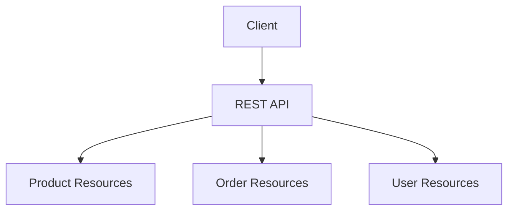

---

# 4. REST Example

## List products

```http
GET /api/products
Accept: application/json
```

Response:

```json
{
  "items": [
    {
      "id": 123,
      "name": "Mechanical Keyboard",
      "price": 79.99
    }
  ]
}
```

## Retrieve one product

```http
GET /api/products/123
```

## Create an order

```http
POST /api/orders
Content-Type: application/json

{
  "items": [
    {
      "productId": 123,
      "quantity": 2
    }
  ]
}
```

Response:

```http
201 Created
Location: /api/orders/9001
```

```json
{
  "id": 9001,
  "status": "pending",
  "total": 159.98
}
```

---

# 5. REST Strengths

REST is often a good choice when:

- Resources are central to the domain.
- Standard HTTP behavior is valuable.
- Public developers should be able to understand the API easily.
- Browser and cURL support are important.
- HTTP caching is useful.
- Requests map naturally to CRUD operations.
- You want many standard tools to work immediately.

REST benefits from existing HTTP infrastructure:

- Status codes
- Headers
- Caching
- Redirects
- Authentication schemes
- Proxies
- CDNs
- Browser tooling
- Monitoring systems

---

# 6. REST Limitations

REST can become awkward when clients need complex, deeply related data.

Suppose a dashboard needs:

```text
User
  └── Recent orders
        └── Order items
              └── Product information
                    └── Current shipment status
```

A REST client may need several requests:

```text
GET /users/42
GET /users/42/orders?limit=5
GET /orders/9001/items
GET /products/123
GET /orders/9001/shipment
```

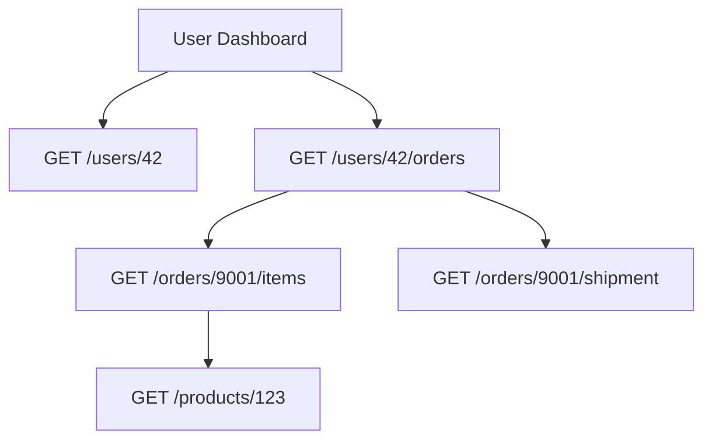

This can cause:

- More round trips
- More client coordination
- More loading states
- More complicated error handling
- Over-fetching
- Under-fetching

REST can address these issues with:

- Expanded representations
- Field selection
- Custom aggregation endpoints
- Nested endpoints
- Backend-for-frontend services

But each solution adds design decisions.

---

# 7. REST Over-Fetching

Over-fetching occurs when the server returns more data than the client needs.

Example response:

```json
{
  "id": 123,
  "name": "Keyboard",
  "description": "...",
  "manufacturer": "...",
  "inventoryHistory": [],
  "internalMetadata": {},
  "reviews": [],
  "price": 79.99
}
```

The client may need only:

```text
id
name
price
```

Over-fetching can increase:

- Payload size
- Parsing time
- Memory usage
- Network cost
- Exposure of unnecessary fields

---

# 8. REST Under-Fetching

Under-fetching occurs when one endpoint does not provide enough data for a screen.

Example:

```text
GET /users/42
```

returns the user, but the screen also needs:

```text
Recent orders
Order items
Shipment status
```

The client must make additional requests.

This is especially noticeable on:

- Mobile networks
- High-latency connections
- Complex dashboards
- Deeply nested data displays

---

# 9. REST Caching

REST often works well with HTTP caching.

Example:

```http
GET /api/products
Cache-Control: public, max-age=300
ETag: "products-v5"
```

A browser, CDN, or proxy may reuse the response.

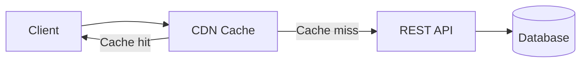

Caching is easier when:

- Requests use `GET`
- URLs identify resources
- Responses are public
- Query parameters have predictable meaning
- Cache headers are clear

Mutations such as `POST`, `PATCH`, and `DELETE` require careful cache invalidation.

---

# 10. GraphQL Overview

GraphQL is a query language and API runtime.

Instead of exposing many resource URLs, a GraphQL API often provides one endpoint:

```text
POST /graphql
```

The client sends a query describing the exact fields it wants.

```graphql
query {
  product(id: "123") {
    id
    name
    price
  }
}
```

Response:

```json
{
  "data": {
    "product": {
      "id": "123",
      "name": "Mechanical Keyboard",
      "price": 79.99
    }
  }
}
```

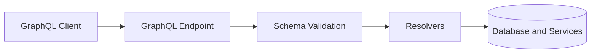

---

# 11. GraphQL Schema

A GraphQL schema describes available types and operations.

Example:

```graphql
type Product {
  id: ID!
  name: String!
  price: Float!
  available: Boolean!
}

type Query {
  product(id: ID!): Product
  products(limit: Int): [Product!]!
}
```

The schema provides:

- Discoverability
- Strong typing
- Validation
- Documentation
- Tooling
- Introspection

The client can request only fields defined by the schema.

---

# 12. GraphQL Nested Query

A dashboard query might be:

```graphql
query {
  user(id: "42") {
    id
    name
    orders(limit: 5) {
      id
      status
      items {
        quantity
        product {
          id
          name
          price
        }
      }
      shipment {
        status
        estimatedDelivery
      }
    }
  }
}
```

Response:

```json
{
  "data": {
    "user": {
      "id": "42",
      "name": "Alex",
      "orders": [
        {
          "id": "9001",
          "status": "paid",
          "items": [
            {
              "quantity": 2,
              "product": {
                "id": "123",
                "name": "Mechanical Keyboard",
                "price": 79.99
              }
            }
          ],
          "shipment": {
            "status": "in_transit",
            "estimatedDelivery": "2026-07-25"
          }
        }
      ]
    }
  }
}
```

One request can represent a complex data shape.

---

# 13. GraphQL Queries, Mutations, and Subscriptions

## Query

Reads data.

```graphql
query {
  products {
    id
    name
  }
}
```

## Mutation

Changes data.

```graphql
mutation {
  cancelOrder(id: "9001") {
    id
    status
  }
}
```

## Subscription

Receives real-time updates.

```graphql
subscription {
  orderUpdated(id: "9001") {
    id
    status
  }
}
```

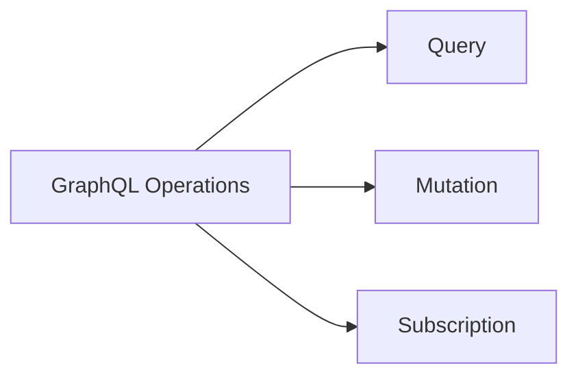

---

# 14. GraphQL Strengths

GraphQL is often useful when:

- Clients need different fields.
- Many related resources appear on one screen.
- Mobile and web clients have different data needs.
- Over-fetching is a major concern.
- A strong schema is valuable.
- Clients should control response shape.
- You want one flexible entry point.

GraphQL can reduce the number of requests needed for complex screens.

---

# 15. GraphQL Limitations

GraphQL introduces challenges:

- More complicated server implementation
- Resolver performance problems
- Difficult HTTP-level caching
- Query complexity attacks
- Deep nested queries
- Authorization at field and resolver levels
- Need for query depth limits
- Need for query cost limits
- More complex monitoring
- Potentially unpredictable database work

A short-looking query may cause expensive work:

```graphql
query {
  users {
    orders {
      items {
        product {
          reviews {
            author {
              orders {
                items {
                  product {
                    name
                  }
                }
              }
            }
          }
        }
      }
    }
  }
}
```

GraphQL servers commonly apply:

```text
Maximum query depth
Maximum query complexity
Pagination requirements
Timeouts
Field authorization
Resolver batching
```

---

# 16. GraphQL Error Handling

GraphQL may return HTTP `200` with an error in the body:

```json
{
  "data": {
    "product": null
  },
  "errors": [
    {
      "message": "Product not found",
      "path": ["product"]
    }
  ]
}
```

Therefore, clients must inspect:

```text
HTTP status
data
errors
```

A response with HTTP `200` is not necessarily a fully successful business operation.

---

# 17. GraphQL Caching

Traditional HTTP caching is often more straightforward for REST:

```text
GET /products/123
```

GraphQL commonly uses:

```text
POST /graphql
```

with different query bodies.

This makes ordinary URL-based caching more difficult.

GraphQL systems may use:

- Client-side normalized caches
- Persisted queries
- Query hashes
- CDN configuration
- Response caching
- Field-level caching
- Schema-aware caching

GraphQL caching is possible, but it usually requires more specialized tooling.

---

# 18. RPC Overview

RPC stands for:

```text
Remote Procedure Call
```

RPC models communication as calling a remote function or procedure.

Examples:

```text
getProduct()
createOrder()
cancelOrder()
sendMessage()
calculateShipping()
```

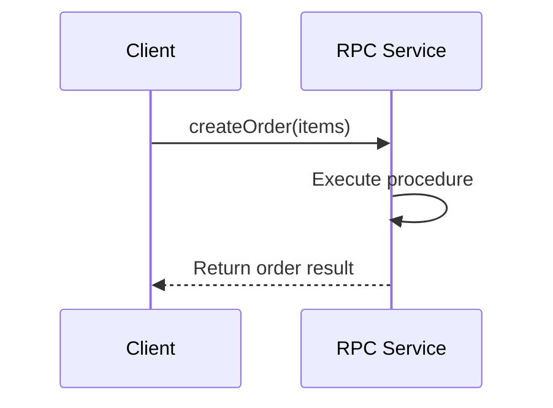

An RPC-style HTTP API might use:

```text
POST /createOrder
POST /cancelOrder
POST /calculateShipping
```

---

# 19. JSON-RPC Example

Request:

```json
{
  "jsonrpc": "2.0",
  "method": "createOrder",
  "params": {
    "items": [
      {
        "productId": 123,
        "quantity": 2
      }
    ]
  },
  "id": 1
}
```

Response:

```json
{
  "jsonrpc": "2.0",
  "result": {
    "orderId": "9001",
    "status": "pending"
  },
  "id": 1
}
```

Error:

```json
{
  "jsonrpc": "2.0",
  "error": {
    "code": -32601,
    "message": "Method not found"
  },
  "id": 1
}
```

---

# 20. gRPC Overview

gRPC is a strongly typed RPC framework.

It commonly uses:

- HTTP/2
- Protocol Buffers
- Generated client libraries
- Generated server interfaces
- Streaming
- Binary serialization

Example service definition:

```protobuf
service OrderService {
  rpc CreateOrder(CreateOrderRequest)
      returns (Order);
}

message CreateOrderRequest {
  string user_id = 1;
  repeated OrderItem items = 2;
}

message Order {
  string id = 1;
  string status = 2;
}
```

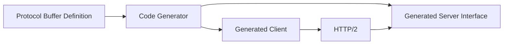

---

# 21. gRPC Strengths

gRPC is often useful for:

- Internal service-to-service communication
- Strongly typed APIs
- High-performance systems
- Streaming
- Polyglot backend teams
- Generated clients
- Low-overhead binary communication

The service definition acts as a shared contract.

---

# 22. gRPC Limitations

gRPC may be less convenient for:

- Public browser APIs
- Manual testing
- Human-readable debugging
- Simple integrations
- Clients without generated-code support

Browsers may require gRPC-Web or an intermediary gateway.

---

# 23. REST vs GraphQL vs RPC: Core Comparison

| Concern | REST | GraphQL | RPC |
|---|---|---|---|
| Main model | Resources | Data graph | Procedures |
| Typical endpoint count | Many | Often one | One or several methods |
| Client controls fields | Limited or optional | Strongly | Usually procedure-defined |
| HTTP semantics | Central | Transport plus schema | Often transport-oriented |
| Caching | Often straightforward | More specialized | Implementation-dependent |
| Typing | Documentation/schema | Strong schema | Often strongly typed |
| Browser support | Excellent | Excellent | Varies |
| Manual testing | Easy | Moderate | Varies |
| Best fit | Public resource APIs | Flexible client data needs | Internal actions/services |
| Main complexity | Endpoint design | Query complexity | Service/version coordination |

---

# 24. REST vs GraphQL Example

Suppose the client needs:

```text
Product name
Price
Inventory status
Reviews
Manufacturer
```

## REST

Possible request:

```http
GET /products/123
```

Response may include more data than needed.

Or separate requests:

```text
GET /products/123
GET /products/123/reviews
GET /products/123/manufacturer
```

## GraphQL

```graphql
query {
  product(id: "123") {
    name
    price
    available
    reviews {
      rating
      text
    }
    manufacturer {
      name
    }
  }
}
```

GraphQL provides precise field selection, while REST relies on endpoint representation design.

---

# 25. REST vs RPC Example

Suppose the user wants to cancel an order.

## REST-style resource approach

```http
POST /orders/9001/cancellations
```

or:

```http
PATCH /orders/9001
```

with:

```json
{
  "status": "cancelled"
}
```

## RPC-style approach

```http
POST /cancelOrder
```

Body:

```json
{
  "orderId": "9001"
}
```

The REST approach emphasizes the order and cancellation resource.

The RPC approach emphasizes the operation.

Both can be valid if the contract is clear and authorization is correct.

---

# 26. Choosing REST

Choose REST when:

- Your domain is naturally resource-oriented.
- Standard HTTP tools are important.
- Public developer access matters.
- Caching is valuable.
- Endpoints are relatively stable.
- CRUD operations dominate.
- You want simple cURL testing.
- Clients can work with defined representations.

Good examples:

```text
Product catalog
Blog posts
User profiles
Orders
Documents
Public files
```

---

# 27. Choosing GraphQL

Choose GraphQL when:

- Clients need different response shapes.
- Screens require deeply related data.
- You have multiple clients with different requirements.
- Over-fetching and under-fetching are significant.
- A centralized schema is valuable.
- The organization can manage query complexity.

Good examples:

```text
Complex dashboards
Content platforms
Social graphs
Mobile and web clients
Data aggregation interfaces
```

---

# 28. Choosing RPC

Choose RPC when:

- Operations are naturally action-oriented.
- Internal services communicate frequently.
- Strong typing and generated code are valuable.
- Performance is important.
- Streaming is required.
- You control both client and server.
- Resource modeling feels artificial.

Good examples:

```text
Process payment
Calculate shipping
Generate recommendation
Reserve inventory
Transcode video
Approve transaction
```

---

# 29. Hybrid Architectures

A system does not have to use only one API style.

A company may use:

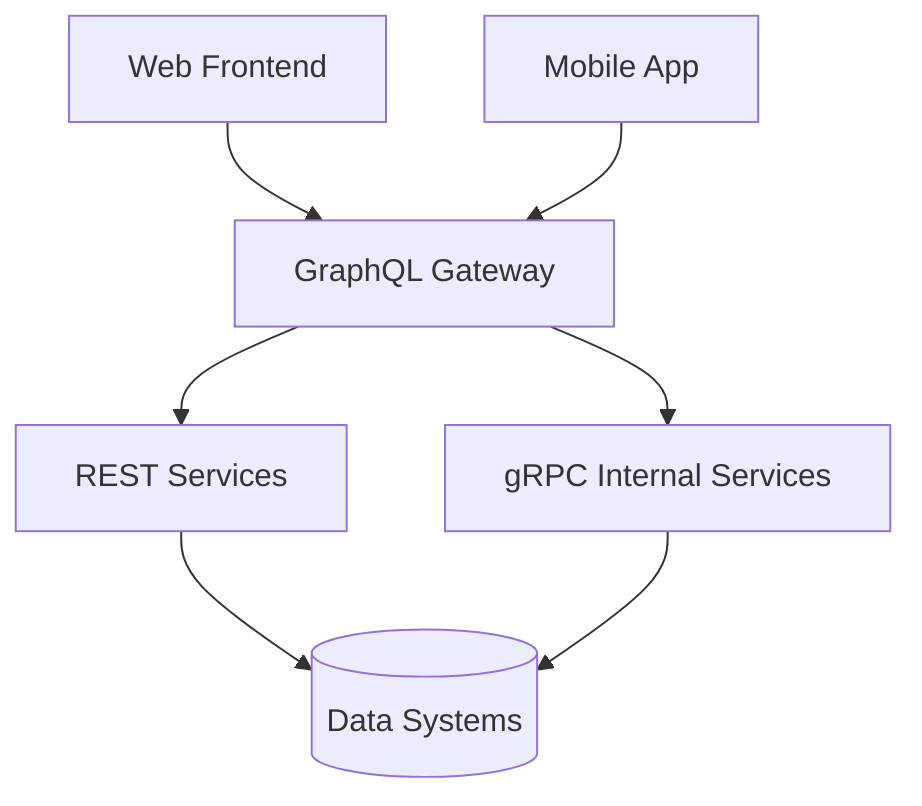

A common architecture may be:

```text
Public API:
  REST or GraphQL

Internal service communication:
  gRPC or messaging

Webhooks:
  HTTP POST

Background events:
  Message queue or event bus
```

Different boundaries may benefit from different approaches.

---

# 30. API Gateways and Backend-for-Frontend

A **Backend-for-Frontend**, or BFF, is a backend designed for one specific client type.

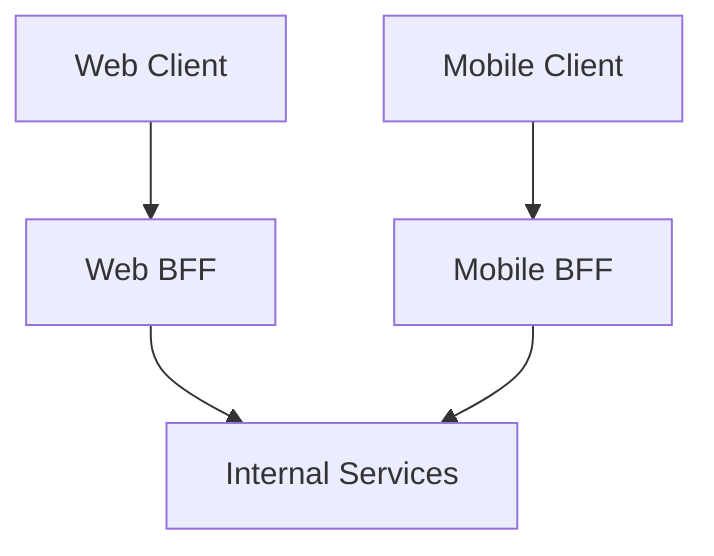

A BFF can:

- Aggregate data
- Reduce round trips
- Shape responses for a client
- Hide internal services
- Apply client-specific authorization
- Optimize mobile payloads

This can solve some REST over-fetching and under-fetching problems without requiring GraphQL.

---

# 31. Serialization Comparison

| Format | Strengths | Tradeoffs |
|---|---|---|
| JSON | Readable, widely supported | Larger, weaker type system |
| XML | Mature schemas, document support | Verbose |
| Protocol Buffers | Compact, strongly typed | Less human-readable |
| MessagePack | Compact and flexible | Less universal |
| Form encoding | Simple browser forms | Limited structure |
| Multipart | Files plus fields | More complex parsing |

---

# 32. API Paradigms and Versioning

## REST

May use:

```text
/api/v1/products
/api/v2/products
```

## GraphQL

Often evolves the schema by:

- Adding fields
- Deprecating fields
- Keeping old fields temporarily
- Avoiding breaking changes

Example:

```graphql
type Product {
  oldPrice: Float @deprecated(reason: "Use price.amount")
  price: Money!
}
```

## RPC

May version:

```text
OrderServiceV1
OrderServiceV2
```

or use package and method versioning.

The key requirement is compatibility management.

---

# 33. API Paradigms and Error Handling

## REST

Often uses status codes:

```http
404 Not Found
422 Unprocessable Content
500 Internal Server Error
```

## GraphQL

May return:

```json
{
  "data": {},
  "errors": []
}
```

with HTTP `200`.

## RPC

May use:

- Structured error codes
- Transport status
- Typed error details
- Framework-specific status values

Clients must understand both transport-level and application-level errors.

---

# 34. API Paradigms and Observability

REST logs may identify:

```text
GET /products/123
```

GraphQL logs may need:

```text
Operation name
Query hash
Selected fields
Variables
Complexity
Resolver timing
```

RPC logs may identify:

```text
OrderService.CreateOrder
```

Each paradigm benefits from:

- Request IDs
- Trace IDs
- Latency metrics
- Error counts
- Dependency timings
- User or service identity
- Payload-size measurements

---

# 35. API Paradigms and Security

Security requirements remain regardless of paradigm.

Every API style must address:

```text
Authentication
Authorization
Input validation
Rate limiting
Audit logging
Data minimization
Secrets management
Replay protection
Abuse prevention
```

GraphQL adds concerns such as:

```text
Query depth
Query complexity
Field-level authorization
Introspection exposure
```

RPC adds concerns such as:

```text
Service identity
Method-level authorization
Generated client trust
Internal network security
```

REST adds concerns such as:

```text
Resource-level authorization
URL enumeration
HTTP method behavior
Cache privacy
```

---

# 36. Decision Matrix

Use this simplified guide:

| Question | REST | GraphQL | RPC |
|---|---:|---:|---:|
| Are resources central? | Strong fit | Possible | Weaker fit |
| Need client-selected fields? | Limited | Strong fit | Usually limited |
| Need simple browser access? | Strong fit | Strong fit | Depends |
| Need HTTP caching? | Strong fit | More complex | Depends |
| Need generated type-safe clients? | Optional | Common tooling | Strong fit |
| Need internal high-performance calls? | Possible | Possible | Strong fit |
| Need public API simplicity? | Strong fit | Moderate | Depends |
| Need deeply nested data? | More coordination | Strong fit | Custom methods |
| Need simple cURL debugging? | Strong fit | Moderate | Depends |

---

# 37. Common API Selection Mistakes

## Mistake 1: Choosing GraphQL because it is fashionable

GraphQL introduces real complexity.

Use it because its client-driven data model solves a real problem.

## Mistake 2: Choosing microservice RPC too early

A simple REST API may be easier to operate and maintain.

## Mistake 3: Treating REST as only CRUD

Real domains include workflows and actions.

## Mistake 4: Treating GraphQL as automatically faster

One GraphQL request can trigger expensive backend work.

## Mistake 5: Treating RPC as only for internal systems

RPC can serve external clients, but public usability and tooling may require more work.

## Mistake 6: Ignoring caching

A flexible query system may need a specialized caching strategy.

## Mistake 7: Ignoring authorization depth

In GraphQL, authorization may be needed at nested fields and resolvers, not only at the top-level operation.

---

# 38. Practical Selection Exercise

Imagine an online learning platform.

Requirements:

```text
Web dashboard
Mobile app
Public course pages
Internal video-processing services
Real-time progress updates
Partner API
```

A possible design:

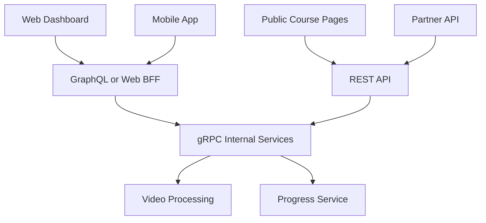

Reasoning:

```text
Public pages:
  REST or static delivery

Complex dashboards:
  GraphQL or BFF

Internal video services:
  gRPC

Real-time updates:
  WebSockets or subscriptions
```

The choice follows requirements rather than trends.

---

# 39. Final Comparison Summary

REST:

```text
Resource-oriented
HTTP-centric
Cache-friendly
Public API-friendly
Easy to inspect
```

GraphQL:

```text
Schema-oriented
Client-selected fields
Good for nested data
Flexible
Requires query controls
```

RPC:

```text
Action-oriented
Function or method-based
Strong for internal services
Good for generated clients
May be less browser-friendly
```

A complete architecture may use all three:

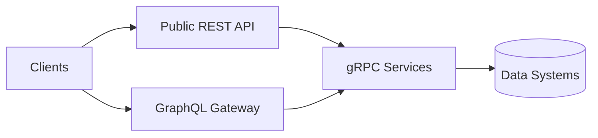

The most important rule is:

> Choose the API paradigm that makes the communication model clear, safe, testable, and maintainable for its intended consumers.
