# Appendix I — Web Security Checklist  
## Authentication, Authorization, Data Protection, Secure Coding, Infrastructure, and Operational Security

Web security is not one feature that can be switched on.

It is a collection of protections applied across:

- The browser
- The frontend
- The backend
- APIs
- Databases
- File storage
- Network infrastructure
- Dependencies
- Deployment systems
- Monitoring and operations

A secure application assumes that:

- Users may modify browser code.
- Requests may be manually constructed.
- Attackers may send unexpected data.
- Credentials may be stolen.
- Dependencies may contain vulnerabilities.
- External services may fail or behave unexpectedly.
- Internal systems may be misconfigured.
- Bugs may exist in otherwise trusted code.

A useful security model is:

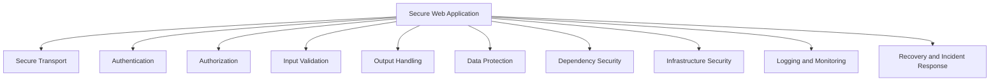

Security is best understood as **defense in depth**.

No single control is sufficient by itself.

---

# 1. The Security Mindset

A useful security question is:

> What could an untrusted person do if they ignored the normal interface and sent requests directly?

Do not assume that users will interact only through:

- Visible buttons
- Form validation
- Disabled controls
- Hidden fields
- Client-side routing
- Frontend permission checks
- Browser storage
- JavaScript code

A user can often:

- Inspect JavaScript
- Modify HTML
- Change form values
- Replay requests
- Send requests with cURL
- Change local storage
- Call API endpoints directly
- Construct malformed payloads

Therefore:

```text
Frontend restrictions improve usability.
Backend restrictions enforce security.
```

---

# 2. The Security Boundary

A typical secure architecture places important controls at the backend boundary.

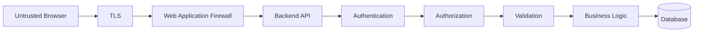

The backend should independently verify:

- Who is making the request
- Whether the request is valid
- Whether the caller is allowed
- Whether the operation is consistent with business rules
- Whether the data can safely be stored or processed

---

# 3. Asset, Threat, and Control

Security planning becomes easier when you identify three things:

## Asset

What are you protecting?

Examples:

- Passwords
- User profiles
- Payment records
- API keys
- Orders
- Intellectual property
- Internal infrastructure
- Availability

## Threat

What could go wrong?

Examples:

- Account takeover
- Data theft
- Unauthorized modification
- Fraud
- Malware upload
- Service disruption
- Credential leakage

## Control

What reduces the risk?

Examples:

- MFA
- Authorization checks
- Encryption
- Rate limiting
- Backups
- Input validation
- Monitoring

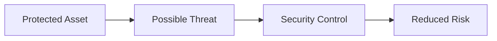

---

# 4. Authentication

Authentication answers:

```text
Who is this caller?
```

Common authentication methods include:

- Passwords
- Passkeys
- One-time codes
- Hardware security keys
- Session cookies
- Access tokens
- OAuth
- OpenID Connect
- Mutual TLS
- API keys for services

A simplified authentication flow:

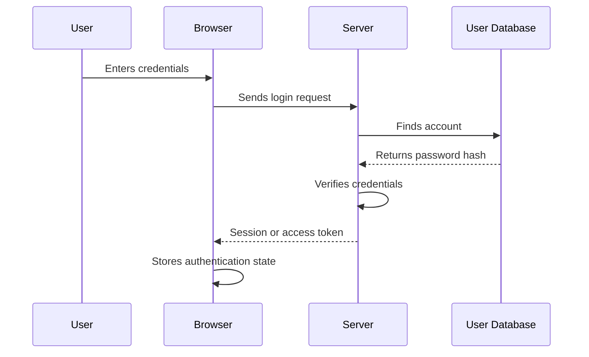

---

# 5. Password Storage

Never store passwords in plaintext.

Bad:

```text
alex@example.com | password123
```

If the database is exposed, plaintext passwords can be immediately used.

A safer system stores a password hash:

```text
alex@example.com | salted-password-hash
```

Password hashing should use an algorithm designed for passwords, such as:

- Argon2id
- bcrypt
- scrypt
- PBKDF2 with appropriate settings

A general password process:

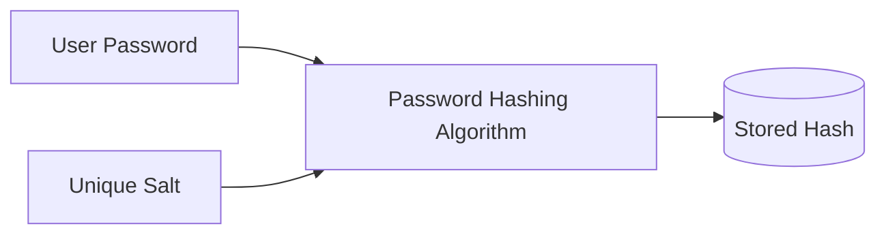

When logging in:

```text
Submitted password
  ↓
Hash using stored parameters
  ↓
Compare with stored hash
  ↓
Accept or reject
```

Do not use fast general-purpose hashes such as plain SHA-256 alone for password storage.

---

# 6. Password Policies

A password policy should focus on:

- Sufficient length
- Blocking known breached passwords
- Preventing common passwords
- Supporting password managers
- Avoiding unnecessary composition rules
- Rate-limiting login attempts
- Providing secure recovery

Avoid overly restrictive rules that encourage users to write passwords down or reuse predictable patterns.

Long passphrases are often easier to remember and harder to guess than short complex strings.

---

# 7. Multi-Factor Authentication

Multi-factor authentication, or MFA, combines multiple types of evidence.

Common factors include:

```text
Something you know:
  Password or PIN

Something you have:
  Security key or authenticator device

Something you are:
  Biometric characteristic
```

A stronger login flow:

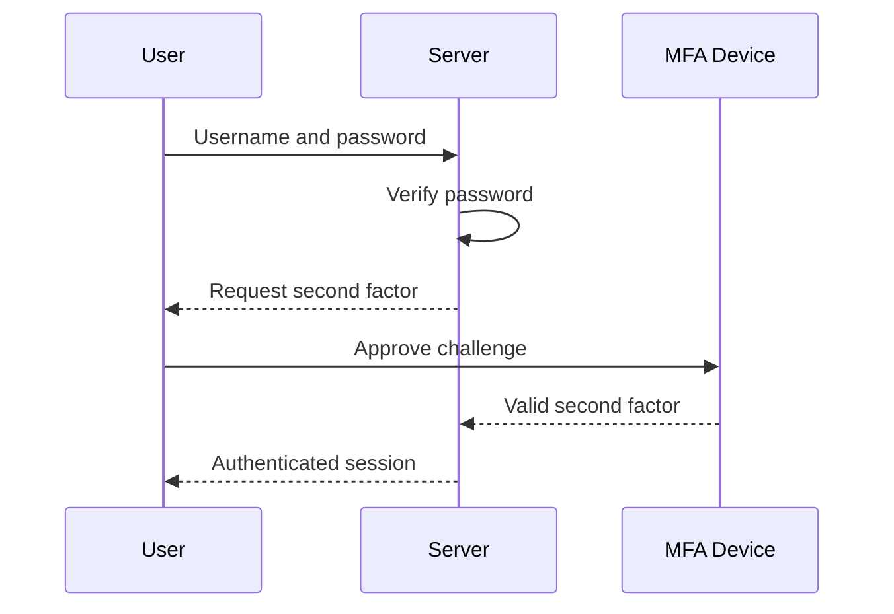

MFA reduces risk from stolen passwords, but recovery flows must also be secured.

---

# 8. Passkeys

Passkeys use public-key cryptography to authenticate users.

A simplified model:

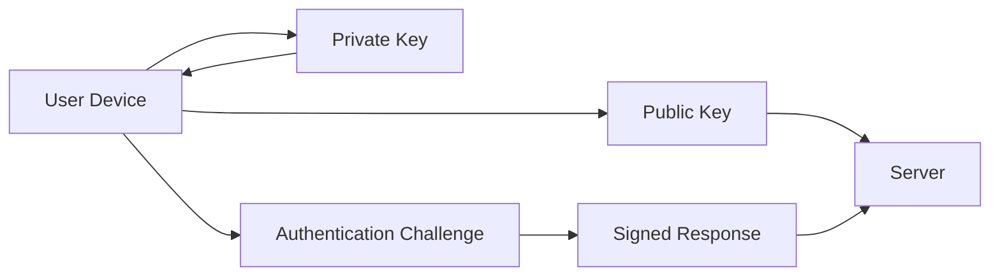

The private key remains on the user’s device or credential system.

Passkeys can reduce risks associated with:

- Password reuse
- Phishing
- Credential databases
- Weak passwords

---

# 9. Sessions

A session allows the server to associate multiple requests with an authenticated user.

A cookie may contain an opaque session identifier:

```http
Set-Cookie: session_id=abc123; Secure; HttpOnly; SameSite=Lax
```

The server stores the session details:

```text
session_id: abc123
user_id: 42
expires: ...
```

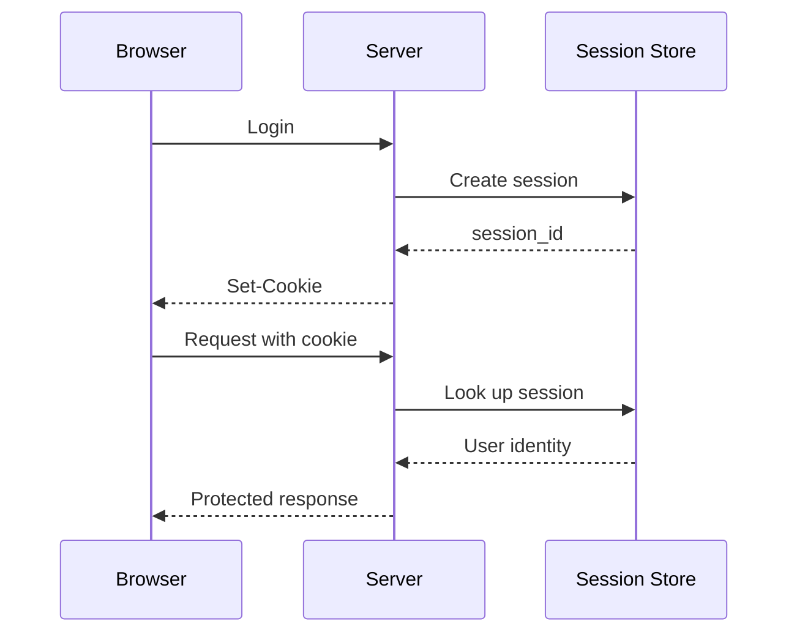

---

# 10. Secure Cookie Attributes

Important attributes include:

```http
Set-Cookie: session_id=abc123; Secure; HttpOnly; SameSite=Lax; Path=/
```

## `Secure`

Send only over HTTPS.

## `HttpOnly`

Prevent normal JavaScript access.

## `SameSite`

Control cross-site cookie behavior.

## `Path`

Restrict the paths where the cookie is sent.

## `Domain`

Control applicable domains and subdomains.

## `Max-Age` or `Expires`

Define cookie lifetime.

---

# 11. Session Security Checklist

```text
[ ] Use HTTPS.
[ ] Use Secure cookies.
[ ] Use HttpOnly for session cookies where appropriate.
[ ] Configure SameSite deliberately.
[ ] Regenerate the session after login.
[ ] Expire inactive sessions.
[ ] Provide logout invalidation.
[ ] Protect session storage.
[ ] Avoid putting sessions in URLs.
[ ] Do not log session IDs.
[ ] Limit session scope.
[ ] Consider revocation after password changes.
```

---

# 12. Token-Based Authentication

An API may use an access token:

```http
Authorization: Bearer access-token-value
```

The server may validate:

- Signature
- Expiration
- Issuer
- Audience
- Scopes
- User identity
- Token type

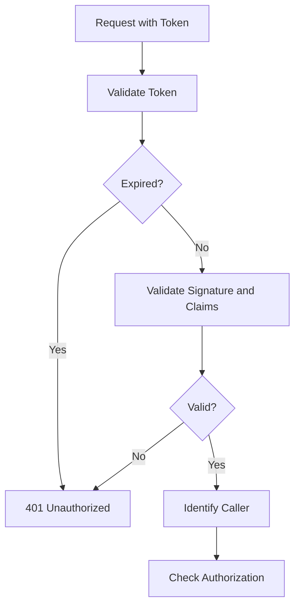

A token should contain only information necessary for its purpose.

Do not assume that encoded token contents are secret.

---

# 13. Access Tokens and Refresh Tokens

A common design uses:

```text
Short-lived access token
Longer-lived refresh token
```

The access token is used for API calls.

The refresh token obtains a new access token.

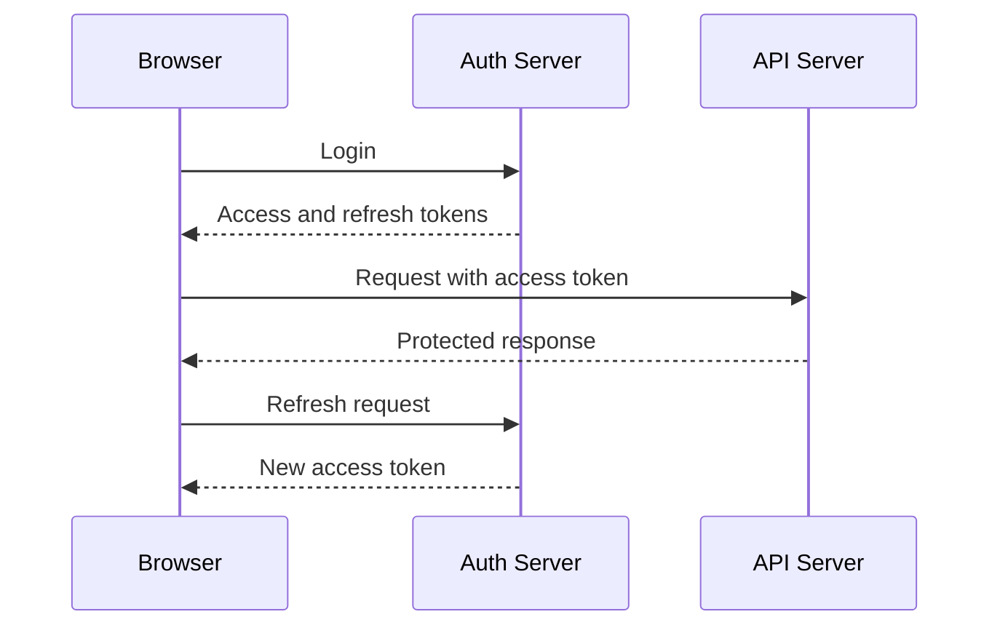

Refresh tokens require especially careful protection and revocation.

---

# 14. Authorization

Authorization answers:

```text
What is this caller allowed to do?
```

Authorization may depend on:

- User identity
- Role
- Organization
- Resource ownership
- Subscription
- Geographic policy
- Account state
- Request context

A basic authorization flow:

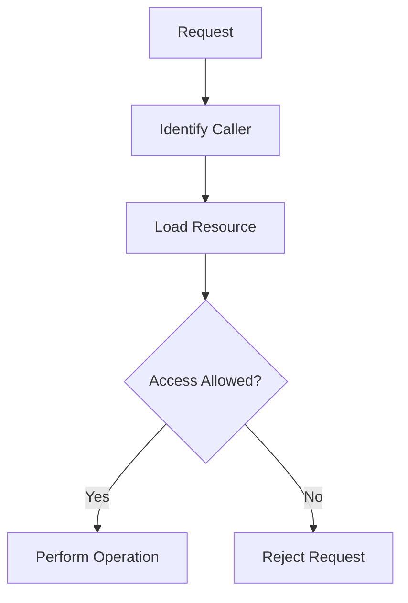

---

# 15. Role-Based Access Control

Role-based access control, or RBAC, assigns permissions through roles.

Example roles:

```text
Viewer
Editor
Manager
Administrator
```

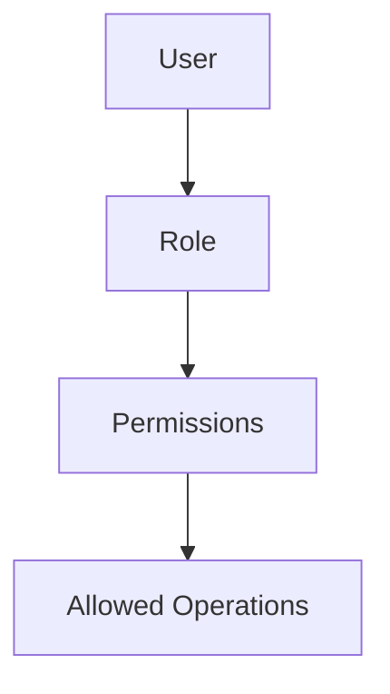

A role check may answer:

```text
Is this user an administrator?
```

Role checks are useful, but ownership checks may also be required.

---

# 16. Resource Ownership

A user may be allowed to access only resources they own.

Example:

```text
User 42 requests /orders/9001.
```

The server must verify:

```text
Does order 9001 belong to user 42?
```

Do not assume that knowing an identifier grants access.

A user changing:

```text
/orders/9001
```

to:

```text
/orders/9002
```

must not expose another user’s order.

---

# 17. Least Privilege

Least privilege means granting only the access required for a task.

Examples:

- A reporting service should read reports but not delete users.
- A background worker should access its queue and storage but not the production database administrator account.
- A frontend public key should not have administrative permissions.
- A support employee may view limited fields but not payment credentials.

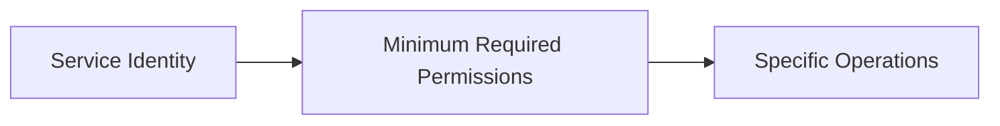

Excessive privileges increase the impact of credential theft or software bugs.

---

# 18. Input Validation

Treat all external input as untrusted.

Inputs include:

- Query parameters
- Path parameters
- JSON bodies
- Form fields
- Cookies
- Headers
- Uploaded files
- Webhook payloads
- Third-party responses

Validation should check:

```text
Type
Format
Length
Range
Required fields
Allowed values
Relationships
Authorization context
```

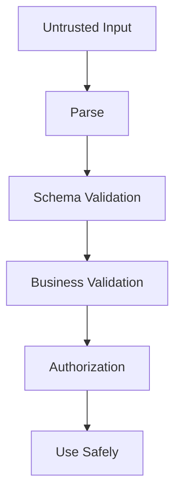

Client-side validation is helpful but insufficient.

---

# 19. Output Encoding

Input validation alone does not prevent every problem.

When displaying untrusted data, encode it for the output context:

- HTML
- JavaScript
- CSS
- URL
- SQL
- Shell command
- Log format

The correct encoding depends on where the data is inserted.

Never assume that text safe for one context is safe for another.

---

# 20. SQL Injection

SQL injection occurs when untrusted input changes the meaning of a database query.

Unsafe conceptual pattern:

```text
"SELECT * FROM users WHERE email = '" + input + "'"
```

Safer:

```text
Parameterized query:
SELECT * FROM users WHERE email = ?
```

The value is supplied separately.

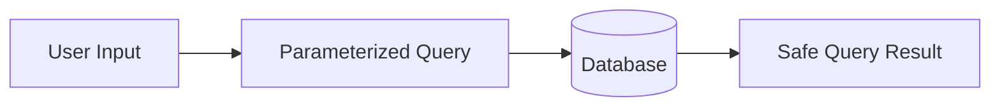

Use:

- Parameterized queries
- Prepared statements
- Trusted query builders
- ORM protections used correctly

Do not treat an ORM as automatically safe if raw query escape hatches are used carelessly.

---

# 21. Cross-Site Scripting

Cross-site scripting, or XSS, occurs when attacker-controlled content executes as browser code.

Potential sources include:

- User comments
- Profile names
- Search terms
- Imported data
- CMS content
- URL parameters
- Third-party content

Defenses include:

- Context-aware output escaping
- Safe templating
- Avoiding unsafe HTML insertion
- Sanitizing intentionally allowed HTML
- Content Security Policy
- Secure dependency management

---

# 22. Dangerous HTML Insertion

Be cautious with APIs such as:

```javascript
element.innerHTML = userInput;
```

If `userInput` contains executable markup, it may create an XSS vulnerability.

Prefer text insertion when HTML is not required:

```javascript
element.textContent = userInput;
```

If rich HTML is required, use a well-maintained sanitizer and a clearly defined allowed format.

---

# 23. Content Security Policy

CSP can restrict where resources and scripts may come from.

Example:

```http
Content-Security-Policy: default-src 'self'; script-src 'self'
```

A more complex policy might allow selected assets:

```http
Content-Security-Policy:
  default-src 'self';
  img-src 'self' https://images.example.com;
  script-src 'self' https://cdn.example.com;
  style-src 'self';
```

CSP can reduce the impact of certain XSS vulnerabilities, but it should not replace safe coding practices.

---

# 24. Cross-Site Request Forgery

CSRF occurs when an attacker tricks a user’s browser into sending an unwanted authenticated request.

This risk is especially relevant to cookie-based authentication because browsers may automatically send cookies.

Potential defenses:

- SameSite cookies
- CSRF tokens
- Origin validation
- Referer validation
- Avoiding state changes through `GET`
- Requiring intentional request headers

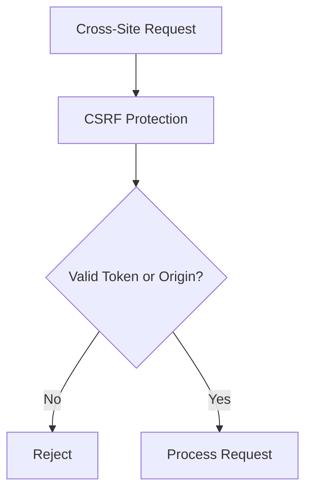

---

# 25. HTTP Method Safety

Do not use `GET` for destructive actions.

Bad:

```http
GET /delete-account
```

A browser prefetch, crawler, link scanner, or image loader could trigger it.

Prefer:

```http
POST /account/deletion-request
```

or:

```http
DELETE /account
```

with suitable authentication and CSRF protections.

---

# 26. Clickjacking

Clickjacking occurs when a page is embedded or visually disguised so that a user clicks something different from what they think they are clicking.

Defenses include:

```http
X-Frame-Options: DENY
```

or:

```http
Content-Security-Policy: frame-ancestors 'none'
```

If embedding is required, allow only trusted origins.

---

# 27. File Upload Security

File uploads are a common security boundary.

Validate:

```text
File size
Declared content type
Actual file signature
File extension
Filename
Image dimensions
Archive contents
Malware status
User permissions
Storage location
```

Do not trust:

```text
Original filename
Client-provided MIME type
File extension alone
```

Safer upload flow:

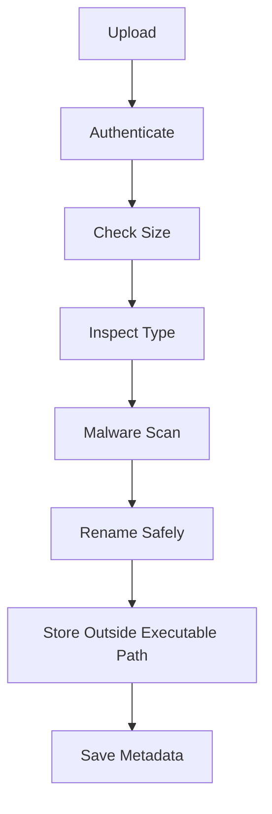

---

# 28. Path Traversal

Path traversal occurs when user input manipulates file paths.

Dangerous input may include:

```text
../../private/config.txt
```

Defenses include:

- Never using raw user input as a file path
- Resolving and checking canonical paths
- Restricting access to an allowed directory
- Generating server-side filenames
- Rejecting traversal sequences
- Using object storage identifiers

---

# 29. Server-Side Request Forgery

SSRF occurs when an attacker causes the server to make requests to unintended destinations.

Potential targets include:

- Internal services
- Cloud metadata endpoints
- Private databases
- Administrative interfaces
- Localhost services

If an application accepts a URL to fetch, validate:

- Allowed schemes
- Allowed domains
- Resolved IP addresses
- Redirect destinations
- Private address ranges
- Internal hostnames

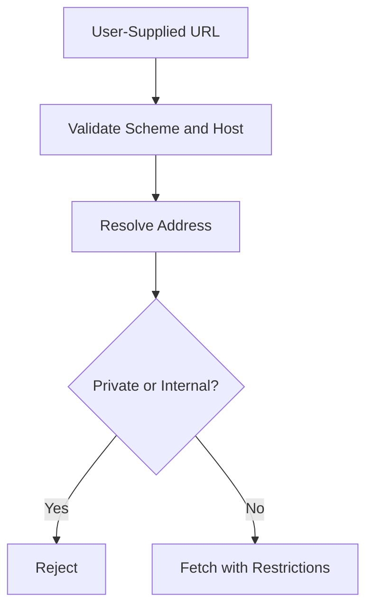

---

# 30. Open Redirects

An open redirect occurs when an application redirects users to arbitrary attacker-controlled URLs.

Potentially unsafe:

```text
https://example.com/redirect?next=https://attacker.example
```

Defenses:

- Allow only relative paths
- Use an allowlist
- Reject external schemes
- Validate destination host
- Avoid reflecting arbitrary URLs

Open redirects can support phishing and token theft.

---

# 31. Dependency Security

Applications depend on:

- Frameworks
- Libraries
- Plugins
- Operating systems
- Container images
- Build tools

Security practices include:

```text
[ ] Keep dependencies updated.
[ ] Remove unused packages.
[ ] Review security advisories.
[ ] Lock versions where appropriate.
[ ] Scan dependencies.
[ ] Scan container images.
[ ] Review transitive dependencies.
[ ] Test updates before production.
```

A dependency update can improve security but should still be tested for compatibility.

---

# 32. Secrets Management

Secrets include:

- Database passwords
- API keys
- Token-signing keys
- Cloud credentials
- Payment provider secrets
- Encryption keys
- Private certificates

Never place secrets in:

- Frontend bundles
- Public repositories
- Screenshots
- URLs
- Client-visible configuration
- Unprotected logs

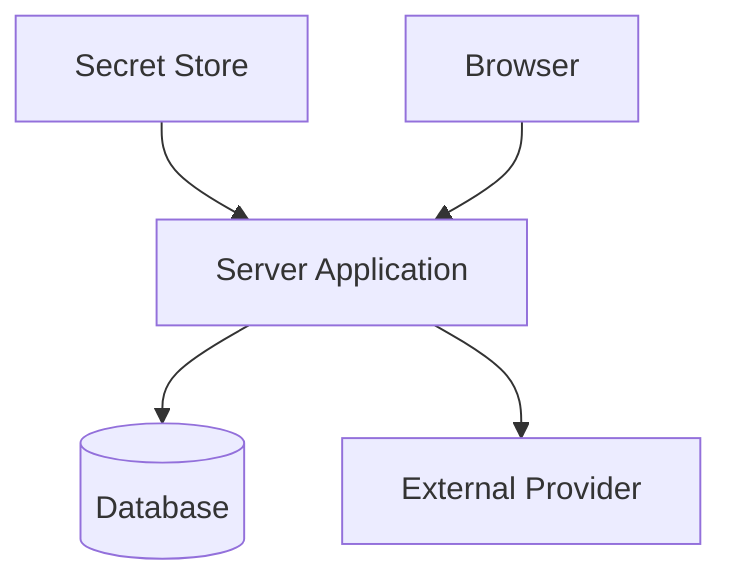

The browser may receive public configuration, but it should not receive authority-granting secrets.

---

# 33. Secret Rotation

If a secret may have been exposed:

```text
1. Revoke or rotate it.
2. Identify where it was used.
3. Inspect logs for misuse.
4. Deploy the replacement.
5. Remove the exposed value.
6. Review how the exposure happened.
```

Do not simply delete the secret from source code and assume the problem is solved. It may remain in:

- Git history
- Build artifacts
- Logs
- Backups
- Chat messages
- CI systems
- Container images

---

# 34. HTTPS and TLS

HTTPS protects communication between a client and server.

It provides:

```text
Confidentiality
Integrity
Server authentication
```

Use HTTPS for:

- Login
- APIs
- Forms
- Account pages
- File uploads
- Payment flows
- Administrative tools
- Static assets

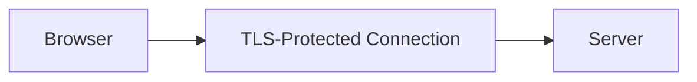

HTTPS does not fix:

- Broken authorization
- Weak passwords
- SQL injection
- XSS
- Insecure file handling
- Exposed secrets
- Logic bugs

---

# 35. Security Headers

Common security-related headers include:

```http
Strict-Transport-Security
Content-Security-Policy
X-Content-Type-Options
X-Frame-Options
Referrer-Policy
Permissions-Policy
Cross-Origin-Opener-Policy
Cross-Origin-Resource-Policy
```

Use these according to the application’s requirements. A header is not automatically beneficial if configured incorrectly.

---

# 36. CORS Security

CORS controls whether browser JavaScript can read responses from another origin.

Avoid overly broad policies such as:

```http
Access-Control-Allow-Origin: *
```

for private authenticated data.

Use explicit allowed origins:

```http
Access-Control-Allow-Origin: https://app.example.com
```

If cookies are involved, configure credentials carefully.

CORS is not a replacement for authorization. Non-browser clients can often send requests regardless of CORS.

---

# 37. Rate Limiting

Rate limiting helps protect:

- Login endpoints
- Password reset
- Search APIs
- File uploads
- Expensive reports
- Public APIs
- Webhook endpoints

Possible limits:

```text
Requests per IP
Requests per account
Requests per API key
Requests per organization
Requests per endpoint
```

A rate-limited response:

```http
429 Too Many Requests
Retry-After: 60
```

Rate limiting should be combined with monitoring and abuse detection.

---

# 38. Account Recovery Security

Password reset and account recovery flows are high-value targets.

Use:

- Short-lived tokens
- Single-use tokens
- Secure random generation
- Generic responses
- Rate limiting
- Expiration
- Notification of changes
- No token logging
- Careful session invalidation

Avoid revealing whether an email address exists:

```text
If the account exists, we sent recovery instructions.
```

This reduces account enumeration.

---

# 39. Logging Security

Logs should help diagnose problems without exposing sensitive information.

Do not log:

- Passwords
- Access tokens
- Session IDs
- Private keys
- Full payment numbers
- Unnecessary personal data

Redact:

```http
Authorization: Bearer REDACTED
Cookie: session_id=REDACTED
```

Use structured logs:

```json
{
  "event": "login_failed",
  "userId": "42",
  "requestId": "req_abc123",
  "reason": "invalid_credentials"
}
```

---

# 40. Audit Logging

Audit logs record security-sensitive actions.

Examples:

```text
User logged in
Password changed
MFA enabled
Role changed
Invoice downloaded
Order refunded
Administrator accessed account
API key created
```

Audit logs should be:

- Tamper-resistant
- Access-controlled
- Time-stamped
- Searchable
- Retained according to requirements
- Correlated with request IDs

---

# 41. Database Security

Protect databases through:

```text
Private network placement
Strong credentials
Least-privilege accounts
Encryption in transit
Encryption at rest
Parameterized queries
Backups
Access logging
Patch management
Connection restrictions
```

Avoid exposing database ports directly to the public Internet unless there is a deliberate, well-protected reason.

Typical architecture:

```mermaid
flowchart TD
    I[Public Internet] --> API[Public API]
    API --> DB[(Private Database)]
    I -.->|Blocked| DB
```

---

# 42. Encryption at Rest

Encryption at rest protects stored data if storage media or backups are accessed improperly.

Potentially encrypted systems include:

- Databases
- Object storage
- Disk volumes
- Backups
- Logs
- Secret stores

Encryption at rest does not replace access control. An authorized application can still read decrypted data.

---

# 43. Data Minimization

Do not collect or retain data that the application does not need.

Data minimization reduces:

- Privacy risk
- Breach impact
- Storage cost
- Compliance burden
- Accidental exposure

Ask:

```text
Do we need this field?
Who needs access?
How long should we retain it?
Can we store a less sensitive form?
```

---

# 44. Webhook Security

Webhook endpoints should verify:

- Signature
- Timestamp
- Event identifier
- Sender identity
- Payload schema
- Replay protection

```mermaid
flowchart TD
    W[Webhook Request] --> S[Verify Signature]
    S --> T[Check Timestamp]
    T --> I[Check Event ID]
    I --> V[Validate Payload]
    V --> P[Process Idempotently]
```

Never trust a webhook merely because it arrived at the expected URL.

---

# 45. Security Testing Checklist

```text
[ ] Test unauthenticated access.
[ ] Test invalid credentials.
[ ] Test expired credentials.
[ ] Test unauthorized resource access.
[ ] Test role boundaries.
[ ] Test organization boundaries.
[ ] Test input validation.
[ ] Test malformed JSON.
[ ] Test oversized requests.
[ ] Test file uploads.
[ ] Test rate limiting.
[ ] Test CSRF protections.
[ ] Test CORS behavior.
[ ] Test security headers.
[ ] Test secret redaction.
[ ] Test session expiration.
[ ] Test logout invalidation.
[ ] Test password recovery.
[ ] Test webhook signatures.
[ ] Test duplicate webhook events.
[ ] Test dependency failures.
```

---

# 46. Production Security Checklist

## Transport

```text
[ ] HTTPS is enabled everywhere.
[ ] Certificates are valid and monitored.
[ ] HTTP redirects safely to HTTPS.
[ ] Secure cookies are used.
[ ] Mixed content is avoided.
[ ] TLS configuration is maintained.
```

## Authentication

```text
[ ] Passwords are securely hashed.
[ ] MFA is available where appropriate.
[ ] Sessions expire.
[ ] Tokens are protected.
[ ] Recovery flows are secured.
[ ] Login attempts are rate-limited.
```

## Authorization

```text
[ ] Permissions are checked server-side.
[ ] Resource ownership is verified.
[ ] Administrative actions require stronger permissions.
[ ] Service accounts use least privilege.
[ ] Tenant boundaries are enforced.
```

## Input and output

```text
[ ] Input schemas are validated.
[ ] Database queries are parameterized.
[ ] Output is encoded for its context.
[ ] HTML is sanitized when necessary.
[ ] File uploads are inspected.
[ ] URLs are validated.
```

## Infrastructure

```text
[ ] Databases are private.
[ ] Firewalls restrict access.
[ ] Secrets are managed securely.
[ ] Dependencies are scanned.
[ ] Containers are updated.
[ ] Backups are encrypted.
```

## Monitoring

```text
[ ] Security events are logged.
[ ] Logs do not contain secrets.
[ ] Suspicious activity is monitored.
[ ] Alerts are configured.
[ ] Incident procedures exist.
```

---

# 47. Incident Response

When a security incident occurs:

```mermaid
flowchart TD
    A[Detect Incident] --> B[Contain Impact]
    B --> C[Revoke or Rotate Credentials]
    C --> D[Preserve Evidence]
    D --> E[Investigate Scope]
    E --> F[Restore Secure Operation]
    F --> G[Notify Required Parties]
    G --> H[Improve Controls]
```

The exact process depends on the organization, but preparation matters.

Have documented procedures for:

- Leaked API keys
- Stolen sessions
- Data exposure
- Malware uploads
- Compromised dependencies
- Database intrusion
- Suspicious administrator activity
- Service abuse

---

# 48. Security and Reliability Connection

Security controls should not create unnecessary fragility.

For example:

- Certificate expiration can cause outages.
- Overly aggressive rate limits can block legitimate users.
- A failed identity provider can prevent login.
- Misconfigured CORS can break the frontend.
- A secret rotation can break integrations.
- An overly strict CSP can disable application functionality.

Security changes require:

```text
Testing
Monitoring
Rollback planning
Clear ownership
```

---

# 49. Final Security Mental Model

A secure request should pass through deliberate controls:

```mermaid
flowchart TD
    R[Incoming Request] --> T[TLS]
    T --> N[Network Filtering]
    N --> W[Web Firewall]
    W --> A[Authentication]
    A --> Z[Authorization]
    Z --> V[Input Validation]
    V --> B[Business Rules]
    B --> D[Safe Data Access]
    D --> L[Audit and Security Logging]
    L --> O[Safe Response]
```

Security is not one checkbox.

It is the combined result of:

```text
Secure transport
Strong identity
Correct authorization
Validated input
Safe output
Protected data
Least privilege
Secure dependencies
Restricted infrastructure
Useful monitoring
Prepared recovery
```

The most important principle is:

> Assume every boundary can be tested, manipulated, or misconfigured, and design each layer to fail safely.
