# Appendix J — Web Performance Checklist  
## Measuring, Diagnosing, and Improving Browser, Network, API, Database, and Production Performance

Web performance is the study of how quickly and smoothly an application responds to users.

It includes more than page-load speed.

Performance also includes:

- How quickly useful content appears
- How quickly buttons respond
- How smoothly the page scrolls
- How fast API requests complete
- How efficiently databases execute queries
- How quickly files download
- How well the application behaves on slow devices
- How reliably the system handles traffic spikes

A useful performance model is:

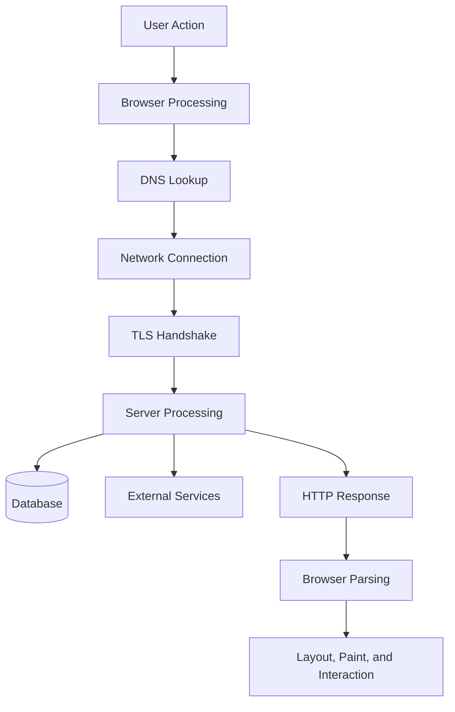

Every stage can contribute to delay.

---

# 1. What Does “Fast” Mean?

“Fast” can mean several different things:

```text
The server responds quickly.
The page displays useful content quickly.
The interface accepts input quickly.
The API returns a small response.
The database completes queries quickly.
The user does not wait unnecessarily.
```

A technically fast system may still feel slow if:

- It shows a blank screen.
- It does not display loading feedback.
- It blocks interaction.
- It shifts content unexpectedly.
- It waits for nonessential resources.
- It performs too many sequential requests.

A technically slower system may feel responsive if:

- It displays useful content immediately.
- It shows progress.
- It allows interaction while secondary data loads.
- It provides clear feedback.
- It uses cached information intelligently.

---

# 2. Performance Categories

Performance can be divided into several areas:

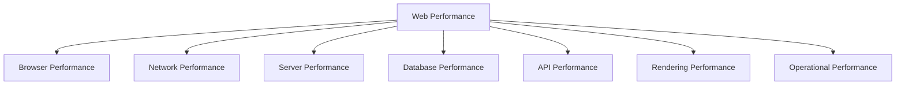

## Browser performance

How efficiently the browser parses, executes, lays out, and paints.

## Network performance

How quickly data travels between client and server.

## Server performance

How quickly backend code processes requests.

## Database performance

How quickly data is retrieved or modified.

## API performance

How efficiently services expose and transfer data.

## Rendering performance

How smoothly the browser displays updates and animations.

## Operational performance

How reliably the production system handles normal and peak load.

---

# 3. Measure Before Optimizing

Do not optimize based only on intuition.

A page that feels slow may be slow because of:

- DNS
- TLS
- Backend processing
- Database queries
- Large images
- JavaScript execution
- Layout work
- Third-party scripts
- Caching
- Slow devices
- Network conditions

Use evidence:

```text
Browser Network panel
Performance panel
Server metrics
Database query timing
Application logs
Distributed traces
Real-user monitoring
Load tests
```

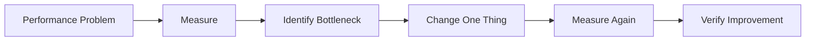

A useful rule:

> Change one important variable at a time when diagnosing performance.

---

# 4. Performance Budgets

A performance budget defines acceptable limits.

Examples:

```text
Initial JavaScript: less than 250 KB compressed
Largest image: less than 200 KB
API response: less than 500 ms at P95
First contentful paint: less than 2 seconds
Page layout shift: below an agreed threshold
```

Budgets help teams treat performance as a design requirement rather than a last-minute optimization project.

A budget can cover:

- Bundle size
- Image size
- Font count
- API latency
- Database query time
- Number of requests
- Memory usage
- CPU usage

---

# 5. Browser Rendering Pipeline

A simplified browser rendering pipeline is:

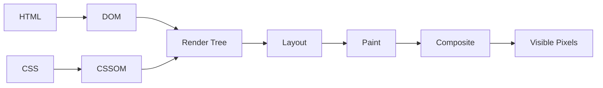

## DOM

The parsed HTML structure.

## CSSOM

The browser’s representation of CSS rules.

## Render tree

The elements and styles that participate in rendering.

## Layout

Calculates sizes and positions.

## Paint

Draws pixels.

## Composite

Combines layers and displays the final result.

Expensive work at any stage can reduce responsiveness.

---

# 6. Critical Rendering Path

The critical rendering path is the work required before the browser can display useful content.

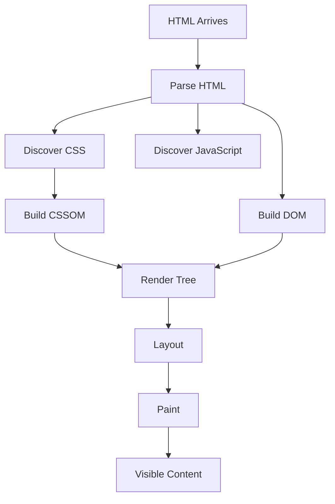

Performance problems include:

- Large HTML
- Blocking stylesheets
- Large JavaScript files
- Too many fonts
- Slow server response
- Render-blocking resources
- Late discovery of important assets

---

# 7. First Contentful Paint

First Contentful Paint, or FCP, measures when the browser first displays meaningful content.

Examples:

- Text
- An image
- A canvas
- A visible interface element

A poor FCP experience may look like:

```text
Blank white screen
Long delay
Sudden page appearance
```

Improve FCP by:

- Reducing server response time
- Serving critical HTML quickly
- Removing unnecessary render-blocking assets
- Preloading important fonts or images carefully
- Reducing initial JavaScript
- Using static or server-rendered content where appropriate

---

# 8. Largest Contentful Paint

Largest Contentful Paint, or LCP, measures when the largest visible content element has rendered.

The largest element may be:

- Hero image
- Main heading
- Product image
- Article block
- Large banner

A slow LCP may result from:

```text
Slow server response
Large image
Late image discovery
Render-blocking CSS
Large JavaScript bundle
Slow font
```

A useful investigation:

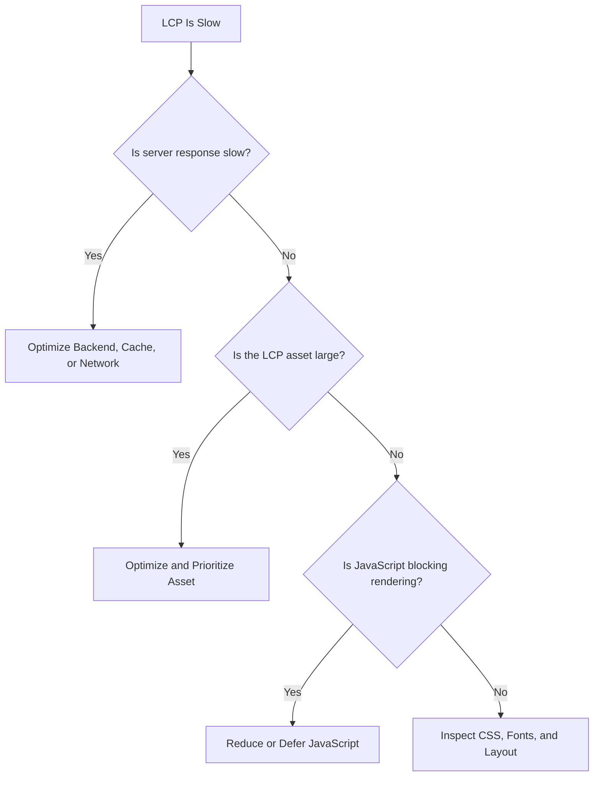

---

# 9. Cumulative Layout Shift

Cumulative Layout Shift, or CLS, measures unexpected movement of page content.

Example:

```text
1. User sees a button.
2. An image loads above it.
3. The page shifts downward.
4. The user clicks a different element than intended.
```

Common causes:

- Images without dimensions
- Ads without reserved space
- Late-loading fonts
- Dynamic content insertion
- Client-side rendering changes
- Animations that alter layout

Reserve space:

```html

```

The browser can calculate the image’s space before it finishes downloading.

---

# 10. Interaction to Next Paint

Interaction to Next Paint, or INP, measures how quickly the page responds to user interactions.

Examples:

- Clicking a button
- Typing in a search field
- Opening a menu
- Selecting a tab
- Dragging an object

Poor interaction responsiveness can result from:

- Long JavaScript tasks
- Expensive event handlers
- Large DOM updates
- Complex state changes
- Synchronous computation
- Excessive layout work

A page can load quickly but still feel slow if interactions are delayed.

---

# 11. Total Blocking Time

Total Blocking Time measures time during which the browser’s main thread is blocked by long tasks.

A long task may be caused by:

```javascript
largeData.map(expensiveTransformation);
```

or:

```text
Parsing a huge JavaScript bundle
Rendering thousands of DOM nodes
Parsing a massive JSON response
```

Improve blocking time by:

- Splitting code
- Deferring noncritical JavaScript
- Moving heavy work to workers
- Virtualizing long lists
- Reducing unnecessary renders
- Processing data in smaller chunks

---

# 12. JavaScript Bundle Size

Large JavaScript bundles affect:

- Download time
- Parsing time
- Compilation time
- Execution time
- Memory usage
- Battery consumption

Inspect bundles in the Network panel.

Check:

```text
Transferred size
Decoded size
Compression
Load order
Cache behavior
```

Common improvements:

```text
Remove unused libraries
Use tree shaking
Split by route
Lazy-load features
Replace heavy dependencies
Defer noncritical scripts
```

---

# 13. Code Splitting

Code splitting divides application code into smaller bundles.

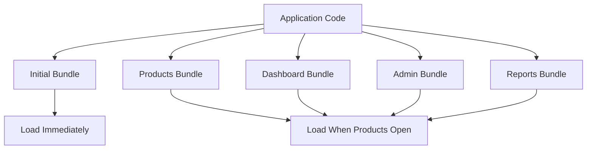

Users should not download administrative or rarely used features during the initial page load if they do not need them.

---

# 14. Lazy Loading

Lazy loading delays work until it is needed.

Examples:

- Images below the fold
- Video players
- Maps
- Comments
- Large data tables
- Chart libraries
- Advanced editors
- Secondary dialogs

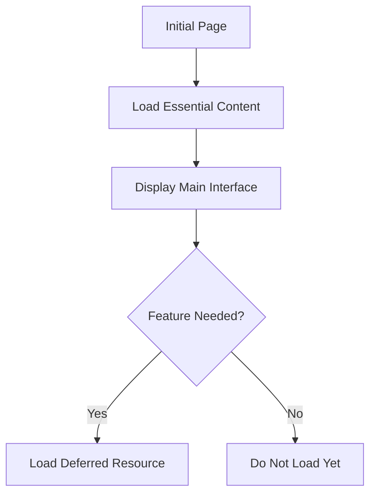

Do not lazy-load content that users need immediately.

---

# 15. Image Optimization

Images often dominate page weight.

Optimize:

```text
Dimensions
Format
Compression
Quality
Loading priority
Responsive variants
```

Use:

- WebP
- AVIF
- JPEG
- PNG when transparency is required
- SVG for suitable vector graphics

Serve appropriate dimensions:

```html

```

---

# 16. Image Loading Strategy

Important above-the-fold image:

```html

```

Below-the-fold image:

```html

```

Do not mark every image as high priority. Priority hints should reflect actual importance.

---

# 17. Font Performance

Fonts can affect:

- First render
- Text visibility
- Layout stability
- Brand appearance
- Page weight

Potential improvements:

- Use fewer font families
- Use fewer font weights
- Subset character ranges
- Use modern font formats
- Preload only critical fonts
- Use appropriate `font-display`
- Avoid unnecessary third-party font requests

```css
@font-face {
  font-family: "Example";
  src: url("/fonts/example.woff2") format("woff2");
  font-display: swap;
}
```

---

# 18. CSS Performance

CSS can affect rendering through:

- File size
- Selector complexity
- Blocking behavior
- Recalculation
- Unused styles
- Layout changes

Possible improvements:

```text
Remove unused CSS
Split critical and noncritical styles
Minify CSS
Avoid unnecessary imports
Reduce complex selectors
Use stable layout rules
```

Do not optimize CSS at the expense of maintainability without evidence.

---

# 19. Third-Party Scripts

Third-party scripts may include:

- Analytics
- Advertising
- Chat widgets
- Social integrations
- A/B testing
- Customer support tools
- Payment widgets

They can affect:

- Page speed
- Privacy
- Reliability
- Security
- Main-thread usage
- Network request count

A third-party script can slow the page even if your own code is efficient.

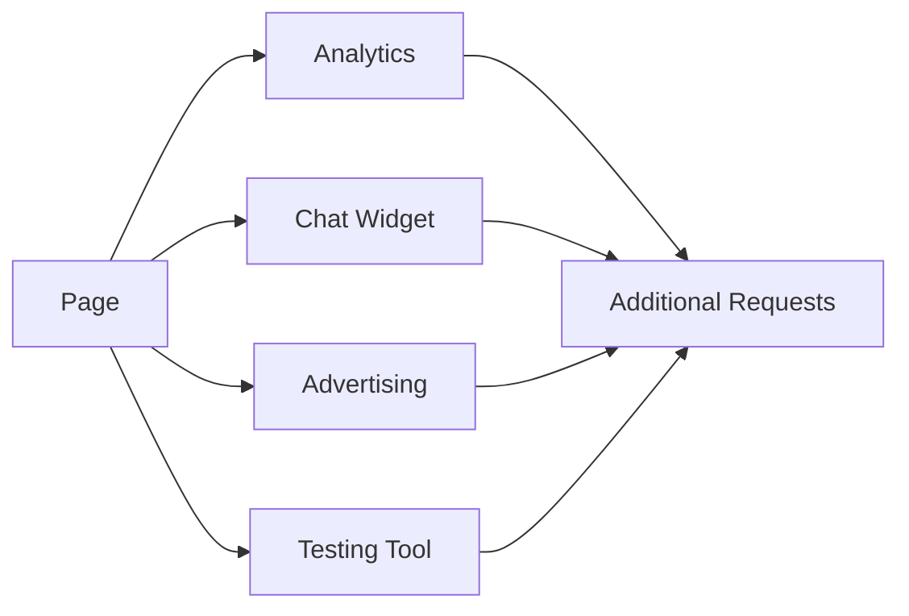

Load third-party code only when necessary.

---

# 20. Network Performance

Network performance involves:

```text
DNS
Connection setup
TLS
Request travel
Server response
Response download
```

A useful timeline:

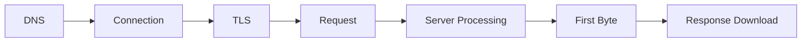

Use the browser Network panel or cURL timing output to identify which stage is slow.

---

# 21. DNS Performance

DNS can be slow when:

- The result is not cached
- The resolver is slow
- Many third-party domains are used
- DNS configuration is poor
- Network conditions are bad

Reduce unnecessary DNS lookups by:

- Limiting third-party domains
- Reusing domains where practical
- Using reliable DNS providers
- Avoiding excessive asset hostnames
- Monitoring DNS performance

---

# 22. Connection Reuse

Establishing connections has overhead.

Browsers can reuse connections through:

- Keep-alive
- HTTP/2 multiplexing
- HTTP/3 and QUIC
- Connection pooling

A page that makes many requests to many domains may require many connection setups.

Use the same domain strategically, but do not combine unrelated security boundaries carelessly.

---

# 23. Compression

Compress text-based responses:

```http
Content-Encoding: br
```

or:

```http
Content-Encoding: gzip
```

Good compression targets:

```text
HTML
CSS
JavaScript
JSON
XML
Plain text
SVG
```

Already-compressed assets may not benefit much:

```text
JPEG
PNG
WebP
AVIF
MP4
ZIP
PDF
```

Inspect:

```text
Transferred size
Decoded size
Content-Encoding
```

---

# 24. Response Payload Size

Large API responses increase:

- Network time
- Parsing time
- Memory use
- Rendering work
- Battery consumption
- Backend serialization cost

Reduce payload size through:

- Pagination
- Field selection
- Compression
- Filtering
- Smaller representations
- Avoiding unnecessary embedded relationships
- Separate endpoints for rarely needed data

---

# 25. API Performance

An API request may involve:

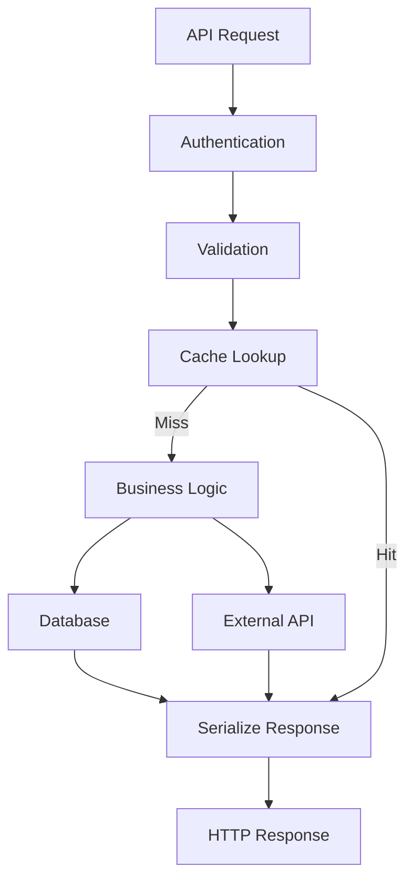

Possible bottlenecks:

- Authentication provider
- Database query
- External API
- Serialization
- Large response
- Connection pool
- Lock contention
- Cache miss

Measure each part with logs and traces.

---

# 26. Time to First Byte

TTFB includes time before the first response byte is received.

It can be affected by:

- DNS
- Connection
- TLS
- Server queue
- Application code
- Database
- External services
- Cache misses

A high TTFB suggests that the server or network is delaying the beginning of the response.

---

# 27. API Pagination

Avoid returning huge collections:

```http
GET /api/products
```

with millions of records.

Use:

```http
GET /api/products?page=1&limit=20
```

or:

```http
GET /api/products?limit=20&after=cursor_abc
```

Pagination improves:

- Response size
- Database work
- Memory usage
- Browser rendering
- Network transfer
- User experience

---

# 28. API Field Selection

If supported:

```http
GET /api/users/42?fields=id,name
```

This reduces unnecessary data.

GraphQL naturally supports field selection:

```graphql
query {
  user(id: "42") {
    id
    name
  }
}
```

Field selection must respect authorization. Clients must not be allowed to request private fields simply by naming them.

---

# 29. Database Query Performance

Investigate:

```text
Query duration
Rows examined
Rows returned
Index usage
Join count
Lock wait
Connection wait
Result size
```

A query may be slow because:

- No index exists
- The query returns too much data
- A join is inefficient
- A function prevents index use
- The database is overloaded
- Lock contention exists
- The application performs many repeated queries

---

# 30. Database Indexing

Indexes can accelerate lookups.

Example query:

```sql
SELECT *
FROM products
WHERE category = 'keyboards';
```

A category index may help:

```sql
CREATE INDEX products_category_idx
ON products(category);
```

Indexes also have costs:

- Additional storage
- Slower writes
- Maintenance overhead
- Possible poor selectivity

Use query plans and measurements rather than adding indexes blindly.

---

# 31. N+1 Queries

An N+1 query pattern can severely hurt performance.

Example:

```text
1 query:
  Load 100 orders

100 additional queries:
  Load items for each order
```

Total:

```text
101 queries
```

Possible solutions:

- Join
- Batch query
- Eager loading
- Data loader
- Aggregation
- Caching

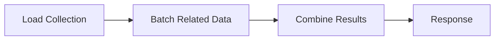

---

# 32. Database Connection Pools

Connection pooling reuses database connections.

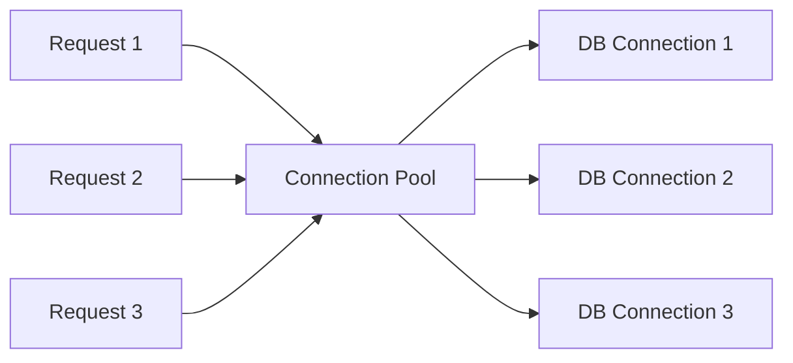

Too few connections cause waiting.

Too many connections overwhelm the database.

Monitor:

```text
Pool size
Active connections
Idle connections
Wait time
Connection errors
```

---

# 33. Caching Performance

Caching can reduce expensive work:

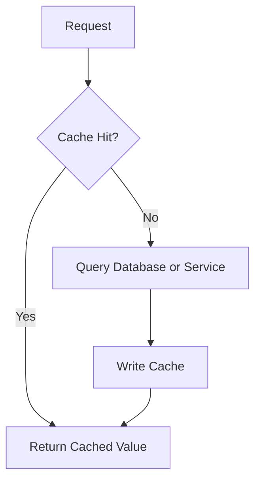

Possible cached data:

- Public product lists
- Configuration
- Session metadata
- Search results
- Computed reports
- Images
- API responses

Be cautious caching:

- Private account data
- Payment details
- Permission-sensitive responses
- Frequently changing inventory
- Personalized content

---

# 34. Cache Invalidation Performance

Cache invalidation strategies:

## Time-based

```text
Expire after 60 seconds.
```

## Event-based

```text
When product changes, invalidate product cache.
```

## Versioned

```text
/product/123?v=5
```

## Stale-while-revalidate

```text
Return cached value immediately.
Refresh it in the background.
```

Each strategy trades freshness, complexity, and performance.

---

# 35. CDN Performance

A CDN can reduce distance between users and static content.

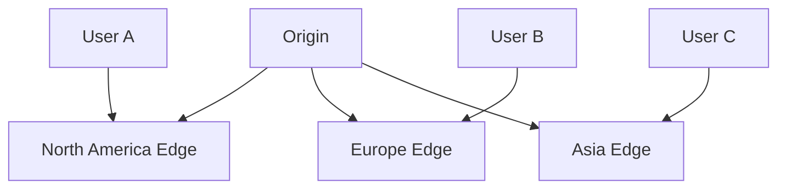

Measure:

```text
Cache hit rate
Edge response time
Origin fetch time
Transferred size
Geographic latency
```

A CDN cannot fix slow dynamic database queries unless dynamic responses are also cached or optimized.

---

# 36. Browser Caching

Use cache headers for static assets.

A versioned asset:

```text
/app.abc123.js
```

may safely use:

```http
Cache-Control: public, max-age=31536000, immutable
```

When the file changes:

```text
/app.def456.js
```

The new filename avoids stale content.

---

# 37. Cache Busting

Cache busting changes an asset URL when the asset changes.

Examples:

```text
app.abc123.js
styles.def456.css
image.v5.webp
```

Avoid relying only on:

```text
app.js?v=2
```

unless your cache and deployment systems handle query-based versioning consistently.

---

# 38. Rendering Performance

Rendering performance involves:

- DOM size
- Style recalculation
- Layout
- Paint
- Composite layers
- JavaScript event handlers
- Animation work

A very large DOM can slow:

- Initial render
- Style calculations
- Layout
- Updates
- Accessibility processing

---

# 39. Large Lists and Virtualization

Rendering thousands of rows at once can be expensive.

Virtualization renders only visible rows.

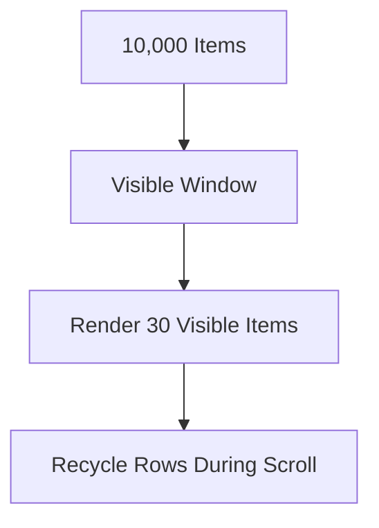

This is useful for:

- Data tables
- Chat history
- Activity feeds
- Search results
- Large lists

---

# 40. JavaScript Event Performance

Expensive event handlers can cause lag.

Examples:

- Scroll handler doing heavy work
- Keypress handler sending a request on every character
- Resize handler recalculating large layouts
- Mouse movement triggering expensive calculations

Use:

- Debouncing
- Throttling
- Request cancellation
- Passive listeners where appropriate
- Work scheduling
- Smaller updates

---

# 41. Debouncing

Debouncing waits until activity stops before performing an operation.

Useful for search:

```text
User types:
  k
  ke
  key
  keyb
  keybo

Wait briefly after typing stops.
Send one search request.
```


Without debouncing, one request may be sent for every keystroke.

---

# 42. Throttling

Throttling limits how frequently an operation runs.

Useful for:

- Scroll events
- Resize events
- Mouse movement
- Progress updates

Example:

```text
Scroll event occurs 100 times per second.
Run handler at most 10 times per second.
```

---

# 43. Web Workers

Web Workers move certain CPU-intensive work away from the main browser thread.

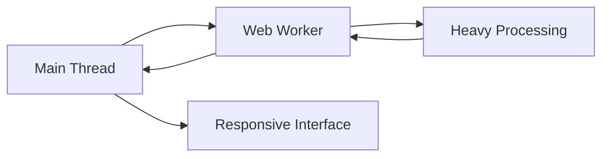

Potential uses:

- Parsing large data
- Image processing
- Complex calculations
- Search indexing
- Cryptographic work

Workers cannot directly manipulate the DOM.

---

# 44. Backend Concurrency

Backend performance depends on how it handles concurrent requests.

Potential limits include:

- CPU
- Memory
- Thread pool
- Event loop
- Database connections
- File descriptors
- Queue workers
- External service rate limits

An application may be fast for one request but slow under concurrency.

Test expected levels of simultaneous traffic in a controlled environment.

---

# 45. Load Testing Metrics

Measure:

```text
Requests per second
Concurrent users
P50 latency
P95 latency
P99 latency
Error rate
CPU
Memory
Database load
Queue depth
Cache hit rate
```

Average latency alone can hide poor experiences.

Example:

```text
Average: 100 ms
P95: 400 ms
P99: 5,000 ms
```

A small group of users may be experiencing severe delays.

---

# 46. Backpressure

Backpressure occurs when work arrives faster than a system can process it.

Examples:

```text
Incoming requests > application capacity
Messages arriving > worker capacity
Uploads arriving > processing capacity
```

Possible responses:

- Queue work
- Apply rate limits
- Reject requests
- Reduce payload size
- Scale workers
- Slow producers
- Apply load shedding

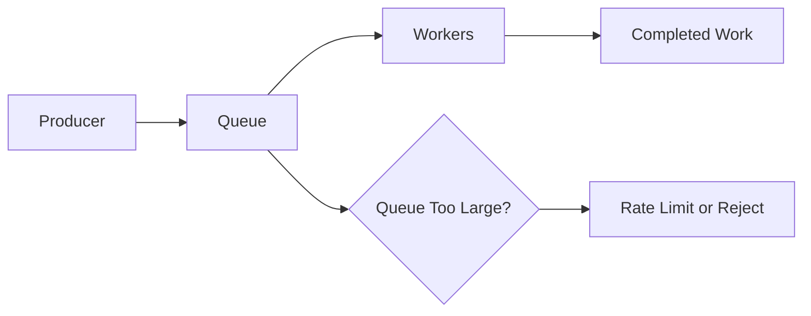

---

# 47. Timeouts and Retries

Every external dependency should have a timeout.

Dependencies include:

- Database
- Payment provider
- Email provider
- Search service
- Internal API
- Storage service

A retry policy should define:

```text
Which errors are retryable?
How many retries?
How long between attempts?
Is the operation idempotent?
What happens after retries fail?
```

Use exponential backoff and jitter where appropriate.

---

# 48. Circuit Breakers

A circuit breaker prevents repeated calls to a failing service.

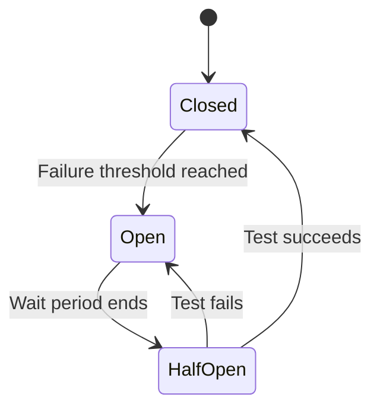

This protects the main application from cascading failure.

---

# 49. Graceful Degradation

If an optional feature fails, preserve the main experience.

Examples:

```text
Recommendations fail:
  Show product page without recommendations.

Analytics fails:
  Continue serving the application.

Avatar service fails:
  Show a default avatar.

Email provider fails:
  Queue email for later delivery.
```

```mermaid
flowchart TD
    R[Main Request] --> P[Primary Data]
    R --> O1[Optional Recommendations]
    R --> O2[Optional Analytics]

    P --> U[Usable Page]
    O1 -->|Failure| D1[Use Default or Empty State]
    O2 -->|Failure| D2[Continue Without Analytics]
    D1 --> U
    D2 --> U
```

---

# 50. Performance Monitoring

Useful production metrics include:

```text
Request count
Error rate
Latency percentiles
TTFB
Cache hit rate
Database query latency
External API latency
Queue depth
CPU
Memory
Garbage collection
Page load metrics
JavaScript errors
```

Organize dashboards by user experience and system health.

```mermaid
flowchart TD
    M[Metrics] --> U[User Experience Dashboard]
    M --> API[API Dashboard]
    M --> DB[Database Dashboard]
    M --> INFRA[Infrastructure Dashboard]
    M --> SEC[Security Dashboard]
```

---

# 51. Real User Monitoring

Real User Monitoring, or RUM, collects performance data from actual users.

It can reveal differences by:

- Country
- Device
- Browser
- Network
- Page
- User type
- Connection speed

Lab testing gives controlled results.

RUM shows real-world conditions.

Use privacy-conscious collection and avoid recording unnecessary sensitive information.

---

# 52. Performance Debugging Workflow

```mermaid
flowchart TD
    A[Users Report Slowness] --> B[Measure Real Requests]
    B --> C[Inspect Browser Network]
    C --> D[Inspect Server Timing]
    D --> E[Inspect Database Queries]
    E --> F[Inspect External Dependencies]
    F --> G[Identify Bottleneck]
    G --> H[Optimize One Layer]
    H --> I[Measure Again]
```

Questions:

```text
Is the request slow before reaching the server?
Is TTFB high?
Is the response large?
Is the database slow?
Is an external service slow?
Is JavaScript blocking the browser?
Is the page waiting for nonessential data?
```

---

# 53. Performance Testing Checklist

## Browser

```text
[ ] Initial JavaScript is appropriately sized.
[ ] Code is split by route or feature.
[ ] Noncritical features are lazy-loaded.
[ ] Images have dimensions.
[ ] Images are compressed and responsive.
[ ] Fonts are limited and optimized.
[ ] The DOM is not unnecessarily large.
[ ] Long tasks are investigated.
[ ] Input remains responsive.
[ ] Layout shifts are minimized.
```

## Network

```text
[ ] DNS is reliable.
[ ] HTTPS connections are reused.
[ ] Compression is enabled for text.
[ ] Cache headers are deliberate.
[ ] CDN is used where appropriate.
[ ] API payloads are bounded.
[ ] Requests are not unnecessarily serialized.
[ ] Third-party domains are limited.
```

## API

```text
[ ] Responses are paginated.
[ ] Fields are not over-fetched.
[ ] Expensive operations are asynchronous.
[ ] Timeouts are configured.
[ ] Retries are bounded.
[ ] Idempotency is supported where needed.
[ ] Response schemas are stable.
```

## Database

```text
[ ] Slow queries are measured.
[ ] Appropriate indexes exist.
[ ] N+1 queries are avoided.
[ ] Connection pools are sized.
[ ] Transactions are not unnecessarily long.
[ ] Large result sets are limited.
[ ] Replicas are used appropriately.
```

## Production

```text
[ ] Latency percentiles are monitored.
[ ] Error rates are monitored.
[ ] Cache hit rate is monitored.
[ ] Queue depth is monitored.
[ ] Resource saturation is monitored.
[ ] Real-user performance is measured.
[ ] Performance budgets exist.
```

---

# 54. Performance Anti-Patterns

## Loading everything immediately

```text
Entire application
All images
All data
All charts
All third-party scripts
```

This increases initial work.

## Returning unlimited collections

A single API response should not contain millions of records.

## Serializing unnecessary data

Do not send fields that the client does not need.

## Performing synchronous work unnecessarily

Do not make the user wait for an email, report, or video conversion if it can happen in the background.

## Ignoring mobile devices

A powerful developer laptop may hide CPU and network problems.

## Adding caches without invalidation rules

Stale data can be incorrect or dangerous.

## Optimizing without measuring

A change that seems beneficial may have no real impact or may make another area worse.

---

# 55. Final Performance Mental Model

Web performance is the combined result of:

```mermaid
flowchart TD
    P[Performance] --> N[Network]
    P --> S[Server]
    P --> D[Database]
    P --> C[Caching]
    P --> A[Assets]
    P --> J[JavaScript]
    P --> R[Rendering]
    P --> U[User Experience]
```

The most important process is:

```text
Measure
  ↓
Locate the bottleneck
  ↓
Choose the smallest useful improvement
  ↓
Test under realistic conditions
  ↓
Measure again
  ↓
Monitor in production
```

A fast application is not merely one with a low average response time.

It is an application that:

- Shows useful content quickly
- Responds smoothly to interaction
- Sends efficient requests
- Uses appropriate caching
- Avoids unnecessary work
- Handles slow networks gracefully
- Protects backend capacity
- Remains responsive under realistic load
