# Appendix K — Web Troubleshooting Decision Trees  
## Diagnosing Frontend, Network, HTTP, API, Authentication, Database, Performance, and Production Problems

Troubleshooting is the process of moving from:

```text
Something is broken
```

to:

```text
This specific layer failed for this specific reason.
```

A web application contains many interconnected components, so the same visible symptom can have different causes.

For example:

```text
“The page does not load”
```

could mean:

- The browser crashed
- DNS failed
- The network is offline
- TLS failed
- The server returned `500`
- The frontend received unexpected HTML
- The database timed out
- The browser blocked a cross-origin response
- A service worker returned stale content
- The page loaded but JavaScript failed to initialize

A good troubleshooting process narrows the problem systematically.

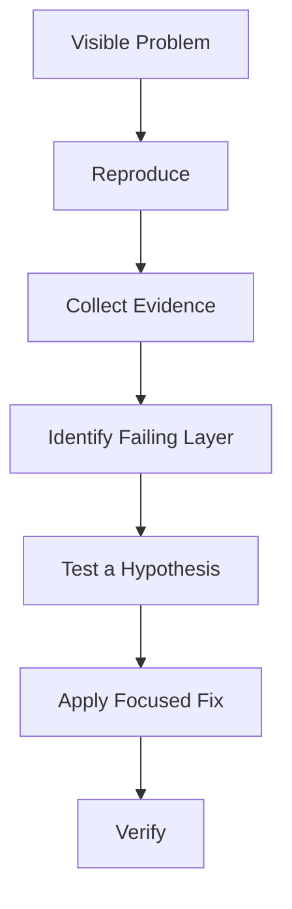
```mermaid
flowchart TD
    A[Visible Problem] --> B[Reproduce]
    B --> C[Collect Evidence]
    C --> D[Identify Failing Layer]
    D --> E[Test a Hypothesis]
    E --> F[Apply Focused Fix]
    F --> G[Verify]
```

---

# 1. The Core Troubleshooting Principles

## Principle 1: Reproduce the problem

Before changing code, reproduce the behavior deliberately.

Record:

```text
What action caused the problem?
Which user?
Which browser?
Which device?
Which environment?
How often does it happen?
```

## Principle 2: Separate symptoms from causes

Example:

```text
Symptom:
  Button does nothing.

Possible causes:
  Event handler failed.
  Request was never created.
  Request returned 401.
  Request returned 500.
  Response parsing failed.
  UI state failed to update.
```

## Principle 3: Inspect evidence

Useful evidence includes:

- Console messages
- Network requests
- Request headers
- Request payloads
- Response status
- Response body
- Timing data
- Cookies
- Server logs
- Database logs
- Traces
- Deployment history

## Principle 4: Change one thing at a time

If you change five components simultaneously, you may not know which change mattered.

## Principle 5: Verify the fix

A fix is not complete until:

- The original issue no longer occurs.
- Related behavior still works.
- The fix works in the affected environment.
- Automated tests or regression tests are added where appropriate.

---

# 2. Universal Troubleshooting Flow

Use this as a general starting point:

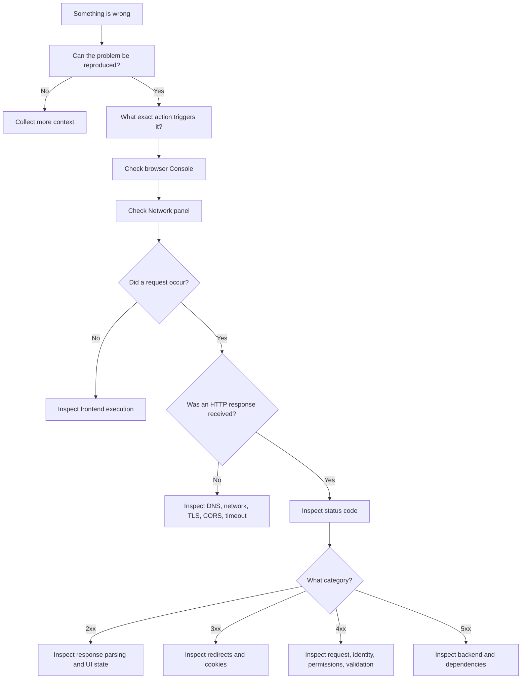
```mermaid
flowchart TD
    A[Something is wrong] --> B[Can the problem be reproduced?]
    B -->|No| C[Collect more context]
    B -->|Yes| D[What exact action triggers it?]
    D --> E[Check browser Console]
    E --> F[Check Network panel]
    F --> G{Did a request occur?}
    G -->|No| H[Inspect frontend execution]
    G -->|Yes| I{Was an HTTP response received?}
    I -->|No| J[Inspect DNS, network, TLS, CORS, timeout]
    I -->|Yes| K[Inspect status code]
    K --> L{What category?}
    L -->|2xx| M[Inspect response parsing and UI state]
    L -->|3xx| N[Inspect redirects and cookies]
    L -->|4xx| O[Inspect request, identity, permissions, validation]
    L -->|5xx| P[Inspect backend and dependencies]
```

---

# 3. Start with Context

Before debugging, record:

```text
Environment:
  Development, staging, or production

URL:
  Exact page or endpoint

User:
  Anonymous, regular user, administrator, service account

Browser:
  Browser name and version

Device:
  Desktop, mobile, tablet

Network:
  Office, home, VPN, cellular, public Wi-Fi

Time:
  When did the problem occur?

Frequency:
  Always, sometimes, one user, many users

Recent changes:
  Deployment, configuration, database migration, dependency update
```

Different context can produce different behavior.

---

# 4. The “Page Does Not Load” Decision Tree

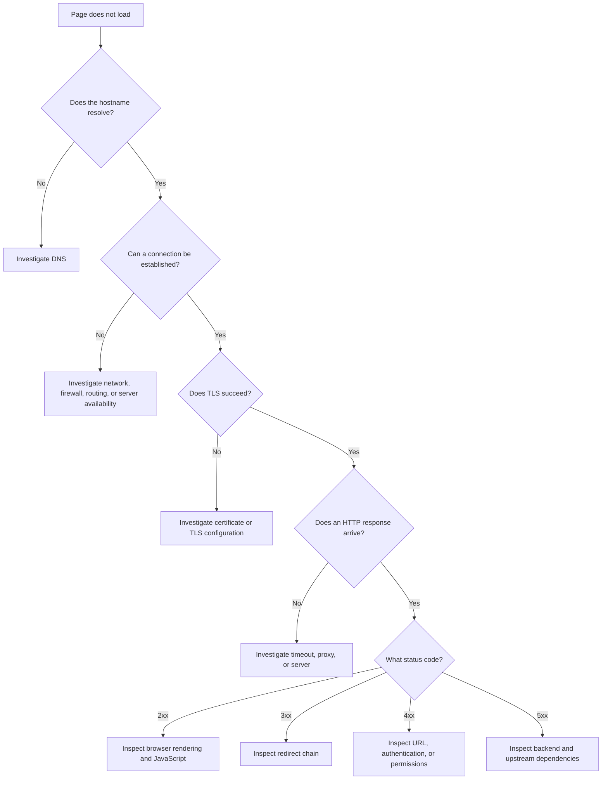
```mermaid
flowchart TD
    A[Page does not load] --> B{Does the hostname resolve?}
    B -->|No| C[Investigate DNS]
    B -->|Yes| D{Can a connection be established?}
    D -->|No| E[Investigate network, firewall, routing, or server availability]
    D -->|Yes| F{Does TLS succeed?}
    F -->|No| G[Investigate certificate or TLS configuration]
    F -->|Yes| H{Does an HTTP response arrive?}
    H -->|No| I[Investigate timeout, proxy, or server]
    H -->|Yes| J{What status code?}
    J -->|2xx| K[Inspect browser rendering and JavaScript]
    J -->|3xx| L[Inspect redirect chain]
    J -->|4xx| M[Inspect URL, authentication, or permissions]
    J -->|5xx| N[Inspect backend and upstream dependencies]
```

---

# 5. DNS Failure

## Symptoms

- Browser reports that the domain cannot be found.
- Other websites work.
- `nslookup` or `dig` fails.
- No HTTP request appears in the Network panel.
- cURL reports “Could not resolve host.”

## Tests

```bash
nslookup example.com
```

```bash
dig example.com
```

```bash
curl -v https://example.com
```

## Possible causes

- Typo in hostname
- Missing DNS record
- DNS record recently changed
- Resolver outage
- Local DNS configuration problem
- VPN or corporate DNS issue
- Domain expired
- Incorrect nameserver delegation

## Decision tree

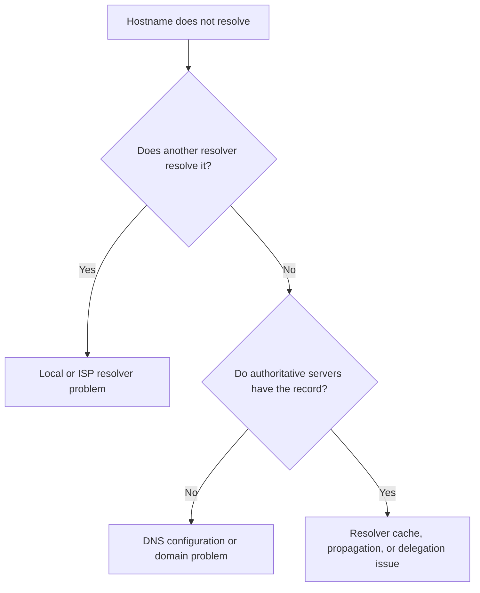
```mermaid
flowchart TD
    A[Hostname does not resolve] --> B{Does another resolver resolve it?}
    B -->|Yes| C[Local or ISP resolver problem]
    B -->|No| D{Do authoritative servers have the record?}
    D -->|No| E[DNS configuration or domain problem]
    D -->|Yes| F[Resolver cache, propagation, or delegation issue]
```

## Useful checks

```bash
nslookup example.com 1.1.1.1
```

```bash
nslookup example.com 8.8.8.8
```

Compare the result with your default resolver.

---

# 6. Connection Failure

## Symptoms

- `ERR_CONNECTION_REFUSED`
- `ERR_CONNECTION_TIMED_OUT`
- cURL exit code `7`
- DNS works, but the server cannot be reached
- No HTTP response arrives

## Possible causes

- Server is down
- Port is closed
- Firewall blocks traffic
- Wrong port
- Load balancer has no healthy backends
- Network route is broken
- Service is listening only on localhost
- VPN is required

## Diagnostic sequence

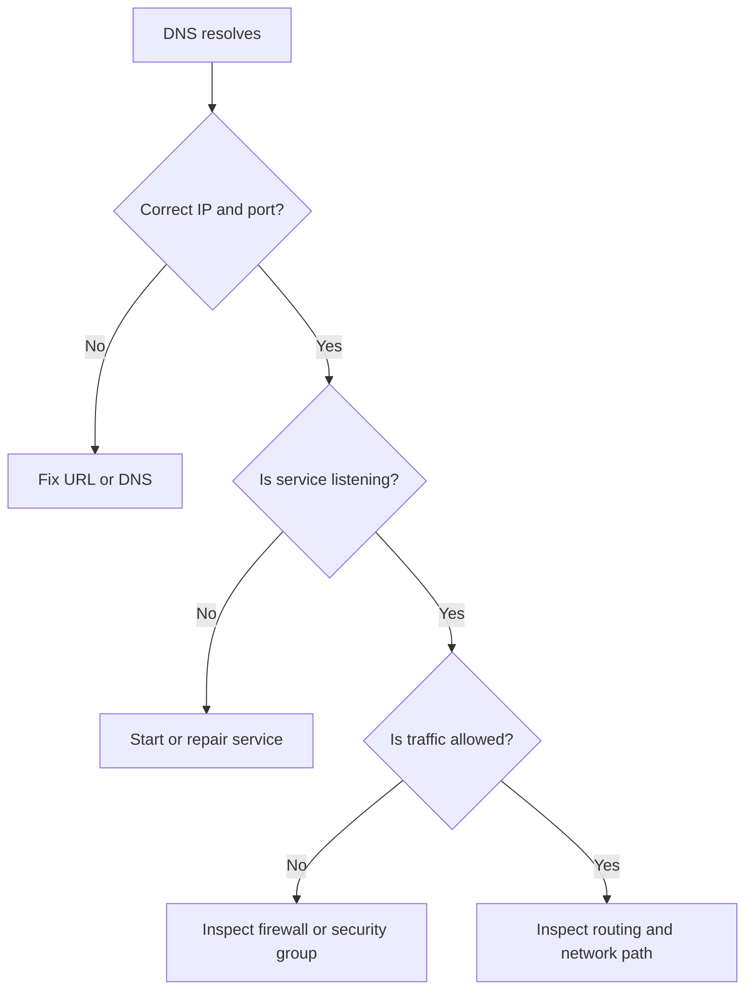
```mermaid
flowchart TD
    A[DNS resolves] --> B{Correct IP and port?}
    B -->|No| C[Fix URL or DNS]
    B -->|Yes| D{Is service listening?}
    D -->|No| E[Start or repair service]
    D -->|Yes| F{Is traffic allowed?}
    F -->|No| G[Inspect firewall or security group]
    F -->|Yes| H[Inspect routing and network path]
```

For local development, confirm the process is running:

```bash
curl -v http://localhost:3000
```

---

# 7. TLS or Certificate Failure

## Symptoms

- Certificate warning
- `ERR_CERT_DATE_INVALID`
- `ERR_CERT_COMMON_NAME_INVALID`
- cURL certificate verification failure
- HTTPS connection cannot be established

## Possible causes

- Expired certificate
- Certificate hostname mismatch
- Missing intermediate certificate
- Incorrect server clock
- Self-signed certificate
- TLS version incompatibility
- Intercepting proxy
- Incorrect certificate deployed

## Diagnostic command

```bash
curl -v https://example.com
```

Inspect:

```text
Certificate subject
Certificate issuer
Expiration
Hostname
TLS version
Certificate chain
```

## Decision tree

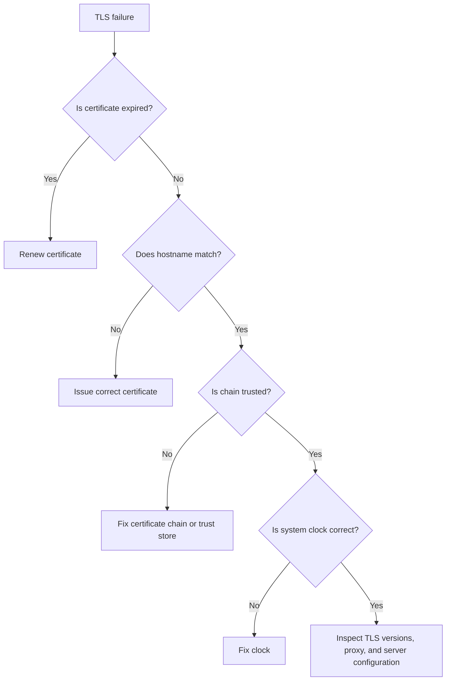
```mermaid
flowchart TD
    A[TLS failure] --> B{Is certificate expired?}
    B -->|Yes| C[Renew certificate]
    B -->|No| D{Does hostname match?}
    D -->|No| E[Issue correct certificate]
    D -->|Yes| F{Is chain trusted?}
    F -->|No| G[Fix certificate chain or trust store]
    F -->|Yes| H{Is system clock correct?}
    H -->|No| I[Fix clock]
    H -->|Yes| J[Inspect TLS versions, proxy, and server configuration]
```

Do not use `curl -k` as a permanent solution. It disables certificate verification.

---

# 8. Page Loads but Is Blank

## Symptoms

- HTML request succeeds.
- Browser displays a blank page.
- Console contains JavaScript errors.
- API requests may not occur.

## Possible causes

- JavaScript initialization failed
- Runtime exception
- Incorrect root element
- CSS hides the application
- Frontend bundle failed to load
- Hydration failed
- Environment variable missing
- Router configuration problem

## Decision tree

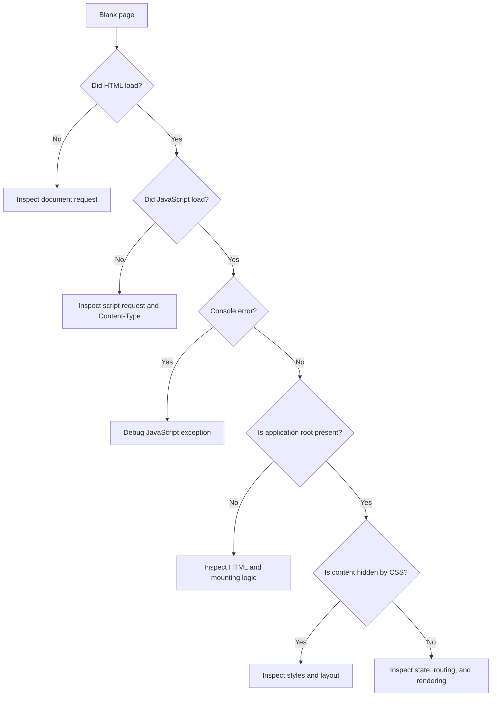
```mermaid
flowchart TD
    A[Blank page] --> B{Did HTML load?}
    B -->|No| C[Inspect document request]
    B -->|Yes| D{Did JavaScript load?}
    D -->|No| E[Inspect script request and Content-Type]
    D -->|Yes| F{Console error?}
    F -->|Yes| G[Debug JavaScript exception]
    F -->|No| H{Is application root present?}
    H -->|No| I[Inspect HTML and mounting logic]
    H -->|Yes| J{Is content hidden by CSS?}
    J -->|Yes| K[Inspect styles and layout]
    J -->|No| L[Inspect state, routing, and rendering]
```

---

# 9. Button Does Nothing

## Step-by-step investigation

```text
1. Open Console.
2. Clear messages.
3. Open Network.
4. Clear old requests.
5. Click the button once.
6. Check whether a request appears.
```

## Decision tree

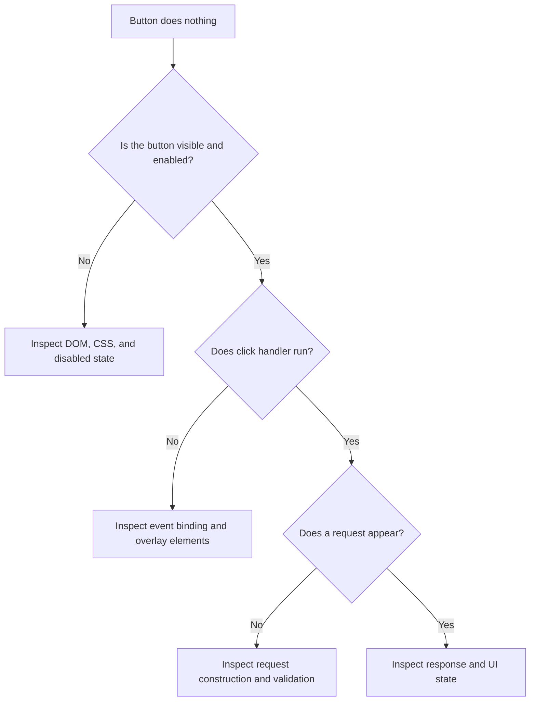
```mermaid
flowchart TD
    A[Button does nothing] --> B{Is the button visible and enabled?}
    B -->|No| C[Inspect DOM, CSS, and disabled state]
    B -->|Yes| D{Does click handler run?}
    D -->|No| E[Inspect event binding and overlay elements]
    D -->|Yes| F{Does a request appear?}
    F -->|No| G[Inspect request construction and validation]
    F -->|Yes| H[Inspect response and UI state]
```

## Common causes

- Button is disabled
- An invisible element covers it
- Event listener was not registered
- JavaScript exception occurred earlier
- Form submission reloads the page
- Request is blocked before creation
- Response succeeds but state does not update

---

# 10. Request Never Appears

If no request appears in the Network panel:

```text
The failure probably occurred before network transmission.
```

Possible causes:

- Event handler did not run
- Validation returned early
- JavaScript exception
- Incorrect conditional
- Request function was not called
- Button is not connected to the expected handler
- Form prevented submission incorrectly
- Component was unmounted
- Request was sent through a service worker or different mechanism

Use a breakpoint or temporary diagnostic log:

```javascript
console.log("Handler started");
```

Then:

```javascript
console.log("About to send request");
```

If the first appears but the second does not, inspect the logic between them.

---

# 11. Request Appears but Fails Before Response

## Symptoms

- Request appears in Network.
- Status may show `(failed)`.
- No normal HTTP response.
- Console may report `Failed to fetch`.

## Possible causes

- DNS
- Connection
- TLS
- CORS
- Browser extension
- Offline state
- Request cancellation
- Timeout
- Service worker failure

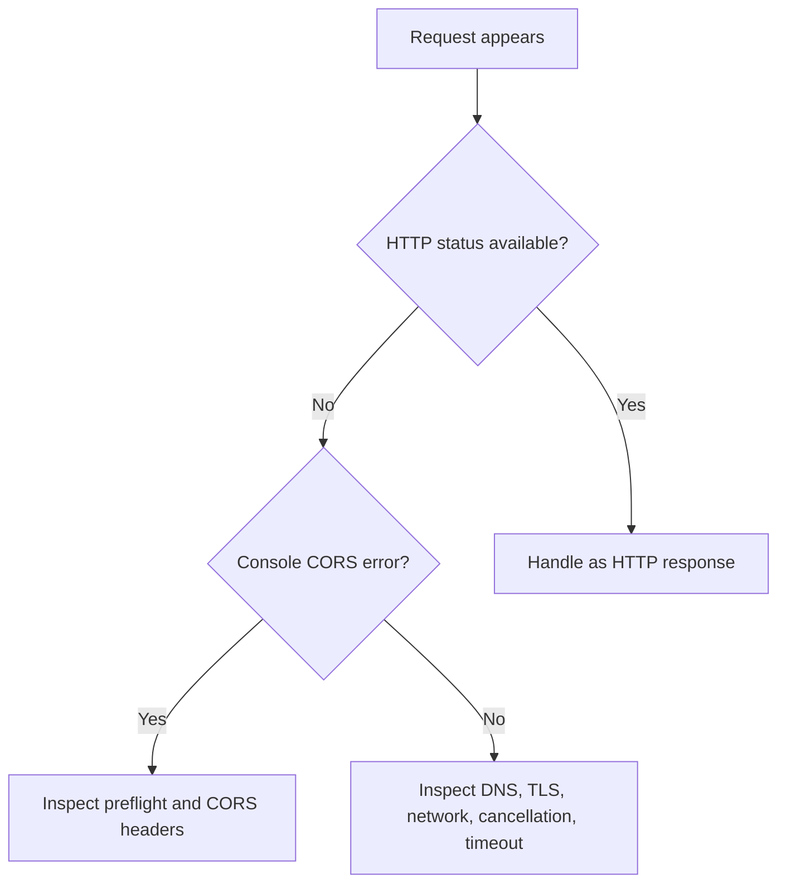
```mermaid
flowchart TD
    A[Request appears] --> B{HTTP status available?}
    B -->|No| C{Console CORS error?}
    C -->|Yes| D[Inspect preflight and CORS headers]
    C -->|No| E[Inspect DNS, TLS, network, cancellation, timeout]
    B -->|Yes| F[Handle as HTTP response]
```

---

# 12. `401 Unauthorized`

## Meaning

Authentication is missing, invalid, or expired.

## Checklist

```text
[ ] Is a cookie being sent?
[ ] Is the Authorization header present?
[ ] Is the token expired?
[ ] Is the token for the correct environment?
[ ] Did login succeed?
[ ] Did login set a cookie?
[ ] Is the cookie domain correct?
[ ] Is Secure preventing transmission over HTTP?
[ ] Is SameSite affecting the request?
[ ] Is the server using the expected authentication provider?
```

## Diagnostic flow

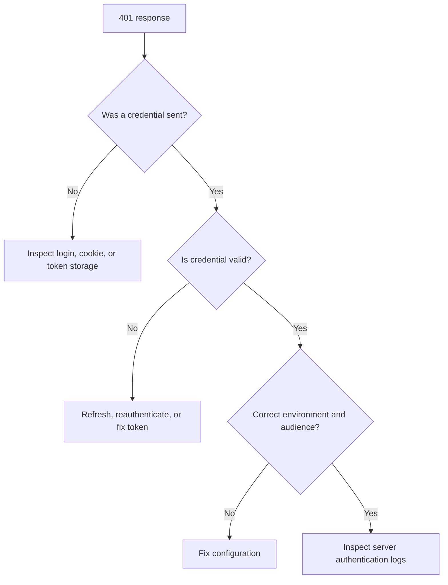
```mermaid
flowchart TD
    A[401 response] --> B{Was a credential sent?}
    B -->|No| C[Inspect login, cookie, or token storage]
    B -->|Yes| D{Is credential valid?}
    D -->|No| E[Refresh, reauthenticate, or fix token]
    D -->|Yes| F{Correct environment and audience?}
    F -->|No| G[Fix configuration]
    F -->|Yes| H[Inspect server authentication logs]
```

---

# 13. `403 Forbidden`

## Meaning

The server knows the caller but denies the operation.

## Checklist

```text
[ ] Is the user’s role correct?
[ ] Does the user own the resource?
[ ] Is the user in the correct organization?
[ ] Is the account active?
[ ] Does the subscription permit the feature?
[ ] Is the endpoint restricted to administrators?
[ ] Is the service account scope sufficient?
```

Do not solve a `403` by merely showing or hiding a button. The server must enforce the permission.

---

# 14. `404 Not Found`

## Possible causes

- Wrong URL
- Wrong path spelling
- Wrong API version
- Wrong environment
- Resource does not exist
- Missing trailing slash
- Incorrect path parameter
- Route not deployed
- Reverse proxy routing error

## Compare

```text
Expected:
  /api/products/123

Actual:
  /api/product/123
```

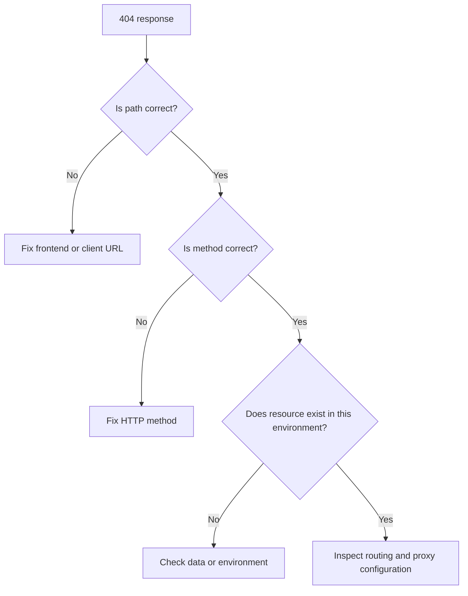
```mermaid
flowchart TD
    A[404 response] --> B{Is path correct?}
    B -->|No| C[Fix frontend or client URL]
    B -->|Yes| D{Is method correct?}
    D -->|No| E[Fix HTTP method]
    D -->|Yes| F{Does resource exist in this environment?}
    F -->|No| G[Check data or environment]
    F -->|Yes| H[Inspect routing and proxy configuration]
```

---

# 15. `405 Method Not Allowed`

## Meaning

The route exists, but the method is unsupported.

Example:

```http
DELETE /api/products
```

when only:

```text
GET
POST
```

are supported.

Inspect:

```http
Allow: GET, POST, OPTIONS
```

Fix either:

- The client method
- The backend route
- The API contract
- The documentation

---

# 16. `409 Conflict`

## Meaning

The request conflicts with the current state.

Common examples:

- Duplicate username
- Inventory changed
- Resource version conflict
- Order cannot be cancelled
- Reservation already taken

## Troubleshooting

```text
1. Read the response body.
2. Identify the conflicting state.
3. Refresh the resource.
4. Decide whether to retry or ask the user.
5. Use versioning or idempotency where appropriate.
```

---

# 17. `422 Unprocessable Content`

## Meaning

The request is structurally understandable but fails validation.

Inspect:

- Field names
- Types
- Required fields
- Value ranges
- Formatting
- Cross-field rules

Example:

```json
{
  "error": {
    "fields": {
      "quantity": "Must be greater than zero."
    }
  }
}
```

The frontend should map field errors to the correct controls.

---

# 18. `429 Too Many Requests`

## Possible causes

- Excessive polling
- Frontend request loop
- Repeated login attempts
- Shared IP limit
- API quota exceeded
- Automated script
- Too many retries

## Checklist

```text
[ ] Inspect Retry-After.
[ ] Check whether the frontend is looping.
[ ] Reduce polling frequency.
[ ] Add exponential backoff.
[ ] Check whether multiple tabs are making requests.
[ ] Check API key or account limits.
[ ] Review server rate-limit logs.
```

---

# 19. `500 Internal Server Error`

## Meaning

The server encountered an unexpected failure.

## Client-side steps

```text
1. Save the exact request.
2. Record the timestamp.
3. Record the request ID.
4. Copy the request as cURL.
5. Reproduce it.
6. Inspect server logs.
```

## Server-side checklist

```text
[ ] Application exception
[ ] Database connection
[ ] Query failure
[ ] Missing environment variable
[ ] External API failure
[ ] Invalid data
[ ] Deployment mismatch
[ ] Resource exhaustion
```

Do not infer the root cause from the `500` alone.

---

# 20. `502`, `503`, and `504`

## `502 Bad Gateway`

A gateway received an invalid response from an upstream service.

## `503 Service Unavailable`

The service is unavailable, overloaded, under maintenance, or has no healthy instances.

## `504 Gateway Timeout`

A gateway waited too long for an upstream response.

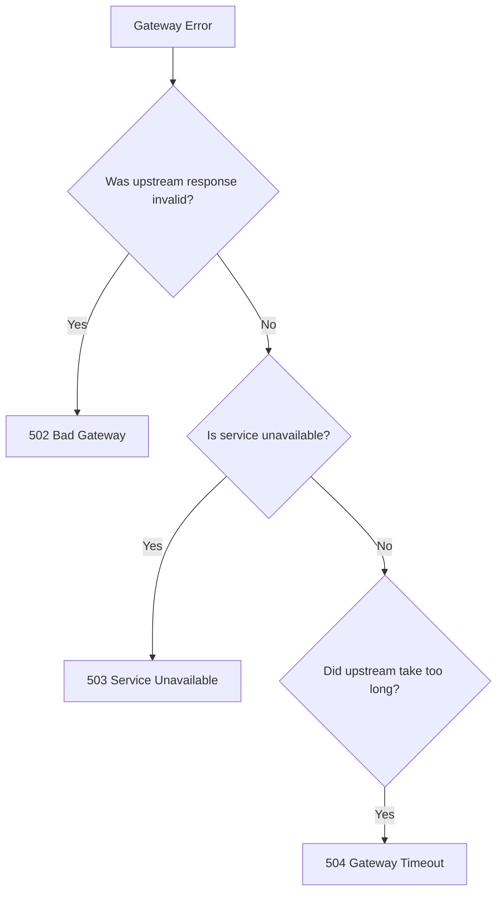
```mermaid
flowchart TD
    A[Gateway Error] --> B{Was upstream response invalid?}
    B -->|Yes| C[502 Bad Gateway]
    B -->|No| D{Is service unavailable?}
    D -->|Yes| E[503 Service Unavailable]
    D -->|No| F{Did upstream take too long?}
    F -->|Yes| G[504 Gateway Timeout]
```

---

# 21. HTML Returned Instead of JSON

## Symptoms

- JSON parsing error
- Response preview displays HTML
- Status may be `200`, `404`, or `500`
- Frontend expected an object but received markup

## Possible causes

- API URL points to frontend server
- Authentication redirects to login HTML
- Reverse proxy fallback
- Wrong environment
- Missing API route
- Server error page

## Checklist

```text
[ ] Check Request URL.
[ ] Check response Content-Type.
[ ] Inspect redirect chain.
[ ] Inspect response body.
[ ] Confirm API base URL.
[ ] Confirm authentication behavior.
```

---

# 22. CORS Failure

## Symptoms

- Console says request blocked by CORS policy.
- Network panel may show a preflight.
- Server may receive the request, but JavaScript cannot read the response.
- cURL succeeds while browser code fails.

## Decision tree

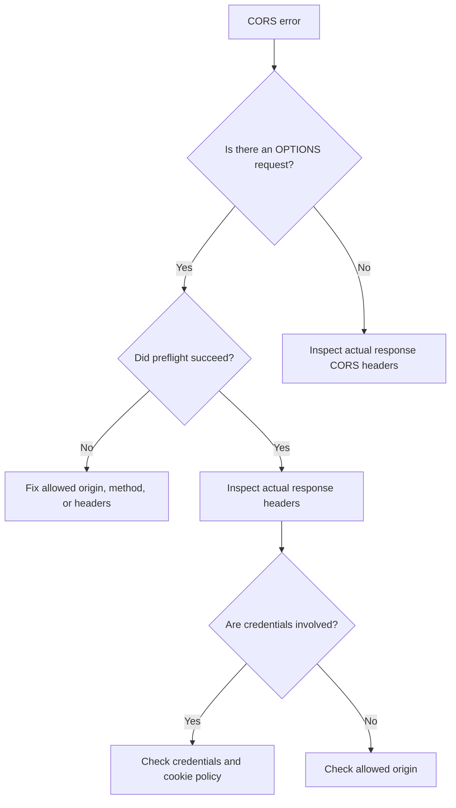
```mermaid
flowchart TD
    A[CORS error] --> B{Is there an OPTIONS request?}
    B -->|Yes| C{Did preflight succeed?}
    C -->|No| D[Fix allowed origin, method, or headers]
    C -->|Yes| E[Inspect actual response headers]
    B -->|No| F[Inspect actual response CORS headers]
    E --> G{Are credentials involved?}
    G -->|Yes| H[Check credentials and cookie policy]
    G -->|No| I[Check allowed origin]
```

---

# 23. Authentication Loop

## Symptoms

```text
/account → /login → /account → /login
```

## Possible causes

- Session cookie not stored
- Cookie domain mismatch
- Cookie path mismatch
- Secure cookie sent over HTTP
- SameSite issue
- Reverse proxy does not recognize HTTPS
- Login callback misconfigured
- Session store unavailable
- Token rejected immediately

## Debugging

Inspect:

```text
Set-Cookie
Cookie
Location
Origin
Protocol
```

---

# 24. Form Submission Reloads the Page

## Symptoms

- Page reloads unexpectedly
- Network request disappears
- State is lost
- Browser navigates to a URL with form parameters

## Possible causes

- `event.preventDefault()` missing
- Form action points to wrong URL
- Button has unintended submit behavior
- JavaScript handler failed before preventing default

Example:

```javascript
form.addEventListener("submit", (event) => {
  event.preventDefault();
  submitForm();
});
```

---

# 25. Duplicate Requests

## Symptoms

- Same request appears multiple times.
- Duplicate orders or messages are created.
- Search fires on every keystroke.
- A component fetches repeatedly.

## Possible causes

- Component rerender loop
- Effect dependency problem
- Double-click
- Retry logic
- Browser prefetch
- Service worker
- Multiple tabs
- Polling not stopped
- Event listener registered multiple times

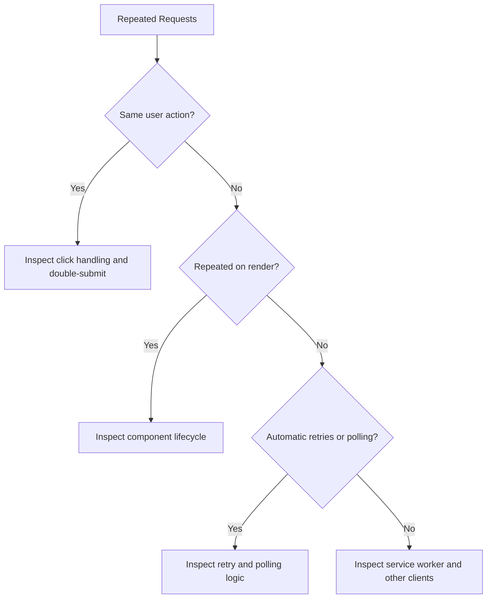
```mermaid
flowchart TD
    A[Repeated Requests] --> B{Same user action?}
    B -->|Yes| C[Inspect click handling and double-submit]
    B -->|No| D{Repeated on render?}
    D -->|Yes| E[Inspect component lifecycle]
    D -->|No| F{Automatic retries or polling?}
    F -->|Yes| G[Inspect retry and polling logic]
    F -->|No| H[Inspect service worker and other clients]
```

Use idempotency keys for important operations.

---

# 26. Stale Data

## Symptoms

- Recently changed content does not appear.
- One browser shows old data.
- Incognito mode shows new data.
- Server response is correct but UI remains old.

## Possible cache layers

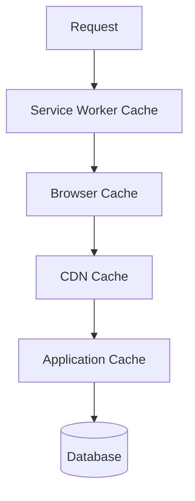
```mermaid
flowchart TD
    R[Request] --> SW[Service Worker Cache]
    SW --> BC[Browser Cache]
    BC --> CDN[CDN Cache]
    CDN --> AC[Application Cache]
    AC --> DB[(Database)]
```

## Checklist

```text
[ ] Disable browser cache.
[ ] Inspect Cache-Control.
[ ] Inspect ETag and Age.
[ ] Clear site storage.
[ ] Inspect service worker.
[ ] Check CDN cache status.
[ ] Check application cache invalidation.
[ ] Confirm database data.
```

---

# 27. Slow Page Load

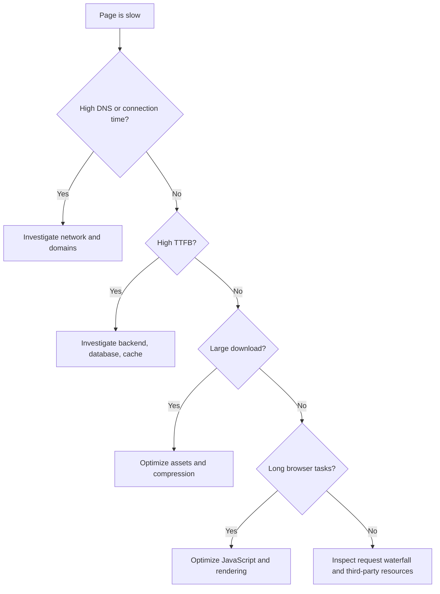
```mermaid
flowchart TD
    A[Page is slow] --> B{High DNS or connection time?}
    B -->|Yes| C[Investigate network and domains]
    B -->|No| D{High TTFB?}
    D -->|Yes| E[Investigate backend, database, cache]
    D -->|No| F{Large download?}
    F -->|Yes| G[Optimize assets and compression]
    F -->|No| H{Long browser tasks?}
    H -->|Yes| I[Optimize JavaScript and rendering]
    H -->|No| J[Inspect request waterfall and third-party resources]
```

---

# 28. Slow API Request

## Inspect timing

```text
DNS
Connection
TLS
Request sent
TTFB
Download
```

## High TTFB

Possible causes:

- Slow backend
- Database
- External service
- Cache miss
- Queueing
- Cold start

## Long download

Possible causes:

- Large response
- Missing compression
- Excessive fields
- Too many records
- Slow network

## Diagnostic trace

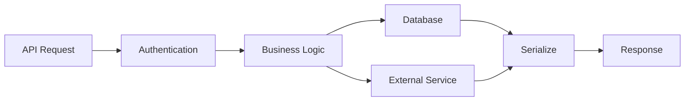
```mermaid
flowchart LR
    R[API Request] --> A[Authentication]
    A --> B[Business Logic]
    B --> D[Database]
    B --> X[External Service]
    D --> S[Serialize]
    X --> S
    S --> O[Response]
```

Measure each stage.

---

# 29. Slow Database Query

## Checklist

```text
[ ] Inspect query duration.
[ ] Check query plan.
[ ] Check indexes.
[ ] Check rows examined.
[ ] Check result size.
[ ] Check locks.
[ ] Check connection pool.
[ ] Check database CPU and memory.
[ ] Check replica lag.
[ ] Check repeated queries.
```

## Common causes

- Missing index
- N+1 queries
- Large result set
- Inefficient joins
- Lock contention
- Long transaction
- Database overload
- Network distance

---

# 30. Service or Dependency Failure

If your service depends on another service:

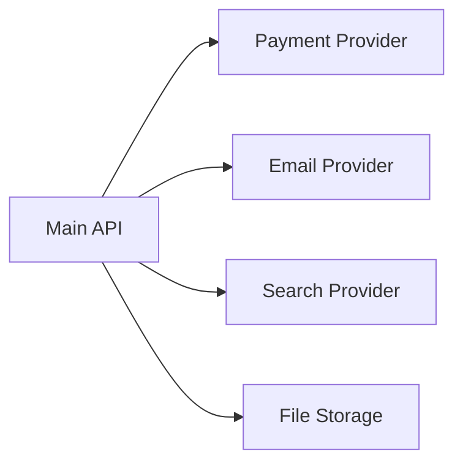
```mermaid
flowchart LR
    A[Main API] --> P[Payment Provider]
    A --> E[Email Provider]
    A --> S[Search Provider]
    A --> F[File Storage]
```

A failure in one dependency may cause:

- Slow requests
- `502`
- `503`
- `504`
- Partial results
- Queue growth
- Repeated retries

Use:

- Timeouts
- Retries with limits
- Circuit breakers
- Fallbacks
- Background jobs
- Clear dependency metrics

---

# 31. Queue Is Growing

## Symptoms

- Notifications are delayed.
- Reports remain queued.
- Processing time increases.
- Worker CPU is high.
- Queue depth continually rises.

## Possible causes

- Workers are too slow
- Too few workers
- Dependency is failing
- Jobs are retrying repeatedly
- Poison message blocks processing
- Incoming rate exceeds processing rate

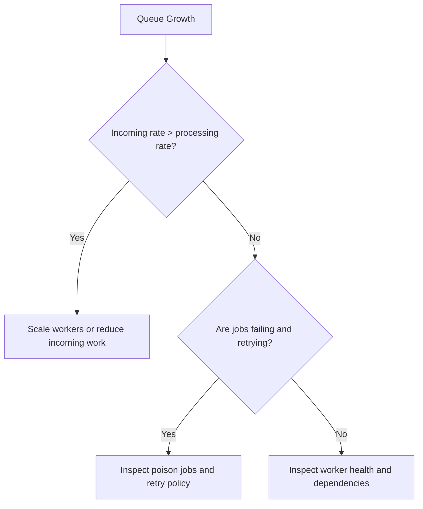
```mermaid
flowchart TD
    A[Queue Growth] --> B{Incoming rate > processing rate?}
    B -->|Yes| C[Scale workers or reduce incoming work]
    B -->|No| D{Are jobs failing and retrying?}
    D -->|Yes| E[Inspect poison jobs and retry policy]
    D -->|No| F[Inspect worker health and dependencies]
```

---

# 32. Deployment Broke the Application

## Symptoms

- Errors begin immediately after release.
- Frontend and backend disagree.
- Static assets return `404`.
- Database errors appear.
- Authentication breaks.
- New code works locally but not in production.

## Checklist

```text
[ ] Identify deployment timestamp.
[ ] Compare error rate before and after.
[ ] Check application version.
[ ] Check frontend asset version.
[ ] Check API version.
[ ] Check environment variables.
[ ] Check database migrations.
[ ] Check dependency versions.
[ ] Roll back if necessary.
```

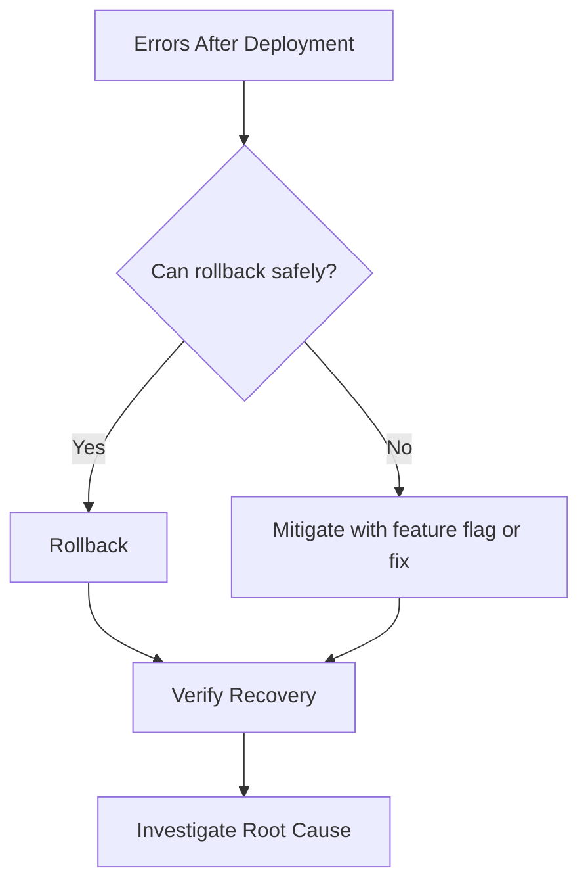
```mermaid
flowchart TD
    A[Errors After Deployment] --> B{Can rollback safely?}
    B -->|Yes| C[Rollback]
    B -->|No| D[Mitigate with feature flag or fix]
    C --> E[Verify Recovery]
    D --> E
    E --> F[Investigate Root Cause]
```

---

# 33. Database Migration Failure

## Symptoms

- Application errors after deployment
- Missing-column errors
- Old instances fail
- New instances fail
- Partial data updates
- Migration takes too long

## Safer migration sequence

```mermaid
flowchart TD
    A[Add New Schema Element] --> B[Deploy Compatible Code]
    B --> C[Backfill Data]
    C --> D[Switch Reads]
    D --> E[Remove Old Element Later]
```

Avoid breaking old and new application versions during rolling deployments.

---

# 34. Production Outage

## Immediate response

```text
1. Confirm the outage.
2. Determine user impact.
3. Identify the start time.
4. Check recent deployments.
5. Check infrastructure health.
6. Mitigate quickly.
7. Communicate status.
8. Preserve evidence.
9. Restore service.
10. Investigate root cause later.
```

```mermaid
flowchart TD
    A[Alert] --> B[Confirm]
    B --> C[Assess Impact]
    C --> D[Mitigate]
    D --> E[Restore]
    E --> F[Investigate]
    F --> G[Prevent Recurrence]
```

Do not delay restoration while trying to achieve a perfect root-cause explanation.

---

# 35. Incident Evidence Checklist

Record:

```text
Start time
Detection time
Affected services
Affected users
Error rates
Latency
Recent deployments
Infrastructure changes
Database events
External dependency status
Logs
Traces
Screenshots
Request IDs
Mitigation actions
Recovery time
```

This helps with both technical investigation and post-incident learning.

---

# 36. Is It a Frontend or Backend Problem?

Use this simplified comparison:

| Observation | More likely |
|---|---|
| No request appears | Frontend |
| JavaScript exception before request | Frontend |
| Request URL is wrong | Frontend/configuration |
| `401` | Authentication |
| `403` | Authorization |
| `404` | Route or resource |
| `422` | Validation |
| `500` | Backend |
| `502` | Gateway/upstream |
| `503` | Availability/capacity |
| `504` | Upstream timeout |
| Response correct but UI wrong | Frontend state/rendering |
| cURL fails identically | Backend or infrastructure |
| cURL works, browser fails | Browser policy, cookies, CORS, or frontend |

---

# 37. Is It a Network or Application Problem?

```mermaid
flowchart TD
    A[Feature fails] --> B{Did HTTP response arrive?}
    B -->|No| C[Network, DNS, TLS, proxy, or browser policy]
    B -->|Yes| D{What status?}
    D -->|4xx| E[Request, identity, permission, or validation]
    D -->|5xx| F[Server or upstream dependency]
    D -->|2xx| G[Response interpretation or UI]
```

A response status is powerful evidence, but inspect the body and headers too.

---

# 38. Troubleshooting with cURL

Copy a browser request as cURL:

```text
1. Open Network.
2. Select request.
3. Copy as cURL.
4. Redact credentials.
5. Run in terminal.
6. Compare output.
```

If cURL fails:

```text
Likely API, authentication, data, or infrastructure issue.
```

If cURL succeeds:

```text
Investigate browser-specific behavior.
```

---

# 39. Troubleshooting with Logs

A useful request log might include:

```json
{
  "timestamp": "2026-07-22T12:00:00Z",
  "requestId": "req_abc123",
  "method": "POST",
  "path": "/api/orders",
  "status": 500,
  "durationMs": 820,
  "userId": "42"
}
```

Use the request ID to locate:

- Application logs
- Database logs
- External API calls
- Trace spans
- Error reports

Avoid logging secrets.

---

# 40. Troubleshooting with Traces

A distributed trace may look like:

```mermaid
flowchart LR
    A[API Request<br/>820 ms] --> B[Auth<br/>20 ms]
    A --> C[Database<br/>100 ms]
    A --> D[Inventory<br/>200 ms]
    A --> E[Payment<br/>450 ms]
```

The trace shows that payment consumed most of the request time.

Without tracing, the API may simply appear “slow.”

---

# 41. Final Troubleshooting Checklist

```text
[ ] Reproduce the problem.
[ ] Record environment and user context.
[ ] Check the browser Console.
[ ] Check the Network panel.
[ ] Confirm whether a request occurred.
[ ] Inspect URL and method.
[ ] Inspect headers and cookies.
[ ] Inspect request body.
[ ] Inspect status code.
[ ] Inspect response body.
[ ] Inspect response headers.
[ ] Inspect timing.
[ ] Check redirects.
[ ] Check CORS.
[ ] Check authentication.
[ ] Check authorization.
[ ] Copy the request as cURL.
[ ] Check server logs.
[ ] Check database and dependency logs.
[ ] Check recent deployments.
[ ] Apply a focused fix.
[ ] Verify the original workflow.
[ ] Add a regression test.
```

---

# 42. Final Troubleshooting Mental Model

Every failure should be narrowed through evidence:

```mermaid
flowchart TD
    P[Problem] --> U[User Interaction]
    U --> F[Frontend Execution]
    F --> R[Request Creation]
    R --> DNS[DNS]
    DNS --> N[Network]
    N --> TLS[TLS]
    TLS --> H[HTTP]
    H --> A[Authentication]
    A --> Z[Authorization]
    Z --> V[Validation]
    V --> B[Business Logic]
    B --> D[Database or Dependency]
    D --> RESP[Response]
    RESP --> UI[Frontend Rendering]
```

At each layer ask:

```text
Did this stage happen?
What evidence proves it?
What input did it receive?
What output did it produce?
What failure modes are possible?
```

The most important troubleshooting habit is:

> Start with the earliest failed stage, not the most visible symptom.
