# Appendix L — Production Readiness Checklist  
## Preparing a Web Application for Real Users, Real Traffic, Real Failures, and Real Operations

A web application is not production-ready merely because:

- It works on a developer’s computer
- The main page loads
- The database exists
- The code has been deployed
- A successful test account can log in
- The application has no visible errors during a short demo

Production readiness means the application is prepared to operate in a real environment with:

- Real users
- Real data
- Unpredictable traffic
- Slow networks
- Invalid requests
- Expired credentials
- Partial failures
- Dependency outages
- Deployment mistakes
- Security threats
- Data recovery requirements
- Support and monitoring needs

A production-ready system should be:

```text
Functional
Secure
Performant
Observable
Recoverable
Maintainable
Operationally understood
```

A useful high-level model is:

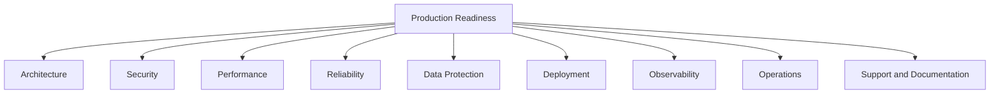

---

# 1. Production Readiness Is a Process

Production readiness is not a one-time checkbox.

Applications change continuously:

- New features are deployed.
- Dependencies are updated.
- Databases grow.
- Traffic patterns change.
- External providers change behavior.
- Security threats evolve.
- Infrastructure is migrated.
- Users discover unexpected workflows.

Therefore, production readiness should be reviewed:

- Before the initial launch
- Before major releases
- After infrastructure changes
- After security incidents
- After major outages
- During periodic operational reviews

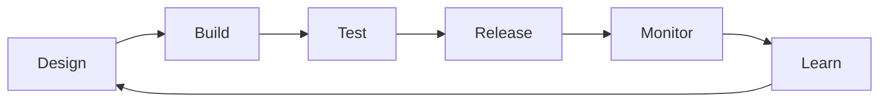

---

# 2. The Production Readiness Categories

This appendix organizes the checklist into major categories.

```text
1. Product and requirements
2. Architecture
3. Configuration and environments
4. Security
5. Authentication and authorization
6. Data protection
7. API behavior
8. Frontend behavior
9. Performance
10. Reliability
11. Observability
12. Deployment
13. Database operations
14. External dependencies
15. Backup and recovery
16. Support and incident response
17. Legal, privacy, and compliance considerations
18. Final launch review
```

Not every application requires the same depth in every category.

A small personal site may need a lightweight review.

A banking platform requires much stricter controls.

---

# 3. Product and Requirements Readiness

Before evaluating infrastructure, confirm that the application’s expected behavior is clear.

## Functional requirements

Document:

```text
What users can do
What users cannot do
What data is created
What data is modified
What happens when operations fail
Which actions require authentication
Which actions require special permissions
```

## Business rules

Write down rules such as:

```text
A user may edit only their own profile.
An order cannot be cancelled after shipment.
A discount may be used once per account.
An administrator may suspend users.
A payment must be confirmed before fulfillment.
```

## Edge cases

Consider:

```text
Empty data
Large data
Duplicate requests
Expired sessions
Concurrent changes
Deleted resources
Partial failures
Offline users
Slow connections
Invalid input
```

## Checklist

```text
[ ] Core user workflows are documented.
[ ] Business rules are explicit.
[ ] Error behavior is defined.
[ ] Permissions are documented.
[ ] Edge cases are identified.
[ ] Success criteria are measurable.
[ ] Out-of-scope behavior is recorded.
```

---

# 4. Architecture Readiness

A production architecture should clearly identify:

```text
Frontend
Backend
Database
Cache
File storage
Queues
Workers
External services
Authentication provider
CDN
Reverse proxy
Load balancer
Monitoring systems
```

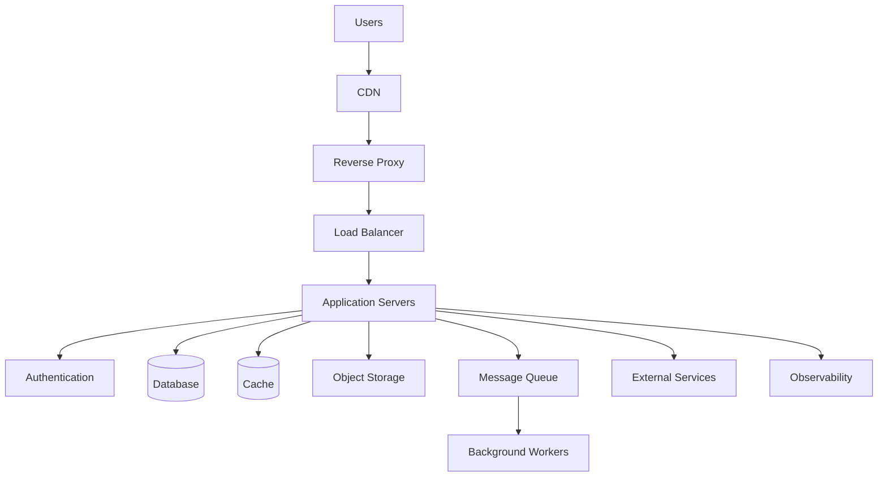

## Architecture checklist

```text
[ ] Every major component has an owner.
[ ] Communication paths are documented.
[ ] Trust boundaries are documented.
[ ] Data ownership is clear.
[ ] Critical dependencies are identified.
[ ] Failure behavior is understood.
[ ] Scaling assumptions are documented.
[ ] Security boundaries are explicit.
[ ] No unnecessary public services are exposed.
[ ] Internal services are protected from arbitrary public access.
```

---

# 5. Dependency Inventory

Create an inventory of dependencies.

## Internal dependencies

```text
Database
Cache
Queue
Search system
Authentication service
File storage
Internal APIs
```

## External dependencies

```text
Payment provider
Email provider
SMS provider
Maps provider
Analytics platform
Social login provider
Cloud storage
Monitoring platform
```

For each dependency, record:

```text
Purpose
Owner
Authentication method
Timeout
Retry policy
Rate limits
Failure behavior
Data exchanged
Cost
Support contact
Status page
```

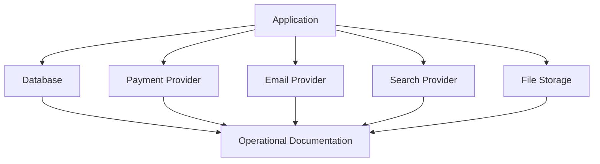

---

# 6. Environment Readiness

Common environments include:

```text
Local development
Automated testing
Staging
Production
```

Each environment should have clear configuration.

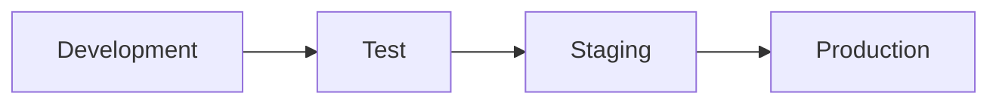

## Verify environment separation

```text
[ ] Development does not use production credentials.
[ ] Test data is not mixed with customer data.
[ ] Staging does not accidentally send real emails.
[ ] Test payments use sandbox providers.
[ ] Production secrets are restricted.
[ ] API URLs are correct in each environment.
[ ] Cookie domains are correct.
[ ] CORS origins are correct.
[ ] Database connections are correct.
[ ] Feature flags are environment-aware.
```

A common production incident is an environment mismatch:

```text
Frontend uses staging API.
Backend uses production database.
Authentication uses a different environment.
```

---

# 7. Configuration Management

Configuration includes:

- Database URLs
- API base URLs
- Feature flags
- Timeouts
- Rate limits
- Email settings
- Storage buckets
- Logging levels
- Cache durations
- Authentication settings

Configuration should be:

```text
Explicit
Documented
Environment-specific
Validated at startup
Protected when sensitive
```

If a required configuration value is missing, the application should fail clearly during startup rather than failing later during a user request.

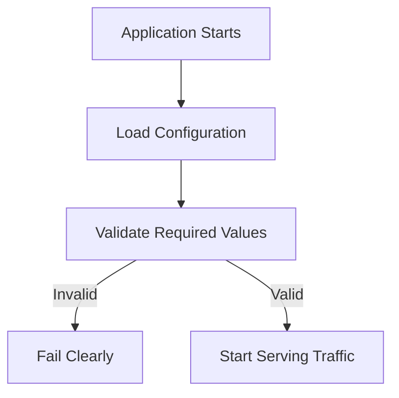

---

# 8. Secrets Checklist

```text
[ ] No secrets are committed to source control.
[ ] Secrets are not bundled into frontend code.
[ ] Secrets are stored in a secret manager or protected environment.
[ ] Secrets are rotated periodically.
[ ] Exposed secrets can be revoked quickly.
[ ] Logs redact tokens and passwords.
[ ] Backups containing secrets are protected.
[ ] CI/CD logs do not print secret values.
[ ] Developer credentials are not reused in production.
[ ] Service accounts use least privilege.
```

Examples of secrets:

```text
Database passwords
Payment provider keys
Cloud credentials
JWT signing keys
Encryption keys
Webhook secrets
Private certificates
OAuth client secrets
```

---

# 9. Authentication Readiness

Authentication should be tested beyond the happy path.

Test:

```text
Valid login
Invalid password
Unknown account
Expired session
Expired access token
Revoked token
Logout
Password change
Password reset
MFA challenge
MFA failure
Account lockout
Suspended account
Concurrent sessions
```

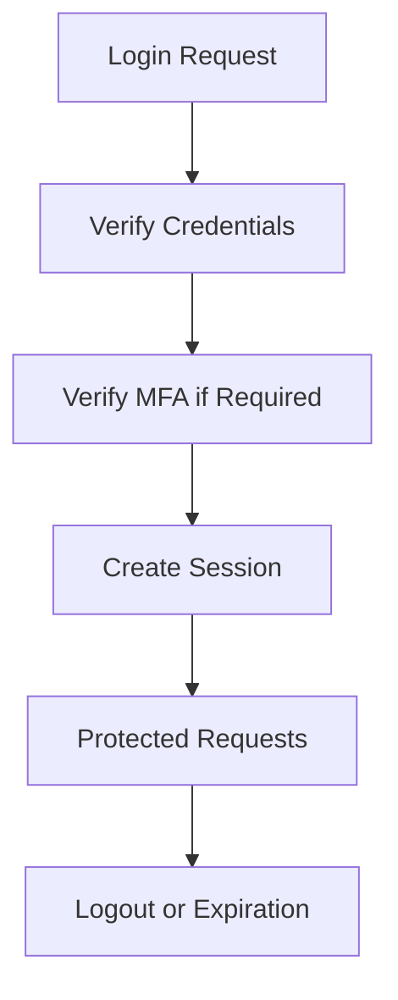

## Authentication checklist

```text
[ ] Passwords are securely hashed.
[ ] Login attempts are rate-limited.
[ ] Sessions expire.
[ ] Session identifiers are rotated after login.
[ ] Logout invalidates the session.
[ ] Password reset tokens expire.
[ ] Password reset tokens are single-use.
[ ] MFA is available where appropriate.
[ ] Authentication errors do not reveal unnecessary account information.
[ ] Authentication events are logged safely.
```

---

# 10. Authorization Readiness

Authorization must be tested for every protected operation.

Test:

```text
Unauthenticated user
Authenticated regular user
Resource owner
Non-owner
Organization member
Organization outsider
Manager
Administrator
Suspended user
Service account
```

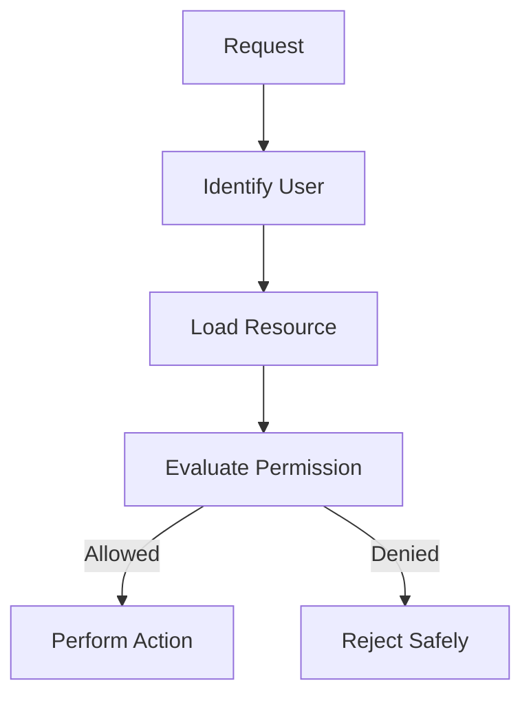

## Authorization checklist

```text
[ ] Authorization is enforced on the server.
[ ] Resource ownership is checked.
[ ] Role checks are centralized or consistently applied.
[ ] Tenant boundaries are enforced.
[ ] Administrative endpoints are protected.
[ ] Hidden frontend controls are not treated as security.
[ ] Direct URL access is tested.
[ ] API requests made outside the UI are tested.
[ ] Permission changes take effect promptly.
```

---

# 11. Session and Cookie Readiness

Inspect:

```http
Secure
HttpOnly
SameSite
Domain
Path
Max-Age
Expires
```

Checklist:

```text
[ ] Session cookies are sent only over HTTPS.
[ ] Session cookies are protected from unnecessary JavaScript access.
[ ] SameSite behavior is deliberate.
[ ] Cookie scope is not broader than necessary.
[ ] Session expiration is defined.
[ ] Session invalidation works.
[ ] Cross-origin requirements are documented.
[ ] Cookies are not leaked through logs.
```

---

# 12. Input Validation Readiness

Validate every external input:

```text
Path parameters
Query parameters
Request bodies
Headers
Cookies
File uploads
Webhook payloads
External API responses
```

Check:

```text
Type
Length
Format
Range
Required values
Allowed values
Nested structure
Cross-field relationships
```

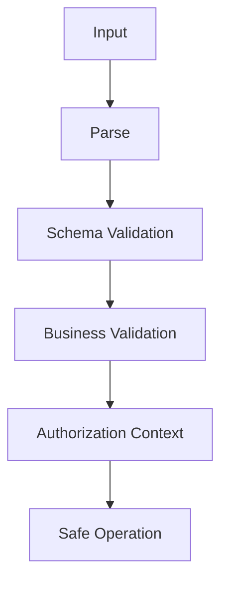

Do not rely only on browser validation.

---

# 13. API Readiness

For every endpoint, document:

```text
Method
URL
Authentication
Authorization
Path parameters
Query parameters
Request body
Success status
Response schema
Error statuses
Error schema
Caching behavior
Rate limits
Idempotency behavior
```

Example:

```text
POST /api/orders

Authentication:
  Required

Success:
  201 Created

Possible errors:
  401 Authentication required
  409 Inventory conflict
  422 Validation failed
  503 Payment provider unavailable
```

## API checklist

```text
[ ] Endpoints are documented.
[ ] Methods match their intended semantics.
[ ] Status codes are consistent.
[ ] Error formats are consistent.
[ ] Large collections are paginated.
[ ] Sensitive fields are excluded.
[ ] Request bodies are validated.
[ ] Rate limits are documented.
[ ] Retries are safe or controlled.
[ ] API versions are managed.
[ ] Breaking changes are communicated.
```

---

# 14. Data Protection Readiness

Identify sensitive data:

```text
Passwords
Personal information
Payment details
Health information
Private messages
Authentication tokens
Business secrets
Location data
```

For each data category, document:

```text
Why it is collected
Where it is stored
Who can access it
How it is protected
How long it is retained
How it is deleted
Whether it is sent to third parties
```

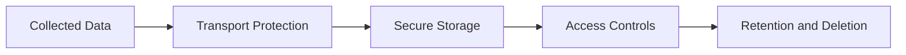

---

# 15. Database Readiness

## Database checklist

```text
[ ] Database is not unnecessarily public.
[ ] Credentials use least privilege.
[ ] Connections use encryption where appropriate.
[ ] Backups are automated.
[ ] Restore procedures are tested.
[ ] Important constraints exist.
[ ] Required indexes exist.
[ ] Slow queries are monitored.
[ ] Connection pool is sized.
[ ] Migrations are versioned.
[ ] Migration rollback or recovery is understood.
[ ] Data retention is documented.
```

---

# 16. Database Migration Readiness

A production migration should consider:

```text
Duration
Locking
Data volume
Rollback
Compatibility
Concurrent application versions
Backup
Monitoring
```

Safer migration pattern:

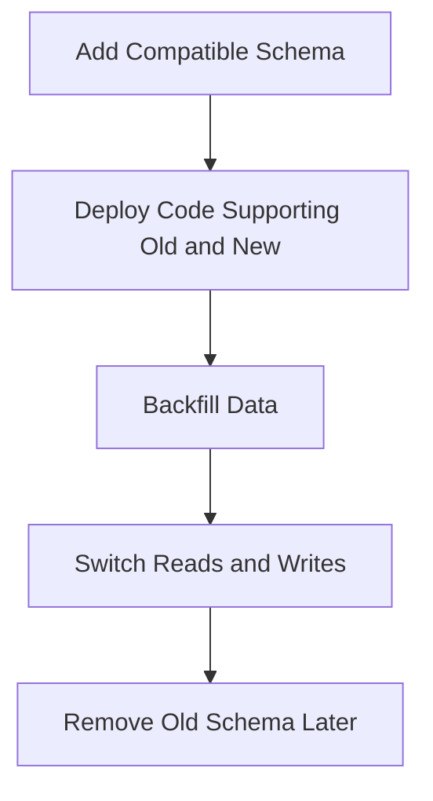

Avoid deploying code that assumes a schema change before all application instances can access the required fields.

---

# 17. Backup and Recovery Readiness

Backups should be:

```text
Automated
Encrypted
Separated from production
Retained appropriately
Monitored
Restore-tested
```

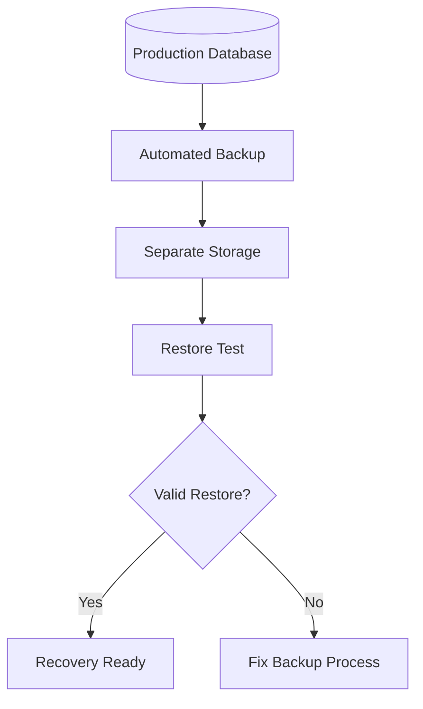

## Checklist

```text
[ ] Backup schedule is documented.
[ ] Backup retention is documented.
[ ] Backup access is restricted.
[ ] Backups are encrypted.
[ ] Restore has been tested.
[ ] Recovery time is measured.
[ ] Recovery point is understood.
[ ] Recovery instructions are available.
[ ] Backup failures generate alerts.
```

---

# 18. Performance Readiness

## Browser

```text
[ ] Initial JavaScript is within budget.
[ ] Images are compressed.
[ ] Images have dimensions.
[ ] Noncritical assets are lazy-loaded.
[ ] Fonts are optimized.
[ ] Layout shifts are minimized.
[ ] Long tasks are investigated.
[ ] Mobile devices are tested.
```

## Network

```text
[ ] Text responses are compressed.
[ ] Cache headers are configured.
[ ] CDN is used where appropriate.
[ ] Payloads are not unnecessarily large.
[ ] Third-party domains are limited.
[ ] Slow-network testing is complete.
```

## API and database

```text
[ ] API latency is measured.
[ ] Collections are paginated.
[ ] Expensive work is asynchronous.
[ ] Queries are indexed.
[ ] N+1 problems are addressed.
[ ] Timeouts are configured.
[ ] External calls have limits.
```

---

# 19. Reliability Readiness

Reliability includes:

```text
Availability
Failure handling
Recovery
Capacity
Redundancy
Monitoring
```

## Checklist

```text
[ ] Critical components have redundancy.
[ ] Health checks exist.
[ ] Readiness checks exist.
[ ] Timeouts are configured.
[ ] Retries are bounded.
[ ] Circuit breakers exist where appropriate.
[ ] Optional dependencies fail gracefully.
[ ] Queues have monitoring.
[ ] Workers can restart safely.
[ ] Capacity limits are understood.
[ ] Failure modes are documented.
```

---

# 20. Dependency Failure Readiness

For each dependency, answer:

```text
What happens if it is slow?
What happens if it is unavailable?
What happens if it returns invalid data?
What happens if credentials expire?
What happens if rate limits are reached?
What happens if it recovers after a failure?
```

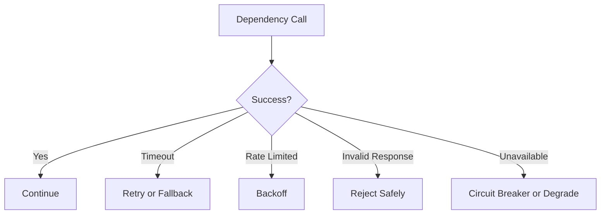

---

# 21. Queue and Worker Readiness

Background systems need their own production review.

```text
[ ] Queue depth is monitored.
[ ] Worker health is monitored.
[ ] Jobs are idempotent where possible.
[ ] Failed jobs are retried carefully.
[ ] Poison jobs do not block all work.
[ ] Dead-letter handling exists.
[ ] Job retention is defined.
[ ] Duplicate delivery is expected and handled.
[ ] Workers can be scaled.
[ ] Long-running jobs have timeouts.
```

---

# 22. Observability Readiness

The application should produce useful operational evidence.

## Logs

Record:

```text
Timestamp
Service
Environment
Request ID
Trace ID
Event
Status
Duration
Safe user or resource identifier
Error category
```

## Metrics

Measure:

```text
Request rate
Error rate
Latency
Database duration
Queue depth
Cache hit rate
CPU
Memory
Disk
External dependency health
```

## Traces

Trace:

```text
Incoming request
Authentication
Database calls
External services
Queue publication
Response generation
```

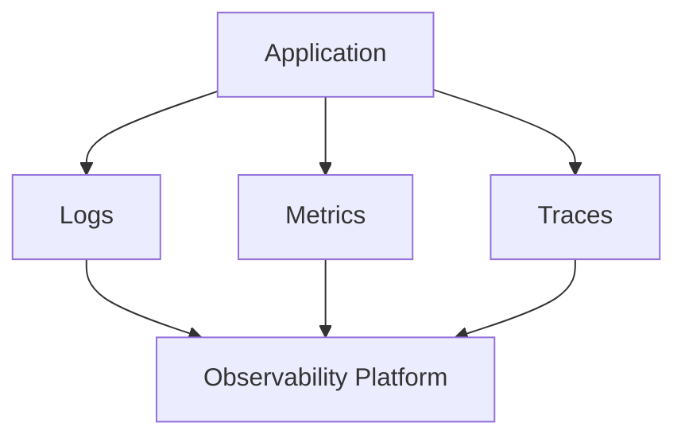

---

# 23. Alerting Readiness

Alerts should be:

```text
Actionable
Specific
Prioritized
Owned
Tested
```

Good alert examples:

```text
Error rate above 5% for 10 minutes.
No healthy application instances.
Database storage below 10%.
Payment provider failures above threshold.
Queue age above 15 minutes.
TLS certificate expires soon.
```

Poor alerts:

```text
A log line contains the word "error."
CPU exceeded 50% once.
One request was slow.
```

Too many noisy alerts cause alert fatigue.

---

# 24. Deployment Readiness

A deployment process should define:

```text
How code is built
How tests run
How artifacts are created
How configuration is supplied
How migrations run
How traffic shifts
How health is verified
How rollback works
```

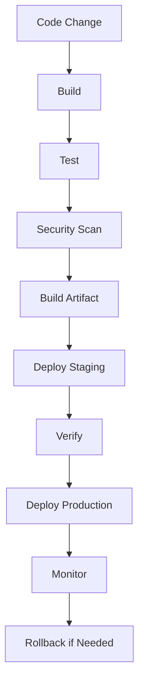

---

# 25. Deployment Checklist

```text
[ ] Builds are reproducible.
[ ] Tests run automatically.
[ ] Security scans run.
[ ] Artifacts are versioned.
[ ] Configuration is validated.
[ ] Database migrations are planned.
[ ] Health checks are available.
[ ] Rollback is documented.
[ ] Deployment permissions are restricted.
[ ] Deployment events are logged.
[ ] Monitoring is active during release.
[ ] Someone owns the release.
```

---

# 26. Rollback Readiness

A rollback plan should answer:

```text
Who can initiate rollback?
How is the previous version identified?
How long does rollback take?
What happens to database changes?
Are frontend assets compatible with the previous backend?
Are queues and jobs compatible?
How is rollback verified?
```

A code rollback may not reverse a database migration.

Therefore, database changes must be designed with compatibility and recovery in mind.

---

# 27. Blue-Green and Rolling Deployment Checks

## Blue-green

```text
[ ] New environment can run independently.
[ ] Traffic switch is reversible.
[ ] Database compatibility is maintained.
[ ] Health checks pass before switching.
[ ] Old environment remains available for rollback.
```

## Rolling

```text
[ ] Old and new versions can coexist.
[ ] API responses remain compatible.
[ ] Database schema supports both versions.
[ ] Load balancer removes unhealthy instances.
[ ] Deployment pauses on elevated errors.
```

---

# 28. Frontend Production Readiness

```text
[ ] Production bundle is optimized.
[ ] Source maps are handled appropriately.
[ ] API base URL is correct.
[ ] Public configuration is safe.
[ ] Secrets are absent from bundles.
[ ] Error boundaries exist where appropriate.
[ ] Loading states exist.
[ ] Empty states exist.
[ ] Error states exist.
[ ] Retry behavior is sensible.
[ ] Offline behavior is considered.
[ ] Accessibility checks are performed.
[ ] Responsive layouts are tested.
```

A frontend should handle:

```text
Loading
Success
Empty result
Validation error
Authentication error
Permission error
Network error
Server error
```

---

# 29. API Client Production Readiness

Frontend or mobile API clients should:

```text
[ ] Handle non-2xx responses.
[ ] Handle network failures.
[ ] Avoid duplicate submissions.
[ ] Use request cancellation where appropriate.
[ ] Refresh credentials safely.
[ ] Avoid infinite retries.
[ ] Display useful errors.
[ ] Handle schema changes defensively.
[ ] Validate unexpected responses.
[ ] Avoid exposing tokens in logs.
```

---

# 30. Privacy and Data Governance

Depending on the application and jurisdiction, consider:

```text
Privacy notices
Consent
Data access requests
Data deletion
Retention periods
Data export
Third-party sharing
Cookie preferences
Sensitive data classification
Audit records
```

The technical system should support the organization’s privacy requirements.

Do not collect data simply because it might be useful someday.

---

# 31. Legal and Compliance Considerations

The exact requirements depend on the product and location, but potentially relevant areas include:

```text
Privacy regulations
Payment card requirements
Healthcare data rules
Financial controls
Accessibility requirements
Data residency
Record retention
Breach notification
```

Engineering teams should involve appropriate legal, privacy, security, and compliance specialists rather than assuming a generic checklist is sufficient.

---

# 32. Documentation Readiness

Document:

```text
Architecture
API contracts
Environment variables
Deployment process
Rollback process
Database migrations
Backup and restore
Incident response
Dependency ownership
Alert meanings
Support procedures
Known limitations
```

Documentation should be:

```text
Current
Discoverable
Versioned
Written for the person responding during an incident
```

A document nobody can find during an outage is not operationally useful.

---

# 33. Support Readiness

Support teams may need:

```text
How to identify a user
How to find a request
How to interpret common errors
How to check service status
How to escalate incidents
What information to collect
What not to ask users to share
```

Support guidance should never request:

- Passwords
- Full access tokens
- Recovery codes
- Private encryption keys
- Payment card details

---

# 34. Incident Response Readiness

Create an incident process:

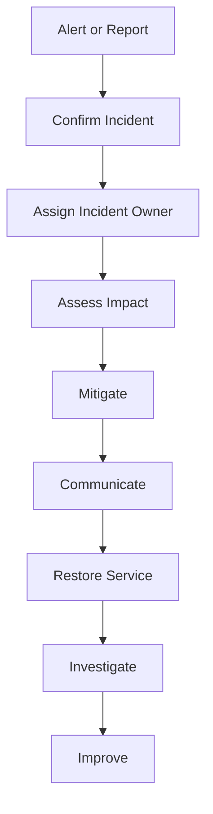

Define:

```text
Who is paged?
Who makes decisions?
Who communicates?
Who investigates?
Who approves rollback?
Who records the timeline?
```

---

# 35. Launch Readiness Review

Before launch, conduct a structured review.

## Functional

```text
[ ] Core workflows pass.
[ ] Error cases pass.
[ ] Permissions pass.
[ ] Mobile workflows pass.
[ ] Accessibility basics pass.
```

## Technical

```text
[ ] Production deployment works.
[ ] Database migration works.
[ ] Backups work.
[ ] Health checks work.
[ ] Logs and metrics appear.
[ ] Alerts work.
[ ] Rollback works.
```

## Security

```text
[ ] Secrets are protected.
[ ] HTTPS works.
[ ] Authorization is enforced.
[ ] Input validation works.
[ ] Dependencies are reviewed.
[ ] Sensitive data is minimized.
```

## Performance

```text
[ ] Page load is acceptable.
[ ] API latency is acceptable.
[ ] Database queries are measured.
[ ] Large payloads are controlled.
[ ] Slow-network behavior is acceptable.
```

---

# 36. Go/No-Go Decision

A launch decision should be explicit.

Possible statuses:

```text
Go
Go with known limitations
Delayed
No-go
```

Record:

```text
Known risks
Mitigations
Owners
Rollback plan
Monitoring plan
Launch time
Review date
```

Do not hide known risks. Make them visible and managed.

---

# 37. Post-Launch Review

After launch, review:

```text
Error rate
Latency
User behavior
Support reports
Security alerts
Database load
Queue depth
Cache performance
Unexpected workflows
Deployment issues
```

A post-launch review might happen:

```text
Immediately after launch
After the first day
After the first week
After the first significant traffic event
```

---

# 38. Final Production Readiness Checklist

```text
[ ] Requirements are documented.
[ ] Architecture is documented.
[ ] Dependencies are inventoried.
[ ] Environments are separated.
[ ] Configuration is validated.
[ ] Secrets are protected.
[ ] Authentication is tested.
[ ] Authorization is tested.
[ ] Sessions and cookies are secure.
[ ] Inputs are validated.
[ ] Outputs are safely encoded.
[ ] APIs are documented.
[ ] Errors are consistent.
[ ] Database access is protected.
[ ] Migrations are planned.
[ ] Backups are automated.
[ ] Restores have been tested.
[ ] Performance has been measured.
[ ] Caching is deliberate.
[ ] Timeouts are configured.
[ ] Retries are bounded.
[ ] Dependency failures are handled.
[ ] Health checks exist.
[ ] Logs are structured.
[ ] Metrics are collected.
[ ] Traces are available where needed.
[ ] Alerts are actionable.
[ ] Deployments are repeatable.
[ ] Rollbacks are documented.
[ ] Frontend loading and error states exist.
[ ] Accessibility is reviewed.
[ ] Privacy requirements are considered.
[ ] Support documentation exists.
[ ] Incident procedures exist.
[ ] Launch ownership is clear.
```

---

# 39. Final Production Mental Model

Production readiness is the ability to answer:

```text
What does the system do?
Who is allowed to use it?
What happens when input is invalid?
What happens when a dependency fails?
How fast is it?
How do we know when it is broken?
How do we restore it?
How do we protect the data?
How do we deploy safely?
How do we roll back?
Who responds during an incident?
```

A production-ready system is not one that never fails.

It is one that:

```text
Fails in understandable ways
Limits the impact of failure
Protects user data
Provides useful evidence
Recovers within defined goals
Can be changed safely
```

The central model is:

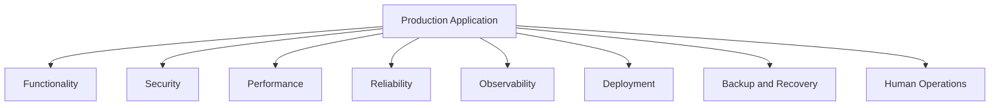
