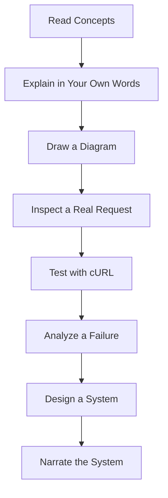

# References and Resources  
## Web Mechanics, Architecture & Network Fundamentals

This document collects recommended references, documentation, tools, standards, and learning resources for the **Web Mechanics, Architecture & Network Fundamentals** series.

The resources are organized by topic:

```text
Web fundamentals
Architecture
Networking
DNS
HTTP and HTTPS
APIs
Databases
Security
Accessibility
Testing
Diagnostics
Performance
Linux and servers
Cloud and deployment
Teaching and assessment
```

The slide deck accompanying Parts 0–6 reinforces topics such as request inspection, cURL, API clients, CORS, HTTP status codes, redirects, caching, REST, and API consumers and providers [1].

---

# 1. How to Use This File

Use these resources in three ways.

## Before studying

Use introductory resources to build vocabulary.

## During studying

Use official documentation to verify details and explore examples.

## After studying

Use tools and standards to practice:

```text
Inspect a real request
Read a response
Test an API
Trace DNS
Measure timing
Design an endpoint
Review security headers
Plan a deployment
```

Prefer official documentation and standards when resolving ambiguity.

A useful order is:

```text
Tutorial
  ↓
Student notes
  ↓
Workbook
  ↓
Official documentation
  ↓
Practical experiment
```

---

# 2. General Web Fundamentals

## Recommended topics

Study:

```text
How browsers work
How websites are structured
How URLs work
How HTTP works
How DNS works
How clients and servers communicate
```

## Recommended resources

- MDN Web Docs — Web technology references  
  https://developer.mozilla.org/en-US/docs/Web

- web.dev — Web development and performance guidance  
  https://web.dev/

- WHATWG — Web platform standards  
  https://whatwg.org/

- W3C — Web standards and accessibility specifications  
  https://www.w3.org/

- Internet Society — Internet fundamentals  
  https://www.internetsociety.org/

---

# 3. Browser Fundamentals

Useful browser concepts include:

```text
HTML parsing
DOM construction
CSS processing
JavaScript execution
Events
Rendering
Storage
Cookies
Service workers
Network requests
```

## Resources

- MDN — How the Web works  
  https://developer.mozilla.org/en-US/docs/Learn/Getting_started_with_the_web/How_the_Web_works

- MDN — Browser technologies  
  https://developer.mozilla.org/en-US/docs/Web

- Chrome for Developers — DevTools documentation  
  https://developer.chrome.com/docs/devtools/

- Firefox Developer Tools  
  https://firefox-source-docs.mozilla.org/devtools-user/

- WebKit Web Inspector documentation  
  https://webkit.org/web-inspector/

---

# 4. HTML Resources

Study:

```text
Elements
Attributes
Semantic HTML
Forms
Links
Images
Tables
Document structure
Accessibility semantics
```

## Resources

- MDN — HTML  
  https://developer.mozilla.org/en-US/docs/Web/HTML

- MDN — HTML elements reference  
  https://developer.mozilla.org/en-US/docs/Web/HTML/Element

- WHATWG HTML Standard  
  https://html.spec.whatwg.org/

- W3C validator  
  https://validator.w3.org/

## Key principles

```text
Use semantic elements.
Use headings in logical order.
Use buttons for actions.
Use links for navigation.
Label form controls.
Provide alternative text for meaningful images.
```

---

# 5. CSS Resources

Study:

```text
Selectors
Cascade
Specificity
Inheritance
Box model
Flexbox
Grid
Responsive design
Media queries
Units
Layout
Animations
```

## Resources

- MDN — CSS  
  https://developer.mozilla.org/en-US/docs/Web/CSS

- MDN — CSS layout  
  https://developer.mozilla.org/en-US/docs/Learn/CSS/CSS_layout

- MDN — Flexbox  
  https://developer.mozilla.org/en-US/docs/Web/CSS/CSS_flexible_box_layout

- MDN — CSS Grid  
  https://developer.mozilla.org/en-US/docs/Web/CSS/CSS_grid_layout

- CSS Working Group specifications  
  https://www.w3.org/Style/CSS/

---

# 6. JavaScript Resources

Study:

```text
Variables
Types
Functions
Objects
Arrays
Conditions
Loops
Modules
Promises
async/await
Errors
DOM
Events
Fetch
```

## Resources

- MDN — JavaScript Guide  
  https://developer.mozilla.org/en-US/docs/Web/JavaScript/Guide

- MDN — JavaScript Reference  
  https://developer.mozilla.org/en-US/docs/Web/JavaScript/Reference

- ECMAScript Language Specification  
  https://tc39.es/ecma262/

- MDN — Fetch API  
  https://developer.mozilla.org/en-US/docs/Web/API/Fetch_API

- MDN — DOM  
  https://developer.mozilla.org/en-US/docs/Web/API/Document_Object_Model

---

# 7. Internet and Networking

Study:

```text
Packets
IP
IPv4
IPv6
TCP
UDP
QUIC
Routers
Switches
ISPs
Ports
Latency
Bandwidth
Jitter
Packet loss
```

## Resources

- Internet Society — How the Internet works  
  https://www.internetsociety.org/internet/how-it-works/

- Cloudflare Learning Center — Networking  
  https://www.cloudflare.com/learning/

- Cisco — Networking basics  
  https://www.cisco.com/c/en/us/solutions/small-business/resource-center/networking/networking-basics.html

- Computer Networking: A Top-Down Approach  
  https://gaia.cs.umass.edu/kurose_ross/

- RFC Editor  
  https://www.rfc-editor.org/

---

# 8. IP Addressing

Study:

```text
IPv4
IPv6
Subnet concepts
Public addresses
Private addresses
Loopback
NAT
Address allocation
```

## Resources

- IETF RFC Editor  
  https://www.rfc-editor.org/

- RFC 791 — Internet Protocol version 4  
  https://www.rfc-editor.org/rfc/rfc791

- RFC 8200 — Internet Protocol version 6  
  https://www.rfc-editor.org/rfc/rfc8200

- RFC 1918 — Private IPv4 address space  
  https://www.rfc-editor.org/rfc/rfc1918

- RFC 4291 — IPv6 addressing architecture  
  https://www.rfc-editor.org/rfc/rfc4291

- Internet Assigned Numbers Authority  
  https://www.iana.org/

---

# 9. DNS

Study:

```text
Domain hierarchy
Root servers
TLD servers
Authoritative servers
Recursive resolvers
A records
AAAA records
CNAME records
MX records
TXT records
NS records
PTR records
Caching
TTL
Forward lookup
Reverse lookup
```

## Resources

- ICANN — DNS basics  
  https://www.icann.org/resources/pages/dns-2012-02-25-en

- IANA — Root zone management  
  https://www.iana.org/domains/root

- DNS Queries — Cloudflare Learning Center  
  https://www.cloudflare.com/learning/dns/what-is-dns/

- RFC 1034 — Domain names: concepts and facilities  
  https://www.rfc-editor.org/rfc/rfc1034

- RFC 1035 — Domain names: implementation and specification  
  https://www.rfc-editor.org/rfc/rfc1035

- DNSViz — DNS visualization and validation  
  https://dnsviz.net/

## Practice commands

```bash
nslookup example.com
```

```bash
dig example.com
```

```bash
dig A example.com
```

```bash
dig AAAA example.com
```

```bash
dig MX example.com
```

```bash
dig TXT example.com
```

---

# 10. HTTP

Study:

```text
Request-response model
Methods
Headers
Bodies
Status codes
Caching
Redirects
Content negotiation
Compression
Cookies
Authentication
```

## Resources

- MDN — HTTP overview  
  https://developer.mozilla.org/en-US/docs/Web/HTTP

- MDN — HTTP methods  
  https://developer.mozilla.org/en-US/docs/Web/HTTP/Reference/Methods

- MDN — HTTP status codes  
  https://developer.mozilla.org/en-US/docs/Web/HTTP/Reference/Status

- MDN — HTTP headers  
  https://developer.mozilla.org/en-US/docs/Web/HTTP/Reference/Headers

- HTTP Semantics — RFC 9110  
  https://www.rfc-editor.org/rfc/rfc9110

- HTTP Caching — RFC 9111  
  https://www.rfc-editor.org/rfc/rfc9111

- HTTP/1.1 Message Syntax and Routing — RFC 9112  
  https://www.rfc-editor.org/rfc/rfc9112

- HTTP/2 — RFC 9113  
  https://www.rfc-editor.org/rfc/rfc9113

- HTTP/3 — RFC 9114  
  https://www.rfc-editor.org/rfc/rfc9114

---

# 11. HTTPS and TLS

Study:

```text
TLS purpose
Certificates
Certificate authorities
Symmetric encryption
Asymmetric cryptography
Key agreement
Certificate validation
TLS handshake
HSTS
Mixed content
```

## Resources

- MDN — Transport Layer Security  
  https://developer.mozilla.org/en-US/docs/Web/Security/Transport_Layer_Security

- Cloudflare — What is TLS?  
  https://www.cloudflare.com/learning/ssl/transport-layer-security-tls/

- RFC 8446 — TLS 1.3  
  https://www.rfc-editor.org/rfc/rfc8446

- IETF TLS Working Group  
  https://datatracker.ietf.org/wg/tls/about/

- SSL Labs Server Test  
  https://www.ssllabs.com/ssltest/

- Mozilla SSL Configuration Generator  
  https://ssl-config.mozilla.org/

## Practice commands

```bash
curl -v https://example.com
```

```bash
openssl s_client -connect example.com:443 -servername example.com
```

Do not use certificate-bypass options as a permanent solution.

---

# 12. URLs and Encoding

Study:

```text
Scheme
Host
Port
Path
Query
Fragment
Percent encoding
Reserved characters
Relative URLs
Absolute URLs
Canonical URLs
```

## Resources

- MDN — URL  
  https://developer.mozilla.org/en-US/docs/Web/API/URL

- MDN — URLSearchParams  
  https://developer.mozilla.org/en-US/docs/Web/API/URLSearchParams

- RFC 3986 — Uniform Resource Identifier  
  https://www.rfc-editor.org/rfc/rfc3986

- RFC 3987 — Internationalized Resource Identifiers  
  https://www.rfc-editor.org/rfc/rfc3987

## Practice

JavaScript:

```javascript
const url = new URL("https://example.com/products");

url.searchParams.set("category", "mechanical keyboards");

console.log(url.toString());
```

---

# 13. APIs and REST

Study:

```text
API consumers and providers
Resources
Representations
CRUD
REST constraints
Statelessness
Idempotency
Pagination
Filtering
Sorting
Versioning
Errors
Authentication
Authorization
```

## Resources

- MDN — Web APIs  
  https://developer.mozilla.org/en-US/docs/Web/API

- Fielding dissertation — Representational State Transfer  
  https://ics.uci.edu/~fielding/pubs/dissertation/rest_arch_style.htm

- RFC 9110 — HTTP Semantics  
  https://www.rfc-editor.org/rfc/rfc9110

- OpenAPI Specification  
  https://spec.openapis.org/oas/latest.html

- Swagger documentation  
  https://swagger.io/docs/

- JSON:API  
  https://jsonapi.org/

---

# 14. GraphQL

Study:

```text
Schema
Types
Queries
Mutations
Subscriptions
Resolvers
Variables
Errors
Query complexity
Pagination
Authorization
Caching
```

## Resources

- GraphQL official website  
  https://graphql.org/

- GraphQL specification  
  https://spec.graphql.org/

- GraphQL Learn  
  https://graphql.org/learn/

- Apollo GraphQL documentation  
  https://www.apollographql.com/docs/

## Important design concerns

```text
Limit query depth.
Limit query complexity.
Require pagination.
Authorize fields and resolvers.
Monitor expensive operations.
```

---

# 15. RPC and gRPC

Study:

```text
Remote procedures
Method-oriented APIs
JSON-RPC
Protocol Buffers
Generated clients
HTTP/2
Streaming
Service contracts
```

## Resources

- gRPC official documentation  
  https://grpc.io/docs/

- Protocol Buffers documentation  
  https://protobuf.dev/

- JSON-RPC specification  
  https://www.jsonrpc.org/specification

- Apache Thrift  
  https://thrift.apache.org/

---

# 16. JSON and Serialization

Study:

```text
Objects
Arrays
Strings
Numbers
Booleans
null
Serialization
Deserialization
Schemas
Dates
Money
Optional fields
Missing versus null
```

## Resources

- JSON specification  
  https://www.json.org/

- RFC 8259 — JSON Data Interchange Format  
  https://www.rfc-editor.org/rfc/rfc8259

- JSON Schema  
  https://json-schema.org/

- MDN — JSON  
  https://developer.mozilla.org/en-US/docs/Learn/JavaScript/Objects/JSON

- Protocol Buffers  
  https://protobuf.dev/

- XML specification resources  
  https://www.w3.org/XML/

---

# 17. Browser Developer Tools

Study:

```text
Elements
Console
Network
Sources
Application
Security
Performance
Storage
Service workers
```

## Resources

- Chrome DevTools documentation  
  https://developer.chrome.com/docs/devtools/

- Firefox Developer Tools  
  https://firefox-source-docs.mozilla.org/devtools-user/

- Microsoft Edge DevTools  
  https://learn.microsoft.com/en-us/microsoft-edge/devtools-guide-chromium/

- Safari Web Inspector  
  https://webkit.org/web-inspector/

## Useful Network panel habits

```text
Clear requests before testing.
Enable Preserve log for navigation.
Filter Fetch/XHR for API debugging.
Inspect request and response.
Inspect timing.
Copy as cURL.
Redact secrets.
```

---

# 18. cURL

Study:

```text
GET requests
POST requests
Headers
JSON bodies
Authentication
Cookies
Redirects
Verbose output
Timing
Timeouts
Retries
File uploads
```

## Resources

- cURL documentation  
  https://curl.se/docs/

- cURL command-line options  
  https://curl.se/docs/manpage.html

- Everything curl  
  https://everything.curl.dev/

## Common commands

```bash
curl https://example.com
```

```bash
curl -i https://example.com
```

```bash
curl -I https://example.com
```

```bash
curl -v https://example.com
```

```bash
curl -L http://example.com
```

```bash
curl \
  -X POST \
  -H "Content-Type: application/json" \
  -d '{"name":"Alex"}' \
  https://api.example.com/users
```

```bash
curl -G https://api.example.com/products \
  --data-urlencode "q=mechanical keyboard"
```

---

# 19. API Clients

Recommended tools:

- Postman  
  https://www.postman.com/

- Postman Learning Center  
  https://learning.postman.com/

- Bruno  
  https://www.usebruno.com/

- Insomnia  
  https://insomnia.rest/

Use API clients to manage:

```text
Saved requests
Collections
Environments
Authentication
Request bodies
Tests
Workflows
```

Never export real credentials or production cookies into shared collections.

---

# 20. Databases and SQL

Study:

```text
Tables
Rows
Columns
Primary keys
Foreign keys
Relationships
SELECT
INSERT
UPDATE
DELETE
JOIN
Indexes
Transactions
Constraints
Migrations
Connection pools
```

## Resources

- PostgreSQL documentation  
  https://www.postgresql.org/docs/

- PostgreSQL tutorial  
  https://www.postgresql.org/docs/current/tutorial.html

- SQLite documentation  
  https://www.sqlite.org/docs.html

- MySQL documentation  
  https://dev.mysql.com/doc/

- SQLBolt interactive lessons  
  https://sqlbolt.com/

- Use The Index, Luke!  
  https://use-the-index-luke.com/

---

# 21. Linux and Servers

Study:

```text
Filesystems
Users
Groups
Permissions
Processes
Services
Ports
Logs
SSH
Firewalls
Reverse proxies
Resource usage
```

## Resources

- Ubuntu documentation  
  https://documentation.ubuntu.com/

- Debian documentation  
  https://www.debian.org/doc/

- Linux man pages  
  https://man7.org/linux/man-pages/

- systemd documentation  
  https://systemd.io/

- OpenSSH documentation  
  https://www.openssh.com/manual.html

- Nginx documentation  
  https://nginx.org/en/docs/

- Caddy documentation  
  https://caddyserver.com/docs/

## Useful commands

```bash
pwd
ls -la
ps aux
top
free -h
df -h
ss -ltnp
lsof -i :3000
systemctl status service-name
journalctl -u service-name
```

Use administrative commands cautiously.

---

# 22. Web Security

Study:

```text
Authentication
Authorization
Sessions
Cookies
Password hashing
MFA
Secrets
Input validation
Output encoding
SQL injection
XSS
CSRF
SSRF
Path traversal
File uploads
Rate limiting
Least privilege
Security headers
Audit logging
```

## Resources

- OWASP Top 10  
  https://owasp.org/www-project-top-ten/

- OWASP Application Security Verification Standard  
  https://owasp.org/www-project-application-security-verification-standard/

- OWASP Cheat Sheet Series  
  https://cheatsheetseries.owasp.org/

- Mozilla Web Security Guidelines  
  https://infosec.mozilla.org/guidelines/web_security

- MDN Web Security  
  https://developer.mozilla.org/en-US/docs/Web/Security

## Important principles

```text
Never trust the client.
Validate on the server.
Protect secrets.
Use least privilege.
Use HTTPS.
Check authorization on every protected operation.
Avoid logging credentials.
```

---

# 23. Accessibility

Study:

```text
Semantic HTML
Keyboard navigation
Focus
Labels
Alternative text
Contrast
Forms
Error messages
Dialogs
Dynamic content
Reduced motion
Captions
```

## Resources

- W3C Web Accessibility Initiative  
  https://www.w3.org/WAI/

- WCAG Overview  
  https://www.w3.org/WAI/standards-guidelines/wcag/

- WAI-ARIA  
  https://www.w3.org/WAI/standards-guidelines/aria/

- MDN Accessibility  
  https://developer.mozilla.org/en-US/docs/Web/Accessibility

- WebAIM  
  https://webaim.org/

## Testing methods

```text
Keyboard-only navigation
Screen reader
Zoom
Contrast checker
Automated accessibility scan
Real user testing
```

---

# 24. Testing

Study:

```text
Unit tests
Integration tests
API tests
End-to-end tests
Smoke tests
Contract tests
Fixtures
Mocks
Stubs
Fakes
Regression tests
Test isolation
CI testing
```

## Resources

- MDN — Testing  
  https://developer.mozilla.org/en-US/docs/Learn_web_development/Extensions/Testing

- Playwright  
  https://playwright.dev/

- Cypress  
  https://www.cypress.io/

- Jest  
  https://jestjs.io/

- Vitest  
  https://vitest.dev/

- Web Platform Tests  
  https://github.com/web-platform-tests/wpt

## Testing principle

```text
Many fast unit tests
Useful integration and API tests
Fewer high-value end-to-end tests
```

---

# 25. Web Performance

Study:

```text
Critical rendering path
FCP
LCP
CLS
INP
TTFB
JavaScript bundles
Images
Fonts
Caching
CDNs
Database queries
Payload size
Third-party scripts
```

## Resources

- web.dev Learn Performance  
  https://web.dev/learn/performance

- Core Web Vitals  
  https://web.dev/articles/vitals

- PageSpeed Insights  
  https://pagespeed.web.dev/

- Lighthouse  
  https://developer.chrome.com/docs/lighthouse/

- MDN Performance  
  https://developer.mozilla.org/en-US/docs/Web/Performance

- HTTP Archive  
  https://httparchive.org/

## Performance process

```text
Measure
  ↓
Find bottleneck
  ↓
Change one important thing
  ↓
Measure again
  ↓
Monitor in production
```

---

# 26. Observability

Study:

```text
Logs
Metrics
Traces
Request IDs
Dashboards
Alerts
Health checks
Readiness checks
```

## Resources

- OpenTelemetry  
  https://opentelemetry.io/

- Prometheus  
  https://prometheus.io/

- Grafana  
  https://grafana.com/

- Elastic Observability  
  https://www.elastic.co/observability

- Google SRE resources  
  https://sre.google/resources/

## Useful metrics

```text
Request rate
Error rate
P50 latency
P95 latency
P99 latency
Database latency
Cache hit rate
Queue depth
Worker failure rate
CPU and memory
```

---

# 27. Reliability and Site Operations

Study:

```text
Availability
Redundancy
Failover
Timeouts
Retries
Backoff
Circuit breakers
Graceful degradation
Queues
Workers
Backups
RPO
RTO
Incident response
Error budgets
```

## Resources

- Google Site Reliability Engineering book  
  https://sre.google/sre-book/table-of-contents/

- Google SRE workbook  
  https://sre.google/workbook/table-of-contents/

- AWS Well-Architected Framework  
  https://docs.aws.amazon.com/wellarchitected/latest/framework/welcome.html

- Microsoft Azure Well-Architected Framework  
  https://learn.microsoft.com/en-us/azure/well-architected/

- Google Cloud Architecture Framework  
  https://cloud.google.com/architecture/framework

---

# 28. Containers

Study:

```text
Images
Containers
Dockerfiles
Registries
Port mapping
Environment variables
Volumes
Networking
Resource limits
Image security
```

## Resources

- Docker documentation  
  https://docs.docker.com/

- Docker getting started  
  https://docs.docker.com/get-started/

- OCI specifications  
  https://opencontainers.org/

- Docker Hub  
  https://hub.docker.com/

Important practice:

```text
Do not bake secrets into images.
Use versioned image tags.
Scan images.
Keep images small.
Use trusted base images.
```

---

# 29. Cloud and Deployment

Study:

```text
Virtual machines
Containers
Regions
Availability zones
Private networks
Object storage
Managed databases
Load balancers
Serverless
Infrastructure as Code
CI/CD
Deployment strategies
Rollback
Costs
```

## Resources

- AWS documentation  
  https://docs.aws.amazon.com/

- Microsoft Azure documentation  
  https://learn.microsoft.com/en-us/azure/

- Google Cloud documentation  
  https://cloud.google.com/docs

- Terraform documentation  
  https://developer.hashicorp.com/terraform/docs

- OpenTofu documentation  
  https://opentofu.org/docs/

- Kubernetes documentation  
  https://kubernetes.io/docs/

Use managed platforms carefully. Managed does not mean responsibility-free.

---

# 30. Git and Project Workflow

Study:

```text
Repositories
Commits
Branches
Merges
Rebases
Pull requests
Conflicts
Tags
Releases
.gitignore
CI integration
```

## Resources

- Git documentation  
  https://git-scm.com/doc

- Pro Git book  
  https://git-scm.com/book/en/v2

- GitHub documentation  
  https://docs.github.com/

- GitLab documentation  
  https://docs.gitlab.com/

Important rules:

```text
Review diffs before committing.
Never commit secrets.
Use focused commits.
Use branches for meaningful changes.
Run tests before merging.
```

---

# 31. Standards and Specifications

Use standards when you need precise technical definitions.

## IETF RFC Editor

```text
https://www.rfc-editor.org/
```

Important RFCs:

```text
RFC 3986:
  URI syntax

RFC 791:
  IPv4

RFC 8200:
  IPv6

RFC 1034:
  DNS concepts

RFC 1035:
  DNS implementation

RFC 8446:
  TLS 1.3

RFC 9110:
  HTTP semantics

RFC 9111:
  HTTP caching

RFC 9112:
  HTTP/1.1

RFC 9113:
  HTTP/2

RFC 9114:
  HTTP/3
```

## W3C

```text
https://www.w3.org/
```

Useful for:

```text
HTML-related standards
CSS standards
Accessibility
ARIA
Web platform specifications
```

## WHATWG

```text
https://whatwg.org/
```

Useful for:

```text
HTML standard
DOM behavior
Fetch
URL behavior
Web platform standards
```

---

# 32. Suggested Reference Hierarchy

When sources disagree, use this general order:

```text
Formal specification
  ↓
Official standards documentation
  ↓
Official product documentation
  ↓
Reputable educational source
  ↓
Community discussion
  ↓
Search-result summary
```

For implementation-specific questions, use the official documentation for the exact version and product.

---

# 33. Recommended Learning Tools

## Browser

```text
Chrome
Firefox
Safari
Edge
```

## Terminal

```text
Bash
Zsh
PowerShell
Windows Terminal
```

## HTTP inspection

```text
Browser Network panel
cURL
Postman
Bruno
```

## DNS inspection

```text
nslookup
dig
DNSViz
```

## Network inspection

```text
traceroute
tracert
ping
ss
lsof
```

## Diagramming

```text
Mermaid
Excalidraw
draw.io
Lucidchart
```

Use diagrams to explain responsibilities and data flow.

---

# 34. Recommended Practice Progression



Do not start with complex cloud architecture.

Build understanding gradually:

```text
Browser → Server
  ↓
DNS and HTTP
  ↓
Database and APIs
  ↓
Authentication
  ↓
Caching and queues
  ↓
Production architecture
```

---

# 35. Course Material Map

| Topic | Primary course materials | Recommended references |
|---|---|---|
| Architecture | Part 1, Workbook 1 | MDN, architecture frameworks |
| Networking | Part 2, Workbook 2 | RFC Editor, Internet Society |
| HTTP | Part 3, Workbook 3 | MDN, RFC 9110–9114 |
| APIs | Part 4, Workbook 4 | OpenAPI, GraphQL, gRPC |
| Diagnostics | Part 5, Workbook 5 | DevTools, cURL, API clients |
| Production | Part 6, Workbook 6 | SRE, cloud architecture frameworks |
| Capstone | Part 7, Workbook 7 | All relevant references |

---

# 36. Reference Usage Checklist

When using an external resource:

```text
[ ] Is it official or reputable?
[ ] Does it match the technology version?
[ ] Is it defining a standard or describing an implementation?
[ ] Does it apply to the current problem?
[ ] Does it use secure examples?
[ ] Does it distinguish required behavior from optional conventions?
[ ] Should the learning material link to it?
```

---

# 37. Reference Maintenance

Technology documentation changes.

Periodically review:

```text
External URLs
Documentation paths
Browser tool names
Security recommendations
Cloud product names
API specifications
Command examples
Version-specific behavior
```

Prefer stable homepages and official documentation indexes over fragile deep links when possible.

---

# 38. Suggested Further Study

After completing this curriculum, consider studying:

```text
Operating systems
Computer networking
Distributed systems
Database internals
Cryptography
Web security
Site reliability engineering
Cloud architecture
Software testing
Accessibility
Performance engineering
```

The current series provides a foundation, not a final endpoint.

---

# 39. Final Reference Principle

Use references to deepen and verify understanding, not to replace reasoning.

A good learning sequence is:

```text
Understand the problem
  ↓
Build a mental model
  ↓
Read the official reference
  ↓
Inspect a real example
  ↓
Test safely
  ↓
Document what you learned
```

The most important references are not always the longest.

Choose sources that are:

```text
Authoritative
Current
Specific
Testable
Relevant to the question
```
