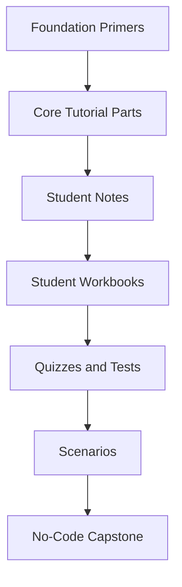
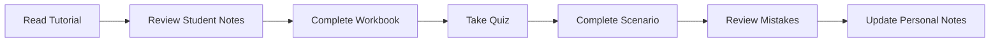
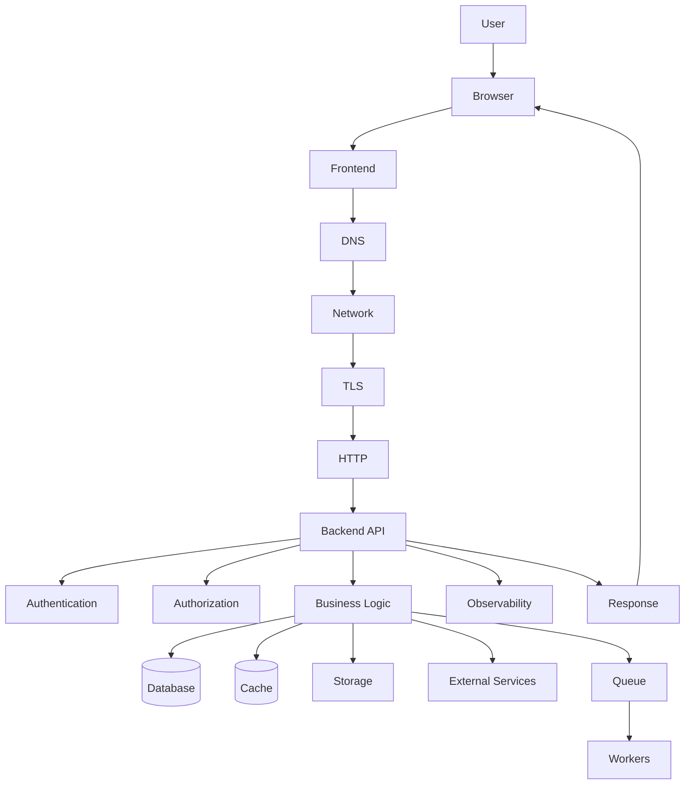
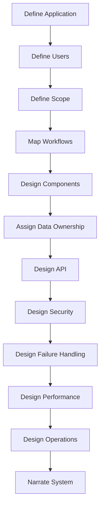

# Student Guide  
## Web Mechanics, Architecture & Network Fundamentals

Welcome to the **Web Mechanics, Architecture & Network Fundamentals** learning program.

This guide explains:

- What the program covers
- How the materials fit together
- How to study effectively
- What tools you may use
- How to complete the workbooks
- How to use quizzes, tests, scenarios, and rubrics
- How to complete the no-code capstone
- How to track your progress

The program is designed to help you understand modern web applications before specializing in a programming language or framework.

---

# 1. Program Goal

The goal is to help you understand how a web application works from beginning to end:

```text
User interaction
  ↓
Browser and frontend
  ↓
DNS
  ↓
Internet and network infrastructure
  ↓
TLS and HTTPS
  ↓
Backend API
  ↓
Authentication and authorization
  ↓
Business logic
  ↓
Database and external services
  ↓
HTTP response
  ↓
Frontend rendering
  ↓
Monitoring, performance, and recovery
```

You will learn to answer questions such as:

```text
Where does this code run?
Which system owns this data?
How does the browser find the server?
What does this HTTP request contain?
Why did this request fail?
Which system should enforce this rule?
What happens when a dependency is unavailable?
How does the application become production-ready?
```

---

# 2. What You Do Not Need Before Starting

This program does not require prior knowledge of:

```text
React
Vue
Angular
Node.js
Python
Django
Laravel
SQL
Docker
Kubernetes
AWS
Azure
Google Cloud
```

You also do not need to be an experienced programmer.

Some optional primers introduce programming and command-line concepts, but the core series focuses on understanding and reasoning.

---

# 3. Learning Resource Structure

The program is organized into layers.



## Foundation primers

Build prerequisite knowledge.

## Tutorial parts

Provide detailed explanations.

## Student notes

Provide concise review material.

## Workbooks

Guide you through activities and design exercises.

## Quizzes and tests

Check your understanding.

## Scenarios

Develop troubleshooting and architecture reasoning.

## Capstone

Requires you to plan, design, and narrate a complete web application without writing implementation code.

---

# 4. Core Series

The main series contains:

```text
Part 0 — Introduction
Part 1 — Frontend, Backend, and Full-Stack Architecture
Part 2 — How the Internet and the Web Work
Part 3 — HTTP, HTTPS, and the Request-Response Cycle
Part 4 — RESTful Services and API Paradigms
Part 5 — Network Inspection and Diagnostic Workflows
Part 6 — Performance, Reliability, Security, and Production Delivery
Part 7 — No-Code End-to-End Capstone
```

---

# 5. Foundation Primers

Use primers to fill knowledge gaps.

```text
Primer 1 — Basic Computer Concepts
Primer 2 — Command-Line Fundamentals
Primer 3 — Programming Fundamentals
Primer 4 — HTML, CSS, and JavaScript Basics
Primer 5 — Data and JSON Fundamentals
Primer 6 — Git and Project Workflow
Primer 7 — Basic Databases and SQL
Primer 8 — Security Fundamentals
Primer 9 — Web Accessibility Fundamentals
Primer 10 — Testing Fundamentals
Primer 11 — Linux and Server Basics
Primer 12 — Cloud and Deployment Basics
```

You do not necessarily need to complete every primer before starting the core series.

---

# 6. Recommended Learning Paths

## Complete beginner

```text
Primer 1
→ Primer 2
→ Primer 3
→ Primer 4
→ Primer 5
→ Part 0
→ Parts 1–7
```

## Some programming experience

```text
Primer 1
→ Primer 2
→ Primer 4
→ Primer 5
→ Part 0
→ Parts 1–7
```

## Frontend-focused learner

```text
Primer 1
→ Primer 4
→ Primer 5
→ Part 1
→ Part 3
→ Part 5
→ Part 7
```

## Backend-focused learner

```text
Primer 1
→ Primer 2
→ Primer 5
→ Primer 7
→ Parts 1–5
→ Part 7
```

## Security-focused learner

```text
Primer 5
→ Primer 8
→ Parts 1, 3, 4, and 6
→ Appendix I
→ Security scenarios
```

## Operations-focused learner

```text
Primer 1
→ Primer 2
→ Primer 6
→ Primer 7
→ Primer 11
→ Primer 12
→ Parts 2, 5, and 6
```

---

# 7. Recommended Study Workflow

For each part:



Recommended process:

```text
1. Read the tutorial for understanding.
2. Review the corresponding student notes.
3. Complete the workbook activities.
4. Take the quiz without looking at answers.
5. Review incorrect answers.
6. Complete a related scenario.
7. Record what you learned.
8. Move to the next part.
```

Do not rush through the quizzes just to obtain a score.

The purpose is to identify gaps.

---

# 8. How to Read the Tutorials

Do not try to memorize every paragraph.

For each topic, ask:

```text
What problem does this solve?
Where does it run?
Who is responsible?
What data does it handle?
What can fail?
How would I inspect it?
```

Example:

## DNS

```text
Problem:
  Computers need to locate services by name.

Where it runs:
  Client, resolver, and DNS infrastructure.

What it handles:
  Names and network records.

What can fail:
  Missing records, resolver problems, delegation issues.

How to inspect:
  nslookup, dig, browser network behavior.
```

---

# 9. How to Use Student Notes

Student notes are for:

```text
Preview
Review
Recall
Connection-building
Personal annotation
```

Before a quiz, review:

```text
Core mental model
Definitions
Comparison tables
Common confusions
Recall questions
```

After making a mistake, add a personal note:

```text
I confused 401 and 403.
401 concerns authentication.
403 concerns authorization.
```

The most useful notes are written in your own words.

---

# 10. How to Complete Workbooks

Workbooks are designed to make you produce artifacts.

You may need to create:

```text
Tables
Diagrams
Request traces
API contracts
Failure maps
Architecture plans
Troubleshooting reports
Reflections
```

Do not leave answers blank simply because there is no single perfect answer.

If uncertain:

```text
State your assumption.
Explain your reasoning.
Identify an open question.
Describe what evidence you would need.
```

A strong workbook response does not only say:

```text
Use a database.
```

It explains:

```text
Which data goes in the database
Why the database is authoritative
Who may access it
What happens if it is unavailable
```

---

# 11. How to Use Quizzes

Take quizzes after reviewing the relevant material.

Recommended process:

```text
1. Hide or avoid the answer key.
2. Answer from memory.
3. Mark uncertain answers.
4. Review all incorrect answers.
5. Read the explanations.
6. Revisit the relevant tutorial section.
7. Retake the quiz later.
```

Do not treat every wrong answer as a failure.

Wrong answers reveal topics to review.

---

# 12. How to Use Tests

Tests provide broader assessments.

They may combine:

```text
Multiple choice
True or false
Short answers
Diagram analysis
Scenario questions
Practical exercises
```

For short-answer questions, explain your reasoning.

For architecture questions, more than one answer may be valid if you explain:

```text
Why you chose it
What assumptions you made
What tradeoffs it creates
What could fail
```

---

# 13. How to Use Scenarios

Scenarios are designed to develop practical reasoning.

A good scenario answer should include:

```text
Observed symptom
Expected behavior
Evidence
Likely failing layer
Hypothesis
Next diagnostic step
Mitigation
Verification
Prevention
```

Example:

```text
Symptom:
  API request returns 500.

Evidence:
  Network panel shows POST /api/orders.
  Response includes request ID.

Likely layer:
  Backend or dependency.

Next step:
  Search server logs using the request ID.

Prevention:
  Add integration test and alert on elevated 500 rates.
```

Avoid jumping directly from:

```text
The page is broken.
```

to:

```text
Rewrite the frontend.
```

---

# 14. How to Use Rubrics

Rubrics explain how work is evaluated.

They are useful before submitting an assignment.

Review whether your work demonstrates:

```text
Clear responsibilities
Correct trust boundaries
Data ownership
API contracts
Authentication
Authorization
Failure handling
Performance reasoning
Observability
Deployment planning
Tradeoff awareness
```

Use the rubric as a planning tool, not only a grading tool.

---

# 15. Core Mental Model

Keep this model available while studying:



At every stage, ask:

```text
What is happening?
Who owns it?
What can fail?
How would I observe it?
```

---

# 16. Key Principles

## The browser is untrusted

Users can modify client-side code and requests.

## The backend enforces security

Frontend restrictions improve usability; backend rules enforce authority.

## The database is not the API

The backend controls database access and business logic.

## DNS is not HTTP

DNS locates a destination; HTTP carries application messages.

## HTTPS is not complete security

HTTPS protects transport, not application authorization or business logic.

## A cache is not always authoritative

Caches provide reusable copies and may become stale.

## A successful HTTP response is not always business success

Inspect the response body and application-level result.

## Network errors differ from HTTP errors

A timeout is not the same as a `404`.

## Retries can duplicate operations

Use idempotency for payments, orders, and other important actions.

## Production systems need observability

Logs, metrics, and traces make failures diagnosable.

---

# 17. Suggested Toolset

You may use:

## Browser

```text
Developer Tools
Console
Network panel
Application/Storage panel
Security panel
Performance panel
```

## Command line

```bash
curl
nslookup
dig
traceroute
tracert
lsof
ss
ps
```

## API clients

```text
Postman
Bruno
```

## Documentation and diagrams

```text
Markdown
Mermaid
Tables
Text editors
```

Use only authorized systems for inspection.

---

# 18. Practical Safety Rules

```text
Do not expose passwords.
Do not share bearer tokens.
Do not share session cookies.
Do not commit secrets.
Do not run destructive commands casually.
Do not load-test production without permission.
Do not replay payments or deletions without understanding consequences.
Do not disable TLS verification permanently.
Do not make private databases public to solve connectivity problems.
```

When sharing evidence, redact:

```text
Authorization headers
Cookie headers
API keys
Passwords
Personal information
Private URLs
Payment data
```

---

# 19. Capstone Preparation

Before beginning the capstone, you should be able to explain:

```text
Frontend responsibilities
Backend responsibilities
API contract
Database role
Source of truth
Authentication
Authorization
DNS
HTTP
HTTPS
Caching
Queues
Workers
Failure handling
Observability
Deployment
Recovery
```

The capstone is no-code.

You will produce:

```text
Requirements
Architecture diagrams
Data ownership tables
API contracts
Request traces
Security plans
Performance plans
Failure scenarios
Deployment concepts
Final narration
```

---

# 20. How to Approach the Capstone

Use this sequence:



Do not begin with:

```text
Which framework should I use?
```

Begin with:

```text
What does the system need to do?
```

---

# 21. Personal Learning Tracker

| Resource | Started | Completed | Reviewed |
|---|---:|---:|---:|
| Primer 1 | [ ] | [ ] | [ ] |
| Primer 2 | [ ] | [ ] | [ ] |
| Primer 3 | [ ] | [ ] | [ ] |
| Primer 4 | [ ] | [ ] | [ ] |
| Primer 5 | [ ] | [ ] | [ ] |
| Part 0 | [ ] | [ ] | [ ] |
| Part 1 | [ ] | [ ] | [ ] |
| Part 2 | [ ] | [ ] | [ ] |
| Part 3 | [ ] | [ ] | [ ] |
| Part 4 | [ ] | [ ] | [ ] |
| Part 5 | [ ] | [ ] | [ ] |
| Part 6 | [ ] | [ ] | [ ] |
| Part 7 | [ ] | [ ] | [ ] |

---

# 22. Personal Understanding Tracker

| Topic | Can explain | Need review | Can apply |
|---|---:|---:|---:|
| Frontend/backend | [ ] | [ ] | [ ] |
| DNS | [ ] | [ ] | [ ] |
| IP addressing | [ ] | [ ] | [ ] |
| HTTP | [ ] | [ ] | [ ] |
| HTTPS/TLS | [ ] | [ ] | [ ] |
| APIs | [ ] | [ ] | [ ] |
| REST | [ ] | [ ] | [ ] |
| Diagnostics | [ ] | [ ] | [ ] |
| Security | [ ] | [ ] | [ ] |
| Performance | [ ] | [ ] | [ ] |
| Reliability | [ ] | [ ] | [ ] |
| Deployment | [ ] | [ ] | [ ] |
| Capstone architecture | [ ] | [ ] | [ ] |

---

# 23. Study Reflection

After each major part, answer:

```text
What was the main idea?

____________________________________________________________

What new terms did I learn?

____________________________________________________________

What concept connects to an earlier topic?

____________________________________________________________

What mistake or misconception did I correct?

____________________________________________________________

What can I now explain that I could not explain before?

____________________________________________________________

What do I need to review?

____________________________________________________________
```

---

# 24. Final Student Checklist

```text
[ ] I understand the client-server model.
[ ] I know why the browser is untrusted.
[ ] I understand frontend/backend responsibilities.
[ ] I can explain DNS.
[ ] I can explain IP addresses and ports.
[ ] I can describe packets and routing.
[ ] I understand HTTP requests and responses.
[ ] I can interpret common status codes.
[ ] I understand HTTPS and TLS.
[ ] I can design a basic API.
[ ] I understand REST, GraphQL, and RPC at a high level.
[ ] I can inspect a request in DevTools.
[ ] I can reproduce a request with cURL.
[ ] I can diagnose common API failures.
[ ] I understand authentication and authorization.
[ ] I can identify performance bottlenecks.
[ ] I understand caching and invalidation.
[ ] I can explain queues and workers.
[ ] I can plan backups and recovery.
[ ] I can describe observability.
[ ] I can plan a deployment.
[ ] I can narrate a complete web application.
```

---

# 25. Final Mental Model

The Web is a collection of systems communicating through explicit rules.

```text
The user initiates an action.
The browser represents the action.
DNS helps locate the destination.
Networks carry packets.
TLS protects the connection.
HTTP structures the request.
The backend validates and authorizes it.
Business logic determines what should happen.
Databases and services provide data.
The response returns to the browser.
The frontend updates the interface.
Monitoring records what happened.
Production systems optimize, secure, and recover the experience.
```

The central student question is:

> Can I explain where each part of a web application runs, what it is responsible for, how it communicates, what it trusts, and how it behaves when something fails?
