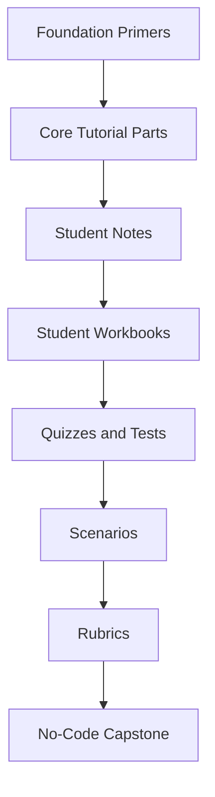
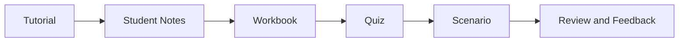
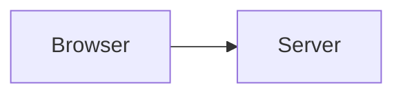
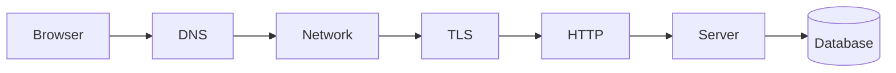
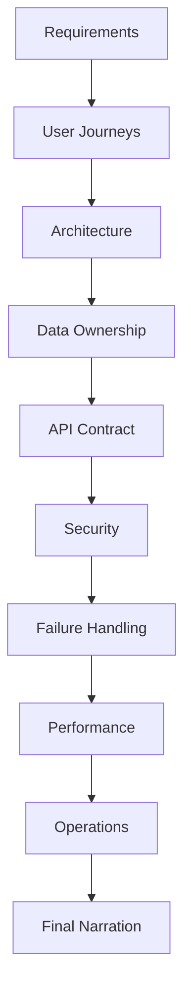

# Trainer Guide  
## Web Mechanics, Architecture & Network Fundamentals

This directory contains instructor-facing guidance for teaching the **Web Mechanics, Architecture & Network Fundamentals** curriculum.

The curriculum is designed to help learners understand how modern web applications work before they focus on a particular programming language, framework, database, or cloud platform.

The trainer guide explains how to:

- Sequence the curriculum
- Facilitate lessons
- Use the primers, tutorials, notes, workbooks, quizzes, scenarios, and rubrics
- Identify common misconceptions
- Run discussions and activities
- Assess learner understanding
- Support different learner backgrounds
- Facilitate the no-code capstone
- Adapt the material for classroom, online, or self-paced delivery

---

# 1. Curriculum Purpose

The curriculum builds a systems-level understanding of web applications.

Learners study:

```text
Frontend and backend architecture
Internet and network infrastructure
DNS and IP addressing
HTTP and HTTPS
REST and API paradigms
Browser DevTools and diagnostics
Performance
Reliability
Security
Deployment
Production operations
```

The curriculum intentionally begins with concepts rather than frameworks.

The main goal is for learners to understand:

```text
Where code runs
How systems communicate
Who owns important decisions
What can be trusted
What can fail
How failures are diagnosed
How production systems are operated
```

---

# 2. Learning Resource Ecosystem

The course contains several types of learning materials.



## Foundation primers

Build prerequisite knowledge.

Examples:

```text
Computer concepts
Command line
Programming fundamentals
HTML, CSS, and JavaScript
Data and JSON
Git
Databases and SQL
Security
Accessibility
Testing
Linux
Cloud and deployment
```

## Core tutorial parts

Teach the main conceptual sequence:

```text
Part 0 — Introduction
Part 1 — Architecture
Part 2 — Networking
Part 3 — HTTP and HTTPS
Part 4 — APIs
Part 5 — Diagnostics
Part 6 — Production
Part 7 — Capstone
```

## Student notes

Provide concise summaries for review.

## Student workbooks

Guide active application through:

```text
Tables
Diagrams
Request traces
Architecture plans
Troubleshooting reports
Reflection questions
```

## Quizzes and tests

Check conceptual understanding and application.

## Scenarios

Provide realistic troubleshooting and architecture situations.

## Rubrics

Support consistent evaluation.

## Capstone

Requires learners to plan, design, and narrate a complete web application without writing implementation code.

---

# 3. Recommended Course Sequence

The recommended sequence is:

```text
Foundation Primers
  ↓
Part 0 — Introduction
  ↓
Part 1 — Architecture
  ↓
Part 2 — Networking
  ↓
Part 3 — HTTP and HTTPS
  ↓
Part 4 — APIs
  ↓
Part 5 — Diagnostics
  ↓
Part 6 — Production
  ↓
Part 7 — No-Code Capstone
```

At each stage:

```text
Teach
  ↓
Summarize
  ↓
Practice
  ↓
Assess
  ↓
Apply
```

A typical part flow:



---

# 4. Recommended Course Modes

## Instructor-led classroom

Use:

```text
Mini-lectures
Whiteboard diagrams
Think-pair-share
Guided workbook exercises
Live DevTools demonstrations
Group architecture reviews
Scenario discussions
```

## Live online class

Use:

```text
Screen sharing
Collaborative diagrams
Breakout discussions
Shared workbooks
Polls
Chat-based prediction questions
Live request tracing
```

## Self-paced course

Provide:

```text
Reading order
Estimated durations
Completion checklists
Model examples
Quiz attempts
Scenario feedback
Capstone milestones
```

## Blended course

Combine:

```text
Independent reading
Instructor discussion
Guided activities
Practical inspection
Peer review
Capstone presentation
```

---

# 5. Target Learners

The curriculum is suitable for:

```text
Complete beginners
Aspiring frontend developers
Aspiring backend developers
Junior full-stack developers
Designers working with developers
Technical project managers
QA and support engineers
Product engineers new to web architecture
Developers changing ecosystems
```

Learners may have very different backgrounds.

Some may understand programming but not networking.

Others may understand HTML but not databases.

The trainer should diagnose prerequisites rather than assuming one uniform group.

---

# 6. Learner Background Assessment

Before beginning, ask learners:

```text
Have you used a terminal?
Have you written any code?
Do you know HTML and CSS?
Have you used Git?
Have you queried a database?
Have you used browser DevTools?
Have you worked with APIs?
Have you deployed an application?
```

A simple self-assessment:

| Topic | None | Basic | Comfortable |
|---|---:|---:|---:|
| Files and folders |  |  |  |
| Terminal |  |  |  |
| Programming |  |  |  |
| HTML/CSS |  |  |  |
| JSON |  |  |  |
| Databases |  |  |  |
| Networking |  |  |  |
| HTTP |  |  |  |
| APIs |  |  |  |
| Security |  |  |  |
| Deployment |  |  |  |

Use the results to recommend primers.

---

# 7. Primer Recommendations

| Learner profile | Recommended preparation |
|---|---|
| Complete beginner | Primers 1–5 |
| Some programming experience | Primers 1, 2, 4, and 5 |
| Frontend learner | Primers 1, 4, and 5 |
| Backend learner | Primers 1, 2, 5, and 7 |
| Security learner | Primers 5, 7, and 8 |
| Operations learner | Primers 1, 2, 6, 7, 11, and 12 |
| Experienced developer | Part 0 onward, with targeted primers |

Primers can be assigned:

```text
Before class
As optional review
As remediation
As independent study
```

---

# 8. Instructional Principles

## Teach purpose before terminology

Instead of beginning with:

```text
DNS is a hierarchical decentralized naming system.
```

Begin with:

```text
Computers need a way to find services by human-readable names.
DNS solves that problem.
```

Then introduce the formal vocabulary.

## Start simple and add layers

Begin with:

```text
Browser → Server
```

Then add:

```text
DNS
Network
TLS
HTTP
Backend
Database
Cache
Queue
```



Then expand:



## Use one running example

Continue using an online store:

```text
Browse products
Log in
Add to cart
Place order
Process payment
Send confirmation
```

This lets learners connect concepts across the course.

## Ask prediction questions

Before demonstrating, ask:

```text
What do you think will happen?
Which component should handle this?
What status code should return?
Where could this fail?
What evidence would confirm the diagnosis?
```

---

# 9. Teaching with Diagrams

Use Mermaid diagrams for:

```text
Request flows
DNS lookup
Client-server boundaries
API architecture
Authentication
Caching
Queues
Load balancing
Failure paths
Deployment
```

After showing a diagram, ask learners:

```text
What does each node represent?
Which direction does data travel?
Which components are trusted?
Which component owns the data?
Where could failure occur?
What evidence would reveal the failure?
```

A diagram should support explanation, not replace it.

---

# 10. Part 0 — Introduction Facilitation

## Main goal

Establish the series mental model.

## Key ideas

```text
Web applications are distributed systems.
The browser is a client.
The backend is a controlled environment.
Protocols define communication.
The Internet and Web are different.
Security depends on boundaries.
```

## Suggested opening activity

Ask learners to choose a familiar website and list:

```text
What the user sees
What might run in the browser
What might run on a server
What might be stored
What external services might participate
```

## Discussion prompts

```text
What happens when you type a URL?
Where does a website “live”?
Which parts of a website could be static?
Which actions require a backend?
```

## Common misconception

```text
A website is one file or one program.
```

Correction:

```text
A modern website may consist of many cooperating systems.
```

## Assessment

Use:

```text
Part 0 review quiz
Simple architecture diagram
One-minute request narration
```

---

# 11. Part 1 — Architecture Facilitation

## Main goal

Teach the frontend-backend boundary and trust model.

## Key ideas

```text
Frontend
Backend
Business logic
Authentication
Authorization
Data ownership
Client state
Server state
Rendering strategies
Full-stack frameworks
Monoliths
Microservices
Queues
```

## Suggested activity

Give learners responsibilities on cards:

```text
Open menu
Calculate final price
Check ownership
Display loading indicator
Send email
Store order
Query inventory
Show error
```

Ask them to classify each:

```text
Frontend
Backend
Database
External service
Worker
```

Then discuss cases where responsibilities are shared.

## Critical emphasis

Repeat:

```text
Client-side validation improves usability.
Server-side validation enforces security.
```

## Assessment

Use:

```text
Part 1 quiz
Architecture workbook
Architecture test
Architecture rubric
```

---

# 12. Part 2 — Networking Facilitation

## Main goal

Explain how clients locate and reach services.

## Key ideas

```text
Internet vs Web
Packets
IP addresses
IPv4 and IPv6
Public/private addresses
NAT
DNS
Routers
Ports
Latency
Bandwidth
CDNs
Data centers
Load balancers
```

## Suggested opening question

Ask:

> What has to happen before a browser can request a webpage from a domain name?

Guide learners toward:

```text
URL parsing
DNS
IP address
Routing
Connection
TLS
HTTP
```

## Suggested activity

Use a domain and ask learners to predict:

```text
What does DNS return?
What port will HTTPS use?
What could a CDN do?
What happens if DNS resolves but the server is down?
```

## Assessment

Use:

```text
Networking quiz
Networking test
Workbook 2
Request-tracing scenario
```

---

# 13. Part 3 — HTTP Facilitation

## Main goal

Teach HTTP as a structured language.

## Key ideas

```text
URL
Request
Response
Methods
Headers
Bodies
Status codes
Cookies
Sessions
Redirects
Caching
TLS
```

## Demonstration

Show a request:

```http
GET /products HTTP/1.1
Host: example.com
Accept: text/html
```

Then show a response:

```http
HTTP/1.1 200 OK
Content-Type: text/html
```

Ask:

```text
What did the client ask for?
What metadata was provided?
What did the server return?
```

## Status-code activity

Assign scenarios:

```text
Missing token
Wrong role
Missing product
Invalid input
Server exception
Service unavailable
```

Learners select:

```text
401
403
404
422
500
503
```

## Assessment

Use:

```text
HTTP workbook
Part 3 quiz
HTTP and API test
```

---

# 14. Part 4 — API Facilitation

## Main goal

Teach API design and communication contracts.

## Key ideas

```text
API provider and consumer
Resources
Representations
CRUD
REST
GraphQL
RPC
Pagination
Errors
Authentication
Authorization
Idempotency
Versioning
Serialization
```

## Suggested activity

Ask learners to design an API for:

```text
Products
Orders
Users
```

For each, require:

```text
Collection URL
Individual URL
GET
POST
PATCH
DELETE
Errors
Pagination
Authentication
```

## Paradigm comparison

Ask:

```text
Which API style fits a public product catalog?
Which fits an internal service action?
Which fits a complex dashboard?
```

Encourage tradeoff reasoning rather than one correct answer.

## Assessment

Use:

```text
API workbook
Part 4 quiz
HTTP/API test
API debugging scenario
```

---

# 15. Part 5 — Diagnostics Facilitation

## Main goal

Teach evidence-based troubleshooting.

## Key ideas

```text
Console
Network panel
Request inspection
Response inspection
Timing
Waterfalls
cURL
CORS
Authentication
Redirects
Caching
Environment mismatches
Logs
```

## Main teaching rule

Do not let learners jump immediately to code changes.

Ask:

```text
Did a request occur?
What exact URL was requested?
What method was used?
What status came back?
What did the response body say?
What did the timing show?
```

## Suggested lab

Provide a controlled problem such as:

```text
Wrong API base URL
Missing authentication
Invalid payload
CORS mismatch
404 route
500 backend error
```

Ask learners to produce:

```text
Symptom
Evidence
Likely layer
Hypothesis
Next test
Fix
Verification
Prevention
```

## Assessment

Use:

```text
Diagnostics workbook
Part 5 quiz
API debugging scenario
Authentication scenario
Slow-page-load scenario
Troubleshooting rubric
```

---

# 16. Part 6 — Production Facilitation

## Main goal

Move from “it works” to “it works safely and reliably.”

## Key ideas

```text
Performance
Caching
Database optimization
Timeouts
Retries
Circuit breakers
Graceful degradation
Security
Backups
RPO
RTO
Observability
CI/CD
Deployment
Rollback
Incident response
```

## Suggested discussion

Ask:

```text
What happens if email fails?
What happens if payment times out?
What happens if the cache disappears?
What happens if the database is slow?
How do we know the application is broken?
How do we recover?
```

## Suggested activity

Have learners classify dependencies:

```text
Critical
Important but recoverable
Optional
```

Then ask them to define failure behavior.

## Assessment

Use:

```text
Production workbook
Production-readiness test
Slow-page-load scenario
Production-outage scenario
```

---

# 17. Part 7 — Capstone Facilitation

## Main goal

Have learners plan and narrate a complete system without requiring code.

## Emphasize

```text
Requirements
Scope
Roles
User journeys
Architecture
Data ownership
API contracts
Security
Failure handling
Performance
Operations
Deployment
Recovery
```

## Capstone milestones



## Instructor role

Ask questions such as:

```text
Where does this decision happen?
Who owns this value?
What can the browser modify?
What happens if the payment provider fails?
How is the order prevented from duplicating?
How do you know this system is slow?
How do you recover?
```

## Assessment

Use:

```text
Capstone workbook
Capstone rubric
Oral or written architecture narration
```

---

# 18. Classroom Activity Bank

## Activity 1 — Responsibility Sorting

Learners classify cards into:

```text
Frontend
Backend
Database
External service
Queue
Worker
```

## Activity 2 — Request Walk

Give learners:

```text
https://shop.example.com/products/123
```

Have them narrate:

```text
DNS
Network
TLS
HTTP
Backend
Database
Response
Rendering
```

## Activity 3 — Status-Code Roleplay

Assign roles:

```text
Browser
API
Database
Authentication system
Payment provider
```

Give failure scenarios and ask learners to choose responses.

## Activity 4 — API Design Challenge

Teams design:

```text
Product API
Order API
User API
```

Require:

```text
Methods
Paths
Schemas
Errors
Authorization
Pagination
```

## Activity 5 — Architecture Tradeoff Debate

Assign groups:

```text
Modular monolith
Microservices
GraphQL
REST
Serverless
SSR
CSR
```

Require each group to explain:

```text
Best use case
Advantages
Costs
Failure modes
```

## Activity 6 — Diagnostic Evidence Drill

Give only a symptom:

```text
The page is slow.
```

Require learners to ask for evidence before proposing a fix.

---

# 19. Common Misconception Bank

## “The browser is trusted because it is official application code.”

Correction:

```text
The browser runs on a user-controlled device.
```

## “The database is the backend.”

Correction:

```text
The database stores data.
The backend controls access and applies business rules.
```

## “DNS gives you the webpage.”

Correction:

```text
DNS helps locate a destination.
HTTP retrieves the content.
```

## “HTTPS makes all application behavior secure.”

Correction:

```text
HTTPS protects transport.
It does not guarantee authorization or safe logic.
```

## “404 means the server is down.”

Correction:

```text
404 usually means the server responded but did not find the route or resource.
```

## “200 means the business operation succeeded.”

Correction:

```text
The response body may contain an application-level error.
```

## “More services mean more maturity.”

Correction:

```text
More services create additional network and operational complexity.
```

## “A cache is the source of truth.”

Correction:

```text
A cache is usually a reusable copy.
```

## “If cURL works, the browser must work.”

Correction:

```text
Browsers enforce CORS, cookies, service workers, and other policies.
```

## “A backup exists because the backup command succeeded.”

Correction:

```text
A backup is reliable only after restoration has been tested.
```

---

# 20. Assessment Strategy

Use a combination of assessments.

```text
Formative:
  Prediction questions
  Diagram annotation
  Group discussion
  Exit tickets
  One-minute explanations

Practice:
  Workbooks
  cURL exercises
  DevTools investigations
  Scenario drills

Summative:
  Quizzes
  Tests
  Capstone
```

## Formative prompts

```text
What do you think will happen?
Which system should own this value?
Where would you inspect next?
What would confirm your hypothesis?
```

## Exit-ticket examples

```text
One concept I understand:
One concept I still question:
One failure mode I can now diagnose:
One term I need to review:
```

---

# 21. Feedback Guidance

Give feedback that is:

```text
Specific
Evidence-based
Actionable
Respectful
Connected to requirements
```

Instead of:

```text
This is wrong.
```

Say:

```text
The design correctly separates the frontend and backend. However, it treats the browser’s price as authoritative. Move final price calculation to the backend and explain how the response updates the frontend.
```

---

# 22. Accessibility and Inclusion

Provide:

```text
Accessible documents
Clear headings
Text alternatives for diagrams
Captions for videos
Keyboard-accessible activities
Flexible response formats
Extra time where appropriate
Downloadable materials
```

Learners may submit:

```text
Written narration
Diagram
Recorded explanation
Table
Presentation
```

The goal is understanding, not a single output format.

---

# 23. Online and Self-Paced Delivery

## Online live delivery

Use:

```text
Screen sharing
Shared diagrams
Breakout groups
Polls
Chat questions
Live DevTools demonstration
```

## Self-paced delivery

Provide:

```text
Estimated times
Prerequisites
Completion checklists
Model examples
Answer keys
Review links
Optional extension tasks
```

## Suggested session pattern

```text
10 minutes:
  Review

20 minutes:
  Concept explanation

20 minutes:
  Guided activity

15 minutes:
  Discussion

10 minutes:
  Individual reflection

5 minutes:
  Exit ticket
```

Adjust based on learner needs.

---

# 24. Trainer Preparation Checklist

Before teaching a session:

```text
[ ] Read the relevant tutorial.
[ ] Review the student notes.
[ ] Review the workbook.
[ ] Review the quiz and answer key.
[ ] Review the relevant scenario.
[ ] Identify expected misconceptions.
[ ] Prepare a simple diagram.
[ ] Prepare one real example.
[ ] Test all commands and links.
[ ] Prepare an accessible alternative.
[ ] Decide what evidence learners should produce.
```

---

# 25. Course Maintenance

Review the curriculum periodically.

Check:

```text
HTTP terminology
Browser DevTools labels
cURL behavior
Security recommendations
Cloud terminology
API standards
Links
Mermaid diagrams
Examples
Tool versions
```

Prefer stable concepts over framework-specific details.

When updating content, check whether the change affects:

```text
Tutorial
Student notes
Workbook
Quiz
Scenario
Rubric
Trainer guidance
```

---

# 26. Recommended Trainer Guide Structure

```text
trainer-guide/
├── README.md
├── 00-program-overview.md
├── 01-learning-outcomes.md
├── 02-course-sequencing.md
├── 03-teaching-strategies.md
├── 04-primer-facilitation.md
├── 05-part-00-introduction.md
├── 06-part-01-architecture.md
├── 07-part-02-networking.md
├── 08-part-03-http.md
├── 09-part-04-apis.md
├── 10-part-05-diagnostics.md
├── 11-part-06-production.md
├── 12-part-07-capstone.md
├── 13-assessment-and-grading.md
├── 14-common-misconceptions.md
├── 15-classroom-activities.md
├── 16-troubleshooting-labs.md
├── 17-accessibility-and-inclusion.md
├── 18-online-and-self-paced-delivery.md
├── 19-course-maintenance.md
└── templates/
    ├── lesson-plan.md
    ├── session-plan.md
    ├── feedback-form.md
    ├── learner-observation.md
    └── retrospective.md
```

---

# 27. Trainer Reflection

After each session, record:

```text
What worked?
____________________________________________________________

What confused learners?
____________________________________________________________

Which activity created the best discussion?
____________________________________________________________

Which terms need more explanation?
____________________________________________________________

What should be changed next time?
____________________________________________________________

Which learners need additional support?
____________________________________________________________
```

---

# 28. Final Trainer Principle

The trainer’s job is not simply to deliver information.

The trainer should help learners:

```text
Ask better questions
Build mental models
Trace systems
Separate evidence from assumptions
Identify trust boundaries
Explain tradeoffs
Diagnose failures
Communicate technical ideas
```

The most important question to ask repeatedly is:

> Which system is responsible for this, and what evidence would prove that?
