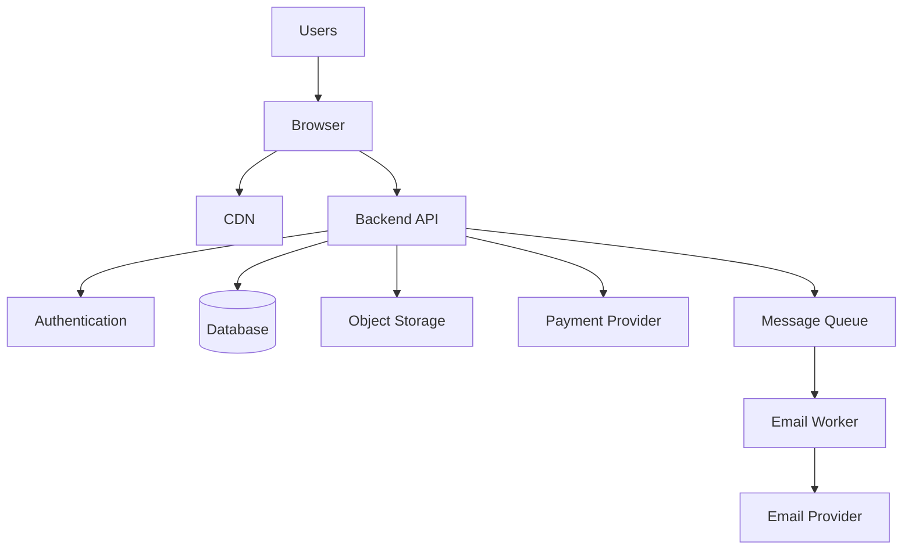
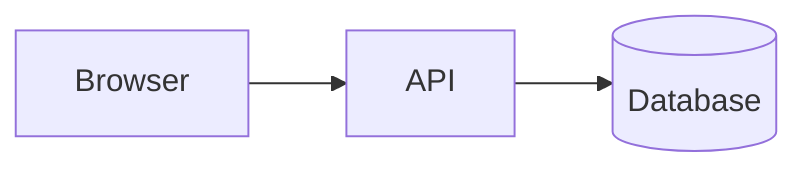
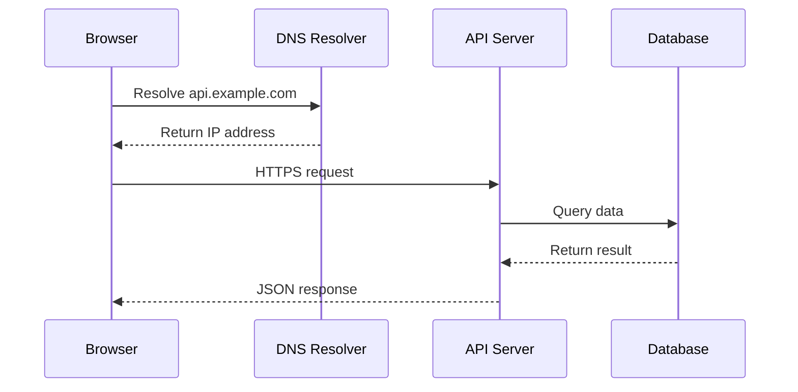
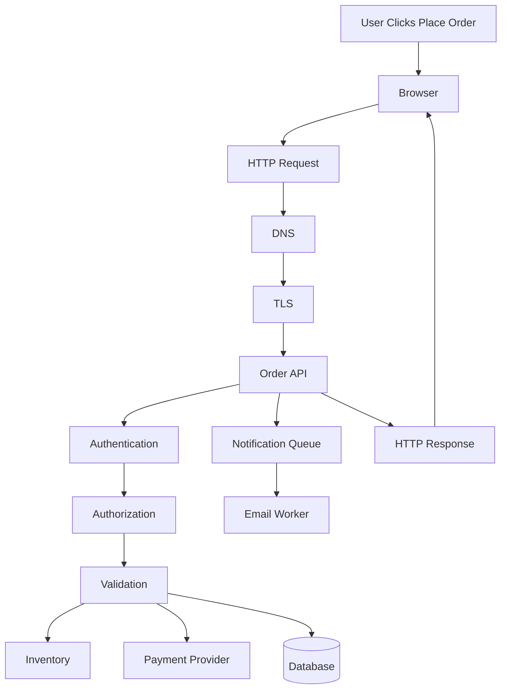
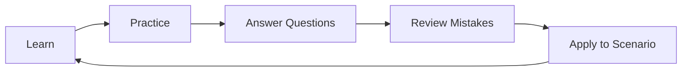

# Quizzes and Tests

This folder contains quizzes, review questions, assessments, scenario exercises, and practical tests for the **Web Mechanics, Architecture & Network Fundamentals** learning series.

The purpose of this directory is to help learners:

- Review important concepts
- Check whether they understand the material
- Identify knowledge gaps
- Practice explaining technical ideas
- Apply concepts to realistic web-application scenarios
- Prepare for technical interviews
- Test troubleshooting and architecture skills

These materials are designed to supplement the tutorials, primers, and appendices. They are not intended to replace them.

---

## Learning Resource Structure

The complete learning system is organized into four layers:

```text
Foundation Primers
  ↓
Core Tutorial Series
  ↓
Appendices and Reference Guides
  ↓
Quizzes, Tests, and Scenario Practice
```

The quizzes and tests should be used after studying the relevant material.

---

# Directory Purpose

This folder may contain:

```text
Short quizzes
Part review quizzes
Primer review quizzes
Module tests
Scenario-based questions
Troubleshooting drills
Architecture exercises
Security assessments
Performance exercises
Capstone assessments
Answer keys
```

A possible structure:

```text
quizzes-and-tests/
├── README.md
├── quizzes/
│   ├── primer-01-computer-concepts.md
│   ├── primer-02-command-line.md
│   ├── part-01-architecture.md
│   ├── part-02-networking.md
│   ├── part-03-http.md
│   ├── part-04-apis.md
│   └── part-05-diagnostics.md
├── tests/
│   ├── foundation-test.md
│   ├── architecture-test.md
│   ├── networking-test.md
│   ├── http-api-test.md
│   └── production-readiness-test.md
├── scenarios/
│   ├── request-tracing.md
│   ├── api-debugging.md
│   ├── authentication-failure.md
│   ├── slow-page-load.md
│   └── production-outage.md
└── rubrics/
    ├── architecture-rubric.md
    ├── troubleshooting-rubric.md
    └── capstone-rubric.md
```

The exact structure may evolve as the series grows.

---

# Assessment Categories

## 1. Knowledge Quizzes

Short quizzes test vocabulary and basic understanding.

Example questions:

- What does DNS do?
- What is the difference between a client and a server?
- What does `401 Unauthorized` usually mean?
- What is the purpose of the `Content-Type` header?
- What is a CDN?
- What is the difference between authentication and authorization?

These questions are useful after completing a primer or tutorial part.

---

## 2. Conceptual Review Questions

Conceptual questions test whether learners understand how systems work.

Example:

> Why should a browser normally not connect directly to a private database?

A strong answer should mention:

- Security boundaries
- Business logic
- Authorization
- Data validation
- Credential protection
- Controlled access through a backend API

---

## 3. Scenario-Based Questions

Scenario questions require learners to apply concepts to realistic situations.

Example:

> A user clicks “Place Order.” The browser sends `POST /api/orders`, but the server returns `409 Conflict`. What might have happened?

Possible explanations include:

- Inventory changed
- The order conflicts with current state
- A duplicate request was detected
- A concurrent update occurred
- The operation is no longer valid

---

## 4. Troubleshooting Drills

Troubleshooting exercises ask learners to identify the failing layer.

Example:

> A page appears blank. The HTML request returns `200`, but no API requests appear in DevTools. Where should you investigate?

Possible areas:

- JavaScript initialization
- Runtime exceptions
- Frontend mounting
- Event handlers
- Route configuration
- Failed JavaScript bundle loading

---

## 5. Architecture Exercises

Architecture exercises ask learners to design or evaluate systems.

Example:

> Design an architecture for an online store that supports product browsing, payments, file uploads, and email notifications.

A reasonable design may include:



---

## 6. Practical Command Tests

These tests require learners to use tools such as:

- Browser Developer Tools
- cURL
- Postman
- Bruno
- Git
- Terminal commands
- Database clients

Example tasks:

```bash
curl -i https://example.com
curl -I https://example.com
curl -v https://example.com
```

Learners may be asked to:

- Identify the status code
- Inspect response headers
- Reproduce a browser request
- Send a JSON payload
- Add an authorization header
- Diagnose a redirect
- Check a local service

---

# Question Difficulty Levels

Questions should use consistent difficulty levels.

## Level 1 — Recall

Tests basic vocabulary.

Example:

> What does HTTP stand for?

## Level 2 — Understanding

Tests whether the learner can explain a concept.

Example:

> Why is HTTPS different from HTTP?

## Level 3 — Application

Requires using a concept in a practical situation.

Example:

> Which HTTP method would you normally use to partially update a user profile?

## Level 4 — Analysis

Requires diagnosing a problem.

Example:

> A request returns `200 OK`, but the interface displays no products. What should you inspect?

## Level 5 — Architecture and Design

Requires making and justifying technical decisions.

Example:

> Design a reliable order-processing workflow that prevents duplicate orders when clients retry requests.

---

# Question Formats

Questions may use different formats.

## Multiple choice

```markdown
### Question

Which status code usually indicates that authentication is required?

- [ ] `200 OK`
- [ ] `401 Unauthorized`
- [ ] `403 Forbidden`
- [ ] `500 Internal Server Error`

**Answer:** `401 Unauthorized`
```

## Short answer

```markdown
### Question

What is the difference between authentication and authorization?

**Answer:**

Authentication verifies identity. Authorization determines what that identity is allowed to do.
```

## Explain the diagram

```markdown
### Question

Explain the role of each component in this architecture.


```

## Troubleshooting scenario

```markdown
### Scenario

A request returns `404 Not Found`.

What should you inspect first?

**Expected areas:**

- Request URL
- HTTP method
- API version
- Route definition
- Environment
- Resource identifier
```

## Practical task

```markdown
### Task

Use cURL to send a JSON `POST` request to an API endpoint.

Your request should include:

- `Content-Type: application/json`
- A JSON request body
- An appropriate HTTP method
```

---

# Recommended Quiz Format

Each quiz should include:

```text
Title
Learning objectives
Prerequisites
Instructions
Questions
Answer key
Explanations
Suggested review topics
```

Example:

```markdown
# Part 3 Quiz — HTTP and HTTPS

## Learning Objectives

After completing this quiz, you should be able to:

- Identify the parts of an HTTP request.
- Explain common HTTP methods.
- Interpret status codes.
- Describe what HTTPS protects.

## Instructions

- Answer each question before viewing the answer.
- Explain your reasoning for scenario questions.
- Review the explanations for incorrect answers.
```

---

# Recommended Test Format

A larger test may include sections:

```text
Section A — Vocabulary
Section B — HTTP and API interpretation
Section C — Troubleshooting
Section D — Architecture
Section E — Practical command-line tasks
Section F — Security and production reasoning
```

Example weighting:

```text
Vocabulary:                 15%
Conceptual understanding:   20%
Practical application:     25%
Troubleshooting:            20%
Architecture:               20%
```

The exact weighting may change depending on the test.

---

# Answer Key Guidelines

Answer keys should explain more than just the correct option.

A useful answer should contain:

```text
Correct answer
Reasoning
Why other answers are incorrect
Related concepts
Common mistake
```

Example:

```markdown
### Question

What is the difference between `401` and `403`?

### Answer

- `401 Unauthorized` usually means authentication is missing, invalid, or expired.
- `403 Forbidden` usually means the server knows who the caller is but refuses to authorize the operation.

### Common Mistake

Treating every permission failure as `401`.
```

For scenario questions, multiple answers may be reasonable if the learner explains the tradeoffs correctly.

---

# Scenario Answer Guidelines

Scenario answers should distinguish between:

```text
Likely cause
Possible causes
Evidence to collect
Next diagnostic step
Potential fix
Preventive measure
```

Example structure:

```markdown
## Scenario

The browser sends a request, but the response is `500 Internal Server Error`.

## Likely Areas

- Backend exception
- Database failure
- External service failure
- Missing configuration
- Deployment issue

## Evidence to Collect

- Request URL
- Request body
- Response body
- Request ID
- Server logs
- Database logs
- Recent deployment history

## Recommended Next Step

Reproduce the request with cURL and locate the request ID in the server logs.
```

---

# Scoring Guidance

Scoring should reward understanding and reasoning, not only memorization.

## Basic question

```text
Correct answer: Full credit
Incorrect answer: No credit
```

## Short explanation

```text
Correct concept with minor wording issue: Full or near-full credit
Partially correct concept: Partial credit
Incorrect concept: No credit
```

## Architecture question

Evaluate:

```text
Correct component responsibilities
Security boundaries
Data ownership
Failure handling
Scalability reasoning
Tradeoff explanation
```

## Troubleshooting question

Evaluate:

```text
Correct layer identification
Evidence-based reasoning
Appropriate diagnostic tool
Correct interpretation of results
Safe proposed fix
```

---

# Suggested Score Labels

Use labels instead of treating scores as absolute judgments.

```text
90–100%:
  Strong understanding

75–89%:
  Good understanding; review weaker sections

60–74%:
  Partial understanding; revisit key concepts

Below 60%:
  Review the relevant primer or tutorial section
```

For scenario and architecture work, use qualitative feedback as well.

---

# How to Use This Folder

A recommended workflow:

```text
1. Study the relevant primer or tutorial part.
2. Complete the quiz without looking at answers.
3. Review incorrect answers.
4. Read the explanations.
5. Complete a scenario or practical exercise.
6. Revisit the related tutorial sections.
7. Retake the quiz later.
```

Do not use the answer key as the first step.

The goal is to identify what you can explain independently.

---

# Recommended Learning Paths

## Beginner path

```text
Primer 1 quiz
Primer 2 quiz
Primer 3 quiz
Primer 4 quiz
Primer 5 quiz
Part 0 review
Part 1 review
Part 2 review
Part 3 review
Part 4 review
Part 5 review
Part 6 review
```

## Networking-focused path

```text
Primer 1
Primer 2
Part 2
Part 3
Appendix D
Appendix E
Appendix K
```

## API-focused path

```text
Primer 3
Primer 5
Part 3
Part 4
Part 5
Appendix G
Appendix H
```

## Security-focused path

```text
Primer 5
Primer 7
Part 1
Part 3
Appendix I
Appendix K
Appendix L
```

## Production-focused path

```text
Primer 2
Primer 6
Primer 7
Primer 11
Primer 12
Part 6
Appendix J
Appendix K
Appendix L
```

---

# Naming Conventions

Use clear, predictable filenames.

Examples:

```text
primer-01-computer-concepts-quiz.md
primer-02-command-line-quiz.md
primer-03-programming-fundamentals-quiz.md
part-01-architecture-quiz.md
part-02-networking-quiz.md
part-03-http-quiz.md
part-04-api-paradigms-quiz.md
part-05-diagnostics-quiz.md
part-06-production-quiz.md
```

Scenario files:

```text
scenario-dns-failure.md
scenario-api-401.md
scenario-api-500.md
scenario-slow-page-load.md
scenario-order-processing.md
scenario-deployment-rollback.md
```

Answer files:

```text
answer-key-primer-01.md
answer-key-part-03.md
answer-key-scenarios.md
```

---

# Suggested Directory Structure

```text
quizzes-and-tests/
├── README.md
├── quizzes/
│   ├── primers/
│   │   ├── primer-01-computer-concepts.md
│   │   ├── primer-02-command-line.md
│   │   ├── primer-03-programming.md
│   │   ├── primer-04-html-css-javascript.md
│   │   ├── primer-05-data-json.md
│   │   ├── primer-06-git.md
│   │   ├── primer-07-databases-sql.md
│   │   ├── primer-08-security.md
│   │   ├── primer-09-accessibility.md
│   │   ├── primer-10-testing.md
│   │   ├── primer-11-linux-servers.md
│   │   └── primer-12-cloud-deployment.md
│   └── parts/
│       ├── part-00-introduction.md
│       ├── part-01-architecture.md
│       ├── part-02-networking.md
│       ├── part-03-http-https.md
│       ├── part-04-api-paradigms.md
│       ├── part-05-diagnostics.md
│       └── part-06-production.md
├── tests/
│   ├── foundation-test.md
│   ├── architecture-test.md
│   ├── networking-test.md
│   ├── http-api-test.md
│   ├── security-test.md
│   └── production-readiness-test.md
├── scenarios/
│   ├── dns-failure.md
│   ├──-page-not-loading.md
│   ├── api-debugging.md
│   ├── authentication-failure.md
│   ├── authorization-failure.md
│   ├── slow-request.md
│   ├── database-outage.md
│   ├── duplicate-order.md
│   └── deployment-rollback.md
├── answer-keys/
│   ├── primers.md
│   ├── parts.md
│   ├── tests.md
│   └── scenarios.md
└── rubrics/
    ├── architecture.md
    ├── troubleshooting.md
    ├── security.md
    └── capstone.md
```

Correct any filenames that contain accidental spaces or inconsistent naming before adding files.

---

# Question Quality Standards

Questions should be:

```text
Clear
Specific
Relevant
Unambiguous
Appropriately difficult
Connected to the tutorials
```

Avoid questions that depend on:

- Unexplained framework-specific behavior
- Unstable tool versions
- Trick wording
- Minor terminology disputes
- Memorization without application
- Details not covered in the learning material

For scenario questions, accept multiple valid approaches when the reasoning is sound.

---

# Use Mermaid Diagrams for Systems Questions

Mermaid diagrams are useful for:

- Request flows
- DNS resolution
- Authentication
- API calls
- Database relationships
- Deployment pipelines
- Failure paths
- Load balancing
- Caching
- Queues
- Troubleshooting decision trees

Example:



Questions may ask learners to:

```text
Explain the sequence.
Identify trust boundaries.
Identify possible failures.
Suggest diagnostic evidence.
```

---

# Capstone Assessment

A final capstone may ask learners to analyze an entire feature:

```text
A user places an order in an online store.
```

Required topics:

```text
Frontend interaction
HTTP request
DNS
TLS
Authentication
Authorization
Validation
Database
Inventory
Payment
Idempotency
Queue
Email notification
Response handling
Error states
Logging
Monitoring
Recovery
```



The capstone should evaluate explanation, not just terminology recall.

---

# Contribution Guidelines

When adding a quiz or test:

```text
1. Identify the relevant tutorial, primer, or appendix.
2. Define the learning objectives.
3. Use clear question numbering.
4. Include a mixture of question types.
5. Add explanations to the answer key.
6. Avoid exposing secrets or real credentials.
7. Verify code examples.
8. Confirm Mermaid diagrams render on GitHub.
9. Check links and filenames.
10. Review difficulty and ambiguity.
```

For scenario answers, explain why the proposed diagnosis is reasonable.

---

# Final Purpose

This folder is intended to turn passive reading into active learning.

Use it to:

```text
Recall concepts
Explain systems
Apply knowledge
Diagnose failures
Compare designs
Practice tools
Review security
Prepare for production
```

The best learning loop is:



The goal is not simply to get correct quiz scores.

The goal is to become capable of explaining, inspecting, debugging, designing, and operating web applications with confidence.
