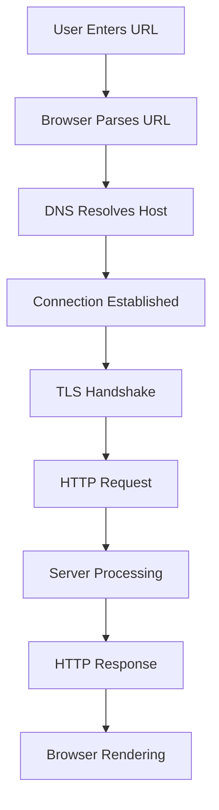
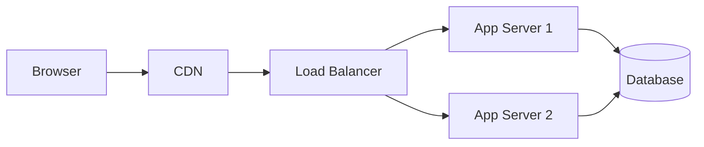
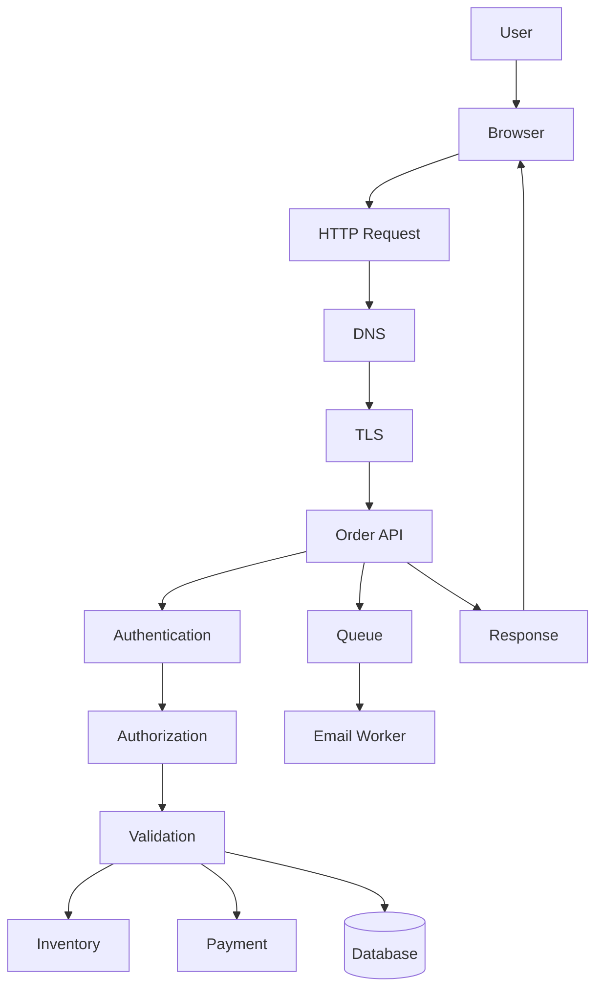

Yes. An extensive Q&A bank would be an excellent addition, especially for this series.

It would serve a different purpose from the tutorials, primers, and appendices:

```text
Primers:
  Build prerequisites

Main parts:
  Teach concepts progressively

Appendices:
  Provide reference material

Q&A bank:
  Test understanding and reveal gaps
```

# Why a Q&A Bank Is Valuable

A strong Q&A bank can help readers:

- Review key concepts
- Prepare for technical interviews
- Practice explaining systems
- Identify weak areas
- Learn common troubleshooting patterns
- Connect isolated concepts
- Practice architecture reasoning
- Distinguish similar terms
- Build confidence before writing code

The most valuable questions should not only ask:

```text
What does DNS stand for?
```

They should also ask:

```text
What happens when a browser requests a domain whose DNS record exists but whose server is unavailable?
```

That tests understanding rather than memorization.

---

# Recommended Q&A Categories

## 1. Concept-definition questions

Examples:

- What is a client?
- What is a server?
- What is an API?
- What is a protocol?
- What is a port?
- What is a database?
- What is a CDN?
- What is a cache?

These are useful for vocabulary building.

---

## 2. Compare-and-contrast questions

Examples:

- What is the difference between the Internet and the Web?
- What is the difference between authentication and authorization?
- What is the difference between a frontend and a backend?
- What is the difference between a database and a cache?
- What is the difference between a `401` and a `403`?
- What is the difference between `PUT` and `PATCH`?
- What is the difference between latency and bandwidth?
- What is the difference between REST and GraphQL?
- What is the difference between a process and a program?

These are particularly useful because beginners often confuse related terms.

---

## 3. Request-tracing questions

These ask learners to follow a complete journey.

Example:

> What happens after a user enters `https://example.com/products` into a browser?

Expected reasoning:



Other examples:

- Trace a login request.
- Trace a file upload.
- Trace an API request to a database.
- Trace an image request through a CDN.
- Trace an order through a payment provider and queue.

---

## 4. Troubleshooting questions

Examples:

- The browser shows a `404`. What should you inspect?
- The browser shows `401`. What does that usually mean?
- cURL works, but browser JavaScript fails. What could cause the difference?
- A page is blank, but the HTML request succeeded. What should you investigate?
- A request returns `500`. Which systems might be involved?
- DNS resolves, but the site times out. What does that suggest?
- A page shows stale content. Which cache layers could be involved?
- A form submits twice. What could be happening?

These questions develop practical debugging ability.

---

## 5. Architecture questions

Examples:

- Where should price calculation occur?
- Why should browsers not connect directly to private databases?
- Which parts of an application should be asynchronous?
- When might a CDN help?
- When might server-side rendering be useful?
- Why would a system use a message queue?
- When might a monolith be preferable to microservices?
- What should happen if an email provider is unavailable?

These questions train design judgment.

---

## 6. Security questions

Examples:

- Why is client-side validation insufficient?
- Why should secrets not be included in frontend code?
- What is the difference between encryption and authentication?
- How does HTTPS help?
- What does `HttpOnly` do?
- Why is hiding an admin button not authorization?
- What is SQL injection?
- What is XSS?
- What is CSRF?
- Why should uploaded files be treated as untrusted?

These should include safe, practical explanations rather than exploit instructions.

---

## 7. HTTP and API questions

Examples:

- What is the structure of an HTTP request?
- What does `Content-Type` describe?
- What does `Accept` describe?
- When should you use `GET`?
- What does `201 Created` mean?
- Why might an API return `202 Accepted`?
- What is idempotency?
- How should a large collection be paginated?
- What is the difference between a path parameter and a query parameter?

---

## 8. Diagram interpretation questions

Show a Mermaid diagram and ask the reader to explain it.



Questions:

- What does the CDN do?
- Why are there two application servers?
- What is the load balancer’s responsibility?
- What happens if App Server 1 fails?
- Is the database still a single point of failure?

Diagram questions are excellent for architectural understanding.

---

## 9. Scenario-based questions

These are usually the most valuable.

Example:

> A user clicks “Place Order.” The browser sends `POST /api/orders`, but the response is `409 Conflict`. What might have happened?

Expected possibilities:

```text
Inventory changed
Duplicate order conflict
Concurrent update
Resource state no longer permits the operation
```

Another:

> A page loads in development but returns `502 Bad Gateway` in production. What should you inspect?

Possible areas:

```text
Reverse proxy
Application process
Application port
Health checks
Firewall rules
Environment variables
Upstream connectivity
```

---

## 10. Practical command questions

Examples:

- What does `curl -I` do?
- What does `curl -v` show?
- How do you send JSON with cURL?
- How do you follow redirects?
- How do you inspect which process uses port `3000`?
- What does `git status` show?
- What does `git diff --cached` show?
- How do you inspect a service’s logs?
- How do you check DNS resolution?
- How do you test an API without a browser?

These questions reinforce the command-line and diagnostic primers.

---

# Recommended Answer Structure

Each answer should ideally contain:

```text
Short answer
Detailed explanation
Example
Common mistake
Related concepts
```

Example:

## Question

What is the difference between authentication and authorization?

## Short answer

Authentication verifies who someone is. Authorization determines what they are allowed to do.

## Example

```text
Authentication:
  User proves they are Alex.

Authorization:
  Server checks whether Alex may edit order 9001.
```

## Common mistake

Being logged in does not mean the user can access every resource.

---

# Suggested Difficulty Levels

Use levels to make the bank progressive.

## Level 1 — Recall

```text
What does HTTP stand for?
What is a port?
What does DNS do?
```

## Level 2 — Understanding

```text
Why does a browser use DNS?
Why are headers useful?
Why does a backend validate client input?
```

## Level 3 — Application

```text
Which status code should an API return when validation fails?
How would you test an API without a frontend?
```

## Level 4 — Analysis

```text
A request returns 200, but the UI is empty. What layers could be involved?
```

## Level 5 — Architecture

```text
Design a system that serves users globally while protecting a private database.
```

---

# Suggested Q&A Bank Organization

```text
Section A — Computer and command-line fundamentals
Section B — Frontend and backend architecture
Section C — Internet and networking
Section D — DNS and addressing
Section E — HTTP and HTTPS
Section F — APIs and REST
Section G — GraphQL and RPC
Section H — Browser DevTools and diagnostics
Section I — Databases and persistence
Section J — Security
Section K — Performance
Section L — Reliability and production
Section M — Scenario-based architecture
Section N — Troubleshooting drills
Section O — Interview-style review questions
Section P — Capstone questions
```

---

# Add Answers at Multiple Depths

For beginner-friendliness, include expandable depth conceptually:

```text
Quick answer:
  One or two sentences.

Expanded answer:
  Detailed explanation and example.

Deep-dive note:
  Advanced tradeoffs and exceptions.
```

This lets beginners avoid being overwhelmed while giving experienced learners more depth.

---

# Include “Why the Other Answers Are Wrong”

For multiple-choice questions, explain incorrect options.

Example:

> Which status code usually means authentication is required?

```text
A. 401
B. 403
C. 404
D. 500
```

Answer:

```text
A. 401

403 means the caller is known but lacks permission.
404 means the resource was not found.
500 means the server encountered an internal failure.
```

This is more educational than providing only the correct letter.

---

# Include Confidence and Evidence Questions

Useful prompts include:

```text
What evidence would confirm your diagnosis?
Which panel or command would you use?
What would you expect to see?
What result would rule out your hypothesis?
```

Example:

> You suspect a request is failing because of CORS. What evidence would you inspect?

Expected answer:

```text
Browser Console error
OPTIONS preflight
Origin header
Access-Control-Allow-Origin
Allowed methods
Allowed headers
Credentials behavior
```

This teaches investigation rather than guessing.

---

# Add Review Checklists

At the end of each Q&A section:

```text
Can I explain the concept without memorizing a definition?
Can I give an example?
Can I identify a failure mode?
Can I inspect it in DevTools or cURL?
Can I explain where the code runs?
Can I identify the trust boundary?
```

---

# Add Capstone Q&A

A final capstone could follow:

```text
A user places an order in an online store.
```

Ask:

1. What happens in the browser?
2. What HTTP method is used?
3. What data is sent?
4. How is the user authenticated?
5. Where is authorization enforced?
6. How does DNS participate?
7. How does HTTPS protect communication?
8. How does the backend validate the order?
9. How does the backend check inventory?
10. Where is the order stored?
11. How is payment processed?
12. Which operations should be asynchronous?
13. Which status codes could be returned?
14. What happens if payment times out?
15. How would you inspect the request?
16. How would you reproduce it with cURL?
17. What logs and metrics should exist?
18. How would you prevent duplicate orders?
19. How would you recover if the database failed?
20. Which security boundaries are involved?



---

# Recommended Size

A genuinely extensive bank could contain:

```text
Beginner recall:
  50–75 questions

Conceptual understanding:
  75–100 questions

HTTP and APIs:
  100–150 questions

Troubleshooting:
  75–100 questions

Security:
  75–100 questions

Performance and production:
  75–100 questions

Architecture scenarios:
  50–75 questions

Capstone:
  25–50 questions
```

A total of roughly:

```text
500–700 questions
```

would be substantial without becoming repetitive.

You could also produce a smaller first release:

```text
25 questions per main part
10 questions per primer
50 scenario questions
```

---

# Important Design Principle

Do not make every question a vocabulary quiz.

A strong Q&A bank should test whether the learner can:

```text
Explain
Compare
Trace
Predict
Diagnose
Design
Justify
Apply
```

The best question type is often:

> What would you inspect next, and why?

That question develops real engineering judgment.

---

# Recommendation

Yes—create the Q&A bank as a separate resource after the primers and appendices.

Recommended structure:

```text
Foundation Primers
Core Series
Appendices
Q&A Bank
  Part 0–6 Review
  Primer Review
  Scenario Drills
  Troubleshooting Drills
  Architecture Scenarios
  Security Review
  Interview-Style Questions
  Capstone Assessment
```

Use Mermaid diagrams for:

- Request journeys
- Failure decision trees
- Architecture scenarios
- Authentication flows
- Deployment flows
- Database relationships
- Performance bottlenecks

This would turn the series from a tutorial into a complete learning system:

```text
Learn the concepts
  ↓
Practice with examples
  ↓
Look up reference material
  ↓
Test understanding
  ↓
Apply knowledge to scenarios
```
