# Part 1 Quiz — Deconstructing Software Architecture  
## Frontend, Backend, APIs, State, Rendering Models, and Full-Stack Systems

This quiz reviews:

- Frontend and backend responsibilities
- Browsers as client-side runtimes
- Client-side trust boundaries
- Server-side business logic
- Authentication and authorization
- Databases and external services
- Frontend-backend contracts
- Client-side and server-side state
- Static sites
- Server-side rendering
- Single-page applications
- Static generation
- Hybrid applications
- Full-stack frameworks
- Monoliths
- Microservices
- Serverless functions
- Edge computing
- Background jobs
- Failure boundaries
- Architecture tradeoffs

---

## Instructions

- Complete the quiz before reading the answer key.
- Explain your reasoning for short-answer and scenario questions.
- Some architecture questions may have multiple valid answers.
- For design questions, explain tradeoffs rather than searching for one “perfect” answer.
- Treat the browser as an untrusted client throughout this quiz.

---

## Learning Objectives

After completing this quiz, you should be able to:

- Explain the difference between frontend and backend code.
- Identify which responsibilities belong in the browser and which belong on the server.
- Explain why frontend validation cannot enforce security.
- Describe authentication and authorization.
- Explain how the backend interacts with databases and external services.
- Describe the frontend-backend contract.
- Distinguish client-side state from server-side state.
- Compare static sites, SPAs, SSR, static generation, and hybrid applications.
- Explain how full-stack frameworks use multiple runtimes.
- Compare monoliths, microservices, serverless functions, and edge execution.
- Explain background jobs and queues.
- Identify architectural failure points.
- Evaluate architecture tradeoffs.

---

# Part 1 — Multiple-Choice Quiz

Choose the best answer.

## Question 1

What is the frontend?

- [ ] Only the database
- [ ] Software running close to the user, often in a browser
- [ ] A physical network cable
- [ ] A private server’s operating system

---

## Question 2

What is the backend?

- [ ] The visible page layout only
- [ ] Software running in a controlled server environment
- [ ] The user’s keyboard
- [ ] A CSS stylesheet

---

## Question 3

Which task most commonly belongs to the frontend?

- [ ] Rendering a button
- [ ] Enforcing database permissions
- [ ] Processing a private payment credential
- [ ] Determining whether a user owns another user’s order

---

## Question 4

Which task most commonly belongs to the backend?

- [ ] Opening a dropdown menu
- [ ] Showing a loading spinner
- [ ] Enforcing authorization
- [ ] Changing the color of a button

---

## Question 5

Why must the browser be treated as untrusted?

- [ ] Browsers cannot execute code.
- [ ] Users can inspect and modify client-side code and requests.
- [ ] Browsers cannot communicate with servers.
- [ ] Browsers are always offline.

---

## Question 6

What is the purpose of client-side validation?

- [ ] To replace server-side security checks
- [ ] To provide fast feedback and improve usability
- [ ] To guarantee that requests cannot be modified
- [ ] To protect database credentials

---

## Question 7

What must the backend do even if the frontend validates input?

- [ ] Trust the frontend’s result
- [ ] Validate and enforce rules independently
- [ ] Hide the input from the browser
- [ ] Disable all API requests

---

## Question 8

Authentication answers which question?

- [ ] What color should the page use?
- [ ] Who is the caller?
- [ ] Which database table should be displayed?
- [ ] How fast is the network?

---

## Question 9

Authorization answers which question?

- [ ] Who are you?
- [ ] What are you allowed to do?
- [ ] What browser are you using?
- [ ] What is your IP address?

---

## Question 10

Which system should usually be the authoritative source for a product’s current price?

- [ ] The browser’s displayed text
- [ ] A hidden HTML field
- [ ] The backend or database
- [ ] A CSS variable

---

## Question 11

Why should a browser usually not connect directly to a private database?

- [ ] Databases cannot store data.
- [ ] It would expose credentials, data, and business rules.
- [ ] Browsers cannot send network traffic.
- [ ] Databases only work with HTML.

---

## Question 12

What is business logic?

- [ ] CSS layout
- [ ] Rules defining how the application should behave
- [ ] A network cable
- [ ] A file extension

---

## Question 13

Which is an example of business logic?

- [ ] A button has rounded corners.
- [ ] A user cannot cancel an order after shipment.
- [ ] A heading is blue.
- [ ] A menu uses flexbox.

---

## Question 14

What is an API contract?

- [ ] A legal contract between every user
- [ ] An agreement describing how software systems communicate
- [ ] A CSS reset
- [ ] A database backup

---

## Question 15

Which item may be part of an API contract?

- [ ] Endpoint path
- [ ] Request method
- [ ] Request and response format
- [ ] All of the above

---

## Question 16

What is client-side state?

- [ ] Data used to represent the current browser interface
- [ ] Only information stored in a database
- [ ] A server’s CPU usage
- [ ] A DNS record

---

## Question 17

Which is an example of frontend state?

- [ ] Whether a menu is open
- [ ] The authoritative inventory count
- [ ] A database password
- [ ] The payment provider’s private key

---

## Question 18

Which is usually server-side state?

- [ ] The currently selected tab
- [ ] Whether a modal is visible
- [ ] An order’s payment status
- [ ] The current mouse position

---

## Question 19

What is a source of truth?

- [ ] Any value displayed in the browser
- [ ] The system considered authoritative for a piece of information
- [ ] A CSS file
- [ ] A browser extension

---

## Question 20

What is a static website?

- [ ] A website that cannot contain JavaScript
- [ ] A website primarily served from prebuilt files
- [ ] A website with no HTML
- [ ] A website that must use a database

---

## Question 21

Can a static website contain interactive behavior?

- [ ] No, static websites cannot use JavaScript.
- [ ] Yes, JavaScript can provide interaction and call APIs.
- [ ] Only if it uses a private database.
- [ ] Only if it runs inside a mobile app.

---

## Question 22

What is server-side rendering?

- [ ] The browser generates all HTML without a server
- [ ] The server generates HTML before sending it to the browser
- [ ] The database styles the page
- [ ] A CDN deletes HTML after delivery

---

## Question 23

What is client-side rendering?

- [ ] The browser uses JavaScript to generate or update much of the interface
- [ ] The database renders the screen
- [ ] A server never sends any data
- [ ] The browser cannot update the DOM

---

## Question 24

What is hydration?

- [ ] Encrypting a database
- [ ] Connecting client-side behavior to server-generated HTML
- [ ] Compressing an image
- [ ] Starting a server process

---

## Question 25

What is static generation?

- [ ] Generating pages ahead of time, usually during a build
- [ ] Generating every page only after a user requests it
- [ ] Removing all JavaScript
- [ ] Storing data only in RAM

---

## Question 26

What is a single-page application?

- [ ] An application that always has exactly one HTML element
- [ ] An application that often loads an application shell and updates the interface dynamically
- [ ] A website without a backend
- [ ] A database application without a browser

---

## Question 27

What is a hybrid rendering application?

- [ ] An application using only static files
- [ ] An application combining multiple rendering strategies
- [ ] An application with no client-side code
- [ ] An application that cannot use APIs

---

## Question 28

What does a full-stack framework commonly provide?

- [ ] Only CSS utilities
- [ ] Frontend and backend capabilities in one development environment
- [ ] Only a database
- [ ] Only a command-line shell

---

## Question 29

Why does execution location matter in a full-stack framework?

- [ ] Browser and server code have different capabilities and security boundaries.
- [ ] All code always runs in the browser.
- [ ] Server code cannot access databases.
- [ ] Browser code automatically becomes private.

---

## Question 30

Where should private database credentials normally be used?

- [ ] In browser JavaScript
- [ ] In server-side code or protected infrastructure
- [ ] In public HTML
- [ ] In a visible form field

---

## Question 31

What is a monolith?

- [ ] An application deployed as one primary unit containing multiple responsibilities
- [ ] A single HTML element
- [ ] A database index
- [ ] A type of browser cache

---

## Question 32

What are microservices?

- [ ] Multiple independently deployable services
- [ ] Small CSS files
- [ ] Browser cookies
- [ ] Database columns

---

## Question 33

Which is a possible cost of microservices?

- [ ] No network communication
- [ ] Distributed failures and operational complexity
- [ ] No deployment concerns
- [ ] Automatic data consistency

---

## Question 34

What does serverless mean?

- [ ] No servers exist.
- [ ] The provider manages much of the server infrastructure.
- [ ] The application cannot use a backend.
- [ ] The browser executes all code.

---

## Question 35

What is a background job?

- [ ] Work processed separately from the immediate user request
- [ ] A CSS animation
- [ ] A browser tab
- [ ] A database column

---

## Question 36

Why use a queue?

- [ ] To store work until a worker can process it
- [ ] To make all requests synchronous
- [ ] To expose database credentials
- [ ] To prevent all background work

---

## Question 37

Which operation is a good candidate for background processing?

- [ ] Opening a local menu
- [ ] Sending an email after an order
- [ ] Reading a button label
- [ ] Applying a CSS color

---

## Question 38

What is graceful degradation?

- [ ] Stopping the entire application whenever an optional service fails
- [ ] Continuing essential functionality when optional components fail
- [ ] Deleting failed requests
- [ ] Removing all error messages

---

## Question 39

What is separation of concerns?

- [ ] Putting all logic in one function
- [ ] Keeping different responsibilities organized and distinct
- [ ] Removing the backend
- [ ] Storing all data in the browser

---

## Question 40

Which statement best describes architecture?

- [ ] The color scheme of a website
- [ ] The arrangement of components, responsibilities, communication paths, and environments
- [ ] Only the database schema
- [ ] Only the frontend folder structure

---

# Part 2 — True or False

## Question 41

The frontend is always the authoritative source for security decisions.

- [ ] True
- [ ] False

---

## Question 42

The backend should independently validate requests from the browser.

- [ ] True
- [ ] False

---

## Question 43

Hiding an administrative button is sufficient to protect an administrative operation.

- [ ] True
- [ ] False

---

## Question 44

A user can potentially inspect JavaScript delivered to their browser.

- [ ] True
- [ ] False

---

## Question 45

Authentication and authorization mean exactly the same thing.

- [ ] True
- [ ] False

---

## Question 46

A database and a backend are the same component.

- [ ] True
- [ ] False

---

## Question 47

A backend may call external services such as payment or email providers.

- [ ] True
- [ ] False

---

## Question 48

Client-side state and server-side state always have the same authority.

- [ ] True
- [ ] False

---

## Question 49

A static website can use JavaScript.

- [ ] True
- [ ] False

---

## Question 50

Server-side rendering means that JavaScript cannot run in the browser.

- [ ] True
- [ ] False

---

## Question 51

Static generation creates some pages before users request them.

- [ ] True
- [ ] False

---

## Question 52

A single-page application never communicates with a backend.

- [ ] True
- [ ] False

---

## Question 53

A full-stack framework may contain code that runs in multiple runtimes.

- [ ] True
- [ ] False

---

## Question 54

A monolith is automatically a poorly designed application.

- [ ] True
- [ ] False

---

## Question 55

Microservices can introduce additional network and operational complexity.

- [ ] True
- [ ] False

---

## Question 56

Serverless means that no physical servers exist.

- [ ] True
- [ ] False

---

## Question 57

Background jobs can prevent long-running work from blocking an immediate user response.

- [ ] True
- [ ] False

---

## Question 58

A queue can help separate immediate requests from asynchronous work.

- [ ] True
- [ ] False

---

## Question 59

An API contract can define request and response formats.

- [ ] True
- [ ] False

---

## Question 60

A successful HTTP response always means the business operation succeeded.

- [ ] True
- [ ] False

---

# Part 3 — Short-Answer Quiz

Answer in complete sentences.

## Question 61

What is the difference between frontend and backend code?

---

## Question 62

Why should the browser be treated as untrusted?

---

## Question 63

What responsibilities commonly belong to the frontend?

---

## Question 64

What responsibilities commonly belong to the backend?

---

## Question 65

Why is frontend validation useful even though it cannot enforce security?

---

## Question 66

Explain the difference between authentication and authorization.

---

## Question 67

Why should the backend calculate or verify important values such as prices and permissions?

---

## Question 68

What is business logic? Give two examples.

---

## Question 69

What is an API contract?

---

## Question 70

What information might an API contract define?

---

## Question 71

What is client-side state? Give two examples.

---

## Question 72

What is server-side state? Give two examples.

---

## Question 73

What is a source of truth?

---

## Question 74

What is the difference between a static site and a server-rendered site?

---

## Question 75

What is the difference between server-side rendering and client-side rendering?

---

## Question 76

What is hydration?

---

## Question 77

What is a single-page application?

---

## Question 78

What is a full-stack framework?

---

## Question 79

Why can one full-stack project contain code that runs in multiple environments?

---

## Question 80

What is a monolith?

---

## Question 81

What are microservices?

---

## Question 82

What is one advantage and one disadvantage of microservices?

---

## Question 83

What does serverless mean?

---

## Question 84

What is a background job?

---

## Question 85

Why might an application use a queue?

---

# Part 4 — Architecture Diagram Quiz

Study each diagram and answer the questions.

## Question 86

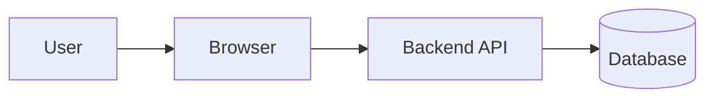

What responsibility does each component have?

---

## Question 87

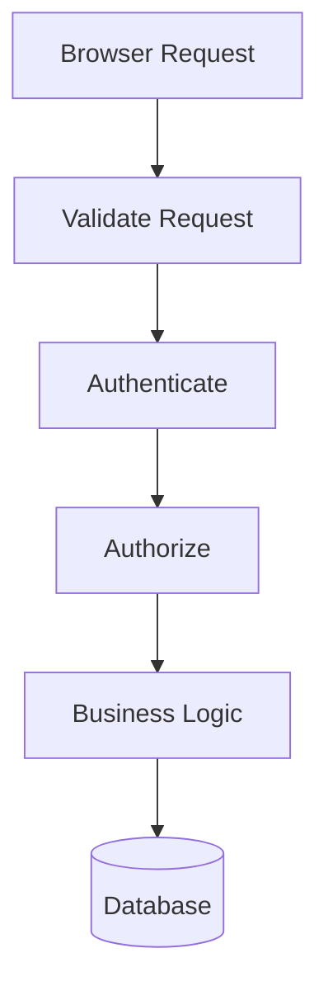

Why should validation, authentication, and authorization happen before the database operation?

---

## Question 88

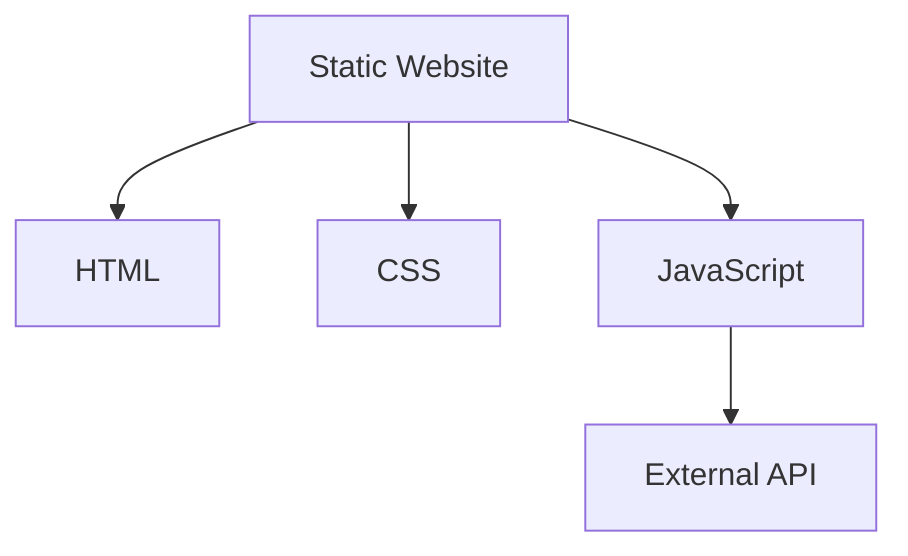

Why can this still be called a static website even though it has dynamic behavior?

---

## Question 89

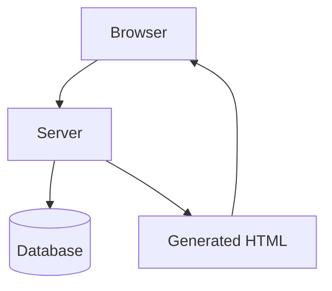

What rendering model does this most closely represent?

---

## Question 90

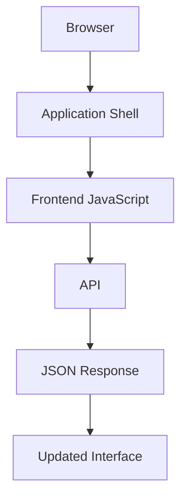

What rendering model does this most closely represent?

---

## Question 91

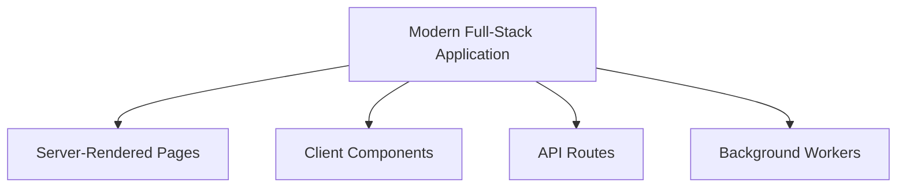

Why is this considered a hybrid architecture?

---

## Question 92

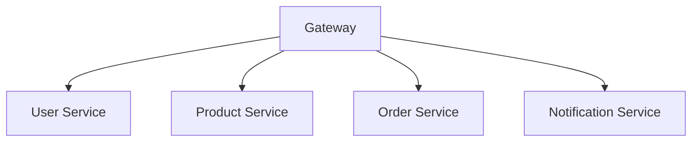

What architectural style does this resemble?

What are two possible advantages and two possible costs?

---

## Question 93

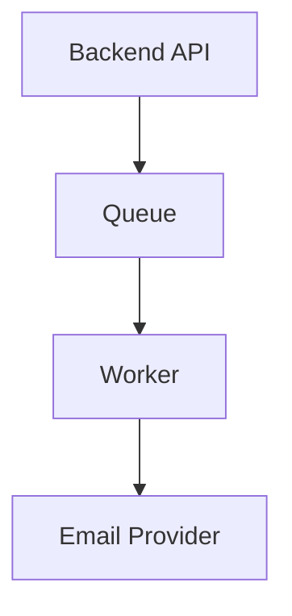

Why might email sending be placed behind a queue?

---

## Question 94

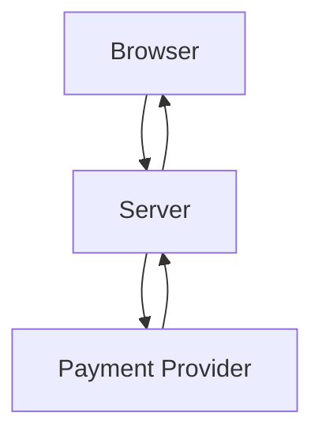

Why should the server usually communicate with the payment provider rather than exposing private provider credentials in browser code?

---

## Question 95

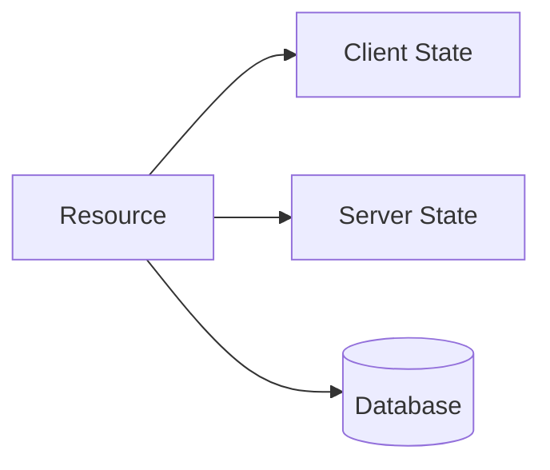

Why is it important to identify which system is authoritative?

---

# Part 5 — Scenario Quiz

## Question 96 — Modified Client Request

A frontend prevents users from entering a negative quantity. A user manually sends:

```json
{
  "productId": 123,
  "quantity": -10
}
```

What must the backend do?

---

## Question 97 — Hidden Admin Button

An application hides the “Delete User” button from regular users.

A regular user manually sends:

```http
DELETE /api/users/42
```

What must happen?

---

## Question 98 — Price Manipulation

The browser sends:

```json
{
  "productId": 123,
  "quantity": 2,
  "price": 0.01
}
```

What should the backend do?

---

## Question 99 — Database Exposure

A developer wants the browser to connect directly to PostgreSQL so the frontend can query products.

What concerns should be raised?

---

## Question 100 — Slow Email

An order request waits 8 seconds because the backend sends an email synchronously.

How could the architecture be improved?

---

## Question 101 — Payment Failure

The payment provider is unavailable while a user attempts checkout.

What are possible architectural responses?

---

## Question 102 — Static Marketing Site

A marketing site contains:

```text
HTML
CSS
JavaScript
Images
```

The JavaScript calls a newsletter API.

Is the site static? Explain.

---

## Question 103 — Dashboard Rendering

A dashboard must display private user data and should show useful content quickly.

Would server-side rendering, client-side rendering, or a hybrid approach be reasonable? Explain.

---

## Question 104 — Mobile and Web Clients

A backend serves:

```text
Web application
iOS application
Android application
Partner integration
```

Why is a clear API contract especially important?

---

## Question 105 — Monolith Decision

A small team is building an internal task manager.

Should it automatically use microservices? Explain the tradeoff.

---

## Question 106 — Microservice Failure

An order service depends on inventory, payment, and notification services.

The notification service fails.

Should the entire order necessarily fail? Explain.

---

## Question 107 — Full-Stack Secret

A full-stack framework allows a developer to import a database library into a project file.

Does that automatically mean the database credential is safe?

What must be verified?

---

## Question 108 — Serverless Report

A serverless function generates a large report and often exceeds its execution limit.

What alternatives might be appropriate?

---

## Question 109 — Client and Server State Conflict

The browser displays a product price of `$79.99`, but the server database now contains `$69.99`.

Which value should be authoritative during checkout?

What should the frontend do?

---

## Question 110 — Failed API Response

The backend returns:

```http
200 OK
```

with:

```json
{
  "success": false,
  "message": "Payment declined"
}
```

Did the HTTP request succeed? Did the business operation succeed?

---

# Part 6 — Practical Architecture Exercises

## Exercise 1 — Classify Responsibilities

For each task, classify it as primarily:

```text
Frontend
Backend
Database
External Service
Background Worker
```

Tasks:

```text
Open a dropdown
Validate final price
Store an order
Display a loading spinner
Send confirmation email
Verify payment
Render product cards
Check whether a user owns an order
Store product images
```

---

## Exercise 2 — Design an Online Store

Design an architecture supporting:

```text
Product browsing
User accounts
Shopping cart
Orders
Payments
Product images
Confirmation emails
```

Use a Mermaid diagram.

Your diagram should include:

- Browser
- Frontend
- Backend
- Database
- File storage
- Payment provider
- Queue
- Email worker

---

## Exercise 3 — Design State Ownership

For each item, identify the likely source of truth:

```text
Open menu
Current product price
Current inventory
Selected tab
Order status
Payment status
Search text currently being typed
User subscription level
```

---

## Exercise 4 — Compare Rendering Models

For each feature, choose a reasonable rendering strategy:

```text
Public marketing homepage
Public documentation
Private account dashboard
Product detail page
Real-time chat
Administrative report
```

Possible choices:

```text
Static generation
Server-side rendering
Client-side rendering
Hybrid rendering
Background processing
```

Explain each choice.

---

# Part 7 — Answer Key

# Part 1 — Multiple-Choice Answers

| Question | Answer | Explanation |
|---:|---|---|
| 1 | Software running close to the user, often in a browser | The frontend provides the client-side experience. |
| 2 | Software running in a controlled server environment | The backend handles protected operations and data. |
| 3 | Rendering a button | UI rendering is a common frontend responsibility. |
| 4 | Enforcing authorization | Security rules must be enforced server-side. |
| 5 | Users can inspect and modify client-side code and requests | The browser is controlled by the user. |
| 6 | To provide fast feedback and improve usability | Frontend validation does not enforce security. |
| 7 | Validate and enforce rules independently | The backend must not trust the frontend. |
| 8 | Who is the caller? | Authentication verifies identity. |
| 9 | What are you allowed to do? | Authorization determines permissions. |
| 10 | The backend or database | Important values should come from an authoritative system. |
| 11 | It would expose credentials, data, and business rules | The backend provides a controlled data boundary. |
| 12 | Rules defining how the application should behave | Business logic represents domain behavior. |
| 13 | A user cannot cancel an order after shipment | This is an application rule. |
| 14 | An agreement describing how software systems communicate | API contracts define communication expectations. |
| 15 | All of the above | Contracts can define paths, methods, schemas, and errors. |
| 16 | Data used to represent the current browser interface | Client state usually controls temporary UI behavior. |
| 17 | Whether a menu is open | This is temporary interface state. |
| 18 | An order’s payment status | The backend or payment system should be authoritative. |
| 19 | The system considered authoritative for a piece of information | The source of truth makes the final decision. |
| 20 | A website primarily served from prebuilt files | Static sites can still contain JavaScript. |
| 21 | Yes, JavaScript can provide interaction and call APIs. | Static delivery does not mean no behavior. |
| 22 | The server generates HTML before sending it to the browser | This is server-side rendering. |
| 23 | The browser uses JavaScript to generate or update much of the interface | This is client-side rendering. |
| 24 | Connecting client-side behavior to server-generated HTML | This process is commonly called hydration. |
| 25 | Generating pages ahead of time, usually during a build | Static generation happens before requests. |
| 26 | An application that often loads an application shell and updates the interface dynamically | SPAs commonly use client-side routing and API calls. |
| 27 | An application combining multiple rendering strategies | Hybrid systems use more than one execution model. |
| 28 | Frontend and backend capabilities in one development environment | Full-stack frameworks can contain multiple runtimes. |
| 29 | Browser and server code have different capabilities and security boundaries. | Execution location determines access and trust. |
| 30 | In server-side code or protected infrastructure | Private credentials must not be sent to browsers. |
| 31 | An application deployed as one primary unit containing multiple responsibilities | A monolith may still be modular and well-structured. |
| 32 | Multiple independently deployable services | Microservices split the application into service boundaries. |
| 33 | Distributed failures and operational complexity | Network calls and independent deployments add complexity. |
| 34 | The provider manages much of the server infrastructure. | Servers still exist behind the abstraction. |
| 35 | Work processed separately from the immediate user request | Background jobs handle asynchronous work. |
| 36 | To store work until a worker can process it | Queues separate producers from consumers. |
| 37 | Sending an email after an order | Email can be processed asynchronously. |
| 38 | Continuing essential functionality when optional components fail | This is graceful degradation. |
| 39 | Keeping different responsibilities organized and distinct | Separation reduces coupling and improves maintainability. |
| 40 | The arrangement of components, responsibilities, communication paths, and environments | Architecture describes how the system is organized. |

---

# Part 2 — True-or-False Answers

| Question | Answer | Explanation |
|---:|---|---|
| 41 | False | The backend must enforce security decisions. |
| 42 | True | Browser requests are untrusted input. |
| 43 | False | A user can call the endpoint directly even if the button is hidden. |
| 44 | True | Browser-delivered code can be inspected and modified. |
| 45 | False | Authentication identifies; authorization determines permissions. |
| 46 | False | The database stores data; the backend applies logic and controls access. |
| 47 | True | Backends commonly call payments, email, storage, and other providers. |
| 48 | False | The server or database may be authoritative for important information. |
| 49 | True | Static sites may include JavaScript and external APIs. |
| 50 | False | SSR pages may be hydrated or enhanced with JavaScript. |
| 51 | True | Static generation occurs before users request generated pages. |
| 52 | False | SPAs commonly communicate with backend APIs. |
| 53 | True | Full-stack projects may contain browser, server, build, and worker code. |
| 54 | False | Monoliths can be appropriate and well-designed. |
| 55 | True | Microservices require additional networking and operations. |
| 56 | False | Serverless abstracts server management; physical servers still exist. |
| 57 | True | Background jobs move long-running work outside the immediate request. |
| 58 | True | Queues hold work for later processing. |
| 59 | True | API contracts often define formats and behavior. |
| 60 | False | A `200` response may contain an application-level failure. |

---

# Part 3 — Short-Answer Model Answers

## Question 61

Frontend code runs close to the user, commonly in a browser, and handles rendering, interaction, temporary state, and requests. Backend code runs in a controlled environment and handles business logic, authentication, authorization, data access, and external integrations.

---

## Question 62

The browser is untrusted because the user controls the device and can inspect, modify, replay, or manually construct requests.

---

## Question 63

Frontend responsibilities commonly include:

```text
Rendering the interface
Handling clicks and input
Managing temporary UI state
Showing loading and error states
Performing basic client-side validation
Sending requests
Displaying responses
```

---

## Question 64

Backend responsibilities commonly include:

```text
Routing requests
Validating input
Authenticating users
Authorizing operations
Applying business rules
Accessing databases
Handling private files
Calling external services
Running background jobs
```

---

## Question 65

Client-side validation provides fast feedback, reduces unnecessary requests, and improves usability. It cannot enforce security because users can bypass or modify it.

---

## Question 66

Authentication verifies who the caller is. Authorization determines what that authenticated caller is allowed to do.

```text
Authentication:
  This is Alex.

Authorization:
  Alex may view order 9001.
```

---

## Question 67

The client can modify displayed values and request payloads. The backend or database must calculate or verify authoritative values such as prices, inventory, permissions, and payment status.

---

## Question 68

Business logic is the set of rules that define application behavior.

Examples:

```text
An order cannot be cancelled after shipment.
A discount applies only to eligible users.
A user can edit only their own profile.
```

---

## Question 69

An API contract is an agreement describing how a client and server communicate.

---

## Question 70

An API contract may define:

```text
Endpoint paths
HTTP methods
Parameters
Headers
Authentication
Request bodies
Response schemas
Status codes
Error formats
Pagination
Versioning
```

---

## Question 71

Client-side state is information used to control the current interface.

Examples:

```text
Whether a menu is open
Which tab is selected
Current search text
Whether a request is loading
```

---

## Question 72

Server-side state is information stored or controlled by backend systems.

Examples:

```text
User account
Order status
Inventory
Subscription plan
Payment status
```

---

## Question 73

A source of truth is the system considered authoritative for a specific value. For example, the backend or database may be authoritative for product price, while the browser is authoritative for whether a menu is currently open.

---

## Question 74

A static site primarily serves prebuilt files. A server-rendered site generates HTML on demand, often using current data from a database or service.

---

## Question 75

Server-side rendering generates initial HTML on the server. Client-side rendering uses browser JavaScript to generate or update much of the interface.

---

## Question 76

Hydration attaches client-side behavior and event handlers to HTML that was already generated by the server.

---

## Question 77

A single-page application commonly loads an application shell and uses JavaScript and APIs to update the interface without full page reloads.

---

## Question 78

A full-stack framework combines frontend and backend capabilities in one project or development environment, while still deploying code to different runtimes.

---

## Question 79

A full-stack project may contain:

```text
Browser code
Server code
Build code
Edge code
Background worker code
```

Each environment has different capabilities and security boundaries.

---

## Question 80

A monolith is an application where many responsibilities are deployed as one primary unit. It can still have well-organized internal modules.

---

## Question 81

Microservices are independently deployable services organized around separate responsibilities or domains.

---

## Question 82

Advantage:

```text
Individual services can scale or deploy independently.
```

Disadvantage:

```text
Network communication, distributed failures, monitoring, and deployment become more complex.
```

---

## Question 83

Serverless means the provider manages much of the underlying server infrastructure while developers deploy functions or application code. Servers still exist.

---

## Question 84

A background job is work processed separately from the immediate user request, such as sending an email, generating a report, or processing a video.

---

## Question 85

A queue stores work until a worker can process it. Queues help separate immediate requests from asynchronous processing and can absorb temporary spikes.

---

# Part 4 — Architecture Diagram Answers

## Question 86


```text
User:
  Initiates interaction.

Browser:
  Runs frontend code and sends requests.

Backend API:
  Validates, authenticates, authorizes, and processes requests.

Database:
  Stores and retrieves persistent information.
```

---

## Question 87

Validation ensures the request has an acceptable structure and values. Authentication identifies the caller. Authorization checks permissions. Only after these checks should the backend perform sensitive database operations.

---

## Question 88

It is static because the primary HTML, CSS, and JavaScript assets can be served as prebuilt files. JavaScript can still call APIs and create dynamic behavior in the browser.

---

## Question 89

This most closely represents server-side rendering because the server retrieves data, generates HTML, and sends it to the browser.

---

## Question 90

This most closely represents client-side rendering or a single-page application because the browser loads JavaScript, requests JSON, and updates the interface.

---

## Question 91

It combines server-rendered pages, client-side components, API routes, and background workers. Different parts of the application run in different environments and use different execution strategies.

---

## Question 92

This resembles a microservice architecture.

Possible advantages:

```text
Independent deployment
Independent scaling
Clear service ownership
```

Possible costs:

```text
Network failures
Distributed tracing
More deployments
Data-consistency challenges
Higher operational complexity
```

---

## Question 93

Email can be slow or temporarily unavailable. A queue lets the API respond quickly while a worker retries or processes the email separately.

---

## Question 94

The backend can keep provider credentials private, validate the operation, calculate the amount, and handle payment responses securely. Browser code can be inspected, so private provider keys should not be embedded there.

---

## Question 95

If the browser, cache, backend, and database disagree, the application needs to know which value controls the final decision. For example, the database may be authoritative for order status while the browser is authoritative for temporary UI state.

---

# Part 5 — Scenario Model Answers

## Question 96 — Modified Client Request

The backend must independently validate that:

```text
productId is valid
quantity is an integer
quantity is greater than zero
quantity is within allowed limits
product exists
inventory is available
user is authorized
```

It should reject the request rather than trusting the frontend.

---

## Question 97 — Hidden Admin Button

The backend must authenticate the caller and check administrator authorization.

A regular user should receive an appropriate denial, commonly:

```http
403 Forbidden
```

or a deliberately safe `404` depending on the application’s security design.

---

## Question 98 — Price Manipulation

The backend should ignore or reject the client-provided price and retrieve the authoritative price from its own database or pricing service.

It should calculate the total itself.

---

## Question 99 — Database Exposure

Concerns include:

```text
Database credentials exposed to clients
Private records directly accessible
Business rules bypassed
Dangerous queries
Weak authorization
Schema exposure
Difficulty controlling writes
Database ports exposed publicly
```

The safer pattern is:

```text
Browser → Backend API → Database
```

---

## Question 100 — Slow Email

Move email delivery to a background job:

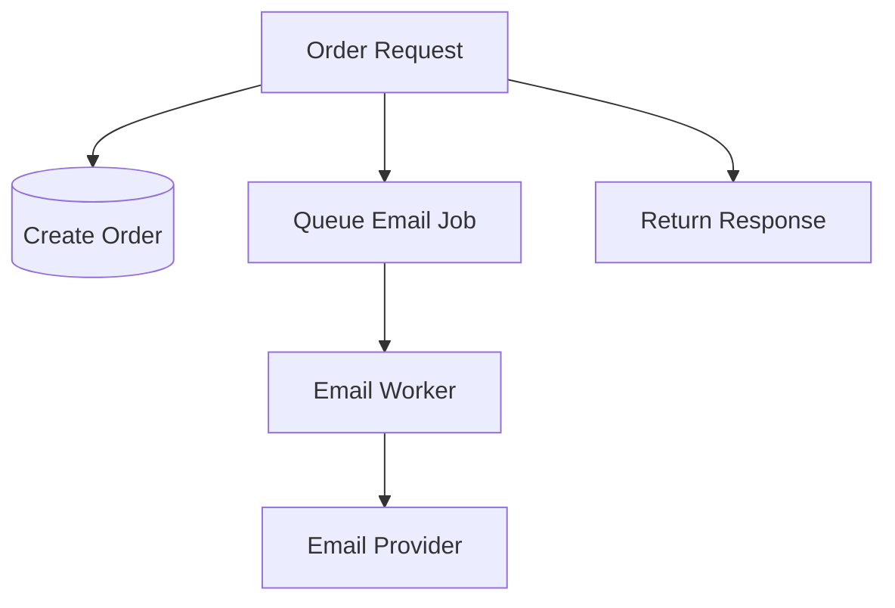

The order API can respond promptly while the worker handles retries and provider failures.

---

## Question 101 — Payment Failure

Possible responses include:

```text
Return a temporary failure.
Place the order in a pending state.
Retry with bounded backoff.
Use a circuit breaker.
Allow the user to retry safely.
Use an idempotency key.
Do not mark the order paid.
```

The correct behavior depends on the payment workflow and business rules.

---

## Question 102 — Static Marketing Site

Yes. The primary site assets can be static files even though JavaScript calls a newsletter API. “Static” describes how the primary content is delivered, not whether the page has any interactivity.

---

## Question 103 — Dashboard Rendering

A hybrid approach may be reasonable:

```text
Server-render initial dashboard shell or safe initial content.
Use client-side JavaScript for interactive updates.
Fetch private data through authenticated APIs.
```

Pure SSR may simplify initial content delivery. Pure CSR may provide a richer application experience. The choice depends on data privacy, interactivity, performance, and complexity.

---

## Question 104 — Mobile and Web Clients

A stable API contract is important because multiple clients depend on the same behavior. A breaking response change may simultaneously break the web application, mobile applications, and partner integrations.

---

## Question 105 — Monolith Decision

A small team should not automatically choose microservices.

A modular monolith may be simpler to:

```text
Build
Test
Deploy
Debug
Operate
```

Microservices may become useful later for independent scaling, team ownership, or domain boundaries, but they introduce network and operational complexity.

---

## Question 106 — Microservice Failure

The entire order does not necessarily need to fail if notification is optional.

Possible behavior:

```text
Create and process the order.
Queue the notification.
Retry email later.
Show the order confirmation.
```

If notification is legally or operationally essential, the business may choose a different workflow.

---

## Question 107 — Full-Stack Secret

Importing a database library does not prove that the credential is safe.

Verify:

```text
Where the file executes
Whether it is included in the browser bundle
Whether the secret is exposed through public configuration
Whether server-only boundaries are enforced
Whether build output contains the credential
```

---

## Question 108 — Serverless Report

Alternatives include:

```text
Queue the report as a background job.
Use a worker with a longer execution limit.
Split the work into smaller functions.
Use a batch-processing system.
Generate the report asynchronously and provide a download URL.
```

The client could receive:

```http
202 Accepted
```

with a job identifier.

---

## Question 109 — Client and Server State Conflict

The backend or database should be authoritative during checkout.

The frontend may display an updated value after receiving the server response.

The backend should:

```text
Read current price
Calculate total
Check inventory
Return authoritative order information
```

---

## Question 110 — Failed API Response

The HTTP request succeeded at the transport and server-response level because the server returned `200 OK`.

The business operation failed because the response says:

```text
Payment declined
```

A more expressive API might use a non-2xx status or a documented application-level error structure, but clients must inspect both the status and response body.

---

# Part 6 — Practical Exercise Guidance

## Exercise 1 — Responsibility Classification

Suggested answers:

| Task | Primary responsibility |
|---|---|
| Open a dropdown | Frontend |
| Validate final price | Backend |
| Store an order | Database, through backend |
| Display loading spinner | Frontend |
| Send confirmation email | Background worker or external service |
| Verify payment | Backend and payment provider |
| Render product cards | Frontend |
| Check order ownership | Backend |
| Store product images | Object/file storage, coordinated by backend |

Some tasks involve multiple components, but the important question is which system has final authority.

---

## Exercise 2 — Online Store Architecture

A reasonable design:

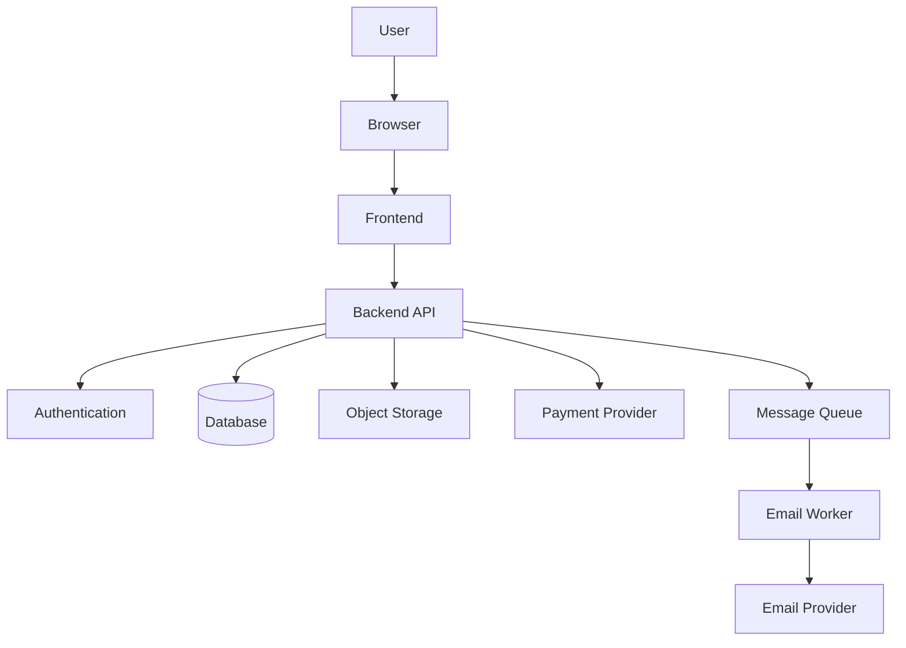

Consider:

```text
Frontend:
  Interface and interaction

Backend:
  Business rules and security

Database:
  Users, products, carts, orders, inventory

Object storage:
  Product images

Payment provider:
  Payment authorization

Queue and worker:
  Confirmation emails
```

---

## Exercise 3 — State Ownership

Suggested answers:

| Information | Likely source of truth |
|---|---|
| Open menu | Browser |
| Current product price | Backend/database |
| Current inventory | Backend/database |
| Selected tab | Browser |
| Order status | Backend/database |
| Payment status | Backend/payment provider |
| Search text being typed | Browser |
| User subscription level | Backend/database or subscription provider |

---

## Exercise 4 — Rendering Strategies

Possible choices:

| Feature | Reasonable strategy |
|---|---|
| Public marketing homepage | Static generation or SSR |
| Public documentation | Static generation |
| Private account dashboard | Client-side or hybrid rendering |
| Product detail page | Static, SSR, or hybrid depending on freshness |
| Real-time chat | Client-side rendering with WebSockets or similar |
| Administrative report | Server-rendered or client-rendered with asynchronous report generation |

More than one answer can be correct if the tradeoffs are explained.

---

# Scoring Guidance

## Multiple choice and true/false

```text
1 point per correct answer
```

## Short-answer questions

```text
2 points:
  Correct core explanation.

3 points:
  Correct explanation plus example.

4 points:
  Correct explanation, example, trust-boundary awareness, and relevant tradeoff.
```

## Scenario questions

Evaluate whether the answer:

```text
Identifies the correct system boundary
Distinguishes client behavior from server enforcement
Recognizes authoritative data
Considers failure behavior
Mentions security implications
Explains reasonable tradeoffs
```

## Architecture exercises

Evaluate:

```text
Correct component responsibilities
Clear frontend-backend boundary
Appropriate data ownership
Authentication and authorization
Failure handling
Asynchronous work
Reasonable complexity
```

---

# Review Recommendations

If you struggled with:

```text
Frontend and backend:
  Part 1, Sections 3–10

State and contracts:
  Part 1, Sections 11–15

Rendering strategies:
  Part 1, Sections 16–24

Full-stack frameworks:
  Part 1, Sections 25–29

Monoliths and microservices:
  Part 1, Sections 30–35

Queues and background work:
  Part 1, Sections 36–40

Security boundaries:
  Primer 8
  Appendix I

APIs:
  Part 4
  Appendix G
  Appendix H
```

---

# Completion Criteria

You are ready to continue when you can:

```text
Explain frontend and backend responsibilities.
Explain why the browser is untrusted.
Distinguish authentication from authorization.
Identify the source of truth for different data.
Explain static, SSR, CSR, and hybrid rendering.
Describe full-stack framework runtimes.
Compare monoliths and microservices.
Explain serverless execution.
Explain queues and background jobs.
Design a basic online-store architecture.
Identify reasonable failure and security boundaries.
```
