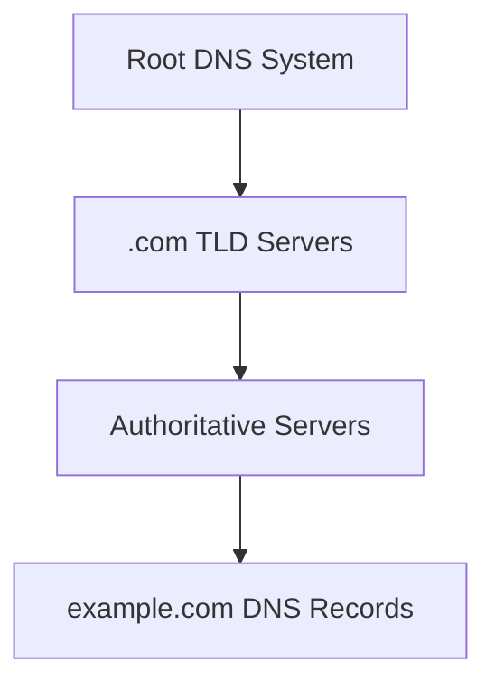
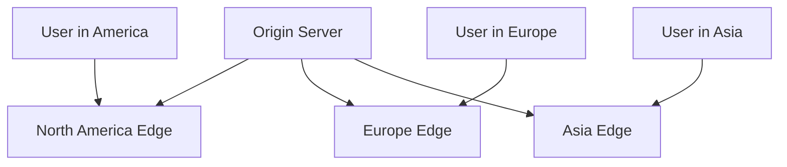
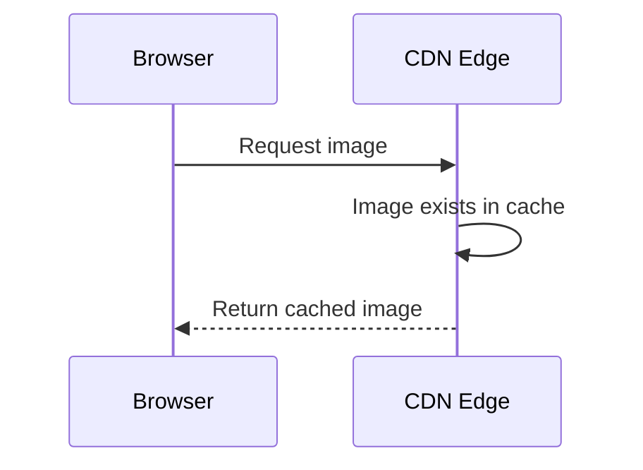
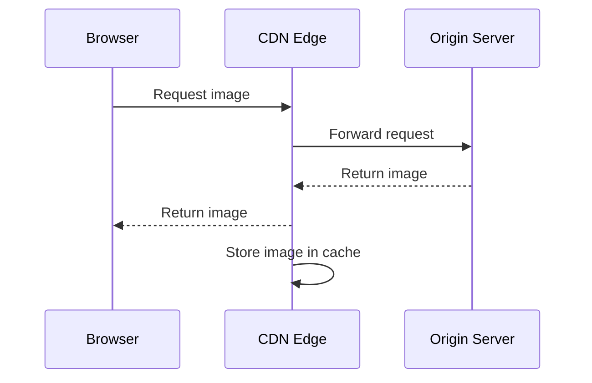
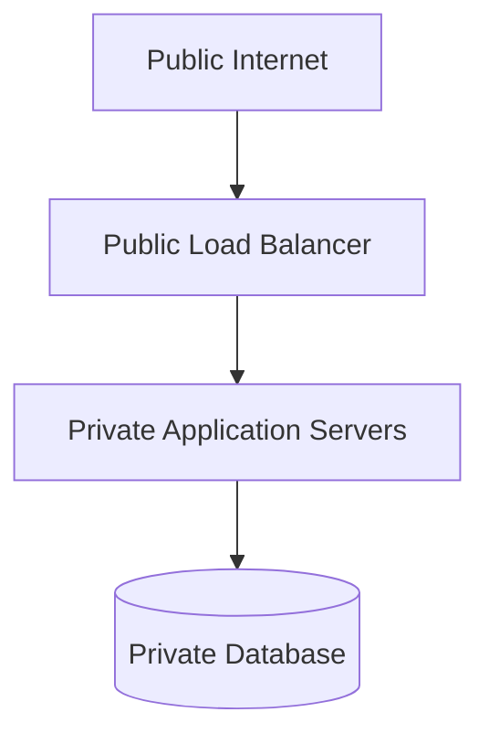
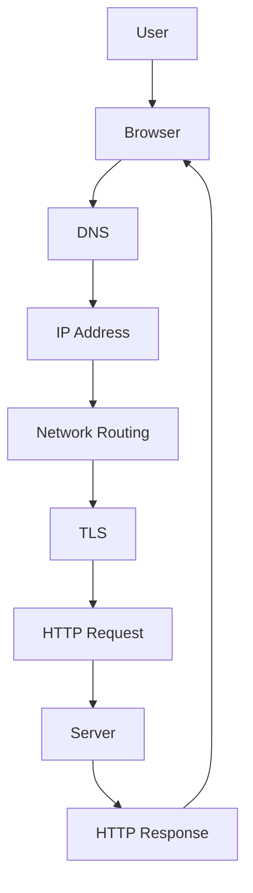
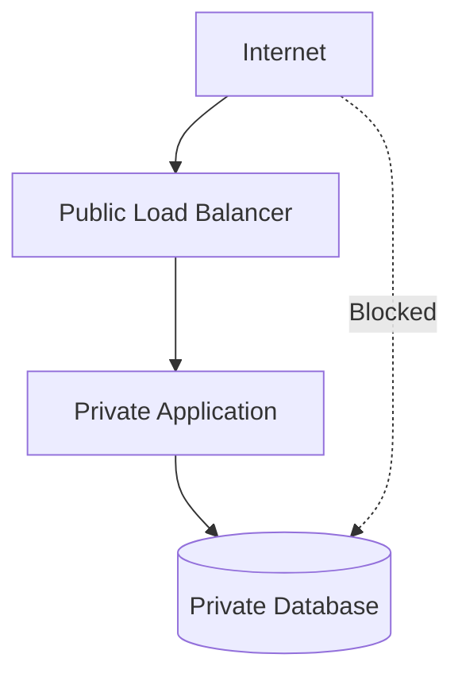

# Part 2 Quiz — How the Internet and the Web Work  
## Internet Infrastructure, IP Addresses, DNS, Packets, Routing, Ports, CDNs, Data Centers, and Latency

This quiz reviews:

- Internet versus Web
- Network layers
- Packets and packet switching
- IPv4 and IPv6
- Public and private IP addresses
- NAT
- Domain names
- DNS
- Recursive resolvers
- Root, TLD, and authoritative DNS servers
- DNS records and caching
- Routers and switches
- ISPs
- Routing
- Ports
- Latency
- Bandwidth
- Packet loss
- Data centers
- Origin servers
- CDNs
- Load balancers
- Firewalls
- Local and private networks
- Web-request journeys
- Network troubleshooting

---

## Instructions

- Complete the quiz before reading the answer key.
- Explain your reasoning for short-answer and scenario questions.
- Use only systems and domains you are authorized to inspect.
- Do not perform aggressive scanning or load testing.
- Network routes and DNS results can vary by location, provider, and time.
- Some answers may have more than one reasonable explanation.

---

## Learning Objectives

After completing this quiz, you should be able to:

- Explain the difference between the Internet and the Web.
- Describe how packets move through networks.
- Explain the role of IP addresses.
- Distinguish IPv4 from IPv6.
- Distinguish public and private addresses.
- Explain NAT.
- Describe the DNS hierarchy and lookup process.
- Recognize common DNS record types.
- Explain DNS caching and TTL.
- Distinguish routers from switches.
- Explain the roles of ISPs and data centers.
- Explain latency, bandwidth, jitter, and packet loss.
- Explain ports and network services.
- Describe CDNs, origin servers, and load balancers.
- Identify common network failure layers.
- Trace a request from a browser to a server.

---

# Part 1 — Multiple-Choice Quiz

Choose the best answer.

## Question 1

What is the Internet?

- [ ] Only websites and browser pages
- [ ] A global collection of interconnected networks
- [ ] One giant computer
- [ ] A single database

---

## Question 2

What is the Web?

- [ ] The entire physical Internet
- [ ] A system of websites, browsers, URLs, HTTP, and related technologies
- [ ] A type of Ethernet cable
- [ ] A private database network

---

## Question 3

Which statement is correct?

- [ ] The Internet and the Web are exactly the same thing.
- [ ] The Web is one application system built on top of the Internet.
- [ ] The Internet is built on top of HTML.
- [ ] The Web does not use networks.

---

## Question 4

What is a packet?

- [ ] A complete physical server
- [ ] A unit of data transmitted across a network
- [ ] A database table
- [ ] A browser tab

---

## Question 5

Why is data divided into packets?

- [ ] To allow network infrastructure to share links and route smaller units
- [ ] To prevent computers from using IP addresses
- [ ] To eliminate all latency
- [ ] To turn data into HTML

---

## Question 6

What is packet switching?

- [ ] Sending data through shared networks as separate packets
- [ ] Switching between browser tabs
- [ ] Changing a database schema
- [ ] Encrypting a file with a password

---

## Question 7

What does IP stand for?

- [ ] Internet Protocol
- [ ] Internal Process
- [ ] Interface Port
- [ ] Internet Page

---

## Question 8

What is the primary purpose of an IP address?

- [ ] To identify a network destination
- [ ] To describe a webpage’s visual design
- [ ] To store a password
- [ ] To define a database table

---

## Question 9

How many bits are in an IPv4 address?

- [ ] 16
- [ ] 32
- [ ] 64
- [ ] 128

---

## Question 10

Which is a valid IPv4 address format?

- [ ] `203.0.113.10`
- [ ] `2001:db8::1`
- [ ] `example.com`
- [ ] `443.300.1.2`

---

## Question 11

How many bits are in an IPv6 address?

- [ ] 32
- [ ] 64
- [ ] 96
- [ ] 128

---

## Question 12

Which is an IPv6 address?

- [ ] `192.168.1.1`
- [ ] `2001:db8::1`
- [ ] `example.com`
- [ ] `localhost:3000`

---

## Question 13

What is a public IP address?

- [ ] An address used only inside one computer
- [ ] An address that may be reachable through public Internet routing
- [ ] A password for a public database
- [ ] A URL fragment

---

## Question 14

What is a private IP address?

- [ ] An address commonly used inside a local or private network
- [ ] An address that must be globally reachable
- [ ] An address used only by DNS root servers
- [ ] A browser cookie

---

## Question 15

Which address belongs to a common private IPv4 range?

- [ ] `192.168.1.10`
- [ ] `8.8.8.8`
- [ ] `203.0.113.10`
- [ ] `255.255.255.255` only

---

## Question 16

What does NAT commonly do?

- [ ] Allows multiple private devices to share a public IPv4 address
- [ ] Converts HTML into CSS
- [ ] Encrypts all database records
- [ ] Replaces DNS

---

## Question 17

What is a domain name?

- [ ] A human-readable name associated with network information
- [ ] A physical router
- [ ] A database password
- [ ] A packet payload

---

## Question 18

What does DNS primarily help with?

- [ ] Mapping names to network information such as IP addresses
- [ ] Rendering CSS
- [ ] Encrypting passwords
- [ ] Storing application orders

---

## Question 19

What does DNS stand for?

- [ ] Domain Name System
- [ ] Data Network Service
- [ ] Digital Naming Standard
- [ ] Domain Network Security

---

## Question 20

Which system commonly performs DNS lookups on behalf of clients?

- [ ] Recursive resolver
- [ ] CSS engine
- [ ] Database index
- [ ] Browser renderer only

---

## Question 21

What does an authoritative DNS server do?

- [ ] Provides official DNS records for a domain
- [ ] Renders HTML
- [ ] Routes every Internet packet
- [ ] Stores browser history

---

## Question 22

What do root DNS servers generally provide?

- [ ] Directions to top-level-domain servers
- [ ] The full contents of every website
- [ ] User passwords
- [ ] Database query results

---

## Question 23

What do TLD DNS servers generally provide?

- [ ] Directions to authoritative servers for domains under a top-level domain
- [ ] The webpage HTML
- [ ] Local Wi-Fi passwords
- [ ] Browser JavaScript state

---

## Question 24

What does an `A` DNS record map?

- [ ] A hostname to an IPv4 address
- [ ] A hostname to an IPv6 address
- [ ] A domain to a mail server only
- [ ] An IP address to a hostname

---

## Question 25

What does an `AAAA` DNS record map?

- [ ] A hostname to an IPv4 address
- [ ] A hostname to an IPv6 address
- [ ] A hostname to a mail server
- [ ] A URL to a file

---

## Question 26

What does a `CNAME` record provide?

- [ ] An alias from one hostname to another
- [ ] A password hash
- [ ] A direct database connection
- [ ] An IPv4 subnet mask only

---

## Question 27

What does an `MX` record identify?

- [ ] Mail servers for a domain
- [ ] Image servers
- [ ] Database replicas
- [ ] Web browser caches

---

## Question 28

What is DNS caching?

- [ ] Temporarily storing DNS results for reuse
- [ ] Storing HTML in a database
- [ ] Encrypting DNS records
- [ ] Converting IPv4 into IPv6

---

## Question 29

What does DNS TTL mean?

- [ ] How long a DNS result may be cached
- [ ] The total length of a URL
- [ ] The size of an IP address
- [ ] The number of routers in a path

---

## Question 30

What is a router?

- [ ] A device or system that forwards traffic between networks
- [ ] A tool that only displays files
- [ ] A database table
- [ ] A browser extension

---

## Question 31

What is a switch?

- [ ] A device that commonly connects devices within a local network
- [ ] A public DNS server
- [ ] A web framework
- [ ] A database backup

---

## Question 32

What is an ISP?

- [ ] Internet Service Provider
- [ ] Internal Server Process
- [ ] Internet Security Protocol
- [ ] IP Storage Provider

---

## Question 33

What does latency describe?

- [ ] Delay involved in communication or processing
- [ ] Amount of storage available
- [ ] Number of users in a database
- [ ] Size of a CSS file only

---

## Question 34

What does bandwidth describe?

- [ ] The amount of data that can be transferred over time
- [ ] The physical distance between servers
- [ ] The number of DNS records
- [ ] The number of users with permission

---

## Question 35

Which statement best distinguishes latency from bandwidth?

- [ ] Latency is delay; bandwidth is transfer capacity.
- [ ] Latency and bandwidth are exactly the same.
- [ ] Bandwidth is always measured in milliseconds.
- [ ] Latency is always measured in gigabits per second.

---

## Question 36

What is jitter?

- [ ] Variation in packet arrival timing
- [ ] A DNS record type
- [ ] A kind of database index
- [ ] A CSS animation only

---

## Question 37

What is packet loss?

- [ ] Packets fail to reach their intended destination
- [ ] A database loses a table
- [ ] A browser loses a cookie
- [ ] A domain loses its name

---

## Question 38

What does a port identify?

- [ ] A service on a networked host
- [ ] A geographic region
- [ ] A filesystem directory
- [ ] A CSS class

---

## Question 39

Which port is commonly associated with HTTPS?

- [ ] `22`
- [ ] `53`
- [ ] `80`
- [ ] `443`

---

## Question 40

What is a CDN?

- [ ] A distributed network that delivers content closer to users
- [ ] A database query language
- [ ] A local terminal
- [ ] A password manager

---

# Part 2 — True or False

## Question 41

The Internet and the Web are exactly the same thing.

- [ ] True
- [ ] False

---

## Question 42

The Web is an application system built on Internet infrastructure.

- [ ] True
- [ ] False

---

## Question 43

Data sent over a network may be divided into packets.

- [ ] True
- [ ] False

---

## Question 44

An IP address always identifies one permanent physical computer.

- [ ] True
- [ ] False

---

## Question 45

IPv4 uses 32-bit addresses.

- [ ] True
- [ ] False

---

## Question 46

IPv6 uses 128-bit addresses.

- [ ] True
- [ ] False

---

## Question 47

Private IP addresses are normally routed directly across the public Internet.

- [ ] True
- [ ] False

---

## Question 48

NAT can allow multiple private devices to share one public IPv4 address.

- [ ] True
- [ ] False

---

## Question 49

DNS stores the complete HTML content of every website.

- [ ] True
- [ ] False

---

## Question 50

DNS results may be cached.

- [ ] True
- [ ] False

---

## Question 51

A DNS record with a low TTL may be cached for less time than one with a high TTL.

- [ ] True
- [ ] False

---

## Question 52

Routers and switches perform exactly the same role.

- [ ] True
- [ ] False

---

## Question 53

A CDN can reduce the distance users need to travel to retrieve cacheable content.

- [ ] True
- [ ] False

---

## Question 54

A CDN automatically fixes database authorization bugs.

- [ ] True
- [ ] False

---

## Question 55

Higher bandwidth always means lower latency.

- [ ] True
- [ ] False

---

## Question 56

Physical distance can contribute to network latency.

- [ ] True
- [ ] False

---

## Question 57

A server can run multiple services on different ports.

- [ ] True
- [ ] False

---

## Question 58

If DNS resolves successfully, the website is guaranteed to work.

- [ ] True
- [ ] False

---

## Question 59

A load balancer can distribute traffic across multiple application servers.

- [ ] True
- [ ] False

---

## Question 60

A firewall can control which network traffic is allowed or blocked.

- [ ] True
- [ ] False

---

# Part 3 — Short-Answer Quiz

Answer in complete sentences.

## Question 61

What is the difference between the Internet and the Web?

---

## Question 62

What is a network packet?

---

## Question 63

Why is packet switching useful?

---

## Question 64

What is an IP address?

---

## Question 65

What is the difference between IPv4 and IPv6?

---

## Question 66

What is the difference between a public and private IP address?

---

## Question 67

What does NAT do?

---

## Question 68

What is a domain name?

---

## Question 69

What does DNS do?

---

## Question 70

What is a recursive DNS resolver?

---

## Question 71

What is an authoritative DNS server?

---

## Question 72

Explain the high-level DNS lookup process for:

```text
www.example.com
```

---

## Question 73

What is DNS caching?

---

## Question 74

What is DNS TTL?

---

## Question 75

What is the difference between an `A` and an `AAAA` record?

---

## Question 76

What is a `CNAME` record?

---

## Question 77

What is the difference between a router and a switch?

---

## Question 78

What does an ISP do?

---

## Question 79

What is latency?

---

## Question 80

What is bandwidth?

---

## Question 81

What is the difference between latency and bandwidth?

---

## Question 82

What are jitter and packet loss?

---

## Question 83

What is a network port?

---

## Question 84

What is a data center?

---

## Question 85

What is the difference between an origin server and a CDN edge server?

---

# Part 4 — Diagram and Request-Trace Quiz

## Question 86

Explain this network path:


What does each layer or component do?

---

## Question 87

Explain this DNS hierarchy:



What does each level know?

---

## Question 88

Explain this CDN architecture:



Why might this improve performance?

---

## Question 89

What happens during this cache-hit request?



---

## Question 90

What happens during this cache-miss request?



---

## Question 91

Explain this public/private network layout:



Why might the database be private?

---

## Question 92

Explain this client-server destination:

```text
203.0.113.10:443
```

What do the two parts represent?

---

## Question 93

Explain this local development destination:

```text
http://localhost:3000
```

Identify:

```text
Scheme
Host
Port
```

---

## Question 94

Trace the high-level journey of:

```text
https://shop.example.com/products
```

Use this diagram as a guide:



---

## Question 95

What network layers or components could fail during this journey?

List at least five.

---

# Part 5 — Scenario Quiz

## Question 96 — DNS Failure

A browser reports that it cannot find:

```text
api.example.com
```

Other websites work normally.

What should you investigate?

---

## Question 97 — DNS Works, Connection Fails

DNS returns an IP address, but cURL reports:

```text
Connection timed out
```

What could be wrong?

---

## Question 98 — Port Refused

The hostname resolves, but the client receives:

```text
Connection refused
```

What might this indicate?

---

## Question 99 — IPv4 and IPv6 Difference

A service works with IPv4 but fails with IPv6.

What might you investigate?

---

## Question 100 — Private IP Address

A server has address:

```text
192.168.1.20
```

Can a random user on the public Internet normally connect directly to it?

Explain.

---

## Question 101 — NAT

A home has:

```text
Laptop: 192.168.1.10
Phone: 192.168.1.11
Tablet: 192.168.1.12
```

All devices access the Internet through one public address.

What technology commonly enables this?

---

## Question 102 — DNS Change

An organization changes:

```text
example.com → new IP address
```

Some users still reach the old server.

Why might this happen?

---

## Question 103 — Slow First Request

A request is slow the first time but much faster on later attempts.

What could explain this?

---

## Question 104 — High Latency

Users in Australia report much higher latency than users near a European origin server.

Why?

What architectural solution might help?

---

## Question 105 — High Bandwidth, High Delay

A connection can transfer large files quickly but takes a long time before responses begin.

What distinction does this demonstrate?

---

## Question 106 — Packet Loss

A video call is unstable, with audio breaking up and messages arriving late.

What network issues might be involved?

---

## Question 107 — CDN Cache Miss

A CDN receives a request but does not have the resource cached.

What happens next?

---

## Question 108 — CDN and Private Data

An application accidentally marks a user-specific account response as publicly cacheable.

Why is this dangerous?

---

## Question 109 — Load Balancer Failure

A load balancer routes traffic to three application servers. One server crashes.

What should ideally happen?

---

## Question 110 — DNS Success but Application Failure

DNS resolves correctly and TLS succeeds, but the server returns:

```http
500 Internal Server Error
```

Which layer is probably failing?

---

## Question 111 — Wrong Environment

A browser request resolves to an unexpected IP address and displays staging content instead of production content.

What should you inspect?

---

## Question 112 — Firewall Problem

A backend works when tested locally on the server but cannot be reached through the public domain.

What layers should you investigate?

---

## Question 113 — Database Port Exposed

A cloud database is listening publicly on port `5432`.

What risks exist?

What would a safer architecture look like?

---

## Question 114 — Changing Network Routes

The same application is fast in the morning and slow in the afternoon, without a deployment.

What network or infrastructure factors might change?

---

## Question 115 — CDN Does Not Fix Dynamic API

A team adds a CDN but product search remains slow because every request still queries a database.

Why might the CDN not help much?

---

# Part 6 — Practical Exercises

Perform these exercises only against systems you own or are authorized to inspect.

## Exercise 1 — Inspect DNS

Run:

```bash
nslookup example.com
```

or:

```bash
dig example.com
```

Record:

```text
Resolved IPv4 addresses:
Resolved IPv6 addresses:
TTL if visible:
Name servers if visible:
```

---

## Exercise 2 — Inspect HTTP Destination

Run:

```bash
curl -v https://example.com
```

Identify:

```text
Resolved IP:
Destination port:
TLS protocol if visible:
HTTP version if visible:
Status code:
```

---

## Exercise 3 — Compare IPv4 and IPv6

If your network supports both:

```bash
curl -4 -v https://example.com
```

```bash
curl -6 -v https://example.com
```

Compare:

```text
Whether both work
Resolved addresses
Connection timing
Response timing
```

---

## Exercise 4 — Inspect Routing

Use an authorized public destination:

```bash
traceroute example.com
```

On Windows:

```powershell
tracert example.com
```

Observe:

```text
Number of hops
Possible latency changes
Unresponsive hops
Approximate route
```

Do not assume every unresponsive hop indicates a failure. Routers may intentionally hide responses.

---

## Exercise 5 — Inspect a Local Port

Start a local server:

```bash
python -m http.server 8000
```

Then inspect:

```bash
lsof -i :8000
```

or:

```bash
ss -ltnp
```

Record:

```text
Process
PID
Local address
Port
```

---

## Exercise 6 — Measure Request Timing

```bash
curl \
  -o /dev/null \
  -s \
  -w "\
status=%{http_code}\n\
dns=%{time_namelookup}s\n\
connect=%{time_connect}s\n\
tls=%{time_appconnect}s\n\
ttfb=%{time_starttransfer}s\n\
total=%{time_total}s\n" \
  https://example.com
```

Explain each measurement.

---

## Exercise 7 — Inspect a Redirect

```bash
curl -I http://example.com
```

Then:

```bash
curl -I -L http://example.com
```

Record:

```text
Initial status
Location header
Final status
Number of redirects
```

---

## Exercise 8 — Inspect a CDN Response

Choose a public static resource you are authorized to inspect.

Use:

```bash
curl -I https://example.com/path/to/resource
```

Look for headers such as:

```text
Age
Cache-Control
ETag
Via
X-Cache
Server
Content-Encoding
```

Header names vary by provider.

---

# Answer Key

# Part 1 — Multiple-Choice Answers

| Question | Answer | Explanation |
|---:|---|---|
| 1 | A global collection of interconnected networks | The Internet connects many independent networks. |
| 2 | A system of websites, browsers, URLs, HTTP, and related technologies | The Web is an application layer built on the Internet. |
| 3 | The Web is one application system built on top of the Internet. | The Internet also carries email, games, calls, and other traffic. |
| 4 | A unit of data transmitted across a network | Large messages may be divided into packets. |
| 5 | To allow network infrastructure to share links and route smaller units | Packet switching supports efficient shared networks. |
| 6 | Sending data through shared networks as separate packets | Packet switching divides data into units that can be routed. |
| 7 | Internet Protocol | IP handles addressing and routing. |
| 8 | To identify a network destination | IP addresses tell networks where traffic should go. |
| 9 | 32 | IPv4 uses 32-bit addresses. |
| 10 | `203.0.113.10` | This is a valid IPv4-style address. |
| 11 | 128 | IPv6 uses 128-bit addresses. |
| 12 | `2001:db8::1` | This is an IPv6 address. |
| 13 | An address that may be reachable through public Internet routing | Public addresses can be routed publicly subject to controls. |
| 14 | An address commonly used inside a local or private network | Private addresses are used inside controlled networks. |
| 15 | `192.168.1.10` | This is in a common private IPv4 range. |
| 16 | Allows multiple private devices to share a public IPv4 address | NAT translates private traffic through a public address. |
| 17 | A human-readable name associated with network information | Domains are easier for people to use than raw IP addresses. |
| 18 | Mapping names to network information such as IP addresses | DNS is a distributed naming system. |
| 19 | Domain Name System | DNS is the Internet’s naming system. |
| 20 | Recursive resolver | A recursive resolver performs lookups for clients. |
| 21 | Provides official DNS records for a domain | Authoritative servers hold the domain’s configured records. |
| 22 | Directions to top-level-domain servers | Root servers direct queries toward TLD infrastructure. |
| 23 | Directions to authoritative servers for domains under a TLD | TLD servers identify the authoritative servers for domains. |
| 24 | A hostname to an IPv4 address | `A` records contain IPv4 mappings. |
| 25 | A hostname to an IPv6 address | `AAAA` records contain IPv6 mappings. |
| 26 | An alias from one hostname to another | `CNAME` points a name to another hostname. |
| 27 | Mail servers for a domain | `MX` records support email routing. |
| 28 | Temporarily storing DNS results for reuse | Caching reduces repeated DNS work. |
| 29 | How long a DNS result may be cached | TTL is time to live. |
| 30 | A device or system that forwards traffic between networks | Routers connect different networks. |
| 31 | A device that commonly connects devices within a local network | Switches primarily handle local network connectivity. |
| 32 | Internet Service Provider | An ISP provides Internet connectivity. |
| 33 | Delay involved in communication or processing | Latency is measured as time. |
| 34 | Amount of data transferable over time | Bandwidth is capacity. |
| 35 | Latency is delay; bandwidth is transfer capacity. | They affect performance differently. |
| 36 | Variation in packet arrival timing | Jitter affects real-time communication. |
| 37 | Packets fail to reach their intended destination | Lost packets may need retransmission. |
| 38 | A service on a networked host | Ports distinguish services. |
| 39 | `443` | HTTPS commonly uses port 443. |
| 40 | A distributed network that delivers content closer to users | CDNs cache and serve content from edge locations. |

---

# Part 2 — True-or-False Answers

| Question | Answer | Explanation |
|---:|---|---|
| 41 | False | The Web is one application system that uses the Internet. |
| 42 | True | The Web depends on Internet infrastructure. |
| 43 | True | Network protocols divide data into packets. |
| 44 | False | An IP may represent a load balancer, CDN, shared service, or changing destination. |
| 45 | True | IPv4 uses 32-bit addresses. |
| 46 | True | IPv6 uses 128-bit addresses. |
| 47 | False | Private addresses are generally not publicly routed. |
| 48 | True | NAT lets many private devices share a public IPv4 address. |
| 49 | False | DNS stores naming records, not complete website content. |
| 50 | True | DNS results are commonly cached. |
| 51 | True | TTL controls how long a result may remain cached. |
| 52 | False | Routers connect networks; switches commonly connect devices within a local network. |
| 53 | True | Edge locations can reduce geographic distance to cacheable content. |
| 54 | False | CDNs do not fix application authorization or database logic. |
| 55 | False | High bandwidth does not guarantee low latency. |
| 56 | True | Signals and routing over distance introduce delay. |
| 57 | True | One host can run services on different ports. |
| 58 | False | DNS success only identifies a destination; the service may still fail. |
| 59 | True | Load balancers distribute traffic among instances. |
| 60 | True | Firewalls allow or block traffic according to rules. |

---

# Part 3 — Short-Answer Model Answers

## Question 61

The Internet is the global infrastructure of interconnected networks. The Web is an application system built on top of that infrastructure using technologies such as browsers, URLs, HTTP, HTML, CSS, and JavaScript.

---

## Question 62

A packet is a unit of data sent across a network. It may include source and destination information, protocol metadata, and a payload.

---

## Question 63

Packet switching allows many users to share network infrastructure efficiently. Packets can be routed independently and may travel around certain failures or congestion.

---

## Question 64

An IP address is a numerical address used to identify a destination on an IP network.

---

## Question 65

IPv4 uses 32-bit addresses written in dotted decimal form, such as:

```text
203.0.113.10
```

IPv6 uses 128-bit addresses written using hexadecimal groups, such as:

```text
2001:db8::1
```

---

## Question 66

A public IP address may be reachable through public Internet routing. A private IP address is normally used inside a local or private network and is not directly routed across the public Internet.

---

## Question 67

NAT translates traffic between private network addresses and a public address. It allows multiple private devices to share one public IPv4 address.

---

## Question 68

A domain name is a human-readable name associated with network information, commonly an IP address or another hostname.

---

## Question 69

DNS translates domain names into network information such as IPv4 and IPv6 addresses. It can also store records for mail, aliases, verification, and other purposes.

---

## Question 70

A recursive resolver performs DNS lookups on behalf of a client. It may answer from cache or query root, TLD, and authoritative servers.

---

## Question 71

An authoritative DNS server stores and provides the official DNS records for a domain.

---

## Question 72

A simplified lookup is:

```text
1. Client asks a recursive resolver about www.example.com.
2. Resolver checks its cache.
3. If necessary, it asks root DNS where .com servers are.
4. It asks a .com TLD server where example.com is managed.
5. It asks the authoritative server for www.example.com’s record.
6. It returns the result to the client.
```

---

## Question 73

DNS caching temporarily stores lookup results so future requests can be answered faster without repeating the full lookup.

---

## Question 74

TTL, or time to live, indicates how long a DNS result may be cached before it should be refreshed.

---

## Question 75

An `A` record maps a hostname to an IPv4 address. An `AAAA` record maps a hostname to an IPv6 address.

---

## Question 76

A `CNAME` record creates an alias from one hostname to another hostname.

Example:

```text
www.example.com → example.com
```

---

## Question 77

A router connects different networks and forwards packets between them. A switch commonly connects devices within the same local network.

---

## Question 78

An ISP, or Internet Service Provider, provides connectivity between a customer’s network and larger Internet networks. It may also provide DNS resolvers and other services.

---

## Question 79

Latency is the delay involved in sending data, receiving a response, or processing a request.

---

## Question 80

Bandwidth is the amount of data that can be transferred over a period of time.

---

## Question 81

Latency measures delay. Bandwidth measures transfer capacity. A network can have high bandwidth and high latency at the same time.

---

## Question 82

Jitter is variation in packet arrival times. Packet loss occurs when packets fail to reach their destination.

---

## Question 83

A port identifies a service on a networked host. For example, port `443` commonly identifies HTTPS.

---

## Question 84

A data center is a facility containing servers, storage, networking, power, cooling, security, and operational infrastructure.

---

## Question 85

An origin server is the primary source of application content. A CDN edge server is a distributed location that may cache and deliver content closer to users.

---

# Part 4 — Diagram and Request-Trace Answers

## Question 86


```text
User device:
  Creates the request.

Home router:
  Connects local devices to the ISP and may perform NAT.

ISP:
  Provides access to larger networks.

Transit network:
  Carries traffic between network operators.

Data-center network:
  Connects the destination service.

Server:
  Receives and processes the request.
```

---

## Question 87


```text
Root:
  Knows where TLD infrastructure is located.

TLD:
  Knows which authoritative servers manage a domain.

Authoritative server:
  Knows the actual configured records for the domain.
```

---

## Question 88

The origin provides content to distributed edge locations. Users may be routed to an edge location closer to them, reducing latency and origin workload for cacheable content.

---

## Question 89

The CDN edge already has the image cached, so it returns the image without contacting the origin server.

Benefits:

```text
Lower latency
Less origin traffic
Reduced bandwidth use
Faster delivery
```

---

## Question 90

The edge does not have the image, so it requests the image from the origin, returns it to the user, and stores a copy for later requests.

---

## Question 91

The load balancer is public and distributes traffic to private application servers. The database is private so arbitrary Internet clients cannot connect directly to it.

This reduces exposure and forces database access through application-controlled logic.

---

## Question 92

```text
203.0.113.10:
  IP address

443:
  Port, commonly used by HTTPS
```

Together they identify a network service destination.

---

## Question 93

```text
Scheme:
  http

Host:
  localhost

Port:
  3000
```

The URL targets an HTTP service running locally on port `3000`.

---

## Question 94

A high-level journey is:

```text
1. User enters the URL.
2. Browser parses the URL.
3. DNS resolves shop.example.com.
4. Browser receives an IP address.
5. Network infrastructure routes traffic.
6. Browser establishes a secure TLS connection.
7. Browser sends an HTTP request.
8. Server or edge system processes it.
9. Server returns an HTTP response.
10. Browser parses and renders the response.
```

---

## Question 95

Possible failure points include:

```text
Browser parsing
DNS lookup
Recursive resolver
Routing
Local network
ISP
Firewall
Port availability
TCP or QUIC connection
TLS handshake
CDN
Load balancer
Application server
Database
External service
```

---

# Part 5 — Scenario Model Answers

## Question 96 — DNS Failure

Investigate:

```text
Hostname spelling
DNS records
Recursive resolver
Authoritative name servers
Domain expiration
DNS delegation
Local or ISP DNS configuration
VPN or private DNS
```

Useful commands:

```bash
nslookup api.example.com
dig api.example.com
```

Try a known public resolver only where appropriate and authorized.

---

## Question 97 — DNS Works, Connection Fails

Possible causes:

```text
Server is down
Port is closed
Firewall blocks traffic
Routing problem
Load balancer has no healthy backends
Wrong IP address
Service is listening only privately
Network congestion
```

Inspect the destination port, firewall, route, and service health.

---

## Question 98 — Port Refused

Connection refused commonly means the destination host was reached, but no service accepted the connection on that port, or a firewall actively rejected it.

Possible causes:

```text
Service stopped
Wrong port
Service listening on another address
Firewall rule
Load balancer configuration
```

---

## Question 99 — IPv4 and IPv6 Difference

Investigate:

```text
A and AAAA DNS records
IPv6 routing
Server IPv6 binding
Firewall rules
TLS certificate coverage
ISP IPv6 connectivity
Application support
```

---

## Question 100 — Private IP Address

A random public Internet user normally cannot connect directly to `192.168.1.20` because it is a private IPv4 address used inside a local network.

The address may be reachable only from the same local or private network, subject to firewall rules.

---

## Question 101 — NAT

Network Address Translation commonly allows the private devices to share one public IPv4 address.

The home router tracks connections and translates between private and public addressing.

---

## Question 102 — DNS Change

Resolvers and clients may have cached the old result according to the record’s TTL.

Other possibilities include:

```text
Different DNS providers
Incorrect delegation
Stale local cache
Split-horizon DNS
Propagation delay
```

---

## Question 103 — Slow First Request

Possible explanations:

```text
DNS cache is cold
New TCP or QUIC connection
TLS handshake required
CDN cache miss
Application cold start
Database cache cold
```

Later requests may reuse connections or cached data.

---

## Question 104 — High Latency

Users far from the European origin server experience greater physical and routing distance.

Possible solutions:

```text
CDN
Regional application deployment
Edge caching
Multi-region architecture
Regional database replicas
Geographic traffic routing
```

---

## Question 105 — High Bandwidth, High Delay

This demonstrates that bandwidth and latency are different.

The connection can transfer a large amount of data quickly once transmission begins, but the initial round trip still takes a long time.

---

## Question 106 — Packet Loss

Possible issues include:

```text
Network congestion
Wireless interference
Faulty hardware
Routing problems
ISP problems
Buffer overflow
```

Packet loss can cause retransmissions, delay, audio gaps, and unstable real-time communication.

---

## Question 107 — CDN Cache Miss

The CDN forwards the request to the origin server. After receiving the resource, it returns it to the client and may store it in the edge cache for future requests.

---

## Question 108 — CDN and Private Data

A shared cache may serve one user’s private response to another user.

This can expose:

```text
Account information
Private messages
Orders
Payment details
Personalized data
```

User-specific responses should use appropriate private or no-store caching policies.

---

## Question 109 — Load Balancer Failure

The load balancer should detect the unhealthy server through health checks and stop routing new requests to it. Healthy servers should continue serving traffic.

---

## Question 110 — DNS Success but Application Failure

The network and DNS stages succeeded sufficiently to reach the server. The backend application or one of its dependencies is probably failing.

Inspect:

```text
Application logs
Database
External services
Recent deployment
Configuration
```

---

## Question 111 — Wrong Environment

Inspect:

```text
DNS records
A and AAAA responses
CNAME records
CDN configuration
Load balancer
Host header
TLS certificate
Frontend API base URL
Environment variables
```

Verify that the domain points to the intended production infrastructure.

---

## Question 112 — Firewall Problem

Investigate:

```text
Public DNS
Load balancer
Firewall rules
Security groups
Port 443
Reverse proxy
TLS certificate
Private application routing
Backend health checks
```

Test the service locally on the server and then through the public domain to isolate the layer.

---

## Question 113 — Database Port Exposed

Risks include:

```text
Brute-force attacks
Credential attacks
Database exploitation
Unauthorized queries
Data theft
Denial of service
```

Safer architecture:



Allow database access only from the required application network or security group.

---

## Question 114 — Changing Network Routes

Possible factors include:

```text
Congestion
Routing changes
ISP conditions
Packet loss
Transit-provider changes
Wireless conditions
CDN edge selection
Server load
External dependency behavior
```

Compare timing, routes, geographic locations, and status metrics.

---

## Question 115 — CDN Does Not Fix Dynamic API

A CDN helps most when it can serve a cached response. If every search request is personalized, uncached, or rapidly changing, the request still reaches the backend and database.

The team may need:

```text
Database indexes
Search infrastructure
Application caching
Pagination
Query optimization
API response optimization
```

---

# Part 6 — Practical Exercise Guidance

## Exercise 1 — DNS

Results vary by domain, resolver, and time.

Record:

```text
A records
AAAA records
TTL
Name servers where visible
```

---

## Exercise 2 — HTTP Destination

From verbose cURL output, identify:

```text
Resolved IP
Port 443
TLS details
HTTP version
Status code
```

---

## Exercise 3 — IPv4 and IPv6

Possible outcomes:

```text
Both work.
Only IPv4 works.
Only IPv6 works.
One path is slower.
One record is missing.
```

Use the results to investigate addressing and routing.

---

## Exercise 4 — Routing

A traceroute shows intermediate hops, but some may not respond because routers can filter diagnostic traffic. An unresponsive hop does not automatically mean the final destination is broken.

---

## Exercise 5 — Local Port

The Python process should appear as the listener on port `8000`.

Record its:

```text
Process
PID
Address
Port
```

---

## Exercise 6 — Timing

```text
time_namelookup:
  DNS lookup time

time_connect:
  Time to establish the connection

time_appconnect:
  Time to complete TLS for HTTPS

time_starttransfer:
  Time until the first response byte, approximately TTFB

time_total:
  Total request duration
```

---

## Exercise 7 — Redirect

The exact result depends on the domain.

Record:

```text
Initial status
Location
Number of redirects
Final status
```

---

## Exercise 8 — CDN Headers

Headers vary by CDN provider. Look for evidence of:

```text
Caching
Response age
Compression
Proxy or edge handling
Origin behavior
```

Do not assume a particular header exists on every CDN.

---

# Scoring Guidance

## Multiple choice and true/false

```text
1 point per correct answer
```

## Short-answer questions

```text
2 points:
  Correct core definition.

3 points:
  Correct definition plus example.

4 points:
  Correct explanation, example, and practical implication.
```

## Diagram questions

Evaluate:

```text
Correct role of each component
Correct direction of communication
Awareness of caching or routing
Recognition of trust and failure boundaries
```

## Scenario questions

Evaluate whether the learner:

```text
Identifies the likely network layer
Lists appropriate evidence
Distinguishes DNS from connection failure
Distinguishes network errors from HTTP errors
Recognizes cache and CDN behavior
Suggests safe diagnostic steps
```

---

# Review Recommendations

If you struggled with:

```text
Internet and Web:
  Part 2, Sections 1–3

Packets and network layers:
  Part 2, Sections 4–6

IP addresses and NAT:
  Part 2, Sections 7–10

DNS:
  Part 2, Sections 11–20

Routing and infrastructure:
  Part 2, Sections 21–28

Latency and bandwidth:
  Part 2, Sections 29–31

Ports and topology:
  Part 2, Sections 32–35

CDNs and production networking:
  Part 2, Sections 36–45
  Primer 11
  Primer 12
```

---

# Completion Criteria

You are ready to continue when you can:

```text
Explain Internet versus Web.
Explain packets and packet switching.
Distinguish IPv4 and IPv6.
Distinguish public and private IP addresses.
Explain NAT.
Describe DNS resolution.
Identify common DNS record types.
Explain caching and TTL.
Distinguish routers from switches.
Explain latency versus bandwidth.
Describe ports.
Explain CDNs and origin servers.
Explain load balancers and firewalls.
Trace a browser request to a server.
Diagnose basic DNS, connection, and server failures.
```
