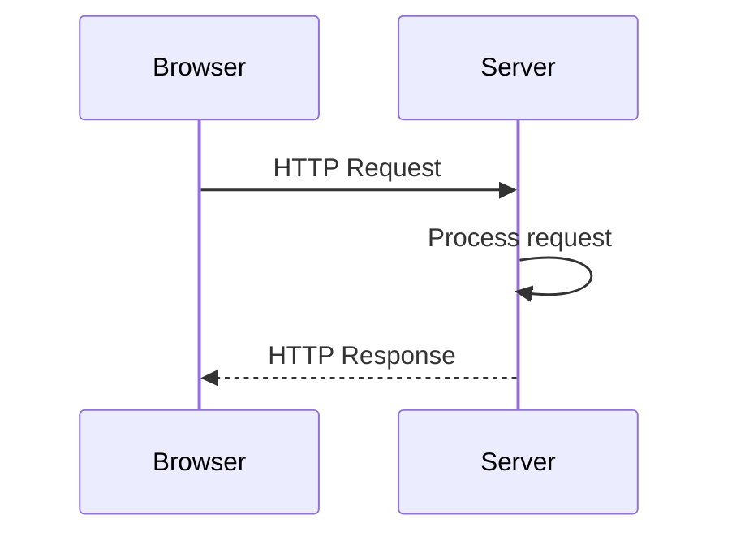
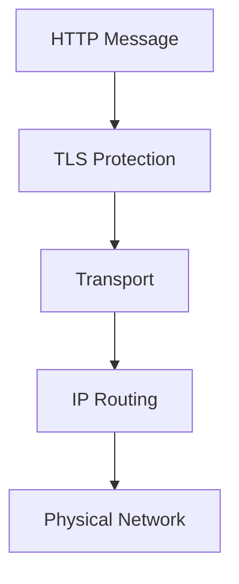
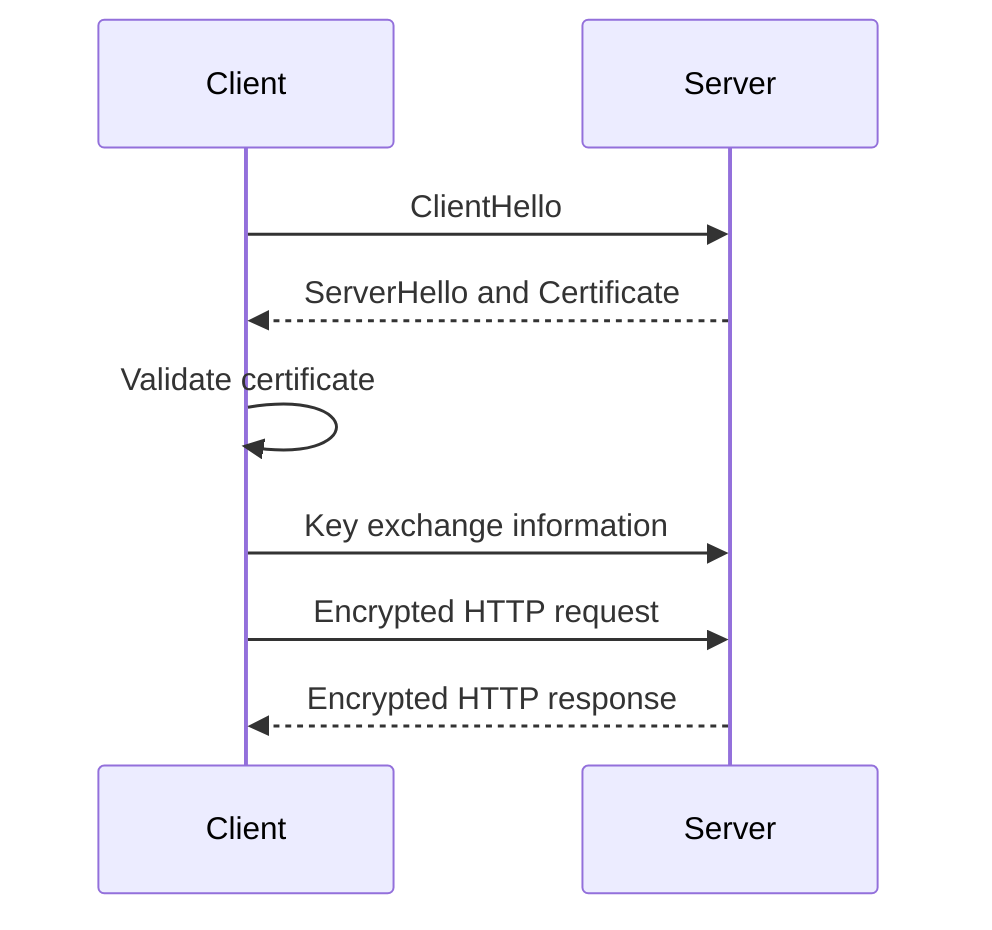
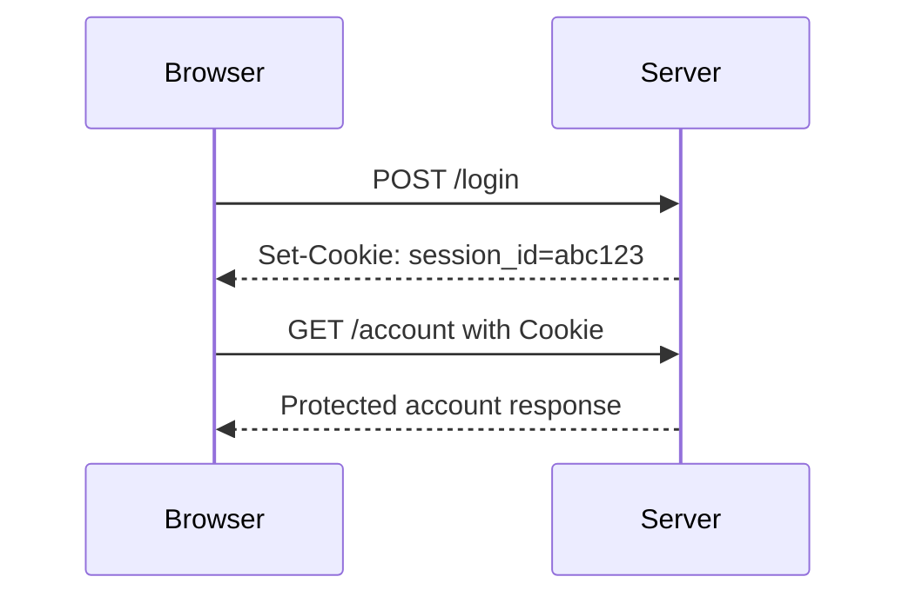
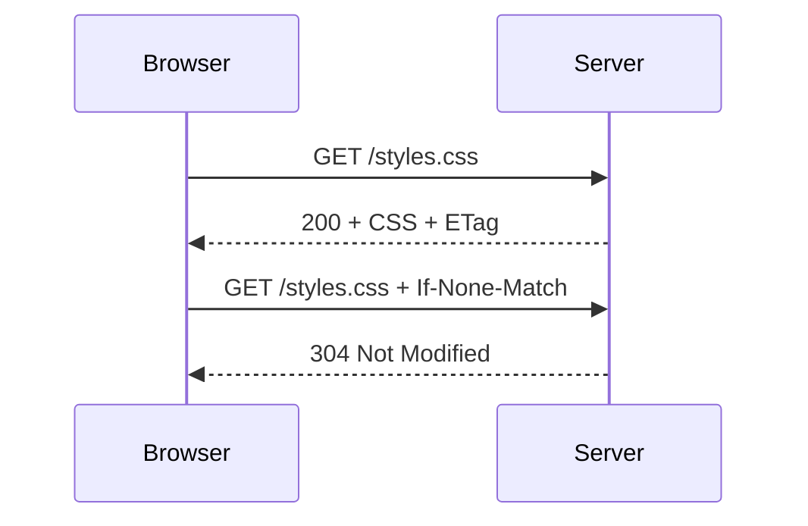

# Part 3 Quiz — HTTP, HTTPS, and the Request-Response Cycle  
## URLs, Methods, Headers, Bodies, Status Codes, Cookies, Caching, TLS, and Secure Web Communication

This quiz reviews:

- HTTP and HTTPS
- HTTP requests and responses
- URLs
- Schemes, hosts, ports, paths, queries, and fragments
- HTTP methods
- Request headers
- Response headers
- Request and response bodies
- JSON and other content types
- Status-code categories
- Common status codes
- Cookies and sessions
- Redirects
- Caching
- Compression
- Content negotiation
- TLS
- Certificates
- Symmetric and asymmetric encryption
- CORS
- Network errors versus HTTP errors
- Idempotency and retries

---

## Instructions

- Complete the quiz before reading the answer key.
- Explain your reasoning for short-answer and scenario questions.
- For protocol questions, distinguish between transport-level behavior and application-level behavior.
- Do not send real credentials or sensitive data in practice commands.
- Some API designs may have more than one valid answer if the behavior is clearly documented.

---

## Learning Objectives

After completing this quiz, you should be able to:

- Explain the purpose of HTTP.
- Distinguish HTTP from HTTPS.
- Identify the parts of a URL.
- Explain HTTP methods and their typical meanings.
- Describe the anatomy of requests and responses.
- Explain headers and bodies.
- Interpret common status codes.
- Distinguish `401` from `403`.
- Distinguish `404` from network failure.
- Explain cookies, sessions, and bearer tokens.
- Explain redirects and caching.
- Describe symmetric and asymmetric encryption.
- Explain the high-level TLS handshake.
- Explain what HTTPS protects and what it does not protect.
- Distinguish browser CORS behavior from general network communication.
- Understand safe, idempotent, and retryable operations.

---

# Part 1 — Multiple-Choice Quiz

Choose the best answer.

## Question 1

What does HTTP stand for?

- [ ] HyperText Transfer Protocol
- [ ] High-Traffic Text Process
- [ ] Host Transfer and Permission
- [ ] Hyperlink Transmission Program

---

## Question 2

What is HTTP primarily used for?

- [ ] Structuring communication between web clients and servers
- [ ] Managing computer memory
- [ ] Formatting database tables
- [ ] Replacing operating systems

---

## Question 3

What does HTTPS add to HTTP?

- [ ] TLS protection
- [ ] A database
- [ ] A new HTML syntax
- [ ] A new browser interface

---

## Question 4

Which part of this URL identifies the protocol?

```text
https://example.com/products
```

- [ ] `https`
- [ ] `example.com`
- [ ] `/products`
- [ ] `products`

---

## Question 5

Which part identifies the destination host?

```text
https://api.example.com/products
```

- [ ] `https`
- [ ] `api.example.com`
- [ ] `/products`
- [ ] `api`

---

## Question 6

Which part identifies a resource or route?

```text
https://example.com/products/123
```

- [ ] `https`
- [ ] `example.com`
- [ ] `/products/123`
- [ ] `123` only

---

## Question 7

What does a query string usually provide?

- [ ] Filters, search terms, sorting, pagination, or optional parameters
- [ ] TLS encryption
- [ ] A database password
- [ ] The physical server location

---

## Question 8

What does the fragment in this URL usually identify?

```text
https://example.com/docs#headers
```

- [ ] A location or state handled by the browser
- [ ] A server port
- [ ] A DNS record
- [ ] A TLS certificate

---

## Question 9

Is the fragment normally sent to the server in the HTTP request?

- [ ] Yes, always
- [ ] No, it is usually handled by the browser
- [ ] Only when the method is `POST`
- [ ] Only over HTTP/3

---

## Question 10

What does `GET` typically mean?

- [ ] Retrieve a representation of a resource
- [ ] Delete a resource
- [ ] Replace a resource
- [ ] Encrypt a request

---

## Question 11

What does `POST` commonly do?

- [ ] Submit data, create a resource, or trigger processing
- [ ] Retrieve headers only
- [ ] Always delete a resource
- [ ] Perform DNS resolution

---

## Question 12

What does `PUT` commonly represent?

- [ ] Full replacement of a resource
- [ ] Partial update only
- [ ] Reading a collection
- [ ] Opening a TLS connection

---

## Question 13

What does `PATCH` commonly represent?

- [ ] Partial modification of a resource
- [ ] Permanent redirection
- [ ] DNS lookup
- [ ] Full file download only

---

## Question 14

What does `DELETE` commonly request?

- [ ] Removal of a resource
- [ ] Creation of a resource
- [ ] Retrieval of headers
- [ ] Compression of a response

---

## Question 15

Which method is commonly used to retrieve headers without the response body?

- [ ] `HEAD`
- [ ] `POST`
- [ ] `PATCH`
- [ ] `CONNECT`

---

## Question 16

What does `OPTIONS` commonly communicate?

- [ ] Supported methods or cross-origin preflight information
- [ ] A new database record
- [ ] An image format
- [ ] A user’s password

---

## Question 17

Which part of an HTTP request usually contains metadata?

- [ ] Headers
- [ ] Body only
- [ ] URL fragment only
- [ ] TCP cable

---

## Question 18

Which header describes the format of the request body?

- [ ] `Content-Type`
- [ ] `Accept`
- [ ] `Location`
- [ ] `Retry-After`

---

## Question 19

Which header tells the server what response format the client prefers?

- [ ] `Accept`
- [ ] `Content-Type`
- [ ] `Set-Cookie`
- [ ] `ETag`

---

## Question 20

Which header commonly carries a bearer token?

- [ ] `Authorization`
- [ ] `Content-Length`
- [ ] `Referer`
- [ ] `Age`

---

## Question 21

Which header tells the browser to store a cookie?

- [ ] `Set-Cookie`
- [ ] `Cookie`
- [ ] `Accept-Cookie`
- [ ] `Store-Session`

---

## Question 22

Which header sends previously stored cookies back to the server?

- [ ] `Cookie`
- [ ] `Set-Cookie`
- [ ] `Session`
- [ ] `Authorization-Cookie`

---

## Question 23

Which header identifies the format of a response body?

- [ ] `Content-Type`
- [ ] `Origin`
- [ ] `Host`
- [ ] `Allow`

---

## Question 24

What does the `2xx` status-code category generally mean?

- [ ] Success
- [ ] Redirection
- [ ] Client error
- [ ] Server error

---

## Question 25

What does the `3xx` category generally indicate?

- [ ] Redirection or cache-related behavior
- [ ] Successful creation only
- [ ] Database failure
- [ ] Authentication failure only

---

## Question 26

What does the `4xx` category generally indicate?

- [ ] A request, authentication, authorization, or resource problem
- [ ] A successful request
- [ ] A TLS handshake
- [ ] A CDN cache hit only

---

## Question 27

What does the `5xx` category generally indicate?

- [ ] A server or upstream failure
- [ ] A successful redirect
- [ ] A client-side form validation success
- [ ] A browser bookmark

---

## Question 28

What does `200 OK` mean?

- [ ] The request succeeded
- [ ] A resource was permanently deleted
- [ ] Authentication is required
- [ ] The server is unavailable

---

## Question 29

What does `201 Created` usually mean?

- [ ] A new resource was created
- [ ] The resource was not found
- [ ] The request was malformed
- [ ] A redirect occurred

---

## Question 30

What does `202 Accepted` commonly mean?

- [ ] The request was accepted for processing but may not be complete
- [ ] The request was permanently rejected
- [ ] The response was not modified
- [ ] The resource was deleted

---

## Question 31

What does `204 No Content` mean?

- [ ] The operation succeeded without a response body
- [ ] The server has no content anywhere
- [ ] The request failed
- [ ] The client must redirect

---

## Question 32

What does `301 Moved Permanently` indicate?

- [ ] The resource has permanently moved
- [ ] Authentication is required
- [ ] The database is unavailable
- [ ] The response body is invalid

---

## Question 33

What does `304 Not Modified` usually tell the client?

- [ ] Use the cached representation
- [ ] Retry the request with a password
- [ ] The server crashed
- [ ] The resource was deleted permanently

---

## Question 34

What does `400 Bad Request` generally mean?

- [ ] The server cannot process the malformed or invalid request
- [ ] The user lacks permission only
- [ ] A resource was created
- [ ] The response came from a cache

---

## Question 35

What does `401 Unauthorized` usually mean?

- [ ] Authentication is missing, invalid, or expired
- [ ] The user is authenticated but lacks permission
- [ ] The server cannot find a route
- [ ] The server is overloaded

---

## Question 36

What does `403 Forbidden` usually mean?

- [ ] The caller is not authorized to perform the operation
- [ ] Authentication is always missing
- [ ] The server has permanently moved
- [ ] The request body is too large

---

## Question 37

What does `404 Not Found` usually mean?

- [ ] The requested route or resource could not be found
- [ ] DNS necessarily failed
- [ ] TLS necessarily failed
- [ ] The database was definitely destroyed

---

## Question 38

What does `409 Conflict` commonly represent?

- [ ] A conflict with the current state of a resource
- [ ] A successful file upload
- [ ] A DNS cache hit
- [ ] A certificate renewal

---

## Question 39

What does `422 Unprocessable Content` commonly represent?

- [ ] The request is understood but fails validation or business rules
- [ ] The host cannot be resolved
- [ ] The server successfully redirected
- [ ] The response is compressed

---

## Question 40

What does `429 Too Many Requests` indicate?

- [ ] Rate limiting
- [ ] Missing HTML
- [ ] Permanent deletion
- [ ] Successful creation

---

## Question 41

What does `500 Internal Server Error` generally indicate?

- [ ] An unexpected server-side failure
- [ ] A successful request
- [ ] A missing query parameter only
- [ ] A browser cache hit

---

## Question 42

What does `502 Bad Gateway` commonly indicate?

- [ ] A gateway received an invalid response from an upstream service
- [ ] The client successfully created a resource
- [ ] The browser used a cached response
- [ ] The user entered an invalid password

---

## Question 43

What does `503 Service Unavailable` commonly indicate?

- [ ] The service is temporarily unable to handle the request
- [ ] The resource was permanently deleted
- [ ] The request was successfully cached
- [ ] The client is authenticated

---

## Question 44

What does `504 Gateway Timeout` commonly indicate?

- [ ] A gateway waited too long for an upstream response
- [ ] A new resource was created
- [ ] The URL fragment was invalid
- [ ] The browser loaded CSS

---

## Question 45

What does TLS primarily provide?

- [ ] Confidentiality, integrity, and authentication for the connection
- [ ] Database schema design
- [ ] HTML structure
- [ ] UI state management

---

## Question 46

What is symmetric encryption?

- [ ] Encryption and decryption use the same secret key
- [ ] Anyone can decrypt the data
- [ ] It uses only a public key
- [ ] It is a URL encoding format

---

## Question 47

What is asymmetric cryptography?

- [ ] Cryptography using a public and private key pair
- [ ] Compression using two algorithms
- [ ] A type of HTTP header
- [ ] A database transaction

---

## Question 48

What is a TLS certificate used for?

- [ ] Associating a public key with a domain or identity
- [ ] Storing all website HTML
- [ ] Replacing DNS
- [ ] Creating browser cookies

---

## Question 49

What does HTTPS protect?

- [ ] Data in transit between the client and server
- [ ] All application logic automatically
- [ ] All bugs in the backend
- [ ] Every device used by the user

---

## Question 50

What does HTTPS not automatically protect against?

- [ ] Broken authorization logic
- [ ] Network observers reading plaintext in transit
- [ ] Unauthorized modification in transit
- [ ] Certificate impersonation when validation works correctly

---

# Part 2 — True or False

## Question 51

HTTP uses a request-response communication model.

- [ ] True
- [ ] False

---

## Question 52

HTTPS is HTTP transmitted through TLS protection.

- [ ] True
- [ ] False

---

## Question 53

The URL fragment is normally sent to the server as part of the HTTP request path.

- [ ] True
- [ ] False

---

## Question 54

A request body can contain JSON, form data, text, or binary data.

- [ ] True
- [ ] False

---

## Question 55

The `Content-Type` header describes the format of a message body.

- [ ] True
- [ ] False

---

## Question 56

The `Accept` header describes the format of the request body.

- [ ] True
- [ ] False

---

## Question 57

A `401` and a `403` usually mean the same thing.

- [ ] True
- [ ] False

---

## Question 58

A `404` response generally means the server was reached but the resource or route was not found.

- [ ] True
- [ ] False

---

## Question 59

A `500` response proves that DNS failed.

- [ ] True
- [ ] False

---

## Question 60

A `304 Not Modified` response is generally a normal cache-related response.

- [ ] True
- [ ] False

---

## Question 61

A `POST` request is always idempotent.

- [ ] True
- [ ] False

---

## Question 62

`PUT` is generally intended to be idempotent.

- [ ] True
- [ ] False

---

## Question 63

A browser can store and send cookies according to cookie attributes and request context.

- [ ] True
- [ ] False

---

## Question 64

An `HttpOnly` cookie is normally readable by page JavaScript through `document.cookie`.

- [ ] True
- [ ] False

---

## Question 65

The `Secure` cookie attribute indicates that the cookie should be sent only over HTTPS.

- [ ] True
- [ ] False

---

## Question 66

A bearer token should be treated as sensitive because possession may grant access.

- [ ] True
- [ ] False

---

## Question 67

A browser and cURL always handle CORS in exactly the same way.

- [ ] True
- [ ] False

---

## Question 68

TLS commonly uses asymmetric cryptography during setup and symmetric encryption for efficient session data.

- [ ] True
- [ ] False

---

## Question 69

HTTPS guarantees that the backend’s authorization logic is correct.

- [ ] True
- [ ] False

---

## Question 70

A request may receive `200 OK` while the business operation represented in the response has failed.

- [ ] True
- [ ] False

---

# Part 3 — Short-Answer Quiz

Answer in complete sentences.

## Question 71

What is HTTP?

---

## Question 72

What is the difference between HTTP and HTTPS?

---

## Question 73

Identify the components of this URL:

```text
https://api.example.com:8443/v1/products/123?sort=price#details
```

---

## Question 74

What is the difference between a path parameter and a query parameter?

---

## Question 75

Why is the URL fragment usually not sent to the server?

---

## Question 76

What is the difference between `GET`, `POST`, `PUT`, `PATCH`, and `DELETE`?

---

## Question 77

What is the purpose of request headers?

---

## Question 78

What is the difference between `Accept` and `Content-Type`?

---

## Question 79

What is a request body?

---

## Question 80

What is a response body?

---

## Question 81

What is the difference between `401 Unauthorized` and `403 Forbidden`?

---

## Question 82

What is the difference between `400 Bad Request` and `422 Unprocessable Content`?

---

## Question 83

What is the difference between `404 Not Found` and a DNS failure?

---

## Question 84

What does `201 Created` indicate?

---

## Question 85

What does `202 Accepted` indicate?

---

## Question 86

What does `304 Not Modified` indicate?

---

## Question 87

What is a cookie?

---

## Question 88

What is a session?

---

## Question 89

What is a bearer token?

---

## Question 90

What do the `Secure`, `HttpOnly`, and `SameSite` cookie attributes do?

---

## Question 91

What is symmetric encryption?

---

## Question 92

What is asymmetric cryptography?

---

## Question 93

What is a TLS certificate?

---

## Question 94

What does the TLS handshake accomplish at a high level?

---

## Question 95

What does HTTPS protect, and what does it not automatically protect?

---

# Part 4 — Request and Response Analysis

## Question 96

Analyze this request:

```http
POST /api/orders?notify=true HTTP/1.1
Host: shop.example.com
Accept: application/json
Content-Type: application/json
Authorization: Bearer REDACTED

{
  "productId": 123,
  "quantity": 2
}
```

Identify:

```text
Method:
Path:
Query parameter:
Host:
Expected response format:
Request body format:
Authentication:
```

---

## Question 97

Analyze this response:

```http
HTTP/1.1 201 Created
Content-Type: application/json
Location: /api/orders/9001
Cache-Control: no-store

{
  "id": 9001,
  "status": "pending"
}
```

Identify:

```text
Status:
Meaning:
Response format:
Created resource:
Caching behavior:
```

---

## Question 98

Analyze this response:

```http
HTTP/1.1 401 Unauthorized
WWW-Authenticate: Bearer
Content-Type: application/json

{
  "error": "Authentication required"
}
```

What does the response tell the client?

---

## Question 99

Analyze this response:

```http
HTTP/1.1 304 Not Modified
ETag: "products-v5"
```

What should the browser generally do?

---

## Question 100

Analyze this response:

```http
HTTP/1.1 302 Found
Location: /login
```

What will a browser commonly do?

---

# Part 5 — Diagram and Protocol Flow Quiz

## Question 101

Explain this request-response flow:



---

## Question 102

Explain this HTTPS flow:



---

## Question 103

Explain this TLS handshake at a high level:



---

## Question 104

Explain this session flow:



---

## Question 105

Explain this conditional caching flow:



---

# Part 6 — Scenario Quiz

## Question 106 — Request Never Appears

A user clicks “Load Products,” but no request appears in the Network panel.

What should you investigate first?

---

## Question 107 — Request Returns `401`

A browser sends:

```http
GET /api/account
```

and receives:

```http
401 Unauthorized
```

What should you inspect?

---

## Question 108 — Request Returns `403`

The user is logged in, but receives:

```http
403 Forbidden
```

when opening an administrator page.

What does this likely mean?

---

## Question 109 — Request Returns `404`

The frontend requests:

```text
/api/product/123
```

but the documented endpoint is:

```text
/api/products/123
```

What is likely wrong?

---

## Question 110 — Request Returns `422`

The request body is:

```json
{
  "quantity": -1
}
```

What does `422` likely indicate?

---

## Question 111 — Request Returns `500`

A request returns:

```http
500 Internal Server Error
```

What should you inspect?

---

## Question 112 — HTML Instead of JSON

Frontend code calls:

```javascript
await response.json();
```

but the server returns an HTML login page.

What could have happened?

---

## Question 113 — Duplicate Order

A client sends:

```http
POST /api/orders
```

The server creates the order, but the response is lost. The client retries and creates a second order.

What design feature can help prevent this?

---

## Question 114 — Slow API

A request has:

```text
Low DNS time
Low connection time
Low TLS time
Very high TTFB
Fast content download
```

What part of the system is likely slow?

---

## Question 115 — Large Response

A request has low TTFB but takes a long time to finish downloading.

What might be happening?

---

## Question 116 — CORS

cURL receives a valid JSON response, but browser JavaScript reports a CORS error.

Why can this happen?

---

## Question 117 — Mixed Content

An HTTPS page tries to load:

```text
http://example.com/app.js
```

What may happen?

---

## Question 118 — Invalid Certificate

A browser reports that the certificate hostname does not match the requested domain.

What does this mean?

---

## Question 119 — Cookie Not Sent

A login response sets a cookie, but later requests do not include it.

What should you inspect?

---

## Question 120 — `204` Response Parsing

Frontend code receives:

```http
204 No Content
```

and then calls:

```javascript
await response.json();
```

What problem may occur?

---

# Part 7 — Practical HTTP and HTTPS Exercises

Use public services or systems you are authorized to test.

## Exercise 1 — Inspect Response Headers

```bash
curl -I https://example.com
```

Record:

```text
Status code:
Content-Type:
Cache-Control:
Location if present:
Security headers:
```

---

## Exercise 2 — Inspect a Full Response

```bash
curl -i https://example.com
```

Identify:

```text
Status line
Response headers
Response body
```

---

## Exercise 3 — Send JSON

```bash
curl \
  -i \
  -X POST \
  -H "Accept: application/json" \
  -H "Content-Type: application/json" \
  -d '{"name":"Alex","topic":"HTTP"}' \
  https://httpbin.org/post
```

Identify:

```text
Method
Content-Type
Request body
Response status
Response format
```

---

## Exercise 4 — Send Query Parameters

```bash
curl -G https://httpbin.org/get \
  --data-urlencode "q=web mechanics" \
  --data-urlencode "page=2"
```

Inspect how the service represents the query parameters.

---

## Exercise 5 — Follow Redirects

```bash
curl -I http://example.com
```

Then:

```bash
curl -I -L http://example.com
```

Record:

```text
Initial status
Location header
Final status
```

---

## Exercise 6 — Inspect Timing

```bash
curl \
  -o /dev/null \
  -s \
  -w "\
status=%{http_code}\n\
dns=%{time_namelookup}s\n\
connect=%{time_connect}s\n\
tls=%{time_appconnect}s\n\
ttfb=%{time_starttransfer}s\n\
total=%{time_total}s\n" \
  https://example.com
```

Explain each timing value.

---

# Answer Key

# Part 1 — Multiple-Choice Answers

| Question | Answer | Explanation |
|---:|---|---|
| 1 | HyperText Transfer Protocol | HTTP is the primary application protocol of the Web. |
| 2 | Structuring communication between web clients and servers | HTTP defines request and response messages. |
| 3 | TLS protection | HTTPS is HTTP transmitted through TLS. |
| 4 | `https` | This is the URL scheme. |
| 5 | `api.example.com` | This is the host. |
| 6 | `/products/123` | This is the path. |
| 7 | Filters, search terms, sorting, pagination, or optional parameters | Query strings modify or parameterize requests. |
| 8 | A location or state handled by the browser | Fragments usually identify a client-side location. |
| 9 | No, it is usually handled by the browser | Fragments generally are not sent in HTTP requests. |
| 10 | Retrieve a representation of a resource | `GET` is generally read-oriented. |
| 11 | Submit data, create a resource, or trigger processing | `POST` commonly performs submission or creation. |
| 12 | Full replacement of a resource | `PUT` commonly represents replacement. |
| 13 | Partial modification of a resource | `PATCH` commonly represents partial updates. |
| 14 | Removal of a resource | `DELETE` requests deletion or removal. |
| 15 | `HEAD` | `HEAD` retrieves headers without the normal body. |
| 16 | Supported methods or cross-origin preflight information | `OPTIONS` communicates supported operations. |
| 17 | Headers | Headers carry metadata. |
| 18 | `Content-Type` | It describes the request body format. |
| 19 | `Accept` | It describes preferred response formats. |
| 20 | `Authorization` | Bearer credentials are commonly sent there. |
| 21 | `Set-Cookie` | The server uses it to instruct the browser to store a cookie. |
| 22 | `Cookie` | The browser sends stored cookies in this header. |
| 23 | `Content-Type` | It describes the response body format. |
| 24 | Success | `2xx` statuses represent successful processing. |
| 25 | Redirection or cache-related behavior | `3xx` statuses direct the client or describe cache validation. |
| 26 | A request, authentication, authorization, or resource problem | `4xx` generally concerns the request or caller. |
| 27 | A server or upstream failure | `5xx` indicates server-side or gateway failure. |
| 28 | The request succeeded | `200 OK` is general success. |
| 29 | A new resource was created | `201 Created` is common after successful creation. |
| 30 | The request was accepted for processing but may not be complete | `202` is useful for asynchronous work. |
| 31 | The operation succeeded without a response body | `204` means no content is returned. |
| 32 | The resource has permanently moved | The client should use the `Location` URL. |
| 33 | Use the cached representation | `304` indicates that the cached copy remains valid. |
| 34 | The server cannot process the malformed or invalid request | `400` is a general request error. |
| 35 | Authentication is missing, invalid, or expired | `401` is generally an authentication problem. |
| 36 | The caller is not authorized to perform the operation | `403` is generally a permission problem. |
| 37 | The requested route or resource could not be found | `404` does not necessarily mean the server is unreachable. |
| 38 | A conflict with the current state of a resource | `409` commonly represents state or concurrency conflicts. |
| 39 | The request is understood but fails validation or business rules | `422` is common for semantic validation errors. |
| 40 | Rate limiting | `429` means too many requests. |
| 41 | An unexpected server-side failure | `500` is a general internal error. |
| 42 | A gateway received an invalid response from an upstream service | `502` commonly involves a proxy or gateway. |
| 43 | The service is temporarily unable to handle the request | `503` may result from overload, maintenance, or dependency failure. |
| 44 | A gateway waited too long for an upstream response | `504` commonly indicates an upstream timeout. |
| 45 | Confidentiality, integrity, and authentication for the connection | TLS protects data in transit. |
| 46 | Encryption and decryption use the same secret key | Symmetric encryption is efficient for session data. |
| 47 | Cryptography using a public and private key pair | Asymmetric cryptography supports authentication and key exchange. |
| 48 | Associating a public key with a domain or identity | Certificates help clients authenticate servers. |
| 49 | Data in transit between the client and server | HTTPS protects the communication channel. |
| 50 | Broken authorization logic | HTTPS does not guarantee correct application behavior. |

---

# Part 2 — True-or-False Answers

| Question | Answer | Explanation |
|---:|---|---|
| 51 | True | HTTP commonly uses request-response communication. |
| 52 | True | HTTPS is HTTP over TLS. |
| 53 | False | The fragment is usually handled by the browser and omitted from the HTTP request. |
| 54 | True | Bodies can contain many formats, including JSON and binary data. |
| 55 | True | `Content-Type` describes the body format. |
| 56 | False | `Accept` describes preferred response formats. |
| 57 | False | `401` concerns authentication; `403` concerns authorization. |
| 58 | True | A `404` generally means the server was reached but the route or resource was not found. |
| 59 | False | A `500` means the server or an upstream component failed; DNS may have succeeded. |
| 60 | True | `304` is a normal conditional-cache response. |
| 61 | False | Repeating `POST` may create duplicate operations. |
| 62 | True | `PUT` is generally intended to be idempotent. |
| 63 | True | Cookie attributes and request context determine whether cookies are sent. |
| 64 | False | `HttpOnly` cookies are not normally readable by page JavaScript. |
| 65 | True | `Secure` limits the cookie to HTTPS transmission. |
| 66 | True | Anyone possessing a bearer token may be able to use it. |
| 67 | False | Browsers enforce CORS; cURL generally does not. |
| 68 | True | TLS commonly uses asymmetric techniques for setup and symmetric encryption for session data. |
| 69 | False | HTTPS does not guarantee correct authorization logic. |
| 70 | True | The HTTP exchange can succeed while the business operation fails. |

---

# Part 3 — Short-Answer Model Answers

## Question 71

HTTP is an application-layer protocol that defines how clients and servers exchange requests and responses.

---

## Question 72

HTTP is generally unencrypted at the application-transport boundary. HTTPS is HTTP protected by TLS, providing confidentiality, integrity, and server authentication.

---

## Question 73

```text
Scheme:
  https

Host:
  api.example.com

Port:
  8443

Path:
  /v1/products/123

Query:
  sort=price

Fragment:
  details
```

The fragment is generally handled by the browser and is not sent to the server.

---

## Question 74

A path parameter usually identifies the resource:

```text
/products/123
```

A query parameter usually filters, sorts, searches, paginates, or modifies the request:

```text
/products?sort=price
```

---

## Question 75

The fragment is generally intended for client-side navigation or state within the returned resource. The browser uses it after receiving the response, so it is normally omitted from the HTTP request sent to the server.

---

## Question 76

```text
GET:
  Retrieve data.

POST:
  Submit data, create a resource, or trigger processing.

PUT:
  Replace a resource.

PATCH:
  Partially update a resource.

DELETE:
  Remove a resource.
```

The exact behavior depends on the API contract.

---

## Question 77

Request headers carry metadata about the request, such as:

```text
Host
Authentication
Accepted formats
Body format
Cookies
Origin
Language
Caching preferences
```

---

## Question 78

`Accept` describes response formats the client prefers.

```http
Accept: application/json
```

`Content-Type` describes the format of the body being sent or received.

```http
Content-Type: application/json
```

---

## Question 79

A request body contains data sent by the client, commonly with `POST`, `PUT`, or `PATCH`.

Examples:

```text
JSON
Form data
Multipart file data
Plain text
Binary content
```

---

## Question 80

A response body contains data returned by the server, such as:

```text
HTML
JSON
Plain text
Image bytes
PDF
Video
```

---

## Question 81

`401 Unauthorized` usually means authentication is missing, invalid, or expired.

`403 Forbidden` usually means the server knows or can identify the caller but refuses to authorize the operation.

---

## Question 82

`400 Bad Request` generally means the request is malformed or cannot be understood.

`422 Unprocessable Content` generally means the request is understood, but its values fail validation or business rules.

---

## Question 83

A `404` is an HTTP response from a reachable server indicating that a route or resource was not found.

A DNS failure means the client could not resolve the hostname to a network destination, so a normal HTTP response may never have been received.

---

## Question 84

`201 Created` indicates that the request succeeded and created a new resource. The `Location` header may identify that resource.

---

## Question 85

`202 Accepted` means the server accepted the request for processing, but the final operation may not yet be complete.

---

## Question 86

`304 Not Modified` tells the client that its cached representation remains valid and may be reused.

---

## Question 87

A cookie is a small value stored by a browser and sent with later matching requests. Cookies may store session identifiers, preferences, or other state.

---

## Question 88

A session represents an authenticated or ongoing interaction between a client and an application. It is often identified by a secure cookie containing an opaque session ID.

---

## Question 89

A bearer token is a credential sent by a caller, often in:

```http
Authorization: Bearer token
```

Possession of the token may grant access, so it must be protected.

---

## Question 90

```text
Secure:
  Send the cookie only over HTTPS.

HttpOnly:
  Prevent normal page JavaScript from reading the cookie.

SameSite:
  Control cross-site cookie behavior.
```

---

## Question 91

Symmetric encryption uses the same secret key to encrypt and decrypt data. It is efficient for protecting large amounts of session traffic.

---

## Question 92

Asymmetric cryptography uses a public and private key pair. It supports operations such as server authentication, digital signatures, and key exchange.

---

## Question 93

A TLS certificate associates a public key with a domain or identity and is signed through a trusted certificate-authority system.

---

## Question 94

The TLS handshake allows the client and server to:

```text
Agree on cryptographic parameters
Authenticate the server
Establish shared session secrets
Begin encrypted communication
```

---

## Question 95

HTTPS protects confidentiality, integrity, and server authentication for data in transit.

It does not automatically protect against:

```text
Broken authorization
Weak passwords
SQL injection
XSS
Malware on the device
Compromised servers
Incorrect business logic
```

---

# Part 4 — Request and Response Analysis Answers

## Question 96

```http
POST /api/orders?notify=true HTTP/1.1
Host: shop.example.com
Accept: application/json
Content-Type: application/json
Authorization: Bearer REDACTED

{
  "productId": 123,
  "quantity": 2
}
```

```text
Method:
  POST

Path:
  /api/orders

Query parameter:
  notify=true

Host:
  shop.example.com

Expected response format:
  application/json

Request body format:
  application/json

Authentication:
  Bearer token
```

---

## Question 97

```http
HTTP/1.1 201 Created
Content-Type: application/json
Location: /api/orders/9001
Cache-Control: no-store
```

```text
Status:
  201 Created

Meaning:
  A new resource was created.

Response format:
  JSON

Created resource:
  /api/orders/9001

Caching behavior:
  Do not store the response.
```

---

## Question 98

The server is asking the client to provide valid authentication.

The `WWW-Authenticate: Bearer` header indicates that bearer-token authentication is expected.

The client should inspect whether:

```text
A token is missing
The token is expired
The token is invalid
The authentication scheme is incorrect
```

---

## Question 99

The browser should generally reuse its cached copy because the server indicates that the resource has not changed.

---

## Question 100

The browser will commonly request the URL in the `Location` header:

```text
/login
```

The exact method behavior depends on the redirect code and client behavior. A browser may follow the redirect automatically.

---

# Part 5 — Diagram and Protocol Flow Answers

## Question 101

The browser sends an HTTP request. The server processes it, potentially using business logic, databases, or external services, and then returns an HTTP response.

---

## Question 102

The HTTP message is protected by TLS. The protected data travels through transport protocols, IP routing, and physical network infrastructure.

---

## Question 103

The client and server exchange capabilities and cryptographic information. The server presents a certificate. The client validates it, both sides establish shared session secrets, and encrypted HTTP communication begins.

---

## Question 104

The browser submits login information. The server authenticates the user and returns a session cookie. The browser stores the cookie and sends it with later matching requests. The server uses the session to identify the user and return protected data.

---

## Question 105

The browser first receives a resource and an ETag. Later, it sends the ETag in `If-None-Match`. If the resource has not changed, the server returns `304 Not Modified`, and the browser reuses its cached copy.

---

# Part 6 — Scenario Model Answers

## Question 106 — Request Never Appears

Investigate the frontend before the network layer:

```text
JavaScript exceptions
Event handler
Button state
Form validation
Request construction
Component initialization
```

If no request appears, the problem likely occurred before network transmission.

---

## Question 107 — Request Returns `401`

Inspect:

```text
Session cookie
Authorization header
Token expiration
Login result
Cookie domain and path
Secure and SameSite settings
Correct environment
```

The request may be missing valid authentication.

---

## Question 108 — Request Returns `403`

The caller is likely authenticated but lacks permission.

Check:

```text
User role
Resource ownership
Organization membership
Subscription
Account state
Endpoint authorization rules
```

---

## Question 109 — Request Returns `404`

The frontend is probably using the wrong path.

Expected:

```text
/api/products/123
```

Actual:

```text
/api/product/123
```

Compare the frontend request with the backend route and API contract.

---

## Question 110 — Request Returns `422`

The server understood the request format, but the value `-1` violates validation or business rules. Quantity likely must be a positive integer.

---

## Question 111 — Request Returns `500`

Inspect:

```text
Request URL
Method
Headers
Body
Response body
Request ID
Application logs
Database logs
External dependency logs
Recent deployments
```

The cause is likely server-side or in an upstream dependency.

---

## Question 112 — HTML Instead of JSON

Possible causes:

```text
Authentication redirected to an HTML login page.
Wrong API URL.
Reverse proxy returned an HTML fallback.
Backend route is missing.
Server returned an HTML error page.
```

Inspect status, redirects, `Content-Type`, and response body.

---

## Question 113 — Duplicate Order

Use an idempotency key:

```http
Idempotency-Key: order-attempt-123
```

The server stores the result associated with that key and returns the original result if the same request is retried.

---

## Question 114 — Slow API

High TTFB with low DNS, connection, and TLS times suggests delay in:

```text
Backend processing
Database query
Cache miss
External service
Server queue
Cold start
```

---

## Question 115 — Large Response

The response may be large or slow to transfer.

Possible causes:

```text
Too many records
Large images or files
Missing compression
Over-fetching
Slow bandwidth
Streaming response
```

Inspect transferred size, decoded size, and `Content-Encoding`.

---

## Question 116 — CORS

cURL does not enforce browser CORS rules. The browser may block JavaScript from reading a cross-origin response unless the server permits the origin, methods, headers, and credentials appropriately.

---

## Question 117 — Mixed Content

The browser may block the HTTP resource because the page was loaded over HTTPS. Important active content such as JavaScript should be loaded securely.

---

## Question 118 — Invalid Certificate

The certificate presented by the server is not valid for the hostname requested. Possible causes include:

```text
Wrong certificate
Misconfigured reverse proxy
Incorrect DNS destination
Missing certificate coverage
```

---

## Question 119 — Cookie Not Sent

Inspect:

```text
Cookie domain
Cookie path
Secure attribute
SameSite attribute
Expiration
Browser blocking
Cross-origin request behavior
HTTPS usage
```

Also verify that the login response actually set and stored the cookie.

---

## Question 120 — `204` Response Parsing

A `204 No Content` response has no response body, so calling `response.json()` may fail. The frontend should check the status before attempting to parse a body.

---

# Part 7 — Practical Exercise Guidance

## Exercise 1

Record the response metadata:

```text
Status
Content-Type
Cache-Control
Location
Security headers
```

The exact values depend on the public domain.

---

## Exercise 2

Separate:

```text
Status line
Response headers
Response body
```

The `-i` flag includes headers before the body.

---

## Exercise 3

Expected request:

```text
Method:
  POST

Content-Type:
  application/json

Body:
  {"name":"Alex","topic":"HTTP"}
```

The test service should return information about the received request.

---

## Exercise 4

The query parameters should appear in the response representation from the test service.

---

## Exercise 5

The initial response may be a redirect. With `-L`, cURL follows the `Location` headers and displays or reports the final response.

---

## Exercise 6

```text
time_namelookup:
  DNS lookup time

time_connect:
  Time to establish the connection

time_appconnect:
  Time to complete TLS negotiation

time_starttransfer:
  Time until the first response byte, approximately TTFB

time_total:
  Total request time
```

---

# Scoring Guidance

## Multiple-choice and true/false

```text
1 point per correct answer
```

## Short-answer questions

```text
2 points:
  Correct core definition.

3 points:
  Correct definition plus example.

4 points:
  Correct definition, example, and distinction from a related concept.
```

## Request analysis

Evaluate:

```text
Correct method
Correct URL components
Correct header interpretation
Correct body interpretation
Correct status-code meaning
```

## Scenario questions

Evaluate whether the learner:

```text
Identifies the correct layer
Distinguishes network failures from HTTP responses
Inspects the right headers and body
Understands authentication and authorization
Recognizes retry and caching risks
Suggests a safe next step
```

---

# Review Recommendations

If you struggled with:

```text
HTTP and URLs:
  Part 3, Sections 1–10
  Appendix D

Methods and requests:
  Part 3, Sections 11–31

Responses and status codes:
  Part 3, Sections 32–45
  Appendix B

Headers and cookies:
  Part 3, Sections 46–61
  Appendix C

TLS and HTTPS:
  Part 3, Sections 62–75

Diagnostics:
  Part 5
  Appendix E
  Appendix F
  Appendix K
```

---

# Completion Criteria

You are ready to continue when you can:

```text
Explain HTTP and HTTPS.
Parse a URL.
Explain common HTTP methods.
Identify request and response components.
Interpret headers and bodies.
Distinguish common status codes.
Explain cookies and sessions.
Explain bearer tokens.
Describe caching and redirects.
Explain TLS at a high level.
Distinguish network errors from HTTP errors.
Explain CORS and mixed content.
Identify when retries may duplicate operations.
```
