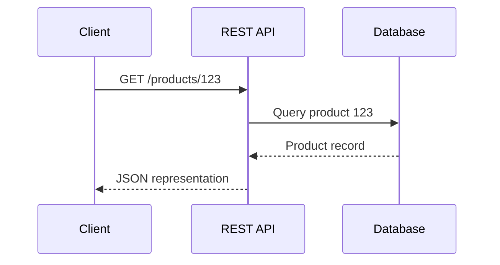
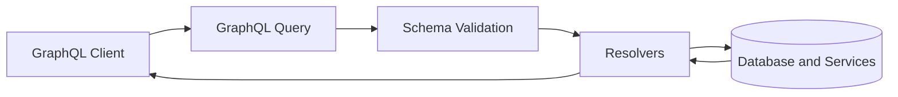
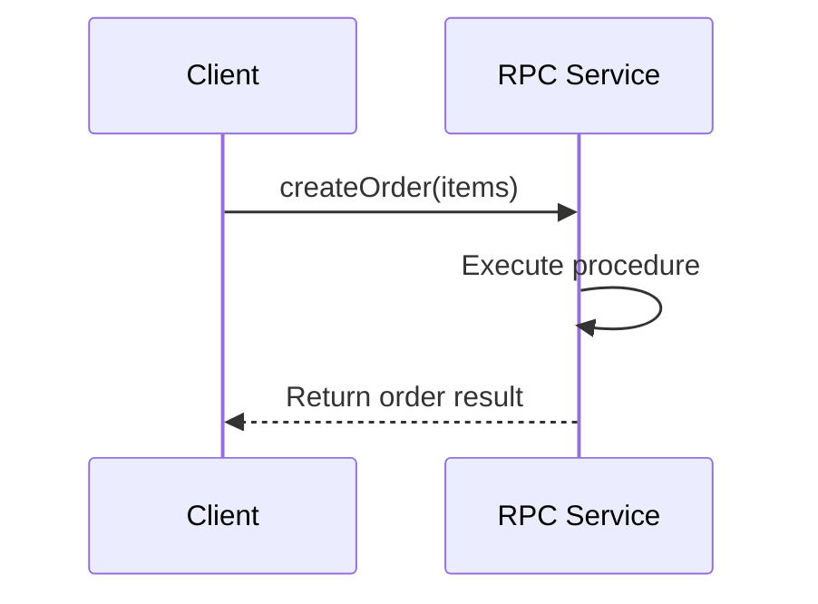
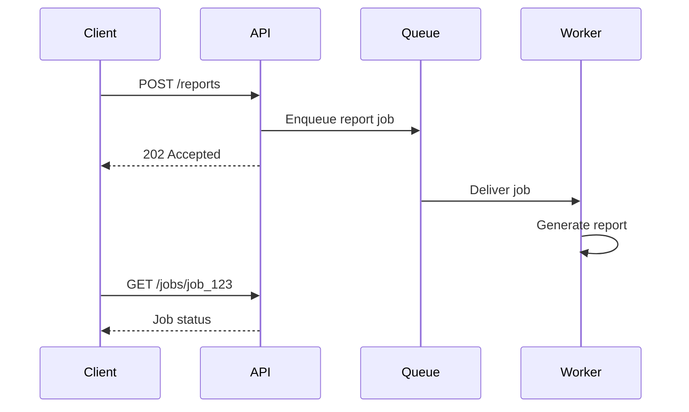

# Part 4 Quiz — RESTful Services and API Paradigms  
## Resources, HTTP Semantics, REST, GraphQL, RPC, Serialization, Contracts, and API Design

This quiz reviews:

- APIs and API boundaries
- API providers and consumers
- REST
- Resources and representations
- Collections
- CRUD operations
- HTTP methods in API design
- Path and query parameters
- Nested resources
- Relationships
- Statelessness
- Idempotency
- Pagination
- Filtering and sorting
- Search
- Error formats
- Authentication and authorization
- Rate limiting
- API versioning
- Backward compatibility
- GraphQL
- RPC
- JSON-RPC
- gRPC
- Serialization
- JSON
- XML
- Form data
- Multipart form data
- Binary formats
- API contracts
- API gateways
- Service-to-service APIs
- Synchronous and asynchronous APIs

---

## Instructions

- Complete the quiz before reading the answer key.
- Explain your reasoning for short-answer and scenario questions.
- For design questions, multiple answers may be valid if the tradeoffs are explained.
- Do not send requests to systems you do not own or have permission to test.
- Treat API clients as potentially untrusted callers.
- Remember that an API should not automatically expose database tables.

---

## Learning Objectives

After completing this quiz, you should be able to:

- Explain what an API is.
- Identify API consumers and providers.
- Explain REST and resource-oriented design.
- Distinguish resources from representations.
- Map CRUD operations to HTTP methods.
- Choose between path and query parameters.
- Explain statelessness and idempotency.
- Design pagination, filtering, sorting, and search behavior.
- Design consistent API errors.
- Explain API authentication and authorization.
- Explain rate limiting and versioning.
- Compare REST, GraphQL, and RPC.
- Explain JSON-RPC and gRPC.
- Describe serialization formats.
- Explain API contracts and compatibility.
- Design synchronous and asynchronous API workflows.
- Identify appropriate API styles for different problems.

---

# Part 1 — Multiple-Choice Quiz

Choose the best answer.

## Question 1

What is an API?

- [ ] A database password
- [ ] A defined interface through which software systems communicate
- [ ] A CSS layout system
- [ ] A physical network cable

---

## Question 2

What is an API provider?

- [ ] The system exposing data or capabilities
- [ ] Only the person using a browser
- [ ] A database column
- [ ] A DNS resolver

---

## Question 3

What is an API consumer?

- [ ] A system that calls or uses an API
- [ ] A database backup
- [ ] A server rack
- [ ] A CSS framework

---

## Question 4

What is REST?

- [ ] A programming language
- [ ] An architectural style for distributed systems
- [ ] A database engine
- [ ] A browser storage format

---

## Question 5

What is a resource in a REST-style API?

- [ ] A thing represented or managed by the API
- [ ] Only a physical file
- [ ] A TCP connection
- [ ] A shell variable

---

## Question 6

Which is a likely resource-oriented collection URL?

- [ ] `/create-product`
- [ ] `/products`
- [ ] `/do-product-search-now`
- [ ] `/runDatabaseQuery`

---

## Question 7

Which URL most likely represents one product?

- [ ] `/products`
- [ ] `/products/123`
- [ ] `/products?all=true`
- [ ] `/create-product`

---

## Question 8

What does a representation describe?

- [ ] A format used to transfer information about a resource
- [ ] A physical network route
- [ ] A database password
- [ ] A shell process

---

## Question 9

Which format could represent a product resource?

- [ ] JSON
- [ ] HTML
- [ ] XML
- [ ] All of the above

---

## Question 10

What does CRUD stand for?

- [ ] Create, Read, Update, Delete
- [ ] Cache, Route, Upload, Download
- [ ] Client, Request, User, Database
- [ ] Compile, Run, Use, Deploy

---

## Question 11

Which method commonly creates a resource in a collection?

- [ ] `GET`
- [ ] `POST`
- [ ] `HEAD`
- [ ] `OPTIONS`

---

## Question 12

Which method commonly retrieves a resource?

- [ ] `GET`
- [ ] `POST`
- [ ] `DELETE`
- [ ] `PATCH`

---

## Question 13

Which method commonly replaces a resource?

- [ ] `PUT`
- [ ] `GET`
- [ ] `HEAD`
- [ ] `OPTIONS`

---

## Question 14

Which method commonly performs a partial update?

- [ ] `PATCH`
- [ ] `POST`
- [ ] `TRACE`
- [ ] `CONNECT`

---

## Question 15

Which method commonly requests removal?

- [ ] `DELETE`
- [ ] `GET`
- [ ] `PUT`
- [ ] `HEAD`

---

## Question 16

Which is a path parameter?

- [ ] `/products/123`
- [ ] `/products?category=keyboards`
- [ ] `Accept: application/json`
- [ ] `Content-Type: application/json`

---

## Question 17

Which is a query parameter?

- [ ] `/products/123`
- [ ] `/products?category=keyboards`
- [ ] `/products`
- [ ] `POST /products`

---

## Question 18

Path parameters commonly identify:

- [ ] The primary resource or nested resource
- [ ] Only the preferred response format
- [ ] A CSS class
- [ ] A database password

---

## Question 19

Query parameters commonly support:

- [ ] Filtering, sorting, searching, or pagination
- [ ] Private key storage
- [ ] CPU scheduling
- [ ] HTML parsing only

---

## Question 20

What does statelessness mean in a REST-style API?

- [ ] The application cannot store any information.
- [ ] Each request contains the information needed to process it.
- [ ] The database must be deleted after every request.
- [ ] The browser cannot maintain state.

---

## Question 21

What is idempotency?

- [ ] Repeating an operation produces the same intended final state
- [ ] Encrypting a request twice
- [ ] Sending data to two databases
- [ ] Making every request asynchronous

---

## Question 22

Which method is generally intended to be idempotent?

- [ ] `PUT`
- [ ] `POST`
- [ ] `CONNECT`
- [ ] `OPTIONS` only

---

## Question 23

Why is idempotency important for order or payment APIs?

- [ ] Retries might otherwise create duplicate operations.
- [ ] It makes CSS load faster.
- [ ] It eliminates authentication.
- [ ] It prevents all server errors.

---

## Question 24

Why is pagination useful?

- [ ] It prevents large collections from creating unnecessarily huge responses.
- [ ] It removes the need for databases.
- [ ] It guarantees every request is cached.
- [ ] It encrypts API data.

---

## Question 25

Which is an example of page-based pagination?

- [ ] `/products?page=2&limit=20`
- [ ] `/products/123`
- [ ] `/products/create`
- [ ] `/products#reviews`

---

## Question 26

Which is an example of cursor pagination?

- [ ] `/products?after=cursor_abc&limit=20`
- [ ] `/products?page=2`
- [ ] `/products/123`
- [ ] `/products?delete=true`

---

## Question 27

What is an API error format?

- [ ] A predictable structure describing failure
- [ ] A database index
- [ ] A CSS stylesheet
- [ ] A DNS record

---

## Question 28

What should an API generally avoid exposing in an error response?

- [ ] A safe error code
- [ ] A request identifier
- [ ] Database passwords and internal stack traces
- [ ] A useful validation message

---

## Question 29

 What does authentication determine?

- [ ] Who is making the request
- [ ] Which color a button uses
- [ ] How many database indexes exist
- [ ] Whether a CDN is nearby

---

## Question 30

What does authorization determine?

- [ ] What the caller is allowed to do
- [ ] Which IP version exists
- [ ] How JSON is encoded
- [ ] Whether a file has a `.json` extension

---

## Question 31

What is rate limiting?

- [ ] Restricting how many requests a caller may make
- [ ] Sorting products by price
- [ ] Replacing an API response
- [ ] Creating a database transaction

---

## Question 32

Why do APIs use versioning?

- [ ] To manage changes and compatibility
- [ ] To make every URL shorter
- [ ] To remove all documentation
- [ ] To prevent clients from making requests

---

## Question 33

Which change is potentially breaking?

- [ ] Adding an optional response field
- [ ] Adding a new endpoint
- [ ] Removing a field existing clients use
- [ ] Adding documentation

---

## Question 34

What is GraphQL?

- [ ] A query language and runtime for APIs
- [ ] A database engine only
- [ ] A CSS framework
- [ ] A shell command

---

## Question 35

How does GraphQL commonly allow clients to control responses?

- [ ] Clients select requested fields in a query.
- [ ] Clients edit the database directly.
- [ ] Clients change server code.
- [ ] Clients disable authorization.

---

## Question 36

What is a GraphQL schema?

- [ ] A definition of available types, fields, and operations
- [ ] A browser cache
- [ ] A network cable
- [ ] A shell history file

---

## Question 37

What does a GraphQL mutation generally do?

- [ ] Changes data
- [ ] Only retrieves DNS records
- [ ] Compresses images
- [ ] Creates a TCP port

---

## Question 38

What does RPC stand for?

- [ ] Remote Procedure Call
- [ ] Resource Protocol Cache
- [ ] Request Permission Control
- [ ] Remote Page Content

---

## Question 39

What is the primary abstraction in RPC?

- [ ] Remote procedures or actions
- [ ] Resource collections only
- [ ] Browser styles
- [ ] DNS zones

---

## Question 40

What is gRPC commonly associated with?

- [ ] Strongly typed service definitions and efficient RPC communication
- [ ] Static CSS generation
- [ ] Browser cookies only
- [ ] DNS caching

---

## Question 41

What is JSON-RPC?

- [ ] A protocol for remote procedure calls using JSON
- [ ] A browser rendering engine
- [ ] A database index
- [ ] A file permission system

---

## Question 42

What is serialization?

- [ ] Converting an in-memory value into transferable text or bytes
- [ ] Deleting a database record
- [ ] Routing a packet
- [ ] Starting a browser

---

## Question 43

Which is a common serialization format?

- [ ] JSON
- [ ] XML
- [ ] Protocol Buffers
- [ ] All of the above

---

## Question 44

What is multipart form data commonly used for?

- [ ] Forms containing files and fields
- [ ] DNS resolution
- [ ] CSS layout
- [ ] CPU scheduling

---

## Question 45

What is an API gateway?

- [ ] An entry point that can route, secure, and transform API traffic
- [ ] A database table
- [ ] A browser tab
- [ ] A JSON value

---

## Question 46

What is a synchronous API operation?

- [ ] The client waits for the operation’s response
- [ ] The client never receives a response
- [ ] The server only processes the work during a build
- [ ] The request is always cached

---

## Question 47

What is an asynchronous API operation?

- [ ] The server accepts work that may finish later
- [ ] The server never processes the request
- [ ] The client must use GraphQL
- [ ] The operation cannot fail

---

## Question 48

Which status code commonly represents accepted asynchronous work?

- [ ] `202 Accepted`
- [ ] `404 Not Found`
- [ ] `401 Unauthorized`
- [ ] `304 Not Modified`

---

## Question 49

What is a service-to-service API?

- [ ] An interface used by backend services to communicate
- [ ] A browser-only form
- [ ] A CSS file
- [ ] A DNS cache

---

## Question 50

Which statement is correct?

- [ ] REST, GraphQL, and RPC are all possible API approaches.
- [ ] REST is the only valid API style.
- [ ] GraphQL replaces the Internet.
- [ ] RPC can never use HTTP.

---

# Part 2 — True or False

## Question 51

An API is the same thing as a database.

- [ ] True
- [ ] False

---

## Question 52

A REST API commonly represents resources using URLs.

- [ ] True
- [ ] False

---

## Question 53

HTTP methods help communicate the intended operation in a REST-style API.

- [ ] True
- [ ] False

---

## Question 54

A resource and its representation are exactly the same concept.

- [ ] True
- [ ] False

---

## Question 55

`GET /products` commonly represents a product collection.

- [ ] True
- [ ] False

---

## Question 56

`GET /products/123` commonly represents one product.

- [ ] True
- [ ] False

---

## Question 57

A URL should always use verbs such as `/create-product` instead of HTTP methods.

- [ ] True
- [ ] False

---

## Question 58

Statelessness means the application is forbidden from storing users or orders.

- [ ] True
- [ ] False

---

## Question 59

Idempotency can help make retries safer.

- [ ] True
- [ ] False

---

## Question 60

Repeated `POST` requests may create duplicate resources if the API has no idempotency protection.

- [ ] True
- [ ] False

---

## Question 61

Pagination can reduce response size and database workload.

- [ ] True
- [ ] False

---

## Question 62

An API should return every database column by default.

- [ ] True
- [ ] False

---

## Question 63

Authentication and authorization are separate concerns.

- [ ] True
- [ ] False

---

## Question 64

A valid resource identifier proves that a caller has permission to access the resource.

- [ ] True
- [ ] False

---

## Question 65

GraphQL commonly allows clients to request selected fields.

- [ ] True
- [ ] False

---

## Question 66

GraphQL queries can return errors in the response body even when the HTTP status is `200`.

- [ ] True
- [ ] False

---

## Question 67

RPC models communication around procedures or actions.

- [ ] True
- [ ] False

---

## Question 68

Binary serialization formats are always easier for humans to read than JSON.

- [ ] True
- [ ] False

---

## Question 69

A database table structure should always be exposed directly as an API structure.

- [ ] True
- [ ] False

---

## Question 70

An asynchronous API may return before the requested work is complete.

- [ ] True
- [ ] False

---

# Part 3 — Short-Answer Quiz

Answer in complete sentences.

## Question 71

What is an API?

---

## Question 72

What is the difference between an API consumer and an API provider?

---

## Question 73

What is REST?

---

## Question 74

What is a resource?

---

## Question 75

What is a representation?

---

## Question 76

What is the difference between a collection resource and an individual resource?

---

## Question 77

Map CRUD operations to common HTTP methods.

---

## Question 78

Why are REST URLs often designed around nouns rather than verbs?

---

## Question 79

What is the difference between a path parameter and a query parameter?

---

## Question 80

What is statelessness?

---

## Question 81

Why can stateless API design help scaling?

---

## Question 82

What is idempotency?

---

## Question 83

Why are idempotency keys useful?

---

## Question 84

Why is pagination important?

---

## Question 85

What are filtering, sorting, and searching?

---

## Question 86

What should a consistent API error response contain?

---

## Question 87

Why should internal database errors not normally be returned directly to clients?

---

## Question 88

What is rate limiting?

---

## Question 89

Why do APIs use versioning?

---

## Question 90

What is a breaking API change?

---

## Question 91

What is GraphQL?

---

## Question 92

What is a GraphQL schema?

---

## Question 93

What is a GraphQL mutation?

---

## Question 94

What is RPC?

---

## Question 95

What is gRPC?

---

## Question 96

What is serialization?

---

## Question 97

Compare JSON and XML at a high level.

---

## Question 98

What is multipart form data useful for?

---

## Question 99

What is an API gateway?

---

## Question 100

What is the difference between synchronous and asynchronous API operations?

---

# Part 4 — API Design Analysis

## Question 101

Classify each endpoint as resource-oriented or action-oriented:

```text
GET /products
POST /products
POST /create-product
POST /orders/9001/cancel
GET /orders/9001
```

---

## Question 102

What is the likely meaning of each request?

```http
GET /products
GET /products/123
POST /products
PATCH /products/123
DELETE /products/123
```

---

## Question 103

Design an endpoint for retrieving products filtered by category and sorted by price.

---

## Question 104

Design an endpoint for retrieving page 3 of products, with 20 results per page.

---

## Question 105

Design a cursor-based request for the next page of products.

---

## Question 106

What is potentially problematic about this response?

```json
{
  "id": 42,
  "email": "alex@example.com",
  "password_hash": "...",
  "internal_notes": "VIP customer",
  "role": "admin"
}
```

---

## Question 107

What is potentially problematic about this endpoint?

```text
GET /delete-account
```

---

## Question 108

What is potentially problematic about this API response?

```http
HTTP/1.1 200 OK
```

```json
{
  "error": "Payment failed"
}
```

---

## Question 109

Design a response for a validation failure involving `email` and `quantity`.

---

## Question 110

Design a response for an asynchronously generated report.

---

# Part 5 — Diagram and Paradigm Comparison Quiz

## Question 111

Explain this REST flow:



---

## Question 112

Explain this GraphQL flow:



---

## Question 113

Explain this RPC flow:



---

## Question 114

Compare the client experience in these designs:

```text
REST:
  GET /users/42
  GET /users/42/orders
  GET /orders/9001/items

GraphQL:
  One nested query for user, orders, items, and products
```

---

## Question 115

Explain this asynchronous API flow:



---

# Part 6 — Scenario Quiz

## Question 116 — API Design

A team creates:

```text
POST /get-products
POST /create-product
POST /delete-product
```

What concerns might you raise?

How could the API be redesigned?

---

## Question 117 — Over-Fetching

A mobile client needs only a product’s name and thumbnail, but the API returns a large product object with reviews, inventory history, internal metadata, and supplier information.

What problems can this cause?

What solutions are possible?

---

## Question 118 — Under-Fetching

A dashboard needs a user, recent orders, order items, product names, and shipment status. The REST API requires seven separate requests.

What problems can this cause?

What solutions are possible?

---

## Question 119 — Duplicate Payment

A payment client times out after the server may have processed the payment.

How should the API support safe retry behavior?

---

## Question 120 — Authorization

A user requests:

```http
GET /api/orders/9001
```

The user is authenticated, but order `9001` belongs to another user.

What should the backend do?

---

## Question 121 — Pagination

An endpoint returns 10 million products in one response.

What problems can this cause?

How should it be redesigned?

---

## Question 122 — GraphQL Query Abuse

A client sends a deeply nested GraphQL query that causes excessive database work.

What protections could the server use?

---

## Question 123 — RPC Operation

A service needs to perform:

```text
calculateShipping
```

Would a resource-oriented REST endpoint or RPC-style operation be reasonable? Explain.

---

## Question 124 — Public API

A company is designing a public developer API for products and orders.

Which factors might make REST attractive?

---

## Question 125 — Internal Services

A company controls both sides of communication between high-volume internal services.

Which factors might make gRPC attractive?

---

## Question 126 — File Upload

A client submits:

```text
Product title
Description
Product image
```

Which request format is appropriate?

---

## Question 127 — API Versioning

An existing client expects:

```json
{
  "price": 79.99
}
```

The backend wants to change it to:

```json
{
  "price": {
    "amount": 7999,
    "currency": "USD"
  }
}
```

Why is this potentially breaking?

What migration approaches are possible?

---

## Question 128 — Database Exposure

A developer proposes exposing these endpoints directly:

```text
/user_password_hashes
/internal_audit_events
/database_join_table
```

What concerns should be raised?

---

## Question 129 — External Dependency

An order endpoint synchronously calls:

```text
Inventory
Payment
Tax
Email
Shipping
```

What risks does this create?

How might the workflow be redesigned?

---

## Question 130 — API Gateway

Several microservices each expose different public URLs and authentication behavior.

How might an API gateway help?

What new risks or complexity could it introduce?

---

# Part 7 — Practical API Exercises

Use public APIs, local services, or systems you are authorized to test.

## Exercise 1 — REST Request

Send:

```bash
curl -i \
  -H "Accept: application/json" \
  https://api.example.com/products/123
```

Identify:

```text
Method
URL
Headers
Status
Response format
```

---

## Exercise 2 — REST Query Parameters

```bash
curl -G \
  -i \
  https://api.example.com/products \
  --data-urlencode "category=keyboards" \
  --data-urlencode "sort=price" \
  --data-urlencode "limit=20"
```

Explain the purpose of each query parameter.

---

## Exercise 3 — JSON Creation

```bash
curl \
  -i \
  -X POST \
  -H "Accept: application/json" \
  -H "Content-Type: application/json" \
  -d '{
    "name": "Keyboard",
    "price": 79.99
  }' \
  https://api.example.com/products
```

Identify:

```text
Method
Request body
Content type
Expected success status
Potential validation errors
```

---

## Exercise 4 — Validation Failure

Modify the request:

```json
{
  "name": "",
  "price": -10
}
```

What status and error format should a well-designed API return?

---

## Exercise 5 — GraphQL Query

For a GraphQL endpoint, construct a query requesting:

```text
Product ID
Product name
Product price
Availability
```

Conceptual query:

```graphql
query {
  product(id: "123") {
    id
    name
    price
    available
  }
}
```

Explain how this differs from a typical REST request.

---

## Exercise 6 — API Contract

Write a contract for:

```text
POST /api/orders
```

Include:

```text
Authentication
Request body
Success response
Validation errors
Authentication errors
Inventory conflicts
Idempotency behavior
```

---

# Answer Key

# Part 1 — Multiple-Choice Answers

| Question | Answer | Explanation |
|---:|---|---|
| 1 | A defined interface through which software systems communicate | APIs define interaction between software systems. |
| 2 | The system exposing data or capabilities | The provider supplies the API. |
| 3 | A system that calls or uses an API | Consumers use the provider’s interface. |
| 4 | An architectural style for distributed systems | REST is not a language or framework. |
| 5 | A thing represented or managed by the API | Examples include users, products, and orders. |
| 6 | `/products` | This commonly represents a product collection. |
| 7 | `/products/123` | This commonly identifies product `123`. |
| 8 | A format used to transfer information about a resource | JSON, HTML, and XML can represent the same conceptual resource. |
| 9 | All of the above | A resource can have multiple representations. |
| 10 | Create, Read, Update, Delete | CRUD describes common data operations. |
| 11 | `POST` | `POST` commonly creates or submits data. |
| 12 | `GET` | `GET` retrieves information. |
| 13 | `PUT` | `PUT` commonly represents replacement. |
| 14 | `PATCH` | `PATCH` commonly represents partial modification. |
| 15 | `DELETE` | `DELETE` requests removal. |
| 16 | `/products/123` | `123` is a path parameter. |
| 17 | `/products?category=keyboards` | `category=keyboards` is a query parameter. |
| 18 | The primary resource or nested resource | Path values commonly identify resources. |
| 19 | Filtering, sorting, searching, or pagination | Query parameters modify collection requests. |
| 20 | Each request contains the information needed to process it. | Statelessness does not mean no data can be stored. |
| 21 | Repeating an operation produces the same intended final state | This is idempotency. |
| 22 | `PUT` | `PUT` is generally intended to be idempotent. |
| 23 | Retries might otherwise create duplicate operations. | Important for orders, payments, and reservations. |
| 24 | It prevents unnecessarily large responses. | Pagination limits data and processing per request. |
| 25 | `/products?page=2&limit=20` | This is page-based pagination. |
| 26 | `/products?after=cursor_abc&limit=20` | This uses a cursor. |
| 27 | A predictable structure describing failure | Consistent errors simplify client handling. |
| 28 | Database passwords and internal stack traces | Internal details should remain protected. |
| 29 | Who is making the request | Authentication verifies identity. |
| 30 | What the caller is allowed to do | Authorization determines permission. |
| 31 | Restricting how many requests a caller may make | Rate limiting protects systems and controls usage. |
| 32 | To manage changes and compatibility | Versioning supports API evolution. |
| 33 | Removing a field existing clients use | Existing consumers may break. |
| 34 | A query language and runtime for APIs | GraphQL uses a typed schema and client queries. |
| 35 | Clients select requested fields in a query. | GraphQL shapes responses based on the query. |
| 36 | A definition of available types, fields, and operations | The schema validates and documents GraphQL behavior. |
| 37 | Changes data | Mutations represent GraphQL state changes. |
| 38 | Remote Procedure Call | RPC models remote operations or procedures. |
| 39 | Remote procedures or actions | RPC is function-oriented rather than primarily resource-oriented. |
| 40 | Strongly typed service definitions and efficient RPC communication | gRPC commonly uses Protocol Buffers and HTTP/2. |
| 41 | A protocol for remote procedure calls using JSON | JSON-RPC defines method calls and responses in JSON. |
| 42 | Converting an in-memory value into transferable text or bytes | Serialization prepares data for transport or storage. |
| 43 | All of the above | JSON, XML, and Protocol Buffers are serialization formats. |
| 44 | Forms containing files and fields | Multipart data supports text fields and binary files. |
| 45 | An entry point that can route, secure, and transform API traffic | Gateways often sit before internal services. |
| 46 | The client waits for the operation’s response | Synchronous calls return after immediate processing. |
| 47 | The server accepts work that may finish later | Asynchronous work may use queues and status endpoints. |
| 48 | `202 Accepted` | It commonly indicates accepted asynchronous processing. |
| 49 | An interface used by backend services to communicate | Service-to-service APIs connect backend components. |
| 50 | REST, GraphQL, and RPC are all possible API approaches. | Different boundaries may use different paradigms. |

---

# Part 2 — True-or-False Answers

| Question | Answer | Explanation |
|---:|---|---|
| 51 | False | An API is an interface; a database stores and retrieves data. |
| 52 | True | REST commonly identifies resources with URLs. |
| 53 | True | HTTP methods communicate intended operations. |
| 54 | False | A resource is conceptual; a representation is a transferred format. |
| 55 | True | `/products` commonly represents a collection. |
| 56 | True | `/products/123` commonly represents one product. |
| 57 | False | Resource-oriented URLs commonly use nouns while methods express operations. |
| 58 | False | Statelessness does not prohibit storing users, orders, or sessions. |
| 59 | True | Idempotency makes appropriate retries safer. |
| 60 | True | Repeated `POST` requests can create duplicates without protection. |
| 61 | True | Pagination limits result size and work. |
| 62 | False | APIs should expose only appropriate fields. |
| 63 | True | Authentication and authorization answer different questions. |
| 64 | False | The server must independently check permission. |
| 65 | True | GraphQL queries commonly specify requested fields. |
| 66 | True | GraphQL may return an `errors` array with HTTP `200`. |
| 67 | True | RPC is organized around procedures or actions. |
| 68 | False | Binary formats are often more compact but less human-readable. |
| 69 | False | API models should be designed independently of internal database structure. |
| 70 | True | Asynchronous operations may complete after the initial response. |

---

# Part 3 — Short-Answer Model Answers

## Question 71

An API is a defined interface through which one software system communicates with another.

---

## Question 72

An API provider exposes data or capabilities. An API consumer calls or uses those capabilities.

Example:

```text
Payment provider:
  API provider

Store backend:
  API consumer
```

---

## Question 73

REST is an architectural style for distributed systems that commonly models things as resources, identifies them with URLs, uses standard HTTP methods, and encourages stateless communication and cacheable responses.

---

## Question 74

A resource is a thing represented or managed by an API, such as:

```text
User
Product
Order
Article
Message
```

---

## Question 75

A representation is a format used to transfer information about a resource.

Examples:

```text
JSON
HTML
XML
Binary data
```

---

## Question 76

A collection resource represents a group:

```text
/products
```

An individual resource represents one item:

```text
/products/123
```

---

## Question 77

```text
Create:
  POST

Read:
  GET

Replace:
  PUT

Partial update:
  PATCH

Delete:
  DELETE
```

---

## Question 78

Resource-oriented URLs make the resource clear while HTTP methods communicate the intended operation.

Example:

```http
PATCH /products/123
```

The URL identifies the product and the method communicates partial modification.

---

## Question 79

A path parameter usually identifies the resource:

```text
/products/123
```

A query parameter commonly filters, sorts, searches, or paginates:

```text
/products?category=keyboards
```

---

## Question 80

Statelessness means each request contains the information needed for the server to process it without depending on hidden temporary conversation state from a previous request.

The application can still store data.

---

## Question 81

If requests contain the required identity and context, any healthy application server can process them. This makes load balancing and horizontal scaling easier.

---

## Question 82

Idempotency means repeating an operation produces the same intended final state.

---

## Question 83

Idempotency keys allow a server to recognize retries of the same logical operation and return the original result rather than performing the operation again.

They are useful for:

```text
Payments
Orders
Reservations
Message submission
```

---

## Question 84

Pagination limits response size, database work, memory usage, network transfer, and frontend rendering effort.

---

## Question 85

```text
Filtering:
  Selecting a subset based on conditions.

Sorting:
  Ordering results.

Searching:
  Finding records matching a query or search term.
```

---

## Question 86

A consistent error response may contain:

```text
Machine-readable error code
Human-readable message
Field-specific errors
Request ID
Optional documentation link
```

It should not expose secrets or internal stack traces.

---

## Question 87

Internal errors may reveal:

```text
Database structure
Credentials
File paths
Internal hostnames
Implementation details
Security vulnerabilities
```

Return a safe message to the client and record details in protected logs.

---

## Question 88

Rate limiting restricts how many requests a caller can make within a period. It helps prevent abuse, accidental overload, brute force, and uncontrolled cost.

---

## Question 89

Versioning lets APIs evolve while managing compatibility for existing consumers.

---

## Question 90

A breaking change is a change that may cause existing consumers to fail.

Examples:

```text
Removing a field
Renaming a field
Changing a field type
Changing pagination behavior
Changing required input
```

---

## Question 91

GraphQL is a query language and runtime that uses a schema and allows clients to request a particular data shape.

---

## Question 92

A GraphQL schema defines:

```text
Types
Fields
Arguments
Queries
Mutations
Subscriptions
Relationships
```

---

## Question 93

A GraphQL mutation is an operation that changes data, such as creating an order or updating a profile.

---

## Question 94

RPC, or Remote Procedure Call, models communication as invoking a procedure or action on a remote service.

Examples:

```text
createOrder()
calculateShipping()
approveInvoice()
```

---

## Question 95

gRPC is a strongly typed RPC framework commonly using Protocol Buffers, generated clients, HTTP/2, and support for streaming.

---

## Question 96

Serialization converts an in-memory structure into transferable text or bytes. Deserialization converts that text or those bytes back into an in-memory structure.

---

## Question 97

JSON is compact, readable, and common in web APIs. XML is more verbose but supports mature document, schema, and namespace features and remains important in enterprise systems.

---

## Question 98

Multipart form data is useful when a request contains both regular form fields and files.

---

## Question 99

An API gateway is an entry point that may handle:

```text
Routing
Authentication
Rate limiting
TLS termination
Logging
Request transformation
API versioning
Response aggregation
```

---

## Question 100

A synchronous operation keeps the client waiting for the operation’s immediate result. An asynchronous operation accepts work and completes it later, often through a queue and status endpoint.

---

# Part 4 — API Design Analysis Answers

## Question 101

```text
GET /products:
  Resource-oriented

POST /products:
  Resource-oriented

POST /create-product:
  Action-oriented

POST /orders/9001/cancel:
  Action-oriented or workflow-oriented

GET /orders/9001:
  Resource-oriented
```

Action endpoints can be appropriate when a domain operation does not map cleanly to ordinary CRUD.

---

## Question 102

```http
GET /products
```

Retrieves the product collection.

```http
GET /products/123
```

Retrieves product `123`.

```http
POST /products
```

Creates or submits a new product.

```http
PATCH /products/123
```

Partially updates product `123`.

```http
DELETE /products/123
```

Requests removal of product `123`.

---

## Question 103

One reasonable design:

```http
GET /products?category=keyboards&sort=price&order=asc
```

The contract should define allowed filter and sort fields.

---

## Question 104

```http
GET /products?page=3&limit=20
```

The API should define maximum limits and how pages beyond the final page behave.

---

## Question 105

```http
GET /products?limit=20&after=cursor_abc123
```

The cursor should be treated as an opaque value generated by the server.

---

## Question 106

The response exposes sensitive and internal data:

```text
password_hash
internal_notes
possibly privileged role information
```

The API should return only fields appropriate for the caller and use a response-mapping layer.

---

## Question 107

`GET` should generally be safe and not cause destructive state changes. Crawlers, prefetching, link scanners, or accidental navigation could trigger account deletion.

Use an intentional state-changing method and suitable authentication and CSRF protections, such as:

```http
POST /account/deletion-request
```

---

## Question 108

The response uses `200 OK` while containing an error. This can make clients, monitoring, and caches believe the operation succeeded.

A clearer design might return an appropriate non-2xx status, such as:

```http
402 Payment Required
```

or another documented application-specific response strategy.

The exact choice depends on the API contract.

---

## Question 109

Example:

```http
HTTP/1.1 422 Unprocessable Content
Content-Type: application/json
```

```json
{
  "error": {
    "code": "VALIDATION_FAILED",
    "message": "One or more fields are invalid.",
    "fields": {
      "email": "Enter a valid email address.",
      "quantity": "Quantity must be greater than zero."
    }
  }
}
```

---

## Question 110

Example:

```http
HTTP/1.1 202 Accepted
Content-Type: application/json
Location: /api/jobs/job_123
```

```json
{
  "jobId": "job_123",
  "status": "queued"
}
```

The client can later request:

```http
GET /api/jobs/job_123
```

---

# Part 5 — Diagram and Paradigm Comparison Answers

## Question 111

The client requests product `123` from the REST API. The API queries the database, maps the database record to a public representation, and returns JSON.

The client does not need to know the database structure.

---

## Question 112

The client sends a GraphQL query. The server validates it against the schema, invokes resolver functions, retrieves data from databases or services, and returns the requested shape.

---

## Question 113

The client invokes a remote procedure called `createOrder`. The RPC service executes the operation and returns the result.

The abstraction is the remote action rather than a collection of resource URLs.

---

## Question 114

The REST client may need several requests and must coordinate loading and errors across them.

The GraphQL client can request nested data in one query and receive a response shaped according to the requested fields.

REST may offer simpler HTTP caching and endpoint behavior. GraphQL may reduce under-fetching but introduces query-complexity and resolver concerns.

---

## Question 115

The client submits a report request. The API enqueues work and immediately returns `202 Accepted`. A worker processes the report later. The client polls or subscribes to the job status.

---

# Part 6 — Scenario Model Answers

## Question 116 — API Design

Concerns:

```text
HTTP method does not express the operation clearly.
URLs use verbs unnecessarily.
Caching and tooling become less predictable.
```

A resource-oriented design might be:

```http
GET    /products
POST   /products
GET    /products/123
PATCH  /products/123
DELETE /products/123
```

An action endpoint may still be appropriate for domain-specific operations.

---

## Question 117 — Over-Fetching

Problems include:

```text
Larger mobile payloads
Slower transfer
More parsing and memory use
Unnecessary data exposure
Higher backend work
```

Possible solutions:

```text
Field selection
Smaller representations
Dedicated mobile endpoint
GraphQL
Backend-for-frontend
Separate related-resource endpoints
```

---

## Question 118 — Under-Fetching

Problems include:

```text
More network round trips
More loading states
Higher latency
More client coordination
More partial-failure cases
```

Possible solutions:

```text
Expanded REST response
Aggregation endpoint
Backend-for-frontend
GraphQL
Client-side caching
```

---

## Question 119 — Duplicate Payment

Use:

```http
Idempotency-Key: payment-attempt-123
```

The server or payment provider should associate the key with the original operation and return the original result on retry.

Also use:

```text
Bounded retries
Timeouts
Payment-status reconciliation
Webhook handling
```

---

## Question 120 — Authorization

The backend must verify that the authenticated user owns order `9001` or has another valid permission.

It should deny access, commonly with:

```http
403 Forbidden
```

or a deliberately safe `404 Not Found`.

---

## Question 121 — Pagination

Ten million records can cause:

```text
Huge response
High memory use
Slow database query
Long transfer time
Browser failure
High cost
```

Use pagination:

```http
GET /products?limit=50&after=cursor_abc
```

Also add:

```text
Filtering
Sorting
Maximum page size
Indexes
```

---

## Question 122 — GraphQL Query Abuse

Protections include:

```text
Maximum query depth
Query complexity limits
Pagination requirements
Timeouts
Resolver batching
Field-level authorization
Rate limiting
Persisted queries
```

---

## Question 123 — RPC Operation

RPC is reasonable because `calculateShipping` is naturally an action or procedure.

A REST design could also model shipping as a resource or calculation endpoint, for example:

```http
POST /shipping-quotes
```

The choice depends on public API style, caching, domain modeling, and client needs.

---

## Question 124 — Public API

REST may be attractive because it offers:

```text
Familiar HTTP semantics
Easy cURL access
Straightforward URLs
Standard status codes
Simple documentation
Broad tooling
Useful caching behavior
```

---

## Question 125 — Internal Services

gRPC may be attractive because it provides:

```text
Strong typing
Generated clients
Efficient binary serialization
HTTP/2
Streaming
Clear service definitions
```

It may be less convenient for direct browser or public developer use.

---

## Question 126 — File Upload

Use:

```text
multipart/form-data
```

This supports text fields and binary file data in one request.

For large files, consider a presigned object-storage upload.

---

## Question 127 — API Versioning

The change is breaking because clients expecting:

```json
"price": 79.99
```

may fail when they receive an object instead.

Migration options:

```text
Add a new field.
Support both formats temporarily.
Introduce API v2.
Use content negotiation.
Deprecate the old field gradually.
Provide migration documentation.
```

---

## Question 128 — Database Exposure

Concerns include:

```text
Password hashes are highly sensitive.
Audit events may expose internal information.
Join tables are implementation details.
Database structure may leak.
Authorization may be bypassed.
Clients become coupled to schema.
```

Design public API resources around domain needs rather than exposing internal tables automatically.

---

## Question 129 — External Dependency

Synchronous calls to five services can create:

```text
High latency
More timeout paths
Cascading failure
Complex retry behavior
Partial-success problems
Higher operational coupling
```

Possible redesign:

```text
Complete essential validation synchronously.
Use queues for notifications and noncritical work.
Use bounded timeouts.
Use circuit breakers.
Track order state explicitly.
Use compensation or reconciliation for payment and inventory.
```

---

## Question 130 — API Gateway

A gateway can provide:

```text
One public entry point
Central authentication
Rate limiting
TLS termination
Routing
API versioning
Logging
Response aggregation
```

Potential costs:

```text
Gateway becomes a bottleneck
Configuration complexity
Another failure point
Centralized authorization mistakes
Harder debugging
Vendor dependency
```

---

# Part 7 — Practical Exercise Guidance

## Exercise 1

Identify:

```text
Method:
  GET

URL:
  https://api.example.com/products/123

Headers:
  Accept: application/json

Status:
  Depends on the API

Response format:
  Expected to be JSON if the server honors the request
```

---

## Exercise 2

```text
category=keyboards:
  Filters products.

sort=price:
  Selects the sort field.

limit=20:
  Limits the number of results.
```

The API should define whether sorting is ascending, descending, or controlled by another parameter.

---

## Exercise 3

```text
Method:
  POST

Request body:
  Product name and price

Content type:
  application/json

Expected success:
  Commonly 201 Created

Potential errors:
  400 malformed request
  401 authentication required
  403 permission denied
  422 validation failure
```

---

## Exercise 4

An empty name and negative price should generally produce:

```http
422 Unprocessable Content
```

with structured field errors.

---

## Exercise 5

GraphQL differs from a typical REST request because the client sends a query describing the desired fields, often to one endpoint, rather than selecting a representation from a resource-specific URL.

---

## Exercise 6

A reasonable contract:

```text
Endpoint:
  POST /api/orders

Authentication:
  Bearer token or session required

Request:
  {
    "items": [
      {
        "productId": "123",
        "quantity": 2
      }
    ]
  }

Success:
  201 Created

Validation:
  422 Unprocessable Content

Authentication:
  401 Unauthorized

Permission:
  403 Forbidden where appropriate

Inventory conflict:
  409 Conflict

Idempotency:
  Idempotency-Key required or recommended for retries
```

---

# Scoring Guidance

## Multiple choice and true/false

```text
1 point per correct answer
```

## Short-answer questions

```text
2 points:
  Correct core definition.

3 points:
  Correct definition plus an example.

4 points:
  Correct explanation, example, tradeoff, and security or compatibility consideration.
```

## API design questions

Evaluate:

```text
Resource clarity
HTTP method semantics
Parameter placement
Validation
Authentication
Authorization
Error behavior
Pagination
Versioning
Caching
Idempotency
```

## Paradigm comparison questions

Evaluate whether the answer explains:

```text
Main abstraction
Client experience
Caching
Typing
Operational complexity
Best-fit scenarios
Tradeoffs
```

---

# Review Recommendations

If you struggled with:

```text
API basics and REST:
  Part 4, Sections 1–18

Pagination and API behavior:
  Part 4, Sections 19–35

GraphQL:
  Part 4, Sections 36–46

RPC and gRPC:
  Part 4, Sections 47–57

Serialization:
  Part 4, Sections 58–72

Contracts and production APIs:
  Part 4, Sections 73–82
  Appendix G
  Appendix H
```

---

# Completion Criteria

You are ready to continue when you can:

```text
Define an API.
Explain API consumers and providers.
Explain REST resources and representations.
Map CRUD operations to HTTP methods.
Design resource-oriented URLs.
Distinguish path and query parameters.
Explain statelessness.
Explain idempotency and retry safety.
Design pagination and filtering.
Create consistent API errors.
Explain authentication and authorization boundaries.
Explain rate limiting and versioning.
Compare REST, GraphQL, and RPC.
Explain serialization formats.
Design synchronous and asynchronous API workflows.
Identify when an API should not expose database structure.
```
