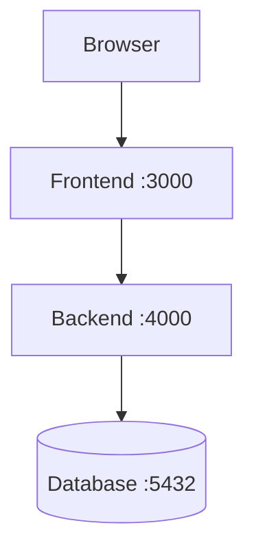
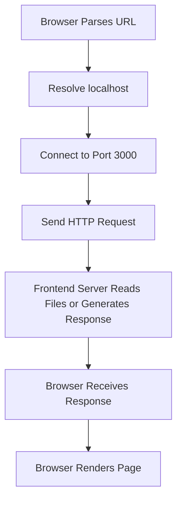
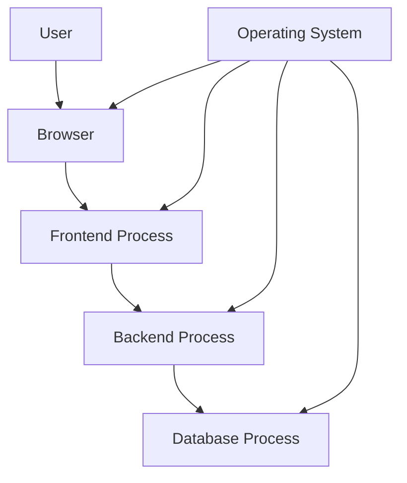

# Update for `primer-01-computer-concepts.md`

Add the following section to the end of the existing file.

---

# Answer Key

## Section 1 — Multiple-Choice Answers

| Question | Answer | Explanation |
|---:|---|---|
| 1 | A CPU | A CPU is a physical hardware component. |
| 2 | A browser application | A browser is software. |
| 3 | Manage hardware and provide services to applications | The operating system manages processes, memory, files, devices, and networking. |
| 4 | CPU | The CPU executes program instructions. |
| 5 | Temporary working memory used by running programs | RAM is fast but normally loses its contents when power is removed. |
| 6 | It retains data after the computer is turned off | Persistent storage includes SSDs, hard drives, and other durable storage. |
| 7 | A set of instructions stored for execution | A program is generally stored on disk before it runs. |
| 8 | A running instance of a program | A process is an executing program. |
| 9 | `src/` | The trailing slash conventionally indicates a directory. |
| 10 | `app.js` | `.js` commonly identifies a JavaScript file. |
| 11 | Manages files, directories, and file metadata | A filesystem organizes stored data. |
| 12 | Prints the current working directory | `pwd` means “print working directory.” |
| 13 | Changes the current directory | `cd` means “change directory.” |
| 14 | An absolute filesystem path | It begins at the filesystem root. |
| 15 | `src/app.js` | It is interpreted relative to the current directory. |
| 16 | The parent directory | `..` refers to the directory above the current one. |
| 17 | A text-based interface for interacting with a computer | A terminal provides a place to enter commands. |
| 18 | A program that interprets and executes commands | The shell reads commands and invokes programs. |
| 19 | Bash | Bash is a command shell. |
| 20 | A named configuration value for processes | Environment variables provide runtime configuration. |
| 21 | `PORT=3000` | This is a typical environment-variable assignment. |
| 22 | A service or application on a networked system | A port identifies a listening service. |
| 23 | A local service running on port `3000` | `localhost` refers to the current computer. |
| 24 | The current computer | `localhost` is the local machine. |
| 25 | It is an IPv4 loopback address for the local machine | `127.0.0.1` normally refers back to the current computer. |
| 26 | A long-running process that provides a capability | Examples include web servers and database servers. |
| 27 | PostgreSQL | PostgreSQL commonly uses port `5432`. |
| 28 | Give each user or process only the permissions it needs | This is the principle of least privilege. |
| 29 | Read | Read permission allows a file’s contents to be viewed. |
| 30 | It reduces the consequences of bugs or compromise | Restricted privileges limit potential damage. |

---

## Section 2 — True or False Answers

| Question | Answer | Explanation |
|---:|---|---|
| 31 | True | A browser is software running through an operating system on hardware. |
| 32 | False | RAM is temporary working memory; storage preserves data. |
| 33 | False | A program must be started before it becomes a running process. |
| 34 | True | A process is a running instance of a program. |
| 35 | True | The operating system schedules processes and manages resources. |
| 36 | True | Relative paths are interpreted from the current working directory. |
| 37 | False | A path beginning with `/` is absolute on Unix-like systems. |
| 38 | False | A terminal is an interface; a shell interprets commands inside it. |
| 39 | True | A port identifies a service on a networked system. |
| 40 | True | `localhost` normally refers to the current computer. |
| 41 | False | A localhost service is normally accessible only from the same machine. |
| 42 | True | Environment variables may contain passwords, tokens, and other secrets. |
| 43 | False | A `.env` file may contain secrets and should not automatically be committed. |
| 44 | True | Separate processes can run on the same computer and communicate locally. |
| 45 | True | A process can listen on a port and accept network requests. |

---

# Section 3 — Short-Answer Model Answers

## Question 46

Hardware is the physical equipment of a computer, such as the CPU, memory, storage, keyboard, and network card. Software is the set of instructions and data that runs on the hardware, such as an operating system, browser, or web server.

---

## Question 47

The operating system manages hardware and provides services to applications. It manages processes, memory, files, permissions, devices, networking, and system resources.

---

## Question 48

RAM is temporary working memory used by running programs. Persistent storage, such as an SSD or hard drive, stores data for longer periods and generally preserves it when the computer is turned off.

---

## Question 49

A program is a set of instructions stored on disk. A process is a running instance of that program.

---

## Question 50

An application may create multiple processes for isolation, parallel work, responsiveness, security, or managing separate tasks. A browser, for example, may use separate processes for tabs, extensions, or rendering.

---

## Question 51

A filesystem organizes data into files, directories, paths, and metadata. It provides a way for applications and the operating system to store and retrieve information.

---

## Question 52

A file contains data, such as text, source code, an image, or a log. A directory or folder organizes files and other directories.

---

## Question 53

An absolute path begins from the filesystem root or drive and identifies a location independently of the current directory. A relative path is interpreted from the current working directory.

Example:

```text
Absolute:
  /home/alex/project/src/app.js

Relative:
  src/app.js
```

---

## Question 54

The current working directory affects how relative paths are interpreted, where files are created, and which project configuration files commands find.

---

## Question 55

A terminal is the interface window where commands are entered. A shell is the program inside the terminal that interprets commands and starts other programs.

---

## Question 56

The shell reads the command, interprets its options and arguments, locates the requested program, asks the operating system to run it, and displays the program’s output and errors.

---

## Question 57

An environment variable is a named value provided to a process by the operating system or execution environment. It is commonly used for configuration such as ports, API URLs, environment names, and credentials.

---

## Question 58

A production secret placed in frontend configuration may be included in JavaScript or other files downloaded by the browser. Users can inspect those files, so the secret would no longer be private.

---

## Question 59

A port identifies a service or application on a networked system. For example, a backend may listen on port `4000`.

---

## Question 60

An IP address identifies a network destination. A port identifies a service on that destination.

```text
203.0.113.10:443
```

Here:

```text
203.0.113.10 = IP address
443           = port
```

---

## Question 61

`localhost` normally refers to the current computer. A URL such as `http://localhost:3000` usually targets a service running locally on port `3000`.

---

## Question 62

The service may listen only on the local loopback interface, such as `127.0.0.1`, rather than on a network-accessible interface. A firewall may also block access.

---

## Question 63

A service is generally a long-running process that provides a capability, such as serving HTTP requests, accepting database queries, or processing background jobs.

---

## Question 64

Least privilege reduces risk by limiting what a user, process, or service can access. If that identity is compromised or contains a bug, the potential damage is reduced.

---

## Question 65

Restricted permissions prevent unauthorized users or processes from reading, modifying, deleting, or executing files. They are especially important for secrets, configuration, application code, and uploaded files.

---

# Section 4 — Path Exercise Answers

## Question 66

```text
/home/alex/web-learning/src/app.js
```

---

## Question 67

```text
/home/alex
```

The `..` component moves from:

```text
/home/alex/web-learning
```

to its parent:

```text
/home/alex
```

---

## Question 68

```text
/home/alex/web-learning/frontend
```

The `.` means the current directory.

---

## Question 69

From:

```text
/home/alex/web-learning/frontend
```

to:

```text
/home/alex/web-learning/backend
```

the relative path is:

```text
../backend
```

---

## Question 70

```text
/products/123
```

is a URL path or application route.

```text
/home/alex/project/products/123
```

is an absolute filesystem path on a Unix-like system.

They may look similar, but they belong to different systems.

---

## Question 71

```text
/etc/nginx/nginx.conf
```

is a filesystem path identifying a configuration file on a Unix-like computer.

```text
/api/products/123
```

is a URL or HTTP route path. It may be handled dynamically by an application and does not necessarily correspond to a physical file.

---

# Section 5 — Command Interpretation Answers

## Question 72

```bash
pwd
```

Prints the current working directory.

---

## Question 73

```bash
ls -la
```

Lists files and directories in detail, including hidden files.

---

## Question 74

```bash
cd ..
```

Moves from the current directory to its parent directory.

---

## Question 75

```bash
mkdir -p project/src
```

Creates the `project/src` directory structure. The `-p` option creates missing parent directories as needed.

---

## Question 76

```bash
touch notes.txt
```

Creates an empty `notes.txt` file if it does not exist. If the file already exists, it may update its modification timestamp.

---

## Question 77

```bash
cat README.md
```

Displays the contents of `README.md` in the terminal.

---

## Question 78

```bash
grep -R "error" .
```

Recursively searches from the current directory for lines containing the text `error`.

---

## Question 79

```bash
tail -f server.log
```

Displays the end of `server.log` and continues showing new lines as they are appended. Press `Ctrl + C` to stop following the file.

---

## Question 80

```bash
curl -i http://localhost:3000
```

Sends an HTTP request to a local service on port `3000` and includes the response headers in the output.

---

## Question 81

```bash
ps aux | grep node
```

Lists running processes, then filters the output for lines containing `node`.

---

## Question 82

```bash
lsof -i :3000
```

Shows processes using network port `3000`, where supported.

---

## Question 83

```bash
export PORT=4000
```

Sets an environment variable named `PORT` to `4000` for the current shell and processes started from it.

---

## Question 84

```bash
echo "$PORT"
```

Prints the current value of the `PORT` environment variable.

---

# Section 6 — Scenario Model Answers

## Question 85 — Port Already in Use

This usually means another process is already listening on port `3000`.

Possible causes:

- Another development server is running.
- A previous process did not shut down.
- Another application uses the port.
- A container is exposing the port.

Inspect it with:

```bash
lsof -i :3000
```

or:

```bash
ss -ltnp
```

On Windows:

```powershell
netstat -ano
```

Then stop the correct process or configure the application to use another port.

---

## Question 86 — Localhost Connection Failure

Possible causes:

- The development server is not running.
- The server is listening on a different port.
- The process crashed.
- The service is bound to a different interface.
- A firewall is blocking the connection.
- The URL or port is incorrect.
- The server is using HTTPS instead of HTTP.

Useful checks:

```bash
curl -v http://localhost:3000
```

```bash
lsof -i :3000
```

Check the terminal where the server was started for errors.

---

## Question 87 — Wrong Directory

The command may be running outside the project directory.

Check:

```bash
pwd
ls -la
```

Look for the project configuration file, such as:

```text
package.json
pyproject.toml
Cargo.toml
```

Move into the correct directory before running the command:

```bash
cd path/to/project
```

---

## Question 88 — Environment Variable Missing

Possible causes:

- The variable was never set.
- The application was started from another shell.
- The `.env` file is in the wrong directory.
- The framework does not automatically load `.env`.
- The variable name is misspelled.
- The process was not restarted after configuration changed.
- The service manager has a different environment.

Check configuration without printing secrets:

```text
Confirm that the variable exists.
Confirm the correct environment file is loaded.
Confirm the process was restarted.
Confirm the application reads the expected variable name.
```

---

## Question 89 — Permission Denied

Possible causes:

- The file belongs to another user.
- The application user lacks read permission.
- A parent directory cannot be traversed.
- The file is protected by a security policy.
- The service runs as a different user than the terminal command.
- The file path is incorrect.

Inspect:

```bash
ls -l config.json
```

Also inspect parent directories and the user running the process.

The long-term solution should be correct ownership and permissions, not always running the application as root.

---

## Question 90 — Application Works Manually but Not as a Service

Possible differences include:

- Different working directory
- Different environment variables
- Different `PATH`
- Different user
- Different permissions
- Different Node/Python/runtime version
- Different relative paths
- Missing network access
- Service starts before a dependency is ready
- Logs are going somewhere else

Inspect:

```bash
systemctl status my-app
journalctl -u my-app
```

Compare the service configuration with the manual command.

---

## Question 91 — Database Process

The backend depends on the database process for database operations.

If the database is stopped:

```text
Backend may still start.
Database queries fail.
API requests may return errors.
Health checks may become unhealthy.
```

The backend should handle the failure safely and return an appropriate response rather than exposing raw database errors.

---

## Question 92 — Public Exposure

Binding to:

```text
127.0.0.1:3000
```

usually allows access only from the same computer.

Binding to:

```text
0.0.0.0:3000
```

usually listens on all IPv4 interfaces, which may allow other devices on the network to connect if firewall rules permit it.

A development server bound to all interfaces may expose:

- Debug tools
- Test data
- Source code
- Unfinished functionality
- Unprotected API endpoints

Use this setting deliberately.

---

## Question 93 — Full Disk

A full disk can prevent the system from writing:

- Logs
- Uploads
- Temporary files
- Database data
- Deployment artifacts

Inspect:

```bash
df -h
```

Find large directories:

```bash
du -sh /var/log/*
```

Check log rotation, temporary files, database growth, and storage capacity before deleting anything.

---

## Question 94 — High Memory Usage

Possible causes include:

- Memory leak
- Large cache
- Too many workers
- Large request or response
- Unbounded queue
- Database workload
- Traffic increase
- Processing large files

Inspect:

```bash
top
```

```bash
free -h
```

Check application metrics, recent deployments, traffic levels, and garbage-collection or runtime logs where available.

---

## Question 95 — Root Privileges

Running everything with `sudo` can:

- Hide ownership problems
- Create root-owned files
- Allow applications to modify sensitive system resources
- Increase the consequences of vulnerabilities
- Cause future deployment problems

Use a restricted service user and grant only the necessary permissions.

---

# Section 7 — Architecture Model Answers

## Question 96



Interpretation:

```text
Port 3000:
  Frontend development server

Port 4000:
  Backend API server

Port 5432:
  PostgreSQL database, commonly
```

These are conventions. The actual services may use different ports.

---

## Question 97

Processes can communicate through operating-system networking even when they run on the same computer.

For example:

```text
Browser → localhost:3000
Frontend → localhost:4000
Backend → localhost:5432
```

The client-server relationship is logical and protocol-based; the machines do not have to be physically separate.

---

## Question 98

A high-level sequence is:



---

## Question 99

Keeping the database behind the backend helps protect:

- Database credentials
- Private data
- Business rules
- Authorization logic
- Query structure
- Database schema

The backend provides a controlled interface and validates every request.

---

## Question 100

The operating system manages resources such as:

```text
CPU time
Memory
Files
Permissions
Network connections
Environment variables
Input and output
Process lifecycle
```

---

## Question 101

The reverse proxy can:

- Accept public HTTPS traffic
- Handle certificates
- Serve static files
- Forward API requests
- Apply rate limits
- Log requests
- Hide internal ports

The application can remain private on a loopback or private network address.

---

## Question 102

The reverse proxy may continue running but be unable to reach the application.

Possible results:

```text
502 Bad Gateway
503 Service Unavailable
504 Gateway Timeout
```

The reverse proxy logs and application service logs should be inspected.

---

## Question 103

The backend may remain available but database operations will fail.

Possible results:

```text
500 Internal Server Error
503 Service Unavailable
504 Gateway Timeout
```

Depending on design, health or readiness checks may remove the backend from service.

---

## Question 104

Different operating-system users limit access between services.

For example:

```text
Web server user:
  Web files and selected upload directory

Database user:
  Database files

Worker user:
  Queue and object-storage access
```

If one service is compromised, least privilege limits its ability to damage other components.

---

## Question 105

Different resources have different access requirements.

Example:

```text
Application code:
  Readable but not generally writable

Configuration:
  Readable only by the application user

Uploads:
  Writable by the application, but not executable

Logs:
  Writable by the logging process

Secrets:
  Restricted to the smallest necessary group
```

Separating permissions reduces accidental and malicious access.

---

# Section 8 — Practical Exercise Expected Results

## Exercise 1 — Inspect Your System

There is no single correct output.

You should be able to identify:

```text
Current working directory
Visible files
Hidden files
Directories
```

Example commands:

```bash
pwd
ls -la
```

---

## Exercise 2 — Create a Practice Project

Expected structure:

```text
computer-concepts-practice/
├── frontend/
├── backend/
├── docs/
└── README.md
```

Verify with:

```bash
find computer-concepts-practice -maxdepth 2 -print
```

or the equivalent command for your operating system.

---

## Exercise 3 — Relative Paths

After:

```bash
cd frontend
```

the current directory should be:

```text
.../computer-concepts-practice/frontend
```

After:

```bash
cd ..
```

the current directory should be:

```text
.../computer-concepts-practice
```

The `..` component refers to the parent directory.

---

## Exercise 4 — Local Server

For:

```bash
python -m http.server 8000
```

expected values include:

```text
HTTP method:
  GET

Host:
  localhost

Port:
  8000

Path:
  /

Expected status:
  Usually 200 if the server can return a directory listing or index file

Content type:
  Often text/html for a directory listing
```

The exact response may vary depending on the files in the directory and Python version.

---

## Exercise 5 — Inspect the Port

The process running the Python server should appear as the process listening on port `8000`.

The exact command output differs by operating system.

After pressing:

```text
Ctrl + C
```

the process stops and port `8000` should no longer be served by that process.

---

## Exercise 6 — Environment Variables

The value should be:

```text
APP_NAME=Computer Concepts Practice
```

The variable is available to the current shell and child processes started from that shell.

It may not be available in a new terminal unless configured there too.

---

## Exercise 7 — Growing Log

`tail -f` remains active and displays new lines appended to the file.

After adding:

```text
WARN retrying connection
```

the line should appear in the active output.

Press:

```text
Ctrl + C
```

to stop following the file.

---

# Section 9 — Review Challenge Answers

## Question 106



Interpretation:

```text
User:
  Interacts with the system.

Browser:
  Runs client-side code and displays the interface.

Frontend process:
  May serve or build frontend resources during development.

Backend process:
  Handles API requests and business logic.

Database process:
  Stores and retrieves persistent data.

Operating system:
  Runs and manages all processes and their resources.
```

---

## Question 107

```text
localhost:
  Hostname referring to the current computer.

127.0.0.1:
  IPv4 loopback address for the current computer.

0.0.0.0:
  Common server-binding address meaning all IPv4 interfaces.
```

`0.0.0.0` is usually not used as a destination address for a client request.

---

## Question 108

Possible reasons include:

- Wrong ownership
- Missing read permission
- Parent directory cannot be traversed
- Service runs as a different user
- Incorrect path
- Security policy
- File is encrypted or unavailable
- Application is running in a container with a different filesystem

---

## Question 109

Possible differences include:

```text
Working directory
Environment variables
User
Permissions
PATH
Runtime version
Relative paths
Network access
Startup order
```

A service manager creates a different execution environment from an interactive terminal.

---

## Question 110

A process can run in the background or as a service without a visible application window. It may still hold a port open.

Find it with:

```bash
lsof -i :3000
```

or:

```bash
ss -ltnp
```

---

## Question 111

Restricted users reduce the damage caused by:

- Application vulnerabilities
- Compromised dependencies
- Malicious uploads
- Incorrect file operations
- Stolen service credentials

---

## Question 112

```text
Program:
  Instructions stored on disk.

Process:
  Running instance of a program.

Service:
  Usually a long-running process that provides a capability.

Port:
  Network endpoint identifying a service on a host.
```

Example:

```text
server.js:
  Program source

node server.js:
  Running process

Backend API:
  Service capability

localhost:4000:
  Host and port where the service listens
```

---

# Final Review Rubric

Use this rubric to evaluate short answers, scenarios, and architecture questions.

## Excellent

The answer:

```text
Uses correct terminology
Explains cause and effect
Identifies the relevant operating-system or network layer
Mentions practical evidence or commands
Recognizes security implications
```

## Good

The answer:

```text
Identifies the main concept correctly
Provides a mostly accurate explanation
May omit deeper operational details
```

## Developing

The answer:

```text
Shows partial understanding
Confuses related concepts
Needs more detail or a practical example
```

## Needs Review

The answer:

```text
Misidentifies the core concept
Relies on incorrect assumptions
Does not distinguish files, processes, ports, or environments
```

---

# Recommended Review Topics

If you scored below approximately 75%, revisit the relevant sections before continuing.

```text
Computer architecture:
  Primer 1, Sections 1–12

Files and paths:
  Primer 1, Sections 13–27
  Primer 2, Sections 8–25

Processes and ports:
  Primer 1, Sections 7–10 and 43–50
  Primer 11, Sections 13–36

Environment variables:
  Primer 1, Sections 38–42
  Primer 2, Sections 36–39

Command-line operations:
  Primer 2

Networking and local services:
  Primer 2, Sections 40–45
  Primer 11, Sections 22–31
```

That completes the updated **`primer-01-computer-concepts.md`** with answer keys, model answers, practical exercise guidance, and a review rubric.
