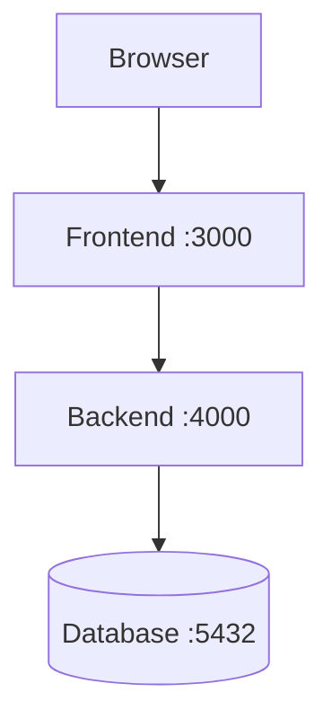
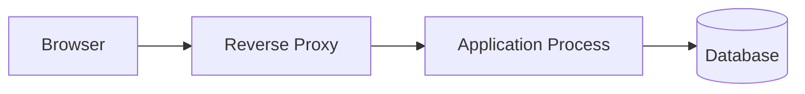
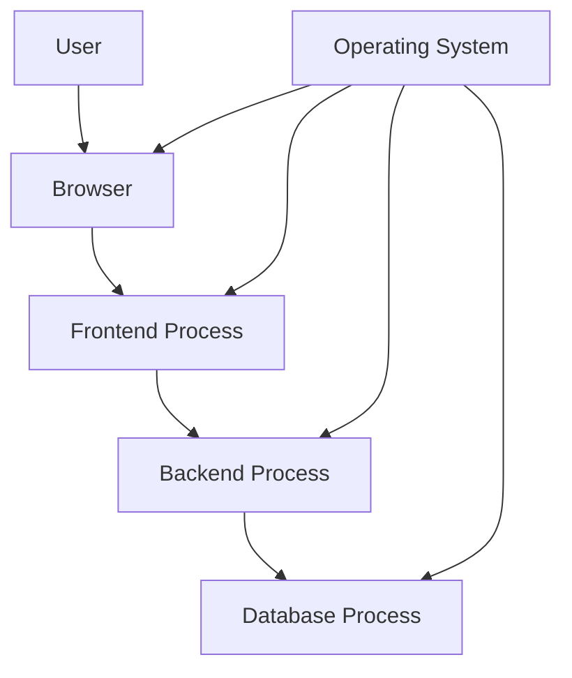

# Primer 1 Quiz — Basic Computer Concepts

## Web Mechanics, Architecture & Network Fundamentals

This quiz reviews the concepts introduced in:

> **Primer 1 — Basic Computer Concepts for Web Learners**

It focuses on:

- Hardware and software
- Operating systems
- CPUs
- Memory and storage
- Files and folders
- Programs and processes
- Terminals and shells
- Paths
- Permissions
- Environment variables
- Ports
- Localhost
- Services
- Local development systems

---

## Instructions

- Try to answer the questions before checking any answer key.
- Explain your reasoning for short-answer and scenario questions.
- Use a terminal for the practical exercises.
- Do not run destructive commands on important files or systems.
- This quiz assumes no previous Linux or command-line experience.

---

## Learning Objectives

After completing this quiz, you should be able to:

- Explain the difference between hardware and software.
- Describe the role of an operating system.
- Distinguish RAM from persistent storage.
- Explain the difference between a program and a process.
- Understand files, folders, and paths.
- Distinguish relative paths from absolute paths.
- Explain what a terminal and shell do.
- Describe environment variables.
- Explain ports and localhost.
- Understand how local frontend, backend, and database processes communicate.
- Recognize the importance of permissions and least privilege.

---

# Section 1 — Multiple-Choice Questions

## Question 1

Which of the following is hardware?

- [ ] A web browser
- [ ] A database query
- [ ] A CPU
- [ ] An environment variable

---

## Question 2

Which of the following is software?

- [ ] A keyboard
- [ ] A monitor
- [ ] A browser application
- [ ] A network cable

---

## Question 3

What is the primary role of an operating system?

- [ ] To design website layouts
- [ ] To manage hardware and provide services to applications
- [ ] To replace the database
- [ ] To encrypt every file automatically

---

## Question 4

Which component executes program instructions?

- [ ] CPU
- [ ] Folder
- [ ] URL
- [ ] Port

---

## Question 5

Which statement best describes RAM?

- [ ] It stores data permanently even when the computer is turned off.
- [ ] It is temporary working memory used by running programs.
- [ ] It is a network address.
- [ ] It is a type of database table.

---

## Question 6

Which statement best describes persistent storage?

- [ ] It holds information only while a program is running.
- [ ] It is used only for CPU instructions.
- [ ] It retains data after the computer is turned off.
- [ ] It is the same thing as a process.

---

## Question 7

What is a program?

- [ ] A running instance of an application
- [ ] A set of instructions stored for execution
- [ ] A network port
- [ ] A folder containing logs

---

## Question 8

What is a process?

- [ ] A file that has never been opened
- [ ] A running instance of a program
- [ ] A physical storage device
- [ ] A DNS record

---

## Question 9

Which of the following is a directory or folder?

- [ ] `src/`
- [ ] `app.js`
- [ ] `3000`
- [ ] `true`

---

## Question 10

Which of the following is most likely a JavaScript file?

- [ ] `styles.css`
- [ ] `app.js`
- [ ] `logo.png`
- [ ] `README.md`

---

## Question 11

What does a filesystem do?

- [ ] Manages files, directories, and file metadata
- [ ] Converts domain names into IP addresses
- [ ] Renders HTML
- [ ] Encrypts every HTTP request

---

## Question 12

What does the command `pwd` commonly do on Unix-like systems?

- [ ] Deletes the current directory
- [ ] Prints the current working directory
- [ ] Starts a web server
- [ ] Displays running processes

---

## Question 13

What does `cd` generally do?

- [ ] Change the current directory
- [ ] Copy a database
- [ ] Compress a file
- [ ] Display a webpage

---

## Question 14

What does the following path represent?

```text
/home/alex/project/src/app.js
```

- [ ] A relative URL
- [ ] An absolute filesystem path
- [ ] An HTTP response
- [ ] A database query

---

## Question 15

Which path is relative?

- [ ] `/home/alex/project/app.js`
- [ ] `C:\Users\Alex\project\app.js`
- [ ] `src/app.js`
- [ ] `/etc/nginx/nginx.conf`

---

## Question 16

What does `..` commonly represent in a path?

- [ ] The current directory
- [ ] The parent directory
- [ ] The filesystem root
- [ ] A hidden file

---

## Question 17

What is a terminal?

- [ ] A physical CPU component
- [ ] A text-based interface for interacting with a computer
- [ ] A database table
- [ ] A browser cache

---

## Question 18

What is a shell?

- [ ] A program that interprets and executes commands
- [ ] A type of hard drive
- [ ] A web page
- [ ] A network cable

---

## Question 19

Which of the following is an example of a shell?

- [ ] Bash
- [ ] PostgreSQL
- [ ] HTML
- [ ] Ethernet

---

## Question 20

What is the purpose of an environment variable?

- [ ] To store named configuration values for processes
- [ ] To display images
- [ ] To replace the operating system
- [ ] To define HTML headings

---

## Question 21

Which of the following could be an environment variable?

- [ ] `PORT=3000`
- [ ] `button`
- [ ] `SELECT * FROM users`
- [ ] `192.168.1.1` only

---

## Question 22

What does a network port identify?

- [ ] A physical keyboard key
- [ ] A service or application on a networked system
- [ ] A folder
- [ ] A CSS selector

---

## Question 23

What does this address commonly represent?

```text
http://localhost:3000
```

- [ ] A remote database only
- [ ] A local service running on port `3000`
- [ ] A filesystem path
- [ ] A DNS root server

---

## Question 24

What does `localhost` usually refer to?

- [ ] The nearest cloud provider
- [ ] The current computer
- [ ] The public Internet
- [ ] A database table

---

## Question 25

Which statement about `127.0.0.1` is generally correct?

- [ ] It is an IPv4 loopback address for the local machine.
- [ ] It is always a public production server.
- [ ] It is a database password.
- [ ] It is a file permission value.

---

## Question 26

What is a service?

- [ ] A long-running process that provides a capability
- [ ] A CSS rule
- [ ] A directory name
- [ ] A temporary keyboard shortcut

---

## Question 27

Which process might listen on port `5432`?

- [ ] PostgreSQL
- [ ] A CSS stylesheet
- [ ] A PNG image
- [ ] A text editor document

---

## Question 28

What does least privilege mean?

- [ ] Give every program administrator access.
- [ ] Give each user or process only the permissions it needs.
- [ ] Remove all permissions from every file.
- [ ] Allow any browser to access every database.

---

## Question 29

Which permission allows a program to view the contents of a file?

- [ ] Read
- [ ] Write
- [ ] Execute
- [ ] Route

---

## Question 30

Why should a web application usually not run with unrestricted administrator privileges?

- [ ] It makes the webpage more colorful.
- [ ] It reduces the consequences of bugs or compromise.
- [ ] It makes DNS unnecessary.
- [ ] It prevents all network access.

---

# Section 2 — True or False

Mark each statement as true or false.

## Question 31

A browser is software running on hardware through an operating system.

- [ ] True
- [ ] False

---

## Question 32

RAM and persistent storage serve exactly the same purpose.

- [ ] True
- [ ] False

---

## Question 33

A program stored on disk is automatically a running process.

- [ ] True
- [ ] False

---

## Question 34

A process is a running instance of a program.

- [ ] True
- [ ] False

---

## Question 35

The operating system manages processes and allocates resources such as CPU time and memory.

- [ ] True
- [ ] False

---

## Question 36

A relative path is interpreted based on the current working directory.

- [ ] True
- [ ] False

---

## Question 37

The path `/home/alex/project/app.js` is relative.

- [ ] True
- [ ] False

---

## Question 38

A terminal and a shell are exactly the same thing.

- [ ] True
- [ ] False

---

## Question 39

A port identifies a service on a networked system.

- [ ] True
- [ ] False

---

## Question 40

`localhost` usually refers to the current computer.

- [ ] True
- [ ] False

---

## Question 41

A development server running on `localhost` is automatically accessible from anywhere on the Internet.

- [ ] True
- [ ] False

---

## Question 42

Environment variables can contain sensitive values.

- [ ] True
- [ ] False

---

## Question 43

A `.env` file is automatically safe to commit to a public repository.

- [ ] True
- [ ] False

---

## Question 44

A database server and a backend application may run as separate processes on the same computer.

- [ ] True
- [ ] False

---

## Question 45

A process can listen on a network port and accept requests.

- [ ] True
- [ ] False

---

# Section 3 — Short-Answer Questions

Answer each question in one or more complete sentences.

## Question 46

What is the difference between hardware and software?

---

## Question 47

What does the operating system provide to applications?

---

## Question 48

Explain the difference between RAM and persistent storage.

---

## Question 49

What is the difference between a program and a process?

---

## Question 50

Why might one application create multiple processes?

---

## Question 51

What is a filesystem?

---

## Question 52

What is the difference between a file and a directory?

---

## Question 53

What is the difference between an absolute path and a relative path?

---

## Question 54

What does the current working directory affect?

---

## Question 55

What is the difference between a terminal and a shell?

---

## Question 56

What happens when you run a command in a terminal?

---

## Question 57

What is an environment variable?

---

## Question 58

Why should production secrets not be placed in frontend environment variables?

---

## Question 59

What is a port?

---

## Question 60

What is the difference between a port and an IP address?

---

## Question 61

What does `localhost` mean?

---

## Question 62

Why might a service work at `localhost:3000` but not be reachable from another device?

---

## Question 63

What is a service?

---

## Question 64

Why is least privilege important?

---

## Question 65

Why should applications have restricted file permissions?

---

# Section 4 — Path Exercises

Assume the current working directory is:

```text
/home/alex/web-learning
```

## Question 66

What absolute path does this relative path refer to?

```text
src/app.js
```

---

## Question 67

What directory does this path refer to?

```text
../
```

---

## Question 68

What does this path refer to?

```text
./frontend
```

---

## Question 69

What is the relative path from:

```text
/home/alex/web-learning/frontend
```

to:

```text
/home/alex/web-learning/backend
```

---

## Question 70

What is the difference between these two paths?

```text
/products/123
```

```text
/home/alex/project/products/123
```

---

## Question 71

Which of the following is a filesystem path and which is a URL path?

```text
/etc/nginx/nginx.conf
```

```text
/api/products/123
```

Explain the difference.

---

# Section 5 — Command Interpretation

Explain what each command is intended to do.

## Question 72

```bash
pwd
```

---

## Question 73

```bash
ls -la
```

---

## Question 74

```bash
cd ..
```

---

## Question 75

```bash
mkdir -p project/src
```

---

## Question 76

```bash
touch notes.txt
```

---

## Question 77

```bash
cat README.md
```

---

## Question 78

```bash
grep -R "error" .
```

---

## Question 79

```bash
tail -f server.log
```

---

## Question 80

```bash
curl -i http://localhost:3000
```

---

## Question 81

```bash
ps aux | grep node
```

---

## Question 82

```bash
lsof -i :3000
```

---

## Question 83

```bash
export PORT=4000
```

---

## Question 84

```bash
echo "$PORT"
```

---

# Section 6 — Scenario Questions

## Question 85 — Port Already in Use

You try to start a development server:

```text
Error: Port 3000 is already in use.
```

What might this mean?

What would you inspect next?

---

## Question 86 — Localhost Connection Failure

You open:

```text
http://localhost:3000
```

but the browser reports that the connection was refused.

What are several possible causes?

---

## Question 87 — Wrong Directory

You run:

```bash
npm install
```

but the command reports that it cannot find the project configuration file.

What might be wrong?

---

## Question 88 — Environment Variable Missing

A backend starts successfully but later reports:

```text
DATABASE_URL is undefined
```

What could cause this?

What would you check?

---

## Question 89 — Permission Denied

A web application reports:

```text
Permission denied: cannot read config.json
```

What are possible causes?

What should you inspect?

---

## Question 90 — Application Works Manually but Not as a Service

You run:

```bash
node server.js
```

and the application works.

When started through the operating system’s service manager, it fails.

What differences might explain the problem?

---

## Question 91 — Database Process

Your backend starts, but every database request fails.

The database process is not running.

What relationship between processes explains the failure?

---

## Question 92 — Public Exposure

A developer starts a local development server and binds it to:

```text
0.0.0.0:3000
```

What might this change compared with:

```text
127.0.0.1:3000
```

What security consideration should they understand?

---

## Question 93 — Full Disk

A production server suddenly cannot write logs or upload files.

What system-level problem might cause this?

What commands or evidence would you inspect?

---

## Question 94 — High Memory Usage

A backend process is using nearly all available memory.

What could cause this?

What kinds of measurements would help diagnose it?

---

## Question 95 — Root Privileges

A developer solves every permission issue by running commands with `sudo`.

Why can this be risky?

What would be a better long-term approach?

---

# Section 7 — Architecture Questions

## Question 96

Consider this local development setup:



What does each port represent?

---

## Question 97

Why can the frontend and backend be separate processes even when they run on the same computer?

---

## Question 98

What happens when the browser requests:

```text
http://localhost:3000
```

Describe the process at a high level.

---

## Question 99

Why is it useful to keep the database behind the backend instead of exposing it directly to the browser?

---

## Question 100

What resources does the operating system manage for a running backend process?

---

## Question 101

Consider this architecture:



Why might the application listen only on a private address while the reverse proxy listens publicly?

---

## Question 102

What could happen if the application process stops while the reverse proxy continues running?

---

## Question 103

What could happen if the database process stops while the backend remains running?

---

## Question 104

Why should different services often run as different operating-system users?

---

## Question 105

Why should logs, configuration files, application files, and upload directories potentially have different permissions?

---

# Section 8 — Practical Exercises

These exercises should be performed only on your own computer or an authorized test environment.

## Exercise 1 — Inspect Your Current Directory

Run:

```bash
pwd
```

or the equivalent command for your shell.

Then list files:

```bash
ls -la
```

or:

```powershell
Get-ChildItem
```

Record:

```text
Current directory:
Number of visible files:
Number of hidden files:
Number of directories:
```

---

## Exercise 2 — Create a Practice Project

Create:

```text
computer-concepts-practice/
├── frontend/
├── backend/
├── docs/
└── README.md
```

Unix-like example:

```bash
mkdir -p computer-concepts-practice/{frontend,backend,docs}
touch computer-concepts-practice/README.md
```

PowerShell example:

```powershell
mkdir computer-concepts-practice
mkdir computer-concepts-practice/frontend
mkdir computer-concepts-practice/backend
mkdir computer-concepts-practice/docs
New-Item computer-concepts-practice/README.md
```

---

## Exercise 3 — Work with Relative Paths

Move into the project:

```bash
cd computer-concepts-practice
```

Create a file:

```bash
echo "Frontend notes" > frontend/notes.txt
```

Read it:

```bash
cat frontend/notes.txt
```

Move into the frontend directory:

```bash
cd frontend
```

Return to the project root:

```bash
cd ..
```

Explain what `..` did.

---

## Exercise 4 — Run a Local Server

From a practice directory, run:

```bash
python -m http.server 8000
```

Open:

```text
http://localhost:8000
```

In another terminal, run:

```bash
curl -i http://localhost:8000
```

Record:

```text
HTTP method:
Host:
Port:
Path:
Status code:
Content type:
```

Stop the server with:

```text
Ctrl + C
```

---

## Exercise 5 — Inspect the Port

Start the server again:

```bash
python -m http.server 8000
```

Then inspect listening ports:

```bash
ss -ltnp
```

or:

```bash
lsof -i :8000
```

On Windows:

```powershell
netstat -ano
```

Find the process associated with port `8000`.

---

## Exercise 6 — Environment Variables

Unix-like shell:

```bash
export APP_NAME="Computer Concepts Practice"
echo "$APP_NAME"
```

PowerShell:

```powershell
$env:APP_NAME = "Computer Concepts Practice"
Write-Output $env:APP_NAME
```

Answer:

```text
What value was stored?
Which process can access it?
How long does it remain available?
```

---

## Exercise 7 — Read a Growing Log

Create a log file:

```bash
echo "INFO server started" > practice.log
```

Follow it:

```bash
tail -f practice.log
```

In another terminal, append a line:

```bash
echo "WARN example message" >> practice.log
```

Observe the new line.

Stop following the log:

```text
Ctrl + C
```

---

## Exercise 8 — Inspect a Process

Start a long-running command:

```bash
python -m http.server 8000
```

Find it:

```bash
ps aux | grep python
```

Stop it with:

```text
Ctrl + C
```

Answer:

```text
What was the process?
Which user ran it?
Which port did it use?
What happened after it stopped?
```

---

# Section 9 — Review Challenge

Answer without looking back at the primer.

## Question 106

Explain this diagram:



---

## Question 107

Explain the difference between:

```text
localhost
127.0.0.1
0.0.0.0
```

---

## Question 108

Why might a file exist on disk but not be accessible to a web application?

---

## Question 109

Why might a backend process work when started from a terminal but fail when started by a service manager?

---

## Question 110

Explain why a port can be “in use” even if you do not see a visible application window.

---

## Question 111

Why should production applications use restricted operating-system users?

---

## Question 112

What is the relationship between:

```text
Program
Process
Service
Port
```

---

# Section 10 — Self-Assessment

Rate each statement from 1 to 5:

```text
1 = I do not understand this yet.
5 = I can explain and demonstrate this confidently.
```

```text
[ ] I can explain hardware and software.
[ ] I can explain what an operating system does.
[ ] I understand RAM versus storage.
[ ] I understand program versus process.
[ ] I can navigate directories.
[ ] I understand absolute and relative paths.
[ ] I can read basic terminal commands.
[ ] I understand pipes and redirection.
[ ] I understand exit codes.
[ ] I can inspect a running process.
[ ] I can identify a port.
[ ] I understand localhost.
[ ] I understand environment variables.
[ ] I understand basic permissions.
[ ] I understand services.
[ ] I can describe a local frontend/backend/database setup.
```

---

# Suggested Review Topics

If you struggled with:

## Hardware and operating systems

Review:

```text
Primer 1 — Sections 1–12
```

## Files, paths, and permissions

Review:

```text
Primer 1 — Sections 13–27
Primer 2 — Command-Line Fundamentals
```

## Processes and services

Review:

```text
Primer 1 — Sections 7–10
Primer 11 — Linux and Server Basics
```

## Ports and local services

Review:

```text
Primer 1 — Sections 43–50
Primer 2 — Sections 34–45
Primer 11 — Sections 22–31
```

## Environment variables

Review:

```text
Primer 1 — Sections 38–42
Primer 2 — Sections 36–39
```

---

# Completion Criteria

You are ready to continue when you can:

```text
Explain the difference between a program and a process.
Navigate a project with relative and absolute paths.
Run a local server.
Identify which port it uses.
Send a request to localhost.
Read basic process and server output.
Explain why permissions matter.
Explain how frontend, backend, and database processes connect.
```

