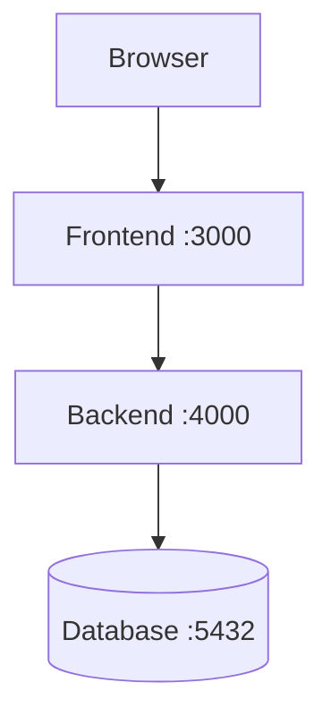

# `primer-01-computer-concepts.md`

# Primer 1 Quiz — Basic Computer Concepts  
## Files, Programs, Processes, Memory, Storage, Terminals, Networks, Ports, and Local Systems

This quiz reviews:

- Hardware and software
- Operating systems
- CPUs
- RAM and persistent storage
- Files and directories
- Programs and processes
- Terminals and shells
- Paths
- Permissions
- Environment variables
- Ports
- Localhost
- Services
- Local frontend, backend, and database processes

---

## Instructions

- Complete the quiz before reading the answer key.
- Explain your reasoning for short-answer and scenario questions.
- Use only a safe practice directory for practical exercises.
- Do not run destructive commands on important files or systems.
- Command syntax may vary between operating systems.

---

## Learning Objectives

After completing this quiz, you should be able to:

- Explain the difference between hardware and software.
- Describe the role of an operating system.
- Distinguish RAM from persistent storage.
- Explain the difference between a program and a process.
- Understand files, directories, and paths.
- Distinguish relative paths from absolute paths.
- Explain what a terminal and shell do.
- Describe environment variables.
- Explain ports and localhost.
- Understand local frontend, backend, and database processes.
- Explain why permissions and least privilege matter.

---

# Part 1 — Multiple-Choice Quiz

Choose the best answer.

## Question 1

Which of the following is hardware?

- [ ] A browser
- [ ] A database query
- [ ] A CPU
- [ ] An environment variable

---

## Question 2

Which of the following is software?

- [ ] A keyboard
- [ ] A monitor
- [ ] A browser application
- [ ] A network cable

---

## Question 3

What is the primary role of an operating system?

- [ ] To design websites
- [ ] To manage hardware and provide services to applications
- [ ] To replace a database
- [ ] To encrypt every file automatically

---

## Question 4

Which component executes program instructions?

- [ ] CPU
- [ ] Folder
- [ ] URL
- [ ] Port

---

## Question 5

Which statement best describes RAM?

- [ ] It permanently stores files after shutdown.
- [ ] It is temporary working memory used by running programs.
- [ ] It is a network address.
- [ ] It is a database table.

---

## Question 6

Which statement best describes persistent storage?

- [ ] It stores data only while a program is running.
- [ ] It is used only by the CPU.
- [ ] It keeps data after the computer is turned off.
- [ ] It is the same as a process.

---

## Question 7

What is a program?

- [ ] A running instance of an application
- [ ] A set of instructions stored for execution
- [ ] A network port
- [ ] A folder containing logs

---

## Question 8

What is a process?

- [ ] A file that has never been opened
- [ ] A running instance of a program
- [ ] A physical storage device
- [ ] A DNS record

---

## Question 9

Which of the following is most likely a directory?

- [ ] `src/`
- [ ] `app.js`
- [ ] `3000`
- [ ] `true`

---

## Question 10

Which of the following is most likely a JavaScript file?

- [ ] `styles.css`
- [ ] `app.js`
- [ ] `logo.png`
- [ ] `README.md`

---

## Question 11

What does a filesystem do?

- [ ] Organizes files, directories, paths, and metadata
- [ ] Converts domain names into IP addresses
- [ ] Renders HTML
- [ ] Encrypts HTTP requests

---

## Question 12

What does `pwd` commonly do on Unix-like systems?

- [ ] Deletes the current directory
- [ ] Prints the current working directory
- [ ] Starts a web server
- [ ] Lists all processes

---

## Question 13

What does `cd` commonly do?

- [ ] Changes the current directory
- [ ] Copies a database
- [ ] Compresses a file
- [ ] Displays a webpage

---

## Question 14

What does this path represent?

```text
/home/alex/project/src/app.js
```

- [ ] A relative URL
- [ ] An absolute filesystem path
- [ ] An HTTP response
- [ ] A database query

---

## Question 15

Which of the following is a relative path?

- [ ] `/home/alex/project/app.js`
- [ ] `C:\Users\Alex\project\app.js`
- [ ] `src/app.js`
- [ ] `/etc/nginx/nginx.conf`

---

## Question 16

What does `..` commonly represent in a path?

- [ ] The current directory
- [ ] The parent directory
- [ ] The filesystem root
- [ ] A hidden file

---

## Question 17

What is a terminal?

- [ ] A physical CPU component
- [ ] A text-based interface for interacting with a computer
- [ ] A database table
- [ ] A browser cache

---

## Question 18

What is a shell?

- [ ] A program that interprets and executes commands
- [ ] A type of hard drive
- [ ] A webpage
- [ ] A network cable

---

## Question 19

Which of the following is an example of a shell?

- [ ] Bash
- [ ] PostgreSQL
- [ ] HTML
- [ ] Ethernet

---

## Question 20

What is an environment variable?

- [ ] A named configuration value available to a process
- [ ] A type of image file
- [ ] A database table
- [ ] A CSS selector

---

## Question 21

Which could be an environment variable?

- [ ] `PORT=3000`
- [ ] `button`
- [ ] `SELECT * FROM users`
- [ ] `true` by itself

---

## Question 22

What does a network port identify?

- [ ] A keyboard key
- [ ] A service or application on a networked system
- [ ] A folder
- [ ] A CSS selector

---

## Question 23

What does this address usually represent?

```text
http://localhost:3000
```

- [ ] A remote database
- [ ] A local service running on port `3000`
- [ ] A filesystem path
- [ ] A DNS root server

---

## Question 24

What does `localhost` usually refer to?

- [ ] The nearest cloud provider
- [ ] The current computer
- [ ] The public Internet
- [ ] A database table

---

## Question 25

Which statement about `127.0.0.1` is generally correct?

- [ ] It is an IPv4 loopback address for the local machine.
- [ ] It is always a public production server.
- [ ] It is a password.
- [ ] It is a file permission value.

---

## Question 26

What is a service?

- [ ] A long-running process that provides a capability
- [ ] A CSS rule
- [ ] A directory name
- [ ] A keyboard shortcut

---

## Question 27

Which process commonly uses port `5432`?

- [ ] PostgreSQL
- [ ] A CSS stylesheet
- [ ] A PNG image
- [ ] A text document

---

## Question 28

What does least privilege mean?

- [ ] Give every program administrator access.
- [ ] Give each user or process only the permissions it needs.
- [ ] Remove all permissions from every file.
- [ ] Allow every browser to access every database.

---

## Question 29

Which permission allows a program to view a file’s contents?

- [ ] Read
- [ ] Write
- [ ] Execute
- [ ] Route

---

## Question 30

Why should a web application usually not run with unrestricted administrator privileges?

- [ ] It makes the website more colorful.
- [ ] It reduces the consequences of bugs or compromise.
- [ ] It makes DNS unnecessary.
- [ ] It prevents all network access.

---

# Part 2 — True or False

## Question 31

A browser is software running on hardware through an operating system.

- [ ] True
- [ ] False

---

## Question 32

RAM and persistent storage serve exactly the same purpose.

- [ ] True
- [ ] False

---

## Question 33

A program stored on disk is automatically a running process.

- [ ] True
- [ ] False

---

## Question 34

A process is a running instance of a program.

- [ ] True
- [ ] False

---

## Question 35

The operating system manages processes, memory, files, and devices.

- [ ] True
- [ ] False

---

## Question 36

Relative paths are interpreted using the current working directory.

- [ ] True
- [ ] False

---

## Question 37

The path `/home/alex/project/app.js` is relative.

- [ ] True
- [ ] False

---

## Question 38

A terminal and a shell are exactly the same thing.

- [ ] True
- [ ] False

---

## Question 39

A port identifies a service on a networked system.

- [ ] True
- [ ] False

---

## Question 40

`localhost` usually refers to the current computer.

- [ ] True
- [ ] False

---

## Question 41

A service running on `localhost` is automatically accessible from anywhere on the Internet.

- [ ] True
- [ ] False

---

## Question 42

Environment variables can contain sensitive values.

- [ ] True
- [ ] False

---

## Question 43

A `.env` file is automatically safe to commit to a public repository.

- [ ] True
- [ ] False

---

## Question 44

A frontend, backend, and database may run as separate processes on one computer.

- [ ] True
- [ ] False

---

## Question 45

A process can listen on a network port and accept requests.

- [ ] True
- [ ] False

---

# Part 3 — Short-Answer Quiz

Answer in complete sentences.

## Question 46

What is the difference between hardware and software?

---

## Question 47

What does the operating system provide to applications?

---

## Question 48

Explain the difference between RAM and persistent storage.

---

## Question 49

What is the difference between a program and a process?

---

## Question 50

Why might one application create multiple processes?

---

## Question 51

What is a filesystem?

---

## Question 52

What is the difference between a file and a directory?

---

## Question 53

What is the difference between an absolute path and a relative path?

---

## Question 54

What does the current working directory affect?

---

## Question 55

What is the difference between a terminal and a shell?

---

## Question 56

What happens when you run a command in a terminal?

---

## Question 57

What is an environment variable?

---

## Question 58

Why should production secrets not be placed in frontend environment variables?

---

## Question 59

What is a port?

---

## Question 60

What is the difference between an IP address and a port?

---

## Question 61

What does `localhost` mean?

---

## Question 62

Why might a service work at `localhost:3000` but not be reachable from another device?

---

## Question 63

What is a service?

---

## Question 64

Why is least privilege important?

---

## Question 65

Why should applications have restricted file permissions?

---

# Part 4 — Path and Architecture Quiz

Assume the current working directory is:

```text
/home/alex/web-learning
```

## Question 66

What absolute path does this relative path represent?

```text
src/app.js
```

---

## Question 67

What directory does this represent?

```text
../
```

---

## Question 68

What does this path represent?

```text
./frontend
```

---

## Question 69

What is the relative path from:

```text
/home/alex/web-learning/frontend
```

to:

```text
/home/alex/web-learning/backend
```

---

## Question 70

What is the difference between these two paths?

```text
/products/123
```

```text
/home/alex/project/products/123
```

---

## Question 71

Which is a filesystem path and which is a URL path?

```text
/etc/nginx/nginx.conf
```

```text
/api/products/123
```

Explain the difference.

---

## Question 72

Explain this local development architecture:



---

## Question 73

Why can a frontend and backend be separate processes even when they run on the same computer?

---

## Question 74

Why should the browser generally access a database through a backend rather than connecting to the database directly?

---

## Question 75

What resources does the operating system manage for a running backend process?

---

# Part 5 — Practical Exercises

Perform these exercises only in a safe practice directory.

## Exercise 1 — Inspect Your System

Run the commands appropriate for your operating system:

```bash
pwd
ls -la
```

Record:

```text
Current directory:
Visible files:
Hidden files:
Directories:
```

---

## Exercise 2 — Create a Practice Project

Create:

```text
computer-concepts-practice/
├── frontend/
├── backend/
├── docs/
└── README.md
```

Unix-like example:

```bash
mkdir -p computer-concepts-practice/{frontend,backend,docs}
touch computer-concepts-practice/README.md
```

---

## Exercise 3 — Work with Relative Paths

```bash
cd computer-concepts-practice
echo "Frontend notes" > frontend/notes.txt
cat frontend/notes.txt
cd frontend
cd ..
pwd
```

Explain what `cd ..` did.

---

## Exercise 4 — Run a Local Server

From a practice directory:

```bash
python -m http.server 8000
```

Open:

```text
http://localhost:8000
```

In a second terminal:

```bash
curl -i http://localhost:8000
```

Record:

```text
HTTP method:
Host:
Port:
Path:
Status code:
Content type:
```

Stop the server with:

```text
Ctrl + C
```

---

## Exercise 5 — Inspect the Port

While the local server is running, inspect port `8000`:

```bash
ss -ltnp
```

or:

```bash
lsof -i :8000
```

On Windows:

```powershell
netstat -ano
```

Identify the process using port `8000`.

---

## Exercise 6 — Environment Variables

Unix-like shell:

```bash
export APP_NAME="Computer Concepts Practice"
echo "$APP_NAME"
```

PowerShell:

```powershell
$env:APP_NAME = "Computer Concepts Practice"
Write-Output $env:APP_NAME
```

Answer:

```text
What value was stored?
Which process can access it?
How long does it remain available?
```

---

## Exercise 7 — Read a Growing Log

```bash
echo "INFO server started" > practice.log
tail -f practice.log
```

In another terminal:

```bash
echo "WARN retrying connection" >> practice.log
```

Observe the new line.

Stop following the file:

```text
Ctrl + C
```

---

## Exercise 8 — Inspect a Process

Start:

```bash
python -m http.server 8000
```

Find the process:

```bash
ps aux | grep python
```

Stop it with:

```text
Ctrl + C
```

Answer:

```text
What process was running?
Which port did it use?
What happened after it stopped?
```

---

# Part 6 — Scenario Quiz

## Question 76 — Port Already in Use

You start a development server and receive:

```text
Error: Port 3000 is already in use.
```

What does this mean?

What would you inspect next?

---

## Question 77 — Localhost Connection Failure

You open:

```text
http://localhost:3000
```

but the browser reports that the connection was refused.

What are several possible causes?

---

## Question 78 — Wrong Directory

You run:

```bash
npm install
```

but the command cannot find the project configuration file.

What might be wrong?

---

## Question 79 — Missing Environment Variable

A backend starts but later reports:

```text
DATABASE_URL is undefined
```

What could cause this?

What would you check?

---

## Question 80 — Permission Denied

A web application reports:

```text
Permission denied: cannot read config.json
```

What are possible causes?

---

## Question 81 — Manual Start vs Service Start

You run:

```bash
node server.js
```

and the application works.

When started by a service manager, it fails.

What differences might explain this?

---

## Question 82 — Database Process Stopped

Your backend starts, but every database request fails because the database process is not running.

What relationship between the processes explains this?

---

## Question 83 — Public Binding

A developer binds a development server to:

```text
0.0.0.0:3000
```

instead of:

```text
127.0.0.1:3000
```

What might change?

What security consideration should they understand?

---

## Question 84 — Full Disk

A production server cannot write logs or upload files.

What system-level issue might cause this?

What would you inspect?

---

## Question 85 — High Memory Usage

A backend process uses nearly all available memory.

What might cause this?

What evidence would help diagnose it?

---

## Question 86 — Excessive Administrator Privileges

A developer solves every permission problem by running commands with `sudo`.

Why can this be risky?

What is a better long-term approach?

---

# Answer Key

## Part 1 — Multiple-Choice Answers

| Question | Answer | Explanation |
|---:|---|---|
| 1 | A CPU | A CPU is a physical hardware component. |
| 2 | A browser application | A browser is software. |
| 3 | To manage hardware and provide services to applications | The operating system manages processes, memory, files, devices, and networking. |
| 4 | CPU | The CPU executes program instructions. |
| 5 | Temporary working memory used by running programs | RAM is temporary working memory. |
| 6 | It keeps data after the computer is turned off | Storage is persistent. |
| 7 | A set of instructions stored for execution | A program is usually stored before it runs. |
| 8 | A running instance of a program | A process is an executing program. |
| 9 | `src/` | The trailing slash conventionally indicates a directory. |
| 10 | `app.js` | `.js` usually identifies JavaScript. |
| 11 | Organizes files, directories, paths, and metadata | That is the purpose of a filesystem. |
| 12 | Prints the current working directory | `pwd` means “print working directory.” |
| 13 | Changes the current directory | `cd` means “change directory.” |
| 14 | An absolute filesystem path | It begins at the filesystem root. |
| 15 | `src/app.js` | It is interpreted relative to the current directory. |
| 16 | The parent directory | `..` refers to the directory above the current one. |
| 17 | A text-based interface for interacting with a computer | A terminal provides command input and output. |
| 18 | A program that interprets and executes commands | The shell interprets command syntax. |
| 19 | Bash | Bash is a shell. |
| 20 | A named configuration value available to a process | Environment variables provide runtime configuration. |
| 21 | `PORT=3000` | This is a typical environment-variable assignment. |
| 22 | A service or application on a networked system | A port identifies a network service. |
| 23 | A local service running on port `3000` | `localhost` means the current machine. |
| 24 | The current computer | That is the usual meaning of `localhost`. |
| 25 | An IPv4 loopback address for the local machine | `127.0.0.1` points back to the local computer. |
| 26 | A long-running process that provides a capability | Examples include web and database servers. |
| 27 | PostgreSQL | PostgreSQL commonly uses port `5432`. |
| 28 | Give each user or process only the permissions it needs | This is least privilege. |
| 29 | Read | Read permission allows viewing contents. |
| 30 | It reduces the consequences of bugs or compromise | Limited privileges reduce potential damage. |

---

## Part 2 — True-or-False Answers

| Question | Answer | Explanation |
|---:|---|---|
| 31 | True | A browser is software running through an operating system on hardware. |
| 32 | False | RAM is temporary; storage is persistent. |
| 33 | False | A program becomes a process only when it is running. |
| 34 | True | A process is a running instance of a program. |
| 35 | True | The operating system manages these resources. |
| 36 | True | Relative paths depend on the current directory. |
| 37 | False | A path beginning with `/` is absolute on Unix-like systems. |
| 38 | False | A terminal is an interface; a shell interprets commands. |
| 39 | True | A port identifies a service. |
| 40 | True | `localhost` normally identifies the local machine. |
| 41 | False | A localhost service is not automatically publicly reachable. |
| 42 | True | Environment variables may contain secrets. |
| 43 | False | A `.env` file may contain passwords or API keys. |
| 44 | True | Separate processes may run on the same computer. |
| 45 | True | Processes can listen on network ports. |

---

## Part 3 — Short-Answer Model Answers

### Question 46

Hardware is physical equipment such as CPUs, memory, storage, keyboards, and network cards. Software is the set of instructions and data that runs on hardware.

### Question 47

The operating system manages hardware and provides services to applications, including process management, memory management, filesystems, permissions, devices, and networking.

### Question 48

RAM is temporary working memory used by running programs. Persistent storage, such as an SSD or hard drive, keeps data after the computer is turned off.

### Question 49

A program is a set of instructions stored on disk. A process is a running instance of that program.

### Question 50

An application may create multiple processes for isolation, parallel work, responsiveness, security, or separating different tasks.

### Question 51

A filesystem organizes data into files, directories, paths, and metadata.

### Question 52

A file contains data. A directory organizes files and other directories.

### Question 53

An absolute path begins at the filesystem root or drive. A relative path is interpreted from the current working directory.

### Question 54

The current working directory affects how relative paths are interpreted, where files are created, and which project configuration files commands find.

### Question 55

A terminal is the interface window where commands are entered. A shell is the program that interprets those commands.

### Question 56

The shell reads the command, interprets options and arguments, asks the operating system to start the program, and displays output or errors.

### Question 57

An environment variable is a named value supplied to a process, commonly used for ports, API URLs, environment names, and credentials.

### Question 58

A frontend build may include environment values in JavaScript or other files downloaded by the browser. Users can inspect those files, so secrets would no longer be private.

### Question 59

A port identifies a service on a networked system.

### Question 60

An IP address identifies a network destination. A port identifies a service on that destination.

```text
203.0.113.10:443
```

Here:

```text
203.0.113.10 = IP address
443           = port
```

### Question 61

`localhost` normally refers to the current computer.

### Question 62

The service may listen only on `127.0.0.1`, a firewall may block access, or the service may be running on the wrong port.

### Question 63

A service is generally a long-running process that provides a capability, such as accepting HTTP requests or database queries.

### Question 64

Least privilege limits what a user, process, or service can access. If it is compromised, the potential damage is reduced.

### Question 65

Restricted file permissions prevent unauthorized reading, modification, deletion, or execution.

---

## Part 4 — Path and Architecture Answers

### Question 66

```text
/home/alex/web-learning/src/app.js
```

### Question 67

```text
/home/alex
```

### Question 68

```text
/home/alex/web-learning/frontend
```

### Question 69

```text
../backend
```

### Question 70

```text
/products/123
```

is a URL or application route path.

```text
/home/alex/project/products/123
```

is an absolute filesystem path.

### Question 71

```text
/etc/nginx/nginx.conf
```

is a filesystem path identifying a configuration file.

```text
/api/products/123
```

is a URL or HTTP route path. It may be handled dynamically and does not necessarily represent a physical file.

### Question 72

```text
Browser:
  Displays the frontend.

Frontend on port 3000:
  Serves or runs frontend code.

Backend on port 4000:
  Handles API requests and business logic.

Database on port 5432:
  Stores and retrieves persistent data.
```

### Question 73

Processes can communicate through operating-system networking even when they run on the same machine. For example, the frontend can call `localhost:4000` using HTTP.

### Question 74

A backend protects database credentials, validates input, checks authorization, applies business rules, and exposes only approved operations.

### Question 75

The operating system manages:

```text
CPU time
Memory
Files
Permissions
Network connections
Environment variables
Process lifecycle
Input and output
```

---

## Part 5 — Practical Exercise Guidance

### Exercise 1

There is no single correct output. You should be able to identify:

```text
Current directory
Visible files
Hidden files
Directories
```

### Exercise 2

Expected structure:

```text
computer-concepts-practice/
├── frontend/
├── backend/
├── docs/
└── README.md
```

### Exercise 3

After entering `frontend`, the current path ends with:

```text
computer-concepts-practice/frontend
```

After `cd ..`, it returns to:

```text
computer-concepts-practice
```

### Exercise 4

For the Python server, expected values are generally:

```text
HTTP method:
  GET

Host:
  localhost

Port:
  8000

Path:
  /

Status:
  Usually 200

Content type:
  Often text/html
```

The exact response depends on the directory contents and Python version.

### Exercise 5

The Python process should appear as the process listening on port `8000`.

After pressing `Ctrl + C`, the process stops and the port should no longer serve that application.

### Exercise 6

The value should be:

```text
APP_NAME=Computer Concepts Practice
```

It is available to the current shell and child processes launched from it.

### Exercise 7

`tail -f` remains active and displays new lines added to the file. Press `Ctrl + C` to stop following the file.

### Exercise 8

The Python HTTP server should appear in the process list. Its port is `8000`. After stopping it, requests to that port should fail unless another process is listening.

---

## Part 6 — Scenario Model Answers

### Question 76 — Port Already in Use

Another process is already listening on port `3000`.

Inspect:

```bash
lsof -i :3000
```

or:

```bash
ss -ltnp
```

Then stop the correct process or configure the application to use another port.

### Question 77 — Localhost Connection Failure

Possible causes:

```text
Development server is not running.
Wrong port.
Process crashed.
HTTP/HTTPS mismatch.
Service is bound to another address.
Firewall or local policy.
```

Useful checks:

```bash
curl -v http://localhost:3000
lsof -i :3000
```

### Question 78 — Wrong Directory

The command may be running outside the project directory.

Check:

```bash
pwd
ls -la
```

Look for files such as:

```text
package.json
pyproject.toml
Cargo.toml
```

Then change into the correct project directory.

### Question 79 — Missing Environment Variable

Possible causes:

```text
Variable was never set.
Wrong variable name.
Wrong .env file.
Application does not load .env automatically.
Process was not restarted.
Service manager has a different environment.
```

### Question 80 — Permission Denied

Possible causes:

```text
Wrong file owner.
Missing read permission.
Parent directory cannot be traversed.
Service runs as another user.
Incorrect path.
Security policy.
```

Inspect:

```bash
ls -l config.json
```

Also inspect the user running the application and the permissions on parent directories.

### Question 81 — Manual Start vs Service Start

Possible differences:

```text
Working directory
Environment variables
PATH
User
Permissions
Runtime version
Relative paths
Startup order
Network access
```

Inspect service status and logs.

### Question 82 — Database Process Stopped

The backend depends on the database process. The backend may remain running, but database operations fail because the required database service is unavailable.

### Question 83 — Public Binding

`127.0.0.1:3000` usually allows only local access.

`0.0.0.0:3000` usually listens on all IPv4 interfaces, potentially allowing other devices on the network to connect if firewalls permit it.

This may expose unfinished code, debug tools, or test data.

### Question 84 — Full Disk

A full disk can prevent logs, uploads, temporary files, databases, and deployments from being written.

Inspect:

```bash
df -h
du -sh /var/log/*
```

Also check database growth, temporary files, and log rotation.

### Question 85 — High Memory Usage

Possible causes:

```text
Memory leak
Large cache
Too many workers
Large files or payloads
Unbounded queue
Traffic spike
Database workload
Recent code change
```

Inspect:

```bash
top
free -h
```

Also check application metrics, traffic, recent deployments, and runtime logs.

### Question 86 — Excessive Administrator Privileges

Using `sudo` for everything can:

```text
Hide ownership problems
Create root-owned files
Increase security risk
Allow applications to modify sensitive resources
Make deployments harder
```

Use a restricted service user and grant only the required permissions.

---

# Scoring Guidance

## Multiple choice and true/false

```text
1 point per correct answer
```

## Short-answer questions

```text
2 points:
  Correct core idea.

3 points:
  Correct idea plus a useful example or consequence.

4 points:
  Accurate explanation, example, and relevant security or operational detail.
```

## Scenario questions

Evaluate whether the answer:

```text
Identifies the likely failing layer
Names useful evidence
Suggests an appropriate command or tool
Avoids unsafe assumptions
Explains a reasonable next step
```

## Practical exercises

Evaluate whether the learner can:

```text
Navigate directories
Create and inspect files
Run a local server
Identify a process and port
Read output
Set an environment variable
Send a local HTTP request
Explain the result
```

---

# Review Recommendations

If you struggled with:

```text
Hardware and operating systems:
  Primer 1, Sections 1–12

Files and paths:
  Primer 1, Sections 13–27
  Primer 2, Sections 8–25

Processes and ports:
  Primer 1, Sections 7–10 and 43–50
  Primer 11, Sections 13–36

Environment variables:
  Primer 1, Sections 38–42
  Primer 2, Sections 36–39

Command-line work:
  Primer 2

Local services and networking:
  Primer 2, Sections 40–45
  Primer 11, Sections 22–31
```

---

# Completion Criteria

You are ready to continue when you can:

```text
Explain hardware and software.
Explain the operating system’s role.
Distinguish RAM and storage.
Distinguish programs and processes.
Navigate using paths.
Explain terminals and shells.
Create and inspect files.
Identify ports and local services.
Use environment variables.
Run a local server.
Make a local HTTP request.
Explain permissions and least privilege.
```
