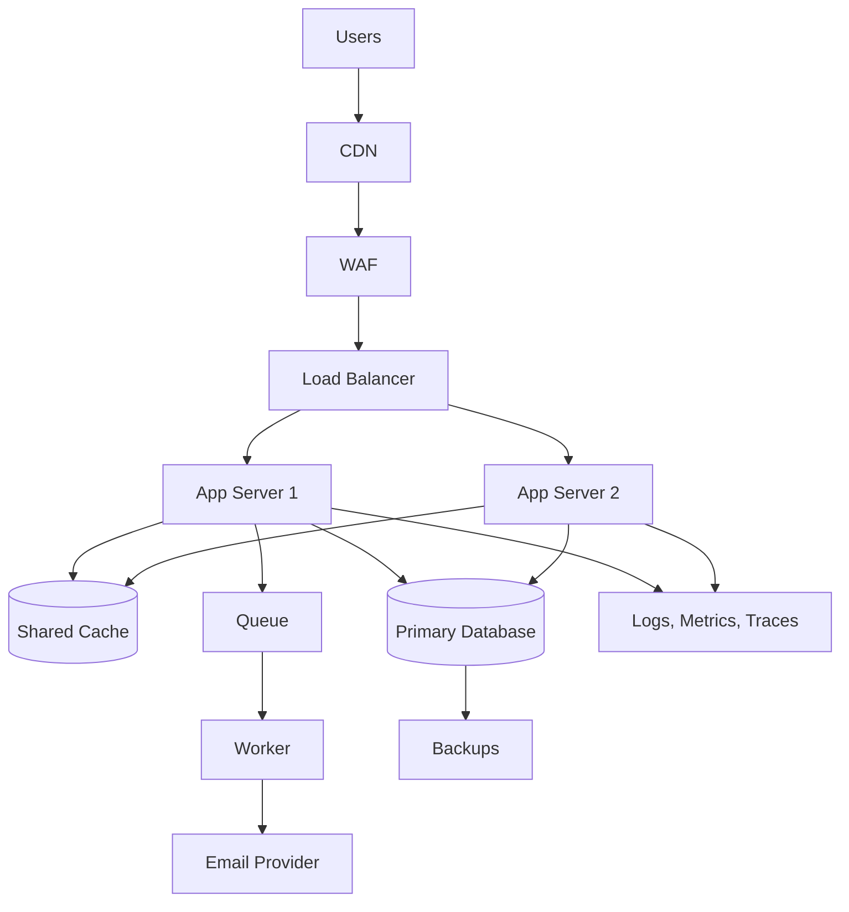
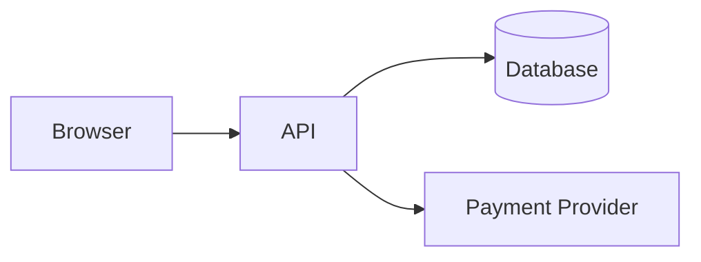
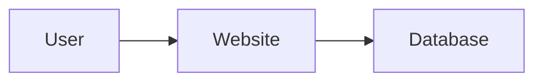

# Architecture Assessment Rubric  
## Evaluating Web Application Architecture, System Boundaries, Tradeoffs, and Design Reasoning

This rubric is used to evaluate architecture answers, diagrams, scenario responses, and capstone designs in the **Web Mechanics, Architecture & Network Fundamentals** series.

It is intended for:

- Part 1 architecture quizzes
- Foundation tests
- Architecture scenarios
- Capstone assignments
- Design exercises
- Interview-style architecture questions
- Production-readiness reviews

This rubric evaluates whether a learner can reason about a system, not merely name technologies.

A strong answer should explain:

```text
What components exist
What each component does
Where each component runs
How components communicate
Which system owns each piece of data
Where trust boundaries exist
What can fail
How failures are handled
Why the design is appropriate
What tradeoffs it introduces
```

---

# 1. Core Assessment Philosophy

Architecture is not about choosing the most fashionable tools.

A good architecture is one that is:

```text
Appropriate for the problem
Understandable
Secure
Testable
Operable
Reliable enough
Performant enough
Affordable enough
Able to evolve
```

A technically sophisticated design may still be poor if it:

- Adds unnecessary complexity
- Has unclear data ownership
- Exposes private systems
- Ignores failure behavior
- Cannot be operated by the team
- Has no rollback or recovery plan
- Uses microservices without a real need
- Treats the frontend as trusted
- Depends on undocumented assumptions

---

# 2. Recommended Scoring Model

Use a 100-point scale.

```text
System decomposition and responsibilities: 20 points
Client-server and trust boundaries:     15 points
Data ownership and state:               15 points
Communication and API design:            10 points
Security and authorization:              10 points
Failure handling and reliability:        10 points
Performance and scalability:             10 points
Operational complexity and maintainability: 5 points
Tradeoff reasoning:                       5 points
```

Total:

```text
100 points
```

For smaller exercises, scale the points proportionally.

---

# 3. Performance Levels

## Level 5 — Excellent

The learner:

- Decomposes the system clearly.
- Assigns responsibilities accurately.
- Identifies trust boundaries.
- Defines authoritative data sources.
- Explains communication paths.
- Handles authentication and authorization correctly.
- Considers failures and recovery.
- Discusses performance and scaling.
- Explains tradeoffs.
- Avoids unnecessary complexity.
- Produces a coherent, technically defensible design.

Typical score:

```text
90–100
```

---

## Level 4 — Strong

The learner:

- Identifies most major components correctly.
- Understands frontend and backend boundaries.
- Includes database and external services appropriately.
- Handles basic security and failure scenarios.
- Provides a mostly coherent architecture.
- May omit advanced operational or consistency concerns.

Typical score:

```text
75–89
```

---

## Level 3 — Developing

The learner:

- Understands some major components.
- Has a generally correct high-level model.
- May confuse responsibilities or data ownership.
- Provides limited failure handling.
- Mentions security but does not fully enforce it.
- Uses technologies without fully explaining why.

Typical score:

```text
60–74
```

---

## Level 2 — Beginning

The learner:

- Recognizes some vocabulary.
- Provides an incomplete architecture.
- Confuses frontend, backend, database, and API roles.
- Treats the browser as more trusted than it is.
- Omits authorization or failure behavior.
- Gives mostly tool-based rather than responsibility-based answers.

Typical score:

```text
40–59
```

---

## Level 1 — Insufficient

The learner:

- Cannot describe the major system components.
- Has serious misconceptions about trust or data ownership.
- Exposes databases or secrets directly.
- Cannot explain how components communicate.
- Provides no meaningful failure or security reasoning.

Typical score:

```text
0–39
```

---

# 4. Criterion 1 — System Decomposition and Responsibilities

## Excellent — 17–20 points

The answer clearly identifies the necessary components and assigns appropriate responsibilities.

It may include:

```text
Browser or mobile client
Frontend application
Backend API
Authentication system
Authorization logic
Database
Cache
Object storage
External services
Message queue
Background workers
CDN
Reverse proxy
Load balancer
Monitoring
```

The learner explains what each component does rather than merely listing technologies.

Example:

```text
The browser renders the interface and sends requests.
The backend validates requests and enforces permissions.
The database stores authoritative order state.
Object storage holds large uploaded files.
A queue handles confirmation emails asynchronously.
```

---

## Strong — 13–16 points

The answer identifies the main components:

```text
Frontend
Backend
Database
External service
```

Responsibilities are mostly correct, but optional or operational components may be missing.

---

## Developing — 9–12 points

The answer includes several components but has some responsibility confusion.

Examples:

```text
Treats the database as the backend
Places business logic entirely in the frontend
Uses a CDN as if it were a database
Lists a payment provider without describing its role
```

---

## Beginning — 5–8 points

The design is incomplete and mostly technology-focused:

```text
Use React, Node, MongoDB, and AWS.
```

The learner does not clearly explain what each part does.

---

## Insufficient — 0–4 points

The answer cannot distinguish:

```text
Frontend
Backend
Database
Network
External services
```

or proposes a fundamentally unsafe structure.

---

# 5. Criterion 2 — Client-Server and Trust Boundaries

## Excellent — 13–15 points

The learner explicitly identifies the browser as untrusted and places security enforcement on trusted backend systems.

The answer recognizes that users can:

```text
Inspect browser code
Modify HTML
Change form values
Replay requests
Send custom requests
Bypass client validation
```

The design correctly places:

```text
Authorization on the backend
Price calculation on the backend
Ownership checks on the backend
Private credentials on the server
Database access behind a controlled interface
```

Strong answer:

```text
The frontend may hide administrator controls for usability, but the API must enforce administrator authorization on every request.
```

---

## Strong — 10–12 points

The answer understands that frontend validation is insufficient and that the backend must enforce permissions.

Some deeper trust boundaries may be omitted.

---

## Developing — 7–9 points

The learner mentions server-side security but still relies partly on client behavior.

Example:

```text
The frontend hides the admin button and the backend checks the role only during login.
```

---

## Beginning — 4–6 points

The learner assumes:

```text
Hidden fields are protected
Disabled buttons enforce security
Users will use only the normal interface
Frontend validation is sufficient
```

---

## Insufficient — 0–3 points

The design directly trusts client-supplied:

```text
Prices
Roles
User IDs
Permissions
Payment status
Ownership claims
```

---

# 6. Criterion 3 — Data Ownership and State

## Excellent — 13–15 points

The learner clearly identifies the source of truth for each important value.

Example:

| Data | Source of truth |
|---|---|
| Open menu | Browser |
| Search text being typed | Browser |
| Product price | Backend/database |
| Inventory | Inventory system/database |
| Order status | Backend/database |
| Payment settlement | Payment provider/backend |
| Session validity | Authentication/session system |
| Product image bytes | Object storage |

The learner distinguishes:

```text
Client-side state
Server-side state
Database state
Cache state
External-provider state
```

The answer explains what happens when states disagree.

---

## Strong — 10–12 points

The learner identifies the main authoritative systems and understands that caches and browser state are not always authoritative.

---

## Developing — 7–9 points

The learner understands some state ownership but leaves important values ambiguous.

Examples:

```text
The browser stores the cart, but the server also stores it.
No explanation of which version wins.
```

---

## Beginning — 4–6 points

The learner treats browser state as authoritative for important business values.

---

## Insufficient — 0–3 points

The answer has no clear data ownership and allows clients to make final decisions about sensitive or financial state.

---

# 7. Criterion 4 — Communication and API Design

## Excellent — 9–10 points

The learner defines clear communication boundaries.

The answer may specify:

```text
Endpoints
HTTP methods
Request bodies
Response schemas
Status codes
Authentication
Authorization
Pagination
Error formats
Idempotency
Versioning
```

The learner explains whether communication is:

```text
Synchronous
Asynchronous
Request-response
Event-driven
Queue-based
Streaming
```

Example:

```text
POST /orders returns 201 after the order is created.
Email delivery is placed on a queue and returns separately.
Payment retries use an idempotency key.
```

---

## Strong — 7–8 points

The learner describes the main API interaction and uses HTTP or another communication model appropriately.

---

## Developing — 5–6 points

The learner mentions APIs but does not define the contract clearly.

---

## Beginning — 3–4 points

The design uses vague action descriptions:

```text
Frontend calls backend to do stuff.
```

or does not distinguish request and response behavior.

---

## Insufficient — 0–2 points

The communication model is absent or fundamentally unsafe.

---

# 8. Criterion 5 — Security and Authorization

## Excellent — 9–10 points

The design addresses:

```text
Authentication
Authorization
Input validation
Secret management
HTTPS
Least privilege
Database protection
File-upload safety
Rate limiting
Audit logging
Sensitive-data minimization
```

The learner distinguishes:

```text
Authentication:
  Who is the caller?

Authorization:
  What may the caller do?
```

The answer includes resource ownership and tenant boundaries where relevant.

---

## Strong — 7–8 points

The learner includes HTTPS, authentication, server-side authorization, and input validation.

---

## Developing — 5–6 points

The learner mentions login and HTTPS but omits:

```text
Ownership checks
Least privilege
Secret handling
Input validation
```

---

## Beginning — 3–4 points

The learner relies primarily on:

```text
Hidden UI controls
Client validation
Obscure IDs
Frontend role checks
```

---

## Insufficient — 0–2 points

The design exposes:

```text
Database credentials
Private keys
Passwords
Administrative operations
Private data
```

to untrusted clients.

---

# 9. Criterion 6 — Failure Handling and Reliability

## Excellent — 9–10 points

The learner identifies likely failures and defines safe behavior.

Examples:

```text
Email failure:
  Queue retry; do not necessarily fail the order.

Payment timeout:
  Mark payment pending or uncertain; reconcile safely.

Database outage:
  Return a safe temporary error; alert operators.

Cache outage:
  Fall back to the database where capacity permits.

Worker failure:
  Retry with backoff; use a dead-letter queue.

External service failure:
  Use timeout, circuit breaker, and fallback.
```

The answer considers:

```text
Timeouts
Retries
Backoff
Circuit breakers
Idempotency
Health checks
Redundancy
Graceful degradation
```

---

## Strong — 7–8 points

The learner identifies major failures and proposes reasonable fallback or retry behavior.

---

## Developing — 5–6 points

The learner recognizes failure but provides generic responses:

```text
Show an error.
Retry.
```

No limits, idempotency, or dependency classification are discussed.

---

## Beginning — 3–4 points

The design assumes dependencies are always available.

---

## Insufficient — 0–2 points

The answer proposes unsafe behavior such as:

```text
Retry payments forever
Ignore database failures
Return success without recording state
Expose internal stack traces
```

---

# 10. Criterion 7 — Performance and Scalability

## Excellent — 9–10 points

The learner identifies relevant performance strategies:

```text
Caching
CDN
Pagination
Database indexes
Query optimization
Code splitting
Lazy loading
Compression
Connection pooling
Asynchronous work
Load balancing
Horizontal scaling
Read replicas
```

The learner connects each optimization to a specific bottleneck.

Example:

```text
The CDN helps static images, but it will not fix an uncached, database-heavy search query. The search query needs an index or search service.
```

---

## Strong — 7–8 points

The learner includes appropriate caching, scaling, and database considerations.

---

## Developing — 5–6 points

The learner recommends generic scaling:

```text
Add more servers.
Use a CDN.
Add a cache.
```

without explaining what bottleneck each solves.

---

## Beginning — 3–4 points

The learner assumes performance is solved by:

```text
More CPU
More servers
A fashionable framework
```

---

## Insufficient — 0–2 points

No performance or scale considerations are included for a system that clearly requires them.

---

# 11. Criterion 8 — Operational Complexity and Maintainability

## Excellent — 5 points

The learner chooses an architecture appropriate to team size and operational capability.

They discuss:

```text
Deployment
Monitoring
Documentation
Debugging
On-call responsibility
Testing
Migrations
Rollback
Cost
Team expertise
```

They avoid introducing microservices, queues, regions, or complex infrastructure without a clear reason.

---

## Strong — 4 points

The architecture is maintainable and includes basic operational considerations.

---

## Developing — 3 points

The architecture may work but introduces unexplained complexity.

---

## Beginning — 1–2 points

The learner selects tools without considering:

```text
Team size
Operational skill
Cost
Maintenance
```

---

## Insufficient — 0 points

The design is not realistically operable by the proposed team.

---

# 12. Criterion 9 — Tradeoff Reasoning

## Excellent — 5 points

The learner explicitly discusses tradeoffs.

Examples:

```text
SSR improves initial content delivery but increases server rendering work.

Microservices allow independent scaling but create distributed-system complexity.

Caching improves speed but creates invalidation and staleness concerns.

A read replica improves read capacity but introduces replication lag.

Serverless reduces infrastructure management but introduces execution limits and cold starts.

A queue improves responsiveness but creates eventual consistency and monitoring requirements.
```

---

## Strong — 4 points

The learner explains at least one meaningful advantage and disadvantage for major choices.

---

## Developing — 3 points

The learner mentions tradeoffs but does not connect them to the scenario.

---

## Beginning — 1–2 points

The learner describes technologies as universally good or bad.

---

## Insufficient — 0 points

No tradeoff reasoning is present.

---

# 13. Architecture Diagram Rubric

Use this rubric for Mermaid diagrams or system sketches.

## Component clarity — 20%

Can the reader identify:

```text
Client
Frontend
Backend
Database
External services
Queues
Storage
Infrastructure
```

## Direction of communication — 20%

Do arrows show:

```text
Who initiates requests?
Where do responses go?
Which services call which dependencies?
```

## Trust boundaries — 20%

Does the diagram distinguish:

```text
Public systems
Private systems
Untrusted clients
Protected databases
External providers
```

## Data ownership — 15%

Does the diagram indicate:

```text
Primary database
Cache
Object storage
External provider
Queue
```

## Failure and operational visibility — 15%

Does it include or explain:

```text
Health checks
Logs
Metrics
Traces
Backups
Retries
Fallbacks
```

## Readability — 10%

Is the diagram:

```text
Not unnecessarily cluttered
Clearly labeled
Consistent
Rendered correctly
Easy to follow
```

---

# 14. Architecture Diagram Performance Levels

## Excellent diagram



This diagram communicates:

- Public entry points
- Application redundancy
- Shared cache
- Database
- Async work
- External dependency
- Observability
- Backups

---

## Adequate diagram



This is understandable but omits:

```text
Authentication
Caching
Failure handling
Operations
Deployment
```

---

## Weak diagram



This is too vague for production architecture.

It does not explain:

```text
Frontend
Backend
Trust boundary
API
Authorization
Network
Data ownership
```

---

# 15. Scenario-Answer Rubric

For scenario questions, score the learner across five dimensions.

## Diagnosis — 25%

Did the learner identify the likely failing layer?

```text
Frontend
Browser
DNS
Network
TLS
API
Authentication
Authorization
Database
External service
```

## Evidence — 20%

Did the learner identify what to inspect?

```text
Network panel
Console
Headers
Payload
Status
Logs
Metrics
Traces
Database query plan
```

## Safety — 20%

Did the learner avoid unsafe recommendations?

Examples of unsafe answers:

```text
Disable authorization
Make database public
Retry payments forever
Expose tokens
Ignore certificate errors
Return stack traces
```

## Mitigation — 20%

Did the learner propose a practical way to reduce impact?

```text
Rollback
Feature flag
Circuit breaker
Rate limit
Fallback
Queue
Scale workers
Serve cached content
```

## Prevention — 15%

Did the learner suggest a long-term improvement?

```text
Regression test
Alert
Schema check
Runbook
Idempotency
Better validation
Performance budget
Deployment gate
```

---

# 16. Architecture Design Rubric for Capstone Projects

Use this for a complete design assignment.

## Section A — Requirements interpretation

```text
0–5 points
```

Evaluate whether the learner identifies:

```text
Users
Core workflows
Sensitive operations
Data requirements
Performance requirements
Availability requirements
External integrations
```

## Section B — System decomposition

```text
0–15 points
```

Evaluate:

```text
Frontend
Backend
Database
Storage
Authentication
External services
Workers
Queues
Caching
```

## Section C — Data model and ownership

```text
0–10 points
```

Evaluate:

```text
Sources of truth
Persistent state
Client state
Cache state
External-provider state
Data relationships
```

## Section D — API and communication

```text
0–10 points
```

Evaluate:

```text
Endpoints
Methods
Schemas
Status codes
Errors
Pagination
Authentication
Idempotency
Async operations
```

## Section E — Security

```text
0–15 points
```

Evaluate:

```text
HTTPS
Authentication
Authorization
Ownership checks
Input validation
Secrets
Database protection
File uploads
Rate limiting
Audit logging
```

## Section F — Performance

```text
0–10 points
```

Evaluate:

```text
Caching
CDN
Pagination
Database indexes
Asset optimization
Async work
API payloads
Latency
```

## Section G — Reliability

```text
0–10 points
```

Evaluate:

```text
Timeouts
Retries
Circuit breakers
Redundancy
Health checks
Graceful degradation
Backups
Recovery
```

## Section H — Observability

```text
0–5 points
```

Evaluate:

```text
Logs
Metrics
Traces
Request IDs
Alerts
Dashboards
```

## Section I — Deployment and operations

```text
0–10 points
```

Evaluate:

```text
Environments
CI/CD
Artifacts
Migrations
Rollback
Containers or servers
Configuration
Ownership
```

## Section J — Tradeoffs and justification

```text
0–10 points
```

Evaluate:

```text
Why this architecture?
Why not simpler?
What complexity is introduced?
What are the cost and scaling assumptions?
What would change at larger scale?
```

Total:

```text
100 points
```

---

# 17. Common Architecture Red Flags

Deduct points or request revision when the design:

```text
Connects the browser directly to a private database
Trusts client-provided prices or roles
Stores secrets in frontend code
Uses `GET` for destructive operations
Has no authentication for private data
Has no authorization checks
Returns unlimited collections
Has no timeout or retry policy
Retries payments without idempotency
Uses caches without invalidation rules
Uses microservices without a clear need
Has no monitoring
Has no backups
Has no rollback
Has no failure behavior
Exposes internal errors to users
```

---

# 18. Strong Architecture Answer Template

Learners can use this template:

```markdown
## Requirements

- Users:
- Core workflows:
- Sensitive operations:
- Expected traffic:
- Availability needs:
- External services:

## Components

- Frontend:
- Backend:
- Database:
- Cache:
- File storage:
- Queue:
- Workers:
- External services:
- CDN:
- Load balancer:

## Data Ownership

| Data | Source of truth |
|---|---|
| ... | ... |

## Request Flow

1. ...
2. ...
3. ...

## Security

- Authentication:
- Authorization:
- Input validation:
- Secrets:
- Database access:

## Failure Handling

- Database unavailable:
- Payment unavailable:
- Email unavailable:
- Cache unavailable:

## Performance

- Caching:
- Pagination:
- Indexes:
- Asset optimization:

## Operations

- Logs:
- Metrics:
- Traces:
- Backups:
- Deployment:
- Rollback:

## Tradeoffs

- Advantage:
- Cost:
- Alternative:
```

---

# 19. Feedback Guidelines

Feedback should be:

```text
Specific
Actionable
Evidence-based
Respectful
Connected to requirements
```

Avoid:

```text
This architecture is bad.
Use microservices.
Use a better database.
```

Prefer:

```text
The design places the database behind the backend, which is appropriate. However, it does not identify how the server verifies resource ownership. Add an authorization check for every order request and describe the response for unauthorized access.
```

---

# 20. Final Rubric Summary

A strong architecture demonstrates:

```text
Clear responsibilities
Correct trust boundaries
Authoritative data ownership
Explicit communication contracts
Server-side security enforcement
Thoughtful failure handling
Measured performance strategies
Operational visibility
Safe deployment and recovery
Appropriate complexity
Clear tradeoff reasoning
```

The core evaluation question is:

> Does this design provide a clear, secure, maintainable, and realistic way for the system to satisfy its requirements?
