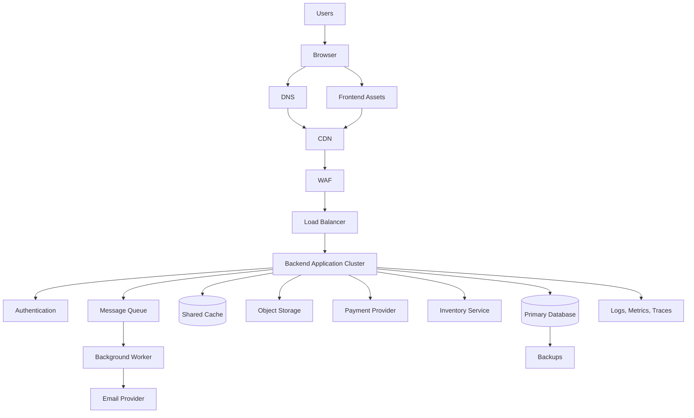
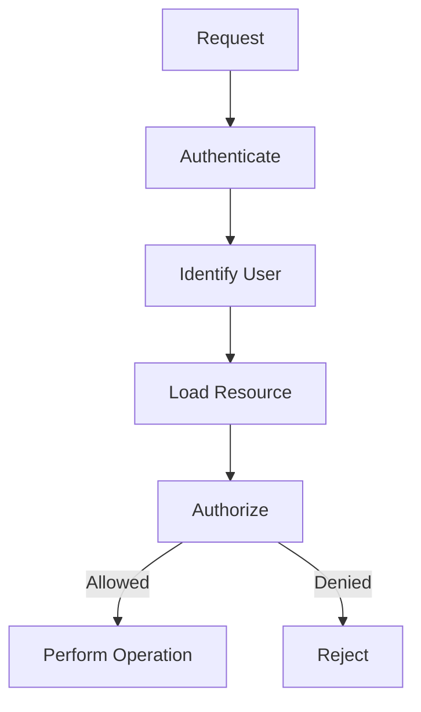
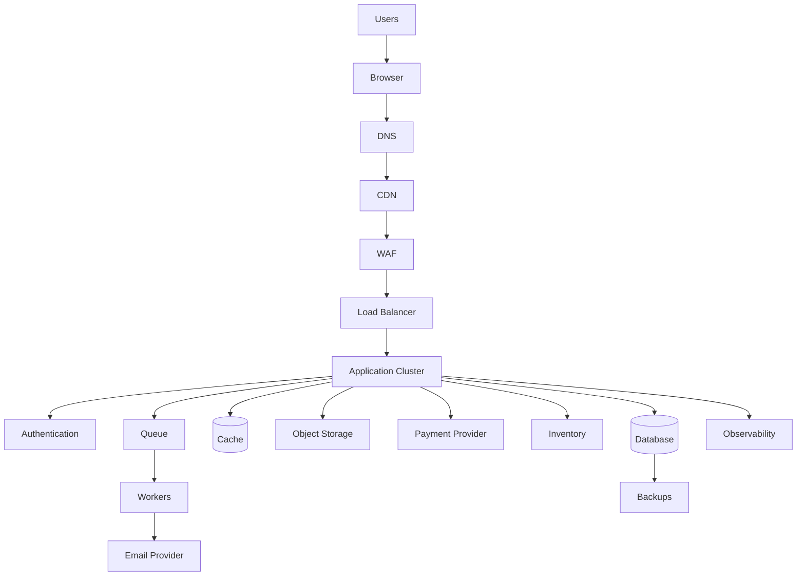
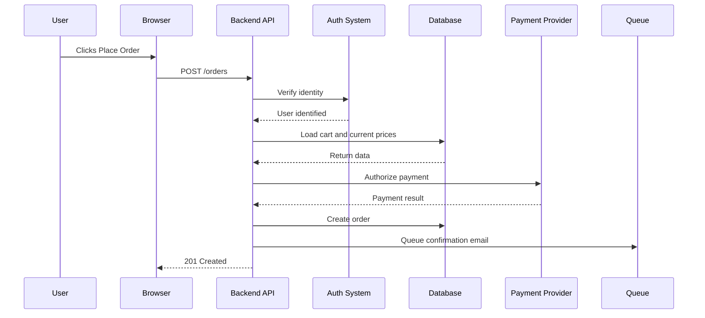

# Capstone Assessment Rubric  
## Evaluating an End-to-End Web Application Architecture and Operational Design

This rubric is used to evaluate the final capstone assignment for the **Web Mechanics, Architecture & Network Fundamentals** series.

The capstone should require the learner to design and explain a realistic web application from end to end.

It may involve:

- Frontend architecture
- Backend architecture
- API design
- DNS and networking
- HTTP and HTTPS
- Authentication and authorization
- Database and storage
- Caching
- Queues and workers
- External services
- Performance
- Reliability
- Security
- Observability
- Deployment
- Incident response
- Recovery

The goal is not to reward the most complicated architecture.

The goal is to evaluate whether the learner can design a system that is:

```text
Understandable
Appropriate
Secure
Testable
Performant enough
Reliable enough
Observable
Deployable
Recoverable
```

---

# 1. Suggested Capstone Scenario

A recommended capstone scenario is:

> Design an online store where users can browse products, search and filter the catalog, create accounts, add products to a cart, place orders, make payments, upload product images, and receive confirmation emails.

The system should support:

```text
Public product browsing
User authentication
Shopping carts
Orders
Payments
Inventory
Product images
Email notifications
Search
Administrator tools
```

A possible high-level architecture is:



Learners may choose a simpler or more complex design if they justify it.

---

# 2. Capstone Deliverables

A complete submission should include:

```text
1. Requirements summary
2. Architecture diagram
3. Component responsibility table
4. Request and response flows
5. API design
6. Data ownership model
7. Authentication and authorization design
8. Security checklist
9. Failure-handling plan
10. Performance plan
11. Observability plan
12. Deployment plan
13. Backup and recovery plan
14. Incident-response plan
15. Tradeoff discussion
16. Assumptions and open questions
```

Recommended formats:

```text
Markdown
Mermaid diagrams
Tables
HTTP examples
JSON examples
SQL or data-model sketches
Decision records
```

---

# 3. Recommended Scoring Model

Use a 100-point scale.

```text
Requirements and assumptions:             10 points
Architecture and component boundaries:    15 points
Frontend and backend responsibilities:    10 points
API and communication design:             10 points
Data model and source of truth:            10 points
Authentication and authorization:          10 points
Security and privacy:                      10 points
Reliability and failure handling:          10 points
Performance and scalability:                5 points
Observability and operations:               5 points
Deployment and recovery:                    5 points
Tradeoffs and justification:                5 points
```

Total:

```text
100 points
```

---

# 4. Overall Performance Levels

## Level 5 — Excellent

The learner produces a coherent, realistic, and well-justified design.

The submission:

```text
Defines requirements clearly
Uses appropriate component boundaries
Protects trust boundaries
Identifies sources of truth
Designs a usable API
Handles authentication and authorization
Protects data and secrets
Plans for dependency failures
Addresses performance bottlenecks
Includes observability
Defines deployment and rollback
Includes backups and recovery
Explains tradeoffs honestly
```

Typical score:

```text
90–100
```

---

## Level 4 — Strong

The learner provides a mostly complete architecture with correct major responsibilities.

The submission may omit:

```text
Advanced recovery
Detailed observability
Complex consistency concerns
Deep deployment strategy
```

but remains practical and secure.

Typical score:

```text
75–89
```

---

## Level 3 — Developing

The learner understands the broad architecture but has gaps in:

```text
Security
State ownership
Failure handling
API detail
Deployment
Operational readiness
```

The design may work for a prototype but needs revision before production.

Typical score:

```text
60–74
```

---

## Level 2 — Beginning

The learner identifies some technologies but does not clearly define responsibilities or boundaries.

Common issues:

```text
Frontend trusts too much
Database is exposed directly
No authorization model
No failure behavior
No source of truth
No deployment or recovery plan
```

Typical score:

```text
40–59
```

---

## Level 1 — Insufficient

The design is incomplete, contradictory, unsafe, or impossible to operate.

Typical score:

```text
0–39
```

---

# 5. Criterion 1 — Requirements and Assumptions

## 9–10 points — Excellent

The learner clearly defines:

```text
Users
User roles
Core workflows
Public versus private features
Sensitive operations
Expected data
Traffic assumptions
Performance expectations
Availability needs
External integrations
Compliance or privacy assumptions
```

The learner identifies unknowns instead of silently guessing.

Example:

```text
Assumption:
  Product browsing is public.

Assumption:
  Checkout requires authentication.

Assumption:
  Email delivery is important but not required for order creation.

Open question:
  Must inventory be globally consistent in real time?
```

---

## 7–8 points — Strong

The core requirements are clearly described, but some assumptions or nonfunctional requirements are missing.

---

## 5–6 points — Developing

The learner describes features but not:

```text
User roles
Traffic
Security
Availability
Failure expectations
```

---

## 3–4 points — Beginning

The submission is mostly a feature list without operational or architectural requirements.

---

## 0–2 points — Insufficient

Requirements are unclear or contradictory.

---

# 6. Criterion 2 — Architecture and Component Boundaries

## 14–15 points — Excellent

The architecture clearly identifies:

```text
Client
Frontend
Backend/API
Authentication
Database
Cache
Object storage
Queue
Workers
External providers
CDN
Reverse proxy
Load balancer
Monitoring
Backups
```

The learner explains why each component exists.

The architecture is not unnecessarily complex.

---

## 11–13 points — Strong

The main application components are correct and mostly well-separated.

Some operational components may be missing.

---

## 8–10 points — Developing

The learner includes frontend, backend, and database but has unclear boundaries around:

```text
Storage
Authentication
External services
Background jobs
Caching
```

---

## 4–7 points — Beginning

The architecture is mostly a list of technologies:

```text
React
Node
PostgreSQL
Redis
Docker
Kubernetes
```

but responsibilities are not explained.

---

## 0–3 points — Insufficient

The design exposes private systems or cannot explain how the components communicate.

---

# 7. Criterion 3 — Frontend and Backend Responsibilities

## 9–10 points — Excellent

The submission clearly separates:

## Frontend

```text
Rendering
User interaction
Temporary UI state
Loading states
Client-side feedback
Request creation
Response display
```

## Backend

```text
Validation
Authentication
Authorization
Business rules
Database access
Pricing
Inventory
Private integrations
```

The learner explicitly states:

```text
Client-side validation improves usability.
Server-side validation enforces correctness and security.
```

---

## 7–8 points — Strong

The main responsibilities are correct, with minor omissions.

---

## 5–6 points — Developing

Some business logic is incorrectly assigned to the frontend, or the backend’s authority is not fully explained.

---

## 3–4 points — Beginning

The learner treats the frontend as the application’s authority.

---

## 0–2 points — Insufficient

The design relies entirely on client-side restrictions for security or business correctness.

---

# 8. Criterion 4 — API and Communication Design

## 9–10 points — Excellent

The learner defines representative endpoints with:

```text
HTTP methods
Paths
Path parameters
Query parameters
Request bodies
Response bodies
Status codes
Authentication
Authorization
Errors
Pagination
Idempotency
```

Example:

```http
POST /api/orders
Authorization: Bearer REDACTED
Idempotency-Key: order-attempt-123
Content-Type: application/json
```

```json
{
  "items": [
    {
      "productId": "123",
      "quantity": 2
    }
  ]
}
```

Expected response:

```http
201 Created
```

---

## 7–8 points — Strong

The learner defines useful endpoints and uses HTTP methods appropriately.

Some details such as idempotency, pagination, or error formats may be missing.

---

## 5–6 points — Developing

The learner includes endpoints but uses inconsistent or overly action-oriented paths.

---

## 3–4 points — Beginning

The API description is vague:

```text
Frontend sends data to backend.
Backend returns result.
```

---

## 0–2 points — Insufficient

No usable communication contract is provided.

---

# 9. Criterion 5 — Data Model and Sources of Truth

## 9–10 points — Excellent

The learner identifies major entities:

```text
Users
Products
Categories
Carts
Orders
Order items
Payments
Inventory
Files
Sessions
```

The submission defines relationships and authoritative systems.

Example:

| Data | Source of truth |
|---|---|
| Current product price | Product database |
| Inventory | Inventory database/service |
| Payment status | Payment provider plus internal payment record |
| Order status | Order service/database |
| Product image bytes | Object storage |
| Menu state | Browser |

The learner distinguishes:

```text
Database
Cache
Browser state
External-provider state
Object storage
```

---

## 7–8 points — Strong

The main data entities and sources of truth are clear.

---

## 5–6 points — Developing

The learner identifies tables or objects but does not explain ownership or consistency.

---

## 3–4 points — Beginning

The design treats cache or browser state as authoritative for critical information.

---

## 0–2 points — Insufficient

The design has no coherent data model or allows unsafe direct client access.

---

# 10. Criterion 6 — Authentication and Authorization

## 9–10 points — Excellent

The submission explains:

```text
How users authenticate
How sessions or tokens work
Where credentials are stored
How sessions expire
How logout works
How roles work
How resource ownership is checked
How administrative access is enforced
How 401 and 403 are handled
```

Example:



---

## 7–8 points — Strong

Authentication and basic authorization are correctly described.

---

## 5–6 points — Developing

The learner includes login but omits:

```text
Ownership
Expiration
Logout
Session security
Role boundaries
```

---

## 3–4 points — Beginning

The learner relies on hidden buttons or client-supplied user IDs.

---

## 0–2 points — Insufficient

Private operations are exposed without meaningful authentication or authorization.

---

# 11. Criterion 7 — Security and Privacy

## 9–10 points — Excellent

The design addresses:

```text
HTTPS
Secret management
Password hashing
Input validation
Output encoding
SQL injection
XSS
CSRF
File upload validation
Rate limiting
Least privilege
Database protection
Logging redaction
Data minimization
Backups
```

The learner identifies sensitive data and explains:

```text
Who can access it
Where it is stored
How it is protected
How long it is retained
How it is deleted
```

---

## 7–8 points — Strong

The learner includes HTTPS, secrets, validation, authentication, and authorization.

---

## 5–6 points — Developing

Security is mentioned but not integrated into the architecture.

---

## 3–4 points — Beginning

The design relies mainly on:

```text
HTTPS
Hidden UI controls
Obscure IDs
Frontend validation
```

---

## 0–2 points — Insufficient

The design exposes secrets, passwords, private databases, or unrestricted administrative operations.

---

# 12. Criterion 8 — Reliability and Failure Handling

## 9–10 points — Excellent

The learner explicitly classifies dependencies:

```text
Critical
Important but recoverable
Optional
```

The submission defines behavior for:

```text
Database failure
Cache failure
Payment timeout
Email failure
Inventory conflict
Queue failure
Storage failure
Authentication failure
External API outage
```

It includes:

```text
Timeouts
Bounded retries
Backoff
Circuit breakers
Idempotency
Health checks
Graceful degradation
Dead-letter queues
Reconciliation
```

Example:

```text
Email failure:
  Order remains valid; confirmation job is retried asynchronously.

Payment timeout:
  Payment remains pending until reconciled; request uses idempotency key.
```

---

## 7–8 points — Strong

The learner handles the main failure modes and includes reasonable retry or fallback behavior.

---

## 5–6 points — Developing

The learner says “retry” or “show an error” but does not define limits, states, or recovery.

---

## 3–4 points — Beginning

The design assumes external services always work.

---

## 0–2 points — Insufficient

The design retries dangerous operations indefinitely or silently loses data.

---

# 13. Criterion 9 — Performance and Scalability

## 5 points — Excellent

The submission identifies appropriate strategies:

```text
CDN
Caching
Pagination
Database indexes
Query optimization
Code splitting
Lazy loading
Compression
Connection pooling
Queues
Load balancing
Horizontal scaling
```

The learner connects strategies to specific bottlenecks.

---

## 4 points — Strong

The learner includes relevant caching, database, API, and scaling considerations.

---

## 3 points — Developing

The learner mentions general optimization but lacks measurement or specificity.

---

## 1–2 points — Beginning

The learner assumes:

```text
Add more servers.
Use a CDN.
Use a cache.
```

without explaining what problem each solves.

---

## 0 points — Insufficient

No meaningful performance or scaling plan exists.

---

# 14. Criterion 10 — Observability and Operations

## 5 points — Excellent

The design includes:

```text
Structured logs
Request IDs
Metrics
Latency percentiles
Error rates
Database metrics
Cache hit rate
Queue depth
Distributed traces
Health checks
Readiness checks
Alerts
Dashboards
```

The learner explains how operators would investigate a failed request.

---

## 4 points — Strong

The learner includes logs, metrics, and health checks.

---

## 3 points — Developing

The learner mentions logging but not structured correlation or alerting.

---

## 1–2 points — Beginning

The design relies on manually checking the server if users report problems.

---

## 0 points — Insufficient

No operational visibility is provided.

---

# 15. Criterion 11 — Deployment and Recovery

## 5 points — Excellent

The submission describes:

```text
Development, staging, production
CI/CD
Build artifacts
Configuration
Secrets
Database migrations
Health checks
Rolling or blue-green deployment
Rollback
Backups
Restore testing
RPO
RTO
```

The learner explains how to recover after a bad deployment or data failure.

---

## 4 points — Strong

The learner provides a sensible deployment and rollback plan.

---

## 3 points — Developing

The learner describes deployment but omits:

```text
Migrations
Rollback
Backups
Monitoring
```

---

## 1–2 points — Beginning

The deployment plan is essentially:

```text
Upload code and restart server.
```

---

## 0 points — Insufficient

No deployment or recovery plan exists.

---

# 16. Criterion 12 — Tradeoffs and Justification

## 5 points — Excellent

The learner justifies major decisions and acknowledges limitations.

Examples:

```text
Use a modular monolith initially because the team is small.

Use a queue for email because it is noncritical to order creation.

Use a CDN for public images but not private account responses.

Use GraphQL for complex dashboard data but REST for public product resources.

Use a read replica for catalog reads while accepting replication lag.
```

---

## 4 points — Strong

The learner explains major advantages and disadvantages.

---

## 3 points — Developing

The learner gives basic reasons but does not consider alternatives.

---

## 1–2 points — Beginning

The learner selects tools based mainly on popularity.

---

## 0 points — Insufficient

No justification is provided.

---

# 17. Required Architecture Diagram Rubric

The capstone diagram should ideally show:



The exact diagram may be simpler, but it should communicate:

```text
Request direction
Public and private boundaries
Component responsibilities
Data ownership
External dependencies
Asynchronous work
Observability
Recovery
```

---

# 18. Diagram Scoring

## 13–15 points — Excellent

The diagram is:

```text
Complete
Readable
Correctly labeled
Security-aware
Operationally realistic
```

It distinguishes:

```text
Frontend
Backend
Database
Cache
Storage
Queue
External services
Public entry points
Monitoring
Backups
```

## 10–12 points — Strong

The main architecture is clear but omits some operational components.

## 7–9 points — Developing

The diagram includes frontend, backend, and database but lacks:

```text
Trust boundaries
Failure paths
Queues
Monitoring
Deployment infrastructure
```

## 4–6 points — Beginning

The diagram is too abstract:

```text
User → Website → Database
```

## 0–3 points — Insufficient

The diagram is contradictory, unsafe, or unreadable.

---

# 19. Request-Flow Rubric

The learner should be able to describe a complete flow such as:



Evaluate whether the learner explains:

```text
Who initiates each request
Which system validates
Where identity comes from
Which system is authoritative
Which work is synchronous
Which work is asynchronous
What happens on failure
```

---

# 20. Capstone Security Red Flags

A capstone should receive significant deductions for designs that:

```text
Expose a database directly to the browser
Trust client-provided prices
Trust client-provided roles
Store passwords in plaintext
Place secrets in frontend code
Use only frontend authorization
Use GET for destructive operations
Cache private responses publicly
Accept arbitrary file paths
Run all services as root
Return internal stack traces
Retry payments without idempotency
Disable TLS verification as a permanent solution
```

Some of these should trigger a mandatory revision rather than merely a score deduction.

---

# 21. Capstone Reliability Red Flags

Deduct points for designs that:

```text
Have no timeout policy
Retry forever
Have no backup plan
Have no restore test
Have no health checks
Have no rollback
Assume dependencies always succeed
Have no queue failure behavior
Have no database recovery plan
Have no monitoring
```

---

# 22. Capstone Performance Red Flags

Deduct points for designs that:

```text
Return unlimited collections
Load every asset immediately
Use no caching where public data is repeatedly requested
Ignore database indexes
Perform expensive work synchronously
Have no pagination
Load large frontend bundles unnecessarily
Block the main page on optional services
```

---

# 23. Capstone Operations Red Flags

Deduct points for designs that:

```text
Have no environment separation
Have no configuration strategy
Have no deployment artifact
Have no migration strategy
Have no request IDs
Have no alerting
Have no ownership
Have no incident procedure
Have no cost considerations
```

---

# 24. Capstone Presentation Rubric

If the capstone includes an oral or written presentation, evaluate:

## Clarity — 20%

Can the learner explain the design to another developer?

## Structure — 20%

Does the presentation follow a logical sequence?

```text
Requirements
Architecture
Request flows
Data
Security
Failure
Operations
Tradeoffs
```

## Accuracy — 25%

Are the technical claims correct?

## Justification — 20%

Does the learner explain why choices were made?

## Response to questions — 15%

Can the learner defend or revise the design when presented with new constraints?

---

# 25. Capstone Defense Questions

Ask the learner:

```text
Why is the database not directly exposed?
Which system is authoritative for price?
What happens when the payment provider times out?
How do you prevent duplicate orders?
How does authentication work?
Where are secrets stored?
What happens if the cache fails?
How does the application scale?
What happens during deployment?
How do you roll back?
How do you know the system is slow?
How do you restore the database?
Which component is the largest single point of failure?
What would you simplify if the team had only two developers?
What would you change at ten times the traffic?
```

A strong learner should answer using:

```text
Specific components
Clear assumptions
Evidence
Tradeoffs
Failure behavior
```

---

# 26. Final Capstone Score Interpretation

## 90–100 — Production-oriented design

The learner demonstrates strong system reasoning and can explain a realistic, secure, observable, and recoverable architecture.

## 75–89 — Strong architecture foundation

The learner can design a viable system but should strengthen one or more areas such as:

```text
Recovery
Observability
Performance
Authorization
Deployment
```

## 60–74 — Prototype-ready, production-incomplete

The learner understands the major concepts but needs to improve:

```text
Security enforcement
Failure handling
Data ownership
Operational planning
```

## 40–59 — Significant revision required

The design has useful ideas but contains important gaps or unsafe assumptions.

## 0–39 — Foundational review required

The learner should revisit:

```text
Part 1 — Architecture
Part 2 — Networking
Part 3 — HTTP
Part 4 — APIs
Primer 8 — Security
Primer 11 — Linux and Servers
Primer 12 — Cloud and Deployment
Appendix K — Troubleshooting
Appendix L — Production Readiness
```

---

# 27. Submission Review Checklist

Before grading, verify that the submission includes:

```text
[ ] Requirements
[ ] Assumptions
[ ] Architecture diagram
[ ] Component responsibilities
[ ] Client-server boundary
[ ] API examples
[ ] Data model
[ ] Sources of truth
[ ] Authentication
[ ] Authorization
[ ] Security controls
[ ] Failure handling
[ ] Performance plan
[ ] Caching plan
[ ] Observability
[ ] Deployment plan
[ ] Rollback plan
[ ] Backup and recovery
[ ] Tradeoffs
[ ] Open questions
```

---

# 28. Final Capstone Standard

A successful capstone should answer:

```text
What does the system need to do?
Which components exist?
Where does each component run?
How do components communicate?
Which data is authoritative?
What can the client be trusted to do?
How is identity verified?
How are permissions enforced?
What happens when dependencies fail?
How does the system remain responsive?
How is it deployed?
How is it monitored?
How is it recovered?
Why is this architecture appropriate?
```

The final evaluation should reward clear reasoning over unnecessary complexity.

The central question is:

> Can this learner design, explain, troubleshoot, and operate a web application across its complete lifecycle?
