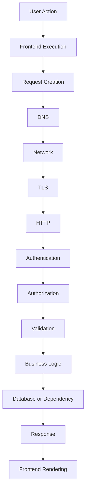
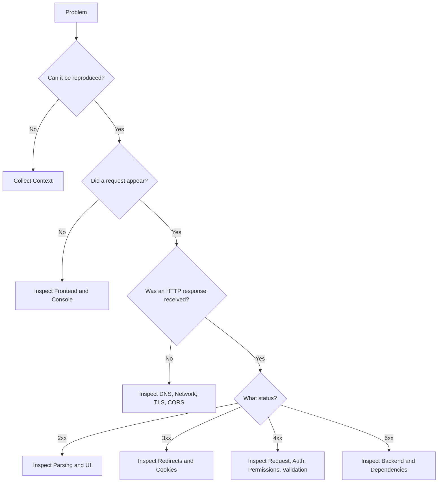
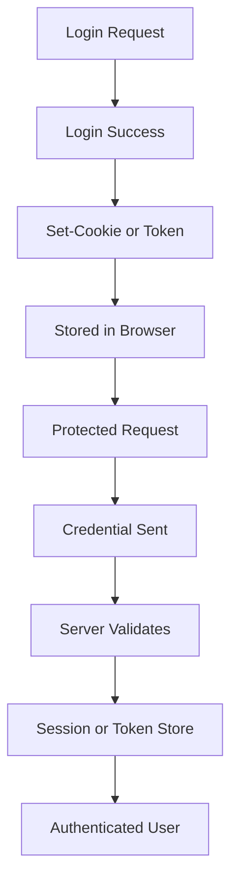
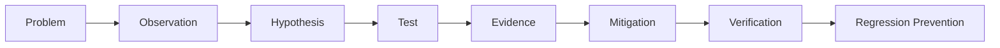

# Troubleshooting Assessment Rubric  
## Evaluating Diagnosis, Evidence Collection, Layer Identification, Mitigation, and Prevention

This rubric evaluates troubleshooting answers, diagnostic scenarios, practical investigations, and incident exercises in the **Web Mechanics, Architecture & Network Fundamentals** series.

It is intended for:

- Part 5 diagnostic exercises
- Scenario-based troubleshooting questions
- API debugging tasks
- Authentication-failure investigations
- Slow-page-load investigations
- Request-tracing exercises
- Production outage analysis
- Practical DevTools and cURL work
- Interview-style debugging questions

The goal is to evaluate whether a learner can move from:

```text
Something is broken.
```

to:

```text
This specific layer failed, this evidence proves it, and this is the safest next step.
```

---

# 1. Core Troubleshooting Philosophy

A strong troubleshooting response should:

```text
Reproduce the problem
Collect direct evidence
Separate symptoms from causes
Identify the earliest failed layer
Test a focused hypothesis
Apply a safe mitigation
Verify the result
Prevent recurrence
```

A weak response usually:

```text
Guesses immediately
Changes unrelated code
Blames the frontend or backend without evidence
Ignores status codes
Ignores logs
Retries blindly
Disables security controls
Exposes secrets
```

The most important principle is:

> Diagnose from evidence, not from assumptions.

---

# 2. Recommended Scoring Model

Use a 100-point scale.

```text
Problem reproduction and context:       10 points
Evidence collection:                   20 points
Layer identification:                  20 points
Hypothesis and reasoning:              15 points
Tool selection and execution:          10 points
Mitigation and safety:                 10 points
Verification:                            5 points
Prevention and regression control:     10 points
```

Total:

```text
100 points
```

For a smaller exercise, scale the categories proportionally.

---

# 3. Performance Levels

## Level 5 — Excellent

The learner:

- Reproduces the issue clearly.
- Records relevant context.
- Collects direct evidence.
- Identifies the earliest failed layer.
- Separates network, HTTP, backend, database, and UI failures.
- Uses appropriate diagnostic tools.
- Forms testable hypotheses.
- Proposes safe, minimal mitigation.
- Verifies the fix.
- Adds prevention such as tests, alerts, or documentation.
- Protects credentials and private data.

Typical score:

```text
90–100
```

---

## Level 4 — Strong

The learner:

- Identifies the likely failing layer.
- Uses appropriate evidence.
- Interprets status codes and responses correctly.
- Suggests a reasonable fix.
- May omit deeper prevention or operational details.

Typical score:

```text
75–89
```

---

## Level 3 — Developing

The learner:

- Recognizes the general problem area.
- Collects some useful evidence.
- May confuse related layers.
- Suggests a plausible but incomplete fix.
- Provides limited verification or prevention.

Typical score:

```text
60–74
```

---

## Level 2 — Beginning

The learner:

- Notices the visible symptom.
- Provides vague investigation steps.
- Relies heavily on guessing.
- Does not clearly distinguish frontend, network, API, and backend behavior.
- May suggest unsafe or inefficient retries.

Typical score:

```text
40–59
```

---

## Level 1 — Insufficient

The learner:

- Cannot form a coherent diagnostic process.
- Changes code without evidence.
- Misinterprets fundamental status codes.
- Exposes secrets or disables security controls.
- Cannot identify the failing layer.

Typical score:

```text
0–39
```

---

# 4. Criterion 1 — Problem Reproduction and Context

## Excellent — 9–10 points

The learner records:

```text
Exact user action
URL
HTTP method
Environment
Browser and version
Device
User/account state
Time of occurrence
Frequency
Recent changes
Expected behavior
Actual behavior
```

They reproduce the problem using a controlled sequence:

```text
Clear logs
Open relevant tools
Perform one action
Capture one request
Record evidence
```

---

## Strong — 7–8 points

The learner reproduces the problem and records the main context, but may omit device, environment, or recent-change information.

---

## Developing — 5–6 points

The learner can repeat the symptom but does not clearly define expected versus actual behavior.

---

## Beginning — 3–4 points

The learner describes only:

```text
The button does not work.
The site is slow.
Login is broken.
```

No reproduction steps or context are provided.

---

## Insufficient — 0–2 points

The learner cannot reproduce or describe the problem reliably.

---

# 5. Criterion 2 — Evidence Collection

## Excellent — 17–20 points

The learner collects direct evidence from the appropriate sources:

```text
Browser Console
Network panel
Request URL
HTTP method
Query parameters
Request headers
Cookies
Authorization
Request body
Response status
Response headers
Response body
Timing
Initiator
Server logs
Database logs
Traces
Metrics
Deployment history
```

They distinguish observation from assumption.

Example:

```text
Observed:
  POST /api/orders returned 409.

Hypothesis:
  Inventory conflict or duplicate order.

Next evidence:
  Inspect response body and inventory-service logs.
```

---

## Strong — 13–16 points

The learner inspects the request, response, status code, and relevant logs.

---

## Developing — 9–12 points

The learner checks one or two tools but misses important evidence such as:

```text
Request payload
Response body
Timing
Authentication
Server logs
```

---

## Beginning — 5–8 points

The learner relies primarily on:

```text
Visual symptom
Generic error message
Source code inspection without runtime evidence
```

---

## Insufficient — 0–4 points

No meaningful evidence is collected.

---

# 6. Criterion 3 — Failing-Layer Identification

## Excellent — 17–20 points

The learner identifies the earliest failed stage in the request lifecycle:



They correctly distinguish:

```text
No request:
  Frontend or browser execution

No HTTP status:
  DNS, connection, TLS, browser policy, or cancellation

4xx:
  Request, authentication, authorization, validation, or resource problem

5xx:
  Backend, gateway, database, or dependency problem

2xx with broken UI:
  Response parsing, state, or rendering problem
```

---

## Strong — 13–16 points

The learner identifies the correct broad layer but may not isolate the exact stage.

---

## Developing — 9–12 points

The learner identifies a plausible layer but confuses related problems.

Examples:

```text
Treats 404 as DNS failure.
Treats 401 as database failure.
Treats 500 as a browser-only problem.
```

---

## Beginning — 5–8 points

The learner attributes most problems to:

```text
Frontend
Internet
Database
```

without distinguishing stages.

---

## Insufficient — 0–4 points

The learner identifies the wrong layer and provides no supporting evidence.

---

# 7. Criterion 4 — Hypothesis and Reasoning

## Excellent — 13–15 points

The learner forms a specific, testable hypothesis.

Strong format:

```text
Observation:
  Request returns 401 and no Cookie header is present.

Hypothesis:
  The browser is not sending the session cookie.

Test:
  Inspect Set-Cookie, cookie attributes, credentials mode, and subsequent request headers.

Expected result:
  A valid cookie should appear on /api/me.
```

The learner distinguishes:

```text
Likely cause
Alternative causes
Evidence that would confirm
Evidence that would rule it out
```

---

## Strong — 10–12 points

The learner proposes a reasonable cause and a suitable test.

---

## Developing — 7–9 points

The learner proposes a broad cause but does not define a clear test.

---

## Beginning — 4–6 points

The learner uses vague explanations:

```text
Something is wrong with the server.
The network is slow.
The browser has a bug.
```

---

## Insufficient — 0–3 points

The explanation is unsupported or contradictory.

---

# 8. Criterion 5 — Tool Selection and Execution

## Excellent — 9–10 points

The learner selects tools based on the diagnostic question.

| Question | Appropriate tool |
|---|---|
| Did the browser send a request? | Network panel |
| Did frontend code fail? | Console and Sources |
| What headers were sent? | Network panel or cURL |
| Can the API be reproduced independently? | cURL, Postman, Bruno |
| Is DNS working? | `nslookup`, `dig`, cURL verbose |
| Which process owns a port? | `lsof`, `ss`, `netstat` |
| Is the server failing? | Application logs |
| Is the database slow? | Query plan and database metrics |
| Is a deployment correlated? | Deployment timeline and monitoring |
| Is a cache serving stale data? | Headers, storage, service worker tools |

---

## Strong — 7–8 points

The learner uses appropriate browser, terminal, and log tools.

---

## Developing — 5–6 points

The learner knows some tools but uses them generically rather than matching them to the question.

---

## Beginning — 3–4 points

The learner repeatedly uses one tool for every problem.

---

## Insufficient — 0–2 points

The selected tools cannot provide evidence for the proposed diagnosis.

---

# 9. Criterion 6 — Mitigation and Safety

## Excellent — 9–10 points

The learner proposes a focused, reversible, low-risk mitigation.

Examples:

```text
Rollback a correlated deployment.
Disable a feature flag.
Pause a rollout.
Reduce request rate.
Open a circuit breaker.
Serve a safe fallback.
Move work to a queue.
Temporarily reduce page size.
Route traffic away from unhealthy instances.
```

They avoid unsafe actions such as:

```text
Disabling authorization
Ignoring certificate validation
Making a database public
Retrying payments indefinitely
Deleting logs
Sharing tokens
Returning stack traces
```

---

## Strong — 7–8 points

The learner proposes a reasonable fix with some attention to risk.

---

## Developing — 5–6 points

The fix may work but is broad, difficult to reverse, or not clearly tested.

---

## Beginning — 3–4 points

The learner suggests random code changes, restarts everything, or retries without limits.

---

## Insufficient — 0–2 points

The proposed action increases risk or user impact.

---

# 10. Criterion 7 — Verification

## Excellent — 5 points

The learner verifies:

```text
Original failure no longer occurs
Relevant status code changed appropriately
Response body is correct
User workflow completes
No related failures increased
Logs and metrics normalize
Performance is acceptable
Security behavior remains intact
```

They test both:

```text
Successful path
Failure path
```

---

## Strong — 4 points

The learner retests the original workflow and checks the primary result.

---

## Developing — 3 points

The learner confirms only that an error disappeared.

---

## Beginning — 1–2 points

The learner assumes the issue is fixed after changing code or restarting a service.

---

## Insufficient — 0 points

No verification is performed.

---

# 11. Criterion 8 — Prevention and Regression Control

## Excellent — 9–10 points

The learner proposes appropriate prevention:

```text
Regression test
Contract test
Integration test
Alert
Dashboard
Runbook
Request ID
Schema validation
Performance budget
Deployment gate
Feature flag
Health check
Dependency timeout
Idempotency key
Cache-key test
```

The prevention matches the root cause.

Example:

```text
Root cause:
  Missing database migration.

Prevention:
  Migration validation in CI, startup schema check, staging deployment test, and API integration test.
```

---

## Strong — 7–8 points

The learner adds a relevant test or monitoring improvement.

---

## Developing — 5–6 points

The learner suggests generic testing or monitoring without connecting it to the failure.

---

## Beginning — 3–4 points

The learner suggests only:

```text
Be more careful.
Monitor the server.
```

---

## Insufficient — 0–2 points

No prevention is proposed.

---

# 12. Diagnostic Decision-Tree Rubric

Use this when grading troubleshooting flowcharts.

## Excellent

The decision tree:



Characteristics:

```text
Starts with reproduction
Separates no-request from failed-request
Separates network failure from HTTP error
Uses status categories
Includes response-body inspection
Includes server-side evidence
Ends with verification
```

## Weak

The decision tree says only:

```text
If broken, restart server.
If still broken, change frontend.
```

---

# 13. API Debugging Rubric

Use this for API troubleshooting exercises.

## Request construction — 15%

Check:

```text
URL
Method
Query parameters
Headers
Authentication
Content-Type
Payload
```

## Response interpretation — 20%

Check:

```text
Status
Response headers
Content-Type
Body
Error structure
```

## Security — 15%

Check:

```text
Authentication
Authorization
Cookies
Tokens
Sensitive data
```

## Backend diagnosis — 20%

Check:

```text
Request ID
Logs
Database
Dependencies
Configuration
Recent deployment
```

## Performance — 15%

Check:

```text
TTFB
Payload size
Database timing
External dependency timing
Cache hit rate
```

## Prevention — 15%

Check:

```text
Contract tests
Regression tests
Alerts
Schema validation
Timeouts
Idempotency
```

---

# 14. Authentication Troubleshooting Rubric

Evaluate whether the learner checks the complete chain:



## Excellent answer includes:

```text
Login status
Set-Cookie
Cookie storage
Cookie domain and path
Secure
HttpOnly
SameSite
credentials mode
Authorization header if token-based
Session store
Expiration
Logout behavior
401 handling
403 handling
Redirect-loop prevention
```

## Major deductions

Deduct heavily for recommendations such as:

```text
Disable authentication
Ignore 401
Put session IDs in URLs
Store passwords in local storage without justification
Expose session secrets
Use wildcard credentialed CORS
```

---

# 15. Performance Troubleshooting Rubric

Evaluate whether the learner separates:

```text
DNS
Connection
TLS
TTFB
Download
Browser parsing
JavaScript execution
Layout
Paint
Database
External dependency
```

## Excellent answer includes:

```text
Network waterfall
Timing breakdown
Payload size
Compression
Cache behavior
Database query plan
API traces
JavaScript profiling
CPU throttling
Slow-network testing
Third-party analysis
```

The learner should connect symptoms to metrics.

Example:

```text
High TTFB with low download time:
  Investigate server, database, cache, and upstream services.

Low TTFB with long download:
  Investigate payload size, compression, and bandwidth.

Low network time with slow interaction:
  Investigate JavaScript and rendering.
```

---

# 16. Production Incident Troubleshooting Rubric

Use this for outage scenarios.

## Triage and impact — 20%

Evaluate:

```text
Confirms incident
Identifies affected users
Identifies critical workflows
Determines severity
Assigns incident ownership
```

## Evidence and timeline — 20%

Evaluate:

```text
Deployment correlation
Error rate
Latency
Logs
Metrics
Traces
Database
Queue
External services
```

## Mitigation — 20%

Evaluate:

```text
Rollback
Feature flag
Traffic reduction
Circuit breaker
Fallback
Capacity adjustment
Queue management
```

## Safety and communication — 15%

Evaluate:

```text
No unsafe security changes
Accurate status updates
No secret exposure
Clear ownership
Documented decisions
```

## Recovery — 15%

Evaluate:

```text
Critical workflow tests
Data reconciliation
Queue processing
Payment review
Monitoring
```

## Prevention — 10%

Evaluate:

```text
Regression controls
Deployment improvements
New alerts
Runbooks
Architecture changes
```

---

# 17. Practical Tool-Use Rubric

For a hands-on diagnostic exercise, evaluate whether the learner can perform the following:

## Browser Network panel

```text
[ ] Open Network panel.
[ ] Clear old entries.
[ ] Preserve logs when useful.
[ ] Filter Fetch/XHR.
[ ] Identify relevant request.
[ ] Inspect URL and method.
[ ] Inspect query parameters.
[ ] Inspect headers.
[ ] Inspect payload.
[ ] Inspect response.
[ ] Inspect timing.
[ ] Inspect initiator.
```

## Console

```text
[ ] Identify JavaScript exceptions.
[ ] Identify CORS messages.
[ ] Identify mixed-content warnings.
[ ] Identify parsing errors.
[ ] Correlate Console errors with requests.
```

## cURL

```text
[ ] Copy or construct a request.
[ ] Redact secrets.
[ ] Send headers.
[ ] Send JSON.
[ ] Follow redirects when appropriate.
[ ] Inspect status and headers.
[ ] Measure timing.
[ ] Compare with browser behavior.
```

## Server and database

```text
[ ] Find request ID.
[ ] Search application logs.
[ ] Inspect dependency timing.
[ ] Inspect database query.
[ ] Check recent deployments.
[ ] Check service health.
```

---

# 18. Common Troubleshooting Mistakes

Apply deductions for the following patterns.

## Guessing without evidence

```text
“The database is probably broken.”
```

without inspecting status, timing, logs, or queries.

## Changing multiple layers at once

This makes it difficult to determine what fixed the issue.

## Treating all failures as frontend problems

A `500`, database timeout, or DNS failure is not fixed by changing button code.

## Treating all failures as backend problems

A missing request, JavaScript exception, or response-rendering bug may be entirely client-side.

## Ignoring response bodies

The body may explain:

```text
Validation failure
Expired session
Inventory conflict
Payment status
```

## Ignoring timing

Timing distinguishes:

```text
Network delay
Server delay
Download delay
Browser delay
```

## Retrying blindly

Retries may duplicate operations or intensify outages.

## Exposing credentials

Copied requests, logs, HAR files, and screenshots may contain secrets.

## Disabling security controls

Never “fix” a certificate, authorization, or CORS issue by weakening security without understanding the consequences.

## Failing to verify

A request appearing to succeed does not prove the user workflow is correct.

---

# 19. Feedback Template

Use this template when evaluating a learner’s troubleshooting answer:

```markdown
## Diagnosis

What layer did the learner identify?

## Evidence

What evidence did the learner use?

## Strengths

- ...
- ...
- ...

## Missing Evidence

- ...
- ...
- ...

## Safety Concerns

- ...
- ...

## Recommended Next Step

...

## Prevention

...
```

Example feedback:

```markdown
## Diagnosis

Correctly identified the backend as the likely source of the 500 response.

## Evidence

Good use of the status code, but the answer should also inspect the response body, request ID, and server logs.

## Strengths

- Correctly separated HTTP failure from DNS failure.
- Suggested reproducing the request with cURL.

## Missing Evidence

- Database query timing
- Recent deployment history
- External dependency logs

## Recommended Next Step

Use request ID `req_abc123` to locate the detailed server error.

## Prevention

Add an integration test and alert for elevated 500 rates.
```

---

# 20. Final Troubleshooting Score Interpretation

## 90–100 — Operationally strong

The learner can diagnose layered web failures using evidence and propose safe mitigations.

## 75–89 — Reliable foundation

The learner can identify most failures and use common tools, but may need more practice with distributed systems or production recovery.

## 60–74 — Developing diagnostic ability

The learner understands common errors but needs more structured reasoning and evidence collection.

## 40–59 — Needs guided practice

The learner recognizes symptoms but struggles to isolate layers or choose diagnostic tools.

## 0–39 — Foundational review required

The learner needs to revisit:

```text
HTTP
DNS
Frontend/backend boundaries
Developer Tools
Command line
Authentication
Databases
```

---

# 21. Core Standard

A strong troubleshooting answer should make this chain clear:



The central assessment question is:

> Can the learner move from a vague symptom to a tested diagnosis and a safe, verified resolution?
