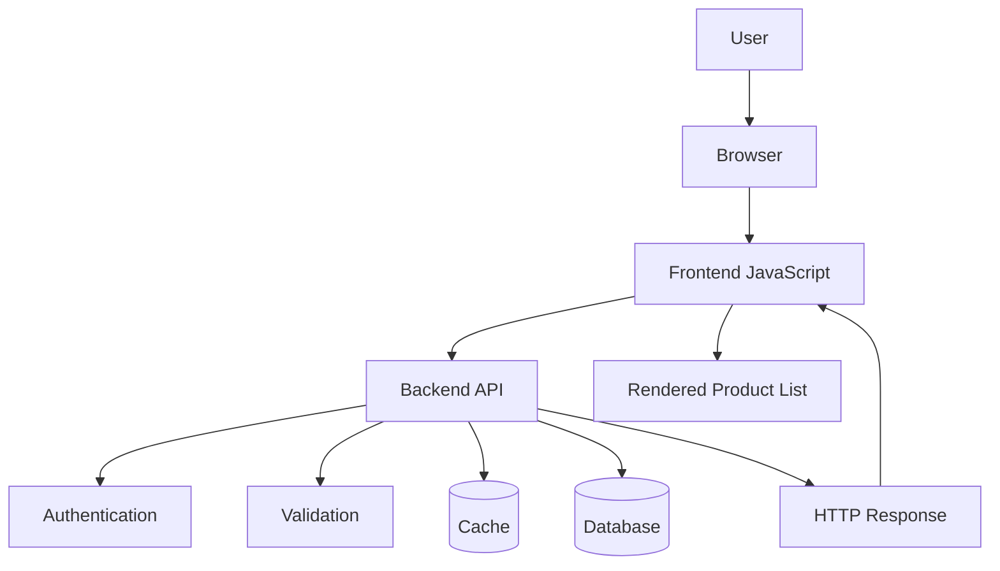
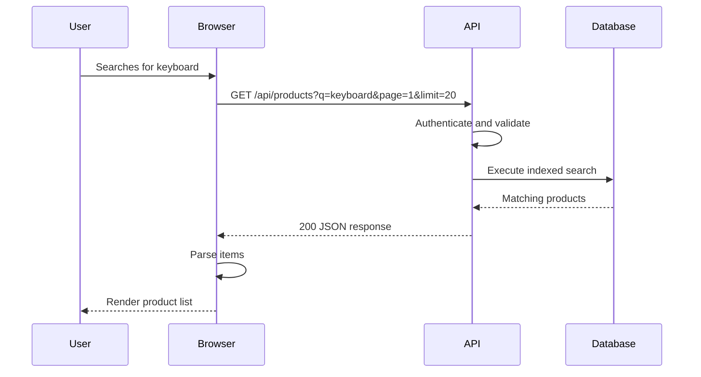
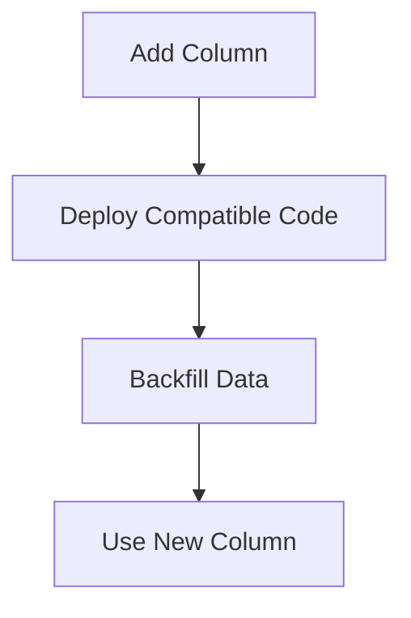

# Scenario — Debugging a Failed API Request  
## Using DevTools, cURL, Headers, Payloads, Status Codes, Logs, and Layered Diagnosis

This scenario tests your ability to diagnose a failed API request from a browser application.

You will investigate a product-search feature that should call:

```http
GET /api/products
```

with query parameters such as:

```text
category=keyboards
page=1
limit=20
```

The expected architecture is:



The user reports:

> “I entered `keyboard` in the search box and clicked Search, but no products appear.”

Your job is to determine where the failure occurs.

---

# Learning Objectives

After completing this scenario, you should be able to:

- Reproduce an API problem systematically.
- Determine whether a request was created.
- Inspect request URLs, methods, parameters, headers, and payloads.
- Interpret response status codes.
- Distinguish frontend, browser, network, backend, and database failures.
- Diagnose authentication and CORS problems.
- Reproduce browser requests using cURL.
- Use request IDs and logs.
- Identify suitable fixes and regression tests.

---

# Scenario Background

The frontend contains:

```html
<form id="product-search">
  <label for="query">Search products</label>
  <input id="query" name="query" />
  <button type="submit">Search</button>
</form>

<p id="status"></p>
<ul id="results"></ul>
```

The frontend is expected to send:

```http
GET /api/products?q=keyboard&page=1&limit=20
Accept: application/json
```

The API contract says:

```text
Endpoint:
  GET /api/products

Query parameters:
  q: optional search string
  page: optional positive integer
  limit: optional integer from 1 to 100

Success:
  200 OK

Response:
  {
    "items": [],
    "page": 1,
    "limit": 20,
    "total": 0
  }

Possible errors:
  400 Bad Request
  422 Unprocessable Content
  429 Too Many Requests
  500 Internal Server Error
```

---

# Part 1 — Establishing the Problem

## Question 1

What should you record before changing code?

List at least five pieces of context.

---

## Question 2

Which browser Developer Tools panels should you open first?

---

## Question 3

Why should you clear old Network requests before reproducing the problem?

---

## Question 4

Why might enabling Preserve log be useful?

---

## Question 5

Why should you reproduce the action only once at first?

---

## Question 6

What should the expected frontend request look like?

Write a simplified request.

---

# Part 2 — First Observation

You open the Console and see:

```text
Uncaught TypeError:
Cannot read properties of null (reading 'addEventListener')
```

The Network panel contains no request to:

```text
/api/products
```

## Question 7

What is the likely failure layer?

---

## Question 8

What does the error suggest?

---

## Question 9

What should you inspect in the Elements panel?

---

## Question 10

What should you inspect in the Sources panel?

---

## Question 11

What would be an appropriate immediate debugging hypothesis?

---

# Part 3 — Frontend Fix Attempt

You discover that the JavaScript runs before the form exists in the DOM:

```javascript
const form = document.querySelector("#product-search");

form.addEventListener("submit", handleSearch);
```

The script is loaded in the `<head>` without `defer`.

## Question 12

Why can `form` be `null`?

---

## Question 13

Name two reasonable fixes.

---

## Question 14

After applying a fix, what should you verify before inspecting backend behavior?

---

## Question 15

What could happen if the form submission handler does not call `preventDefault()`?

---

# Part 4 — A Request Now Appears

After fixing the initialization issue, the request appears:

```text
Request URL:
https://app.example.com/api/products?q=keyboard&page=1&limit=20

Request Method:
GET

Status Code:
404 Not Found
```

The backend documentation says the API is hosted at:

```text
https://api.example.com/api/products
```

## Question 16

What is likely wrong?

---

## Question 17

What frontend configuration should you inspect?

---

## Question 18

What is the difference between these two requests?

```text
https://app.example.com/api/products
https://api.example.com/api/products
```

---

## Question 19

What could cause the frontend to use a relative URL unintentionally?

---

## Question 20

What should you verify after changing the API base URL?

---

# Part 5 — Environment Configuration

The frontend code contains:

```javascript
const API_BASE_URL =
  import.meta.env.PUBLIC_API_BASE_URL || "";
```

The production build was created without:

```text
PUBLIC_API_BASE_URL=https://api.example.com
```

## Question 21

What value will likely be used when the environment variable is missing?

---

## Question 22

Why can this lead to a `404`?

---

## Question 23

What is the difference between a public frontend configuration value and a secret?

---

## Question 24

What should the application do if a required API base URL is missing?

---

## Question 25

Why should the frontend not receive a database password as a “public” environment variable?

---

# Part 6 — The Request Reaches the API

After correcting the API base URL, the request is:

```http
GET https://api.example.com/api/products?q=keyboard&page=1&limit=20
Accept: application/json
Origin: https://app.example.com
```

The browser reports:

```text
Access to fetch at 'https://api.example.com/api/products?...'
from origin 'https://app.example.com'
has been blocked by CORS policy.
```

The Network panel shows an `OPTIONS` request:

```http
OPTIONS /api/products HTTP/1.1
Origin: https://app.example.com
Access-Control-Request-Method: GET
Access-Control-Request-Headers: authorization
```

Response:

```http
HTTP/1.1 204 No Content
Access-Control-Allow-Origin: https://staging.example.com
Access-Control-Allow-Methods: GET, POST
```

## Question 26

What is the CORS problem?

---

## Question 27

Why did the browser send an `OPTIONS` request?

---

## Question 28

What response header contains the incorrect value?

---

## Question 29

What should the production API return for the allowed origin?

---

## Question 30

What other CORS headers may need to be configured?

---

## Question 31

Would cURL necessarily fail in the same way?

Explain.

---

# Part 7 — Authentication Failure

After fixing CORS, the browser can read the API response:

```http
HTTP/1.1 401 Unauthorized
```

Response body:

```json
{
  "error": {
    "code": "AUTHENTICATION_REQUIRED",
    "message": "Please sign in."
  }
}
```

## Question 32

What does this response usually mean?

---

## Question 33

What should you inspect in the browser request?

---

## Question 34

What should you inspect in the login response?

---

## Question 35

If authentication uses cookies, which cookie properties should you inspect?

---

## Question 36

If authentication uses a bearer token, which header should you inspect?

---

## Question 37

What should the frontend do when it receives `401`?

---

# Part 8 — Cookie Configuration Problem

The login response contains:

```http
Set-Cookie: session_id=REDACTED; Secure; HttpOnly; SameSite=Lax
```

The frontend is hosted at:

```text
https://app.example.com
```

The API is hosted at:

```text
https://api.example.com
```

The frontend uses:

```javascript
fetch(url, {
  credentials: "omit"
});
```

## Question 38

Why might the browser not send the session cookie?

---

## Question 39

What may need to change in the fetch request?

---

## Question 40

What server-side CORS configuration is relevant when credentials are used?

---

## Question 41

Why is this configuration generally invalid or unsafe?

```http
Access-Control-Allow-Origin: *
Access-Control-Allow-Credentials: true
```

---

# Part 9 — Validation Failure

After authentication is fixed, the request returns:

```http
HTTP/1.1 422 Unprocessable Content
```

Response:

```json
{
  "error": {
    "code": "VALIDATION_FAILED",
    "fields": {
      "limit": "Must be an integer."
    }
  }
}
```

The Network panel shows:

```text
limit=20
```

But the backend logs show:

```text
Received limit: "20"
```

## Question 42

Why might the backend see `"20"` as a string?

---

## Question 43

Should query parameters be assumed to be numbers automatically?

---

## Question 44

Where should the backend convert and validate `limit`?

---

## Question 45

What should happen for these values?

```text
limit=20
limit=0
limit=-1
limit=abc
limit=1000
```

---

## Question 46

What should the frontend display for a validation error?

---

# Part 10 — Backend Error

After fixing the query parsing, the response becomes:

```http
HTTP/1.1 500 Internal Server Error
X-Request-ID: req_abc123
```

Response:

```json
{
  "error": {
    "code": "INTERNAL_ERROR",
    "message": "The request could not be completed.",
    "requestId": "req_abc123"
  }
}
```

## Question 47

What should you do with the request ID?

---

## Question 48

Where should you search for the detailed failure?

---

## Question 49

Why should the response not include a raw database stack trace?

---

## Question 50

What might be wrong in the backend or database layer?

List at least five possibilities.

---

# Part 11 — Backend Logs

The application log contains:

```text
2026-07-22T12:30:10Z
ERROR
requestId=req_abc123
route=GET /api/products
error="column products.search_vector does not exist"
```

## Question 51

What does this error suggest?

---

## Question 52

What recent change might have caused it?

---

## Question 53

What database or deployment checks should you perform?

---

## Question 54

How could a migration have prevented this problem?

---

## Question 55

What should happen if the application and database schema are temporarily incompatible during a deployment?

---

# Part 12 — Performance Investigation

The schema issue is fixed. The request now succeeds:

```http
HTTP/1.1 200 OK
```

But the request takes:

```text
4.8 seconds
```

Timing:

```text
DNS:       20 ms
Connect:   15 ms
TLS:       30 ms
TTFB:      4.6 s
Download:  20 ms
```

## Question 56

Which phase is causing most of the delay?

---

## Question 57

What should you investigate first?

---

## Question 58

What database problems could produce high TTFB?

---

## Question 59

What API design problems could produce high TTFB?

---

## Question 60

What tools or evidence could help identify the bottleneck?

---

# Part 13 — Database Query Investigation

The database query is:

```sql
SELECT
  id,
  name,
  price,
  available
FROM products
WHERE search_vector @@ plainto_tsquery($1)
ORDER BY popularity DESC
LIMIT $2 OFFSET $3;
```

The database table contains 20 million products.

## Question 61

What database features might improve this search?

---

## Question 62

What should you inspect in the query plan?

---

## Question 63

Why might offset pagination become inefficient for large values?

---

## Question 64

What alternative pagination strategy could help?

---

## Question 65

Why should `LIMIT` have a maximum allowed value?

---

# Part 14 — Response and Frontend Rendering

The API now returns:

```json
{
  "items": [
    {
      "id": 123,
      "name": "Mechanical Keyboard",
      "price": 79.99
    }
  ],
  "page": 1,
  "limit": 20,
  "total": 1
}
```

But the UI remains blank.

The Console shows:

```text
TypeError:
Cannot read properties of undefined (reading 'map')
```

Frontend code:

```javascript
const products = response.products;
products.map(renderProduct);
```

## Question 66

What is wrong with the frontend code?

---

## Question 67

What property does the API actually return?

---

## Question 68

What should the frontend code use?

---

## Question 69

What type of problem is this now?

---

## Question 70

What regression test should be added?

---

# Part 15 — Final Working Flow

After all fixes, the working flow is:



## Question 71

List the major problems discovered during the scenario.

---

## Question 72

Which problems were frontend problems?

---

## Question 73

Which problems were configuration or browser-policy problems?

---

## Question 74

Which problems were backend or database problems?

---

## Question 75

Which tests should be added to prevent these regressions?

---

# Part 16 — Reproduction with cURL

A simplified authenticated request might be:

```bash
curl \
  -i \
  -G \
  -H "Accept: application/json" \
  -H "Authorization: Bearer REDACTED" \
  "https://api.example.com/api/products" \
  --data-urlencode "q=keyboard" \
  --data-urlencode "page=1" \
  --data-urlencode "limit=20"
```

## Question 76

What does `-G` do in this command?

---

## Question 77

Why is `--data-urlencode` useful?

---

## Question 78

What does the `Authorization` header provide?

---

## Question 79

What important browser behavior may not be reproduced by this cURL command?

---

## Question 80

What must be redacted before sharing the command?

---

# Answer Key

# Part 1 — Establishing the Problem Answers

## Question 1

Record at least:

```text
Exact page URL
User action
Browser and version
Device
Environment
User authentication state
Frequency of the problem
Time of occurrence
Recent deployment or configuration change
```

---

## Question 2

Open:

```text
Console
Network
```

The Application or Storage panel may also be useful for cookies and browser storage.

---

## Question 3

Clearing old requests makes it easier to identify the request created by the specific action being tested.

---

## Question 4

Preserve log keeps requests and Console messages across navigation and reloads. It is useful for redirects, login flows, and form submissions.

---

## Question 5

One controlled action creates a clear relationship between the user action and the resulting request. Repeated clicks can create duplicate or confusing traffic.

---

## Question 6

A simplified request is:

```http
GET /api/products?q=keyboard&page=1&limit=20 HTTP/1.1
Host: api.example.com
Accept: application/json
```

---

# Part 2 — First Observation Answers

## Question 7

The failure is most likely in frontend JavaScript execution or initialization.

No request appears, so the browser likely failed before creating the API call.

---

## Question 8

`document.querySelector("#product-search")` returned `null`, so the code attempted to call `addEventListener` on a nonexistent element.

---

## Question 9

Inspect whether the form exists in the DOM:

```html
<form id="product-search">
```

Check:

```text
Correct ID
Correct page
Correct rendering
Whether the form is created dynamically
```

---

## Question 10

Inspect:

```text
Script loading order
Script errors
Breakpoints
Call stack
Document readiness
```

---

## Question 11

A reasonable hypothesis is:

```text
The JavaScript executes before the form has been parsed into the DOM.
```

Other possibilities include:

```text
Wrong selector
Missing form
Conditional rendering
Script loaded on the wrong page
```

---

# Part 3 — Frontend Fix Attempt Answers

## Question 12

The script runs while the browser is still parsing the `<head>`, before the form appears in the document body. Therefore, the selector finds nothing.

---

## Question 13

Possible fixes:

```html
<script src="/app.js" defer></script>
```

or place the script before the closing `</body>` tag.

Another option is:

```javascript
document.addEventListener("DOMContentLoaded", () => {
  const form = document.querySelector("#product-search");
  form.addEventListener("submit", handleSearch);
});
```

Also verify the selector itself is correct.

---

## Question 14

Verify:

```text
No Console initialization error
Form handler is registered
Clicking or submitting the form triggers the handler
A request appears in Network
```

---

## Question 15

The browser may perform its default form submission, causing:

```text
Page reload
Navigation
Loss of client state
Duplicate submission
```

Use:

```javascript
event.preventDefault();
```

when handling the form through JavaScript.

---

# Part 4 — Request Appears Answers

## Question 16

The frontend is calling:

```text
https://app.example.com/api/products
```

but the API is documented at:

```text
https://api.example.com/api/products
```

The frontend is using the wrong host or API base URL.

---

## Question 17

Inspect:

```text
API base URL
Environment variables
Build configuration
Proxy configuration
Runtime configuration
Deployment settings
```

---

## Question 18

They use different hosts and therefore different origins:

```text
app.example.com:
  Frontend host

api.example.com:
  API host
```

The second request targets the documented API server. The first targets the frontend host.

---

## Question 19

The frontend may use:

```javascript
fetch("/api/products");
```

A relative URL is resolved against the current frontend origin.

This may be intentional when a reverse proxy forwards `/api`, but incorrect when the API is hosted elsewhere.

---

## Question 20

Verify:

```text
Correct request URL
Correct environment
Correct CORS configuration
Correct authentication
Correct response
No unintended redirects
```

---

# Part 5 — Environment Configuration Answers

## Question 21

If the variable is missing, this expression likely uses:

```text
""
```

as the API base URL.

The request becomes relative to the current frontend origin.

---

## Question 22

The request may go to:

```text
https://app.example.com/api/products
```

instead of:

```text
https://api.example.com/api/products
```

If the frontend server has no matching API route, it returns `404`.

---

## Question 23

A public frontend configuration value is intended to be visible to browser users, such as a public API URL.

A secret grants authority, such as a database password or payment-provider private key, and must remain server-side.

---

## Question 24

The application should fail clearly during build or startup, or display a clear configuration error. It should not silently fall back to an incorrect production URL.

---

## Question 25

A browser user can inspect the frontend bundle and recover the value. This would expose the database credential and potentially allow unauthorized database access.

---

# Part 6 — CORS Answers

## Question 26

The API allows:

```text
https://staging.example.com
```

but the request originates from:

```text
https://app.example.com
```

The production origin is not authorized.

---

## Question 27

The browser sends an `OPTIONS` preflight to ask whether the origin, method, and request headers are permitted before sending the actual cross-origin request.

---

## Question 28

This header contains the incorrect value:

```http
Access-Control-Allow-Origin: https://staging.example.com
```

---

## Question 29

The production API should return:

```http
Access-Control-Allow-Origin: https://app.example.com
```

assuming that origin is trusted and intended to use the API.

---

## Question 30

Depending on the request, configure:

```http
Access-Control-Allow-Methods
Access-Control-Allow-Headers
Access-Control-Allow-Credentials
Access-Control-Max-Age
```

---

## Question 31

Not necessarily. cURL does not enforce browser CORS rules. It may display the response even when browser JavaScript is prohibited from reading it.

---

# Part 7 — Authentication Answers

## Question 32

The API could not establish valid authentication.

Possible causes:

```text
No session cookie
Missing bearer token
Expired token
Invalid token
Incorrect environment
```

---

## Question 33

Inspect:

```text
Cookie header
Authorization header
Request origin
Request URL
Credentials mode
```

---

## Question 34

Inspect:

```text
Login status
Set-Cookie header
Access-token response
Redirects
Authentication error body
```

---

## Question 35

Inspect:

```text
Domain
Path
Secure
HttpOnly
SameSite
Expiration
Browser storage
```

---

## Question 36

Inspect:

```http
Authorization: Bearer ...
```

---

## Question 37

The frontend should usually:

```text
Show a login prompt
Attempt a safe token refresh where appropriate
Clear invalid session state
Avoid infinite retries
Explain that authentication is required
```

---

# Part 8 — Cookie Configuration Answers

## Question 38

The frontend explicitly uses:

```javascript
credentials: "omit"
```

This tells the browser not to include credentials such as cookies.

---

## Question 39

For a credentialed cross-origin request, the frontend may need:

```javascript
fetch(url, {
  credentials: "include"
});
```

This must match the server’s CORS and cookie configuration.

---

## Question 40

The server may need:

```http
Access-Control-Allow-Origin: https://app.example.com
Access-Control-Allow-Credentials: true
```

The cookie’s `SameSite`, `Secure`, domain, and path settings must also permit the intended use.

---

## Question 41

Credentialed CORS generally cannot use a wildcard origin. The server must specify the exact allowed origin when credentials are included.

---

# Part 9 — Validation Answers

## Question 42

Query parameters arrive as text in the URL. Even though the text is:

```text
20
```

the server may initially represent it as:

```text
"20"
```

---

## Question 43

No. Query parameters are text and must be explicitly parsed and validated according to the API contract.

---

## Question 44

The backend should parse and validate `limit` at the API boundary before using it in business logic or database queries.

---

## Question 45

Possible behavior:

```text
limit=20:
  Accept.

limit=0:
  Reject; below minimum.

limit=-1:
  Reject; negative.

limit=abc:
  Reject; not numeric.

limit=1000:
  Reject; above maximum.
```

A common response is:

```http
422 Unprocessable Content
```

---

## Question 46

The frontend should show a clear, actionable message, such as:

```text
Choose a result limit between 1 and 100.
```

The backend must still enforce the rule.

---

# Part 10 — Backend Error Answers

## Question 47

Use `req_abc123` to search application logs, database logs, traces, and dependency logs for the request.

---

## Question 48

Inspect:

```text
Application logs
Database logs
Query errors
Recent deployments
Migration status
Environment configuration
```

---

## Question 49

Raw stack traces can expose:

```text
Database structure
File paths
Internal hostnames
Libraries
Queries
Sensitive implementation details
```

Return a safe error while logging details securely.

---

## Question 50

Possible causes:

```text
Missing database column
Failed migration
Database unavailable
Invalid query
Missing environment variable
Connection pool exhaustion
Permission failure
Unexpected data
Application bug
```

---

# Part 11 — Backend Log Answers

## Question 51

The application expects a `search_vector` column that does not exist in the database schema.

---

## Question 52

Possible causes:

```text
Application deployed before its migration
Migration failed
Migration ran against the wrong database
Production database is behind
Schema differs between environments
```

---

## Question 53

Check:

```text
Migration history
Current database schema
Connected database URL
Deployment version
Migration logs
Database permissions
```

---

## Question 54

A migration should create the required column before application code depends on it. Deployment should verify migration success and schema compatibility.

---

## Question 55

The system should avoid sending incompatible traffic to the application. Use compatible migration sequencing:



---

# Part 12 — Performance Answers

## Question 56

The high TTFB is causing most of the delay.

---

## Question 57

Investigate server-side processing:

```text
Database query
Application logs
Cache lookup
External services
Connection pool
Server queue
```

---

## Question 58

Possible causes:

```text
Missing index
Full table scan
Slow search query
Large offset
Lock contention
Database overload
Connection wait
N+1 queries
```

---

## Question 59

Possible causes:

```text
Overly complex filtering
Unbounded query
Expensive serialization
External service call
Slow authentication
Cache miss
Excessive middleware
```

---

## Question 60

Use:

```text
Database query plans
Application timing logs
Distributed traces
APM tools
Slow-query logs
Cache metrics
Connection-pool metrics
```

---

# Part 13 — Database Query Answers

## Question 61

Possible improvements:

```text
Full-text search index
Appropriate index on search fields
Query-plan analysis
Search engine for large-scale search
Efficient pagination
Result caching where safe
```

---

## Question 62

Inspect:

```text
Index usage
Sequential scans
Rows examined
Rows returned
Sort operations
Query duration
Estimated versus actual rows
```

---

## Question 63

Large offsets may require the database to scan or skip many preceding rows before returning the requested page.

---

## Question 64

Cursor-based pagination may be more efficient:

```text
GET /api/products?limit=20&after=cursor_abc
```

---

## Question 65

A maximum prevents clients from requesting huge result sets that consume excessive database, memory, network, and browser resources.

---

# Part 14 — Frontend Rendering Answers

## Question 66

The frontend expects:

```javascript
response.products
```

but the API returns:

```javascript
response.items
```

The property name is incorrect.

---

## Question 67

The API returns:

```javascript
response.items
```

---

## Question 68

Use:

```javascript
const products = response.items;
products.map(renderProduct);
```

---

## Question 69

This is now a frontend response-shape or rendering bug. The API request succeeded, but the frontend interpreted the response incorrectly.

---

## Question 70

Add a test that verifies the frontend correctly renders an API response containing an `items` array.

Also consider an API contract or schema test to prevent response-shape drift.

---

# Part 15 — Final Working Flow Answers

## Question 71

Problems discovered:

```text
Frontend script ran before the form existed.
Production API base URL was missing.
Browser CORS origin was misconfigured.
Authentication was missing or not sent.
Cookie credentials mode was incorrect.
Query parameters required backend parsing and validation.
Database schema was missing a required search column.
Search performance was poor.
Frontend expected response.products instead of response.items.
```

---

## Question 72

Frontend problems:

```text
Script initialization timing
Missing form event handler
Incorrect response property
Potential missing preventDefault
```

---

## Question 73

Configuration or browser-policy problems:

```text
Missing production API base URL
CORS allowed the staging origin instead of production
Credentials were omitted from fetch
Cookie configuration may have affected authentication
```

---

## Question 74

Backend or database problems:

```text
Missing query parsing
Missing validation
Missing database migration
Slow search query
Potential missing index or search vector
```

---

## Question 75

Add tests for:

```text
Form initialization
Search request creation
Production API configuration
CORS configuration
Authentication behavior
Cookie or token transmission
Query-parameter validation
Database migration
Search query performance
Response shape
Frontend rendering of response.items
Error states
```

---

# Part 16 — cURL Reproduction Answers

## Question 76

`-G` tells cURL to append the `--data-urlencode` values to the URL as query parameters instead of using them as a request body.

---

## Question 77

`--data-urlencode` safely encodes spaces, ampersands, question marks, and other special characters in query values.

---

## Question 78

The `Authorization` header provides bearer-token authentication to the API.

---

## Question 79

The command may not reproduce:

```text
Browser CORS enforcement
Service-worker interception
Browser cache
Automatic cookie behavior
Frontend-generated headers
Browser credential policies
```

---

## Question 80

Redact:

```text
Bearer tokens
Cookies
Session IDs
API keys
Passwords
Personal data
Private query parameters
```

---

# Scoring Guidance

## Multiple choice and true/false

```text
1 point per correct answer
```

## Short-answer questions

```text
2 points:
  Correct core concept.

3 points:
  Correct explanation plus a practical example.

4 points:
  Correct explanation, evidence source, and appropriate next step.
```

## Scenario questions

Evaluate whether the learner:

```text
Starts with evidence.
Separates frontend, browser, network, API, database, and rendering layers.
Understands configuration and environment problems.
Understands authentication and CORS.
Uses request IDs and logs.
Recognizes database migration issues.
Proposes regression tests.
```

---

# Completion Criteria

You are ready to continue when you can:

```text
Reproduce an API problem.
Use Console and Network together.
Inspect URLs, methods, headers, payloads, and responses.
Diagnose a missing request.
Diagnose wrong API hosts.
Diagnose CORS and authentication.
Diagnose validation errors.
Use request IDs to inspect logs.
Identify database migration failures.
Analyze TTFB and query performance.
Diagnose frontend response-shape errors.
Reproduce requests with cURL.
Design regression tests for each discovered failure.
```
