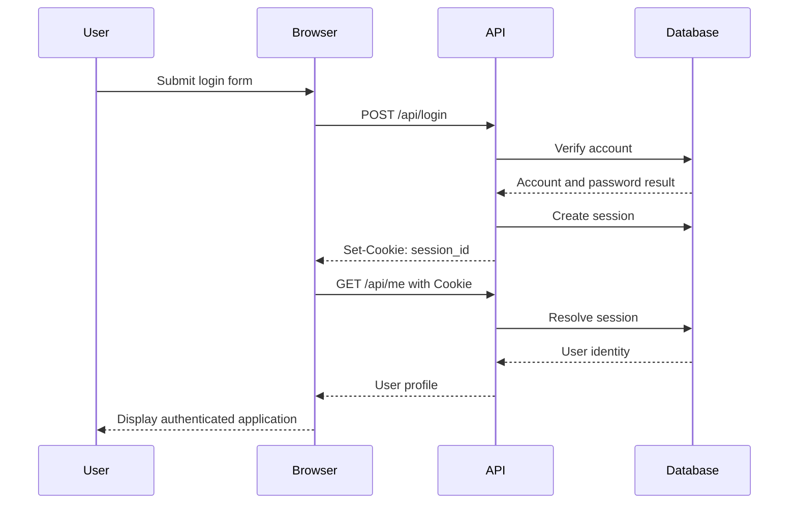
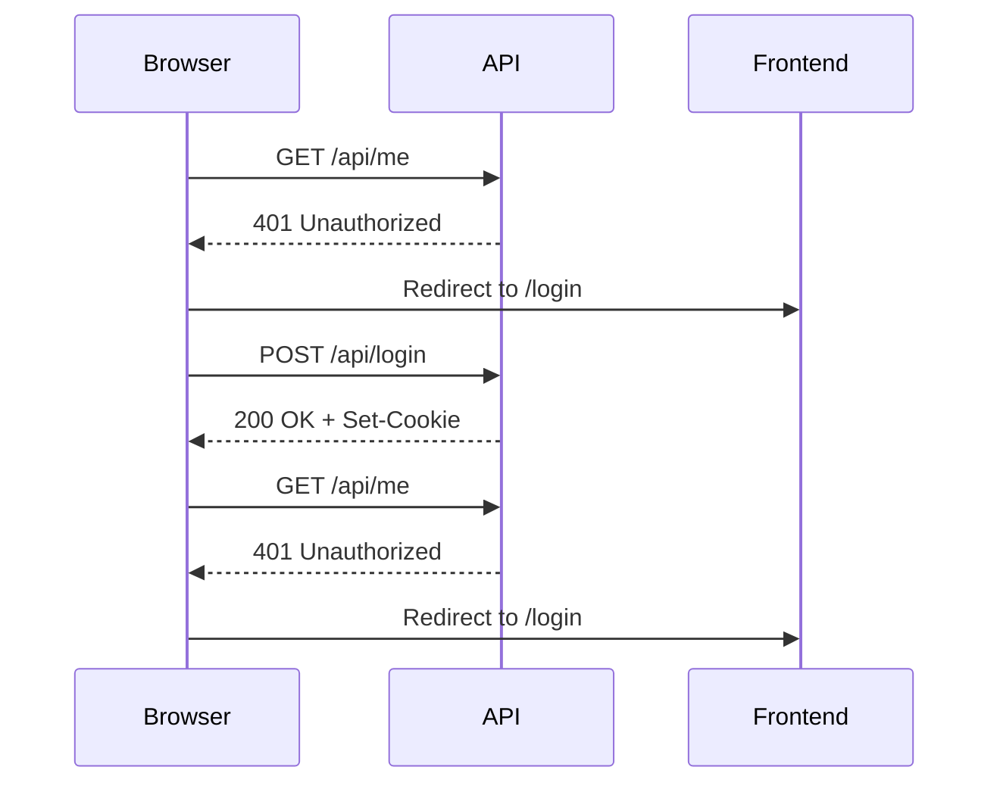
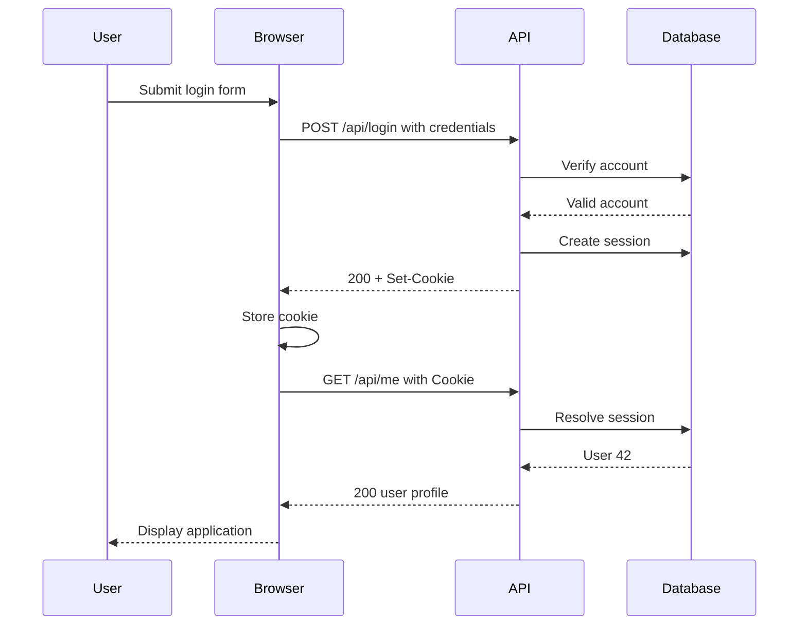

# Scenario — Diagnosing an Authentication Failure  
## Sessions, Cookies, Tokens, CORS, Redirects, Expiration, and Authorization Boundaries

This scenario tests your ability to diagnose a login and authentication problem in a browser-based application.

The application is an internal project-management platform with:

```text
Frontend:
  https://app.example.com

API:
  https://api.example.com

Authentication:
  Session cookie

Database:
  User accounts and sessions

Protected endpoint:
  GET /api/me
```

The expected flow is:



The user reports:

> “Login appears to succeed, but the application immediately sends me back to the login page.”

---

# Learning Objectives

After completing this scenario, you should be able to:

- Distinguish authentication from authorization.
- Trace a login flow through browser, API, database, and session store.
- Inspect login requests and responses.
- Diagnose missing or blocked cookies.
- Understand `Secure`, `HttpOnly`, and `SameSite`.
- Understand credentialed CORS.
- Diagnose redirect loops.
- Diagnose expired and invalid sessions.
- Distinguish frontend authentication state from server authentication state.
- Use cURL to reproduce session-based authentication.
- Design safer authentication tests.

---

# Part 1 — Establishing the Expected Behavior

The login form submits:

```http
POST https://api.example.com/api/login
Content-Type: application/json
Accept: application/json
Origin: https://app.example.com
```

Request body:

```json
{
  "email": "alex@example.com",
  "password": "REDACTED"
}
```

Expected response:

```http
HTTP/1.1 200 OK
Set-Cookie: session_id=REDACTED; Secure; HttpOnly; SameSite=None; Path=/
Content-Type: application/json
Access-Control-Allow-Origin: https://app.example.com
Access-Control-Allow-Credentials: true
```

Response body:

```json
{
  "user": {
    "id": 42,
    "name": "Alex"
  }
}
```

The frontend then sends:

```http
GET https://api.example.com/api/me
Cookie: session_id=REDACTED
Origin: https://app.example.com
```

Expected response:

```http
HTTP/1.1 200 OK
Content-Type: application/json
```

```json
{
  "id": 42,
  "name": "Alex",
  "role": "member"
}
```

## Question 1

What are the major steps in this authentication flow?

---

## Question 2

Which response header creates the browser session?

---

## Question 3

Which request header sends the session back to the server?

---

## Question 4

Why is the session cookie usually opaque rather than containing all user information?

---

## Question 5

Which system should determine whether the session is valid?

---

# Part 2 — First Browser Investigation

The developer opens Network and sees:

```text
POST /api/login
Status: 200 OK
Response body:
{
  "user": {
    "id": 42,
    "name": "Alex"
  }
}
```

The response headers are:

```http
Content-Type: application/json
Access-Control-Allow-Origin: https://app.example.com
Access-Control-Allow-Credentials: true
```

There is no:

```http
Set-Cookie
```

The next request is:

```text
GET /api/me
Status: 401 Unauthorized
```

## Question 6

What is the likely problem?

---

## Question 7

Why can the login response be `200 OK` while the next request is `401`?

---

## Question 8

What should you inspect in the backend login handler?

---

## Question 9

What should the backend return if it successfully creates a session?

---

## Question 10

What should the frontend verify after login?

---

# Part 3 — Cookie Is Set but Not Sent

The backend is fixed and now returns:

```http
Set-Cookie: session_id=REDACTED; Secure; HttpOnly; SameSite=None; Path=/
```

The browser stores the cookie.

However, the next request still appears as:

```http
GET /api/me
Origin: https://app.example.com
```

There is no:

```http
Cookie: session_id=...
```

The frontend code is:

```javascript
fetch("https://api.example.com/api/me", {
  credentials: "omit"
});
```

## Question 11

What is preventing the cookie from being sent?

---

## Question 12

What should the frontend likely use instead?

---

## Question 13

What does `credentials: "include"` tell the browser?

---

## Question 14

What other browser and server settings must be compatible?

---

## Question 15

Why should the frontend not manually read an `HttpOnly` session cookie?

---

# Part 4 — Credentialed CORS

The frontend changes to:

```javascript
fetch("https://api.example.com/api/me", {
  credentials: "include"
});
```

The browser now sends a preflight request:

```http
OPTIONS /api/me
Origin: https://app.example.com
Access-Control-Request-Method: GET
Access-Control-Request-Headers: content-type
```

The API responds:

```http
HTTP/1.1 204 No Content
Access-Control-Allow-Origin: *
Access-Control-Allow-Methods: GET, POST
Access-Control-Allow-Credentials: true
```

The browser reports a CORS error.

## Question 16

What is wrong with this CORS response?

---

## Question 17

What should `Access-Control-Allow-Origin` contain?

---

## Question 18

Why is `*` generally incompatible with credentialed browser requests?

---

## Question 19

What does `Access-Control-Allow-Credentials: true` authorize?

---

## Question 20

Does CORS replace authentication and authorization?

---

# Part 5 — Cookie Attributes

The cookie is now:

```http
Set-Cookie: session_id=REDACTED; Secure; HttpOnly; SameSite=Lax; Domain=api.example.com; Path=/
```

The frontend is:

```text
https://app.example.com
```

The API is:

```text
https://api.example.com
```

The browser still does not send the cookie in the cross-origin API request.

## Question 21

What cookie attribute may be relevant to this cross-site setup?

---

## Question 22

When might `SameSite=None` be required?

---

## Question 23

What additional attribute is generally required with `SameSite=None`?

---

## Question 24

What does `Secure` require?

---

## Question 25

What does `HttpOnly` do?

---

## Question 26

What does `Domain=api.example.com` control?

---

## Question 27

What does `Path=/` control?

---

# Part 6 — Redirect Loop

After changing cookie and CORS settings, the application behaves like this:



## Question 28

What does this indicate?

---

## Question 29

What should you compare between the login response and the `/api/me` request?

---

## Question 30

What could cause the session to be created but not recognized?

---

## Question 31

What could cause the login endpoint and `/api/me` endpoint to use different session stores?

---

## Question 32

What should the frontend do to avoid an infinite redirect loop?

---

# Part 7 — Session Expiration

The browser sends:

```http
Cookie: session_id=REDACTED
```

The API responds:

```http
401 Unauthorized
```

The backend logs:

```text
session not found
```

## Question 33

What could cause the session not to be found?

---

## Question 34

What should happen when a session expires?

---

## Question 35

Should the frontend retry the same invalid session forever?

---

## Question 36

What should the server do when it receives an invalid session cookie?

---

## Question 37

What security risk exists if session cookies never expire?

---

# Part 8 — Token-Based Variation

Suppose the application uses bearer tokens instead of cookies.

The request is:

```http
GET /api/me
Authorization: Bearer REDACTED
```

The response is:

```http
401 Unauthorized
```

## Question 38

What should you inspect?

---

## Question 39

What token properties might cause rejection?

---

## Question 40

What is the difference between an access token and a refresh token?

---

## Question 41

Why should access tokens usually have limited lifetimes?

---

## Question 42

Why must refresh tokens be strongly protected?

---

# Part 9 — Authentication vs Authorization

The session is now valid.

The user requests:

```http
GET /api/admin/reports
```

The response is:

```http
403 Forbidden
```

The user is:

```json
{
  "id": 42,
  "role": "member"
}
```

## Question 43

Is this an authentication or authorization failure?

---

## Question 44

Why is `403` appropriate here?

---

## Question 45

What should the frontend display?

---

## Question 46

Why should the frontend not simply hide the error and pretend the page loaded?

---

# Part 10 — Cross-Subdomain Configuration

The frontend is moved to:

```text
https://dashboard.example.com
```

The API remains:

```text
https://api.example.com
```

The authentication cookie is:

```http
Set-Cookie: session_id=REDACTED; Secure; HttpOnly; SameSite=None; Domain=api.example.com; Path=/
```

## Question 47

Will the browser send the cookie to `dashboard.example.com`?

---

## Question 48

Which host receives the cookie according to this `Domain` attribute?

---

## Question 49

How might the authentication architecture change if the organization wants one shared cookie across subdomains?

---

## Question 50

What security risk comes with making a cookie available to a wider parent domain?

---

# Part 11 — cURL Reproduction

The developer saves cookies:

```bash
curl \
  -i \
  -c cookies.txt \
  -X POST \
  -H "Content-Type: application/json" \
  -d '{"email":"alex@example.com","password":"REDACTED"}' \
  https://api.example.com/api/login
```

Then requests the account:

```bash
curl \
  -i \
  -b cookies.txt \
  https://api.example.com/api/me
```

## Question 51

What does `-c cookies.txt` do?

---

## Question 52

What does `-b cookies.txt` do?

---

## Question 53

Why might cURL succeed while browser JavaScript still fails?

---

## Question 54

What browser behavior is not fully reproduced by these commands?

---

## Question 55

What sensitive information should be protected in `cookies.txt`?

---

# Part 12 — Security Analysis

## Question 56

Why should session cookies normally use `HttpOnly`?

---

## Question 57

Why should session cookies normally use `Secure`?

---

## Question 58

Why should session IDs not be placed in URLs?

---

## Question 59

Why should session IDs not be written to logs?

---

## Question 60

What should happen after a user changes their password?

---

# Part 13 — Final Correct Flow

After fixing the problems, the authentication flow becomes:



## Question 61

List the problems discovered during the scenario.

---

## Question 62

Which problems were frontend configuration issues?

---

## Question 63

Which problems were browser or CORS issues?

---

## Question 64

Which problems were backend or session-store issues?

---

## Question 65

Which tests should be added to prevent these regressions?

---

# Answer Key

# Part 1 — Expected Behavior Answers

## Question 1

Major steps:

```text
User submits credentials.
Browser sends login request.
Server verifies credentials.
Server creates a session.
Server sends a session cookie.
Browser stores the cookie.
Browser sends the cookie on protected requests.
Server resolves the session.
Server returns the authenticated user.
```

---

## Question 2

```http
Set-Cookie
```

---

## Question 3

```http
Cookie
```

---

## Question 4

An opaque session ID avoids placing all user information in the browser cookie. The server can store session data centrally and invalidate or change it without exposing internal details.

---

## Question 5

The backend session system or trusted session store should determine whether the session is valid.

---

# Part 2 — First Browser Investigation Answers

## Question 6

The login endpoint returns success but does not set a session cookie. Therefore, the browser has no session credential to send to `/api/me`.

---

## Question 7

The login request succeeded as an HTTP operation, but authentication state was not established for later requests.

---

## Question 8

Inspect whether the login handler:

```text
Verified credentials
Created a session
Stored the session
Returned Set-Cookie
Used the correct session store
```

---

## Question 9

It should return a secure session cookie:

```http
Set-Cookie: session_id=REDACTED; Secure; HttpOnly; SameSite=...; Path=/
```

The exact attributes depend on the deployment.

---

## Question 10

The frontend should verify:

```text
Login status
Response body
Set-Cookie behavior through browser tools
Subsequent /api/me request
Authentication state
```

---

# Part 3 — Cookie Sent Answers

## Question 11

The frontend explicitly sets:

```javascript
credentials: "omit"
```

This tells the browser not to include cookies.

---

## Question 12

For a credentialed cross-origin request, use:

```javascript
fetch(url, {
  credentials: "include"
});
```

---

## Question 13

`credentials: "include"` tells the browser to include credentials such as cookies in the request, subject to cookie and CORS rules.

---

## Question 14

Compatible settings include:

```text
Access-Control-Allow-Origin
Access-Control-Allow-Credentials
Cookie Domain
Cookie Path
Secure
SameSite
HTTPS
Frontend request credentials mode
```

---

## Question 15

`HttpOnly` prevents normal page JavaScript from reading the cookie. The browser can still attach it automatically to matching requests.

---

# Part 4 — Credentialed CORS Answers

## Question 16

The response uses:

```http
Access-Control-Allow-Origin: *
```

while also allowing credentials:

```http
Access-Control-Allow-Credentials: true
```

Credentialed CORS requires a specific allowed origin rather than a wildcard.

---

## Question 17

It should contain:

```http
Access-Control-Allow-Origin: https://app.example.com
```

---

## Question 18

A wildcard origin does not identify a specific trusted origin and is generally incompatible with credentialed browser requests.

---

## Question 19

It tells the browser that the server permits credentials such as cookies for the allowed origin. It does not itself authenticate or authorize the user.

---

## Question 20

No. CORS controls browser access to cross-origin responses. Authentication identifies users, and authorization controls permissions.

---

# Part 5 — Cookie Attribute Answers

## Question 21

`SameSite=Lax` may prevent the cookie from being sent in the required cross-site request context.

---

## Question 22

`SameSite=None` may be required when a cookie must be sent in cross-site contexts, depending on the browser, site relationship, and application design.

---

## Question 23

`SameSite=None` generally requires:

```text
Secure
```

---

## Question 24

`Secure` requires the cookie to be sent only over HTTPS.

---

## Question 25

`HttpOnly` prevents normal JavaScript access to the cookie through APIs such as `document.cookie`.

---

## Question 26

`Domain=api.example.com` limits the cookie’s domain scope to the API host and matching rules. It does not automatically make the cookie available to every sibling subdomain.

---

## Question 27

`Path=/` allows the cookie to be sent for paths under the configured host.

---

# Part 6 — Redirect Loop Answers

## Question 28

The login request appears to succeed, but the authenticated session is not recognized by `/api/me`.

---

## Question 29

Compare:

```text
Set-Cookie from login
Cookie on /api/me
Cookie domain and path
Secure and SameSite
Credentials mode
API host
Session-store behavior
```

---

## Question 30

Possible causes:

```text
Cookie not sent
Session not stored
Different session stores
Different database
Incorrect signing key
Session expired immediately
Cookie domain mismatch
```

---

## Question 31

The login service and account service may use:

```text
Different databases
Different session-store URLs
Different environments
Different encryption or signing keys
Different namespaces
```

Therefore, the second service cannot resolve the session created by the first.

---

## Question 32

The frontend should limit redirects and handle repeated `401` responses safely. It should not continuously redirect between account and login pages.

---

# Part 7 — Session Expiration Answers

## Question 33

Possible causes:

```text
Session expired
Session was revoked
Session store was cleared
Wrong session database
Wrong signing key
Cookie value was corrupted
Deployment changed session configuration
```

---

## Question 34

The server should reject the request with `401 Unauthorized`. It may also clear the invalid cookie.

The frontend should ask the user to authenticate again.

---

## Question 35

No. Repeating an invalid session request forever creates loops and unnecessary traffic.

---

## Question 36

The server should reject it safely, avoid treating the caller as authenticated, and optionally clear the invalid session cookie.

---

## Question 37

Long-lived sessions increase the window during which a stolen session can be used.

---

# Part 8 — Token-Based Variation Answers

## Question 38

Inspect:

```text
Authorization header
Token format
Token expiration
Token signature
Issuer
Audience
Scopes
API environment
Clock synchronization
```

---

## Question 39

Possible causes:

```text
Expired token
Invalid signature
Wrong issuer
Wrong audience
Missing scope
Malformed token
Wrong environment
Revoked token
```

---

## Question 40

An access token is used to access protected APIs and is usually short-lived. A refresh token is used to obtain a new access token and usually requires stronger protection.

---

## Question 41

Short-lived tokens reduce the time window in which a stolen token can be abused.

---

## Question 42

Refresh tokens can create long-lived access and must be protected against theft, replay, and unauthorized use.

---

# Part 9 — Authentication vs Authorization Answers

## Question 43

This is an authorization failure.

---

## Question 44

The user is authenticated but does not have the administrator permission required for the endpoint.

---

## Question 45

The frontend should show a clear permission message, such as:

```text
You do not have permission to view this report.
```

It should not expose unnecessary internal details.

---

## Question 46

Hiding the error creates a confusing interface and may make users think data is missing. The frontend should represent the actual permission state appropriately.

---

# Part 10 — Cross-Subdomain Answers

## Question 47

Not necessarily. The cookie is scoped to:

```text
api.example.com
```

It is not automatically sent to:

```text
dashboard.example.com
```

---

## Question 48

The cookie is scoped to:

```text
api.example.com
```

---

## Question 49

Options include:

```text
Use a parent-domain cookie such as Domain=example.com, with careful security review.
Use a shared authentication service.
Use redirects or a centralized login flow.
Use tokens passed through controlled secure mechanisms.
Keep authentication host-specific and let each application communicate with the identity provider.
```

---

## Question 50

A wider domain makes the cookie available to more subdomains. If one subdomain is compromised, it may increase the risk to the shared cookie and authenticated sessions.

---

# Part 11 — cURL Answers

## Question 51

`-c cookies.txt` saves cookies received from the server into the cookie jar file.

---

## Question 52

`-b cookies.txt` reads cookies from the file and sends matching cookies with the request.

---

## Question 53

cURL may succeed because it is not subject to browser CORS enforcement or browser cookie policies. It may also be sending cookies differently from the browser.

---

## Question 54

The commands may not reproduce:

```text
Browser CORS enforcement
Service worker behavior
Browser cache
Automatic browser cookie policies
Frontend-generated headers
```

---

## Question 55

Protect:

```text
Session cookies
Authentication cookies
Tokens
User identifiers
Any private values
```

The file should not be committed or shared publicly.

---

# Part 12 — Security Analysis Answers

## Question 56

`HttpOnly` reduces the ability of injected page JavaScript to read the session cookie.

It does not prevent all session abuse, but it is a valuable defense.

---

## Question 57

`Secure` prevents the browser from sending the cookie over unencrypted HTTP.

---

## Question 58

URLs may appear in:

```text
Browser history
Server logs
Proxy logs
Analytics
Referrer data
Screenshots
```

Session IDs in URLs can be leaked and reused.

---

## Question 59

Logs may be accessible to many systems and people. A logged session ID may allow someone to impersonate the user.

---

## Question 60

Depending on the security policy, existing sessions should be revoked or rotated after a password change. The user should be notified of the change.

---

# Part 13 — Final Correct Flow Answers

## Question 61

Problems discovered:

```text
Login did not set a session cookie.
Frontend omitted credentials.
CORS allowed the wrong origin.
Wildcard origin was used with credentials.
SameSite configuration was incompatible.
Session may not have been shared between services.
Expired sessions were not handled cleanly.
Authorization was distinct from authentication.
```

---

## Question 62

Frontend configuration issues:

```text
credentials: "omit"
Potential missing API credentials configuration
Potential redirect-loop handling
```

---

## Question 63

Browser and CORS issues:

```text
Wrong Access-Control-Allow-Origin
Wildcard origin with credentials
SameSite cookie behavior
Secure cookie requirements
Cross-origin credential configuration
```

---

## Question 64

Backend or session-store issues:

```text
Missing Set-Cookie
Session not stored
Different session stores
Wrong signing or encryption key
Expired or revoked sessions
Incorrect cookie scope
```

---

## Question 65

Add tests for:

```text
Successful login
Invalid credentials
Missing credentials
Set-Cookie behavior
Credentialed API request
Cookie domain and SameSite behavior
Expired session
Revoked session
Logout
401 handling
403 authorization
Cross-subdomain behavior
Redirect-loop prevention
Session-store consistency
Token expiration if token-based authentication is used
```

---

# Scoring Guidance

## Multiple-choice and true/false

```text
1 point per correct answer
```

## Short-answer questions

```text
2 points:
  Correct core concept.

3 points:
  Correct explanation plus example.

4 points:
  Correct explanation, browser/server distinction, and security implication.
```

## Scenario questions

Evaluate whether the learner:

```text
Traces the authentication flow correctly.
Distinguishes login success from established session state.
Inspects cookies and headers.
Understands credentialed CORS.
Distinguishes authentication from authorization.
Recognizes session-store and configuration problems.
Protects sensitive values.
Proposes regression tests.
```

---

# Completion Criteria

You are ready to continue when you can:

```text
Trace a login flow.
Explain Set-Cookie and Cookie.
Explain session identifiers.
Understand Secure, HttpOnly, and SameSite.
Configure credentialed cross-origin requests conceptually.
Diagnose missing cookies.
Diagnose invalid or expired sessions.
Distinguish 401 from 403.
Distinguish authentication from authorization.
Reproduce sessions with cURL.
Identify session-store inconsistencies.
Design authentication regression tests.
```
