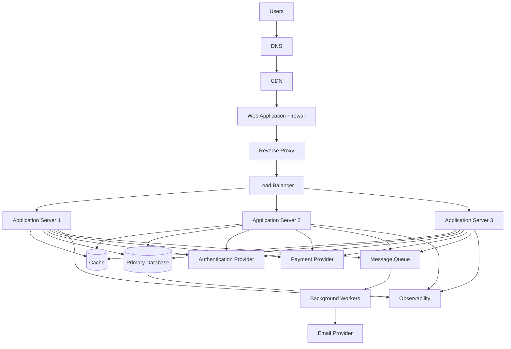
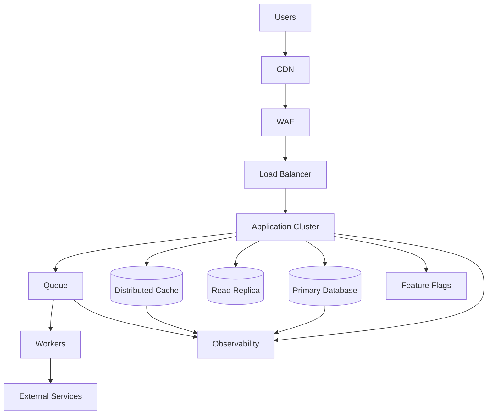

# Scenario — Diagnosing and Responding to a Production Outage  
## Detection, Triage, Mitigation, Rollback, Dependencies, Observability, Recovery, and Post-Incident Learning

This scenario tests your ability to respond to a production outage in a structured and evidence-based way.

The application is an online store serving real customers.

Users report:

```text
The website is slow.
Some users cannot log in.
Product pages sometimes fail.
Checkout is intermittently unavailable.
```

The production architecture is:



---

# Incident Timeline

The following events occur:

```text
09:00 — Version 4.8.0 deployment begins.
09:05 — Deployment reaches Application Server 1.
09:07 — Error rate begins increasing.
09:08 — Deployment reaches Application Server 2.
09:09 — Users report slow product pages.
09:10 — Authentication failures increase.
09:11 — Deployment reaches Application Server 3.
09:12 — Checkout failures increase.
09:13 — Monitoring alert fires.
09:15 — Queue depth begins rising.
09:18 — Database CPU reaches 95%.
09:20 — Support reports duplicate checkout attempts.
09:25 — On-call engineer begins investigation.
```

---

# Learning Objectives

After completing this scenario, you should be able to:

- Distinguish an incident from an isolated error.
- Assess impact and severity.
- Build an incident timeline.
- Identify likely correlations with a deployment.
- Use logs, metrics, traces, and request IDs.
- Separate symptoms from root causes.
- Prioritize mitigation over perfect diagnosis.
- Evaluate rollback and feature-flag options.
- Handle database pressure and queue growth.
- Investigate authentication and payment failures.
- Prevent duplicate operations during retries.
- Communicate during an incident.
- Conduct a post-incident review.
- Design corrective and preventive actions.

---

# Part 1 — Initial Incident Recognition

## Question 1

What evidence suggests this is a production incident rather than an isolated user problem?

---

## Question 2

Which symptoms indicate customer impact?

---

## Question 3

Why is the deployment timeline important?

---

## Question 4

What should the incident commander determine first?

---

## Question 5

What information should be recorded immediately?

List at least ten items.

---

## Question 6

Why should the team avoid making many unrelated changes during the first few minutes?

---

## Question 7

What is the first operational priority during an outage?

---

# Part 2 — Incident Severity and Scope

Assume current monitoring shows:

```text
HTTP 5xx rate: 18%
Login failure rate: 22%
Checkout failure rate: 14%
P95 product-page latency: 8.5 seconds
Queue oldest-job age: 12 minutes
Database CPU: 95%
```

## Question 8

What does the combination of these metrics suggest?

---

## Question 9

Which functions appear most critical to investigate?

---

## Question 10

How would you distinguish a regional issue from a global issue?

---

## Question 11

What user segments should you compare?

Examples may include:

```text
Region
Browser
Device
Account type
Endpoint
Application version
```

---

## Question 12

Why is a rising queue age important even if users do not directly see queue errors?

---

## Question 13

What is the difference between error rate and availability?

---

# Part 3 — Observability Investigation

The application dashboard shows:

```text
Product API P95: 8.2 s
Login API P95: 6.4 s
Checkout API P95: 9.1 s
Database query P95: 7.5 s
Cache hit rate: 4%
Payment provider latency: 300 ms
Authentication provider latency: 250 ms
```

## Question 14

Which dependency appears to be the main bottleneck?

---

## Question 15

What does the very low cache hit rate suggest?

---

## Question 16

Why is it useful to compare application latency with database query latency?

---

## Question 17

What might the relatively low payment-provider latency tell you?

---

## Question 18

What traces should you inspect?

---

## Question 19

What fields should a useful log entry contain?

---

## Question 20

Why are request IDs important during an incident?

---

# Part 4 — Deployment Correlation

The application version dashboard shows:

```text
Version 4.7.3:
  Normal error rate
  Normal database query time
  Cache hit rate: 82%

Version 4.8.0:
  High error rate
  High database query time
  Cache hit rate: 4%
```

## Question 21

What does this comparison suggest?

---

## Question 22

What should the team consider doing with the deployment?

---

## Question 23

What information should be checked before rolling back?

---

## Question 24

Why might rolling back application code not be enough?

---

## Question 25

What database migration risks should be considered?

---

# Part 5 — Query and Database Investigation

The new version introduced this query:

```sql
SELECT
  id,
  name,
  price,
  image_url
FROM products
WHERE category = $1
  AND available = TRUE
ORDER BY popularity DESC
LIMIT $2 OFFSET $3;
```

The production query plan shows:

```text
Seq Scan on products
Rows examined: 20,000,000
Rows returned: 20
External sort
Temporary disk usage: 1.2 GB
Execution time: 7.4 seconds
```

## Question 26

What does the query plan reveal?

---

## Question 27

Why could this query increase database CPU and disk usage?

---

## Question 28

What database improvements might help?

---

## Question 29

What immediate mitigation could reduce database pressure without waiting for a full redesign?

---

## Question 30

Why might reducing the maximum `limit` help?

---

## Question 31

Why might offset pagination become expensive?

---

## Question 32

What should be checked before creating a new production index during an incident?

---

# Part 6 — Cache Failure and Cache Misses

The cache dashboard shows:

```text
Normal cache hit rate before deployment: 82%
Current cache hit rate: 4%
```

The deployment changed cache keys from:

```text
product-list:category:keyboards
```

to:

```text
products:v2:category:keyboards:page:1:limit:20:sort:popularity
```

However, one code path still reads the old key format.

## Question 33

What problem does this suggest?

---

## Question 34

How can inconsistent cache keys affect performance?

---

## Question 35

What immediate mitigation could help?

---

## Question 36

What longer-term fixes should be implemented?

---

## Question 37

Why must the cache not be treated as the permanent source of truth?

---

# Part 7 — Authentication Failures

Authentication metrics show:

```text
Login requests: normal volume
Authentication failures: 22%
Authentication provider latency: normal
Session lookup latency: high
Session-store errors: increasing
```

## Question 38

What component appears more suspicious than the external authentication provider?

---

## Question 39

What session-store problems might cause these symptoms?

---

## Question 40

Why might users experience login loops?

---

## Question 41

What could happen if the application creates a session but another application server cannot read it?

---

## Question 42

What mitigation could reduce authentication impact while the root cause is investigated?

---

# Part 8 — Checkout and Duplicate Operations

Support reports:

```text
Some users clicked “Pay” more than once.
Some users see multiple pending orders.
Some payment attempts have unclear status.
```

The checkout endpoint is:

```http
POST /api/orders
```

The request does not contain:

```http
Idempotency-Key
```

## Question 43

Why can users create duplicate orders during an outage?

---

## Question 44

What is the risk of retrying a payment request blindly?

---

## Question 45

What should the checkout API use to make retries safer?

---

## Question 46

What should happen when payment status is uncertain?

---

## Question 47

Should the system immediately mark an uncertain payment as failed?

Explain.

---

## Question 48

What database constraints or business rules could help prevent duplicates?

---

# Part 9 — Queue and Worker Investigation

Queue metrics show:

```text
Queue depth: increasing
Oldest job: 18 minutes old
Worker count: unchanged
Worker failure rate: 4%
Email provider latency: normal
```

## Question 49

What could cause queue depth to increase if the email provider is healthy?

---

## Question 50

What worker metrics should you inspect?

---

## Question 51

What is the risk of immediately adding unlimited workers?

---

## Question 52

What could happen if workers repeatedly retry the same failed job?

---

## Question 53

What is a dead-letter queue?

---

## Question 54

How could the team reduce queue pressure safely?

---

# Part 10 — Mitigation and Rollback

The team confirms:

```text
Version 4.8.0 introduced the slow query.
Version 4.7.3 did not have the problem.
Database schema is compatible with version 4.7.3.
No irreversible migration from 4.8.0 has run.
```

## Question 55

What mitigation is likely appropriate?

---

## Question 56

What should be monitored during rollback?

---

## Question 57

What if rollback is not safe because a migration already changed the database?

---

## Question 58

What alternatives to rollback might help?

---

## Question 59

Why might a feature flag help during an incident?

---

## Question 60

What should the team avoid doing during a high-pressure incident?

---

# Part 11 — Communication

The incident affects checkout and authentication.

## Question 61

Who should be informed internally?

---

## Question 62

What should a customer-facing status message communicate?

---

## Question 63

What should a status message avoid exposing?

---

## Question 64

Why should technical and customer communication be coordinated?

---

## Question 65

What information should be included in the incident timeline?

---

# Part 12 — Recovery

After rollback:

```text
HTTP 5xx rate: 0.4%
Login failure rate: normal
Checkout failure rate: normal
P95 product-page latency: 420 ms
Queue oldest-job age: 2 minutes
Database CPU: 48%
Cache hit rate: 80%
```

## Question 66

Does this indicate service recovery?

---

## Question 67

What should be verified before closing the incident?

---

## Question 68

Why should the team continue monitoring after metrics normalize?

---

## Question 69

What should happen to jobs created during the outage?

---

## Question 70

What should happen to pending or uncertain orders?

---

# Part 13 — Post-Incident Review

The confirmed root cause is:

```text
Version 4.8.0 introduced a new search query.
The query lacked the necessary index.
A cache-key mismatch reduced cache hit rate.
Higher database latency caused request timeouts.
Retries increased traffic.
Authentication session lookups were also delayed by database pressure.
Checkout clients retried without idempotency keys.
```

## Question 71

Identify the direct causes.

---

## Question 72

Identify contributing factors.

---

## Question 73

Identify detection gaps.

---

## Question 74

Identify mitigation gaps.

---

## Question 75

Identify prevention actions.

---

# Part 14 — Architecture Improvement

The team proposes this improved architecture:



## Question 76

Why might a read replica help product-search traffic?

---

## Question 77

What problem does a distributed cache solve compared with process-local memory?

---

## Question 78

How could feature flags reduce deployment risk?

---

## Question 79

Why should observability include the cache, database, and queue?

---

## Question 80

What new consistency concerns might a read replica introduce?

---

# Answer Key

# Part 1 — Initial Incident Recognition Answers

## Question 1

Evidence includes:

```text
Multiple users report problems.
Several unrelated features are affected.
Error rates are elevated.
Latency is elevated.
Authentication and checkout are failing.
The issue correlates with a deployment.
Monitoring has fired.
```

---

## Question 2

Customer-impacting symptoms include:

```text
Slow product pages
Login failures
Checkout failures
Duplicate order attempts
Delayed notifications
```

---

## Question 3

The deployment timeline helps determine whether the release correlates with the start of the incident. The sharp change after version 4.8.0 is important evidence.

Correlation is not automatically proof of causation, but it is a strong investigation lead.

---

## Question 4

Determine:

```text
Is there an active incident?
How many users are affected?
Which critical functions are failing?
What is the current severity?
Who owns incident coordination?
What mitigation is available?
```

---

## Question 5

Record:

```text
Start time
Detection time
Affected endpoints
Affected user groups
Error rates
Latency
Recent deployments
Configuration changes
Database health
Queue health
External dependency health
Mitigation steps
Communication updates
Recovery time
```

---

## Question 6

Unrelated changes make it harder to identify the cause, may create additional failures, and can destroy useful evidence.

---

## Question 7

The first priority is to reduce user impact and restore reliable service, even before the complete root cause is known.

---

# Part 2 — Incident Severity and Scope Answers

## Question 8

The system is experiencing a broad production incident involving:

```text
High errors
Authentication failures
Checkout failures
Severe latency
Database pressure
Queue delay
```

This is not an isolated endpoint issue.

---

## Question 9

Prioritize:

```text
Authentication
Checkout and payment
Database
Product API
Load balancer and application health
Queue and workers
```

---

## Question 10

Compare:

```text
Regions
Availability zones
ISPs
Browsers
Devices
Application versions
API instances
```

Check whether failures occur globally or only in a geographic or infrastructure segment.

---

## Question 11

Compare:

```text
Region
Browser
Device
User role
Account type
Endpoint
Application version
Data center
Network provider
```

This can reveal whether the issue is regional, client-specific, version-specific, or global.

---

## Question 12

Increasing queue age means background work is delayed. Users may eventually experience:

```text
Delayed emails
Delayed processing
Stale statuses
Accumulated work
Retry amplification
```

---

## Question 13

Error rate measures failed requests or operations. Availability measures whether the service is usable and reachable according to a defined target.

A system can have:

```text
Low total error rate but complete failure for one critical workflow.
```

---

# Part 3 — Observability Answers

## Question 14

The database appears to be the main bottleneck:

```text
Database query P95: 7.5 seconds
```

---

## Question 15

A 4% cache hit rate means most requests are bypassing the cache and reaching the backend and database.

---

## Question 16

Comparing application and database timing shows whether the backend is slow because of its own processing or because it is waiting for the database.

---

## Question 17

Payment latency is normal, so payment is less likely to be the primary cause of the broad latency increase.

It may still have secondary issues, but it is not the strongest initial bottleneck signal.

---

## Question 18

Inspect traces for:

```text
Product requests
Login requests
Checkout requests
Database spans
Cache spans
Session lookups
Payment calls
Queue publication
```

---

## Question 19

Useful log fields include:

```text
Timestamp
Request ID
Trace ID
Service
Version
Method
Path
Status
Duration
User or resource identifier where safe
Error category
Dependency timing
```

Do not log secrets.

---

## Question 20

Request IDs connect a user request across:

```text
Frontend evidence
API logs
Database logs
Traces
External service calls
Support reports
```

---

# Part 4 — Deployment Correlation Answers

## Question 21

Version 4.8.0 strongly correlates with:

```text
Higher errors
Higher database latency
Lower cache hit rate
```

The deployment is a likely cause or contributor.

---

## Question 22

The team should consider:

```text
Pausing the rollout
Rolling back
Disabling the affected feature
Using a feature flag
Reducing traffic to the new version
```

---

## Question 23

Check:

```text
Database compatibility
Migration status
Queue-message compatibility
Frontend/backend compatibility
Rollback artifact
Configuration changes
Irreversible data changes
Current user impact
```

---

## Question 24

Rollback may not be enough if:

```text
Database schema changed
Data was transformed
Queues contain incompatible messages
External operations already occurred
Frontend assets expect the new API
```

---

## Question 25

A migration may:

```text
Remove fields needed by the old version
Change data types
Add incompatible constraints
Run partially
Create locks
Transform data irreversibly
```

---

# Part 5 — Database Investigation Answers

## Question 26

The query performs:

```text
Sequential scan of 20 million rows
Large external sort
1.2 GB temporary disk usage
7.4-second execution
```

It lacks an efficient execution plan for the workload.

---

## Question 27

The query consumes:

```text
CPU for scanning
Disk I/O for reading rows
Memory and temporary disk for sorting
Database connections while waiting
```

Under concurrency, this creates severe database pressure.

---

## Question 28

Possible improvements:

```text
Add an appropriate composite index.
Use a full-text or search-specific index.
Reduce sorting work.
Use cursor pagination.
Limit result size.
Use a search service.
Improve query statistics.
Avoid unnecessary columns.
```

---

## Question 29

Immediate mitigation:

```text
Rollback the query.
Disable the search feature.
Reduce maximum limits.
Route searches to a known-good implementation.
Increase safe capacity temporarily.
Serve cached popular results.
```

The safest option depends on the incident.

---

## Question 30

A smaller maximum limit reduces:

```text
Rows returned
Sorting work
Memory usage
Serialization
Network transfer
```

It may not solve a full table scan by itself, but it can reduce overall pressure.

---

## Question 31

Large offsets may require the database to scan or skip many rows before returning the requested page.

---

## Question 32

Check:

```text
Index size
Lock impact
Write performance
Build time
Disk capacity
Replication impact
Query-plan improvement
Rollback strategy
```

---

# Part 6 — Cache Answers

## Question 33

The deployment introduced inconsistent cache-key formats. One code path writes new keys while another reads old keys, causing cache misses.

---

## Question 34

Low cache hit rates force requests to reach slower backend and database paths, increasing:

```text
Latency
Database CPU
Connection usage
Error rate
Cost
```

---

## Question 35

Immediate mitigations:

```text
Rollback the cache-key change.
Disable the affected cache path.
Restore compatible key handling.
Warm the cache with known-good keys.
Temporarily reduce expensive traffic.
```

---

## Question 36

Longer-term fixes:

```text
Centralize cache-key construction.
Add cache-key unit tests.
Add hit-rate monitoring.
Version keys deliberately.
Use compatibility during migrations.
Document invalidation behavior.
```

---

## Question 37

Caches can be cleared, become stale, or fail. The database or another authoritative system should remain the source of truth.

---

# Part 7 — Authentication Answers

## Question 38

The session store or database path appears more suspicious than the external authentication provider because:

```text
Provider latency is normal.
Session lookup latency is high.
Session-store errors are increasing.
```

---

## Question 39

Possible problems:

```text
Database pressure
Session-store overload
Connection-pool exhaustion
Session database unavailable
Incorrect session configuration
Lock contention
Timeouts
Schema or serialization problem
```

---

## Question 40

Login loops can occur when:

```text
Login succeeds but session cookie is not stored.
Cookie is not sent.
Session is not found.
Session store is inconsistent.
Frontend retries 401 indefinitely.
```

---

## Question 41

One application server may create the session, but another server cannot find it. The user appears logged out when the load balancer sends the next request elsewhere.

---

## Question 42

Mitigations may include:

```text
Repair shared session storage.
Temporarily route authentication traffic to healthy instances.
Reduce database pressure.
Rollback the session-related release.
Pause aggressive frontend retries.
```

Avoid hiding authentication failures or weakening security checks.

---

# Part 8 — Checkout Answers

## Question 43

Users may double-click or retry because requests time out or responses are delayed. Without duplicate protection, multiple requests can create multiple orders.

---

## Question 44

Blind payment retries can:

```text
Charge the customer twice
Create duplicate payment records
Create duplicate orders
Trigger multiple fulfillment operations
```

---

## Question 45

Use:

```http
Idempotency-Key
```

Also use:

```text
Unique constraints
Payment-status reconciliation
Bounded retries
Transaction records
Webhook handling
```

---

## Question 46

The system should place the operation in an explicit uncertain or pending state and reconcile the final status with the payment provider.

---

## Question 47

No. The provider may have processed the payment even if the response was lost. Marking it failed immediately could create inconsistent records or encourage duplicate payment attempts.

---

## Question 48

Possible controls:

```text
Unique idempotency key
Unique provider transaction ID
Order-state constraints
Database uniqueness constraints
Payment-attempt table
Transactional state transitions
```

---

# Part 9 — Queue and Worker Answers

## Question 49

Possible causes:

```text
Workers process jobs too slowly.
Too few workers.
Jobs are repeatedly retrying.
Some jobs are stuck.
A dependency is slow.
Incoming work exceeds processing capacity.
```

---

## Question 50

Inspect:

```text
Worker count
Worker CPU and memory
Job processing duration
Success rate
Failure rate
Retry count
Oldest job age
Queue depth
Dependency latency
Dead-letter count
```

---

## Question 51

Unlimited workers can overwhelm:

```text
Database
Email provider
External services
CPU and memory
Queue infrastructure
```

Scale gradually and respect dependency limits.

---

## Question 52

Repeated retries can create a retry storm, increase queue age, consume resources, and repeatedly process a permanently invalid job.

---

## Question 53

A dead-letter queue stores jobs that could not be processed successfully after the allowed retry policy.

It allows investigation without blocking normal jobs.

---

## Question 54

Possible mitigations:

```text
Fix or isolate failing jobs.
Move poison messages to a dead-letter queue.
Scale workers within dependency limits.
Reduce incoming job creation.
Adjust retry backoff.
Repair the dependency.
Prioritize critical jobs.
```

---

# Part 10 — Mitigation and Rollback Answers

## Question 55

Rolling back to version 4.7.3 is likely appropriate because:

```text
The new version correlates with the incident.
The previous version was healthy.
The database is compatible.
No irreversible migration ran.
```

---

## Question 56

Monitor:

```text
5xx rate
Latency
Login failures
Checkout failures
Database CPU
Cache hit rate
Queue depth
Payment status
Application health
```

---

## Question 57

If rollback is unsafe:

```text
Pause rollout.
Disable the feature flag.
Deploy a forward fix.
Make the schema backward-compatible.
Restore or complete the migration carefully.
Use a compatibility layer.
```

Do not blindly roll back code against an incompatible schema.

---

## Question 58

Alternatives:

```text
Feature flag disablement
Traffic reduction
Query rollback
Configuration change
Rate limiting
Cache-key compatibility
Read-only mode
Temporary fallback
Forward fix
```

---

## Question 59

A feature flag can disable the faulty code path without rebuilding or redeploying the entire application, reducing exposure and restoring service quickly.

---

## Question 60

Avoid:

```text
Uncoordinated changes
Unlimited retries
Deleting evidence
Running untested migrations
Disabling security controls
Sharing secrets
Blaming individuals
Closing alerts without verification
```

---

# Part 11 — Communication Answers

## Question 61

Inform:

```text
Incident commander
On-call engineering
Database/platform team
Security team if relevant
Payments team
Customer support
Product owner
Communications or status-page owner
Leadership according to policy
```

---

## Question 62

Communicate:

```text
What functionality is affected
When the issue began
What users may experience
That the team is investigating
Current mitigation or workaround
When the next update will occur
```

---

## Question 63

Avoid exposing:

```text
Credentials
Internal hostnames
Security weaknesses
Detailed attack paths
Private user data
Unverified root causes
Sensitive infrastructure details
```

---

## Question 64

Coordinated communication prevents contradictory messages, protects sensitive information, and ensures users receive accurate status updates.

---

## Question 65

Record:

```text
Timestamp
Event
Evidence
Decision
Action owner
Impact
Mitigation
Recovery
```

---

# Part 12 — Recovery Answers

## Question 66

Yes, the main metrics indicate recovery:

```text
Error rate normalized
Authentication recovered
Checkout recovered
Latency improved
Queue age decreased
Database CPU decreased
Cache hit rate returned
```

Continue verification before declaring full recovery.

---

## Question 67

Verify:

```text
Critical user workflows
Authentication
Product browsing
Checkout
Payment reconciliation
Queue processing
Email delivery
Database consistency
Error rate
Latency
Application health
```

---

## Question 68

Delayed failures, queue backlog, stale cache, and remaining data inconsistencies may appear after the main metrics normalize.

---

## Question 69

Inspect and process jobs created during the outage. Avoid duplicate processing through idempotent workers and appropriate deduplication.

---

## Question 70

Reconcile pending orders and payment attempts with the payment provider and internal records. Do not assume every uncertain operation failed.

---

# Part 13 — Post-Incident Answers

## Question 71 — Direct Causes

```text
New unindexed search query
Cache-key mismatch
Database query latency
Request timeouts
Retrying clients
```

---

## Question 72 — Contributing Factors

```text
No required index before deployment
Low cache hit rate
No idempotency keys
High database coupling
Insufficient load testing
Possible session-store dependence on overloaded database
Deployment reached all instances
```

---

## Question 73 — Detection Gaps

Possible gaps:

```text
No deployment canary
No query-latency alert
No cache-hit-rate alert
No database saturation alert
No checkout-specific alert
No authentication-specific alert
Insufficient pre-production load testing
```

---

## Question 74 — Mitigation Gaps

Possible gaps:

```text
No immediate feature flag
Rollback not automated
No query fallback
No idempotency protection
Retries too aggressive
No database capacity guard
No clear incident ownership
```

---

## Question 75 — Prevention Actions

Possible actions:

```text
Add and verify search index.
Add query-plan regression tests.
Add cache-key tests.
Monitor cache hit rate.
Add idempotency keys.
Add deployment canaries.
Add database saturation alerts.
Bound retries.
Add checkout reconciliation.
Load-test realistic search traffic.
Improve rollback automation.
Add runbooks.
```

---

# Part 14 — Architecture Improvement Answers

## Question 76

A read replica can handle read-heavy product-search traffic separately from the primary database, reducing load on the primary.

Considerations include:

```text
Replication lag
Read-after-write consistency
Failover
Query routing
```

---

## Question 77

A distributed cache is shared across application instances. Unlike process-local memory, it allows any instance to read the same cached values.

---

## Question 78

Feature flags allow the team to disable or gradually roll out risky functionality without replacing the entire application.

---

## Question 79

Observing cache, database, and queue metrics helps identify where latency and failure originate:

```text
Cache hit rate
Database query time
Queue depth
Oldest job age
Worker failure rate
```

---

## Question 80

Read replicas may be behind the primary. A user may write data and immediately read an older version from the replica.

Applications must decide whether to:

```text
Read from primary after writes
Accept eventual consistency
Route specific reads carefully
Display pending states
```

---

# Scoring Guidance

## Multiple-choice and true/false

```text
1 point per correct answer
```

## Short-answer questions

```text
2 points:
  Correct core concept.

3 points:
  Correct concept plus an operational example.

4 points:
  Correct concept, evidence source, mitigation, and recovery consideration.
```

## Incident-response questions

Evaluate whether the learner:

```text
Prioritizes user impact.
Establishes incident ownership.
Collects evidence.
Mitigates before over-investigating.
Protects security controls.
Communicates accurately.
Plans recovery and follow-up.
```

## Architecture questions

Evaluate:

```text
Failure isolation
Data consistency
Scalability
Observability
Rollback safety
Dependency behavior
Operational complexity
```

---

# Completion Criteria

You are ready to continue when you can:

```text
Recognize a production incident.
Assess scope and severity.
Build an incident timeline.
Correlate deployments with failures.
Use logs, metrics, and traces.
Identify database and cache bottlenecks.
Handle session and authentication failures.
Protect checkout from duplicate operations.
Manage queues and retries.
Choose rollback or forward-fix strategies.
Communicate during an outage.
Verify recovery.
Conduct a post-incident review.
Design preventive actions.
```
