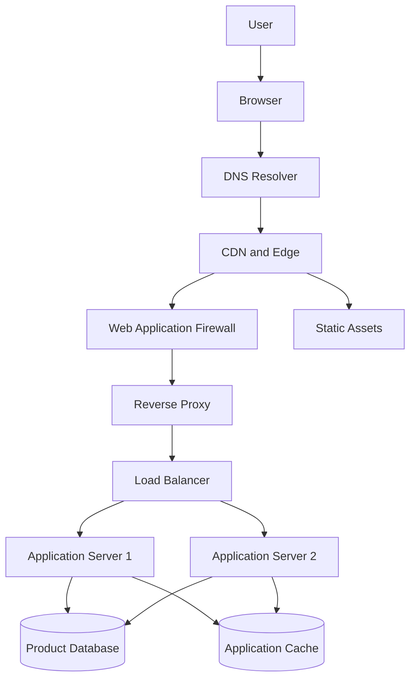
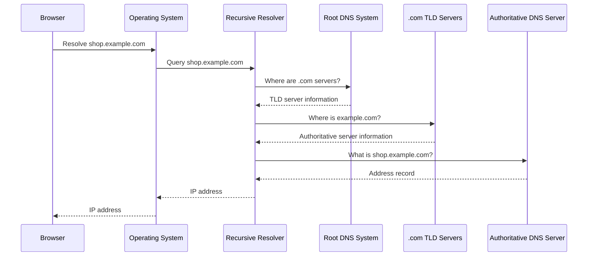
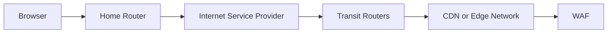
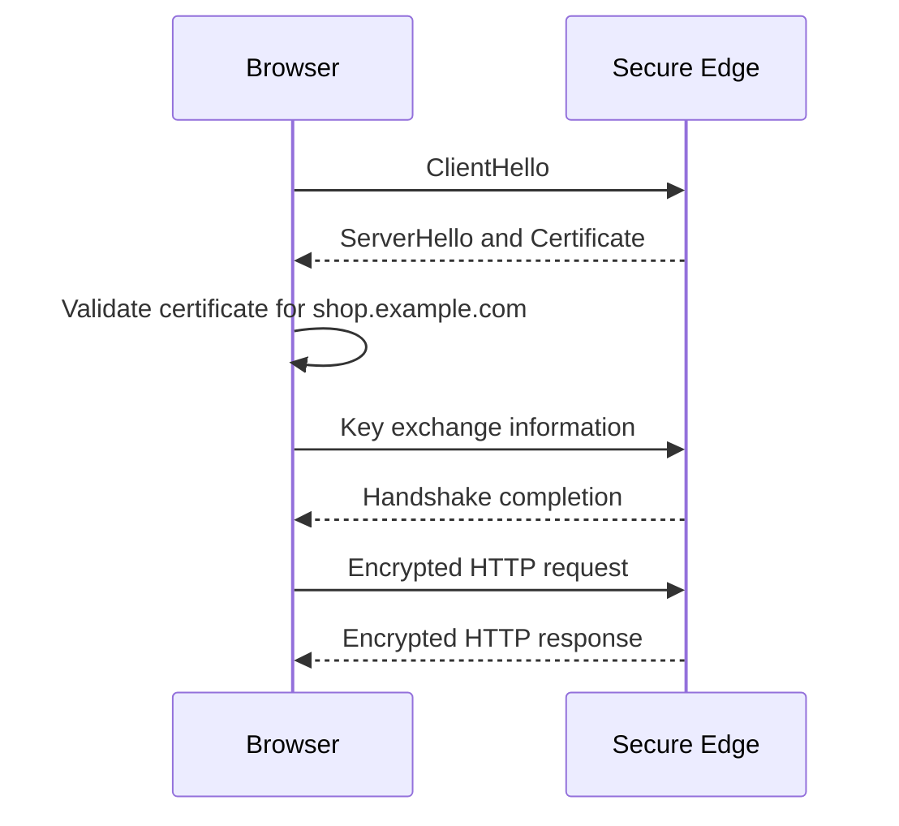
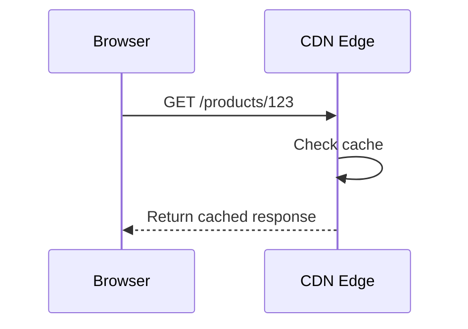
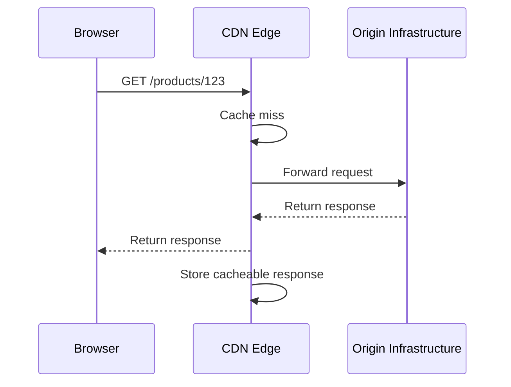
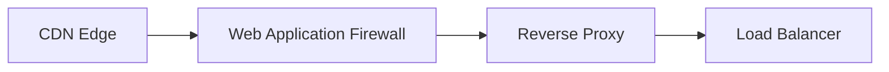
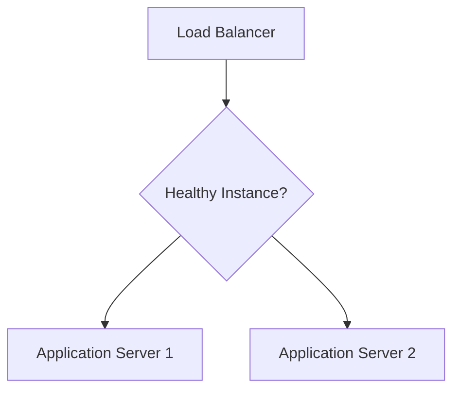
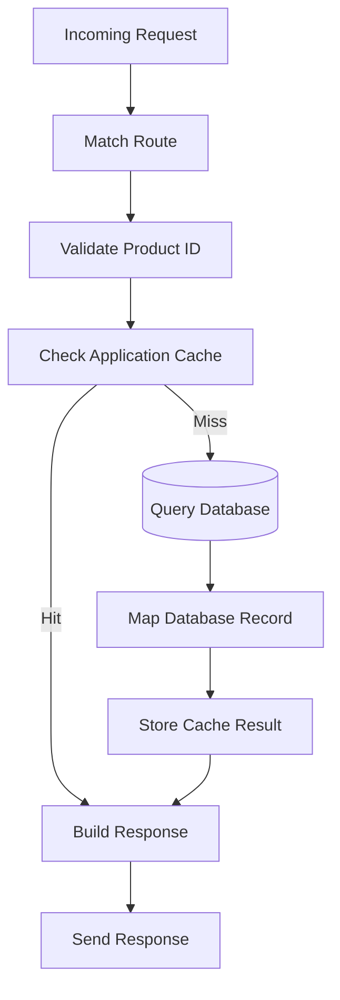
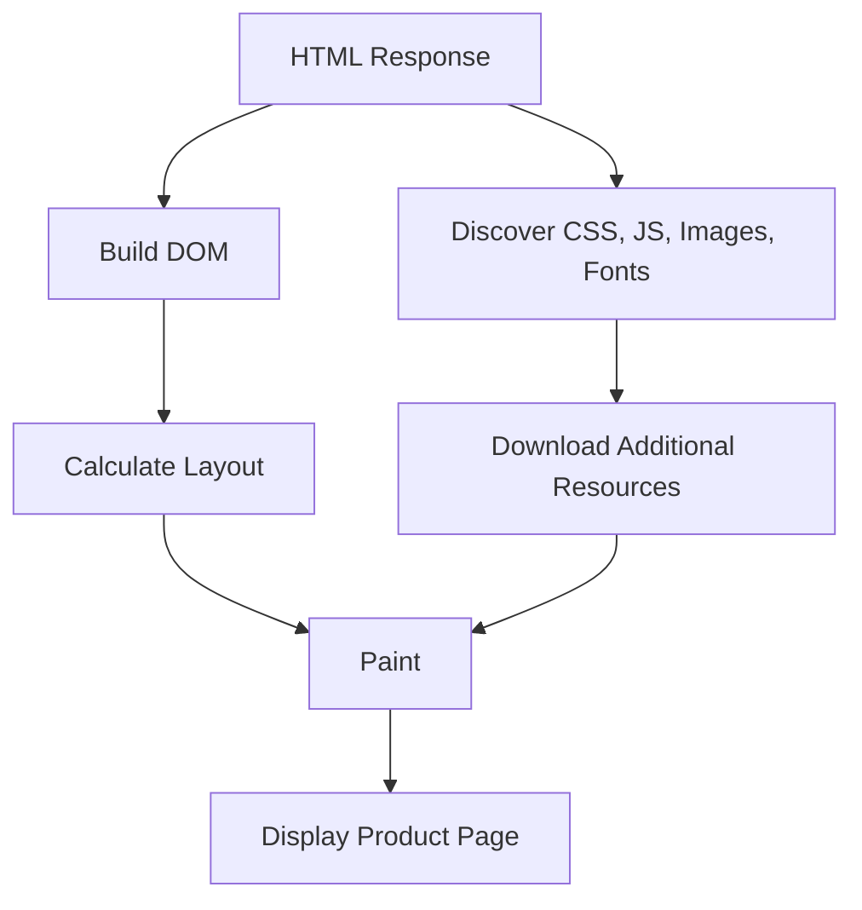

# Scenario — End-to-End Web Request Tracing  
## Following a Request from User Action to Server Response

This scenario tests your ability to trace a web request across the major layers of a modern web application.

You will follow a user opening an online store and viewing a product page:

```text
https://shop.example.com/products/123
```

The goal is to understand:

- What the browser does
- How DNS participates
- How network routing works
- How HTTPS protects communication
- How HTTP carries the request
- How a CDN or load balancer may participate
- How the backend processes the request
- How the database provides data
- How the response returns to the browser
- How the browser renders the result
- Where failures can occur
- What evidence can diagnose each failure

---

# Scenario Background

An online store has the following architecture:



The user visits:

```text
https://shop.example.com/products/123
```

The page should display:

```text
Mechanical Keyboard
$79.99
Available
[Add to cart]
```

The product information is stored in the database.

The product image and static frontend assets are served through the CDN.

---

# Learning Objectives

After completing this scenario, you should be able to:

- Decompose a URL into its parts.
- Trace DNS resolution.
- Explain how a browser establishes HTTPS communication.
- Describe the HTTP request and response.
- Explain the role of CDN, WAF, reverse proxy, and load balancer.
- Explain how the backend uses a cache and database.
- Identify the source of truth for product data.
- Distinguish browser rendering from server processing.
- Identify possible failure points.
- Select appropriate diagnostic tools.
- Explain how the same request could be reproduced with cURL.

---

# Part 1 — Initial URL Analysis

The user enters:

```text
https://shop.example.com/products/123
```

## Question 1

Identify the URL scheme.

---

## Question 2

Identify the hostname.

---

## Question 3

What port will normally be used?

---

## Question 4

Identify the path.

---

## Question 5

What does `123` most likely represent?

---

## Question 6

Does this URL contain a query string?

---

## Question 7

Does this URL contain a fragment?

---

## Question 8

What HTTP request might the browser eventually send?

Write a simplified request.

---

# Part 2 — DNS Resolution

The browser needs to find the network destination for:

```text
shop.example.com
```

A simplified DNS process is:



Assume the authoritative DNS response is:

```text
shop.example.com. 300 IN A 203.0.113.50
```

## Question 9

What type of DNS record is shown?

---

## Question 10

What IPv4 address was returned?

---

## Question 11

What is the TTL?

---

## Question 12

What does the TTL control?

---

## Question 13

What might happen if the browser or recursive resolver already has a valid cached answer?

---

## Question 14

Does DNS deliver the product page itself?

Explain.

---

## Question 15

What tools could you use to inspect the DNS result?

---

# Part 3 — Network Connection

The browser now knows the destination:

```text
203.0.113.50
```

Because the URL uses HTTPS, the browser normally connects to:

```text
203.0.113.50:443
```

A simplified path is:



## Question 16

What does the IP address identify?

---

## Question 17

What does port `443` identify by convention?

---

## Question 18

What does the home router commonly do?

---

## Question 19

What do routers do with packets?

---

## Question 20

Why might the packet path change over time?

---

## Question 21

Name three possible network-level failures before the request reaches the application.

---

## Question 22

What command could show a detailed cURL connection attempt?

---

# Part 4 — TLS Handshake

Because the URL uses HTTPS, the browser performs a TLS handshake.

A simplified flow:



## Question 23

Why does the browser validate the certificate?

---

## Question 24

What does the certificate help the browser verify?

---

## Question 25

What are the three broad protections provided by TLS?

---

## Question 26

What is symmetric encryption used for?

---

## Question 27

What is asymmetric cryptography commonly used for during TLS setup?

---

## Question 28

What could happen if the certificate is expired?

---

## Question 29

What could happen if the certificate is for another hostname?

---

## Question 30

What command could help inspect TLS details?

---

# Part 5 — The HTTP Request

After TLS is established, the browser sends an encrypted HTTP request.

Conceptually, the request may be:

```http
GET /products/123 HTTP/1.1
Host: shop.example.com
Accept: text/html,application/xhtml+xml
Accept-Language: en-US
Accept-Encoding: gzip, br
User-Agent: ExampleBrowser/1.0
```

## Question 31

What is the HTTP method?

---

## Question 32

What is the request path?

---

## Question 33

What does the `Host` header identify?

---

## Question 34

What does the `Accept` header describe?

---

## Question 35

What does `Accept-Encoding` describe?

---

## Question 36

Does this `GET` request normally contain a request body?

---

## Question 37

Why is the request encrypted while traveling across the network?

---

# Part 6 — CDN and Edge Processing

The request reaches the edge network.

The CDN checks whether it already has a cached version of:

```text
/products/123
```

There are two possible paths.

## Cache hit



## Cache miss



## Question 38

What is a CDN cache hit?

---

## Question 39

What is a CDN cache miss?

---

## Question 40

Would a personalized account page usually be safe to place in a shared public cache?

---

## Question 41

Could a product page be cacheable?

What factors must be considered?

---

## Question 42

What headers might help diagnose CDN caching?

---

## Question 43

What security risk occurs if a private response is incorrectly cached publicly?

---

# Part 7 — WAF and Reverse Proxy

Assume the request is not served directly from the CDN cache.

It is forwarded to the WAF and reverse proxy.



The WAF may inspect the request for suspicious patterns.

The reverse proxy may:

- Terminate TLS
- Route requests
- Apply request limits
- Serve static files
- Forward dynamic requests
- Add request identifiers
- Compress responses

## Question 44

What is the role of a WAF?

---

## Question 45

What is the role of a reverse proxy?

---

## Question 46

Why might the reverse proxy be publicly reachable while application servers remain private?

---

## Question 47

What might happen if the WAF blocks the request?

---

## Question 48

What might happen if the reverse proxy cannot reach the application?

---

# Part 8 — Load Balancing

The load balancer chooses between:

```text
Application Server 1
Application Server 2
```



Assume Application Server 1 is healthy and receives the request.

## Question 49

What is the purpose of a load balancer?

---

## Question 50

What happens if Application Server 1 becomes unhealthy?

---

## Question 51

Why do health checks matter?

---

## Question 52

What problem could occur if the application stores sessions only in one server’s memory?

---

# Part 9 — Backend Processing

Application Server 1 receives:

```http
GET /products/123
```

The backend processes the request.

A simplified flow:



The backend finds:

```text
Product ID: 123
Name: Mechanical Keyboard
Price: 79.99
Available: true
```

## Question 53

What route does the backend need to match?

---

## Question 54

What input should the backend validate?

---

## Question 55

What is the source of truth for the current product price?

---

## Question 56

Why might the backend check an application cache before the database?

---

## Question 57

What should happen if the cache does not contain the product?

---

## Question 58

What should happen if the product does not exist?

---

## Question 59

What status code would commonly represent a missing product?

---

## Question 60

Why should the backend map the database record to an API or page model rather than blindly returning every database column?

---

# Part 10 — Database Query

Assume the cache misses.

The backend executes a parameterized query:

```sql
SELECT
  id,
  name,
  price,
  available
FROM products
WHERE id = $1;
```

The value supplied for `$1` is:

```text
123
```

## Question 61

Why is a parameterized query safer than string concatenation?

---

## Question 62

What database field is being used to locate the product?

---

## Question 63

What might improve the performance of this query?

---

## Question 64

What should the backend avoid returning to the client?

---

## Question 65

What could happen if the database is unavailable?

---

# Part 11 — HTTP Response

The backend generates an HTML response:

```http
HTTP/1.1 200 OK
Content-Type: text/html; charset=utf-8
Cache-Control: public, max-age=60
ETag: "product-123-v5"
X-Request-ID: req_abc123
Content-Encoding: br
```

The response body contains:

```html
<!doctype html>
<html>
  <head>
    <title>Mechanical Keyboard</title>
  </head>
  <body>
    <main>
      <h1>Mechanical Keyboard</h1>
      <p>$79.99</p>
      <p>Available</p>
    </main>
  </body>
</html>
```

## Question 66

What does `200 OK` indicate?

---

## Question 67

What does `Content-Type` describe?

---

## Question 68

What does `Cache-Control: public, max-age=60` allow?

---

## Question 69

What does the `ETag` identify?

---

## Question 70

Why is `X-Request-ID` useful?

---

## Question 71

What does `Content-Encoding: br` indicate?

---

# Part 12 — Browser Rendering

The browser receives the response and begins rendering.



The browser may make additional requests:

```text
GET /styles.css
GET /app.js
GET /images/keyboard.jpg
GET /fonts/site.woff2
```

## Question 72

Why might one page load create many HTTP requests?

---

## Question 73

What could happen if `/app.js` fails to load?

---

## Question 74

What could happen if the product image is slow?

---

## Question 75

What could happen if CSS fails to load?

---

## Question 76

What browser tool can show these additional requests?

---

# Part 13 — Complete Failure Analysis

For each failure, identify the most likely layer and useful evidence.

## Question 77

The hostname does not resolve.

---

## Question 78

DNS resolves, but port `443` times out.

---

## Question 79

TLS certificate validation fails.

---

## Question 80

The server returns `404`.

---

## Question 81

The server returns `500`.

---

## Question 82

The response is `200`, but the page is blank.

---

## Question 83

The page appears, but the product image is broken.

---

## Question 84

The page displays an old version after deployment.

---

## Question 85

The page is slow only for users far from the origin.

---

# Part 14 — Reproducing the Request

A simplified cURL request might be:

```bash
curl \
  -i \
  -H "Accept: text/html" \
  https://shop.example.com/products/123
```

A verbose version:

```bash
curl \
  -v \
  -H "Accept: text/html" \
  https://shop.example.com/products/123
```

## Question 86

What can the first cURL command help you inspect?

---

## Question 87

What additional information does `-v` provide?

---

## Question 88

Why might the cURL response differ from the browser response?

---

## Question 89

What browser-specific behavior might be missing from cURL?

---

## Question 90

What sensitive data should be redacted before sharing a copied request?

---

# Answer Key

# Part 1 — Initial URL Analysis Answers

## Question 1

```text
https
```

This is the URL scheme.

---

## Question 2

```text
shop.example.com
```

This is the hostname.

---

## Question 3

Normally:

```text
443
```

HTTPS conventionally uses port `443`.

---

## Question 4

```text
/products/123
```

This is the URL path.

---

## Question 5

`123` most likely represents the product identifier.

---

## Question 6

No. The URL contains no `?`, so it has no query string.

---

## Question 7

No. The URL contains no `#`, so it has no fragment.

---

## Question 8

A simplified request is:

```http
GET /products/123 HTTP/1.1
Host: shop.example.com
Accept: text/html
```

The actual browser request may include many additional headers.

---

# Part 2 — DNS Resolution Answers

## Question 9

It is an `A` record.

---

## Question 10

```text
203.0.113.50
```

---

## Question 11

```text
300 seconds
```

---

## Question 12

The TTL controls how long a DNS result may be cached before it should be refreshed.

---

## Question 13

The browser or resolver may use the cached result without repeating the full DNS lookup.

---

## Question 14

No. DNS provides naming and destination information. The web server, CDN, or application delivers the page content.

---

## Question 15

Useful tools include:

```bash
nslookup shop.example.com
```

```bash
dig shop.example.com
```

You can also inspect browser connection details or use:

```bash
curl -v https://shop.example.com/products/123
```

---

# Part 3 — Network Connection Answers

## Question 16

The IP address identifies a network destination.

---

## Question 17

Port `443` conventionally identifies HTTPS.

---

## Question 18

The home router connects local devices to the ISP and may perform NAT, firewalling, and local routing.

---

## Question 19

Routers inspect packet information and forward packets toward the next network or destination.

---

## Question 20

Routes may change because of:

```text
Link failures
Congestion
Maintenance
Routing policy
Traffic engineering
Capacity changes
Security events
```

---

## Question 21

Possible failures include:

```text
Local network outage
Router failure
ISP outage
Routing problem
Firewall block
Port unavailable
Packet loss
```

---

## Question 22

Use:

```bash
curl -v https://shop.example.com/products/123
```

---

# Part 4 — TLS Handshake Answers

## Question 23

The browser validates the certificate to verify that the server is authorized to represent the requested domain.

---

## Question 24

The certificate helps verify:

```text
The domain identity
The public key
The certificate issuer
The certificate validity period
The certificate chain
```

---

## Question 25

TLS broadly provides:

```text
Confidentiality
Integrity
Authentication
```

---

## Question 26

Symmetric encryption efficiently protects the main session data after the connection is established.

---

## Question 27

Asymmetric cryptography helps authenticate the server and establish shared session secrets.

---

## Question 28

The browser may display a certificate warning or refuse the connection.

---

## Question 29

The browser may reject the certificate because it does not cover `shop.example.com`.

---

## Question 30

Use:

```bash
curl -v https://shop.example.com/products/123
```

The browser’s Security panel can also provide certificate details.

---

# Part 5 — HTTP Request Answers

## Question 31

```text
GET
```

---

## Question 32

```text
/products/123
```

---

## Question 33

The `Host` header identifies the hostname requested by the client.

---

## Question 34

The `Accept` header describes response formats the client can process or prefers.

---

## Question 35

`Accept-Encoding` describes compression formats the client supports, such as gzip or Brotli.

---

## Question 36

A `GET` request normally has no request body.

---

## Question 37

TLS encrypts the HTTP message while it travels across the network, helping prevent unauthorized reading and modification.

---

# Part 6 — CDN and Edge Processing Answers

## Question 38

A cache hit occurs when the CDN already has a valid cached response and can return it without contacting the origin.

---

## Question 39

A cache miss occurs when the CDN lacks a valid cached response and must retrieve it from the origin.

---

## Question 40

Usually not. Personalized account responses may contain private data and should not be served from a shared public cache.

---

## Question 41

A product page may be cacheable if:

```text
It is public.
It is not personalized.
Stale data is acceptable for the configured period.
Cache invalidation is handled.
Private fields are not included.
```

Prices and inventory may require special treatment because they can change.

---

## Question 42

Useful headers include:

```http
Cache-Control
ETag
Age
Last-Modified
Via
X-Cache
```

Header names vary by CDN.

---

## Question 43

One user’s private information could be served to another user.

---

# Part 7 — WAF and Reverse Proxy Answers

## Question 44

A WAF examines requests for suspicious patterns and can block or challenge potentially malicious traffic.

---

## Question 45

A reverse proxy receives client traffic and forwards requests to backend services. It may also terminate TLS, route requests, serve static assets, compress responses, and apply limits.

---

## Question 46

Keeping application servers private reduces their public exposure. The reverse proxy provides a controlled public entry point.

---

## Question 47

The request may be rejected before reaching the application. The client may receive a security-related error such as `403 Forbidden` or another configured response.

---

## Question 48

The reverse proxy may return:

```text
502 Bad Gateway
503 Service Unavailable
504 Gateway Timeout
```

The exact result depends on the failure and configuration.

---

# Part 8 — Load Balancing Answers

## Question 49

A load balancer distributes requests across application instances and may remove unhealthy instances from traffic.

---

## Question 50

The load balancer should detect the failure through health checks and route new requests to healthy servers.

---

## Question 51

Health checks prevent traffic from being sent to instances that are running but unable to serve requests correctly.

---

## Question 52

Users may be logged out or lose session state when requests go to another server that does not have the session in local memory.

Solutions include:

```text
Shared session storage
Stateless signed tokens
Sticky sessions, with tradeoffs
```

---

# Part 9 — Backend Processing Answers

## Question 53

The backend needs a route similar to:

```text
GET /products/:id
```

or:

```text
GET /products/{id}
```

---

## Question 54

It should validate that:

```text
The ID is present.
The ID has the expected format.
The ID is within acceptable limits.
The caller is allowed to view the product if it is private.
```

---

## Question 55

The backend database or authoritative pricing system is the source of truth.

---

## Question 56

A cache can return frequently accessed data faster and reduce database load.

---

## Question 57

The backend should query the database or another authoritative source, then optionally store the result in the cache.

---

## Question 58

The backend should return an appropriate not-found response and avoid exposing unnecessary internal details.

---

## Question 59

Commonly:

```http
404 Not Found
```

---

## Question 60

The database may contain:

```text
Internal fields
Security information
Audit fields
Implementation details
Private notes
```

Mapping records to response models protects data and creates a stable public contract.

---

# Part 10 — Database Query Answers

## Question 61

Parameterized queries keep query structure separate from user-provided values, helping prevent SQL injection.

---

## Question 62

The query locates the record using:

```text
products.id
```

with the value `123`.

---

## Question 63

A primary-key index or appropriate index on `id` improves lookup performance. Since IDs are commonly primary keys, such an index often already exists.

---

## Question 64

The backend should avoid returning:

```text
Passwords or hashes
Internal notes
Private audit fields
Database implementation details
Unauthorized fields
```

---

## Question 65

The backend may return an error, timeout, or temporary-unavailable response. It should log the internal cause safely and avoid exposing database details.

---

# Part 11 — HTTP Response Answers

## Question 66

`200 OK` indicates that the request was successfully processed.

---

## Question 67

`Content-Type` describes the format of the response body:

```text
text/html
application/json
image/png
```

---

## Question 68

The response may be stored in a shared cache and considered fresh for up to 60 seconds, subject to other cache rules.

---

## Question 69

The ETag identifies a particular version of the resource representation.

---

## Question 70

`X-Request-ID` helps correlate the browser request with backend logs, database logs, traces, and support investigations.

---

## Question 71

`Content-Encoding: br` indicates that the response body is compressed using Brotli.

---

# Part 12 — Browser Rendering Answers

## Question 72

The HTML may reference:

```text
CSS
JavaScript
Images
Fonts
Videos
API data
Analytics
Embedded resources
```

Each resource may create another HTTP request.

---

## Question 73

The page may lose interactivity or fail to initialize. JavaScript errors may appear in the Console.

---

## Question 74

The page may display slowly, show a blank image area, cause layout changes, or delay the perceived completion of the page.

---

## Question 75

The page may appear unstyled, with incorrect layout, spacing, colors, and typography.

---

## Question 76

Use the browser’s Network panel.

---

# Part 13 — Complete Failure Analysis Answers

## Question 77

Likely DNS failure.

Inspect:

```text
DNS record
Recursive resolver
Authoritative server
Domain spelling
DNS delegation
```

---

## Question 78

Likely network, firewall, routing, port, or server-availability problem.

---

## Question 79

Likely TLS or certificate configuration problem.

Inspect:

```text
Certificate hostname
Expiration
Certificate chain
System clock
TLS configuration
```

---

## Question 80

The server was reached, but the route or resource was not found.

Inspect:

```text
URL
Method
Path
API version
Environment
Resource identifier
```

---

## Question 81

The backend or an upstream dependency likely failed.

Inspect:

```text
Application logs
Database
External services
Configuration
Recent deployments
Request ID
```

---

## Question 82

Possible causes include:

```text
JavaScript initialization failure
Missing or broken bundle
Rendering error
Hydration failure
CSS hiding content
Incorrect frontend state
```

Inspect the Console, Sources, Elements, and Network panels.

---

## Question 83

Possible causes include:

```text
Incorrect image URL
Image request returned 404
CDN failure
Wrong content type
CORS or permission issue
Image server unavailable
```

Inspect the image request in Network.

---

## Question 84

Possible causes include:

```text
Browser cache
CDN cache
Service worker cache
Application cache
Incorrect asset versioning
Deployment not reaching the expected origin
```

---

## Question 85

Possible causes include:

```text
Physical distance
Routing path
Lack of regional edge caching
Origin located far from users
Slow cross-region dependencies
```

A CDN or regional deployment may help.

---

# Part 14 — cURL Reproduction Answers

## Question 86

The command can help inspect:

```text
HTTP status
Response headers
Response body
Content type
Cache behavior
Redirects if followed
```

---

## Question 87

`-v` provides detailed information about:

```text
DNS resolution
Connection establishment
TLS negotiation
Request headers
Response headers
Protocol behavior
```

---

## Question 88

The browser may send:

```text
Cookies
Authorization
Origin
Referer
Browser-specific headers
```

It may also use:

```text
Service workers
Browser cache
Automatic redirects
CORS enforcement
```

---

## Question 89

Browser-specific behavior missing from cURL may include:

```text
Cookies automatically attached
Service-worker interception
CORS enforcement
Browser cache
Credential policies
Frontend-generated headers
```

---

## Question 90

Redact:

```text
Cookies
Authorization headers
Bearer tokens
API keys
Passwords
Session IDs
Personal data
Payment information
Private query parameters
```

---

# Scoring Guidance

## Section scoring

Suggested weighting:

```text
Initial URL, DNS, and network:
  15%

TLS and HTTP:
  20%

CDN, proxy, and load balancing:
  15%

Backend and database:
  15%

Response and rendering:
  15%

Failure analysis:
  15%

cURL reproduction:
  5%
```

## Short-answer evaluation

```text
Excellent:
  Correctly identifies the layer, explains cause and effect, and names useful evidence.

Good:
  Correctly identifies the main concept but omits some operational detail.

Developing:
  Shows partial understanding but confuses related layers.

Needs review:
  Gives a diagnosis unsupported by the request flow or evidence.
```

---

# Completion Criteria

You are ready to continue when you can:

```text
Parse a URL.
Explain DNS resolution.
Identify the role of routers and ports.
Explain HTTPS and TLS.
Describe CDN cache hits and misses.
Explain WAFs, reverse proxies, and load balancers.
Trace backend processing and database access.
Explain browser rendering and additional requests.
Distinguish DNS, network, TLS, HTTP, backend, and rendering failures.
Use cURL to reproduce a request.
Identify evidence needed to diagnose each failure.
```
