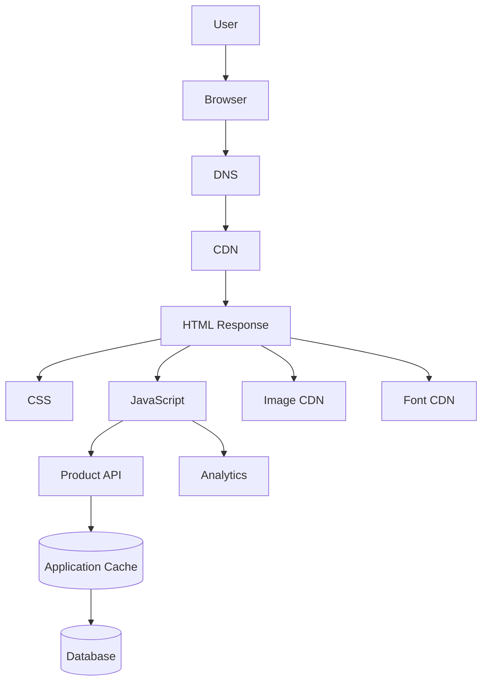
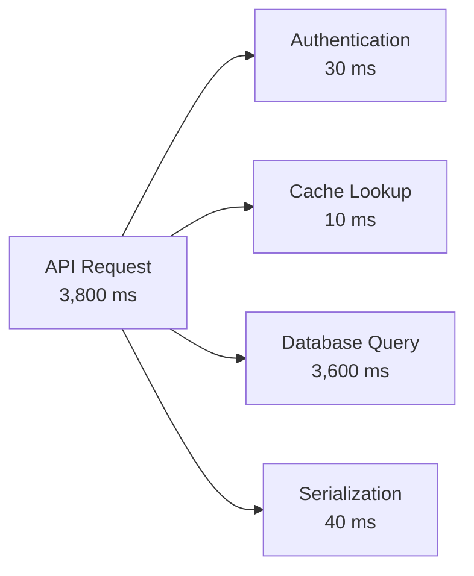

# Scenario — Diagnosing a Slow Page Load  
## Browser Rendering, Network Timing, API Latency, Database Queries, Caching, Assets, and Third-Party Dependencies

This scenario tests your ability to diagnose a slow web page using measured evidence rather than assumptions.

The application is an online store with:

```text
Frontend:
  https://shop.example.com

Product API:
  https://api.example.com/api/products

Search API:
  https://api.example.com/api/search

Image CDN:
  https://images.examplecdn.com

Analytics:
  https://analytics.example.net
```

The page contains:

```text
Navigation
Search box
Product grid
Product images
Fonts
Analytics
Recommendations
```

The reported symptom is:

> “The product page takes several seconds to become usable.”

The architecture is:



---

# Learning Objectives

After completing this scenario, you should be able to:

- Distinguish perceived performance from measured performance.
- Use the Network panel to identify bottlenecks.
- Interpret DNS, connection, TLS, TTFB, and download timing.
- Analyze a request waterfall.
- Identify render-blocking resources.
- Diagnose large JavaScript bundles.
- Diagnose slow API responses.
- Diagnose slow database queries.
- Evaluate caching behavior.
- Identify third-party performance costs.
- Use throttling and CPU simulation.
- Propose measured performance improvements.
- Avoid optimizing without evidence.

---

# Part 1 — Establishing the Performance Problem

## Question 1

What information should you collect before optimizing the page?

List at least eight items.

---

## Question 2

Which browser Developer Tools panels are most useful?

---

## Question 3

Why should you test on both a fast and a throttled network?

---

## Question 4

Why should you test on both a powerful computer and a CPU-throttled device profile?

---

## Question 5

Why should you measure before changing code?

---

# Part 2 — Initial Network Measurements

The browser Network panel shows:

```text
Document:
  Size: 42 KB
  Time: 1.2 s

app.js:
  Transferred: 1.8 MB
  Time: 2.4 s

styles.css:
  Transferred: 180 KB
  Time: 650 ms

hero.webp:
  Transferred: 850 KB
  Time: 1.1 s

Product API:
  Time: 3.8 s

Analytics:
  Time: 2.5 s

Recommendation API:
  Time: 3.2 s
```

## Question 6

Which resources appear immediately suspicious?

---

## Question 7

Why might a 1.8 MB JavaScript bundle affect performance even if the network is fast?

---

## Question 8

Why might an analytics request affect perceived page performance?

---

## Question 9

Should a recommendation API necessarily block the main product grid?

Explain.

---

## Question 10

What is the difference between transferred size and decoded size?

---

# Part 3 — Timing Breakdown

The Product API timing is:

```text
Queueing:             20 ms
DNS:                  10 ms
Connection:           15 ms
TLS:                  20 ms
Request sent:         2 ms
Waiting / TTFB:       3,650 ms
Content download:     83 ms
Total:                3,800 ms
```

## Question 11

Which phase causes most of the delay?

---

## Question 12

What does high TTFB suggest?

---

## Question 13

What is unlikely to be the primary problem based on these timings?

---

## Question 14

What backend and infrastructure evidence should you collect?

---

## Question 15

What database problems could cause high TTFB?

---

# Part 4 — Backend Trace

A distributed trace for the Product API shows:



## Question 16

Which operation is the main bottleneck?

---

## Question 17

What should you inspect in the database query?

---

## Question 18

What might cause a database query to take 3.6 seconds?

List at least five possibilities.

---

## Question 19

What tools or database features could help diagnose it?

---

## Question 20

Would adding more frontend JavaScript solve this database bottleneck?

Explain.

---

# Part 5 — Query Plan

The query is:

```sql
SELECT
  id,
  name,
  price,
  image_url
FROM products
WHERE category = $1
  AND available = TRUE
ORDER BY popularity DESC
LIMIT $2;
```

The query plan shows:

```text
Seq Scan on products
Rows examined: 20,000,000
Rows returned: 20
Sort method: external merge
Temporary disk usage: 420 MB
Execution time: 3,580 ms
```

## Question 21

What does `Seq Scan` suggest?

---

## Question 22

Why is examining 20 million rows inefficient for returning 20 products?

---

## Question 23

What does external merge sorting and temporary disk usage suggest?

---

## Question 24

What indexes might help this query?

---

## Question 25

What other query or schema changes might help?

---

## Question 26

Why should you verify an index improves the actual query rather than creating indexes blindly?

---

# Part 6 — Cache Investigation

The application cache metrics show:

```text
Product search cache hit rate: 2%
Product detail cache hit rate: 85%
```

The search API uses:

```text
q
category
page
limit
sort
```

## Question 27

What does a 2% cache hit rate suggest?

---

## Question 28

Why might search results be difficult to cache effectively?

---

## Question 29

What strategies could improve safe search performance?

---

## Question 30

What is the risk of caching personalized search results incorrectly?

---

## Question 31

Should the cache replace the database as the source of truth?

Explain.

---

# Part 7 — Frontend Bundle Investigation

The browser Performance panel shows:

```text
JavaScript download: 2.4 s
JavaScript parse and compile: 1.8 s
JavaScript execution: 2.1 s
Main-thread blocking: 1.6 s
```

## Question 32

What problems does this suggest?

---

## Question 33

What is the difference between downloading JavaScript and executing JavaScript?

---

## Question 34

What strategies could reduce the initial JavaScript cost?

---

## Question 35

What is code splitting?

---

## Question 36

What is lazy loading?

---

## Question 37

Could a page have low network latency but still feel slow because of JavaScript?

Explain.

---

# Part 8 — Rendering and Layout

The Performance panel shows:

```text
Long task: 950 ms
Layout recalculation: 600 ms
DOM nodes: 18,000
```

## Question 38

What is a long task?

---

## Question 39

Why might 18,000 DOM nodes affect performance?

---

## Question 40

What is layout recalculation?

---

## Question 41

What frontend techniques could reduce this cost?

---

## Question 42

When might list virtualization be useful?

---

# Part 9 — Image and Font Performance

The page loads:

```text
hero.webp: 850 KB
product-1.webp: 700 KB
product-2.webp: 750 KB
product-3.webp: 720 KB
product-4.webp: 680 KB
font-regular.woff2: 220 KB
font-bold.woff2: 240 KB
font-light.woff2: 230 KB
```

## Question 43

What is suspicious about these assets?

---

## Question 44

What image optimizations could help?

---

## Question 45

What does lazy-loading an image do?

---

## Question 46

Why should images have width and height attributes?

---

## Question 47

What font optimizations could help?

---

## Question 48

Should every image be loaded with high priority?

Explain.

---

# Part 10 — Third-Party Dependencies

The page loads:

```text
Analytics:
  2.5 seconds

Chat widget:
  1.8 seconds

Recommendation service:
  3.2 seconds

Social media embed:
  2.9 seconds
```

## Question 49

Why can third-party resources affect your page performance?

---

## Question 50

Which third-party features should block the main content?

---

## Question 51

What strategies can reduce third-party performance impact?

---

## Question 52

How can third-party services affect reliability as well as performance?

---

# Part 11 — User Experience and Loading States

The page currently displays a blank screen until:

```text
HTML
CSS
JavaScript
Product API
Images
Fonts
Analytics
Recommendations
```

all complete.

## Question 53

Why is this a poor perceived-performance design?

---

## Question 54

How could the interface provide useful feedback sooner?

---

## Question 55

Which content should generally be considered critical?

---

## Question 56

Which content could load later?

---

## Question 57

What is progressive rendering?

---

# Part 12 — Throttled Network Test

On a simulated slow mobile network:

```text
First Contentful Paint: 5.8 seconds
Largest Contentful Paint: 8.4 seconds
Product API: 7.1 seconds
Hero image: 6.3 seconds
```

## Question 58

Why is testing only on a fast developer network insufficient?

---

## Question 59

Which request should likely be prioritized: analytics or the main product content?

---

## Question 60

What could improve the Largest Contentful Paint?

---

## Question 61

What could improve the Product API experience even if the database cannot immediately be optimized?

---

# Part 13 — Performance Improvements

The team proposes these changes:

```text
1. Add an index for product search.
2. Split the JavaScript bundle.
3. Lazy-load below-the-fold images.
4. Defer analytics.
5. Move recommendations below the main product grid.
6. Add API pagination.
7. Compress text responses.
8. Cache public product data.
```

## Question 62

Which changes address the database bottleneck?

---

## Question 63

Which changes address frontend execution cost?

---

## Question 64

Which changes address unnecessary network work?

---

## Question 65

Which changes address perceived performance?

---

## Question 66

Which changes introduce cache-freshness concerns?

---

# Part 14 — Regression and Monitoring

After optimization:

```text
Product API P95 latency: 420 ms
Initial JavaScript: 420 KB compressed
Product images: responsive variants
Analytics: deferred
Product grid: visible before recommendations
LCP: 2.4 seconds
```

## Question 67

What is P95 latency?

---

## Question 68

Why should performance improvements be monitored after deployment?

---

## Question 69

What performance metrics should be monitored?

---

## Question 70

What regression tests or budgets should be added?

---

# Part 15 — Final Diagnosis

## Question 71

List the major performance problems discovered.

---

## Question 72

Which problems were network or asset-related?

---

## Question 73

Which problems were backend or database-related?

---

## Question 74

Which problems were frontend execution or rendering-related?

---

## Question 75

Which problems were caused by third-party dependencies?

---

## Question 76

Which improvements most directly improved the user’s perceived experience?

---

## Question 77

Why is “make the server faster” an incomplete performance plan?

---

# Answer Key

# Part 1 — Establishing the Problem Answers

## Question 1

Collect:

```text
Page URL
User workflow
Browser and version
Device
Network conditions
Environment
Load timing
Request waterfall
API timings
Asset sizes
JavaScript execution time
Database timing
Third-party timing
Real-user impact
```

---

## Question 2

Use:

```text
Network
Performance
Console
Elements
Application
```

The Network panel identifies request and asset timing. The Performance panel identifies browser execution and rendering work.

---

## Question 3

Fast networks can hide:

```text
Large asset costs
High latency
Slow API behavior
Timeouts
Poor loading states
```

Real users may use slower or less reliable connections.

---

## Question 4

A powerful development machine can hide:

```text
JavaScript parsing cost
Main-thread blocking
Large DOM costs
Rendering inefficiency
Memory pressure
```

CPU throttling approximates slower devices.

---

## Question 5

Measurement identifies the actual bottleneck. Without measuring, developers may optimize the wrong layer or introduce unnecessary complexity.

---

# Part 2 — Initial Network Measurement Answers

## Question 6

Suspicious resources include:

```text
1.8 MB JavaScript bundle
3.8-second Product API
2.5-second analytics request
3.2-second recommendation API
850 KB hero image
180 KB stylesheet
```

The most important issue depends on whether these resources block the critical experience.

---

## Question 7

JavaScript must be:

```text
Downloaded
Parsed
Compiled
Executed
```

A large bundle can delay interactivity and block the browser’s main thread even on a fast connection.

---

## Question 8

Analytics may:

```text
Consume bandwidth
Create DNS and connection work
Execute JavaScript
Block or delay other work
Compete for CPU
```

It should not normally block critical product content.

---

## Question 9

Usually no. Recommendations are often secondary content. The main product grid should display first, while recommendations load later or asynchronously.

---

## Question 10

Transferred size is the number of bytes sent over the network, often after compression. Decoded size is the size after decompression or processing in the browser.

---

# Part 3 — Timing Answers

## Question 11

The waiting/TTFB phase causes most of the delay:

```text
3,650 ms out of 3,800 ms
```

---

## Question 12

High TTFB suggests delay in:

```text
Backend processing
Database query
Cache miss
External service
Server queue
Cold start
```

---

## Question 13

DNS, connection setup, TLS, and response download are relatively small. They are unlikely to be the primary bottleneck.

---

## Question 14

Collect:

```text
Application trace
Database query timing
Cache hit/miss
Connection-pool metrics
External dependency timing
Server CPU and memory
Request logs
Recent deployment information
```

---

## Question 15

Possible database causes:

```text
Missing index
Full table scan
Large sort
Poor query plan
Lock contention
Connection wait
Too many rows
N+1 queries
Database overload
```

---

# Part 4 — Backend Trace Answers

## Question 16

The database query is the main bottleneck:

```text
3,600 ms
```

---

## Question 17

Inspect:

```text
Query plan
Indexes
Rows examined
Rows returned
Sort operations
Locks
Execution time
Database resource usage
```

---

## Question 18

Possible causes:

```text
Missing search index
Full table scan
Large sort
Poor query plan
20 million rows
Database overload
Lock contention
Connection-pool wait
Inefficient search expression
```

---

## Question 19

Use:

```text
EXPLAIN
EXPLAIN ANALYZE
Slow-query logs
Database monitoring
Index statistics
Lock inspection
Query profiler
```

---

## Question 20

No. More frontend JavaScript does not solve a slow database query and may make the page slower.

---

# Part 5 — Query Plan Answers

## Question 21

`Seq Scan` means the database is scanning the table sequentially rather than using an efficient index lookup.

---

## Question 22

The database examines 20 million rows to return only 20, wasting CPU, I/O, memory, and time.

---

## Question 23

The sort is too large to perform entirely in memory, so the database uses disk temporarily. This creates additional I/O and delay.

---

## Question 24

A possible index may support the filter and ordering:

```sql
CREATE INDEX products_category_available_popularity_idx
ON products (category, available, popularity DESC);
```

The exact index should be designed and verified using the database’s query planner and data distribution.

---

## Question 25

Possible improvements:

```text
Full-text search index
Search-specific index
Search engine
Cursor pagination
Avoid unnecessary columns
Reduce sorting work
Partition data if appropriate
Improve statistics
Cache common searches
```

---

## Question 26

Indexes consume storage and slow writes. An index that does not match the query may not help and can add unnecessary cost.

---

# Part 6 — Cache Answers

## Question 27

A 2% hit rate suggests most searches are reaching the backend and database. The cache is providing little benefit for this workload.

---

## Question 28

Searches may have many unique combinations of:

```text
q
category
page
limit
sort
user context
```

Personalization, rapidly changing data, and large key diversity can make caching less effective.

---

## Question 29

Possible strategies:

```text
Normalize search keys
Cache popular public searches briefly
Improve database indexes
Use a search engine
Use cursor pagination
Cache product details separately
Avoid caching private results
```

---

## Question 30

A shared cache could return one user’s personalized results to another user, exposing private data.

---

## Question 31

No. The database or another authoritative system should remain the source of truth. The cache is a performance layer.

---

# Part 7 — Frontend Bundle Answers

## Question 32

The page has high JavaScript costs in:

```text
Download
Parse and compile
Execution
Main-thread blocking
```

This can delay interactivity and make the page feel frozen.

---

## Question 33

Downloading moves bytes over the network. Executing parses, compiles, and runs the code on the browser’s CPU.

A small network time does not guarantee low execution time.

---

## Question 34

Strategies:

```text
Code splitting
Lazy loading
Tree shaking
Removing dependencies
Replacing heavy libraries
Deferring noncritical scripts
Reducing initial data processing
Server rendering or static generation
```

---

## Question 35

Code splitting divides application code into separate bundles that can be loaded when needed rather than downloading everything initially.

---

## Question 36

Lazy loading delays downloading or initializing a resource until it is needed.

---

## Question 37

Yes. The browser may spend significant time parsing, compiling, and executing JavaScript even when network latency is low.

---

# Part 8 — Rendering Answers

## Question 38

A long task is a period during which the browser’s main thread is busy for too long, delaying input, rendering, and interaction.

---

## Question 39

A large DOM increases the cost of:

```text
Style recalculation
Layout
Painting
Updates
Accessibility processing
Memory use
```

---

## Question 40

Layout recalculation is the browser’s work of calculating the size and position of elements after structure or style changes.

---

## Question 41

Possible strategies:

```text
Reduce DOM size
Virtualize large lists
Batch DOM changes
Avoid layout thrashing
Reduce expensive styles
Split rendering work
Defer noncritical content
Use efficient component updates
```

---

## Question 42

List virtualization is useful when displaying large lists or tables. It renders only visible items instead of creating thousands of DOM nodes at once.

---

# Part 9 — Image and Font Answers

## Question 43

Suspicious assets include:

```text
Large hero image
Several large product images
Multiple font files
Several font weights
```

They create transfer and rendering costs.

---

## Question 44

Use:

```text
Responsive image sizes
Modern formats
Compression
Correct dimensions
Lazy loading
Thumbnails
CDN transformations
Appropriate quality
```

---

## Question 45

Lazy loading delays downloading an image until it is near the viewport or otherwise needed.

---

## Question 46

Dimensions reserve layout space before the image loads, reducing unexpected layout shifts.

---

## Question 47

Possible improvements:

```text
Use fewer font families
Use fewer weights
Subset fonts
Use WOFF2
Preload only critical fonts
Use font-display appropriately
Self-host or optimize external font requests
```

---

## Question 48

No. Only critical above-the-fold images should receive high priority. Prioritizing every image competes with more important resources.

---

# Part 10 — Third-Party Answers

## Question 49

Third-party resources consume:

```text
Bandwidth
DNS lookups
Connections
CPU
Main-thread time
Memory
```

They may also introduce failures outside your control.

---

## Question 50

Only content necessary for the first meaningful user task should block the main experience.

Analytics, chat widgets, recommendations, and social embeds usually should not block the main product grid.

---

## Question 51

Strategies:

```text
Defer scripts
Lazy-load widgets
Load after interaction
Use async loading
Remove unnecessary services
Self-host where appropriate
Set timeouts
Isolate failures
```

---

## Question 52

A third-party service can be slow, unavailable, misconfigured, or return unexpected data. It can delay rendering or break parts of the page.

---

# Part 11 — User Experience Answers

## Question 53

The page waits for noncritical resources before showing anything useful. This creates a blank screen and makes the application feel slower than necessary.

---

## Question 54

Display:

```text
Initial HTML
Navigation
Loading skeleton
Product titles
Main product grid
```

Load later:

```text
Recommendations
Analytics
Chat
Below-the-fold images
Secondary widgets
```

---

## Question 55

Critical content may include:

```text
Page structure
Navigation
Main heading
Primary product data
Critical image
Primary interaction controls
```

---

## Question 56

Possible deferred content:

```text
Recommendations
Analytics
Chat widgets
Social embeds
Below-the-fold images
Reviews
Secondary reports
```

---

## Question 57

Progressive rendering means showing useful parts of the page as they become available rather than waiting for every resource to finish.

---

# Part 12 — Throttled Network Answers

## Question 58

Real users may have:

```text
Slow cellular connections
High latency
Packet loss
Limited data
Older devices
```

A fast developer network hides those problems.

---

## Question 59

Prioritize the main product content. Analytics should be deferred or loaded asynchronously.

---

## Question 60

Improve LCP by:

```text
Reduce server response time
Prioritize the LCP asset
Optimize the hero image
Reduce blocking CSS and JavaScript
Use CDN delivery
Use correct dimensions
Avoid waiting for noncritical resources
```

---

## Question 61

Even before the database is fully optimized:

```text
Show cached or partial results
Display a loading state immediately
Paginate
Use stale-while-revalidate where safe
Move noncritical data later
Optimize response size
Use an asynchronous search workflow where appropriate
```

---

# Part 13 — Improvement Answers

## Question 62

Database-focused changes:

```text
Add an index for product search.
Improve query planning.
Add API pagination.
```

Pagination also limits database result work.

---

## Question 63

Frontend execution changes:

```text
Split the JavaScript bundle.
Lazy-load below-the-fold content.
```

---

## Question 64

Network or unnecessary-work changes:

```text
Defer analytics.
Move recommendations below the main grid.
Add pagination.
Compress text responses.
Lazy-load images.
```

---

## Question 65

Perceived-performance improvements:

```text
Show the product grid earlier.
Defer recommendations.
Defer analytics.
Use loading states.
Optimize the LCP image.
Reduce initial JavaScript.
```

---

## Question 66

Cache-freshness concerns are introduced by:

```text
Caching public product data
CDN caching
Application cache
```

The team must define TTL and invalidation behavior.

---

# Part 14 — Monitoring Answers

## Question 67

P95 latency is the response time under which approximately 95% of measured requests complete. The remaining 5% are slower.

---

## Question 68

Performance can regress because of:

```text
New features
Larger dependencies
More traffic
Database growth
Configuration changes
Third-party changes
```

Monitoring detects regressions after deployment and in real-user conditions.

---

## Question 69

Monitor:

```text
P50, P95, and P99 latency
TTFB
LCP
FCP
INP
CLS
JavaScript errors
Bundle size
API error rate
Database query time
Cache hit rate
Image size
Third-party timing
```

---

## Question 70

Add:

```text
Bundle-size budgets
API latency budgets
Database query thresholds
Asset-size limits
Performance smoke tests
Real-user monitoring
Regression tests for loading states
```

---

# Part 15 — Final Diagnosis Answers

## Question 71

Major problems:

```text
Large JavaScript bundle
Slow product API
Slow database query
Missing search index or inefficient query plan
Large image assets
Multiple font weights
Analytics blocking or competing
Recommendations blocking or competing
Large DOM
Long main-thread task
Insufficient progressive rendering
```

---

## Question 72

Network or asset-related problems:

```text
Large JavaScript transfer
Large hero and product images
Large font files
Third-party resource requests
Missing or insufficient compression
Slow-network sensitivity
```

---

## Question 73

Backend or database problems:

```text
High product API TTFB
3.6-second database query
Sequential table scan
Large external sort
Temporary disk use
Low search-cache hit rate
```

---

## Question 74

Frontend execution or rendering problems:

```text
Large JavaScript parse and execution cost
Main-thread blocking
Long task
18,000 DOM nodes
Layout recalculation
Waiting for all data before showing content
```

---

## Question 75

Third-party problems:

```text
Slow analytics
Slow chat widget
Slow recommendation API
Slow social embed
Additional CPU, network, and failure dependencies
```

---

## Question 76

The improvements most directly affecting perceived performance include:

```text
Showing the product grid before recommendations
Deferring analytics
Optimizing the LCP image
Reducing initial JavaScript
Lazy-loading noncritical images
Improving product API latency
Adding progressive loading states
```

---

## Question 77

“Make the server faster” is incomplete because performance may also be limited by:

```text
Browser JavaScript
Rendering
Image size
Fonts
Network latency
Caching
Third-party services
Database queries
Response size
User-interface sequencing
```

Performance work must identify the bottleneck layer first.

---

# Scoring Guidance

## Multiple-choice and true/false

```text
1 point per correct answer
```

## Short-answer questions

```text
2 points:
  Correct core concept.

3 points:
  Correct explanation plus practical example.

4 points:
  Correct explanation, measured evidence, and suitable optimization.
```

## Scenario questions

Evaluate whether the learner:

```text
Uses measurements rather than assumptions.
Distinguishes network, backend, database, and browser costs.
Prioritizes critical content.
Recognizes cache and third-party risks.
Considers mobile and slow-network users.
Proposes measurable improvements.
Adds regression monitoring.
```

---

# Completion Criteria

You are ready to continue when you can:

```text
Measure before optimizing.
Read a Network waterfall.
Interpret DNS, connection, TLS, TTFB, and download timing.
Identify slow backend and database work.
Recognize large JavaScript and image costs.
Explain code splitting and lazy loading.
Analyze cache hit rates.
Evaluate third-party dependencies.
Design progressive loading.
Use performance budgets.
Monitor P95 latency and real-user metrics.
Explain why performance requires browser, network, server, and database analysis.
```
