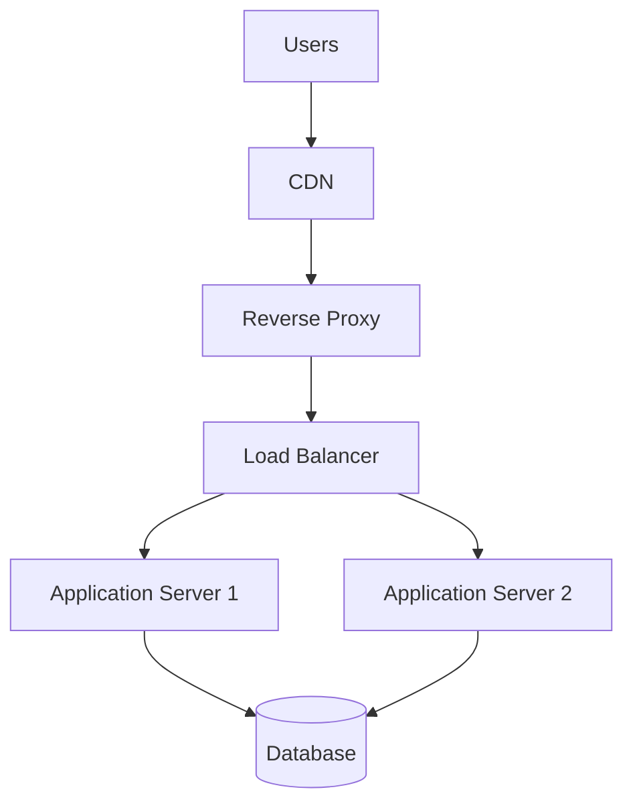
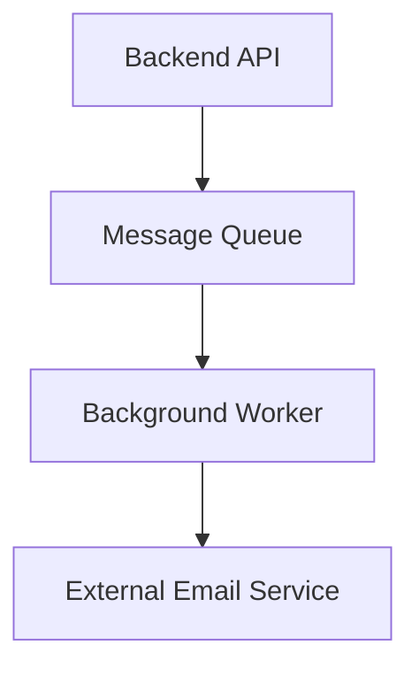
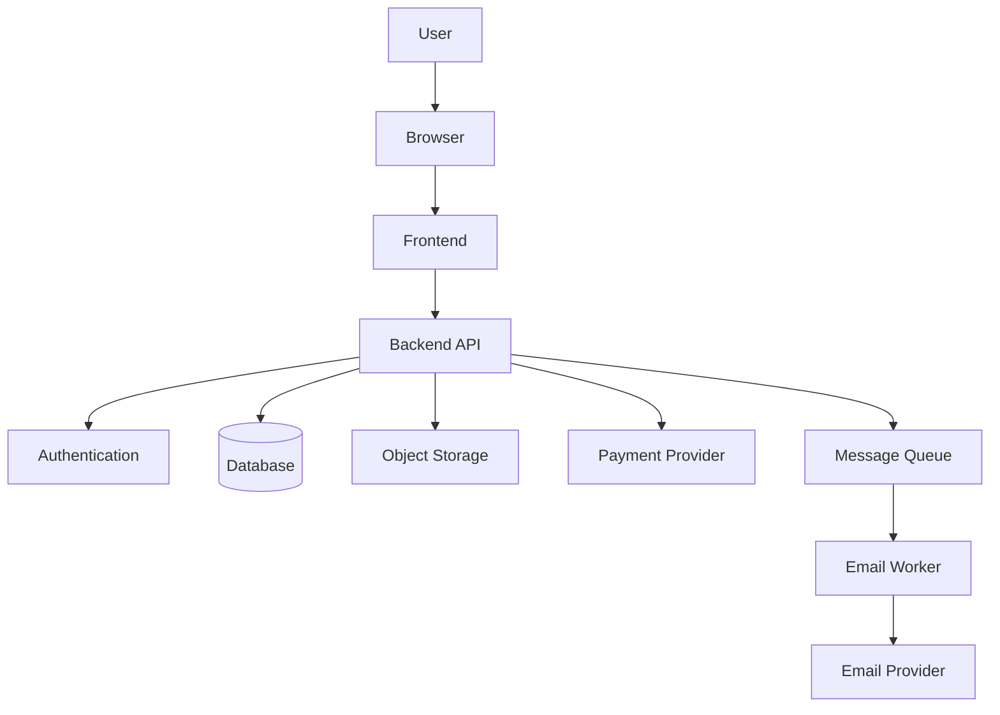

# Architecture Test — Web Application Architecture  
## Frontend, Backend, APIs, State, Rendering, Services, Scaling, and Architectural Tradeoffs

This test evaluates understanding of:

- Frontend and backend boundaries
- Browser trust and security
- Business logic
- Authentication and authorization
- Databases and external services
- API contracts
- State ownership
- Static sites
- SSR, CSR, SSG, and hybrid rendering
- Full-stack frameworks
- Monoliths
- Microservices
- Serverless functions
- Edge computing
- Queues and background workers
- Caching
- Load balancers
- Reliability
- Architecture tradeoffs
- End-to-end architecture design

---

## Test Instructions

- Complete the test before reading the answer key.
- Explain your reasoning for architecture and scenario questions.
- Multiple designs may be valid if their tradeoffs are clearly explained.
- Do not choose technologies merely because they are popular.
- Focus on responsibilities, trust boundaries, data ownership, failure behavior, and operational complexity.

---

## Learning Objectives

After completing this test, you should be able to:

- Distinguish frontend and backend responsibilities.
- Explain why the client must be treated as untrusted.
- Identify where security rules should be enforced.
- Explain the roles of databases, caches, file storage, and external services.
- Design and evaluate API contracts.
- Identify sources of truth.
- Compare static, server-rendered, client-rendered, and hybrid applications.
- Explain full-stack framework execution environments.
- Compare monoliths and microservices.
- Explain when queues, workers, serverless functions, CDNs, and load balancers are useful.
- Reason about failure modes and graceful degradation.
- Design a basic production architecture.
- Justify architectural choices through tradeoffs.

---

# Part 1 — Multiple-Choice Questions

Choose the best answer.

## Question 1

Which statement best describes the frontend?

- [ ] Software that runs close to the user and manages the interface
- [ ] A private database
- [ ] A physical data center
- [ ] A DNS resolver

---

## Question 2

Which statement best describes the backend?

- [ ] Server-side software that handles protected operations and business logic
- [ ] CSS downloaded by the browser
- [ ] A browser tab
- [ ] A user’s keyboard

---

## Question 3

Which responsibility primarily belongs to the frontend?

- [ ] Opening a menu
- [ ] Verifying database credentials
- [ ] Enforcing administrator authorization
- [ ] Calculating the authoritative checkout total

---

## Question 4

Which responsibility primarily belongs to the backend?

- [ ] Applying a CSS class
- [ ] Opening a modal
- [ ] Checking whether a user owns an order
- [ ] Displaying a loading spinner

---

## Question 5

Why is the browser considered untrusted?

- [ ] The browser cannot make network requests.
- [ ] The user can inspect and modify client-side behavior and requests.
- [ ] The browser always runs on a server.
- [ ] Browser code is automatically encrypted from the user.

---

## Question 6

Which statement about client-side validation is correct?

- [ ] It is useful for fast feedback but cannot enforce security.
- [ ] It completely replaces backend validation.
- [ ] It prevents users from constructing custom requests.
- [ ] It protects database credentials.

---

## Question 7

Where should authorization be enforced?

- [ ] Only by hiding frontend buttons
- [ ] On the backend or another trusted enforcement layer
- [ ] Only in CSS
- [ ] Only in the browser URL

---

## Question 8

Which is an example of authentication?

- [ ] Checking whether a user owns an order
- [ ] Verifying a password or access token
- [ ] Applying a discount
- [ ] Rendering an order table

---

## Question 9

Which is an example of authorization?

- [ ] Determining whether a token identifies a user
- [ ] Checking whether the user may edit a specific order
- [ ] Parsing JSON
- [ ] Loading CSS

---

## Question 10

Which system should usually determine the final product price during checkout?

- [ ] Browser display
- [ ] Hidden form field
- [ ] Backend or authoritative pricing system
- [ ] CSS file

---

## Question 11

Why should a database usually remain behind a backend API?

- [ ] The backend can enforce validation, authorization, and business logic.
- [ ] Browsers cannot display database values.
- [ ] Databases cannot respond to queries.
- [ ] APIs are required for all filesystem operations.

---

## Question 12

What is business logic?

- [ ] Visual styling
- [ ] Rules that define how the application behaves
- [ ] DNS resolution
- [ ] The operating system kernel

---

## Question 13

Which is business logic?

- [ ] A card has a border
- [ ] An order cannot be cancelled after shipment
- [ ] A heading uses a large font
- [ ] A menu uses flexbox

---

## Question 14

What is an API contract?

- [ ] A description of how software systems communicate
- [ ] A database backup
- [ ] A CSS stylesheet
- [ ] A password policy only

---

## Question 15

Which may be part of an API contract?

- [ ] Endpoint paths
- [ ] HTTP methods
- [ ] Request and response formats
- [ ] All of the above

---

## Question 16

What is client-side state?

- [ ] Temporary information used by the browser interface
- [ ] Only information stored in a database
- [ ] A server’s disk usage
- [ ] A DNS record

---

## Question 17

Which is usually client-side state?

- [ ] Whether a menu is open
- [ ] Authoritative inventory count
- [ ] Payment settlement status
- [ ] Database password

---

## Question 18

Which is usually server-side state?

- [ ] Current selected tab
- [ ] Whether a tooltip is visible
- [ ] Order fulfillment status
- [ ] Current cursor position

---

## Question 19

What is a source of truth?

- [ ] The system considered authoritative for a piece of information
- [ ] Any value displayed in the browser
- [ ] A file extension
- [ ] A network cable

---

## Question 20

What is a static website?

- [ ] A site whose primary content is served from prebuilt files
- [ ] A site that cannot use JavaScript
- [ ] A site that cannot call APIs
- [ ] A site with no HTML

---

## Question 21

Can a static website contain dynamic user interactions?

- [ ] No
- [ ] Yes, through browser JavaScript and APIs
- [ ] Only if it directly connects to a database
- [ ] Only if it uses a microservice architecture

---

## Question 22

What is server-side rendering?

- [ ] The server generates HTML before sending it to the browser.
- [ ] The browser generates every element without receiving HTML.
- [ ] The database renders CSS.
- [ ] The CDN deletes the page after serving it.

---

## Question 23

What is client-side rendering?

- [ ] The browser uses JavaScript to generate or update much of the interface.
- [ ] The server cannot return data.
- [ ] The database creates browser pixels.
- [ ] The browser cannot use APIs.

---

## Question 24

What is static generation?

- [ ] Generating pages ahead of time, usually during a build
- [ ] Generating every page only after a request
- [ ] Removing all CSS
- [ ] Storing all data in RAM

---

## Question 25

What is hydration?

- [ ] Connecting client-side behavior to server-rendered HTML
- [ ] Encrypting a database
- [ ] Uploading a file
- [ ] Starting a container

---

## Question 26

What is a single-page application?

- [ ] An application that often loads an application shell and updates the interface dynamically
- [ ] A webpage with exactly one HTML tag
- [ ] An application with no backend
- [ ] A database without a user interface

---

## Question 27

What is a hybrid application?

- [ ] An application that combines multiple rendering or execution strategies
- [ ] An application using only static files
- [ ] An application without JavaScript
- [ ] An application with no APIs

---

## Question 28

What does a full-stack framework commonly combine?

- [ ] Frontend and backend capabilities
- [ ] Only CSS and images
- [ ] Only database administration
- [ ] Only DNS and routing

---

## Question 29

Why does execution location matter in a full-stack framework?

- [ ] Browser and server code have different capabilities and trust levels.
- [ ] All code runs in the browser.
- [ ] Server code cannot access private resources.
- [ ] Browser code automatically becomes secret.

---

## Question 30

Where should database credentials normally be used?

- [ ] Browser JavaScript
- [ ] Server-side code or protected infrastructure
- [ ] Public HTML
- [ ] URL fragments

---

## Question 31

What is a monolith?

- [ ] An application deployed as one primary unit
- [ ] A database column
- [ ] A CSS component
- [ ] A DNS server

---

## Question 32

What are microservices?

- [ ] Independently deployable services organized around separate responsibilities
- [ ] Small frontend buttons
- [ ] Browser cookies
- [ ] Database indexes

---

## Question 33

Which is a possible advantage of microservices?

- [ ] Independent scaling and deployment
- [ ] No network communication
- [ ] No monitoring requirements
- [ ] Automatic data consistency

---

## Question 34

Which is a possible cost of microservices?

- [ ] Distributed failures and more operational complexity
- [ ] No ability to scale
- [ ] No service boundaries
- [ ] No deployments

---

## Question 35

What does “serverless” generally mean?

- [ ] No physical servers exist.
- [ ] The provider manages much of the server infrastructure.
- [ ] No backend code runs.
- [ ] The browser handles all operations.

---

## Question 36

What is a background job?

- [ ] Work performed separately from the immediate request
- [ ] A CSS animation
- [ ] A browser tab
- [ ] A database field

---

## Question 37

Why use a message queue?

- [ ] To hold work until a worker can process it
- [ ] To expose a database publicly
- [ ] To make all work synchronous
- [ ] To eliminate all errors

---

## Question 38

Which is a good candidate for background processing?

- [ ] Sending a confirmation email
- [ ] Opening a dropdown
- [ ] Applying a font
- [ ] Reading a button label

---

## Question 39

What is graceful degradation?

- [ ] Keeping essential functionality available when optional services fail
- [ ] Disabling the entire application whenever one dependency fails
- [ ] Removing all error states
- [ ] Ignoring failures

---

## Question 40

What does separation of concerns mean?

- [ ] Keeping different responsibilities organized and distinct
- [ ] Putting all code in one function
- [ ] Removing the backend
- [ ] Storing all state in the browser

---

## Question 41

What does a CDN primarily help with?

- [ ] Delivering cacheable content closer to users
- [ ] Enforcing database authorization
- [ ] Replacing all backend services
- [ ] Creating user passwords

---

## Question 42

What does a load balancer do?

- [ ] Distributes traffic among application instances
- [ ] Stores all files permanently
- [ ] Replaces DNS entirely
- [ ] Renders CSS

---

## Question 43

What is a cache?

- [ ] A stored copy of data retained for faster reuse
- [ ] The primary source of every value
- [ ] A user password
- [ ] A network cable

---

## Question 44

What is graceful failure?

- [ ] Returning a safe, understandable result when part of the system fails
- [ ] Returning raw stack traces to users
- [ ] Silently losing all data
- [ ] Crashing the entire system

---

## Question 45

Which question is most important when choosing an architecture?

- [ ] What problem and tradeoffs does this design address?
- [ ] Is the technology fashionable?
- [ ] Does it use the most services?
- [ ] Does it require the most configuration?

---

# Part 2 — True or False

## Question 46

The browser is a trusted authority for pricing and permissions.

- [ ] True
- [ ] False

---

## Question 47

The backend should validate important input independently.

- [ ] True
- [ ] False

---

## Question 48

Hiding a button is sufficient to protect its corresponding API operation.

- [ ] True
- [ ] False

---

## Question 49

A database is the same thing as an API.

- [ ] True
- [ ] False

---

## Question 50

A backend may call multiple external services.

- [ ] True
- [ ] False

---

## Question 51

Client-side state and server-side state always have the same authority.

- [ ] True
- [ ] False

---

## Question 52

A static site can use JavaScript and external APIs.

- [ ] True
- [ ] False

---

## Question 53

Server-side rendering prevents all browser JavaScript from running.

- [ ] True
- [ ] False

---

## Question 54

Static generation creates some content before users request it.

- [ ] True
- [ ] False

---

## Question 55

A full-stack project may contain code for both browser and server runtimes.

- [ ] True
- [ ] False

---

## Question 56

A monolith is automatically a bad architecture.

- [ ] True
- [ ] False

---

## Question 57

Microservices can introduce more network failure points.

- [ ] True
- [ ] False

---

## Question 58

Serverless means that no servers exist anywhere.

- [ ] True
- [ ] False

---

## Question 59

Background jobs can prevent long-running work from delaying an immediate response.

- [ ] True
- [ ] False

---

## Question 60

A queue can help absorb temporary spikes in background work.

- [ ] True
- [ ] False

---

## Question 61

A CDN automatically fixes a backend authorization vulnerability.

- [ ] True
- [ ] False

---

## Question 62

A load balancer can remove unhealthy application instances from traffic.

- [ ] True
- [ ] False

---

## Question 63

Caching always returns the newest possible data.

- [ ] True
- [ ] False

---

## Question 64

A service failure should always cause the entire application to fail.

- [ ] True
- [ ] False

---

## Question 65

Architecture decisions involve tradeoffs.

- [ ] True
- [ ] False

---

# Part 3 — Short-Answer Questions

Answer in complete sentences.

## Question 66

What is the difference between frontend and backend responsibilities?

---

## Question 67

Why must the browser be treated as untrusted?

---

## Question 68

What are three common frontend responsibilities?

---

## Question 69

What are three common backend responsibilities?

---

## Question 70

Why is client-side validation still useful if it cannot enforce security?

---

## Question 71

Explain authentication and authorization.

---

## Question 72

Why should final prices, permissions, and inventory decisions be made by the backend?

---

## Question 73

What is business logic? Give two examples.

---

## Question 74

What is an API contract?

---

## Question 75

What is client-side state? Give two examples.

---

## Question 76

What is server-side state? Give two examples.

---

## Question 77

What is a source of truth?

---

## Question 78

Compare static generation, SSR, and CSR.

---

## Question 79

What is hydration?

---

## Question 80

What is a hybrid rendering strategy?

---

## Question 81

What is a full-stack framework?

---

## Question 82

Why can code in one full-stack repository run in different environments?

---

## Question 83

What is a monolith?

---

## Question 84

What are microservices?

---

## Question 85

Give one advantage and one disadvantage of microservices.

---

## Question 86

What is serverless?

---

## Question 87

What is a background job?

---

## Question 88

What is a queue?

---

## Question 89

What is graceful degradation?

---

## Question 90

Why are caches useful, and what risk do they introduce?

---

# Part 4 — Architecture Analysis

## Question 91

Explain this architecture:



Describe the role of each major component.

---

## Question 92

What happens when the load balancer detects that `Application Server 1` is unhealthy?

---

## Question 93

Why might a reverse proxy be placed in front of an application server?

---

## Question 94

Why might an application use both a database and a cache?

---

## Question 95

Why should private user-specific responses be cached carefully?

---

## Question 96

What is the purpose of a message queue in this architecture?



---

## Question 97

What would happen if the email service failed in this design?

---

## Question 98

What is one benefit and one risk of serving static assets through a CDN?

---

## Question 99

Why might a database remain a bottleneck even after adding more application servers?

---

## Question 100

Why might a modular monolith be a reasonable choice for a small team?

---

# Part 5 — Scenario Questions

## Question 101 — Client-Side Price

A browser displays a product price of `$79.99`, but a malicious client sends a request claiming the price is `$0.01`.

How should the backend handle this?

---

## Question 102 — Authorization Bypass

The frontend hides an administrator button from regular users, but a user manually calls the endpoint.

What must the server do?

---

## Question 103 — Database Credentials

A developer puts a database password into a public frontend environment variable.

What is wrong with this design?

---

## Question 104 — State Conflict

The browser displays an order as `paid`, but the backend reports `pending`.

Which system should usually be authoritative, and why?

---

## Question 105 — Static Site with User Data

A static frontend calls an API to retrieve private user data.

Does the existence of an API make the frontend itself non-static? Explain carefully.

---

## Question 106 — SSR and Interactivity

A server-rendered product page displays quickly, but the “Add to cart” button does not work until JavaScript loads.

What process may be incomplete?

---

## Question 107 — Excessive JavaScript

A single-page application downloads a very large bundle before displaying the interface.

What architectural or performance strategies could help?

---

## Question 108 — Slow Checkout

Checkout waits synchronously for:

```text
Inventory
Payment
Email
Analytics
Shipping estimate
```

What problems might this cause?

How could the flow be improved?

---

## Question 109 — Optional Dependency Failure

A recommendation service is unavailable.

Should the entire product page fail? Explain.

---

## Question 110 — Monolith or Microservices

A small team is building a new internal project-management application.

Which architecture would you initially consider, and why?

---

## Question 111 — Service-to-Service Failure

An order service calls inventory, payment, shipping, and notification services.

The notification service is down, but payment and inventory succeed.

What are possible approaches?

---

## Question 112 — Cache Staleness

A product price changes in the database, but users continue seeing the old price from a cache.

What caused this, and what strategies could help?

---

## Question 113 — Queue Growth

A notification queue grows continuously.

What could cause this?

What would you measure?

---

## Question 114 — Serverless Limits

A serverless function frequently exceeds its execution time limit while generating reports.

What alternatives could help?

---

## Question 115 — Production Scale

An application works with one server but fails when multiple application servers are introduced.

What state or architecture assumptions might be responsible?

---

# Part 6 — Practical Architecture Exercises

## Exercise 1 — Responsibility Classification

Classify each responsibility as primarily:

```text
Frontend
Backend
Database
External Service
Background Worker
```

Tasks:

```text
Open a menu
Validate final order price
Store an order
Display a spinner
Send an email
Verify payment
Render product cards
Check ownership of an order
Store a product image
Update inventory
```

---

## Exercise 2 — Design an Online Store

Design an architecture that supports:

```text
Product browsing
User accounts
Shopping cart
Orders
Payments
Product images
Confirmation emails
```

Include a Mermaid diagram with:

```text
Browser
Frontend
Backend API
Authentication
Database
Object storage
Payment provider
Queue
Email worker
```

---

## Exercise 3 — Identify Sources of Truth

Identify the likely source of truth for:

```text
Open menu
Current product price
Inventory count
Selected tab
Order status
Payment status
Search text being typed
Subscription level
```

---

## Exercise 4 — Choose Rendering Strategies

Choose a reasonable strategy for each:

```text
Public marketing homepage
Public documentation
Private account dashboard
Product detail page
Real-time chat
Large administrative report
```

Possible strategies:

```text
Static generation
Server-side rendering
Client-side rendering
Hybrid rendering
Background processing
```

Explain your choices.

---

## Exercise 5 — Failure Design

Design what should happen if each dependency fails:

```text
Email provider
Payment provider
Recommendation service
Database
Cache
Search service
```

Classify each dependency as:

```text
Critical
Important but recoverable
Optional
```

---

# Answer Key

# Part 1 — Multiple-Choice Answers

| Question | Answer | Explanation |
|---:|---|---|
| 1 | Software that runs close to the user and manages the interface | This is the frontend. |
| 2 | Server-side software that handles protected operations and business logic | This is the backend. |
| 3 | Opening a menu | UI interaction is primarily frontend work. |
| 4 | Checking whether a user owns an order | Authorization must be enforced on a trusted backend. |
| 5 | The user can inspect and modify client-side behavior and requests. | Browser code is untrusted. |
| 6 | It is useful for fast feedback but cannot enforce security. | The backend must validate independently. |
| 7 | On the backend or another trusted enforcement layer | Hiding UI controls is insufficient. |
| 8 | Verifying a password or access token | This establishes identity. |
| 9 | Checking whether the user may edit a specific order | This determines permission. |
| 10 | Backend or authoritative pricing system | The client can modify displayed or submitted values. |
| 11 | The backend can enforce validation, authorization, and business logic. | Direct database access bypasses important controls. |
| 12 | Rules that define how the application behaves | Business logic represents domain rules. |
| 13 | An order cannot be cancelled after shipment | This is a business rule. |
| 14 | A description of how software systems communicate | Contracts define endpoints and behavior. |
| 15 | All of the above | Contracts define multiple communication details. |
| 16 | Temporary information used by the browser interface | Client state controls UI behavior. |
| 17 | Whether a menu is open | This is typically browser state. |
| 18 | Order fulfillment status | This is typically authoritative server-side state. |
| 19 | The system considered authoritative for a piece of information | A source of truth resolves disagreements. |
| 20 | A site whose primary content is served from prebuilt files | Static sites can still be interactive. |
| 21 | Yes, through browser JavaScript and APIs | Static delivery does not mean no behavior. |
| 22 | The server generates HTML before sending it to the browser. | This is SSR. |
| 23 | The browser uses JavaScript to generate or update much of the interface. | This is CSR. |
| 24 | Generating pages ahead of time, usually during a build | This is static generation. |
| 25 | Connecting client-side behavior to server-rendered HTML | This is hydration. |
| 26 | An application that often loads an application shell and updates the interface dynamically | This describes an SPA. |
| 27 | An application that combines multiple rendering or execution strategies | This describes hybrid architecture. |
| 28 | Frontend and backend capabilities | Full-stack frameworks may manage multiple runtimes. |
| 29 | Browser and server code have different capabilities and trust levels. | Execution location determines access and security. |
| 30 | Server-side code or protected infrastructure | Private credentials must not reach the browser. |
| 31 | An application deployed as one primary unit | This is a monolith. |
| 32 | Independently deployable services organized around separate responsibilities | This describes microservices. |
| 33 | Independent scaling and deployment | Services may be scaled separately. |
| 34 | Distributed failures and more operational complexity | Network calls and independent services add overhead. |
| 35 | The provider manages much of the server infrastructure. | Physical servers still exist. |
| 36 | Work performed separately from the immediate request | Background work may be asynchronous. |
| 37 | To hold work until a worker can process it | Queues decouple producers and workers. |
| 38 | Sending a confirmation email | Email is often asynchronous. |
| 39 | Keeping essential functionality available when optional services fail | This is graceful degradation. |
| 40 | Keeping different responsibilities organized and distinct | This improves maintainability. |
| 41 | Delivering cacheable content closer to users | This is a primary CDN purpose. |
| 42 | Distributes traffic among application instances | Load balancers improve availability and scale. |
| 43 | A stored copy of data retained for faster reuse | Caches reduce repeated work. |
| 44 | Returning a safe, understandable result when part of the system fails | Graceful failure protects the user experience. |
| 45 | What problem and tradeoffs does this design address? | Architecture should serve actual requirements. |

---

# Part 2 — True-or-False Answers

| Question | Answer | Explanation |
|---:|---|---|
| 46 | False | The browser is untrusted for important decisions. |
| 47 | True | The backend must independently enforce rules. |
| 48 | False | Users can call APIs directly. |
| 49 | False | The backend and database have different responsibilities. |
| 50 | True | Backends commonly integrate with external providers. |
| 51 | False | Different systems may be authoritative for different data. |
| 52 | True | Static sites can use JavaScript and APIs. |
| 53 | False | SSR pages may be hydrated and enhanced with JavaScript. |
| 54 | True | Static generation occurs before user requests. |
| 55 | True | A project may contain browser, server, worker, and build code. |
| 56 | False | A monolith may be simple and appropriate. |
| 57 | True | Microservices communicate over networks and can fail independently. |
| 58 | False | Serverless abstracts infrastructure; servers still exist. |
| 59 | True | Queues and workers move long work away from immediate requests. |
| 60 | True | Queues can absorb bursts of background work. |
| 61 | False | A CDN does not enforce backend authorization. |
| 62 | True | Health-aware load balancers can stop routing to failed instances. |
| 63 | False | Caches can become stale. |
| 64 | False | Optional dependencies should often fail gracefully. |
| 65 | True | Architecture is a set of tradeoffs. |

---

# Part 3 — Short-Answer Model Answers

## Question 66

Frontend code runs close to the user and handles presentation, interaction, temporary state, and requests. Backend code runs in a controlled environment and handles validation, authentication, authorization, business rules, data access, and integrations.

---

## Question 67

Users can inspect, modify, replay, and manually construct client-side requests. Therefore, browser code cannot be treated as an authoritative security boundary.

---

## Question 68

Examples:

```text
Render the interface
Handle clicks and input
Manage temporary UI state
Show loading and error states
Perform immediate validation
Send API requests
```

---

## Question 69

Examples:

```text
Authenticate users
Authorize operations
Validate input
Apply business rules
Access databases
Call private external services
Process files
Run background jobs
```

---

## Question 70

Client-side validation gives users immediate feedback and reduces unnecessary requests. It improves usability but cannot enforce security because clients can bypass it.

---

## Question 71

Authentication identifies the caller. Authorization determines what the identified caller may do.

---

## Question 72

The browser can change prices, inventory values, or permission claims. The backend should use authoritative data and enforce rules because it is the trusted application boundary.

---

## Question 73

Business logic is the set of domain rules controlling application behavior.

Examples:

```text
An order cannot be cancelled after shipment.
A discount applies only once per account.
A user may edit only their own profile.
```

---

## Question 74

An API contract defines:

```text
Endpoints
Methods
Parameters
Headers
Authentication
Request bodies
Response schemas
Status codes
Errors
Pagination
Versioning
```

---

## Question 75

Client-side state is temporary information used by the browser interface.

Examples:

```text
Menu open or closed
Selected tab
Search text
Loading status
```

---

## Question 76

Server-side state is information stored or managed by backend systems.

Examples:

```text
User account
Order status
Inventory
Subscription level
Payment state
```

---

## Question 77

A source of truth is the system considered authoritative for a particular value. It determines which value should win when different layers disagree.

---

## Question 78

```text
Static generation:
  Pages are generated before requests, usually during a build.

SSR:
  The server generates HTML at request time.

CSR:
  The browser uses JavaScript to generate or update the interface.
```

---

## Question 79

Hydration attaches client-side event handlers and behavior to HTML that was already generated by the server.

---

## Question 80

A hybrid rendering strategy uses more than one approach, such as static marketing pages, server-rendered product pages, and client-rendered dashboards.

---

## Question 81

A full-stack framework provides frontend and backend capabilities in one project or development environment, while still executing parts of the code in different runtimes.

---

## Question 82

The repository may contain:

```text
Browser code
Server code
Build scripts
Edge functions
Background workers
```

Each runs in an environment with different APIs, permissions, and security boundaries.

---

## Question 83

A monolith is an application where multiple responsibilities are deployed as one primary unit.

---

## Question 84

Microservices are independently deployable services organized around separate responsibilities or domains.

---

## Question 85

Advantage:

```text
Services can be scaled or deployed independently.
```

Disadvantage:

```text
Networking, monitoring, data consistency, and failure handling become more complex.
```

---

## Question 86

Serverless is an execution model where the provider manages much of the underlying server infrastructure and runs functions in response to events or requests.

---

## Question 87

A background job is work processed outside the immediate request, such as sending an email, generating a report, or processing a video.

---

## Question 88

A queue stores work until a worker can process it. It helps separate request handling from asynchronous work.

---

## Question 89

Graceful degradation means maintaining essential functionality when optional components fail.

---

## Question 90

Caches improve speed and reduce repeated work. They introduce risks involving stale data, invalidation, privacy, and incorrect shared responses.

---

# Part 4 — Architecture Analysis Answers

## Question 91


```text
Users:
  Initiate requests.

CDN:
  Serves cacheable content from edge locations.

Reverse proxy:
  Receives traffic, may terminate TLS, route requests, serve static files, and apply policies.

Load balancer:
  Distributes requests among healthy application servers.

Application servers:
  Run backend code and business logic.

Database:
  Stores persistent application data.
```

---

## Question 92

The load balancer should detect the unhealthy instance through health checks and stop routing new traffic to it. The remaining healthy server should continue serving requests.

---

## Question 93

A reverse proxy can:

```text
Terminate TLS
Route paths or hostnames
Serve static assets
Apply rate limits
Compress responses
Log traffic
Hide internal ports
Forward requests
```

---

## Question 94

A database is the authoritative storage system. A cache stores frequently used copies to reduce latency and database workload.

The cache improves speed, while the database remains the source of truth.

---

## Question 95

Private responses may contain user-specific data. If stored in a shared cache incorrectly, one user’s information could be returned to another user.

---

## Question 96

The queue stores email work after the API accepts the primary operation. The worker processes the email separately, allowing the API to respond quickly and retry email failures.

---

## Question 97

The order may still succeed while the email job remains queued or retries later. If email is optional, the user should not necessarily lose the order.

---

## Question 98

Benefit:

```text
Static assets can be served closer to users with lower origin workload.
```

Risk:

```text
Stale content, cache invalidation problems, or accidental exposure of private responses.
```

---

## Question 99

The database may still be a single bottleneck because all application servers query the same database. More application servers can increase database connection pressure and query load.

---

## Question 100

A modular monolith may be easier for a small team to develop, test, deploy, and debug. Microservices would add network, deployment, monitoring, and data-consistency complexity before those costs are necessary.

---

# Part 5 — Scenario Model Answers

## Question 101 — Client-Side Price

The backend should ignore or reject the client-provided price. It should load the current price from the authoritative pricing system, calculate the total, and verify inventory and permissions.

---

## Question 102 — Authorization Bypass

The server must authenticate the caller and enforce administrator authorization. A regular user should receive a denial such as `403 Forbidden` or a deliberately safe `404`.

---

## Question 103 — Database Credentials

A public frontend environment variable may be embedded into browser JavaScript. Users can inspect it and obtain the database password.

Database credentials should remain in protected server-side configuration, and the database should not be directly exposed to browser clients.

---

## Question 104 — State Conflict

The backend or authoritative payment system should usually be the source of truth for payment status. The browser should refresh its displayed state based on the server response.

---

## Question 105 — Static Site with User Data

The frontend assets can still be statically delivered, even though JavaScript retrieves private data from an API. Static describes the primary asset-delivery model, not whether every interaction is static.

The API and authorization layer must protect the private data.

---

## Question 106 — SSR and Interactivity

Hydration or client-side JavaScript initialization may be incomplete. The server-rendered HTML is visible, but event handlers have not yet been attached or the frontend script may have failed.

---

## Question 107 — Excessive JavaScript

Possible improvements:

```text
Code splitting
Route-based bundles
Lazy loading
Removing unused dependencies
Tree shaking
Server rendering
Static generation
Deferring noncritical scripts
Reducing client-side data work
```

---

## Question 108 — Slow Checkout

Risks include:

```text
High latency
More timeout paths
Dependency failure
Cascading failure
Difficult partial-success handling
Poor user experience
```

Possible improvements:

```text
Keep essential payment and inventory checks synchronous.
Move email and analytics to background jobs.
Use bounded timeouts.
Use idempotency.
Track order state explicitly.
Use retries or reconciliation carefully.
```

---

## Question 109 — Optional Dependency Failure

The product page should usually continue working with an empty or default recommendation section. The recommendation service is optional and should fail gracefully rather than disabling core product access.

---

## Question 110 — Monolith or Microservices

Start with a modular monolith unless there is a clear reason to introduce services immediately.

A monolith may provide:

```text
Simpler deployment
Simpler local development
Centralized debugging
Lower operational cost
```

Microservices may become useful when independent scaling, team ownership, or domain separation justifies the added complexity.

---

## Question 111 — Service-to-Service Failure

Possible approaches:

```text
Create the order and queue notification.
Retry notification later.
Use a circuit breaker.
Return a successful order response with notification pending.
Mark the order state accurately.
Fail the entire workflow only if notification is a required business condition.
```

---

## Question 112 — Cache Staleness

The cache contains an older representation than the database.

Possible strategies:

```text
Shorter TTL
Explicit invalidation after updates
Versioned cache keys
Stale-while-revalidate
Read-through cache
Cache only public data
```

For checkout, the backend should always verify current price and inventory.

---

## Question 113 — Queue Growth

Possible causes:

```text
Workers are too slow.
Too few workers.
External service is failing.
Jobs are repeatedly retrying.
Incoming work exceeds capacity.
A poison job blocks processing.
```

Measure:

```text
Queue depth
Oldest job age
Processing rate
Failure rate
Retry count
Worker health
External dependency latency
```

---

## Question 114 — Serverless Limits

Possible alternatives:

```text
Queue the report.
Use a background worker.
Split the work into smaller functions.
Use a batch-processing service.
Generate asynchronously and provide a status endpoint.
Use a long-running container or VM.
```

---

## Question 115 — Production Scale

Possible causes:

```text
In-memory sessions
Local filesystem dependence
Local cache assumptions
Non-idempotent operations
Shared mutable state
Database connection exhaustion
Missing load-balancer configuration
Inconsistent environment variables
```

Possible solutions:

```text
Shared session storage
Object storage
Distributed cache
Stateless request handling
Connection-pool tuning
Externalized configuration
```

---

# Part 6 — Practical Exercise Guidance

## Exercise 1 — Responsibility Classification

Suggested answers:

| Task | Primary responsibility |
|---|---|
| Open a menu | Frontend |
| Validate final order price | Backend |
| Store an order | Database through backend |
| Display a spinner | Frontend |
| Send an email | Background worker and email provider |
| Verify payment | Backend and payment provider |
| Render product cards | Frontend |
| Check order ownership | Backend |
| Store a product image | Object storage through backend |
| Update inventory | Backend and database or inventory service |

---

## Exercise 2 — Online Store Architecture

One reasonable architecture:



Expected responsibilities:

```text
Frontend:
  Interface, interaction, loading and error states

Backend:
  Authentication, authorization, validation, business rules

Database:
  Users, products, carts, orders, inventory

Object storage:
  Product images and large files

Payment provider:
  Payment authorization or settlement

Queue and worker:
  Confirmation emails and other asynchronous work
```

---

## Exercise 3 — Sources of Truth

| Information | Likely source of truth |
|---|---|
| Open menu | Browser |
| Current product price | Backend/database |
| Inventory count | Backend/database |
| Selected tab | Browser |
| Order status | Backend/database |
| Payment status | Backend/payment provider |
| Search text being typed | Browser |
| Subscription level | Backend/subscription provider |

---

## Exercise 4 — Rendering Strategies

Possible answers:

| Feature | Reasonable strategy |
|---|---|
| Public marketing homepage | Static generation or SSR |
| Public documentation | Static generation |
| Private account dashboard | CSR or hybrid |
| Product detail page | Static, SSR, or hybrid depending on freshness |
| Real-time chat | CSR with WebSockets or similar |
| Large administrative report | Asynchronous generation plus client or server display |

Multiple answers are acceptable when justified.

---

## Exercise 5 — Failure Design

Possible classification:

| Dependency | Likely classification | Handling |
|---|---|---|
| Email provider | Important but recoverable | Queue, retry, dead-letter handling |
| Payment provider | Critical for payment completion | Timeout, idempotency, pending state, reconciliation |
| Recommendation service | Optional | Empty or default recommendations |
| Database | Critical | Fail safely, alerts, replicas/backups |
| Cache | Important but recoverable | Fall back to database where possible |
| Search service | Important or optional depending on product | Fallback search or controlled error |

---

# Scoring Guidance

## Multiple choice and true/false

```text
1 point per correct answer
```

## Short-answer questions

```text
2 points:
  Correct core idea.

3 points:
  Correct idea plus a relevant example.

4 points:
  Correct idea, example, trust-boundary awareness, and tradeoff.
```

## Architecture analysis

Evaluate:

```text
Component responsibilities
Trust boundaries
Data ownership
Availability
Caching behavior
Failure handling
Scalability
Operational complexity
```

## Scenario questions

Evaluate whether the learner:

```text
Treats the client as untrusted
Identifies authoritative systems
Separates critical from optional dependencies
Considers retries and idempotency
Recognizes state and scaling issues
Explains tradeoffs
```

---

# Review Recommendations

If you struggled with:

```text
Frontend and backend:
  Part 1, Sections 1–15

Rendering models:
  Part 1, Sections 16–29

Monoliths, microservices, and serverless:
  Part 1, Sections 30–40

CDNs, caches, and load balancers:
  Part 2
  Primer 12
  Appendix J

Security boundaries:
  Primer 8
  Appendix I

State and APIs:
  Part 4
  Appendix H
```

---

# Completion Criteria

You are ready to continue when you can:

```text
Explain frontend and backend responsibilities.
Explain why the browser is untrusted.
Identify authentication and authorization boundaries.
Identify sources of truth.
Compare static, SSR, CSR, and hybrid rendering.
Explain full-stack framework runtimes.
Compare monoliths and microservices.
Explain queues and background workers.
Explain CDNs, caches, and load balancers.
Design a basic online-store architecture.
Reason about failures and graceful degradation.
Explain how an application scales beyond one server.
```
