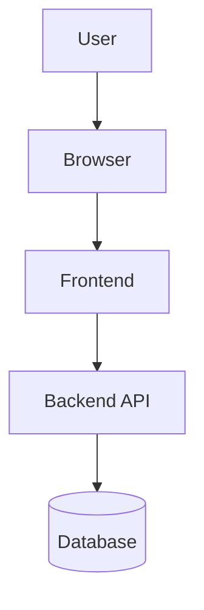
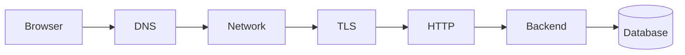
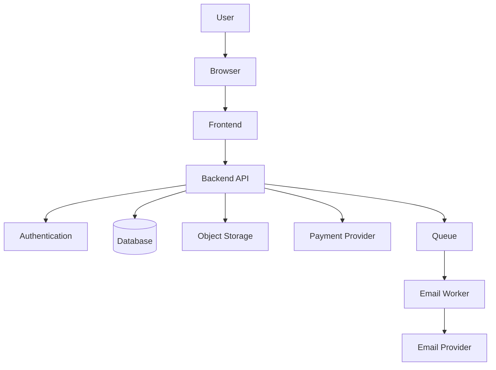

# Foundation Test — Web Mechanics, Architecture & Network Fundamentals  
## Comprehensive Review of Primers 1–5 and Parts 0–3

This test evaluates foundational understanding of:

- Computer concepts
- Command-line fundamentals
- Programming fundamentals
- HTML, CSS, and JavaScript
- Data and JSON
- Web application architecture
- Internet and networking
- HTTP and HTTPS

It is designed to be completed after studying:

```text
Primer 1 — Basic Computer Concepts
Primer 2 — Command-Line Fundamentals
Primer 3 — Programming Fundamentals
Primer 4 — HTML, CSS, and JavaScript Basics
Primer 5 — Data and JSON Fundamentals
Part 0 — Introduction
Part 1 — Software Architecture
Part 2 — Internet and Networking
Part 3 — HTTP and HTTPS
```

---

# Test Instructions

- Complete the test before viewing the answer key.
- Explain your reasoning for short-answer and scenario questions.
- Use diagrams to explain architecture questions where useful.
- Do not use production credentials or real private data in practical exercises.
- Some architecture questions may have multiple valid answers.
- For multiple-choice questions, choose the best answer.
- For scenario questions, prioritize evidence-based reasoning.

---

# Test Learning Objectives

After completing this test, you should be able to:

- Explain basic computer and operating-system concepts.
- Use the command line to inspect files, processes, and services.
- Describe programming concepts such as functions, objects, arrays, and asynchronous work.
- Explain how HTML, CSS, and JavaScript work together.
- Understand JSON and data serialization.
- Explain frontend and backend responsibilities.
- Describe how browsers find servers through DNS and IP addressing.
- Explain HTTP requests, responses, methods, headers, bodies, and status codes.
- Explain the purpose and limits of HTTPS.
- Diagnose common web application problems at a high level.

---

# Part 1 — Multiple-Choice Questions

## Question 1

Which component executes program instructions?

- [ ] Filesystem
- [ ] CPU
- [ ] Directory
- [ ] Environment variable

---

## Question 2

Which statement best describes RAM?

- [ ] Permanent storage
- [ ] Temporary working memory for running programs
- [ ] A network protocol
- [ ] A database schema

---

## Question 3

What is a process?

- [ ] A file stored on disk
- [ ] A running instance of a program
- [ ] A URL path
- [ ] A shell option

---

## Question 4

What does the operating system manage?

- [ ] Processes
- [ ] Memory
- [ ] Files and devices
- [ ] All of the above

---

## Question 5

What does a shell do?

- [ ] Interprets commands
- [ ] Stores database rows
- [ ] Renders CSS
- [ ] Replaces HTTP

---

## Question 6

What does the command `pwd` do?

- [ ] Prints the current working directory
- [ ] Deletes the working directory
- [ ] Starts a process
- [ ] Lists network ports

---

## Question 7

Which is an absolute Unix-like filesystem path?

- [ ] `src/app.js`
- [ ] `../app.js`
- [ ] `/home/alex/project/app.js`
- [ ] `./app.js`

---

## Question 8

What does `..` represent in a path?

- [ ] Current directory
- [ ] Parent directory
- [ ] Root directory only
- [ ] Hidden file

---

## Question 9

Which command commonly lists running processes on Unix-like systems?

- [ ] `ps aux`
- [ ] `pwd`
- [ ] `mkdir`
- [ ] `touch`

---

## Question 10

What does a port identify?

- [ ] A service on a networked host
- [ ] A source-code file
- [ ] A database row
- [ ] A CSS property

---

## Question 11

What is a variable?

- [ ] A named reference to a value
- [ ] A database connection
- [ ] A network packet
- [ ] A filesystem root

---

## Question 12

Which data structure represents an ordered collection?

- [ ] Array
- [ ] Object only
- [ ] Boolean
- [ ] Function

---

## Question 13

Which data structure stores named properties?

- [ ] Object
- [ ] Number
- [ ] Boolean
- [ ] Port

---

## Question 14

What does a function commonly provide?

- [ ] Reusable behavior
- [ ] A physical network cable
- [ ] A database server
- [ ] A DNS record

---

## Question 15

What does `async` and `await` commonly help manage?

- [ ] Asynchronous operations
- [ ] CSS selectors
- [ ] Filesystem permissions
- [ ] IP addresses

---

## Question 16

What does HTML primarily provide?

- [ ] Structure and meaning
- [ ] Encryption
- [ ] Database storage
- [ ] Server monitoring

---

## Question 17

What does CSS primarily provide?

- [ ] Presentation and layout
- [ ] Authentication
- [ ] API routing
- [ ] Database transactions

---

## Question 18

What does JavaScript commonly provide in the browser?

- [ ] Behavior and interaction
- [ ] DNS delegation
- [ ] Physical storage
- [ ] Server firewall rules

---

## Question 19

What is the DOM?

- [ ] The browser’s in-memory representation of HTML
- [ ] A database protocol
- [ ] A DNS record
- [ ] A cloud region

---

## Question 20

Which element should generally be used for an action?

- [ ] `<button>`
- [ ] `<div>`
- [ ] `<span>`
- [ ] `<article>`

---

## Question 21

Which element should generally be used for navigation?

- [ ] `<a>`
- [ ] `<button>` only
- [ ] `<div>`
- [ ] `<input>`

---

## Question 22

What does JSON represent?

- [ ] Structured data in a text format
- [ ] A CPU instruction set
- [ ] A physical server
- [ ] A CSS layout system

---

## Question 23

What does serialization do?

- [ ] Converts an in-memory value into transferable text or bytes
- [ ] Deletes a process
- [ ] Opens a port
- [ ] Validates a TLS certificate only

---

## Question 24

Which is valid JSON?

- [ ] `{name: "Alex"}`
- [ ] `{"name": "Alex"}`
- [ ] `{'name': 'Alex'}`
- [ ] `{name = "Alex"}`

---

## Question 25

What does `JSON.parse()` do?

- [ ] Converts JSON text into an in-memory value
- [ ] Converts an object into JSON text
- [ ] Sends an HTTP request
- [ ] Starts a server

---

## Question 26

What does `JSON.stringify()` do?

- [ ] Converts an in-memory value into JSON text
- [ ] Parses HTML
- [ ] Opens a database
- [ ] Resolves DNS

---

## Question 27

What is the frontend?

- [ ] Software running close to the user
- [ ] Only the database
- [ ] A physical data center
- [ ] A DNS resolver

---

## Question 28

What is the backend?

- [ ] Server-side software handling protected operations
- [ ] Only the page’s visual styling
- [ ] A keyboard driver
- [ ] A browser cache

---

## Question 29

Why is frontend validation insufficient for security?

- [ ] Users can modify or bypass frontend code and requests.
- [ ] Browsers cannot display errors.
- [ ] Servers cannot validate input.
- [ ] CSS prevents validation.

---

## Question 30

Authentication asks:

- [ ] Who is the caller?
- [ ] What is the caller allowed to do?
- [ ] Which color should be used?
- [ ] Which CSS file loaded?

---

## Question 31

Authorization asks:

- [ ] What is the caller allowed to do?
- [ ] Who is the caller?
- [ ] What is the browser width?
- [ ] Which DNS server responded?

---

## Question 32

What is the Internet?

- [ ] A global collection of interconnected networks
- [ ] Only websites
- [ ] A single computer
- [ ] A browser application

---

## Question 33

What is the Web?

- [ ] An application system built on the Internet
- [ ] The same thing as every network
- [ ] A physical cable
- [ ] A database engine

---

## Question 34

What is DNS primarily used for?

- [ ] Mapping domain names to network information
- [ ] Rendering HTML
- [ ] Storing passwords
- [ ] Executing JavaScript

---

## Question 35

What is an IP address?

- [ ] A network destination address
- [ ] A CSS selector
- [ ] A database row
- [ ] A shell alias

---

## Question 36

Which is a private IPv4 address?

- [ ] `192.168.1.20`
- [ ] `8.8.8.8`
- [ ] `2001:db8::1`
- [ ] `example.com`

---

## Question 37

What does NAT commonly allow?

- [ ] Multiple private devices to share a public IPv4 address
- [ ] Multiple databases to share one table
- [ ] Multiple browsers to share one password
- [ ] HTML to become CSS

---

## Question 38

What is latency?

- [ ] Delay in communication or processing
- [ ] Transfer capacity
- [ ] Number of files
- [ ] Amount of RAM

---

## Question 39

What is bandwidth?

- [ ] Amount of data transferable over time
- [ ] Delay before the first response
- [ ] A domain name
- [ ] A port number

---

## Question 40

What does HTTP define?

- [ ] How clients and servers exchange web messages
- [ ] How CPUs execute instructions
- [ ] How filesystems store blocks
- [ ] How users choose passwords

---

## Question 41

What does `GET` commonly mean?

- [ ] Retrieve a resource
- [ ] Delete a resource
- [ ] Replace a resource
- [ ] Create a database

---

## Question 42

What does `POST` commonly do?

- [ ] Submit data or create a resource
- [ ] Retrieve headers only
- [ ] Always delete data
- [ ] Resolve a hostname

---

## Question 43

What does `Content-Type` describe?

- [ ] The format of a message body
- [ ] The user’s identity
- [ ] The server’s CPU usage
- [ ] The DNS hierarchy

---

## Question 44

What does `Accept` describe?

- [ ] Response formats the client can process or prefers
- [ ] The request body format
- [ ] The server’s private key
- [ ] The database schema

---

## Question 45

What does `401 Unauthorized` usually indicate?

- [ ] Missing or invalid authentication
- [ ] Insufficient permission after authentication
- [ ] A missing route only
- [ ] Server overload only

---

## Question 46

What does `403 Forbidden` usually indicate?

- [ ] The caller lacks permission
- [ ] DNS failed
- [ ] A resource was created
- [ ] The request was redirected

---

## Question 47

What does `404 Not Found` usually indicate?

- [ ] A route or resource could not be found
- [ ] The Internet is necessarily broken
- [ ] TLS necessarily failed
- [ ] The database is necessarily gone

---

## Question 48

What does `500 Internal Server Error` usually indicate?

- [ ] Server-side or upstream failure
- [ ] Successful creation
- [ ] A normal cache response
- [ ] A browser focus problem

---

## Question 49

What does HTTPS add to HTTP?

- [ ] TLS protection
- [ ] A database
- [ ] A new HTML structure
- [ ] A new filesystem

---

## Question 50

What does HTTPS not automatically guarantee?

- [ ] Correct authorization logic
- [ ] Encrypted data in transit
- [ ] Integrity protection in transit
- [ ] Server certificate validation

---

# Part 2 — True or False

## Question 51

The operating system manages processes and memory.

- [ ] True
- [ ] False

## Question 52

A program and a process are exactly the same thing.

- [ ] True
- [ ] False

## Question 53

A relative path is interpreted using the current working directory.

- [ ] True
- [ ] False

## Question 54

Environment variables can contain sensitive values.

- [ ] True
- [ ] False

## Question 55

A browser is an untrusted client from the backend’s perspective.

- [ ] True
- [ ] False

## Question 56

A database should normally be exposed directly to arbitrary browser clients.

- [ ] True
- [ ] False

## Question 57

A static website can contain JavaScript.

- [ ] True
- [ ] False

## Question 58

Server-side rendering means JavaScript can never run in the browser.

- [ ] True
- [ ] False

## Question 59

A single-page application often communicates with APIs.

- [ ] True
- [ ] False

## Question 60

The Web and the Internet are identical concepts.

- [ ] True
- [ ] False

## Question 61

DNS stores the complete contents of every website.

- [ ] True
- [ ] False

## Question 62

Private IP addresses are normally directly routed across the public Internet.

- [ ] True
- [ ] False

## Question 63

Bandwidth and latency describe the same property.

- [ ] True
- [ ] False

## Question 64

A port identifies a service on a host.

- [ ] True
- [ ] False

## Question 65

HTTP requests can contain headers and optional bodies.

- [ ] True
- [ ] False

## Question 66

A `200 OK` response always means the business operation succeeded.

- [ ] True
- [ ] False

## Question 67

A `401` and a `403` usually represent different problems.

- [ ] True
- [ ] False

## Question 68

A URL fragment is usually sent to the server in the HTTP request.

- [ ] True
- [ ] False

## Question 69

JSON is a common format for transferring structured API data.

- [ ] True
- [ ] False

## Question 70

HTTPS automatically protects against all application vulnerabilities.

- [ ] True
- [ ] False

---

# Part 3 — Short-Answer Questions

## Question 71

What is the difference between RAM and persistent storage?

---

## Question 72

What is the difference between a program and a process?

---

## Question 73

What is the difference between a terminal and a shell?

---

## Question 74

What is the difference between an absolute path and a relative path?

---

## Question 75

What is an environment variable?

---

## Question 76

What is the difference between frontend and backend code?

---

## Question 77

Why must the backend validate data even if the frontend already validates it?

---

## Question 78

Explain the difference between authentication and authorization.

---

## Question 79

What is a source of truth?

---

## Question 80

What is the difference between a static site and a server-rendered site?

---

## Question 81

What is a single-page application?

---

## Question 82

What is JSON?

---

## Question 83

What is serialization?

---

## Question 84

What does DNS do?

---

## Question 85

What is the difference between latency and bandwidth?

---

## Question 86

What is a network port?

---

## Question 87

What is the difference between HTTP and HTTPS?

---

## Question 88

What is the difference between `401` and `403`?

---

## Question 89

What is the difference between `404` and a DNS failure?

---

## Question 90

What is the purpose of HTTP headers?

---

# Part 4 — Integrated Architecture Questions

## Question 91

Explain this architecture:



Describe the responsibility of each component.

---

## Question 92

Why should the backend calculate the final price of an order instead of trusting the browser?

---

## Question 93

Why should private database credentials remain on the server?

---

## Question 94

What happens when a browser opens:

```text
https://example.com/products
```

Describe the journey at a high level.

---

## Question 95

What components could participate in this request?



---

## Question 96

Why might a frontend and backend run as separate processes on the same computer?

---

## Question 97

What is the purpose of a frontend-backend API contract?

---

## Question 98

Why might a web application use a queue and background worker?

---

## Question 99

What is one benefit and one tradeoff of using a CDN?

---

## Question 100

What is one benefit and one tradeoff of using microservices?

---

# Part 5 — Scenario Questions

## Question 101 — Modified Browser Request

The frontend prevents a user from entering a negative quantity. The user manually sends:

```json
{
  "productId": 123,
  "quantity": -5
}
```

What must the backend do?

---

## Question 102 — Wrong Price

The browser sends:

```json
{
  "productId": 123,
  "quantity": 2,
  "price": 0.01
}
```

What should the server do?

---

## Question 103 — No Request

A button is clicked, but no request appears in the Network panel.

What should you inspect first?

---

## Question 104 — `401`

A user clicks “View Account” and receives:

```http
401 Unauthorized
```

What should you investigate?

---

## Question 105 — `403`

A logged-in user attempts to open an administrator endpoint and receives:

```http
403 Forbidden
```

What does this likely mean?

---

## Question 106 — `404`

The frontend calls:

```text
/api/product/123
```

but the backend documents:

```text
/api/products/123
```

What is likely wrong?

---

## Question 107 — `500`

The browser receives:

```http
500 Internal Server Error
```

What evidence should you collect?

---

## Question 108 — Slow Request

A request has:

```text
Low DNS time
Low TLS time
High TTFB
Small response body
```

What should you investigate?

---

## Question 109 — Browser vs cURL

cURL receives a valid JSON response, but browser JavaScript reports a CORS error.

Why?

---

## Question 110 — Duplicate Order

A client retries a `POST /orders` request after the first response is lost, creating two orders.

How could the system prevent this?

---

## Question 111 — Stale Data

The server database contains new data, but the browser shows an old version.

What cache layers could be involved?

---

## Question 112 — Direct Database Access

A developer wants the frontend to query the production database directly.

What concerns should you raise?

---

## Question 113 — Static or Dynamic?

A site consists of static HTML, CSS, and JavaScript, but JavaScript requests user-specific data from an API.

Is the site static? Explain.

---

## Question 114 — Payment Dependency

The payment provider is temporarily unavailable during checkout.

What possible responses could the system use?

---

## Question 115 — Production Deployment

A deployment completes, but users receive `503 Service Unavailable`.

What should you investigate?

---

# Part 6 — Practical Foundation Exercises

## Exercise 1 — Local Process and Port

Start a local server:

```bash
python -m http.server 8000
```

Then inspect it:

```bash
curl -i http://localhost:8000
```

Identify:

```text
Process
Host
Port
HTTP method
Status code
Response type
```

---

## Exercise 2 — JSON Data

Create this JavaScript object:

```javascript
const product = {
  id: 123,
  name: "Keyboard",
  price: 79.99,
  available: true
};
```

Serialize it:

```javascript
const json = JSON.stringify(product);
```

Parse it again:

```javascript
const parsed = JSON.parse(json);
```

Explain the difference between:

```text
product
json
parsed
```

---

## Exercise 3 — Local API Request

Use cURL to send JSON to an authorized test endpoint:

```bash
curl \
  -i \
  -X POST \
  -H "Content-Type: application/json" \
  -d '{"name":"Alex","topic":"web fundamentals"}' \
  https://httpbin.org/post
```

Record:

```text
Request method
Content type
Request body
Response status
Response body type
```

---

## Exercise 4 — Architecture Diagram

Create a Mermaid diagram for an online store that includes:

```text
Browser
Frontend
Backend API
Authentication
Database
Object storage
Payment provider
Queue
Email worker
```

---

# Answer Key

# Part 1 — Multiple-Choice Answers

| Question | Answer | Explanation |
|---:|---|---|
| 1 | CPU | The CPU executes instructions. |
| 2 | Temporary working memory for running programs | RAM is temporary working memory. |
| 3 | A running instance of a program | A process is executing. |
| 4 | All of the above | The operating system manages processes, memory, files, and devices. |
| 5 | Interprets commands | A shell reads and executes command instructions. |
| 6 | Prints the current working directory | `pwd` reports the current path. |
| 7 | `/home/alex/project/app.js` | It begins at the filesystem root. |
| 8 | Parent directory | `..` means the parent directory. |
| 9 | `ps aux` | It commonly lists processes. |
| 10 | A service on a networked host | Ports identify services. |
| 11 | A named reference to a value | Variables allow programs to store and reuse values. |
| 12 | Array | Arrays are ordered collections. |
| 13 | Object | Objects store named properties. |
| 14 | Reusable behavior | Functions group logic. |
| 15 | Asynchronous operations | `async` and `await` simplify Promise-based work. |
| 16 | Structure and meaning | HTML describes document structure. |
| 17 | Presentation and layout | CSS controls visual presentation. |
| 18 | Behavior and interaction | JavaScript controls browser behavior. |
| 19 | The browser’s in-memory representation of HTML | The DOM represents document structure. |
| 20 | `<button>` | Buttons represent actions. |
| 21 | `<a>` | Links represent navigation. |
| 22 | Structured data in a text format | JSON is a common API format. |
| 23 | Converts an in-memory value into transferable text or bytes | Serialization prepares data for transport. |
| 24 | `{"name": "Alex"}` | Standard JSON requires double-quoted keys and strings. |
| 25 | Converts JSON text into an in-memory value | `JSON.parse()` deserializes JSON. |
| 26 | Converts an in-memory value into JSON text | `JSON.stringify()` serializes data. |
| 27 | Software running close to the user | Frontend code commonly runs in the browser. |
| 28 | Server-side software handling protected operations | Backend code manages business logic and data access. |
| 29 | Users can modify or bypass frontend code and requests. | Client-side behavior is not a security boundary. |
| 30 | Who is the caller? | Authentication verifies identity. |
| 31 | What is the caller allowed to do? | Authorization checks permissions. |
| 32 | A global collection of interconnected networks | The Internet includes many networks and devices. |
| 33 | An application system built on the Internet | The Web uses HTTP, browsers, URLs, and related technologies. |
| 34 | Mapping domain names to network information | DNS commonly resolves names to addresses. |
| 35 | A network destination address | IP identifies a destination on an IP network. |
| 36 | `192.168.1.20` | This is in a common private IPv4 range. |
| 37 | Multiple private devices to share a public IPv4 address | NAT translates between private and public addressing. |
| 38 | Delay in communication or processing | Latency is measured in time. |
| 39 | Transfer capacity | Bandwidth measures data transfer capacity. |
| 40 | How clients and servers exchange web messages | HTTP structures web requests and responses. |
| 41 | Retrieve a resource | `GET` is generally read-oriented. |
| 42 | Submit data or create a resource | `POST` commonly submits or creates. |
| 43 | The format of a message body | `Content-Type` describes body data. |
| 44 | Response formats the client can process or prefers | `Accept` describes response preferences. |
| 45 | Missing or invalid authentication | `401` generally concerns identity. |
| 46 | The caller lacks permission | `403` generally concerns authorization. |
| 47 | A route or resource could not be found | `404` is a valid HTTP response from a reachable server. |
| 48 | Server-side or upstream failure | `500` is an internal server failure. |
| 49 | TLS protection | HTTPS is HTTP over TLS. |
| 50 | Correct authorization logic | HTTPS does not automatically secure application logic. |

---

# Part 2 — True-or-False Answers

| Question | Answer | Explanation |
|---:|---|---|
| 51 | True | The operating system manages processes and memory. |
| 52 | False | A program is stored instructions; a process is a running instance. |
| 53 | True | Relative paths depend on the current working directory. |
| 54 | True | Environment variables may contain secrets. |
| 55 | True | The browser can be modified and requests can be manually constructed. |
| 56 | False | The backend should normally control database access. |
| 57 | True | Static sites can include JavaScript. |
| 58 | False | SSR pages may be enhanced or hydrated with browser JavaScript. |
| 59 | True | SPAs commonly request data from APIs. |
| 60 | False | The Web is one application system using the Internet. |
| 61 | False | DNS stores naming information, not full websites. |
| 62 | False | Private addresses are generally not publicly routed. |
| 63 | False | Latency measures delay; bandwidth measures transfer capacity. |
| 64 | True | A port identifies a service on a host. |
| 65 | True | Requests contain headers and may contain bodies. |
| 66 | False | HTTP success does not guarantee business success. |
| 67 | True | `401` and `403` generally represent authentication and authorization problems. |
| 68 | False | URL fragments are usually handled by the browser. |
| 69 | True | JSON is widely used for structured API data. |
| 70 | False | HTTPS does not fix application-level vulnerabilities. |

---

# Part 3 — Short-Answer Model Answers

## Question 71

RAM is temporary working memory used by active programs. Persistent storage retains files and data after shutdown.

---

## Question 72

A program is a set of instructions stored on disk. A process is a running instance of that program.

---

## Question 73

A terminal is the interface window used to enter commands. A shell is the program that interprets those commands.

---

## Question 74

An absolute path begins from the filesystem root or drive. A relative path is interpreted from the current working directory.

---

## Question 75

An environment variable is a named runtime configuration value provided to a process.

---

## Question 76

Frontend code runs close to the user and handles interface rendering, interaction, and temporary state. Backend code runs in a controlled environment and handles business rules, authentication, authorization, data access, and integrations.

---

## Question 77

The browser is untrusted. Users can bypass or modify frontend validation, so the backend must validate input independently for security and correctness.

---

## Question 78

Authentication verifies identity. Authorization determines what that identity is allowed to do.

---

## Question 79

A source of truth is the system considered authoritative for a particular piece of information.

---

## Question 80

A static site serves prebuilt assets. A server-rendered site generates HTML on demand, often using current data.

---

## Question 81

A single-page application commonly loads an application shell and uses JavaScript and APIs to update the interface without full page reloads.

---

## Question 82

JSON is a text-based format for representing structured data using objects, arrays, strings, numbers, booleans, and `null`.

---

## Question 83

Serialization converts an in-memory value into transferable text or bytes. Deserialization converts it back into a usable in-memory value.

---

## Question 84

DNS maps domain names to network information, commonly IP addresses.

---

## Question 85

Latency is communication delay. Bandwidth is the amount of data that can be transferred over time.

---

## Question 86

A port identifies a service on a networked host, such as HTTPS on port `443` or a development server on port `3000`.

---

## Question 87

HTTP defines web requests and responses. HTTPS is HTTP protected by TLS, providing confidentiality, integrity, and server authentication.

---

## Question 88

`401` usually means authentication is missing or invalid. `403` usually means the caller is known but lacks permission.

---

## Question 89

A `404` is an HTTP response indicating that a route or resource was not found. A DNS failure means the hostname could not be resolved, so an HTTP response may never have been received.

---

## Question 90

HTTP headers carry metadata such as:

```text
Content type
Authentication
Cookies
Caching instructions
Accepted formats
Origin
Redirect location
Security policies
```

---

# Part 4 — Integrated Architecture Answers

## Question 91


```text
User:
  Initiates actions.

Browser:
  Runs frontend code and displays the interface.

Frontend:
  Handles rendering, interaction, temporary state, and requests.

Backend API:
  Validates, authenticates, authorizes, applies business rules, and accesses data.

Database:
  Stores and retrieves persistent information.
```

---

## Question 92

The browser can modify the price it displays or sends. The backend should retrieve the current authoritative price, calculate the total, apply discounts and taxes, and verify inventory.

---

## Question 93

Private database credentials in browser code would be visible to users. The backend should keep those credentials in protected server-side configuration.

---

## Question 94

A high-level journey is:

```text
1. Browser parses the URL.
2. DNS resolves example.com.
3. Browser establishes a network connection.
4. TLS protects the connection.
5. Browser sends an HTTP request.
6. Server, CDN, or load balancer processes it.
7. Backend may query a database.
8. Server returns an HTTP response.
9. Browser parses and renders the result.
```

---

## Question 95

Possible participants:

```text
Browser
DNS resolver
Routers
ISP
CDN
Load balancer
TLS endpoint
Backend application
Database
External services
Firewall
```

---

## Question 96

Separate processes can communicate through local network protocols such as HTTP. Separating them allows different tools, runtimes, responsibilities, and restart behavior.

---

## Question 97

The API contract defines how clients and servers communicate, including:

```text
URLs
Methods
Headers
Authentication
Request bodies
Response schemas
Status codes
Errors
Pagination
Versioning
```

---

## Question 98

Queues and workers allow long-running or optional work to happen asynchronously, such as:

```text
Sending emails
Generating reports
Processing files
Transcoding video
Sending notifications
```

---

## Question 99

Benefit:

```text
A CDN can reduce latency and origin-server workload for cacheable content.
```

Tradeoff:

```text
Caching introduces invalidation, staleness, and private-data risks.
```

---

## Question 100

Benefit:

```text
Services can scale and deploy independently.
```

Tradeoff:

```text
Network failures, distributed tracing, deployments, and data consistency become more complex.
```

---

# Part 5 — Scenario Model Answers

## Question 101 — Modified Browser Request

The backend should reject the request after validating:

```text
Product ID
Quantity type
Quantity range
Inventory
User authorization
```

Frontend validation improves usability but cannot enforce this rule.

---

## Question 102 — Wrong Price

The backend should ignore or reject the client-provided price and retrieve the authoritative price from the backend’s pricing data or database.

---

## Question 103 — No Request

Inspect:

```text
Console errors
Event handler
Button state
Form behavior
Frontend validation
JavaScript initialization
Request construction
```

The problem likely occurred before network transmission.

---

## Question 104 — `401`

Inspect:

```text
Session cookie
Authorization header
Token expiration
Login response
Cookie domain and path
Secure and SameSite settings
Environment
```

---

## Question 105 — `403`

The user is likely authenticated but not authorized to access the administrator endpoint. Check roles, permissions, organization membership, and account status.

---

## Question 106 — `404`

The frontend likely uses the wrong route path:

```text
/api/product/123
```

instead of:

```text
/api/products/123
```

Check the API contract, method, environment, and resource identifier.

---

## Question 107 — `500`

Collect:

```text
Request URL
Method
Headers
Payload
Response body
Request ID
Application logs
Database logs
External dependency logs
Recent deployment history
```

---

## Question 108 — Slow Request

High TTFB with low network setup times suggests slow server-side work, such as:

```text
Database query
External API
Cache miss
Backend computation
Server queue
Cold start
```

---

## Question 109 — Browser vs cURL

cURL does not enforce browser CORS restrictions. The server may return valid JSON, but the browser may block frontend JavaScript from reading it because CORS headers do not authorize the origin or requested credentials.

---

## Question 110 — Duplicate Order

Use:

```http
Idempotency-Key: order-attempt-123
```

The backend should associate the key with the original result and return that result for retries instead of creating a second order.

---

## Question 111 — Stale Data

Possible cache layers:

```text
Browser cache
Service worker cache
CDN cache
Reverse proxy cache
Application cache
Database cache
```

Inspect cache headers, service workers, storage, and the actual response source.

---

## Question 112 — Direct Database Access

Concerns include:

```text
Credential exposure
Private-data exposure
Authorization bypass
Database port exposure
Business-rule bypass
Dangerous queries
Schema coupling
Poor auditing
```

Safer:

```text
Browser → Backend API → Database
```

---

## Question 113 — Static or Dynamic?

It can still be considered a static site if the primary assets are prebuilt files. JavaScript can provide dynamic behavior by calling an external API.

---

## Question 114 — Payment Dependency

Possible responses:

```text
Return a temporary failure.
Keep the order pending.
Retry with bounded backoff.
Use an idempotency key.
Queue reconciliation.
Use a circuit breaker.
Do not mark the order paid until confirmed.
```

---

## Question 115 — Production Deployment

Investigate:

```text
Application health
Load balancer health checks
Deployment logs
Application logs
Environment variables
Ports
Database connectivity
Readiness checks
Recent configuration changes
Autoscaling
```

---

# Part 6 — Practical Exercise Guidance

## Exercise 1

Identify:

```text
Process:
  Python HTTP server

Host:
  localhost

Port:
  8000

HTTP method:
  GET

Status:
  Usually 200

Response type:
  Often HTML for a directory listing
```

---

## Exercise 2

```text
product:
  In-memory JavaScript object

json:
  Serialized JSON text

parsed:
  New in-memory object created by parsing the JSON text
```

---

## Exercise 3

Expected information:

```text
Method:
  POST

Content type:
  application/json

Request body:
  {"name":"Alex","topic":"web fundamentals"}

Response:
  Usually JSON from the test service
```

---

## Exercise 4

A reasonable architecture:



---

# Scoring Guidance

## Multiple choice and true/false

```text
1 point per correct answer
```

## Short-answer questions

```text
2 points:
  Correct core concept.

3 points:
  Correct explanation and example.

4 points:
  Accurate explanation, system boundary, and practical implication.
```

## Integrated architecture questions

Evaluate:

```text
Component responsibilities
Trust boundaries
Data ownership
Request flow
Security reasoning
Failure awareness
```

## Scenario questions

Evaluate whether the learner:

```text
Identifies the likely failing layer
Uses evidence
Distinguishes client from server authority
Recognizes security risks
Suggests an appropriate next action
```

---

# Review Recommendations

If you struggled with:

```text
Computer concepts:
  Primer 1

Command line:
  Primer 2

Programming:
  Primer 3

HTML, CSS, JavaScript:
  Primer 4

Data and JSON:
  Primer 5

Architecture:
  Part 1

Networking:
  Part 2

HTTP and HTTPS:
  Part 3

Diagnostics:
  Part 5
  Appendix E
  Appendix F
  Appendix K
```

---

# Completion Criteria

You are ready for the next assessment when you can:

```text
Explain core computer concepts.
Use basic command-line tools.
Describe frontend and backend responsibilities.
Explain HTML, CSS, and JavaScript roles.
Explain JSON and serialization.
Trace a request from browser to server.
Explain DNS and IP addressing.
Interpret HTTP requests and responses.
Distinguish common status codes.
Explain HTTPS and TLS.
Identify trust boundaries.
Diagnose common frontend, network, and backend failures.
```
