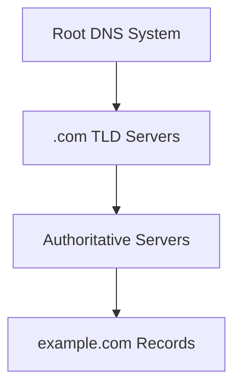
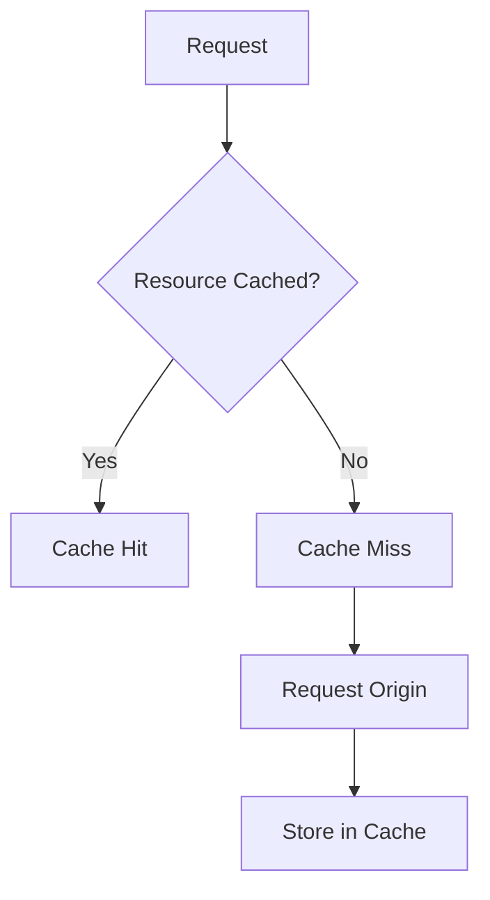
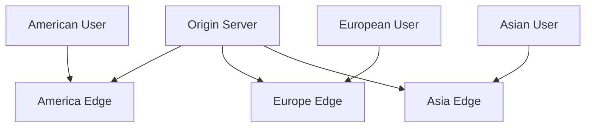
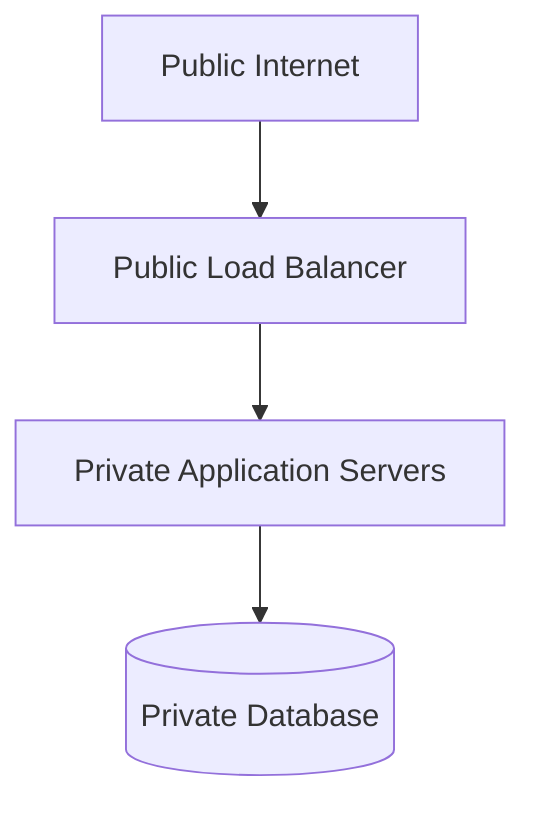
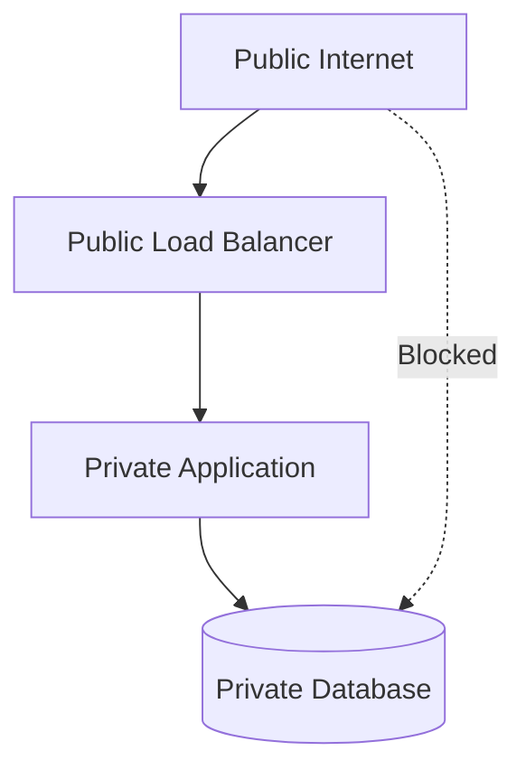

# Networking Test — Internet, DNS, IP Addressing, Routing, CDNs, and Network Troubleshooting

This test evaluates understanding of:

- Internet versus Web
- Network layers
- Packets
- Packet switching
- IPv4 and IPv6
- Public and private IP addresses
- NAT
- DNS
- Recursive resolvers
- Root, TLD, and authoritative servers
- DNS records and caching
- Routers and switches
- ISPs
- Ports
- Latency and bandwidth
- Jitter and packet loss
- Data centers
- Origin servers
- CDNs
- Load balancers
- Firewalls
- Local and private networks
- Request journeys
- Network troubleshooting

---

## Test Instructions

- Complete the test before reading the answer key.
- Explain your reasoning for short-answer and scenario questions.
- Use only systems and domains you own or are authorized to inspect.
- Do not perform aggressive scanning, load testing, or intrusive network activity.
- Network results can vary by location, provider, routing policy, and time.
- Some design questions may have multiple valid answers.

---

## Learning Objectives

After completing this test, you should be able to:

- Explain the difference between the Internet and the Web.
- Describe how packets travel through networks.
- Explain IPv4, IPv6, public addresses, private addresses, and NAT.
- Describe DNS resolution from browser cache to authoritative server.
- Identify common DNS record types.
- Explain DNS caching and TTL.
- Distinguish routers, switches, ISPs, and data centers.
- Explain ports and network services.
- Distinguish latency, bandwidth, jitter, and packet loss.
- Explain CDNs, origin servers, and load balancers.
- Describe public and private network boundaries.
- Trace a request from a browser to a server.
- Diagnose common DNS, connection, routing, firewall, and infrastructure failures.

---

# Part 1 — Multiple-Choice Questions

Choose the best answer.

## Question 1

What is the Internet?

- [ ] A single large computer
- [ ] A global collection of interconnected networks
- [ ] Only websites and browsers
- [ ] A database-management system

---

## Question 2

What is the Web?

- [ ] The complete physical Internet
- [ ] An application system built on the Internet
- [ ] A type of network cable
- [ ] A private IP address

---

## Question 3

Which technology is primarily associated with the Web?

- [ ] HTTP
- [ ] HDMI
- [ ] SATA
- [ ] BIOS

---

## Question 4

What is a packet?

- [ ] A physical server
- [ ] A unit of data transmitted across a network
- [ ] A database row
- [ ] A browser tab

---

## Question 5

Why is data divided into packets?

- [ ] To allow shared networks to route and handle smaller units of data
- [ ] To eliminate all latency
- [ ] To avoid using IP addresses
- [ ] To convert data into HTML

---

## Question 6

What is packet switching?

- [ ] Sending data through shared networks as separate packets
- [ ] Switching between browser tabs
- [ ] Changing a database schema
- [ ] Encrypting an image

---

## Question 7

What does IP stand for?

- [ ] Internet Protocol
- [ ] Internal Process
- [ ] Internet Port
- [ ] Interface Program

---

## Question 8

What is the main purpose of an IP address?

- [ ] Identify a network destination
- [ ] Identify a CSS class
- [ ] Store a user password
- [ ] Describe a database table

---

## Question 9

How many bits are in an IPv4 address?

- [ ] 16
- [ ] 32
- [ ] 64
- [ ] 128

---

## Question 10

Which is an IPv4 address?

- [ ] `203.0.113.10`
- [ ] `2001:db8::1`
- [ ] `example.com`
- [ ] `https://example.com`

---

## Question 11

How many bits are in an IPv6 address?

- [ ] 32
- [ ] 64
- [ ] 96
- [ ] 128

---

## Question 12

Which is an IPv6 address?

- [ ] `192.168.1.1`
- [ ] `2001:db8::1`
- [ ] `example.com`
- [ ] `localhost:3000`

---

## Question 13

What is a public IP address?

- [ ] An address used only inside one computer
- [ ] An address that may be reachable through public Internet routing
- [ ] A browser cookie
- [ ] A DNS password

---

## Question 14

What is a private IP address?

- [ ] An address commonly used inside a local or private network
- [ ] An address that must be globally reachable
- [ ] A public DNS root address
- [ ] A URL fragment

---

## Question 15

Which is in a common private IPv4 range?

- [ ] `192.168.1.20`
- [ ] `8.8.8.8`
- [ ] `203.0.113.10`
- [ ] `2001:db8::1`

---

## Question 16

What does NAT commonly do?

- [ ] Allows multiple private devices to share a public IPv4 address
- [ ] Converts HTML into CSS
- [ ] Stores DNS records
- [ ] Encrypts every request

---

## Question 17

What is a domain name?

- [ ] A human-readable name associated with network information
- [ ] A physical router
- [ ] A database password
- [ ] A packet header

---

## Question 18

What does DNS primarily do?

- [ ] Maps domain names to network information
- [ ] Renders HTML
- [ ] Executes JavaScript
- [ ] Stores complete website files

---

## Question 19

What does DNS stand for?

- [ ] Domain Name System
- [ ] Digital Network Service
- [ ] Domain Network Security
- [ ] Data Naming Standard

---

## Question 20

What is a recursive DNS resolver?

- [ ] A system that performs DNS lookups on behalf of clients
- [ ] A browser rendering engine
- [ ] A database query planner
- [ ] A web server

---

## Question 21

What is an authoritative DNS server?

- [ ] A server that holds official DNS records for a domain
- [ ] A server that stores every website’s HTML
- [ ] A client’s home router
- [ ] A browser cache

---

## Question 22

What do root DNS servers generally do?

- [ ] Direct queries toward top-level-domain servers
- [ ] Return every domain’s IP address directly
- [ ] Serve HTML pages
- [ ] Authenticate users

---

## Question 23

What do TLD servers generally do?

- [ ] Direct queries toward authoritative servers for domains under a top-level domain
- [ ] Store browser cookies
- [ ] Process application orders
- [ ] Encrypt HTTP bodies

---

## Question 24

What does an `A` record map?

- [ ] A hostname to an IPv4 address
- [ ] A hostname to an IPv6 address
- [ ] A domain to an email server
- [ ] An IP address to a hostname

---

## Question 25

What does an `AAAA` record map?

- [ ] A hostname to an IPv4 address
- [ ] A hostname to an IPv6 address
- [ ] A domain to a mail server
- [ ] A URL to a file

---

## Question 26

What does a `CNAME` record provide?

- [ ] An alias from one hostname to another
- [ ] A database connection
- [ ] An encrypted password
- [ ] A packet route

---

## Question 27

What does an `MX` record identify?

- [ ] Mail servers for a domain
- [ ] Image servers
- [ ] Database tables
- [ ] CDN edge locations

---

## Question 28

What is DNS caching?

- [ ] Temporarily storing DNS results for reuse
- [ ] Storing HTML in a database
- [ ] Encrypting DNS records
- [ ] Converting IPv4 to IPv6

---

## Question 29

What does DNS TTL describe?

- [ ] How long a DNS result may be cached
- [ ] The size of a domain name
- [ ] The number of routers in a path
- [ ] The length of an HTTP body

---

## Question 30

What is a router?

- [ ] A device or system that forwards traffic between networks
- [ ] A tool that lists files
- [ ] A database table
- [ ] A browser extension

---

## Question 31

What is a switch?

- [ ] A device that commonly connects devices within a local network
- [ ] A public DNS service
- [ ] A web framework
- [ ] A certificate authority

---

## Question 32

What is an ISP?

- [ ] Internet Service Provider
- [ ] Internal Server Process
- [ ] Internet Security Program
- [ ] IP Storage Provider

---

## Question 33

What is latency?

- [ ] Delay involved in communication or processing
- [ ] Amount of data transferred per second
- [ ] Number of IP addresses
- [ ] Storage capacity

---

## Question 34

What is bandwidth?

- [ ] Amount of data that can be transferred over time
- [ ] Delay before the first response
- [ ] Number of routers
- [ ] A DNS record type

---

## Question 35

What is jitter?

- [ ] Variation in packet arrival timing
- [ ] A type of IP address
- [ ] A database lock
- [ ] A browser cache

---

## Question 36

What is packet loss?

- [ ] Packets fail to reach their destination
- [ ] A domain expires
- [ ] A database row is deleted
- [ ] A browser loses focus

---

## Question 37

What does a network port identify?

- [ ] A service on a networked host
- [ ] A geographic region
- [ ] A filesystem directory
- [ ] A CSS selector

---

## Question 38

Which port is commonly associated with HTTPS?

- [ ] `22`
- [ ] `53`
- [ ] `80`
- [ ] `443`

---

## Question 39

What is a CDN?

- [ ] A distributed network that delivers content closer to users
- [ ] A database query language
- [ ] A local terminal
- [ ] A password manager

---

## Question 40

What is an origin server?

- [ ] The primary source of application content
- [ ] A client’s home router
- [ ] A DNS cache
- [ ] A browser extension

---

## Question 41

What does a load balancer do?

- [ ] Distributes requests among application servers
- [ ] Stores all application files permanently
- [ ] Replaces all DNS servers
- [ ] Encrypts database rows

---

## Question 42

What does a firewall do?

- [ ] Allows or blocks network traffic according to rules
- [ ] Converts JSON to XML
- [ ] Creates frontend components
- [ ] Stores cookies

---

## Question 43

What does `localhost` usually refer to?

- [ ] The current computer
- [ ] A public cloud region
- [ ] The nearest CDN
- [ ] A DNS root server

---

## Question 44

What does `127.0.0.1` usually represent?

- [ ] IPv4 loopback address
- [ ] Public DNS address
- [ ] Database port
- [ ] CDN hostname

---

## Question 45

Which statement is correct?

- [ ] High bandwidth always means low latency.
- [ ] Latency and bandwidth describe different properties.
- [ ] Latency is measured in gigabytes.
- [ ] Bandwidth is always measured in milliseconds.

---

# Part 2 — True or False

## Question 46

The Web and the Internet are exactly the same thing.

- [ ] True
- [ ] False

---

## Question 47

The Internet carries traffic other than websites.

- [ ] True
- [ ] False

---

## Question 48

Large network messages may be divided into packets.

- [ ] True
- [ ] False

---

## Question 49

An IP address always identifies one permanent physical machine.

- [ ] True
- [ ] False

---

## Question 50

IPv4 uses 32-bit addresses.

- [ ] True
- [ ] False

---

## Question 51

IPv6 uses 128-bit addresses.

- [ ] True
- [ ] False

---

## Question 52

Private IPv4 addresses are normally routed directly over the public Internet.

- [ ] True
- [ ] False

---

## Question 53

NAT can let multiple private devices share a public IPv4 address.

- [ ] True
- [ ] False

---

## Question 54

DNS stores the complete content of every website.

- [ ] True
- [ ] False

---

## Question 55

DNS results can be cached.

- [ ] True
- [ ] False

---

## Question 56

A low DNS TTL generally permits a result to be cached for less time than a high TTL.

- [ ] True
- [ ] False

---

## Question 57

Routers and switches always perform exactly the same function.

- [ ] True
- [ ] False

---

## Question 58

Physical distance can contribute to latency.

- [ ] True
- [ ] False

---

## Question 59

A server can run several services on different ports.

- [ ] True
- [ ] False

---

## Question 60

If DNS succeeds, the website is guaranteed to work.

- [ ] True
- [ ] False

---

## Question 61

A CDN can reduce origin-server workload for cacheable content.

- [ ] True
- [ ] False

---

## Question 62

A CDN automatically fixes application authorization bugs.

- [ ] True
- [ ] False

---

## Question 63

A load balancer can route traffic only to healthy application instances.

- [ ] True
- [ ] False

---

## Question 64

A firewall can control traffic based on ports and addresses.

- [ ] True
- [ ] False

---

## Question 65

A private database should normally be directly accessible from any public Internet client.

- [ ] True
- [ ] False

---

# Part 3 — Short-Answer Questions

Answer in complete sentences.

## Question 66

What is the difference between the Internet and the Web?

---

## Question 67

What is a packet?

---

## Question 68

Why is packet switching useful?

---

## Question 69

What is an IP address?

---

## Question 70

What is the difference between IPv4 and IPv6?

---

## Question 71

What is the difference between public and private IP addresses?

---

## Question 72

What does NAT do?

---

## Question 73

What is a domain name?

---

## Question 74

What does DNS do?

---

## Question 75

What is a recursive DNS resolver?

---

## Question 76

What is an authoritative DNS server?

---

## Question 77

Describe a simplified DNS lookup for:

```text
www.example.com
```

---

## Question 78

What is DNS caching?

---

## Question 79

What is DNS TTL?

---

## Question 80

What is the difference between an `A` and an `AAAA` record?

---

## Question 81

What is a `CNAME` record?

---

## Question 82

What is the difference between a router and a switch?

---

## Question 83

What does an ISP do?

---

## Question 84

What is latency?

---

## Question 85

What is bandwidth?

---

## Question 86

What are jitter and packet loss?

---

## Question 87

What is a network port?

---

## Question 88

What is an origin server?

---

## Question 89

What is a CDN edge server?

---

## Question 90

What is the purpose of a load balancer?

---

# Part 4 — Network and DNS Analysis

## Question 91

Explain this request path:


Describe the role of each component.

---

## Question 92

Explain this DNS hierarchy:



---

## Question 93

Explain the difference between a cache hit and cache miss:



---

## Question 94

Explain this CDN architecture:



---

## Question 95

Explain this public/private architecture:



Why might the database be private?

---

## Question 96

Explain this destination:

```text
203.0.113.10:443
```

---

## Question 97

Explain this local URL:

```text
http://localhost:3000
```

Identify:

```text
Scheme
Host
Port
```

---

## Question 98

What steps occur when a browser opens:

```text
https://shop.example.com/products
```

---

## Question 99

List at least five components or layers that could fail during that request.

---

## Question 100

Why might a CDN improve performance for images but not for an uncached, database-heavy search API?

---

# Part 5 — Scenario Questions

## Question 101 — DNS Failure

A browser cannot resolve:

```text
api.example.com
```

Other websites work.

What should you investigate?

---

## Question 102 — DNS Success, Timeout

DNS returns an IP address, but the client receives a connection timeout.

What could be wrong?

---

## Question 103 — Connection Refused

The hostname resolves, but the connection is refused.

What might this indicate?

---

## Question 104 — IPv6 Failure

A service works over IPv4 but fails over IPv6.

What should you inspect?

---

## Question 105 — Private Address

A server has:

```text
192.168.1.20
```

Can a random public Internet user generally connect directly to it?

---

## Question 106 — NAT

A home network has several private devices but one public Internet address.

What technology commonly enables this?

---

## Question 107 — DNS Change

An organization changes a domain’s IP address, but some users continue reaching the old server.

Why might this happen?

---

## Question 108 — Slow First Request

The first request to a domain is slow, while later requests are faster.

What might explain the difference?

---

## Question 109 — High Latency

Users far from the origin server experience high latency.

What architectural techniques might help?

---

## Question 110 — High Bandwidth and High Delay

A connection transfers large files quickly but takes a long time before the first response byte arrives.

What does this demonstrate?

---

## Question 111 — Packet Loss

A video call has broken audio and delayed messages.

What network issues might be involved?

---

## Question 112 — CDN Cache Miss

A CDN receives a request for an image it does not have cached.

What happens next?

---

## Question 113 — Private Response Cached Publicly

A user-specific account response is accidentally marked publicly cacheable.

Why is this dangerous?

---

## Question 114 — Load Balancer Failure Handling

One of three application servers crashes behind a load balancer.

What should ideally happen?

---

## Question 115 — DNS Success, HTTP `500`

DNS resolves, the connection succeeds, and the server returns:

```http
500 Internal Server Error
```

Which layer is probably failing?

---

## Question 116 — Wrong Environment

A production domain displays staging content.

What should you inspect?

---

## Question 117 — Firewall Problem

The application works locally on the server but cannot be accessed through the public domain.

What layers should you investigate?

---

## Question 118 — Public Database Port

A cloud database is publicly reachable on port `5432`.

What risks exist?

What would a safer design look like?

---

## Question 119 — Changing Routes

An application is fast in the morning and slow in the afternoon without a deployment.

What network or infrastructure factors might change?

---

## Question 120 — CDN Does Not Solve Search Latency

A team adds a CDN, but uncached product search is still slow.

Why might the CDN not help?

---

# Part 6 — Practical Networking Exercises

Use systems you own or are authorized to inspect.

## Exercise 1 — DNS Lookup

```bash
nslookup example.com
```

or:

```bash
dig example.com
```

Record:

```text
A records:
AAAA records:
TTL:
Name servers if visible:
```

---

## Exercise 2 — Verbose HTTPS Request

```bash
curl -v https://example.com
```

Identify:

```text
Resolved IP
Destination port
TLS version if visible
HTTP version if visible
Status code
```

---

## Exercise 3 — Compare IPv4 and IPv6

```bash
curl -4 -v https://example.com
```

```bash
curl -6 -v https://example.com
```

Compare:

```text
Whether each works
Resolved address
Timing
Connection behavior
```

---

## Exercise 4 — Inspect Routing

Use an authorized destination:

```bash
traceroute example.com
```

On Windows:

```powershell
tracert example.com
```

Record:

```text
Approximate number of hops
Latency changes
Unresponsive hops
```

---

## Exercise 5 — Inspect a Local Port

Start:

```bash
python -m http.server 8000
```

Then run:

```bash
lsof -i :8000
```

or:

```bash
ss -ltnp
```

Record:

```text
Process
PID
Address
Port
```

---

## Exercise 6 — Measure Timing

```bash
curl \
  -o /dev/null \
  -s \
  -w "\
status=%{http_code}\n\
dns=%{time_namelookup}s\n\
connect=%{time_connect}s\n\
tls=%{time_appconnect}s\n\
ttfb=%{time_starttransfer}s\n\
total=%{time_total}s\n" \
  https://example.com
```

Explain each value.

---

## Exercise 7 — Inspect Redirects

```bash
curl -I http://example.com
```

Then:

```bash
curl -I -L http://example.com
```

Record:

```text
Initial status
Location header
Final status
Redirect count
```

---

## Exercise 8 — Inspect Cache Headers

```bash
curl -I https://example.com/path/to/static-resource
```

Look for:

```text
Cache-Control
ETag
Age
Content-Encoding
Via
X-Cache
```

Header names vary by provider.

---

# Answer Key

# Part 1 — Multiple-Choice Answers

| Question | Answer | Explanation |
|---:|---|---|
| 1 | A global collection of interconnected networks | The Internet consists of many connected networks. |
| 2 | An application system built on the Internet | The Web uses HTTP, browsers, URLs, and web resources. |
| 3 | HTTP | HTTP is a primary Web protocol. |
| 4 | A unit of data transmitted across a network | Large messages may be divided into packets. |
| 5 | To allow shared networks to route and handle smaller units of data | Packet switching improves shared-network efficiency. |
| 6 | Sending data through shared networks as separate packets | This describes packet switching. |
| 7 | Internet Protocol | IP handles addressing and routing. |
| 8 | Identify a network destination | IP addresses identify destinations. |
| 9 | 32 | IPv4 addresses contain 32 bits. |
| 10 | `203.0.113.10` | This is an IPv4 address. |
| 11 | 128 | IPv6 addresses contain 128 bits. |
| 12 | `2001:db8::1` | This is an IPv6 address. |
| 13 | An address that may be reachable through public Internet routing | Public IPs can be routed publicly subject to network controls. |
| 14 | An address commonly used inside a local or private network | Private addresses are used within controlled networks. |
| 15 | `192.168.1.20` | This belongs to a common private IPv4 range. |
| 16 | Allows multiple private devices to share a public IPv4 address | NAT translates between private and public addressing. |
| 17 | A human-readable name associated with network information | Domains are easier for humans than raw IP addresses. |
| 18 | Maps domain names to network information | DNS commonly returns IP addresses. |
| 19 | Domain Name System | DNS is the global naming system. |
| 20 | A system that performs DNS lookups on behalf of clients | Recursive resolvers query other DNS systems when needed. |
| 21 | A server that holds official DNS records for a domain | Authoritative servers provide final domain records. |
| 22 | Direct queries toward top-level-domain servers | Root DNS directs queries to TLD infrastructure. |
| 23 | Direct queries toward authoritative servers | TLD servers identify domain-authoritative servers. |
| 24 | A hostname to an IPv4 address | `A` is an IPv4 address record. |
| 25 | A hostname to an IPv6 address | `AAAA` is an IPv6 address record. |
| 26 | An alias from one hostname to another | `CNAME` points to another hostname. |
| 27 | Mail servers for a domain | `MX` records support email delivery. |
| 28 | Temporarily storing DNS results for reuse | DNS caching reduces repeated lookup work. |
| 29 | How long a DNS result may be cached | TTL means time to live. |
| 30 | A device or system that forwards traffic between networks | Routers connect networks. |
| 31 | A device that commonly connects devices within a local network | Switches commonly connect local devices. |
| 32 | Internet Service Provider | ISPs provide Internet connectivity. |
| 33 | Delay involved in communication or processing | Latency is a time delay. |
| 34 | Amount of data that can be transferred over time | Bandwidth is transfer capacity. |
| 35 | Variation in packet arrival timing | Jitter is timing variation. |
| 36 | Packets fail to reach their destination | Packet loss disrupts communication. |
| 37 | A service on a networked host | Ports identify services. |
| 38 | `443` | HTTPS commonly uses port 443. |
| 39 | A distributed network that delivers content closer to users | This is a CDN. |
| 40 | The primary source of application content | The origin provides content when needed. |
| 41 | Distributes requests among application servers | Load balancers distribute traffic. |
| 42 | Allows or blocks network traffic according to rules | Firewalls enforce network access policy. |
| 43 | The current computer | `localhost` is the local machine. |
| 44 | IPv4 loopback address | `127.0.0.1` points to the local host. |
| 45 | Latency and bandwidth describe different properties. | Latency is delay; bandwidth is capacity. |

---

# Part 2 — True-or-False Answers

| Question | Answer | Explanation |
|---:|---|---|
| 46 | False | The Web is an application system built on the Internet. |
| 47 | True | Email, games, calls, and file transfers also use the Internet. |
| 48 | True | Network data may be divided into packets. |
| 49 | False | An IP can represent a load balancer, CDN, shared service, or changing host. |
| 50 | True | IPv4 uses 32-bit addresses. |
| 51 | True | IPv6 uses 128-bit addresses. |
| 52 | False | Private addresses are generally not publicly routed. |
| 53 | True | NAT allows private devices to share a public address. |
| 54 | False | DNS stores naming and service records, not complete website content. |
| 55 | True | DNS results are commonly cached. |
| 56 | True | TTL controls cache duration. |
| 57 | False | Routers connect networks; switches commonly connect local devices. |
| 58 | True | Distance and routing contribute to latency. |
| 59 | True | A host can run multiple services on different ports. |
| 60 | False | DNS success does not guarantee the destination service works. |
| 61 | True | A CDN can serve cacheable content instead of the origin. |
| 62 | False | A CDN does not fix application authorization logic. |
| 63 | True | Health-aware load balancers can remove failed instances. |
| 64 | True | Firewalls can use address and port rules. |
| 65 | False | Publicly exposed databases create significant security risks. |

---

# Part 3 — Short-Answer Model Answers

## Question 66

The Internet is the global infrastructure of interconnected networks. The Web is an application system built on that infrastructure using browsers, URLs, HTTP, HTML, CSS, and JavaScript.

---

## Question 67

A packet is a unit of data sent through a network. It contains addressing information, protocol metadata, and a payload.

---

## Question 68

Packet switching allows many users to share network infrastructure. Packets can be routed independently and may use alternate paths when conditions change.

---

## Question 69

An IP address is a numerical address used to identify a destination on an IP network.

---

## Question 70

IPv4 uses 32-bit addresses written in dotted decimal notation. IPv6 uses 128-bit addresses written using hexadecimal groups.

Examples:

```text
IPv4: 203.0.113.10
IPv6: 2001:db8::1
```

---

## Question 71

A public IP may be reachable through public Internet routing. A private IP is commonly used inside a local or private network and is not normally directly reachable from the public Internet.

---

## Question 72

NAT translates traffic between private network addresses and a public address, allowing multiple devices to share a public IPv4 address.

---

## Question 73

A domain name is a human-readable name associated with network information, commonly one or more IP addresses or another hostname.

---

## Question 74

DNS resolves domain names to network information such as IP addresses. It also supports records for mail, aliases, verification, and other services.

---

## Question 75

A recursive resolver performs DNS lookups for clients. It may return a cached result or query root, TLD, and authoritative DNS servers.

---

## Question 76

An authoritative DNS server stores the official records for a domain and provides final answers for names under that domain.

---

## Question 77

A simplified process:

```text
1. Client asks a recursive resolver.
2. Resolver checks its cache.
3. If necessary, it asks root servers about .com.
4. It asks a .com TLD server about example.com.
5. It asks example.com’s authoritative server for www.
6. It returns the result to the client.
```

---

## Question 78

DNS caching temporarily stores lookup results so future requests can be answered faster without repeating the full lookup.

---

## Question 79

TTL, or time to live, describes how long a DNS result may be cached before it should be refreshed.

---

## Question 80

An `A` record maps a hostname to an IPv4 address. An `AAAA` record maps a hostname to an IPv6 address.

---

## Question 81

A `CNAME` record creates an alias from one hostname to another hostname.

---

## Question 82

A router forwards traffic between different networks. A switch commonly connects devices inside the same local network.

---

## Question 83

An ISP provides connectivity between a customer’s network and larger Internet networks. It may also provide DNS resolvers and other network services.

---

## Question 84

Latency is the delay involved in communication or processing.

---

## Question 85

Bandwidth is the amount of data that can be transferred over a period of time.

---

## Question 86

Jitter is variation in packet arrival timing. Packet loss occurs when packets fail to reach their destination.

---

## Question 87

A network port identifies a service on a networked host, such as HTTPS on port `443`.

---

## Question 88

An origin server is the primary source of application content or data. A CDN or proxy may retrieve content from it when no cached copy is available.

---

## Question 89

A CDN edge server is a distributed server location that can deliver cached content closer to users.

---

## Question 90

A load balancer distributes requests among application instances and may remove unhealthy instances from traffic.

---

# Part 4 — Network and DNS Analysis Answers

## Question 91


```text
User device:
  Creates and sends traffic.

Home router:
  Connects local devices to the ISP and may perform NAT.

ISP:
  Provides Internet access.

Transit network:
  Carries traffic between independent networks.

Data center:
  Contains the destination infrastructure.

Server:
  Receives and processes the request.
```

---

## Question 92


```text
Root system:
  Directs queries to the correct TLD servers.

TLD servers:
  Identify authoritative servers for domains under the TLD.

Authoritative servers:
  Provide actual records for the domain.
```

---

## Question 93

A cache hit occurs when the requested resource is already available at the cache, allowing the cache to respond without contacting the origin.

A cache miss occurs when the cache lacks the resource, so it requests the resource from the origin, returns it to the client, and may store it for later use.

---

## Question 94

Users may be served by an edge location geographically or topologically closer to them. This can reduce latency, origin workload, and repeated long-distance transfers for cacheable assets.

---

## Question 95

The load balancer is public and forwards requests to private application servers. The database is private so arbitrary Internet clients cannot connect directly to it.

This provides:

```text
Reduced exposure
Controlled database access
Centralized authorization
Private network boundaries
```

---

## Question 96

```text
203.0.113.10:
  IP address identifying a network destination

443:
  Port identifying the service, commonly HTTPS
```

Together they identify a network service endpoint.

---

## Question 97

```text
Scheme:
  http

Host:
  localhost

Port:
  3000
```

It identifies an HTTP service running on the local computer on port `3000`.

---

## Question 98

A high-level journey:

```text
1. Browser parses the URL.
2. DNS resolves shop.example.com.
3. Browser receives an IP address.
4. Network routes traffic to the destination.
5. Browser establishes TLS.
6. Browser sends an HTTP request.
7. CDN, load balancer, proxy, or server handles it.
8. Backend may query a database.
9. Server returns an HTTP response.
10. Browser renders the result.
```

---

## Question 99

Possible failure points:

```text
Browser
DNS cache
Recursive resolver
Network route
ISP
Firewall
Port
TCP or QUIC connection
TLS
CDN
Load balancer
Application server
Database
External dependency
```

---

## Question 100

Images may be static and cacheable, allowing the CDN to serve them directly from an edge location. An uncached search API may require a fresh backend request and database query for every user, so the CDN cannot avoid that work unless responses are safely cacheable.

---

# Part 5 — Scenario Model Answers

## Question 101 — DNS Failure

Investigate:

```text
Hostname spelling
A and AAAA records
Recursive resolver
Authoritative servers
DNS delegation
Domain status
Local DNS configuration
VPN or private DNS
```

Useful commands:

```bash
nslookup api.example.com
dig api.example.com
```

---

## Question 102 — DNS Success, Timeout

Possible causes:

```text
Server is down
Port is blocked
Firewall rule
Routing problem
Load balancer failure
Service is listening only privately
Network congestion
```

Inspect the destination port, firewall, route, and service health.

---

## Question 103 — Connection Refused

The host was likely reached, but no service accepted the connection on that port, or a firewall actively rejected it.

Possible causes:

```text
Service stopped
Wrong port
Wrong address binding
Firewall
Load balancer configuration
```

---

## Question 104 — IPv6 Failure

Inspect:

```text
AAAA records
IPv6 routing
Server IPv6 binding
IPv6 firewall rules
Certificate hostname coverage
ISP IPv6 support
Application configuration
```

---

## Question 105 — Private Address

A random public Internet user generally cannot directly connect to `192.168.1.20`, because it is a private IPv4 address used inside a local network.

---

## Question 106 — NAT

Network Address Translation commonly allows the private devices to share one public IPv4 address.

---

## Question 107 — DNS Change

Resolvers, operating systems, browsers, and routers may have cached the old result according to its TTL. Other causes include incorrect delegation or split-horizon DNS.

---

## Question 108 — Slow First Request

Possible causes:

```text
Cold DNS cache
New network connection
TLS handshake
CDN cache miss
Application cold start
Database cache miss
```

Later requests may reuse connections or cached data.

---

## Question 109 — High Latency

Possible solutions:

```text
CDN
Regional deployment
Edge caching
Multiple regions
Geographic traffic routing
Regional database replicas
```

The best choice depends on data consistency, cost, and application requirements.

---

## Question 110 — High Bandwidth and High Delay

This demonstrates that bandwidth and latency are different. The connection can transfer data quickly once transmission begins but still have a long initial round-trip delay.

---

## Question 111 — Packet Loss

Possible issues include:

```text
Wireless interference
Congestion
Faulty hardware
ISP problems
Routing problems
Buffer overflow
```

Packet loss can cause retransmissions, delay, missing audio, and unstable real-time communication.

---

## Question 112 — CDN Cache Miss

The CDN requests the resource from the origin, receives it, returns it to the client, and may store it at the edge for later requests.

---

## Question 113 — Private Response Cached Publicly

A shared cache could return one user’s private account data to another user. User-specific responses should use appropriate private or no-store caching behavior.

---

## Question 114 — Load Balancer Failure Handling

Health checks should identify the crashed server, and the load balancer should stop sending it new traffic. The two healthy servers should continue serving requests.

---

## Question 115 — DNS Success, HTTP `500`

DNS, network routing, and enough connection setup succeeded to reach the server. The backend application or one of its dependencies is probably failing.

---

## Question 116 — Wrong Environment

Inspect:

```text
DNS A and AAAA records
CNAME records
CDN configuration
Load balancer
Host header
TLS certificate
Frontend build configuration
API base URL
Environment variables
```

---

## Question 117 — Firewall Problem

Investigate:

```text
DNS
Public IP
Firewall
Security groups
Port 443
Reverse proxy
TLS
Load balancer health checks
Private application routing
```

Test the application locally on the server and through the public domain to isolate the layer.

---

## Question 118 — Public Database Port

Risks include:

```text
Brute-force attacks
Credential attacks
Unauthorized queries
Database exploitation
Data theft
Denial of service
```

Safer architecture:



---

## Question 119 — Changing Routes

Possible factors:

```text
Congestion
Routing changes
ISP conditions
Packet loss
Transit-provider changes
Wireless conditions
CDN edge selection
Server workload
External dependency latency
```

Compare timing, routes, geography, and infrastructure metrics.

---

## Question 120 — CDN Does Not Solve Search Latency

Search may be uncached, personalized, or rapidly changing. Each request may still reach the backend and database.

Potential improvements:

```text
Database indexes
Search engine
Application cache
Query optimization
Pagination
Smaller response
Search-result caching where safe
```

---

# Part 6 — Practical Exercise Guidance

## Exercise 1

Record the DNS response:

```text
A records
AAAA records
TTL
Name servers if available
```

Results vary by domain and resolver.

---

## Exercise 2

From verbose output, identify:

```text
Resolved IP
Destination port
TLS version
HTTP version
Status code
```

---

## Exercise 3

Possible outcomes:

```text
Both IPv4 and IPv6 work.
Only IPv4 works.
Only IPv6 works.
One path is slower.
One DNS record is missing.
```

---

## Exercise 4

Traceroute output varies by network. Some hops may not respond because routers can filter diagnostic traffic. An unresponsive hop does not automatically mean the destination is broken.

---

## Exercise 5

The Python process should appear as the process listening on port `8000`.

Record:

```text
Process
PID
Address
Port
```

---

## Exercise 6

```text
time_namelookup:
  DNS lookup duration

time_connect:
  Time to establish the network connection

time_appconnect:
  Time to complete TLS negotiation

time_starttransfer:
  Time until the first response byte, approximately TTFB

time_total:
  Total request duration
```

---

## Exercise 7

The exact response depends on the domain. Record:

```text
Initial status
Location header
Final status
Redirect count
```

---

## Exercise 8

Header names vary by provider. Look for evidence of:

```text
Caching
Response age
Compression
Proxy handling
Edge behavior
```

Do not assume every CDN uses the same headers.

---

# Scoring Guidance

## Multiple-choice and true/false

```text
1 point per correct answer
```

## Short-answer questions

```text
2 points:
  Correct core definition.

3 points:
  Correct definition plus example.

4 points:
  Correct explanation, practical implication, and distinction from a related concept.
```

## Network analysis questions

Evaluate:

```text
Correct component roles
Correct request direction
DNS understanding
Addressing understanding
Caching understanding
Failure-layer awareness
```

## Scenario questions

Evaluate whether the learner:

```text
Identifies the likely layer
Lists useful evidence
Distinguishes DNS from connection failure
Distinguishes network from HTTP failure
Recognizes private/public boundaries
Understands CDN and cache limitations
Suggests safe diagnostics
```

---

# Review Recommendations

If you struggled with:

```text
Internet and Web:
  Part 2, Sections 1–6

IP addressing and NAT:
  Part 2, Sections 7–10

DNS:
  Part 2, Sections 11–20

Routers, switches, and routing:
  Part 2, Sections 21–28

Latency, bandwidth, and packet loss:
  Part 2, Sections 29–35

CDNs, data centers, and load balancers:
  Part 2, Sections 36–45

Command-line networking:
  Primer 2
  Primer 11

Cloud networking:
  Primer 12
```

---

# Completion Criteria

You are ready to continue when you can:

```text
Explain Internet versus Web.
Explain packets and packet switching.
Distinguish IPv4 and IPv6.
Distinguish public and private addresses.
Explain NAT.
Describe DNS resolution.
Identify common DNS records.
Explain DNS caching and TTL.
Distinguish routers and switches.
Explain latency, bandwidth, jitter, and packet loss.
Explain ports.
Describe CDNs and origin servers.
Explain load balancers and firewalls.
Trace a browser request.
Diagnose basic DNS and connection failures.
```
