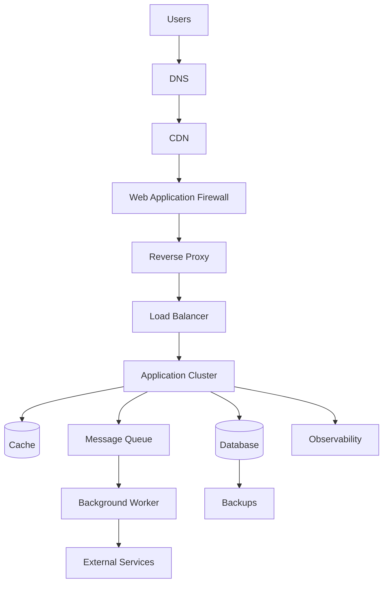
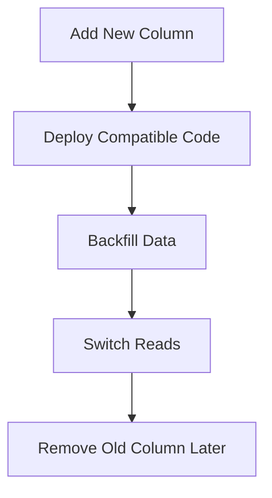

# Production Readiness Test  
## Performance, Reliability, Security, Observability, Deployment, Recovery, and Operations

This test evaluates whether a learner can reason about preparing a web application for real users, real traffic, real failures, and ongoing operations.

It reviews:

- Production architecture
- Configuration and environments
- Secrets
- Authentication and authorization
- Input validation
- API security
- Performance
- Caching
- Databases
- Timeouts and retries
- Circuit breakers
- Queues and workers
- Backups and recovery
- Observability
- Logs, metrics, and traces
- CI/CD
- Containers
- Reverse proxies
- Load balancers
- Deployment strategies
- Rollbacks
- Incident response
- Privacy and data protection
- Production troubleshooting

---

## Test Instructions

- Complete the test before reading the answer key.
- Explain the reasoning behind architecture decisions.
- For scenario questions, identify evidence, risks, mitigations, and follow-up actions.
- Assume production contains real users and sensitive data.
- Do not perform load tests, security tests, or destructive actions against systems without authorization.
- Some questions have multiple valid answers if tradeoffs are clearly explained.

---

## Learning Objectives

After completing this test, you should be able to:

- Explain what production readiness means.
- Identify required production components and dependencies.
- Separate development, staging, and production environments.
- Protect secrets and sensitive data.
- Design authentication and authorization controls.
- Identify performance bottlenecks.
- Explain caching and invalidation risks.
- Design timeouts, retries, and graceful degradation.
- Explain backups, RPO, and RTO.
- Use logs, metrics, and traces for diagnosis.
- Explain CI/CD and deployment artifacts.
- Compare rolling, blue-green, and canary deployments.
- Explain containers, reverse proxies, and load balancers.
- Plan rollback and incident response.
- Evaluate a production architecture.

---

# Part 1 — Multiple-Choice Questions

Choose the best answer.

## Question 1

What does production readiness mean?

- [ ] The application works once on a developer’s computer.
- [ ] The application is prepared to operate securely, reliably, observably, and maintainably for real users.
- [ ] The application contains the largest possible number of services.
- [ ] The application has no error messages under any circumstances.

---

## Question 2

Which is a production concern?

- [ ] Security
- [ ] Performance
- [ ] Recovery
- [ ] All of the above

---

## Question 3

Why should development, staging, and production environments be separated?

- [ ] To prevent test data, credentials, and configuration from affecting real users
- [ ] To eliminate the need for version control
- [ ] To make all environments identical in every way
- [ ] To prevent developers from testing code

---

## Question 4

Where should production secrets normally be stored?

- [ ] Public frontend code
- [ ] A protected secret-management system
- [ ] A public Git repository
- [ ] A URL query parameter

---

## Question 5

What should happen if a production secret is accidentally committed?

- [ ] Only delete it from the latest file.
- [ ] Rotate or revoke it and investigate exposure.
- [ ] Ignore it if the repository is private.
- [ ] Put it in a comment.

---

## Question 6

What is least privilege?

- [ ] Giving every service administrator access
- [ ] Giving each identity only the permissions it needs
- [ ] Removing all permissions
- [ ] Allowing anonymous database access

---

## Question 7

What is authentication?

- [ ] Verifying identity
- [ ] Checking database indexes
- [ ] Compressing responses
- [ ] Selecting a CDN edge

---

## Question 8

What is authorization?

- [ ] Determining what an identified caller may do
- [ ] Hashing a password
- [ ] Resolving a hostname
- [ ] Rendering a page

---

## Question 9

Which control must be enforced on the backend?

- [ ] Whether a user may delete another user
- [ ] Whether a menu is visually open
- [ ] Whether a tooltip is visible
- [ ] Whether a local animation runs

---

## Question 10

What does input validation protect?

- [ ] Data quality, correctness, and security
- [ ] Only visual styling
- [ ] Only DNS
- [ ] Only CPU scheduling

---

## Question 11

What is SQL injection?

- [ ] An attack in which input changes the meaning of a database query
- [ ] A database backup strategy
- [ ] A CSS vulnerability
- [ ] A DNS configuration

---

## Question 12

What is XSS?

- [ ] Cross-Site Scripting
- [ ] XML Server Storage
- [ ] External Session Security
- [ ] Extended Source Scanning

---

## Question 13

What is the safest general approach when displaying untrusted plain text?

- [ ] Insert it with `textContent` or safe templating
- [ ] Always assign it to `innerHTML`
- [ ] Put it into a script block
- [ ] Place it in a database query

---

## Question 14

What is CSRF?

- [ ] An unwanted authenticated request made through a victim’s browser
- [ ] A database indexing technique
- [ ] A CDN cache miss
- [ ] A TLS certificate type

---

## Question 15

What does rate limiting help prevent?

- [ ] Abuse, brute force, and excessive traffic
- [ ] All database failures
- [ ] All frontend bugs
- [ ] All stale cache problems

---

## Question 16

What is a performance budget?

- [ ] A defined limit for metrics such as bundle size, latency, or image weight
- [ ] A cloud billing password
- [ ] A database transaction
- [ ] A firewall rule

---

## Question 17

What does TTFB measure?

- [ ] Time to First Byte
- [ ] Total File Transfer Backup
- [ ] Transport Format and Browser
- [ ] Token Time for Backend

---

## Question 18

What may cause high TTFB?

- [ ] Slow backend logic or database queries
- [ ] Slow external services
- [ ] Server queueing
- [ ] All of the above

---

## Question 19

What does a cache do?

- [ ] Stores data for faster reuse
- [ ] Always becomes the authoritative source
- [ ] Replaces authorization
- [ ] Eliminates all database work permanently

---

## Question 20

What is cache invalidation?

- [ ] Removing or updating cached data when it is no longer correct
- [ ] Encrypting a response
- [ ] Creating an API route
- [ ] Starting a queue worker

---

## Question 21

What is a risk of incorrectly caching private responses?

- [ ] One user’s data may be shown to another user.
- [ ] The server will always become faster.
- [ ] The database will be automatically encrypted.
- [ ] DNS will stop working.

---

## Question 22

What does a database index generally improve?

- [ ] Lookup performance
- [ ] Password security automatically
- [ ] UI accessibility
- [ ] DNS resolution only

---

## Question 23

What is an N+1 query problem?

- [ ] One query for a collection followed by one query per item
- [ ] A database with one table
- [ ] A query with no parameters
- [ ] A failed DNS lookup

---

## Question 24

What is a connection pool?

- [ ] A reusable set of database or network connections
- [ ] A CDN cache
- [ ] A list of API users
- [ ] A collection of CSS classes

---

## Question 25

Why are timeouts important?

- [ ] They prevent indefinite waiting for dependencies.
- [ ] They eliminate all failures.
- [ ] They make all requests idempotent.
- [ ] They replace monitoring.

---

## Question 26

Why can unlimited retries be dangerous?

- [ ] They can amplify an outage and create a retry storm.
- [ ] They always improve availability.
- [ ] They prevent duplicate operations.
- [ ] They make databases unnecessary.

---

## Question 27

What does exponential backoff do?

- [ ] Increases the delay between retries
- [ ] Removes all timeouts
- [ ] Deletes failed jobs
- [ ] Makes every API call synchronous

---

## Question 28

What does a circuit breaker do?

- [ ] Stops repeatedly calling a failing dependency
- [ ] Encrypts a database
- [ ] Serves images from a CDN
- [ ] Builds frontend code

---

## Question 29

What is graceful degradation?

- [ ] Keeping essential functionality available when optional dependencies fail
- [ ] Hiding all errors
- [ ] Disabling all features
- [ ] Returning stack traces

---

## Question 30

What is a backup?

- [ ] A recoverable copy of data
- [ ] A cache entry only
- [ ] A temporary browser variable
- [ ] A DNS record

---

## Question 31

What does RPO describe?

- [ ] How much recent data loss may be acceptable
- [ ] How quickly a page renders
- [ ] How many requests a server receives
- [ ] How long a cookie lasts

---

## Question 32

What does RTO describe?

- [ ] How quickly service should be restored after failure
- [ ] How much data can be cached
- [ ] How many database rows exist
- [ ] How long DNS records remain cached

---

## Question 33

What are the three common pillars of observability?

- [ ] Logs, metrics, and traces
- [ ] HTML, CSS, and JavaScript
- [ ] DNS, IP, and TCP
- [ ] Users, passwords, and roles

---

## Question 34

What is a metric?

- [ ] A numerical measurement collected over time
- [ ] A source-code comment
- [ ] A database password
- [ ] A URL fragment

---

## Question 35

What is a trace?

- [ ] A record following one request across system components
- [ ] A static image
- [ ] A DNS record
- [ ] A shell alias

---

## Question 36

What is CI/CD used for?

- [ ] Automating build, test, scanning, and deployment workflows
- [ ] Replacing all databases
- [ ] Creating HTML only
- [ ] Storing browser cookies

---

## Question 37

What is a build artifact?

- [ ] A versioned output produced by a build
- [ ] A user session
- [ ] A database row
- [ ] A DNS query

---

## Question 38

What is a container image?

- [ ] A packaged template containing an application and its runtime dependencies
- [ ] A browser screenshot
- [ ] A database backup only
- [ ] A CDN record

---

## Question 39

What does a reverse proxy commonly do?

- [ ] Receives client traffic and forwards it to backend services
- [ ] Replaces the database
- [ ] Creates user passwords
- [ ] Runs only browser JavaScript

---

## Question 40

What does a load balancer commonly do?

- [ ] Distributes traffic among application instances
- [ ] Stores all source code permanently
- [ ] Replaces all health checks
- [ ] Prevents every possible failure

---

## Question 41

What is a rolling deployment?

- [ ] Updating application instances gradually
- [ ] Deploying only to a browser cache
- [ ] Deleting all old versions immediately
- [ ] Deploying only database indexes

---

## Question 42

What is a blue-green deployment?

- [ ] Maintaining two environments and switching traffic between them
- [ ] A CSS color theme
- [ ] A database replication method only
- [ ] A DNS record format

---

## Question 43

What is a canary deployment?

- [ ] Releasing a new version to a small percentage of traffic first
- [ ] Deploying only to administrators forever
- [ ] Removing all monitoring
- [ ] Running a database query

---

## Question 44

What is a rollback?

- [ ] Returning to a previous known-good version
- [ ] Deleting all backups
- [ ] Removing all logs
- [ ] Increasing request latency

---

## Question 45

What is incident response?

- [ ] Coordinated detection, mitigation, recovery, and learning after a problem
- [ ] A CSS layout process
- [ ] A method for creating database indexes
- [ ] A browser storage API

---

# Part 2 — True or False

## Question 46

Production readiness means an application has no possible failures.

- [ ] True
- [ ] False

## Question 47

Production secrets should be included in frontend bundles.

- [ ] True
- [ ] False

## Question 48

A secret committed to Git may remain in repository history even after deletion.

- [ ] True
- [ ] False

## Question 49

Authorization should be enforced only by the frontend.

- [ ] True
- [ ] False

## Question 50

A database backup should be restore-tested.

- [ ] True
- [ ] False

## Question 51

A cache can return stale data.

- [ ] True
- [ ] False

## Question 52

Every failed dependency should cause the entire application to fail.

- [ ] True
- [ ] False

## Question 53

Unbounded retries can increase load during an outage.

- [ ] True
- [ ] False

## Question 54

Circuit breakers can protect an application from repeatedly calling a failing service.

- [ ] True
- [ ] False

## Question 55

RPO describes acceptable recovery time.

- [ ] True
- [ ] False

## Question 56

RTO describes the target time to restore service.

- [ ] True
- [ ] False

## Question 57

Logs, metrics, and traces provide different types of observability information.

- [ ] True
- [ ] False

## Question 58

CI/CD can run tests before deployment.

- [ ] True
- [ ] False

## Question 59

A container image should normally contain production secrets.

- [ ] True
- [ ] False

## Question 60

A load balancer can route traffic only to healthy instances if health checks are configured correctly.

- [ ] True
- [ ] False

## Question 61

A rolling deployment may temporarily run old and new application versions together.

- [ ] True
- [ ] False

## Question 62

A rollback always reverses database migrations automatically.

- [ ] True
- [ ] False

## Question 63

A CDN automatically makes private user-specific responses safe to cache publicly.

- [ ] True
- [ ] False

## Question 64

An application can be available while an optional recommendation service is down.

- [ ] True
- [ ] False

## Question 65

Production monitoring should include error rates and latency.

- [ ] True
- [ ] False

---

# Part 3 — Short-Answer Questions

## Question 66

What does production readiness mean?

---

## Question 67

Why should development, staging, and production environments be separated?

---

## Question 68

What is a dependency inventory?

---

## Question 69

Why should secrets be stored outside source code?

---

## Question 70

What should happen if a production secret is exposed?

---

## Question 71

Explain least privilege.

---

## Question 72

What is the difference between authentication and authorization in production systems?

---

## Question 73

What is input validation?

---

## Question 74

Why should a database usually be placed behind a private network boundary?

---

## Question 75

What is a performance budget?

---

## Question 76

What is cache invalidation?

---

## Question 77

What is a timeout?

---

## Question 78

What is a retry policy?

---

## Question 79

What is a circuit breaker?

---

## Question 80

What is graceful degradation?

---

## Question 81

What is availability?

---

## Question 82

What is redundancy?

---

## Question 83

What is a backup?

---

## Question 84

Explain RPO and RTO.

---

## Question 85

What are logs, metrics, and traces?

---

## Question 86

What is a health check?

---

## Question 87

What is a readiness check?

---

## Question 88

What is CI/CD?

---

## Question 89

What is a deployment artifact?

---

## Question 90

What is a rollback plan?

---

# Part 4 — Production Architecture Analysis

## Question 91

Explain this production architecture:



---

## Question 92

Which components in the diagram should generally be public-facing?

Which should generally remain private?

---

## Question 93

Why might the application use both a cache and a database?

---

## Question 94

Why might the queue and worker be separate from the immediate API request?

---

## Question 95

What happens if the cache becomes unavailable?

---

## Question 96

What happens if the database becomes unavailable?

---

## Question 97

What happens if the email provider becomes unavailable?

---

## Question 98

What observability data should be collected for the order API?

---

## Question 99

Why should backups be stored separately from the production database?

---

## Question 100

What are the main single points of failure in this architecture?

---

# Part 5 — Scenario Questions

## Question 101 — Secret Exposure

A developer commits a payment-provider secret to a public repository, then deletes it in a later commit.

What should happen immediately?

---

## Question 102 — Authorization Failure

A production API allows users to access another user’s records by changing an ID in the URL.

What type of problem is this?

How should it be addressed?

---

## Question 103 — Slow Page

Users report that a page is slow.

Measurements show:

```text
Low DNS time
Low connection time
High TTFB
Small response body
```

What should be investigated?

---

## Question 104 — Large Frontend Bundle

The browser downloads 5 MB of JavaScript before becoming interactive.

What strategies could help?

---

## Question 105 — Database Bottleneck

The application scales from one server to five servers, but database latency increases.

Why might this happen?

---

## Question 106 — Cache Staleness

A product price changes in the database, but the old price remains in a CDN cache.

What controls could prevent or reduce this problem?

---

## Question 107 — Retry Storm

An external payment service is failing. Every application request retries ten times immediately.

What risks exist?

How should retries be redesigned?

---

## Question 108 — Circuit Breaker

The payment provider is unavailable for 20 minutes.

How could a circuit breaker protect the application?

---

## Question 109 — Queue Growth

A notification queue grows continuously.

What could cause this?

What metrics should you inspect?

---

## Question 110 — Backup Failure

Backups appear to run successfully, but no restore test has ever been performed.

What risk exists?

---

## Question 111 — Deployment Failure

A new deployment causes error rates to increase immediately.

What should the team do first?

---

## Question 112 — Rolling Deployment

During a rolling deployment, old application servers and new application servers run simultaneously.

What compatibility concerns should be considered?

---

## Question 113 — Database Migration

A migration removes a column that the previous application version still uses.

What could happen during deployment?

How could the migration be redesigned?

---

## Question 114 — Health Check

A server process is running, but it cannot connect to the database.

Should it necessarily receive user traffic?

Explain the difference between liveness and readiness.

---

## Question 115 — Dependency Failure

The recommendation service fails, but product data and checkout are healthy.

What should users experience?

---

## Question 116 — Incident Response

Users cannot log in after a configuration change.

Outline an incident-response workflow.

---

## Question 117 — Observability Gap

The API returns `500`, but there is no request ID, structured logging, or trace.

What problems does this create?

---

## Question 118 — Public Database

A database is reachable from the public Internet and uses a strong password.

Is the design sufficiently secure? Explain.

---

## Question 119 — Cost Spike

Cloud costs suddenly increase after a deployment.

What might cause this?

What evidence should be collected?

---

## Question 120 — Multi-Region Design

A company wants to deploy the application in three regions to reduce latency.

What additional complexity should it consider?

---

# Part 6 — Practical Production Exercises

## Exercise 1 — Production Readiness Review

Choose a small application and create a checklist for:

```text
Architecture
Security
Performance
Reliability
Observability
Deployment
Backups
Support
```

Mark each item:

```text
Complete
Incomplete
Unknown
Not applicable
```

---

## Exercise 2 — Dependency Inventory

For an online store, create a table:

| Dependency | Purpose | Critical? | Timeout | Failure behavior | Owner |
|---|---|---|---|---|---|
| Database | Store orders | Yes | 2 seconds | Return safe error | Backend team |
| Payment provider | Authorize payment | Yes | 5 seconds | Pending or retry | Payments team |
| Email provider | Send confirmation | No | 3 seconds | Queue retry | Platform team |

Add at least five dependencies.

---

## Exercise 3 — Failure Design

For each dependency, decide whether it is:

```text
Critical
Important but recoverable
Optional
```

Then describe what users should experience if it fails.

---

## Exercise 4 — Deployment Plan

Write a deployment plan containing:

```text
Build
Tests
Security scan
Artifact creation
Staging deployment
Smoke tests
Production deployment
Monitoring
Rollback
```

---

## Exercise 5 — Incident Timeline

Create a timeline for:

```text
12:00 — New deployment begins
12:05 — Error rate increases
12:07 — Alert fires
12:10 — Rollback begins
12:14 — Error rate returns to normal
```

Document:

```text
Impact
Detection
Mitigation
Recovery
Follow-up actions
```

---

# Answer Key

# Part 1 — Multiple-Choice Answers

| Question | Answer | Explanation |
|---:|---|---|
| 1 | The application is prepared to operate securely, reliably, observably, and maintainably for real users. | Production readiness goes beyond local functionality. |
| 2 | All of the above | Production requires security, performance, reliability, and more. |
| 3 | To prevent test data, credentials, and configuration from affecting real users | Environment separation reduces accidental impact. |
| 4 | A protected secret-management system | Secrets should not be exposed to clients or source control. |
| 5 | Rotate or revoke it and investigate exposure. | Removing it from the latest commit is insufficient. |
| 6 | Giving each identity only the permissions it needs | Least privilege limits damage. |
| 7 | Verifying identity | Authentication determines who the caller is. |
| 8 | Determining what an identified caller may do | Authorization checks permission. |
| 9 | Whether a user may delete another user | Important authorization must be backend-enforced. |
| 10 | Data quality, correctness, and security | Validation protects boundaries and storage. |
| 11 | An attack in which input changes the meaning of a database query | SQL injection targets query construction. |
| 12 | Cross-Site Scripting | XSS can execute attacker-controlled browser code. |
| 13 | Insert it with `textContent` or safe templating | Plain text should not be treated as HTML. |
| 14 | An unwanted authenticated request made through a victim’s browser | CSRF commonly targets cookie-authenticated actions. |
| 15 | Abuse, brute force, and excessive traffic | Rate limits protect capacity and sensitive endpoints. |
| 16 | A defined limit for metrics such as bundle size, latency, or image weight | Budgets make performance measurable. |
| 17 | Time to First Byte | TTFB measures delay until the first response byte. |
| 18 | All of the above | TTFB can reflect backend, database, dependency, or queueing delay. |
| 19 | Stores data for faster reuse | A cache reduces repeated work. |
| 20 | Removing or updating cached data when it is no longer correct | This is cache invalidation. |
| 21 | One user’s data may be shown to another user. | Incorrect shared caching can expose private data. |
| 22 | Lookup performance | Indexes accelerate some queries. |
| 23 | One query for a collection followed by one query per item | N+1 creates excessive database calls. |
| 24 | A reusable set of database or network connections | Pools reduce repeated connection setup. |
| 25 | They prevent indefinite waiting for dependencies. | Timeouts bound failure duration. |
| 26 | They can amplify an outage and create a retry storm. | Immediate unlimited retries increase pressure. |
| 27 | Increases the delay between retries | Backoff reduces pressure during temporary failure. |
| 28 | Stops repeatedly calling a failing dependency | Circuit breakers protect the main system. |
| 29 | Keeping essential functionality available when optional dependencies fail | This is graceful degradation. |
| 30 | A recoverable copy of data | Backups support restoration. |
| 31 | How much recent data loss may be acceptable | RPO is a data-loss objective. |
| 32 | How quickly service should be restored after failure | RTO is a recovery-time objective. |
| 33 | Logs, metrics, and traces | These are the common observability pillars. |
| 34 | A numerical measurement collected over time | Metrics support trends and alerts. |
| 35 | A record following one request across system components | Traces show distributed request flow. |
| 36 | Automating build, test, scanning, and deployment workflows | CI/CD supports repeatable delivery. |
| 37 | A versioned output produced by a build | Examples include bundles and container images. |
| 38 | A packaged template containing an application and its runtime dependencies | Images create containers. |
| 39 | Receives client traffic and forwards it to backend services | Reverse proxies provide controlled entry points. |
| 40 | Distributes traffic among application instances | Load balancers improve availability and scale. |
| 41 | Updating application instances gradually | Rolling deployment reduces all-at-once risk. |
| 42 | Maintaining two environments and switching traffic between them | Blue-green supports fast switching and rollback. |
| 43 | Releasing a new version to a small percentage of traffic first | Canary reduces initial exposure. |
| 44 | Returning to a previous known-good version | Rollback mitigates bad releases. |
| 45 | Coordinated detection, mitigation, recovery, and learning after a problem | Incident response manages operational failures. |

---

# Part 2 — True-or-False Answers

| Question | Answer | Explanation |
|---:|---|---|
| 46 | False | Production systems must handle and recover from failures. |
| 47 | False | Frontend bundles are visible to users. |
| 48 | True | Git history may preserve the old secret. |
| 49 | False | Authorization must be enforced by a trusted backend or service. |
| 50 | True | Backups are only useful if restoration works. |
| 51 | True | Cached data can become stale. |
| 52 | False | Optional dependencies should often fail gracefully. |
| 53 | True | Unlimited retries can intensify an outage. |
| 54 | True | Circuit breakers stop calls to failing dependencies. |
| 55 | False | RPO concerns data loss; RTO concerns recovery time. |
| 56 | True | RTO is the target time to restore service. |
| 57 | True | Logs, metrics, and traces provide different evidence. |
| 58 | True | CI/CD pipelines commonly run automated tests. |
| 59 | False | Secrets should be injected securely at runtime. |
| 60 | True | Health-aware load balancers can remove unhealthy instances. |
| 61 | True | Old and new versions may coexist temporarily. |
| 62 | False | Code rollback does not automatically reverse schema changes. |
| 63 | False | Private responses can be exposed through incorrect shared caching. |
| 64 | True | Core functionality can continue without optional recommendations. |
| 65 | True | Error rates and latency are essential operational metrics. |

---

# Part 3 — Short-Answer Model Answers

## Question 66

Production readiness means preparing an application to serve real users securely, reliably, efficiently, observably, and recoverably.

---

## Question 67

Separation prevents test data, credentials, configuration, and experimental changes from affecting real users or production systems.

---

## Question 68

A dependency inventory lists the systems an application relies on, including:

```text
Purpose
Owner
Authentication
Timeout
Retry policy
Failure behavior
Data exchanged
Cost
```

---

## Question 69

Secrets in source code may be committed, copied, logged, bundled, or exposed through repository history. A protected secret manager allows controlled access and rotation.

---

## Question 70

Immediately:

```text
Revoke or rotate the secret.
Investigate where it was exposed.
Inspect logs for misuse.
Replace it securely.
Remove active references.
Review the prevention process.
```

---

## Question 71

Least privilege means granting each user, service, or process only the permissions necessary for its task.

---

## Question 72

Authentication verifies the identity of a caller. Authorization determines whether that identity may perform a particular operation or access a particular resource.

---

## Question 73

Input validation checks external data for acceptable:

```text
Type
Format
Length
Range
Required fields
Allowed values
Business rules
```

---

## Question 74

A private database is less exposed to arbitrary Internet traffic. The backend can control authentication, authorization, validation, queries, and data exposure.

---

## Question 75

A performance budget defines acceptable limits for metrics such as:

```text
Bundle size
Image size
API latency
Database query duration
TTFB
Number of requests
```

---

## Question 76

Cache invalidation removes or updates cached data when the cached copy is no longer correct.

---

## Question 77

A timeout limits how long an application waits for an operation or dependency.

---

## Question 78

A retry policy defines:

```text
Which failures are retryable
Maximum retry count
Delay strategy
Backoff
Idempotency requirements
Final failure behavior
```

---

## Question 79

A circuit breaker stops repeatedly calling a failing dependency and allows the main application to fail faster or use a fallback.

---

## Question 80

Graceful degradation preserves essential functionality when optional components fail.

---

## Question 81

Availability describes whether users can access and use a service when needed.

---

## Question 82

Redundancy means having additional components available if one component fails.

---

## Question 83

A backup is a recoverable copy of data used after loss, corruption, accidental deletion, or another failure.

---

## Question 84

```text
RPO:
  How much recent data loss is acceptable.

RTO:
  How quickly service should be restored.
```

---

## Question 85

```text
Logs:
  Detailed event records.

Metrics:
  Numerical measurements over time.

Traces:
  Request paths across services and components.
```

---

## Question 86

A health check tests whether a process or service is operating.

---

## Question 87

A readiness check tests whether a service is prepared to receive traffic, including whether required dependencies are available.

---

## Question 88

CI/CD automates processes such as building, testing, scanning, packaging, and deploying software.

---

## Question 89

A deployment artifact is a versioned build output, such as a JavaScript bundle, container image, compiled binary, or deployment package.

---

## Question 90

A rollback plan explains how to return traffic or code to a previous known-good version and how to verify recovery.

---

# Part 4 — Production Architecture Answers

## Question 91


```text
DNS:
  Maps the domain to infrastructure.

CDN:
  Delivers cacheable content closer to users.

WAF:
  Applies request filtering and security rules.

Reverse proxy:
  Terminates TLS, routes requests, and may serve static assets.

Load balancer:
  Distributes traffic across healthy application instances.

Application cluster:
  Runs backend logic.

Cache:
  Stores reusable copies for faster access.

Database:
  Stores authoritative application data.

Queue:
  Holds asynchronous work.

Worker:
  Processes queued jobs.

External services:
  Provide capabilities such as email or payments.

Observability:
  Collects logs, metrics, and traces.

Backups:
  Support data recovery.
```

---

## Question 92

Likely public-facing components:

```text
DNS
CDN
WAF
Reverse proxy
Load balancer
```

Likely private components:

```text
Application servers
Database
Cache
Queue
Workers
Internal services
Backup storage
```

Some architectures expose application services directly, but public exposure should be deliberate and protected.

---

## Question 93

The database stores authoritative data. The cache stores frequently used copies to reduce latency and database workload.

---

## Question 94

Queues and workers allow long-running or optional work to be processed asynchronously without keeping the user’s request waiting.

---

## Question 95

Possible behaviors:

```text
Application falls back to the database.
Responses become slower.
Some noncritical features fail.
The application returns a safe temporary error.
```

The system should not assume the cache is always available.

---

## Question 96

The queue stores work after the API accepts the main request. The worker processes the job separately, which allows retries, scaling, and delayed processing.

---

## Question 97

If email is noncritical, the order may succeed while the email job remains queued or retries later. The system should monitor failed jobs and avoid silently losing notifications.

---

## Question 98

A CDN can reduce latency and origin workload for cacheable assets. Risks include stale content, incorrect invalidation, and accidental caching of private data.

---

## Question 99

All application servers may still depend on the same database. More application servers can increase database connections, query volume, locking, and contention.

---

## Question 100

The architecture has potential single points of failure including:

```text
Database
Load balancer
DNS provider
Cache, depending on fallback behavior
Queue
External services
Single region
Observability system
```

Whether each is truly a single point depends on redundancy and failover design.

---

# Part 5 — Scenario Model Answers

## Question 101 — Secret Exposure

Immediately:

```text
Revoke or rotate the payment secret.
Inspect repository history and logs.
Check for misuse.
Replace it through protected configuration.
Review access and improve secret scanning.
```

Deleting it in a later commit does not erase historical exposure.

---

## Question 102 — Authorization Failure

This is an access-control or authorization vulnerability, potentially an insecure direct object reference.

Fix it by checking:

```text
Authenticated identity
Resource ownership
Organization or tenant membership
Role and permission
```

Test access to both owned and non-owned records.

---

## Question 103 — Slow Page

High TTFB with low network setup times suggests:

```text
Slow backend processing
Database query
Cache miss
External service
Server queue
Cold start
```

Inspect server timing, database queries, traces, and dependency latency.

---

## Question 104 — Large Frontend Bundle

Possible strategies:

```text
Code splitting
Route-based bundles
Lazy loading
Tree shaking
Removing unused dependencies
Replacing heavy libraries
Deferring noncritical scripts
Server rendering or static generation
```

Measure before and after.

---

## Question 105 — Database Bottleneck

Five application servers may create more concurrent database connections and queries. The database may be the shared bottleneck.

Investigate:

```text
Connection pool size
Query latency
Indexes
N+1 queries
Locks
CPU
Memory
Database capacity
```

---

## Question 106 — Cache Staleness

Strategies include:

```text
Explicit invalidation after price changes
Shorter TTL
Versioned cache keys
Revalidation
Do not cache checkout prices
Always verify current price on the backend
```

The database should remain authoritative during checkout.

---

## Question 107 — Retry Storm

Risks:

```text
More load on the failing provider
Cascading failure
Higher costs
Duplicate operations
Thread or connection exhaustion
```

Redesign with:

```text
Bounded retries
Exponential backoff
Jitter
Retryable-error classification
Idempotency keys
Circuit breaker
Dead-letter handling
```

---

## Question 108 — Circuit Breaker

After enough failures, the circuit opens and stops sending requests to the payment provider. The application can fail quickly, show a pending state, or use a controlled fallback. After a wait period, limited test requests determine whether the provider recovered.

---

## Question 109 — Queue Growth

Possible causes:

```text
Workers too slow
Too few workers
External service failure
Repeated retries
Incoming work exceeds capacity
Poison jobs
```

Inspect:

```text
Queue depth
Oldest job age
Processing rate
Failure rate
Retry count
Worker health
External service latency
```

---

## Question 110 — Backup Failure

The organization may believe data is recoverable when it is not. Backups may be incomplete, corrupted, inaccessible, or impossible to restore within the target RTO.

Perform regular restore tests.

---

## Question 111 — Deployment Failure

First:

```text
Confirm the error increase.
Assess user impact.
Pause the rollout.
Rollback or disable the feature if safe.
Monitor recovery.
Preserve logs and deployment evidence.
```

Investigate the root cause after service is stabilized.

---

## Question 112 — Rolling Deployment

Consider:

```text
API response compatibility
Database schema compatibility
Session and token behavior
Queue-message compatibility
Configuration compatibility
Feature flags
Migration sequencing
```

Old and new versions must coexist safely during the rollout.

---

## Question 113 — Database Migration

Old application instances may fail because they still query the removed column.

Safer migration:



---

## Question 114 — Health Check

A process may be alive but unable to serve useful traffic.

```text
Liveness:
  Is the process running?

Readiness:
  Is it prepared to serve requests and access required dependencies?
```

A server that cannot reach the database may be removed from traffic by readiness checks.

---

## Question 115 — Dependency Failure

Users should generally continue to see product data and use checkout if recommendations are optional. The interface may show an empty recommendation section or a default fallback.

---

## Question 116 — Incident Response

A reasonable workflow:

```text
1. Confirm the login failure.
2. Assess affected users.
3. Check the configuration change.
4. Pause or roll back the change.
5. Monitor authentication recovery.
6. Communicate status.
7. Inspect logs and traces.
8. Identify the root cause.
9. Add tests or configuration validation.
10. Document the incident.
```

---

## Question 117 — Observability Gap

Without request IDs, structured logs, or traces:

```text
Requests are difficult to correlate.
The root cause is harder to locate.
Distributed failures become opaque.
Support cannot provide precise evidence.
Recovery takes longer.
```

---

## Question 118 — Public Database

A strong password alone is insufficient.

Risks include:

```text
Brute-force attacks
Software vulnerabilities
Misconfiguration
Denial of service
Credential theft
Unauthorized queries
```

Use private networking, firewall restrictions, least-privilege accounts, encrypted connections, monitoring, and backups.

---

## Question 119 — Cost Spike

Possible causes:

```text
Autoscaling runaway
Infinite retries
Large log volume
Unexpected traffic
Unbounded storage
CDN or bandwidth increase
Load-test traffic
Expensive database operations
Resource leak
```

Collect:

```text
Billing breakdown
Deployment timeline
Traffic metrics
Request volume
Retry counts
Log volume
Resource utilization
Storage growth
```

---

## Question 120 — Multi-Region Design

Additional complexity includes:

```text
Data replication
Conflict resolution
Cross-region latency
Consistency
Failover
Routing
Deployment coordination
Secrets and configuration
Observability across regions
Data residency
Cost
```

Multi-region deployment should be justified by latency, availability, or regulatory requirements.

---

# Part 6 — Practical Exercise Guidance

## Exercise 1

Classify each item:

```text
Complete:
  Verified and working.

Incomplete:
  Known work remains.

Unknown:
  Not yet tested or documented.

Not applicable:
  Does not apply to this application.
```

Prioritize unknowns involving:

```text
Security
Backups
Authorization
Rollback
Monitoring
```

---

## Exercise 2

Include at least:

```text
Database
Payment provider
Email provider
Object storage
Authentication provider
Search system
Monitoring system
Queue
```

Record:

```text
Purpose
Criticality
Timeout
Retry behavior
Failure handling
Owner
```

---

## Exercise 3

A reasonable classification:

```text
Payment:
  Critical

Database:
  Critical

Email:
  Important but recoverable

Recommendations:
  Optional

Search:
  Important or optional depending on the product

Cache:
  Important but recoverable if database fallback exists
```

---

## Exercise 4

A strong deployment plan includes:

```text
Build
Unit and integration tests
Security scanning
Artifact creation
Staging deployment
Smoke tests
Production rollout
Health verification
Monitoring
Rollback
```

---

## Exercise 5

Document:

```text
Impact:
  Users experienced elevated errors.

Detection:
  Monitoring alert at 12:07.

Mitigation:
  Paused rollout and rolled back.

Recovery:
  Error rate normalized at 12:14.

Follow-up:
  Investigate root cause, add regression tests, improve deployment checks.
```

---

# Scoring Guidance

## Multiple choice and true/false

```text
1 point per correct answer
```

## Short-answer questions

```text
2 points:
  Correct core concept.

3 points:
  Correct explanation plus example.

4 points:
  Correct explanation, operational implication, and recovery or security consideration.
```

## Production architecture questions

Evaluate:

```text
Security boundaries
Failure handling
Observability
Scaling
Data ownership
Backups
Deployment safety
Operational complexity
```

## Scenario questions

Evaluate whether the learner:

```text
Prioritizes user safety and service restoration
Collects evidence
Identifies the failing layer
Avoids exposing sensitive data
Proposes bounded retries and safe fallbacks
Understands rollback limitations
```

---

# Review Recommendations

If you struggled with:

```text
Security:
  Primer 8
  Appendix I

Performance:
  Appendix J

Troubleshooting:
  Appendix K

Linux and servers:
  Primer 11

Cloud and deployment:
  Primer 12

HTTP and API behavior:
  Part 3
  Part 4
  Appendix G
  Appendix H
```

---

# Completion Criteria

You are ready to continue when you can:

```text
Define production readiness.
Separate environments.
Protect and rotate secrets.
Enforce authentication and authorization.
Validate input.
Measure browser, API, and database performance.
Use caching safely.
Configure timeouts and retries.
Use circuit breakers and graceful degradation.
Plan backups and recovery.
Explain RPO and RTO.
Use logs, metrics, and traces.
Design CI/CD workflows.
Explain containers and deployment artifacts.
Use load balancers and health checks.
Plan rolling, blue-green, and canary deployments.
Design rollback procedures.
Respond to incidents.
Evaluate production architecture tradeoffs.
```
