# Student Notes — Part 0  
## Introduction to Web Mechanics, Architecture, and Network Fundamentals

---

## 1. Purpose of This Series

This series explains how modern web applications work before focusing on a specific programming language or framework.

The goal is to understand:

```text
Where code runs
How systems communicate
How data moves
Who owns important decisions
What can be trusted
What can fail
How failures are diagnosed
How applications become secure, fast, and reliable
```

The Web is not magic. It is a collection of systems communicating through agreed protocols and boundaries.

---

# 2. The Core Mental Model

A web application is usually a distributed system.

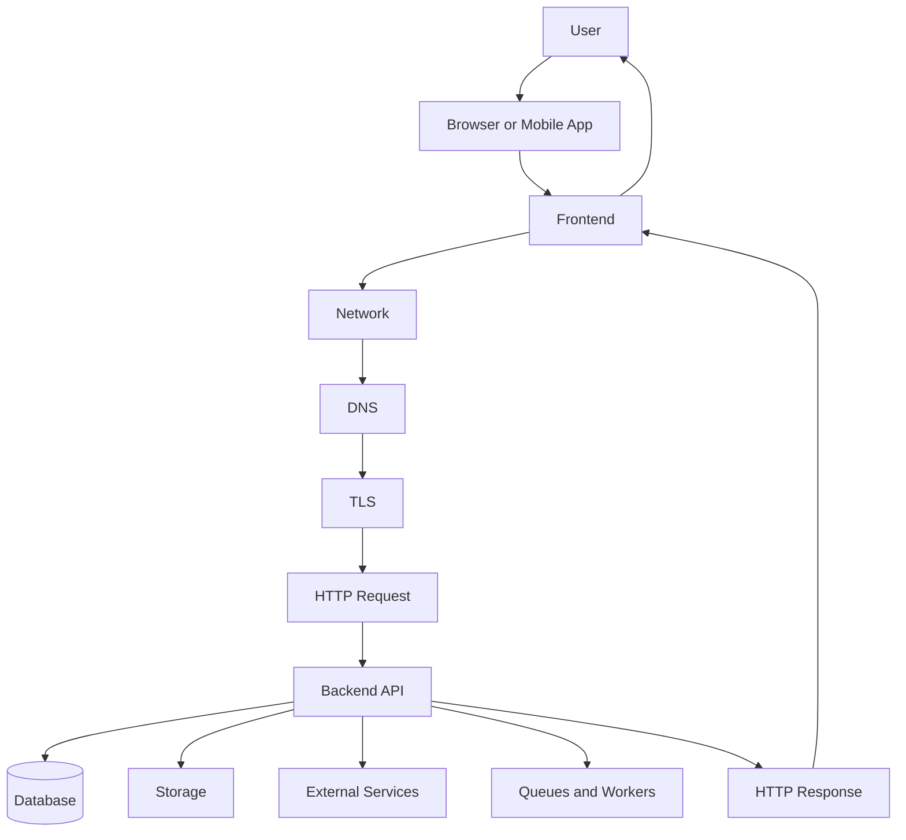

A user may see one interface, but many systems may participate:

```text
Browser
Frontend
DNS
Routers
CDN
Reverse proxy
Load balancer
Backend
Database
Cache
File storage
Payment service
Email service
Monitoring
```

---

# 3. The Complete Request Journey

When a user clicks a button or opens a page, a simplified sequence is:

```text
1. User performs an action.
2. Browser runs frontend code.
3. Frontend creates a request.
4. DNS helps locate the destination.
5. Network infrastructure carries the request.
6. TLS protects an HTTPS connection.
7. HTTP describes the request.
8. Backend receives and processes it.
9. Backend may access a database or external service.
10. Backend returns an HTTP response.
11. Browser interprets the response.
12. Frontend updates the interface.
13. Logs, metrics, and traces record what happened.
```

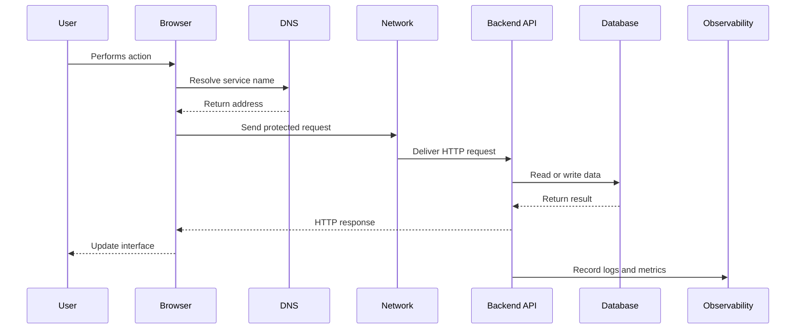

---

# 4. The Main Layers

A useful web-development model is:

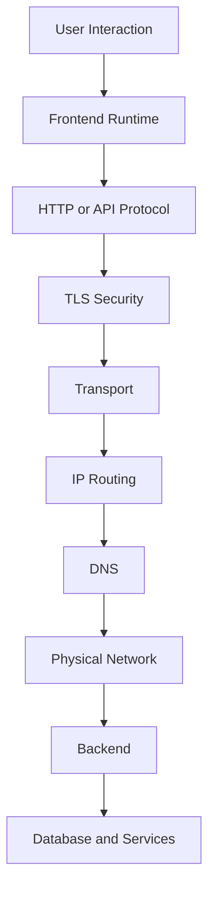

Each layer answers a different question.

| Layer | Main question |
|---|---|
| User interface | What is the user trying to do? |
| Frontend | How does the client represent and respond to the action? |
| HTTP/API | How is the message structured? |
| TLS | How is communication protected? |
| Transport | How are application messages delivered? |
| IP | Where should packets go? |
| DNS | What network destination belongs to this name? |
| Physical network | How do signals travel? |
| Backend | What should the application do? |
| Database/services | Where does required data or capability come from? |

---

# 5. Frontend and Backend

## Frontend

The frontend runs close to the user, commonly in a browser.

It commonly handles:

```text
Rendering
User interaction
Temporary interface state
Form behavior
Loading indicators
Error display
Client-side validation
Sending requests
Displaying responses
```

## Backend

The backend runs in a controlled server environment.

It commonly handles:

```text
Authentication
Authorization
Business logic
Input validation
Database access
File processing
Payment integration
Email integration
Background jobs
API responses
```

The simplified relationship is:

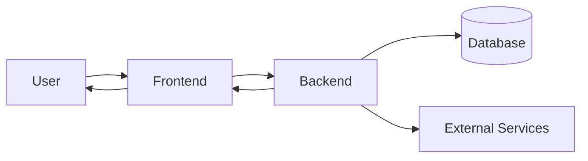

---

# 6. The Browser Is Untrusted

The browser is controlled by the user.

A user may:

```text
Inspect JavaScript
Modify HTML
Change form values
Edit local storage
Replay requests
Send requests with cURL
Call APIs directly
Bypass client-side validation
```

Therefore:

```text
Frontend validation improves usability.
Backend validation enforces correctness and security.
```

Never rely only on the frontend to enforce:

```text
Permissions
Prices
Inventory
Account ownership
Payment status
Administrative roles
```

---

# 7. Authentication and Authorization

These concepts are related but different.

## Authentication

Authentication asks:

```text
Who is this caller?
```

Examples:

```text
Password
Session cookie
Bearer token
Passkey
MFA
OAuth
```

## Authorization

Authorization asks:

```text
What is this caller allowed to do?
```

Examples:

```text
Can this user view order 9001?
Can this user delete another account?
Can this user access administration tools?
```

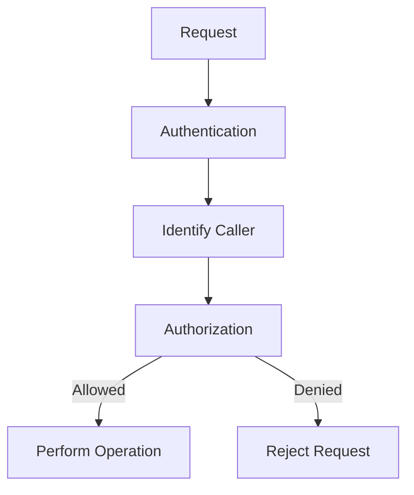

Remember:

```text
Authentication = Identity
Authorization = Permission
```

---

# 8. Sources of Truth

A source of truth is the system considered authoritative for a value.

| Information | Likely source of truth |
|---|---|
| Open menu | Browser |
| Selected tab | Browser |
| Current search text | Browser |
| Product price | Backend/database |
| Inventory | Backend/database |
| Order status | Backend/database |
| Payment status | Payment provider/backend |
| Session validity | Session system |
| Product image bytes | Object storage |
| Email delivery status | Queue/worker system |

The browser may display a value without being authoritative for it.

Example:

```text
Browser displays:
  Price = $79.99

Backend determines:
  Current price = $69.99
```

During checkout, the backend’s value should control.

---

# 9. Internet vs Web

## Internet

The Internet is the global infrastructure connecting networks and devices.

It includes:

```text
Routers
Cables
Wireless networks
ISPs
IP addresses
Data centers
Network providers
```

## Web

The Web is an application system built on the Internet.

It includes:

```text
Browsers
Web servers
URLs
HTTP
HTTPS
HTML
CSS
JavaScript
Web APIs
```

A useful analogy:

```text
Internet = Roads and highways
Web = One type of service using those roads
```

Other Internet applications include:

```text
Email
Online games
Video calls
File transfer
Remote administration
```

---

# 10. HTTP and HTTPS

## HTTP

HTTP defines how clients and servers exchange web messages.

A request includes:

```text
Method
Path
Headers
Optional body
```

A response includes:

```text
Status code
Headers
Optional body
```

## HTTPS

HTTPS is HTTP protected by TLS.

It provides:

```text
Confidentiality
Integrity
Server authentication
```

HTTPS does not automatically fix:

```text
Broken authorization
Weak passwords
SQL injection
XSS
Incorrect business logic
Exposed secrets
```

---

# 11. APIs

An API is an interface through which software systems communicate.

A typical API boundary is:

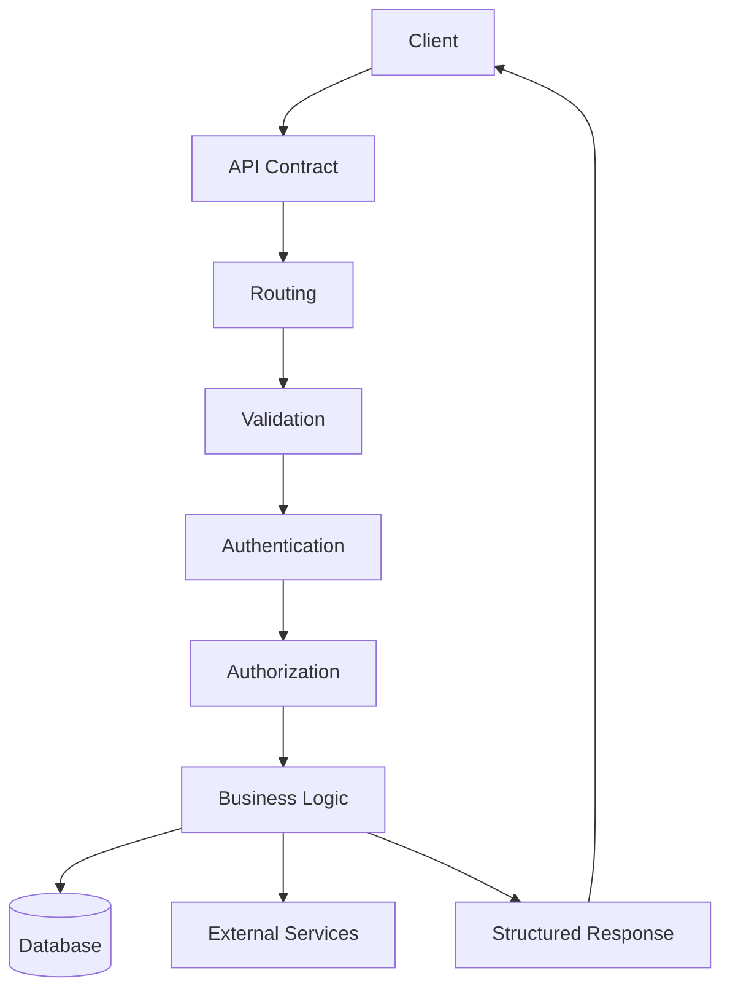

An API contract may define:

```text
Endpoint paths
HTTP methods
Parameters
Headers
Authentication
Request bodies
Response bodies
Status codes
Errors
Pagination
Versioning
```

---

# 12. Common API Styles

## REST

Resource-oriented.

```text
GET /products
GET /products/123
POST /orders
PATCH /users/42
```

## GraphQL

Client-selected data graph.

```graphql
query {
  product(id: "123") {
    name
    price
  }
}
```

## RPC

Action-oriented remote procedures.

```text
createOrder()
calculateShipping()
approveInvoice()
```

| Style | Main abstraction |
|---|---|
| REST | Resources |
| GraphQL | Typed data graph |
| RPC | Procedures or actions |

---

# 13. Performance

Performance is not one number.

It includes:

```text
DNS time
Connection time
TLS time
Server processing
Database time
Response size
JavaScript execution
Rendering
Interaction responsiveness
```

A useful performance chain:

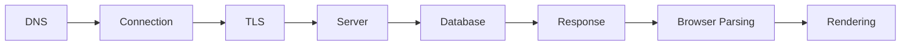

Performance strategies include:

```text
Caching
CDNs
Compression
Pagination
Database indexes
Code splitting
Lazy loading
Image optimization
Asynchronous work
```

---

# 14. Reliability

Reliable systems expect components to fail.

Useful mechanisms include:

```text
Timeouts
Retries
Exponential backoff
Circuit breakers
Queues
Workers
Health checks
Redundancy
Backups
Graceful degradation
```

Example:

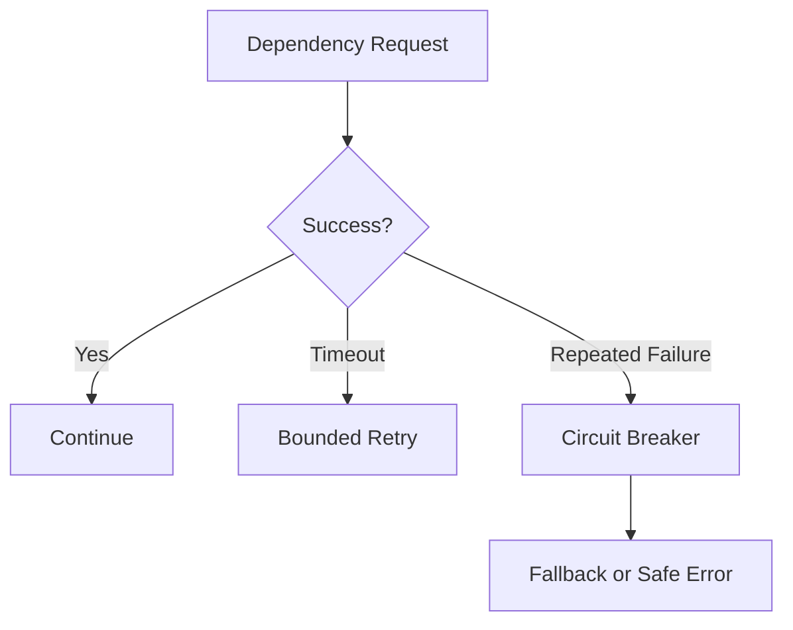

Important principle:

> Do not retry dangerous operations blindly.

Payments, orders, and reservations may require idempotency keys.

---

# 15. Observability

Observability helps explain what a running system is doing.

## Logs

Detailed event records.

```text
Order created
Login failed
Database query failed
```

## Metrics

Numerical measurements.

```text
Error rate
Latency
CPU
Memory
Queue depth
Cache hit rate
```

## Traces

Follow one request across services.

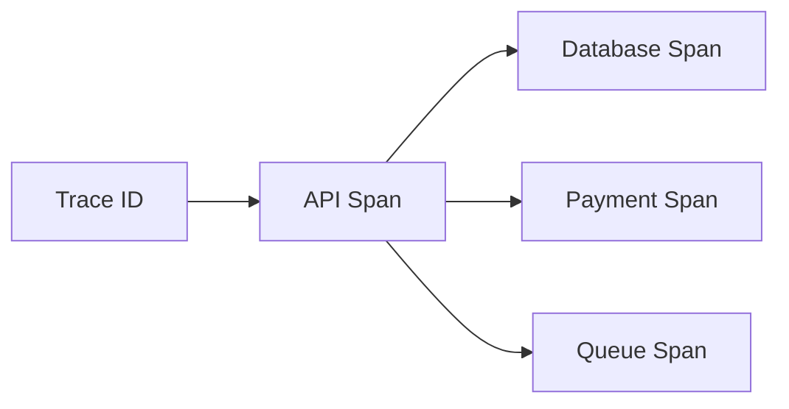

Useful diagnostics should connect:

```text
Browser request
Request ID
API logs
Database logs
External-service calls
```

---

# 16. Deployment and Recovery

A production system needs a repeatable deployment process.

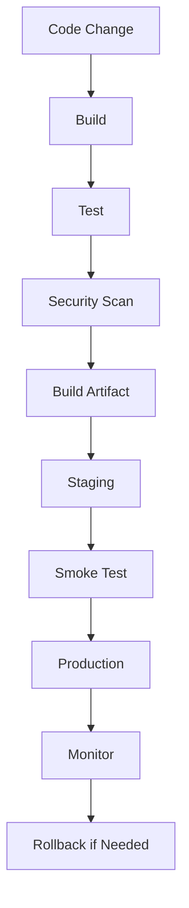

Also define:

```text
Backups
Restore testing
RPO
RTO
Health checks
Readiness checks
Incident response
```

A backup is not proven until it has been restored successfully.

---

# 17. The Complete Mental Model

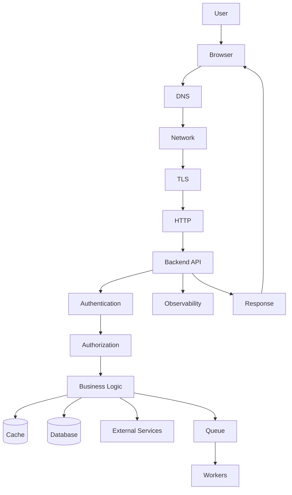

The user sees one application, but the application is a coordinated system of:

```text
Clients
Networks
Protocols
Services
Data stores
Caches
Workers
External providers
Operational systems
```

---

# 18. Common Confusions

## Internet vs Web

```text
Internet = Infrastructure
Web = Application system using that infrastructure
```

## Frontend vs Backend

```text
Frontend = User experience and client execution
Backend = Authority, business logic, data, and security
```

## Authentication vs Authorization

```text
Authentication = Who are you?
Authorization = What may you do?
```

## Database vs API

```text
Database = Stores and retrieves data
API = Controlled interface for software communication
```

## Latency vs Bandwidth

```text
Latency = Delay
Bandwidth = Transfer capacity
```

## `401` vs `403`

```text
401 = Authentication problem
403 = Authorization problem
```

## `404` vs DNS failure

```text
404 = HTTP response from a reachable server
DNS failure = Destination could not be resolved
```

## Cache vs Source of truth

```text
Cache = Reusable copy
Source of truth = Authoritative value
```

---

# 19. Recall Questions

Answer these without looking back.

1. Why is the browser untrusted?
2. Which system should calculate the final order price?
3. What does DNS do?
4. What happens after DNS returns an IP address?
5. What does HTTPS protect?
6. What is the difference between `401` and `403`?
7. Why are APIs useful?
8. What is the difference between REST and GraphQL?
9. Why should large collections be paginated?
10. Why can retries duplicate payments?
11. What is the purpose of a queue?
12. What does a CDN improve?
13. What does TTFB help diagnose?
14. What are logs, metrics, and traces?
15. What is the difference between RPO and RTO?

---

# 20. Personal Notes

## My own explanation of the series

```text
____________________________________________________________
____________________________________________________________
____________________________________________________________
____________________________________________________________
```

## The concept I understand best

```text
____________________________________________________________
```

Why?

```text
____________________________________________________________
```

## The concept I find most difficult

```text
____________________________________________________________
```

What would help me understand it?

```text
____________________________________________________________
```

## My own example of a web request

```text
____________________________________________________________
____________________________________________________________
```

## A connection between two topics

```text
Topic 1:
____________________________________________________________

Topic 2:
____________________________________________________________

Connection:
____________________________________________________________
```

## Questions I still have

```text
1. ________________________________________________________
2. ________________________________________________________
3. ________________________________________________________
```

---

# 21. Review Checklist

```text
[ ] I can describe a web application as a distributed system.
[ ] I can distinguish frontend and backend responsibilities.
[ ] I know why the browser is untrusted.
[ ] I can identify sources of truth.
[ ] I understand the Internet and Web distinction.
[ ] I can describe DNS resolution.
[ ] I can explain IP addresses and ports.
[ ] I understand HTTP requests and responses.
[ ] I understand HTTPS and TLS at a high level.
[ ] I can explain API contracts.
[ ] I can compare REST, GraphQL, and RPC.
[ ] I can interpret common status codes.
[ ] I understand authentication and authorization.
[ ] I can identify performance layers.
[ ] I can explain caching.
[ ] I can explain queues and workers.
[ ] I can identify reliability mechanisms.
[ ] I understand logs, metrics, and traces.
[ ] I can describe deployment and rollback.
[ ] I can narrate a complete request journey.
```

---

# 22. One-Page Summary

```text
A web application is a distributed system.

The browser is the client.
The backend is the trusted application boundary.
The database stores authoritative data.
The API defines communication.
DNS helps locate services.
IP and routing move packets.
TLS protects HTTPS communication.
HTTP structures requests and responses.
Status codes communicate outcomes.
Cookies and tokens support identity.
Authorization controls permissions.
Caches improve speed but may become stale.
Queues handle asynchronous work.
CDNs move cacheable content closer to users.
Load balancers distribute traffic.
Logs, metrics, and traces provide observability.
Backups and recovery protect production data.

The core debugging sequence is:

User action
→ frontend
→ request
→ DNS
→ network
→ TLS
→ HTTP
→ backend
→ database/services
→ response
→ frontend rendering
```

The core design question is:

> Where should each responsibility live, who should be trusted to make each decision, and what should happen when a component fails?

---

# Completion Standard

These notes are complete when you can explain the series without rereading the full tutorials.

You should be able to:

```text
Define the core vocabulary.
Draw the major request path.
Explain system responsibilities.
Identify trust boundaries.
Design a basic API.
Interpret common failures.
Describe performance strategies.
Describe security controls.
Describe production operations.
```

These student notes support the complete learning sequence:

```text
Learn the concepts
  ↓
Review the notes
  ↓
Complete the workbooks
  ↓
Take the quizzes
  ↓
Solve the scenarios
  ↓
Complete the capstone
```
