# Student Notes — Part 1  
## Frontend, Backend, and Full-Stack Architecture

---

# 1. Core Idea

A web application is not one single program.

It is usually a collection of systems with different responsibilities:

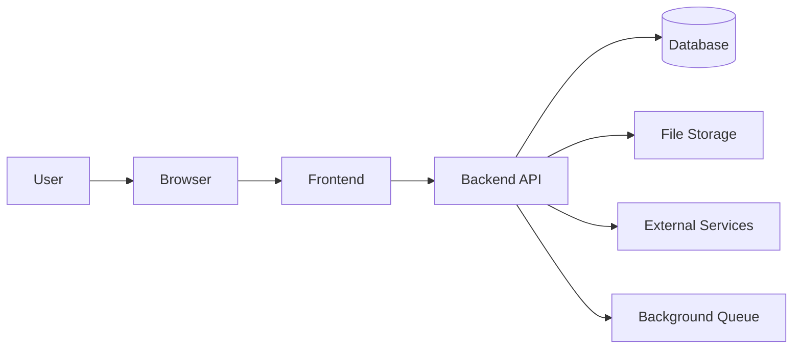

The most important architectural boundary is:

```text
Frontend / client side  ↔  Backend / server side
```

The frontend creates the user experience.

The backend enforces authority and coordinates protected operations.

---

# 2. Frontend

The frontend is software that runs near the user.

For web applications, it commonly runs in a browser.

## Frontend responsibilities

```text
Render interfaces
Handle clicks and input
Manage temporary UI state
Display loading states
Display error states
Perform basic validation
Send requests
Interpret responses
Update the interface
```

Common frontend technologies:

```text
HTML
CSS
JavaScript
TypeScript
Frontend frameworks
```

---

# 3. HTML, CSS, and JavaScript

## HTML

HTML provides structure and meaning.

```html
<h1>Product Catalog</h1>
<button>Add to cart</button>
```

## CSS

CSS provides presentation and layout.

```css
button {
  background: blue;
  color: white;
}
```

## JavaScript

JavaScript provides behavior.

```javascript
button.addEventListener("click", addToCart);
```

Summary:

```text
HTML       = Structure
CSS        = Presentation
JavaScript = Behavior
```

---

# 4. The Browser as a Runtime

The browser:

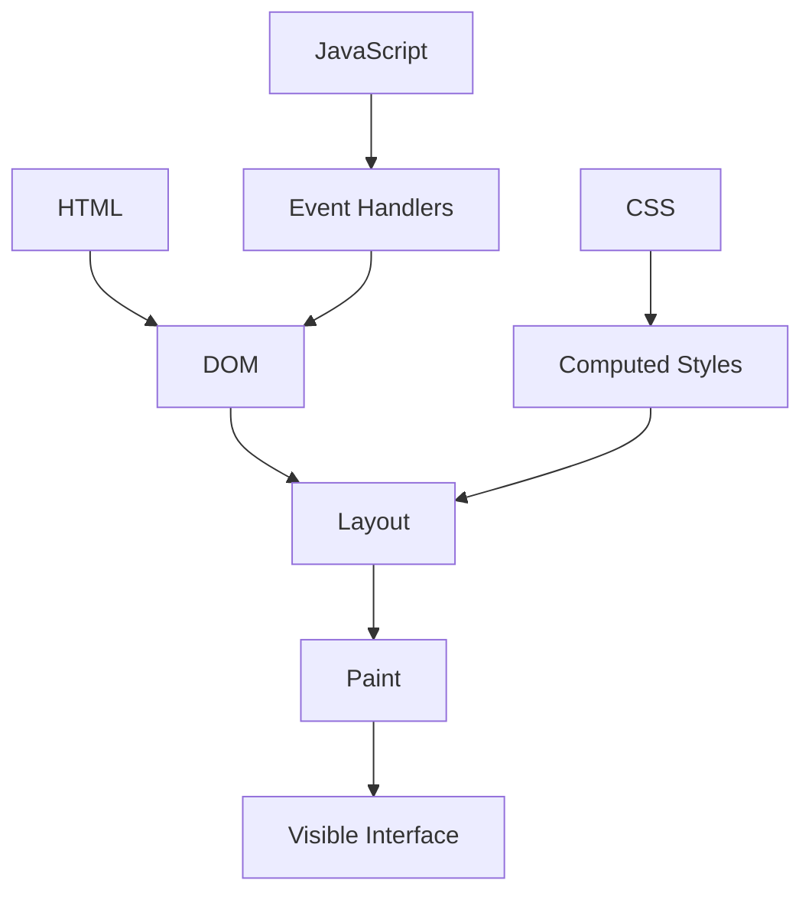

It can:

```text
Download resources
Parse HTML
Build the DOM
Apply CSS
Execute JavaScript
Send HTTP requests
Store browser data
Render pixels
Respond to user events
```

The browser is powerful, but it is controlled by the user.

---

# 5. The Backend

The backend runs in a controlled server environment.

## Backend responsibilities

```text
Route requests
Validate input
Authenticate users
Authorize operations
Apply business rules
Access databases
Manage files
Call private external services
Process payments
Create background jobs
Return API responses
Log important events
```

A typical backend flow:

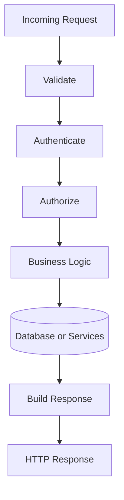

---

# 6. The Browser Is Untrusted

Users can potentially:

```text
Inspect frontend code
Modify HTML
Change form values
Edit browser storage
Replay requests
Send custom requests
Bypass client-side validation
```

Therefore:

```text
Frontend checks improve usability.
Backend checks enforce security.
```

The server must independently validate:

```text
Price
Quantity
Inventory
Role
Ownership
Payment status
Account permissions
```

---

# 7. Client-Side vs Server-Side Validation

## Client-side validation

Useful for:

```text
Fast feedback
Form usability
Reducing unnecessary requests
Showing obvious mistakes
```

Example:

```text
“Quantity must be greater than zero.”
```

## Server-side validation

Required for:

```text
Security
Correctness
Data integrity
Business rules
Authorization
```

A malicious client can send:

```json
{
  "quantity": -10
}
```

The server must reject it regardless of what the frontend normally permits.

---

# 8. Authentication and Authorization

## Authentication

Answers:

```text
Who is this caller?
```

Examples:

```text
Password
Session cookie
Bearer token
Passkey
MFA
OAuth
```

## Authorization

Answers:

```text
What may this caller do?
```

Examples:

```text
Can this user view order 9001?
Can this user edit the product?
Can this user access administrator reports?
```

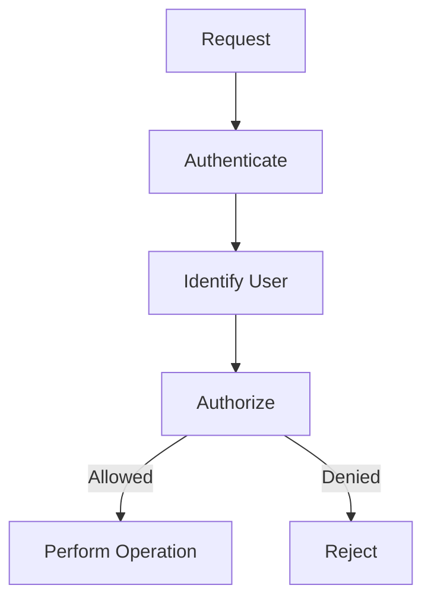

---

# 9. Business Logic

Business logic defines the rules of the application.

Examples:

```text
A customer cannot purchase more than available inventory.
An order cannot be cancelled after shipment.
A discount applies only to eligible users.
A user may edit only their own profile.
A payment must be confirmed before fulfillment.
```

Important business rules should be enforced by the backend.

---

# 10. The Database Boundary

A database stores and retrieves data.

The backend controls how clients access that data.

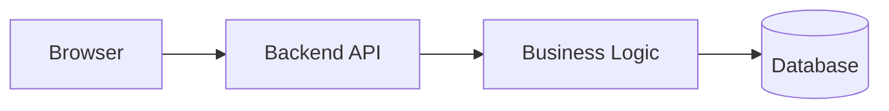

The database may store:

```text
Users
Products
Orders
Inventory
Payments
Messages
Sessions
```

The backend should prevent clients from:

```text
Reading private records
Changing unauthorized data
Bypassing business rules
Running arbitrary queries
Accessing database credentials
```

---

# 11. Database vs Backend

```text
Database:
  Stores and retrieves information.

Backend:
  Validates requests, applies rules, checks permissions, and coordinates operations.
```

A database may answer:

```text
What is the current product price?
```

The backend decides:

```text
Is this user allowed to purchase the product?
Should this discount apply?
Is the requested quantity valid?
```

---

# 12. External Services

Backends often communicate with external providers:

```text
Payment
Email
SMS
Maps
Search
Object storage
Social login
Tax
Shipping
Analytics
```

The backend should generally communicate with private providers because it can protect credentials and apply business rules.

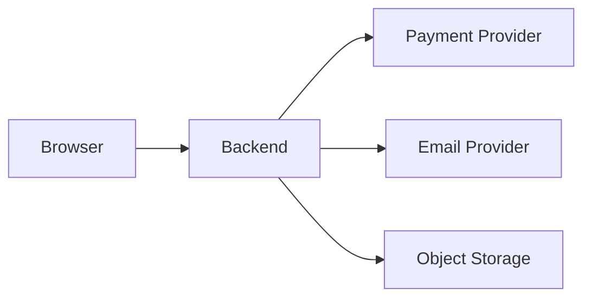

---

# 13. Frontend-Backend API Contract

The frontend and backend need shared expectations.

A contract may define:

```text
Endpoint paths
HTTP methods
Parameters
Headers
Authentication
Request body
Response body
Status codes
Error formats
Pagination
Rate limits
Versioning
```

Example:

```text
POST /api/orders

Authentication:
  Required

Request:
  {
    "items": [
      {
        "productId": 123,
        "quantity": 2
      }
    ]
  }

Success:
  201 Created
```

---

# 14. Client-Side State

Client-side state controls the current interface.

Examples:

```text
Menu is open
Selected tab
Search text
Loading status
Current modal
Current page
Temporary form values
```

This state commonly exists in the browser and may disappear when the page closes.

---

# 15. Server-Side State

Server-side state is controlled by backend systems.

Examples:

```text
User account
Product price
Inventory
Order status
Payment status
Subscription level
Organization membership
Stored messages
```

Important business information should generally be authoritative on the server.

---

# 16. Sources of Truth

| Information | Likely authority |
|---|---|
| Open menu | Browser |
| Search text being typed | Browser |
| Product price | Backend/database |
| Inventory count | Backend/database |
| Order status | Backend/database |
| Payment status | Payment provider/backend |
| Session validity | Session store |
| Product image bytes | Object storage |
| Email status | Queue/worker records |

A cache is usually not the permanent source of truth.

---

# 17. Static Websites

A static website serves prebuilt files:

```text
HTML
CSS
JavaScript
Images
Fonts
```

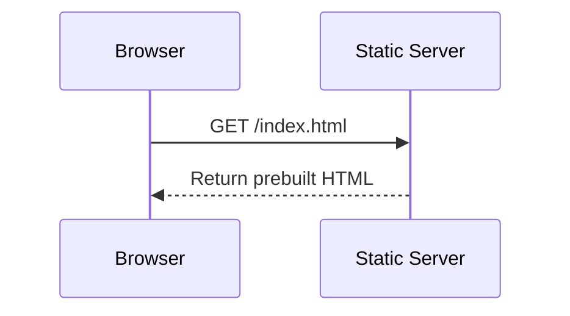

Static sites can still be interactive.

JavaScript may:

```text
Open menus
Filter content
Run calculators
Call APIs
Submit forms
```

“Static” usually describes how the main content is delivered, not whether the page has behavior.

---

# 18. Server-Side Rendering

In SSR, the server generates HTML for a request.

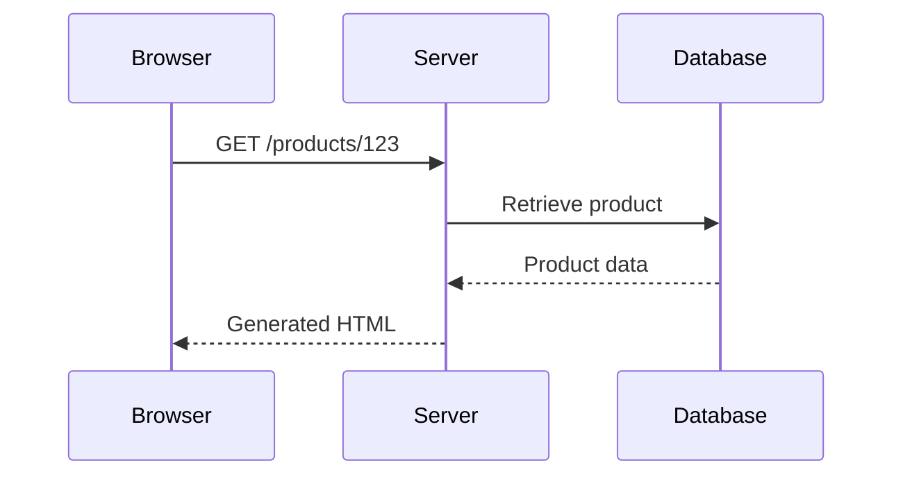

Advantages:

```text
Useful initial content
Good search visibility
Less initial client rendering
Centralized server data access
```

Tradeoffs:

```text
Server rendering cost
Caching complexity
Potentially slower response if backend is slow
Hydration may still be required
```

---

# 19. Client-Side Rendering

In CSR, the browser uses JavaScript to create or update much of the interface.

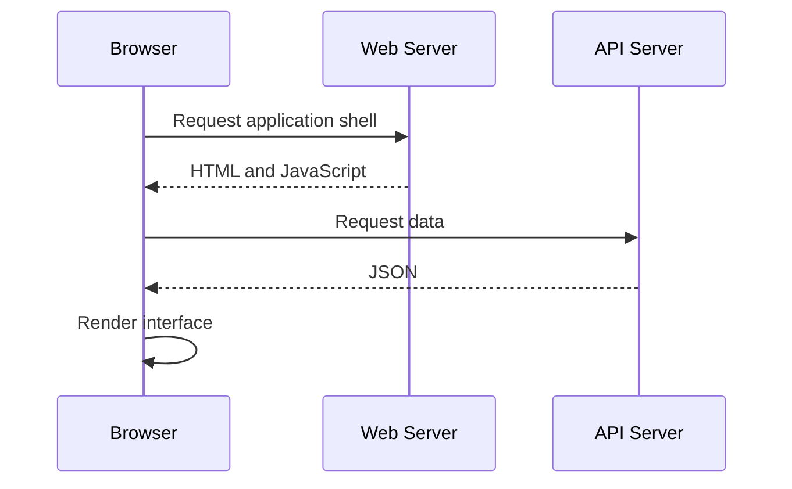

Advantages:

```text
Rich interaction
Smooth navigation
App-like behavior
Client-side state
```

Tradeoffs:

```text
Large JavaScript cost
More client complexity
Potentially slower initial content
More API coordination
```

---

# 20. Static Generation

Static generation creates pages ahead of time.

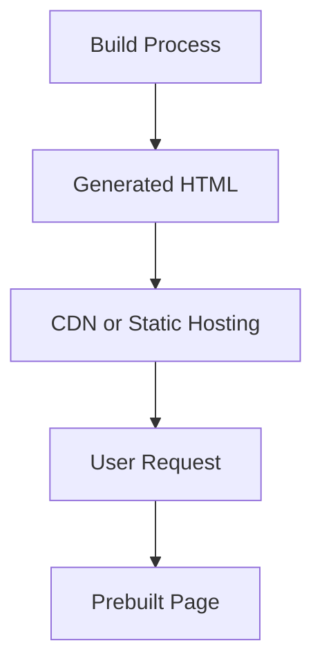

Good for:

```text
Documentation
Blogs
Marketing pages
Public articles
Stable product pages
```

Less suitable by itself for:

```text
Private dashboards
Live inventory
Account balances
Real-time messages
Personalized pages
```

---

# 21. Hybrid Rendering

A modern application may use different strategies for different features.

| Feature | Possible strategy |
|---|---|
| Marketing homepage | Static generation |
| Documentation | Static generation |
| Product detail page | SSR or static generation |
| Account dashboard | CSR or hybrid |
| Checkout | Hybrid |
| Real-time chat | CSR with live connection |
| Large report | Background job |

The key question is:

> Where should this work run, and why?

---

# 22. Full-Stack Frameworks

A full-stack framework may combine:

```text
Frontend components
Server-rendered pages
API routes
Server functions
Build tools
Routing
Data loading
Deployment integration
```

One repository may contain code for several environments:

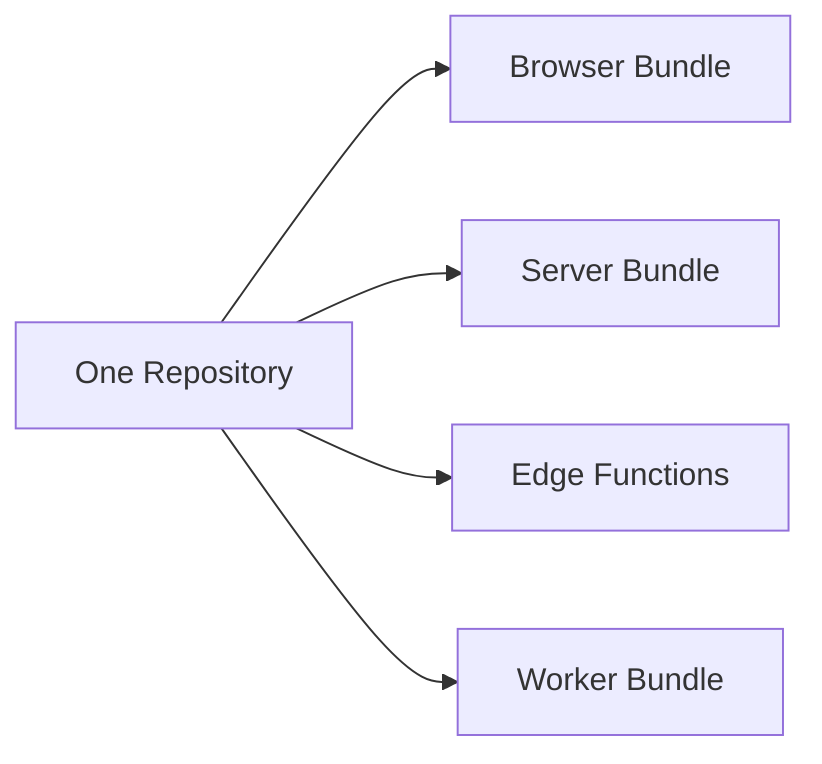

The source code may be unified, but execution boundaries remain important.

---

# 23. Server-Only and Client-Safe Code

## Browser code may access:

```text
DOM
User events
Browser storage
Camera and microphone APIs
Public configuration
```

## Server code may access:

```text
Database
Private credentials
Internal services
File systems
Administrative APIs
```

Never assume that a project file is private just because it is stored in a server project.

What matters is whether the code or value reaches the browser bundle.

---

# 24. Monoliths

A monolith deploys many responsibilities as one main unit.

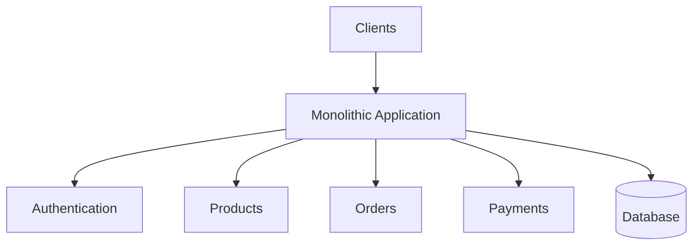

Advantages:

```text
Simple deployment
Simple local development
Centralized debugging
Lower initial operational cost
Easy end-to-end testing
```

Tradeoffs:

```text
Large codebase
Tightly coupled modules
Harder selective scaling
Larger deployments
```

A modular monolith can remain a strong choice for a long time.

---

# 25. Microservices

Microservices split an application into independently deployable services.

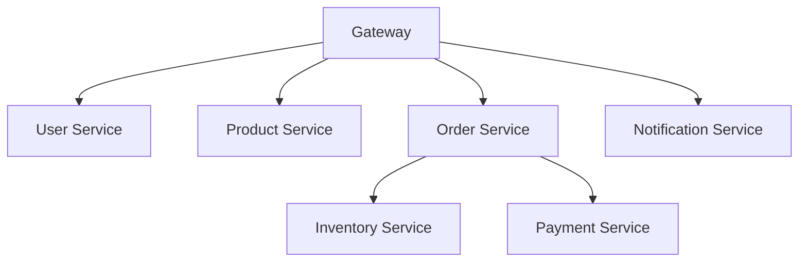

Advantages:

```text
Independent deployment
Independent scaling
Separate ownership
Domain isolation
Technology flexibility
```

Costs:

```text
Network failures
Distributed tracing
More deployments
Data consistency
More operational work
More complex local development
```

Do not choose microservices merely because they sound advanced.

---

# 26. Serverless Functions

Serverless functions execute in response to requests or events.

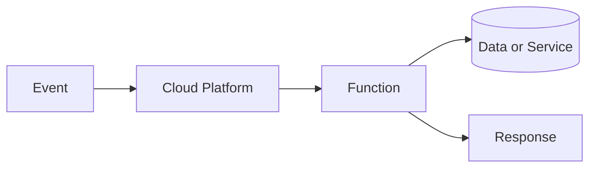

Good candidates:

```text
Webhooks
Small API operations
Form handlers
Scheduled tasks
Image processing
Authentication callbacks
```

Tradeoffs:

```text
Cold starts
Execution limits
Platform-specific behavior
Connection-management challenges
Vendor dependency
```

---

# 27. Queues and Background Workers

Queues store work for later processing.

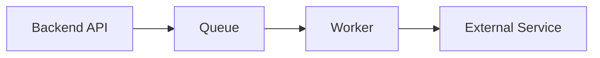

Good background tasks:

```text
Send email
Generate report
Process image
Transcode video
Rebuild search index
Send notification
```

The user request can often return before the task completes.

```text
Immediate request:
  202 Accepted

Later:
  Worker completes the job
```

Important worker concerns:

```text
Retries
Backoff
Idempotency
Dead-letter queue
Job status
Monitoring
```

---

# 28. Common Architectural Mistakes

```text
Trusting client-provided prices
Relying on hidden frontend buttons
Exposing databases directly
Putting secrets in frontend bundles
Using GET for destructive actions
Treating cache as the source of truth
Ignoring authorization ownership
Calling every dependency synchronously
Choosing microservices without a need
Having no error or loading states
Having no backup or rollback plan
```

---

# 29. Review Questions

Answer from memory.

```text
1. What is the frontend responsible for?
2. What is the backend responsible for?
3. Why is the browser untrusted?
4. What is business logic?
5. What is authentication?
6. What is authorization?
7. What is client-side state?
8. What is server-side state?
9. What is a source of truth?
10. What is a static site?
11. What is SSR?
12. What is CSR?
13. What is hydration?
14. What is a monolith?
15. What are microservices?
16. What is serverless?
17. What is a background job?
18. What does a queue do?
19. Why should prices be calculated server-side?
20. Why should databases be behind APIs?
```

---

# 30. Personal Notes

## My own definition of frontend

```text
____________________________________________________________
____________________________________________________________
```

## My own definition of backend

```text
____________________________________________________________
____________________________________________________________
```

## A frontend responsibility

```text
____________________________________________________________
```

## A backend responsibility

```text
____________________________________________________________
```

## A security decision that must happen server-side

```text
____________________________________________________________
```

## A data source of truth

```text
____________________________________________________________
```

## A rendering strategy I understand best

```text
____________________________________________________________
```

## A rendering strategy I need to review

```text
____________________________________________________________
```

## My preferred initial architecture

```text
____________________________________________________________
```

Why?

```text
____________________________________________________________
____________________________________________________________
```

---

# 31. Quick Reference Table

| Concept | Core idea |
|---|---|
| Frontend | User-facing client software |
| Backend | Trusted server-side application |
| Business logic | Rules defining behavior |
| Database | Persistent data storage |
| API | Software communication boundary |
| Client state | Temporary interface state |
| Server state | Authoritative application state |
| Static site | Prebuilt files |
| SSR | Server-generated HTML |
| CSR | Browser-generated or updated UI |
| Hydration | Attach client behavior to server HTML |
| SPA | Client-heavy single-document application |
| Monolith | One primary deployed application |
| Microservices | Multiple independently deployed services |
| Serverless | Provider-managed function execution |
| Queue | Storage for asynchronous work |
| Worker | Process that handles queued jobs |
| Cache | Reusable copy for faster access |

---

# 32. Final Mental Model

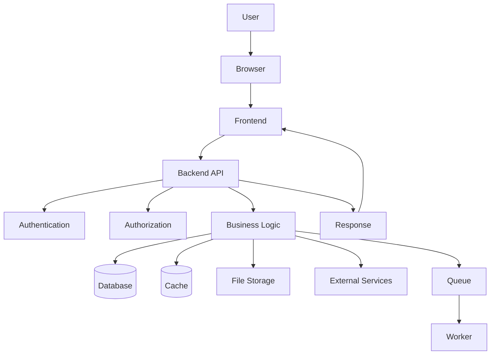

The essential architecture rule is:

```text
Frontend:
  Creates the experience.

Backend:
  Enforces authority.

Database:
  Stores important data.

API:
  Defines communication.

External services:
  Provide specialized capabilities.

Queue and workers:
  Handle asynchronous work.

Cache:
  Speeds up reuse but is not always authoritative.
```

---

# Completion Standard

These notes are complete when you can explain:

```text
Where frontend code runs
Where backend code runs
What the browser can modify
Which rules belong on the server
What data belongs in a database
What state belongs in the browser
How static, SSR, CSR, and hybrid systems differ
When a monolith is appropriate
Why microservices add complexity
What serverless abstracts
Why queues and workers exist
```

The central review question is:

> Which responsibilities belong in the browser, which belong on the server, and which system should have final authority over each important decision?
