# Student Notes — Part 2  
## How the Internet and the Web Work

---

# 1. Core Idea

The Internet is a global collection of interconnected networks.

The Web is one application system built on top of the Internet.

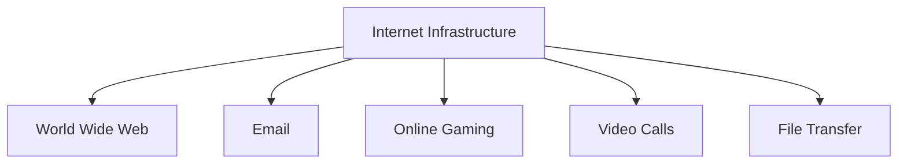

The Internet provides the communication infrastructure.

The Web provides:

```text
Browsers
Web servers
URLs
HTTP
HTTPS
HTML
CSS
JavaScript
Web APIs
```

---

# 2. The Internet vs the Web

## Internet

Includes:

```text
Routers
Switches
Cables
Wireless networks
ISPs
IP addresses
Data centers
Routing systems
```

## Web

Includes:

```text
Web browsers
Websites
HTTP
HTTPS
URLs
HTML
CSS
JavaScript
```

Remember:

```text
Internet = Infrastructure
Web = Application system using that infrastructure
```

---

# 3. Network Layers

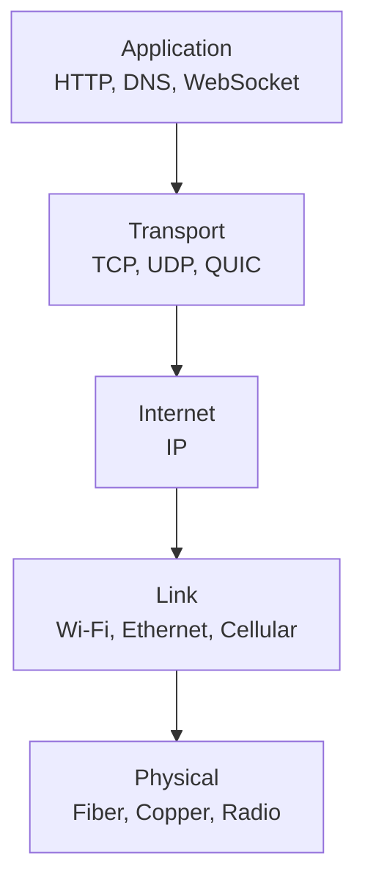

| Layer | Main responsibility |
|---|---|
| Application | Defines what the software communicates |
| Transport | Manages application-to-application delivery |
| Internet | Addresses and routes packets |
| Link | Communicates across a local network |
| Physical | Carries electrical, optical, or radio signals |

A web request may travel through:

```text
HTTP
  ↓
TLS
  ↓
TCP or QUIC
  ↓
IP
  ↓
Wi-Fi, Ethernet, or cellular
  ↓
Physical signals
```

---

# 4. Packets

A packet is a unit of data sent across a network.

It may contain:

```text
Source information
Destination information
Protocol metadata
Payload
```

Large responses are divided into packets:

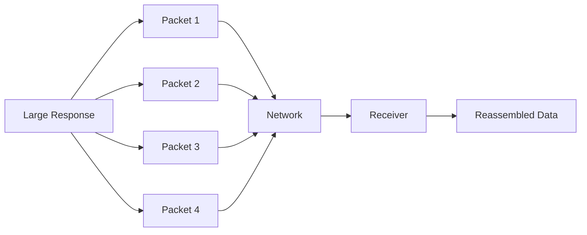

Packets may:

```text
Take different routes
Arrive out of order
Be delayed
Be duplicated
Be lost
```

Transport protocols help handle these conditions.

---

# 5. Packet Switching

Packet switching allows multiple users to share network infrastructure.

Benefits:

```text
Efficient use of network links
Many users can communicate simultaneously
Traffic can be routed around some failures
No permanent dedicated path is required
```

The network does not usually reserve one physical path for an entire webpage or API conversation.

---

# 6. IP Addresses

An IP address identifies a destination on an IP network.

Examples:

```text
IPv4:
  203.0.113.10

IPv6:
  2001:db8::1
```

An IP address may represent:

```text
One server
A load balancer
A CDN edge
A router
A shared service
A temporary destination
```

It does not necessarily represent one permanent physical computer.

---

# 7. IPv4 and IPv6

| Feature | IPv4 | IPv6 |
|---|---|---|
| Address size | 32 bits | 128 bits |
| Example | `203.0.113.10` | `2001:db8::1` |
| Common DNS record | `A` | `AAAA` |
| Notation | Dotted decimal | Hexadecimal groups |
| Address capacity | Limited | Very large |

IPv6 was created primarily to provide a much larger address space.

---

# 8. Public and Private Addresses

## Public IP address

May be reachable through public Internet routing.

Example:

```text
198.51.100.20
```

## Private IP address

Used inside local or private networks.

Common IPv4 private ranges include:

```text
10.0.0.0/8
172.16.0.0/12
192.168.0.0/16
```

Example:

```text
192.168.1.20
```

Private addresses are not normally routed directly across the public Internet.

---

# 9. NAT

NAT stands for **Network Address Translation**.

It allows multiple private devices to share one public IPv4 address.

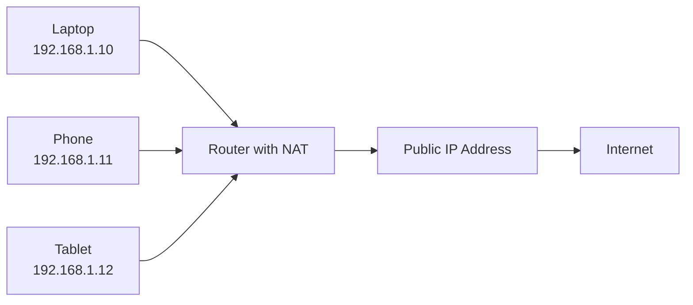

The router tracks connections so returning packets reach the correct internal device.

NAT helped extend IPv4 usage but can complicate incoming connections and peer-to-peer communication.

---

# 10. Domain Names

Domain names are human-readable identifiers.

Examples:

```text
example.com
api.example.com
shop.example.com
```

Domain names are easier to remember than IP addresses.

A domain may point to:

```text
One IP
Several IPs
A load balancer
A CDN
A different hostname
Different destinations by region
```

---

# 11. Domain Structure

Consider:

```text
api.shop.example.com
```

Possible interpretation:

```text
api       = Service or host label
shop      = Subdomain
example   = Registered domain
com       = Top-level domain
```

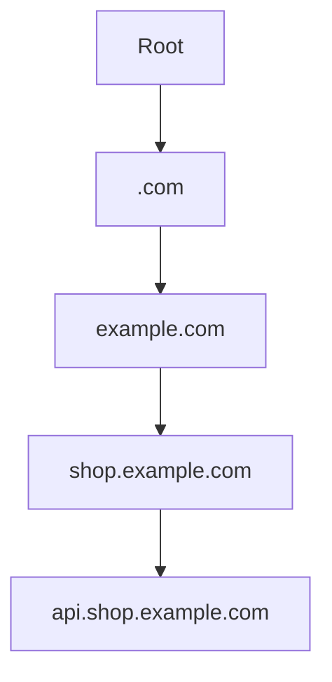

A label’s name does not guarantee how the infrastructure is implemented.

---

# 12. DNS

DNS stands for:

```text
Domain Name System
```

DNS maps names to network information.

Most commonly:

```text
example.com → IP address
```

DNS may also provide:

```text
Mail server information
Aliases
Domain verification
Service discovery
Security-related text records
```

DNS does not normally store the complete website.

```text
DNS:
  Where is the service?

Server or CDN:
  Here is the content.
```

---

# 13. DNS Participants

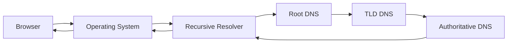

## Browser and OS caches

May already contain a recent answer.

## Recursive resolver

Looks up answers on behalf of clients.

## Root DNS

Directs queries to TLD servers.

## TLD servers

Direct queries to authoritative servers for domains.

## Authoritative servers

Return official records for a domain.

---

# 14. DNS Resolution

For:

```text
www.example.com
```

A simplified process is:

```text
1. Browser needs an address.
2. Browser and operating system check caches.
3. Recursive resolver checks its cache.
4. Resolver asks root DNS about .com.
5. Resolver asks .com TLD servers about example.com.
6. Resolver asks authoritative DNS about www.example.com.
7. Resolver returns the result.
8. Browser connects to the destination.
```

---

# 15. DNS Record Types

| Record | Meaning |
|---|---|
| `A` | Hostname to IPv4 address |
| `AAAA` | Hostname to IPv6 address |
| `CNAME` | Alias to another hostname |
| `MX` | Mail servers |
| `TXT` | Text for verification or policies |
| `NS` | Authoritative name servers |
| `PTR` | Reverse DNS mapping |

Examples:

```text
example.com. A 203.0.113.10
example.com. AAAA 2001:db8::10
www.example.com. CNAME example.com.
```

---

# 16. DNS Caching and TTL

DNS results are cached by:

```text
Browser
Operating system
Home router
Recursive resolver
CDN or network provider
```

TTL means:

```text
Time to live
```

Example:

```text
example.com. 300 IN A 203.0.113.10
```

The result may be cached for approximately:

```text
300 seconds
```

Caching improves:

```text
Lookup speed
Efficiency
Resilience
```

Tradeoff:

```text
DNS changes may take time to appear everywhere.
```

---

# 17. Forward and Reverse DNS

## Forward DNS

```text
Hostname → IP address
```

Example:

```text
example.com → 203.0.113.10
```

## Reverse DNS

```text
IP address → Hostname
```

Example:

```text
203.0.113.10 → server.example.com
```

Reverse DNS is often used for:

```text
Troubleshooting
Email reputation
Logging
Network administration
```

---

# 18. Routers and Switches

## Switch

Usually connects devices within the same local network.

```text
Laptop
Printer
Phone
Local server
```

## Router

Connects different networks.

```text
Home network → ISP
ISP → Transit network
Public network → Data center
```

```text
Switch = Local network connectivity
Router = Connectivity between networks
```

---

# 19. ISPs and Larger Networks

An ISP, or Internet Service Provider, connects customers to larger networks.

It may provide:

```text
Fiber or cable access
Mobile connectivity
Public IP addresses
DNS resolvers
Network routing
Traffic management
```

Large providers operate their own networks and exchange routing information with other networks.

Routes may change because of:

```text
Outages
Maintenance
Congestion
Routing policy
Cost
Capacity
Security events
```

---

# 20. Ports

A port identifies a service on a host.

A destination is commonly represented as:

```text
IP address + port
```

Example:

```text
203.0.113.10:443
```

Common ports:

| Port | Common use |
|---:|---|
| `22` | SSH |
| `53` | DNS |
| `80` | HTTP |
| `443` | HTTPS |
| `3000` | Development server |
| `5432` | PostgreSQL |
| `3306` | MySQL |
| `6379` | Redis |

One host can run multiple services on different ports.

---

# 21. Latency

Latency is delay.

It can come from:

```text
Physical distance
Routing
Congestion
DNS
Connection setup
TLS
Server processing
Database queries
External services
```

A request’s total delay may be approximated as:

```text
DNS
+ connection
+ TLS
+ request travel
+ server processing
+ response travel
+ browser processing
```

---

# 22. Bandwidth

Bandwidth is the amount of data transferable over time.

Examples:

```text
100 Mbps
1 Gbps
10 Gbps
```

Bandwidth is different from latency.

A network can have:

```text
High bandwidth and high latency
Low bandwidth and low latency
```

Analogy:

```text
Bandwidth = Width of the highway
Latency = Travel time to the destination
```

---

# 23. Jitter and Packet Loss

## Jitter

Variation in packet arrival times.

Important for:

```text
Voice calls
Video calls
Online games
Real-time collaboration
```

## Packet loss

Packets fail to reach the destination.

Possible causes:

```text
Congestion
Wireless interference
Faulty hardware
Routing problems
Buffer overflow
```

Packet loss can cause:

```text
Audio gaps
Video freezing
Retransmission
Higher delay
Disconnected sessions
```

---

# 24. Data Centers

A data center contains:

```text
Servers
Storage
Routers
Switches
Power systems
Cooling
Physical security
Monitoring
Backup infrastructure
```

A simplified layout:

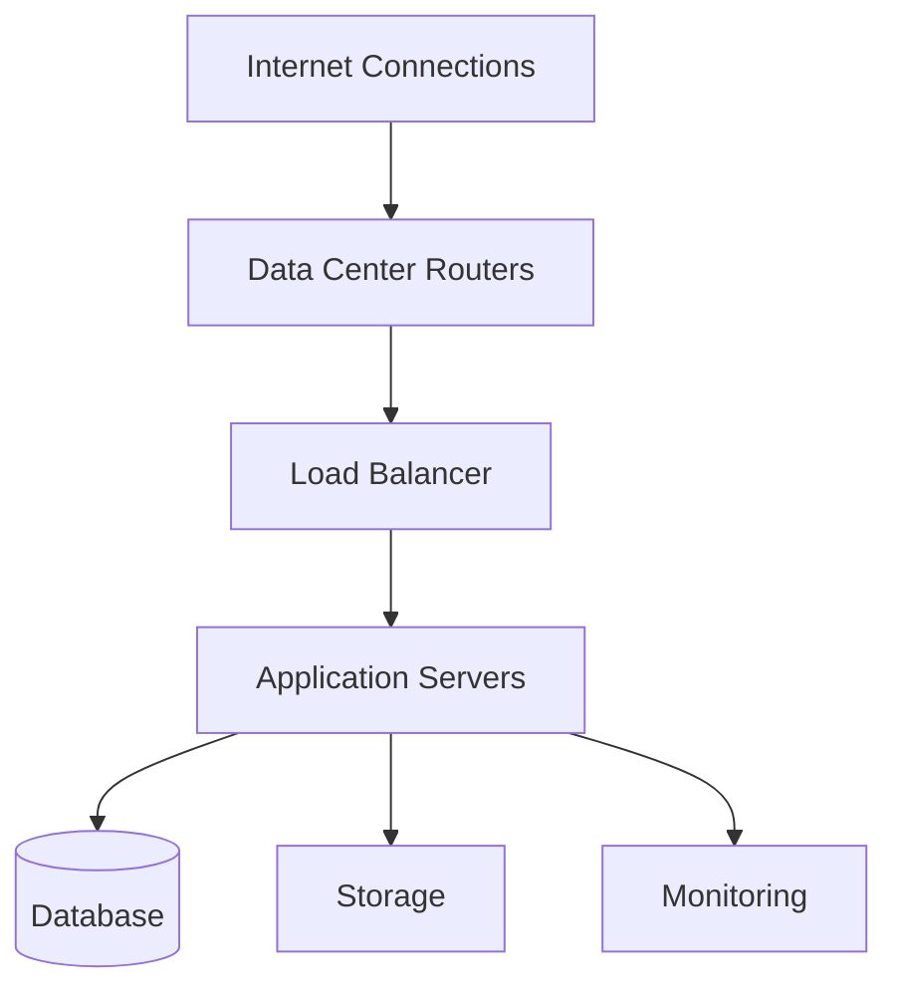

Applications may run in:

```text
One data center
Multiple zones
Multiple regions
Public cloud
Private infrastructure
Hybrid environments
```

---

# 25. Origin Servers

The origin server is the primary source of application content.

A CDN may request content from the origin when it has no cached copy.

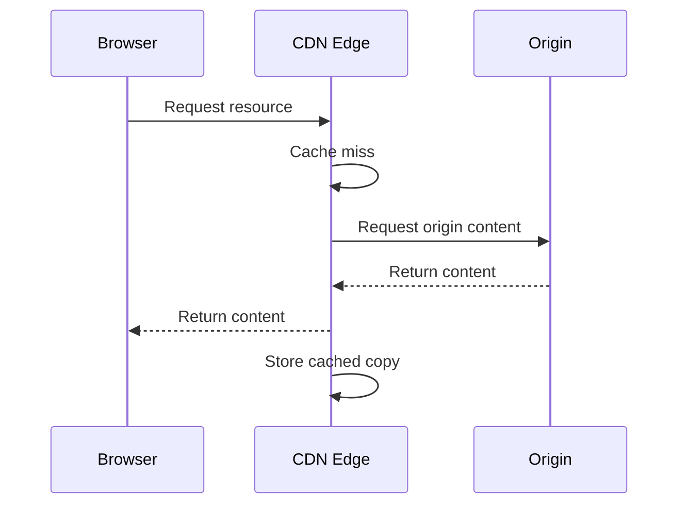

The origin may contain:

```text
Application code
Database connections
Private files
Dynamic rendering
Internal services
```

---

# 26. CDNs

A CDN, or Content Delivery Network, distributes content through edge locations.

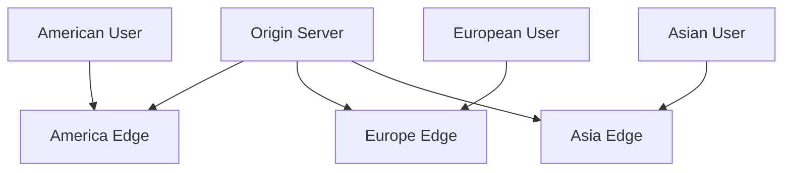

Good CDN candidates:

```text
Images
CSS
JavaScript
Fonts
Video
Downloads
Public static HTML
```

CDN benefits:

```text
Lower latency
Less origin traffic
Improved global delivery
Reduced bandwidth pressure
```

CDN risks:

```text
Stale content
Invalidation complexity
Private-data exposure
Configuration mistakes
```

---

# 27. Load Balancers

A load balancer distributes requests across application servers.

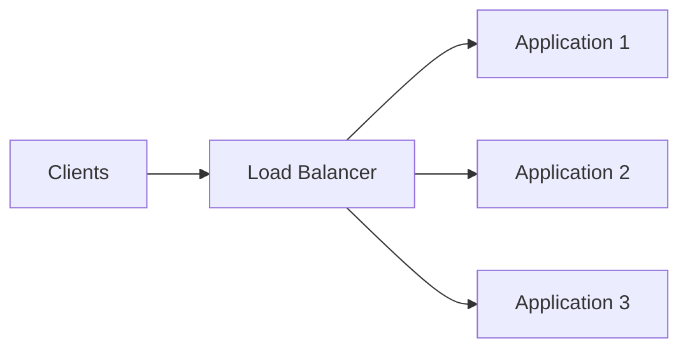

It may perform:

```text
Health checks
Traffic distribution
TLS termination
Routing
Failure removal
```

If one server fails, the load balancer should stop routing new traffic to it.

---

# 28. Firewalls and Private Networks

A firewall controls which traffic is allowed.

Typical design:

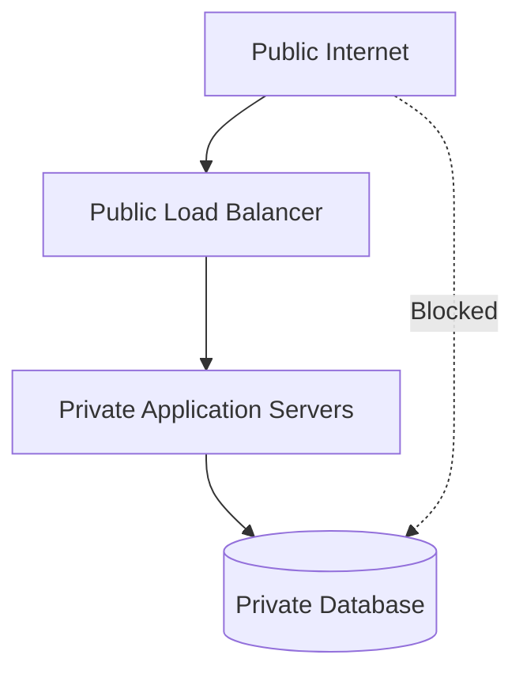

Example policy:

```text
Internet → Load balancer: allow HTTPS
Load balancer → Application: allow application port
Application → Database: allow database port
Internet → Database: deny
```

A firewall is one security layer, not a replacement for authentication and authorization.

---

# 29. Localhost and Development Networks

Common local addresses:

```text
localhost
127.0.0.1
::1
```

Example:

```text
http://localhost:3000
```

Means:

```text
Scheme:
  http

Host:
  localhost

Port:
  3000
```

A common local setup:

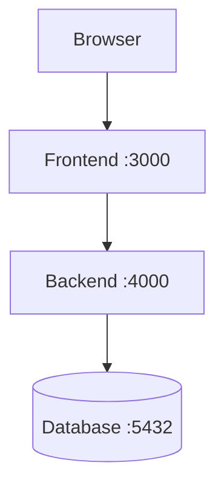

All components may run on the same computer while still communicating through network protocols.

---

# 30. Network Failure Categories

| Failure | Likely layer |
|---|---|
| Hostname cannot resolve | DNS |
| Connection timeout | Network, routing, firewall, or server |
| Connection refused | Service or port |
| Certificate error | TLS |
| `404` | Route or resource |
| `401` | Authentication |
| `403` | Authorization |
| `500` | Backend or dependency |
| Slow TTFB | Backend, database, cache, or upstream |
| Slow download | Payload size or bandwidth |

The troubleshooting approach is:

```text
Identify the earliest failed layer.
Collect evidence.
Test the hypothesis.
```

---

# 31. Network Request Journey

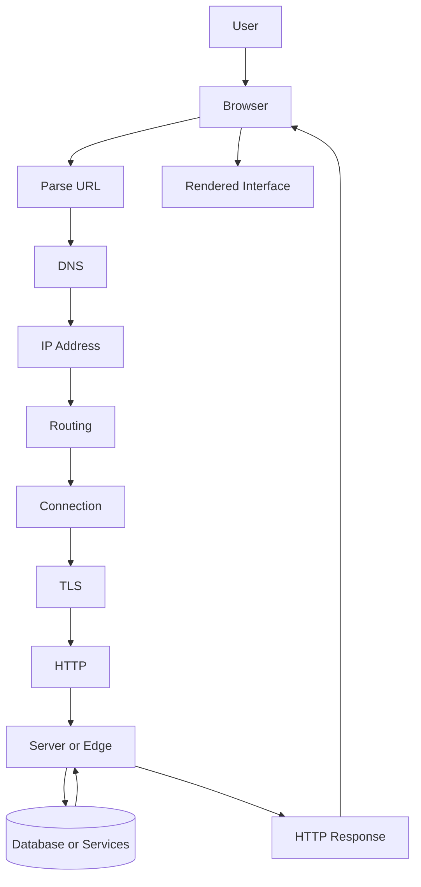

Narration:

```text
The browser parses the URL.
DNS resolves the hostname.
The network routes packets to the destination.
A secure connection is established.
The browser sends an HTTP request.
The server or edge processes it.
The backend may access data or services.
The response returns to the browser.
The browser renders the result.
```

---

# 32. Common Confusions

## Domain vs IP address

```text
Domain:
  Human-readable name.

IP:
  Network address.
```

## Public vs private IP

```text
Public:
  May be publicly routed.

Private:
  Used inside a controlled network.
```

## Router vs switch

```text
Router:
  Connects networks.

Switch:
  Connects devices within a local network.
```

## Latency vs bandwidth

```text
Latency:
  Delay.

Bandwidth:
  Transfer capacity.
```

## DNS vs HTTP

```text
DNS:
  Helps find the destination.

HTTP:
  Carries the web request and response.
```

## CDN vs origin

```text
CDN:
  Distributed cache and delivery layer.

Origin:
  Primary source of content.
```

---

# 33. Recall Questions

Answer from memory.

```text
1. What is the difference between the Internet and the Web?
2. What is a packet?
3. Why is packet switching useful?
4. What is an IP address?
5. What is the difference between IPv4 and IPv6?
6. What is NAT?
7. What does DNS do?
8. What is a recursive resolver?
9. What is an authoritative DNS server?
10. What does TTL control?
11. What is the difference between a router and a switch?
12. What does an ISP do?
13. What is latency?
14. What is bandwidth?
15. What are jitter and packet loss?
16. What is a port?
17. What does a CDN do?
18. What is an origin server?
19. What does a load balancer do?
20. What happens if DNS succeeds but the server is unavailable?
```

---

# 34. Personal Notes

## My own definition of the Internet

```text
____________________________________________________________
____________________________________________________________
```

## My own definition of the Web

```text
____________________________________________________________
____________________________________________________________
```

## My own explanation of DNS

```text
____________________________________________________________
____________________________________________________________
```

## My own explanation of latency

```text
____________________________________________________________
```

## My own explanation of bandwidth

```text
____________________________________________________________
```

## A network component I understand best

```text
____________________________________________________________
```

## A network component I need to review

```text
____________________________________________________________
```

## My own request journey

```text
____________________________________________________________
____________________________________________________________
____________________________________________________________
```

## A question I still have

```text
____________________________________________________________
```

---

# 35. Quick Reference Table

| Concept | Core idea |
|---|---|
| Internet | Global interconnected networks |
| Web | Application system using the Internet |
| Packet | Unit of network data |
| IP address | Network destination |
| IPv4 | 32-bit addressing |
| IPv6 | 128-bit addressing |
| Public IP | Potentially publicly routed address |
| Private IP | Internal network address |
| NAT | Private-to-public address translation |
| DNS | Name-to-network-information system |
| Resolver | Performs DNS lookup for clients |
| Authoritative server | Provides official domain records |
| TTL | DNS cache duration |
| Router | Connects networks |
| Switch | Connects local devices |
| ISP | Provides Internet connectivity |
| Port | Service identifier |
| Latency | Communication delay |
| Bandwidth | Transfer capacity |
| Jitter | Packet timing variation |
| Packet loss | Missing packets |
| CDN | Distributed content-delivery layer |
| Origin | Primary content source |
| Load balancer | Distributes application traffic |
| Firewall | Controls permitted traffic |

---

# 36. Final Mental Model

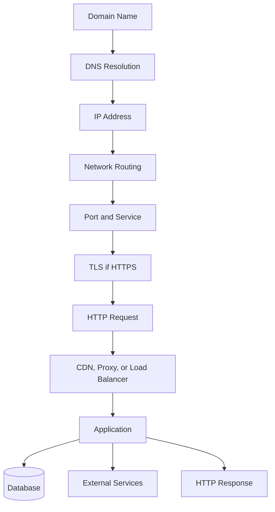

The most important networking lesson is:

> DNS helps the client find a destination, IP and routing move packets, ports identify services, TLS protects the connection, and HTTP carries the web request and response.

---

# Completion Standard

These notes are complete when you can explain:

```text
What the Internet is
What the Web adds
How packets travel
How domain names become IP addresses
How DNS caching works
How public and private networks differ
What NAT does
How routers and switches differ
How ports identify services
Why latency and bandwidth differ
What CDNs and origin servers do
How load balancers distribute traffic
How firewalls protect private services
Where a network request can fail
```

Use these notes to review Part 2 before completing:

```text
Workbook 2 — Internet and Network Mapping
Networking quiz
Networking test
Request-tracing scenario
```
