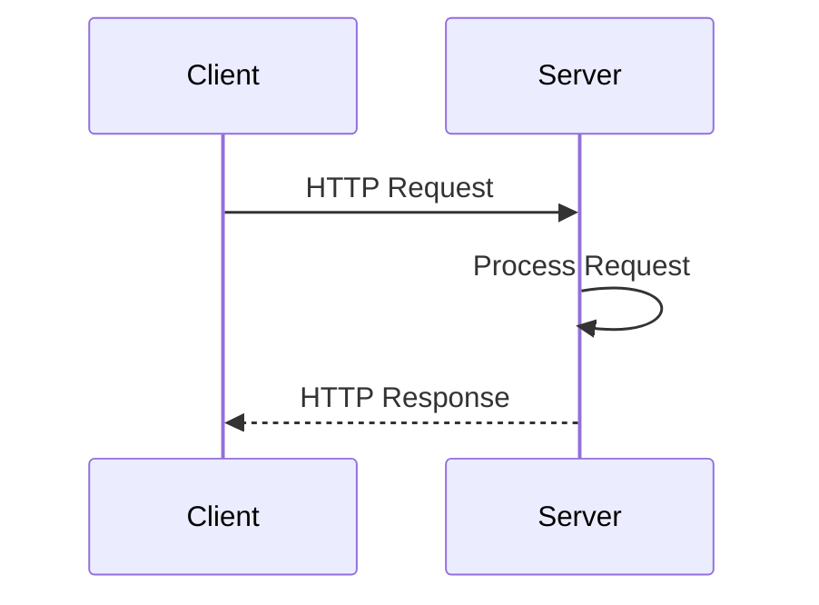
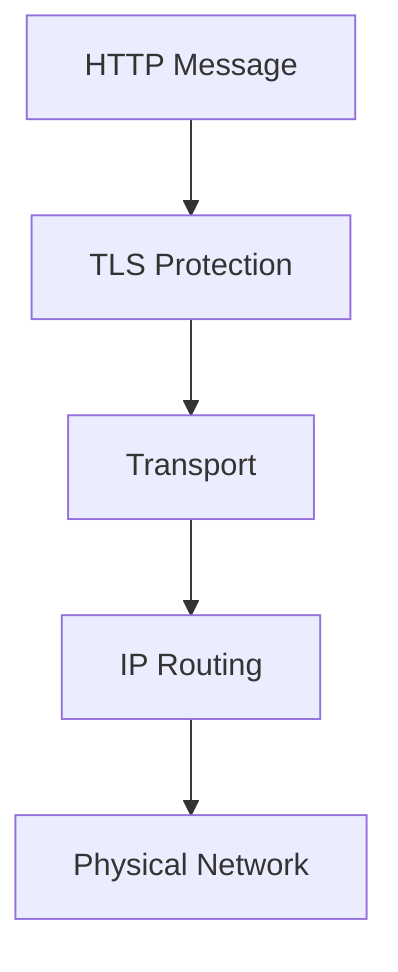
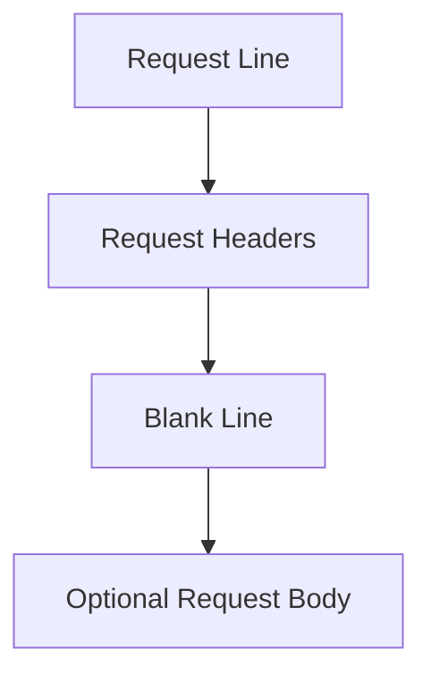
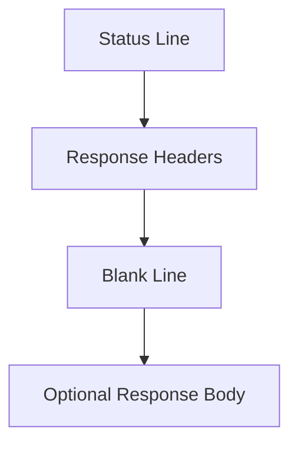
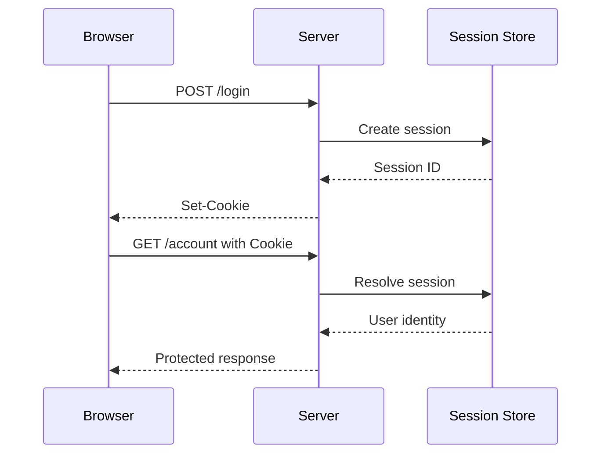
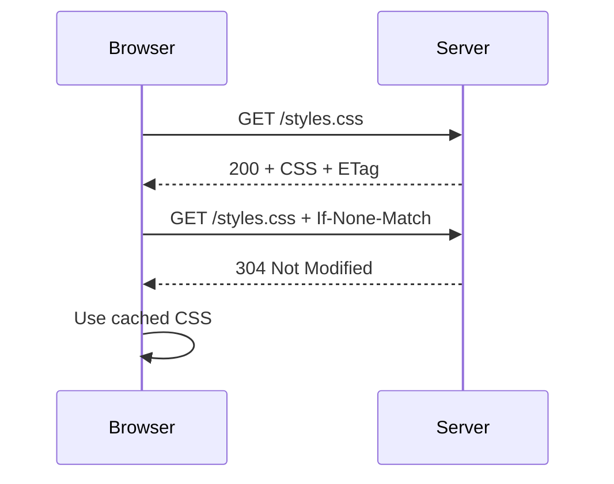
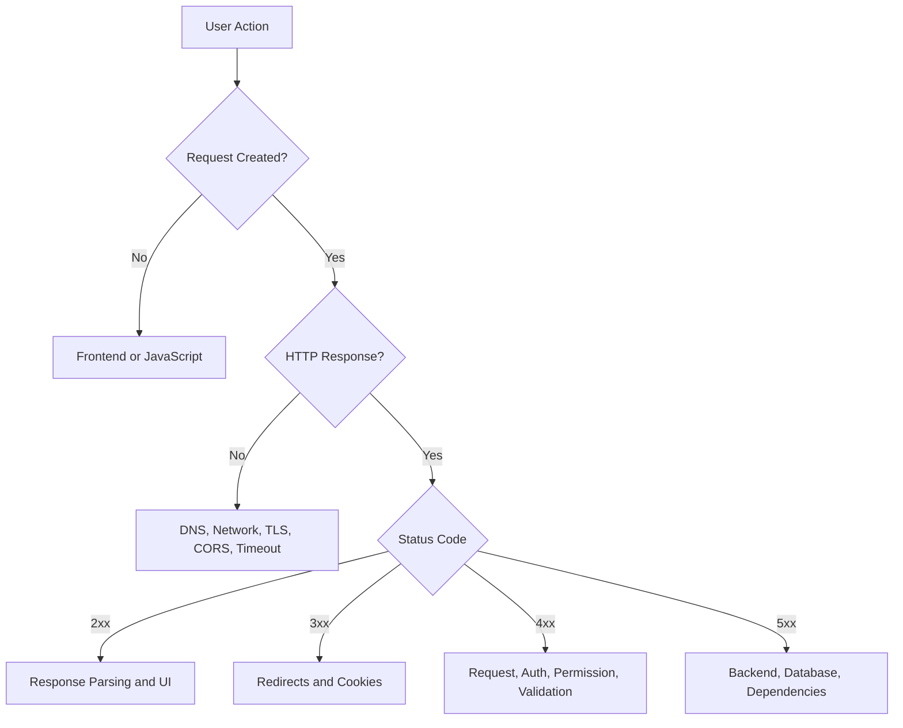
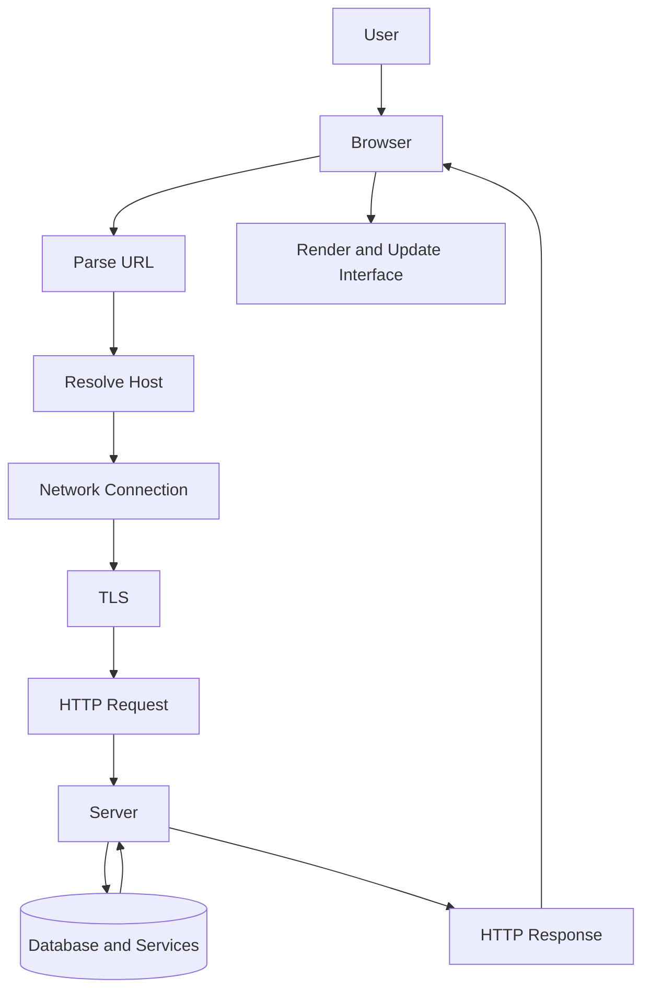

# Student Notes — Part 3  
## HTTP, HTTPS, URLs, Requests, Responses, and TLS

---

# 1. Core Idea

HTTP is the primary application protocol used by the Web.

It defines how clients and servers exchange messages:



HTTPS is HTTP protected by TLS.



---

# 2. What HTTP Carries

HTTP can carry:

```text
HTML
CSS
JavaScript
JSON
XML
Images
Fonts
Audio
Video
PDFs
Form data
File uploads
API requests
```

The same protocol carries both:

```text
Page navigation
```

and:

```text
Backend API operations
```

---

# 3. HTTP Request Anatomy

A traditional request contains:

```text
Request line
Headers
Blank line
Optional body
```

Example:

```http
POST /api/orders HTTP/1.1
Host: shop.example.com
Accept: application/json
Content-Type: application/json
Authorization: Bearer REDACTED

{
  "productId": 123,
  "quantity": 2
}
```



---

# 4. HTTP Response Anatomy

A response contains:

```text
Status line
Response headers
Blank line
Optional body
```

Example:

```http
HTTP/1.1 201 Created
Content-Type: application/json
Location: /api/orders/9001

{
  "id": 9001,
  "status": "pending"
}
```



---

# 5. URL Structure

Example:

```text
https://api.example.com:8443/v1/products/123?sort=price#details
```

Components:

```text
Scheme:
  https

Host:
  api.example.com

Port:
  8443

Path:
  /v1/products/123

Query:
  sort=price

Fragment:
  details
```

General form:

```text
scheme://authority/path?query#fragment
```

---

# 6. URL Components

## Scheme

Identifies the protocol:

```text
http
https
ws
wss
```

## Host

Identifies the destination:

```text
example.com
api.example.com
localhost
```

## Port

Identifies the service:

```text
443
3000
8080
```

## Path

Identifies a route or resource:

```text
/products/123
```

## Query

Provides filters, search, sorting, or pagination:

```text
?page=2&limit=20
```

## Fragment

Usually identifies a browser-side location:

```text
#reviews
```

---

# 7. URL Path vs Query vs Fragment

```text
Path:
  Which resource or route?

Query:
  Which filter, page, sort, or option?

Fragment:
  Which location or state within the returned resource?
```

Example:

```text
/products/123?view=reviews#comments
```

```text
/products/123:
  Product 123

view=reviews:
  Optional server-side or application parameter

#comments:
  Browser-side location
```

The fragment is normally not sent to the server.

---

# 8. HTTP Methods

| Method | Typical meaning |
|---|---|
| `GET` | Retrieve a resource |
| `POST` | Submit data, create, or trigger processing |
| `PUT` | Replace a resource |
| `PATCH` | Partially update a resource |
| `DELETE` | Remove a resource |
| `HEAD` | Retrieve headers without normal body |
| `OPTIONS` | Ask about supported methods or CORS |

Common REST mapping:

```text
GET    /products
POST   /products
GET    /products/123
PUT    /products/123
PATCH  /products/123
DELETE /products/123
```

---

# 9. Safe and Idempotent Methods

## Safe

A safe method is intended not to change server state.

Generally:

```text
GET
HEAD
```

## Idempotent

Repeating the operation produces the same intended final state.

Generally:

```text
GET
HEAD
PUT
DELETE
```

`POST` is generally not automatically idempotent.

Important operations such as:

```text
Payments
Orders
Reservations
Message creation
```

may need an idempotency key.

```http
Idempotency-Key: operation-123
```

---

# 10. Headers

Headers provide metadata.

Important request headers:

```http
Host
Accept
Content-Type
Authorization
Cookie
Origin
Referer
User-Agent
Accept-Encoding
Cache-Control
```

Important response headers:

```http
Content-Type
Content-Length
Location
Set-Cookie
Cache-Control
ETag
Last-Modified
Retry-After
Access-Control-Allow-Origin
Strict-Transport-Security
Content-Security-Policy
```

---

# 11. `Accept` vs `Content-Type`

## `Accept`

What response formats the client prefers.

```http
Accept: application/json
```

## `Content-Type`

What format the request or response body uses.

```http
Content-Type: application/json
```

Example:

```http
POST /api/orders
Accept: application/json
Content-Type: application/json
```

```text
Accept:
  Client wants JSON back.

Content-Type:
  Client is sending JSON.
```

---

# 12. Common Request Body Formats

## JSON

```http
Content-Type: application/json
```

```json
{
  "name": "Alex"
}
```

## URL-encoded form

```http
Content-Type: application/x-www-form-urlencoded
```

```text
name=Alex&email=alex%40example.com
```

## Multipart form

```http
Content-Type: multipart/form-data
```

Useful for:

```text
Text fields
Files
Metadata
```

## Binary

```http
Content-Type: image/png
```

Used for raw file content.

---

# 13. Response Content Types

Common values:

```http
Content-Type: text/html
Content-Type: application/json
Content-Type: text/css
Content-Type: application/javascript
Content-Type: image/png
Content-Type: application/pdf
```

Always inspect the content type before deciding how to parse the body.

A JSON endpoint returning HTML may indicate:

```text
Wrong route
Redirect to login
Proxy fallback
Server error page
Environment mismatch
```

---

# 14. Status-Code Categories

| Range | Meaning |
|---|---|
| `1xx` | Informational |
| `2xx` | Success |
| `3xx` | Redirection |
| `4xx` | Request, identity, permission, or resource problem |
| `5xx` | Server or upstream problem |

---

# 15. Important Success Codes

## `200 OK`

The request succeeded.

```http
HTTP/1.1 200 OK
```

## `201 Created`

A new resource was created.

```http
HTTP/1.1 201 Created
Location: /api/orders/9001
```

## `202 Accepted`

Work was accepted but may finish later.

```http
HTTP/1.1 202 Accepted
```

## `204 No Content`

The operation succeeded without a response body.

```http
HTTP/1.1 204 No Content
```

---

# 16. Important Redirect Codes

## `301 Moved Permanently`

Permanent redirect.

## `302 Found`

Common temporary redirect.

## `303 See Other`

Usually redirects the client to retrieve another URL with `GET`.

## `304 Not Modified`

Reuse the cached response.

## `307 Temporary Redirect`

Temporary redirect that preserves the method.

## `308 Permanent Redirect`

Permanent redirect that preserves the method.

---

# 17. Important Client and Request Errors

## `400 Bad Request`

The request is malformed or generally invalid.

## `401 Unauthorized`

Authentication is missing, invalid, or expired.

## `403 Forbidden`

The caller is known but lacks permission.

## `404 Not Found`

The route or resource cannot be found.

## `405 Method Not Allowed`

The route exists, but the method is unsupported.

## `409 Conflict`

The request conflicts with current state.

## `413 Content Too Large`

The request body is too large.

## `415 Unsupported Media Type`

The body format is unsupported.

## `422 Unprocessable Content`

The request is understood but values fail validation or business rules.

## `429 Too Many Requests`

The client is rate-limited.

---

# 18. Important Server Errors

## `500 Internal Server Error`

Unexpected server-side failure.

## `502 Bad Gateway`

A gateway received an invalid upstream response.

## `503 Service Unavailable`

The service is temporarily unavailable, overloaded, or under maintenance.

## `504 Gateway Timeout`

A gateway waited too long for an upstream response.

A `5xx` response should usually trigger server-side investigation.

---

# 19. `401` vs `403`

```text
401:
  Who are you?
  Authentication is missing or invalid.

403:
  We know who you are.
  You are not allowed to do that.
```

Example:

```text
No session cookie:
  401

Authenticated regular user accessing admin report:
  403
```

---

# 20. `404` vs Network Failure

```text
404:
  Server was reached.
  Requested route or resource was not found.

Network failure:
  A usable HTTP response may never have arrived.
```

Network failures include:

```text
DNS failure
Connection timeout
TLS failure
Offline device
Firewall
Connection refused
```

---

# 21. Cookies

A server sets a cookie:

```http
Set-Cookie: session_id=REDACTED; Secure; HttpOnly; SameSite=Lax
```

The browser later sends:

```http
Cookie: session_id=REDACTED
```

Cookies commonly support:

```text
Sessions
Preferences
Shopping carts
Analytics
Authentication state
```

---

# 22. Cookie Attributes

| Attribute | Purpose |
|---|---|
| `Secure` | Send only over HTTPS |
| `HttpOnly` | Prevent normal JavaScript access |
| `SameSite` | Control cross-site behavior |
| `Domain` | Control applicable host scope |
| `Path` | Control applicable URL path |
| `Max-Age` | Set lifetime in seconds |
| `Expires` | Set expiration date |

---

# 23. Sessions

A session connects requests to an authenticated user.



The cookie may contain only:

```text
Opaque session identifier
```

The server stores the meaningful session data.

---

# 24. Bearer Tokens

A token may be sent in:

```http
Authorization: Bearer REDACTED
```

The server may validate:

```text
Signature
Expiration
Issuer
Audience
Scopes
```

Bearer tokens are sensitive because possession may grant access.

Do not place them in:

```text
URLs
Logs
Screenshots
Public repositories
Frontend source
```

---

# 25. HTTP Caching

Caching stores reusable responses.

Common headers:

```http
Cache-Control: max-age=3600
ETag: "version-5"
Last-Modified: ...
```

Conditional request:

```http
GET /styles.css
If-None-Match: "version-5"
```

Response:

```http
304 Not Modified
```

The browser reuses the cached response.



---

# 26. Public vs Private Caching

Usually suitable for shared caching:

```text
Public CSS
Public JavaScript
Public images
Public documentation
Public product images
```

Requires caution:

```text
User account data
Private messages
Personalized recommendations
Payment responses
Private reports
```

Incorrect shared caching can expose one user’s data to another.

---

# 27. Compression

A client may send:

```http
Accept-Encoding: gzip, br
```

The server may respond:

```http
Content-Encoding: br
```

This means the body is compressed with Brotli.

Compression is useful for:

```text
HTML
CSS
JavaScript
JSON
XML
Plain text
```

Already-compressed assets may receive less benefit.

---

# 28. Content Negotiation

Client:

```http
Accept: application/json
Accept-Language: en-US
Accept-Encoding: br
```

Server:

```http
Content-Type: application/json
Content-Language: en-US
Content-Encoding: br
```

The client expresses preferences; the server selects a representation.

---

# 29. HTTPS and TLS

HTTPS provides:

```text
Confidentiality:
  Observers cannot normally read the message contents.

Integrity:
  Unauthorized changes should be detected.

Authentication:
  The browser can verify the server certificate and hostname.
```

HTTPS does not guarantee:

```text
Correct authorization
Secure application logic
Safe passwords
Protected browser extensions
A secure database
No XSS
No SQL injection
```

---

# 30. Symmetric and Asymmetric Cryptography

## Symmetric encryption

Uses one shared secret key:

```text
Plaintext + key → ciphertext
Ciphertext + key → plaintext
```

Efficient for ongoing session traffic.

## Asymmetric cryptography

Uses:

```text
Public key
Private key
```

Useful for:

```text
Server authentication
Digital signatures
Key agreement
```

TLS commonly uses both:

```text
Asymmetric cryptography:
  Establish trust and session secrets.

Symmetric encryption:
  Efficiently protect application data.
```

---

# 31. TLS Certificate

A certificate associates:

```text
Domain
Public key
Certificate authority
Validity period
Digital signature
```

The browser checks:

```text
Hostname
Expiration
Issuer
Certificate chain
Signature
System time
```

If validation fails, the browser may show a warning or refuse the connection.

---

# 32. CORS

CORS controls whether browser JavaScript may read responses from another origin.

Request:

```http
Origin: https://app.example.com
```

Response:

```http
Access-Control-Allow-Origin: https://app.example.com
```

A browser may send an `OPTIONS` preflight:

```http
OPTIONS /api/orders
Access-Control-Request-Method: POST
Access-Control-Request-Headers: Content-Type, Authorization
```

CORS is:

```text
A browser access-control mechanism
```

CORS is not:

```text
Authentication
Authorization
A firewall
```

---

# 33. Network Error vs HTTP Error

## Network error

No usable HTTP response arrived.

Examples:

```text
DNS failure
Connection refused
Timeout
TLS failure
Offline
```

## HTTP error

A valid HTTP response arrived with an error status.

Examples:

```text
400
401
403
404
422
500
503
```

Always determine whether an HTTP response exists before interpreting the status code.

---

# 34. Request Debugging Sequence



---

# 35. Request Example

```http
POST /api/orders?notify=true HTTP/1.1
Host: shop.example.com
Accept: application/json
Content-Type: application/json
Authorization: Bearer REDACTED
Idempotency-Key: order-attempt-123

{
  "items": [
    {
      "productId": 123,
      "quantity": 2
    }
  ]
}
```

Interpretation:

```text
Method:
  POST

Path:
  /api/orders

Query:
  notify=true

Expected response:
  JSON

Request body:
  JSON

Authentication:
  Bearer token

Duplicate protection:
  Idempotency key
```

---

# 36. Response Example

```http
HTTP/1.1 201 Created
Content-Type: application/json
Location: /api/orders/9001
Cache-Control: no-store
X-Request-ID: req_abc123

{
  "id": 9001,
  "status": "pending",
  "total": 159.98
}
```

Interpretation:

```text
Request succeeded.
A resource was created.
Response is JSON.
The new resource is /api/orders/9001.
The response should not be stored.
The request can be found in logs using req_abc123.
```

---

# 37. Recall Questions

Answer from memory:

```text
1. What does HTTP do?
2. What does HTTPS add?
3. What are the parts of a URL?
4. What does GET mean?
5. What does POST mean?
6. What does PATCH mean?
7. What do headers contain?
8. What does Content-Type describe?
9. What does Accept describe?
10. What does 201 mean?
11. What does 401 mean?
12. What does 403 mean?
13. What does 404 mean?
14. What does 422 mean?
15. What does 500 mean?
16. What is a cookie?
17. What is a session?
18. What does HttpOnly do?
19. What does Secure do?
20. What does SameSite do?
21. What is caching?
22. What does an ETag identify?
23. What does TLS protect?
24. What is CORS?
25. What is the difference between a network error and HTTP error?
```

---

# 38. Personal Notes

## My own definition of HTTP

```text
____________________________________________________________
____________________________________________________________
```

## My own definition of HTTPS

```text
____________________________________________________________
____________________________________________________________
```

## A URL I analyzed

```text
____________________________________________________________
```

## My explanation of its parts

```text
____________________________________________________________
____________________________________________________________
```

## The status code I understand best

```text
____________________________________________________________
```

## The status code I need to review

```text
____________________________________________________________
```

## My own request example

```http
____________________________________________________________
____________________________________________________________
____________________________________________________________
```

## My own response example

```http
____________________________________________________________
____________________________________________________________
____________________________________________________________
```

## A HTTP concept I still find confusing

```text
____________________________________________________________
```

---

# 39. Quick Reference Table

| Concept | Core idea |
|---|---|
| HTTP | Web request-response protocol |
| HTTPS | HTTP over TLS |
| URL | Structured resource address |
| Method | Intended request operation |
| Header | Request or response metadata |
| Body | Main transferred data |
| `GET` | Retrieve |
| `POST` | Submit or create |
| `PUT` | Replace |
| `PATCH` | Partially update |
| `DELETE` | Remove |
| `200` | Success |
| `201` | Created |
| `202` | Accepted for later processing |
| `204` | Success without body |
| `301` | Permanent redirect |
| `304` | Use cached representation |
| `400` | Bad request |
| `401` | Authentication problem |
| `403` | Authorization problem |
| `404` | Resource or route not found |
| `409` | State conflict |
| `422` | Validation failure |
| `429` | Rate limit |
| `500` | Internal server failure |
| `502` | Bad upstream response |
| `503` | Service unavailable |
| `504` | Upstream timeout |
| Cookie | Browser-stored value |
| Session | Server-recognized interaction |
| TLS | Secure transport protection |
| CORS | Browser cross-origin response control |
| ETag | Resource version identifier |
| Cache-Control | Caching instructions |

---

# 40. Final Mental Model



The essential sequence is:

```text
The user performs an action.
The browser creates a request.
The URL identifies the destination.
DNS helps locate the destination.
The network carries the data.
TLS protects HTTPS communication.
HTTP structures the message.
The server processes the request.
The response describes the result.
The browser renders or updates the interface.
```

---

# Completion Standard

These notes are complete when you can:

```text
Parse a URL.
Explain HTTP and HTTPS.
Construct a basic request.
Interpret a response.
Explain methods, headers, and bodies.
Interpret status codes.
Explain cookies and sessions.
Explain redirects and caching.
Describe TLS at a high level.
Explain CORS.
Distinguish network failures from HTTP errors.
Narrate a complete web request.
```

Use these notes to review Part 3 before completing:

```text
Workbook 3 — HTTP and HTTPS Message Analysis
Part 3 quiz
HTTP and API test
Request-tracing scenario
```
