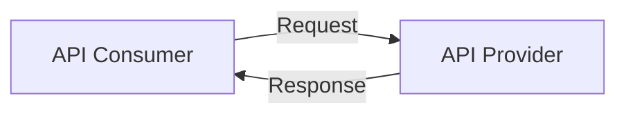
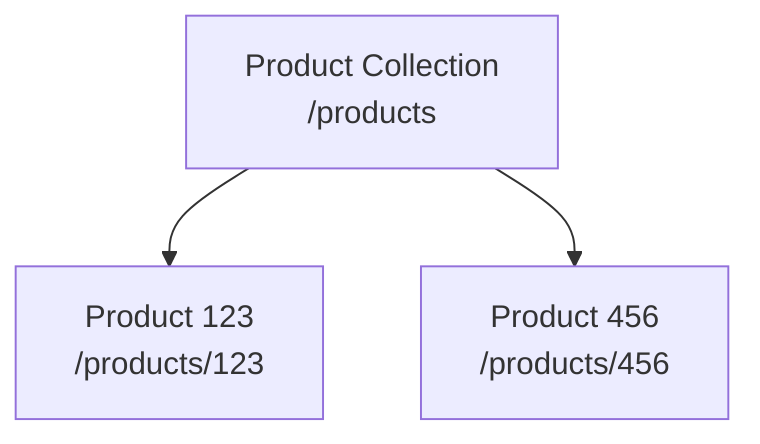
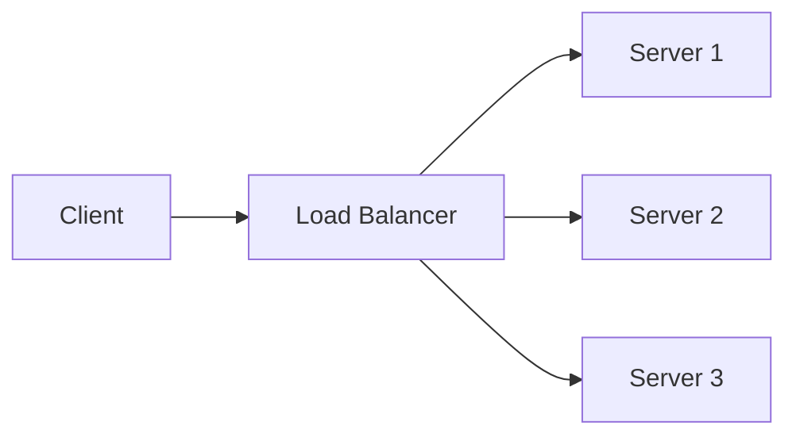
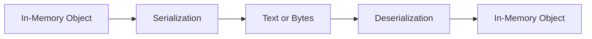
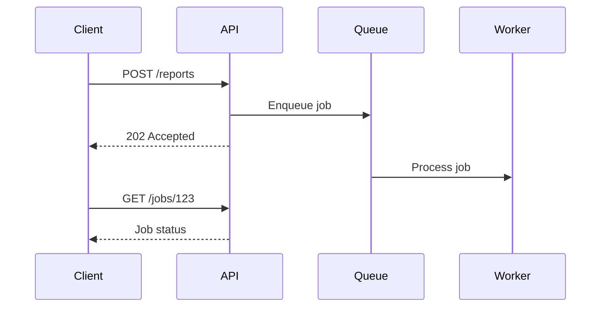
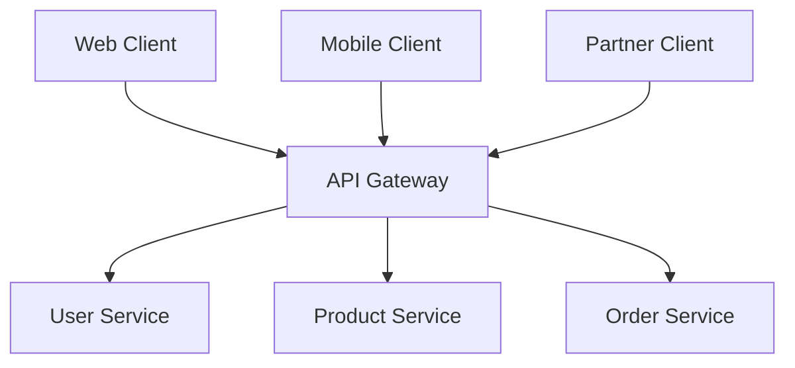
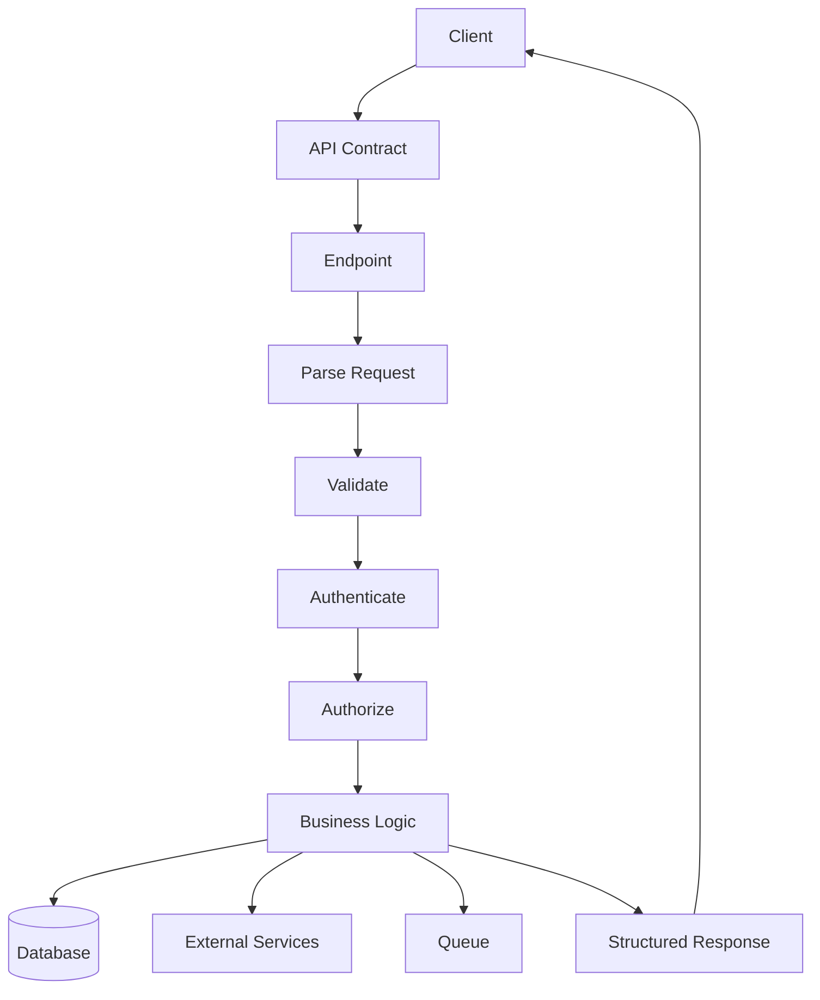

# Student Notes — Part 4  
## REST, GraphQL, RPC, Serialization, API Contracts, and Service Boundaries

---

# 1. Core Idea

An API is a defined interface through which software systems communicate.



The API creates a boundary between:

```text
Client
Backend
Database
External services
```

The client should not need to know:

```text
Which database is used
How tables are structured
How business rules are implemented
Which programming language runs the server
Which private services are called
```

It needs to understand the API contract.

---

# 2. API Consumer and Provider

## Provider

The system that exposes data or capabilities.

Examples:

```text
Store backend
Payment provider
Email provider
Cloud storage service
Search service
```

## Consumer

The system that calls the API.

Examples:

```text
Browser frontend
Mobile app
Desktop client
Another backend
Command-line tool
Partner integration
```

---

# 3. API Contract

An API contract defines expected communication.

It may specify:

```text
Endpoint paths
HTTP methods
Path parameters
Query parameters
Headers
Authentication
Request body
Response body
Status codes
Error formats
Pagination
Rate limits
Versioning
Idempotency
```

Example:

```text
POST /api/orders

Authentication:
  Required

Request:
  {
    "items": [
      {
        "productId": 123,
        "quantity": 2
      }
    ]
  }

Success:
  201 Created

Errors:
  401 Authentication required
  409 Inventory conflict
  422 Validation failure
```

---

# 4. REST

REST stands for:

```text
Representational State Transfer
```

REST is an architectural style for distributed systems.

It commonly uses:

```text
Resources
Resource URLs
HTTP methods
Representations
Stateless requests
Cacheable responses
```

Typical REST API:

```http
GET    /products
GET    /products/123
POST   /products
PATCH  /products/123
DELETE /products/123
```

---

# 5. Resources

A resource is something the API represents or manages.

Examples:

```text
User
Product
Order
Article
Comment
Message
Payment
Subscription
```

Resource collection:

```text
/products
```

Individual resource:

```text
/products/123
```



---

# 6. Resources vs Representations

A resource is the conceptual thing.

A representation is the format used to transfer information about it.

Product resource:

```text
Product 123
```

JSON representation:

```json
{
  "id": 123,
  "name": "Keyboard",
  "price": 79.99
}
```

HTML representation:

```html
<article>
  <h1>Keyboard</h1>
  <p>$79.99</p>
</article>
```

XML representation:

```xml
<product>
  <id>123</id>
  <name>Keyboard</name>
  <price>79.99</price>
</product>
```

---

# 7. CRUD Mapping

CRUD means:

```text
Create
Read
Update
Delete
```

Common mapping:

| Operation | Method | Example |
|---|---|---|
| Create | `POST` | `POST /products` |
| Read collection | `GET` | `GET /products` |
| Read item | `GET` | `GET /products/123` |
| Replace | `PUT` | `PUT /products/123` |
| Partial update | `PATCH` | `PATCH /products/123` |
| Delete | `DELETE` | `DELETE /products/123` |

Not every domain operation is simple CRUD.

Examples:

```text
Cancel order
Approve invoice
Calculate shipping
Generate report
Reserve inventory
```

These may require explicit action or workflow modeling.

---

# 8. Resource-Oriented URLs

Common convention:

```text
URLs use nouns.
HTTP methods express operations.
```

Prefer:

```http
POST /orders
```

over:

```http
POST /create-order
```

Prefer:

```http
DELETE /users/42
```

over:

```http
POST /delete-user?id=42
```

Action-oriented routes can still be appropriate:

```http
POST /orders/9001/cancellation
POST /invoices/42/approval
```

---

# 9. Path Parameters

Path parameters identify resources.

```text
/products/123
```

Here:

```text
123 = Product ID
```

Another example:

```text
/users/42/orders/9001
```

```text
User ID:
  42

Order ID:
  9001
```

The server must still validate and authorize access.

---

# 10. Query Parameters

Query parameters modify collection requests.

Example:

```text
/products?category=keyboards&sort=price&page=2
```

Possible meanings:

```text
category = keyboards
sort = price
page = 2
```

Use queries for:

```text
Filtering
Sorting
Searching
Pagination
Optional behavior
```

Do not place secrets in query strings.

---

# 11. Statelessness

Statelessness means each request contains the information needed for the server to process it.

It does not mean:

```text
The application cannot store data.
```

The application may still store:

```text
Users
Orders
Sessions
Products
Preferences
```

Stateless request handling helps load balancing:



Any healthy server can process a request when necessary context is available through the request or shared storage.

---

# 12. Idempotency

An operation is idempotent when repeating it creates the same intended final state.

Generally idempotent:

```text
GET
PUT
DELETE
```

`POST` is often not automatically idempotent.

Example risk:

```text
POST /orders
```

Request times out after creating an order.

Client retries.

Result:

```text
Two orders may be created.
```

Use:

```http
Idempotency-Key: order-attempt-123
```

The server stores the result for that logical operation and returns it again on retry.

---

# 13. Pagination

Do not return unlimited collections.

Page-based:

```http
GET /products?page=2&limit=20
```

Offset-based:

```http
GET /products?offset=20&limit=20
```

Cursor-based:

```http
GET /products?limit=20&after=cursor_abc
```

Cursor pagination is often more stable for changing datasets.

Example response:

```json
{
  "items": [],
  "nextCursor": "cursor_def",
  "hasMore": true
}
```

---

# 14. Filtering, Sorting, and Searching

## Filtering

```http
GET /orders?status=pending
```

## Sorting

```http
GET /products?sort=price&order=asc
```

## Searching

```http
GET /products?q=mechanical+keyboard
```

The backend should whitelist:

```text
Allowed filter fields
Allowed sort fields
Maximum query length
Maximum page size
```

Do not pass arbitrary client values directly into database expressions.

---

# 15. API Errors

A consistent error shape helps clients.

Example:

```json
{
  "error": {
    "code": "VALIDATION_FAILED",
    "message": "One or more fields are invalid.",
    "fields": {
      "email": "Enter a valid email address.",
      "quantity": "Must be greater than zero."
    },
    "requestId": "req_abc123"
  }
}
```

Do not expose:

```text
Stack traces
Database passwords
Internal paths
Private hostnames
SQL statements
Tokens
```

Detailed information belongs in protected logs.

---

# 16. Authentication and Authorization

APIs may use:

```text
Session cookies
Bearer tokens
API keys
OAuth
OpenID Connect
Mutual TLS
Signed requests
```

Authentication:

```text
Who is the caller?
```

Authorization:

```text
What may the caller do?
```

For:

```http
GET /orders/9001
```

the server must check:

```text
Is the caller authenticated?
Does the caller own order 9001?
Does the caller have administrative access?
```

---

# 17. Rate Limiting

Rate limiting restricts request frequency.

It helps protect:

```text
Login
Password reset
Search
File uploads
Reports
Public APIs
Webhook endpoints
```

Response:

```http
HTTP/1.1 429 Too Many Requests
Retry-After: 60
```

Clients should:

```text
Respect Retry-After
Use backoff
Avoid rapid retries
Avoid duplicate operations
```

---

# 18. API Versioning

APIs change over time.

Common strategies:

## URL versioning

```text
/api/v1/products
/api/v2/products
```

## Header versioning

```http
Accept: application/vnd.example.v2+json
```

## Query versioning

```text
/api/products?version=2
```

Breaking changes include:

```text
Removing a field
Renaming a field
Changing a field type
Changing null behavior
Changing pagination semantics
```

Safer changes include:

```text
Adding optional response fields
Adding new endpoints
Adding optional request fields
```

---

# 19. GraphQL

GraphQL is a query language and runtime.

A common endpoint:

```text
POST /graphql
```

The client specifies fields:

```graphql
query {
  product(id: "123") {
    id
    name
    price
  }
}
```

Response:

```json
{
  "data": {
    "product": {
      "id": "123",
      "name": "Keyboard",
      "price": 79.99
    }
  }
}
```

GraphQL can reduce:

```text
Over-fetching
Under-fetching
Multiple related requests
```

---

# 20. GraphQL Schema

A schema defines available operations and types.

```graphql
type Product {
  id: ID!
  name: String!
  price: Float!
  available: Boolean!
}

type Query {
  product(id: ID!): Product
}
```

The schema provides:

```text
Types
Fields
Arguments
Queries
Mutations
Subscriptions
Relationships
```

---

# 21. GraphQL Mutations and Errors

Mutation:

```graphql
mutation {
  createOrder(productId: "123", quantity: 2) {
    order {
      id
      status
    }
  }
}
```

GraphQL may return HTTP `200` with errors:

```json
{
  "data": {
    "product": null
  },
  "errors": [
    {
      "message": "Product not found",
      "path": ["product"]
    }
  ]
}
```

Clients must inspect:

```text
HTTP status
data
errors
```

---

# 22. GraphQL Risks

GraphQL can introduce:

```text
Deeply nested expensive queries
Resolver performance problems
Complex authorization
Difficult HTTP caching
Query abuse
```

Controls include:

```text
Query depth limits
Complexity limits
Pagination
Timeouts
Rate limiting
Resolver batching
Field-level authorization
```

---

# 23. RPC

RPC stands for:

```text
Remote Procedure Call
```

RPC models communication as invoking remote actions.

Examples:

```text
createOrder()
calculateShipping()
approveInvoice()
transcodeVideo()
```

Example JSON-RPC request:

```json
{
  "jsonrpc": "2.0",
  "method": "calculateShipping",
  "params": {
    "country": "CA",
    "postalCode": "A1A1A1"
  },
  "id": 1
}
```

---

# 24. gRPC

gRPC is a strongly typed RPC framework.

It commonly uses:

```text
HTTP/2
Protocol Buffers
Generated clients
Generated server interfaces
Streaming
Binary serialization
```

A service definition might describe:

```text
OrderService
  CreateOrder
  GetOrder
  CancelOrder
```

gRPC is often useful for internal service-to-service communication.

---

# 25. REST vs GraphQL vs RPC

| Concern | REST | GraphQL | RPC |
|---|---|---|---|
| Main abstraction | Resources | Data graph | Procedures |
| Typical endpoint style | Many resource URLs | Often one endpoint | Method or action endpoints |
| Client-selected fields | Limited | Strong | Usually procedure-defined |
| HTTP caching | Often straightforward | More specialized | Implementation-dependent |
| Public API friendliness | High | High with tooling | Variable |
| Internal service performance | Good | Good | Often strong |
| Query complexity | Endpoint-defined | Query-defined | Procedure-defined |
| Generated clients | Optional | Optional | Common in gRPC |

No style is universally best.

---

# 26. Serialization

Serialization converts in-memory data into text or bytes.



Common formats:

```text
JSON
XML
Protocol Buffers
MessagePack
Form encoding
Multipart form data
Raw binary
```

---

# 27. JSON

JSON is:

```text
Readable
Widely supported
Common in web APIs
Easy to inspect
```

Example:

```json
{
  "id": 123,
  "name": "Keyboard",
  "price": 79.99,
  "available": true,
  "tags": ["office", "mechanical"]
}
```

JSON limitations:

```text
No native date type
No native binary type
No exact decimal type
No functions
No undefined value
```

---

# 28. XML, Multipart, and Binary Formats

## XML

Useful for:

```text
Enterprise integrations
Document structures
SOAP systems
Schemas and namespaces
```

## Multipart form data

Useful for:

```text
Files plus text fields
Image uploads
Document uploads
```

## Binary formats

Examples:

```text
Protocol Buffers
MessagePack
CBOR
```

Benefits:

```text
Compact
Efficient
Strongly typed in some formats
```

Tradeoff:

```text
Less human-readable
More tooling required
```

---

# 29. Synchronous and Asynchronous APIs

## Synchronous

The client waits for the immediate result.

```text
Client → Request
Server → Work
Server → Response
```

## Asynchronous

The server accepts work and completes it later.



Good asynchronous candidates:

```text
Large reports
Video processing
Email campaigns
File conversion
Bulk imports
```

---

# 30. API Gateway

An API gateway can provide:

```text
One public entry point
Routing
Authentication
Rate limiting
TLS termination
Logging
Versioning
Response aggregation
Request transformation
```



Risks:

```text
Bottleneck
Centralized failure
Configuration complexity
Authorization mistakes
Harder debugging
```

---

# 31. API Design Checklist

```text
[ ] Resources are clearly identified.
[ ] Collections and individual items are distinct.
[ ] Methods communicate intent.
[ ] Path and query parameters are appropriate.
[ ] Request bodies have schemas.
[ ] Response bodies have schemas.
[ ] Errors are consistent.
[ ] Authentication is documented.
[ ] Authorization is documented.
[ ] Pagination is defined.
[ ] Filtering and sorting are defined.
[ ] Rate limits are considered.
[ ] Idempotency is considered.
[ ] Versioning is considered.
[ ] Sensitive fields are excluded.
[ ] Caching behavior is documented.
```

---

# 32. Recall Questions

Answer from memory:

```text
1. What is an API?
2. What is the difference between a consumer and provider?
3. What is REST?
4. What is a resource?
5. What is a representation?
6. What is CRUD?
7. What does GET mean?
8. What does POST mean?
9. What does PATCH mean?
10. What is statelessness?
11. What is idempotency?
12. Why are idempotency keys useful?
13. What is pagination?
14. What are path parameters?
15. What are query parameters?
16. What is GraphQL?
17. What is a GraphQL schema?
18. What is RPC?
19. What is gRPC?
20. What is serialization?
21. Why use multipart form data?
22. What is an API gateway?
23. What is a synchronous operation?
24. What is an asynchronous operation?
25. Why should APIs not expose database tables automatically?
```

---

# 33. Personal Notes

## My own definition of an API

```text
____________________________________________________________
____________________________________________________________
```

## My own definition of REST

```text
____________________________________________________________
____________________________________________________________
```

## My own definition of GraphQL

```text
____________________________________________________________
____________________________________________________________
```

## My own definition of RPC

```text
____________________________________________________________
____________________________________________________________
```

## The API paradigm I understand best

```text
____________________________________________________________
```

## The API paradigm I need to review

```text
____________________________________________________________
```

## My own resource-oriented endpoint

```text
____________________________________________________________
```

## My own API error response

```json
{
}
```

## A question I still have

```text
____________________________________________________________
```

---

# 34. Quick Reference Table

| Concept | Core idea |
|---|---|
| API | Software communication interface |
| Consumer | System that calls an API |
| Provider | System that exposes an API |
| REST | Resource-oriented API style |
| Resource | Thing represented or managed |
| Representation | Transfer format for a resource |
| CRUD | Create, Read, Update, Delete |
| Statelessness | Each request has required context |
| Idempotency | Repeating gives same intended final state |
| Pagination | Divide collections into smaller responses |
| Filtering | Select subset of records |
| Sorting | Order records |
| GraphQL | Client-selected typed data graph |
| Schema | Defines GraphQL types and operations |
| RPC | Remote procedure calls |
| gRPC | Strongly typed RPC framework |
| Serialization | Convert values to text or bytes |
| JSON | Common text data format |
| XML | Verbose structured document format |
| Multipart | Files plus fields |
| API gateway | Central traffic entry and policy layer |
| Queue | Holds asynchronous work |
| Worker | Processes queued work |

---

# 35. Final Mental Model



An API should make communication:

```text
Explicit
Predictable
Documented
Secure
Testable
Versionable
```

---

# Completion Standard

These notes are complete when you can:

```text
Define an API.
Identify consumers and providers.
Model resources.
Design REST endpoints.
Choose HTTP methods.
Use path and query parameters.
Design request and response schemas.
Design consistent errors.
Plan pagination and filtering.
Explain authentication and authorization.
Explain statelessness.
Explain idempotency.
Compare REST, GraphQL, and RPC.
Choose serialization formats.
Design asynchronous operations.
Explain API gateways.
Plan API versioning.
```

Use these notes to review Part 4 before completing:

```text
Workbook 4 — API Contract and Paradigm Design
Part 4 quiz
HTTP and API test
API debugging scenario
```
