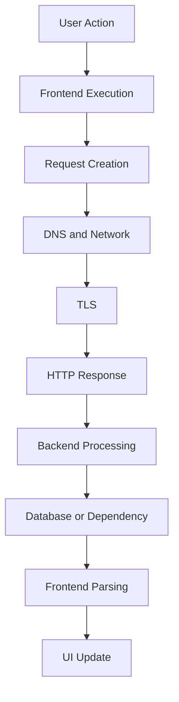
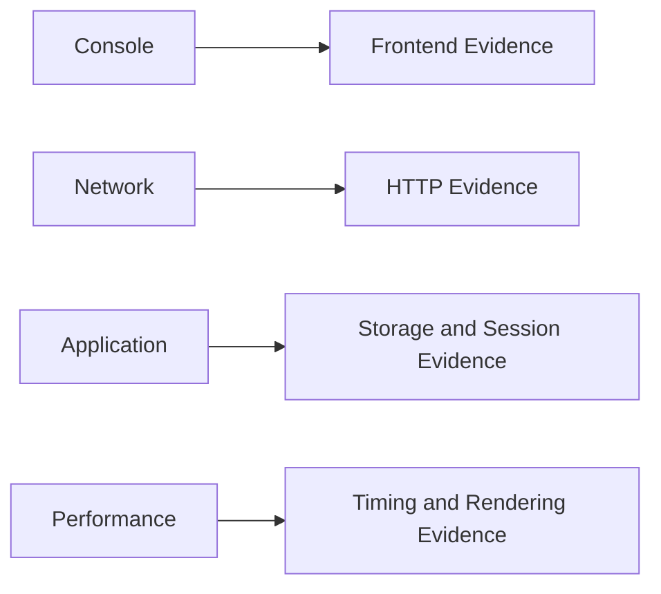
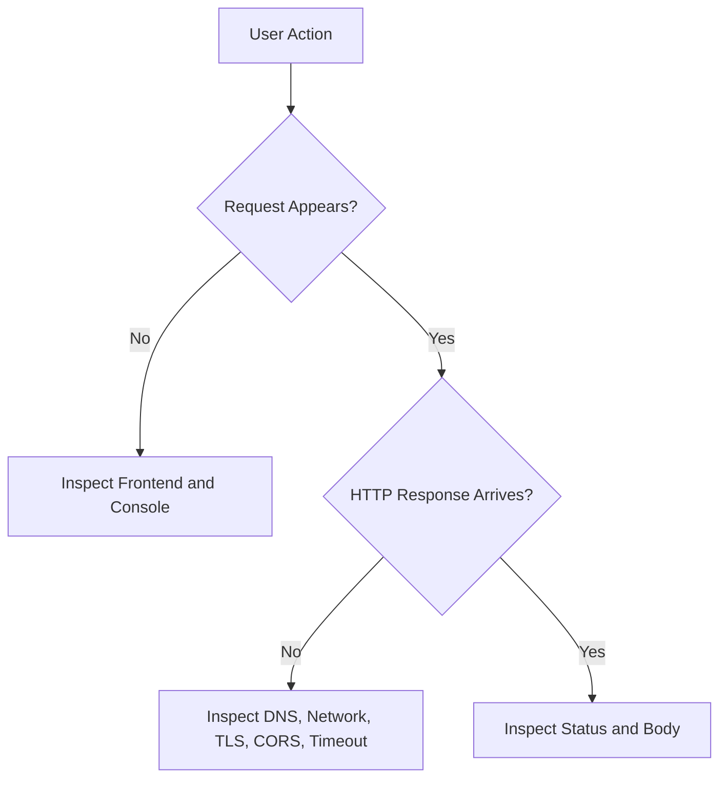
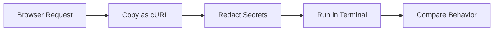
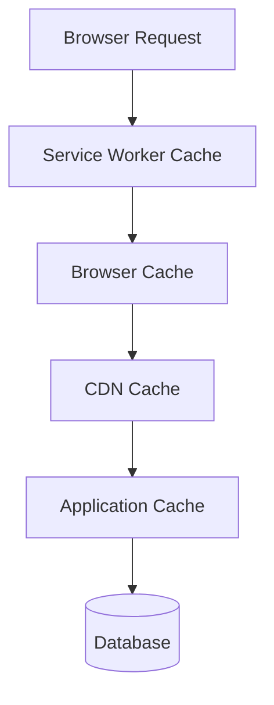
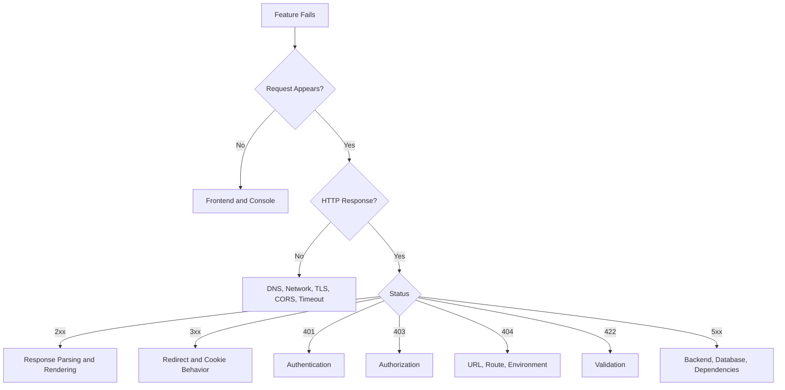
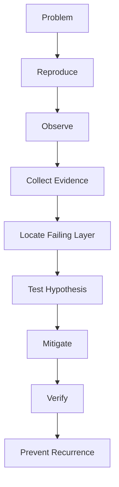

# Student Notes — Part 5  
## Network Inspection and Diagnostic Workflows

---

# 1. Core Idea

Web debugging should begin with evidence.

Instead of asking:

```text
What code should I change?
```

Ask:

```text
What actually happened?
Which layer failed?
What evidence proves it?
What should I test next?
```

The general diagnostic flow is:



A failure can occur at any stage.

---

# 2. Browser Developer Tools

Important panels:

```text
Console:
  JavaScript errors and browser warnings

Network:
  Requests, responses, headers, bodies, timing

Elements:
  DOM and CSS

Sources:
  JavaScript debugging and breakpoints

Application:
  Cookies, storage, service workers, cache

Security:
  HTTPS and certificate information

Performance:
  Browser execution and rendering timeline
```

Use panels together.



---

# 3. The Network Panel

The Network panel shows resources requested by the browser.

Common types:

```text
Document
Fetch/XHR
JavaScript
CSS
Images
Fonts
Media
WebSockets
```

For API debugging, begin with:

```text
Fetch/XHR
```

Useful columns:

```text
Name
Status
Method
Domain
Type
Initiator
Size
Time
Waterfall
```

---

# 4. Preserve Log and Disable Cache

## Preserve log

Useful for:

```text
Redirects
Login flows
Navigation
Form submissions
Page transitions
```

It keeps requests visible after navigation.

## Disable cache

Useful for testing:

```text
Fresh resources
Deployment changes
Cache headers
Stale assets
```

It changes browser behavior while Developer Tools are open, so compare with normal caching afterward.

---

# 5. The First Diagnostic Question

When a feature fails, ask:

```text
Did a request appear?
```



## No request

Likely causes:

```text
JavaScript exception
Event handler missing
Wrong selector
Validation returned early
Button disabled
Form behavior
```

## Request appears

Continue by inspecting:

```text
URL
Method
Headers
Payload
Status
Response
Timing
```

---

# 6. Console Errors

Common messages:

## JavaScript exception

```text
TypeError: Cannot read properties of undefined
```

Likely causes:

```text
Unexpected data
Missing initialization
Wrong property name
Frontend state problem
```

## Network error

```text
Failed to fetch
```

Possible causes:

```text
DNS
Connection
TLS
CORS
Offline state
Timeout
```

## CORS error

```text
Blocked by CORS policy
```

Inspect:

```text
Origin
Preflight
Allowed origin
Allowed methods
Allowed headers
Credentials
```

## JSON parsing error

```text
Unexpected token < in JSON
```

Often means:

```text
The client expected JSON but received HTML.
```

---

# 7. Request Inspection

For the selected request, inspect:

```text
Request URL
Request method
Query parameters
Request headers
Cookies
Authorization
Request payload
Initiator
```

Questions:

```text
Is the host correct?
Is the environment correct?
Is the method correct?
Is authentication present?
Is the content type correct?
Is the body correct?
```

---

# 8. Response Inspection

Inspect:

```text
Status code
Response headers
Content-Type
Response body
Cache behavior
Set-Cookie
Location
Request ID
```

A `200` response still requires body inspection.

Possible problems:

```text
Expected JSON but received HTML
Expected items but received results
Expected object but received array
Expected data but received an error object
```

---

# 9. Status-Code Diagnosis

| Status | Usually means |
|---:|---|
| `200` | Success |
| `201` | Resource created |
| `202` | Accepted for asynchronous processing |
| `204` | Success with no body |
| `301`, `302`, `307`, `308` | Redirect |
| `304` | Reuse cached representation |
| `400` | Malformed request |
| `401` | Authentication problem |
| `403` | Authorization problem |
| `404` | Route or resource not found |
| `409` | State conflict |
| `422` | Validation failure |
| `429` | Rate limit |
| `500` | Internal server failure |
| `502` | Bad upstream response |
| `503` | Service unavailable |
| `504` | Upstream timeout |

---

# 10. Network Error vs HTTP Error

## Network error

No usable HTTP response arrived.

Examples:

```text
DNS failure
Connection refused
Timeout
TLS failure
Offline device
CORS or browser blocking
```

## HTTP error

A valid HTTP response arrived with an error status.

Examples:

```text
400
401
403
404
422
500
503
```

A `404` generally means the server was reached.

---

# 11. Timing Information

A request timing panel may include:

```text
Queueing
Stalled
DNS lookup
Initial connection
TLS
Request sent
Waiting for response
Content download
```


## High DNS time

Possible causes:

```text
Cold DNS cache
Slow resolver
Network problem
Many third-party domains
```

## High connection time

Possible causes:

```text
Routing
Distance
Congestion
Server availability
Firewall
```

## High TLS time

Possible causes:

```text
New connection
Distance
Certificate chain
Protocol negotiation
```

## High TTFB

Possible causes:

```text
Slow backend
Database query
Cache miss
External service
Server queue
Cold start
```

## Long download

Possible causes:

```text
Large response
Large image
Missing compression
Slow bandwidth
```

---

# 12. Waterfall Analysis

The waterfall shows request timing and overlap.

Look for:

```text
Serial requests
Long gaps
Large files
Slow third-party resources
Repeated requests
Late API requests
Blocking JavaScript
```

Example:

```text
HTML       |████████
CSS          |███
JavaScript  |████████
API                |██████████
Image                 |█████
```

Ask:

```text
What is blocking the first useful content?
What can load in parallel?
What can be deferred?
```

---

# 13. Initiators

The initiator identifies what caused a request.

Possible initiators:

```text
HTML
CSS
JavaScript
User interaction
Another request
Service worker
Preload
```

Repeated requests may indicate:

```text
Render loop
Polling loop
Retry loop
Repeated event listener
Service worker behavior
Multiple tabs
```

---

# 14. cURL

cURL allows requests to be reproduced from the terminal.

Basic request:

```bash
curl https://example.com
```

Include response headers:

```bash
curl -i https://example.com
```

Verbose diagnostics:

```bash
curl -v https://example.com
```

Follow redirects:

```bash
curl -L http://example.com
```

Request JSON:

```bash
curl \
  -X POST \
  -H "Content-Type: application/json" \
  -d '{"name":"Alex"}' \
  https://api.example.com/users
```

---

# 15. Copy as cURL

Browser workflow:

```text
Open Network
Select request
Right-click
Copy
Copy as cURL
Redact secrets
Run in terminal
Compare results
```



If cURL fails too:

```text
Likely API, server, authentication, data, or infrastructure issue.
```

If cURL succeeds but browser fails:

```text
Likely CORS, cookies, service worker, browser policy, or frontend issue.
```

---

# 16. Browser vs cURL Differences

Compare:

```text
URL
Method
Query parameters
Headers
Cookies
Authorization
Origin
Content-Type
Body
Redirect behavior
Environment
```

Browsers may apply:

```text
CORS
Cookie policies
Service workers
Browser cache
Mixed-content rules
Credential rules
```

cURL generally does not enforce those browser policies.

---

# 17. CORS Diagnosis

For cross-origin requests, inspect:

```http
Origin
Access-Control-Allow-Origin
Access-Control-Allow-Methods
Access-Control-Allow-Headers
Access-Control-Allow-Credentials
```

A browser may first send:

```http
OPTIONS /api/orders
Origin: https://app.example.com
Access-Control-Request-Method: POST
```

The server must respond with appropriate permission headers.

CORS controls browser response access.

It does not replace:

```text
Authentication
Authorization
Server-side validation
```

---

# 18. Authentication Diagnosis

For `401`, inspect:

```text
Cookie
Authorization header
Login response
Set-Cookie
Token expiration
Cookie domain
Cookie path
Secure
SameSite
credentials mode
Environment
```

For `403`, inspect:

```text
Role
Resource ownership
Organization membership
Subscription
Account status
```

Remember:

```text
401 = Authentication
403 = Authorization
```

---

# 19. Redirect Diagnosis

Inspect:

```text
Status code
Location header
Redirect chain
Cookies
Authentication
Protocol
Host
```

A loop may look like:

```text
/account → /login → /account → /login
```

Possible causes:

```text
Session cookie not stored
Cookie not sent
Wrong cookie domain
SameSite issue
HTTPS detection problem
Reverse proxy configuration
```

---

# 20. Cache Diagnosis

Possible cache layers:



Inspect:

```text
Cache-Control
ETag
Last-Modified
Age
X-Cache
Service worker
Cache Storage
```

If content is stale:

```text
Disable cache
Clear site data
Unregister service worker
Check CDN cache
Check application invalidation
Verify database data
```

---

# 21. Environment Mismatch

Check:

```text
Frontend host
API host
Protocol
Port
API base URL
Cookie domain
CORS origin
Authentication provider
Database
Feature flags
```

Common problem:

```text
Frontend production build
  → staging API
```

The full Request URL is often the fastest clue.

---

# 22. Server-Side Evidence

If the request reaches the backend, collect:

```text
Request ID
Application logs
Database logs
Query timing
External service timing
Recent deployments
Configuration
```

A useful log:

```json
{
  "requestId": "req_abc123",
  "method": "POST",
  "path": "/api/orders",
  "status": 500,
  "durationMs": 820,
  "errorCode": "DATABASE_TIMEOUT"
}
```

Never log:

```text
Passwords
Bearer tokens
Session IDs
Private keys
Full payment details
```

---

# 23. Troubleshooting Report

Use this structure:

```text
Symptom:
  What the user sees.

Expected behavior:
  What should happen.

Reproduction:
  Exact steps.

Evidence:
  Console, Network, headers, body, timing, logs.

Earliest failed layer:
  First stage that did not behave correctly.

Hypothesis:
  Most likely cause.

Test:
  What evidence would confirm or reject it?

Mitigation:
  Focused immediate fix.

Verification:
  How the fix will be checked.

Prevention:
  Test, alert, runbook, or design improvement.
```

---

# 24. Decision Tree



---

# 25. Common Diagnostic Mistakes

```text
Changing code before observing the request
Looking only at the Console
Ignoring the response body
Ignoring timing
Treating 404 as a network failure
Treating 401 as a permission failure
Retrying payments blindly
Sharing raw credentials
Disabling TLS verification permanently
Ignoring service workers
Ignoring environment configuration
Changing multiple layers simultaneously
Failing to verify the fix
```

---

# 26. Recall Questions

Answer from memory:

```text
1. What does the Network panel show?
2. What does the Console show?
3. Why use both?
4. What does Preserve log do?
5. What is an initiator?
6. What is TTFB?
7. What does a waterfall show?
8. What does Copy as cURL provide?
9. Why might cURL succeed while browser JavaScript fails?
10. What does 401 mean?
11. What does 403 mean?
12. What does 404 mean?
13. What does 500 mean?
14. What does CORS control?
15. What could cause a redirect loop?
16. What cache layers can serve stale content?
17. What does a request ID help with?
18. What should be redacted from diagnostic evidence?
19. What does high TTFB suggest?
20. What is the first failed layer?
```

---

# 27. Personal Notes

## My own debugging workflow

```text
____________________________________________________________
____________________________________________________________
____________________________________________________________
```

## The diagnostic tool I understand best

```text
____________________________________________________________
```

## The diagnostic tool I need to practice

```text
____________________________________________________________
```

## A failure I can now diagnose

```text
____________________________________________________________
```

## Evidence I should always collect

```text
____________________________________________________________
____________________________________________________________
```

## A common troubleshooting mistake I will avoid

```text
____________________________________________________________
```

## My own troubleshooting example

```text
____________________________________________________________
____________________________________________________________
____________________________________________________________
```

---

# 28. Quick Reference Table

| Observation | Likely investigation |
|---|---|
| No request | Frontend and Console |
| Request failed with no status | DNS, network, TLS, CORS, timeout |
| `200` but UI wrong | Response parsing or rendering |
| `401` | Authentication |
| `403` | Authorization |
| `404` | URL, route, resource, environment |
| `409` | State conflict |
| `422` | Validation |
| `429` | Rate limiting |
| `500` | Backend or dependency |
| `502` | Gateway or upstream |
| `503` | Service availability |
| `504` | Upstream timeout |
| High DNS | Resolver or network |
| High TTFB | Backend, database, cache, dependency |
| Long download | Large payload or bandwidth |
| Stale content | Browser, CDN, application, or service-worker cache |
| Repeated requests | Loop, retry, polling, or duplicate handler |
| Browser differs from cURL | CORS, cookies, service worker, browser policy |

---

# 29. Final Mental Model



The essential diagnostic sequence is:

```text
Observe the user action.
Check whether a request exists.
Inspect the request.
Inspect the response.
Measure timing.
Check browser policies.
Check authentication.
Check server logs.
Check databases and dependencies.
Identify the earliest failure.
Apply a focused fix.
Verify and prevent recurrence.
```

---

# Completion Standard

These notes are complete when you can:

```text
Use Developer Tools.
Inspect requests and responses.
Interpret status codes.
Read headers and payloads.
Analyze timing.
Use cURL.
Diagnose CORS.
Diagnose authentication.
Investigate redirects.
Investigate stale caches.
Identify environment mismatches.
Use request IDs and logs.
Separate frontend, network, backend, and database problems.
Write a structured troubleshooting report.
```

Use these notes to review Part 5 before completing:

```text
Workbook 5 — Network Inspection and Diagnostic Workflows
Part 5 quiz
Foundation test
API debugging scenario
Authentication-failure scenario
Slow-page-load scenario
Request-tracing scenario
```
