# Student Notes — Part 6  
## Performance, Reliability, Security, and Production Delivery

---

# 1. Core Idea

A web application is not production-ready merely because it works on one computer.

A production-ready application must be prepared for:

```text
Real users
Real traffic
Slow networks
Invalid requests
Security threats
Dependency failures
Deployments
Data loss
Operational incidents
```

The production goal is:

```text
Fast enough
Secure enough
Reliable enough
Observable
Recoverable
Maintainable
```

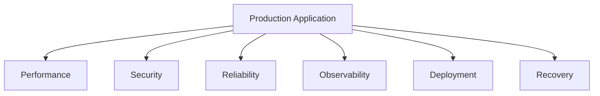

---

# 2. Performance

Performance is not one number.

It includes:

```text
DNS time
Connection time
TLS time
Server processing
Database time
Response size
JavaScript execution
Rendering
Interaction responsiveness
```

A complete performance path:

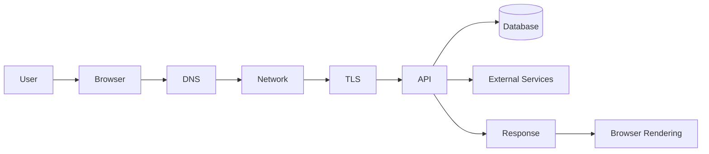

---

# 3. Perceived Performance

Users experience:

```text
How quickly content appears
How quickly buttons respond
Whether the page feels frozen
Whether loading is explained
Whether content shifts
```

A technically fast API may still feel slow if:

```text
The page displays a blank screen.
Large JavaScript blocks interaction.
The application waits for noncritical content.
No loading state is shown.
```

A good interface provides:

```text
Loading state
Success state
Empty state
Error state
Retry option
```

---

# 4. Critical Rendering Path

A browser commonly performs:

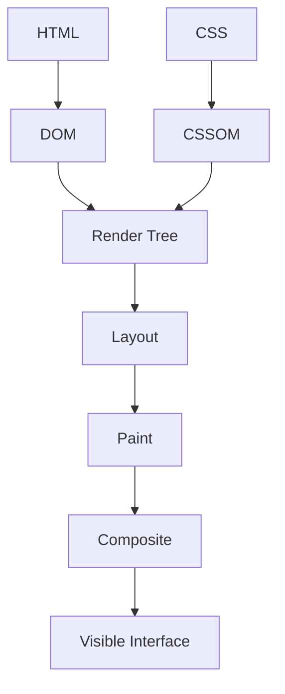

Performance problems can come from:

```text
Large HTML
Blocking CSS
Large JavaScript
Slow fonts
Large images
Complex layouts
Long JavaScript tasks
```

---

# 5. Frontend Performance

Important strategies:

```text
Code splitting
Lazy loading
Tree shaking
Removing unused dependencies
Image optimization
Responsive images
Font optimization
Compression
Smaller DOM
Virtualized lists
Deferred analytics
```

## Code splitting

Split application code into smaller bundles.

```text
Initial bundle
Product bundle
Dashboard bundle
Admin bundle
Reports bundle
```

Users load features when needed.

## Lazy loading

Delay noncritical work:

```text
Below-the-fold images
Maps
Chat widgets
Reports
Comments
Large editors
```

---

# 6. Images and Fonts

Images can dominate page size.

Optimize:

```text
Dimensions
Format
Compression
Quality
Loading priority
Responsive variants
```

Include dimensions to reduce layout shifts:

```html

```

Fonts affect:

```text
First rendering
Text visibility
Layout stability
Page weight
```

Use:

```text
Fewer font families
Fewer font weights
Efficient formats
Subsetting
Appropriate loading rules
```

---

# 7. Performance Metrics

Common metrics:

```text
FCP:
  First Contentful Paint

LCP:
  Largest Contentful Paint

CLS:
  Cumulative Layout Shift

INP:
  Interaction to Next Paint

TTFB:
  Time to First Byte

P95:
  Time below which 95% of requests complete

P99:
  Time below which 99% of requests complete
```

These measure different aspects of user experience and system performance.

---

# 8. Caching

A cache stores reusable data for faster access.

Cache layers:

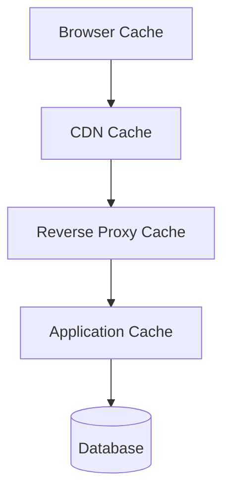

## Browser cache

Stores:

```text
CSS
JavaScript
Images
Fonts
HTML
```

## CDN cache

Stores public content near users.

## Application cache

Stores frequently requested data.

## Database cache

Databases may cache pages and indexes internally.

---

# 9. Cache Hits and Misses

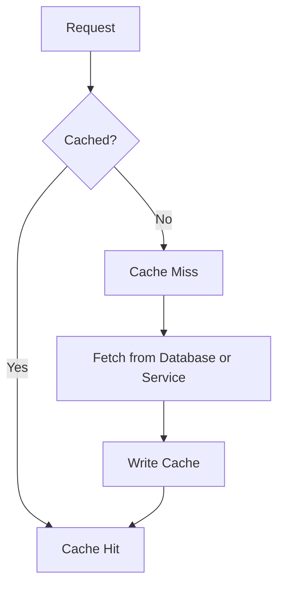

## Cache hit

```text
Fast response
Less backend work
Less database load
```

## Cache miss

```text
More processing
Database or service access
Potentially higher latency
```

---

# 10. Cache Invalidation

Cache invalidation removes or updates stale data.

Strategies:

```text
Time-based expiration
Explicit invalidation
Versioned cache keys
Stale-while-revalidate
Event-based invalidation
```

The central problem is:

> How can data be reused quickly without becoming incorrectly stale?

Important data such as checkout price and inventory should be revalidated by the backend.

---

# 11. Public and Private Caching

Usually suitable for shared caching:

```text
Public CSS
Public JavaScript
Public images
Public documentation
Public product images
```

Requires caution:

```text
Account pages
Private messages
Payment data
Personalized dashboards
User-specific reports
```

Incorrect public caching can expose one user’s data to another.

---

# 12. Database Performance

Database bottlenecks may result from:

```text
Missing indexes
Full table scans
Large joins
N+1 queries
Large result sets
Long transactions
Lock contention
Connection-pool exhaustion
Database overload
```

Investigate using:

```text
Query plans
Slow-query logs
Database metrics
Rows examined
Rows returned
Index usage
Lock information
```

---

# 13. Indexes

Indexes help databases find records more efficiently.

Example concept:

```text
Query:
  Find products by category.

Without index:
  Scan many or all rows.

With index:
  Use an organized lookup structure.
```

Indexes have costs:

```text
Additional storage
Slower writes
Maintenance
Possibly poor usefulness
```

Create indexes based on actual query patterns.

---

# 14. N+1 Queries

An N+1 problem occurs when an application performs:

```text
One query for a collection
One additional query for each item
```

Example:

```text
1 query:
  Load 100 orders

100 queries:
  Load items for each order
```

Possible solutions:

```text
Joins
Batch queries
Eager loading
Data loaders
Aggregation
Caching
```

---

# 15. Connection Pools

Connection pools reuse database connections.

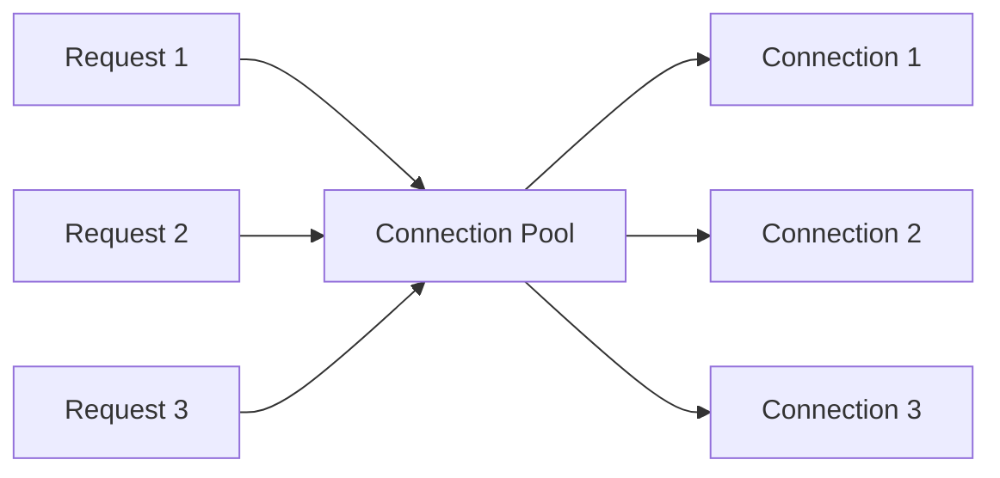

Too few connections:

```text
Requests wait.
```

Too many connections:

```text
Database becomes overloaded.
```

Monitor:

```text
Pool size
Active connections
Idle connections
Wait time
Connection errors
```

---

# 16. API Performance

API performance depends on:

```text
Authentication
Validation
Business logic
Cache lookup
Database queries
External services
Serialization
Response size
```

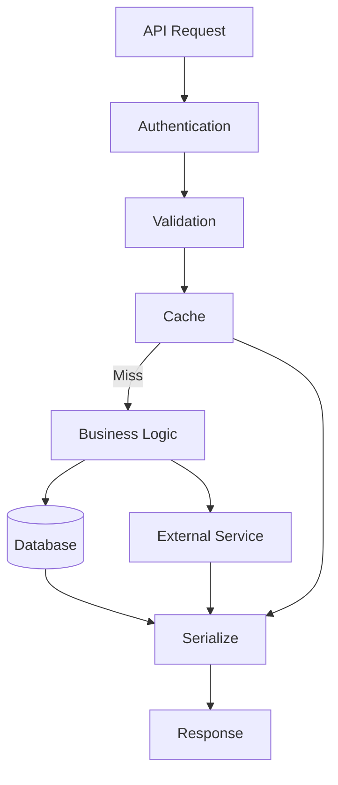

Improve API performance through:

```text
Pagination
Field selection
Compression
Caching
Query optimization
Asynchronous work
Response-size limits
```

---

# 17. Timeouts

A timeout limits how long the system waits for an operation.

Use timeouts for:

```text
Database
Payment provider
Email provider
Search service
Storage service
Internal API
```

Without timeouts, requests may wait indefinitely and consume resources.

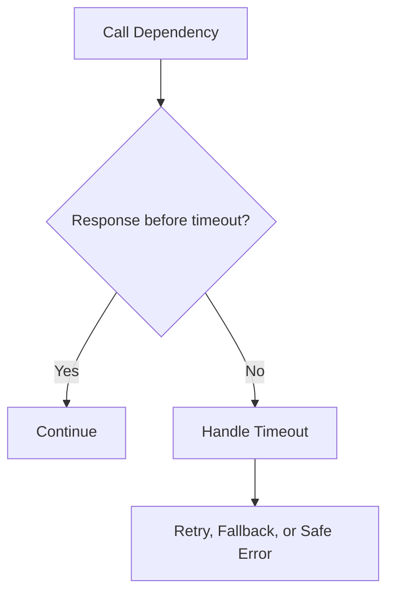

---

# 18. Retries

Retries help with temporary failures.

A retry policy should define:

```text
Which errors are retryable
Maximum attempts
Delay between attempts
Exponential backoff
Jitter
Idempotency requirements
Final failure behavior
```

Unlimited immediate retries are dangerous because they can create a retry storm.

Do not retry payments or order creation blindly.

---

# 19. Circuit Breakers

A circuit breaker stops repeated calls to a failing dependency.

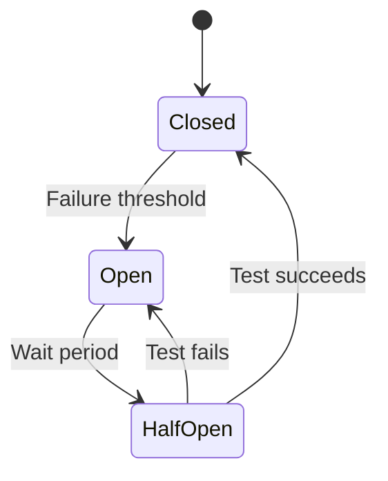

## Closed

Requests flow normally.

## Open

Calls are blocked or fail quickly.

## Half-open

A small number of test calls determine whether recovery occurred.

---

# 20. Graceful Degradation

Optional features should not unnecessarily disable core functionality.

Examples:

```text
Recommendation service fails:
  Show no recommendations.

Analytics fails:
  Continue the application.

Email fails:
  Queue the notification.

Avatar service fails:
  Show a default avatar.

Search service fails:
  Use a simpler fallback or explain temporary unavailability.
```

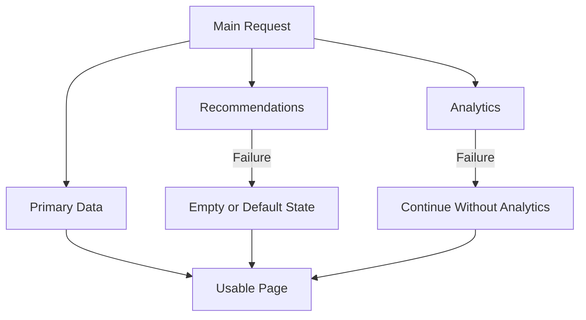

---

# 21. Availability and Redundancy

Availability describes whether a service can be used when needed.

Redundancy provides alternatives when a component fails.

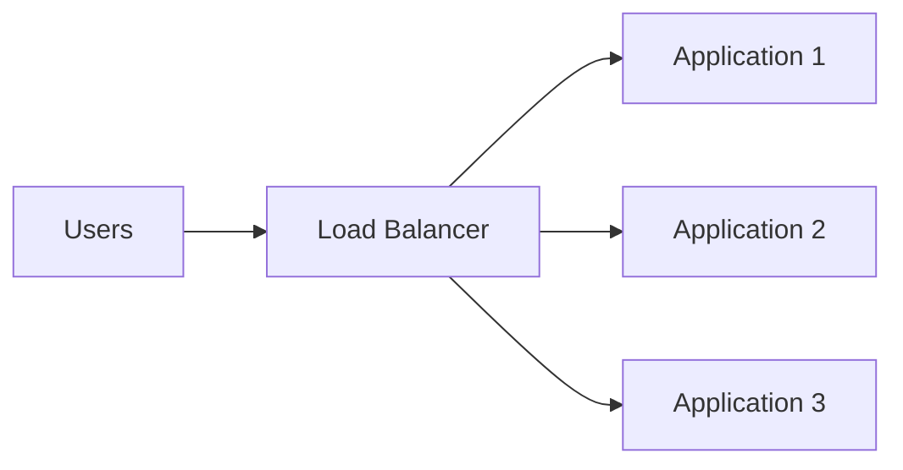

If one application server fails, healthy instances can continue serving requests.

Redundancy may also apply to:

```text
Databases
Network links
Storage
DNS
Data centers
Workers
Power systems
```

Failover must be tested.

---

# 22. Backups and Recovery

Backups protect against:

```text
Hardware failure
Accidental deletion
Data corruption
Bad migrations
Ransomware
Operator mistakes
```

A backup strategy should be:

```text
Automated
Encrypted
Separate from production
Retained
Monitored
Restore-tested
```

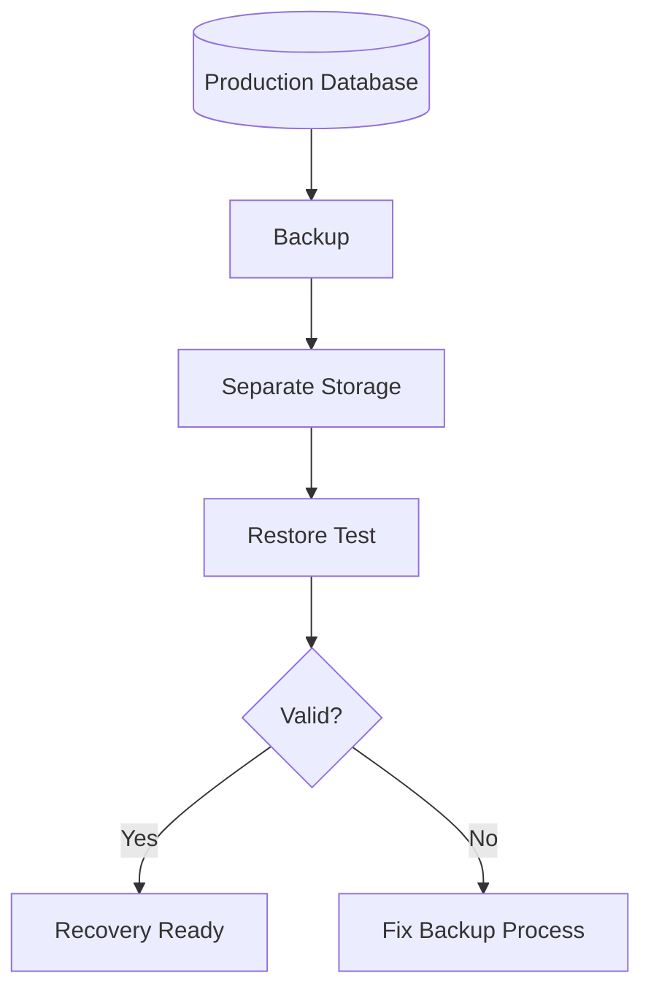

---

# 23. RPO and RTO

## RPO

Recovery Point Objective:

```text
How much recent data can be lost?
```

Example:

```text
RPO = 15 minutes
```

The organization may accept losing up to 15 minutes of recent changes.

## RTO

Recovery Time Objective:

```text
How long can recovery take?
```

Example:

```text
RTO = 1 hour
```

The service should be restored within one hour.

---

# 24. Security Layers

Security requires multiple controls:

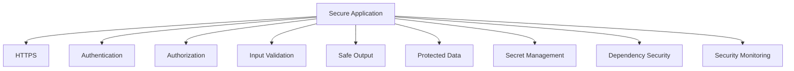

Important controls:

```text
HTTPS
Password hashing
MFA
Server-side authorization
Input validation
Parameterized queries
Output encoding
CSRF protection
Secure cookies
File-upload validation
Rate limiting
Least privilege
Redacted logs
```

---

# 25. Secrets Management

Secrets include:

```text
Database passwords
API keys
Payment secrets
Signing keys
Encryption keys
Cloud credentials
Webhook secrets
Private certificates
```

Never place secrets in:

```text
Frontend bundles
Public repositories
URLs
Screenshots
Logs
Container images
```

Use protected configuration or a secret-management system.

If a secret is exposed:

```text
Revoke or rotate it.
Investigate use.
Replace it securely.
Review history and logs.
Improve prevention.
```

---

# 26. Authentication and Authorization

Authentication:

```text
Who is the caller?
```

Authorization:

```text
What may the caller do?
```

The backend must check:

```text
Identity
Role
Resource ownership
Organization
Subscription
Account state
```

The frontend may hide controls, but the backend must enforce permissions.

---

# 27. Input and Output Security

External input includes:

```text
Query parameters
Path parameters
JSON bodies
Cookies
Headers
File uploads
Webhooks
Third-party responses
```

Validate:

```text
Type
Length
Format
Range
Required values
Allowed values
Relationships
Authorization context
```

When displaying untrusted content, use context-appropriate output encoding.

---

# 28. Observability

## Logs

Detailed events:

```text
Request received
Order created
Authentication failed
Database timeout
```

## Metrics

Numerical measurements:

```text
Request rate
Error rate
Latency
CPU
Memory
Queue depth
Cache hit rate
Database connections
```

## Traces

Follow a request through services:

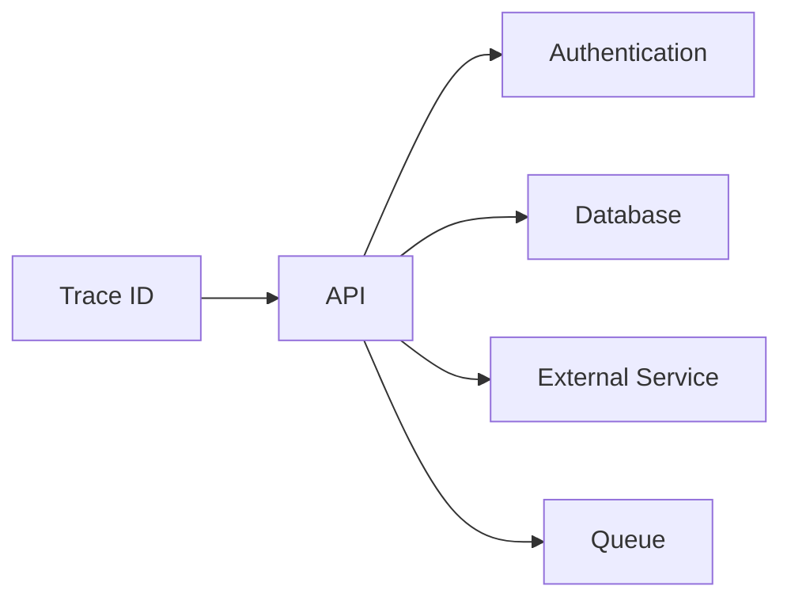

Useful fields:

```text
Request ID
Trace ID
Endpoint
Status
Duration
Error category
Safe user or resource ID
```

Do not log tokens or passwords.

---

# 29. Health and Readiness

## Liveness

Answers:

```text
Is the process running?
```

## Readiness

Answers:

```text
Can the process safely receive traffic?
```

A process may be alive but not ready because:

```text
Database unavailable
Required configuration missing
Startup unfinished
Critical dependency unavailable
```

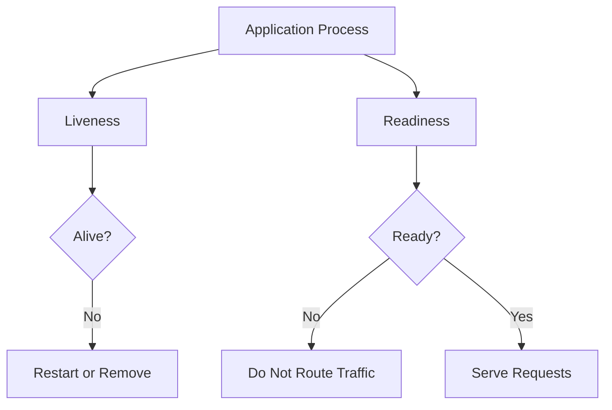

---

# 30. CI/CD

CI/CD automates:

```text
Build
Lint
Test
Security scan
Artifact creation
Staging deployment
Smoke tests
Production deployment
Monitoring
```

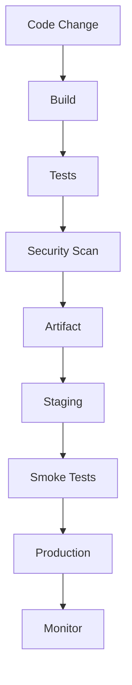

---

# 31. Deployment Strategies

## Rolling

Update instances gradually.

## Blue-green

Maintain two environments and switch traffic.

## Canary

Send a small percentage of traffic to the new release first.

| Strategy | Benefit | Tradeoff |
|---|---|---|
| Rolling | Lower replacement cost | Old and new versions coexist |
| Blue-green | Fast rollback | Requires duplicate capacity |
| Canary | Limits initial exposure | Requires good monitoring and traffic control |

---

# 32. Database Migrations

Database migrations must remain compatible during deployment.

Safer sequence:

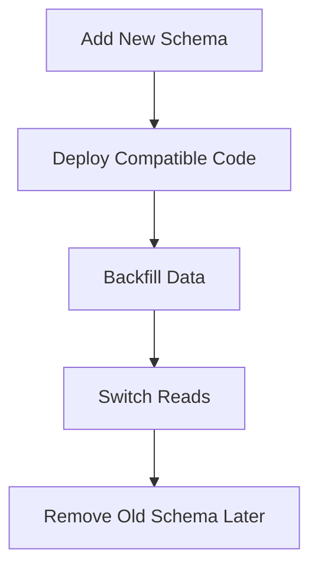

Avoid:

```text
Remove a column
  ↓
Deploy old application instances still using it
```

This can break rolling deployments.

---

# 33. Incident Response

A basic incident flow:

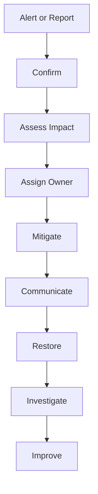

Priorities:

```text
Protect users
Reduce impact
Restore service
Preserve evidence
Find root cause
Prevent recurrence
```

Do not wait for a perfect root-cause explanation before applying a safe mitigation.

---

# 34. Recall Questions

Answer from memory:

```text
1. What does production readiness mean?
2. What is perceived performance?
3. What is the critical rendering path?
4. What is code splitting?
5. What is lazy loading?
6. What is caching?
7. What is cache invalidation?
8. What is an N+1 query?
9. What is a timeout?
10. Why are unlimited retries dangerous?
11. What is a circuit breaker?
12. What is graceful degradation?
13. What is availability?
14. What is redundancy?
15. What is a backup?
16. What are RPO and RTO?
17. What are logs, metrics, and traces?
18. What is a health check?
19. What is a readiness check?
20. What is CI/CD?
21. What is a deployment artifact?
22. What is a rollback?
23. Why must secrets remain private?
24. What happens during incident response?
25. Why should migrations be backward-compatible?
```

---

# 35. Personal Notes

## My own definition of production readiness

```text
____________________________________________________________
____________________________________________________________
```

## My biggest performance risk

```text
____________________________________________________________
```

## My biggest security risk

```text
____________________________________________________________
```

## My biggest reliability risk

```text
____________________________________________________________
```

## A dependency I would classify as optional

```text
____________________________________________________________
```

## A dependency I would classify as critical

```text
____________________________________________________________
```

## My backup and recovery plan in one sentence

```text
____________________________________________________________
```

## The metric I would monitor first

```text
____________________________________________________________
```

## My preferred deployment strategy

```text
____________________________________________________________
```

Why?

```text
____________________________________________________________
```

## A production concept I need to review

```text
____________________________________________________________
```

---

# 36. Quick Reference Table

| Concept | Core idea |
|---|---|
| Production readiness | Prepared for real users and failures |
| Performance budget | Defined limit for performance metrics |
| TTFB | Time before first response byte |
| Cache | Reusable stored data |
| Cache invalidation | Remove or update stale data |
| Index | Speeds selected database lookups |
| N+1 query | One collection query plus one query per item |
| Timeout | Maximum wait duration |
| Retry | Repeat a failed operation |
| Backoff | Increasing delay between retries |
| Circuit breaker | Stop calling failing dependency |
| Graceful degradation | Preserve core functions during optional failure |
| Availability | Service usable when needed |
| Redundancy | Additional capacity or components |
| Backup | Recoverable data copy |
| RPO | Acceptable data loss |
| RTO | Target restoration time |
| Logs | Detailed events |
| Metrics | Numerical measurements |
| Traces | Cross-service request paths |
| Liveness | Process is running |
| Readiness | Process can receive traffic |
| CI/CD | Automated build, test, and delivery |
| Artifact | Versioned build output |
| Rollback | Return to known-good release |
| Incident response | Detect, mitigate, recover, improve |

---

# 37. Final Mental Model

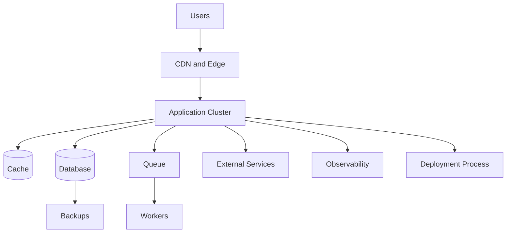

A production application must answer:

```text
How fast is it?
How secure is it?
What happens when something fails?
How do we know it is failing?
How do we recover?
How do we deploy safely?
How do we protect data?
```

---

# Completion Standard

These notes are complete when you can explain:

```text
How browser performance is measured
How API and database performance are measured
How caching helps and creates risks
How timeouts and retries work
Why circuit breakers exist
How optional dependencies degrade gracefully
How backups and recovery work
What RPO and RTO mean
How logs, metrics, and traces support operations
How health and readiness differ
How CI/CD works
How deployments are rolled out and reversed
How incidents are handled
```

Use these notes to review Part 6 before completing:

```text
Workbook 6 — Performance, Reliability, Security, and Production Planning
Part 6 quiz
Production-readiness test
Slow-page-load scenario
Production-outage scenario
```
