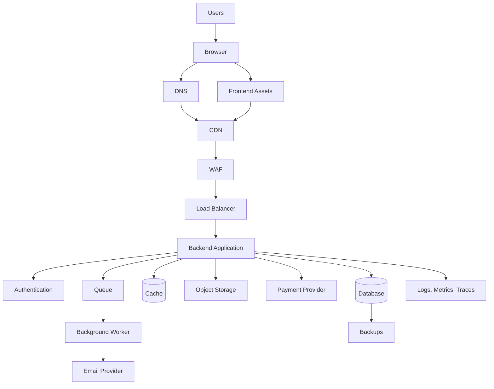
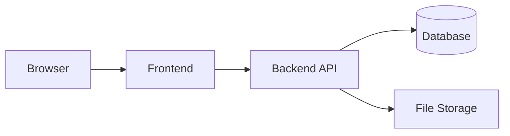
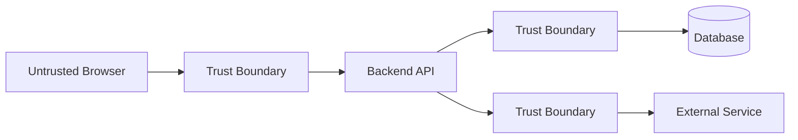
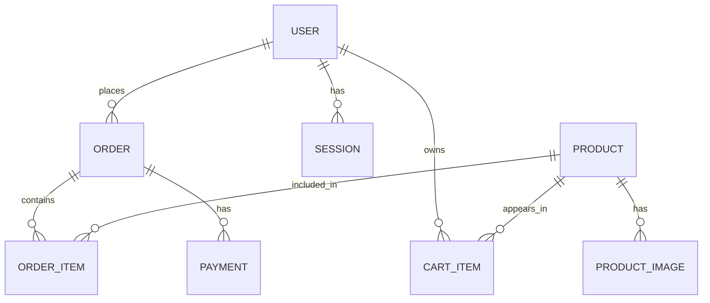
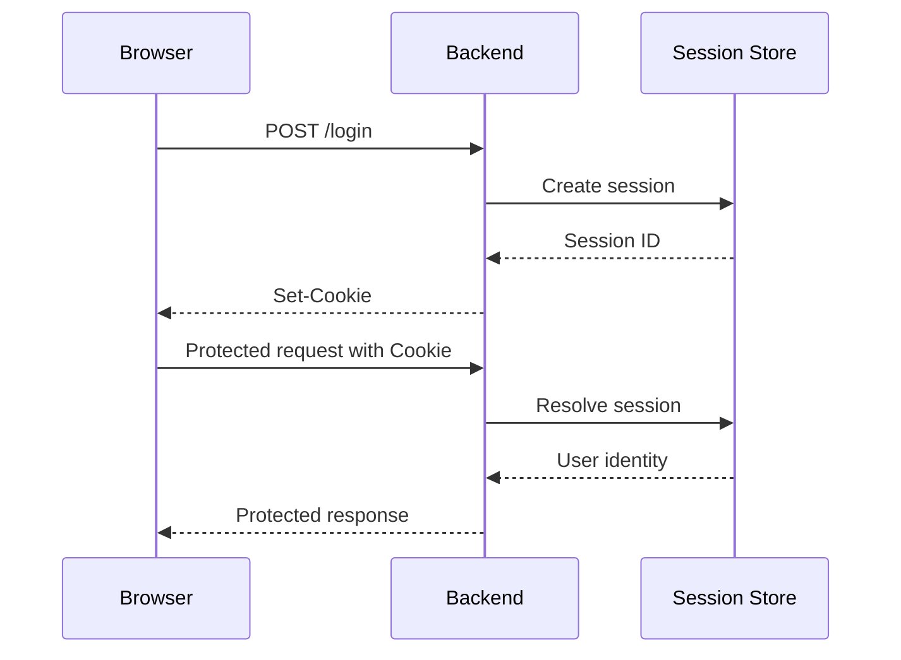
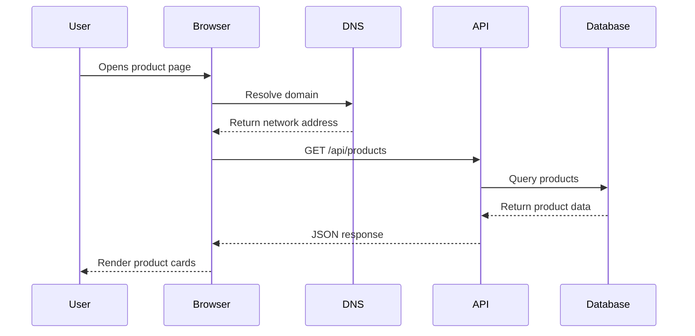
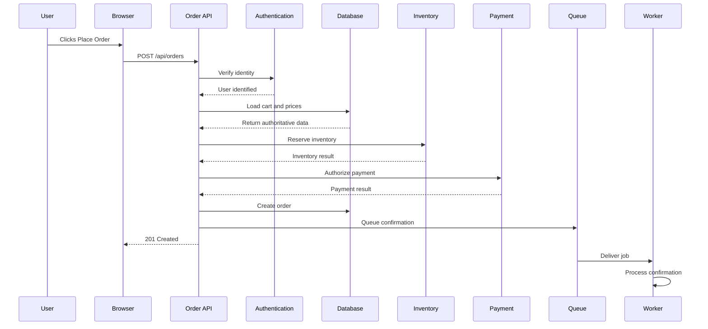
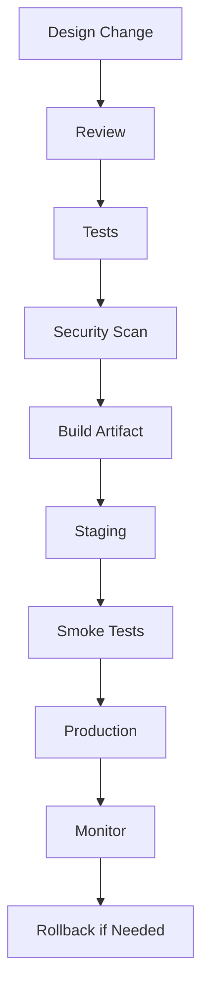
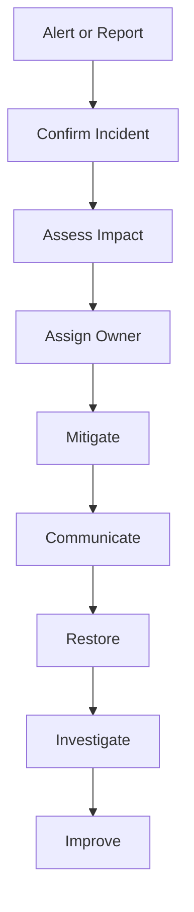
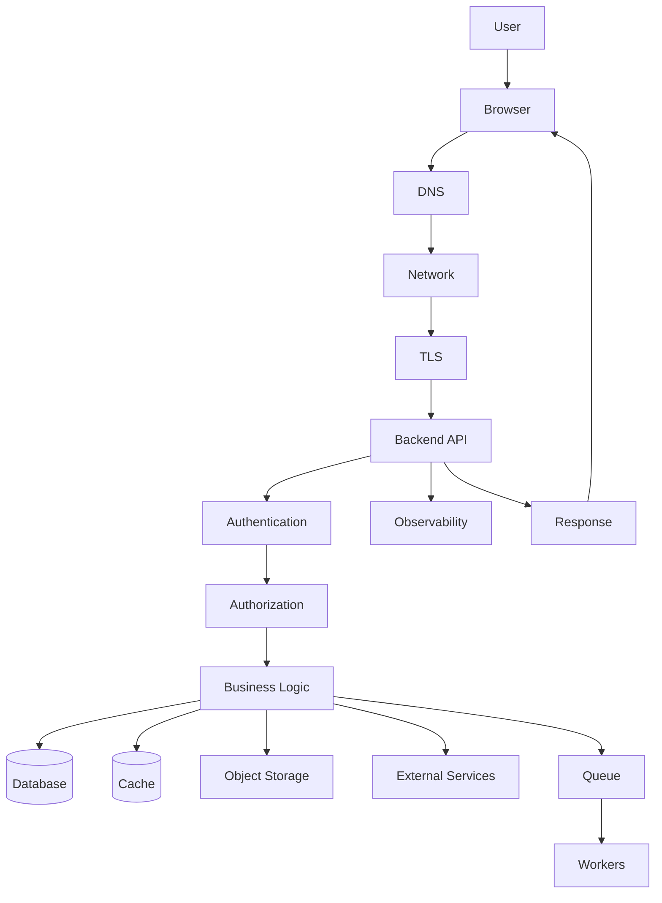

# Student Notes — Part 7  
## No-Code End-to-End Capstone: Planning, Designing, and Narrating a Web Application

---

# 1. Core Idea

The capstone is a **planning and explanation exercise**, not a programming project.

You are expected to design and narrate a web application before choosing:

```text
A programming language
A frontend framework
A backend framework
A database product
A hosting provider
A cloud platform
```

The capstone asks:

```text
What does the system do?
Who uses it?
Which components exist?
Where does each component run?
How do components communicate?
Which system owns each important value?
What can fail?
How is the application protected?
How is it monitored?
How is it recovered?
```

---

# 2. Recommended Project

Use an online store as the running capstone:

```text
Public product browsing
Product search
Customer accounts
Shopping carts
Orders
Inventory
Payments
Product images
Administrator tools
Email notifications
```

A complete high-level design may look like:



A simpler first-version design may be:



Start simple unless additional components solve a clearly identified problem.

---

# 3. Capstone Deliverables

Your final capstone should include:

```text
Project overview
Scope
Users and roles
User journeys
Functional requirements
Nonfunctional requirements
Assumptions
Architecture diagram
Component responsibilities
Trust boundaries
Data ownership
Conceptual data model
API contract
Authentication plan
Authorization plan
Request traces
Failure scenarios
Performance plan
Reliability plan
Security plan
Observability plan
Deployment concept
Backup and recovery concept
Incident-response plan
Final narration
```

---

# 4. Requirements and Scope

## Functional requirements

Describe what the system does:

```text
The system shall allow visitors to browse products.
The system shall allow customers to create accounts.
The system shall allow customers to manage carts.
The system shall allow customers to place orders.
The system shall allow administrators to manage products.
The system shall send order-confirmation notifications.
```

## Nonfunctional requirements

Describe qualities and constraints:

```text
The system shall protect private customer data.
The system shall validate requests server-side.
The system shall paginate product collections.
The system shall provide useful errors.
The system shall support backup and recovery.
The system shall record important operational events.
```

## Scope

Define:

```text
In scope
Out of scope
Assumptions
Open questions
```

A good capstone explicitly excludes unnecessary complexity.

---

# 5. Users and Roles

Common roles:

```text
Visitor
Customer
Administrator
Support staff
External provider
```

Example permissions:

| Capability | Visitor | Customer | Administrator |
|---|---:|---:|---:|
| Browse products | Yes | Yes | Yes |
| Search products | Yes | Yes | Yes |
| Manage own cart | No | Yes | Yes |
| Place order | No | Yes | Yes |
| View own orders | No | Yes | Yes |
| View all orders | No | No | Yes |
| Create products | No | No | Yes |
| Update inventory | No | No | Yes |

Authentication identifies a user.

Authorization determines whether that user may perform a particular operation.

---

# 6. User Journeys

A user journey describes an interaction from beginning to end.

## Browse products

```text
User opens the store.
Browser resolves the domain.
HTTPS connection is established.
Frontend or API requests product data.
Backend retrieves products.
Browser renders product cards.
```

## Log in

```text
User submits credentials.
Browser sends login request.
Backend verifies identity.
Backend creates a session or returns a token.
Browser stores authentication state.
Browser requests protected user data.
```

## Place an order

```text
User opens cart.
Backend returns current cart information.
User submits order.
Backend authenticates and authorizes.
Backend validates items.
Backend retrieves current prices.
Backend checks inventory.
Payment is authorized.
Order is created.
Confirmation job is queued.
Browser receives order response.
Worker sends confirmation.
```

---

# 7. Component Responsibilities

| Component | Responsibility |
|---|---|
| Browser | Run frontend code and display interface |
| Frontend | Handle interaction, UI state, and requests |
| Backend API | Validate, authorize, and apply business rules |
| Database | Store authoritative structured data |
| Cache | Store reusable copies for faster access |
| Object storage | Store images and large files |
| Authentication system | Verify identity |
| Payment provider | Process or authorize payments |
| Queue | Hold asynchronous work |
| Worker | Process queued jobs |
| CDN | Deliver cacheable content closer to users |
| Load balancer | Distribute traffic |
| Monitoring system | Collect logs, metrics, and traces |

The important question is not:

```text
Which framework is used?
```

It is:

```text
Which component owns this responsibility?
```

---

# 8. Trust Boundaries

Important boundaries include:

```text
User → Browser
Browser → Backend
Backend → Database
Backend → Payment provider
Backend → Object storage
External provider → Webhook endpoint
Development → Production
```



At each boundary, consider:

```text
Authentication
Authorization
Input validation
Encryption
Rate limiting
Logging
Failure handling
```

---

# 9. Data Ownership

Identify the source of truth for each important value.

| Data | Source of truth |
|---|---|
| Open menu | Browser |
| Search text | Browser |
| Product price | Backend/database |
| Inventory | Backend/database |
| Order status | Backend/database |
| Payment status | Payment provider plus internal record |
| Product image bytes | Object storage |
| Session validity | Session system |
| Email delivery status | Queue and worker records |

A cache is generally not the permanent source of truth.

If the browser and backend disagree about a price, the backend should determine the final checkout value.

---

# 10. Conceptual Data Model

A store may contain:

```text
Users
Products
Categories
Carts
Cart items
Orders
Order items
Payments
Product images
Sessions
```

Possible relationships:



Important design detail:

```text
Order items should preserve price at purchase time.
```

A later product-price change should not rewrite historical orders.

---

# 11. API Contract

Example product endpoint:

```http
GET /api/products?q=keyboard&category=office&page=1&limit=20
```

Example response:

```json
{
  "items": [
    {
      "id": "123",
      "name": "Mechanical Keyboard",
      "price": {
        "amount": 7999,
        "currency": "USD"
      },
      "available": true
    }
  ],
  "page": 1,
  "limit": 20,
  "total": 1
}
```

Example order endpoint:

```http
POST /api/orders
Authorization: Bearer REDACTED
Idempotency-Key: order-attempt-123
Content-Type: application/json
```

```json
{
  "items": [
    {
      "productId": "123",
      "quantity": 2
    }
  ]
}
```

Possible responses:

```text
201 Created
401 Unauthorized
403 Forbidden
409 Conflict
422 Unprocessable Content
503 Service Unavailable
```

---

# 12. Authentication and Authorization Plan

Choose a conceptual authentication method:

```text
Session cookie
Bearer access token
OAuth or OpenID Connect
```

## Session-cookie flow



## Authorization questions

```text
Can this user view this resource?
Does this user own it?
Does the role permit the operation?
Does the organization permit the operation?
Is the account active?
```

Never rely only on:

```text
Hidden buttons
Disabled controls
Client-provided roles
User IDs in request bodies
```

---

# 13. Request Trace: Browse Products



Narrate:

```text
What does the user do?
What does the browser send?
What does DNS do?
What does the API validate?
What does the database provide?
What does the browser display?
```

---

# 14. Request Trace: Place an Order



Synchronous work may include:

```text
Authentication
Inventory check
Price calculation
Payment authorization
Order creation
```

Asynchronous work may include:

```text
Email
Analytics
Report generation
Noncritical notifications
```

---

# 15. Failure Planning

## Database failure

```text
Return a safe temporary error.
Alert operators.
Avoid partial or corrupt state.
```

## Cache failure

```text
Fall back to the database if capacity permits.
Expect higher latency.
Monitor database pressure.
```

## Payment timeout

```text
Do not mark payment completed.
Use a pending or uncertain state.
Reconcile with the provider.
Use idempotency.
```

## Email failure

```text
Keep the order valid.
Retry through the queue.
Use dead-letter handling.
```

## Inventory conflict

```text
Return a conflict response.
Do not create an invalid order.
Ask the user to refresh or adjust quantity.
```

---

# 16. Performance Plan

## Browser

```text
Optimize images.
Use responsive images.
Split JavaScript.
Lazy-load noncritical features.
Show loading states.
```

## Network

```text
Use HTTPS.
Compress text.
Use a CDN for public assets.
Limit unnecessary third-party resources.
```

## API

```text
Paginate collections.
Limit response fields.
Cache safe public data.
Move long work to queues.
```

## Database

```text
Use indexes.
Analyze query plans.
Avoid N+1 queries.
Limit result sizes.
```

Performance should be measured with:

```text
P95 latency
TTFB
Page rendering metrics
Database query time
Cache hit rate
Error rate
```

---

# 17. Security Plan

Address:

```text
HTTPS
Password hashing
Session or token protection
Server-side authorization
Resource ownership
Input validation
Parameterized queries
Output encoding
CSRF
XSS
File-upload validation
Rate limiting
Secret management
Private database access
Log redaction
```

Sensitive data may include:

```text
Passwords
Session IDs
Access tokens
Payment records
Private messages
Personal information
Internal notes
```

---

# 18. Observability Plan

## Logs

Record:

```text
Request ID
Trace ID
Endpoint
Method
Status
Duration
Error code
Safe user/resource identifier
```

## Metrics

Monitor:

```text
Request rate
Error rate
P95 and P99 latency
Database query time
Cache hit rate
Queue depth
Worker failure rate
Authentication failures
Payment failures
```

## Traces

Trace:

```text
Request
Authentication
Database
Payment
Inventory
Queue
Worker
Notification
```

---

# 19. Deployment Concept



Include:

```text
Development
Testing
Staging
Production
Configuration
Secrets
Migrations
Health checks
Smoke tests
Monitoring
Rollback
```

A deployment should be traceable to a known versioned artifact.

---

# 20. Backup and Recovery

Define:

```text
What is backed up?
How frequently?
Where are backups stored?
Who can access them?
How are restores tested?
```

Also define:

```text
RPO:
  Acceptable data loss.

RTO:
  Target restoration time.
```

Example:

```text
RPO:
  15 minutes

RTO:
  1 hour
```

A backup that has never been restored is not proven reliable.

---

# 21. Incident Response



During an incident:

```text
Protect users.
Reduce impact.
Restore service.
Preserve evidence.
Communicate accurately.
Investigate after stabilization.
Add preventive controls.
```

---

# 22. Final Narration Structure

A strong final narration should follow this sequence:

```text
1. Describe the users and goals.
2. Explain what the browser does.
3. Explain how DNS and HTTPS participate.
4. Explain the frontend-backend boundary.
5. Explain API requests.
6. Explain authentication and authorization.
7. Explain data ownership.
8. Trace a critical workflow.
9. Explain external dependencies.
10. Explain asynchronous work.
11. Explain failure behavior.
12. Explain performance.
13. Explain monitoring.
14. Explain deployment.
15. Explain recovery.
16. Justify the tradeoffs.
```

---

# 23. Final Mental Model



The capstone is complete when you can narrate this system without relying on programming-language or framework names.

---

# 24. Recall Questions

Answer without looking back:

```text
1. What is the capstone’s purpose?
2. What belongs in project scope?
3. Why define assumptions?
4. What are user roles?
5. What is a trust boundary?
6. What is a source of truth?
7. What should the browser do?
8. What should the backend do?
9. What should the database do?
10. What is an API contract?
11. What happens during an order request?
12. Which order work is asynchronous?
13. What happens if payment times out?
14. What happens if email fails?
15. What should be cached?
16. What should not be publicly cached?
17. What should be monitored?
18. What should be backed up?
19. What are RPO and RTO?
20. How should the system respond to an outage?
```

---

# 25. Personal Notes

## My project in one sentence

```text
____________________________________________________________
```

## My main architecture decision

```text
____________________________________________________________
```

## My most important source of truth

```text
____________________________________________________________
```

## My most important trust boundary

```text
____________________________________________________________
```

## My most important API

```text
____________________________________________________________
```

## My most serious failure scenario

```text
____________________________________________________________
```

## My most important security control

```text
____________________________________________________________
```

## My most important performance decision

```text
____________________________________________________________
```

## My most important operational decision

```text
____________________________________________________________
```

## What I would simplify in the first version

```text
____________________________________________________________
```

## What I would change at ten times the traffic

```text
____________________________________________________________
```

---

# 26. Capstone Completion Checklist

```text
[ ] Project and scope are defined.
[ ] Users and roles are defined.
[ ] User journeys are documented.
[ ] Functional requirements exist.
[ ] Nonfunctional requirements exist.
[ ] Assumptions are recorded.
[ ] Architecture diagram is complete.
[ ] Component responsibilities are clear.
[ ] Trust boundaries are documented.
[ ] Data ownership is documented.
[ ] Conceptual data model is complete.
[ ] API contract is documented.
[ ] Authentication is explained.
[ ] Authorization is explained.
[ ] Request traces are complete.
[ ] Failure behavior is defined.
[ ] Performance plan exists.
[ ] Security plan exists.
[ ] Observability plan exists.
[ ] Deployment plan exists.
[ ] Backup and recovery plan exists.
[ ] Incident-response plan exists.
[ ] Final narration is written.
[ ] Design review is complete.
[ ] Reflection is complete.
```

---

# Completion Standard

The capstone is complete when you can explain:

```text
What the application does
Who uses it
Where the frontend runs
Where the backend runs
How DNS and HTTPS participate
How the API works
Where data is stored
Which system is authoritative
How authentication works
How permissions are enforced
What happens during critical workflows
What happens when dependencies fail
How performance is protected
How the application is monitored
How it is deployed
How it is rolled back
How it is restored
```

The central capstone question is:

> Can another person understand what should be built, how it should behave, how it should be protected, and how it should operate in production based on your design?
